# 第八章. 蛋糕之外是什么？

> **"从五彩缤纷的纸杯蛋糕到美味的甜点，发现如何挑逗消费者的味蕾！"**

在本章的第一部分，我们将展示一系列关于如何改进你的游戏的想法。其中一些部分在之前的章节中已经有所预示。为了详细解释这些部分，并展示代码，我们需要更多的时间和空间，但我们很遗憾没有这些资源。因此，你需要将这些部分视为练习。实际上，这是唯一一章中没有“作业”部分（尽管有一些明确的练习）。请随意扩展并实现你最感兴趣的部分。毕竟，没有什么能比经验、试错更能教会你了！

在本章的后面部分，我们将发现蛋糕之外的东西。事实上，游戏开发不仅限于游戏本身；还有许多围绕它构建的东西你应该考虑。这些事情可能包括团队合作、测试、营销和本地化！当然，这不是一本关于视频游戏营销的书，但它为你提供了开始超越游戏本身的起点！

最后，我必须说，你应该为自己感到骄傲，因为你已经走到了这一步！事实上，你不仅完成了一个**塔防**游戏，还学到了很多关于 Unity 的知识，而且你还在这里，站在最后一章！所以，为了保持你的动力，在继续阅读最后一章之前，去拿一块蛋糕吧。

# 增强和改进你的游戏

本节的目标是给你一个了解你游戏潜力的概念，以及一个努力的方向。毕竟，如果你已经走到这一步，你也将能够自己走路，所以我不必详细解释每一件事。

## 改进纸杯蛋糕塔

在这里，我们将关注如何通过探索一些想法和新方向来改进我们的纸杯蛋糕塔，例如射击策略或一种特殊的糖霜。

### 射击策略

回到第二章，*烘焙纸杯蛋糕塔*，我们实现了第一个射击塔附近熊猫的纸杯蛋糕塔。然而，这并不是你可以选择的唯一策略。实际上，你也可以允许玩家选择一个更适合他们策略的选项。

这些策略可能包括：

+   射击弱者/强者熊猫

+   射击健康值较低/较高的熊猫

+   射击范围内最远/最近的熊猫

+   射击第一个/最后一个进入范围的熊猫

随意添加更多并实现你自己的想法。

### 小贴士

**如何实现这些**：

在`CupcakeTowerScript`中，我们遍历所有的熊猫（实际上是碰撞体，但我们通过标签过滤它们）。我们找到了并计算了每个熊猫的距离。一些概念可以应用于前面的列表。在距离最远的熊猫的情况下，这是立即的，因为你可以有一个`max`变量，而不是`min`变量。同样，对于更弱/更强和更少/更多健康的熊猫，情况也是如此，你仍然需要一个`min`或`max`变量，但不是距离，而是从`PandaScript`中获取一些属性。在搜索第一个或最后一个进入范围的熊猫的情况下，情况要复杂一些。实际上，你需要有一个熊猫进入和退出范围的数据结构，然后从这个结构中检索要射击的熊猫。

### 特殊洒水器

在我们的游戏中，所有的洒水器都只有伤害和速度，这些可以由发射它们的蛋糕塔设置。然而，你可以有更多类型的洒水器，其中一些可以具有特殊效果。

这些效果的例子可能包括以下内容：

+   **冻结**：在一定时间内减缓敌人的概率。

+   **毒药**：有几率使熊猫中毒；这会随着时间的推移减少其健康值（通常在短时间内）。

+   **爆炸**：它们不仅会伤害它们击中的熊猫，还会伤害周围的熊猫。

+   **暴击**：即使熊猫剩余生命值不多，洒水器也有可能杀死熊猫的概率。但例如，这并不适用于 Boss，在暴击中它们只会受到双倍伤害。

随意添加您自己的内容。

### 小贴士

**如何实现这些**：

你可以通过使用继承从`ProjectileScript`类派生来创建特殊的洒水器类。这个派生类可以包含有关它们效果的一些额外数据。在`PandaScript`中，你可以在`OnTriggerEnter2D()`函数中检索熊猫被哪种洒水器击中，以便检索其信息并对其熊猫应用效果。

在爆炸效果的情况下，被击中的熊猫应该使用`Physics2D.OverlapCircleAll()`函数（如在`CupcakeTowerScript`中）来找到附近的熊猫。

此外，你可以给它们添加动画，使它们有很好的平滑动画。甚至只是一个旋转动画看起来都很棒。

### 老化和定价模型

谁说一座塔不能变老？鉴于蛋糕塔自其诞生以来一直在不断向熊猫射击，它可能会受到高利贷的影响。因此，其性能可能会随时间下降，如果玩家尝试出售它，其价值也可能下降。

你可以添加另一个交易选项来修复蛋糕塔，使其恢复正常工作。

### 小贴士

**如何实现这个**：

您可以在`CupcakeTowerScript`中实现一个协程，在固定的时间后，通过降低其统计数据来老化塔楼，最终直到它停止工作。如果您还想要实现修复功能，您需要将塔楼的原始值存储在某个地方，以便在修复选项之后恢复它们。

除了老化，还有哪些随时间动态变化的各个价格和成本？理想情况下，您可能希望为这些创建一个真正的定价模型（这需要大量的设计工作），但一旦它起作用，将会非常受欢迎。实际上，这是您在平衡游戏时需要考虑的事情之一。

### 小贴士

**如何实现**：

再次，您可以在`CupcakeTowerScript`中创建一个协程，根据塔楼（以及可能的游戏）的当前状态改变其成本。因此，当交易系统检索这些值时，它们将根据您的模型价格进行更新。

## 改进用户界面

此外，我们游戏的用户界面可以改进，例如，一个通知告诉玩家他/她还有多少波要击败。添加这类信息可能非常有用。下一步是确定在哪里？这是一个需要考虑的设计选择，因为它可能会影响我们在第三章中设计当前 UI 时达到的平衡，*与玩家沟通——用户界面*。

因此，一个好的练习就是通过考虑尽可能多的因素（包括在交易系统中显示价格和成本；在上一章中有一个关于这个的练习）来迭代整个游戏界面的设计。

### 注意

一本关于如何设计用户界面的非常好的书是 Jeff Johnson 的《Designing with the Mind in Mind》，但这只是众多书籍中的一本，所以请确保查看其他关于游戏 UI 的更具体书籍。

## 提高关卡质量

在这里，我们将关注我们可以做的事情来提高我们的关卡。至于上一节中的杯子塔，我们将探索新的想法和方向，例如增加更多关卡、敌人和要遵循的路径。

### 多级

当然，您的游戏必须包含多个关卡！我们只实现了一个关卡，但您绝对应该将您的游戏扩展到多个关卡。

在这个阶段，您能够创建自己的地图和关卡。但这里有一些提示和考虑因素，您可能会觉得有用：

+   记住静态变量是持久的。因此，当您更改场景时，它们需要用正确的值重新分配。

+   您可以通过使用`DontDestroyOnLoad()`函数（当您需要实现音乐时很有用；我们将在*音频*部分看到这一点）在场景之间使一些对象持久。

+   您必须做出设计选择，例如：玩家收集的糖在关卡之间是否保留？以及他的/她的健康状态？

### 大型地图

我们可以在游戏中实现非常大的地图，大到无法一次性在屏幕上显示。这样，我们需要实现一种方式，让用户可以移动摄像头来移动关卡（或者你也可以实现摄像头固定，其余部分移动）。

### 小贴士

**如何实现**：

附着在摄像头上的脚本可以检测玩家拖动鼠标时的情况，以便将摄像头移动到相反方向（向左拖动，摄像头向右移动）。

### 许多路径

没有什么能阻止我们创建一个地图，其中熊猫在某个点的路径会分叉或与其他路径合并。我们甚至可以有更多的繁殖点，或者有超过一种进入蛋糕的方式。

所有这些都可以通过我们的航点系统来处理。实际上，熊猫会调用`GetNextWaypoint()`函数，该函数可以返回地图中的任何航点。

因此，你可以创建许多不同的航点，它们继承自航点的父类。在分叉的情况下，你可以随机选择将熊猫发送到哪个地方。以下是一个代码片段，以供参考，当路径在两点之间分叉时：

```cs
[SerializeField] 
private Waypoint waypoint1, waypoint2; 

public override Waypoint GetNextWaypoint() { 
  if(Random.Range(0,2) == 0) { 
    return waypoint1; 
  }else { 
    return waypoint2; 
  } 
} 

```

但你真的可以实现你心中的任何想法，只要你的思考是基于航点的！你还可以让`GetNextWaypoint()`接受一些参数，比如熊猫本身，然后根据熊猫决定将熊猫发送到哪个航点！基本上，可能性很多，将航点作为单个实体来构建的结构允许我们这样做。

### 许多熊猫

我们不能只限于一种类型的熊猫！我们还可以制作绿色、红色和紫色的熊猫！每个都有不同的统计数据。例如，有些真的很慢，有很多健康值，并且会吃掉很多蛋糕。其他人真的很快，健康值低，当它们到达时，只会吃掉玩家蛋糕的一小部分。

你甚至可以考虑给他们不同的能力，并且再次你可以使用继承的概念来实现从`PandaScript`派生的其他熊猫类。然而，请记住，你还需要考虑改变繁殖系统！

### 多阶段 Boss

在不同种类的熊猫中，你可以在关卡结束时添加一个 Boss，用来击败头上戴着王冠的巨型熊猫：


Boss 的不同阶段可以用有限状态机来构建，不同的转换由其健康量或它离玩家蛋糕的远近触发。它也可能有变得非常愤怒并偏离轨道去吃一个纸杯蛋糕塔的可能性！

### 一个更好的繁殖系统

由于我们添加了这么多不同种类的熊猫，我们需要重新构建我们的繁殖系统。理想情况下，你希望找到一个解决方案，让设计师更容易在**检查器**中展示不同波次的敌人，以及每种类型的敌人数量，就像这张图片一样：

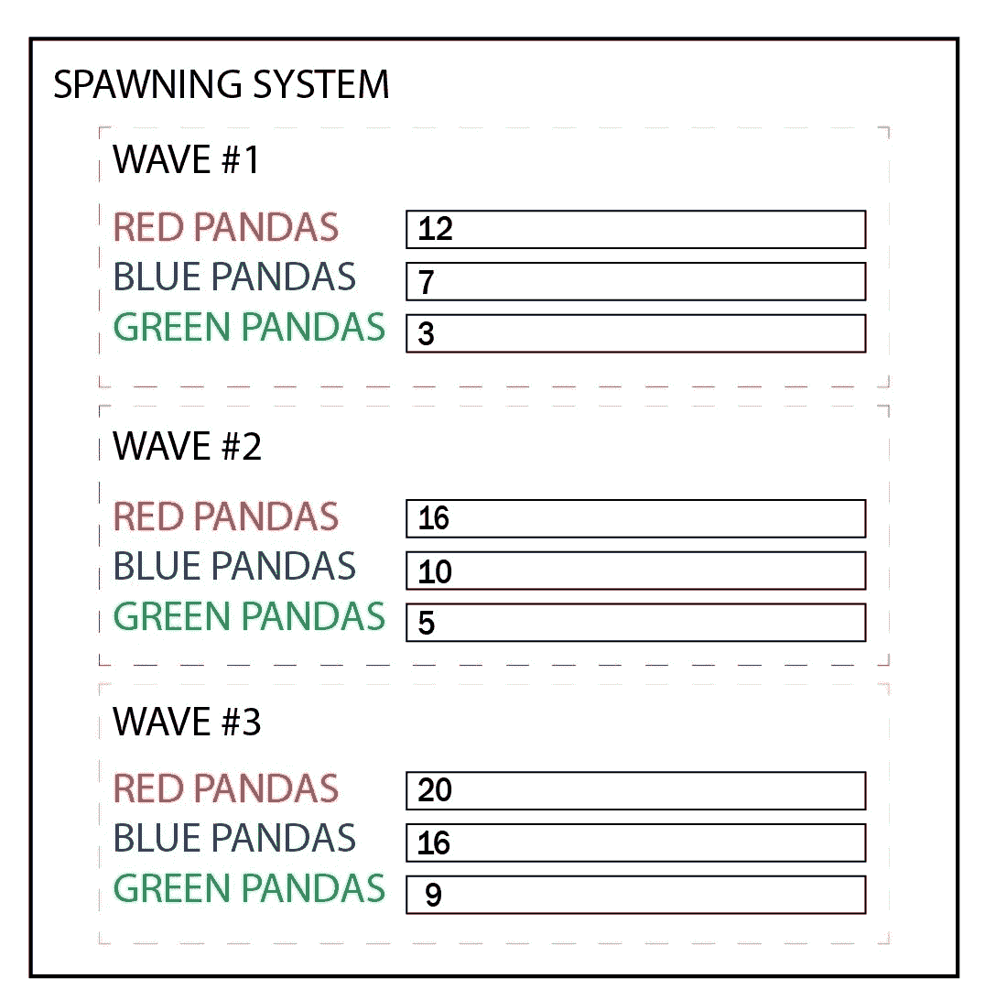

你可能想知道是否真的可以在 Unity 检查器中做到这一点。答案是肯定的；实际上，Unity 编辑器可以被扩展（我们将在本章后面看到）。

### 运行时切换难度

另一种可能使游戏适应更广泛受众的绝佳方式可能是根据玩家的表现运行时切换游戏的难度。实际上，你可能希望通过提高难度级别来保持寻求挑战的玩家参与，如果他们在游戏中相对容易地前进，或者帮助那些遇到困难的玩家。

有不同的方法可以做到这一点。最简单的一种包括基于玩家分数的 if 链，以增加或降低难度；而最复杂的一种包括自适应学习算法。

### 小贴士

**如何实现**：

无论你的方式是什么，首先要做的是将你的整个游戏链接到一个难度参数，可能是在`游戏管理器`中。每当这个参数改变时，所有依赖于它的游戏部分都会改变（参考*关于脚本间通信的更多内容*部分）。然后在另一个脚本中，你可以实现你的自适应算法，该算法通过接收游戏的不同状态，可以确定是否增加或降低难度。

# 训练和扩展你的 Unity 技能，成为一名更好的游戏开发者

在本节中，我们将提供一些关于如何提高你的 Unity 技能和整体改进任何游戏（包括这个*塔防*游戏）的想法。

## 让其他团队成员的工作更简单

当你在 Unity 中编写脚本时，你需要记住你的代码将被不同的团队成员使用（我们将在本章后面了解更多关于团队合作的内容）。因此，请记住以下几点：

+   通过文档（我们将在*团队合作*部分稍后看到）提高你代码的可读性，以便你的程序员同事。

+   在检查器中创建一个友好的界面（也可以通过使用自定义检查器；稍后我们将看到）以便设计师容易使用（一个例子是暴露事件，我们将在下一节中探讨）。

## 暴露事件

如果你正在编写一个需要与其他游戏元素交互的非常酷的脚本，你实际上可以在你的脚本中暴露你自己的事件。

实际上，你可以在你的代码中添加这个库：

```cs
using UnityEngine.Events; 

```

因此，你将能够以下述方式声明和触发事件：

```cs
*//Float variable just for test. Can be set in the Inspector.* 
public float myFloat; 

*//Declaration of the event class. It has a float as parameter to pass.* 
[System.Serializable] 
public class OnEveryFrame : UnityEvent<float> { } 

*//Declare the variable event which will be shown in the Inspector* 
public OnEveryFrame OnEveryFrameEvent; 

*//Function that is called every frame* 
void Update() { 
 * //fire the event at every frame* 
  OnEveryFrameEvent.Invoke(myFloat); 
} 

```

这就是它在**检查器**中的样子：


很酷，不是吗？

## 糖霜池

在 Unity 中实例化一个游戏对象是一个缓慢的操作；因此，每当纸杯塔射击时，就会实例化一个新的糖霜，然后从游戏中移除。

一个更好的解决方案是进行对象池化，这是一种优化技术（我们在第二章中提前提到了这一点，“烘焙纸杯蛋糕塔”）。其概念是在开始时实例化一定数量的糖霜并保持它们在屏幕之外。当一个纸杯蛋糕塔射击糖霜时，它只是从这个池中取出一个糖霜并射击。当糖霜应该被销毁时，相反，它被移回到屏幕外的池中，以便另一个塔楼可以再次拾取。

在存在许多塔楼射击的场景中，这可以显著提高你的游戏性能，尤其是如果你针对的是移动平台。

## 保存你的数据

我们还没有讨论保存游戏数据（遗憾的是我们无法在这本书中涵盖所有内容）。然而，Unity 提供了一个名为`PlayerPrefs`的类（官方文档：[`docs.unity3d.com/ScriptReference/PlayerPrefs.html`](https://docs.unity3d.com/ScriptReference/PlayerPrefs.html)），它非常适合在游戏会话之间保存一些值，例如分数。

如果你需要保存很多东西，你应该通过保存自己的文件来实现自己的解决方案。文件使用什么格式由你决定。Unity 从许多版本开始就内置了对 XML 的支持，最近 Unity 也增加了对 JSON 文件的内建支持。

最后，你还应该考虑将数据保存到云端，例如在线数据库。

## 调试

错误修复很棘手，但你有一个非常强大的盟友：控制台。不要低估这个工具的价值。这是因为它将帮助你摆脱许多困境，尽管一开始它所记录的内容可能看起来没有意义，但随着时间的推移，你会学会如何解释这些消息并快速纠正错误。

另一种使用控制台的好方法是插入调试日志。在 Unity 中，它们可以通过`Debug`类打印出来。以下是一个示例：

```cs
Debug.Log("This is a string that will be printed on the console"); 

```

将此行代码放置在战略位置可以帮助你识别错误并最终纠正它。

### 远程日志

如果你的目标是其他平台，Unity 提供了使用你的强大盟友（控制台）远程操作的可能性。例如，对于 Android 设备，你可以阅读这篇文档（它实际上允许你不仅通过 ADB 连接使用控制台，还可以使用调试器）：

[`docs.unity3d.com/Manual/AttachingMonoDevelopDebuggerToAnAndroidDevice.html`](https://docs.unity3d.com/Manual/AttachingMonoDevelopDebuggerToAnAndroidDevice.html)

否则，你可以实现自己的解决方案来显示控制台日志或查看其他人的代码。例如，你可能想看看这个免费资源：

[`www.assetstore.unity3d.com/en/#!/content/12294`](https://www.assetstore.unity3d.com/en/#!/content/12294)

### 清理发布版本

但是，你应该记得从最终版本中删除这些代码行；否则，它们会消耗你本可以用在其他方式上的计算能力。

处理调试语句的一个好方法是创建另一个类来打印调试信息。如果你包含了`Diagnostics`库，你可以定义一个条件属性，如下面的类：

```cs
using UnityEngine; 
using System.Diagnostics; *//Needed for the Conditional attribute* 

public class myDebug : MonoBehaviour { 

  [Conditional("DEBUG_MODE")] *// Conditional attribute* 
  public static void Log(string message) { 
   * //Print the message in the console* 
    UnityEngine.Debug.Log(message); 
  } 
} 

```

因此，你可以使用以下代码行，而不是之前的那个：

```cs
myDebug.Log("Hello World"); 

```

只有当你的游戏中定义了`DEBUG_MODE`属性时，这一行才会被编译。你可以通过导航到**编辑 | 项目设置 | 玩家**来检查你的游戏中存在哪些属性。在下面的屏幕截图中，你会找到定义此类属性/符号的位置，如图所示，我已经添加了`DEBUG_MODE`属性（你应该在发布游戏之前将其删除）：


### 小贴士

对于这个系统的非常棒的实现，你可以查看这个链接中的代码：[`gist.github.com/kimsama/4123043`](https://gist.github.com/kimsama/4123043)。

## 更多关于脚本间通信的内容

在上一章中，我们看到了脚本之间可以相互通信的许多方式。然而，Unity 提供了许多其他方式。其中之一是通过消息来触发函数。实际上，你可以向一个游戏对象发送消息，要求触发某个函数，如果该函数存在于该游戏对象附加的任何脚本中。

然而，这是一种从计算角度来看代价高昂的脚本间通信方法，并且只有在必要时才应该使用。

此外，Unity 提供了不止一个消息系统，每个系统都有其优点和缺点。

在任何情况下，这些系统都可以用来创建你自己的消息系统，这是一个在特定事件发生时向许多脚本广播消息的绝佳方式，例如，当你需要在运行时切换难度，许多脚本都应该知道这个变化时（参考*运行时切换难度*部分，获取更多信息）*。你可以在网上找到许多实现，例如[`wiki.unity3d.com/index.php/Advanced_CSharp_Messenger`](http://wiki.unity3d.com/index.php/Advanced_CSharp_Messenger)，但我强烈建议你创建自己的，因为这样你一定会学到更多。例如，你可以遵循这个教程：[`unity3d.com/learn/tutorials/topics/scripting/events-creating-simple-messaging-system`](https://unity3d.com/learn/tutorials/topics/scripting/events-creating-simple-messaging-system)。

## 代码文档化

当你在团队中工作时，你需要适当地注释你写的所有代码。有一些工具可以帮助你自动生成文档，但你需要付出努力来注释每一件事！

使用摘要标签可能也是值得的，我在创建塔防项目时没有使用它，以提高本书代码的可读性：[`msdn.microsoft.com/library/2d6dt3kf.aspx`](https://msdn.microsoft.com/library/2d6dt3kf.aspx)。

在任何情况下，当您编写代码时，您应该始终在性能和可读性之间保持平衡，这两者往往相互矛盾。如果文档丰富且充分，即使是最复杂的性能优化，也能使代码变得难以阅读，但仍能理解。请记住：在编写代码时保持一定的优雅性应该是您的指导原则。

## 保护您的游戏

一旦您拥有您的游戏，您可能希望保护它免受盗版和/或游戏破解。关于这一点，有大量的文献，以及关于它的不同意见。事实上，对这些系统的主要批评之一是它们使黑客和合法玩家的生活变得更加困难；游戏最终会被破解，您最终会面临不满的玩家。另一方面，相反的观点认为，从游戏产生的收入的大部分发生在发布日期的第一个月（我们谈论的是非在线游戏），因此持续一个月的保护系统已经完成了它的任务。

### 注意

在玩家和黑客中都非常受欢迎的（用于游戏的）反盗版系统之一是 Denuvo ([www.denuvo.com](http://www.denuvo.com))。尽管 Denuvo 收到了很多批评，但它阻止了许多游戏立即被破解，并为破解其他游戏提供了困难。您可以在维基百科上找到使用此系统保护的游戏列表（无论它们是否已被破解）：[`en.wikipedia.org/wiki/Denuvo`](https://en.wikipedia.org/wiki/Denuvo)。

对于最好奇的您，Denuvo 是一种反篡改系统，而不是**数字版权管理**（**DRM**）系统（它将游戏合法副本绑定到用户）。反篡改使得逆向工程 DRM 系统以绕过它变得更加困难。

然而，如果您决定为您的游戏包含某种保护措施，但没有时间开发自己的系统，您可以从资产商店购买价格低廉且有用的安全工具，例如这些：*反作弊工具包* ([www.assetstore.unity3d.com/en/#!/content/10395](http://www.assetstore.unity3d.com/en/#!/content/10395)) 或 *PlayerPrefs Elite* ([www.assetstore.unity3d.com/en/#!/content/18920](http://www.assetstore.unity3d.com/en/#!/content/18920))。

### 注意

对于更高级的保护系统（例如上述的 Denuvo），当然价格会上升，这使得独立游戏开发者难以负担其中之一。总之，在您将部分预算用于保护系统之前，仔细考虑它是否对您的游戏是必要的。

### 注意

这里有一个简短、有趣且易于理解的历史概述：[`www.youtube.com/watch?v=HjEbpMgiL7U`](https://www.youtube.com/watch?v=HjEbpMgiL7U)。

## 为多个平台构建

当你考虑在不同平台上发布你的游戏时，你应该记住你将要针对的不同平台。它们有触摸输入吗？它们支持控制器吗？基于此，你需要修改你的应用程序中的代码，以便它可以在多个平台上运行。

Unity 提供了插入一些汇编指令的可能性，以便以某种方式编译代码。例如，你可能希望在为 Android 构建游戏而不是 Windows 时以某种方式编译一小部分代码。以下是文档链接：[`docs.unity3d.com/Manual/PlatformDependentCompilation.html`](https://docs.unity3d.com/Manual/PlatformDependentCompilation.html)。

### 小贴士

在设备上进行快速原型设计时，你应该考虑一些模拟器（我们将在本章后面看到）。然而，Unity 为 Android 设备提供了一个名为 Unity Remote 的应用程序（你可以在 Play Store 中找到它：[`play.google.com/store/apps/details?id=com.unity3d.genericremote`](https://play.google.com/store/apps/details?id=com.unity3d.genericremote))，它允许你通过 USB 连接直接从 Unity 编辑器测试你的游戏。

### 输入/输出设备

玩家将如何使用你的游戏以及游戏过程中将如何使用？从游戏机到外设，有大量不同的硬件设备可以被你的游戏利用。为了帮助你入门，这里有一个基本列表，当你开发你的想法和平台选择时，你应该记住以下输入/输出设备：

+   Xbox（360、One）：

    +   Kinect

    +   控制器（有线、无线）

    +   各种外设（麦克风、DJ 控制站、吉他等）

+   PlayStation（1、2、3、4）：

    +   Move 控制器

    +   EyeToy

    +   控制器（有线、无线）

    +   各种外设（麦克风、DJ 控制站、吉他等）

+   Wii：

    +   控制器/摇杆

    +   运动传感器

    +   平衡板

    +   各种外设和附加设备（麦克风、DJ 控制站、吉他、方向盘、体育设备等）

+   Mac/PC：

    +   操作系统（OS X、Windows、Linux）

    +   显卡

    +   显卡

    +   主板

    +   声卡

    +   网络卡

    +   处理器

    +   存储空间

    +   鼠标

    +   键盘

    +   屏幕

    +   游戏手柄

    +   控制器

    +   各种其他外设（方向盘）

+   便携式设备（手机、平板）：

    +   安卓

    +   苹果

    +   Windows

+   音频设备：

    +   扬声器

    +   头戴式耳机

+   必要的网络连接：

    +   高速互联网

    +   局域网连接

    +   移动网络

    +   Wi-Fi

    +   蓝牙

+   虚拟现实（VR）头戴式设备（如 Oculus Rift 或 HTC Vive）：

    +   头部追踪

    +   触控控制器

    +   Oculus 远程控制（仅适用于 Oculus Rift）

    +   相机（仅适用于 HTC Vive）

+   Leap motion：

    +   手和手势追踪

+   脑电图（EEG）头戴式设备（如 Emotiv 头戴式设备）：

    +   脑电图（EEG）

### Unity 中的虚拟现实

Unity 的最近版本支持虚拟现实设备（如 Oculus Rift、HTC Vive 或 Samsung Gear）。

要开始在 Unity 中开发虚拟现实，你应该首先下载适当的 SDK 并安装它。然后，从顶部菜单栏选择**编辑 | 项目设置 | 玩家**。在**其他设置**下，有**支持虚拟现实**选项。一旦勾选，你可以在选项下面的菜单中检查哪些 SDK 可以用于，如下面的截图所示（在这个例子中，有 Oculus SDK）：

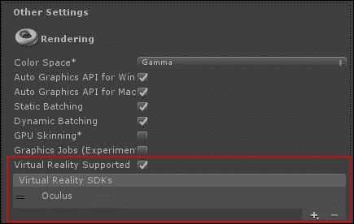

## 平衡游戏

不要忘记平衡游戏。这非常重要，可以决定你游戏的成功与否。为了正确平衡你的游戏，你需要进行大量的游戏测试（我们将在后面看到更多关于这一点的内容）。

想象一下我们正在玩一个合作游戏，我有一根魔法棒，特殊的能力和无敌状态。而你，则有一盏手电筒。除非手电筒是你所拥有的所有东西的紧凑版，不幸的是，它不是，否则这显然是不平衡的。现在，这不仅仅是在两人或多人游戏中是一个问题，在单人游戏中也是如此，AI 非常强大，只是为了击败他们，就会耗尽你的所有资源，如果你能击败他们的话。同样，当你有限的机会获得升级时，而其他玩家显然没有这个问题。

平衡游戏对于许多原因来说都很重要，因为它提供了一个公平的竞技场，并给每个人提供了赢、输和进步的机会。随着你游戏的每一次迭代和每一次后续更新（尤其是如果你改变了某些重要的事情），确保你的游戏是平衡的。对于单人和合作游戏，这将是通过游戏测试来解决的问题。对于大规模的 MMO 游戏，你可以进行游戏测试，但很可能会出现不平衡的问题，随着人们玩得时间越长，探索世界，发展并升级他们的角色，以及在世界中前进，这些问题就会显现出来。

接近游戏平衡的许多方法之一是通过成本分析的方法。在这种方法中，你可以从添加、删除和替换你游戏中不同的功能开始。例如，而不是添加一个新角色，你可以使一个现有的角色变得更强大，或者用更强大的版本替换它。所以，而不是一个*特殊巫师*，你可以用*史诗巫师*来替换它。或者，你可以完全删除*特殊巫师*，或者添加另一种类型，比如*元素巫师*。在每种情况下，他们的能力都会改变（或被删除），结果这将影响游戏的总体动态，包括其他角色将如何与之战斗。一些现实生活中的例子可以在像*Clash of Clans*和*Clash Royale*这样的游戏中找到，这些游戏定期进行调整，以平衡游戏玩法。

### 注意事项

想要进一步阅读，请查看以下链接：[`gamedesignconcepts.wordpress.com/2009/08/20/level-16-game-balance`](https://gamedesignconcepts.wordpress.com/2009/08/20/level-16-game-balance).

## 扩展 Unity 编辑器

Unity 编辑器实际上是可以扩展的。实际上，一些脚本可以使用 Unity 编辑器库来访问所有与编辑器相关的功能。你可以在这些脚本的开始处添加以下代码行来导入它：

```cs
using UnityEditor; 

```

这是一个非常强大的工具，因为你可以通过它实现自定义功能，或者为你的脚本提供简单的接口。

这里是官方文档的链接：[`docs.unity3d.com/Manual/ExtendingTheEditor.html`](https://docs.unity3d.com/Manual/ExtendingTheEditor.html).

然而，由于这是一个非常广泛的话题，我建议你阅读一些博客文章中的教程，或者购买一些特定的书籍，例如，Angelo Tadres 编著的 *Extending Unity with Editor Scripting*，Packt Publishing 出版，你可以在这里找到它：

[`www.packtpub.com/game-development/extending-unity-editor-scripting`](https://www.packtpub.com/game-development/extending-unity-editor-scripting).

## 多玩家和网络

如果你和你的朋友能一起建造纸杯蛋糕塔，并合作面对成群的甜食爱好者熊猫，那岂不是很有趣？如果其中一个人能控制熊猫，另一个人控制纸杯蛋糕塔，岂不是更酷？如果你能将世界各地的许多玩家连接起来，所有这些场景都是可能的，只需将你的游戏转变为多人游戏，这样就可以通过网络由许多不同的玩家进行游戏。

Unity 提供了许多内置的多玩家游戏功能，但它们并不像你预期的那么容易。但如果你有预算，有许多第三方插件可以使管理多人游戏变得更容易。Unity 的资产商店里充满了这些插件！

在任何情况下，编写多人游戏都不是一件容易的事情，因为有许多不同的部分（如服务器、客户端、安全协议等）应该完美地协同工作，而这并不简单。因此，多玩家和网络是游戏开发中最难面对的话题之一（尽管是可能的，否则你不会看到周围有这么多在线游戏）。

要开始理解多人编程的原理，最好的方法是阅读相关的书籍，并且（如果你使用 Unity 的内置功能）阅读官方文档，你可以在这里找到它：[`docs.unity3d.com/Manual/UNet.html`](https://docs.unity3d.com/Manual/UNet.html).

## 熟能生巧

没有人天生就懂得游戏编程或 Unity。你需要通过努力工作来获得它，而且无论你的经验水平如何，总有新的东西可以学习（正如我们在第一章中提到的，《Unity 中的平坦世界》）。

为了成为一名游戏开发专家，你需要不断练习（就像生活中的每一件事一样），因为每个角落都有东西可以学习。挑战自己，参与项目，给自己布置家庭作业。实际上，在这本书中，我已经为你提供了一些家庭作业，但通常你需要自己成为自己的老师，并强迫自己完成家庭作业来提高你的技能。

在做这件事的时候，不要忘记向那些在我们之前的人学习，他们已经找到了一些在大多数情况下都很有用的方法和技巧。实际上，你应该学习和发展你自己的最佳实践。在 Unity 的情况下，你可以从访问这个链接开始：[`docs.unity3d.com/Manual/BestPracticeGuides.html`](https://docs.unity3d.com/Manual/BestPracticeGuides.html)。

# 改善游戏氛围

你是否曾经玩过一款游戏或看过一部电影，感觉就像你就在那里，你感到着迷，沉浸其中，完全成为世界的一部分……那一刻？这一切都与氛围有关。创造正确的情绪需要许多不同的事情，不仅仅是外观，还有声音；它也有一种向玩家传达信息的方式。不幸的是，我们目前还不能利用触觉（尽管有很多关于触觉界面的研究），味觉或嗅觉（除了 Ubisoft 创建的原型设备 Nosulus；可以在[`nosulusrift.ubisoft.com`](http://nosulusrift.ubisoft.com)找到)）。因此，它们的外观和声音对于氛围至关重要！

## 视觉效果

游戏不一定要看起来很棒才能让人沉浸其中，但它们需要提供一个有意义的视觉环境。视觉效果可以从天空盒、物体的美学风格和环境风格中变化。

### 色彩方案

色彩代表情绪，任何上过艺术课的人都会很快学到，色彩有助于向观众表达情感。尽管对色彩没有唯一的解释，但你可以在整个游戏中坚持使用一种惯例。

开发色彩方案的一个很好的工具（如我们在第三章中提到的，*与玩家沟通——用户界面*）是 Adobe Color CC，你可以在[`color.adobe.com`](https://color.adobe.com)找到：

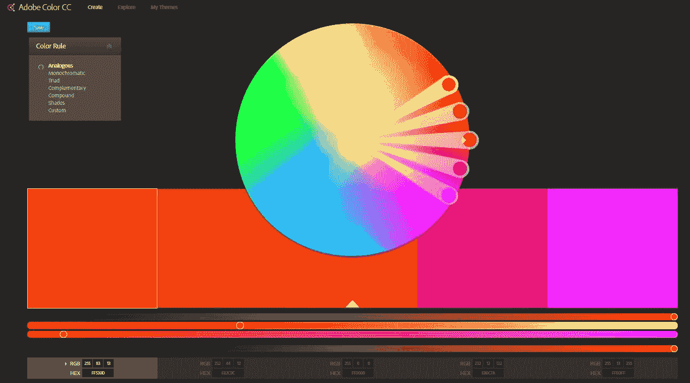

### 注意

你知道颜色与我们的情感相关的概念起源于一个名叫罗伯特·普鲁奇克*的人，他在 1980 年创建了第一个情感色彩轮吗？

#### 家庭作业

看一看一些游戏。它们是否有一种颜色比其他颜色更突出？如果是这样，如果你将颜色改为相反的颜色会发生什么？例如，如果主要是蓝色，如果你将其改为红色或黄色会发生什么？列出受主导颜色影响的对象。为什么会这样或不会这样？如果它们是/不是，如果你改变它们，这会如何影响氛围？

### 灯光

当您走进一个充满光线的房间时，可能会感到清新、充满活力和积极。相反，想象一下走进一个没有任何光线可以判断里面有什么，或者有多大空间的黑暗房间；可能会感到有些令人畏惧。这可能是同一个房间，但两种不同的照明条件提供了两种非常不同的氛围。如果再配上其他感官线索，如声音，可能会使这一切更加恐怖或振奋人心。当然，这些都是您的典型环境；一个明亮的房间并不意味着不会有可怕的东西跳出来，就像一个黑暗的房间并不意味着里面充满了敌人。这些都是需要考虑的事情，尤其是在理解如何传达危险或和平感时，尤其是在 3D 环境中。

#### Unity 中的灯光

Unity 实现了不同类型的灯光，可以在我们的场景中放置。我们没有介绍它们，因为它们与 3D 游戏紧密相关，尽管您也可以将它们用于 UI（因此也可以用于 2D 游戏）。

如前文所述，您需要将场景中的灯光视为一种艺术表达，以便创造氛围。令人惊讶的是，看起来不错的场景根本不需要逼真的灯光。在游戏开发中，许多事情都存在性能上的权衡，因为通常灯光很昂贵，尤其是如果实时计算的话。实际上，最常用的技术之一是“烘焙”灯光，这意味着预先计算它们。当然，这种方法有很多局限性，这也是为什么还有其他中间解决方案。一个好的关卡设计师应该能够放置正确类型和数量的灯光，以增强场景的外观，而不会过载 CPU 和 GPU，从而导致帧率下降。


图片由 Divine Unity Shrine，Shadowood Productions 提供，Unity 中灯光使用的示例

我们不会进一步深入细节，但您可以在以下链接中了解更多信息：

+   [Unity 灯光概述](https://unity3d.com/learn/tutorials/topics/graphics/lighting-overview)

+   [Unity 灯光概述](https://docs.unity3d.com/Manual/LightingOverview.html)

+   [Unity 光照和渲染简介](https://unity3d.com/learn/tutorials/topics/graphics/introduction-lighting-and-rendering)

#### 作业

想想游戏中你可能喜欢的某个特定部分。它可以在室内或室外，但必须是一个单一的位置。现在，尝试在其他游戏中找到类似的位置。例如，让我们选择一个实验室设施；比较《传送门》中的一个与《半条命》中的一个。继续这样做，直到你找到了至少五个其他例子，然后注意每个场景中的照明。它们是相似的还是不同的？它们传达的是相同的意义还是不同的意义？对于你之前没有玩过的游戏，观看在线游戏通过以获得对环境的感知。

### 环境

你的游戏是否设定在地球深处的一个隐蔽地牢，一个遥远的城堡，一个魔幻森林，或者可能是在一个拥有山脉和壮丽景观的异国乌托邦世界中？你如何传达你的环境可以增加你的氛围。例如，创建一个沙漠不一定是一个大片的沙地。那里有植被（即使很少），动物，在某些情况下还有残骸。然而，火星上的沙漠将非常不同于埃及或澳大利亚的沙漠。同样的情况也适用于山脉、瀑布、丘陵、冰冻土地、森林和地球表面之下。


图片来自 Unreal Engine 的开放世界演示集合：一个详细的森林示例

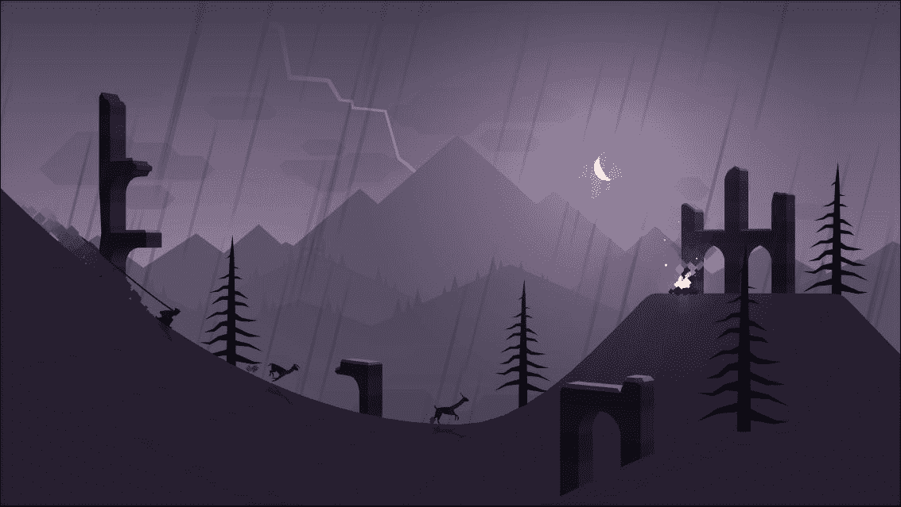

图片来自《Alto's Adventure》([www.altosadventure.com](http://www.altosadventure.com))：一个简约的环境，但它提供了场景周围氛围的强烈感受

#### 家庭作业

与我们处理照明的方式类似，我们也可以对环境进行操作。例如，看看许多不同类型的森林。它们是茂密还是稀疏？是否有路径引导玩家，或者它们是否被野生动物占据，或者它们是空的？注意它们的结构，并考虑为什么它们是这样的。这会给你一些设计自己环境的想法，什么有效，什么无效，甚至可能给你一些尝试相同环境不同方法的灵感。

### 特效

一个咒语如果没有一些魔法效果支撑，那就没什么意义，就像魔术师在挥动手或魔杖时如果没有发生任何事情，看起来会有些疯狂。特效给动作增添了特殊的东西。它还向玩家提供了一些反馈，当他们做某事时。例如，当他们发射一个致命的咒语时，你期望至少会发生一些相当壮观的事情。即使是微妙的特效，比如当你治愈自己时，也可以在创造更沉浸式的体验中起到很大的作用。

#### 粒子系统

Unity 提供了一个强大的内置粒子系统，可以用于在场景中创建氛围。以下是你可以在游戏中实现的不同类型的粒子效果列表：

+   爆竹

+   雨

+   雪

+   萤火虫

+   余烬

+   尘土

+   泡沫

+   烟雾

+   叶子

+   爆竹

当然，这只是一些建议，实际上，任何东西都可以成为粒子效果。谁知道呢，也许在合适的环境下，Pandas 也可以变得那样。

请记住，粒子系统通常不是计算成本低的添加到你的游戏中的元素，但它们确实是一种增强你游戏视觉方面的方法。


图片来自 Unity 5.5 的烟花展示视频：使用粒子系统在 Unity 中制作的烟花

### 注意

值得注意的是，从 Unity 5.5 开始，实现了一个新的光照模块。因此，粒子系统中的粒子现在可以投射光线，有机会创造出惊人的效果。因此，我建议你观看以下三个来自 Unity 5.5 测试版展示的视频，这些视频展示了粒子系统的新功能：

烟花：[`www.youtube.com/watch?v=xAzmNo2fxWA`](https://www.youtube.com/watch?v=xAzmNo2fxWA)

灰烬：[`www.youtube.com/watch?v=copE2b_XfTc`](https://www.youtube.com/watch?v=copE2b_XfTc)

烟雾：[`www.youtube.com/watch?v=rQpgaP-r_lc`](https://www.youtube.com/watch?v=rQpgaP-r_lc)

你可以在这里找到有关粒子系统的官方文档：[`docs.unity3d.com/Manual/ParticleSystems.html`](https://docs.unity3d.com/Manual/ParticleSystems.html)。

而在这里，有一个入门教程可以帮助你开始（尽管它是针对 Unity 的旧版本，但其中许多概念也适用于 Unity 的新版本）：[`unity3d.com/learn/tutorials/topics/graphics/particle-system`](https://unity3d.com/learn/tutorials/topics/graphics/particle-system)。

#### 后处理

后处理效果可以在相对较低的计算成本下极大地增强你游戏的外观。以下是一个从 Unity 官方文档中摘取的例子；它展示了没有后处理和有后处理的场景之间的差异：


图片来自 Unity 的官方文档

你甚至可以编写自己的后处理效果。你可以从这里开始：

[`docs.unity3d.com/Manual/WritingImageEffects.html`](https://docs.unity3d.com/Manual/WritingImageEffects.html)

因此，你绝对应该考虑在你的游戏中添加一些后处理效果，因为它们真的可以帮助你实现你心中的外观。无论如何，Unity 中后处理的完整文档可以在以下位置找到：

[`docs.unity3d.com/Manual/comp-ImageEffects.html`](https://docs.unity3d.com/Manual/comp-ImageEffects.html)

#### 其他视觉效果

Unity 提供了其他可以在 3D 世界中放置的渲染效果。这包括绘制线条或轨迹的线条和轨迹渲染。想象一下在游戏中最浪漫的场景中出现的流星。它需要有一条轨迹，否则它只是在天空中的点移动。另一个例子可能是在实时战略游戏中，角色留下一条小轨迹，这虽然不真实，但可以增加游戏的视觉效果。

### 注意

值得指出的是，这些视觉效果在 Unity 5.5 中得到了很大改善，所以如果你在使用旧版本，你可能会发现它们有很大的不同。


由 Unity 官方文档提供的图片：Unity 中 Trail Render 组件的实际应用示例

### 小贴士

其中一些效果从计算角度来看非常昂贵。通过了解如何在**图形库**（**GL**）中编程，可以在 Unity 中重新实现这些效果的简化版本（即没有它们的所有功能），这样它们在 Unity 中高度优化，以减少性能开销。

其他效果包括光环、镜头闪光和投影仪。光环可以用来突出场景中的对象，或者只是模拟一些非常细小的灰尘。镜头闪光可以模拟太阳对相机的影响。投影仪可以用来创建相对低成本的阴影：


由《战地 3》提供图片（DICE，2011）：视频游戏中使用的闪光镜头示例

## 音频

音频可以感动我们，让我们流泪，激励我们，让我们兴奋，有时甚至吓到我们。在某些情况下，它可以帮助我们将自己置于一个环境中。音乐的力量是真正可以增添美好特殊触感的，同时它也可以非常令人烦恼。节奏、强度，甚至乐器都可以创造不同的氛围。

### 音乐

音乐可以服务于特定的目的，例如用作背景音乐。它可以提供一种氛围和戏剧性，这是仅凭视觉所不能提供的。根据游戏的不同部分，音乐很可能会改变。我们可以想到现实生活中的一个例子，我们用来冥想的音乐可能与我们健身时使用的音乐大不相同。

在这个意义上，背景音乐往往会保持一致，并贯穿整个关卡。而游戏玩法通常是动态的，音乐也可以反映这一点。例如，一段由弦乐器轻柔演奏的优美背景音乐；一旦出现龙，情绪很可能会改变，音乐也是如此。以下是一些更多的例子：

+   开场/闭幕字幕、序列和剪辑。

+   一个角色遭遇战斗。

+   被追逐。

+   当一个角色进入危险区域时。一个例子是在《刺客信条》中，当玩家进入一个受限区域时。

+   当使用车辆时。

+   在对话序列中。

+   环境声音：

    +   交通

    +   说话声

    +   机械声

    +   枪声/炮声

    +   水（瀑布、河流、溪流等）

    +   风声

    +   房间噪音（空调、电脑嗡嗡声、打字声、开关门、橱柜、抽屉、电话铃声等）

    +   动物/昆虫（蟋蟀、青蛙、猫头鹰、鸟类等）

### 音效

声音触及我们的五种感官之一，它可以是一个游戏体验的重要组成部分。声音的使用可以从设定氛围、指示反馈、认可动作、为各种物品（如武器）提供音效，到指示事件发生。

使用声音不仅限于背景音乐。当我们做事情时，无论是做什么，我们都会发出声音，游戏玩法也不例外。当一个角色撞倒某物时，它应该发出声音，当他们行走、开门、拔出武器时，他们都应该发出某种声音。你可能在游戏中使用的音效包括：

+   施法

+   Ricochet

+   子弹呼啸而过

+   水花四溅

+   切割时电缆/长袍断裂

+   门吱嘎作响

+   玻璃破碎声

+   脚步声

+   从滑索上飞驰而下

### 引发情感

在某些情况下，你可能希望从玩家那里引发某种情感，例如当角色死亡或玩家取得胜利时。就像电影一样，当我们想要通过游戏中的某个特定方面增加情感时，尽管是在剪辑场景或游戏玩法中，音乐可以做到这一点。想想游戏中的某些时刻，你可能会在负面和正面两方面被感动。以下是一些你可能想要引发玩家情感的瞬间：

+   新角色介绍

+   角色死亡/出生

+   悲伤/快乐

+   生气/快乐

+   胜利/失败

+   戏剧性

+   令人毛骨悚然

+   浪漫/嫉妒

+   紧张

这些只是游戏中可能唤起的各种情感中的一部分。

### 家庭作业

在开始决定将哪些声音添加到自己的游戏中之前，进行一项很好的练习是玩一系列不同的游戏，并记录下它们使用的声音。这样做对于背景音乐和音效也同样适用。你可能会对每个游戏所包含的不同声音数量感到惊讶。还要注意音乐在不同关卡之间的过渡，音效也会随之改变吗？

请记住，你不必只玩游戏；观看电影甚至电视剧也可以很有用，看看场景/电影中何时以及是否添加了任何元素（惊吓、代表快乐）。

### Unity 中的音频

音频是 Unity 中的另一个广泛的话题，从 Unity 5.x 版本开始有了很大的改进。不幸的是，我们没有足够的时间专门写一整章关于如何在 Unity 中处理音频。然而，基础概念是存在一个作为监听器的组件。每个场景中应该只有一个（活跃）监听器，否则 Unity 会给你一个警告，并且保持这种方式是一种良好的实践。然后，还有一个作为音频源的组件，它可以产生声音或播放一些音乐。此外，音频源可以被设置为 3D 模式，这意味着它们可以被放置在环境中，以便产生空间声音（玩家离音频源越近，音频源的音量就越高）。

在官方网站上，有一系列关于如何在 Unity 中使用音频的视频教程，可以在以下链接找到：[`unity3d.com/learn/tutorials/topics/audio`](https://unity3d.com/learn/tutorials/topics/audio)

### 外部音频系统

如果你志向高远，而 Unity 内置的音频系统不足以满足你的游戏需求，你可以将一些第三方软件集成到 Unity 中。

最常用的一个叫做 FMOD ([www.fmod.org](http://www.fmod.org))，它是一个将空间声音集成到你的游戏中的完整解决方案。

另一个类似的工具，由于其高昂的价格而较少使用，但提供了许多功能，是 Wwise ([`www.audiokinetic.com/products/wwise`](https://www.audiokinetic.com/products/wwise))。你可能在你玩的一些游戏中见过它的标志。

FMOD 和 Wwise 都是非常强大的工具，但为了欣赏它们的功能，你应该看到它们在实际中的应用。网上有很多视频，我鼓励你查看它们。

# 团队合作

他们说养育孩子需要整个村庄，嗯，制作游戏可能需要团队，一个合作良好的团队能够完成令人难以置信的事情。然而，选择合适的人选、处理冲突以及日常合作并不总是那么简单。接下来，我们将探讨一些关于游戏开发团队中的角色、需要考虑的事项以及一些其他能帮助你走上正轨的事情。

## 这不仅仅关乎你，而是关于团队合作

一个好的团队就像任何良好的关系一样；你需要有沟通、考虑和理解，最重要的是你必须承认他人。团队中没有“我”，但很多时候人们会陷入“自我”。在这种情况下，忽视团队中的他人可能有多种原因，从自我、技能（或缺乏）、不耐烦、经济利益等等。当然，这并不是说这样的特质是负面的，但数量不当（就像任何事物一样），它们是导致灾难的确定方式。

当涉及到团队时，另一个问题是你们彼此认识的时间长短。这既不是坏事，也未必总是好事。特别是如果你打算与对方做生意，重要的是要保持专业。你需要交付产品，需要满足截止日期，可能还有参与你项目的利益相关者。你必须能够将商业和友谊分开。动态会改变，你需要避免让它变得个人化。

游戏开发团队将包括不同的角色，你的团队规模决定了这些角色的执行方式。在理想的世界里，你将为每个角色配备团队成员，但在大多数情况下，你将不得不承担双重责任。在此说明，一个典型的团队可能包括以下成员：

+   **项目经理**：为团队设定里程碑并确保它们得以实现。但这不仅仅是时间管理；项目经理还应鼓励和激励落后于截止日期的团队和成员。他们帮助提升团队士气，并确保项目顺利且更重要的是按时进行。

+   **制作人**：将是处理事务商业方面的人。他们负责维护预算、时间表和营销策略。他们在项目管理员那里的不同之处在于，他们更关注物流和技术细节，而不是管理团队的运作。

+   **社交媒体策略师**：指的是那些致力于你游戏所有社交媒体和营销方面的人。通常，制作人也会负责这一部分，但在某些情况下，根据你希望利用的社交媒体程度，有专人负责推广你的游戏可以帮助释放预算和时间，以及你团队制作人的财务方面。

+   **设计师**：将是将所有元素结合起来以创造整体体验的人。他们确保所创造的内容与故事相辅相成；他们决定如何向玩家展示，以及玩家最终如何与游戏流程互动。

+   **艺术家**：负责创造游戏的外观，从角色的概念艺术、资产和关卡，到它们的模型和纹理。如果你能的话，拥有不止一个艺术家是理想的，尤其是如果你的游戏规模较大。艺术需要时间，尤其是如果你想让你的游戏在美学上具有魔法般的效果。

+   **程序员**：就像项目的手臂一样；没有他们，你很可能难以让你的精彩想法变为现实。说到这里，如果你不幸没有程序员在你的团队中（或者人数不足以开发你可能想要的全部功能），许多游戏引擎提供了可视化脚本，允许你将命令链接起来以创建动作。一个很好的例子是 Unreal Engine 中的 Blueprints，如这里所示：

    图片由 Unreal Engine 提供，蓝图可视化脚本([`docs.unrealengine.com/latest/INT/Engine/Blueprints`](https://docs.unrealengine.com/latest/INT/Engine/Blueprints))

+   **声音设计师/作曲家**：让游戏听起来很棒的人。声音设计师确保每个动作都有某种形式的音频反馈。游戏中的音频包括音效和背景音乐。声音设计师通过让游戏听起来生动来贡献氛围。即使是微小的效果，例如当玩家靠近某个黑暗和危险房间时，也能唤起各种各样的情绪。

+   **质量保证(QA)测试员**：负责确保游戏正常运行的人（或人们）。这可能包括朋友、家人、专业游戏玩家和质量保证测试员。理想情况下，你希望 QA 测试员不参与你项目的创建，因为尽管你自己也会进行测试，但很容易忽略可能影响整体游戏体验的游戏方面。

+   **作者**：通常负责开发游戏故事的人。故事元素可以包括整体情节、角色、背景以及其他叙事元素，如对话和叙事路径，例如不同的结局。本质上，作者负责确保故事不仅能够吸引和吸引玩家，让他们渴望更多，还要营造氛围并增强整体游戏体验。此外，作者还必须确保故事合理、逻辑清晰且具有解释性。最后，需要记住的一点是，为游戏写作需要与电影或阅读文本不同的方法，因为它是互动的。

### 分享一个共同的愿景

当你在团队中工作时，拥有一个共同的目标和共同的兴趣非常重要。虽然这不用说，但在团队项目中，士气是关键。项目会有困难时刻，会有熬夜和压力水平上升的时刻，但得到他人的支持可以改善大家应对所有困难的方式。会有你忙碌、无法完成或工作过度负荷，以至于阻碍你完成任务的时候。当然，如果你很懒惰，那完全是另一种情况，但你应该始终与团队成员沟通任何困难，并且尽可能快地沟通。为了真正说明这一点，考虑一下蝴蝶效应的诗意概念：*巴西一只蝴蝶的翅膀拍动会在德克萨斯州引发龙卷风吗？* 开始时的小（未解决）问题最终会变成更大的问题。

### 管理期望

拥有一个共同的愿景并不总是等同于拥有相同的期望。例如，你和你的团队可能想要制作一个高销量且受欢迎的应用程序，但每个团队成员愿意投入的时间和精力可能会有所不同。因此，为了许多原因，在早期就建立期望也很重要。

除了期望之外，确保花时间正确规划你的游戏开发。如果你时间很少或者你的游戏包含必要的组件，你不希望过度规划你打算做的事情。同样，这也适用于规划不足的情况，你决定了游戏的设计，但没有给自己足够的时间来完成它。最终，你的团队可能会开始削减部分内容，以便达到目标。最终，你可能会得到一个类似于游戏演示版本的东西，而没有令人兴奋的完整版本来保持玩家对你的作品的兴趣，或者更糟糕的是，你甚至可能没有完成的游戏。

最后，永远不要假设任何事情。假设很可能会在以后导致灾难。例如，你看到那些精心规划的甘特图，上面列出了要完成的事情，在这个阶段，你的艺术家们应该正在建模资产，但现实中他们并没有；或者至少有一个艺术家没有，因为他们认为其他艺术家会做。定期开会，有一位优秀的项目经理和制作人可能会避免这种情况发生，但始终要了解其他人正在做什么。

### 协作和沟通是关键

在一个群体中最糟糕的事情就是停止交谈。也许事情陷入了低谷，人们变得忙碌，也许某个成员的个人生活中发生了某些事情，无论如何，总会有一些事情会吸引我们的注意力到别处；毕竟能力有限。然而，这并不是团队停止交谈的理由。如果沟通中断，找出原因并在早期采取行动。也许问题很小，可以轻松解决。在其他情况下，它可能会损害项目的成功，例如，由于团队成员太尴尬而不承认他们无法完成任务，或者只是太忙，但直到最后一刻才通知任何人。避免此类问题的一种方法是在群体内使沟通变得容易，并且经常沟通****。

### 沟通方式

虽然这很明显，但以下是一些相对简单的方法，通过以下方式保持联系：

+   **电子邮件**：电子蜗牛邮件非常适合保持对话的线索，但它可能变得相当难以管理。在这些情况下，定期（例如，每周或每月）进度更新会非常理想。给它一个截止日期和模板。例如，一个他们需要涵盖的事项清单，如目前正在进行的任务、问题和未来的工作。这样，你就能跟上每个人的进度，其他人也是如此。为了使整个过程更容易管理，大多数（如果不是所有）电子邮件软件都有诸如标记和过滤等功能。在这些情况下，与指定标准相关的电子邮件，如电子邮件地址或主题，将被定向到特定的文件夹，并/或添加标签，以便以后更容易检索。

+   **WhatsApp**：你很可能有其他团队成员的电话号码，无论是个人还是商务号码。因此，像 WhatsApp 这样的电话信息服务是保持联系和进行通话的绝佳方式，无论他们身在何处。

+   **社交媒体群组和聊天，如 Facebook**。使用 Facebook，你可以通过多种方式保持沟通渠道畅通。你可以创建一个消息组或一个私人组。两者之间的区别很小，因为它们的功能几乎相同，你可以上传文档并进行讨论。然而，一个群组的功能与 Facebook 页面非常相似。所以如果你上传一张图片，它将创建一个单独的帖子，而不是在聊天中，它只是作为对话中下一部分的对话添加。创建 Facebook 群组的优点是，在查找某些项目方面更容易管理，并且可以使对话更具体地针对帖子（或主题）。

+   **Skype/Google Hangouts 等工具：节省打字时间，并通过电话与人沟通。永远不要低估语音/视频通话的力量。虽然有时，尤其是在远程工作时，保持超越文本通信的联系很重要。它为工作关系增添了更多个人化的层面，并且您能更好地了解对方，而不是试图从字里行间解读。**

## 版本控制

对于艺术家来说，通过使用云存储服务（如我们稍后将要讨论的 Google Drive 或 Dropbox）共享文件，如纹理和网格，是一种有效的解决方案。然而，当涉及到程序员和开发者时，共享文件的情况就不同了。在游戏开发过程中，程序员倾向于与他们的代码和脚本文件进行协作。因此，有一些重要的需求应该被考虑：

1.  程序员在相同的源代码上共同工作。这可能涉及（但不限于）在项目内部的不同区域以及相同的文件（们）上进行协作。因此，如果没有某种形式的文件控制，可能会变得非常混乱，无法跟踪哪些内容已被修改。

1.  在项目中进行编程的一般性质将涉及利用一系列不同的技术，并尝试各种解决方案来解决一系列问题，以最适合项目。因此，如果进行了大的更改或不是必然正确的解决方案的更改，程序员需要有一种方法可以回到之前的版本。

1.  从其他来源，如库和源文件中重用全部或部分代码，在相关的情况下可以节省大量时间。通过这样做，可以为具有类似元素的项目部分节省时间，从而为更复杂的部分留下更多时间。

通过实施某种形式的版本控制，程序员能够利用一个文件系统，它不仅能够识别和跟踪文件更改，还允许程序员撤销这些更改。此外，版本控制还可以帮助程序员更方便地重用和整合来自外部来源和/或项目的代码。这些功能以及更多，都由版本控制软件支持。

Git 是一个免费且开源的版本控制程序。您可以通过访问 Git 主页在此下载它：[www.git-scm.com](http://www.git-scm.com)。一旦安装并正确配置，它就可以用于对您的文件应用版本控制，从而成为您工作流程中的一个不可思议的资产。

### 小贴士

有一些可视化工具可以更轻松地管理 Git。其中最完整的一个是 Atlassian 的 SourceTree ([www.sourcetreeapp.com](http://www.sourcetreeapp.com))。然而，如果您是新手，可能发现使用 Axosoft 的 GitKraken ([www.gitkraken.com](http://www.gitkraken.com)) 更容易。

此外，如果你想学习 Git，这里有一个快速且有趣的交互式教程：[`try.github.io`](https://try.github.io)。

## 制定 GDD 并坚持执行

在开始时，每个人都会有想法、概念或想要添加到游戏整体开发中的东西。在这个阶段，这是非常好的，因为它将给你很多思考的空间，当涉及到精炼你的游戏时，它将为你提供一系列不同的选择。

**游戏设计文档**（**GDD**）是一种整洁的方式来拥有你游戏当前的状态和将来的状态。将 GDD 视为一本手册，定义了你的美学、音频、命名约定、故事、角色以及其他游戏碎片。它是一个参考点，如果你愿意，可以称之为游戏圣经。GDD 的结构各不相同，没有正确或错误的方式去做，因为它将完全取决于你的游戏。然而，有一些部分定义了游戏的内容。例如：

1.  **简介**:

    +   你的游戏是关于什么的？想象一下这是一个电梯演讲。保持简短、尖锐、直接。你不想涉及太多细节，但足以传达你游戏的整体大意。例如，Sugar mountain, Panda invasion 是一款 2D 即时塔防游戏，玩家必须用各种可食用的投射物击败熊猫。

    +   你的游戏针对的是谁？儿童、成人，或许两者都是？理想情况下，这是你考虑你想要吸引到你的游戏中的受众群体的地方。

    +   你的游戏将在哪里展示/在哪些设备上？Android、iOS、Windows、Mac、Linux 都带来了不同的挑战，需要不同的考虑，所以请记住这一点，并在早期定义，以减少后续的头痛。

1.  **艺术**:

    +   定义你想要达到的美学风格的氛围板。这些可以是通用的，也可以是针对角色或级别的特定内容。它们有助于在创建概念艺术时指导艺术方向。

    +   概念艺术包括定义游戏当前状态的一切。当然，之前的艺术作品可以保留在 GDD 中，但最好将其移至附录或单独的部分，以保持文档的相关性。

    +   UI/GUI/HUD 都与交互元素的外观有关，以及基本上不是游戏中的其他事物将如何呈现。例如，如果你有一个 HUD（抬头显示），它将在游戏中如何呈现。它将占据屏幕多少空间，以及它将如何与当前的美学风格协同工作？

    +   需要绘制角色插图，以提供关于他们外观的线索，然后进行建模（或绘制 2D 图像）和动画。绘制角色在不同姿势、环境和情境下的样子，有助于更详细地展示角色的个性和整体外观。

    +   将填充你的游戏环境的资产，这些资产将在稍后创建（绘制或建模）。

1.  **音频**:

    +   为游戏营造氛围的背景音乐。它可以很简单，比如提供探索环境的氛围音乐，或者当玩家接近游戏中的某个重要部分时作为音频提示。

    +   声音效果不仅提供反馈源，例如当物体与表面接触时，还包括当发生事件时，如玩家获胜或失败。

1.  **故事**:

    +   角色传记将包括与每个角色相关的信息，从他们的基本信息（年龄和外观）、背景故事、性格以及他们在游戏中的与其他角色的关系。根据你的游戏类型，它将是概括性的或极其详细的（如角色扮演游戏）。

    +   您游戏的大致情节将为每个人提供游戏的主要内容。就像角色传记一样，细节程度将取决于游戏类型。例如，如果是一款像*数独*这样的游戏，你可能甚至没有故事（除非当然你的解决方案解锁了通往解救公主的门）。

    +   叙事流程将解释随着游戏的进行，叙事是如何被揭示的。把它想象成一个地图，指示何时以及如何将叙事的各个部分揭示给玩家，以及游戏的每个部分如何与叙事相关。例如，让玩家穿越地下洞穴并不能救出被困在地图另一侧城堡中的公主，除非当然洞穴有一个秘密通道可以带你去那里。就像游戏玩法一样，你的叙事需要与你在游戏中的行为相关联，反之亦然。

1.  **技术**:

    +   管道概述将简要解释将要用于构建游戏的软件（游戏引擎、第三方插件等）以及如何将它们连接在一起。此外，它建立了艺术和软件之间的联系，以及它们如何进行通信（例如，图形应该如何打包以便在软件/游戏中使用）。

    +   技术设计将解释您游戏的不同部分是如何连接起来的，并建立规范。此外，它包含接口应该如何实现，以便在项目内部保持一致性，以及如何将工作封装在任务中（可以由不同的人完成）以及如何将它们集成在一起。通常，技术设计是在技术设计文档中，与游戏设计分开，因为它只由程序员使用。

    +   系统限制将解释所使用技术的局限性，向非程序员团队成员说明（实际上，更详细的限制在技术设计文档中）。就像管道概述一样，这份文档为程序员、设计师和艺术家之间提供了一个桥梁。

1.  **游戏流程**：简要说明游戏将如何进行。从一个关卡/剪辑场景/等等，到下一个。与叙事流程类似，游戏流程讨论了随着玩家在叙事中前进，他们将在游戏中做什么。例如，他们将会去地图的 A 部分，杀死 20 条龙，然后发现神奇的药水，接着是剪辑场景揭示他父亲的真相，然后玩家被传送到一个魔法岛屿去探索家族档案。通过这样做，你开始看到你的游戏和/或故事中的漏洞，并能够确保它不仅合理，而且进度以玩家会喜欢的速度进行；也就是说，游戏既不会太快也不会无聊和令人困惑。

1.  **时间线**：它指的是你的游戏从开始到结束所需的时间，以及所有进度里程碑和截止日期，以确保你的游戏能够达到发布日期：

    +   里程碑就像是推动你的项目进一步发展的垫脚石。这些通常是游戏达到一个重要节点的时候，比如艺术资源完成、酷炫功能实现、第一个工作原型等等。里程碑可以像你想要的那么频繁或不频繁，但它们是跟踪每个人进展的一种方式，以确保工作在时间框架内完成，以达到不同的项目目标。

    +   截止日期可能听起来令人畏惧，因为如果这是一个重要的截止日期，它可能会毁掉一个项目，并最终造成（尽管是金钱和时间）的损失。

    +   重要日期非常重要。它们是每个人都需要到场、现场（如果你有一个实体位置）、在线（如果你有一个虚拟位置），或以任何其他形式出现的日子。这些日期可能出于各种不同的原因，包括利益相关者、客户，甚至潜在雇主会议。团队成员应该认真对待这些会议，准时到达，并做好准备。还应该记录会议笔记，以便记录发生的事情。

## 使用项目管理工具保持整洁

没有人喜欢杂乱的工作空间；即使是有序的混乱也有其极限，当你需要那份文件时。当你开发可能有很多文件的游戏时也是如此。因此，我们必须找到方法来不仅管理文件，还要管理团队成员，以便我们所有人都知道文件在哪里，并且有与他人沟通关于它们的方式。市面上有许多团队和文件管理程序，其中一些最受欢迎和有用的将在下面讨论。

### Slack

Slack ([www.slack.com](http://www.slack.com)) 是最有效的团队管理工具之一。它将你所有对话、主题、待办事项列表、笔记以及项目中的许多其他碎片都集中在一个地方。

其中一些功能在这里进行了说明：

+   频道将主题分开，使讨论更加集中。把它们想象成有特定讨论主题的房间。例如，你可能有一个专注于你项目艺术的美术频道。它还提供了一个地方，让其他团队成员可以请求或检查某些项目的进度。频道可以像你希望的那样广泛或狭窄。

+   该应用使得在移动中管理 Slack 变得更加容易。它允许你在组成员上传和/或发布任何内容时接收实时更新。此外，它还允许你随时随地与 Slack 进行互动。例如，你得到一个很好的想法，或者你可能看到对你正在开发的概念有用的东西，使用 Slack 应用，你只需要发布或捕捉你的想法并将其提交到频道。你可以把频道想象成群组。

+   Slack 的应用目录允许你将其他应用程序（其中一些我们将在稍后探讨）集成到 Slack 中，使其成为终极项目管理软件。你可以在 [`slack.com/apps`](https://slack.com/apps) 找到应用目录。

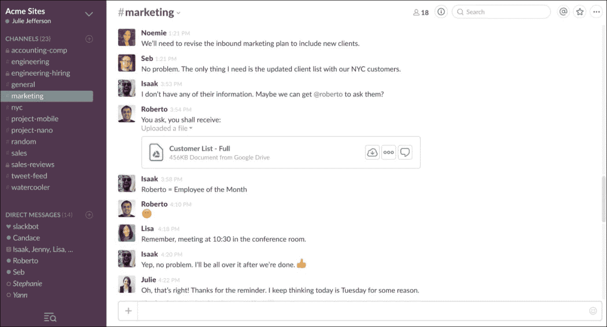

图片由 Slack 教程视频提供 ([`slack.com/is`](https://slack.com/is))

### HacknPlan

类似于 Slack，HacknPlan ([www.hacknplan.com](http://www.hacknplan.com)) 是另一款团队管理软件。然而，它更专注于游戏开发。例如，你可以提供工作的时间表，为每个任务分配点数或价值，这些点数或价值可以用来确定游戏特定部分的支付和/或创作者的贡献。它允许你一眼就能看到项目当前状态的相对详细概览。如果你查看下面的截图，你可以看到有多个不同的看板，每个看板都指示着生产流程的不同部分，从尚未开始的**计划**到已经完成的**完成**。我推荐你尝试一下，因为这是我最喜欢的工具之一！

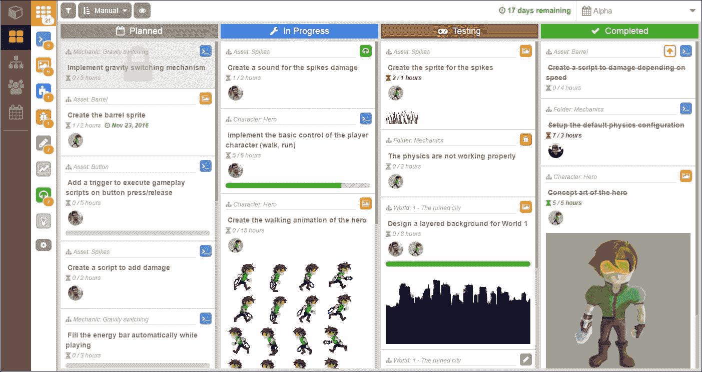

图片由 Press Kit 提供 ([`hacknplan.com/press/#!`](http://hacknplan.com/press/#!))

### Drive

Google Drive ([`drive.google.com`](https://drive.google.com))，以及其整个程序套件，作为一个公共资源非常灵活且有用。它不仅提供了类似于其他知名商业产品的程序，而且还具有使整个过程更加容易的共享功能。你可以轻松地创建和共享文档、文件和文件夹，无论是与许多人还是少数人共享，都可以通过私有链接或通过权限进行。你可以以多种方式控制对文件的访问权限（从编辑到只读）；这都将取决于最初分享它们的目的。

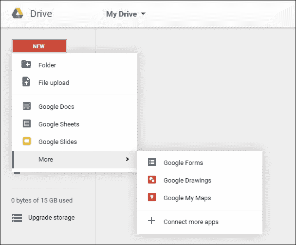

图片由 Google Drive 提供

### 小贴士

在文件和文档创建方面，Drive 的一些替代品是 Apache OpenOffice ([www.openoffice.org](http://www.openoffice.org)) 和 ONLYOFFICE ([www.onlyoffice.com](http://www.onlyoffice.com))。

### Dropbox

与 Google Drive 类似，但增加了其他软件，Dropbox ([www.dropbox.com](http://www.dropbox.com))提供了一个用于管理项目文件的灵活工具。它允许你上传文件、创建文件夹，并共享它们以及其中的文件。因此，在文件共享方面，它是 Drive 的一个很好的替代品。此外，对于 Word 文件等文档，它允许你与其他团队成员实时编辑它们，同时显示正在进行的或已完成的编辑。

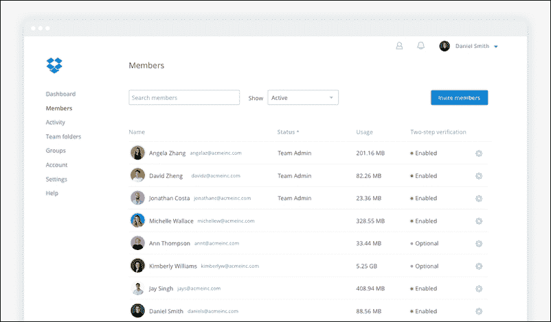

图片由 Dropbox 新闻稿 ([`tinyurl.com/DropboxPressKitScreenshot`](http://tinyurl.com/DropboxPressKitScreenshot)) 提供

### Trello

Trello ([www.trello.com](http://www.trello.com))某种程度上类似于任务管理的虚拟图钉板。它允许你创建一个看板，其中保存了所有任务。每个看板都有不同的面板，展示任务。当然，这些面板的顺序可以根据你打算用 Trello 做什么样的流程来调整。例如，创建一个管道风格的 Trello 看板可能包括艺术、设计、编程和音频等不同区域；所有这些区域都分配了特定于其领域的任务。例如，艺术部分可能包括主菜单的概念或公主塔的概念艺术等任务。每个任务也可以分配给特定的人，或者留给小组中的任何人参与。一旦任务完成，它可以被移动到另一个区域，当然，这个区域被恰当地命名为“完成”或简单地留在列表底部。你如何使用 Trello 完全取决于你，但它确实有助于使流程更加流畅。


图片由 Trello 之旅 ([`trello.com/tour`](https://trello.com/tour)) 提供

### Redbooth

另一个选项，某种程度上是 Trello 和 Dropbox 的结合，是 Redbooth ([`redbooth.com`](https://redbooth.com))，也被称为 Teambox。Redbooth 允许用户分享文件，分配任务给团队成员，并发送直接消息。像我们在这里查看的许多其他应用程序一样，它也会在项目状态更新时提醒你。


图片由 Redbooth ([`redbooth.com/?ref=teambox#!/dash`](https://redbooth.com/?ref=teambox#!/dash)) 提供

### GitHub

之前我们讨论了版本控制。然而，你仍然需要一个地方来存放你的仓库。GitHub ([www.github.com](http://www.github.com)) 为 Git 仓库提供托管服务。对于公共仓库是免费的，这意味着每个人都可以看到你上传的内容（这个选择是为了鼓励开源软件）。否则，它为你的仓库提供付费托管计划。


图片由 GitHub 提供

### BitBucket

Bitbucket ([`bitbucket.org`](https://bitbucket.org)) 是一个与 GitHub 非常相似的服务，用于托管你的 Git 仓库。在这里，你可以免费拥有私有仓库，但限制在于用户数量。最多五个用户是免费的（这对于小型团队来说非常完美）；否则，你需要切换到付费计划。

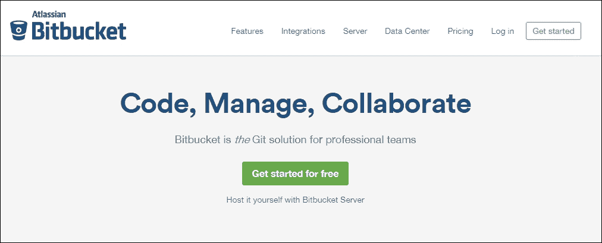

图片由 Bitbucket 提供

### 日历

另一个直观的软件（甚至硬件）是日历，但更重要的是一个供你团队共享的日历。设定截止日期很重要，但要确保每个人都遵守，请使用公共日历；当即将到来的事件、会议和里程碑临近时，它会向每个人发送通知。

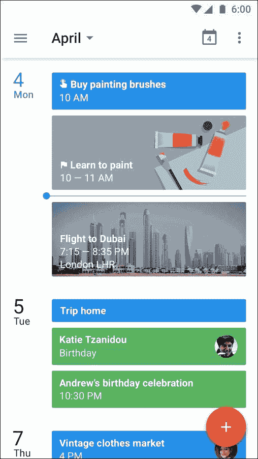

图片由 Google 日历 ([`play.google.com/store/apps/details?id=com.google.android.calendar&hl=en`](https://play.google.com/store/apps/details?id=com.google.android.calendar&hl=en))

### Pinterest

传达你想法（们）美学部分的一个好方法是情绪板。Pinterest ([www.pinterest.com](http://www.pinterest.com)) 是这个方面的绝对神奇工具。你不仅可以创建不同的板来固定图片，而且它们还可以在团队成员之间共享，并设置为私有。

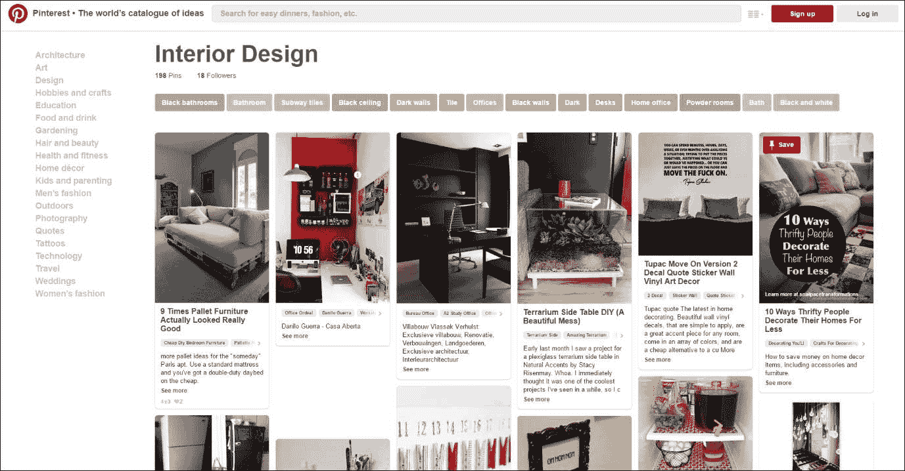

图片由 Pinterest 提供

### Hootsuite

在一个地方管理多个社交媒体渠道的一个简单方法可能是 Hootsuite ([www.hootsuite.com](http://www.hootsuite.com))。它允许你安排在各个平台（例如 Facebook、Instagram 和 Twitter，我们稍后会看到）上的帖子，这样你就可以使用应用程序处理其他重要的事情。

此外，它还允许你一目了然地查看每条帖子是如何被互动的，例如点赞、推文和收藏。

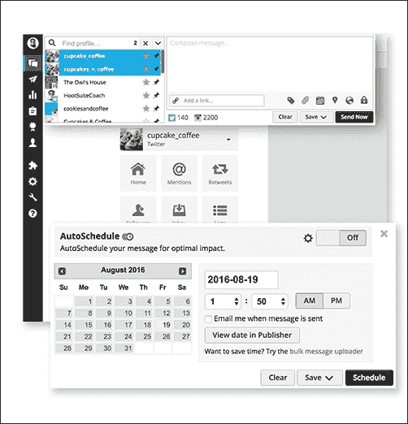

图片由 Hootsuite 提供 ([`signupnow.hootsuite.com`](http://signupnow.hootsuite.com))

# 精炼你的游戏

好吧，我们已经提交并抛光我们的游戏，使其成为杰作，现在是时候给它添加一些光泽了。为了使我们的宝石发光，我们需要用一些事情来使其工作得更好，同时确保它将按我们的意愿工作。到现在为止，你应该已经测试过它（不止一次），因此你会有一些关于需要改进之处的想法，例如卡顿。在接下来的章节中，我们将探讨优化游戏各个部分的方法，以便在你发布时，你将拥有一个运行流畅且有效的游戏。

## 处理力量

在你真正深入游戏开发之前，有一件事你需要确保做的是确定它是否针对你打算投放的设备进行了优化。通常优化被视为游戏开发的最后一步，但这并不正确。你越早考虑开发流程中的优化，后期优化游戏所需的努力就越少。

### 笔记

Unity 为优化移动平台提供了丰富的资源，例如特定的优化，如脚本和图形。你可以在以下链接找到它们：[`docs.unity3d.com/Manual/MobileOptimizationPracticalGuide.html`](https://docs.unity3d.com/Manual/MobileOptimizationPracticalGuide.html)。

不同的设备都有自己的问题需要克服。就像我们的大脑一样，移动设备（以及一般的计算机）可以一次处理大量的信息。因此，这最终会影响你游戏的整体性能。例如，图形（2D 和 3D）或代码效率低下等问题可能会非常消耗资源。最终，这会影响游戏的运行，导致卡顿。除了设备之外，根据你设计的维度（2D 或 3D），还需要考虑不同的因素，我们将在下一节中探讨。

### 检查构建大小

你需要考虑的许多事情之一，是游戏的大小，尤其是因为它将影响其分发和/或发布方式。因此，检查你的构建大小对于理解游戏的大小至关重要。你可以直接构建游戏（如何操作，将在本章后面解释），并检查其大小。然而，这并不能给我们太多关于我们可以减少什么的信息。

在你构建完游戏后，你可以右键点击**控制台**窗口，然后选择**打开编辑器日志**，如图所示：


你的操作系统将使用默认的文本编辑器打开`Editor.txt`文件；在末尾附近，你可以找到一些关于你上次构建的统计数据，特别是你游戏不同元素的大小。你应该会有类似以下的内容：

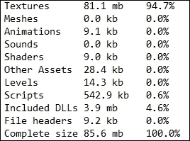

与单个文件相关的细节（只显示一部分）如下：

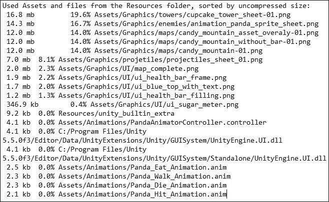

如你所见，我们游戏的大部分大小都是由**纹理**占用的，这在 2D 游戏中很常见。让我们在下一节中探讨如何减小纹理的大小。

### 纹理优化

一些图像格式可能会出现问题，例如文件大小。幸运的是，在 Unity 中，你可以通过多种方式减小文件大小：

1.  改变图像分辨率。

1.  改变 Unity 处理该特定图像的方式。

在 Unity 中，你可以在导入设置中更改这些设置。要这样做，只需从你的**项目**文件夹中选择一个**资产**，然后会出现以下屏幕：

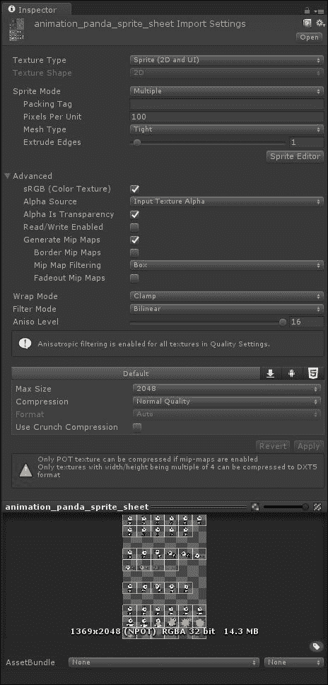

在前面的章节中，我们解释了一些这些设置，主要是与游戏相关的设置。但正如你从前面的截图中所看到的，还有许多其他选项可以设置纹理，使其在游戏中达到最佳状态。

### 小贴士

如您从之前的截图中所见，有一个关于 POT 纹理的警告。那是什么？**2 的幂**（**POT**）纹理是边长为 2 的幂的方形图像（例如 2、4、8、16、32、64、128、256、512、1024、2048、4092 等等）。由于我们拥有的硬件运行在二进制系统上，2 的幂非常重要，因为某些技术允许以某种方式处理它。因此，性能可以得到提升。在特定情况下，警告指出需要压缩成 DXT5 格式。因此，尽管很难让所有纹理都成为 POT 纹理，但您应该考虑尽可能多地使用它们。

如您从之前的截图中所读到的，我们的熊猫精灵图集是一个**NPOT**（**非 2 的幂**）纹理，因为这张精灵图集是为了清晰度而设计的，用于在第四章*不再孤单——甜味熊猫出击*中学习动画，而不是为了优化。

为了提高游戏性能，最重要的参数是：**生成** **Mip Maps**、**过滤模式**、**最大尺寸**、**压缩**和**格式**。为了便于理解，它们已在之前的截图中被突出显示：

+   **生成 Mip Maps**: 这是一个选项，如果选中，将创建纹理/精灵的小版本。因此，当精灵相对于相机较远或较小时，将渲染较小的版本。因此，在运行时可以获得性能提升，但可能会增加构建的大小。

+   **过滤模式**: 允许您对图像应用过滤器，特别是使边缘略微模糊。当处理像素艺术时，一些过滤器可能很有用。这是因为过滤器使您的资产不那么像素化。**过滤模式**选择当纹理被变换拉伸时如何过滤纹理：

    +   **点**: 纹理在近距离时变得块状

    +   **双线性插值**: 纹理在近距离时变得模糊

    +   **三线性插值**: 这类似于**双线性插值**，但纹理也会在不同的 Mip 级别之间模糊

+   **最大尺寸**: 如其名所示，对图像在该特定平台上的最大尺寸进行限制。实际上，虽然高分辨率图片或图形可以增强体验，但从性能角度来看，对于应用程序来说并不总是最佳选择。此选项允许您在牺牲质量的情况下，大幅减少构建大小，以防出现相关问题。

+   **压缩**和**格式**: 指定在游戏编译/构建时图像是否会被压缩。重要的是要记住，如果您的目标设备是特定平台或非常老旧，它可能无法支持某些压缩格式。再次强调，质量和性能之间存在权衡。

### 小贴士

**练习**:

由于我们没有时间详细查看所有单个选项，作为一个练习，找出所有其他设置在官方文档中的工作方式。然后，稍微玩一下它们，直到你感到舒适并真正理解它们如何影响开发工作流程。

### 统计数据和性能分析

在创建你的游戏时，优化将变得困难，尤其是如果你直到最后一刻才开始担心这个问题。主要问题之一（至少在 3D 游戏中）是多边形计数，这是你的 3D 资产拥有的面数。例如，如果你想到一个立方体，每个面都是一个多边形，因此立方体将总共拥有六个多边形（一些显卡不支持四边形，因此立方体的六个面应该分成两个三角形，总共 12 个多边形）。说到这里，需要考虑的是累积的总数。如果太低，你的游戏看起来可能会相对粗糙；如果太多，尤其是对于移动设备，很可能会出现卡顿。要检查 Unity 场景中的多边形计数，请转到**游戏**视图的右上角，并检查**统计数据**选项，如图中所示：

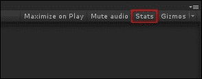

为了更好地了解你应该如何建模，在 Unity 的用户手册中，有一页解释了如何建模资产和角色以便进行优化。你可以在这里阅读：[`polycount.com/discussion/130371/polygon-count-for-smartphone-applications`](http://polycount.com/discussion/130371/polygon-count-for-smartphone-applications)。

完成此操作后，应该会出现如图所示的弹出窗口。此弹出窗口中的统计数据显示了与不同事物性能相关的信息，例如绘制调用。此外，它还指示当前场景视图中有多少多边形。实际上，这个 S**统计数据**屏幕的一个巨大优点是，当你按下播放时，你可以实时使用它，这样你就可以观察游戏中的哪些部分比其他部分更占用资源（我们之前在第二章中提到过，*烘焙纸杯蛋糕塔*）：

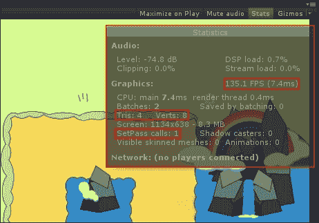

最重要的参数要检查（如图中所示）是：

+   **FPS** (每秒帧数): 如其名所示，这显示了你的游戏每秒可以产生多少帧。当然，这个值可能会因不同设备和/或计算机的硬件而大幅变化。你应该确保你的游戏能够在每个目标平台上至少以 50/60 FPS 运行。

    ### 注意

    在某些情况下，你可能想限制最大 FPS 值，原因有两个：

    一些显示器具有有限的刷新率

    人眼也有有限的刷新率

    因此，你可能想要避免生成比你实际需要的更多帧，从而造成计算资源的浪费。

+   **Tris**（三角形）和**Verts**（顶点）：它们表示当前帧中从活动相机（可能不止一个活动相机）渲染的三角形和顶点数量。特别是在 3D 游戏中，这一点至关重要。**Tris**和**Verts**越多，你可以包含的细节就越多，但这是以性能为代价的。

+   **SetPass 调用**：这表示 Unity 需要经过多少次迭代才能渲染出特定的帧。你应该尽一切努力尝试减少这个数字。迭代次数越少，Unity 渲染特定帧的速度就越快，从而提高你的帧率（FPS）。

如果你需要更多关于你的游戏资源使用的高级统计信息，你可以通过从顶部菜单栏的**Window | Profiler**导航到**Profiler**来访问它。你应该有一个类似于以下屏幕的界面：

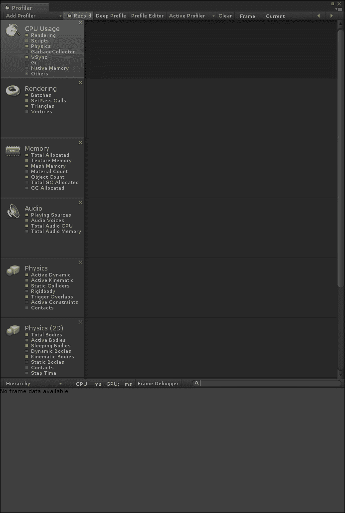

窗口被垂直拉伸，以便尽可能多地显示类别。然而，由于空白空间将被图表和你的游戏的不同部分填满，分析窗口应该尽可能放大。如果你有双显示器设置，考虑将分析窗口放在你的第二显示器上。

这个强大的工具允许你详细监控你的游戏的不同组件如何使用资源。Profiler 通过分析 GPU、CPU、内存、渲染和音频的性能来帮助你优化游戏。因此，你可以了解你的游戏在不同区域花费了多少计算能力。例如，你可能想知道渲染、动画或甚至游戏逻辑花费的时间百分比。

### 注意

你可以在官方文档[`docs.unity3d.com/Manual/Profiler.html`](https://docs.unity3d.com/Manual/Profiler.html)中或从官方网站[`unity3d.com/learn/tutorials/topics/interface-essentials/introduction-profiler`](https://unity3d.com/learn/tutorials/topics/interface-essentials/introduction-profiler)的视频教程中了解更多关于 Profiler 的信息。

此外，你还可以进行远程分析；在[`docs.unity3d.com/Manual/ProfilerWindow.html`](https://docs.unity3d.com/Manual/ProfilerWindow.html)中，接近页面底部，你会找到一个名为*远程分析*的部分。它解释了如何根据你想要远程分析的平台进行操作。

### 其他优化技巧

另一种优化游戏的方法是限制 3D 资产上的材质数量（这是 Unity 在游戏对象上应用着色器的方式）。例如，有时你可以将许多不同的材质（和贴图）应用到对象上，以产生一系列酷炫的效果；然而，少即是多。对于在电脑或游戏机上玩的游戏，这并不是一个大问题，但需要考虑。对于移动设备上的游戏，重要的是要记住，它们能够处理一些酷炫的效果，但一切都有极限。在游戏开发的早期阶段考虑到这一点，如果需要调整游戏的一些组件，将有助于减少后期阶段的工作量和压力。有些材质在计算上可能非常昂贵。有一些着色器可以很好地近似酷炫效果，但针对移动设备进行了优化（例如我们之前讨论过的光晕效果）。

在这个小段落中探讨的想法只是从图形角度优化应用程序的冰山一角。然而，你可以在这里继续阅读：[`docs.unity3d.com/Manual/OptimizingGraphicsPerformance.html`](https://docs.unity3d.com/Manual/OptimizingGraphicsPerformance.html)。

另一种优化游戏的方法是关注你的代码。

在 Unity 的早期版本（5.0 之前），需要缓存 Transform 组件。正如你可以在本文末尾的[`blogs.unity3d.com/2014/06/23/unity5-api-changes-automatic-script-updating`](https://blogs.unity3d.com/2014/06/23/unity5-api-changes-automatic-script-updating)中读到的那样，现在不再需要这样做。然而，仍有开发者在使用它；现在应该避免使用，因为它会大大降低代码的可读性，从而影响开发过程。无论如何，你仍然应该将其他组件缓存到变量中，就像我们在第三章中为 UI 所做的那样，*与玩家通信 – 用户界面*。

### 注意

如果你正在使用 Unity 的旧版本，或者你只是想了解 Transform 组件的缓存是什么，请查看以下代码行：

`transform.position = Vector3.zero;`

在过去版本的 Unity 中编译时，它相当于：

`GetComponent<Transform>().position = Vector3.zero;`

此外，正如我们在各个章节中已经提到的，`GetComponent()` 函数运行缓慢，在可能的情况下应该避免使用。因此，你应该考虑将 Transform 组件缓存到一个变量中（就像我们在第三章中做的那样，*与玩家通信 – 用户界面*，我们将 UI 组件的引用存储到变量中）。因此，在 Transform 的情况下，你可以在 `Start()` 或 `Awake()` 函数中执行以下代码行（当然，在声明了 `thisTransform` 变量类型为 Transform 之后）:`thisTransform = GetComponent<Transform>();`

其他技巧涉及字符串，在 Unity 中到处都广泛使用。然而，除非你正在进行特定的字符串操作，否则你应该避免对字符串进行这里提出的优化，因为性能提升可能不值得花费的时间和代码可读性的降低。以下是一些技巧：

+   记住，如果你在单个调用中连接不同的字符串（这意味着，例如，在一个不在 Coroutine 中放置的 while 循环中执行，这样它就会在一个帧中全部计算），内存可能会迅速填满未使用的字符串对象，而没有给垃圾收集器清理它们的时间。因此，你可以使用 `StringBuilder` 类，它也稍微快一些。

+   比较不同字符串的方法有很多。然而，最快的方法是以下这种方法：

```cs
        firstString.Equals(secondString, StringComparison.Ordinal); 

```

+   原因是算法只需要遍历两个字符串（这里的单个字符被视为数字，因此这种方法是区分大小写的）来查看是否有任何差异。

## 游戏测试

测试，测试，再测试！不仅要在你的目标设备和受众中进行测试，还要与他们一起测试，测试，再测试！这看起来可能是游戏开发过程中的一个明显部分，但在这一阶段，即使你自己和你的团队成员进行测试，这也是绝对关键的。确保游戏在高性能和低性能设备上都能运行，这些设备都在你的规格范围内。一个很好的视频是关于游戏测试的额外学分视频，可以在以下链接找到：[`tinyurl.com/PlaytestingExtraCredits`](http://tinyurl.com/PlaytestingExtraCredits)。

不要假设如果你的游戏在你的或你的朋友的设备上运行良好，它就会在每个人的设备上运行。已经有过游戏在某些手机型号上无法运行的情况。鉴于这种情况，尽可能多地测试。然而，幸运的是，如果你无法获取一系列不同的设备，你可以使用模拟器来模拟它在特定设备（或设备）上运行。Genymotion ([www.genymotion.com](http://www.genymotion.com)) 是一款提供模拟不同设备优秀方式的产品。

### 你为什么要进行游戏测试呢？

这是整个试玩测试中最基本的问题：你为什么要试玩你的应用程序？当然，答案很明显：为了获取反馈。但是为什么？例如，你想要看看新增的功能是否必要吗？也许你想要找出音效是否过于频繁且令人烦恼；或者也许音效还不够。

#### 练习

召开团队会议，坐下来审查你的应用程序拥有的功能，哪些难以实现，哪些是新颖/实验性的，或者甚至哪些应该被移除。是否有过任何非正式的测试，提供了关于游戏的另一个视角？你需要重新定义项目，并且每个人心中对游戏的概念是否相同？你可能已经这样做过，甚至几次，但如果你还没有，定期审查你的游戏及其开发是一个好的实践。

### 你需要试玩测试谁？

你想要和需要谁试玩你的游戏？是多人游戏、单人游戏还是合作游戏？理想情况下，当你进行试玩测试时，你希望人们来自你的目标群体。在他们试玩时，你希望鼓励他们做笔记，在试玩前（他们的期望是什么？），在试玩中（他们在想/感觉什么？），以及在试玩后（可以改进什么，游戏的好/坏之处，缺少什么等等）。

#### 单人测试运行

在邀请任何组外的人测试你的游戏之前，最好先测试你的游戏。虽然这看起来可能很明显，但即使你认为你的游戏无懈可击，也很可能有些东西没有按预期工作。这就是为什么自己和你/你的团队进行试玩测试很重要，因为如果你排除了错误和漏洞，那么玩家花在尝试玩你的游戏上的时间就会减少，花在提供有价值的反馈上的时间就会增加。说到这里，在正式的试玩测试之前，与一小群其他人进行试玩测试甚至更有价值。理想情况下，这可以在你的团队内部轻松完成。当你这样做的时候，不仅可以帮助你更好地了解如何与其他人测试应用程序，而且还能帮助你塑造他们对实际体验的疑问。

#### 使其成为一个社交活动

人多力量大，试玩测试也是如此；但与此同时，确保它在你可用的资源范围内是可管理的。当你组织团队测试时，重要的是要混合来自你的目标受众群体之外的人。这是因为你可以获得不同视角的反馈，这可能会提供关于游戏如何或如何不起作用的见解。

#### 在界限内进行

这等同于询问你的试玩测试是公开还是私密的。在这个阶段，你需要问自己游戏是否包含可能影响发布的敏感成分。因此，你可能需要玩家签署一份**保密协议**（**NDA**），这阻止他们公开讨论游戏、分享截图，以及因此产生的法律后果。相比之下，他们在试玩后可能可以自由地、公开地与任何人谈论游戏。

在试玩者开始注册之前，这一点非常重要。你不想在 Facebook 或 Twitter 上登录时，看到人们发布关于你还在开发中的应用程序的截图。其他考虑因素可以要求试玩者不要在测试期间拍摄任何视频或照片，包括自拍、签到和社交媒体帖子。在某些情况下，打印屏幕选项被禁用就是为了这个目的。当然，人们很聪明，他们会找到许多解决方案来解决这个问题。但如果你有某些措施和后果，确保参与者在试玩前遵守一套规则，并承认这些规则（例如，签署协议），你就可以避免之后出现任何不希望的宣传。

#### 寻求家人和朋友的帮助

现在，试玩可以从你的朋友、家人和其他亲密联系人开始。这限制了消除表面问题所需的时间，例如导航功能、某些方面工作不正常等。确保他们不会告诉你想听的内容。家人和朋友对你有更深入的了解，会知道你在寻找什么，所以确保他们诚实地提供反馈，并建设性地提出批评。

#### 那些陌生人

就所有这些而言，从我们所知的人那里获得评论是很好的，因为实际上没有什么是不为人知的，你与他们交流感到舒适。但正如我们之前提到的，你需要一个你认识的人的客观意见，而且这个人除了你在测试前给他们提供的简介外，对游戏一无所知。

#### 你希望试玩你游戏的人

考虑到所有关于人的讨论，重要的是要记住你打算为谁制作游戏。对于这一群用户，你真的需要定义你的目标受众（年龄、地点和经验水平）。通过早期开发用户档案，你能够定义他们可能具有的属性以及你需要满足的属性。这不仅将帮助你改进游戏设计，还能定义你将如何进行试玩。通过这样做，你能够集中精力提出与应用程序相关的问题，以及针对他们的问题，找出（如果尚未发现），什么可以使它更具相关性。

可以帮助你细化这一群人的简单步骤如下：

+   看看谁已经在使用你的产品（如果你有多种产品的话）。如果你还没有用户基础，那么创建一个列表，列出你最理想的用户群体。从广泛的角度开始，然后逐步细化，使其更加具体。这将有助于你以后更好地营销你的游戏。考虑诸如年龄组、性别、地点等因素，以帮助形成更清晰的画面。

+   看看与你类似的其他人在做什么。这将帮助你进一步细化（或重新定义）你的目标受众。列出一些与你的游戏相似的游戏，并看看他们的受众是如何被定位的。

+   分析你已有的产品和服务。它们是否做得很好，如果是的话为什么，如果不是的话为什么？

+   选择你受众的具体特征来集中关注。例如，虽然他们可能都是游戏玩家，但也许有些人比其他人更休闲。也许你的游戏更针对成年人而不是儿童，等等。虽然我们希望取悦每个人，但我们无法做到，所以更好的做法是更专注地定位。

+   退一步，评估你的目标受众。有没有可以添加的东西来帮助改进或明确它们？

这些只是你在定义目标受众时需要考虑的一些事情，所以我鼓励你也查看其他更相关的文本（在网络上、书籍中），这些文本对你的游戏更有相关性。

### 当

你决定运行游戏的时间表也是一个重要的考虑因素。特别是如果你需要人们亲自到场。在决定时间时，考虑你的小组在那个时间最可能做什么。例如，如果你的目标群体是学生，那么他们白天很可能在学校，因此，周末的测试会话可能更适合他们。另一方面，如果你的小组是那些跑步的人，那么早上或下班后可能是进行会话的理想时间。当然，这些也取决于你拥有的游戏类型。如果你的游戏需要更多的投入时间，那么给他们更长的时间来玩你的游戏将更适合你和他们的生活方式。记住，他们是在帮助你，所以灵活性是关键。

### 注意

确保人们按时参加你的测试小组的一个好方法是在你的日历中添加他们，或者在大约提议的游玩日期前几天打电话或发给他们提醒。

### 哪里

如果所有测试都是虚拟的，无论是通过下载可执行文件还是通过登录网站，那么你可以跳过这一部分。然而，如果你需要参与者到现场，你希望让它尽可能容易到达。理想情况下，你希望它在靠近公共交通的地方，并且在一个人们可能聚集的中心地带。例如，市中心通常靠近公共交通，而且可能靠近人们的办公地点或甚至学校。

### 什么

你对游戏测试有什么期望，以及你的测试者期望做什么，这是你需要考虑的两个问题。例如，你是否希望他们玩教程并提供给你反馈，无论是书面还是口头？也许他们认为他们需要玩完整款游戏。你的游戏测试的“什么”是至关重要的，需要定义并清楚地告知测试者，这样你就不会浪费他们的时间，他们也不会通过提供无关紧要的部分的反馈来浪费你的时间。

#### 一点一滴，意义重大

你将在游戏测试期间为你的测试者提供什么，以及/或者为他们提供的时间？如果你无法补偿他们，确保提供食物和饮料。这并不是说你需要找一个提供蛋糕和三明治的供应商，但提供一些茶和咖啡以及一些小吃（切一些水果、薯片、糖果、饼干，甚至自己制作三明治）将有助于保持他们的清醒，尤其是如果他们待的时间很长。在长时间的游戏测试期间安排休息也很重要，因为你不想让他们坐几个小时。每 45 分钟休息一次也是一个很好的方式，可以检查他们的进展情况。

### 如何

测试者将如何玩耍，你将如何管理这一点？你将如何获取他们的反馈？你需要什么样的设备（录音设备或电脑）和软件（问卷）？在测试之前，确保它们工作正常，电池充满电，并且你有所有必要的设备（电缆和适配器）可用。此外，确保你有一个备用计划，以防万一在测试当天出现某些问题（这种情况确实会发生）。

## 游戏测试的方法

有不同的方法来进行游戏测试。你可以在提供一些背景信息后让玩家自己解决问题，或者引导他们通过规则。在每种方法中，你在游戏测试期间获取反馈的方式都会有所不同。以下是一些你可以进行游戏测试的方法。

### 观察

观察你的测试者是如何玩耍的。例如，他们是否以某种特定方式或出乎意料的方式做事？可能是因为一个错误或其他与游戏相关的经验，因此他们以相同的方式使用某些功能（或尝试使用）。这种概念也可能相反，例如，如果玩家应该获得或做某事，但他们没有，或者游戏不允许他们这样做，那么这需要修复。在这些点上，未来的玩家可能会因为技术问题而觉得游戏难以使用，并转向**卸载**按钮。

### 提问并解释

没有比向他人解释某事物来检验你对它的理解更好的方法了。因此，从你的试玩者那里获得反馈的一种方式是请他们向你解释游戏。他们解释的是否有所不同，让你怀疑是否给了他们正确的游戏？或者他们是否以你期望的方式解释了游戏？在他们向你解释游戏的过程中，确保你将对话保持在游戏是什么，而不是它可能是什么。当然，任何改进都是很好的建议，但为了解释的目的，你希望他们告诉你他们刚刚经历了什么。

### 反思并跟进

到现在为止，你面前是一个空白的测试空间，以及一大堆笔记、想法和不同的思绪在你的脑海中盘旋。现在是时候将它们整理并记录下来。召开一个小组会议。在白板上、纸上、文档上或任何容易访问的地方写下它们。这是一个重要的过程，因为这里发生的事情可以极大地影响你的游戏发布。

现在试玩已经结束，你将想要跟进他们。这就像参加会议一样，你在会议后想到了一些有用的东西，测试也是如此。在试玩一周后，给他们发一封电子邮件，再次感谢他们的参与，如果他们在试玩后想到了其他事情。这里重要的是不要通过电子邮件和问题来骚扰他们，而是给他们提供提出建议的机会。你可以提供一个在线（匿名）的调查问卷。

# 创建你的在线存在

现在，如果某事物不上网，它就不存在。好吧，如果你不善于社交，人们就很难知道你在忙什么，更不用说知道你在制作游戏了！你不会花几个月或几年去开发某物，然后没有人来参加派对。但这是可以解决的，这确实需要一点计划和时间的投入，所以请做好准备，但我向你保证，最终这将是值得的。

## 做好研究

如果你正在参加面试，你不会在没有对你潜在雇主进行一些研究的情况下进入那里，为自己树立名声也是如此。虽然吸引每个人的注意是好的，但理想情况下，你希望被正确的人注意到。做到这一点的一种方法是对与你处于同一市场的公司、产品甚至个人给予密切关注；并观察他们与谁互动，他们使用什么样的社交媒体标签。例如，他们是否使用特定的标签，如*#Android*、*#game*、*#AppStore*？也许，他们针对的是特定的群体，从本地、国际、大公司和小公司，甚至该地区的一些关键个人。目的是不要模仿他们的互动，而是观察他们。当你开始观察时，你会更多地了解你正在针对的市场，主要参与者，也许还会发现与他们互动的机会。这些机会可能包括会议、展览，也许是一个特定发布的见面和问候。记住，时间和地点是关键。

## 进行审计

从标志到横幅，链接甚至使命宣言，社交媒体审计将确保一切保持最新。在你首次设置社交媒体账户以及在你做出任何重大公告（如游戏发布）之前进行此操作。当然，定期维护这些内容很重要，但如果你要这么做，这些是检查一切是否就绪的时候，因为你很可能会获得更多流量涌入你的渠道。

## 与你的观众互动

如果你正在记录这个过程，请向与你的内容互动的人征求他们的意见。创建投票，发布问题并请求他们的回复。保持他们的参与度，并确保你定期与你的观众互动。即使你只是发布关于办公室一天的工作更新或游戏开发过程中发生的有趣事情，也能保持用户的兴趣。虽然发布内容是好的，但确保它以某种方式与游戏或你的开发工作室相关联。

### 奖励参与度

像 Kickstarter、Indiegogo 和其他众筹平台为项目支持者提供一定承诺级别的奖励。即使你选择不与这些平台之一互动，你也可以采用类似的方法来开发和最终发布你的游戏：

+   **竞赛**：举办竞赛是让人们参与的好方法。如果你没有资金创建产品，提供折扣、提前访问或（免费）完整版本的游戏。另一个选择是创建一些独家艺术品/壁纸，如果可能的话，让它们由你的团队打印并签名。

+   **大众的力量**：比赛是让人们与你的公司和产品互动的绝佳方式。因此，当你想要让人们参与进来时，与其让他们对你的问题或比赛写评论，不如让他们点赞、分享，甚至标记朋友参与比赛。也许对于他们标记的每个朋友，都是一个额外的参赛机会。无论如何，这是一个双赢的局面，因为他们（甚至他们的朋友）都有赢取东西的潜力，而你也能获得一些宣传。

+   **反馈**：从使用你产品的人那里获得洞察力，无论是游戏测试期间还是游戏发布后，都能确保你的游戏尽可能好。记住，当人们花时间给你提供详细的反馈时，这是他们一天中抽出时间，承诺帮助你和你产品的时刻。虽然不是所有事情都是完美的，有时你会收到负面反馈，但当它是建设性的，它可以给你关于未来更新的想法。因此，虽然反馈往往是无私的，但奖励那些付出努力的人。奖励可以是简单的折扣，也可以是更大的，比如（或赢得）免费游戏副本的机会。

## 社交媒体营销

不要只是做个旁观者，要参与进来！待在一边很容易，但加入其中会更好。虽然有些人可能对社交网络还不太熟悉，但这个行业已经相当融入其中，它确实在其中扮演了重要角色。然而，在你开始之前，有一些事情你应该考虑清楚，然后再大声宣扬你的工作。

### 写一篇关于它的博客

现在你对目标受众有了更详细的了解，是时候开始建立自己的在线存在感了。首先，让我们从博客开始。博客提供了许多途径来传达关于你所做事情的详细信息，尽管是以公司或产品开发过程中的形式。这是聚集追随者并提供更个人化生活快照的一种方式。通过这种方式，你开始与你的观众建立更有意义的联系。

有很多不同的博客平台可以选择。其中一些最受欢迎的包括 Tumblr ([www.tumblr.com](http://www.tumblr.com))、WordPress ([www.wordpress.com](http://www.wordpress.com)) 和 Blogger ([www.blogger.com](http://www.blogger.com))。这三个虽然不是唯一的，但都提供了创建你自己的博客的优秀平台。

### Twitter

你有没有读过一个非常吸引人的标题，让你想要继续阅读？嗯，微博平台是吸引你受众的绝佳方式，方式几乎相同。Twitter ([www.twitter.com](http://www.twitter.com)) 是一个很好的例子，因为它限制了你的字符数在 140 个或更少。所以你必须直截了当，否则你会被截断，没有人喜欢这样。

**推文**，在发布关于你的应用的更新时，有一些事情需要你注意，比如时区。然而，Twitter 使用了一些关键的互动方法：

+   **回复**：正如其名所示，它允许用户回复你所发布的内容。这让你可以与那些对你所说内容表示兴趣的人互动。

+   **转发**：这是 Twitter 的分享版本。所以如果有人发了一条你喜欢的推文，你可以转发它，让你的粉丝也能看到。

+   **收藏**：这类似于 Facebook 上的“赞”或 YouTube 上的点赞。

+   **标签**：在分享内容时，这是需要牢记的最基本的事情之一。它们就像一个过滤系统，用于对信息进行分类。使用独特的标签可以帮助你跟踪与你的游戏相关的内容分布，同时也使得在众多推文中被听到变得更加容易。

### 小贴士

确保你有一个独特的标签的好方法是使用它之前先搜索一下。

一些有用的链接，帮助你开始在 Twitter 上做广告：

+   [`business.twitter.com/en/advertising.html`](https://business.twitter.com/en/advertising.html)

+   [`marketing.twitter.com/na/en.html`](https://marketing.twitter.com/na/en.html)

+   [`business.twitter.com/en/help/troubleshooting/how-twitter-ads-work.html`](https://business.twitter.com/en/help/troubleshooting/how-twitter-ads-work.html)

+   [`business.twitter.com/en/advertising/campaign-types.html`](https://business.twitter.com/en/advertising/campaign-types.html)

#### 练习

如果你在将内容浓缩成简短版本时遇到困难，试着给自己设定一个限制。例如，先陈述你的整个想法，然后尝试在 15 秒、10 秒和 5 秒内表达出来。你会发现，每次尝试表达你的想法时，核心概念会变得更加明显，时间越短，你的解释就会越高效、越简洁。我们常常觉得需要包含一切，认为每一条信息都同等重要，但现实中这往往只是对概念的填充。

### Instagram

虽然 Twitter 是一个微博平台，但 Instagram ([www.instagram.com](http://www.instagram.com))可以通过一张简单的图片（和标题）讲述一千个字。它的工作方式与 Twitter 类似，你可以添加标签，与更广泛的受众建立联系，也许还能关注一些关键人物（可选）。

### Facebook

Facebook ([www.facebook.com](http://www.facebook.com))在创建一个地方来宣传你的游戏以及与你的受众建立联系时，提供了多种不同的选项：

+   **页面**：在公开之前创建一个页面并在其中添加一些内容，这样你就可以在网络上建立一定的存在感。通过在页面上提供内容，给访客留下停留的理由。当他们在那里时，你需要能够让他们稍微停留一下，而且有不同方式让访客参与，例如发布一篇关于最近更新或新功能的有趣博客文章，或者展示一张引人入胜的照片。

+   **帖子**：这是一个多功能的特性。例如，如果你在询问关于游戏的一个特定组件，比如下一个要包含的功能，你可以让他们为选项一点赞，为选项二评论，为选项三分享。就像我们在本章讨论的竞赛一样，你可以使用选项二来鼓励人们在这个过程中标记他们的朋友。结果，当你让他们与你的帖子互动时，你也在从中获得一些宣传，同时触及他们的朋友网络。

+   **投票**：可以用作快速了解用户意见和查看共识的方式。它比发表评论（尽管这个功能在投票中通常是可用的）更线性，但更快。当然，你可以使用投票来鼓励竞争行为，比如“现在投票”，哪个功能获得最多的投票将包含在下一个更新中。这样，玩家也会觉得他们的意见很重要，他们也是开发过程的一部分。

+   **直播**：直播功能允许你实时直播一个事件，并让人们现场观看。这为你提供了直播游戏开发或问答环节等活动的绝佳机会。最好的部分是，如果人们错过了，他们可以在之后观看并与之互动（例如，通过评论、点赞、分享等）。

### MailChimp

当你还没有准备好时，你仍然需要一个地方让潜在客户保持联系，而没有任何比主列表更好的方式了。MailChimp ([www.mailchimp.com](http://www.mailchimp.com)) 以及许多其他服务，可以帮助你不仅收集邮件列表，还可以一次性通知他们即将到来的活动、产品发布以及许多其他特别活动。

# 准备发布

在你最终将你宝贵的宝石发布到世界之前，有许多事情需要处理，不仅与你的游戏或应用程序有关。在接下来的部分中，我们将讨论一些考虑因素，包括你的团队和最终产品，以确保这一过程的最后部分尽可能顺利。

## 筹资活动

众筹活动有多个不同的平台，每个平台都有其独特的功能。然而，它们共同的基本点是它们都旨在为你提供一个聚集追随者和筹集所需资金或展示你的创造的平台。不同的众筹平台出于不同的原因运营。例如，有些是关于事业（自然、人权或贫困），某些类型的产品（服装、音乐），创意（产品或虚拟商品），以及个人（医疗治疗）。你的游戏可能符合多个标准，特别是对于创意项目，因此建议你花些时间看看你的游戏可能吸引到哪些最感兴趣的人。

众筹平台的工作方式是开发者（或任何产品或想法的创造者）展示他们的想法、他们需要资金的原因、资金的分配方式以及对于支持者（最终将给你钱的人）的好处。一般来说，你将为你产品的支持者（在这种情况下，游戏）提供不同级别的支持机会。例如，如果一个支持者捐赠了 1 美元，那么他们可以在游戏网站的信用名单上列出他们的名字，甚至可以在游戏中列出。如果他们给你 50 美元，那么他们可以获取你游戏的签名副本，800 美元将获得两份副本和一张手写的感谢信，依此类推。在设定每个级别的金额时要小心。太多的话你不会得到支持者；太少的话你会破坏你的预算。最后要考虑的一点是，在某些情况下，众筹平台不仅会从你筹集的总资金中提取一定比例，还会向支持者的捐赠中添加费用。

因此，在你决定选择众筹平台之前，请确保它将适合你，并且适合你想要筹集的资金。

最重要的事情之一是始终牢记你项目（无论是获得资助还是未获得资助）的风险。可能会发生许多风险，尤其是在你获得资助后，资金得到妥善管理和用于其预期目的。你希望有一个经过良好规划且考虑到可能发生的事件（延误、硬件的意外成本以及额外帮助）的预算。

我们只是刚刚触及了开发和运营众筹平台的意义，但这并不是一项容易的任务。当你确定支持者的奖励级别时，需要深思熟虑，并考虑其成本以及这可能会对你的预算产生的影响。例如，游戏的数字下载肯定比刻录到光盘、放在精美的盒子里，然后运送到目的地更经济。你可以将邮费包含在支持者需要支付的费用中，或者要求他们单独支付。无论如何，众筹活动需要投入大量的时间和精力才能成功进行。此外，它们并不总是获得资金的安全途径，所以在规划你的游戏及其未来时，请记住这一点。

这里有一份需要查看的众筹网站列表：

+   Fig: [www.fig.co](http://www.fig.co)

+   Kickstarter: [www.kickstarter.com](http://www.kickstarter.com)

+   Indiegogo: [www.indiegogo.com](http://www.indiegogo.com)

+   RocketHub: [www.rockethub.com](http://www.rockethub.com)

+   GoFundMe: [www.gofundme.com](http://www.gofundme.com)

+   Razoo: [www.razoo.com](http://www.razoo.com)

+   CrowdRise: [www.crowdrise.com](http://www.crowdrise.com)

## 在 Unity 中构建

第一件事是实际编译游戏。否则，你将无法将其放置在任何地方！

要在 Unity 中构建游戏，你需要在顶部菜单栏中导航并选择**文件 | 构建设置…**。在那里，你有以下屏幕，你可以选择你想要的目标平台（以及你想要包含的场景）：

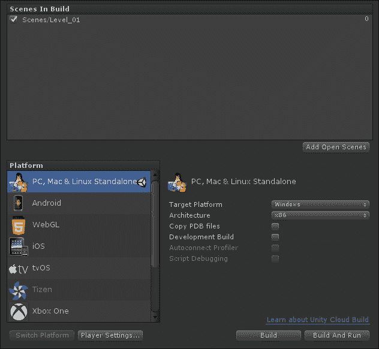

如果你点击**玩家设置…**按钮，你将进入构建的具体选项。在这里，你可以找到更多关于它的信息：[`docs.unity3d.com/Manual/class-PlayerSettings.html`](https://docs.unity3d.com/Manual/class-PlayerSettings.html)。

一旦你点击**构建**，Unity 实际上会构建游戏，你可以喘口气（并且休息一下）。但在这里，这只是第二阶段的开始，在这个阶段，你需要实际发布和推广游戏！

## 澄清事实

你已经兴奋起来，你几乎到达了终点线，但在这个时候确保每个人，我是指所有参与其中的人，都清楚接下来会发生什么，这是至关重要的。更重要的是，确保每个人都已经被计算在内。例如，利润/版税如何分配，游戏发布后的责任，等等。当然，这些内容在项目早期就已经在合同中概述，他们已经签署了，但我们都有在实际上没有阅读的情况下同意条款和条件的过失。在这个阶段提醒大家重新审视他们的合同甚至可能是有益的。

## 接受条款和条件

现在既然你的团队都准备好了，你需要确保你即将向世界展示的内容也遵守你将要针对的平台条款和条件。例如，如果你计划为 Android 设备发布，确保你已经满足了他们的条款和条件；对于苹果的 App Store 以及你打算发布的任何其他平台也是如此。

# 本地化

当你面向全球发布时，你需要本地化你的游戏。许多开发者认为仅用英语发布应该足够，因为大多数玩家都能理解英语。然而，如果你查看市场和下载图表，很明显英语只占市场的 20%。因此，你绝对应该考虑将你的游戏本地化到其他受众。

但本地化远不止于将你的游戏翻译成其他语言或添加字幕。有许多事情你应该考虑。以下是一些众多原因中的几个：

+   在某些语言中，如德语，一些单词非常长，它们可能会被截断或从用户界面溢出。

+   一些语言，如阿拉伯语，是以不同的方向书写的，例如从右到左或从上到下。因此，你可能需要调整你的 UI 设计以支持界面将产生的视觉影响。

+   如果你拥有对话系统，或者代码中使用字符串连接的用户界面，请注意，在其他语言中，如果它们不够灵活，它们需要重写！一个例子是当你想在单词前放置一个形容词时。在其他一些语言中，它可能发生在相反的方向。例如，英语句子“the *red hat*”在意大利语中变为“*il cappello rosso*”，其中“rosso”意为红色。因此，形容词在单词之后而不是之前，这与英语不同。另一个（实用的）例子如下：你为你的物品预留一个额外的字符在末尾以添加一个“*s*”使其变为复数（“*potion*”可以变为“*potions*”）。在意大利语中，你不需要额外的字符，只需更改最后一个字符（“*pozione*”变为复数形式“*pozioni*”）。此外，在意大利语中，最后一个更改的字符取决于对象是女性还是男性（这是一个在英语中不存在的概念，因为对象没有性别）。因此，你为预留字符的解决方案结构不足以支持意大利语。想象一下将这种解决方案应用到所有其他语言，你很快就会意识到仅通过添加几个变量来本地化你的游戏并不容易。

+   在某些文化中，数字中逗号和点的角色是颠倒的（例如，数字 3,218 可以解释为三千二百一十八，也可以解释为三点二一八，就像在意大利一样）。

+   在某些文化中，某些概念可能不受欢迎，因此应该被审查或删除。这通常与暴力游戏或包含某些类型成人内容的游戏有关。

在翻译时，你应该考虑所有这些问题，因为翻译并不像获取文本的翻译那么简单。以下是一些例子，但绝非详尽无遗：

+   翻译人员需要了解游戏背景，因为在其他语言中，直接翻译会丢失很多细微差别，在可能的情况下，它们应该被保留。

+   角色的传记在合作者为其他语言配音时很有用

+   一些隐喻或谚语在其他语言中可能没有意义

因此，你应该从开发流程的最初阶段就考虑本地化。然而，由于时间和经济限制，这通常是不可能的。无论如何，请记住，你越早关注本地化，长远来看就越容易。

# 伦理考量

电子游戏是一种技术，就像所有技术一样，它们可能是有害的，会伤害人们。它们可以被用作伤害人的武器。不幸的是，游戏的这一伦理方面往往被忽视。因此，我想引用 Jesse Schell 在他的书中（《游戏设计艺术：透镜之书》）所写的内容：

> *"如果你正在设计一款涉及陌生人交谈的游戏，你必须对可能导致的后果负责。这是罕见的情况之一，你的游戏设计选择可能会拯救或失去生命。你可能认为你的游戏中发生危险的可能性只有百万分之一，但如果这是真的，并且你的游戏非常成功，有五百万人在玩，那么那个危险的事情就会发生五次。"*

作为游戏开发者，你有责任尽你所能确保这种情况永远不会发生。如果你不愿意承担这样的责任，可能最好不要制作任何游戏。

在我个人的观点中，这也与 Jesse Schell 的观点一致，正如你可以从他的书中读到的那样，你有潜力做一些好事，并利用电子游戏作为提升人类生活的工具。你应该被像“我正在开发的游戏是否在做一些好事？”和“我的游戏能否以某种方式改善玩家的生活？”这样的问题所激励。当然，这些问题并不是游戏公司关心的，但你作为游戏开发者应该关心，并在内心深处回答这些问题。然后，尝试让你的游戏成为对人们更好的游戏。

### 注意

同样的论点，但解释得更详细，可以在 Jesse Schell 的书中找到专门的章节。

请以你自己的方式，让这个世界变得更美好！

# 摘要

在这一章中，我们遇到了许多主题，探索了许多领域，所以让我们重新组织我们的想法。

在开始时，我们讨论了我们塔防游戏的潜在改进以及它们实施的一些提示。从那里，我们将改进扩展到了 Unity 的整体，通过提供更多我们没有时间详细覆盖的游戏开发领域，但如果你希望提高自己的技能，这些领域需要你的关注。

在游戏开发过程中，你通常并不孤单，而是身处一个团队中，并且每个团队成员都像是一个整体（就像人体一样）那样工作，这对于实现最佳结果非常重要。因此，我们强调了某些协作工具，这样你就可以自由尝试并选择最适合你团队的工具。

然后，我们回到了我们的游戏，通过关注优化和测试，这两者都被错误地认为是游戏开发流程的最后步骤，但正如我们所发现的那样，这并不正确。你越早开始迭代它们，你的游戏就会越好。优化是使你的游戏高效运行所必需的，而测试是使玩家的体验流畅所必需的。

我们并没有就此停止，而是继续讨论了游戏完成后的事情，我们讨论了从营销你的游戏、创建在线存在感以发布你的游戏，以及希望从中获得收益的话题。因此，我们探索了许多关于如何利用最常见的社会媒体平台作为工具来通过参与和扩大目标受众来推广你的形象和你的游戏的提示。

最后，我们只是触及了本地化的表面，只是为了更好地了解其背后的内容，因为我们没有时间正确面对它，但这一点值得一提。

# 最后的笔记和告别

不幸的是，这次在游戏开发世界的旅行已经结束（尽管最后一章应该让你意识到这仅仅是你的旅程的开始）。时间飞逝，我刚刚意识到我填满了一整本书！

我真的非常感谢你们所有人，那些我没有机会亲自见到的读者。但当我写到这本书的最后一行时，我感到以某种方式与你们所有人都有联系。对我来说，这是一次令人惊叹的旅行（尽管有时会感到疲惫和有压力）。

如果你非法下载了这本书但真的很喜欢它，请考虑购买它。我努力提供高质量的内容，这需要时间。如果你负担不起这本书，你总是可以给我一杯咖啡([www.francescosapio.com/BuyMeACoffee](http://www.francescosapio.com/BuyMeACoffee))，或者通过在社交媒体上分享购买链接（而不是通过种子和下载）来支持这本书。

我还写了其他可能对你旅程有所帮助的书籍，包括 *Unity UI 美术设计手册*，Packt 出版 ([www.packtpub.com/game-development/unity-ui-cookbook](http://www.packtpub.com/game-development/unity-ui-cookbook)) 和 *Unity 5.x 2D 游戏开发蓝图*，Packt 出版 ([www.packtpub.com/game-development/unity-5x-2d-game-development-blueprints](http://www.packtpub.com/game-development/unity-5x-2d-game-development-blueprints))). 此外，这里还有我在 第一章 中引用的迷你指南，*Unity 中的平坦世界*：*你需要了解的 Unity 5 知识*，Packt 出版 ([www.packtpub.com/packt/free-ebook/what-you-need-know-about-unity-5](http://www.packtpub.com/packt/free-ebook/what-you-need-know-about-unity-5))。

最后，网络交流、结识他人和分享想法是扩展你的知识和技能的绝佳方式。所以请随时联系我：

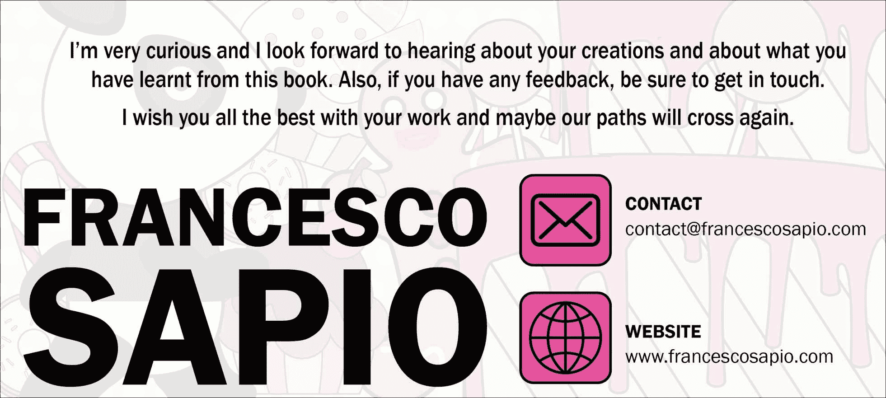
