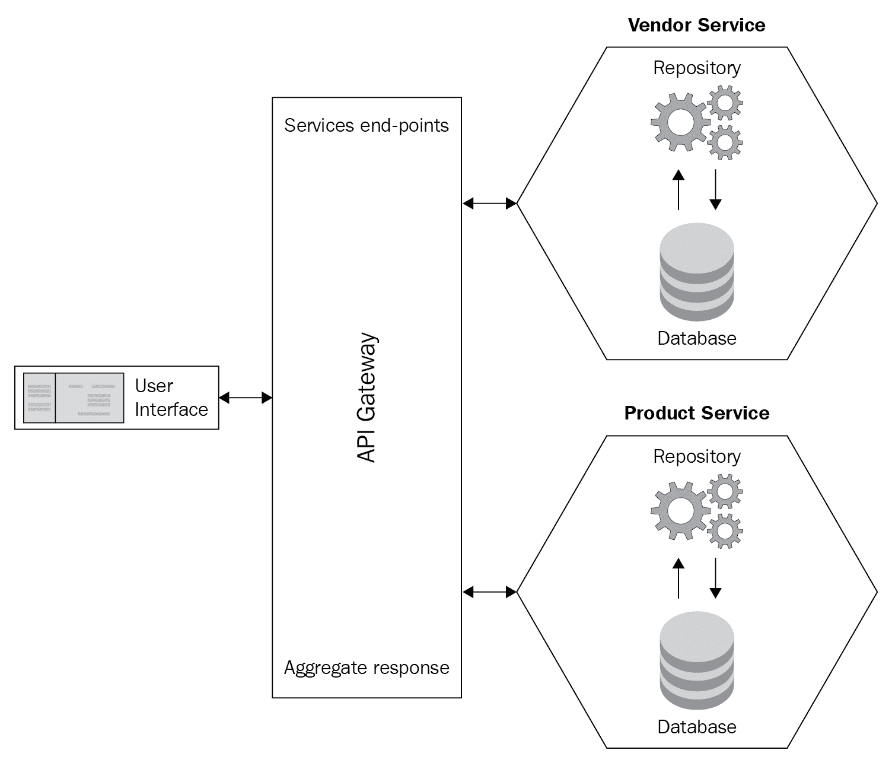
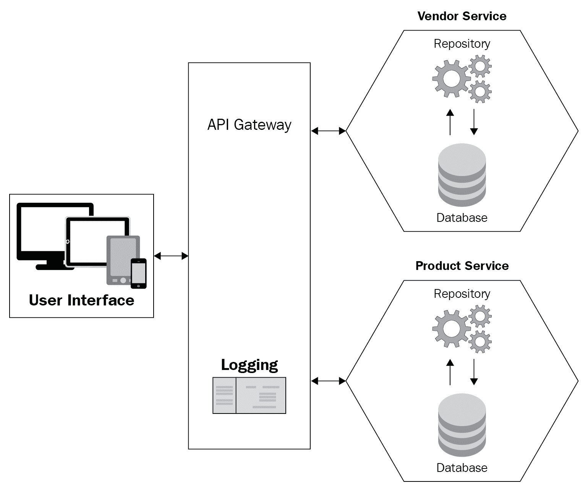
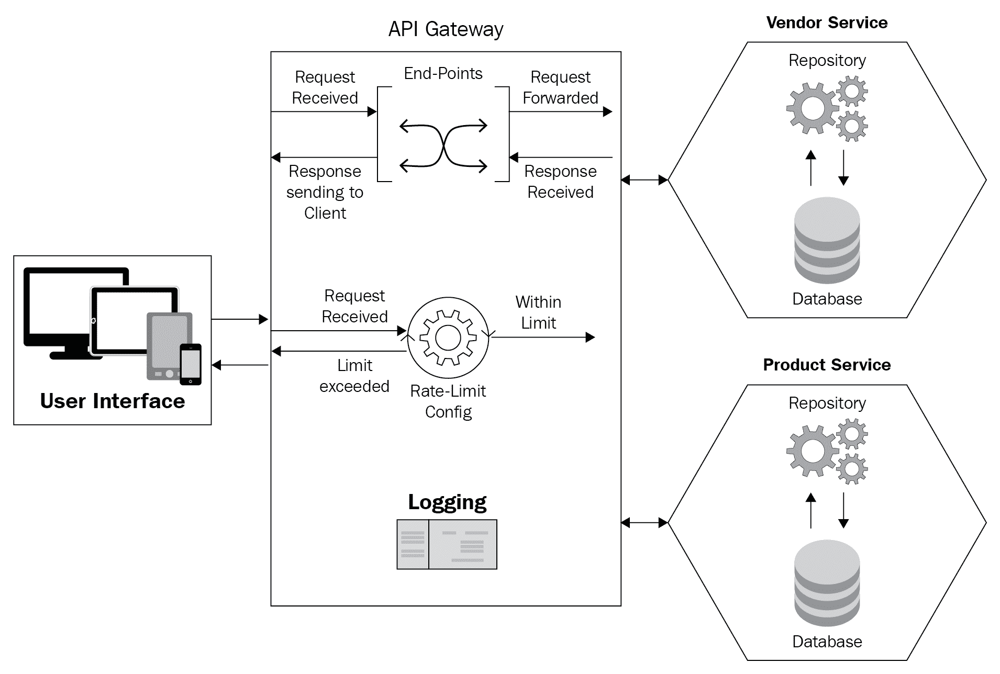
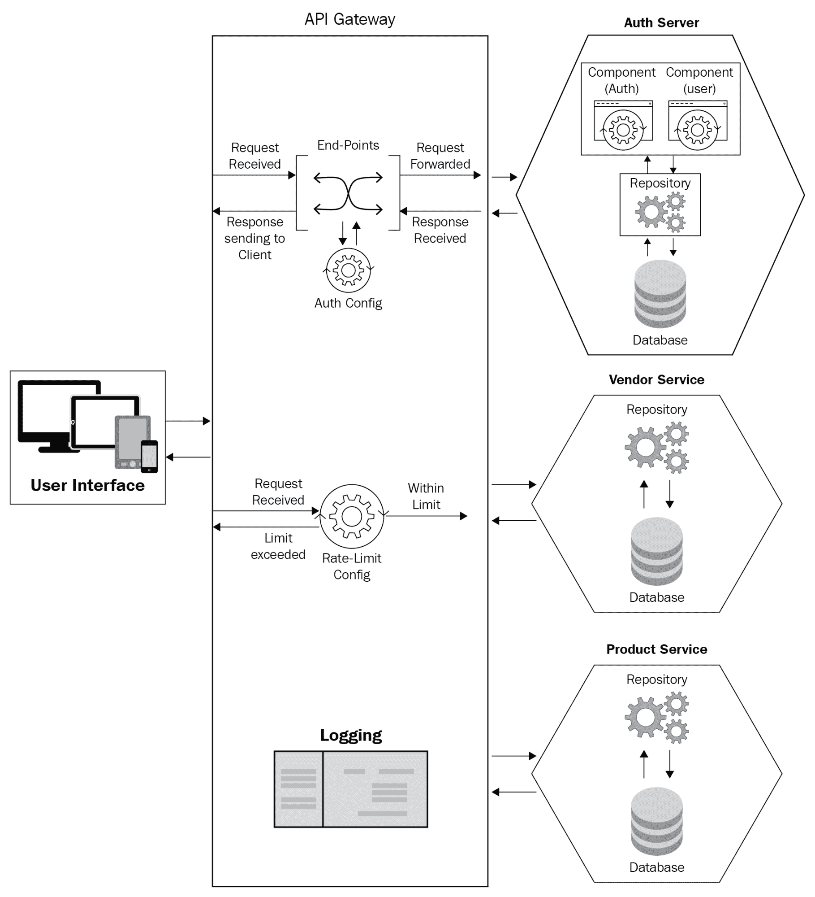
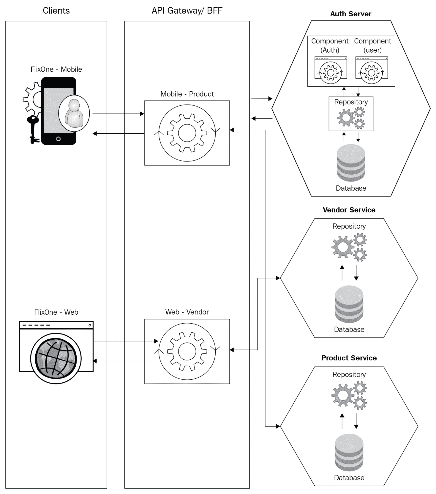

# 十三、附录

本节将指导您如何实现自己的应用编程接口网关。我们在本书中讨论的例子在 Azure 应用编程接口管理中使用。如果您想在 Azure 应用编程接口管理之外设置自己的应用编程接口网关，请参考本附录。

You can find all the working examples related to the API Gateway in the `Chapter 10` folder of this book's GitHub repository, which is located here: [https://github.com/PacktPublishing/Hands-On-Microservices-with-CSharp-8-and-.NET-Core-3-Third-Edition/tree/master/Appendix](https://github.com/PacktPublishing/Hands-On-Microservices-with-CSharp-8-and-.NET-Core-3-Third-Edition/tree/master/Appendix).

为了坚持实现应用编程接口网关，我们将专注于实现应用编程接口网关，并总结本书中提供的代码示例。

# 应用编程接口网关模式

API Gateway 是唯一一个位于 UI(客户端)和服务中心级别的网关，这意味着 UI 可以使用它来与微服务协作。它为我们管理和扩展这些服务提供了更简单的方法。它为我们提供了另一个关于所需的各种客户端(应用)的粒度(应用及其范围)。

Simply put, granularity describes *a framework that is separated into little sections. Huge frameworks can also be* *separated or divided into better, more appropriate sections*.

应用编程接口网关在微服务中的作用是通过特定的安排和解释，在客户端和托管服务之间提供一个中间的、直接的连接。这样，客户端只关注对它的要求，而不关注服务器端。

The API Gateway exemplifies the framework's design and gives us a service that is custom-fitted to every client. It may serve different operations – for instance, validating incoming requests.

# 根据其优缺点调整应用编程接口网关

应用编程接口网关模式的实现对我们开发人员有一些好处。例如，应用编程接口网关允许我们对客户端(用户界面/最终用户)隐藏服务的实际端点，还允许我们在一个地方为多个客户端(用户界面)处理业务逻辑。API 网关有它自己的优点和缺点。

下面是实现应用编程接口网关模式的优点:

*   客户端(用户界面)可以通过向服务发出最少的请求来获得完整的数据。
*   我们可以处理多种格式的响应，比如 JSON、XML 等等。身份验证和日志记录也可以通过应用编程接口网关模式的实现来管理。
*   我们可以减少客户端和应用之间的往返行程。
*   它帮助我们在一个地方访问不同的 API，就像网关展示的那样。

应用编程接口网关提供了许多其他优点，但仍有一些缺点，例如:

*   性能下降是有可能的，因为大多数响应的操作和转换都发生在应用编程接口网关本身。
*   有可能出现单点故障。如果在应用编程接口网关方面出现任何问题，那么客户端将会遇到故障。
*   它需要额外的关注和编码来管理路线。
*   它增加了系统的复杂性。

# 实现应用编程接口网关时的首选实践

如果我们想要实现这种模式，我们应该遵循这些最佳实践:

*   我们应该在应用编程接口网关的中心位置实现日志记录和监控。通过这样做，我们节省了大量的精力，这些精力是我们在实现、记录和监控单个服务时所投入的。可能存在您想要记录独立服务的场景。在这种情况下，您的代码实现应该非常干净，这样就不会在多个地方记录相同的数据。
*   对于聚合服务，在应用编程接口网关中有一个组合逻辑来返回客户端特定的响应是很好的。但是，当聚合服务具有复杂的业务逻辑或者您有特定的需求(例如不使用应用编程接口网关)时，您可以在没有应用编程接口网关的情况下继续。例如，在[第 10 章](10.html)、*设计模式和最佳实践*中，在*聚合器模式*部分，由于我们的需求，并且因为我们的代码包含不太复杂的业务逻辑，我们在不使用 API Gateway 的情况下实现了聚合服务。
*   在实现安全性时，请确保以正确的方式进行。这意味着评估您是需要单个服务还是一组服务的安全性。您还可以创建安全策略。例如，假设您有一个策略，要求来自所有传入请求的登录和密码详细信息。您可以将此策略应用于服务或一组服务，在这些服务中，您希望使用服务的登录名和密码对服务进行身份验证。

这是我们将在代码示例中遵循的最佳实践的基本列表，我们将在后面讨论。

# 实现应用编程接口网关

关于我们的 FlixOne 应用，我们有不同的服务，所有这些服务都是细粒度的，并使用它们自己的数据库。消费这些服务客户端(任何网络或移动设备)有点复杂，因为这些服务托管在不同的服务器上。这使得很难从所有不同的客户端管理这么多不同的端点。如果在服务器端进行了任何更改，例如服务器发生了更改，这也需要客户端做出努力来更改代码。此外，如果承载这些 API 的任何服务器停机/离线，我们的最终用户(客户端)将会受到影响，这可能会对客户端应用产生影响。

以下是我们想要实现自己的应用编程接口网关的主要原因:

*   所有客户端都应该有一个端点。目前，我们没有这样的设施。
*   没有办法得到`ProductService`和`VendorService`的组合输出。目前，这是通过显式调用单个服务来实现的。
*   应该在中央一级进行记录和监测。目前，我们正在记录各个服务级别。
*   在请求到达实际服务之前，安全性应该在中央级别完成。目前，所有的服务都有自己的安全实现。

从头开始创建一个应用编程接口网关非常耗时，并且需要大量的工作。正因为如此，对于 FlixOne 的应用，我们将采用 Ocelot。有几个理由去使用豹猫应用编程接口网关。现在我们来谈谈这些。

# 更喜欢豹猫

我们选择 Ocelot 作为我们的 API Gateway 实现的主要原因是，Ocelot 是开源的.NET 框架和.NET Core。它还支持。. NET Core 3.1(的当前版本.NET Core)。作为一个开源项目，我们有自由定制代码，并按照我们的要求使用它。

The source code for Ocelot can be found at [https://github.com/ThreeMammals/Ocelot](https://github.com/ThreeMammals/Ocelot).

更重要的是，为了满足我们在内部使用应用编程接口网关的要求，我们需要各种各样的功能。其中一些必需的特性如下:

*   它允许我们定义自己的路线。例如，如果我们有`api/product/listproduct`，这是我们的`product`服务的路线，那么通过使用这个功能，我们可以使它类似于`/product/list`的东西。在这种情况下，客户/消费者需要使用`/product/list`来获取产品列表。
*   它为我们提供了安全性，这样我们就可以应用身份验证和授权。
*   通过缓存功能，它减少了后续调用，并且可以根据我们的要求从可用的缓存中管理数据。
*   我们可以设置重试策略。如果任何请求的服务关闭或没有响应，这将有所帮助。
*   通过日志记录和监控，我们可以解决记录请求和响应数据的关键问题之一。

# 初始步骤

为了开始使用豹猫应用编程接口网关，我们需要设置我们的项目。这需要遵循以下步骤:

1.  打开 Visual Studio。
2.  转到开始|创建新项目。您也可以单击“继续”来继续操作，而无需此屏幕中的代码链接。在这种情况下，您需要单击文件|新建项目来创建新项目。
3.  选择 ASP.NET Core 网络应用，然后单击下一步。
4.  输入项目名称，选择路径，然后单击“创建”。
5.  在下一个屏幕上，选择一个空模板并单击创建；确保您已经选择.NET Core 和 ASP.NET Core 3.1。
6.  右键单击添加|新项目。
7.  在下一个对话框中，选择 JSON 文件，命名为`apiroute.json`，点击【添加】。
8.  接下来，我们添加对豹猫的支持。为此，请转到工具|否获取包管理|包管理器控制台。在包管理器控制台中执行以下代码:

```cs
Install-Package Ocelot
```

9.  现在，打开 apiroute.json 文件。这个文件是一个配置文件，是 Ocelot 所需要的。添加以下 JSON 数据:

```cs
{
  "ReRoutes": [
    {
      "DownstreamPathTemplate": "/api/product/productlist",
      "DownstreamScheme": "https",
      "DownstreamHostAndPorts": [
        {
          "Host": "localhost",
          "Port": 44338
        }
      ],
      "UpstreamPathTemplate": "/product/list",
      "UpstreamHttpMethod": [ "GET" ]
    },
    ...
   ],
  "GlobalConfiguration": {
    "BaseUrl": "https://localhost:44340"
  }
}
```

在前面的代码示例中，有两个部分:`ReRoutes`(一个数组)和`GlobalConfiguration`。`ReRoutes`的主要功能是接收所有传入的请求，然后将其转发给相关服务(也称为下游服务)。然后，路由识别相关的服务(也称为上游服务)，以便它可以传递请求。`GlobalConfiguration`顾名思义，是适用于所有路线的配置。它还允许我们覆盖`ReRoutes`设置。我们的配置文件具有以下属性:

10.  在我们开始通过应用编程接口网关调用这些应用编程接口之前，我们必须对我们的代码进行一些更多的更改，以便豹猫能够顺利工作。打开`Program.cs`文件，用以下代码替换`CreateHostBuilder(string[] args)`方法:

```cs
public static IHostBuilder CreateHostBuilder(string[] args) =>
            Host.CreateDefaultBuilder(args)
            .ConfigureAppConfiguration((hc, config) =>
            {
                config.AddJsonFile("apiroute.json");
            })
            .ConfigureServices(oc => 
            {
                oc.AddOcelot();
            })
                .ConfigureWebHostDefaults(webBuilder =>
                {
                    webBuilder
                    .UseStartup<Startup>()
                    .Configure(app =>
                    {
                        app.UseOcelot().Wait();
                    });
                });
```

在前面的代码中，我们通过添加`AddOcelot()`来启用豹猫的依赖性。这包括当我们使用`UserOcelot().Wait()`处理所有请求时的中间件。这有助于我们的应用作为应用编程接口网关工作。现在我们已经准备好测试我们的 API Gateway 的基本实现，请按 *F5* (假设产品和供应商服务正在运行)。

有了这些，我们已经实现了基本支持的豹猫应用编程接口网关。在下一节中，我们将向我们的应用编程接口网关添加更多功能，如下所示:

*   聚合
*   记录
*   费率限制
*   安全

# 聚合

我们需要应用编程接口网关聚合，以便从两个不同的服务中获得组合结果。下图可视化了聚合的工作原理:



上图是我们解决方案的示意图。**应用编程接口网关**是一个单点联系人，它接收来自**用户界面**的请求，并将其转发给**供应商服务**和**产品服务**。此外，**应用编程接口网关**提供带有**服务端点**的**用户界面**和**聚合响应**。

打开`apiroute.json`文件，使用以下代码更新 JSON 文档:

```cs
{
  "ReRoutes": [
    //Product Service Routes
      ...
      "UpstreamPathTemplate": "/product/single/byvendorid/{id}",
      "UpstreamHttpMethod": [ "GET" ],
      "Key": "product"
    },
    ...
    //Vendor Service Route
    {
      ...
      "UpstreamPathTemplate": "/vendor/{id}",
      "UpstreamHttpMethod": [ "GET" ],
      "Key": "vendor"
    }
  ],
  "Aggregates": [
    {
      "ReRouteKeys": [
        "product",
        "vendor"
      ],
      "UpstreamPathTemplate": "/productlist/{id}"
    }
  ],
 ...
```

在前面的代码中，我们为`ProductService`和`VendorService`路线添加了`Key`属性。在`ReRouteKeys`中，我们指示我们的网关聚合由`product`和`vendor`键表示的集合。

You can also run all the service projects by executing the `runprojects.bat` file, which is available under the `Api Gateway pattern`| `Aggregation` folder of the `Chapter 10` folder in this book's GitHub repository.

为了使代码实现简单并符合其描述服务的范围，我们将使用 Postman 验证响应。为此，启动邮递员应用，输入`/productlist/{id}`资源，然后从邮递员界面单击发送。

# 记录

就我们的`FlixOne`应用而言，日志记录是应用编程接口网关的必备功能之一。我们将在应用编程接口网关级别实现日志记录。下图将帮助我们可视化应用编程接口网关日志记录:



上图是我们在 FlixOne 应用中实现的图示，其中我们将**日志记录**放在**应用编程接口网关**上。这样，我们就避免了向每个服务添加日志代码。

`Log4Net` is a logging library that allows us to log the preferred operations of the application. The log data can be available in various sources, such as `Console`, `File`, `DB`, and so on. Moreover, `Log4Net` is open source, which means you can take advantage of it to customize the source code and use it as per your requirements.

在`Package Console`执行以下命令，打开`FlixOne.BookStore.ApiGateway`项目，为`Log4Net`增加支持:

```cs
Install-Package Microsoft.Extensions.Logging.Log4Net.AspNetCore
```

现在，我们需要指示我们的应用编程接口网关将输出记录到文件中。为此，添加一个新文件，将其命名为`Log4Net.config`，并用以下代码更新该文件:

```cs
<?xml version="1.0" encoding="utf-8" ?>
<log4net>
...
  <appender name="RollingFile" type="log4net.Appender.RollingFileAppender">
    <file value="FlixOneLog.log" />
     <appendToFile value="true" />
    <maximumFileSize value="10MB" />
    <maxSizeRollBackups value="3" />
...
  </appender>
  <root>
    <level value="ALL"/>
    <appender-ref ref="DebugAppender" />
    <appender-ref ref="RollingFile" />
  </root>
</log4net>
```

在前面的代码中，我们配置了`Log4Net`，以便使用`DebugAppender`和`RollingFile`记录输出。这些附加器被定义为以特定的格式记录消息，这在`ConversionPattern`中提到。您会发现在前面的代码中，`DebugAppender`和`RollingFile`的输出格式是不同的。我们还配置了`RollingFile`追加器，这样日志文件的大小不会从 10 MB 增加，文件的最大数量是`3`。这些文件将以`FlixOneLog.log`的名称存储。我们配置了我们的记录系统，以便通过将级别值设置为`ALL`来记录所有内容。该值可以根据您的环境进行更改；例如，您不会对在生产环境中记录`DEBUG`感兴趣。

以下是`Log4Net`的各个级别:

*   `All`:记录一切。
*   `Debug`:只记录调试操作。例如，如果记录器是`Log4Net`的实例，那么`Logger.Debug("This is a Debug log!");`将被记录。
*   `Info`:只记录信息操作。例如，如果记录器是`Log4Net`的实例，那么`Logger.Info("This is an Info log!");`将被记录。
*   `Warn`:只记录警告信息。例如，如果记录器是`Log4Net`的实例，那么`Logger.Warn("This is a Warn log!");`将被记录。
*   `Error`:主要记录异常或自定义错误信息。例如，如果记录器是`Log4Net`的实例，那么`Logger.Debug("This is an Error log!");`将被记录。

接下来，打开`Startup.cs`文件，使用以下代码更新`Configure`方法:

```cs
public void Configure(IApplicationBuilder app, IWebHostEnvironment env, ILoggerFactory loggerFactory)
{
    ...
    loggerFactory.AddLog4Net();
    app.UseOcelot().Wait();
}
```

在前面的代码中，我们在`app.UseOcelot().Wait()`之前添加了`loggerFactory.AddLog4Net();`。通过这样做，我们说我们的应用编程接口网关将根据我们的配置记录每个请求/响应的输出，这在`Log4Net.config`文件中提供。

You can also run all the projects by executing the `runprojects.bat` batch file, which is available under the `Api Gateway pattern` | `Logging` folder of the `Chapter 10` folder,  in this book's GitHub repository.

# 通过定义速率限制保护服务免受攻击

保护应用免受外部攻击是我们需要执行的最重要的任务之一。我们可以在应用编程接口网关的帮助下做到这一点，它将控制到达我们的应用编程接口网关的应用编程接口请求。攻击者可以在几分之一秒内发送大量请求——有时是数千个。这就是所谓的**分布式拒绝服务** ( **分布式拒绝服务**)攻击。在这里，攻击者以特定的机器或应用为目标，发送多个请求。为了处理这个问题，我们需要为请求设置速率限制。我们将在我们的`FlixOne.BookStore`应用中实现同样的功能。

请看下图，了解我们试图实现什么来解决上述问题:



上图清楚地显示，每当在**应用编程接口网关**收到请求时，**应用编程接口网关**内的**速率限制配置**会为客户端分析请求的配额，请求要么被转发到服务器端的相关服务，要么被返回到客户端，并带有*指定配额超出*的消息。

要在应用编程接口网关中实现速率限制，请打开`FlixOne.BookStore.ApiGateway`项目并限制我们的一项服务，以便它在`3`秒内发出请求。为此，请使用以下代码更新产品服务:

```cs
{
      "DownstreamPathTemplate": "/api/product/productlist",
      "DownstreamScheme": "https",
      "DownstreamHostAndPorts": [
        {
          "Host": "localhost",
          "Port": 44338
        }
      ],
      "UpstreamPathTemplate": "/product/list",
      "UpstreamHttpMethod": [ "GET" ],
      //Setting up a limit for 1-request within 3second, retry in 5seconds
      "RateLimitOptions": {
        "ClientWhitelist": [],
        "EnableRateLimiting": true,
        "Period": "3s",
        "PeriodTimespan": 5,
        "Limit": 1
      }
    }
```

在前面的代码中，我们正在配置我们的`Upstream`服务的`/product/list`，这是一个`GET` `HttpMethod`，通过提供以下`RateLimitOptions`来限制`3s`内的`1`请求:

*   `ClientWhitelist`:由一组客户端 IP 组成，考虑白名单客户端。这意味着来自这些白名单客户端的传入请求将不属于白名单 IPs 的规则。
*   `EnableRateLimiting`:由`true` / `false`值组成。这表明我们是否指示我们的应用编程接口网关启用/禁用端点速率限制。在我们的案例中，我们启用了`/product/list`端点的速率限制。
*   `Period`:由`{number}{unit}`格式的时间段组成，其中`number`根据单位为 *1* 至 *n* ，单位为`s`秒、`m`分钟、`h`小时、`d`天。在我们的例子中，我们为`Period`的值提供了`3s`，这意味着 3 秒。
*   `PeriodTimespan`:如果在规定的`Period`内超过限制，这实际上是一个等待期(以秒为单位)。在我们的例子中，我们必须等待 5 秒钟才能发出第二个请求。
*   `Limit`:表示我们在规定的`Period`内可以提出的最大请求数。在我们的例子中，我们只能在 3 秒内提出一个请求，我们需要等待 5 秒钟才能提出第二个请求。

You can also run all the projects by executing the `runprojects.bat` batch file, which is available under the `Api Gateway pattern` | `Rate-Limit` folder of the `Chapter 10` folder in this book's GitHub repository.

运行应用编程接口网关项目，并在首选浏览器中按下`/product/list`端点。你会得到预期的结果。现在，想打多少次 *F5* 就打多少次。您将看到您无法发出请求，但可以看到限速消息，如下图所示:


前面的截图显示，我们试图在 3 秒内发出多个请求，这是不可能的。

When we set `EnableRateLimiting` to `true`, we are actually adding the `X-Rate-Limit` and `Retry-After` headers with the specified requests.

# 实施安全服务

安全性是目前最大的担忧之一。为了解决这个问题，我们将在我们的应用编程接口网关中实现安全性。我们将把我们所有的服务都标记为安全的，这样如果客户试图直接请求后端服务，他们就会得到一个未经授权的错误消息。

考虑下图，了解我们试图实现什么来解决我们的问题:



在上图中，我们用新的**身份验证服务器**将**身份验证配置**组件添加到我们的应用编程接口网关中。现在，每当应用编程接口网关收到一个请求时，**身份验证配置**组件将检查该请求是否满足指定的身份验证机制。应用编程接口网关将相应地拒绝或转发该请求到后端服务。我们的**授权服务器**生成一个 **JWT 令牌**。它还处理用户注册操作。

If you are writing a production-ready application, do not create and validate tokens in the same place; you can secure and validate it by adding another layer. 

现在，我们已经向我们的 API Gateway 添加了所需的特性，我们还需要注意一点，即公开每个客户端的服务端点。这意味着移动设备的客户端将具有与 web 应用的客户端不同的服务端点。现在我们已经实现了应用编程接口网关模式，让我们考虑一个场景，在这个场景中，我们的客户需要根据他们的目标设备提供特定的内容。我们可以借助前端 ( **BFF** )模式的**后端来做到这一点。这就像创建一个客户端特定的应用编程接口网关。在下一节中，我们将学习如何为前端实现后端。**

# 前端图案的后端

前端后端模式帮助我们为所有或特定的前端应用(用户界面)创建单独的后端服务，用户界面向其特定的后端服务发送请求。如果您想避免为单个后端进行多界面定制，这种模式非常有用。

下图描述了我们正在努力实现的目标:



上图告诉我们，我们有两个**应用编程接口网关**块。一个是**移动-产品**，为移动设备的客户端提供`Product Service`的端点，另一个是**Web-厂商**，为所有 Web 客户端提供`Vendor Service`的端点。

We have created two new projects for this: `FlixOne.BookStore.Web.ApiGateway` and `FlixOne.BookStore.Mobile.ApiGateway`.

考虑来自`FlixOne.BookStore.Web.ApiGateway`项目的`apiroute.json`文件的以下代码:

```cs
{
  "ReRoutes": [
    //Vendor Service Route
    {
      "DownstreamPathTemplate": "/api/Vendor/{id}",
      "DownstreamScheme": "https",
      "DownstreamHostAndPorts": [
        {
          "Host": "localhost",
          "Port": 44339
        }
      ],
      "UpstreamPathTemplate": "/vendor/{id}",
      "UpstreamHttpMethod": [ "GET" ],
      "Key": "vendor"
    }    

  ],
  "GlobalConfiguration": {
    "BaseUrl": "https://localhost:44340"
  }
}
```

前面的代码是不言自明的。这里，我们正在为应用编程接口网关配置端点，以获得来自`Vendor Service`的供应商响应。

考虑来自`FlixOne.BookStore.Mobile.ApiGateway`项目的`apiroute.json`文件的以下代码:

```cs
{
  "ReRoutes": [
    //Product Service Route

    {
      "DownstreamPathTemplate": "/api/product/{productid}",
      "DownstreamScheme": "https",
      "DownstreamHostAndPorts": [
        {
          "Host": "localhost",
          "Port": 44338
        }
      ],
      "UpstreamPathTemplate": "/mobile/product/{productid}",
      "UpstreamHttpMethod": [ "GET" ],
      "Key": "product"
    }
  ],
  "GlobalConfiguration": {
    "BaseUrl": "https://localhost:44341"
  }
}
```

在前面的代码中，我们配置了**移动应用编程接口网关**，以获得来自`Product Service`的响应。

通过实现 BFF，我们为相关客户提供了独立的 API。通过这种方式，我们实现了以下目标:

*   所有端点的单一联系人。这是在我们实现应用编程接口网关时实现的。
*   现在，移动设备的客户端和 web 界面的客户端都有自己特定的 API。这些 API 为他们提供相关的内容。

现在，我们通过应用编程接口网关为客户提供了所需的服务。