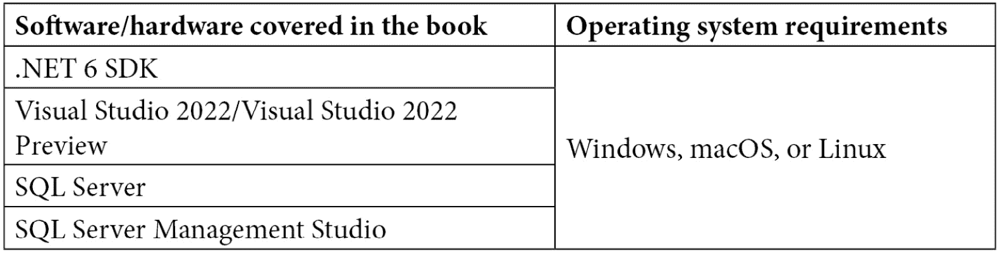

# 前言

在构建应用程序的同时编写高性能代码至关重要，多年来，Microsoft 一直专注于在.NET 生态系统中提供各种与性能相关的改进。本书将帮助你理解使用 C#和.NET 的新版本设计响应性、弹性和高性能应用程序所涉及到的各个方面。

你将从理解高性能代码的基础以及 C# 10.0 和.NET 6 的最新性能相关改进开始。接下来，你将学习如何使用跟踪和诊断来追踪性能问题和内存泄漏的原因。接下来的章节将向你展示如何提高网络应用程序的性能以及提高目录任务、文件任务等多种方式的性能。你将继续提高数据查询性能并编写响应式用户界面。你还将发现如何使用云提供商，如 Microsoft Azure，来构建可扩展的分布式解决方案。最后，你将探索各种同步、异步和并行处理代码的方法，以减少处理一系列任务所需的时间。

在本 C#编程书籍结束时，你将拥有构建高度弹性、高性能应用程序所需的信心，以满足客户的需求。

# 本书面向对象

这本书是为软件工程师、专业软件开发人员、性能工程师和应用性能分析人员编写的，他们希望提高代码的速度或提升技能以获得竞争优势。你应该是一位熟练的 C#程序员，能够熟练地使用该语言，并且对使用 Microsoft Visual Studio 2022 感到舒适。

# 本书涵盖内容

*第一章*，*介绍 C# 10.0 和.NET 6*，讨论了**公共语言运行时**（**CLR**）。你将从了解 C# 10.0 和.NET 6 中的新特性开始。然后，你将学习.NET 原生运行时和 CoreCLR。接下来，你将学习统一的 BCL，然后是 Windows Store 性能。最后，你将学习 ASP.NET 5 的性能。

*第二章*，*实现 C#互操作性*，介绍了 Microsoft .NET 互操作性。你将学习如何调用和释放不安全代码。你还将学习如何使用 COM 互操作性将遗留 COM 程序迁移到.NET。在本章中，你将学习如何创建.NET 库和组件，并在遗留 COM 应用程序中使用它们。到本章结束时，你将学会如何在.NET 中消费 COM 组件，以及如何在 COM 组件中消费.NET 应用程序。这将帮助你将 COM 应用程序迁移到.NET 平台。

*第三章*, *预定义数据类型和内存分配*，探讨了 C#的原始类型和 C#对象类型。你将了解栈和堆，以及按引用和按值传递数据。然后你将学习装箱和拆箱及其对应用程序性能的影响。你还将刷新对 C#原始类型的了解，以及如何构建性能良好的对象。

*第四章*, *内存管理*，讨论了垃圾回收器。你将学习如何使用跟踪和诊断来追踪性能问题和内存泄漏的原因。然后你将了解对象代和垃圾回收器如何决定要丢弃什么。你还将了解弱引用以及如何正确地处理对象以防止内存泄漏。

*第五章*, *应用程序性能分析和跟踪*，教你如何对你的应用程序进行性能分析以识别性能较差的区域。你将了解代码指标以及如何执行静态代码分析。在你努力编写更高效代码的过程中，你将学习如何利用内存转储、加载的模块查看器、调试、跟踪和 dotnet-counters。当你完成本章时，你将拥有进行应用程序性能分析所需的技术和经验。

*第六章*, *.NET 集合*，探讨了集合框架。你将了解不同的集合以及如何最佳地使用它们以获得最佳性能。你将访问`System.Collection`、`System.Collection.Concurrent`和`System.Collections.Generic`命名空间中的各种集合。你还将创建自己的自定义异常，并学习如何使用 LINQ 查询集合。

*第七章*, *LINQ 性能*，解释了如何考虑性能进行 LINQ 查询。根据你如何使用 LINQ，返回相同结果的不同方法可能会有不同的行为和性能。因此，在本章中，你将学习如何最佳地执行 LINQ 查询以改善你应用程序的性能。

*第八章*, *文件和流 I/O*，解释了如何提高文件和目录的性能。你将学习提高目录任务、文件任务、内存任务和隔离存储任务的方法。在这本书中，你将学习如何异步写入文件和异步从文件中读取。

*第九章*, *增强网络应用程序的性能*，详细介绍了如何加快网络应用程序的性能。你将学习如何使用 TCP 和 UDP 网络协议在网络中进行通信。然后，你将学习如何使用 OSI 网络层参考模型和一系列 TCP 和 UDP 网络协议进行网络跟踪过程。还将涵盖缓存管理，以便你可以提高资源检索的效率。

*第十章**，设置我们的数据库项目*，在 SQL Server 上设置了 Northwind 数据库项目，因为我们将在下一节中使用此数据库来基准测试数据访问方法。

*第十一章*, *基准测试关系数据访问框架*，基准测试了三种不同的 SQL Server 数据库数据操作方法。我们将对 Entity Framework、ADO.NET 和 Dapper.NET 进行并行比较。在为这些数据访问和对象映射器运行基准测试之后，你将能够对适合你项目的最佳数据访问和对象映射形式做出明智的判断。

*第十二章*, *响应式用户界面*，解释了如何编写响应式用户界面。你将编写响应式的**Windows 窗体**（**WinForms**）、**Windows 表现基础**（**WPF**）、ASP.NET、.NET MAUI 和 WinUI 应用程序。使用后台工作线程，你将看到如何通过在后台运行长时间运行的任务来实时更新和操作用户界面。

*第十三章*, *分布式系统*，描述了分布式应用程序并解释了如何提高它们的性能。你将学习如何使用**命令查询责任分离**（**CQRS**）软件设计模式、事件溯源和微服务来构建高性能的分布式应用程序。你将看到如何使用云提供商，如 Microsoft Azure，利用 Cosmos DB、Azure Functions 和开源 Pulumi 基础设施工具构建可扩展的分布式解决方案。

*第十四章*, *多线程编程*，探讨了线程和线程的概念，并讨论了后台和前台线程。然后，你将学习在运行线程之前如何将数据传递到线程中。你还将学习如何暂停、中断、销毁、调度和取消线程。

*第十五章*, *并行编程*，解释了如何利用现代计算机中可用的多个 CPU 核心。你将学习如何通过在进程之间并发分配工作来处理你的代码。

*第十六章*, *异步编程*，揭示了 `async`、`await` 和 `WhenAll` 的神秘面纱。你还将了解不同的返回类型，如何提取所需的结果，以及如何正确取消异步操作和执行异步文件读写操作。

# 为了充分利用本书

你需要精通 C#，并知道如何使用 Visual Studio 2022 创建、运行和调试 C#程序以及安装 NuGet 包。如果你跟随本书的步骤，编写代码并使用指定的工具，你将能从本书中获得最大收益。但如果您太忙，请遵循 Microsoft 提供的获取和安装以下软件的指南。



**如果你使用的是本书的数字版，我们建议你亲自输入代码或从本书的 GitHub 仓库（下一节中有一个链接）获取代码。这样做将有助于避免与代码复制粘贴相关的任何潜在错误。**

请尝试回答问题，阅读每章末尾提供的外部资源，并将你所学应用到自己的编程和性能训练练习中。这将有助于巩固你在本书中学到的知识。

# 下载示例代码文件

你可以从 GitHub 下载本书的示例代码文件，链接为[`github.com/PacktPublishing/High-Performance-Programming-in-CSharp-and-.NET`](https://github.com/PacktPublishing/High-Performance-Programming-in-CSharp-and-.NET)。如果代码有更新，它将在 GitHub 仓库中更新。

我们还有其他来自我们丰富图书和视频目录的代码包，可在[`github.com/PacktPublishing/`](https://github.com/PacktPublishing/)找到。查看它们！

# 下载彩色图像

我们还提供了一份包含本书中使用的截图和图表的彩色 PDF 文件。你可以从这里下载：[`packt.link/hQmsb`](https://packt.link/hQmsb)。

# 使用的约定

本书使用了多种文本约定。

`文本中的代码`：表示文本中的代码单词、数据库表名、文件夹名、文件名、文件扩展名、路径名、虚拟 URL、用户输入和 Twitter 昵称。以下是一个示例：“`enum`数据类型大小为 4 字节（32 位），可空，最小值为 0。你可以使用`sizeof(Type type)`来测量值类型的大小。”

代码块设置如下：

```cs
static void Main(string[] _) 
```

```cs
{ 
```

```cs
Console.WriteLine(“Chapter 3: Strings are immutable”); 
```

```cs
var greeting1 = “Hello, world!”; 
```

```cs
var greeting2 = greeting1; 
```

```cs
Console.WriteLine($”greeting1={greeting1}”); 
```

```cs
Console.WriteLine($”greeting2={greeting2}”); 
```

```cs
greeting1 += “ Isn’t life grand!”; 
```

```cs
Console.WriteLine($”greeting1={greeting1}”); 
```

```cs
Console.WriteLine($”greeting1={greeting2}”); 
```

```cs
} 
```

当我们希望引起你对代码块中特定部分的注意时，相关的行或项目将以粗体显示：

```cs
git clone https://github.com/dotnet/roslyn.git
```

任何命令行输入或输出都按照以下方式编写：

```cs
csc /help
csc -langversion:10.0 /out:HelloWorld.exe Program.cs
csc HelloWorld
cd css
```

**粗体**：表示新术语、重要单词或你在屏幕上看到的单词。例如，菜单或对话框中的单词以粗体显示。以下是一个示例：“确保项目设置为**调试**模式，然后逐步执行代码。”

小贴士或重要提示

看起来像这样。

# 联系我们

我们始终欢迎读者的反馈。

**一般反馈**：如果您对本书的任何方面有疑问，请通过电子邮件发送至 customercare@packtpub.com，并在邮件主题中提及书名。

**勘误**：尽管我们已经尽一切努力确保内容的准确性，但错误仍然可能发生。如果您在这本书中发现了错误，我们将不胜感激，如果您能向我们报告这一点。请访问[www.packtpub.com/support/errata](http://www.packtpub.com/support/errata)并填写表格。

**盗版**：如果您在互联网上发现我们作品的任何非法副本，如果您能提供位置地址或网站名称，我们将不胜感激。请通过电子邮件发送至 copyright@packt.com 并提供材料的链接。

**如果您有兴趣成为作者**：如果您在某个领域有专业知识，并且您有兴趣撰写或为书籍做出贡献，请访问[authors.packtpub.com](http://authors.packtpub.com)。

# 分享您的想法

现在您已经完成了《C#和.NET 高性能编程》，我们非常想听听您的想法！如果您在亚马逊购买了这本书，请[点击此处直接进入该书的亚马逊评论页面](https://packt.link/r/1-800-56471-6)并分享您的反馈或在该购买网站上留下评论。

您的评论对我们和科技社区都非常重要，它将帮助我们确保我们提供高质量的内容。
