# 第四章：*第四章*：内存管理

在本章中，我们将探讨对象生成以及如何避免内存问题，然后讨论强引用和弱引用。接着，我们将探讨终结器以及如何通过实现 `IDisposable` 模式来抑制终结器，以清理托管和非托管资源。最后，我们将从高层次上探讨避免内存泄漏的方法。

在本章中，我们将涵盖以下主题：

+   `System.OutOfMemoryException`. 我们学习如何在内存耗尽错误发生之前预测它们，通过使用 `System.Runtime.MemoryFailPoint` 类。

+   **理解长弱引用和短弱引用**：在本节中，我们了解长弱引用和短弱引用以及它们如何受到垃圾收集器的影响。

+   **终结器**：在本节中，我们探讨如何使用终结器来清理资源，并理解为什么我们对它们何时以及是否运行没有控制权。

+   `IDisposable` 模式。

+   **防止内存泄漏**：在本节中，我们探讨使用 **组件对象模型**（**COM**）和托管事件可能成为产生内存泄漏的来源，以及我们可以采取哪些措施来避免产生内存泄漏。在本节中，我们将使用 Microsoft Excel 和 JetBrains dotMemory 来查看如何产生泄漏，以及使用内存分析器如何非常有用，可以帮助识别内存泄漏及其来源。

到本章结束时，你将在以下领域获得技能：

+   理解对象生成

+   理解对象如何被销毁

+   理解为什么最好避免终结器并实现 `IDisposable`

+   理解如何防止由于使用非托管 COM 库和组件以及使用事件而产生的内存泄漏

+   使用匿名方法、长弱引用和短弱引用来提高垃圾收集

# 技术要求

要完成本章中的步骤，有一些技术要求，如下所述：

+   Visual Studio 2022

+   JetBrains dotMemory

+   源代码：[`github.com/PacktPublishing/High-Performance-Programming-in-CSharp-and-.NET/tree/master/CH04`](https://github.com/PacktPublishing/High-Performance-Programming-in-CSharp-and-.NET/tree/master/CH04)

# 对象生成和避免内存问题

在 .NET 运行时中，有三个对象生成，如下所示：

+   生成 0

+   生成 1

+   生成 2

生成 0 是最年轻的生成，包含短生命周期的对象。小于 80,000 字节的对象是生成 0 对象，当它们被实例化时会被放置在 **小型对象堆**（**SOH**）上。80,000 字节或更大的对象通常是生成 2 对象，它们存在于 **大型对象堆**（**LOH**）上。生成 1 对象是那些在生成 0 垃圾收集中存活下来的对象，并晋升到生成 1。

生成 0 是垃圾回收主要发生的地方。当对象在生成 0 时没有被回收，它们将被提升到生成 1 以腾出空间，让更多的生成 0 对象能够添加到堆中。如果生成 0 和 1 都满了，那么生成 1 的对象将被提升到生成 2，而生成 0 的对象将被提升到生成 1。如果生成 0、1 和 2 都满了，以至于不能再向堆中添加更多对象，那么你最终会得到一个`System.OutOfMemoryException`类型的异常。

我们现在将编写一个非常简单的程序，该程序将抛出一个`System.OutOfMemoryException`类型的异常。请按照以下步骤操作：

1.  开始一个新的.NET 6 控制台应用程序项目，命名为`CH04_OutOfMemoryExceptions`。将以下`using`语句添加到`Program.cs`文件中：

    ```cs
    using System.Text.RegularExpressions;
    using System;
    using System.Collections.Generic;
    using System.IO;
    using System.Runtime;
    using System.Text;
    ```

1.  将以下方法调用添加到`Main`方法中：

    ```cs
    DataExportToCsv();
    ReadCsvBroken();
    ReadCsvPredictive();
    Console.ReadKey();
    ```

1.  `DataExportToCsv()`方法构建一个非常大的数据文件。`ReadCsvBroken()`读取`System.OutOfMemoryException`类型的异常。在`ReadCsvPredictive()`方法中避免了异常，因为该方法实例化了`MemoryFailPoint`类以确保读取的文件数据不会生成异常。如果操作生成了`System.OutOfMemoryException`类型的异常，那么`MemoryFailPoint`对象将引发一个`OutOfMemoryException`类型的异常。这节省了内存和时间，`Program`类：

    ```cs
    private static string _filename 
    = @"G:\Temp\SampleData.csv";
    ```

1.  这将是我们将写入和读取的文件。添加以下`DataExportToCsv()`方法：

    ```cs
    private static void DataExportToCsv()
    {
        int row = 0;
        try
        {
        File.Delete(_filename);
        using (FileStream fs = new FileStream(_filename, 
        FileMode.OpenOrCreate))
        {
            fs.Write(Encoding.Unicode.GetBytes("Id, 
                Name, Description\n"));
                for (int i = 0; i <= 491616373; i++)
                {
                    row = i;
                    Console.WriteLine($"Writing row {row} to 
                        CSV data. There are {491616373-row} 
                            rows remaining.");
                    fs.Write(Encoding.Unicode.GetBytes
                      ($"{i}, Name {i}, Description {i}\n"));
        }
      }
    }
    catch (Exception ex)
        {
            Console.WriteLine($"DataExportToCsv: 
                {ex.GetBaseException().Message}")
        }
    }
    ```

1.  此代码将 491,616,373 行数据写入 CSV 文件。添加以下`ReadCsvBroken()`方法：

    ```cs
    private static void ReadCsvBroken()
    {
        int row = 0;
        try
        {
            string csv = File.ReadAllText(_filename);
        }
        catch (OutOfMemoryException oomex)
        {
        Console.WriteLine($"ReadCsvBroken:
            {oomex.GetBaseException().Message}");
        }
    }
    ```

1.  `ReadCsvBroken()`方法尝试读取巨大的 44.2`string`变量。此操作抛出一个`System.OutOfMemoryException`类型的异常。添加以下`ReadCsvPredictive()`方法：

    ```cs
    private static void ReadCsvPredictive()
    {
        int row = 0;
        try
        {
            string alphabet = "abcdefghijklmnopqrstuvwxyz";
            using (new MemoryFailPoint(alphabet.length))
            {
                string alpha = alphabet;
            }
            FileInfo fi = new FileInfo(_filename);
            Int length = unchecked((int)fi.length);
            using (new MemoryFailPoint(length))
            {
                string csv = File.ReadAllText(_filename);
            }
        }
        catch (OutOfMemoryException oomex)
        {
            Console.WriteLine($"ReadCsvPredictive: 
                {oomex.GetBaseException().Message}");
        }
    }
    ```

1.  此代码使用`MemoryFailPoint`类进行预测性内存检查。我们展示了它对`alphabet`字符串的工作情况，并展示了当文件内容的长度被分配给传递给`MemoryFailPoint`构造函数的`length`变量时，它会突出显示一个错误并以`OutOfMemoryException`类型的异常失败。我们使用未检查的结构体，因为文件长度是一个长值，而这个值太大，无法分配给`int`数据类型。如果我们使用检查的结构体，则会抛出一个`ArithmeticOverflowException`类型的异常。

1.  编译和运行代码需要数小时。我建议你在`Release`模式下编译代码，然后从命令窗口运行可执行文件。代码将成功构建 CSV 文件并将其保存。当一次性读取文件内容时，将生成一个`OutOfMemoryException`类型的异常。然后，程序将在加载文件之前进行预检查，并在尝试读取文件之前失败，并抛出一个更详细的`OutOfMemoryException`类型的异常。

预测内存异常可以节省时间并提高应用程序性能，因为你不会浪费 CPU 周期和内存来执行最终会失败的操作。

我们已经看到应用程序如何容易耗尽内存，以及我们如何预测和预防内存异常。现在，让我们继续讨论强引用和弱引用。

# 理解长弱引用和短弱引用

在 .NET 运行时，有两种类型的引用：**长弱引用**和**短弱引用**。这些在这里有更详细的描述：

+   当一个对象的 `Finalize()` 方法被调用时，一个长弱引用会被保留在内存中。你可以在 `WeakReference` 构造函数中指定 `true` 来定义一个长引用。长弱引用可以被重新创建，尽管其状态可能不可预测。当对象的类型没有 `Finalize()` 方法时，将应用短弱引用。弱引用将仅保持到其目标在最终化器运行后某个时间被回收。如果你想创建一个将被重用的强弱引用，你需要将 `WeakReference` 构造函数的目标属性强制转换为对象的类型。当对象被回收时，`Target` 属性将是 `null`。如果它不是 `null`，那么你可以继续使用该对象，因为应用程序已经重新获得了对该对象的强引用。

+   `WeakReference` 是一个短弱引用。当垃圾回收器回收一个短弱引用时，其目标变为 `null`。

长弱引用可以保护引用对象免受垃圾回收的影响，而短弱引用则不能。这意味着当垃圾回收执行时，长弱引用的对象将不会被垃圾回收，但短弱引用的对象将会被垃圾回收。我们将通过代码示例来演示这一点。

我们的代码示例将展示长弱引用和短弱引用的工作原理。按照以下步骤进行：

1.  首先添加一个新的 .NET 6 控制台应用程序，名为 `CH04_WeakReferences`。添加以下名为 `ReferenceObject` 的类：

    ```cs
    internal class ReferenceObject
    {
    public int Id { get; set; }
    public string Name { get; set; }
    }
    ```

此类将是我们将要添加到两个不同对象管理器中的引用对象。

1.  添加一个名为 `LongWeakReferenceObjectManager` 的新类。然后，添加以下列表字段：

    ```cs
    private readonly List<ReferenceObject> Objects 
    = new List<ReferenceObject>();
    ```

1.  我们的只读 `Objects` 列表将包含几种 `ReferenceObject` 类型。现在，添加以下方法来向列表中添加项：

    ```cs
    public void Add(ReferenceObject o)
    {
    Objects.Add(o);
    }
    ```

1.  此方法将一个 `ReferenceObject` 对象添加到引用对象列表中。接下来的任务是添加一个将打印存储对象列表到控制台的方法，如下所示：

    ```cs
    public void ListObjects()
    {
        Console.WriteLine("Long Weak Reference Objects: ");
        foreach (var reference in Objects)
            Console.WriteLine($"- {reference.Name}");
    }
    ```

`ListObjects()` 方法将列表的内容打印到控制台窗口。这就完成了我们的 `LongWeakReferenceObjectManager` 类。

1.  现在，添加一个名为 `ShortWeakReferenceObjectManager` 的类。在类的顶部添加以下列表字段：

    ```cs
    private readonly List<WeakReference<ReferenceObject>> 
      Objects 
    = new List<WeakReference<ReferenceObject>>();
    ```

注意，列表中的 `ReferenceObject` 对象被包装在一个 `WeakReference` 对象中。

1.  现在，添加一个方法来向列表中添加项目，如下所示：

    ```cs
    public void Add(ReferenceObject o)
    {
    Objects.Add(new WeakReference<ReferenceObject>(o));
    }
    ```

此方法将传入的 `ReferenceObject` 对象包装在 `WeakReference` 对象中，并将其分配到列表中。

1.  我们现在添加 `ListObjects()` 方法，如下所示：

    ```cs
    public void ListObjects()
    {
    Console.WriteLine("Short Weak Reference Objects: ");
    foreach (var reference in Objects)
    {
        reference.TryGetTarget(
            out ReferenceObject referenceObject
        );
        if (referenceObject != null)
            Console.WriteLine($"- {referenceObject.Name}");
    }
    }
    ```

`ListObjects()` 方法将打印出存储在列表中的所有弱引用对象。我们的关注点现在转向 `Program` 类。

1.  将以下两个字段添加到 `Program` 类的顶部：

    ```cs
    private static readonly StrongReferenceObjectManager 
      StrongReferences = new StrongReferenceObjectManager();
    private static readonly WeakReferenceObjectManager 
      WeakReferences = new WeakReferenceObjectManager();
    ```

这些是我们将用于演示有关垃圾回收器的强引用和弱引用的只读强和弱对象管理器。

1.  通过添加以下三个方法调用来更新 `Main(string[] _)` 方法：

    ```cs
    TestLongWeakReferences();
    TestStrongReferences();
    TestShortWeakReferences();
    ProcessReferences();
    ```

`TestLongWeakreferences()`、`TestStrongReferences()` 和 `TestWeakReferences()` 方法分别构建我们的强引用对象列表和弱引用对象列表。

1.  添加 `TestStrongReferences()` 方法，如下所示：

    ```cs
    private static void TestStrongReferences()
    {
    var o1 = new ReferenceObject() { 
        Id = 1, Name = "Object 1" 
    };
    var o2 = new ReferenceObject() { 
        Id = 2, Name = "Object 2" 
    };
    var o3 = new ReferenceObject() { 
        Id = 3, Name = "Object 3" 
    };
    StrongReferences.Add(o1);
    StrongReferences.Add(o2);
    StrongReferences.Add(o3);
    }
    ```

此方法向 `StrongReferences` 列表添加三个 `ReferenceObject` 对象。

1.  接下来，添加 `TestWeakReferences()` 方法，如下所示：

    ```cs
    private static void TestWeakReferences()
    {
    var o1 = new ReferenceObject() { 
        Id = 1, Name = "Object 4" 
    };
    var o2 = new ReferenceObject() { 
        Id = 2, Name = "Object 5" 
    };
    var o3 = new ReferenceObject() { 
        Id = 3, Name = "Object 6" 
    };
    WeakReferences.Add(o1);
    WeakReferences.Add(o2);
    WeakReferences.Add(o3);
    o1 = null;
    o2 = null;
    o3 = null;
    }
    ```

此方法向 `WeakReferences` 列表添加三个弱引用对象，然后将其实例化的对象设置为 `null`，以便它们将被垃圾回收。

1.  最后，添加 `ProcessReferences()` 方法，如下所示：

    ```cs
    private static void ProcessReferences()
    {
    int x = 0;
    while(x < 10)
    {
        StrongReferences.ListObjects();
        WeakReferences.ListObjects();
        Thread.Sleep(2000);
        GC.Collect();
        x++;
    }
    }
    ```

`ProcesseReferences()` 方法循环 10 次。在每次迭代中，对 `StrongReferences` 和 `WeakReferences` 字段调用 `ListObjects()` 方法。程序休眠 2 秒，然后手动执行垃圾回收器。

1.  现在是运行程序的时候了。当你运行程序时，你应该看到以下输出：

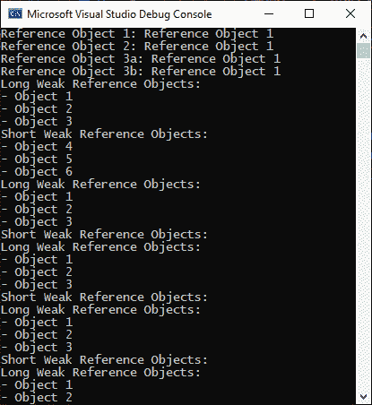

图 4.1 – 弱引用的项目输出

如 *图 4.1* 所示，在循环的第一迭代中，存在强引用和弱引用对象，并且那些对象的名称在控制台窗口中打印出来。然而，在调用垃圾回收后，弱引用被垃圾回收，因此，从第二次迭代开始，只有强引用对象保留在内存中。

弱引用对象的生命周期不会像强引用那样延长。这意味着一旦所有强引用超出作用域，它们就可以被垃圾回收。

大但按需重新加湿成本低的对象受益于弱引用。

注意

为了提高应用程序的性能，避免在许多小对象上使用弱引用，因为它们可能比它们包装的对象占用更多的内存空间，从而增加性能开销。但是，如果你正在处理许多大而昂贵的对象，使用缓存的弱引用可能有助于提高应用程序的性能。

这就结束了我们对强引用和弱引用的探讨。让我们将我们的关注点转向 C# 中的清理。

# 清理

在 C# 中，没有直接销毁对象的方法。我们最接近的方法是 **终结化**。C# 中的终结器是 C++ 中析构函数的等价物。但在 C# 中，您无法控制它是否以及何时运行，直到垃圾回收器做出决定。

注意

在 C# 中，*终结器* 和 *析构函数* 可以互换使用。终结器是用户定义的终结器代码运行的地方。在对象中的终结器运行之后，它再次被认为是活跃的，垃圾回收器随后将最终收集该对象。这意味着如果对象定义了终结器，它实际上会被标记为“`可收集`”两次。

对象使用终结化来释放资源并在对象被垃圾回收之前执行其他清理操作。可以通过重写受保护的 `Finalize()` 方法来执行释放对象持有的非托管资源的清理操作。

您必须重写 `Finalize()` 方法，以便垃圾回收器标记从 `Object` 派生的类型以进行终结化。当您重写 `Finalize()` 方法时，将为实例放置一个终结化队列中的条目。在回收内存之前，将为终结化队列中的每个对象实例调用 `Finalize()` 方法。一旦对象的 `Finalize()` 方法运行完毕，垃圾回收器就可以回收其内存。

如果在处理对象资源时调用了 `GC.SupressFinalize()`，则不会调用 `Finalize()` 方法，但如果发现对象不可访问，或者在 **应用程序域**（**AppDomain**）关闭期间（即使对象是可访问的），`Finalize()` 方法将自动调用。

注意

AppDomains 将应用程序彼此隔离，但它们的用法非常昂贵。在 .NET 5+ 中，有一些用于动态加载程序集的 `AssemblyLoadContext` 类。

`Finalize()` 方法仅在未调用 `GC.SuppressFinalize()` 且调用 `GC.ReRegisterForFinalize()` 时才会运行一次；然后，`Finalize()` 方法可以再次被调用。

当重写 `Finalize()` 时，有一些事情需要记住，如下所述：

+   您无法控制 `Finalize()` 方法何时被调用。

+   为了确保在您的实例中释放托管和非托管资源，请使用 `IDisposable` 模式实现 `IDisposable.Dispose()` 方法。无法保证终结化运行的顺序。

+   终结化在未指定的线程上运行，并且它们隐式调用基类的 `Finalize()` 方法。

为了避免需要重写 `Finalize()` 方法，并确保我们清理托管和非托管资源，我们将探讨实现 `IDisposable` 模式。

## 使用终结化

我们将编写一个示例应用程序来演示`Finalize()`的使用。然后，我们将修改程序以实现`IDisposable`模式并抑制对`Finalize()`的调用，同时确保我们的托管和非托管资源得到确定性的释放。按照以下步骤操作：

1.  启动一个新的.NET 6 控制台应用程序，命名为`CH04_Finalization`。添加一个新的内部类`Product`。然后添加以下属性：

    ```cs
    public int Id { get; set; }
    public string Name { get; set; }
    public string Description { get; set; }
    public decimal UnitPrice { get; set; }
    ```

1.  我们已创建了四个属性—`Id`、`Name`、`Description`和`UnitPrice`。现在，添加构造函数，如下所示：

    ```cs
    public Product()
    {
    Console.WriteLine("Product constructor.");
    }
    ```

1.  构造函数向控制台窗口写入一条消息，以便我们知道我们已经进入了构造函数。接下来，添加终结器，如下所示：

    ```cs
    ~Product()
    {
    Console.WriteLine("Product finalizer.");
    }
    ```

1.  在我们的终结器中，我们向控制台窗口写入一条消息，以便我们知道我们的终结器已被调用。对于我们的`Product`类中的最后一部分代码，我们将重写`ToString()`方法，如下所示：

    ```cs
    public override string ToString()
    {
      return $"Id: {Id}, Name: {Name},
      Description: {Description}, Unit Price: {UnitPrice}";
    }
    ```

1.  我们的`ToString()`方法返回一个字符串，输出`Product`类每个属性的值。目前，除非另有说明，以下代码应添加到`Program`类中。添加以下变量：

    ```cs
    private static Product _product;
    ```

1.  `_product`变量将用于存储我们的`Product`类的一个实例。更新`Main`方法，如下所示：

    ```cs
    static void Main(string[] _)
    {
    InstantiateObject();
    PrintObjectData();
    RemoveObjectReference();
    RunGarbageCollector();
    InstantiateLocalObject();
    RunGarbageCollector();
    DisplayGeneration(_product);
    RemoveObjectReference();
    RunGarbageCollector();
    }
    ```

1.  如您所见，我们有几个方法用于实例化对象、打印对象数据、删除对象引用、显示对象生成和运行垃圾收集器。我们现在将逐一添加每个方法。添加`InitiateObject()`方法，如下所示：

    ```cs
    private static void InstantiateObject()
    {
      Console.WriteLine("Instantiating Product.");
      _product = new Product()
    {
        Id = 1,
        Name = "Polly Parrot",
        Description = "Cudly child's toy.",
        UnitPrice = 7.99M
    };
    }
    ```

1.  在这个方法中，我们向控制台窗口写入消息，创建一个新的产品，并将其分配给`_product`成员变量。现在，我们将添加`PrintObjectData()`方法，如下所示：

    ```cs
    private static void PrintObjectData()
    {
    Console.WriteLine(_product.ToString());
    }
    ```

1.  在这里，我们将`Product`类的内容打印到控制台窗口。接下来，我们将编写`RemoveObjectReference()`方法，如下所示：

    ```cs
    private static void RemoveObjectReference()
    {
        _product = null;
    }
    ```

1.  我们将`Product`对象设置为`null`。这移除了对该对象的引用，使其有资格进行垃圾收集。我们现在添加一个调用垃圾收集的方法，如下所示：

    ```cs
    private static void RunGarbageCollector()
    {
        GC.Collect();
    }
    ```

1.  在这个方法中，我们调用垃圾收集器，如下所示：

    ```cs
    private static void InstantiateLocalObject()
    {
          var product = new Product()
          {
              Id = 2,
              Name = "Cute Kittie",
              Description = "Cudly child's toy.",
              UnitPrice = 5.75M
          };
          DisplayGeneration(product);
          _product = product;
          GC.Collect();
    }
    ```

1.  在这个方法中，我们创建了一个局部对象。然后，我们调用显示当前生成的方法。我们将局部产品分配给成员产品，然后调用垃圾收集器。我们的最终方法，目前是`DisplayGeneration(Product product)`方法，如下面的代码片段所示：

    ```cs
    private static void DisplayGeneration(Product product)
    {
          Console.WriteLine($"local product: 
              generation {GC.GetGeneration(product)}");
    }
    ```

1.  此方法打印传入的产品生成。运行代码。您应该看到以下输出：

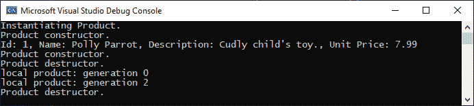

图 4.2 – 终结化项目输出

如您所见，我们的代码展示了构造和终结。我们既有 0 代代码也有 2 代代码，我们的构造函数和终结器方法都得到了调用。现在，我们将探讨实现`IDisposable`以使代码的清理更加确定，这样`Finalize()`就不需要被垃圾回收器调用。

# 实现 IDisposable 模式

在本节中，我们将实现一个可重用的`IDisposable`模式。我们将有一个实现`IDisposable`的基类。这个基类将提供两个子类可以重写的方法。一个方法用于清理托管资源，另一个方法用于释放非托管资源。为了实现`IDisposable`模式，请按照以下步骤操作：

1.  添加一个名为`DisposableBase`的新类，该类实现`IDisposable`，如下所示：

    ```cs
    public class DisposableBase : IDisposable
    {
          public void Dispose()
          {
             Dispose(true);
          }
          private void Dispose(bool disposing)
          {
              if (disposing)
              GC.SuppressFinalize(this);
              ReleaseManagedResources();
              ReleaseUnmanagedResources();
          }
    protected virtual void ReleaseManagedResources(){} 
    protected virtual void ReleaseUnmanagedResources(){}
    }
    ```

这个类作为一个可以被继承的基类。它实现了`IDisposable`接口，并调用两个名为`ReleaseManagedResources()`和`ReleaseUnmanagedResources()`的虚拟方法，这些方法将在子类中被重写。

1.  将`Main`中的代码移动到一个名为`Finalization()`的新方法中。然后修改`Main`，如下所示：

    ```cs
    static void Main(string[] _)
    {
          Finalization();
          Disposing();
    }
    ```

我们调用了两个方法。`Finalization()`方法展示了使用终结来清理在垃圾回收器调用终结时你无法控制的资源。`Disposing()`展示了确定性地释放托管和非托管资源，并抑制了终结，以便垃圾回收器不会调用它。您的`Finalization()`方法应如下所示：

```cs
private static void Finalization()
{
      Console.WriteLine("--- Finalization ---");
      InstantiateObject("Finalization");
      PrintObjectData();
      RemoveObjectReference();
      RunGarbageCollector();
      InstantiateLocalObject("Finalization");
      RunGarbageCollector();
      DisplayGeneration(_product);
      RemoveObjectReference();
      RunGarbageCollector();
}
```

我们将`“Finalization”`传递给`InstantiateObject(string cleanUpMethod)`和`InstantiateLocalObject(string cleanUpMethod)`方法，这样我们就可以知道正在终结的对象是在我们的`Finalization()`方法中实例化的。

1.  添加一个名为`Disposing()`的新方法，如下所示：

    ```cs
    private static void Disposing()
    {
    Console.WriteLine("--- Disposing ---");
    InstantiateObject("Disposing");
    PrintObjectData();
    DisposeOfObject();
    InstantiateLocalObject("Disposing");
    DisplayGeneration(_product);
    DisposeOfObject();
    RunGarbageCollector();
    }
    ```

1.  在`Disposing()`方法中，我们向控制台写入一条消息，标识`Disposing()`方法正在运行。然后我们调用`InstantiateObject(“Disposing”)`。接下来，我们打印对象数据并销毁对象。然后，我们实例化一个将分配给成员变量的本地对象。本地和成员变量的生成被打印到控制台窗口，然后我们销毁对象并调用垃圾回收。

1.  添加`DisposeofObject()`方法，如下所示：

    ```cs
    private static void DisposeOfObject()
    {
          _product.Dispose();
    }
    ```

1.  `DisposeOfObject()`方法调用`_product`对象的`Dispose()`方法来释放资源。更新`Product`类，如下所示：

    ```cs
    private string _cleanUpMethod;
    public Product(string cleanUpMethod)
    {
      Console.WriteLine("Product constructor.");
      _cleanUpMethod = cleanUpMethod;
    }
    ~Product()
    {
      Console.WriteLine($"Product destructor: {_
        cleanUpMethod}.");
    }
    ```

1.  我们存储了我们正在使用的清理方法的名称，这样当终结器被调用时，我们将知道对象使用的清理方法。修改`InstantiateObject()`方法，如下所示：

    ```cs
    private static void InstantiateObject(string 
        cleanUpMethod)
    {
    Console.WriteLine("Instantiating Product.");
    _product = new Product(cleanUpMethod)
    {
               Id = 1,
               Name = "Polly Parrot",
               Description = "Cudly child's toy.",
               UnitPrice = 7.99M
    };
    }
    ```

1.  我们将清理方法分配给`Product`对象。同样修改`InstantiateLocalObject()`方法，使代码看起来如下：

    ```cs
    private static void InstantiateLocalObject(string 
        cleanUpMethod)
    {
    var product = new Product(cleanUpMethod)
    {
        Id = 2,
        Name = "Cute Kittie",
        Description = "Cudly child's toy.",
        UnitPrice = 5.75M
    };
    DisplayGeneration(product);
    _product = product;
    }
    ```

1.  再次强调，我们将清理方法分配给 `Product` 对象。将 `Product` 更新为从 `DisposableBase` 继承。然后，将 `ReleaseManagedResources()` 方法添加到 `Product` 类中，如下所示：

    ```cs
    protected override void ReleaseManagedResources()
    {
    base.ReleaseManagedResources();
    Console.WriteLine("Releasing managed resources.");
    }
    ```

1.  此方法将用于释放托管资源。现在，将 `ReleaseUnmanagedResources()` 方法添加到 `Product` 类中，如下所示：

    ```cs
    protected override void ReleaseUnmanagedResources()
    {
    base.ReleaseUnmanagedResources();
    Console.WriteLine("Releasing unmanaged resources.");
    }
    ```

此方法将用于清理非托管资源。

1.  运行代码，您应该看到如下所示的输出：

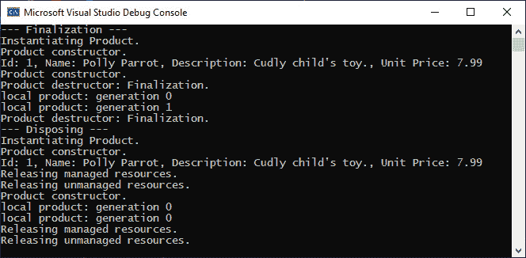

图 4.3 – 终结化和释放代码的输出

如您所见，终结化代码调用了终结器，但用于显式释放托管和非托管资源的代码方法并没有被调用。对象也存活在 0 代垃圾回收中。相反，释放代码显式释放了托管和非托管资源，并且由于抑制了终结化，垃圾回收器没有调用。在我们的示例中，没有对象存活在 0 代垃圾回收中。

另一种在可处置类中隐式调用 `Dispose()` 的方法是使用 `using` 语句。以下是一个示例，如 `Program` 类中所示：

```cs
private static void UsingDispose()
```

```cs
{
```

```cs
      Console.WriteLine("--- UsingDispose() ---");
```

```cs
      using (var product = new Product("using")
```

```cs
          {
```

```cs
              Id = 2,
```

```cs
              Name = "Cute Kittie",
```

```cs
              Description = "Cudly child's toy.",
```

```cs
              UnitPrice = 5.75M
```

```cs
          }
```

```cs
      )
```

```cs
      {
```

```cs
          DisplayGeneration(product);
```

```cs
      }
```

```cs
}
```

`using` 语句与可处置对象一起使用。当代码块完成时，对象将被自动处置。对象的代数为 0。在 `Main` 方法中添加对 `UsingDispose()` 的调用。

好吧，您已经看到了如何使用终结器和实现与垃圾回收器相关的 `IDisposable` 模式。现在，让我们看看我们如何避免在 C# 中的内存泄漏。

# 防止内存泄漏

在本节中，我们将了解 COM 对象周围的问题以及使用 COM 对象可能导致内存泄漏的原因。我们将查看我们的示例代码与 Excel COM 库的互操作性。我们将看到在代码退出后 Excel 实例是如何保持活跃的。通过使用 Windows 任务管理器，我们将能够看到 Excel 实例的生成。我们的 Excel 代码将以避免内存泄漏并确保在代码完成运行后关闭每个 Excel 实例的方式开发，这样就不会在内存中留下 Excel 实例。

然后，我们将继续探讨使用事件如何成为运行时内存泄漏的常见来源，以及我们如何避免它们。使用 JetBrains dotMemory，我们将分析我们程序代码的运行时构建可执行文件。当代码运行时，我们将生成快照。当分析器运行时，您将看到内存使用量逐渐上升。点击快照将显示我们运行配置的详细内存信息。我们还将能够查看是否存在内存泄漏，并会发现存在基于事件的内存泄漏。在本节中，我们还将探讨匿名方法和弱引用。

本节的结果将是您了解 COM 和事件的使用，如果处理不当，可以引入内存异常，您将看到如何编写代码以避免生成内存异常。

## 理解使用 Marshal.ReleaseComObject 的风险

Visual Studio 团队遇到了 Visual Studio 2010 的问题。他们的问题是由于将原生 C++ 组件重写为托管 C# 代码而引起的。被重写为托管 C# 代码的组件包括窗口管理器、命令栏和文本编辑器。

随着 Visual Studio 2010 的发布，有两个扩展启用器——现有的使用 COM 接口为旧扩展提供支持的扩展机制，以及一个新的托管编程模型。

为了使 `Runtime Callable Wrapper` 或 **RCW**。RCW 在 COM 和托管代码的世界之间充当桥梁。

所有 COM 组件至少必须实现 `IUnknown` 接口。当一个实现 `IUnknown` 接口的对象进入托管运行时，它会被包装在一个 RCW 中。因此，RCW 是一个引用实现 `IUnknown` 接口的原生代码的常规托管对象。

在托管 .NET 计算机程序中，有两种类型的对象可以引用 RCW：COM 对象和托管对象。这就是可能出现问题的起点。

在这一点上，我们将考虑一个典型的场景，该场景可能导致 COM 对象和托管对象之间出现内存问题。

`DatabaseSearch` 组件通过询问 `DatabaseManager` 服务来开始 `Find` 操作。它返回给 `DatabaseSearch` 组件一个有效的 `IDatabaseManager` 实例。返回给 `DatabaseSearch` 组件的 `DatabaseManager` 组件是一个本机 COM 组件。由于 `DatabaseManager` 组件是一个本机 COM 组件，它被运行时封装在一个 RCW 中。`DatabaseSearch` 组件不知道或不在乎 `DatabaseManager` 组件是本机 COM 组件还是托管代码组件，因为它所看到的是 `IDatabaseManager` 接口。`Find` 操作通过 `DatabaseSearch` 组件通过 `IDatabaseManager` 进行各种调用来完成其任务。一旦 `Find` 操作完成，它就会退出。由于 `IDatabaseManager` 是一个 RCW，它具有与托管对象相同的生命周期语义。因此，当垃圾收集器运行时，`IDatabaseManager` 组件将被清理。如果没有大量的内存压力，垃圾收集器可能不会运行很长时间，甚至可能根本不会运行。在这种情况下，由于它们管理系统内存的方式不同，我们最终会因本机和托管内存冲突而结束。托管 `DatabaseSearch` 组件在需要 `DatabaseManager` 组件之前完成与 `DatabaseManager` 组件的交互。如果没有对 `DatabaseManager` 组件的引用，那么这就是垃圾收集器运行并删除 `DatabaseManager` 的好时机。任何用本机代码编写的组件，一旦 `Find` 方法退出，就会在 `IDatabaseManager` 上调用 `Release`。这表明对 `IDatabaseManager` 的引用不再需要。由于最后的 `Release` 调用直到下一次垃圾收集才会进行，因此看起来 `IDatabaseManager` 存在内存泄漏。这是一个非确定性终止的例子。无法确定何时应该进行垃圾收集被称为非确定性终止。当对象所属的对象正在被垃圾收集且存在非托管资源需要释放时，垃圾收集器会为该对象分配一个特殊线程来执行 `Finalize()` 方法。

我们所考虑的这种场景会导致昂贵的对象在应用程序关闭时被报告为泄漏对象。

自然的选择是调用 `Marshal.ReleaseComObject(object)`。这个调用会在昂贵的对象不再需要时立即进行。在我们的场景中，这将是 `DatabaseManager` 不再需要时。这个调用会导致 RCW 被释放，并且内部引用计数减一。此时，底层的 COM 对象通常会释放。

然而，调用 `Marshal.ReleaseComObject(object)` 可能是危险的。

考虑到作为从 COM 迁移的一部分，`DatabaseManager`已被编写为托管代码。`DatabaseSearch`托管组件通过 GSP 请求`DatabaseManager`组件。返回给`DatabaseSearch`组件的是一个`IDatabaseManager`实例。返回的实例是一个包装 COM 对象的 RCW。因此，我们有了双重包装，即 RCW 包装在`Find`操作退出时出现问题的外围。在终止时，`DatabaseSearch`组件仍然对`DatabaseManager`的 RCW 调用`Marshall.ReleaseComObject(object)`。

这会导致引发一个`ArgumentException`类型的异常。生成的异常信息是：“对象的类型必须是 _ComObject 或从 _ComObject 派生。”当这种情况发生时，请移除对`Marshal.ReleaseComObject(object)`的调用。另一种选择是在调用`ReleaseComObject`之前调用`Marshal.IsComObject`。

调用`Marshal.IsComObject`会导致更多问题。`DatabaseManager` RCW 已被声明为不再需要，但问题是`DatabaseManager` RCW 仍然是一个有效的对象，这意味着它可能仍然可以被托管对象访问。下次访问该对象时，如果可以从托管代码中访问，CLR 将引发一个`InvalidComObjectException`类型的异常，指出：“与底层 RCW 分离的 COM 对象不能使用。”

如果我们`DatabaseManager` RCW 使用的 COM 组件被托管代码缓存，而不是每次请求`DatabaseManager`组件时都返回给 GSP，我们的缓存 COM 组件将首先被检查。这样做是为了避免在托管和非托管代码之间的边界上进行昂贵的调用。如果随后有多个组件请求相同的 COM 组件，它们将各自接收到相同的 RCW。

这里的问题是，调用过`ReleaseComObject`的 RCW 的组件通常会被指责为生成异常的组件。但事实并非如此——调用`ReleaseComObject`的组件才是有问题的组件，在我们的场景中，这个组件将是`DatabaseSearch`组件。

注意

微软的开发者，尤其是 Visual Studio 团队的开发者推荐，除非你 100%确定没有托管代码项可以访问 RCW，否则不要调用`Marshal.ReleaseComObject`。

我们将通过查看一个 Excel 示例来更深入地探讨我们刚才讨论的内容。

### 在.NET 6 中使用 Microsoft Excel 16.0 对象库

在本节中，我们将通过引用 Microsoft Excel 16.0 对象库来探讨.NET 6 中的 COM 互操作性。这个库是一个 COM 库。您将了解如何使用 Excel 创建新应用程序、修改它并保存它。当第一个示例运行几次后，您会发现代码没有失败。但在任务管理器中，每次运行该方法时，都会打开另一个 Excel 实例，就像在 Windows 任务管理器中看到的那样。然后，我们将继续探讨如何正确地释放 COM 对象，以便在应用程序完成后 Excel 实例不会保持打开状态。让我们首先查看当我们不释放 Excel COM 对象时会发生什么。

#### 调查当 Excel COM 对象未释放时会发生什么

在本节中，我们将创建一个电子表格，向其中添加数据，然后保存文件。这将揭示使用 Excel 时产生的内存问题，以及我们在使用 Excel 后没有正确清理时可能出现的内存问题。我们还将了解如何使用 Excel 并清理以防止通过使用 Excel 产生的内存问题。

将`Microsoft Excel 16.0 Object Library`的 COM 引用添加到`CH04_PreventingMemoryLeaks`项目中。

注意

如果您向项目中添加 COM 引用，您将获得 IntelliSense 支持。但当您运行成功编译的程序时，当它尝试创建 Excel 应用程序时，将引发`FileNotFoundException`类型的异常。因此，您需要将`EmbedInteropTypes`和`Private`的值设置为`true`。

由于我们最不希望遇到的是`FileNotFoundException`类型的异常，请编辑您的项目文件，然后更新`COMReference`部分，如下所示：

```cs
<ItemGroup>
```

```cs
      <COMReference Include="Microsoft.Office.Excel.dll">
```

```cs
          <WrapperTool>tlbimp</WrapperTool>
```

```cs
          <VersionMinor>9</VersionMinor>
```

```cs
          <VersionMajor>1</VersionMajor>
```

```cs
          <Guid>00020813-0000-0000-c000-000000000046</Guid>
```

```cs
          <Lcid>0</Lcid>
```

```cs
          <Isolated>false</Isolated>
```

```cs
          <EmbedInteropTypes>True</EmbedInteropTypes>
```

```cs
          <Private>true</Private>
```

```cs
    </COMReference>
```

```cs
  </ItemGroup>
```

这将确保我们不会遇到`FileNotFoundException`类型的异常。向项目中添加一个新的`UsingExcel`类，然后添加以下`using`语句：

```cs
using Microsoft.Office.Interop.Excel;
```

```cs
using System;
```

```cs
using System.Diagnostics;
```

```cs
using System.IO;
```

```cs
using System.Runtime.InteropServices;
```

```cs
using Excel = Microsoft.Office.Interop.Excel;
```

现在，添加`RunExcelExamples()`方法，如下所示：

```cs
public void RunExcelExamples()
```

```cs
{
```

```cs
      for (int i = 0; i < 10; i++)
```

```cs
          NotReleasingExcelComObjects();
```

```cs
      for (int i = 0; i < 10; i++)
```

```cs
          ReleasingExcelComObjects();
```

```cs
}
```

此方法调用两个方法。它调用每个方法 10 次然后退出。让我们添加`NotReleasingExcelComObjects()`方法，如下所示：

```cs
private static void NotReleasingExcelComObjects()
```

```cs
{
```

```cs
      string filename = @"C:\Temp\BucketList.xlsx";
```

```cs
      Excel.Application application = new Excel.Application();
```

```cs
      application.Visible = false;
```

```cs
      Excel.Workbook workbook = application.Workbooks.Add();
```

```cs
      Excel.Sheets sheets = workbook.Sheets;
```

```cs
      Excel.Worksheet worksheet =(Worksheet)sheets
```

```cs
      .Add(sheets[1], Type.Missing, Type.Missing, 
```

```cs
            Type.Missing);
```

```cs
      worksheet.Range["A1"].Value = "Bucket List";
```

```cs
      worksheet.Range["A2"].Value = "Visit New Zealand";
```

```cs
      worksheet.Range["A1"].Value = "Visit Australia";
```

```cs
      if (File.Exists(filename))
```

```cs
          File.Delete(filename);
```

```cs
      workbook.SaveAs(filename);
```

```cs
      workbook.Close();
```

```cs
      application.Quit();
```

```cs
}
```

此方法声明了一个`filename`字符串。然后它实例化一个新的不可见的 Excel 应用程序。接着它添加一个名为“`Bucket List”`的列标题，并在下面的行中添加两个项目到该列表列。然后它检查文件是否存在。如果文件确实存在，则将其删除。然后保存并关闭工作簿，并退出 Excel 应用程序。从`RunExcelExamples()`方法中注释掉以下行：

```cs
      for (int i = 0; i < 10; i++)
```

```cs
          ReleasingExcelComObjects();
```

如果您保存项目并运行它，您会发现程序退出后，您会留下多个 Excel 进程。这些进程中的每一个都会占用内存。以下截图显示了程序退出后仍然留在内存中的 Excel 进程：

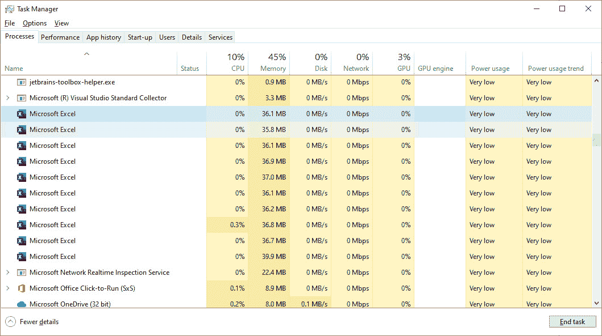

图 4.4 – Windows 任务管理器显示不再使用的 Excel 进程正在占用内存

如你所见，这些在我们程序完成后仍然留在内存中的 Excel 进程正在消耗 367.6 **兆字节**（**MB**）的 RAM，这是所有 Excel 进程 RAM 的总和。如果这个程序以当前的形式多次运行，你最终会耗尽内存，因为留在内存中运行的 Excel 进程构成了内存泄漏。每次程序运行，你都会消耗另外 367 MB 或大约的 RAM。最终，可用的内存将不足以满足需求，你将遇到内存不足异常。

以下截图显示了程序运行一次后的任务管理器显示：

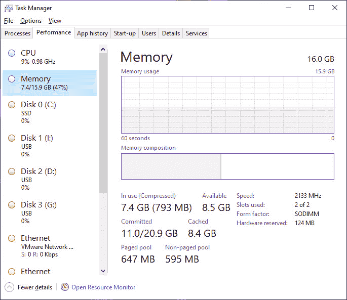

图 4.5 – 程序运行一次后的 Windows 任务管理器

从*图 4.5*中，我们可以看到我们正在使用 7.4 GB（793 MB），而我们还有 8.5 GB 的 RAM 可用。连续多次运行程序。每次运行程序，你都会看到压缩内存增加，可用内存减少。内存似乎从未被回收，如下面的截图所示：

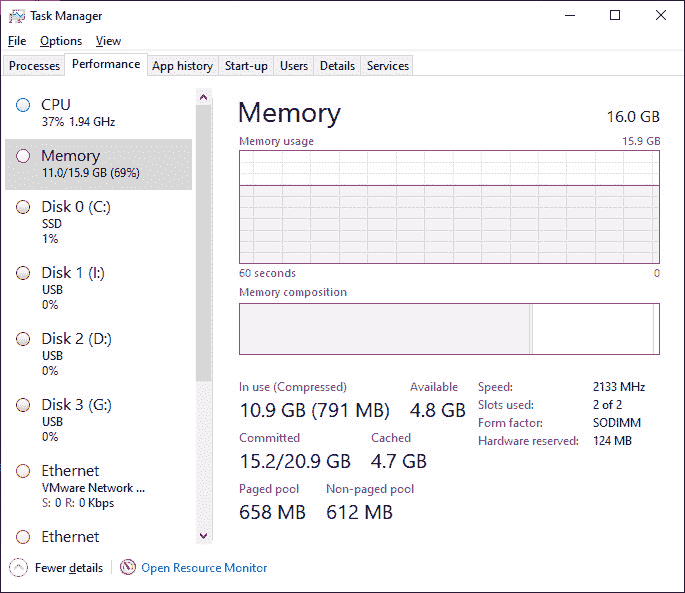

图 4.6 – 多次运行程序后，Windows 任务管理器显示内存使用增加和可用内存减少

在我们的程序多次连续运行之后，我们可以看到我们的**使用中（压缩）**内存已从 7.4 GB（793 MB）增加到 10.9 GB（799 MB），而我们的可用内存已从 8.5 GB 减少到 4.9 GB。这显然是一个需要解决的问题，但该如何解决呢？

这就是这里显示的`ReleasingExcelComObjects()`方法的作用：

```cs
[System.Diagnostics.CodeAnalysis SuppressMessage
```

```cs
  ("Interoperability","CA1416:Validate platform compatibility",
```

```cs
    Justification = "Windows only code.")]
```

```cs
private static void ReleasingExcelComObjects()
```

```cs
{
```

```cs
      Excel.Application application = null;
```

```cs
      Excel.Workbooks workbooks = null;
```

```cs
      Excel.Workbook workbook = null;
```

```cs
      Excel.Sheets worksheets = null;
```

```cs
      Excel.Worksheet worksheet = null;
```

```cs
      Excel.Range range = null;
```

```cs
      Try
```

```cs
      {
```

```cs
          string filename = @"C:\Temp\BucketList.xlsx";
```

```cs
          application = new Excel.Application();
```

```cs
          application.Visible = false;
```

```cs
          workbooks = application.Workbooks;
```

```cs
          workbook = workbooks.Add();
```

```cs
          worksheets = workbook.Sheets;
```

```cs
          worksheet = (Worksheet)worksheets.Add(worksheets[1], 
```

```cs
              Type.Missing, Type.Missing, Type.Missing);
```

```cs
          range = worksheet.Range["A1"];
```

```cs
          range.Value = "Bucket List";
```

```cs
          range = worksheet.Range["A2"];
```

```cs
          range.Value = "Visit New Zealand";
```

```cs
          range = worksheet.Range["A3"];
```

```cs
          range.Value = "Visit Australia";
```

```cs
          if (File.Exists(filename))
```

```cs
              File.Delete(filename);
```

```cs
          workbook.SaveAs(filename);
```

```cs
          workbook.Close();
```

```cs
          application.Quit();
```

```cs
      }
```

```cs
      Finally
```

```cs
      {
```

```cs
          if (range != null) 
```

```cs
              Marshal.FinalReleaseComObject(range);
```

```cs
          if (worksheet != null) 
```

```cs
              Marshal.FinalReleaseComObject(worksheet);
```

```cs
          if (worksheets != null) 
```

```cs
              Marshal.FinalReleaseComObject(worksheets);
```

```cs
          if (workbook != null) 
```

```cs
              Marshal.FinalReleaseComObject(workbook);
```

```cs
          if (workbooks != null) 
```

```cs
              Marshal.FinalReleaseComObject(workbooks);
```

```cs
          if (application != null) 
```

```cs
              Marshal.FinalReleaseComObject(application);
```

```cs
          range = null;
```

```cs
          worksheet = null;
```

```cs
          worksheets = null;
```

```cs
          workbook = null;
```

```cs
          worksheets = null;
```

```cs
          application = null;
```

```cs
          GC.Collect();
```

```cs
          GC.WaitForPendingFinalizers();
```

```cs
          Process[] processes = 
```

```cs
              Process.GetProcessesByName("EXCEL");
```

```cs
          foreach (Process process in processes)
```

```cs
              process.Kill();
```

```cs
      }
```

```cs
}
```

这个相当长的方法做了我们需要 Excel 做的——释放 Excel COM 对象，将托管对象设置为`null`，运行垃圾收集器，然后终止所有运行的 Excel 进程。如果你取消注释`RunExcelExamples()`方法中的代码，然后运行一次代码，你将看到我们的代码运行完成后，内存中不再有任何 Excel 进程在运行。如果你查看 Windows 任务管理器的**性能**选项卡，你也会看到我们已经回收了内存。

我们通过终止 COM 组件并将托管对象设置为`null`以移除托管引用，成功地修复了内存泄漏。然后，我们杀死了所有名为`EXCEL`的进程。

注意

在使用`process.Kill()`方法杀死具有特定名称（如`EXCEL`）的所有进程时请小心。可能有其他程序也使用该进程，可能会因这种终止而受到严重影响。如果您在服务器上执行批处理，应在此代码在隔离环境中运行，或者安排在您能保证其他进程不会因运行此代码而受到影响的时间进行操作。

现在是时候看看使用事件如何成为内存泄漏的来源了。

## 使用事件如何成为内存泄漏的来源

在本节中，我们将探讨在您的计算机程序中使用事件如何成为内存泄漏的来源。我们将使用我们将编写的非常简单的 Windows Forms 应用程序来演示这一点。然后，我们将使用 JetBrains dotMemory 分析我们的内存使用情况。我们将采用两种方法来展示事件的使用。一种方法将产生内存泄漏，而另一种则不会。

那么，使用事件如何会产生内存泄漏呢？

除非你使用匿名方法，否则订阅事件会保留对持有该事件的类的引用，直到事件被取消订阅。考虑以下类：

```cs
internal class EventSubscriber
```

```cs
{
```

```cs
      public EventSubscriber(Control control)
```

```cs
      {
```

```cs
          Control.TextChanged += OnTextChanged
```

```cs
      }
```

```cs
      private void OnTextChanged(
```

```cs
          object sender, 
```

```cs
          EventArgs eventArgs
```

```cs
      )
```

```cs
      {
```

```cs
          Text ((Control)sender).Text;
```

```cs
      }
```

```cs
}
```

如果控制对象比`EventSubscriber`类存活时间更长，那么`EventSubscriber`的所有实例将不会被垃圾回收器回收。最终结果是内存泄漏。以下是一些避免基于事件的内存泄漏的不同方法：

1.  订阅匿名方法。

1.  在完成事件后取消事件订阅。

1.  实现弱处理程序模式。

在我们查看避免内存泄漏的这些方法之前，我们将编写我们的 Windows Forms 应用程序，演示避免内存泄漏和产生内存泄漏的方法。按照以下步骤操作：

1.  开始一个新的.NET Core Windows Forms 项目，然后在项目设置中将目标框架从.NET Core 3.1 更改为.NET 5。

1.  将`Form1`重命名为`MainForm`。

1.  添加一个名为`InformationLabel`的标签，其文本为`“Information”`，一个名为`RaiseEventsButton`的按钮，其文本为`“Raise Events”`，以及另一个名为`ProgressLabel`的标签，其文本为`“Progress:”`。您可以根据自己的喜好布局和样式化这些组件。

1.  双击`RaiseEventsButton`按钮。这将生成一个点击事件处理方法。

1.  在项目中添加一个名为`EventOne`的类。您需要以下`using`语句：

    ```cs
    using System;
    using System.Threading;
    ```

1.  将以下代码添加到`EventOne`类的顶部：

    ```cs
    public event EventHandler OnEventRaised;
    private static int _count;
    public static int Count { get { return _count; } }
    ```

1.  这些元素是处理事件并记录仍被保持活跃的实例数量的必需元素。添加构造函数，如下所示：

    ```cs
    public EventOne()
    {
          Interlocked.Increment(ref _count);
    }
    ```

1.  构造函数代码以原子和线程安全的方式为类的每个实例递增`_`count`成员变量。添加`RaiseEvent(EventArgs e)`方法，如下所示：

    ```cs
    public void RaiseEvent(EventArgs e)
    {
          EventHandler eventHandler = OnEventRaised;
                if (eventHandler != null)
                      eventHandler(this, e);
    }
    ```

1.  此方法由客户端调用，负责在请求时触发事件。现在，添加最终的终结器，如下所示：

    ```cs
    ~EventOne()
    {
          Interlocked.Decrement(ref _count);
    }
    ```

1.  每当类的实例被终止并由垃圾回收器收集时，终结器以线程安全的方式递减`_count`成员变量。将新的`EventTwo`类添加到项目中。你需要以下`using`语句：

    ```cs
    using System;
    using System.Threading;
    using System.Windows.Forms;
    ```

1.  在`EventTwo`类的顶部添加以下代码：

    ```cs
    private static int _count;
    public static int Count { get { return _count; } }
    public string Text { get; private set; }
    ```

1.  代码存储了活动实例的数量和订阅控件的当前文本。添加以下构造函数：

    ```cs
    public EventTwo(Control control)
    {
          Interlocked.Increment(ref _count);
          control.TextChanged += OnTextChanged;
    }
    ```

1.  构造函数接受一个 Windows Forms 控件作为参数。它以线程安全的方式将`_count`成员变量增加一。然后它订阅由`OnTextChanged`方法处理的事件`TextChanged`。添加以下`OnTextChanged`方法：

    ```cs
    private void OnTextChanged(object sender, EventArgs 
        eventArgs)
    {
          Text = ((Control)sender).Text;
    }
    ```

1.  此方法在订阅的控件`Text`属性更改时触发。它将控件的`Text`内容分配给`EventTwo`类的`Text`属性。添加以下`Finalizer()`方法：

    ```cs
    ~EventTwo()
    {
          Interlocked.Decrement(ref _count);
    }
    ```

1.  每当实例被垃圾回收时，终结器以线程安全的方式递减`_count`成员变量。我们现在已经设置了我们的表单将用于引发事件的两个类。切换回`MainForm`类。

1.  在`MainForm`类的顶部添加以下成员变量：

    ```cs
    private int _eventsGeneratedCount;
    private int _eventSubscriberCount;
    ```

1.  这两个值将存储已生成的事件数量。添加以下`SetTitleText()`方法：

    ```cs
    private void SetTitleText()
    {
          Text = $"{_eventsGeneratedCount}/{EventOne.Count} – 
              {_eventSubscriberCount}/{EventTwo.Count}";
    }
    ```

1.  此方法为引发事件的方法设置控件的`Text`属性。文本显示引发的事件数量以及非内存泄漏方法中仍然存活的事件数量，以及内存泄漏方法中的相同内容。添加以下`SetInformationLabelText()`方法：

    ```cs
    private void SetInformationLabelText()
    {
          StringBuilder sb = new StringBuilder();
          sb.AppendLine($"Raised Events (No Memory Leak):
              {_eventsGeneratedCount},  Alive Events: 
                {EventOne.Count}");
          sb.AppendLine($"Raised Events (Memory Leak): 
              {_eventSubscriberCount},  Alive Events: 
                {EventTwo.Count}");
          InformationLabel.Text = sb.ToString();
    }
    ```

1.  `SetInformationLabelText()`方法更新`InformationLabel`文本，以显示每个方法中引发的事件数量以及两种方法执行完毕后内存中剩余的事件数量。添加以下`RaiseEvent`方法：

    ```cs
    private void RaiseEvent(object sender, EventArgs e)
    {
          ProgressLabel.Text = $"Event Raised: 
              {DateTime.Now}";
          ProgressLabel.Invalidate();
          ProgressLabel.Update();
    }
    ```

1.  `RaiseEvent`方法更新`ProgressLabel.Text`属性，但为了实时更新，需要调用`Invalidate()`和`Update()`方法。现在，添加以下`MemoryLeakMethod`方法：

    ```cs
    private void MemoryLeakMethod(EventArgs e)
    {
          int count = 10000;
          for (int x = 0; x < count; x++)
          {
                var eventTwo = new EventTwo(this);
          }
          _eventTwoCount += count;
    }
    ```

1.  此方法声明一个 10,000 项的计数。然后它循环 10,000 次。使用传递给`MainForm`的引用订阅一个新的`EventTwo`对象。一旦循环完成，`_eventTwoCount`变量增加 10,000。接下来，我们将添加以下`NoMemoryLeakedMethod`方法：

    ```cs
    private void NoMemoryLeakMethod(EventArgs e)
    {
          int count = 10000;
          for (int x = 0; x < count; x++)
          {
          EventOne eventOne = new EventOne();
          eventOne.OnEventRaised += RaiseEvent;
          eventOne.RaiseEvent(e);
          }
          _eventOneCount += count;
    }
    ```

1.  此方法声明一个计数为 10,000。它迭代 10,000 次。在这 10,000 次迭代中，它实例化一个新的`EventOne`对象，添加一个名为`RaisedEvent`的事件处理程序，然后引发事件。一旦循环完成，`_eventOneCount`变量增加 10,000。更新点击事件处理程序，如下所示：

    ```cs
    NoMemoryLeakMethod(e);
    MemoryLeakMethod(e);
    SetInformationLabelText();
    SetTitleText();
    ```

1.  将构建模式更改为`Release`并构建项目。

1.  打开 **JetBrains dotMemory**。选择 **本地** | **.NET Core 应用程序**，选择由构建过程生成的可执行文件，然后勾选 **从启动时收集内存分配和流量**复选框。您的屏幕应该看起来像这样：

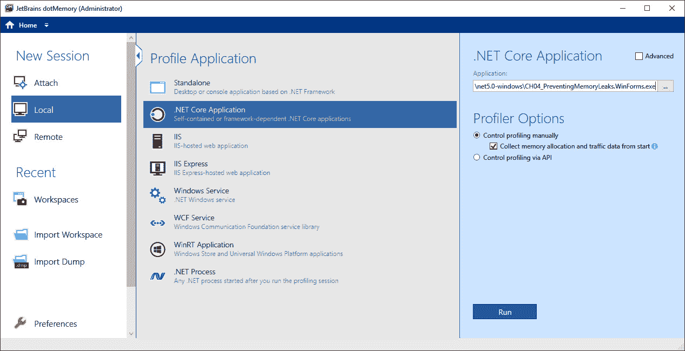

图 4.7 – JetBrains dotMemory 配置屏幕

1.  点击**运行**按钮。这将启动您的应用程序和性能分析会话，如下两个屏幕截图所示：

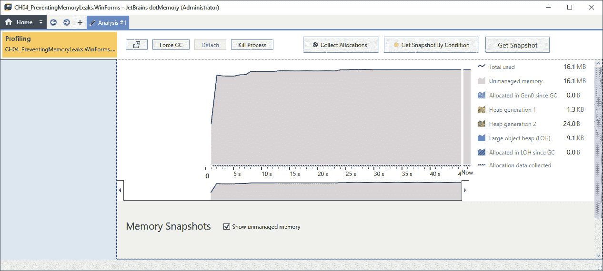

图 4.8 – JetBrains dotMemory 分析我们的 Windows Forms 应用程序

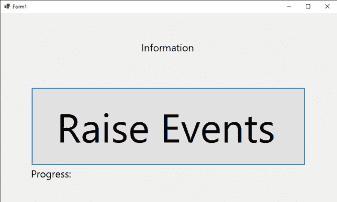

图 4.9 – 在运行任何事件之前我们的 Windows Forms 应用程序

1.  几次点击**触发事件**按钮。每次您点击按钮时，内存配置文件应该会改变，内存使用量应该会增加，如下面的屏幕截图所示：

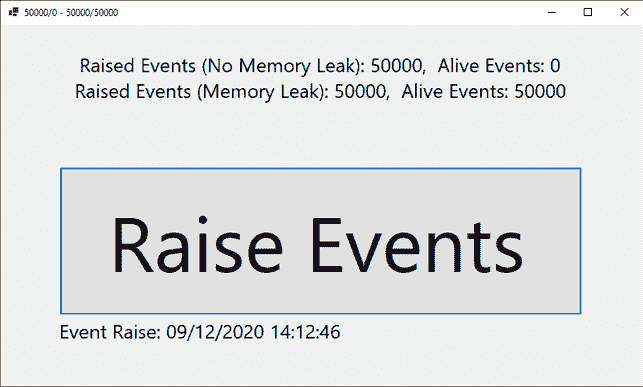

图 4.10 – 显示 50,000 个活跃事件的我们的 Windows Forms 应用程序，表明我们存在内存泄漏

1.  如您所见，我们有一个内存泄漏。我们的 `NoMemoryLeakMethod` 方法不会产生内存泄漏。如您所见，在触发 50,000 个事件后，内存中保持活跃的对象为 0。但我们的 `MemoryLeakMethod` 方法确实产生了内存泄漏。在触发 50,000 个事件中，有 50,000 个对象保持活跃。

1.  运行程序几次，并注意 dotMemory 中的情况。当您看到感兴趣的点时，点击该区域，然后点击 **获取快照**。这将捕捉到那一刻的快照，用户可以分析以查看是否存在任何问题。您应该得到类似以下的内容：

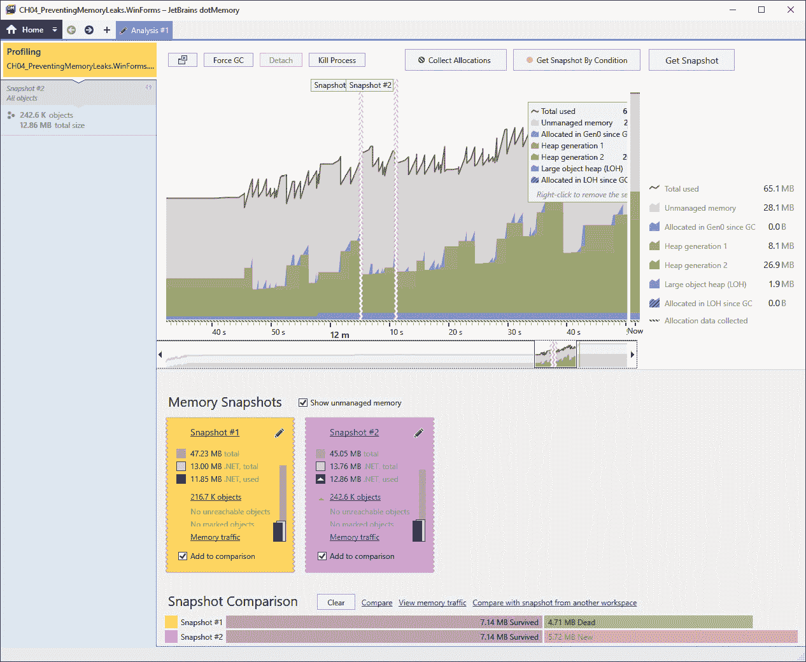

图 4.11 – 当触发事件并获取快照时 JetBrains dotMemory 对我们的 Windows Forms 应用程序的配置

1.  点击任何一个快照。您应该看到类似以下的内容：

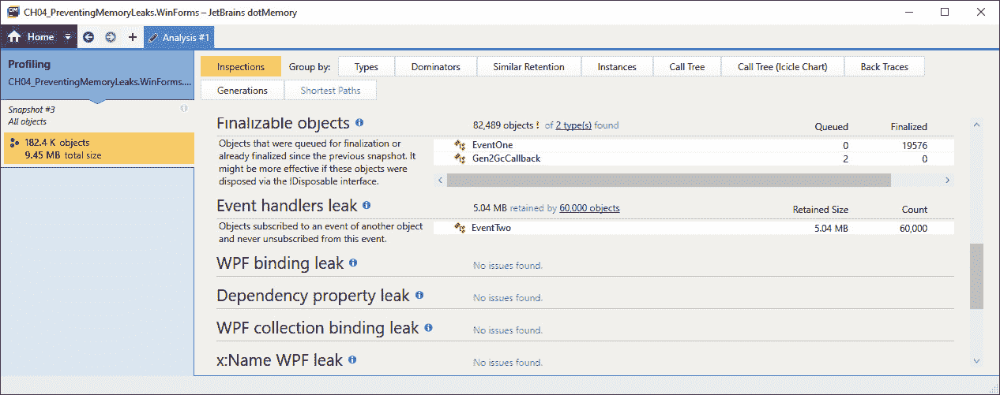

图 4.12 – 已识别 EventTwo 类的内存泄漏

1.  JetBrains dotMemory 在 `EventTwo` 类中检测到内存泄漏。这是因为该类订阅了另一个对象的事件，但从未取消订阅。然而，您会看到 `EventOne` 类的所有对象都已最终化。

您已经看到了如何使用事件以产生内存泄漏的方式，以及以防止内存泄漏的方式。让我们回顾一下使用事件时防止内存泄漏的三种方法，如下：

1.  订阅匿名方法。

1.  当你完成事件时，取消订阅事件。

1.  实现弱处理器模式。

让我们看看如何订阅匿名方法，然后取消订阅

### 使用局部方法

在 C# 7.0 之前，你会使用匿名方法作为处理事件的方式，以避免引入内存泄漏。从 C# 7.0 开始，你可以使用局部方法。在这个例子中，我们将使用局部方法来处理事件。遵循以下步骤：

1.  加载 `CH04_PreventingMemoryLeaks` 项目。

1.  添加一个名为 `Website` 的类，如下所示：

    ```cs
    internal class Website
    {
          public event EventHandler<EventArgs> Login;
          public event EventHandler<EventArgs> Logout;
    }
    ```

1.  这个类有两个事件用于网站的登录和注销。添加一个名为 `AnonymousEventSubscription` 的新类。添加 `Login()` 方法，如下所示：

    ```cs
    public void Login()
    {
          Website website = new Website();
          void LoginHandler(object sender, EventArgs args)
          {
              Debug.WriteLine("Anonymous login event handler 
                using a local method.");
              website.Login -= LoginHandler;
          };
          website.Login += LoginHandler;
          LoginHandler(this, new EventArgs());
    }
    ```

1.  `Login()` 方法实例化一个新的 `Website` 对象。然后它有一个名为 `LoginHandler` 的局部方法，该方法将消息写入调试窗口，然后取消订阅 `Website.Login` 事件。然后，在局部方法外部，它订阅 `Website.Login` 事件并引发事件。让我们添加 `Logout()` 方法，如下所示：

    ```cs
    public void Logout()
    {
          Website website = new Website();
          void LogoutHandler(object sender, EventArgs args)
          {
              Debug.WriteLine("Anonymous logout event handler 
                using a local method.");
              website.Logout -= LogoutHandler;
          };
          website.Logout += LogoutHandler;
          LogoutHandler(this, new EventArgs());
    }
    ```

1.  `Logout()` 方法实例化一个新的 `Website` 对象。然后它有一个名为 `LogoutHandler` 的局部方法，该方法将消息写入调试窗口，然后取消订阅 `Website.Logout` 事件。然后，在局部方法外部，它添加 `Website.Logout` 事件的处理器，然后引发事件。

1.  在 `Main` 方法中，注释掉 `RunExcelExamples()` 行。然后，添加 `UseAnonymousEventSubscription()` 方法调用，如下所示：

    ```cs
    private static void UseAnonymousEventSubscriptions()
    {
          for (int x = 0; x < 1000000; x++)
          {
              AnonymousEventSubscription aes = new 
                AnonymousEventSubscription();
              aes.Login();
              aes.Logout();
          }
    }
    ```

1.  此代码运行了 1,000,000 次迭代。对于每次迭代，都会实例化一个新的 `AnonymousEventSubscription`，并调用 `Login()` 和 `Logout()`。这两个调用将各自有一个事件订阅，一个通过局部方法执行的事件，以及，当局部方法执行时，它将取消订阅该事件。

1.  如果你构建并运行代码，你应该在你的调试窗口中看到以下行打印了 1,000,000 次：

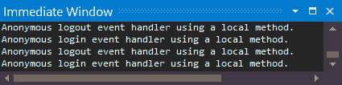

图 4.13 – 显示登录和注销事件触发的调试窗口

1.  如果你执行发布构建并运行 dotMemory，你会看到我们没有内存泄漏，考虑到我们刚刚生成了 2,000,000 个事件订阅和取消订阅——即 `Login()` 有 1,000,000 个，`Logout()` 也有 1,000,000 个。

我们已经看到了如何使用局部方法有效地使用匿名事件，而不会造成内存泄漏。现在，让我们看看本章的最后一个主题——弱引用。

### 使用弱引用事件

我们使用弱引用事件模式，允许一个对象如果其唯一剩余的链接是事件处理器，则可以被垃圾回收。我们将在本节中的 `CH04_PreventingMemoryLeaks` 项目中实现弱引用事件模式。遵循以下步骤：

1.  在包管理器控制台中，输入以下命令：`install-package WeakEventListener`。`System.Windows.WeakEventManager` 包仅适用于 .NET 4.8 及更早版本，这就是我们安装此包的原因。

1.  添加以下 `SampleClass` 类：

    ```cs
    internal class SampleClass
    {
          public event EventHandler<EventArgs> RaiseEvent;
          public void DoSomething()
          {
              OnRaiseEvent();
          }
          protected virtual void OnRaiseEvent()
          {
              RaiseEvent?.Invoke(this, EventArgs.Empty);
          }
    }
    ```

1.  在这个类中，我们声明了一个名为 `RaiseEvent` 的事件。`DoSomething()` 方法调用 `OnRaiseEvent()` 方法。`OnRaiseEvent()` 方法检查事件是否为 `null`；如果不是 `null`，则事件被调用。添加一个名为 `UsingWeakreferences` 的新类。你需要以下引用：

    ```cs
    using System;
    using System.Diagnostics;
    using WeakEventListener;
    ```

1.  添加 `RaiseWeakReferenceEvents()` 方法，如下所示：

    ```cs
    public void RaiseWeakReferenceEvents()
    {
          bool isOnEventTriggered = false;
          bool isOnDetachTriggered = false;
          SampleClass sample = new SampleClass();
          WeakEventListener<SampleClass, object, EventArgs> 
            weak = new WeakEventListener<SampleClass, object, 
                    EventArgs>(sample);
          weak.OnEventAction = (instance, source, eventArgs) 
            => { isOnEventTriggered = true; };
          weak.OnDetachAction = (listener) =>
            {isOnDetachTriggered = true; };
          sample.Raisevent += weak.OnEvent;
          sample.DoSomething();
          Debug.Assert(isOnEventTriggered);
          weak.Detach();
          Debug.Assert(isOnDetachTriggered);
    }
    ```

1.  我们有两个变量，当事件被触发和解除时它们为 `true`。我们实例化一个新的 `SampleClass` 类实例。然后我们声明一个引用 `SampleClass` 类的 `WeakEventListener` 包。使用匿名方法来处理 `OnEventAction` 和 `OnDetachAction` 方法。然后将 `WeakReferenceListener.OnEvent` 方法分配为 `SampleClass.RaiseEvent` 事件的处理器。然后我们调用引发事件的 `DoSomething()` 方法。然后，我们断言事件已被触发，解除事件，然后断言事件已被解除。

1.  确保项目设置为 **调试** 模式，然后逐步执行代码。它应该按预期工作，事件被正确触发和解除。

现在我们来总结一下本章所学的内容。

# 摘要

我们研究了对象生成，并看到了如何容易地生成 `System.OutOfMemoryException` 类型的异常。我们看到了如何使用预测性内存不足异常检查来节省时间，通过防止运行将导致此异常的代码。

然后，我们转向讨论长弱引用和短弱引用。我们了解到强引用不会被垃圾回收，而弱引用会被垃圾回收。

我们接着探讨了终结化，并看到了在未释放的对象上调用 `Finalize()` 方法的情况，以及我们没有控制 `Finalize()` 方法何时运行的情况。然后，我们探讨了如何实现 `IDisposable` 模式，并抑制垃圾回收调用 `Finalize()` 的需求。

最后，我们探讨了防止内存泄漏的各种方法，例如正确释放托管资源和非托管资源。我们还看到了如何正确处理事件，以避免内存泄漏。

通过本章所学的内容，你将能够克服内存不足异常，提高内存性能，并改善应用程序中的垃圾回收，你将能够正确使用事件和事件处理器，而不会产生内存泄漏，并且能够有效地释放 COM 对象和分配的内存。这将导致质量更高、更稳定的程序，并能够充分利用内存。

在下一章中，我们将探讨应用程序分析。

# 问题

1.  有多少个对象生成？

1.  哪些大小的对象会被放置在 SOH 上？

1.  哪些大小的对象会被放置在 LOH 上？

1.  什么是强引用？

1.  什么是弱引用？

1.  我们如何在不依赖终结的情况下清理对象？

1.  我们如何在使用事件时避免内存泄漏？

1.  我们使用哪种方法来释放 COM 对象？

1.  在分配内存时我们如何防止内存泄漏？

# 进一步阅读

+   弱引用: [`www.youtube.com/watch?v=2WcDhh8lvJs`](https://www.youtube.com/watch?v=2WcDhh8lvJs)

+   `ComWrappers` 类: https://docs.microsoft.com/dotnet/api/system.runtime.interopservices.comwrappers?view=net-5.0

+   *Marshal.ReleaseComObject 被认为是危险的*: [`devblogs.microsoft.com/visualstudio/marshal-releasecomobject-considered-dangerous/`](https://devblogs.microsoft.com/visualstudio/marshal-releasecomobject-considered-dangerous/)

+   *WeakEventManager 类:* https://docs.microsoft.com/dotnet/api/system.windows.weakeventmanager?view=net-5.0

+   *弱事件模式*: [`docs.microsoft.com/en-us/dotnet/desktop/wpf/advanced/weak-event-patterns?view=netframeworkdesktop-4.8`](https://docs.microsoft.com/en-us/dotnet/desktop/wpf/advanced/weak-event-patterns?view=netframeworkdesktop-4.8)

+   *如何正确释放 Excel COM 对象*: [`www.add-in-express.com/creating-addins-blog/2013/11/05/release-excel-com-objects/`](https://www.add-in-express.com/creating-addins-blog/2013/11/05/release-excel-com-objects/)

+   *通过事件处理程序和事件聚合器理解和避免内存泄漏*: [`www.markheath.net/post/understanding-and-avoiding-memory-leaks`](https://www.markheath.net/post/understanding-and-avoiding-memory-leaks)

+   为什么以及如何避免事件处理程序内存泄漏: [`stackoverflow.com/questions/4526829/why-and-how-to-avoid-event-handler-memory-leaks`](https://stackoverflow.com/questions/4526829/why-and-how-to-avoid-event-handler-memory-leaks)

+   *.NET Framework 技术在 .NET Core 和 .NET 5+ 上不可用:* [`docs.microsoft.com/en-us/dotnet/core/porting/net-framework-tech-unavailable`](https://docs.microsoft.com/en-us/dotnet/core/porting/net-framework-tech-unavailable)
