# 第九章：*第九章*：提高网络应用程序的性能

当你打开电脑时，很难找到一个不使用某种网络应用程序的应用程序。你的操作系统连接到网络以下载和安装 Windows 更新。已安装的应用程序将通过互联网定期轮询（检查）应用服务器，以查看是否有可下载的新版本。

浏览器通过互联网下载音频和视觉数据，网站允许你上传和下载文件。商业应用程序与数据库服务器进行通信。通信应用程序通过网络发送大量的文本、音频和视觉数据——通常涉及来自世界各地多个地区的人们参与在线视频会议和培训课程。你的金融科技应用程序通过互联网与你的金融提供商进行通信。这只是冰山一角。

我们的世界通过技术紧密相连，是网络使得所有这一切成为可能。我相信，作为网站或应用程序的用户，当它出现减速、应用程序挂起或应用程序在完成某些其他任务之前暂时冻结，阻止你进行任何工作，你一定感受到了一些挫败感。

由于这个原因，在当今快节奏的世界中，拥有在网络中表现优异的应用程序至关重要。这就是为什么微软正忙于不断提高他们软件的效率和速度。在舞台上相对较新的一个软件是**Google 远程过程调用**（**gRPCs**）。这是一个用于进行**远程过程调用**（**RPCs**）的软件框架，gRPC/gRPC-Web 获得了性能提升。

在本章中，你将学习如何提高网络应用程序的性能。你还将学习如何使用`System.IO.Pipelines`在网络中进行通信，以提供高性能的流式传输能力。

本章将涵盖以下主题：

+   **理解网络层和协议**：为了编写可工作的网络软件，你不必了解任何关于网络及其工作原理的知识——除非你正在编写用于提高网络应用程序性能的低级软件。在本节中，我们将从查看网络的各个层以及存在于这些层中的协议开始，来探讨如何提高软件的网络性能。

+   **优化基于 Web 的网络流量**：我们中的许多人每天都在工作、家庭、教育和休闲时间使用互联网。互联网通过覆盖全球的基于 Web 的网络运行。这个网络由非常慢的铜线网络到超快的光纤网络组成，以及具有不同处理能力的许多计算机。在本节中，我们将学习如何改善互联网上的流量，以提高互联网资源传输。你还将学习如何使用 Microsoft Edge 监控 Web 应用程序的性能。

+   **使用 gRPC 进行高性能通信**：在本节中，我们将学习如何使用 gRPC 和 gRPC-Web 进行高速网络进程间通信。当涉及到 gRPC-Web 时，我们将使用 Blazor Server 进行服务器端代码，使用 Blazor WebAssembly 进行客户端代码。

+   **优化互联网资源**：为了提高资源上传和下载时间，花时间进行正确的资源优化是值得的。在本节中，我们将学习如何优化图像、文本字符和数据传输。

+   **使用管道进行内容流传输**：在本节中，你将学习如何将数据处理、数据传输和数据接收阶段分解为几个原子任务，这些任务通过管道协同工作。

+   **在内存中缓存资源**：在本节中，你将学习如何将资源缓存到内存中，以减少页面传输和显示时间。这可以帮助减少其他用户的网络负载，并防止瓶颈和限制。

完成本章后，你将能够做到以下事项：

+   理解并应用基于 UDP 和基于 TCP 的网络协议

+   监控和识别网络流量问题

+   使用缓存提高资源网络检索性能

+   安全地发出网络请求并处理响应

+   使用管道在网络上高效地传输内容，例如互联网

    注意

    与所有性能敏感型工作一样，本章以及整本书中提到的所有技术和示例，都应在你的应用程序上下文中进行衡量。某些技术可能带来的开销可能不是必要的，这取决于你的网络应用程序需要处理的规模。

# 技术要求

要跟随本章的内容，你需要以下条件：

+   Visual Studio 2022 或更高版本

+   Microsoft Edge

+   本书源代码：[`github.com/PacktPublishing/High-Performance-Programming-in-CSharp-and-.NET/tree/master/CH09`](https://github.com/PacktPublishing/High-Performance-Programming-in-CSharp-and-.NET/tree/master/CH09)

# 理解网络层和协议

当编写与网络交互的应用程序时，了解所使用的**网络协议**非常有用。网络协议是一组定义了如何在网络上的不同设备和应用程序之间格式化、传输和接收数据的规则。不同的网络协议用于不同的任务。一些协议本质上是安全的，而另一些协议本质上是不可靠的。**OSI 网络层参考模型**是了解设备网络能力和相关协议的好起点。

**OSI**代表**开放标准研究所**。OSI 网络层参考模型是一个概念模型，它定义和标准化了计算机和电信设备之间的通信。它独立于支撑这种通信的技术，因此它是对设备网络层和协议的技术无关表示：

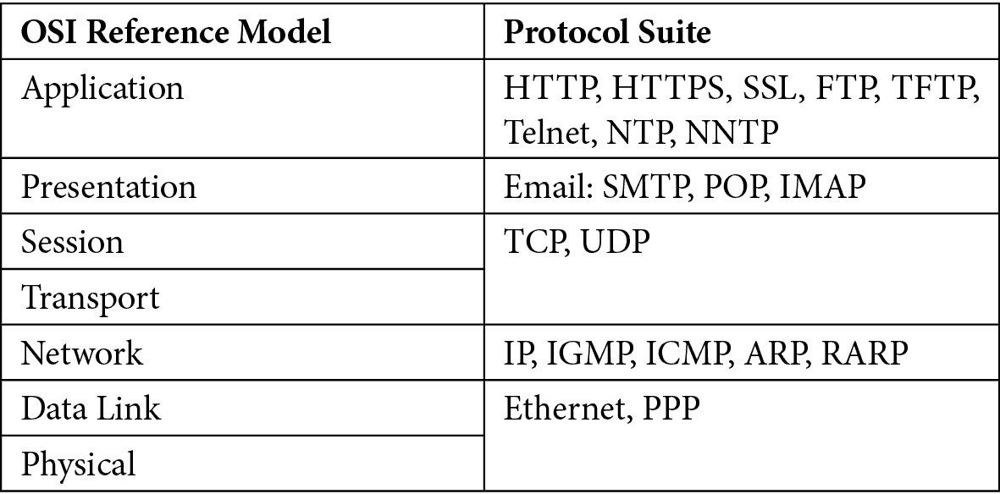

表 9.1 – OSI 网络层参考模型

如您所见，网络有七个操作层。这些层如下：

+   **应用层**：应用层提供了一个用户界面，允许用户通过网络发送和接收数据。该层包含所有您使用的应用程序，以及那些在幕后操作以与表示层交互的应用程序。例如，您的互联网浏览器使用 HTTP、HTTPS 和 FTP 协议在互联网上传输和接收文件，而电子邮件客户端使用 POP3、SMTP 和 IMAP 发送和接收电子邮件数据。

+   **表示层**：表示层加密、格式化和压缩准备用于网络传输的数据。在此层使用的协议包括 POP/SMTP、Usenet、HTTP、FTP、Telnet、DNS、SNMP 和 NFS。

+   **会话层**：会话层启动和终止与远程系统的会话。这是分配网络通信端口的层级。例如，端口 25 用于 POP/SMTP，端口 532 用于 Usenet，端口 80 用于 HTTP，端口 443 用于 HTTPS，端口 20 和 21 用于 FTP，端口 23 用于 Telnet，端口 53 用于 DNS，端口 161 和 162 用于 SNMP，以及使用 RPC 端口映射器来支持 NFS。

+   **传输层**：传输层使用 TCP 或 UDP 将数据流分解成较小的数据交付段。

+   **网络层**：网络层使用原始的 IPv4 或更新的 IPv6 提供逻辑寻址。

+   **数据链路层**：数据链路层为传输准备数据。该层将网络层的信息转换为可以使用 SLIP、PPP、802.2 SNAP 和以太网 II 协议轻松在所需网络类型上传输的格式。

+   **物理层**：物理层负责在设备位置之间移动数据。该层可以提供的物理网络连接类型包括 RS-X、CAT1 到 CAT8、ISDN、ADSL、ATM、FDDI 和同轴电缆。

以下协议在这些不同级别中使用：

+   **域名系统** (**DNS**)：DNS 协议的目的是通过域名解析将主机名转换为 IP 地址，反之亦然。DNS 的默认端口是 53。

+   **动态主机配置协议** (**DHCP**)：DHCP 的目的是动态地将 IP 地址相关信息分配给网络设备。DHCP 的默认端口是 67 和 68。

+   **超文本传输协议** (**HTTP**)：HTTP 的目的是使网页及其支持材料能够在互联网上传输。HTTP 协议的默认端口是 80。

+   **超文本传输协议安全** (**HTTPS**)：HTTPS 的目的是在互联网上安全地传输网页及其支持材料。HTTPS 的默认端口是 443。

+   **安全外壳** (**SSH**)：SSH 协议的目的是安全地连接到远程计算机，移动文件并执行各种命令。SSH 的默认端口是 22。

+   **安全套接字层** (**SSL**)：SSL 协议的目的是确保服务器和网页浏览器之间传输的数据安全。SSL 的默认端口是 443。

+   **文件传输协议** (**FTP**)：FTP 的目的是在互联网上传输文件。FTP 的默认端口是 20 和 21。

+   **Telnet**：Telnet 通过虚拟终端连接提供两个计算机之间不安全的双向交互式文本通信。Telnet 的默认端口是 23。

+   ** trivial 文件传输协议** (**TFTP**)：TFTP 的默认端口是 69。

+   **简单邮件传输协议** (**SMTP**)：SMTP 的目的是确保电子邮件在网络上的安全传输。SMTP 协议的默认端口是 25。

+   **邮局协议版本 3** (**POP3**)：POP3 的目的是从电子邮件服务器下载和阅读电子邮件。POP3 的默认端口是 110。

+   **互联网消息访问协议 4** (**IMAP4**)：IMAP 的目的是在不下载的情况下访问远程电子邮件服务器上的电子邮件。IMAP 的默认端口是 143。

+   **远程桌面协议** (**RDP**)：RDP 的目的是建立到计算机的远程连接并控制它。RDP 的默认端口是 3389。

+   **传输控制协议** (**TCP**)：TCP 的目的是提供可靠的保证，确保传输的数据将被接收。TCP 允许数据发送和接收。不同的协议属于 TCP 的范畴，每个 TCP 协议都有一个默认端口号。

+   **用户数据报协议** (**UDP**): UDP 的目的在于提供不受信任的数据传输，而不保证数据会被接收。UDP 只允许数据传输。不同的协议属于 UDP 的范畴，每个 UDP 协议都有一个默认端口号。

+   **互联网协议** (**IP**): IP 的目的是在 TCP/IP 网络上指定如何在主机计算机之间路由数据包。

+   **以太网**：以太网协议的目的是根据 IEEE 802.3 协议，控制数据如何在局域网中传输。

+   **点对点** (**PPP**): PPP 协议的目的是通过身份验证、传输加密和数据压缩，在两个路由器之间建立数据链路连接。

+   **网络时间协议** (**NTP**): NTP 的目的是在具有可变延迟的分组交换数据网络上，在计算机系统之间提供时钟同步。

+   **网络新闻传输协议** (**NNTP**): NNTP 的目的是在新闻服务器之间传输 Usenet 文章（*netnews*）。它也被终端用户客户端应用程序用于阅读和发布文章。

这些只是当今世界使用的各种网络协议中的一小部分。如果您进行大量需要网络访问的编程，鼓励您进一步研究各种协议。您可以在“进一步阅读”部分找到一些有用的文章来帮助您进步。

一旦您了解了网络协议的用途，您就可以选择最适合您需求的协议。这有助于减少开销。例如，如果您只想传输数据，而不希望接收它或关心它是否被接收，那么您将使用 UDP 网络协议。然而，如果您必须保证数据被发送和接收，那么您必须使用 TCP。

**互联网工程任务组** (**IETF**) 定义了两个成为互联网标准的网络传输协议的**请求评论** (**RFCs**)。RFC 768 (UDP) 定义了 UDP，而 RFC 793 (TCP) 定义了 TCP。以下是这些 RFC 的官方链接，供您查阅：

+   RFC 768 (UDP): [`tools.ietf.org/html/rfc768`](https://tools.ietf.org/html/rfc768.)

+   RFC 793 (TCP): [`tools.ietf.org/html/rfc793`](https://tools.ietf.org/html/rfc793)

TCP 是一种面向连接的协议，负责确保通过会话在网络中可靠地传输数据。发送方和接收方就将要传输的数据达成一致。对接收到的数据进行数据包错误检查。如果有错误，则提交重传失败数据包的请求。TCP 通常与**IP**一起使用。IP 使数据包知道它们要去哪里以及如何到达。当 TCP 和 IP 协议协同工作时，这种组合被定义为 TCP/IP。

UDP 与 TCP 不同，因为它是无连接的。UDP 接收器监听 UDP 数据包，会话无需建立。UDP 不执行错误检查。因此，数据包可能会丢失，接收器可能没有意识到这些数据包的丢失。UDP 在接收到数据或数据包丢失时不会向发送方确认。

TCP 通过建立通信会话、执行错误检查和重新提交丢失或损坏的数据包，通常被认为比 UDP 慢。UDP 比 TCP 快，因为它不建立会话连接或执行错误检查。因此，当数据必须无错误接收时，例如在金融交易中，TCP 是最佳选择。然而，当涉及到流式传输实时图像，例如观看电影时，UDP 是最佳选择。这就是为什么电影有时会显得有点颗粒感。

在现实世界中，OSI 模型并非在所有实际情况下都存在。相反，普遍接受的、在实用层面上有形的网络模型是 TCP/IP 模型。

## TCP/IP 模型

TCP/IP 模型与 OSI 模型的不同之处在于，TCP/IP 模型只由四个层组成。这些层如下：

+   应用层

+   传输层

+   互联网层

+   网络接口层

那么，TCP/IP 模型的层是如何映射到 OSI 模型的？以下表格展示了这两个模型及其层并列比较：

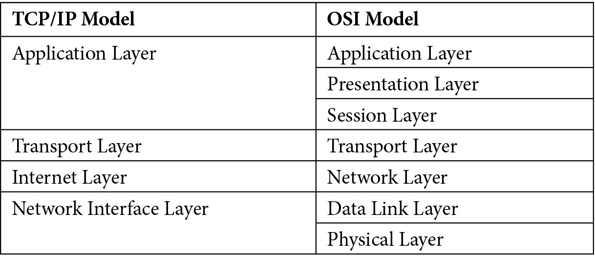

表 9.2 – TCP/IP 模型与 OSI 模型的比较

让我们描述 TCP/IP 模型中的每一层：

+   **应用层**使用户能够在网络上启动应用程序和系统之间的通信。这可以是发送电子邮件、打开网页、通过网络运行应用程序、从数据库访问应用程序信息以及通过网络执行文件传输。

+   **传输层**解决主机间的通信。

+   **互联网层**连接不同的网络。

+   **网络接口层**是物理硬件，它使服务器与其主机之间能够进行网络通信。

现在我们已经了解了 TCP/IP 模型，在下一节中，我们将编写一个简单的电子邮件应用程序，并讨论它与 TCP/IP 模型的关系。

## 使用 TCP/IP 模型编写一个示例电子邮件应用程序

在本节中，我们将编写一个简单的控制台应用程序，使用 SMTP 发送电子邮件。然后，我们将讨论这封电子邮件是如何通过 TCP/IP 模型发送的。要编写一个简单的控制台应用程序，请按照以下步骤操作：

1.  创建一个新的.NET 6.0 控制台应用程序，并将其命名为`CH09_OsiReferenceModel`。

1.  添加一个名为`EmailServer`的新类，并包含以下`using`语句：

    ```cs
    using System;
    using System.Net.Mail;
    ```

我们需要这两个命名空间来处理异常和发送电子邮件。

1.  添加以下方法：

    ```cs
    public static void SendEmail(
    string from, string to, string title, string message
    )
    {
        try
        {
        MailMessage mailMessage = new MailMessage();
        mailMessage.From = new MailAddress(from);
        mailMessage.To.Add(to);
        mailMessage.Subject = title;
        mailMessage.Body = message;
        SmtpClient smtpServer = new SmtpClient();
        smtpServer.DeliveryMethod = 
            SmtpDeliveryMethod.Network;
        smtpServer.Host = “smtp-mail.outlook.com”;
        smtpServer.Port = 587;
        smtpServer.UseDefaultCredentials = false;
        smtpServer.Credentials = new 
            System.Net.NetworkCredential(“EMAIL_ADDRESS”, 
                “PASSWORD”);
        smtpServer.EnableSsl = true;
        smtpServer.Send(mailMessage);
    }
    catch (Exception ex)
    {
                throw ex.GetBaseException();
    }
    }
    ```

上述代码为发送电子邮件提供了必要的参数。从这些参数中构建了一个`MailMessage`。然后，我们初始化并配置一个`SmtpClient`来连接到网络化主机电子邮件服务器，发送我们的电子邮件。

1.  更新`Program`类，如下所示：

    ```cs
    using CH09_OsiReferenceModel;
    Console.WriteLine(“Hello World!”);
    SendMail();
    Console.WriteLine(“Email has been sent.”);
    ```

在这里，我们正在向控制台窗口写入问候语。然后，我们调用`SendMail()`来发送我们的电子邮件，并以一条消息结束。

1.  现在，添加`SendMail()`方法：

    ```cs
    static void SendMail()
    {
    EmailServer.SendEmail(
        “FROM_EMAIL”
        , “TO_EMAIL”
        , “Test Message”
        , “Test Body. You can delete!”
    );
    }
    ```

将电子邮件地址替换为有效的地址。此方法调用`EmailServer`类中的`SendMail`方法。

运行程序；你应该在你的电子邮件账户中收到一封电子邮件。

当你的项目运行正常时，是时候讨论你的项目如何与 TCP/IP 网络模型相连接了。让我们先看看以下图表：

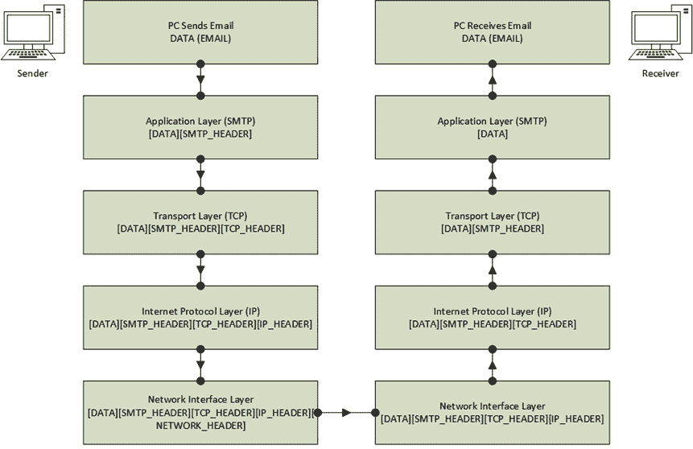

图 9.1 – 通过 TCP/IP 协议使用 SMTP 在网络中发送和接收电子邮件

首先，使用电子邮件客户端组合一封电子邮件，并让用户点击**发送**。当数据到达应用层时，SMTP 协议开始发挥作用。在这一层，联系收件人，并对数据进行格式化，并加上 SMTP 头部。

然后，电子邮件被传递到传输层。在这一层使用 TCP，用于将消息分解成带有 TCP 头部的小数据包。

从传输层开始，电子邮件被传递到互联网层。IP 对电子邮件数据包进行格式化，以便它们可以传输到互联网，并在其前面加上 IP 头部。这些格式化的 TCP/IP 数据包随后被传递到网络接口层。

在网络接口层，发送者和接收者的 IP 地址被添加到电子邮件前面加上头的头部中。然后，电子邮件被发送到接收者。

当电子邮件数据包到达接收者时，它首先到达网络层。网络层的头部被移除，电子邮件数据包被传递到互联网层。IP 头部被移除，电子邮件数据包被传递到传输层。

在传输层，电子邮件数据包被重新组装。一旦所有数据包都组装完成，并移除了 TCP 头部，它们被传递到应用层，在那里 SMTP 协议移除 SMTP 头部，将纯电子邮件数据传递给客户端，并关闭会话。

有了这些，我们已经涵盖了概念性的 OSI 模型和实用的四层 TCP/IP 模型。发送电子邮件是我们用来讨论从发送者到接收者在四层 TCP/IP 层中旅程的例子。

现在，你已经了解了构成网络的不同层以及一些不同的网络协议及其用途，让我们来看看网络跟踪。

# 提高基于 Web 的网络流量

关注您的 Web 应用程序的性能是一个好主意。这有助于您了解您的应用程序如何从我们所熟知的互联网或日益被称作云的网络中传输和接收信息。您甚至可以追踪那些耗时较长的调用，从而提高您应用程序的响应性能。

完成此任务有多种方法。但我们将只关注一种方法，那就是使用内置的开发工具性能分析器在 Web 浏览器中记录您应用程序的性能。具体来说，我们将探讨使用 Microsoft Edge 的**开发工具**。这将是下一节的主题。

## 使用 Microsoft Edge 记录您的 Web 应用程序性能

在本节中，您将使用 Microsoft Edge 浏览器来分析您的 Web 应用程序性能。互联网是我们每天用来浏览网页的**广域网**（WAN）的名称。有时，Web 应用程序可能会很慢，而且它们通常比它们的桌面版本慢得多。这就是各种浏览器提供的开发者工具发挥作用的地方。

使用浏览器开发者工具，您有一些强大的功能来查看您的应用程序在幕后做了什么。各种浏览器提供的主要功能如下：

+   能够导航当前加载的网站元素以查看 HTML 结构、使用的样式、计算样式、布局、事件监听器、DOM 断点、属性和可访问性。

+   您可以查看控制台消息，包括任何抛出的错误消息。

+   您可以使用资源查看构成页面的所有内容，与本地文件系统同步更改，使用来自本地文件夹的文件覆盖页面资源，查看由扩展提供的内联脚本，以及创建和保存代码片段以供以后重用。

+   您可以使用**网络**选项卡记录和查看页面生成的网络流量，包括名称、状态、类型、发起者、大小、时间和瀑布图等信息。

+   您可以记录一个过程。这些信息可以非常详细，您可以保存屏幕截图，记录内存使用情况，并通过**性能**选项卡查看页面的网络核心指标。

+   您可以分析内存使用情况，并可以选择记录堆快照，按时间分配仪表，以及分配样本。

+   您可以在**应用程序**选项卡上查看和调试您应用程序的后台服务，包括它们的存储和缓存。

+   安全性，这使您能够查看您应用程序的主要来源和受保护来源，以及其安全信息，例如它是否有有效的**SSL 证书**。

来自不同厂商的每个浏览器都以微妙不同的方式工作。开发者们各自有他们偏好的浏览器和开发者工具集。在本节中，我们将使用**Microsoft Edge 网络**和**性能**标签页来分析网页的性能。要这样做，请按照以下步骤操作：

1.  打开**Microsoft Edge**并按*F12*键打开开发者工具。应该会出现以下屏幕：

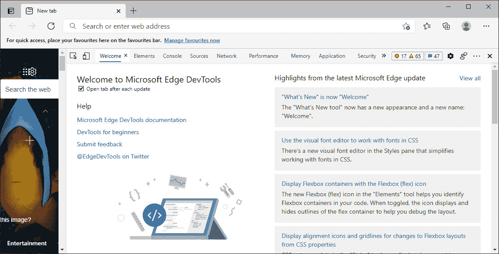

图 9.2 – Microsoft Edge 开发者工具显示默认标签页

1.  点击**网络**标签页。

1.  在地址框中，输入`docs.microsoft.com`。

网站现在将开始加载。在加载过程中，您将看到生成的网络流量被记录下来。以下截图显示了按处理时间最长的资源排序的数据的一部分：

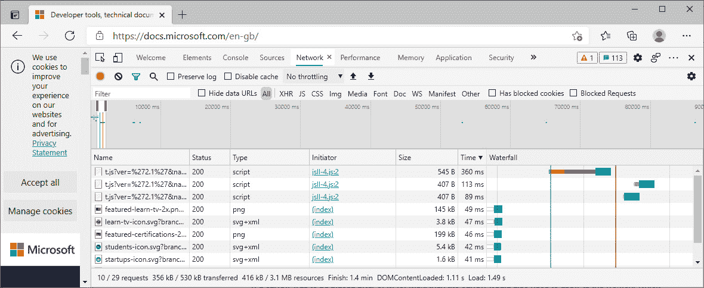

图 9.3 – Microsoft Edge 开发者工具的“网络”标签页显示网络流量数据

如您所见，**网络**标签页有助于查看已请求的资源（**名称**）、请求的**状态**和**类型**值、发起请求的**发起者**、请求的**大小**和**处理时间**，以及其在**瀑布图**上的视觉表示。这些信息可以应用于您的页面及其资源，以减少完整请求的整体大小并缩短完成请求所需的时间。

既然我们已经看到了**网络**标签页的实际应用，让我们看看**性能**标签页的实际应用。要这样做，请按照以下步骤操作：

1.  点击**性能**标签页，然后点击**记录**按钮。

1.  在地址栏中输入`docs.microsoft.com`并按*Enter*键。

1.  页面完全加载后，通过点击弹出对话框的**停止**按钮来停止记录。

刚刚捕获的配置文件现在将加载并展示给您。这个过程需要多长时间取决于您记录了多长时间以及产生了多少流量。

一旦配置文件加载完成，您应该会看到以下屏幕：

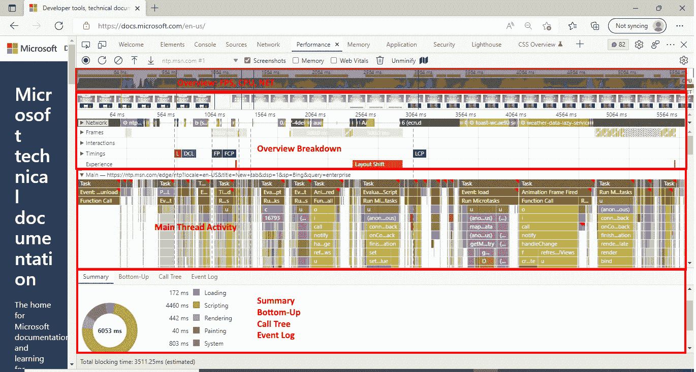

图 9.4 – docs.microsoft.com 的 Microsoft Edge 性能配置文件

您可能无法阅读前一个截图的内容。没关系 – 这个截图只是表示您可以使用性能分析器获取的数据量。您有截图、瀑布图、加载 URL 所使用的所有方法和属性的分解，以及按时间汇总的流量类型，如加载时间、脚本时间、渲染时间、绘制时间、系统时间和空闲时间。

你可以使用这些信息来找出请求中大部分时间被占用的地方，并识别消耗时间的方法。这将帮助你确定你的 Web 项目中可能需要性能改进的区域。

使用浏览器工具可以收集有关应用程序性能的大量信息。这里并没有涵盖所有这些信息。例如，由于本章的页面长度限制，我们甚至没有触及 Microsoft Edge 开发者工具中的内存分析选项卡。然而，你被积极鼓励亲自尝试网络浏览器开发工具中所有不同的功能，以帮助你分析和改进 Web 应用程序及其网络利用率。

现在我们已经学习了如何使用浏览器开发工具来分析由我们的应用程序请求和响应产生的互联网流量，让我们来看看性能增强的**gRPC 远程过程调用**（**gRPC**）框架，用于高速网络数据传输和通信。

# 使用 gRPC 进行高性能通信

什么是 gRPC？它是一个开源的**RPC**框架。应用程序使用 RPC 进行相互通信。gRPC 基于 HTTP/2 的现代技术构建，用于**传输协议层**，以及**协议缓冲区**（**Protobuf**）用于消息的序列化技术。Protobuf 还提供了一种语言中立的合同语言。

gRPC 的设计考虑了现代高性能和跨平台应用程序。有各种编程语言的实现。这使得在操作系统和不同编程语言上开发的应用程序能够相互通信。

gRPC 是一个有观点的合同优先框架，合同在**proto 文件**中定义。这个 proto 文件包含了你的 API 定义以及它们将发送和接收的消息。然后使用代码生成来为你的语言和平台生成强类型客户端和消息，在我们的案例中将是 C#和.NET。gRPC 的语言是二进制的，专为计算机设计。这使得 gRPC 比基于文本的 HTTP API 表现更好。在 gRPC 框架中，远程的复杂性被隐藏起来，程序员不需要手动完成的大部分工作都由代码生成工具完成。因此，你所需要做的就是调用客户端上的方法并等待结果。为了提高开发者的生产力和应用程序的性能，你最好使用 gRPC 而不是 HTTP API。

HTTP API 是内容优先，考虑 URL 的形状、HTTP 方法、JSON 和 XML 等。REST API 是代码优先。通常，您会先编写代码，然后生成 Swagger 或 RAML 合约。REST API 基于文本，因此可读性强。这使得它们在适当的工具的帮助下易于调试，但与 gRPC 相比，这些 API 的性能较慢。REST API 处理低级 HTTP，因此在 HTTP 请求、响应和路由方面需要考虑更多。这比使用 gRPC 更复杂，但最终您将获得高度的控制。因此，尽管 HTTP API 在性能上不是特别突出，但它们将吸引最广泛的开发者群体。它们可能更容易上手。然而，当您在开发复杂的企业软件时，它们可能会变得极其复杂和深层路由。

现在您已经了解了 gRPC 和 HTTP，您会欣赏到最快的网络和应用程序间通信将由 gRPC 而不是 HTTP 来完成。鉴于这本书是关于性能的，我们将现在通过一个简单的演示来展示 gRPC 的工作原理。

## 编程简单的 gRPC 客户端/服务器应用程序

在本节中，我们将构建一个返回单个消息的 gRPC 服务。然后，我们将编写一个客户端来调用 gRPC 服务，并更新我们的客户端和服务器，以便我们可以流式传输消息。让我们先编写我们的 gRPC 服务。

### 构建 gRPC 服务

在本节中，我们将使用**Visual Studio**构建一个 gRPC 服务。在本章的后面部分，我们将使用这个服务。要在 Visual Studio 中构建 gRPC 服务，请按照以下步骤操作：

1.  打开 Visual Studio 并选择**创建新项目**。

1.  搜索并选择 ASP.NET Core **gRPC 服务**模板，然后点击**下一步**。

1.  在`CH09_GrpcService`上点击**创建**。

1.  接下来将显示**附加信息**页面。请确保从下拉菜单中选择最新的.NET Framework 版本；这应该是.NET 6.0。

1.  点击`appsettings.json`文件。

1.  确保项目设置为启动项目，然后运行它。您应该会看到一个**信任 ASP.NET Core SSL 证书**对话框。点击**是**。

1.  现在将弹出一个安全对话框，告知您即将安装安全证书。点击**是**以安装它。一旦证书安装完成，您的服务应该[正在运行。gRPC](http://localhost:5000)服务的 URL 是[`localhost:5000`](http://localhost:5000)和[`localhost:5001`](https://localhost:5001)。

    注意

    如果 5000 和 5001 端口已被占用，您的系统上的端口可能不同。

1.  在浏览器中输入 https://localhost:5001；您应该会收到以下消息：**与 gRPC 端点的通信必须通过 gRPC 客户端进行。**要了解如何创建客户端，请访问[`go.microsoft.com/fwlink/?linkid=2086909`](https://go.microsoft.com/fwlink/?linkid=2086909)。此消息通知我们下一步是为我们编写一个能够与该服务通信的客户端。

如此简单，就可以开始使用 gRPC 服务了。在`Proto`文件夹中打开`greet.proto`文件，并输入以下代码：

```cs
syntax = “proto3”;
option csharp_namespace = “CH09_GrpcService”;
package greet;
// The greeting service definition.
service Greeter {
  // Sends a greeting
  rpc SayHello (HelloRequest) returns (HelloReply);
}
// The request message containing the user’s name.
message HelloRequest {
  string name = 1;
}
// The response message containing the greetings.
message HelloReply {
  string message = 1;
}
```

如您所见，proto 语言很简单。在这个文件中，我们声明了语言的语法、程序集命名空间和包名。然后，我们提供了一个服务定义，它定义了 RPC 请求和响应，随后是请求和响应消息。

注意

在底层进行了大量的代码生成。因此，如果您想知道某些文件的位置，您将在您的`Obj\Debug\net6.0\Protos`文件夹中找到它们隐藏起来。

由于我们使用 gRPC 为我们提供服务，我们需要一个客户端。因此，在下一节中，我们将构建我们的客户端。

### 构建 gRPC 客户端

在本节中，我们将添加一个 gRPC 客户端项目，该项目将消费我们的 gRPC 服务。此外，对于我们的客户端项目，我们将编写一个简单的控制台应用程序。要添加客户端项目，请按照以下步骤操作：

1.  开始一个新的名为`CH09_GrpcServiceClient`的.NET 6.0 控制台应用程序项目，并将目标框架更改为`.NET 6.0`。

1.  在解决方案资源管理器中，右键单击项目的**服务依赖项**节点，并选择**添加连接服务**菜单选项。这将向您展示以下选项卡：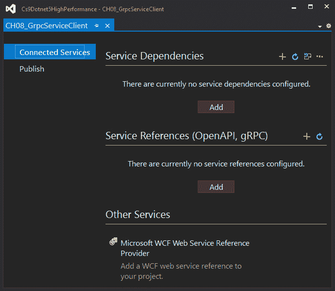

图 9.5 – Visual Studio 中的连接服务选项卡

1.  在**服务引用（OpenAPI，gRPC）**部分下点击**添加**按钮。这将弹出**添加服务引用**对话框，如图所示：

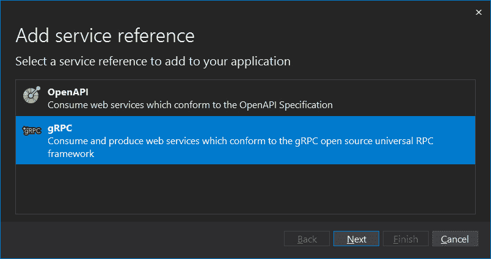

图 9.6 – Visual Studio 中的添加服务引用对话框

1.  点击**gRPC**选项，然后点击**下一步**按钮。前面截图中的向导对话框将移动到**添加新 gRPC 服务引用**页面，如图所示：

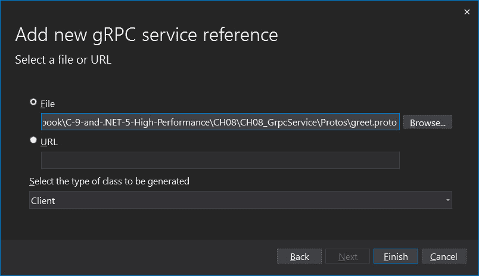

图 9.7 – 添加服务引用对话框中的添加新 gRPC 服务引用页面

1.  在您的 gRPC 服务项目中点击`greet.proto`文件，并选择它。确保从下拉列表中选择**客户端**选项。然后，点击**完成**。

1.  对话框将变为 **服务引用配置进度**。当你收到显示 **成功添加服务引用** 的消息时，点击 **关闭** 按钮。你的 gRPC 连接服务现在将出现在 **连接服务** 选项卡的 **服务引用** 部分中，如图所示：

![图 9.8 – 显示我们连接的 gRPC 服务的“连接服务”选项卡]

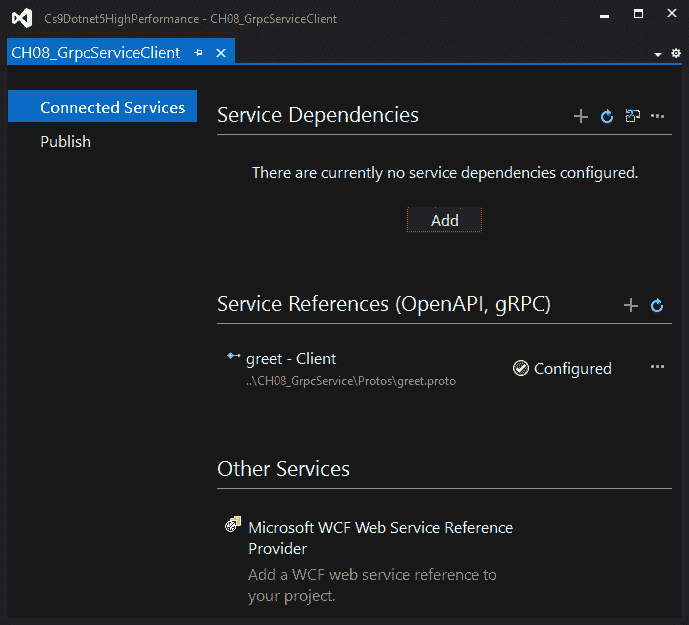

图 9.8 – 显示我们连接的 gRPC 服务的“连接服务”选项卡

这样，你就已经将一个客户端项目添加到了你的 gRPC 服务中。客户端项目添加后，我们现在可以编写控制台应用程序。按照以下步骤操作：

1.  通过在解决方案资源管理器中选择它来打开 `CH09_GrpcServiceClient.csproj` 文件。你应该会看到以下 XML：

    ```cs
    <Project Sdk=”Microsoft.NET.Sdk”>
    <PropertyGroup>
        <OutputType>Exe</OutputType>
        <TargetFramework>net6.0</TargetFramework>
    </PropertyGroup>
    <ItemGroup>
        <PackageReference Include=”Google.Protobuf” 
            Version=”3.13.0” />
        <PackageReference Include=”Grpc.Net.ClientFactory” 
            Version=”2.32.0” />
        <PackageReference Include=”Grpc.Tools” 
            Version=”2.32.0”>
            <PrivateAssets>all</PrivateAssets>
            <IncludeAssets>runtime; build; native; 
                contentfiles; analyzers; 
                buildtransitive</IncludeAssets>
        </PackageReference>
    </ItemGroup>
    <ItemGroup>
        <Protobuf 
            Include=”..\CH09_GrpcService\Protos\greet.proto”
            GrpcServices=”Client”>
            <Link>Protos\greet.proto</Link>
        </Protobuf>
    </ItemGroup>
    </Project>
    ```

在前面的 XML 代码中，你可以看到对 Google 的 `Protobuf` 库和 `gRPC` 库的引用。你还会看到一个指向 gRPC 服务中你的 proto 文件的 Protobuf 链接，这表明你的项目正在承担客户端的角色。

1.  在你的客户端项目中打开 `Program` 类。

1.  更新 `Main(string[] args)` 方法，如下所示：

    ```cs
    static async void Main(string[] args)
    {
        await ExecuteGrpcClient();}
    ```

在我们的入口点方法中，我们调用异步的 `ExecuteGrpClient()` 方法。然而，因为我们不能将我们的主方法标记为异步，所以我们不得不在 `ExecuteGrpcClient()` 方法上调用 `Wait()`：

```cs
tatic async Task ExecuteGrpcClient()
{
GrpcChannel grpcChannel = 
    GrpcChannel.ForAddress(“https://localhost:5001”);
Greeter.GreeterClient greeterClient = 
    new Greeter.GreeterClient(grpcChannel);
HelloReply helloReply = 
    await greeterClient.SayHelloAsync(new HelloRequest
    {
        Name = “gRPC Demonstration!”
    });
Console.WriteLine(
    $”Message From gRPC Server: {helloReply.Message}”);
}
```

因为我们将等待异步调用，所以我们必须使用异步修饰符将 `ExecuteGrpcClient()` 方法声明为异步。此方法不返回任何内容。然而，它不能声明为 void，因此我们必须提供 `Task` 作为返回类型。然后，我们必须通过指向我们的 gRPC HTTPS 地址来声明我们的 gRPC 通道。然后，我们必须通过传递我们刚刚声明和初始化的 gRPC 通道来声明我们的客户端。接下来，我们必须通过等待对服务器方法的异步调用并传递一个消息请求（我们根据需要设置属性）来获取一个回复。最后，我们必须将服务器的响应打印到控制台窗口。

1.  在终端中打开服务器项目，并输入 `dotnet run`。服务器将本地运行在端口 5001 上。

1.  然后，在终端窗口中打开客户端项目，并输入 `dotnet run`。它将在控制台窗口中打印以下消息：

```cs
Message From gRPC Server: Hello gRPC Demonstration!
```

通过这样，你已经成功编写了一个 gRPC 服务器，并通过编写和运行 gRPC 客户端来消费其消息。那么这又意味着什么呢？这对你意味着你现在有了在不同应用程序之间使用通用协议进行通信的跨平台方式。在这方面有什么大不了的？嗯，假设你有一些用各种语言编写的遗留应用程序，并且你想要将它们全部迁移到一个通用的平台和编程语言，比如 .NET 或 C# – 你现在有了一种直接完成此任务的方法。

通过使用 gRPC，你可以提供从遗留平台到.NET 5 及以上平台和 C# 9 及以上编程语言的逐步迁移。你会通过为你的.NET 客户端和遗留客户端编写 gRPC 客户端来实现这一点。这将使你能够在逐步替换旧系统的同时开始使用.NET 和 C#。然后，随着旧系统被一个现代系统逐步取代，你可以充分利用.NET 和 C#，并从微软团队对语言和框架所做的所有性能改进中受益。此外，你可以利用使用微软生态系统的所有业务和性能优势，这包括以安全性、可扩展性和性能为设计目标的微软 Azure 云服务。

在这一点上，值得注意 gRPC 官方支持的各种语言。官方支持的语言、操作系统、编译器和 SDK 如下表所示：

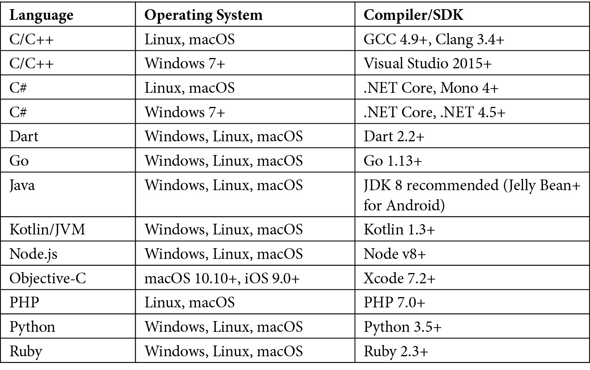

表 9.3 – gRPC 官方支持的语言

如我们所见，gRPC 在多种语言、操作系统、SDK 和编译器方面都得到了良好的支持。因此，gRPC 是使用一个和谐的消息框架将不同的系统结合起来的完美网络技术。

到目前为止，你已经消费了一个单一请求，并且知道 gRPC 可以与各种操作系统和编程语言一起使用。但是，如果你需要处理一整批 gRPC 请求呢？我们该如何做？这是一个好问题。我们将在下一节中学习如何做到这一点。

### 流式传输多个 gRPC 请求

在本节中，我们将修改我们的客户端和服务器 gRPC 项目以发送和处理消息流。到项目结束时，你将从服务器发送 10 条消息到客户端。在客户端，你将处理每个到达的消息并将其写入控制台窗口。为此，请按照以下步骤操作：

1.  更新`CH09_GrpcService`项目的`greet.proto`文件，如下所示：

    ```cs
    // The greeting service definition.
    service Greeter {
    // Sends a greeting
    rpc SayHello (HelloRequest) returns (HelloReply);
    rpc SayHelloStream(HelloRequest)
        returns (stream HelloReply);
    }
    ```

你将看到你已经为我们服务的定义添加了一个新的消息流。而不是返回一个单一的`HelloReply`消息，消息流返回一个`HelloReply`类型的消息流。

1.  在`CH09_GrpcServer`项目的`GreeterService`类中，添加以下方法：

    ```cs
    public override async Task SayHelloStream(HelloRequest 
        request, IServerStreamWriter<HelloReply> 
            responseStream, ServerCallContext context)
    {
        for (int i = 0; i < 10; i++)
        {
        await responseStream.WriteAsync(new HelloReply
        {
            Message = $”Response Stream Message: {i}”
        });
        await Task.Delay(TimeSpan.FromSeconds(1));
    }
    }
    ```

在这个方法中，你将迭代 10 次。对于每次迭代，你等待`responseStream.WriteAsync(HelloReply)`方法。在这个异步调用中，你将消息设置在`HelloReply`对象上。由于每次迭代只需毫秒级，你将故意减慢任务的处理速度，以便人类眼睛可以看到一个方法接一个方法地写入。这种延迟将你的任务减慢了 10 秒——每次迭代一秒。在正常的应用程序中，你通常不会设置这样的延迟。

1.  现在你已经更新了你的服务器项目，请重新构建两个项目以查看更改，并移动到你的 `CH09_GrpcServiceClient` 项目。

1.  在 `Program` 类中，将 `ExecuteGrpcClient()` 方法内的代码移动到其自己的方法 `SingleGrpcMessageClient()` 中。然后，将以下两行代码添加到 `ExecuteGrpcClient()` 方法中：

    ```cs
    await SingleGrpcMessageResponse();
    await GrpcMessageResponseStream();
    ```

上述代码包含两个异步调用：一个用于单个消息，另一个用于流式传输多个消息。

1.  添加 `GrpcMessageResponseStream()` 方法：

    ```cs
    static async Task GrpcMessageResponseStream()
    {
        GrpcChannel grpcChannel = 
            GrpcChannel.ForAddress(“https://localhost:5001”);
        Greeter.GreeterClient greeterClient = 
            new Greeter.GreeterClient(grpcChannel);
        AsyncServerStreamingCall<HelloReply> helloReply =   
            greeterClient.SayHelloStream(new HelloRequest
            {
                Name = “gRPC Streaming Demonstration!”
            });            
        await foreach (HelloReply item in 
            helloReply.ResponseStream.ReadAllAsync())
            {
                Console.WriteLine(item.Message);
            }        
    }
    ```

`GrpcMessageResponseStream()` 创建一个 `GrpcChannel` 并将其分配给一个新的客户端。然后调用一个 gRPC 流。这会遍历从服务器发送回客户端的所有流项目，并将每个项目的消息打印到控制台窗口。

1.  在各自的终端中打开每个项目，并输入 `dotnet run` 命令。这将启动服务器并运行客户端。你应该看到以下控制台窗口输出：

    ```cs
    Message From gRPC Server: Hello gRPC Demonstration!
    Response Stream Message: 0
    Response Stream Message: 1
    Response Stream Message: 2
    Response Stream Message: 3
    Response Stream Message: 4
    Response Stream Message: 5
    Response Stream Message: 6
    Response Stream Message: 7
    Response Stream Message: 8
    Response Stream Message: 9
    ```

你现在知道如何将 gRPC 用于桌面应用程序。在下一节中，你将学习如何将 gRPC 用于 Blazor。

## 编写一个简单的 gRPC Blazor 应用程序

**Blazor** 是一种网络编程模型。使用 Blazor，你可以拥有服务器端 Blazor 项目，这些项目是你需要编写以保护敏感信息不被泄露时使用的。当应用程序性能至关重要时，你可以拥有客户端 Blazor 项目。作为组织的企业应用程序的一部分，你会有许多不同的 Blazor 服务器端和客户端应用程序协同工作。

为了使 gRPC 能够与网络项目一起工作，已经开发了一个名为 gRPC-Web 的包装器。这使得你可以拥有 gRPC-Web 服务和 gRPC-Web 客户端。使用 gRPC-Web，可以构建与 HTTP/1.1 和 HTTP/2 协议兼容的端到端管道。这为无法调用 gRPC HTTP/2 的浏览器 API 提供了竞争优势，特别是当你考虑到并非所有 .NET 平台都通过 `HttpClient` 类支持 HTTP/2 时。gRPC-Web 的另一个好处是，你不必仅使用 TCP 进行**进程间通信**（**IPC**）。对于 IPC，你也可以使用命名管道（UDP）和**Unix 域套接字**（**UDS**）。

注意

Blazor 的默认模板应用程序有一个使用 JSON 作为其数据后端的数据获取页面。该 JSON 文件的数据大小为 627 字节。但是当 JSON 被替换为 gRPC 时，数据大小减少到 309 字节。这个例子表明，使用 gRPC-Web 进行数据传输比使用 JSON 快，因为网络传输和接收的数据量较少。使用 gRPC-Web 传输数据大小的减少意味着在请求需要被节流之前，可以在网络上发送更多的请求。

在 .NET 6.0 中，应用程序通过积极的剪枝来减小体积。您可以积极剪枝基于 gRPC 的应用程序以减小其体积并提高其性能，尤其是在发送网络数据时。这是因为 gRPC 内置的代码生成功能。

在 Web 项目中，无法直接访问 gRPC。因此，引入了一个名为 gRPC-Web 的代理项目，以使 Web 项目能够使用 gRPC。

在以下章节中，我们将编写一个 Blazor 客户端和服务器 gRPC 应用程序，该应用程序由一个 Blazor 服务器应用程序和一个 Blazor WebAssembly 应用程序组成。让我们开始。

## 这是我们的空白解决方案

我们需要从一个空白解决方案开始：

1.  打开 Visual Studio 并搜索 `Blank Solution`。

1.  创建一个空白解决方案并将其命名为 `CH09_BlazorGrpc`。

这将提供一个空白解决方案，我们可以向其中添加我们的客户端和服务器 Blazor 应用程序。接下来，我们将处理我们的客户端项目。

### Blazor 客户端项目

在本节中，我们将构建我们的 Blazor 客户端 gRPC 应用程序。按照以下步骤操作：

1.  添加一个新的 `CH09_BlazorGrpc.Client`。

1.  添加以下 NuGet 包：

    1.  `Google.Protobuf`

    1.  `Grpc.Net.Client`

    1.  `Grpc.Net.Client.Web`

    1.  `Grpc.Tools`

1.  添加一个名为 `Protos` 的文件夹，并在该文件夹中添加一个名为 `person.proto` 的文件。

1.  打开 `person.proto` 文件并添加以下代码：

    ```cs
    syntax = “proto3”;
    option csharp_namespace = “CH09_BlazorGrpc.Client”;
    package grpcpeople;
    service Person {
      rpc GetPeople (PeopleRequest) returns (PeopleResponse);
    }
    message PeopleRequest {
    }
    message PeopleResponse{
            repeated PersonResponse people = 1;
    }
    message PersonResponse {
         string name = 1;
    }
    ```

我们的 proto 文件定义了 proto 定义版本为 proto3。因此，将使用 `proto3` 语法。我们的服务定义的命名空间是 `CH09_BlazorGrpc.Client`。我们给我们的包取的名字是 `grpcpeople`。有三个消息名为 `PeopleRequest`、`PeopleResponse` 和 `PersonResponse`。最后，我们定义我们的服务为 `Person`，并有一个名为 `GetPeople` 的 RPC，它接受一个 `PeopleRequest` 并返回一个 `PeopleResponse`。

1.  将以下导入添加到 `_Imports.razor` 文件中：

    ```cs
    @using CH09_BlazorGrpc.Client
    @using CH09_BlazorGrpc.Client.Shared
    @using Grpc.Net.Client;
    @using Grpc.Net.Client.Web;
    ```

这些导入将适用于所有我们的文件。

1.  定位到 `Pages`/`Index.razor` 页面，并用以下代码替换其内容：

    ```cs
    @page “/”
    @using CH09_BlazorGrpc.Client
    <PageTitle>Index</PageTitle>
    <h1>People from Grpc Service</h1>
    @foreach(var person in model.People)
    {
        <p>Name : @person.Name</p>
    }    
    @code{
        private PeopleResponse model = new PeopleResponse();
        protected override async Task OnInitializedAsync()
        {
                using var channel = GrpcChannel.ForAddress
                   (“https://localhost:7272/”, new 
                       GrpcChannelOptions
        {
            HttpHandler = new GrpcWebHandler(new 
                HttpClientHandler())
        });
                var client = new Person.PersonClient
                    (channel);
                model = await client.GetPeopleAsync(
                                  new PeopleRequest { });
        }
    }
    ```

上述代码将调用由服务应用程序定位的 gRPC 服务，并列出返回的人员。

那就是我们的客户端应用程序完成了。现在，让我们编写我们的服务器应用程序。

### Blazor 服务器项目

在本节中，我们将编写我们的服务器应用程序，它将包含负责向客户端返回请求数据的服务的应用程序。让我们开始：

1.  添加一个新的 Blazor 服务器应用程序，名为 `CH09_BlazorGrpc.Server`。

1.  添加 `Grpc.AspNetCore` 和 `Grpc.AspNetCore.Web` NuGet 包。

1.  从客户端项目复制 `Protos` 文件夹及其内容，并将其粘贴到服务器项目中。

1.  将 `PeopleService` 类添加到服务器项目的根目录。

1.  将 `PeopleService` 类的内容替换为以下代码：

    ```cs
    namespace CH09_BlazorGrpc.Server;
    using Grpc.Core;
    using CH09_BlazorGrpc.Client;
    public class PeopleService : Person.PersonBase
    {
        public override async Task<PeopleResponse> 
            GetPeople(PeopleRequest request, 
                ServerCallContext context)
        {
            PeopleResponse response = new PeopleResponse();
            response.People.Add(new PersonResponse { Name = 
                “Person One” });
            response.People.Add(new PersonResponse { Name = 
                “Person Two” });
            response.People.Add(new PersonResponse { Name = 
                “Person Three” });
            return response;
        }
    }
    ```

此服务有一个返回人员列表的单个方法。

1.  将 `Program.cs` 文件中的代码替换为以下内容：

    ```cs
    using CH09_BlazorGrpc.Server;
    var builder = WebApplication.CreateBuilder(args);
    builder.Services.AddGrpc(options =>
    {
        options.EnableDetailedErrors = true;
        options.MaxReceiveMessageSize = 2 * 1024 * 1024; 
        // 2 MB
        options.MaxSendMessageSize = 5 * 1024 * 1024; // 5 MB
    });
    builder.Services.AddCors(setupAction =>
    {
        setupAction.AddDefaultPolicy(policy =>
        {
            policy.AllowAnyHeader().AllowAnyOrigin()
                .AllowAnyMethod()
              .WithExposedHeaders(“Grpc-Status”, 
                   “Grpc-Message”, “Grpc-Encoding”, 
                       “Grpc-Accept-Encoding”);
        });
    });
    var app = builder.Build();
    app.UseCors();
    app.UseRouting();
    app.UseGrpcWeb(new GrpcWebOptions { DefaultEnabled = 
        true });
    app.UseEndpoints(endpoints =>
    {
        endpoints.MapGrpcService<PeopleService>();
    });
    app.Run();
    ```

上述代码配置了我们的 Blazor 应用程序以使用 gRPC，并设置了我们的`PeopleService`类，以便我们的客户端应用程序可以使用它。我们还配置了`Cors`，以便我们的 gRPC 请求和响应不会被阻止。

1.  右键单击解决方案并选择**属性**。

1.  在**启动项目**下，选择**多个启动项目**，并将客户端和服务器项目的**操作**都更改为**启动**。

1.  点击**确定**关闭属性对话框。

运行项目。应该打开两个浏览器窗口和两个控制台窗口。如果一切顺利，您应该看到以下浏览器窗口：

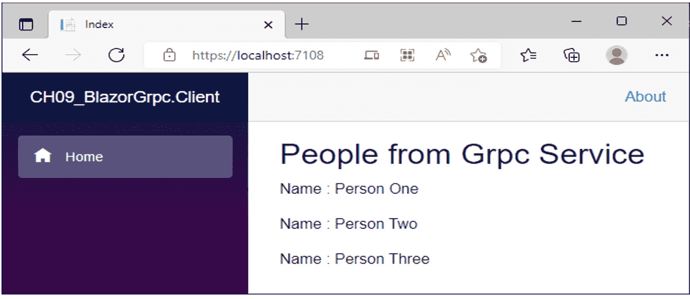

图 9.9 – 客户端 Blazor 应用程序显示服务器应用程序中 gRPC 服务的响应

注意

端口号取决于系统上可用的端口号。因此，如果端口 5000 和 5001 已被占用，将使用备用端口。这里就是这样，服务器应用程序正在使用端口 7272，客户端应用程序正在使用端口 7108。

通过这些，您已经了解了使用 gRPC 和 gRPC-Web 在桌面和基于 Web 的网络数据传输和通信，这些都与 C#和.NET Framework 一起获得了多项性能提升。您还使用了 Blazor 服务器和 Blazor WebAssembly 来执行 Web 数据传输并接收数据。

您可以使用此信息将使用 JSON 数据格式的代码替换为 gRPC 的二进制格式。这应该会减少您的数据传输大小，并减少数据传输和接收所需的时间，从而提高您网络应用程序的性能——尤其是处理大量数据的应用程序。

# 优化互联网资源

最佳网页是完成所需的最小工作来展示您希望用户查看的必要数据的网页。嘈杂的网页加载时间更长，可能会成为您最终用户的烦恼来源。

当您使用广告服务、分析和健康监控服务时，这些服务可能会产生不必要的网络流量并增加页面加载时间。因此，您需要简洁地收集有关正在加载的页面的数据。您还需要减少页面下载的资源数量。其中一些资源将在下面进行解释。

### 图片

**图片**是能够显著增加页面加载时间的资源之一。因此，使用正确的图片格式和压缩对图片进行优化非常重要。通常需要减小图片的文件大小。图片通常有三种文件格式：**JPEG/JPG**、**PNG**和**GIF/动画 GIF**。在图像优化方面，最好根据您网站的需求进行实验。这是因为您需要根据具体需求权衡图像质量和图像大小之间的折衷。

您可以使用 Ben Hollis 的 PNGGauntlet 工具进行 PNG 优化：[`pnggauntlet.com/`](https://pnggauntlet.com/)。该工具通过结合 PNGOUT、OptiPNG 和 DeflOpt，在不损失图像质量的情况下创建小的 PBGs。它还可以将 JPG、GIF、TIFF 和 BMP 文件格式转换为 PNG。您可以根据自己的喜好配置该工具。

### 文本字符

在互联网上传输文本时，字符越多，文件就越大。随着页面的增长，加载该页面的时间也会增加。您可以通过启用 deflate 或`gzip`压缩来减小每个请求和响应的大小。大多数，如果不是所有，Web 服务器都提供 Web 压缩。您需要查看如何启用您所使用的 Web 服务器中的 Web 压缩。

您还可以通过使用压缩来减小生产中 HTML、CSS 和 JavaScript 文件的大小。在开发过程中，当您达到准备部署应用程序的阶段时，您可以采用 webpack 等工具，通过删除不必要的空白、注释和未使用的代码来压缩您的文件。像 webpack 这样的工具可以显著减小文件的大小。

这种尺寸减小导致通过网络传输的数据量减少，这意味着用户请求的文件将更快地下载到他们的设备上。请求的文件下载到用户设备越快，请求的页面渲染给用户查看的速度就越快。

### 数据传输

在网络上传输数据需要时间。这个时间可以根据多个不同的因素而变化，例如网络流量和所选择的路径。并非所有网络都使用光纤，互联网上仍然有一些位置仍然使用慢速铜线连接。

减少网络流量和网络资源加载时间的一种方法是在请求资源的用户计算机上对其进行**缓存**。当请求网络资源时，应用程序将检查它是否存在于缓存中。如果存在，则将从用户计算机上的缓存中检索该项。但如果项不在缓存中，它将通过网络下载并存储在用户的缓存中。当从缓存中检索项时，将检查资源的过期日期和时间。如果过期日期和时间已到达，则资源将从网络上下载。

此外，当处理大量数据时，最好在服务器上过滤数据，并且只返回所需的数据子集。如果您需要的数据量相当大，则应使用数据分页，即将数据分成页。然后，您只需在请求时下载一页。这减少了在请求后接收数据所需的时间。

# 使用管道进行内容流式传输

`System.IO.Pipelines` 是一个高性能的 I/O .NET 库，它首次随 .NET Core 2.1 一起发布，并起源于 Kestrel 团队进行性能工作时的成果。管道背后的目的是减少正确解析流和套接字数据的复杂性。

在本节中，我们将学习如何使用管道与套接字。我们将编写小型控制台应用程序。第一个控制台应用程序将监听端口 `7000` 上的传入请求并将内容输出到控制台窗口。第二个控制台应用程序将监听换行键。当检测到该键时，它将命令行内容发送到端口 `7000` 上的服务器。通过完成此项目，您将看到使用管道和套接字编写网络通信应用程序是多么简单，只需极少的代码行。

让我们从编写我们的服务器控制台应用程序开始。

## 编写和运行 TCP 服务器控制台应用程序

在本节中，我们将使用套接字和管道编写一个控制台应用程序，该程序监听端口 `7000` 上的传入数据。当接收到数据时，它将被处理并输出到控制台窗口。要编写 TCP 服务器控制台应用程序，请按照以下步骤操作：

1.  启动一个新的 .NET 6.0 控制台应用程序，名为 `CH09_TcpServer`。

1.  添加 `System.IO.Pipelines` NuGet 包。

1.  添加一个名为 `SocketExtensions` 的新类：

    ```cs
    using System;
    using System.Net.Sockets;
    using System.Runtime.InteropServices;
    using System.Text;
    using System.Threading.Tasks;
    internal static class SocketExtensions
    {
    }
    ```

这是我们的 `SocketExtensions` 类，我们将通过扩展方法构建它以简化我们的套接字代码。

1.  添加 `ReceiveAsync` 扩展方法：

    ```cs
    public static Task<int> ReceiveAsync(this Socket socket, 
        Memory<byte> memory, SocketFlags socketFlags)
    {
        ArraySegment<byte> arraySegment = GetArray(memory);
    return SocketTaskExtensions.ReceiveAsync(socket, 
        arraySegment, socketFlags);
    }
    ```

此方法扩展套接字以界定一维数组的一部分。它从连接的套接字接收数据并返回一个 `Task`，该 `Task` 表示异步接收操作。

1.  添加 `GetString` 扩展方法：

    ```cs
    public static string GetString(this Encoding encoding, 
        ReadOnlyMemory<byte> memory)
    {
        ArraySegment<byte> arraySegment = GetArray(memory);
         return encoding.GetString(arraySegment.Array, 
             arraySegment.Offset, arraySegment.Count);
    }
    ```

此方法扩展套接字以界定一维数组的一部分。然后，它将一系列字节解码成字符串并返回解码后的字符串。

1.  添加 `GetArray` 方法：

    ```cs
    private static ArraySegment<byte> GetArray(Memory<byte> 
        memory)
    {
    return GetArray((ReadOnlyMemory<byte>)memory);
    }
    ```

此方法获取连续的内存并返回一维数组的一个分隔部分。

1.  添加最终的扩展方法 – 即 `GetArray`：

    ```cs
    private static ArraySegment<byte> GetArray
        (ReadOnlyMemory<byte> memory)
    {
    if (!MemoryMarshal.TryGetArray(memory, out var result))
    {
        throw new InvalidOperationException(“Buffer backed by 
            array was expected”);
    }
    return result;
    }
    ```

此方法尝试从底层内存缓冲区获取一个段。返回值表示操作的成功。返回一个一维数组的分隔段。

1.  切换到 `Program` 类。

1.  将 `Program.cs` 文件的源代码替换为以下代码：

    ```cs
    using CH09_TcpServer;
    using System;
    using System.Buffers;
    using System.IO.Pipelines;
    using System.Net;
    using System.Net.Sockets;
    using System.Text;
    using System.Threading.tasks;
    Socket listenSocket = new Socket(SocketType.Stream, 
        ProtocolType.Tcp);
    listenSocket.Bind(new IPEndPoint(IPAddress.Loopback, 
        7000));
    Console.WriteLine(“Listening on port 7000”);
    listenSocket.Listen(120);
    while (true)
    {
        Socket socket = await listenSocket.AcceptAsync();
        _ = ProcessLinesAsync(socket);
    }
    ```

我们的最顶层代码在端口 `7000` 上创建一个套接字。然后，它监听端口 `7000` 上的传入数据并处理数据。

1.  添加 `ProcessLinesAsync` 方法：

    ```cs
    tatic async Task ProcessLinesAsync(Socket socket)
    {
    Console.WriteLine($”[{socket.RemoteEndPoint}]: 
        connected”);
    NetworkStream stream = new NetworkStream(socket);
    PipeReader reader = PipeReader.Create(stream);
    while (true)
    {
        ReadResult result = await reader.ReadAsync();
        ReadOnlySequence<byte> buffer = result.Buffer;
        while (TryReadLine(ref buffer, out 
            ReadOnlySequence<byte> line))
            ProcessLine(line);    reader.AdvanceTo
                (buffer.Start, buffer.End);
        if (result.IsCompleted)
            break;
    }
        await reader.CompleteAsync();
            Console.WriteLine($”[{socket.RemoteEndPoint}]:
                disconnected”);
    }
    ```

使用此方法，我们传递一个套接字。套接字被分配给一个新的 `NetworkStream` 对象。然后，新的 `NetworkStream` 对象被传递给一个新的 `PipeReader` 对象。当有数据要读取时，我们依次读取并处理流中的每一行。一旦从开始到结束完全读取了流，我们将读取器标记为完成，这样就不会再从它那里读取更多数据。

1.  现在，添加 `TryReadLine` 方法：

    ```cs
    static bool TryReadLine(ref ReadOnlySequence<byte> 
        buffer, out ReadOnlySequence<byte> line)
    {
    SequencePosition? position = buffer.PositionOf
        ((byte)’\n’);
    if (position == null)
    {
        line = default;
        return false;
    }
                line = buffer.Slice(0, position.Value);
                buffer = buffer.Slice(buffer.GetPosition
                    (1, position.Value));
                return true;
            }
    ```

此方法尝试读取一个 `ReadOnlySequence` 字节的行。如果不能，它将返回 false。但如果可以，它将设置的行作为 `ReadOnlySequence` 字节返回并返回 true。

1.  添加我们 TCP 服务器最后的 `ProcessLine` 方法：

    ```cs
    static void ProcessLine(in ReadOnlySequence<byte> buffer)
    {
    foreach (ReadOnlyMemory<byte> segment in buffer)
    {         
        Console.Write(Encoding.UTF8.GetString(segment.Span));
    }
    Console.WriteLine();
    }
    ```

我们在这里所做的只是逐行将流的内容打印到控制台窗口。

1.  运行程序。你应该看到以下类似的内容：

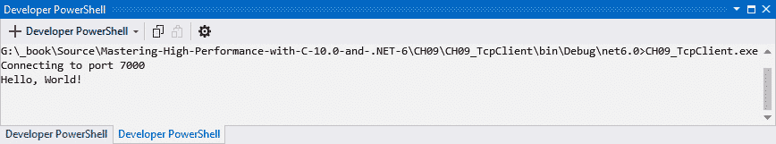

![图 9.10 – 运行状态下的 TCP 服务器，准备在端口 7000 上接收连接现在，你的 TCP 服务器项目已经启动并运行。在了解管道的下一步，我们需要编写我们的 TCP 客户端项目。我们将在下一节中这样做。## 编写和运行 TCP 客户端控制台应用程序在本节中，我们将继续通过编写将控制台输入发送到 TCP 服务器的 TCP 客户端控制台应用程序来查看管道。TCP 服务器从我们的 TCP 客户端接收到的数据将在 TCP 服务器的窗口中显示：1.  创建一个新的 .NET 6.0 控制台应用程序，名为 `CH09_TcpClient`。1.  在 `Program.cs` 文件中，你需要包含以下命名空间：    ```cs    using System;    using System.IO;    using System.IO.Pipelines;    using System.Net;    using System.Net.Sockets;    using System.Threading.Tasks;    ```我们需要这些命名空间来让我们的 TCP 客户端读取控制台输入并将其发送到 TCP 服务器进行处理。1.  添加以下顶级语句：    ```cs    Socket clientSocket = new Socket(SocketType.Stream,         ProtocolType.Tcp);    Console.WriteLine(“Connecting to port 7000”);    clientSocket.Connect(new IPEndPoint(IPAddress.Loopback,         7000));    NetworkStream networkStream = new NetworkStream        (clientSocket);    await Console.OpenStandardInput().CopyToAsync        (networkStream);    ```对于我们的 TCP 客户端，我们只需在端口 `7000` 上打开一个新的 TCP 套接字，并使用 `IPAddress.Loopback` 地址进行连接。然后，我们将套接字传递给一个新的 `NetworkStream`。最后，我们监听来自控制台窗口标准输入的输入，并将该输入复制到发送数据到我们的 TCP 服务器进行处理的网络流中。1.  运行程序。你应该看到以下内容：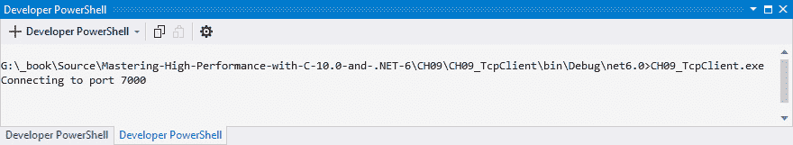

图 9.11 – TCP 客户端监听 7000 端口

1.  输入`Hello, World!`并按*Enter*。你的 TCP 客户端控制台应用程序应该看起来如下：

![图 9.12 – 显示用户输入的 TCP 客户端控制台窗口

![图 9.13 – 显示 TCP 客户端响应的 TCP 服务器控制台窗口

图 9.12 – 显示用户输入的 TCP 客户端控制台窗口

1.  观察 TCP 服务器控制台窗口。你会看到自你在 TCP 客户端窗口中输入相同的信息并按*Enter*以来，消息**Hello, World!**已经出现，如下所示：

![图 9.13 – 显示 TCP 客户端响应的 TCP 服务器控制台窗口

![图 9.13 – 显示 TCP 客户端响应的 TCP 服务器控制台窗口

图 9.13 – 显示 TCP 客户端响应的 TCP 服务器控制台窗口

因此，你已经完成了 TCP 客户端和服务器控制台应用程序的编写和运行，你也看到了使用套接字和管道编写控制台应用程序是多么简单。代码非常简洁，你可以将多个管道链接在一起。例如，在客户端，一个链式管道可以是对象的序列化，然后是加密。然后，在服务器端，数据可以被解密和反序列化，然后生成的对象可以传递给 LINQ，这将保存对象中包含的数据到数据库。我们可以使用套接字和管道与大多数 C#项目类型一起使用，并鼓励你通过自己的小项目进行实验，以进一步扩展你的知识。

# 在内存中缓存资源

**缓存**内存中的项目需要分配 RAM，以便它们可以高效地存储和检索。将频繁访问的资源存储在内存中可以显著提高应用程序的性能。

从缓存中受益的典型应用程序是网站。一个传统的网站将包括 HTML 页面，它定义了显示给最终用户的视觉网页的结构，CSS，它为页面添加样式并使其看起来很漂亮，以及 JavaScript，它使网站变得动态和交互式。

网站的许多页面可以使用相同的资源，例如数据、图像、声音、文件和对象。缓存（暂时存储某些项目以便可以高效检索）可以使用数据库、文件系统或内存来完成。

在本节中，我们将学习如何在内存中存储项目。Microsoft 建议使用他们的`Microsoft.Extensions.Caching.Memory` NuGet 包来在内存中缓存项目。因此，我们将遵循他们的指导，并在我们的示例项目中使用这个库。

我们将创建一个非常简单的 ASP.NET Core 网站，该网站显示当前时间和缓存时间。当缓存时间已过期时，我们将重置缓存。每次调用主页视图时，我们将在显示当前时间、缓存时间和秒数差异的即时窗口中输出一些文本。

在每个指定的时间周期结束后，你会看到缓存被重置，以及页面刷新后屏幕上输出的时间。要编写我们的 ASP.NET Core MVC 网络应用程序，请按照以下步骤操作：

1.  启动一个新的空 ASP.NET Core MVC 网络应用程序，确保你的目标框架是 `net6.0`，并命名为 `CH09_AspNetCoreCaching`。

1.  添加 `Microsoft.Extensions.Caching.Memory` NuGet 包，并将此包的 `using` 语句添加到 `HomeController` 类中。

1.  添加一个 `IMemoryCache` 成员变量，并按如下方式更新 `HomeController` 构造函数：

    ```cs
    private IMemoryCache _memoryCache;
    public HomeController(ILogger<HomeController> logger, 
        IMemoryCache memoryCache)
    {
        _logger = logger;
        _memoryCache = memoryCache;
    }
    ```

我们的 `_memoryCache` 变量将持有我们的内存缓存。用作我们内存缓存的对象被注入到 `HomeController` 构造函数中作为参数，并分配给我们的变量。

1.  接下来，添加 `SetCache` 方法：

    ```cs
    private void SetCache(string key, object value)
    {
        var cachedEntryOptions = 
         new MemoryCacheEntryOptions()
             .SetSlidingExpiration(TimeSpan.FromSeconds(20));
         _memoryCache.Set(key, value, cachedEntryOptions);
    }
    ```

此方法接受一个键和一个值。我们使用滑动过期时间为 20 秒的 `MemoryCacheEntryOptions`，然后设置缓存条目的值，该值将在 20 秒后过期。

1.  下一步需要做的是更新 `HomeController` 构造函数的 `Index` 方法，如下所示：

    ```cs
    public IActionResult Index()
    {
         DateTime whenCached;
        bool exists = _memoryCache.TryGetValue(“WhenCached”, 
            out whenCached);
        if (!exists)
        {
            Debug.WriteLine(“Creating cached entry...”);
            whenCached = DateTime.Now;
            SetCache(“WhenCached”, whenCached);
        }
        else
        {
             DateTime now = DateTime.Now;
            double differenceInSeconds = 
                now.Subtract(whenCached).TotalSeconds;
            if (differenceInSeconds < 20)
            {
                Debug.WriteLine($”Now: {now}, When Cached: 
                    {whenCached}, Time Difference (Seconds): 
                        {differenceInSeconds}”);
                return View(whenCached);
            }
            else
            {
                Debug.WriteLine(“Resetting cache...”);
                whenCached = DateTime.Now;
                SetCache(“WhenCached”, whenCached);
            }
        }
        return View(whenCached);
    }
    ```

之前的代码声明了一个名为 `whenCached` 的 `DateTime` 变量。它检查该值是否存在。如果存在，其值将被设置为变量被缓存时的时间。如果变量不存在，则将其添加到缓存中。如果它确实存在，那么将计算现在和变量被缓存时的时间差，如果缓存未过期，则结果将输出到调试窗口。如果缓存已过期，则缓存变量将使用当前时间进行更新。

1.  现在，我们需要更新我们的主页的 HTML 代码，如下所示：

    ```cs
    @model DateTime?
    @{
        ViewData[“Title”] = “Index”;
    }
    <h1>Index</h1>
    <div class=”row”>
        <span>
            When Cached: @Model.Value.ToString();
        </span>
        <span>
            Current Time: @DateTime.Now.ToString();
        </span>
    </div>
    ```

之前的代码定义了我们的 Razor 页面的模型。我们的页面标题被设置为 `Index`。我们的主页标题是 `Index`。最后，我们有一行定义了变量被缓存的时间和当前时间。

1.  现在，我们需要更新我们的 `Program.cs` 文件，以通知我们的网站使用内存缓存：

    ```cs
    builder.Services.AddControllersWithViews();
    builder.Services.AddMemoryCache();
    ```

这样，我们的服务已经配置为使用内存缓存。

这样，我们已经配置了我们的 MVC 应用程序以使用具有滑动过期的内存缓存。这意味着我们现在可以运行我们的项目。运行项目，在 20 秒内刷新几次，然后观察发生了什么。你会看到缓存的和当前的时间开始相同。然后，当你刷新页面时，你会看到缓存的时间保持不变，但当前时间领先于缓存时间。然后，当 20 秒过后，缓存时间将与当前时间同步更新，如下所示：

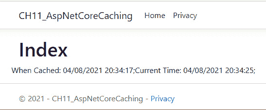

图 9.14 – ASP.NET Core MVC 内存缓存示例在实际中的应用

如前述截图和运行代码所示，我们现在有了一种在计算机内存缓存中存储项目的方法，并且可以确定其缓存值何时过期并需要更新。这是一种真正简单的方法来提高网络应用程序的网络性能。它还减少了通过网络传输的数据量。这反过来有助于减少带宽问题，并降低云托管操作的事务和网络流量成本。

这就结束了本章的内容。现在，让我们总结一下通过本章的学习我们所获得的知识。

# 摘要

在本章中，你学习了 OSI 参考模型，以了解网络的不同层次以及每个层次可用的各种协议。你还了解到，各种协议可以分为两大类：TCP 和 UDP。

然后，你学习了关于网页浏览器开发工具的内容，这些工具允许你监控你网站的各项活动，例如内存使用和网络流量。你还可以通过控制台窗口看到它抛出的错误。这有助于识别问题并解决它们。

从那里，你学习了如何为桌面客户端和服务器添加 gRPC，以及为基于 Web 的客户端和服务器添加 gRPC-Web。你了解到，与 JSON 数据格式相比，gRPC 有助于减少数据大小，从而减少页面加载时间。

之后，你学习了如何优化互联网资源。这包括使用正确的文件格式，减少图像大小，缓存项目以减少网络流量和加载时间，减少正在运行的背景服务数量，以及限制页面加载的资源数量。你还考虑了在服务器上过滤数据并将其分成请求返回的页面。

最后，在学习内存缓存之前，你学习了如何编写和运行 TCP 客户端和服务器控制台应用程序，其中你可以使用 ASP.NET Core MVC 作为你的宿主项目。

在下一章中，我们将通过基准测试不同的数据插入、更新和删除方法来处理数据。这将帮助我们根据基准测试结果选择最佳的数据操作方法。但在我们这样做之前，花些时间浏览*进一步阅读*部分，以进一步了解提高网络性能的知识。同时，尝试回答问题以了解你保留了多少知识。

# 问题

回答以下问题以测试你对本章知识的掌握：

1.  请列出 OSI 参考模型的七个层次。

1.  请列举一些网络协议。

1.  TCP/IP 和 UDP 之间有什么区别？

1.  你如何查看你的网页产生的错误，它产生的网络流量以及它使用的内存量？

1.  gRPC 和 gRPC-Web 是什么？

1.  你如何优化互联网资源？

# 进一步阅读

要了解更多关于本章所涉及主题的信息，请查看以下资源：

+   带示例解释 OSI 七层模型：[`www.computernetworkingnotes.com/ccna-study-guide/osi-seven-layers-model-explained-with-examples.html#:~:text=The%20OSI%20(Open%20System%20Interconnection)%20Reference%20Model%20is%2C,and%20software%20applications%20which%20work%20in%20dissimilar%20environments`](https://www.computernetworkingnotes.com/ccna-study-guide/osi-seven-layers-model-explained-with-examples.html#:~:text=The%20OSI%20(Open%20System%20Interconnection)%20Reference%20Model%20is%2C,and%20software%20applications%20which%20work%20in%20dissimilar%20en)

+   TCP/IP 模型：[`ipcisco.com/lesson/tcp-ip-model/`](https://ipcisco.com/lesson/tcp-ip-model/)

+   常见 TCP 和 UDP 默认端口的概述：[`www.examcollection.com/certification-training/network-plus-overview-of-common-tcp-and-udp-default-ports.html#:~:text=%20Overview%20of%20common%20TCP%20and%20UDP%20default%2CFTP%20is%20to%20transfer%20files%20over...%20More`](https://www.examcollection.com/certification-training/network-plus-overview-of-common-tcp-and-udp-default-ports.html#:~:text=%20Overview%20of%20common%20TCP%20and%20UDP%20default%2CFTP%20is%20to%20transfer%20files%20over...%20More)

+   TCP 和 UDP 端口号列表：[`en.wikipedia.org/wiki/List_of_TCP_and_UDP_port_numbers`](https://en.wikipedia.org/wiki/List_of_TCP_and_UDP_port_numbers)

+   互联网协议套件：[`en.wikipedia.org/wiki/Internet_protocol_suite`](https://en.wikipedia.org/wiki/Internet_protocol_suite)

+   .NET 网络跟踪：[`www.shanebart.com/dotnet-network-tracing/`](https://www.shanebart.com/dotnet-network-tracing/)

+   dotnet-trace 指令：[`github.com/dotnet/diagnostics/blob/master/documentation/dotnet-trace-instructions.md`](https://github.com/dotnet/diagnostics/blob/master/documentation/dotnet-trace-instructions.md)

+   如何在 Mac OS X 的终端中查看和终止进程：[`www.chriswrites.com/how-to-view-and-kill-processes-using-the-terminal-in-mac-os-x/`](https://www.chriswrites.com/how-to-view-and-kill-processes-using-the-terminal-in-mac-os-x/)

+   在 Linux 中使用 PID 号查找进程名称：[`www.tecmint.com/find-process-name-pid-number-linux/`](https://www.tecmint.com/find-process-name-pid-number-linux/)

+   使用 gRPC 的高性能服务 – .NET 5 中的新功能：[`www.youtube.com/watch?v=EJ8M2Em5Zzc`](https://www.youtube.com/watch?v=EJ8M2Em5Zzc)

+   gRPC-Web 与 .NET：[`www.youtube.com/watch?v=UV-VnlcpDhU`](https://www.youtube.com/watch?v=UV-VnlcpDhU)

+   .NET Conf 2021 .NET 6 中新的 Blazor WebAssembly 功能：[`www.youtube.com/watch?v=kesUNeBZ1Os&list=PLdo4fOcmZ0oVFtp9MDEBNb A2sSqYvXSXO&index=20`](https://www.youtube.com/watch?v=kesUNeBZ1Os&list=PLdo4fOcmZ0oVFtp9MDEBNb A2sSqYvXSXO&index=20)

+   .NET Conf 2021 使用 gRPC 的高性能服务 – .NET 6 中的新功能：[`www.youtube.com/watch?v=CXH_jEa8dUw&list=PLdo4fOcmZ0oVFtp9MDEBNbA2sSqYvXSXO&index=31`](https://www.youtube.com/watch?v=CXH_jEa8dUw&list=PLdo4fOcmZ0oVFtp9MDEBNbA2sSqYvXSXO&index=31)

+   关于 Blazor 的一切：[`codewithmukesh.com/blog/category/dotnet/blazor/`](https://codewithmukesh.com/blog/category/dotnet/blazor/)
