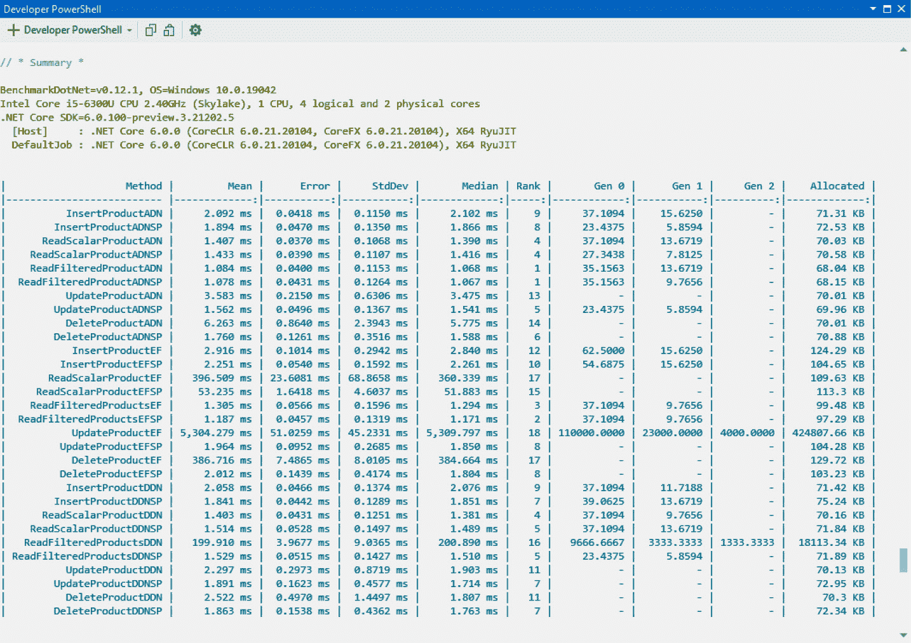
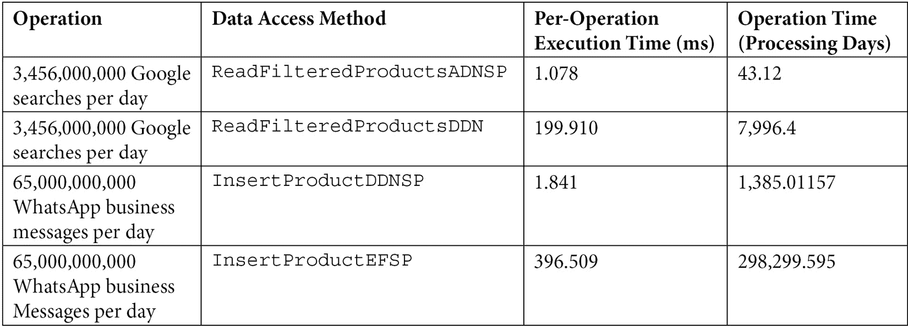

# 第十一章：*第十一章*：基准测试关系型数据访问框架

数据在我们的日常生活各个方面都得到了广泛的应用。在当今的大数据时代，收集和存储用于各种分析的数据量是惊人的。当处理数据时，随着数据量的增长，性能会呈指数级下降。根据您需要处理的数据量，时间因素往往是关键的。

在专业开发环境中，程序员并不总是能够访问数据库服务器。数据库服务器的访问通常仅限于数据库开发人员和数据库管理员使用。考虑到这一点，本章是关于基准测试代码以最短时间执行数据库插入、更新、读取和删除操作。在 *进一步阅读* 部分中，有一些链接到数据库服务器性能文档的链接，这将帮助您进一步提高通过本章获得的效果。

在本章中，我们将基准测试三种不同的操作 SQL Server 数据库数据的方法。我们将对 Entity Framework、ADO.NET 和 Dapper 进行并行比较。在运行这些数据访问和对象映射器的基准测试后，您将能够对您项目的最佳数据访问和对象映射形式做出明智的判断。

在本章中，我们将涵盖以下主题：

+   **基准测试数据插入方法**：在本节中，我们编写了使用 ADO.NET、Entity Framework Core 和 Dapper.NET 插入数据的基准测试，包括使用和不使用存储过程的情况。

+   **基准测试数据选择方法**：在本节中，我们编写了使用 ADO.NET、Entity Framework Core 和 Dapper.NET 选择数据的基准测试，包括使用和不使用存储过程的情况。

+   **基准测试数据编辑方法**：在本节中，我们编写了使用 ADO.NET、Entity Framework Core 和 Dapper.NET 应用数据更新的基准测试，包括使用和不使用存储过程的情况。

+   **基准测试数据删除方法**：在本节中，我们编写了使用 ADO.NET、Entity Framework Core 和 Dapper.NET 删除数据的基准测试，包括使用和不使用存储过程的情况。

+   **基准测试结果及其分析**：在本节中，我们运行了之前章节中编写的基准测试。然后，我们分析基准测试结果，以得出执行各种高效数据访问和操作任务的最佳方式。

在完成本章内容后，您将具备使用 ADO.NET、Entity Framework 和 Dapper.NET 访问和操作数据的技能。您还将能够对您自己的项目选择合适的数据访问方法。

注意

本章主要涉及你跟随编写大量代码，为在最后一节运行我们的数据访问基准方法做准备。如果你不想编写代码，只想查看结果，那么请跳转到本章的最后一节，查看基准测试结果及其分析。你还可以跳转到本章中对你最有兴趣的领域，帮助你形成自己关于最适合你需求的数据访问方法的观点。源代码也已在 GitHub 上提供，供你自己研究。

# 技术要求

要掌握本章中介绍的技能，获取以下内容将非常有用：

+   Visual Studio 2022 或更高版本

+   SQL Server 2019 或更高版本

+   SQL Server Management Student 2019 或更高版本

+   本书源代码：[`github.com/PacktPublishing/High-Performance-Programming-in-CSharp-and-.NET/tree/master/CH10`](https://github.com/PacktPublishing/High-Performance-Programming-in-CSharp-and-.NET/tree/master/CH10)

# 基准测试数据插入方法

在本节中，我们将继续我们在 *第十章*，*设置我们的数据库项目*，所做的工作，通过编写将使用 ADO.NET、Entity Framework Core 和 Dapper.NET 对插入方法性能进行基准测试的方法。所以，如果你还没有阅读 *第十章**，或者查看源代码，现在是一个很好的时机去做这些。 

本章编写的基准测试将在最后一节运行，并分析结果。由于章节和页面的限制，我将省略对 `using` 语句的引用。因此，你需要使用 Visual Studio 的快速提示来添加缺失的 `using` 语句。按照以下步骤编写我们的插入方法基准测试：

1.  添加 `BenchmarkDotNet` NuGet 包。

1.  打开 `BenchmarkTests` 类，并按以下方式修改：

    ```cs
    [MemoryDiagnoser]
    [Orderer(SummaryOrderPolicy.Declared)]
    [RankColumn]
    public class BenchmarkTests
    {
        [GlobalSetup]
        public void GlobalSetup()
        {
            InsertProductADNSP();
            InsertProductEFSP();
            InsertProductDDN();
    }
    }
    ```

我们已经设置了类来执行基准测试，并按声明的顺序总结它们，同时诊断内存使用情况，并提供基准测试方法的性能排名。然后，我们提供了 `GlobalSetup`，它在基准测试之前运行。这是为了为我们的基准测试提供选择、更新和删除的数据。

1.  添加 `InsertProductADN` 方法：

    ```cs
    [Benchmark]
    public void InsertProductADN()
    {
        string connectionString = SecretsManager
             .GetSecrets<DatabaseSettings>
                 ("ConnectionString");
         AdoDotNetData adnData = new(connectionString);
        adnData.ExecuteNonQuery("INSERT INTO Products 
          (ProductName, CategoryID, SupplierId, 
             Discontinued) VALUES('ADO.NET Product', 1, 1, 
               0)");
        adnData.Dispose();
    }
    ```

此方法从密钥文件中获取连接字符串，并通过将连接字符串传递给其构造函数来创建一个新的 `AdoDotNetData` 实例。然后，它调用 `ExecuteNonQuery` 方法，将原始 SQL 插入方法传递给该方法。一旦查询运行，实例将被释放。

1.  添加 `InsertProductADNSP` 方法：

    ```cs
    [Benchmark]
    public void InsertProductADNSP()
    {
        string connectionString = SecretsManager
             .GetSecrets<DatabaseSettings>
                 ("ConnectionString");
         AdoDotNetData aaa = new(connectionString);
        SqlCommandModel model = new()
        {
            CommandText = "InsertProduct",
            CommandType = CommandType.StoredProcedure,
             CommandParameters = 
             new SqlCommandParameterModel[] {
             new SqlCommandParameterModel() {   
                 ParameterName = "@ProductName", 
                     DataType = DbType.String,
                     Value = "Dapper Product Edited"
                 }, 
                 new SqlCommandParameterModel() {   
                     ParameterName = "@CategoryID",
                     DataType = DbType.Int32,
                     Value = 1 
                 }
                 , new SqlCommandParameterModel() { 
                     ParameterName = "@SupplierID",
                     DataType = DbType.Int32,
                     Value = 1
                 }, new SqlCommandParameterModel() { 
                     ParameterName = "@Discontinued",   
                     DataType = DbType.Boolean,
                     Value = false
                 }
             }
         };
         aaa.ExecuteNonQuery(model);
        aaa.Dispose();
    }
    ```

此方法从密钥文件中获取连接字符串，并将字符串传递给 `AdoDotNetData` 类的构造函数。然后，它创建一个新的 `SqlCommandModel`，用于在产品表上构建存储过程插入操作的属性。接着，它调用 `ExecuteNonQuery` 方法，传入用于生成和执行存储过程调用的模型。然后，`AdoDotNetData` 类被释放。

1.  添加 `InsertProductEF` 方法：

1.  添加 `InsertProductEF` 方法：

    ```cs
    [Benchmark]
    public void InsertProductEF()
    {
    string connectionString = SecretsManager
         .GetSecrets<DatabaseSettings>
         ("ConnectionString");
    EntityFrameworkCoreData efData 
         = new(connectionString);
        Product product = new() { 
             ProductName = "EF Product", 
             CategoryID = 1, 
             SupplierID = 1,
             Discontinued = false,
               QuantityPerUnit = "1"
         };
        efData.Products.Add(product);
        efData.SaveChanges();
        efData.Dispose();
    }
    ```

此方法从密钥文件中获取连接字符串，并将其传递给 `EntityFrameworkCoreData` 类的构造函数。然后，它创建一个新的产品并将其添加到 `Products` 集合中。然后保存更改，并释放 `EntityFrameworkCoreData` 类。

1.  现在，添加 `InsertProductEFSP` 方法：

    ```cs
    [Benchmark]
    public void InsertProductEFSP()
    {
        string connectionString = SecretsManager.
             GetSecrets<DatabaseSettings>
                 ("ConnectionString");
         EntityFrameworkCoreData efData 
             = new(connectionString);
         SqlCommandModel model = new()
         {
             CommandText = "EXEC InsertProduct 
               @ProductName = {0}, @CategoryID = {1},
                  @SupplierID = {2}, @Discontinued = {3}",
             CommandType = CommandType.StoredProcedure,
            CommandParameters 
                 = new SqlCommandParameterModel[] {
                     new SqlCommandParameterModel() { 
                     ParameterName = "@ProductName", 
                     DataType = DbType.String, 
                      Value = "EF Product Edited"
                     }
                    , new SqlCommandParameterModel() { 
                     ParameterName = "@CategoryID", 
                     DataType = DbType.Int32, 
                     Value = 1 
                     }
                    , new SqlCommandParameterModel() { 
                     ParameterName = "@SupplierID", 
                     DataType = DbType.Int32, 
                     Value = 1 
                     }
                     , new SqlCommandParameterModel() { 
                     ParameterName = "@Discontinued", 
                     DataType = DbType.Boolean, 
                     Value = false 
                     }
                 }
            };
         efData.ExecuteNonQuerySP(model);
         efData.Dispose();
    }
    ```

此方法从密钥文件中获取连接字符串，并创建 `EntityFrameworkCoreData` 类的新实例。然后，它通过 `SqlCommandModel` 构建存储过程插入所需的属性。接着，它执行 `ExecuteNonQuerySP` 模型，传入执行插入存储过程的模型，然后释放 `EntityFrameworkCoreData` 类。

1.  添加 `InsertProductDDN` 方法：

    ```cs
    [Benchmark]
    public void InsertProductDDN()
    {
        string connectionString = SecretsManager
             .GetSecrets<DatabaseSettings>
                 ("ConnectionString");
         DapperDotNet ddnData = new(connectionString);
        int recordsAffected = ddnData
             .ExecuteNonQuery("INSERT INTO Products 
                (ProductName, CategoryID, SupplierId,
                   Discontinued) VALUES('Dapper.NET 
                     Product', 1, 1, 0)");
         ddnData.Dispose();
    }
    ```

此方法从密钥文件中获取连接字符串，创建 `DapperDotNet` 类的新实例，并通过调用 `ExecuteNonQuery` 方法执行原始 SQL 插入语句。然后，它释放 `DapperDotNet` 类。

1.  添加 `InsertProductDDNSP` 方法：

    ```cs
    [Benchmark]
    public void InsertProductDDNSP()
    {
         string connectionString = SecretsManager
             .GetSecrets<DatabaseSettings>
                 ("ConnectionString");
         DapperDotNet ddnData = new(connectionString);
         SqlCommandModel model = new() {
             CommandText = "InsertProduct",
            CommandType = CommandType.StoredProcedure,
            CommandParameters 
                 = new SqlCommandParameterModel[] {
                    new SqlCommandParameterModel() { 
                     ParameterName = "@ProductName", 
                     DataType = DbType.String, 
                     Value = "Dapper Product" }
                    , new SqlCommandParameterModel() {
                     ParameterName = "@CategoryID", 
                     DataType = DbType.Int32, 
                     Value = 1 }
                     , new SqlCommandParameterModel() { 
                     ParameterName = "@SupplierID", 
                     DataType = DbType.Int32, 
                     Value = 1 }
                     , new SqlCommandParameterModel() { 
                     ParameterName = "@Discontinued", 
                     DataType = DbType.Boolean, 
                     Value = false }
                 }
         };
         ddnData.ExecuteNonQuery(model);
         ddnData.Dispose();
    }
    ```

此方法从密钥文件中获取连接字符串，并创建一个新的 `DapperDotNet` 类。然后，它构建执行产品插入存储过程所需的 `SqlCommandModel` 属性。接着，它调用 `ExecuteNonQuery` 过程，传入将执行存储过程的模型。然后，它释放 `DapperDotNet` 类。

这就结束了我们对插入基准测试方法的探讨。现在，我们将开始编写我们的选择基准测试方法。

# 数据选择方法基准测试

在本节中，我们将编写我们的基准测试方法，以测试各种数据选择方法的性能。这些基准测试将在本章的最后部分运行和分析：

1.  添加 `ReadScalarProductADN` 方法：

    ```cs
    [Benchmark]
    public void ReadScalarProductADN()
    {
         string connectionString = SecretsManager
             .GetSecrets<DatabaseSettings>
                  ("ConnectionString");
         AdoDotNetData adnData = new(connectionString);
         string productName = adnData
             .ExecuteScalar<string>("SELECT TOP 1 
                ProductName FROM Products  WHERE Product
                  Name LIKE 'ADO.NET Product%'");
        adnData.Dispose();
    }
    ```

此方法从 `secrets` 文件中获取连接，创建一个新的 `AdoDotNetData` 类，并执行 `ExecuteScalar` 方法，传入一个返回字符串的原始 SQL 语句。然后，它释放 `AdoDotNet` 类。

1.  添加 `ReadScalarADNSP` 方法：

    ```cs
    [Benchmark]
    public void ReadScalarProductADNSP()
    {
        string connectionString = SecretsManager
            .GetSecrets<DatabaseSettings>
                ("ConnectionString");
        AdoDotNetData aaa = new(connectionString);
        SqlCommandModel model = new SqlCommandModel() {
            CommandText = "GetProductName",
            CommandType = CommandType.StoredProcedure,
            CommandParameters 
                = new SqlCommandParameterModel[] {
                    new SqlCommandParameterModel() { 
                    ParameterName = "@ProductName", 
                    DataType = DbType.String, 
                    Value = "ADO.NET Product" }
                }
        };
        string productName 
            = aaa.ExecuteScalar<string>(model);
        aaa.Dispose();
    }
    ```

此方法从密钥文件中获取连接字符串并创建 `AdoDotNetData` 类的新实例。然后，它构建 `SqlCommandModel`，其中包含执行标量存储过程的必要属性。然后，它调用 `ExecuteScalar` 方法，传入执行存储过程的模型，并返回产品名称。然后，它释放 `AdoDotNetData` 类。

1.  添加 `ReadFilteredProductADN` 方法：

    ```cs
    [Benchmark]
    public void ReadFilteredProductADN()
    {
        string connectionString = SecretsManager
            .GetSecrets<DatabaseSettings>
                 ("ConnectionString");
        AdoDotNetData adnData = new(connectionString);
        IEnumerator<Product> data 
            = adnData.ExecuteReader<Product>("SELECT * 
                 FROM Products  WHERE ProductName LIKE 
                     'ADO.NET Product'");
        adnData.Dispose();
    }
    ```

此方法从密钥文件中获取连接字符串并创建 `AdoDotNetData` 类的新实例。然后，它执行 `ExecuteReader` 方法，该方法接受一个原始 SQL 语句并返回 `Product` 类型的枚举器，然后释放 `AdoDotNetData` 类。

1.  添加 `ReadFilteredProductADNSP` 方法：

    ```cs
    [Benchmark]
    public void ReadFilteredProductADNSP()
    {
        string connectionString = SecretsManager
            .GetSecrets<DatabaseSettings>
                ("ConnectionString");
        AdoDotNetData aaa = new(connectionString);
        SqlCommandModel model = new SqlCommandModel() {
            CommandText = "FilterProducts",
            CommandType = CommandType.StoredProcedure,
            CommandParameters 
                = new SqlCommandParameterModel[] {
                    new SqlCommandParameterModel() { 
                    ParameterName = "@ProductName", 
                    DataType = DbType.String, 
                    Value = "ADO.NET Product" }
                }
         };
        var data = aaa.ExecuteReader<dynamic>(model);
        aaa.Dispose();
    }
    ```

此方法从密钥文件中获取连接字符串并创建 `AdoDotNetData` 类的新实例。然后，它构建包含执行读取存储过程所需属性的 `SqlCommandModel`。然后，它执行返回枚举器的 `ExecuteReader` 方法，然后释放 `AdoDotNetData` 类。

1.  添加 `ReadScalarProductEF` 方法：

    ```cs
    [Benchmark]
    public void ReadScalarProductEF()
    {
        string connectionString = SecretsManager
            .GetSecrets<DatabaseSettings>
                ("ConnectionString");
        EntityFrameworkCoreData efData 
            = new(connectionString);
        string productName 
            = efData.Products.FirstOrDefault(
                p => p.ProductName
                .Contains("EF Product")
              ).ProductName;
        efData.Dispose();
    }
    ```

此方法从密钥文件中获取连接字符串并创建 `EntityFrameworkCore` 类的新实例。然后，它获取与过滤器匹配的 `Product` 集合中的第一个项目并分配 `ProductName`。然后，它释放 `EntityFrameworkCore` 类。

1.  添加 `ReadScalarProductEFSP`：

    ```cs
    [Benchmark]
    public void ReadScalarProductEFSP()
    {
        string connectionString = SecretsManager
            .GetSecrets<DatabaseSettings>
                ("ConnectionString");
        EntityFrameworkCoreData efData 
            = new(connectionString);
        string productName = efData
            .ExecuteScalarSP("EF Product");
         efData.Dispose();
    }
    ```

此方法从密钥文件中获取连接字符串并创建 `EntityFrameworkCoreData` 类的新实例。然后，它调用 `ExecuteScalarSP` 方法，传入过滤器的名称，返回匹配过滤器的第一个 `ProductName`，然后释放 `EntityFrameworkCoreData` 类。

1.  添加 `ReadFilteredProductsEF` 方法：

    ```cs
    [Benchmark]
    public void ReadFilteredProductsEF()
    {
        string connectionString = SecretsManager
            .GetSecrets<DatabaseSettings>
                ("ConnectionString");
        EntityFrameworkCoreData efData 
            = new(connectionString);
        IEnumerator<Product> products = efData.Products
            .Where(p => p.ProductName
            .Contains("EF Product")).GetEnumerator();
        efData.Dispose();
            products.Dispose();
    }
    ```

此方法从密钥文件中获取连接字符串并创建 `EntityFrameworkCoreData` 类的新实例。然后，它过滤产品并返回产品的枚举器。然后，该方法释放 `EntityFrameworkCoreData` 类和枚举器。

1.  添加 `ReadFilteredProductsEFSP` 方法：

    ```cs
    [Benchmark]
    public void ReadFilteredProductsEFSP()
    {
        string connectionString = SecretsManager
            .GetSecrets<DatabaseSettings>
                ("ConnectionString");
        EntityFrameworkCoreData efData 
            = new(connectionString);
        IEnumerator<Product> products = efData
            .ExecuteReaderSP("EF Product");
        efData.Dispose();
            products.Dispose();
    }
    ```

此方法从密钥文件中获取密钥并创建 `EntityFrameworkCoreData` 类的新实例。然后，它调用 `ExecuteReaderSP` 方法，该方法执行返回 `Products` 类型枚举器的存储过程。然后，该方法释放 `EntityFrameworkCoreData` 类和枚举器。

1.  添加 `ReadScalarProductDDN` 方法：

    ```cs
    [Benchmark]
    public void ReadScalarProductDDN()
    {
        string connectionString = SecretsManager
            .GetSecrets<DatabaseSettings>
                ("ConnectionString");
        DapperDotNet ddnData = new(connectionString);
        string productName = ddnData
            .ExecuteScalar<string>("SELECT TOP 1 
                 ProductName FROM Products  WHERE Product
                     Name LIKE 'Dapper.NET Product%'");
        ddnData.Dispose();
    }
    ```

此方法从密钥文件中获取连接字符串并创建 `DapperDotNet` 类的新实例。然后，它执行 `ExecuteScalar` 方法，传入一个返回匹配过滤器的顶级 `ProductName` 的原始 SQL 语句。然后，它释放 `DapperDotNet` 类。

1.  添加 `ReadScalarProductDDNSP` 方法：

    ```cs
    [Benchmark]
    public void ReadScalarProductDDNSP()
    {
        string connectionString = SecretsManager
            .GetSecrets<DatabaseSettings>
                ("ConnectionString");
        DapperDotNet ddnData = new(connectionString);
        SqlCommandModel model = new() {
            CommandText = "GetProductName",
            CommandType = CommandType.StoredProcedure,
            CommandParameters 
                = new SqlCommandParameterModel[] {
                    new SqlCommandParameterModel() { 
                    ParameterName = "@ProductName", 
                    DataType = DbType.String, 
                    Value = "Dapper Product" }
                 }
        };
        string productName 
             = ddnData.ExecuteScalarSP(model);
         ddnData.Dispose();
    }
    ```

此方法从密钥文件中获取连接字符串，并创建 `DapperDotNet` 类的新实例。然后构建包含执行存储过程所需属性的 `SqlCommandModel`。然后调用 `ExecuteScalarSP` 方法，传入模型。返回第一个匹配产品的 `ProductName`。然后释放 `DapperDotNet` 类。

1.  添加 `ReadFilteredProductsDDN` 类：

    ```cs
    [Benchmark]
    public void ReadFilteredProductsDDN()
    {
        string connectionString = SecretsManager
            .GetSecrets<DatabaseSettings>
                ("ConnectionString");
        DapperDotNet ddnData = new(connectionString);
        IEnumerator<Product> data 
            = ddnData.ExecuteReader<Product>("SELECT * 
            FROM Products WHERE ProductName LIKE
                'Dapper.NET Product%'");
         ddnData.Dispose();
         data.Dispose();
    }
    ```

此方法从 `secrets` 文件中获取连接字符串，然后创建 `DapperDotNet` 类的新实例。然后调用 `ExecuteReader` 方法，传入一个原始 SQL 语句。返回 `Product` 类型的枚举器。然后释放 `DapperDotNet` 和枚举器。

1.  添加 `ReadFilteredProductsDDNSP` 方法：

    ```cs
    [Benchmark]
    public void ReadFilteredProductsDDNSP()
    {
        string connectionString = SecretsManager
            .GetSecrets<DatabaseSettings>
                ("ConnectionString");
        DapperDotNet ddnData = new(connectionString);
        SqlCommandModel model = new() {
            CommandText = "GetProductName",
            CommandType = CommandType.StoredProcedure,
            CommandParameters 
                = new SqlCommandParameterModel[] {
                    new SqlCommandParameterModel() { 
                    ParameterName = "@ProductName", 
                    DataType = DbType.String, 
                    Value = "Dapper.NET Product" }
                }
        };
        IEnumerator<Product> products 
            = ddnData.ExecuteReaderSP<Product>(model);
        ddnData.Dispose();
    }
    ```

此方法从密钥文件中获取连接字符串，然后创建 `DapperDotNet` 类的实例。接着构建一个 `SqlCommandModel`，其中包含执行存储过程所需的属性。然后调用 `ExcuteReaderSP` 方法，传入返回 `Product` 类型枚举器的模型。

我们现在已经完成了选择基准的编写。接下来，我们将继续编写更新基准。

# 基准测试数据编辑方法

在本节中，我们将编写测试各种更新语句性能的基准。这些基准将在本章的最后部分运行和分析：

1.  添加 `UpdateProductADN` 方法：

    ```cs
    [Benchmark]
    public void UpdateProductADN()
    {
         string connectionString = SecretsManager
             .GetSecrets<DatabaseSettings>
                 ("ConnectionString");
         AdoDotNetData adnData = new(connectionString);
        int recordsAffected 
             = adnData.ExecuteNonQuery("UPDATE Products 
                 SET ProductName = 'ADO.NET Product - 
                     Edited' WHERE ProductName = 
                         'ADO.NET Product'");
         adnData.Dispose();
    }
    ```

此方法从 `secrets` 文件中获取 `connection` 字符串，然后创建 `AdoDotNetData` 类的新实例。然后调用 `ExecuteNonQuery` 产品，传入一个原始 SQL 语句，然后返回受影响的记录数，并释放 `AdoDotNetData` 类。

1.  添加 `UpdateProductADNSP` 方法：

    ```cs
    [Benchmark]
    public void UpdateProductADNSP()
    {
        string connectionString = SecretsManager
            .GetSecrets<DatabaseSettings>
                ("ConnectionString");
        AdoDotNetData aaa = new(connectionString);
        SqlCommandModel model = new() {
            CommandText = "UpdateProductName",
            CommandType = CommandType.StoredProcedure,
            CommandParameters 
                = new SqlCommandParameterModel[] {
                    new SqlCommandParameterModel() { 
                    ParameterName = "@OldProductName",
                    DataType = DbType.String, 
                    Value = "ADO.NET Product" }
                    , new SqlCommandParameterModel() { 
                    ParameterName = "@NewProductName", 
                    DataType = DbType.String, 
                    Value = "ADO.NET Product - Edited"}
                    }
         };
         aaa.ExecuteNonQuery(model);
        aaa.Dispose();
    }
    ```

此方法从密钥文件中获取连接字符串，并创建 `AdoDotNetData` 类的新实例。然后构建 `SqlCommandModel`，其中包含执行更新存储过程所需的属性。然后使用传入的模型调用 `ExecuteNonQuery`，并执行执行更新的存储过程。然后释放 `AdoDotNetData` 类。

1.  添加 `UpdateProductEF` 方法：

    ```cs
    [Benchmark]
    public void UpdateProductEF()
    {
        string connectionString = SecretsManager
            .GetSecrets<DatabaseSettings>
                ("ConnectionString");
        EntityFrameworkCoreData efData 
        = new EntityFrameworkCoreData(connectionString);
        IQueryable<Product> products = efData.Products
        .Where(p => p.ProductName.Contains("EF 
            Product"));
        foreach (Product product in products)
            product.ProductName = "EF Product Edited";
        efData.Products.UpdateRange(products);
         int recordsAffected = efData.SaveChanges();
        efData.Dispose();
    }
    ```

此方法从密钥文件中获取连接字符串，并创建 `EntityFrameworkCoreData` 类的新实例。然后声明并分配一个产品查询集合。然后遍历每个产品的名称进行更新。然后在 `Products` 集合上调用 `UpdateRange` 方法，并将更新后的集合传入。然后保存修改，并释放 `EntityFrameworkCoreData` 类。

1.  添加 `UpdateProductEFSP` 方法：

    ```cs
    [Benchmark]
    public void UpdateProductEFSP()
    {
        string connectionString = SecretsManager
            .GetSecrets<DatabaseSettings>
                 ("ConnectionString");
        EntityFrameworkCoreData efData = 
            new(connectionString);
        SqlCommandModel model = new() {
            CommandText = "EXEC UpdateProductName 
                 @OldProductName = {0}, @NewProductName = 
                     {1}",
            CommandType = CommandType.StoredProcedure,
            CommandParameters 
                = new SqlCommandParameterModel[] {
                    new SqlCommandParameterModel() { 
                    ParameterName = "@OldProductName",
                    DataType = DbType.String, 
                    Value = "EF Product" }
                    , new SqlCommandParameterModel() {  
                    ParameterName = "@NewProductName", 
                    DataType = DbType.String, 
                    Value = "EF Product - Edited" }
                    }
         };
        efData.ExecuteNonQuerySP(model);
        efData.Dispose();
    }
    ```

此方法从`secrets`文件中获取连接字符串并创建`EntityFrameworkCoreData`类的实例。然后构建包含生成更新存储过程调用所需属性的`SqlCommandModel`。该方法随后调用`ExecuteNonQuerySP`过程，执行存储过程，传入模型，然后释放`EntityFrameworkCoreData`方法。

1.  添加`UpdateProductDDN`方法：

    ```cs
    [Benchmark]
    public void UpdateProductDDN()
    {
        string connectionString = SecretsManager
            .GetSecrets<DatabaseSettings>
                ("ConnectionString");
        DapperDotNet ddnData = new(connectionString);
        int recordsAffected 
            = ddnData.ExecuteNonQuery("UPDATE Products 
               SET ProductName = 'Dapper.NET Product - 
                 Edited' WHERE ProductName = 'Dapper.NET 
                   Product'");
        ddnData.Dispose();
    }
    ```

此方法从密钥文件中获取连接字符串并创建`DapperDotNet`类的新实例。然后调用`ExecuteNonQuery`方法，传入一个原始的 SQL 更新语句。返回受影响的记录数，并释放`DapperDotNet`类。

1.  添加`UpdateProductDDNSP`方法：

    ```cs
    [Benchmark]
    public void UpdateProductDDNSP()
    {
    string connectionString = SecretsManager
        .GetSecrets<DatabaseSettings>("ConnectionString");
    DapperDotNet ddnData = new(connectionString);
    SqlCommandModel model = new()
    {
         CommandText = "UpdateProductName",
         CommandType = CommandType.StoredProcedure,
        CommandParameters = new SqlCommand
            ParameterModel[]{
            new SqlCommandParameterModel() { 
                ParameterName = "@OldProductName", 
                DataType = DbType.String,
                Value = "Dapper.NET Product - Edited" }
            , new SqlCommandParameterModel() { 
                  ParameterName = "@NewProductName",
                DataType = DbType.String,
                Value = "Dapper.NET Product" }
        }
    };
    ddnData.ExecuteNonQuery(model);
    ddnData.Dispose();
    }
    ```

此方法从密钥文件中获取连接字符串并创建`DapperDotNet`类的新实例。然后构建一个`SQLCommandModel`以准备执行存储过程。它调用`ExecuteNonQuery`方法，传入模型。执行存储过程，然后释放`DapperDotNet`类。

这是我们对更新基准测试的总结。现在，让我们来看最终的基准测试方法集。在下一节中，我们将编写我们的删除基准测试。

# 基准测试删除数据方法

在本节中，我们编写了测量我们删除方法性能的基准测试。这些基准测试将在下一节中进行运行和分析：

1.  添加`DeleteProductADN`方法：

    ```cs
    [Benchmark]
    public void DeleteProductADN()
    {
        string connectionString = SecretsManager
            .GetSecrets<DatabaseSettings>
                ("ConnectionString");
        AdoDotNetData adnData = new(connectionString);
        int recordsAffected 
            = adnData.ExecuteNonQuery("DELETE FROM 
               Products WHERE ProductName LIKE 'ADO.NET 
                 Product%'");
        adnData.Dispose();
    }
    ```

此方法从密钥文件中获取连接字符串。然后创建`AdoDotNetData`类的实例。然后，该方法调用`ExecuteNonQuery`方法，向其中传递一个原始的 SQL 删除语句。然后释放`AdoDotNetData`类。

1.  添加`DeleteProductADNSP`方法：

    ```cs
    [Benchmark]
    public void DeleteProductADNSP()
    {
        string connectionString = SecretsManager
            .GetSecrets<DatabaseSettings>
                ("ConnectionString");
        AdoDotNetData aaa = new(connectionString);
        SqlCommandModel model = new()
        {
            CommandText = "DeleteProduct",
            CommandType = CommandType.StoredProcedure,
            CommandParameters 
                = new SqlCommandParameterModel[] {
                    new SqlCommandParameterModel() { 
                    ParameterName = "@ProductName", 
                    DataType = DbType.String, 
                    Value = "ADO.NET Product - Edited"}
                }
        };
        aaa.ExecuteNonQuery(model);
        aaa.Dispose();
    }
    ```

此方法从密钥文件中获取连接字符串，然后创建`AdoDotNetData`类的实例。使用执行删除存储过程所需的属性构建`SqlCommandModel`。然后，将模型传递给`ExecuteNonQuery`模型，执行存储过程，并释放`AdoDotNetData`类。

1.  添加`DeleteProductEF`方法：

    ```cs
    [Benchmark]
    public void DeleteProductEF()
    {
        string connectionString = SecretsManager
            .GetSecrets<DatabaseSettings>
                ("ConnectionString");
        EntityFrameworkCoreData efData 
        = new EntityFrameworkCoreData(connectionString);
        IQueryable<Product> products = efData.Products
        .Where(p => p.ProductName.Contains("EF Product"));
        efData.Products.RemoveRange(products);
        int recordsAffected = efData.SaveChanges();
        efData.Dispose();
    }
    ```

此方法从密钥文件中获取连接字符串，然后创建`EntityFrameworkCoreData`类的实例。然后返回一个可查询的产品集合，匹配删除标准。然后将此集合传递给`Products`集合的`RemoveRange`方法，并保存修改，从数据库中删除这些项目。然后释放`EntityFrameworkCoreData`类。

1.  添加`DeleteProductEFSP`方法：

    ```cs
    [Benchmark]
    public void DeleteProductEFSP()
    {
        string connectionString = SecretsManager
            .GetSecrets<DatabaseSettings>
                ("ConnectionString");
        EntityFrameworkCoreData efData 
            = new(connectionString);
        SqlCommandModel model = new() {
            CommandText = "EXEC DeleteProduct @ProductName 
                = {0}",
            CommandType = CommandType.StoredProcedure,
            CommandParameters 
                = new SqlCommandParameterModel[] {
                    new SqlCommandParameterModel() { 
                    ParameterName = "@NewProductName", 
                    DataType = DbType.String, 
                    Value = "EF Product - Edited" }
                    }
        };
        efData.ExecuteNonQuerySP(model);
        efData.Dispose();
    }
    ```

此方法从密钥文件中获取连接字符串并创建 `EntityFrameworkCoreData` 类的实例。然后构建一个包含删除存储过程属性的 `SqlCommandModel`。使用传入的模型调用 `ExecuteNonQuerySP` 方法，执行删除存储过程，并释放 `EntityFrameworkCoreData` 类。

1.  添加 `DeleteProductDDN` 方法：

    ```cs
    [Benchmark]
    public void DeleteProductDDN()
    {
        string connectionString = SecretsManager
            .GetSecrets<DatabaseSettings>
                ("ConnectionString");
        DapperDotNet ddnData = new(connectionString);
        int recordsAffected 
            = ddnData.ExecuteNonQuery("DELETE FROM 
                 Products WHERE ProductName LIKE
                    'Dapper.NET Product%'");
        ddnData.Dispose();
    }
    ```

此方法从密钥文件中获取连接字符串并创建 `DapperDotNet` 类的实例。然后调用 `ExecuteNonQuery` 方法，向该方法传递一个原始 SQL 删除语句。执行删除操作并返回受影响的记录数。然后释放 `DapperDotNet` 类。

1.  添加 `DeleteProductDDNSP` 方法：

    ```cs
    [Benchmark]
    public void DeleteProductDDNSP()
    {
        string connectionString = SecretsManager
            .GetSecrets<DatabaseSettings>
                ("ConnectionString");
        DapperDotNet ddnData = new(connectionString);
        SqlCommandModel model = new() {
            CommandText = "DeleteProduct",
            CommandType = CommandType.StoredProcedure,
            CommandParameters 
                = new SqlCommandParameterModel[] {
                    new SqlCommandParameterModel() { 
                    ParameterName = "@ProductName", 
                    DataType = DbType.String, 
                   Value = "Dapper.NET Product - Edited" }
                }
        };
        ddnData.ExecuteNonQuery(model);
        ddnData.Dispose();
    }
    ```

此方法从密钥文件中获取连接字符串并创建 `DapperDotNet` 类的实例。然后构建包含存储过程属性的 `SqlCommandModel`。此模型随后传递给 `ExecuteNonQuery` 方法，执行存储过程，并释放 `DapperDotNet` 类。

那就是我们的基准测试方法的最后一种。在我们能够运行基准测试之前，还有一项工作要做。按照以下方式更新 `Program` 类：

```cs
using BenchmarkDotNet.Running;
```

```cs
class Program
```

```cs
{
```

```cs
static void Main(string[] args)
```

```cs
    {
```

```cs
        BenchmarkRunner.Run<BenchmarkTests>();
```

```cs
}
```

```cs
}
```

`Main` 方法执行 `BenchmarkTests` 类。你现在可以执行发布构建来运行基准测试。程序将需要一段时间来执行，所以你需要耐心等待。在下一节中，我们将分析我们各种基准测试的结果，以找出执行插入、选择、更新和删除操作的最有效方式。

# 基准测试结果及其分析

在我们分析结果之前，值得注意一些 2020 年的大数据统计信息。谷歌每秒有超过 40,000 个查询。这相当于每天 345,600,000 个查询。每天发送 650,000,000,000 条 WhatsApp 商务应用消息。在 24 小时内，有 1,440 分钟，即 86,400 秒，即 86,400,000 毫秒。

这是我们的基准摘要报告：



图 11.1 – 数据访问基准摘要

让我们先讨论插入语句。结果如下：

+   `InsertProductDDNSP` = 1.841 毫秒

+   `InsertProductADNSP` = 1.894 毫秒

+   `InsertProductDDN` = 2.058 毫秒

+   `InsertProductADN` = 2.092 毫秒

+   `InsertProductEF` = 2.196 毫秒

+   `InsertProductEFSP` = 396.509 毫秒

从总结中我们可以看出，执行速度最快的插入语句是 Dapper.NET 存储过程插入，大约需要 1.841 毫秒来执行，其次是 `InsertProductADNSP`，大约需要 1.894 毫秒来执行。迄今为止，表现最差的是 `InsertProductEFSP` 方法，需要 396.509 毫秒来执行。从这些方法中我们可以看出，尽管我们有六种不同的数据插入方式，但它们的执行速度各不相同。当性能成为一个严重问题时，您最好的选择是在插入数据时使用 Dapper.NET 存储过程执行或 ADO.NET 存储过程执行。

我们现在将查看标量操作，首先是一个方法性能的有序列表：

+   `ReadScalarProductDDN` = 1.403 毫秒

+   `ReadScalarProductADN` = 1.407 毫秒

+   `ReadScalarProductADNSP` = 1.433 毫秒

+   `ReadScalarProductDDNSP` = 1.514 毫秒

+   `ReadScalarProductEFSP` = 53.235 毫秒

+   `ReadScalarProductEF` = 396.509 毫秒

观察这些结果，Dapper.NET 原生 SQL 执行大约需要 1.403 毫秒，其次是 ADO.NET 原生 SQL 执行，需要 1.407 毫秒。两个 Entity Framework Core 方法执行速度要慢得多。因此，当性能很重要时，您最好使用 Dapper.NET 或 ADO.NET 原生 SQL 查询来获取标量值。

接下来是过滤列表查询。以下是结果列表：

+   `ReadFilteredProductsADNSP` = 1.078 毫秒

+   `ReadFilteredProductsADN` = 1.084 毫秒

+   `ReadFilteredProductsEFSP` = 1.187 毫秒

+   `ReadFilteredProductsEF` = 1.305 毫秒

+   `ReadFilteredProductsDDNSP` = 1.529 毫秒

+   `ReadFilteredProductsDDN` = 199.910 毫秒

从这些结果中我们可以看出，ADO.NET 原生 SQL 和存储过程访问表现最佳，分别为 1.078 毫秒和 1.084 毫秒。令人惊讶的是，这次在原生 SQL 和存储过程访问方面表现最差的是 Dapper.NET。因此，当执行返回多个记录的查询时，性能很重要，您最好使用 ADO.NET。

现在，我们将注意力转向执行更新操作。以下是我们的结果列表：

+   `UpdateProductADNSP` = 1.562 毫秒

+   `UpdateProductEFSP` = 1.964 毫秒

+   `UpdateProductDDNSP` = 1.891 毫秒

+   `UpdateProductDDN` = 2.297 毫秒

+   `UpdateProductADN` = 3.583 毫秒

+   `UpdateProductEF` = 5,304.279 毫秒

从这些结果中，**明显的胜者是 ADO.NET 存储过程访问，其时间为 1.562 毫秒**。表现最差的是 Entity Framework Core 更新方法。当性能很重要时，使用 ADO.NET 存储过程来更新数据库记录。

最后，我们将查看我们的删除基准测试结果。以下是结果列表：

+   `DeleteProductADNSP` = 1.760 毫秒

+   `DeleteProductDDNSP` = 1.863 毫秒

+   `DeleteProductEFSP` = 2.012 毫秒

+   `DeleteProductDDN` = 2.522 毫秒

+   `DeleteProductADN` = 6.263 毫秒

+   `DeleteProductEF` = 386.716 毫秒

可以看到，表现最差的是 Entity Framework Core 方法，执行时间约为 386.716 毫秒。另一方面，表现最佳的是 ADO.NET 存储过程方法，它只需 1.760 毫秒，其次是 Dapper.NET 存储过程，耗时 1.863 毫秒。因此，当性能很重要时，您最佳的删除策略是使用 ADO.NET 存储过程。

我们能从这些结果中总结出什么？

在执行插入、读取、更新和删除操作时，Dapper.NET 和 ADO.NET 表现最佳。性能在原始 SQL 和存储过程执行之间有所不同。当性能至关重要时，似乎最好的策略不是只选择一个框架，并仅使用该框架进行所有数据操作，而是采用混合方法。

采用数据访问的混合方法，您将使用数据访问框架的组合。从每个框架中，您将决定最佳性能者并使用它进行数据操作。在我们的基准测试中，我们会使用两个框架。选择的框架是 ADO.NET 和 Dapper.NET。这样，我们就能为每种类型的数据操作找到最佳性能。

但是，鉴于这些时间只有毫秒级的差异，为什么这样的性能很重要？

嗯，记得在本节开头我们提到了 2020 年的大数据统计吗？以下表格显示了这些方法在大数据搜索查询和应用程序消息存储中的应用性能：



表 10.1 – 如果使用 SQL Server 存储和读取数据的大数据操作持续时间

这些基准测试是在一台配备 Intel Core i5-6300U CPU 2.40 GHz（Skylake）处理器的 HP 笔记本电脑上运行的。这是一台具有四个逻辑核心和两个物理核心的 CPU。我有 8 GB 的 RAM 和 256 GB 的 SSD。

如果在我的笔记本电脑上使用 SQL Server，并且我有足够的空间（我没有）来存储 WhatsApp 商务应用的消息数据，那么根据我使用的方法插入数据，它将在我笔记本电脑上需要 1,385.01157 到 298,299.595 天的处理时间。如果我的笔记本电脑用于从 SQL Server 获取 Google 搜索结果，那么检索这些结果将需要 43.12 到 7,996.4 天的处理时间。

这些基准测试在 2020 年大数据统计的基础上，将实际的大数据量应用于实际的大数据，显示了计算机基础设施和所需的投资类型的重要性，以便使这些搜索、消息发送和接收即时。在处理如此大的数据集时，达到峰值性能非常重要。

通过代码调整大数据集只能走这么远。这就是为什么服务器计算机比您正常的日常工作站和家庭计算机拥有更多的处理器、磁盘，以及更多的内存。

从本章中要吸取的关键点是，无论何时你在决定前进的方式以最大化性能时，都要进行实验和基准测试。同时，花时间仔细选择你的物理基础设施。

在使用云主机时，还需要记住的是，运行虚拟机时的每数据执行成本和每小时成本。然后，还有数据吞吐量和数据存储节省及检索的成本。考虑到像谷歌和 WhatsApp 这样的应用程序的数字以亿计，如果你能取得那样的成功，你能想象涉及的运行成本吗？这就是为什么在今天的竞争市场中，性能也是如此重要的原因。代码在云中执行得越快，价格就越便宜。代码运行时间越长，成本就越高。

例如，如果你有一个 Azure 函数，它在西美国区域消费层上执行你的数据操作，使用 128MB 的内存大小，执行时间为 1.078 毫秒，每月执行 65,000,000,000 次，那么你一个月的账单将是 13,133.54 美元。但如果你的执行时间是 396.509 毫秒，那么你一个月的账单将是 64,539.57 美元。所以，执行相同的代码操作可以在云支出操作上每月产生 64,539.57 - 12,133.54 = 52,406.03 美元的差异。我敢肯定你不会愿意在这样的大额支出上花费这么多钱，而且这还不包括 SQL Server 实例的成本！

这就结束了这个相当长的章节，因此我们现在将总结我们所学的知识。

# 摘要

在本章中，我们学习了如何在 SQL Server 中执行插入、选择、更新和删除操作。我们学习了如何使用纯 ADO.NET、Entity Framework Core 和 Dapper.NET 以不同的方式执行这些操作。不同的数据操作是通过原始 SQL 和存储过程来执行的。

为了理解不同数据访问框架的每种数据访问方法的性能，在本章中，我们使用`BenchmarkDotNet`对它们的运行时性能进行了基准测试。我们发现，在大多数情况下，Dapper.NET 和 ADO.NET 的性能优于 Entity Framework Core，即使在这两个框架中，性能也有很大的差异。

我们得出结论，与其仅仅采用单一的数据访问技术，在某些性能至关重要的场合，采用混合数据访问方法可能更有益。采用混合方法，你将使用针对特定数据访问任务的最佳框架和该框架内的最佳方法。这样，你可以最大化整体性能。这在降低基础设施费用方面也可能至关重要，尤其是在你使用的是第三方云提供商，并且你的月度账单达到数千美元的情况下。

但除了计算机代码性能提升之外，我们还研究了大数据量，并计算了当涉及的数据量达到数十亿时，执行查询和数据插入操作所需的天数。因此，除了代码性能之外，我们还认识到选择正确的基础设施也是必要的，这在使用云服务时也会带来一定的成本。

注意

无论你做什么，只要性能是关键的商业需求，强烈建议你进行实验并提供自己的基准测试。根据你的结果，你可以选择你认为最适合你需求的数据访问方法。

在下一章中，我们将探讨提高 SQL Server 和 Cosmos DB 的性能。但在我们这样做之前，先尝试回答以下问题，看看你对本章包含的信息掌握得如何。此外，*进一步阅读*部分有一些非常有用的文章，可以扩展本章所涵盖的内容。本章纯粹关注使用三个不同的框架在代码中识别最佳数据访问方法。但在*进一步阅读*部分，你会发现一些专门针对提高数据库性能的主题，这些主题非常值得一读。

# 问题

1.  插入数据时哪种数据访问方法最快？

1.  选择标量值时哪种数据访问方法最快？

1.  选择多个记录时哪种数据访问方法最快？

1.  更新数据时哪种数据访问方法最快？

1.  删除数据时哪种数据访问方法最快？

1.  你是否应该使用一个框架来完成所有数据访问操作，以及为什么？

# 进一步阅读

+   *Dapper 与 Entity Framework 与 ADO.NET 性能基准测试*: [`www.exceptionnotfound.net/dapper-vs-entity-framework-vs-ado-net-performance-benchmarking/`](https://www.exceptionnotfound.net/dapper-vs-entity-framework-vs-ado-net-performance-benchmarking/)

)

+   Dapper 教程：[`dapper-tutorial.net/dapper`](https://dapper-tutorial.net/dapper)

)

+   *ADO.NET 初学者和专业人士教程*: [`dotnettutorials.net/course/ado-net-tutorial-for-beginners-and-professionals/`](https://dotnettutorials.net/course/ado-net-tutorial-for-beginners-and-professionals/)

)

+   *SQL Server 数据库性能调优*: [`www.brentozar.com/sql/sql-server-performance-tuning/`](https://www.brentozar.com/sql/sql-server-performance-tuning/)

)

+   书籍 – Benjamin Nevarez 著的 *高性能 SQL Server：关键任务应用的一致响应*: [`amzn.to/3gnUbe7`](https://amzn.to/3gnUbe7)

)

+   *Azure Cosmos DB 和 .NET 的性能技巧*: [`docs.microsoft.com/azure/cosmos-db/performance-tips-dotnet-sdk-v3-sql`](https://docs.microsoft.com/azure/cosmos-db/performance-tips-dotnet-sdk-v3-sql)

)

+   *使用 EF Core 构建高性能数据库的技术*: [`www.thereformedprogrammer.net/a-technique-for-building-high-performance-databases-with-ef-core/`](https://www.thereformedprogrammer.net/a-technique-for-building-high-performance-databases-with-ef-core/)

)

+   *如何在 .NET 中提高 SQL Server 查询性能*: [`www.red-gate.com/products/dotnet-development/ants-performance-profiler/resources/how-to-improve-sql-server-query-performance-in-net`](https://www.red-gate.com/products/dotnet-development/ants-performance-profiler/resources/how-to-improve-sql-server-query-performance-in-net)

+   *在 .NET Core 中使用 Dapper 和 SQLKata 构建高性能应用程序*: [`medium.com/geekculture/using-dapper-and-sqlkata-in-net-core-for-high-performance-application-716d5fd43210`](https://medium.com/geekculture/using-dapper-and-sqlkata-in-net-core-for-high-performance-application-716d5fd43210)

)

+   *对于小型 .NET 应用程序，最好的数据库是什么？*: [`www.slant.co/topics/274/~best-databases-for-a-small-net-application`](https://www.slant.co/topics/274/~best-databases-for-a-small-net-application)

)

    需要记住的要点

    在书中阅读关于性能的内容非常好。但如果你非常重视性能，你应该始终进行自己的实验和基准测试。不同的硬件架构和不同的编程风格会产生非常不同的结果，这一点值得牢记。网络使用、安全软件、数据量，以及文件输入和输出，都可能影响你应用程序的性能。
