# 第十五章：*第十五章*：并行编程

在本章中，你将学习如何利用现代计算机中可用的多个 CPU 核心来提高性能。你将学习如何通过在进程之间并发分配工作来处理代码，以及如何使用 **任务并行库**（**TPL**）和 **并行 LINQ**（**PLINQ**）来并行运行代码。在本书中，你将学习如何使用并行数据结构，并使用 Visual Studio 调试器来诊断任务和并行堆栈。你还将了解并发可视化器。

在本章中，我们将涵盖以下主题：

+   **使用任务并行库（TPL）**：在本节中，我们将比较并行和非并行代码及其对 CPU 核心利用率的影响，使用 *perfmon*。

+   **使用并行 LINQ (PLINQ)**：在本节中，我们将查看 PLINQ 以及如何使用它以不同的并行度执行 LINQ 语句。

+   **编程并行数据结构**：在本节中，我们将回顾一些你可以用于编程并行数据结构的线程安全集合。

+   **使用 BenchmarkDotNet 进行基准测试**：在本节中，我们将查看我们的并行代码的基准测试，并发现，在某些情况下，它可能比非并行代码更快，而在其他时候，它可能更慢。

+   `Func` 和 `Action` 委托。

到本章结束时，你将能够做到以下事项：

+   使用 TPL 和 PLINQ 进行并行编程任务。

+   编程并行数据结构。

+   诊断任务和并行数据结构的问题。

+   在 TPL 和 PLINQ 查询中使用 lambda 表达式。

# 技术要求

对于本章，你需要以下内容：

+   Visual Studio 2022

+   本书源代码：[`github.com/PacktPublishing/High-Performance-Programming-in-CSharp-and-.NET/tree/master/CH15`](https://github.com/PacktPublishing/High-Performance-Programming-in-CSharp-and-.NET/tree/master/CH15)

+   Visual Studio 2022 的并发可视化器：[`marketplace.visualstudio.com/items?itemName=Diagnostics.DiagnosticsConcurrencyVisualizer2022#overview`](https://marketplace.visualstudio.com/items?itemName=Diagnostics.DiagnosticsConcurrencyVisualizer2022#overview)

# 使用任务并行库（TPL）

在本章中，我们将使用 TPL 通过利用机器上可用的处理器能力来提高我们程序的性能。

我们在*第十四章*“多线程编程”中学习了如何编写线程并执行它们。当多个线程在单个处理器上运行时，它们提供了并行运行的错觉，但实际上它们是并发运行的。

当线程并发运行时，处理器使用调度算法和/或中断来确定线程之间的切换和优先级。然而，并行编程在不同的处理器上运行不同的线程，这样线程可以相互并行执行，减少了切换和线程中断的需求。

如其名称所示，TPL 用于并行运行任务。任务通过在计算机处理器的每个单独的核心上运行每个任务来并行运行。例如，如果你的计算机有四个核心，你有四个任务。每个任务将在单独的核心上运行，并且每个任务将与另外三个任务并行运行。这有助于提高代码的整体性能，因为你可以有与处理器核心一样多的任务并行执行。

此外，如果你有一个需要处理大量记录并存储在变量中的大数据集，你可以将任务分割成不同的线程，这些线程在不同的处理器上运行。然后，这些线程同步合并并存储在变量中。

注意

无法并行化的代码会减慢并行任务的速度，同样，必须由任务调度器分割和调度的代码也会减慢速度。始终是一个好主意，对你的代码进行性能分析，看看你使用的方法是否会加快或减慢事情的速度。

要看到并行编程的价值，一个好的方法是将单处理器上运行的线程与在不同处理器上分割的相同代码进行比较。让我们为这个比较编写一些代码：

1.  启动一个新的控制台应用程序，并将其命名为`CH15_ParallelProgramming`。然后，勾选表示**不使用顶级语句**的复选框。

1.  添加以下`using`语句：

    ```cs
    using System.Threading.Tasks;
    ```

此`using`语句为我们提供了对 TPL 的访问。

1.  更新`Program`类中的`Main`方法，如下所示：

    ```cs
    static void Main(string[] _)
    {
      RunSingleProcessorExample();
    }
    ```

此方法调用`RunSingleProcessorExample`方法。

1.  添加`RunSingleProcessorExample`方法：

    ```cs
    static void RunSingleProcessorExample()
    {
      Thread thread = new(SingleProcessorExample);
      thread.Start();
    }
    ```

此方法创建一个新的线程，并给它分配`SingleProcessorExample`方法，它将调用该方法。然后使用`Start`方法调用该方法。

1.  现在，添加`SingleProcessorMethod`：

    ```cs
    static void SingleProcessorExample()
    {
    string output = “Index: “;
        for (int index = 0; index < 1000000; index++)
    {
          Console.WriteLine($”{output}{index}”);
    }
        Console.ReadKey();
    }
    ```

此方法将`for`循环索引的值写入控制台窗口一百万次，然后暂停，直到接收到用户按键。

1.  在任务栏的搜索区域中输入`性能监控器`并打开它。然后，删除现有的计数器，然后添加一个计数器来查看计算机上所有处理器的处理器时间。如果需要，你可以更改线的粗细。

1.  清除**性能监控器**屏幕，然后运行控制台应用程序。你应该看到以下类似的内容：

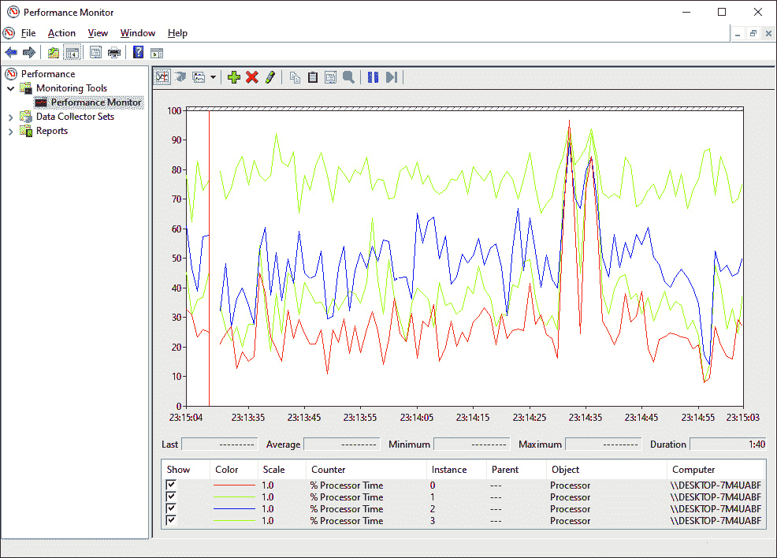

![图 15.1 – 运行中的控制台应用程序的性能监控器如你所见，处理器实例 1 是最被充分利用的处理器。我们需要做的是修改程序以利用所有可用的处理器。1.  在 `Main` 方法中注释掉方法调用，并在注释掉的方法之后添加以下代码：    ```cs    Parallel.For(        0, 1000000, x => MultipleProcessorExample(x)    );    ```此代码使用并行 `for` 循环处理 `MultipleProcessorExample` 方法一百万次。1.  再次运行代码。你应该在性能监视器中看到以下内容：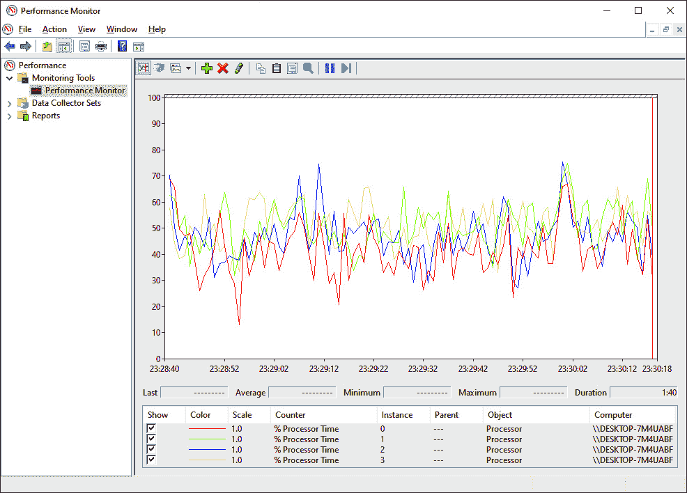

图 15.2 – 性能监视器显示我们的修改后的程序正在使用所有处理器

如你所见，通过非常少的代码，你可以从利用单个处理器转变为利用所有处理器，使用 TPL。在之前的章节中，你学习了如何使用 *BenchmarkDotNET* 来基准测试同一代码的不同变体的性能。在决定是否将你的单处理器代码转换为多处理器代码时，进行基准测试是个好主意。使用并行代码会有开销，因此你需要确保并行代码会提高你的程序性能。

现在，让我们学习如何使用 PLINQ。

# 使用并行 LINQ (PLINQ)

在本节中，你将学习如何使用 PLINQ 将你的顺序 LINQ 查询转换为并行 LINQ。看看以下代码：

```cs
var productNames = GetProductNames();
```

```cs
var names = from name in productNames
```

```cs
           where name.Length > 8
```

```cs
           select name;
```

上述代码调用了 `GetProductNames` 方法，并将结果存储在 `productNames` 变量中。然后对 `productNames` 列表执行 LINQ 语句，以提取所有长度大于八个字符的产品名称列表。此 LINQ 语句的结果随后存储在 `names` 变量中。

以下代码与前面的代码相同，但我们已对其进行修改，使其在多个处理器上并行运行：

```cs
var productNames = GetProductNames();
```

```cs
var names = from name in productNames.AsParallel()
```

```cs
           where name.Length > 8
```

```cs
           select name;
```

在这里，我们可以看到，要使 LINQ 语句执行为并行 LINQ，唯一的更改是添加 `AsParallel()` 方法调用。其余代码保持不变。

如果你希望从 PLINQ 语句中返回数据，那么在 `AsParallel()` 调用后加上 `AsOrdered()` 调用：

```cs
var productNames = GetProductNames();
```

```cs
var names = from name in productNames
```

```cs
             .AsParallel().AsOrdered()
```

```cs
           where name.Length > 8
```

```cs
           select name;
```

上述代码将返回一个按字母顺序排列的产品名称列表，其长度大于 `8`。

PLINQ 利用执行计算机上的所有处理器。然而，你可以使用 `WithDegreeOfParallelism` 调用来限制 PLINQ 使用的处理器数量，传递你想要限制 PLINQ 执行的处理器数量：

```cs
var productNames = GetProductNames();
```

```cs
var names = from name in productNames
```

```cs
             .AsParallel()
```

```cs
             .WithDegreeOfParallelism(2)
```

```cs
           where name.Length > 8
```

```cs
           select name;
```

上述代码仅限于在两个处理器上运行。

使用 PLINQ 时，以下是一些性能考虑因素：

+   不要在单核计算机上使用 PLINQ。这会导致比使用标准 LINQ 更慢的性能。

+   `AsOrdered()` 会减慢 PLINQ 的速度。只有在你需要的时候才使用它。基准测试替代排序技术，看看哪个最快，然后实现最快的方法。

+   在开发和测试你的 PLINQ 代码时，使用生产规模的数据库集。这将更快地揭示性能问题！

+   避免在小型集合上使用 PLINQ，因为这可能会提供较低的性能。这是因为 PLINQ 已经针对大型数据集进行了优化。

在下一节中，我们将考虑一些适合并行编程的数据结构。

## 并行数据结构编程

当我们进行并行编程时，我们应该始终考虑我们正在使用线程。因此，我们应该使用线程安全的 数据结构。

对于实现 `IProducerConsumerCollection<T>` 接口的数据类型，你应该使用通用的 `BlockingCollection<T>` 类，它提供了边界和阻塞功能。使用 `ConcurrentDictionary<TKey, TValue>` 类来创建线程安全的字典。对于线程安全的 FIFO 队列，使用 `ConcurrentQueue<T>` 类。使用 `ConcurrentStack<T>` 类来创建 LIFO 栈。对于线程安全的元素集合实现，使用 `ConcurrentBag<T>` 类。最后，对于要在 `BlockingCollection` 中使用的类型，实现 `IProducerConsumerCollection<T>` 类。

你可以在 Microsoft Docs 网站上了解更多有关线程安全集合的信息：[`docs.microsoft.com/en-us/dotnet/standard/collections/thread-safe/`](https://docs.microsoft.com/en-us/dotnet/standard/collections/thread-safe/)。

接下来，我们将查看基准测试循环、LINQ 和 PLINQ。

# 使用 BenchmarkDotNet 进行基准测试

在本节中，我们将基准测试一些方法以确定哪种方法能给我们带来最佳性能。请注意，在并行运行代码时会有一些初始开销。因此，有时并行代码可能不是提高代码性能的最佳选择。让我们开始吧：

1.  在 `Main` 方法中注释掉代码并添加以下行：

    ```cs
    BenchmarkRunner.Run<Benchmarks>();
    ```

1.  添加一个名为 `Benchmarks` 的类。

1.  添加以下 `NuGet` 包：

    1.  `BenchmarkDotNet`

    1.  `LinqOptimizer.Csharp`

1.  将每个 `NuGet` 包的 `using` 语句添加到 `Benchmarks` 类中。

1.  添加以下代码来设置我们的基准测试：

    ```cs
    private short[] data;
    [GlobalSetup]
    public void GlobalSetup()
    {
         integers = new Int16[Int16.MaxValue];
         for (short x = 1; x <= integers.Length - 1; x++)
         { 
         integers[x] = x; 
         }
    }
    ```

这里，我们声明了一个短数据类型的数组。然后初始化并填充该数组。这个数组将被以下六个方法中的两个使用。

1.  添加 `StandardForLoopExample` 方法：

    ```cs
    [Benchmark]
    public void StandardForEachLoopExample()
    {
         foreach (int x in integers)
                 Console.WriteLine($”Item {x}: {x}”);
    }
    ```

上一段代码使用标准的 `foreach` 循环遍历数据数组中的值，然后将数组在给定索引处的值写入控制台窗口。

1.  添加 `ParallelForLoopExample` 方法：

    ```cs
    [Benchmark]
    public void ParallelForEachLoopExample()
    {
         Parallel.ForEach(integers, x => {
             Console.WriteLine($”Item {x}: {x}”);
         });
    }
    ```

上一段代码与上一段代码执行相同，但使用 PLINQ 执行代码。

1.  添加 `UrlDownloader1` 方法：

    ```cs
     public List<string> DownloadWebsites1()
            {
                List<string> websitesContent = new();
                HttpClient httpClient = new();

                string[]? websites = new[]
                {
                “https://docs.microsoft.com”,      
                 “https://ownCloud.com”,       
                 “https://www.oanda.com/uk-en/”,     
                 “https://azure.microsoft.com/en-gb/”  
                };

                foreach (string? website in websites)
                {
                    Console.WriteLine($”Downloading of 
                        {website} content has started.”);
                    string websiteContent = 
                    httpClient.GetStringAsync(website)
                    .GetAwaiter().GetResult();
                    websitesContent.Add(websiteContent);
                    Console.WriteLine($”Downloading of 
                        {website} content has finished.”);
                }

                httpClient.Dispose();

                return websitesContent;
            }
    ```

上一段代码创建了一个 URL 数组，并使用 `foreach` 循环下载它们的内容。

1.  添加 `UrlDownloader2` 方法：

```cs
 [Benchmark]
```

```cs
        public List<string> DownloadWebsites2()
```

```cs
        {
```

```cs
            List<string> websitesContent = new();
```

```cs
            string[]? websites = new[]
```

```cs
                {
```

```cs
            "https://docs.microsoft.com",              
```

```cs
            "https://ownCloud.com",
```

```cs
            "https://www.oanda.com/uk-en/",        
```

```cs
            "https://azure.microsoft.com/en-gb/"
```

```cs
                };
```

```cs
            Task[]? downloadJobs = websites
```

```cs
                .Select(jobs => Task.Factory.StartNew(
```

```cs
                    state =>
```

```cs
                    {
```

```cs
                        using HttpClient? httpClient = new 
```

```cs
                            HttpClient();
```

```cs
                        string? website = state == null ? 
```

```cs
                            String.Empty : (string)state;
```

```cs
                        Console.WriteLine($"Downloading of 
```

```cs
                          {website} content has started.");
```

```cs
                        string result = 
```

```cs
                        httpClient.GetStringAsync(website)
```

```cs
                        .GetAwaiter().GetResult();
```

```cs
                        websitesContent.Add(result);
```

```cs
                        Console.WriteLine($"Downloading of 
```

```cs
                        {website} content has finished.");
```

```cs
                    }, jobs)
```

```cs
                )
```

```cs
                .ToArray();
```

```cs
            Task.WaitAll(downloadJobs);
```

```cs
            return websitesContent;
```

```cs
        }
```

上一段代码创建了一个 URL 数组，并将它们作为一系列任务下载。代码会在返回内容之前等待所有任务完成。

1.  添加 `Urldownloader3` 方法：

```cs
 [Benchmark]
```

```cs
        public List<string> DownloadWebsites3()
```

```cs
        {
```

```cs
            List<string> websitesContent = new();
```

```cs
            HttpClient httpClient = new();
```

```cs
            List<string> websites = new()
```

```cs
            {
```

```cs
            "https://docs.microsoft.com",           
```

```cs
            "https://ownCloud.com",
```

```cs
             "https://www.oanda.com/uk-en/",               
```

```cs
             "https://azure.microsoft.com/en-gb/"
```

```cs
            };
```

```cs
            websites.ForEach(website =>
```

```cs
            {
```

```cs
                Console.WriteLine($"Downloading of 
```

```cs
                    {website} content has started.");
```

```cs
                string result = 
```

```cs
                  httpClient.GetStringAsync(website)
```

```cs
                    .GetAwaiter().GetResult();
```

```cs
                websitesContent.Add(result);
```

```cs
                Console.WriteLine($"Downloading of 
```

```cs
                    {website} content has finished.");
```

```cs
            });
```

```cs
            httpClient.Dispose();
```

```cs
            return websitesContent;
```

```cs
        }
```

上一段代码使用 `Parallel.ForeEach` 循环下载存储在数组中的 URL 的内容。

1.  确保你的项目设置为发布模式，然后运行你的程序。程序将需要一些时间来执行。然而，一旦执行完成，你应该看到以下类似的内容：

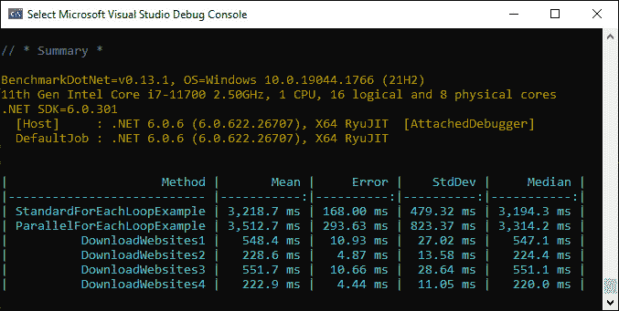

图 15.3 – BenchmarkDotNet 结果

观察到`ForEachLoop`示例，我们可以看到标准的`foreach`循环比我们的`Parallel.ForEach`循环执行得更快。因此，在这个例子中，使用并行代码比使用非并行代码稍微慢一些。但如果数据集很大且数据类型更复杂，那么结果可能会显示并行代码执行得更快。

当查看我们的`UrlDownloader`方法时，`UrlDownloader4`使用`Parallel.ForEach`循环，这比使用`foreach`循环和带有 lambda 方法的`foreach`循环的方法要快得多。然而，创建任务数组并等待它们全部完成的方法比`Parallel.ForEach`循环稍微快一些。

从这些测试结果中，我们可以看到我们有不同的方式执行相同的行为，每种方法的处理速度都不同。在某些情况下，我们看到了并行代码比非并行代码慢，而在其他情况下，我们看到了并行代码比非并行代码快。

当性能成为问题时，你可以使用 BenchmarkDotNet 来测试对同一任务的多种不同方法的效率。然后，你可以为你要解决的问题选择最有效的选项。

在下一节中，我们将学习如何使用 TPL 和 LINQ 的 lambda 表达式。

# 使用 TPL 和 LINQ 的 lambda 表达式

TPL 中有几个方法接受`System.Func<TResult>`或`System.Action`委托作为输入参数。这些可以用来将自定义逻辑传递到任务、查询或并行循环中。在创建委托时可以使用内联块。

使用`Func`委托封装返回值的函数，使用`Action`委托封装不返回值的函数。让我们回顾以下示例：

```cs
        static void FuncAction()
```

```cs
        {
```

```cs
            int[] numbers = { 15, 10, 12, 17, 11, 13, 16, 
```

```cs
                14, 18 };
```

```cs
            int additionResult = 0;
```

```cs
            try
```

```cs
            {
```

```cs
                Parallel.ForEach(
```

```cs
                    numbers,
```

```cs
                    () => 0,
```

```cs
                    (number, currentState, addition) =>
```

```cs
                    {
```

```cs
                        addition += number;
```

```cs
                        Console.WriteLine($"Thread: 
```

```cs
                       {Thread.CurrentThread.
```

```cs
                        ManagedThreadId}, Number: 
```

```cs
                        {number}, Addition: {addition}");
```

```cs
                        return addition;
```

```cs
                    },
```

```cs
                    (addition) => Interlocked.Add(ref 
```

```cs
                         additionResult, addition)
```

```cs
                );
```

```cs
                Console.WriteLine($"Addition Result: 
```

```cs
                    {additionResult}");
```

```cs
            }
```

```cs
            catch (AggregateException e)
```

```cs
            {
```

```cs
                Console.WriteLine($"Aggregate Exception: 
```

```cs
                    FuncAction.\n{e.Message}");
```

```cs
            }
```

```cs
        }
```

上述代码展示了如何使用`Parallel.ForEach`方法和线程局部状态。我们期望代码以并行方式执行并计算存储在`int`数组中的所有值。`Parallel.For`循环的每个线程维护一个局部累加变量。当每个线程初始化时，该累加变量被设置为`0`。随着每次迭代的进行，累加变量会加上数值。一旦线程完成其任务，该线程的局部总和会安全地添加到全局总和。循环完成后，全局总和将被打印出来。

上述代码还展示了如何使用 lambda 表达式来表示`Func`和`Action`委托：

```cs
]Parallel.ForEach<TSource,TLocal>(IEnumerable<TSource>, 
```

```cs
    Func<TLocal>, Func<TSource,ParallelLoopState,Tlocal
```

```cs
        ,TLocal>, Action<TLocal>).
```

在下一节中，我们将探讨一些并行调试工具。

# 并行调试和性能分析工具

在本节中，我们将探讨三个并行应用程序调试和性能分析工具。为此，我们使用了`CH15_ParallelProgrammingDebuggingAndProfilingSample`项目。在接下来的三个部分中，我们将使用此项目。

## 并行堆栈窗口

运行程序，直到调试器将其暂停。然后，从**Visual Studio**菜单中选择**调试** | **窗口** | **并行任务**。这将显示**并行任务**窗口。你应该会看到以下内容：

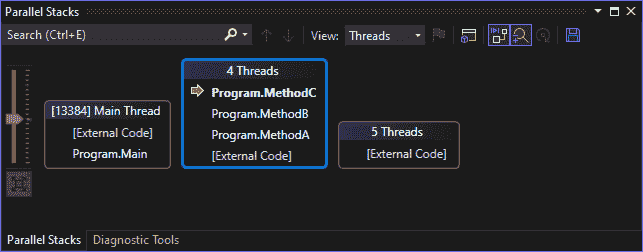

图 15.4 – 并行堆栈线程视图

如你所见，我们的主线程是通过我们的`Program.Main`方法启动的。我们可以看到调试器暂停在`Program.MethodC`。有四个线程 – 分别对应方法 A、B 和 C，以及外部代码中的一个。还有五个线程正在运行 – 这些是外部代码线程。

当你悬停在方法上时，你会看到以下弹出窗口：

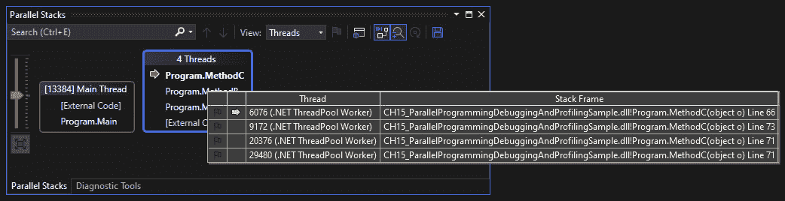

图 15.5 – 显示线程和堆栈帧视图的并行堆栈线程视图

通过悬停在每个方法组上，你可以看到一个线程和它们的堆栈帧的表格。这些堆栈帧提供了方法名称和行号。当前线程的活动堆栈帧由黄色箭头标识。如果你在悬停在堆栈帧上时右键单击，你可以选择显示哪些详细信息，包括参数值，如下所示：

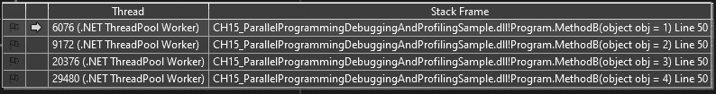

图 15.6 – 线程和堆栈帧视图

在这里，我们可以看到我们线程方法的每个参数的值。接下来，我们将查看**任务**窗口。

## 任务窗口

要查看**任务**窗口，从**并行任务**选项卡中选择下拉菜单中的**任务**。你应该会看到以下内容：

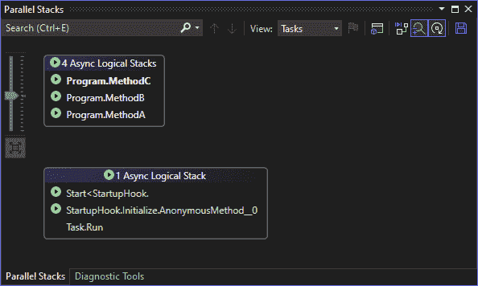

图 15.7 – 任务视图

前面的截图显示了异步逻辑堆栈。如果你悬停在方法上，你会看到一个弹出窗口，就像你在线程视图中做的那样：


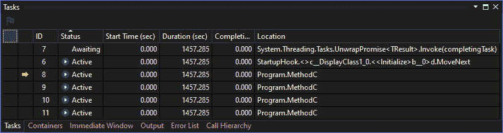

图 15.9 – 任务窗格

此视图显示了各种任务及其状态，以及其他信息。你可以右键单击列来自定义你想要看到的列。单击行应将你带到源位置以查看代码。

在下一节中，我们将探讨并发可视化器。

## 并发可视化器

并发可视化器是一个命令行实用工具，允许您从命令行收集跟踪数据。这些数据可以在 Visual Studio 2022 的并发可视化器中查看，该可视化器可用于未安装 Visual Studio 的计算机。并发可视化器不支持 Web 项目；它依赖于 Windows 事件跟踪。

默认情况下，`CVCollectionCmd.exe`安装在`C:\Program Files\Microsoft Visual Studio\2022\Preview\Common7\IDE\Extensions\rf2nfg00.o0t`和/或`C:\Program Files\Microsoft Visual Studio\2022\Community\Common7\IDE\Extensions\rf2nfg00.o0t`。

要开始收集跟踪，您可以使用以下命令：

```cs
C:\Program Files\Microsoft Visual 
```

```cs
Studio\2022\Preview\Common7\IDE\Extensions\rf2nfg00.o0t\CVC
```

```cs
ollectionCmd.exe" /launch D:\dev\CH15_ParallelProgrammingDe
```

```cs
buggingAndProfilingSample\CH15_ParallelProgrammingDebugging
```

```cs
AndProfilingSample\bin\Debug\net6.0\CH15_ParallelProgrammin
```

```cs
gDebuggingAndProfilingSample.exe /outdir D:\Debugging
```

```cs
    \TraceData
```

这将启动我们的应用程序并将跟踪数据记录到由`/outdir`命令行参数指定的位置。工具将生成几个文件，它们将具有`.etl`和`.cvtrace`文件扩展名。

从**Visual Studio**菜单中选择**分析** | **并发可视化器** | **打开跟踪**以查看生成的跟踪文件。您应该看到以下类似的内容：

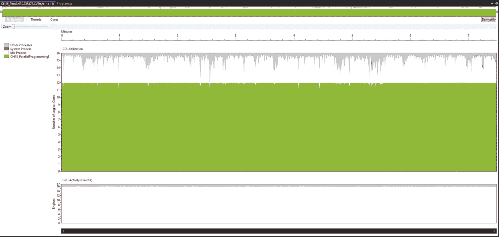

图 15.10 – 上下文可视化器利用率选项卡

此屏幕显示了您所追踪的程序正在使用的逻辑核心数量。正如您所看到的，我的计算机有 16 个逻辑核心。在这 16 个核心中，只有 12 个正在被使用。点击**线程**选项卡将显示以下视图：

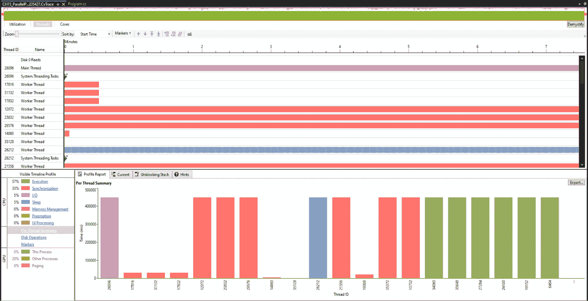

图 15.11 – 上下文可视化器线程选项卡

此屏幕为我们提供了关于所使用的线程、其功能和执行时间的良好、详细的分解。点击**核心**选项卡将显示以下视图：

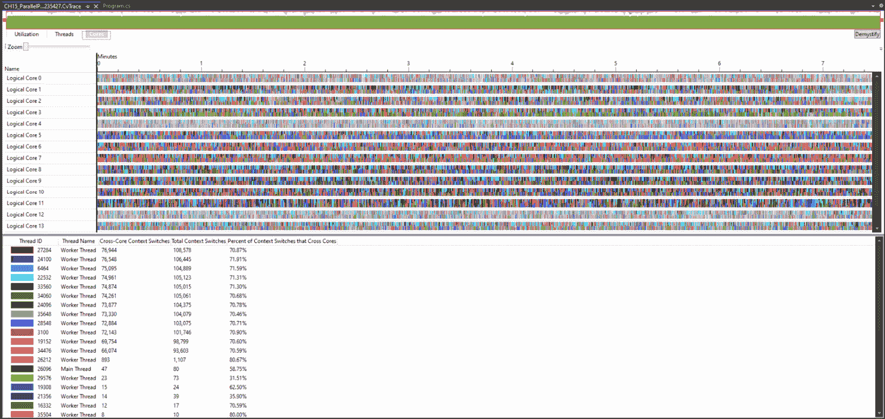

图 15.12 – 上下文可视化器核心选项卡

此视图显示了逻辑核心及其由主线程和工作线程的使用情况。您将看到线程 ID、其名称、跨核心上下文切换次数、总上下文切换次数以及上下文切换的百分比。

注意

微软提供了对并发可视化器的更详细说明。我刚刚为您提供了该工具的简要概述及其使用方法。如果您想了解更多关于如何使用此工具的信息，可以查看微软的文档，链接为[`docs.microsoft.com/en-us/visualstudio/profiling/concurrency-visualizer?view=vs-2022`](https://docs.microsoft.com/en-us/visualstudio/profiling/concurrency-visualizer?view=vs-2022)。

到此，我们已经到达了本章的结尾。现在，让我们总结一下我们所学到的内容。

# 摘要

在本章中，我们探讨了如何使用 TPL 和 PLINQ 来并行执行代码。到目前为止，我们了解到 TPL 和 PLINQ 之间的主要区别在于 TPL 不能有效地利用计算机上的所有核心，而 PLINQ 可以。

我们还看到了如何查看计算机的 CPU 利用率。使用 PLINQ 使我们能够有效地利用 CPU 的所有核心来提高代码性能。然而，在基准测试并行代码时，我们发现它有时比非并行代码更快，而有时则更快。因此，对你的代码进行基准测试以查看哪种方法最适合你是有益的。

我们还回顾了一段代码，展示了如何使用 lambda 表达式来表示`Func`和`Action`委托。

最后，我们通过一个使用 Parallel Tasks 窗口、任务面板和并发可视化器的代码示例来查看并行应用程序的调试。

在下一章中，我们将探讨异步编程。但在我们这样做之前，试着回答这些问题，看看你记住了多少。然后，查看*进一步阅读*部分以增强你的知识。

# 问题

回答以下问题以测试你对本章知识的掌握：

1.  TPL 代表什么？

1.  PLINQ 代表什么？

1.  你可以使用什么 Windows 程序来查看 CPU 核心使用情况？

1.  并行代码是否总是比非并行代码更快？

1.  你如何测量并行方法的代码性能？

# 进一步阅读

要了解更多关于本章所涵盖的主题，请查看以下资源：

+   *PLINQ 和 TPL 中的 Lambda 表达式*: [`docs.microsoft.com/en-us/dotnet/standard/parallel-programming/lambda-expressions-in-plinq-and-tpl`](https://docs.microsoft.com/en-us/dotnet/standard/parallel-programming/lambda-expressions-in-plinq-and-tpl)

+   *任务并行库 (TPL)*: [`docs.microsoft.com/en-us/dotnet/standard/parallel-programming/task-parallel-library-tpl`](https://docs.microsoft.com/en-us/dotnet/standard/parallel-programming/task-parallel-library-tpl)

+   *PLINQ 简介*: [`docs.microsoft.com/en-us/dotnet/standard/parallel-programming/introduction-to-plinq`](https://docs.microsoft.com/en-us/dotnet/standard/parallel-programming/introduction-to-plinq)

+   *并行诊断工具*: [`docs.microsoft.com/en-us/dotnet/standard/parallel-programming/parallel-diagnostic-tools`](https://docs.microsoft.com/en-us/dotnet/standard/parallel-programming/parallel-diagnostic-tools)

+   *调试异步代码：任务的并行堆栈*: [`devblogs.microsoft.com/visualstudio/debugging-async-code-parallel-stacks-for-tasks/`](https://devblogs.microsoft.com/visualstudio/debugging-async-code-parallel-stacks-for-tasks/)

+   *在 Visual Studio 中调试并行应用程序（C#、Visual Basic、C++）的教程*: [`docs.microsoft.com/en-us/visualstudio/debugger/walkthrough-debugging-a-parallel-application?view=vs-2022&tabs=csharp#main`](https://docs.microsoft.com/en-us/visualstudio/debugger/walkthrough-debugging-a-parallel-application?view=vs-2022&tabs=csharp#main)
