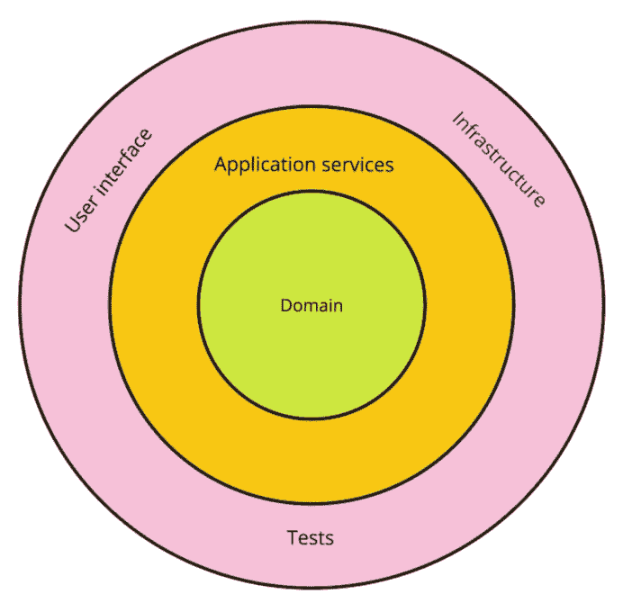
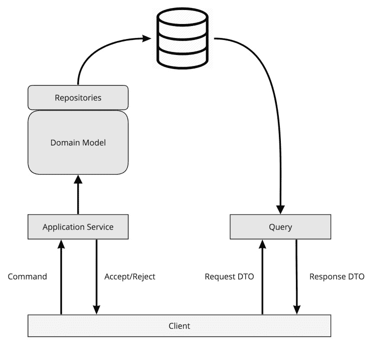
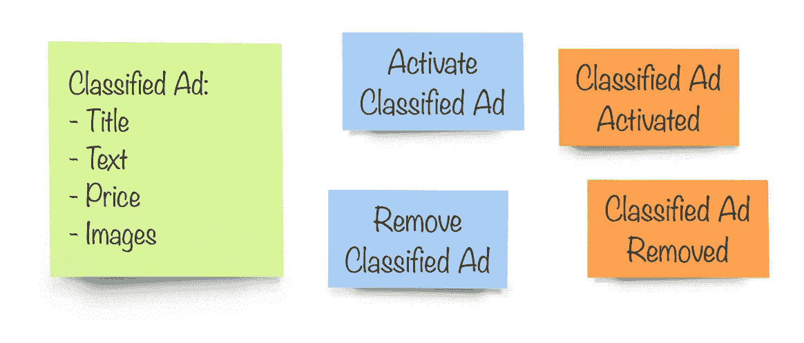
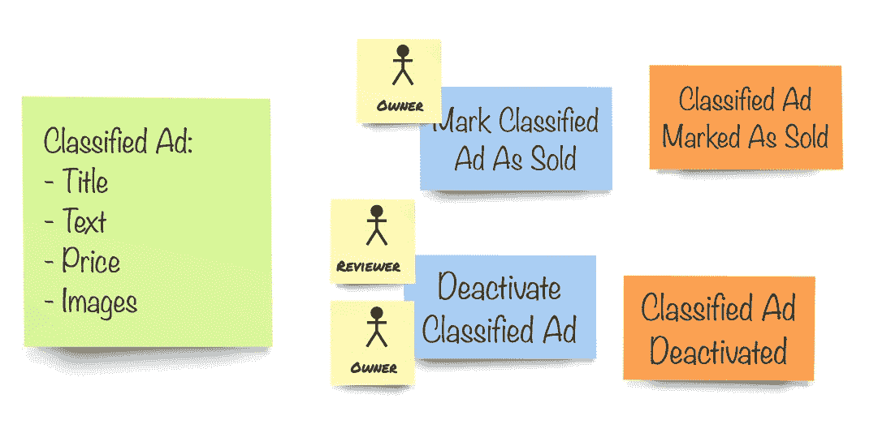
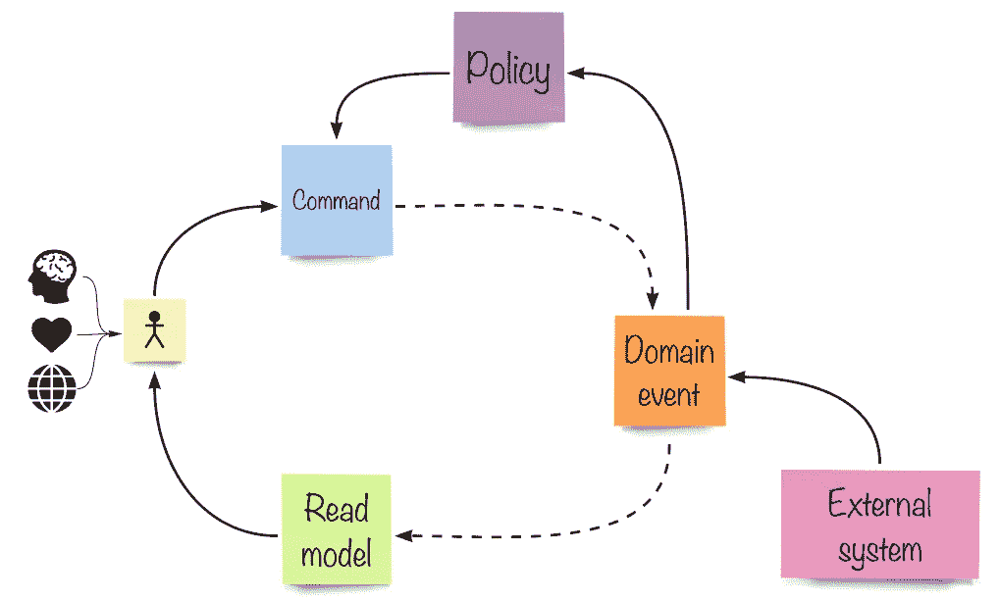
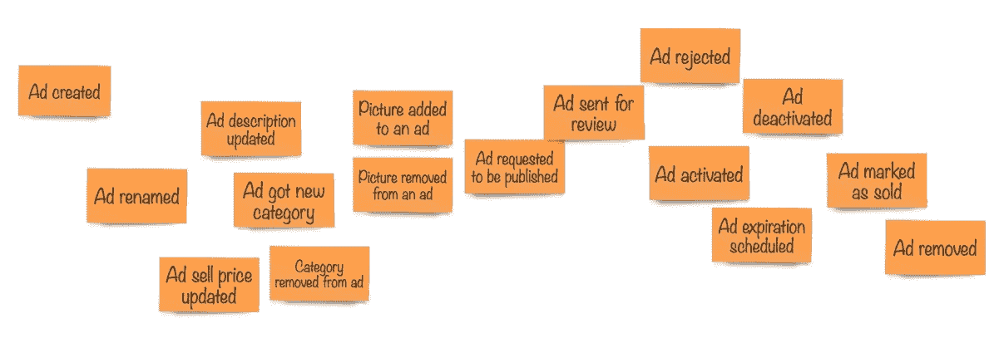
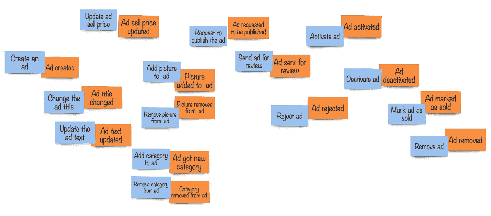
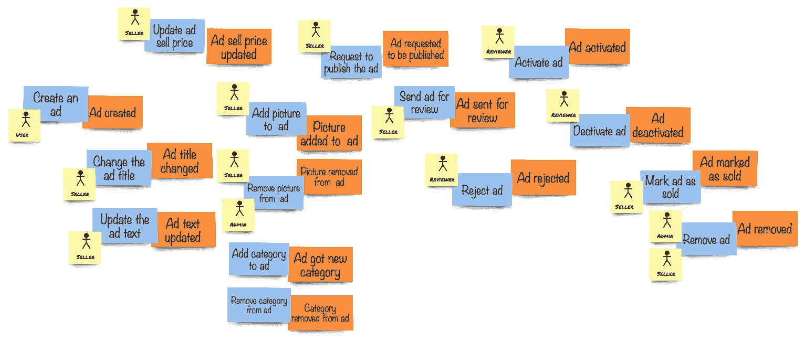
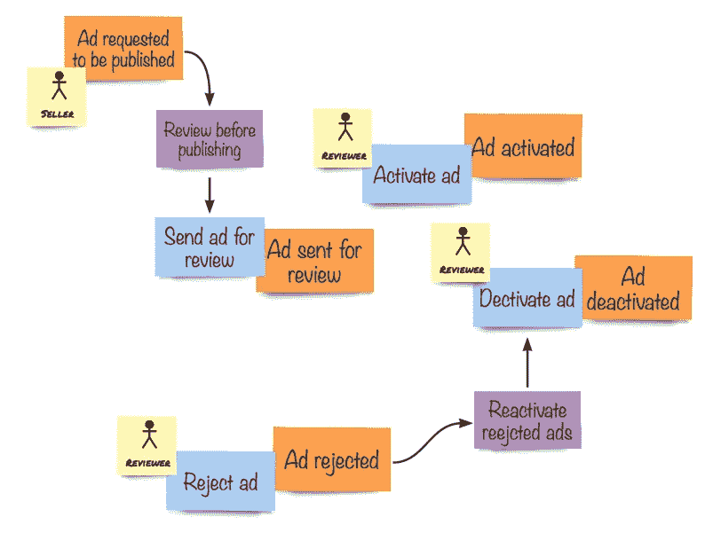

# 第四章：设计模型

许多人认为领域模型就是数据模型。你只需在 Google 上搜索`领域模型`就可以轻易看到这一点——你找到的所有东西都是数据图或类图。尽管类图有时包含一些有用的行为（方法），但这并不经常发生。然而，由于商业的复杂性很少在于其数据，我们需要意识到行为是领域模型的一个组成部分。

大图事件风暴帮助我们理解整个业务或其一部分，但我们需要更进一步以到达实施阶段。设计级事件风暴正是如此——我们关注对我们来说最有趣的系统部分，并深入其中，发现更多事件和新流程。

在本章中，我们将涵盖以下主题：

+   领域模型代表什么？

+   模式和反模式

+   设计级事件风暴

# 领域模型

正如我们在第一章，“为什么是领域驱动设计？”中讨论的那样，我们设计和实施的软件只有一个主要目的——解决领域问题。理解问题空间或业务领域对于找到适当的解决方案和使我们的系统满足用户至关重要。当我们使用如大图事件风暴等技术对领域有更多了解时，正如前一章所讨论的，我们需要进一步深入，并尝试使用其他人能够理解和推理的视觉工件来可视化我们的知识。简而言之，我们需要一个**模型**。

# 模型代表什么？

词语**模型**有许多不同的含义。当我们提到**模型**时，我们可以想到汽车、船只或甚至房屋的缩小模型。这样的模型以不同的规模代表现实生活中的物体，并且展示了实质上不同的细节水平。一些模型可能相当抽象，例如建筑群的模型。然而，其他模型可以提供它们所代表内容的更详细视图，例如汽车的比例模型，这些模型通常非常精确。但大多数时候，这样的模型也缺少了真实汽车的一些重要特征，比如引擎、变速箱和复杂的电子设备。

因此，模型代表了现实世界的一些产物，但具有狭窄的目的。例如，建筑将占据多少空间，整个综合体将有多高，在建筑项目的初步审查阶段，这些通常只是粗略模型所必需的。模型并不旨在复制现实生活。相反，它们以一定细节水平代表现实生活的某些特定方面，这取决于模型的目的。

城市交通线路图是一个很好的例子。在任何通用地图上，你都可以看到它显示了交通线路、所有车站和变化。它还指出了某些基本的地理方面，例如相对距离到海边或车站位于河流的哪一侧。

同时，这样的地图并不显示车站之间的距离，也没有直接与真实地理位置相似。要确切地找到车站的位置，或者确定从一个车站到另一个车站需要花费多少时间，你需要另一张地图。

这个例子表明，一个特定的模型可以代表现实生活的一些有用方面，但可能忽略其他元素，因为它们不是必要的。这并不意味着被忽视的方面根本不重要，只是它们不是那个特定问题空间的关键。因此，交通线路图解决了公共交通用户的定位问题，并且做得很好。但它并不解决街道导航的问题，因为它不需要，因为它服务于不同的目的。

因此，软件中的领域模型也需要表示与解决特定问题相关的业务领域的本质方面。有时，将我们所知道的一切，以及更进一步，我们可能假设的业务领域的所有内容，都放入我们的模型中，是非常诱人的。但这会给模型增加不必要的复杂性，并且不会帮助解决问题。更糟糕的是，在模型中加入太多无关的细节可能会扩大实施范围，并模糊业务人员在指定他们想要解决的问题时心中的意图。

回到第一章，“为什么是领域驱动设计？（Why Domain-Driven Design?）”，如果业务领域和我们必须解决的特定问题都在我们的问题空间中，那么领域模型就纯粹属于我们的解决方案空间。我们将建模我们的解决方案，而这些模型将成为我们的领域模型。

# 弱领域模型

术语**领域模型**，尽管它已经存在，但在马丁·福勒（Martin Fowler）的著作《企业应用架构模式》（Patterns of Enterprise Application Architecture）中被提及后，才被广泛认可。以下是福勒在书中对这一术语的定义（[`martinfowler.com/eaaCatalog/domainModel.html`](https://martinfowler.com/eaaCatalog/domainModel.html)）：

“领域模型：领域对象模型，它结合了行为和数据。”

这个定义相当简短和简洁。然而，如果你在 Google 上搜索“领域模型”并查看各种链接，你会发现它仍然存在很大的错误。如果你像我一样做了同样的事情并搜索了这个短语，你会发现大多数找到的图片和大多数链接都指向我们可以认为是数据模型或实体模型的东西。这些模型可视化实体、具有类型的字段以及实体之间的关系。在最好的情况下，链接通过诸如*attends*或*consist of*这样的领域术语进行属性化，而在一些罕见的情况下，我们可以找到显示某些方法的类图。

在实体或数据模型的案例中，我们看到的所谓**贫血模型**。正如术语所暗示的，这样的模型只表达系统状态，而对这种状态如何变化以及系统中执行的操作一无所知。通常，如果你查看这些系统的实现，你会发现系统所做的一切都是对数据的某种操作。新的实体被创建，新的关系被建立，实体中的字段被更改。仅此而已。

贫血模型之所以流行，有几个原因。首先，UML 中可视化领域模型的指南建议，所设想的是**概念类**。这些类代表现实世界中的实体及其属性。在 UML 中，这些模型包括具有属性（字段）的项目（实体）、它们的关联（关系）和参与者。因此，在概念类中没有行为的地方。下一个原因是，概念类的想法似乎已经丢失，这些 UML 模型成为了唯一的领域模型，其中领域行为被认为是不重要的。

回到 Fowler，在关于贫血模型的 bliki 文章([`martinfowler.com/bliki/AnemicDomainModel.html`](https://martinfowler.com/bliki/AnemicDomainModel.html))中，他明确地将这种建模系统的方式定义为一种反模式。除了之前的描述外，贫血模型往往完全由数据库操作实现。由具有关系的对象组成的模型与关系模型非常相似，因此关系数据库最常用于持久化此类对象。贫血领域模型与其在数据库中的状态之间的关联如此紧密，以至于它们变成了同胞，无法相互区分。

非常常见，如果你发现一个以贫血模型作为领域模型的系统，你将很难理解这个系统做什么，因为你在代码中看到的所有东西都是 SQL 和运行它的调用。如果你向使用该系统的人询问他们模型实现的所在地，他们很可能会直接指向数据库。也有人认为，在应用程序行为很少或没有行为的情况下，贫血领域模型是有用的，这样的模型作为持久化模型非常完美。我争辩说，在这种情况下，没有必要称之为领域模型。数据模型完全可以，因为它们服务于持久化的目的。然而，将数据模型呈现为领域模型并没有真正的理由，因为这两者是完全不同的东西。

# 函数式语言和贫血模型

这里还有一点值得提及。在函数式编程社区中，有人讨论他们设计的模型是否也是贫血的。这是因为，在函数式编程中，使用类不是强制的，有时甚至不可能。即使可能，使用类也不自然，因为函数和函数组合可以更容易地解决许多问题。我争辩说，如果行为仍然以函数的形式建模和实现，这样的模型就不是贫血的。它可能不完全符合原始定义，但 2003 年是面向对象编程语言的统治时期，所以使用**对象模型**这个术语是自然的。然而，关键在于数据和行为的组合，并且肯定的是，当使用丰富的类型系统以及明确表达意图的函数时，这样的模型确实不是贫血的。

# 领域模型应包含什么

正如我们之前提到的，领域模型的对象代表领域的数据和行为。通过写*对象*，我并不是指与面向对象语言相关的东西，而是它们所代表的本质。领域模型的实现也受到所使用的编程语言的影响，因此这些对象可以是记录、结构体，或者实际上就是对象。因为这本书是关于使用 C#来实现**领域驱动设计**（**DDD**），我们将使用类和对象来实现我们的领域模型。

即使当我们拥有多态的概念时，我们也可以在我们的类中组合数据和行为。这并不意味着我们的领域模型将包括这样的类。领域实现的所有部分也都是领域模型的一部分。没有比实现该模型的代码更好的领域模型文档了。

模型中的行为和数据是相互关联的。模型的行为除了操纵模型的数据外，没有其他意义，并且由于数据代表的是模型所关注和操作的内容，这种数据也被称为**状态**。状态是描述我们的系统在特定时间点看起来如何的数据。模型的所有行为都会改变状态。状态是我们持久化到数据库并可以在应用新行为之前随时恢复的东西。

这可以通过一个简单的例子来说明：

状态转换由一个动作触发，引起一个反应

在这里，你可以将账户余额视为状态的一部分。当我们应用一个行为时，状态会发生变化。这被称为**状态转换**。每个领域模型行为都会导致领域模型状态的变化。所有记录领域状态变化的方式都应该成为领域模型的一部分。

# 设计考虑因素

正如我们之前所见，在面向对象的语言中，我们经常看到使用多态能力的类来保持行为与状态的紧密关联。然而，在函数式语言中，状态通常被独立维护，因为行为可以表示为操作代表状态的记录类型实例的函数。

从逻辑上讲，诸如通信协议、用户输入验证和持久化实现等问题并不被视为领域模型的一部分。这些都是技术和基础设施问题。这里的一个好的经验法则是，整个领域模型应该能够在不涉及任何基础设施的情况下进行测试。主要来说，在你的领域模型测试中，你不应该使用测试框架和模拟。

如果你观察洋葱架构、六边形架构和清洁架构原则，你会发现它们有一个共同点。任何应用的中心是**领域**：

洋葱架构

**应用服务**和**基础设施**被保持在系统核心之外，并围绕这个核心形成层。与从 UI 层到数据层的依赖关系相反的分层架构不同，我们可以看到**领域**是所有事物的中心，一切皆依赖于它。这种变化，尽管可能被视为一个小调整，但具有非常重大的影响。不再是所有东西都依赖于数据层，这使得数据库成为一切的主宰，焦点转向领域，使领域模型成为系统最重要的部分。

# CQRS

除了之前讨论的将领域模型设计为多态类的方法，使用面向对象以及使用操作记录类型实例的函数来设计某些函数式语言之外，还有另一种在领域内部表达状态转换的方法。这里指的是 CQRS 模式，这是由格雷格·杨十年前提出的。

这个术语起源于**命令查询分离**（**CQS**），由伯特兰·梅耶提出，该理论指出对象方法分为两类。这些类别如下：

+   命令，这些命令会改变系统（通常是对象）的状态并返回`void`。

+   查询，这些查询返回系统状态的一部分，但不会改变系统的状态。这使得查询无副作用（除了像日志记录这样的东西）并且幂等，因此可以多次执行并得到相同的结果。

**命令查询责任分离**（**CQRS**）将这个原则扩展到对象之外。这是同样的原则，但应用于系统级别。这个模式的发展历时数年，从 2007 年格雷格在 InfoQ 会议上提出这个模式的早期愿景，到 2010 年发表了总结论文([`cqrs.files.wordpress.com/2010/11/cqrs_documents.pdf`](https://cqrs.files.wordpress.com/2010/11/cqrs_documents.pdf))。谷歌也花了几年时间才认识到这个缩写的含义。几年前，那些急于寻找 CQRS 的人从谷歌得到了建议说*你是指 CARS 吗*？但如今，这个模式已被广泛认知和赞誉。

在系统级别上分离命令和查询意味着任何系统的状态转换都可以通过一个命令来表达，并且这样的命令应该被高效地处理，优化以执行状态转换。另一方面，查询返回来自系统状态的数据，这意味着查询可以以不同的方式执行，并且可以针对读取状态或任何存在的状态衍生进行优化。

在数据库写入和读取之间存在明显不平衡的情况下，这种分离是有益的。典型的商业或面向消费者的应用程序在读取方面严重不平衡。然而，典型的实现是针对写入优化的，使用规范化的关系数据库，其中写入可以相当高效地执行，但读取需要大量的连接和广泛的过滤：

单数据库的 CQRS

在最简单的场景中，CQRS 可以通过仅使用数据库映射的领域对象来执行操作，以改变系统状态（通常，这是通过 ORM 工具完成的）和使用直接 SQL 查询以及跨多个表的连接来检索系统，完全忽略领域模型类层次结构。这导致了读取的极大优化，同时合理地增加了对状态持久化机制的认识。虽然这种方法完全合法，但你应该意识到，在这种情况下，查询需要要么从数据持久化层中适当抽象出来，要么在设计领域模型之外进行设计。

在更复杂的场景中，我们不仅可能有两个不同的*客户端*来操作相同的领域实体，还可以将这些实体分开。我们将在本书后面的章节中详细讨论这些技术，当我们讨论事件溯源时。

你可能想知道为什么 CQRS 被纳入了本书的领域模型设计部分，而不是在属于实现的章节中解释。原因在于 CQRS 将命令和查询视为一等领域对象。领域事件始终应被视为一等领域对象，但在更高级的 CQRS 实现模型中，领域事件在保持整个系统一致性的关键作用中扮演着至关重要的角色，因此领域事件的作用变得更加关键。

正因如此，CQRS 在这里被提及，让我们意识到我们不仅应该包括具有属性和方法用于我们的领域模型的类，命令、查询和领域事件也属于模型的一部分，我们将在下一节中探讨如何对这些所有元素进行建模。

我的最后一点是，无论是否使用 CQRS 进行实现，事件风暴都是有价值的。

# 设计级事件风暴

在上一章中，我们通过大图事件风暴的过程对整个业务进行了建模。我们主要讨论了领域事件，后来又添加了热点和外部系统。

在本节中，我们将以更详细的程度进行建模，使用更丰富的符号，以更接近模型在代码中的实际实现。

# 深入了解知识

让我们回到完成大图事件风暴工作坊的那一刻。团队花了几小时讨论关键主题：

+   业务运行哪些流程？

+   在这些过程中，哪些类型的对象参与其中？

+   我们可以记录关于系统行为的哪些事实？

+   谁负责什么？

+   我们需要学习和使用哪些基本术语？

关于这些点的讨论产生了一张包含许多代表生活事实的橙色便利贴的图表，我们称之为**领域事件**。还有一些粉色的便利贴散落在各处，表示热点——需要关注、进一步阐明或引起担忧的事情。通常，这意味着缺乏知识。

所有这些事情都使团队在实现方面更加接近，但他们还没有开始编码的感觉。团队成员需要深入设计，并获取更多关于系统中可以执行哪些操作以及由谁执行的具体知识。

这是一个另一种类型的 EventStorming 讲座的主题——设计级 EventStorming。让我们更详细地看看如何组织这样的讲座。

# 讲座准备

对于更详细的 EventStorming 讲座，你需要的与 Big Picture 讲座大致相同：

+   纸卷或任何其他类型的无限建模空间

+   不同颜色的便利贴纸；我们稍后会讨论符号

+   足够的永久性记号笔

当然，关键因素是拥有正确的人。但现在，我们正在深入细节，因此选择一个探索区域至关重要，而找到这样的空间通常是一项非平凡的任务，我们将在本章后面讨论。因此，正确的人将是那些将忙于编写代码的人，负责该系统部分的产品负责人，以及所选领域的领域专家。正如你所看到的，我们可以将我们的小组限制在比 Big Picture 会话更少的人。

这两种选择——限制范围和限制人数——使我们能够以更高的详细程度讨论设计，有一个单一的讨论线索，让每个人都表达自己的想法并提出问题。

# 扩展符号

由于 EventStorming 是语言和技术无关的，我们无法对类、字段、方法或函数等事物进行建模。相反，我们需要使用更普遍的概念。我们已经在 CQRS 部分讨论了这样的想法，并且我们看到我们可以在领域模型中不仅将行为表达为方法列表，还可以表达命令的执行。命令表达了用户的意图。领域模型随后进行状态转换，并产生新事件，记录目的和状态转换。查询代表了用户想要在屏幕上看到的内容，以便做出决策和执行其他命令。因此，这为设计会议提供了一些与任何特定编程语言或技术无关的元素。

# 命令

命令和事件不受任何语言或技术的限制。它们还非常详细地描述了系统的行为，使用通用语言并表达用户的意图。

因此，我们在设计级 EventStorming 的符号中包含命令。命令表达了与系统交互的用户意图，因此将命令应用于我们的系统将自然产生状态转换，并在我们的领域模型内部产生事件。如果我们用蓝色便利贴纸表示命令，命令处理的常规流程将如下所示：

命令触发状态改变

注意，我们没有连接便签的箭头。流程完全由将它们按时间顺序放置在一起来决定。首先，我们请求系统做某事，当操作被接受并执行时，系统转换其状态并发出新事件。

通常情况下，避免在建模空间中使用箭头，因为它们会为你的便签创建空间锁定，你将停止移动它们，因为箭头是画在纸上或白板上的，不能移动。这种锁定会降低建模的动态性，并阻止实验。

# 读取模型

我们将引入模型的新概念是读取模型。读取模型是我们用户在请求系统做某事之前查看的内容。它可以是我们的应用程序中的任何屏幕，例如表单、仪表板或报告。任何这样的屏幕都包含一组具有有限元素类型的元素。通常，我们可以将元素分类如下：

+   以文本和图像形式显示的信息

+   表单元素，如输入框、复选框和单选按钮

+   动作按钮

+   导航

当导航元素自然地将用户从一屏引导到另一屏时，动作按钮用于向系统发送命令。信息元素和表单元素是用户在决定做什么之前会查看的内容。这些元素内部显示的内容由读取模型定义。为了建模的目的，我们可以假设我们的读取模型是系统中的屏幕，这样我们就可以确定需要组合并展示给用户的信息。

为了演示这一点，让我们看看以下示例：

读取模型、命令和事件

因此，这里的绿色便签代表分类广告的读取模型。从那里，用户可以执行特定操作：发布广告或删除它。执行这些命令之一将导致领域模型发布一个事件。

# 用户

在我们的系统中，大多数命令都是由使用系统的人——用户执行的。在设计模型时，我们经常需要了解谁在运行哪个命令，仅仅是因为并非所有命令都允许每个人执行。我们可能定义不同的用户角色，例如管理员、经理、审阅者等，并设法可视化它们，以及它们执行特定命令的能力。你可能会发现识别角色并使用它们，或者代替角色是有用的。如果你预期一个人在系统中扮演不同的角色，或者当你正在建模一个你了解特定人员和他们的特定职责的现有系统时，直接在模型中使用他们的名字将使所有相关人员更加清晰和易于理解。

从视觉上看，我们可以使用带有人物形状的小便签，绘制成 UML 的参与者符号。你也许会称你的用户为**参与者**，但在 UML 中，参与者并不一定是用户。在 EventStorming 中，我们希望用户以不同的方式可视化，因此我们使用更大的浅紫色便签来表示外部系统，正如我们在上一章所讨论的。

让我们把一些用户放入我们的模型中：

用户是触发命令的人

我使用了一个不同的读取模型，它可以被两种不同类型的用户使用。在这里，**分类广告**的所有者可以将其标记为已售出。但所有者和担任**审阅者**角色的人都可以停用广告。

# 政策

在设计级别的会话中，我们将使用最后的元素是政策。正如我们之前所学的，系统中的动作由命令表示。用户可以通过发送命令来执行动作。当命令被处理时，系统会改变其状态并发出事件。这是系统对用户动作的初始反应。但是，当我们发布事件时，我们也让之前不知道正在执行命令的领域模型的其他元素知道发生了某些事情。这对于一次不执行与某个动作相关联的所有工作非常有用。理想情况下，我们应该将处理命令所需的工作量限制在绝对最小。技术上，这样的原子操作可以表示为一个事务。可能还有一些其他操作也需要作为领域模型状态转换的结果来执行，但我们不需要将这些动作包裹在一个事务中并强制用户等待所有这些工作完成。这正是我们需要政策的地方。政策订阅领域事件，当政策接收到它感兴趣的某些领域事件时，它会检查事件内容，并可能向系统发送另一个命令以补充工作。可能有多个政策对同一事件类型做出反应，以异步方式执行各种后处理，而用户在原始命令执行后重新获得控制权。

我们可以在我们的建模空间中这样表达一个政策：

政策可能会根据事件触发命令

看这个模型，我们可以这样转录——*当分类广告的所有者将其标记为已售出时，系统也应停用此广告*。

如你所见，一个政策可以响应领域事件并发布命令，基于某些条件。这种行为被称为**反应行为**，而积极使用这种模式的系统可以被称为**反应系统**。

请注意，术语“反应性”在近年来变得模糊不清。*反应宣言*提出了“反应系统”的定义，这与我在本书中的意思不同。

# 一同来做

总结一下，我们可以绘制出本节中引入的所有元素的概念图，如下所示：

解释（几乎）一切的画面——阿尔贝托·布兰多利尼

此图的转录将是——用户，使用来自系统的信息，表示为读取模型，以及来自外部世界的信息、用户的感受和思考，向系统发送操作请求，称为**命令**，这可能导致系统状态发生变化，从而产生领域事件。领域事件可以触发策略，这些策略可能会根据在事件中接收到的信息和系统状态发出新的命令。外部系统也可以产生领域事件。系统状态的变化还会导致读取模型被更新，因此用户可以从系统中接收新的信息，循环重复。

此图可以描述大多数系统，你可能想象它不仅适用于软件系统。该图也与 CQRS 非常吻合，我相信这使 CQRS 模式非常有用。有些人可能会争论，CQRS 由于实施工作而给系统增加了意外的复杂性。然而，当正确实施时，它为模型增加了更多的清晰度，因为它直接实现了**关注点分离**（**SoC**）原则（埃德加·W·迪杰斯特拉，《科学思维的作用》，1974 年），并且通常使系统更容易构建和维护。

# 建模参考域

在本节中，我们将使用本章中介绍的工具来设计参考域的一部分。

我们团队再次聚在一起，更详细地讨论系统的一部分。他们决定，在第一阶段，他们的核心领域是分类广告的生命周期，而与额外服务和支付相关的部分将由于投资者决定在货币化应用程序之前获取用户而稍后实施。

重要的是要认识到，这样的决策不能仅由开发者做出，并且涉及所有利益相关者在决策过程中的参与至关重要。

首先，我们需要快速回顾一下被确定为分类广告生命周期一部分的事件。我们的团队开始工作，但很快达到了他们在墙上看到这一点：

会话的第一轮——仅限领域事件

如你所见，此模型与上一章的最终模型略有不同。每次团队讨论模型时，都会发生一些变化，因为团队成员对领域有了更好的理解。

接下来，他们添加了一些命令，这些命令导致模型上已经存在的事件。在许多情况下，命令展示了用户直接意图做某事，从而直接导致事件。这些命令是最明显的一些，首先出现在模型中。

在一段时间之后，模型看起来是这样的：

事件和命令

团队随后同意大多数命令都是由用户执行的，但随后就引发了关于谁是用户的讨论。从技术上讲，使用该系统的每个人都是用户。但不同的人可以执行不同的操作，某些管理员允许执行的操作普通用户则不能执行。这是显而易见的，但由此，团队认识到需要根据人们的行为来区分他们。当然，一个人可以扮演不同的角色，但在这个具体的例子中，大多数操作都是由一种类型的用户执行的——那些想要 *sell* 东西的人。自然地，这个角色被认定为 *seller*。在做出这一发现后，模型开始变得更加详细：

事件、命令和参与者

如您所见，在过程中，更多的角色被识别并分配给命令。例如，广告不能由卖家批准或拒绝；这显然没有意义。服务内部的人需要完成这项工作，或者允许广告发布，或者因为某种原因拒绝发布。

趣味的是，由于讨论的上下文仅涵盖广告生命周期，没有买家参与。因此，团队继续交替使用 **owner** 和 **seller** 这两个词。为了保持一致性，他们倾向于使用 **seller** 这个词，但记住，Ubiquitous Language 中的所有词汇都是上下文特定的。我们没有在这里提到 **buyer** 的原因是，就团队目前所关心的，他们只会处理系统其他部分的买家，这意味着另一个上下文。初步来看，他们认为买家将参与关于购买协议和条款的讨论，以及在托管情境下，如果需要的话。此外，团队还在思考相互审查的问题，自然地，卖家和买家都将参与这项活动。

然后，思绪开始飘向因不同原因出现的事件。其中之一是 **Ad deactivated**。卖家在查看广告时可能会点击 Deactivate 按钮，或者广告可能会被审阅者拒绝发布。发现是，当触发一个使广告失效的策略时，`Deactivate Ad` 命令可以由卖家和系统本身执行。将策略添加到模型中导致了一些更详细的细节：

模型中包含策略的部分

最后，团队审查了一些需要显示特定信息以允许用户做出决策并作为命令执行的命令。并非在第一次迭代中都能达到这样的清晰度，在这种情况下，团队需要将做出任何决策推迟到以后的阶段。与过于细致的模型相比，取得进展并继续前进更为重要，因为无论如何，这样的模型永远不会完美。

例如，当向广告添加类别时，卖家必须能够使用一些高级技术，如自动完成搜索，从现有类别的列表中进行选择。对于审阅者来说，不仅看到广告的内容有帮助，还能获取更多关于撰写广告的卖家的详细信息。一系列因素，如卖家在平台上的经验、之前发布的广告数量、当前发布的广告数量以及最终的当前广告内容，可以为审阅者提供清晰度，帮助他们区分恶意广告和合法广告。

当与读取模型一起工作时，开发者有很多机会与 UX 专家、UI 设计师以及其他人员合作，因为真实模型是 UI 的自然组成部分。但也不应忘记命令，因为它们是使系统执行有用操作的处理器。没有命令，整个系统将只是一个静态页面的集合，因为没有方法可以改变系统的状态和执行任何行为。任何系统的整个 UI 都是由读取模型组成的，这些模型通过按钮和其他触发动作的元素附加了命令执行器。

你还可能考虑基于任务的 UI，这是一种设计 UI 元素的有用方法，可以引导用户进行简单、原子和精确的操作。在我们的例子中，我们也使用了基于任务的 UI，因为我们的卖家将广告价格与广告标题分开更改，仅仅因为这些操作实质上不同。基于任务的 UI 的理念与 CQRS 和命令处理非常一致。毫不奇怪，关于这种技术的最多信息可以在 Greg Young 与 CQRS 相关的文章中找到，例如这篇：[`cqrs.wordpress.com/documents/task-based-ui/`](https://cqrs.wordpress.com/documents/task-based-ui/)。

# 摘要

在本章中，我们确定了领域模型，并同意模型代表现实生活的一部分，旨在解决某些特定问题。我们还讨论了行为的重要性，以及它是模型的一个基本部分，通常被忽视甚至被忽略。

在这个过程中，我们介绍了 CQRS 模式。它将命令作为模型内部要执行的行为与仅用于检索状态的查询区分开来。

然后，我们为 EventStorming 建模技术增加了更多元素，以便更深入地建模细节，朝着我们可以开始编码实现的方向发展。我们认识到这些新元素与 CQRS 范式非常匹配。

最后，我们进行了样本领域的建模会议，并对系统核心部分应该如何工作有了更深入的了解，因此我们现在准备将这一知识转化为代码。这就是我们在下一章将要做的事情。

# 进一步阅读

更多信息，请参考以下资源列表：

+   *介绍 EventStorming*，Brandolini A. (2017)，Leanpub ([`leanpub.com/introducing_eventstorming`](https://leanpub.com/introducing_eventstorming))

+   *微软归纳用户界面指南*，微软公司，2001 ([`msdn.microsoft.com/en-us/library/ms997506.aspx`](https://msdn.microsoft.com/en-us/library/ms997506.aspx))

+   *基于任务的 UI* ([`cqrs.wordpress.com/documents/task-based-ui/`](https://cqrs.wordpress.com/documents/task-based-ui/))
