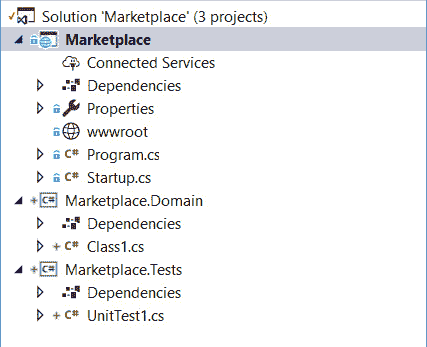
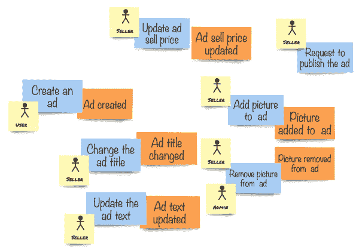
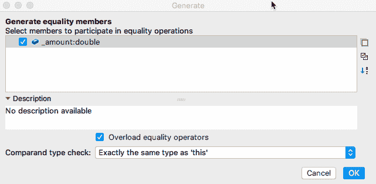
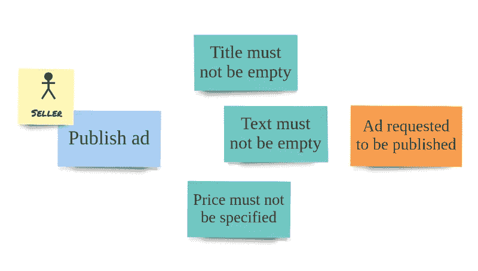
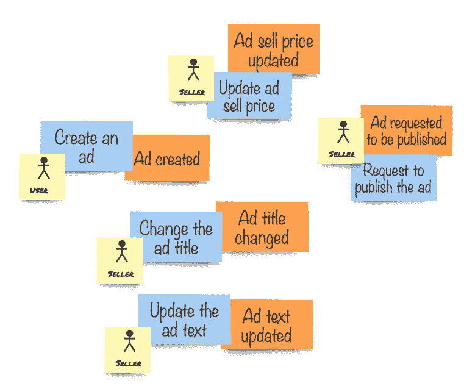

# 第五章：实现模型

在前面的章节中，我们经历了一个不同层次的知识压缩和领域分析。我们使用 EventStorming 作为我们的主要工具，因此，作为我们努力的结果，我们得到了大量的纸卷，上面贴满了五颜六色的便利贴。但如何从这些纸卷中生成一些可工作的代码呢？这是一个好问题，这正是我们在本章继续前进时将开始做的事情。

到本章结束时，我们将有一个基于代码实现的领域模型的基础。我们将探讨在领域实体中执行行为的不同风格，并编写一些测试。

将涵盖以下主题：

+   为领域模型创建项目

+   将领域对象添加到新项目中

+   实体和值对象是什么

+   如何确保领域模型始终处于有效状态

# 技术要求

本章将提供一些实际操作的指南。为了跟进，你需要以下工具：

+   .NET Core 2.2.203 或更高版本 ([`www.asp.net/`](https://www.asp.net/))

+   Visual Studio 2017 或更高版本 ([`www.visualstudio.com/vs/`](https://www.visualstudio.com/vs/))，或 JetBrains Rider ([`www.jetbrains.com/rider/`](https://www.jetbrains.com/rider/))

对于平台没有特别的要求，因为.NET Core 和工具几乎无处不在。在整个书中，我将使用 macOS 上的 Rider。初始截图将来自 Windows 的 Visual Studio 2017，因为大多数读者都会使用这个 IDE。一些对话框在 Windows Visual Studio、Visual Studio for Mac 和 Rider 之间差异很大。

我将在代码中使用 C# 8.0 的一些功能，因此需要使用 .**NET Core SDK 2.2.203** 或更高版本。

我假设你熟悉你正在使用的工具以及.NET Stack，因此你知道如何创建项目、构建它们并在不同的环境中执行应用程序。

# 开始实施

在本节中，我们将创建一个新的项目并向其中添加一个领域项目。

由于我们计划实现一个 Web 应用程序，我们将从一开始就考虑这一点，并使用 Web 应用程序模板。我们还将添加一些项目来托管我们系统的不同部分和测试。

如果你不太熟悉.NET 的工具，你总是可以检查 Mapt，Packt 书籍和视频课程的广泛图书馆，并使用那里的材料来提高你的技能。在这本书中，我们假设读者对 C#和用于开发.NET 应用程序的工具有足够的了解。

# 创建项目

我们将从一个空项目开始。你需要创建一个.NET Core Web 应用程序，并确保启用创建 Git 仓库，以便它可以记录你的更改历史。

我们预期我们的系统会变得更加复杂，但我们从简单开始。让我们将解决方案命名为`Marketplace`，我们的第一个项目也将这样命名。要创建的项目类型是 ASP.NET Core Web 应用程序。这个项目是我们的启动项目，将由.NET 运行时执行。您需要为新 Web API 项目选择`Empty`项目类型，因为我们不会使用 Razor 或 SPA（单页应用程序）模板。

我们已经讨论过，领域模型不应该依赖于基础设施。一般来说，它不应该引用任何东西，除了标准语言类型、自身以及如果需要的话，一些基类和接口集合。为了强制执行这一点，让我们创建一个单独的项目，我们将把所有的领域对象放在这个项目中。向解决方案中添加一个更多项目，并将其命名为`Marketplace.Domain`。这个项目将不会独立执行，因此项目类型应该是类库 (.NET Standard)，并且不要忘记将其框架更改为 netstandard2.0（或更高版本）。.NET Standard 是类库的默认值，但如果您不打算在旧版.NET Framework 应用程序中使用您的库，也可以自由使用 ASP.NET Core 目标框架。

然后，我们需要添加一个用于单元测试的更多项目。您可以通过向解决方案中添加一个项目来实现，该项目的名称将是`Marketplace.Tests`。项目类型是单元测试项目，类型是 xUnit，因为我们将在本书中使用 xUnit.net 测试框架进行测试。xUnit.NET 测试项目是 ASP.NET Core SDK 的默认测试项目模板之一。请记住将`Marketplace.Domain`项目添加到测试项目中，因为我们主要将测试我们的领域代码。

解决方案现在应该看起来像以下截图：



解决方案结构的初步了解

有道理移除`wwwroot`和`Properties`文件夹，`Class1.cs`和`UnitTest1.cs`文件，因为我们将从零开始创建新类，我们不需要空文件夹悬挂在那里。

# 框架

我们需要找到一个地方来放置上一节中提到的**这组基类和接口**。我们可能会争论这些是否真的需要。对于启动一个简单的`Hello World`风格的项目来说，它们不是必需的，但随着我们的深入，我们将需要创建更多的抽象。

此外，我们还需要一些组件，这些组件将允许我们的领域模型与数据库、消息总线、Web 服务器等事物一起工作。根据洋葱架构原则，这些是**适配器**。最终，我们的项目将需要有一组适配器，用于所有正在使用的基础设施。

你可能会合理地问——我们是要构建一个框架吗？框架不是被认为很糟糕，不应该避免吗？嗯，我们应该对一切持保留态度，并且拥有一套对我们领域对象和基础设施有用的抽象将大大帮助我们前进。此外，我们肯定需要构建一些适配器，尽管这些适配器可以分离到它们自己的库中，这些库将连接到我们的抽象（因此是端口和适配器），出于简单起见，我们将把这些东西的大部分放在一个项目中，这个项目将被称为`Marketplace.Framework`。如果你不喜欢`Framework`这个名字，你可以为这个项目选择任何其他名字，但在这本书中，我们将大量引用它，所以我希望你不要感到困惑。

到这本书结束时，这个框架中的大多数抽象和实现都将准备好投入生产。与第三方框架不同，你完全控制着里面的内容及其工作方式，所以即使你根本不喜欢框架，这也应该使其成为一种较温和的“邪恶”。

许多 DDD 实践者一直在重复“你不需要 DDD 框架”的咒语，这在某种程度上是正确的，但人们总是需要为他们的应用程序设定一些基准以加快开发速度。我们使用由微软构建的.NET Framework，而不是为每个项目从头开始创建所有这些类。当我们拥有框架中一套有用的抽象和组件时，我们可以在其他项目中使用它或类似的东西，并完全控制。

因此，为了完成本节，向同一解决方案添加一个类库项目。它的框架应该是`netstandard2.0`（或更高版本），就像`Marketplace.Domain`项目一样。将这个新项目命名为`Marketplace.Framework`

# 将模型转换为代码

由于我们不是在进行`Hello World`练习，所以我们暂时不会使用可执行项目。相反，我们将专注于在领域项目中编写内容，向框架项目添加一些实用的类和接口，并编写测试。

首先，我们需要确定我们的实现将基于哪些构建块。这些构建块通常被称为**领域驱动设计**（**DDD**）战术模式，而不是 DDD 战略模式。有些人甚至说可以忽略战术模式，而优先考虑战略模式。虽然我同意通用语言、边界上下文和上下文图是 DDD 的必要部分，但我仍然相信一些战术模式是有用的，并为实现提供了清晰性和共同语言。这本书不是战术 DDD 模式的集合，相关概念只有在必要时才会用于实现模型。

# 实体

让我们回到我们的 EventStorming 会话，并查看我们的模型的一部分，如下所示：



使用便利贴建模的核心领域

在所有这些命令中都有重复。你能看到吗？所有这些命令都是在被称为**分类广告**的东西上执行的。此外，如果你还记得与领域专家的所有那些对话，我们的团队成员在谈论一般业务以及模型时，经常提到这个术语。

主要地，这里有一个实体。实体代表同一类型的独特对象。除了分类广告外，我们可能还期望我们的系统保存有关卖家和买家的信息，这些信息也可能是实体，而不仅仅是系统中的角色。这是因为我们需要识别这些人，所以我们需要有一些独特的东西，比如用户名或电子邮件地址，来了解谁是谁。对于分类广告也是如此。想象一下以下广告：


用户界面草图

如果我们忽略卖家和价格，这两个广告是相同的。但，很可能是两个不同的对象。由于 IKEA 的大规模生产，同时出售多个类似使用过的对象的可能性很大，但对我们来说，这些对象是不同的。这是因为我们不是使用对象属性，如型号和尺寸，来确定两个对象是否相同。在我们的系统中，这些对象将以两个不同的分类广告形式表示，并将拥有独立的身份。

# 身份

我们提到用户名或电子邮件作为系统中用户的身份，但什么可以作为对象的身份？在现实生活中，许多对象已经得到了识别。最常见的是物品序列号。像智能手机、电视、电脑和汽车这样的复杂对象具有独特的标识符，这有助于制造商了解这些对象是以何种配置生产的，因此他们可以提供更好的支持。此外，由于这些对象的显著价格，它们通常被单独追踪。

然而，当我们谈论我们的系统时，大多数时候我们需要使用我们自己的身份。真正重要的规则是，所有实体都需要有唯一的标识。有几种方法可以获得这样的身份，你可能已经熟悉其中的一些。目前最常用的获取唯一身份的方法（稍后称为**ID**）是使用唯一的数据库键。这是因为大多数系统都是面向数据的，并且以持久性为首要考虑。这样的系统如果没有将数据持久化到特定的数据库中是无法工作的。这种方法至少有一个明显的优势——这样的 ID 通常是数字和递增的，因此通过电话直接指定这样的 ID 非常直接。但最显著的缺点来自 ID 的来源——必须存在数据库才能获得这样的身份，即使后来在流程中，系统决定不接受该对象并丢弃它，因此它永远不会被持久化。大多数经验丰富的开发者都见过代码中一些奇怪的构造，其中在某个表中插入一个空或虚拟行以获取对象 ID，稍后这样的行要么需要填充真实值，要么需要删除。这种方法会引发一系列问题，我们不会使用它。

相反，我们将使用生成的唯一 ID。因为我们更愿意不使用任何基础设施来创建我们的 ID，我们将使用一种可靠的方法和身份类型——一个**全局唯一标识符**（**GUID**），更常见的是称为**通用唯一标识符**（**UUID**）。这样的 ID 可以使用当前时间和一些关于计算机的信息生成，其中它被产生。这样的 ID 具有很高的全球唯一性概率。当使用 GUID 时，我们可以在接触任何基础设施之前为对象生成身份，例如，创建对仅存在于内存中的对象的引用。

# 分类广告实体

如我们从 EventStorming 模型中理解的那样，我们很可能需要一个实体来表示分类广告。这似乎是我们系统中的一个核心概念。我们花了很多时间与领域专家讨论我们的模型，这个术语在谈话中不断出现。这是一个完美的指标，表明我们也识别了一些重要的领域概念，因为我们总是在一个命令导致一个事件时得到一个重复的模式，我们总是有一个*分类广告*作为对象。

实体在代码中以对象的形式表示，因此我们需要一个类，这样我们就可以创建此类实例。这是我们第一次尝试创建一个类来表示分类广告：

```cs
namespace Marketplace.Domain
{
    public class ClassifiedAd
    {
        public Guid Id { get; private set; }

        private Guid _ownerId;
        private string _title;
        private string _text;
        private decimal _price;
    }
}
```

你可能会对这个类感到困惑，你质疑这种实体实现方式是正确的。它看起来像是一个属性包，与这里的 **DTO**（数据传输对象）的唯一区别是，这个类只有一个属性，所有其他细节都由私有字段表示。这个类可以编译，但实际上是不可用的，因为即使是单个公共属性也只能在类内部设置，但我们没有公开任何这样做的方法。

然而，尽管这个实现没有用，但它展示了我们在进一步推进时需要牢记的两个基本原则。首先，所有实体都需要有一个 ID，并且它必须可以从实体外部访问。其次，由于我们正在使用面向对象的语言，我们应该尽可能地封装，并保持我们的内部安全，最好是对外部世界不可见。

为了能够正确地实例化这个类，让我们创建一个构造函数，至少允许我们设置实体的 `id`：

```cs
using System;

namespace Marketplace.Domain
{
    public class ClassifiedAd
    {
        public Guid Id { get; }

        public ClassifiedAd(Guid id)
        {
            if (id == default)
                throw new ArgumentException(
                 "Identity must be specified", nameof(id));

            Id = id;
        }

        private Guid _ownerId;
        private string _title;
        private string _text;
        private decimal _price;
    }
}
```

在这里添加了以下内容：

+   由于我们只在构造函数中设置了 `Id` 属性值，我们可以将其设为只读属性。

+   在创建 `ClassifiedAd` 的实例时，我们必须提供 `id`，因为没有无参数构造函数。

+   提供的 `id` 必须是有效的。否则，构造函数将抛出参数异常。

就在这里，我们强制执行了这样一个规则：我们的实体只能通过提供一个有效的参数集（目前只有一个）来创建，并且根据定义，任何给定类型的创建实体都是合法的。你可能担心，如果没有一些人类可读的属性，如标题和价格，分类广告实际上是不正确的，但这种担忧不是技术性的。企业可能会决定这确实是一个有效的实体。

# 添加行为

我们接下来要做的事情是弄清楚我们可以告诉我们的实体做什么。记住，我们需要（设计和实现）首先设计（和实现）行为。我们添加那些 `private` 字段到实体的唯一原因实际上是为了支持行为。正如我们之前讨论的，系统中执行的每个操作都会改变系统状态，而这些 `private` 字段正是代表这种状态。但是，再次强调，由于封装被强制执行，我们不应允许通过从实体外部更改属性值来操作实体状态；这将把我们引向 CRUD 的尘土飞扬之地。让我们看看我们如何给实体注入生命：

```cs
namespace Marketplace.Domain
{
    public class ClassifiedAd
    {
        public Guid Id { get; }

        public ClassifiedAd(Guid id)
        {
            if (id == default)
                throw new ArgumentException(
                 "Identity must be specified", nameof(id));

            Id = id;
        }

        public void SetTitle(string title) => _title = title;

        public void UpdateText(string text) => _text = text;

        public void UpdatePrice(decimal price) => _price = price;

        private Guid _ownerId;
        private string _title;
        private string _text;
        private decimal _price;
    }
}
```

我们添加了三种简单的方法，你可能会感到有些失望，因为这些是属性设置器（甚至不是被夸大的）。但是，我们在这里所做的是在代码中表达使用通用语言的想法，并将从粘性笔记（在这种情况下是命令）到方法的词汇转换。

当然，这只是一个开始。在下一节中，我们将更深入地探讨我们的实体实现，并找出表达行为的那些方法如何变得更加有用。

# 确保正确性

在上一节中，我们检查了实体构造函数的参数是否有效，以确保新创建的实体对象也是正确的。我们应用了一个约束，不允许在不指定有效参数值的情况下创建新的实体。通过这样做，我们保护了领域模型免受无效对象的影响。这是领域模型的基本功能之一，并且由于我们采用了*行为优先*的方法，这种类型的代码需要成为领域模型实现的一部分，而不是外包给外部层，如 UI 或应用服务层。当然，由于我们的领域模型是系统核心，数据从用户界面移动到领域对象需要几个步骤。在数据尝试进入领域模型之前对其进行初步质量检查是有效的方法。这由于反馈更快而改善了用户体验。然而，最终的控制始终在领域模型内部执行，因为它绝不应该进入无效状态。

# 输入值的约束

你可能已经在上一节中注意到了实体实现中的一些缺陷。目前有很多，但让我们看看最明显的一个。这里严重缺失的是所有者 ID。很难相信我们可以允许没有所有者就拥有广告。在这种情况下，我们将如何理解谁可以修改这些广告的内容？此外，我们已经在类中有了`_ownerId`字段。所以，让我们给构造函数添加一个额外的参数来强制执行这个约束：

```cs
public ClassifiedAd(Guid id, Guid ownerId)
{
    if (id == default)
        throw new ArgumentException(
         "Identity must be specified", nameof(id));

    if (ownerId == default)
        throw new ArgumentException(
         "Owner id must be specified", nameof(ownerId));

    Id = id;
    _ownerId = ownerId;
}
```

从现在开始，我们不会列出整个类，而只是列出正在更改的部分。

我们不仅添加了一个额外的参数，还添加了一个额外的检查。因此，现在我们的实体在创建后保证是有效的，因为客户端必须提供广告 ID 和所有者 ID。

创建分类广告实体的代码看起来如下：

```cs
public void CreateClassifiedAd(Guid id, Guid ownerId)
{
    var classifiedAd = new ClassifiedAd(id, ownerId);

    // store the entity somehow
}
```

注意，我们正在向实体构造函数添加更多参数，构造函数本身也在增长，因为我们为这些参数添加了更多的检查。最终，由于许多规则混合在一个大块代码中，所以很难理解正在发生什么。此外，很明显，我们没有检查涉及实体多个属性的核心理解规则。在我们的案例中，我们控制的是每个参数都有值。这种方法并不错误，但也不是理想的。相反，我们可以在到达实体构造函数之前，使用**值对象**来检查这些值的有效性。

# 值对象

值对象模式并不仅限于领域驱动设计（DDD），但它可能在 DDD 社区中变得最为流行。这可能是由于值对象的特点，如表达性和强封装性。从根本上讲，值对象允许使用显式类型声明实体属性，这些类型使用通用语言。此外，这样的对象可以显式定义它们如何被创建，以及它们之间可以执行哪些操作。这是一个将隐式操作显式化的完美例子。

通过在我们的代码中创建一个值对象，让我们更深入地了解什么是值对象。之前，我们在实体构造函数中接受`ownerId`参数，并检查它是否具有非默认的 GUID。在这里，我们想要的是一个用户 ID，因为我们知道广告所有者是我们用户之一，因为人们在创建分类广告之前需要在系统中注册。这意味着我们可以通过使用一个新的类型`UserId`来拥抱类型系统，并通过使用`UserId`而不是`Guid`来使隐式操作更明确。

让我们在`Marketplace.Domain`项目中创建一个新的类，命名为`UserId`。这个类的初始代码如下所示：

```cs
using System;

namespace Marketplace.Domain
{
    public class UserId
    {
        private readonly Guid _value;

        public UserId(Guid value)
        {
            if (value == default)
                throw new ArgumentNullException(
                 nameof(value), "User id cannot be empty");

            _value = value;
        }
    }
}
```

正如你所见，我们将断言身份值不是空 GUID 的逻辑移动到了`UserId`构造函数中。这意味着我们可以将实体构造函数更改为以下形式：

```cs
public class ClassifiedAd
{
    public Guid Id { get; }

    private UserId _ownerId;

    public ClassifiedAd(Guid id, UserId ownerId)
    {
        if (id == default)
            throw new ArgumentException(
             "Identity must be specified", nameof(id));

        Id = id;
        _ownerId = ownerId;
    }

    // rest of the code skipped
}
```

我们的实体没有对`ownerId`进行检查，因为我们通过接收类型为`UserId`的参数，保证了值的有效性。当然，我们在这里并没有检查提供的 GUID 是否指向一个有效的用户，但这至少不是我们的初衷。

然而，我们仍然在实体构造函数中对参数的有效性进行了一次检查。让我们通过添加一个名为`ClassifiedAdId`的类，将实体`id`的类型也改为值对象，代码如下：

```cs
using System;

namespace Marketplace.Domain
{
    public class ClassifiedAdId
    {
        private readonly Guid _value;

        public ClassifiedAdId(Guid value)
        {
            if (value == default)
                throw new ArgumentNullException(
                    nameof(value), 
                    "Classified Ad id cannot be empty");

            _value = value;
        }

    }
}
```

现在我们的构造函数没有任何检查，但它仍然可以创建一个有效的实体：

```cs
public class ClassifiedAd
{
    public ClassifiedAdId Id { get; }

    private UserId _ownerId;

    public ClassifiedAd(ClassifiedAdId id, UserId ownerId)
    {
        Id = id;
        _ownerId = ownerId;
    }

    // rest of the code skipped
}
```

当我们移动到应用层，我们的实体将被构建时，我们可以想象构造函数的调用将如下所示（假设`id`和`ownerId`的类型为`Guid`）：

```cs
var classifiedAd = new ClassifiedAd(new ClassifiedAdId(id), new UserId(ownerId));
```

上述代码清楚地表明，我们首先向实体构造函数发送分类广告 ID，然后是所有者 ID。当我们使用`Guid`作为两个参数的类型时，如果我们不小心改变了参数的顺序，我们的应用程序仍然可以编译，但当然，我们的实体将被错误地构建，整个系统可能在执行管道的某个深层位置崩溃。值对象类型的强类型参数迫使编译器参与类型检查，如果我们搞错了参数，代码将无法编译。

但是值对象不仅仅是原始类型的包装类型。正如我们之前所学的，实体被认为是相等的，如果它们的身份相同。值对象是不同的，因为它们的相等性是通过值来建立的，这就是模式名称的由来。一个经典的值对象例子是货币。如果我们拿两张€5 的银行纸币，它们代表两个不同的实体，因为它们实际上是两个截然不同的对象，甚至上面印有独特的编号。但在支付时，它们是完全相同的，因为它们都有相同的€5 价值。

但我们如何在代码中表示它呢？让我们创建`Money`类并尝试一下：

```cs
namespace Marketplace.Domain
{
    public class Money
    {
        public decimal Amount { get; }

        public Money(decimal amount) Amount = amount;
    }
}
```

现在，让我们编写一个简单的测试来检查两个`Money`类型的对象是否相等，如果金额相等：

```cs
using Marketplace.Domain;
using Xunit;

namespace Marketplace.Tests
{
    public class MoneyTest
    {
        [Fact]
        public void 
        Money_objects_with_the_same_amount_should_be_equal()
        {
            var firstAmount = new Money(5);
            var secondAmount = new Money(5);

            Assert.Equal(firstAmount, secondAmount);
        }
    }
}
```

当然，这个测试失败了，因为类实例是一个引用对象，同一类的两个实例是不同的对象，无论它们的属性和字段包含什么。我们可以得出结论，`Money`类以及我们的`UserId`和`ClassifiedAdId`类都不能表示值对象。

为了使`Money`类更接近于正确的值对象类型，我们需要它实现`IEquatable`接口。类的实例需要与同一类型的实例进行比较，因此我们需要`Money`实现`IEquatable<Money>`。如果你将此接口添加到类中，在 Rider 中，以及在 Visual Studio 的 Resharper 中，将会有一个选项自动生成必要的代码，使用“生成相等性成员”重构建议：



在 Rider 中生成相等性成员

因此，如果启用了重载相等性运算符选项，也会创建隐式相等性运算符的代码。所以，我们的`Money`类的代码将看起来像下面这样：

```cs
using System;

namespace Marketplace.Domain
{
    public class Money : IEquatable<Money>
    {
        public decimal Amount { get; }

        public Money(decimal amount) => Amount = amount;

        public bool Equals(Money other)
        {
            if (ReferenceEquals(null, other)) return false;
            if (ReferenceEquals(this, other)) return true;
            return Amount.Equals(other.Amount);
        }

        public override bool Equals(object obj)
        {
            if (ReferenceEquals(null, obj)) return false;
            if (ReferenceEquals(this, obj)) return true;
            if (obj.GetType() != this.GetType()) return false;
            return Equals((Money) obj);
        }

        public override int GetHashCode() => Amount.GetHashCode();

        public static bool operator ==(Money left, Money right) => 
        Equals(left, right);

        public static bool operator !=(Money left, Money right) => 
        !Equals(left, right);
    }
}
```

如果我们现在运行相同的测试，它将通过，因为当我们调用`Assert.Equals(firstAmount, secondAmount)`时，前面的代码将比较两个实例的`_value`字段的值，当这些值相同时。因为我们还创建了隐式相等性运算符的代码，我们可以在代码中使用比较`if (firstAmount == secondAmount)`。

现在，假设我们需要为每个创建的值对象类型编写所有这些代码。是的，通过 Resharper 的一些很好的自动魔法，我们可以非常快速地生成此代码，然后将其隐藏在一个区域中，该区域始终是折叠的。但是，如果我们决定向值对象添加一个更多属性，我们需要重新打开这个区域，并在几个地方添加这个新属性。

我们可以通过使用基类来减少样板代码的数量，并使等价比较方法变得动态。创建这样的基类至少有两种方法。一种方法包括使用反射来发现实现类型中的所有字段，并使用它们进行等价比较。另一种方法涉及创建一个抽象方法，每个实现都必须重写它以提供用于等价比较的特定值。虽然第一种方法由于所有字段都是自动发现并使用的，因此可以编写更少的代码，但第二种方法允许我们选择哪些属性将用于等价比较。

在 C#的下一个版本中，这个新特性可能会在您阅读这本书的时候已经可用，它被称为记录类型。从高层次来看，记录类型将与 F#记录类似。使用记录类型，值对象的声明将变得非常简短，所有与等价（以及更多）相关的样板代码将由编译器生成。

例如，提前声明`Money`类型可以这样一行完成：

`public class Money(double amount);`

在整本书中，我使用的是类，它们是引用类型，与结构体不同，结构体是值类型。这意味着这些值对象并不完全遵循不可变原则。然而，我们将尽可能确保这些对象不能被自由更改，但使用对象实例的赋值运算符只会分配对原始对象的引用，这与值类型不同。

在`Marketplace.Framework`项目中使用抽象基类，我们现在可以将`Money`类重构为以下形式：

```cs
using Marketplace.Framework;

namespace Marketplace.Domain
{
    public class Money : Value<Money>
    {
        public decimal Amount { get; }

        public Money(decimal amount) => Amount = amount;
    }
}
```

如您所见，所有样板代码现在都已移动到基类，我们回到了本质。然而，测试仍然通过，因为基类中实现了适当的等价比较。

到目前为止，我们只有直接规则在值对象中，但当我们处理金钱时，我们应该添加一个有用的检查。很少，如果我们谈论金钱，我们指的是负数。是的，这样的金额在会计中存在，但我们不是在构建会计系统。在我们的领域内，分类广告需要有一个价格，价格不能为负，正如我们的领域专家解释的那样。因此，我们可以在以下代码中用一个新的值对象表示这个规则：

```cs
using System;

namespace Marketplace.Domain
{
    public class Price : Money
    {
        public Price(decimal amount) : base(amount)
        {
            if (amount < 0)
                throw new ArgumentException(
                    "Price cannot be negative",
                    nameof(amount));
        }
    }
}
```

因此，尽管我们有基类，`Money`类仍然允许其金额为负数或零；价格始终为正，因此在我们的领域内始终有效。

谈到不可变，我们必须确保我们的值对象没有暴露任何方法，这些方法允许在这些对象内部更改字段值。如果我们想在值对象实例上执行某些操作，它需要产生一个相同类型的新实例，但具有新的值。通过这样做，我们确保原始对象将保留其值。

让我们看看`Money`示例，并给它添加一些有用的操作，同时考虑到不可变性：

```cs
using Marketplace.Framework;

namespace Marketplace.Domain
{
    public class Money : Value<Money>
    {
        public decimal Amount { get; }

        public Money(decimal amount) => Amount = amount;

        public Money Add(Money summand) => 
            new Money(Amount + summand.Amount);

        public Money Subtract(Money subtrahend) => 
            new Money(Amount - subtrahend.Amount);

        public static Money operator +(
         Money summand1, Money summand2) => summand1.Add(summand2);

        public static Money operator -(
         Money minuend, Money subtrahend) => 
          minuend.Subtract(subtrahend);
    }
}
```

如果我们有一枚 1 欧元硬币和两枚 2 欧元硬币，总价值是 5 欧元。如果我们与一张 5 欧元的纸币相比，其价值相同。由于我们不对这些货币工具的形状、大小和重量感兴趣，我们只对价值感兴趣，我们可以得出结论，这两个的价值是相等的。我们之前的新`Money`类让我们可以在测试代码中表达这个陈述，当我们运行它时，它会变成绿色：

```cs
[Fact]
public void Sum_of_money_gives_full_amount()
{
    var coin1 = new Money(1);
    var coin2 = new Money(2);
    var coin3 = new Money(2);

    var banknote = new Money(5);

    Assert.Equal(banknote, coin1 + coin2 + coin3);
}
```

现在，我们最终可以重写我们的身份类，以适当的值对象实现：

```cs
public class ClassifiedAdId : Value<ClassifiedAdId>
{
    private readonly Guid _value; 

    public ClassifiedAdId(Guid value) => _value = value;
}

public class UserId : Value<UserId>
{
    private readonly Guid _value; 

    public UserId(Guid value) => _value = value;
}
```

现在，让我们更深入地探讨更多高级的方式来实例化值对象和实体。

# 工厂

现在，我们可以实现更多值对象，这些值对象将用于我们实体的其他字段。记住，我们在实体中有三个方法表达了其基本行为——`SetTitle(string)`、`UpdateText(string)`和`UpdatePrice(double)`。最容易处理的一个是最后一个，因为我们已经有了它的值对象类型——`Price`。让我们专注于其他两个方法，看看我们可以使用值对象而不是普通字符串来为广告标题和文本实现哪些约束。

对于分类广告标题的完整值对象类可能看起来像这样：

```cs
using System;
using Marketplace.Framework;

namespace Marketplace.Domain
{
    public class ClassifiedAdTitle : Value<ClassifiedAdTitle>
    {
        public static ClassifiedAdTitle FromString(string title) =>
            new ClassifiedAdTitle(title);

        private readonly string _value;

        private ClassifiedAdTitle(string value)
        {
            if (value.Length > 100)
                throw new ArgumentOutOfRangeException(
                    "Title cannot be longer that 100 characters",
                    nameof(value));

            _value = value;
        }
    }
}
```

让我们一步步来理解它是如何工作的。

首先，我们使用我们的抽象`Value<T>`基类来移除样板代码，就像我们在身份和`price`值对象中之前所做的那样。然后，跳过`static`方法，你可以看到`private`值字段，就像我们在之前创建的其他值对象中一样。然而，然后我们有一个私有的构造函数，它接受一个常规字符串参数。在构造函数内部，我们强制执行约束，即广告标题不能超过`100`个字符。它不会允许我们将此类检查扩展到应用程序的其他部分。你可能会问这样的问题——为什么在这个情况下构造函数是`private`的？这是因为我们可能有不同的数据源用于标题字符串，并且在调用构造函数之前，我们可能需要执行一些额外的操作。这在前面的代码片段中还没有完成，但我们将稍后添加这样的功能。下一个问题将是——如果构造函数是`private`的，我们如何构造这个类的新实例？这就是`**工厂**模式变得有用的地方。

工厂是用于创建领域对象实例的函数，根据定义，这些实例是有效的。工厂函数可以执行一些逻辑来构建有效的实例，并且这种逻辑可能因工厂而异。这就是为什么我们期望在一个值对象类中拥有多个工厂方法，尽管这不是一个要求。工厂还有助于通过使用适当的命名来使隐含的事物更加明确。在我们的`ClassifiedAdTitle`类中，我们只有一个工厂，它将字符串转换为值对象实例。它所执行的操作以及它接受的参数类型非常清晰。

让我们看看我们如何使用工厂来处理不同的用例。想象一下，我们得到一个要求广告标题部分支持`Markdown`的要求。实际上，我们只需要支持斜体和粗体。我们确实需要验证现有的工厂参数，因为任何字符串都是一个有效的`Markdown`字符串。但是，如果我们能从只能生成纯 HTML 的在线编辑器那里获取输入，我们可以在一个新的工厂函数中进行转换：

```cs
public static ClassifiedAdTitle FromHtml(string htmlTitle)
{
    var supportedTagsReplaced = htmlTitle
        .Replace("<i>", "*")
        .Replace("</i>", "*")
        .Replace("<b>", "**")
        .Replace("</b>", "**");
    return new ClassifiedAdTitle(Regex.Replace(
      supportedTagsReplaced, "<.*?>", string.Empty));
}
```

我必须承认，这个函数并不完美，因为它在处理标签的数量上不足。它也无法正确处理使用大写字母编写的 HTML 标签。但是，对于演示目的来说，它足够好，可以给你一个关于可以在工厂函数中包含哪种逻辑的印象。

现在，让我们转到`Price`类，看看它是否可以创建一些工厂并对其应用更多规则。由于`Price`类继承自`Amount`类，我们可以考虑使`Amount`类更加严格：

```cs
using System;
using Marketplace.Framework;

namespace Marketplace.Domain
{
    public class Money : Value<Money>
    {
        public static Money FromDecimal(decimal amount) =>
            new Money(amount);

        public static Money FromString(string amount) =>
            new Money(decimal.Parse(amount));

        protected Money(decimal amount)
        {
            if (decimal.Round(amount, 2) != amount)
                throw new ArgumentOutOfRangeException(
                    nameof(amount),
                    "Amount cannot have more than two decimals");

            Amount = amount;
        }

        public decimal Amount { get; }

        // Public methods go here as before
    }
}
```

正如你所看到的，`Money`类现在有一个`protected`构造函数，它不能从外部调用，除了像`Price`这样的继承类。构造函数现在检查金额参数是否有超过两位小数，如果是这样，就会抛出一个异常。最后，我们有两个工厂函数，可以从十进制或字符串参数创建`Money`实例。我们很可能会从 API 接收字符串，因此我们可以在工厂内部尝试解析它们。当然，如果给定的字符串不表示一个有效的数字，它将抛出十进制解析异常。

我们正在检查一个金额是否有两位小数，这通常是我们需要做的。然而，请记住，并非所有货币都支持两位小数。例如，日元必须没有小数点。日元金额总是四舍五入。你可能不知道，阿曼里亚尔支持三位小数，所以如果你计划在阿曼交付你的应用程序，你不应该使用这本书中的`Money`类，或者至少改变规则。

总是检查你应用的规则是否适用于你计划支持的所有市场。像货币、日期和时间格式、人名、银行账户和地址这样的东西在全球范围内可能有非常大的差异，因此检查你应用的规则是否合理总是值得的。

现在，让我们假设我们的应用程序需要支持不同的货币。我的意思是，货币信息也需要包含在这个值对象中。添加之后，我们得到如下代码：

```cs
using System;
using Marketplace.Framework;

namespace Marketplace.Domain
{
    public class Money : Value<Money>
    {
        private const string DefaultCurrency = "EUR";

        public static Money FromDecimal(
         decimal amount, string currency = DefaultCurrency) =>
            new Money(amount, currency);

        public static Money FromString(
         string amount, string currency = DefaultCurrency) =>
            new Money(decimal.Parse(amount), currency);

        protected Money(decimal amount, string currencyCode = "EUR")
        {
            if (decimal.Round(amount, 2) != amount)
                throw new ArgumentOutOfRangeException(
                    nameof(amount),
                    "Amount cannot have more than two decimals");

            Amount = amount;
            CurrencyCode = currencyCode;
        }

        public decimal Amount { get; }
        public string CurrencyCode { get; }

        public Money Add(Money summand)
        {
            if (CurrencyCode != summand.CurrencyCode)
                throw new CurrencyMismatchException(
                    "Cannot sum amounts with different currencies");

            return new Money(Amount + summand.Amount);
        }

        public Money Subtract(Money subtrahend)
        {
            if (CurrencyCode != subtrahend.CurrencyCode)
                throw new CurrencyMismatchException(
                 "Cannot subtract amounts with different currencies");

            return new Money(Amount - subtrahend.Amount);
        }

        public static Money operator +(
          Money summand1, Money summand2) => 
            summand1.Add(summand2);

        public static Money operator -(
          Money minuend, Money subtrahend) => 
           minuend.Subtract(subtrahend);
    }

    public class CurrencyMismatchException : Exception
    {
        public CurrencyMismatchException(string message) : 
          base(message)
        {
        }
    }
}
```

首先，我们将货币信息传递给了构造函数和两个工厂方法。默认情况下，如果没有指定货币，工厂将使用`EUR`。我们还在类中保留了货币信息。其次，`Add`和`Subtract`方法开始检查两个操作数是否具有相同的货币。如果操作数的货币不匹配，这些方法将抛出异常。

我们还添加了一个特定于领域的异常，它明确地告诉我们，由于两个`Money`实例具有不同的货币，它们之间的操作无法完成。

想象一下，这种简单的技术可以防止在多货币系统中出现多少错误，因为在多货币系统中，开发者往往忘记，对于相同的十进制金额，货币价值可能会因货币的不同而截然不同。例如，一美元大约等于 110 日元，在这种情况下，将`1`加到`110`上不会得到正确的结果。

我们`Money`对象的一个未被覆盖的问题是，我们可以提供任何字符串作为货币代码，它都会被接受。正如你可能想象的那样，我们可以非常容易地出现这种失败：

```cs
var firstAmount = Money.FromDecimal(10, "USD");
var secondAmount = Money.FromDecimal(20, "Usd");
var thirdAmount = Money.FromDecimal(30, "$");
```

观察一下`Money`类的代码，我们可以很快得出结论，不能在这些对象的组合上执行任何操作。`firstAmount + secondAmount`将会崩溃，因为我们的类会决定它们具有不同的货币。`thirdAmount`完全无效，因为美元符号不是一个有效的货币代码，但我们的类仍然接受它。让我们看看我们能做些什么来修复它。

要检查货币代码的有效性，我们或者需要在我们的值对象类代码中保留所有有效的国家代码，或者使用一些外部服务来进行检查。第一种方法是完全自包含的，因此我们不会为值对象类有任何依赖。然而，这样做会在值对象代码中引入一个相对陌生的概念，每次金融世界发生变化时，我们都需要对其进行修改。有人可能会说，新货币并不是每天都出现，但与此同时，欧元区在过去几年中已经扩大，每次有新国家开始使用欧元时，他们的旧货币就会消失，这一点需要考虑。这些因素完全超出了我们的系统范围，在我们的代码中创建这样一个容易忘记的时间炸弹是不明智的。

# 领域服务

我们可以选择依赖某个外部服务，但我们知道领域模型不应该有外部依赖，那么我们如何解决这个问题呢？我们可以使用一个称为**领域服务**的模式。在 DDD 中，领域服务可以执行不同种类的任务，在这里，我们将探讨其中一种类型。

我们的领域服务需要检查给定的国家代码是否有效。`Money`类将作为依赖项获取它，因此我们需要在我们的领域模型内部声明领域服务。因为我们不希望依赖于领域模型外部的任何东西，所以我们不应该在领域模型内部放置任何实现细节。这意味着我们将在领域项目中拥有的唯一东西是领域服务接口，如下面的代码所示：

```cs
namespace Marketplace.Domain
{
    public interface ICurrencyLookup
    {
        CurrencyDetails FindCurrency(string currencyCode);
    }

    public class CurrencyDetails : Value<CurrencyDetails>
    {
        public string CurrencyCode { get; set; }
        public bool InUse { get; set; }
        public int DecimalPlaces { get; set; }

        public static CurrencyDetails None = new CurrencyDetails {
            InUse = false};
    }
}
```

新的接口不仅会检查给定的货币代码是否可以与某种货币匹配。因为我们已经讨论过不同货币可能有不同的小数位数，所以服务将返回包含此信息的`CurrencyDetails`类实例。如果未找到给定代码的货币，服务将返回`CurrencyDetails.None`常量。

在 C#中，如果预期函数返回引用类型的一个实例，它也可以返回 null 来表示该函数无法产生有效结果。尽管这种做法一开始可能看起来很简单，但它会引发大量问题。我们的代码充满了空检查，因为我们怀疑每个函数都可能返回 null，因此我们必须信任没有人来避免`NullReferenceException`。空引用有一个特定的空类型，将其分配给不应该为空的东西太容易了。

查尔斯·安东尼·理查德·霍尔爵士，更广为人知的是托尼·霍尔，他在 1965 年将空引用引入了 ALGOL 编程语言。他记得这样做是因为它很容易实现。后来，在 2009 年伦敦的 QCon 会议上，他为空引用道歉，说“我称之为我的十亿美元错误”。

视频：[`www.infoq.com/presentations/Null-References-The-Billion-Dollar-Mistake-Tony-Hoare`](https://www.infoq.com/presentations/Null-References-The-Billion-Dollar-Mistake-Tony-Hoare)。

在大多数函数式语言中，不存在空引用，因为它很容易破坏函数式组合。相反，正在使用可选类型。在先前的代码片段中，我们使用类似的技术来返回一个预定义的值，表示没有找到给定代码的货币。这个常量具有正确的类型和正确的名称，我们永远不应该检查函数输出是否为空。

为了减轻空引用问题，微软决定允许显式声明可空引用类型。默认情况下，引用类型将被假定为不可为空。这个特性将保留到下一个版本的 C#，你可以在以下链接中获取更多关于这个提议的详细信息：[`github.com/dotnet/csharplang/blob/master/proposals/nullable-reference-types.md`](https://github.com/dotnet/csharplang/blob/master/proposals/nullable-reference-types.md)。

当接口存在时，我们可以将我们的值对象修改如下：

```cs
using System;
using Marketplace.Framework;

namespace Marketplace.Domain
{
    public class Money : Value<Money>
    {
        public static string DefaultCurrency = "EUR";

        public static Money FromDecimal(
          decimal amount, string currency, 
            ICurrencyLookup currencyLookup) =>
            new Money(amount, currency, currencyLookup);

        public static Money FromString(string amount, string currency,
            ICurrencyLookup currencyLookup) =>
            new Money(decimal.Parse(amount), currency, currencyLookup);

        protected Money(decimal amount, string currencyCode, 
          ICurrencyLookup currencyLookup)
        {
            if (string.IsNullOrEmpty(currencyCode))
                throw new ArgumentNullException(
                    nameof(currencyCode), 
                    "Currency code must be specified");

            var currency = currencyLookup.FindCurrency(currencyCode);
            if (!currency.InUse)
                throw new ArgumentException(
                  $"Currency {currencyCode} is not valid");

            if (decimal.Round(
              amount, currency.DecimalPlaces) != amount)
                throw new ArgumentOutOfRangeException(
                    nameof(amount),
                    $"Amount in {
                     currencyCode} cannot have more than {
                          currency.DecimalPlaces} decimals");

            Amount = amount;
            Currency = currency;
        }

        private Money(decimal amount, CurrencyDetails currency)
        {
            Amount = amount;
            Currency = currency;
        }

        public decimal Amount { get; }
        public CurrencyDetails Currency { get; }

        public Money Add(Money summand)
        {
            if (Currency != summand.Currency)
                throw new CurrencyMismatchException(
                    "Cannot sum amounts with different currencies");

            return new Money(Amount + summand.Amount, Currency);
        }

        public Money Subtract(Money subtrahend)
        {
            if (Currency != subtrahend.Currency)
                throw new CurrencyMismatchException(
                 "Cannot subtract amounts with different currencies");

            return new Money(Amount - subtrahend.Amount, Currency);
        }

        public static Money operator +(Money summand1, Money summand2) 
          => summand1.Add(summand2);

        public static Money operator -(Money minuend, Money subtrahend) 
          => minuend.Subtract(subtrahend);

        public override string ToString() => $"{
            Currency.CurrencyCode} {Amount}";
    }

    public class CurrencyMismatchException : Exception
    {
        public CurrencyMismatchException(string message) : 
          base(message)
        {
        }
    }
}
```

这里有一些新的变化，如下列所示：

+   我们给值对象添加了对货币查找域服务的依赖。由于我们使用接口，我们的领域模型仍然没有外部依赖。

+   由于我们不使用空引用来指示未找到指定代码的货币，我们不使用空检查。相反，我们检查返回的货币是否有效。由于`CurrencyDetails.NotFound`常量的`InUse`属性设置为`false`，我们将抛出异常，就像我们会对任何存在但未使用的货币做的那样。

+   我们不使用两位作为最大小数位数。相反，我们从货币查找中获取这个数字，因此我们的值对象变得更加灵活。

+   对于我们的公共方法，我们需要一个简化的构造函数，因为这些方法控制两个操作数具有相同的（有效）货币。因为我们只信任我们的内部使用此构造函数，所以它需要是私有的。`Add`和`Subtract`方法都使用此构造函数。

+   添加了`ToString`重写，以便能够看到值对象的人类可读值，例如，在测试结果中。

由于我们可以提供假的货币查找，我们的`Money`值对象仍然非常易于测试：

```cs
using System.Collections.Generic;
using System.Linq;
using Marketplace.Domain;

namespace Marketplace.Tests
{
    public class FakeCurrencyLookup : ICurrencyLookup
    {
        private static readonly IEnumerable<CurrencyDetails> 
        _currencies =
            new[]
            {
                new CurrencyDetails
                {
                    CurrencyCode = "EUR",
                    DecimalPlaces = 2,
                    InUse = true
                },
                new CurrencyDetails
                {
                    CurrencyCode = "USD",
                    DecimalPlaces = 2,
                    InUse = true
                },
                new CurrencyDetails
                {
                    CurrencyCode = "JPY",
                    DecimalPlaces = 0,
                    InUse = true
                },
                new CurrencyDetails
                {
                    CurrencyCode = "DEM",
                    DecimalPlaces = 2,
                    InUse = false
                }
            };

        public CurrencyDetails FindCurrency(string currencyCode)
        {
            var currency = _currencies.FirstOrDefault(x => 
              x.CurrencyCode == currencyCode);
            return currency ?? CurrencyDetails.None;
        }
    }
}
```

在此实现到位后，我们可以按照以下方式重构`Money`的测试：

```cs
using System;
using Marketplace.Domain;
using Xunit;

namespace Marketplace.Tests
{
    public class Money_Spec
    {
        private static readonly ICurrencyLookup CurrencyLookup =
            new FakeCurrencyLookup();

        [Fact]
        public void Two_of_same_amount_should_be_equal()
        {
            var firstAmount = Money.FromDecimal(5, "EUR", 
            CurrencyLookup);
            var secondAmount = Money.FromDecimal(5, "EUR", 
            CurrencyLookup);

            Assert.Equal(firstAmount, secondAmount);
        }

        [Fact]
        public void Two_of_same_amount_but_different*Currencies* should_not_be_equal()
        {
            var firstAmount = Money.FromDecimal(5, "EUR", 
            CurrencyLookup);
            var secondAmount = Money.FromDecimal(5, "USD", 
            CurrencyLookup);

            Assert.NotEqual(firstAmount, secondAmount);
        }

        [Fact]
        public void FromString_and_FromDecimal_should_be_equal()
        {
            var firstAmount = Money.FromDecimal(5, "EUR", 
            CurrencyLookup);
            var secondAmount = Money.FromString("5.00", "EUR", 
            CurrencyLookup);

            Assert.Equal(firstAmount, secondAmount);
        }

        [Fact]
        public void Sum_of_money_gives_full_amount()
        {
            var coin1 = Money.FromDecimal(1, "EUR", CurrencyLookup);
            var coin2 = Money.FromDecimal(2, "EUR", CurrencyLookup);
            var coin3 = Money.FromDecimal(2, "EUR", CurrencyLookup);

            var banknote = Money.FromDecimal(5, "EUR", CurrencyLookup);

            Assert.Equal(banknote, coin1 + coin2 + coin3);
        }

        [Fact]
        public void Unused_currency_should_not_be_allowed()
        {
            Assert.Throws<ArgumentException>(() =>
                Money.FromDecimal(100, "DEM", CurrencyLookup)
            );
        }

        [Fact]
        public void Unknown_currency_should_not_be_allowed()
        {
            Assert.Throws<ArgumentException>(() =>
                Money.FromDecimal(100, "WHAT?", CurrencyLookup)
            );
        }

        [Fact]
        public void Throw_when_too_many_decimal_places()
        {
            Assert.Throws<ArgumentOutOfRangeException>(() =>
                Money.FromDecimal(100.123m, "EUR", CurrencyLookup)
            );
        }

        [Fact]
        public void Throws_on_adding_different_currencies()
        {
            var firstAmount = Money.FromDecimal(5, "USD", 
            CurrencyLookup);
            var secondAmount = Money.FromDecimal(5, "EUR", 
            CurrencyLookup);

            Assert.Throws<CurrencyMismatchException>(() => 
                firstAmount + secondAmount
            );
        }

        [Fact]
        public void Throws_on_substracting_different_currencies()
        {
            var firstAmount = Money.FromDecimal(5, "USD", 
            CurrencyLookup);
            var secondAmount = Money.FromDecimal(5, "EUR", 
            CurrencyLookup);

            Assert.Throws<CurrencyMismatchException>(() => 
                firstAmount - secondAmount
            );
        }
    }
}
```

你可以看到，我们正在测试一些正面和负面场景，以确保那些有效操作被正确完成，并且那些无效操作不允许被执行。

# 实体不变性

我们已经通过使用值对象来保护无效值不被用作实体构造函数和方法参数。这种技术允许将许多检查移动到值对象中，提供良好的封装，并启用类型安全。然后，当我们创建一个新的实体或使用实体方法执行某些行为时，我们需要进行更多的检查。由于我们可以相当肯定所有参数已经包含有效的单个值，我们需要确保给定的参数组合、当前实体状态和执行行为不会使实体进入某些无效状态。

让我们看看我们为我们的分类广告实体定义了哪些复杂规则。为了找到这些规则，我们可以使用第三章中详细的事件风暴会议的一些便签，*事件风暴*，并将它们放在像这样的图表上：



分析命令的约束

我们将命令放在左边，事件放在右边，并试图找出什么可能阻止我们的命令以产生预期结果（事件）的方式执行。在我们的案例中，我们需要确保在广告可以放入审查队列之前，它必须有一个非空的标题、文本和价格。仅使用值对象，我们无法保证我们的实体状态作为一个整体是正确的。实体状态的有效性可能会根据实体在其生命周期中的特定时刻的状态而变化。只有在给定命令正在执行时，我们才需要检查这些约束是否得到满足。这就是我们可以称之为该实体的不变量——一个处于待审查状态的广告不能有一个空的标题、空的文本或零价格。

至少有两种方法可以确保我们的实体永远不会达到无效状态。第一种也是最明显的方法是在操作代码中添加检查。我们没有请求发布广告的方法，所以让我们添加它，并对使用值对象作为实体状态的事实进行一些更改：

```cs
namespace Marketplace.Domain
{
    public class ClassifiedAd
    {
        public ClassifiedAdId Id { get; }

        public ClassifiedAd(ClassifiedAdId id, UserId ownerId)
        {
            Id = id;
            OwnerId = ownerId;
            State = ClassifiedAdState.Inactive;
        }

        public void SetTitle(ClassifiedAdTitle title) => Title = title;

        public void UpdateText(ClassifiedAdText text) => Text = text;

        public void UpdatePrice(Price price) => Price = price;

        public void RequestToPublish()
        {
            if (Title == null)
                throw new InvalidEntityStateException(this, "title 
                cannot be empty");

            if (Text == null)
                throw new InvalidEntityStateException(this, "text 
                cannot be empty");

            if (Price?.Amount == 0)
                throw new InvalidEntityStateException(this, "price 
                cannot be zero");

            State = ClassifiedAdState.PendingReview;
        }

        public UserId OwnerId { get; }
        public ClassifiedAdTitle Title { get; private set; }
        public ClassifiedAdText Text { get; private set; }
        public Price Price { get; private set; }
        public ClassifiedAdState State { get; private set; }
        public UserId ApprovedBy { get; private set; }

        public enum ClassifiedAdState
        {
            PendingReview,
            Active,
            Inactive,
            MarkedAsSold
        }
    }
}
```

在新的实体代码中，我们将所有属性都指定为值对象，并且我们为分类广告的当前状态添加了一个属性。一开始，它被设置为`Inactive`，当广告被请求发布时，我们将其状态更改为`PendingReview`。然而，我们只有在所有检查都满足的情况下才这样做。

为了让调用者知道如果某些检查失败，我们的实体是否尚未准备好发布，我们使用我们自定义的异常，其实现方式如下：

```cs
using System;

namespace Marketplace.Domain
{
    public class InvalidEntityStateException : Exception
    {
        public InvalidEntityStateException(object entity, string 
        message)
            : base($"Entity {entity.GetType().Name} state change 
            rejected, {message}")
        {
        }
    }
}
```

在操作方法本身中执行操作之前检查约束的方法有一个缺点。如果我们现在将价格更改为零，它将通过，因为`UpdatePrice`方法没有检查价格值。

当然，我们可以将价格检查复制到`UpdatePrice`方法中，但也可能有更多需要相同测试的方法，我们将继续复制控制块。这会导致一种情况，即如果我们需要更改这些规则中的任何一个，我们需要去许多地方替换所有的检查；这是非常容易出错的。

为了在一个地方合并规则，我们可以使用合同编程的技术。合同编程的一部分可以在值对象中看到，因为我们为操作方法的每个参数评估前置条件。当我们执行操作而不进行任何额外的检查时，我们需要进行一个组合测试（后置条件控制）。这个检查可以在整个实体的一个地方实现，并且每个操作都需要在方法的最后一行调用它。

对于我们的分类广告实体，它可能看起来像这样：

```cs
namespace Marketplace.Domain
{
    public class ClassifiedAd
    {
        public ClassifiedAdId Id { get; }

        public ClassifiedAd(ClassifiedAdId id, UserId ownerId)
        {
            Id = id;
            OwnerId = ownerId;
            State = ClassifiedAdState.Inactive;
            EnsureValidState();
        }

        public void SetTitle(ClassifiedAdTitle title)
        {
            Title = title;
            EnsureValidState();
        }

        public void UpdateText(ClassifiedAdText text)
        {
            Text = text;
            EnsureValidState();
        }

        public void UpdatePrice(Price price)
        {
            Price = price;
            EnsureValidState();
        }

        public void RequestToPublish()
        {
            State = ClassifiedAdState.PendingReview;
            EnsureValidState();
        }

        protected override void EnsureValidState()
        {
            var valid =
                Id != null &&
                OwnerId != null &&
                (State switch
                {
                    ClassifiedAdState.PendingReview =>
                        Title != null
                        && Text != null
                        && Price?.Amount > 0,
                    ClassifiedAdState.Active =>
                        Title != null
                        && Text != null
                        && Price?.Amount > 0
                        && ApprovedBy != null,
                    _ => true
                });

            if (!valid)
                throw new InvalidEntityStateException(
                    this, $"Post-checks failed in state {State}");
        }

        public UserId OwnerId { get; }
        public ClassifiedAdTitle Title { get; private set; }
        public ClassifiedAdText Text { get; private set; }
        public Price Price1 { get; private set; }
        public ClassifiedAdState State { get; private set; }
        public UserId ApprovedBy { get; private set; }

        public enum ClassifiedAdState
        {
            PendingReview,
            Active,
            Inactive,
            MarkedAsSold
        }
    }
}
```

如您所见，我们添加了一个名为`EnsureValidState`的方法，该方法检查在任何情况下，实体状态都是有效的，如果不是有效状态，则会抛出异常。当我们从任何操作方法调用此方法时，我们可以确信，无论我们试图做什么，我们的实体都将始终处于有效状态，或者调用者将获得异常。

此外，我们将所有`private`字段转换为公共只读属性。我们需要公共属性来编写测试，尽管我们不一定需要公开内部实体状态。为了防止在操作方法之外设置这些属性的值，所有属性都有私有设置器，或者对于在构造函数中设置的属性，没有设置器。

现在，让我们编写一些测试来确保我们的约束起作用：

```cs
using System;
using Marketplace.Domain;
using Xunit;

namespace Marketplace.Tests
{
    public class ClassifiedAd_Publish_Spec
    {
        private readonly ClassifiedAd _classifiedAd;

        public ClassifiedAd_Publish_Spec()
        {
            _classifiedAd = new ClassifiedAd(
                new ClassifiedAdId(Guid.NewGuid()), 
                new UserId(Guid.NewGuid()));
        }

        [Fact]
        public void Can_publish_a_valid_ad()
        {
            _classifiedAd.SetTitle(
                ClassifiedAdTitle.FromString("Test ad"));
            _classifiedAd.UpdateText(
                ClassifiedAdText.FromString("Please buy my stuff"));
            _classifiedAd.UpdatePrice(
                Price.FromDecimal(100.10m, "EUR", 
                new FakeCurrencyLookup()));

            _classifiedAd.RequestToPublish();

            Assert.Equal(ClassifiedAd.ClassifiedAdState.PendingReview,
                _classifiedAd.State);
        }

        [Fact]
        public void Cannot_publish_without_title()
        {
            _classifiedAd.UpdateText(
                ClassifiedAdText.FromString("Please buy my stuff"));
            _classifiedAd.UpdatePrice(
                Price.FromDecimal(100.10m, "EUR", 
                    new FakeCurrencyLookup()));

            Assert.Throws<InvalidEntityStateException>(() => 
            _classifiedAd.RequestToPublish());
        }

        [Fact]
        public void Cannot_publish_without_text()
        {
            _classifiedAd.SetTitle(
                ClassifiedAdTitle.FromString("Test ad"));
            _classifiedAd.UpdatePrice(
                Price.FromDecimal(100.10m, "EUR", 
                    new FakeCurrencyLookup()));

            Assert.Throws<InvalidEntityStateException>(
                () => _classifiedAd.RequestToPublish());
        }

        [Fact]
        public void Cannot_publish_without_price()
        {
            _classifiedAd.SetTitle(
                ClassifiedAdTitle.FromString("Test ad"));
            _classifiedAd.UpdateText(
                ClassifiedAdText.FromString("Please buy my stuff"));

            Assert.Throws<InvalidEntityStateException>(
                () => _classifiedAd.RequestToPublish());
        }

        [Fact]
        public void Cannot_publish_with_zero_price()
        {
            _classifiedAd.SetTitle(
                ClassifiedAdTitle.FromString("Test ad"));
            _classifiedAd.UpdateText(
                ClassifiedAdText.FromString("Please buy my stuff"));
            _classifiedAd.UpdatePrice(
                Price.FromDecimal(0.0m, "EUR", 
                    new FakeCurrencyLookup()));

            Assert.Throws<InvalidEntityStateException>(
                () => _classifiedAd.RequestToPublish());
        }
    }
}
```

这个规范包含了对一个操作（发布或提交审查）的几个测试，这些测试有不同的前提条件。在这里，我们测试了一个愉快的路径，即在广告可以提交审查之前，所有必要的细节都正确设置；我们还测试了几个不允许发布的情况，因为这些信息是强制性的。也许测试负面场景甚至更为重要，因为当愉快的路径不起作用时，很容易发现——你的用户会立即抱怨。测试负面场景可以防止在控制实体不变性时出现错误，这反过来又防止实体变得无效。

到目前为止，你可能想知道为什么我们花了这么多时间讨论领域事件，但在代码中却一个也没有看到？我们将在下一节中讨论这个问题。

# 代码中的领域事件

EventStorming 使我们能够做出有用的领域发现。我们获得了一些关于领域的知识，并设法将其可视化以便共同理解。命令也出现在更详细的模式中。在这一章中，我们学习了如何创建能够保护自己免受执行无效操作并永远不进入无效状态的实体。对实体的操作是通过执行方法来进行的，这些方法与我们发现的详细模型中的命令非常相似。因此，这部分内容或多或少是清晰的，但事件到目前为止从未出现在我们的代码中。

事实上，你可以使用 DDD 原则和模式来实现一个系统，而无需任何领域事件。在花费这么多时间使用便利贴与他们一起工作之后，这听起来可能有些奇怪，但这确实是一个事实。当我们执行实体方法时，它会改变实体状态。这种状态变化是一个隐含的事件。例如，当我们的系统执行`ClassifiedAd`实体的`RequestToPublish`方法时，它将实体的`State`属性设置为`ClassifiedAdState.PendingReview`值。实际上，这可以翻译为**分类广告已发送至审查**，这是我们之前写在橙色便利贴上的内容。

然而，大多数情况下，将领域事件作为领域模型的一等公民具有极佳的好处。以下列出了两个主要用例，这些用例被明确地作为领域模型的一部分实现：

+   允许系统的一部分通知系统的其他部分其状态变化，使用通用语言和状态变化细节：我们之前讨论了将系统拆分成多个部分的想法，这些部分需要通过监听彼此的事件并执行必要的操作来良好地协同工作。如果一个系统以这种方式构建，不同的系统部分对彼此的变化做出反应，那么这样的系统被称为**反应式系统**。

+   将领域事件持久化以获取领域模型内部状态变化的完整历史：然后，任何实体的状态都可以通过读取这些事件并将它们重新应用于实体来重建。这种模式被称为**事件源**，我们将在本书中花费大量时间讨论它，特别是在第十章，*事件源*。

这两种技术可以结合使用，因此当我们持久化领域事件时，我们还可以监听系统其他部分的写入操作，并对这些事件执行反应。

在本章中，我们将探讨如何将领域事件引入代码，以及我们的实体方法如何引发它们，以便我们可以在以后使用这些事件。

# 领域事件作为对象

将领域事件引入代码很容易。每个事件都是一个对象。这意味着我们可以将事件类型表示为类或结构体。由于我们稍后需要序列化事件，而结构体与序列化器配合得不好，因此我们将领域事件实现为类。

我们在我们的`ClassifiedAd`实体上具有以下基本操作：

+   创建一个新的分类广告

+   设置广告标题

+   更新文本

+   更新价格

+   发布广告（发送进行审查）

每个这样的操作都会改变我们实体的状态，并通过这种方式引发一个想象中的领域事件。我们所有的这些事件都记录在我们的便利贴上，如下所示：



核心业务领域的完整图景

表示事件的类需要清楚地描述事件（发生了什么）并包含解释系统状态如何改变所必需的信息。通常，事件是对命令执行的响应。因此，事件中的数据通常表示命令中的数据，以及从引发事件的实体中的一些其他细节。

现在我们来创建一些领域事件类。请记住，这是我们第一次实现领域事件，如果你在阅读关于事件源等技术的内容，可能会觉得它过于简化，但这是故意的：

```cs
using System;

namespace Marketplace.Domain
{
    public static class Events
    {
        public class ClassifiedAdCreated
        {
            public Guid Id { get; set; }
            public Guid OwnerId { get; set; }
        }

        public class ClassifiedAdTitleChanged
        {
            public Guid Id { get; set; }
            public string Title { get; set; }
        }

        public class ClassifiedAdTextUpdated
        {
            public Guid Id { get; set; }
            public string AdText { get; set; }
        }

        public class ClassifiedAdPriceUpdated
        {
            public Guid Id { get; set; }
            public decimal Price { get; set; }
            public string CurrencyCode { get; set; }
        }

        public class ClassifiedAdSentForReview
        {
            public Guid Id { get; set; }
        }
    }
}
```

事件类被封装在`Events`静态类中，这为我们提供了一些命名空间。因此，这些类中的所有属性都是基本类型。我们不在事件中使用值对象。这是一个需要记住的重要事情。只在事件中使用基本类型的原因是，如前所述，域事件通常被跨系统使用。事件可以被视为我们系统发布的合约。如果我们使用事件溯源，并且事件正在被持久化，我们也无法容忍某些值对象中的规则发生变化的情况。此外，我们无法再加载我们的事件，因为值对象的数据现在被认为是无效的。当然，不在事件中使用值对象意味着需要将一些更复杂的价值对象简化。在我们的例子中，我们从`Price`属性提取值到`ClassifiedAdPriceUpdated`的两个属性中：`Price`，表示金额，和`CurrencyCode`。

你可以看到每个事件都有一个`Id`属性，因为没有知道它来自哪个实体就引发事件是没有意义的。因此，每个操作都需要注意在它引发的事件中填充实体`id`。

再次强调，关于域事件最关键的是要表示已经发生的事情，这些事情不能被改变，因为我们没有时间机器或 TARDIS 来擦除或修复过去。因此，事件应该尽可能简单，这样我们就可以始终加载过去的事件，并且这永远不会失败。

# 引发事件

现在，让我们看看域事件是如何在我们的实体中被使用的。首先，我们需要从我们的方法中引发事件。为了做到这一点，我们需要在实体内部有一个事件列表，以便我们可以保留正在创建的事件。否则，最初创建事件实例就几乎没有意义。

由于我们期望在实体内部以某种形式保持事件的功能，我们可以将其移动到实体的基类中，这是我们之前没有的。

让我们创建一个抽象类，并将其命名为`Entity`：

```cs
using System.Collections.Generic;
using System.Linq;

namespace Marketplace.Framework
{
    public abstract class Entity
    {
        private readonly List<object> _events;

        protected Entity() => _events = new List<object>();

        protected void Raise(object @event) => _events.Add(@event);

        public IEnumerable<object> GetChanges() => 
        _events.AsEnumerable();

        public void ClearChanges() => _events.Clear();
    }
}
```

由于引发的事件将代表实体的变化，检索事件列表和清除此列表的方法被称为`GetChanges`和`ClearChanges`。

下一步是将这个基类添加到我们的实体中，并从方法中引发事件：

```cs
using Marketplace.Framework;

namespace Marketplace.Domain
{
    public class ClassifiedAd : Entity
    {
        public ClassifiedAdId Id { get; }

        public ClassifiedAd(ClassifiedAdId id, UserId ownerId)
        {
            Id = id;
            OwnerId = ownerId;
            State = ClassifiedAdState.Inactive;

            EnsureValidState();

            Raise(new Events.ClassifiedAdCreated
            {
                Id = id,
                OwnerId = ownerId
            });
        }

        public void SetTitle(ClassifiedAdTitle title)
        {
            Title = title;
            EnsureValidState();

            Raise(new Events.ClassifiedAdTitleChanged
            {
                Id = Id,
                Title = title
            });
        }

        public void UpdateText(ClassifiedAdText text)
        {
            Text = text;
            EnsureValidState();

            Raise(new Events.ClassifiedAdTextUpdated
            {
                Id = Id,
                AdText = text
            });
        }

        public void UpdatePrice(Price price)
        {
            Price = price;
            EnsureValidState();

            Raise(new Events.ClassifiedAdPriceUpdated
            {
                Id = Id,
                Price = Price.Amount,
                CurrencyCode = Price.Currency.CurrencyCode
            });
        }

        public void RequestToPublish()
        {
            State = ClassifiedAdState.PendingReview;
            EnsureValidState();

            Raise(new Events.ClassidiedAdSentForReview{Id = Id});
        }

        // Rest of the entity code remains the same
    }
}
```

因此，现在，如果我们想象我们的实体是如何在应用服务层（我们将在本书的后面部分详细讨论）中被使用的，它可能看起来是这样的：

```cs
public async Task Handle(RequestToPublish command)
{
    var entity = await _repository.Load<ClassifiedAd>(command.Id);
    entity.RequestToPublish();
    await _repository.Save(entity);

    foreach (var @event in entity.GetChanges())
    {
        await _bus.Publish(@event);
    }
}
```

这段代码不是生产就绪的，正如你可以想象的那样，但它演示了如何使用领域事件在不同系统部分之间进行集成。如果我们向某个消息总线发布事件，并且我们系统中的其他组件订阅这些消息，它们可以执行反应性行为，并在它们的领域模型中做出一些更改，或者执行一些特定操作，比如发送电子邮件、短信或实时通知。随着现代单页应用框架拥抱客户端状态管理，你甚至可以更新用户当前在浏览器中拥有的信息，以实现 Web 应用程序中的实时更新。

关于实例化事件的代码，值得添加一个小备注。在那里，我们直接将值对象赋值给原始类型。这是通过使用 C#的隐式转换功能完成的，实现看起来如下：

```cs
using System;

namespace Marketplace.Domain
{
    public class ClassifiedAdId
    {
        private readonly Guid _value;

        public ClassifiedAdId(Guid value)
        {
            if (value == default)
                throw new ArgumentNullException(nameof(value), 
                    "Classified Ad id cannot be empty");

            _value = value;
        }

        public static implicit operator Guid(ClassifiedAdId self) => 
        self._value;
    }
}
```

隐式转换使我们能够显著简化实体属性和事件属性之间的赋值，尽管它们是不兼容的类型。

# 事件改变状态

如果我们继续探讨事件源的概念，事件代表了状态变化的事实。这意味着没有与领域事件的交互，实体状态不能被改变。然而，在我们目前的代码中，改变系统状态和引发领域事件的事实是完全分离的。让我们看看我们如何可以改变它。

首先，我们需要在`Entity`基类中做一些更改：

```cs
using System.Collections.Generic;
using System.Linq;

namespace Marketplace.Framework
{
    public abstract class Entity
    {
        private readonly List<object> _events;

        protected Entity() => _events = new List<object>();

        protected void Apply(object @event)
        {
            When(@event);
            EnsureValidState();
            _events.Add(@event);
        }

        protected abstract void When(object @event);

        public IEnumerable<object> GetChanges() 
            => _events.AsEnumerable();

        public void ClearChanges() => _events.Clear();

        protected abstract void EnsureValidState();
    }
}
```

我们将`Raise`方法重命名为`Apply`，因为它不仅会将事件添加到更改列表中，而且还会将每个事件的内容物理应用到实体状态。我们通过使用每个实体都需要实现的`When`方法来完成。`Apply`方法还调用了我们之前在实体中但不在基类中拥有的`EnsureValidState`方法。通过这样做，我们消除了对每个实体操作调用此方法的必要性。

下一步将是应用领域事件并将所有状态更改移动到`When`方法：

```cs
using Marketplace.Framework;

namespace Marketplace.Domain
{
    public class ClassifiedAd : Entity
    {
        public ClassifiedAdId Id { get; private set; }
        public UserId OwnerId { get; private set; }
        public ClassifiedAdTitle Title { get; private set; }
        public ClassifiedAdText Text { get; private set; }
        public Price Price { get; private set; }
        public ClassifiedAdState State { get; private set; }
        public UserId ApprovedBy { get; private set; }

        public ClassifiedAd(ClassifiedAdId id, UserId ownerId) =>
            Apply(new Events.ClassifiedAdCreated
            {
                Id = id,
                OwnerId = ownerId
            });

        public void SetTitle(ClassifiedAdTitle title) =>
            Apply(new Events.ClassifiedAdTitleChanged
            {
                Id = Id,
                Title = title
            });

        public void UpdateText(ClassifiedAdText text) =>
            Apply(new Events.ClassifiedAdTextUpdated
            {
                Id = Id,
                AdText = text
            });

        public void UpdatePrice(Price price) =>
            Apply(new Events.ClassifiedAdPriceUpdated
            {
                Id = Id,
                Price = price.Amount,
                CurrencyCode = price.Currency.CurrencyCode
            });

        public void RequestToPublish() =>
            Apply(new Events.ClassidiedAdSentForReview {Id = Id});

        protected override void When(object @event)
        {
            switch (@event)
            {
                case Events.ClassifiedAdCreated e:
                    Id = new ClassifiedAdId(e.Id);
                    OwnerId = new UserId(e.OwnerId);
                    State = ClassifiedAdState.Inactive;
                    break;
                case Events.ClassifiedAdTitleChanged e:
                    Title = new ClassifiedAdTitle(e.Title);
                    break;
                case Events.ClassifiedAdTextUpdated e:
                    Text = new ClassifiedAdText(e.AdText);
                    break;
                case Events.ClassifiedAdPriceUpdated e:
                    Price = new Price(e.Price, e.CurrencyCode);
                    break;
                case Events.ClassidiedAdSentForReview e:
                    State = ClassifiedAdState.PendingReview;
                    break;
            }
        }

        protected override void EnsureValidState()
        {
            var valid =
                Id != null &&
                OwnerId != null &&
                (State switch
                {
                    ClassifiedAdState.PendingReview =>
                        Title != null
                        && Text != null
                        && Price?.Amount > 0,
                    ClassifiedAdState.Active =>
                        Title != null
                        && Text != null
                        && Price?.Amount > 0
                        && ApprovedBy != null,
                    _ => true
                });

            if (!valid)
                throw new InvalidEntityStateException(
                    this, $"Post-checks failed in state {State}");
        }

        public enum ClassifiedAdState
        {
            PendingReview,
            Active,
            Inactive,
            MarkedAsSold
        }
    }
}
```

我们在实体类中改变了两个基本的东西，如下列所示：

+   所有用于修改实体状态（操作）的公共方法现在都应用于领域事件。那些方法中不再有状态变化或有效性检查。正如你记得的，有效性合约方法现在是从`Entity`基类的`Apply`方法中调用的。

+   我们添加了一个`When`方法重写，其中使用了 C# 7.1 的高级模式匹配功能来识别正在应用的事件类型，以及实体状态需要如何改变。

因此，测试中没有变化。如果我们执行迄今为止创建的解决方案中的所有测试，它们都将通过。这意味着触发领域事件并将它们应用于更改实体状态可以被视为实现细节。实际上，这是一种使用领域事件的工作方式，通常在应用事件源（Event Sourcing）的领域驱动设计（DDD）中使用，我们将在稍后讨论。

请记住，使用 DDD 以及在特定情况下使用领域事件，并不意味着使用事件源，反之亦然。本书更侧重于事件源；因此，通过应用事件来更改领域状态的技术在早期就提出了。

一些进一步的更改可能并不那么明显，但它们是使整个系统正常工作所必需的。如果您仔细查看`When`方法，仍然属于值对象类型的实体属性，使用值对象的构造函数而不是工厂函数。这是因为工厂函数在构建有效的值对象时应用约束并执行检查。然而，领域事件代表已经发生的事情，因此没有必要检查这些过去事实的有效性。如果它们在那时是有效的，它们应该被允许通过。即使值对象中的逻辑已经改变，这也永远不会对应用历史数据的事件产生影响。

为了解决这个问题，我们需要更改值对象，使它们具有内部构造函数而不是私有构造函数。此外，检查已从构造函数移动到工厂函数，因此构造函数现在可以接受任何值。对于更复杂的`Price`对象，我们需要添加一个不需要货币查找服务的构造函数。即使货币已经不再有效，当我们尝试加载某些过去的事件时，它也应该能够通过。然而，这并不改变工厂函数的使用。它们仍然需要查找服务，并且一旦我们在应用程序服务层中创建新的值对象实例，就会立即使用它。这将继续保护我们免受执行包含某些错误信息的命令的影响，这些命令可能会使我们的模型处于无效状态。

在以下内容中，您可以找到更改后的分类广告文本的值对象：

```cs
using Marketplace.Framework;

namespace Marketplace.Domain
{
    public class ClassifiedAdText : Value<ClassifiedAdText>
    {
        public string Value { get; }

        internal ClassifiedAdText(string text) => Value = text;

        public static ClassifiedAdText FromString(string text) 
            => new ClassifiedAdText(text);

        public static implicit operator string(ClassifiedAdText text)
            => text.Value;
    }
}
```

这是表示广告标题的值对象的完整代码：

```cs
using System;
using System.Text.RegularExpressions;
using Marketplace.Framework;

namespace Marketplace.Domain
{
    public class ClassifiedAdTitle : Value<ClassifiedAdTitle>
    {
        public static ClassifiedAdTitle FromString(string title)
        {
            CheckValidity(title);
            return new ClassifiedAdTitle(title);
        }

        public static ClassifiedAdTitle FromHtml(string htmlTitle)
        {
            var supportedTagsReplaced = htmlTitle
                .Replace("<i>", "*")
                .Replace("</i>", "*")
                .Replace("<b>", "**")
                .Replace("</b>", "**");

            var value = Regex.Replace(supportedTagsReplaced, 
                "<.*?>", string.Empty);
            CheckValidity(value);

            return new ClassifiedAdTitle(value);
        }

        public string Value { get; }

        internal ClassifiedAdTitle(string value) => Value = value;

        public static implicit operator string(ClassifiedAdTitle title) 
            => title.Value;

        private static void CheckValidity(string value)
        {
            if (value.Length > 100)
                throw new ArgumentOutOfRangeException(
                    "Title cannot be longer that 100 characters",
                    nameof(value));
        }
    }
}
```

最后，基于`Money`类但有一些额外规则的`Price`类：

```cs
using System;

namespace Marketplace.Domain
{
    public class Price : Money
    {
        private Price(
            decimal amount, 
            string currencyCode, 
            ICurrencyLookup currencyLookup
        ) : base(amount, currencyCode, currencyLookup)
        {
            if (amount < 0)
                throw new ArgumentException(
                    "Price cannot be negative",
                    nameof(amount));
        }

        internal Price(decimal amount, string currencyCode) 
            : base(amount, new CurrencyDetails{CurrencyCode = 
              currencyCode}) { }

        public static Price FromDecimal(decimal amount, string 
        currency,
            ICurrencyLookup currencyLookup) =>
            new Price(amount, currency, currencyLookup);
    }
}
```

再次强调，尽管这些变化可能看起来很重要，但我们并没有改变任何领域逻辑和约束。我们所有的现有测试都完好无损，并且仍在通过，所以我们的重构是成功的，我们成功地在保持领域模型本质不变的情况下改变了实现细节。

# 摘要

在本章中，我们开始编写大量代码，并学习了在代码中实现领域模型的基础。我们研究了实体和价值对象，它们需要什么，以及它们的不同之处。解释价值对象的力量占据了本章相当大的篇幅，但这个主题至关重要，因为价值对象往往被忽视。

我们使用了工厂函数来创建构建价值对象的多种方式。类似的技巧也可以用来形成有效的实体，但我们还没有触及这个话题。我们还使用领域服务来利用价值对象内部的一些外部服务，同时保持领域模型本身不受任何外部依赖的影响。

在保持系统状态始终有效方面起着如此重要作用的约束和不变性也得到了讨论，我们使用了不同的技术来实现它们。

最后，我们转向领域事件，并在代码中实现了之前仅在橙色便利贴上看到的一些事件。展望未来，我们学习了如何使领域事件从辅助工具转变为模型状态变化的驱动因素，这为我们转向事件溯源奠定了坚实的基础。

在本章中，我们也编写了一些测试。编写测试并保持其有效性在任何编程工作中都是至关重要的，但在使用领域驱动设计（DDD）并在模型内部处于探索模式时，测试成为处理回归问题最重要的工具之一，甚至可以表达和记录业务规则，正如我们将在接下来的章节中看到的。

由于我们开始将一些便利贴移动到代码中，在下一章中，我们将探讨如何实现命令，以及命令是如何成为我们的领域模型与外部世界之间的粘合剂的。在这种状态下，我们将学习如何通过让人们与之交互来使我们的模型变得有用。
