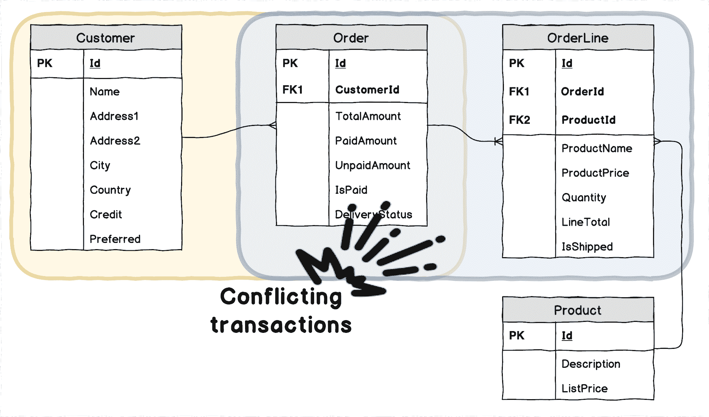
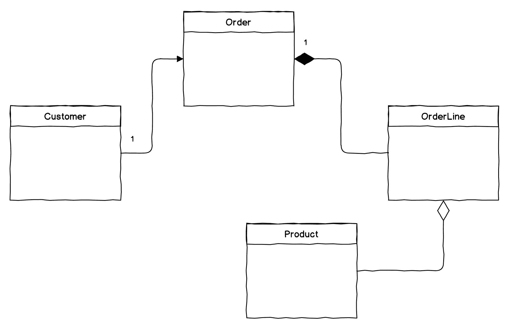
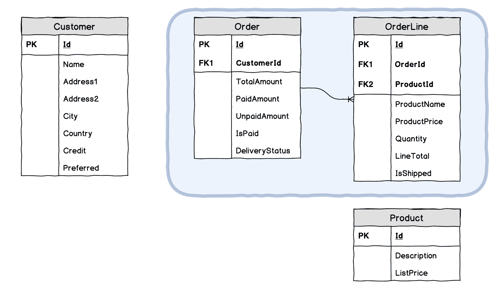
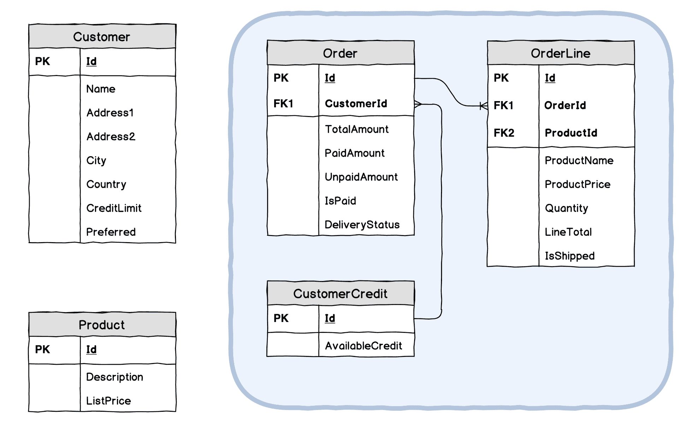
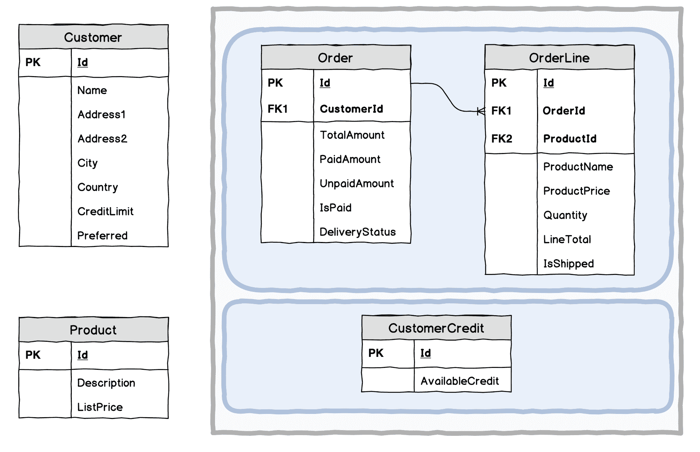
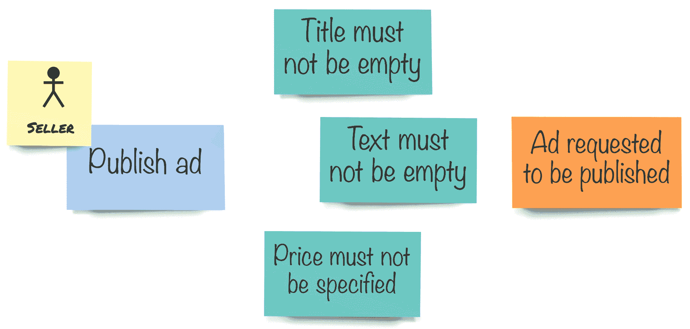

# 第七章：一致性边界

在单体系统中，一切似乎都是完全一致的。为了实现一致性，大量的逻辑被**外包**给数据库引擎，变得隐含，一眼难以看出，难以测试。数据库事务经常被用来确保一次执行多个状态变更。如果数据变得不一致，通常意味着失败，这需要广泛的调查来解决问题。

**领域驱动设计**（**DDD**）意味着避免实体复杂图。相反，开发者需要找到一组最小逻辑实体，这些实体属于一起，因此需要一起更新以确保一致性。这样一组实体被称为**聚合**。

本章将涵盖以下主题：

+   命令处理作为工作单元

+   一致性和事务

+   聚合和聚合根模式

+   约束和不变性

# 技术要求

本章的代码可以在 GitHub 上书籍仓库的`Chapter07`文件夹中找到。由于我们还没有使用任何基础设施组件（我们将在下一章开始使用一些），你仍然只需要 IDE 或代码编辑器。仓库中的代码代表章节的最终版本，如果你想跟上，你可以使用上一章的代码作为起点。

# 领域模型一致性

当谈到建模时，我们经常听到数据模型需要成为任何系统的中心。*如果你想有一个好的系统，你需要一个好的数据模型*。我在作为软件工程师的职业生涯中无数次听到这句话。我的一个同事曾经说过这句话，然后补充说：*我参与了一个大型项目，我们一开始就定义了数据模型，经过十八个月后，项目被关闭，因为模型不完整*。奇怪的是，这两句话对他来说没有造成任何因果关系，因为第一句话是一个公理，而项目失败似乎是由许多原因造成的，而不是因为为复杂系统设计单个数据模型总是死亡行军——许多表，通过外键直接和间接地连接在一起，无尽地追求第三范式以避免数据重复，导致检索有意义数据集的查询变得非常复杂——这些都是采取这种方法的现实。

如果我们首先创建数据模型，然后尝试围绕它创建代码，那么很难理解为什么某些规则被强制执行，为什么那些表中的列是强制性的，以及为什么一个表与另一个表之间存在多对多关系。这些关系也很难测试，即使我们有测试，我们也只能在有一个正确配置的数据库和预填充数据集的情况下运行它们，因此我们的测试也变得以数据库为中心。

当领域模型本质上与持久化分离，并且主要设计用于服务特定的业务规则时，DDD 倡导一种不同的方法。当我们处理领域模型时，我们的设计目标是不同的。我们需要在我们的类中封装足够的信息，以确保我们的模型在任何状态转换后都能保持一致性。我们这里所说的这种一致性不是可以**外包**给数据库引擎的关系数据库一致性。相反，我们希望确保我们的对象不会违反由业务定义的规则，并且这些规则需要显式地在代码中定义。让我们看看我们可以应用哪些原则，以及我们如何在以领域模型为中心的设计方法中定义不同类型的边界。

# 事务边界

正如我们之前讨论的，命令表达了用户对系统进行某种操作的意图。可能命令来自另一个系统，甚至来自计时器，但它仍然表达了某种意图。在处理命令之前，我们的领域模型处于一个有效状态。当命令被处理时，领域模型也应该处于一个有效状态。这可能是一个新状态，如果命令处理导致执行了操作，或者与之前相同的状态，如果命令处理失败。

让我们看看我们在上一章中创建的命令处理代码：

```cs
private async Task HandleUpdate(Guid classifiedAdId, Action<ClassifiedAd> operation)  
{  
    var classifiedAd = await _store.Load<ClassifiedAd>(
        classifiedAdId.ToString());  
    if (classifiedAd == null)  
        throw new InvalidOperationException(  
            $"Entity with id {classifiedAdId} cannot be found");  

    operation(classifiedAd);  

    await _store.Save(classifiedAd);  
}
```

这是一个针对任何不创建 `ClassifiedAd` 实例的新实例且不删除现有实例的操作的通用处理程序。我们之所以能够这样泛化命令处理，仅仅是因为所有命令都是以类似的方式处理的：

+   通过实体 ID 从存储中检索实体

+   执行一个操作

+   将更改提交回存储

如果操作失败，或者存储无法通过给定的 ID 找到任何内容，处理程序将抛出异常。

对于本章，前述代码和在我们应用程序服务处理命令时执行的一系列步骤中，最重要的是我们只对**单个实体**执行操作。

让我们看看为什么会有这种情况，为此，我们需要反思一种非常常见的实现业务应用的方式，即数据库是应用所做的一切的中心。我们将以电子商务领域为例，因为它相对复杂，代码不会干扰我们与 `Marketplace` 应用当前的工作。

如果你有多年的 .NET 软件开发经验，你可能见过许多包含此类方法的代码库：

```cs
[Route("/api/order/pay/credit/{orderId}")]  
public async Task TakeOnCustomerCredit(int orderId)  
{  
    using (var context = new CommerceContext())  
    using (context.Database.BeginTransaction())  
    {  
        var order = await context.Orders  
            .Where(x => x.Id == orderId).FirstAsync();  

        var amount = order.UnpaidAmount;  

        var customer = order.Customer;  
        if (customer.Credit < amount)  
            throw new InvalidOperationException("Not enough credit");  

        customer.Credit -= amount;  
        order.PaidAmount += amount;  
        order.UnpaidAmount -= amount;  
        customer.TotalSpent += amount;  

        if (customer.TotalSpent > CommerceConstants.PreferredLimit)  
            customer.Preferred = true;  

        order.IsPaid = order.UnpaidAmount == 0;  

        await context.SaveChangesAsync();  
    }  
}
```

这里，控制器似乎在完成一个单一的逻辑操作，它可能看起来就像直接在 HTTP 端点请求处理方法中处理命令。操作似乎是隔离和简洁的。说实话，在我的职业生涯中，我见过很多更糟糕的代码，其中用户的单个请求会导致许多无关的数据库操作，但让我们坚持这个例子，因为它一开始看起来相当合理。所以，这段代码使用了**工作单元**模式，并且封装在`using`块中的`DbContext`实现了这个模式，因为它将所有更改累积在数据库元素中，并在我们调用`context.SaveChangesAsync()`时一次性提交这些更改。

让我们看看与这段代码相关的数据模型：


简化的电子商务数据模型

当然，我们可能期望在整体模型中有更多的表。它可能包括像`Product`、`Supplier`和`Shipment`这样的东西。对于我们来说，只有这四个表就足够了。这些表都与其他表有关，而这些关系都是一对一（或零对多）。我们的 Entity Framework 模型使用`Order`和`Customer`之间的对象引用。这种引用在 ORM 框架中使用时非常流行，因为它给开发者带来了便利。我们可以通过使用`order.Customer`属性来访问与特定订单关联的`Customer`对象，并按我们的意愿修改任何`Customer`属性，这正是代码所做的。它在一个逻辑操作中更改订单和客户的属性。这个操作需要完全完成，或者失败。我们不能容忍客户信用金额减少但订单未支付的情况。这种行为通常与数据库事务相关。事务以四个原则为特征，被称为**ACID**：

+   原子性

+   一致性

+   隔离性

+   持久性

现在，让我们专注于原子性。这个特性意味着事务内的所有操作必须全部完成，或者根本不发生，这通常被称为**全有或全无**命题。

在前面的代码中，我们可以看到事务正在封装整个使用客户信用支付订单的整个操作。这是正确的，我们在这里处理的是**事务边界**。对于那个特定的方法`TakeOnCustomerCredit`，事务边界将包括两个表——`Customer`和`Order`。如果我们想象在同一个模型上的另一个操作，那可能就像这样：

```cs
public async Task ShipOrderLine(int orderLineId)  
{  
    using (var context = new CommerceContext())  
    using (context.Database.BeginTransaction())  
    {  
        var orderLine = await context.OrderLines  
            .Where(x => x.Id == orderLineId)
            .FirstAsync();  

        orderLine.IsShipped = true;  

        orderLine.Order.DeliveryStatus =  
            orderLine.Order.OrderLines.All(x => x.IsShipped)  
                ? DeliveryStatus.Shipped  
                : DeliveryStatus.PartiallyShipped;  

        await context.SaveChangesAsync();  
    }  
}
```

这个方法仍然使用相同的模型，并且有几个令人担忧的问题。但是，现在，让我们看看我们在这里处理的是哪种事务边界。在这个工作单元中，我们在`Order`和`OrderLine`表中有一个事务中更改的记录。

这两个代码片段显示了在*传统*分层架构中，由于没有真正的领域模型，事务边界是由任何执行数据库更改的代码片段故意决定的。模型本身并不强制执行任何类型的边界。两种方法，甚至可能位于一个控制器类中，操作两个不同的事务边界，尽管这两个方法都更改的`Order`表将是两个事务的一部分。很容易想象，通过调用`TakeOnCustomerCredit`方法在客户信用上处理剩余订单支付可能会并行发生，其中一条订单行通过`ShipOrderLine`方法标记为已装运：



由于不同原因的更新导致不合理的冲突事务

从业务逻辑的角度来看，这两个操作是不同的，但由于 ACID 的*一致性*部分，其中一种方法将会失败。对于这个系统的用户来说，了解到信用和支付处理与装运和交付以某种方式相关是非常奇怪的。

这种模型出现的原因非常清楚。编程中面向对象方法的定义本身就声明，软件程序中的对象代表现实世界中的对象。

数据模型遵循类似的方法。非常常见的是，我们看到一个系统有一个全局数据模型，它紧密地代表了现实世界的模型，涵盖了系统实现的领域所有方面。这自然导致代码中出现了反映这种整体数据模型的大型对象图。尽管如此，领域驱动设计（DDD）在需要集中建模时倡导另一种方法；只需要实现系统的一组用例所必需的现实世界模型方面。我们已经在第四章，*设计模型*中提到了建模的这个基本方面。

让我们看看我们如何构建我们的模型，以便我们可以定义事务边界，这样当我们的软件需要执行操作于同一现实世界对象时，不同的用例将不会相互冲突，尽管这些对象在软件模型中可以由不同的对象表示，甚至属于不同的模型。

# 聚合模式

在本章前面我们处理的数据模型的情况下，我们有一个组合——`Order`是`OrderLine`元素的组合。你可能知道如果我们从数据模型移动到类图，这个模型会是什么样子：



UML 中的聚合

在 UML 中，组合意味着子元素不能在没有其父元素的情况下存在。确实，拥有没有与任何订单关联的订单行是没有意义的。这样的组合作为一个整体形成一个逻辑上不可分割的结构，尽管在这个结构内部，我们可以找到单个元素。对于外部世界来说，一个订单包括其订单行，被视为一个整体，尽管订单可以有多个订单行。在 DDD 中，这样的结构被称为**聚合体**。由于我们之前使用了一段时间的 UML，可能会造成一些混淆，因为在 UML 中，聚合意味着其他含义，而 DDD 聚合体最接近的类比是 UML 的概念组合。聚合体与 UML 组合共享相同的命题，即父对象由或拥有所有子对象，当父对象被移除时，所有子对象也必须被移除，因为这些对象的存在就没有意义了。聚合体的父对象被称为**聚合根**。具有单个父对象的复杂对象图可以像一棵树一样可视化，其中父对象是所有树枝生长的地方，因此根的类比非常合理。

然而，聚合体不仅仅是类的组合。聚合边界还充当事务边界。为了本章的目的，我们将集中讨论其两个方面——**原子性**和**一致性**。正如之前提到的，事务意味着操作的全有或全无原则。无论聚合体如何持久化，聚合体都会作为一个整体改变其状态。如果我们使用 ORM 工具，并且我们的聚合体跨越多个数据库表，那么对这些表的所有操作都需要被包含在一个数据库事务中。此外，一致性方面要求聚合体确保在执行在该聚合体上的所有操作时，聚合体的状态正在被验证。因此，它不是数据库或代码，这些代码不是聚合体本身的一部分，例如 API 控制器或应用程序服务。与前面的代码不同，所有这些有效性检查都需要是聚合体代码的一部分，因此它们需要在领域模型内部实现。

我们已经有很多聚合体的特性，所以我们可以看到这个模式是如何应用到我们前面的示例中的。如果我们从数据模型开始看，我们可能会怀疑`Order`和`OrderLine`形成某种组合，因为`OrderLine`记录不能在没有父`Order`的情况下存在。这适用于原子性和一致性。如果我们因为订单中的一行被标记为已发货而更改订单状态——这些更改需要一起执行；否则，订单状态将变得无效——我们可能会得到一个状态为*待处理*的订单，而其中一个订单行已经被标记为已发货。因此，我们预计这样的订单将有一个*部分交付*的状态，如果这不是情况，那么我们的订单状态就不有效。由于我们知道订单行是一个子对象，我们并不真的希望从域模型外部直接暴露任何关于订单行的操作。如果订单行由`Order`类本身操作，那就更有意义了。在这种情况下，`Order`类成为我们的聚合根，它将拥有改变其行状态的方法。

同时，聚合体不保证任何外部于聚合体的一致性约束。对于关系数据模型来说，这意味着我们无法在用于持久化我们的聚合根（`Order`）的表和聚合边界之外的东西之间有引用完整性。

如果我们对数据模型进行一些修改以反映新的洞察，它看起来会是这样：



移除引用创建显式边界

注意，现在`Order`和`Customer`表以及`OrderLine`和`Product`表之间的关系已经不存在了，但我们保留了引用字段——`CustomerId`和`ProductId`。我们仍然需要知道客户是否下过订单以及我们正在销售哪些产品。然而，就我们系统的正常操作而言，我们不需要对象引用在对象关系映射（ORM）中，一些开发者可能认为这是隔离聚合体的负面副作用，但实际上，这给了我们一个新的自由度。例如，如果用于这些行号的产品停止销售并被从`Product`表中删除，订单行需要保持完整。我们不会讨论标志和其他软删除方法，因为我正在努力将这些事情分开。

现在我们来看看 API 控制器代码会是什么样子：

```cs
public async Task ShipOrderLine(int orderId, int orderLineId)  
{  
    var order = await _orderRepository.Get(orderId);  
    order.ShipOrderLine(orderLineId);  
    await _orderRepository.Commit();  
}
```

这确实是一个很大的变化，不是吗？当然，逻辑并没有消失；它已经移动到了`Order`类本身：

```cs
public void ShipOrderLine(int orderLineId)  
{  
    var orderLine = OrderLines.First(x => x.Id == orderLineId);  

    orderLine.IsShipped = true;  

    DeliveryStatus =  
        OrderLines.All(x => x.IsShipped)  
            ? DeliveryStatus.Shipped  
            : DeliveryStatus.PartiallyShipped;  
}
```

如您所见，现在可以移除双向对象引用对于订单行的意外复杂性。另一方面，我们必须更改 API，因为我们不能仅仅请求订单行的 ID。我们需要知道订单 ID，因为订单行的 ID 是特定订单内部的，而我们正在使用我们的聚合根来访问其子元素。

当然，更复杂的操作现在需要更多的工作。我们如何执行像`TakeOnCustomerCredit`方法所做的那样的事情？由于我们之间没有`Customer`和`Order`对象之间的对象关系，并且我们已经决定我们的聚合包含所有关于`order`处理的方面，但不包括`Customer`，我们不能在这两个不同的对象上完成一个事务。这听起来可能是一个不可能的任务，而且通常，这样的困境会导致权宜之计和捷径，然后聚合模式被视为一种阻碍，需要在某些特定情况下被忽略。实际上，我们需要做的是相反的。我们必须回到建模空间，以了解更多关于这个问题。

回顾方法代码，我们可以看到它执行以下操作：

+   检查客户是否有足够的信用来支付与订单相关的未支付金额

+   减少订单未支付金额的客户信用金额

+   增加订单的已支付金额

+   减少订单的未支付金额

+   如果未支付金额为零（对于该代码，它始终为真），则将订单状态设置为*paid*

+   通过支付金额增加客户的总支出金额

+   如果这位客户的花费超过某个阈值，则将客户升级到*首选*状态

这相当多，现在我们将利用聚合的力量来使整个流程更有意义。

首先，我们需要检查哪些内容不属于这里。第一个候选方案是对列表中的最后两个动作进行评估：更新总支出金额和升级客户。看起来似乎在采取信用支付之后，不仅对信用卡，对现金和任何其他类型的支付也发生了某些事情。保留这段代码意味着我们需要复制粘贴它或者有一些共享代码。这些替代方案中没有一个真正吸引人。最重要的是，这两个动作与订单处理顺序无关。想象一下其中任何一个动作失败。这种失败不应该对订单处理有任何影响。

然后，我们需要检查为了完成操作我们需要知道和做什么。在我们的情况下，我们必须确保剩余的信用额度高于或等于订单的未支付金额。为了我们的代码就是否进行信用支付做出决定，我们需要有订购客户的可用信用额度信息。但是，这些细节现在超出了我们的聚合范围，所以我们能做些什么来确保订单不会违反一致性规则呢？

接下来，我们来看另一个关于新兴聚合边界方面的方面，我们需要评估我们系统所处理的对象变化的速度。`Customer` 对象现在包含一些构成客户档案的信息——姓名、地址等。同时，它包含一些可能随每个我们处理的订单而变化的财务细节。从我们的代码中可以看出，当我们处理订单时，我们没有任何规则为那些姓名以 *A* 开头或位于比利时的客户提供折扣。我们可能会因为物流原因想象这样的要求，但这与我们的例子无关。我们的结论应该是，客户档案信息很少改变，而剩余的客户信用额度则相当频繁地改变。同时，关于总允许信用额度的信息可能仍然属于客户档案，并且也很少改变。这意味着我们正在处理客户细节的两个不同方面：

| 客户档案 | 客户信用额度 |
| --- | --- |
| 姓名、地址、总信用额度 | 可用信用额度 |
| 有时改变 | 每个信用订单改变 |
| 无订单处理规则 | 保持订单处理一致性所必需 |

我们最终得出结论，我们的*整体* `Customer` 对象不适合这些不同的用例。我们模型的解决方案是将确保订单处理一致性所需的信息以及需要移动的业务规则移得更接近订单处理逻辑。我们可以通过将我们的 `Customer` 实体分成两个，每个都负责其自己的用例集来实现这一点。我们甚至可以给新的实体一个更明确的名称：`CustomerCredit`，以表达此信息的特定用途。我们的图表将看起来像这样：



将所有相关关注点移动到一个边界

实际上，我们在这里所做的工作更属于寻找语言和上下文边界，这个主题将在第九章[6f50ee65-024a-4c46-89c8-343183b05b8f.xhtml]，*CQRS - 读取侧*中更详细地介绍。现在，我们将继续只讨论聚合边界。 

我们的新模型看起来更好，但它有一个问题——聚合现在已转移到`CustomerCredit`实体，并且它似乎变成了我们的聚合根。从关系一致性角度来看，这是完全正常的。从另一个角度来看，通过在`CustomerCredit`实体上调用方法来处理所有订单看起来很奇怪。另一个负面方面是对象的所有权也发生了变化。以前，我们有`Order`，它负责其`OrderLine`。现在，我们有`CustomerCredit`，它负责一切。看起来如果我们从系统中删除`CustomerCredit`对象，我们也需要删除所有相关的订单。这绝对不是我们需要的。客户来来去去，但我们绝对需要跟踪所有订单，包括完成的订单，并且不能删除它们。在这种情况下，我们可以清楚地看到拥有一个较大的、具有可疑支持实体责任的聚合的缺点。

还重要的是要记住，尽管存在约束，但在我们可以继续处理订单之前，我们需要有足够的信用来覆盖订单总额，因为即使违反了此约束，订单本身也可能是有效的。订单有其自己的不变量——一组不可打破的规则，保证了每个订单的一致性。让我们看看`Order`聚合有哪些不变量：

+   `PaidAmount`和`UnpaidAmount`的总和应等于`TotalAmount`。

+   如果对于所有具有`IsShipped`属性的订单行，此属性设置为`true`，则订单的`DeliveryStatus`才能设置为`Delivered`。

+   订单的`TotalAmount`必须等于所有订单行的`LineTotal`之和。

+   对于每个订单行，`LineTotal`必须等于`ProductPrice`乘以`Quantity`。

如您所见，在这些不变量中没有任何内容要求我们知道客户的可用信用或有关产品的任何信息等。因此，为了决定一个订单是否一致，我们只需要有关订单及其所有行的详细信息就足够了。

关于所有权，很明显，单个订单行不能脱离其所属的订单而存在。

因此，我们的最终举措将是断开订单和客户之间的关系，即使对于更明确的`CustomerCredit`实体也是如此，同时保持`Order`和`OrderLine`实体之间的聚合：



缩小边界可以减少事务范围

在这个模型中，我们有两个聚合在系统的一个隔离部分。我们知道这些聚合需要位于相同的上下文边界内，但它们需要分离，并形成不同的事务和一致性边界，原因是我们之前讨论过的。现在，问题出现了，如果订单没有关于订购客户可用信用的信息，我们如何从聚合对象图中强制执行我们的约束。我们将利用领域服务的力量来执行此检查。

在我们的领域项目中，我们可以为这样的领域服务定义一个接口：

```cs
public interface ICustomerCreditService
{
    Task<bool> EnsureEnoughCredit(int customerId, decimal amount);
}
```

注意，我们有一个返回布尔值的`EnsureEnoughCredit`方法，而不是直接返回可用的信用额度。通过这样做，我们强制使用通用语言，并将信用额度检查逻辑转移到领域服务。例如，服务可能会决定对于优先客户，我们可以允许超过可用额度的透支。当然，在这种情况下，我们还需要将`Preferred`属性移动到`CustomerCredit`实体。

然后，我们可以使用我们的应用程序服务来处理`TakeOnCustomerCredit`命令，其中它将使用领域服务来检查此命令是否可以处理：

```cs
public class OrderHandlingApplicationService
{
    private readonly IOrderRepository _orderRepository;
    private readonly ICustomerCreditService _customerCreditService;

    public OrderHandlingApplicationService(
        IOrderRepository orderRepository, 
        ICustomerCreditService customerCreditService)
    {
        _orderRepository = orderRepository;
        _customerCreditService = customerCreditService;
    }

    public async Task Handle(TakeOnCustomerCredit command)
    {
        var order = await _orderRepository.Get(command.OrderId);
        var hasEnoughCredit = 
            await _customerCreditService.EnsureEnoughCredit(
                command.CustomerId,
                order.UnpaidAmount);
        if (!hasEnoughCredit)
            throw new DomainException(
                $"Not enough credit for order {command.OrderId}");

        order.TakeOnCredit();
    }
}
```

我必须提到，将客户信用移至单独的实体可能会因为竞争条件而导致信用金额低于零的情况。在单独的事务中应用信用额度变更时，您可能想要检查操作结果是否为负值，然后决定如果结果为负值时应该做什么。一种可能的技术是通过电子邮件通知账户经理这种情况，并让他们与客户解决。从技术角度来看，可以创建一个补偿操作，将订单挂起，直到问题解决。总的来说，这些决策永远不应该被视为技术问题。与领域专家交谈，并询问他们更喜欢哪种解决方案。

这种方法将一些领域逻辑移动到应用程序服务，而在某些情况下这可能不是所希望的。为了解决这个问题，我们可以使用双重分派模式，并让`Order`聚合决定约束。如果我们决定使用双重分派，它将看起来像这样：

```cs
public class Order : Aggregate<OrderId>
{
    public async Task TakeOnCredit(ICustomerCreditService customerCreditService)
    {
        var hasEnoughCredit = 
            await _customerCreditService.EnsureEnoughCredit(
                command.CustomerId,
                order.UnpaidAmount);
        if (!hasEnoughCredit)
            throw new DomainException(
                $"Not enough credit for order {command.OrderId}");

        // actual domain logic here
    }
}
```

然后，应用程序服务在调用聚合根方法时将传递依赖项：

```cs
public async Task Handle(TakeOnCustomerCredit command)
{
    var order = await _orderRepository.Get(command.OrderId);
    await order.TakeOnCredit(_customerCreditService);
}
```

可能看起来我们正在创建领域模型和基础设施之间的依赖关系，因为很明显领域服务需要获取`CustomerCredit`实体以获取数据。然而，我们的`Order`聚合根只获取接口依赖，如您所记得的，该接口本身是在领域项目中定义的。其实施确实位于应用程序内部，但这完全正常。

我们还没有看到我们的聚合是如何保护其不变量的，但现在是我们回到我们的`Marketplace`应用并添加一些代码的时候了，基于我们迄今为止对聚合的了解。我们还需要涵盖聚合持久化，因为我们已经使用了负责从数据库获取聚合状态的`IOrderRepository`接口。

# 保护不变量

在第五章“实现模型”中，我们讨论了使用值对象来防止无效值甚至被用作实体构造函数和方法参数。这项技术允许我们将许多检查移动到值对象中，提供了良好的封装，并实现了类型安全。然后，当我们创建一个新的实体或使用实体方法执行某些行为时，我们需要执行进一步的检查。由于我们可以相当肯定所有参数已经包含有效的单个值，我们需要确保给定的参数组合、当前实体状态和执行的行为不会使实体进入一个无效状态。

保护内部状态不被无效，从而防止模型进入不一致状态，是聚合最重要的特性之一。聚合的不变量必须在触发状态变化的每个操作中满足；因此，我们需要确保在调用聚合上的任何命令方法时控制聚合状态。

让我们来看看我们为我们的分类广告实体制定了哪些复杂规则。为了找到这些规则，我们可以使用我们在第三章“事件风暴”中详细的事件风暴会议的一些便签，并将它们放在图表上，如下所示：



业务规则可以防止命令执行

# 分析命令的约束

我们将命令放在左边，事件放在右边，并试图找出什么可能阻止我们的命令以产生预期结果（事件）的方式执行。在我们的案例中，我们需要确保在广告被放入审查队列之前，它必须有一个非空的标题、文本和价格。

我们不能将这些检查与值对象结合使用，因为广告在发送到审查之前可以有一个空的标题和文本，并且可以没有价格。只有当给定命令正在执行时，我们才需要检查这些约束是否得到满足。这就是我们所说的这个实体的不变量——一个处于待审查状态的广告不能有一个空的标题、空的文本或零价格。

确保我们的实体永远不会进入一个无效状态至少有两种方法。第一种也是最明显的方法是在操作代码中添加检查。无法请求发布广告，所以让我们添加它，并做一些与使用值对象来表示实体状态的事实相关的更改：

```cs
namespace Marketplace.Domain  
{  
    public class ClassifiedAd  
    {  
        public ClassifiedAdId Id { get; }  

        public ClassifiedAd(ClassifiedAdId id, UserId ownerId)  
        {  
            Id = id;  
            OwnerId = ownerId;  
            State = ClassifiedAdState.Inactive;  
        }  

        public void SetTitle(ClassifiedAdTitle title) => Title = title;  

        public void UpdateText(ClassifiedAdText text) => Text = text;  

        public void UpdatePrice(Price price) => Price = price;  

        public void RequestToPublish()  
        {  
            if (Title == null)  
                throw new InvalidEntityStateException(this, 
                    "title cannot be empty");  

            if (Text == null)  
                throw new InvalidEntityStateException(this, 
                    "text cannot be empty");  

            if (Price?.Amount == 0)  
                throw new InvalidEntityStateException(this, 
                    "price cannot be zero");  

            State = ClassifiedAdState.PendingReview;  
        }  

        public UserId OwnerId { get; }  
        public ClassifiedAdTitle Title { get; private set; }  
        public ClassifiedAdText Text { get; private set; }  
        public Price Price { get; private set; }  
        public ClassifiedAdState State { get; private set; }  
        public UserId ApprovedBy { get; private set; }  

        public enum ClassifiedAdState  
        {  
            PendingReview,  
            Active,  
            Inactive,  
            MarkedAsSold  
        }  
    }  
}
```

在新的实体代码中，我们强制实施从我们的详细模型中显现出来的约束，因此只有在所有约束都得到满足的情况下才会执行操作。为了让调用者知道，如果其中一些检查失败，我们的实体尚未准备好发布，我们使用自定义异常，其实现方式如下：

```cs
using System;  

namespace Marketplace.Domain  
{  
    public class InvalidEntityStateException : Exception  
    {  
        public InvalidEntityStateException(object entity, string 
        message)  
            : base($"Entity {entity.GetType().Name}" +
              $"state change rejected, {message}")  
        {  
        }  
    }  
}
```

在操作方法本身之前检查约束的方法有一个缺点。如果我们现在将价格更改为零，它将通过，因为`UpdatePrice`方法没有检查价格值。当然，我们可以将价格检查复制到`UpdatePrice`方法中，但也可能有更多需要相同测试的方法，我们将继续复制控制块。这将导致一种情况，即如果我们需要更改这些规则中的任何一个，我们需要去许多地方替换所有的检查。这种方法非常容易出错。

为了在一个地方组合规则，我们可以使用合同编程技术。合同编程的一部分可以在值对象中看到，因为我们评估操作方法每个参数的先决条件。当我们执行操作而不进行任何额外的检查时，我们需要进行组合测试（后置条件控制）。这个检查可以在整个实体的一个地方实现，并且每个操作都需要在方法的最后一行调用它。

对于我们的分类广告实体，它可能看起来像这样：

```cs
namespace Marketplace.Domain  
{  
    public class ClassifiedAd  
    {  
        public ClassifiedAdId Id { get; }  

        public ClassifiedAd(ClassifiedAdId id, UserId ownerId)  
        {  
            Id = id;  
            OwnerId = ownerId;  
            State = ClassifiedAdState.Inactive;  
            EnsureValidState();  
        }  

        public void SetTitle(ClassifiedAdTitle title)  
        {  
            Title = title;  
            EnsureValidState();  
        }  

        public void UpdateText(ClassifiedAdText text)  
        {  
            Text = text;  
            EnsureValidState();  
        }  

        public void UpdatePrice(Price price)  
        {  
            Price = price;  
            EnsureValidState();  
        }  

        public void RequestToPublish()  
        {  
            State = ClassifiedAdState.PendingReview;  
            EnsureValidState();  
        }  

        private void EnsureValidState()
        {
            var valid =
                Id != null &&
                OwnerId != null &&
                (State switch
                {
                    ClassifiedAdState.PendingReview =>
                        Title != null
                        && Text != null
                        && Price?.Amount > 0,
                    ClassifiedAdState.Active =>
                        Title != null
                        && Text != null
                        && Price?.Amount > 0
                        && ApprovedBy != null,
                    _ => true
                });

            if (!valid)
                throw new InvalidEntityStateException(
                    this, $"Post-checks failed in state {State}");
        }

        public UserId OwnerId { get; }  
        public ClassifiedAdTitle Title { get; private set; }  
        public ClassifiedAdText Text { get; private set; }  
        public Price Price1 { get; private set; }  
        public ClassifiedAdState State { get; private set; }  
        public UserId ApprovedBy { get; private set; }  

        public enum ClassifiedAdState  
        {  
            PendingReview,  
            Active,  
            Inactive,  
            MarkedAsSold  
        }  
    }  

}
```

正如你所见，我们添加了一个名为`EnsureValidState`的方法，它检查在任何情况下，实体状态都是有效的，如果不是有效，将抛出异常。当我们从任何操作方法调用此方法时，我们可以确信无论我们试图做什么，我们的实体都将始终处于有效状态，或者调用者将得到异常。

当实体变得无效时抛出异常是防止不一致性最简单的方法，但它有其缺点。整个应用程序需要能够优雅地处理此类异常，以便用户得到适当的告知。

例如，本章的 Web API 代码没有这样做，并期望所有操作都成功执行。因此，当我们尝试执行将实体带到某些错误状态的命令时，将使 API 方法崩溃，并通过 HTTP 返回异常。随着我们的进展，我们将改进 Web API 代码，并开始从 API 返回适当的错误结果。

当使用事件溯源时，暴露不正确操作的一种技术是发出领域事件，如`PriceChangeDenied`，它包括应用程序尝试应用于实体的所有值，但失败了。使用这种方法为开发者提供了一个强大的工具，可以找出为什么某些命令没有执行，甚至可能发现用户的恶意行为。

此外，我们将所有私有字段转换为公共只读属性。我们需要公共属性来编写测试，尽管我们不一定需要公开内部实体状态。为了防止在操作方法之外设置这些属性的值，所有属性都有私有设置器，或者对于在构造函数中设置的属性没有设置器。

现在，让我们编写一些测试来确保我们的约束起作用：

```cs
using System;  
using Marketplace.Domain;  
using Xunit;  

namespace Marketplace.Tests  
{  
    public class ClassifiedAd_Publish_Spec  
    {  
        private readonly ClassifiedAd _classifiedAd;  

        public ClassifiedAd_Publish_Spec()  
        {  
            _classifiedAd = new ClassifiedAd(  
                new ClassifiedAdId(Guid.NewGuid()),   
                new UserId(Guid.NewGuid()));  
        }  

        [Fact]  
        public void Can_publish_a_valid_ad()  
        {  
            _classifiedAd.SetTitle(
                ClassifiedAdTitle.FromString("Test ad"));  
            _classifiedAd.UpdateText(
                ClassifiedAdText.FromString("Please buy my stuff"));  
            _classifiedAd.UpdatePrice(  
                Price.FromDecimal(100.10m, "EUR", 
                    new FakeCurrencyLookup()));  

            _classifiedAd.RequestToPublish();  

            Assert.Equal(
                ClassifiedAd.ClassifiedAdState.PendingReview,  
                _classifiedAd.State);  
        }  

        [Fact]  
        public void Cannot_publish_without_title()  
        {  
            _classifiedAd.UpdateText(
                ClassifiedAdText.FromString("Please buy my stuff"));  
            _classifiedAd.UpdatePrice(  
                Price.FromDecimal(100.10m, "EUR", 
                    new FakeCurrencyLookup()));  

            Assert.Throws<InvalidEntityStateException>(
                () => _classifiedAd.RequestToPublish());  
        }  

        [Fact]  
        public void Cannot_publish_without_text()  
        {  
            _classifiedAd.SetTitle(
                ClassifiedAdTitle.FromString("Test ad"));  
            _classifiedAd.UpdatePrice(  
                Price.FromDecimal(100.10m, "EUR", 
                    new FakeCurrencyLookup()));  

            Assert.Throws<InvalidEntityStateException>(
                () => _classifiedAd.RequestToPublish());  
        }  

        [Fact]  
        public void Cannot_publish_without_price()  
        {  
            _classifiedAd.SetTitle(
                ClassifiedAdTitle.FromString("Test ad"));  
            _classifiedAd.UpdateText(
                ClassifiedAdText.FromString("Please buy my stuff"));  

            Assert.Throws<InvalidEntityStateException>(
                () => _classifiedAd.RequestToPublish());  
        }  

        [Fact]  
        public void Cannot_publish_with_zero_price()  
        {  
            _classifiedAd.SetTitle(
                ClassifiedAdTitle.FromString("Test ad"));  
            _classifiedAd.UpdateText(
                ClassifiedAdText.FromString("Please buy my stuff"));  
            _classifiedAd.UpdatePrice(  
                Price.FromDecimal(0.0m, "EUR", 
                    new FakeCurrencyLookup()));  

            Assert.Throws<InvalidEntityStateException>(
                () => _classifiedAd.RequestToPublish());  
        }  
    }  
}
```

此规范包含针对一个操作（发布或提交审查）的多个测试，具有不同的前提条件。在这里，我们测试在广告可以提交审查之前，所有必要的细节都正确设置时的愉快路径；我们还测试了几个不允许发布的情况，因为缺少必要的信息。也许测试负面场景甚至更为重要，因为当愉快路径不起作用时，很容易发现——您的用户会立即抱怨。测试负面场景可以防止在控制实体不变性时出现错误，这反过来又防止实体变得无效。

当我们将实体状态检查移动到一个方法中时，我们实际上建立了一套需要为每个操作执行的全面规则。这意味着这些规则不再是命令特定的，我们的`EnsureValidState`方法已经成为整个对象的守护者。它保护了`ClassifiedAd`实体的不变性，使其永远不会变得无效。能够保护其自身的不变性是聚合模式的主要方面之一。通过在单个事务中为`ClassifiedAd`实体执行每个命令，并通过建立不变性保护，我们创建了我们的第一个聚合。

现在，我们已经学会了如何保护我们的实体免于变得无效。但是，我们预计我们的应用程序中会出现更多的实体，`ClassifiedAd`实体的代码变得相当冗长，因为我们必须在每个操作中调用`EnsureValidState`方法。此外，确实有可能忘记在实体方法中放置调用，然后有机会在不抛出任何异常的情况下将实体置于无效状态。然而，如果我们想要一个真正的聚合，这种情况是不可能发生的，所以让我们看看我们如何利用事件的力量来确保所有操作的状态有效性。

# 强制执行规则

让我们现在检查我们如何在实体上执行操作：

+   调用实体方法进行操作（CQS 命令）

+   该方法发出一个事件

+   然后将事件应用于实体状态以执行状态转换

因此，如果我们想确保所有状态转换都不会破坏我们的不变性，我们可以将调用`EnsureValidState`的方法移动到`Apply`方法中。需要保护其状态仅适用于聚合根实体，因为它必须确保整个聚合状态是正确的，而不仅仅是其自身状态的有效性。因此，我们可以为这种特殊类型的实体创建一个新的基类：

```cs
using System.Collections.Generic;
using System.Linq;

namespace Marketplace.Framework
{
    public abstract class AggregateRoot<TId>
        where TId : Value<TId>
    {
        public TId Id { get; protected set; }

        protected abstract void When(object @event);

        private readonly List<object> _changes;

        protected AggregateRoot() => _changes = new List<object>();

        protected void Apply(object @event)
        {
            When(@event);
            EnsureValidState();
            _changes.Add(@event);
        }

        public IEnumerable<object> GetChanges() 
            => _changes.AsEnumerable();

        public void ClearChanges() => _changes.Clear();

        protected abstract void EnsureValidState();
    }
}
```

在这里，我们将 `_events` 集合重命名为 `_changes`，以使命名更加明确。我们还向 `Apply` 方法中添加了对 `EnsureValidState` 的调用。这意味着每次我们执行旨在更改聚合根实体状态的操作时，我们都会在 `When` 方法中应用一个新的事件，并改变状态。然而，在将新事件添加到更改列表之前，我们会检查新状态是否有效，以及是否没有违反任何不变性。如果新状态违反了不变性，我们会抛出一个异常。

在我们将 `ClassifiedAd` 类重构为使用新的基类之后，代码变得更加简单：

```cs
using Marketplace.Framework;
using static Marketplace.Domain.Events;

namespace Marketplace.Domain
{
    public class ClassifiedAd : Entity<ClassifiedAdId>
    {
        public ClassifiedAdId Id { get; private set; }
        public UserId OwnerId { get; private set; }
        public ClassifiedAdTitle Title { get; private set; }
        public ClassifiedAdText Text { get; private set; }
        public Price Price { get; private set; }
        public ClassifiedAdState State { get; private set; }
        public UserId ApprovedBy { get; private set; }

        public ClassifiedAd(ClassifiedAdId id, UserId ownerId) =>
            Apply(new ClassifiedAdCreated
            {
                Id = id,
                OwnerId = ownerId
            });

        public void SetTitle(ClassifiedAdTitle title) =>
            Apply(new ClassifiedAdTitleChanged
            {
                Id = Id,
                Title = title
            });

        public void UpdateText(ClassifiedAdText text) =>
            Apply(new ClassifiedAdTextUpdated
            {
                Id = Id,
                AdText = text
            });

        public void UpdatePrice(Price price) =>
            Apply(new ClassifiedAdPriceUpdated
            {
                Id = Id,
                Price = price.Amount,
                CurrencyCode = price.Currency.CurrencyCode
            });

        public void RequestToPublish() =>
            Apply(new ClassidiedAdSentForReview {Id = Id});

        protected override void When(object @event)
        {
            switch (@event)
            {
                case ClassifiedAdCreated e:
                    Id = new ClassifiedAdId(e.Id);
                    OwnerId = new UserId(e.OwnerId);
                    State = ClassifiedAdState.Inactive;
                    break;
                case ClassifiedAdTitleChanged e:
                    Title = new ClassifiedAdTitle(e.Title);
                    break;
                case ClassifiedAdTextUpdated e:
                    Text = new ClassifiedAdText(e.AdText);
                    break;
                case ClassifiedAdPriceUpdated e:
                    Price = new Price(e.Price, e.CurrencyCode);
                    break;
                case ClassidiedAdSentForReview _:
                    State = ClassifiedAdState.PendingReview;
                    break;
            }
        }

        protected override void EnsureValidState()
        {
            var valid =
                Id != null &&
                OwnerId != null &&
                (State switch
                {
                    ClassifiedAdState.PendingReview =>
                        Title != null
                        && Text != null
                        && Price?.Amount > 0,
                    ClassifiedAdState.Active =>
                        Title != null
                        && Text != null
                        && Price?.Amount > 0
                        && ApprovedBy != null,
                    _ => true
                });

            if (!valid)
                throw new InvalidEntityStateException(
                    this, $"Post-checks failed in state {State}");
        }

        public enum ClassifiedAdState
        {
            PendingReview,
            Active,
            Inactive,
            MarkedAsSold
        }
    }
}
```

如你所见，所有条件现在都集中在一个地方，无论我们做什么，我们都无法发布一个没有价格或没有文本的广告。同样，在应用程序的任何其他地方也不可能存在隐藏的 bug，这可能会在没有首先获得批准的情况下使广告变得活跃并可见。这种确保状态有效性的技术始终非常强大，它还通过给开发者提供线索，告诉他们在试图找出实体必须遵守的所有规则时可以查看哪些地方，从而提高了我们代码的可读性。

# 聚合内的实体

可能看起来有些奇怪，我们刚刚添加了一个名为 `AggregateRoot` 的基类，并用它来代替我们之前已有的 `Entity` 类。我们本可以直接向 `Entity` 基类中添加新代码。然而，这样做是有意为之的，因为，正如你可能记得的，聚合可以潜在地形成更大的对象图，除了根实体之外，我们还可能有几个实体将成为根的子实体。我们已经讨论了所有权策略，所以当一个聚合被移除时，聚合根及其所有子实体也会从系统中移除。

对于所有子对象，我们将讨论值对象或实体，因为聚合模式的规则非常严格。这些子对象中的任何一个都不应该在聚合边界之外被引用、访问或操作。对聚合的所有操作都需要通过调用聚合根的方法来执行。同样，访问聚合内部任何子对象也需要通过聚合根进行。

让我们通过向我们的 `ClassifiedAd` 聚合添加一个实体来阐述这个原则。我们的一次 EventStorming 会话帮助我们发现，我们需要将图片添加到广告中，因为没有图片，人们真的会犹豫是否购买任何东西。一个广告可以有多个图片，我们可以将这些图片视为值对象，因为用户不能 *更改* 图片。他们可以上传新的图片或删除现有的图片。然而，似乎用户需要能够选择图片的顺序以及搜索结果中显示的图片，即 *主要* 图片。我们可以通过使用一个名为 `ImageOrder` 的值对象来解决这个问题，每次用户更改图片顺序时，它都会被替换。但是，即使在在这种情况下，我们也需要以某种方式引用图片，使用某种形式的标识符。这让我们确信我们的未来 `Picture` 对象将是实体，这样我们就可以在聚合内部通过标识符来引用它们。如果我们这样做，我们就不需要有一个 `ImageOrder` 对象，因为我们可以在 `Picture` 对象本身内部保持排序属性。因此，我们的实体将具有状态变化的选择，我们也需要处理这一点。

我们可以使用 `Entity` 基类在 `Domain` 项目中创建我们的新 `Picture` 类：

```cs
using System;
using System.Collections.Generic;
using Marketplace.Framework;

namespace Marketplace.Domain
{
    public class Picture : Entity<PictureId>
    {
        internal PictureSize Size { get; set; }
        internal Uri Location { get; set; }
        internal int Order { get; set; }

        protected override void When(object @event)
        {
        }
    }

    public class PictureId : Value<PictureId>
    {
        public PictureId(Guid value) => Value = value;

        public Guid Value { get; }
    }
}
```

在这里，我们并不期望在实体内部以字节数组的形式保存图像本身。物理图像本身不是我们领域的问题。在领域模型中，我们假设所有图像都存储在某个地方，我们只需要有一个图像位置（一个指向外部资源的 URL）与分类广告连接。

我们仍然需要记住，所有操作都是通过调用聚合根来执行的，所以我们向 `ClassifiedAd` 类添加了一个操作：

```cs
public void AddPicture(Uri pictureUri, PictureSize size) =>
    Apply(new Events.PictureAddedToAClassifiedAd
    {
        PictureId = new Guid(),
        ClassifiedAdId = Id,
        Url = pictureUri.ToString(),
        Height = size.Height,
        Width = size.Width
    });
```

当然，我们还需要为 `PictureAddedToAClassifiedAd` 事件创建一个类：

```cs
namespace Marketplace.Domain
{
    public static class Events
    {
        // all events are still here

        public class PictureAddedToAClassifiedAd
        {
            public Guid ClassifiedAdId { get; set; }
            public Guid PictureId { get; set; }
            public string Url { get; set; }
            public int Height { get; set; }
            public int Width { get; set; }
        }
    }
}
```

在事件类中，`ClassifiedAdId` 是我们的聚合根的 ID。图片 ID 是外部生成的，它将由客户端发送到应用服务，但我们永远不会使用这个 ID 直接从聚合边界之外引用图片。此外，我们假设图片总是添加到列表的末尾，因此我们不需要发送顺序号，因为顺序号将由聚合逻辑分配。

我们为 `AddPicture` 方法使用了两个值对象作为参数。`System.Uri` 类型是 .NET 框架的标准类型，我们只需要定义 `PictureSize` 值对象：

```cs
using System;
using Marketplace.Framework;

namespace Marketplace.Domain
{
    public class PictureSize : Value<PictureSize>
    {
        public int Width { get; internal set; }
        public int Height { get; internal set; }

        public PictureSize(int width, int height)
        {
            if (Width <= 0)
                throw new ArgumentOutOfRangeException(
                    nameof(width), 
                    "Picture width must be a positive number");

            if (Height <= 0)
                throw new ArgumentOutOfRangeException(
                    nameof(height), 
                    "Picture height must be a positive number");

            Width = width;
            Height = height;
        }

        internal PictureSize() { }
    }
}
```

再次，我们使用值对象的力量并确保其内部的输入值的有效性，因此我们不需要将此逻辑传播到每个地方。我们仍然需要一个内部构造函数，它将允许我们创建此对象而不验证值，因为我们需要能够无条件地从数据库检索现有对象，并且我们不能依赖于验证规则不会随时间变化的想法。

同样在这里，抛出异常并不是保护值对象免于无效的唯一方法。一种替代方法是为值对象创建一个`IsValid`属性，但随后你需要在使用值时到处检查它，可能是在应用程序服务中。另一种替代方法是创建一个特殊的静态对象实例，用来指示不正确的值。然后你可以检查你试图应用的价值是否有效。虽然实现这两个方法可能需要更多的代码，但你将避免抛出异常。记住，与 Java 不同，C#没有明确通知调用你的对象该方法可以抛出异常的方法。因此，一些调用者可能不会考虑在调用时包裹 try-catch 块，应用程序可能在运行时崩溃。

现在，我们在将新事件应用到聚合根之后，必须更改聚合状态。我们通过向`ClassifiedAd`类的`When`方法中的模式匹配`case`添加一个新的情况来完成此操作：

```cs
protected override void When(object @event)
{
    switch (@event)
    {
        // previous cases as before, removed for brevity

        // picture
        case Events.PictureAddedToAClassifiedAd e:
            var newPicture = new Picture{
                Size = new PictureSize(e.Height, e.Width),
                Location = new Uri(e.Url),
                Order = Pictures.Max(x => x.Order) + 1
            };
            Pictures.Add(newPicture);
            break;
    }
}
```

如你所注意到的，我们引用了一个名为`Pictures`的新属性。它是包含在聚合内的实体列表，因此它们是聚合根的子对象。我们将其声明为一个列表。我们还需要在聚合根构造函数中初始化这个列表，这样当我们没有图片而尝试添加一个时，就不会得到空引用异常：

```cs
    public class ClassifiedAd : AggregateRoot<ClassifiedAdId>
    {
        // existing code

        public ClassifiedAd(ClassifiedAdId id, UserId ownerId)
        {
            Pictures = new List<Picture>(); // <-- this is the new line
            Apply(new Events.ClassifiedAdCreated
            {
                Id = id,
                OwnerId = ownerId
            });
        }

        public List<Picture> Pictures { get; private set; }

        // existing code
}
```

这看起来似乎没问题，但实际上并不是。我们的聚合根执行属于`Picture`实体本身的逻辑。目前，它只是一个操作，但我们确实期望至少有重新排序功能。实体需要负责更新其自身状态，并且由于我们使用事件来执行此操作，它需要获取与该实体相关的所有事件。请注意，我们的`Picture`类实现了基类的`When`方法，但它完全是空的。我们需要找到一种方法来赋予我们的实体处理它们自己的事件的能力。此外，实体可以有自己的方法，因此聚合根不包含属于实体的逻辑，而是调用实体方法。当我们向实体类添加方法时，它将产生事件以更改实体状态。但那些事件也可能对聚合根有利益，因此我们需要一些代码来遍历从实体级别到聚合根级别的所有事件。最后，我们需要将实体级别上引发的事件添加到整个聚合的更改列表中，而这个列表由聚合根维护。所有这些都需要我们更改基类，这正是我们现在要做的。

首先，我们为我们的实体基类添加一个新的接口。这个接口有一个方法，将域事件应用于实体状态（目前，我们使用`When`方法）：

```cs
namespace Marketplace.Framework
{
    public interface IInternalEventHandler
    {
        void Handle(object @event);
    }
}
```

然后，我们对`AggregateRoot`基类进行了一些修改。这将通过一个私有的显式方法实现新的接口。此外，我们添加了`ApplyToEntity`方法，这将允许我们将领域事件推送到实体。当我们将实体参数传递为`null`时，此方法不做任何事情，因为我们计划从聚合根的`When`方法中调用它，并且它应该*永远不会失败*。我们将在第八章[4eea9289-d77e-4568-a9c0-c5e1265e3b4e.xhtml]中详细说明这一点，即*聚合持久化*，届时我们将讨论事件溯源。现在，我们假设聚合根中的操作方法将确保在产生我们将传播到实体的事件之前，子实体是存在的：

```cs
using System.Collections.Generic;
using System.Linq;

namespace Marketplace.Framework
{
    public abstract class AggregateRoot<TId> 
        : IInternalEventHandler where TId : Value<TId>
    {
        public TId Id { get; protected set; }

        protected abstract void When(object @event);

        private readonly List<object> _changes;

        protected AggregateRoot() => _changes = new List<object>();

        protected void Apply(object @event)
        {
            When(@event);
            EnsureValidState();
            _changes.Add(@event);
        }

        public IEnumerable<object> GetChanges() 
            => _changes.AsEnumerable();

        public void ClearChanges() => _changes.Clear();

        protected abstract void EnsureValidState();

        protected void ApplyToEntity(
            IInternalEventHandler entity, 
            object @event)
            => entity?.Handle(@event);

        void IInternalEventHandler.Handle(object @event) 
            => When(@event);
    }
}
```

最后，我们需要以实现新接口的方式修改`Entity`基类代码：

```cs
using System;

namespace Marketplace.Framework
{
    public abstract class Entity<TId> 
        : IInternalEventHandler where TId : Value<TId>
    {
        private readonly Action<object> _applier;

        public TId Id { get; protected set; }

        protected Entity(Action<object> applier) 
            => _applier = applier;

        protected abstract void When(object @event);

        protected void Apply(object @event)
        {
            When(@event);
            _applier(@event);
        }

        void IInternalEventHandler.Handle(object @event) 
            => When(@event);
    }
}
```

我们还向这个类添加了一个构造函数，它将接受一个`applier`代理。由于我们总是从聚合根实例化实体，我们将根的`Apply`方法传递给所有实体。然后，一个实体将使用双重分派来通知聚合根它将产生的事件。通过这样做，我们将确保聚合根也可以处理来自其子实体的事件，它调用`EnsureValidState`方法来确保聚合边界内没有一致性违规，并且它将新事件添加到整个聚合的单个更改列表中。

我们使用私有方法来实现新接口，因此当使用从`AggregateRoot`或`Entity`基类继承的类时，这些方法不会被暴露，这正是我们想要的。

因此，我们的`Picture`实体现在需要进行一点重构：

```cs
using System;
using Marketplace.Framework;

namespace Marketplace.Domain
{
    public class Picture : Entity<PictureId>
    {
        internal PictureSize Size { get; private set; }
        internal Uri Location { get; private set; }
        internal int Order { get; private set; }

        protected override void When(object @event)
        {
            switch (@event)
            {
                case Events.PictureAddedToAClassifiedAd e:
                    Id = new PictureId(e.PictureId);
                    Location = new Uri(e.Url);
                    Size = new PictureSize
                        { Height = e.Height, Width = e.Width};
                    Order = e.Order;
                    break;
            }
        }

        public Picture(Action<object> applier) : base(applier) { }
    }

    // the identity class code is still here
}
```

我们更改了两件事：

+   我们添加了一个接受`applier`代理引用的构造函数。

+   我们更改了`When`方法，使其现在可以处理新图片的创建。

你可能已经注意到，顺序现在来自事件，因此我们需要在事件类中添加一个新属性。目前，我们没有使用`applier`代理，因为我们还没有向实体添加任何操作，但我们将会在未来使用它。此外，重要的是强调，我们在`When`方法中不使用`PictureSize`值对象的公共构造函数，因为公共构造函数始终应用业务规则，并且可能失败，但这发生在我们在应用程序服务中构建值对象之前，甚至还没有达到聚合。在`When`方法中，我们需要在不检查这些规则的情况下处理事件，因为`When`方法不应该失败。

然后，我们可以更改聚合根代码。首先，我们更改了`AddPicture`方法：

```cs
public void AddPicture(Uri pictureUri, PictureSize size) =>
    Apply(new Events.PictureAddedToAClassifiedAd
    {
        PictureId = new Guid(),
        ClassifiedAdId = Id,
        Url = pictureUri.ToString(),
        Height = size.Height,
        Width = size.Width,
        Order = Pictures.Max(x => x.Order)
    });
```

然后，我们更改了`When`方法中的事件处理（仅显示更改）：

```cs
case Events.PictureAddedToAClassifiedAd e:
    var picture = new Picture(Apply);
    ApplyToEntity(picture, e);
    Pictures.Add(newPicture);
    break;
```

现在，让我们演示如何向`Picture`实体添加一些逻辑，并理解`applier`委托的含义。一件可能发生的事情是图像可以被调整大小，我们得到新的尺寸。我们的页面不能小于 800 x 600 像素。

再次，我们需要向我们的`Events`类添加一个新的事件：

```cs
public class ClassifiedAdPictureResized
{
    public Guid PictureId { get; set; }
    public int Height { get; set; }
    public int Width { get; set; }
}
```

然后，我们需要在聚合根中添加一个`ResizePicture`方法。由于命令将获取一个图片`id`，我们需要能够在列表中找到这张图片。为了避免传播 LINQ 查询，我们可以在`ClassifiedAd`类中添加以下方法：

```cs
private Picture FindPicture(PictureId id)
    => Pictures.FirstOrDefault(x => x.Id == id);
```

现在，我们可以在同一个类中添加动作方法：

```cs
public void ResizePicture(PictureId pictureId, PictureSize newSize)
{
    var picture = FindPicture(pictureId);
    if (picture == null)
        throw new InvalidOperationException(
            "Cannot resize a picture that I don't have");

    picture.Resize(newSize);
}
```

当这完成时，我们可以在`Picture`实体中添加一个新的`Resize`方法：

```cs
public void Resize(PictureSize newSize)
    => Apply(new Events.ClassifiedAdPictureResized
    {
        PictureId = Id.Value,
        Height = newSize.Width,
        Width = newSize.Width
    });
```

然后，我们添加了一些代码来在事件被提升到实体的`When`方法时更改`Picture`的状态：

```cs
case Events.ClassifiedAdPictureResized e:
    Size = new PictureSize{Height = e.Height, Width = e.Width};
    break;
```

当我们完成这些更改后，我们可以在我们的聚合中添加一个额外的不变量。我们可以在`EnsureValidState`方法中的每个检查中直接定义图片大小规则，但这将会非常冗长，并且从语言角度来看并不清晰。相反，让我们为`Picture`实体创建一个新的扩展方法，使用一个新的`PictureRules`类：

```cs
namespace Marketplace.Domain
{
    public static class PictureRules
    {
        public static bool HasCorrectSize(this Picture picture)
            => picture != null 
               && picture.Size.Width >= 800 
               && picture.Size.Height >= 600;
    }
}
```

我们使用扩展方法而不是将此逻辑放在实体内部，因为它并不是实体的规则。也许类名`PictureRules`并不很好，我们需要修复它。另一方面，我们永远不会使用类名本身，因为它只会包含扩展方法。

让我们将不变量检查代码更改为包括一条新规则：

```cs
private Picture FirstPicture 
    => Pictures.OrderBy(x => x.Order).FirstOrDefault();

protected override void EnsureValidState()
{
    var valid =
        Id != null &&
        OwnerId != null &&
        (State switch
        {
            ClassifiedAdState.PendingReview =>
                Title != null
                && Text != null
                && Price?.Amount > 0
                && FirstPicture.HasCorrectSize(),
            ClassifiedAdState.Active =>
                Title != null
                && Text != null
                && Price?.Amount > 0
                && FirstPicture.HasCorrectSize()
                && ApprovedBy != null,
            _ => true
        });

    if (!valid)
        throw new InvalidEntityStateException(
            this, $"Post-checks failed in state {State}");
}

```

你可以看到，我们需要更多的代码来使事情更加明确。我们不会在每次调用时使用 LINQ 表达式来查找第一个图片（我们可能也需要为它找到一个更好的领域名称），我们将使用聚合根的`FirstPicture`属性。现在检查变得更加技术化，并且在领域语言方面更加明确。我们可能还会创建更多方法来强制执行其他规则的领域语言，我们将在本书的整个过程中这样做。

# 摘要

在本章中，我们组合了一些聚合，并通过聚合根对它们进行了操作。我们还评估了聚合的可能持久化方法，并了解了存储聚合状态的仓库概念。

现在，是时候找到一种方法来将我们的领域对象存储在数据库中，并看到我们的应用程序第一次运行。在下一章中，我们将深入探讨聚合持久化的主题。
