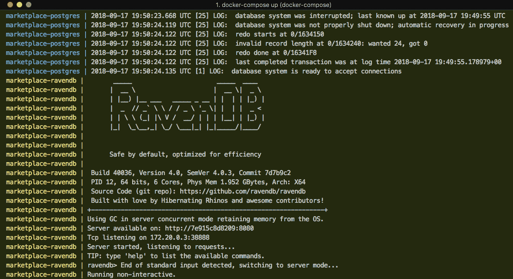
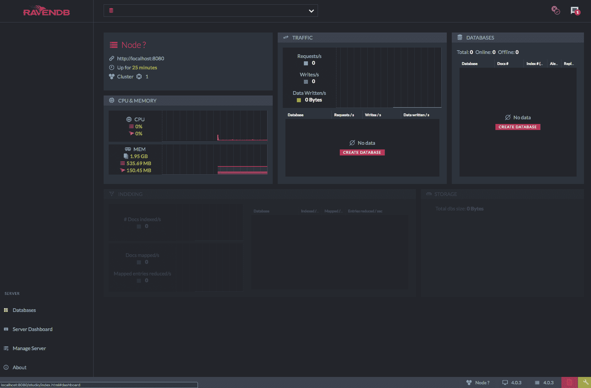
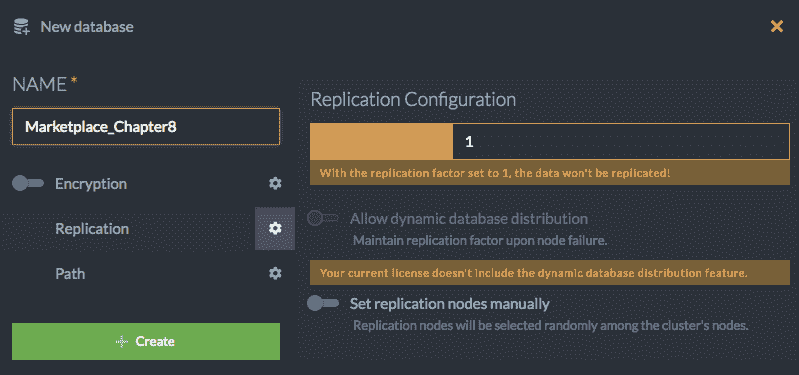
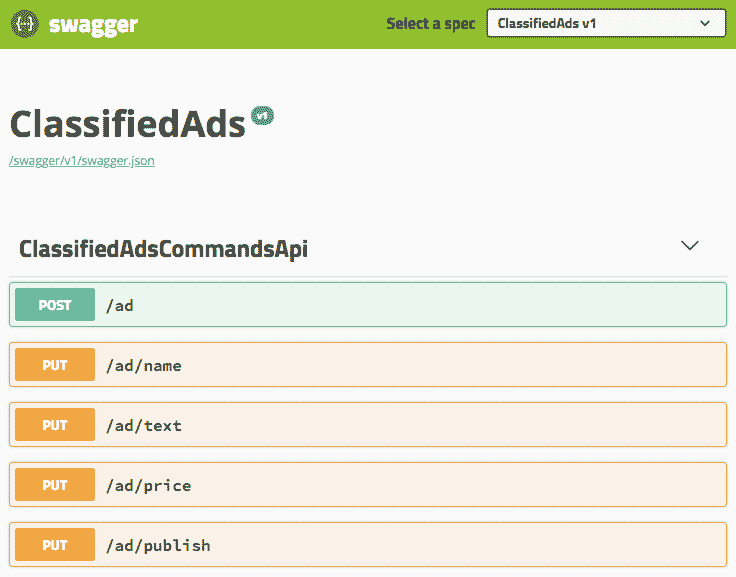
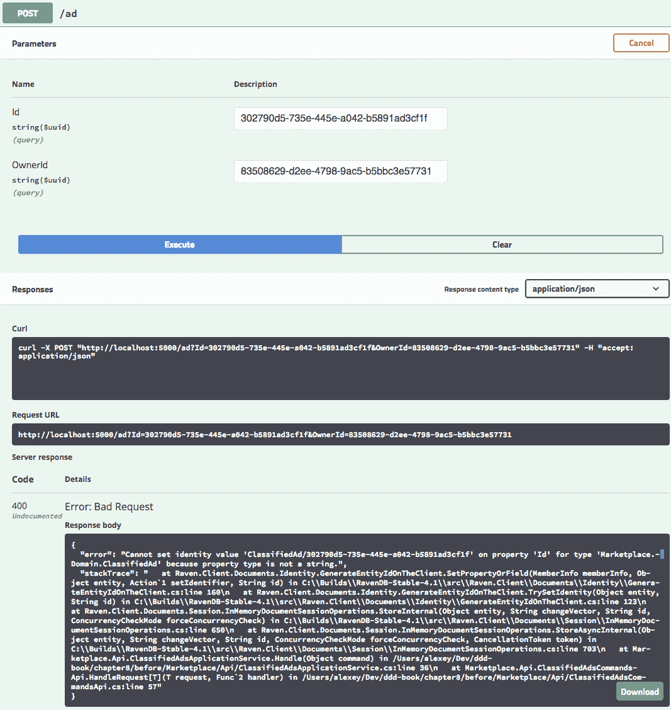
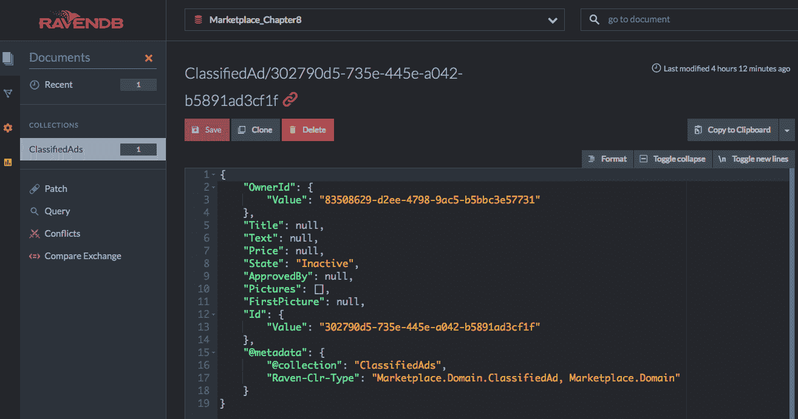
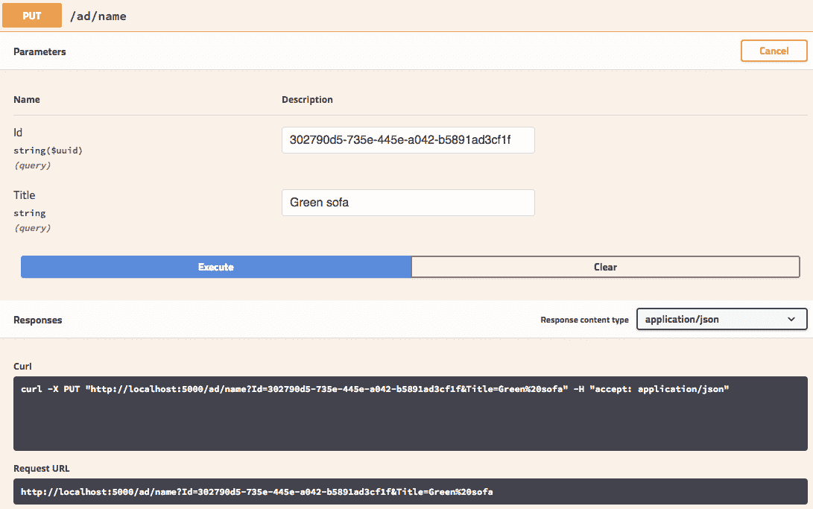
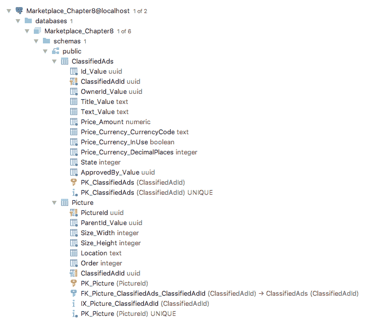

# 第八章：聚合持久化

我们已经花费足够的时间讨论了如何通过显式定义的业务规则来确保领域模型的一致性。在本章中，我们将进一步讨论将我们的聚合持久化到数据库中。由于我们的模型不是围绕任何数据库设计的，我们在尝试使用数据库引擎存储复杂对象图时可能会遇到问题。这是因为数据库不与对象协同工作。相反，关系型数据库被优化为存储可能使用主键和外键进行关系操作的数据表。文档数据库以机器可读的格式（如 JSON）存储对象，并且根据定义能够以原样持久化复杂对象图；然而，我们不应该自欺欺人，因为这些对象的组织方式仍然存在严重的限制，以便数据库客户端库可以将我们的对象转换为 JSON 并返回。所有这些差异，一方面是具有要持久化的领域对象，另一方面是具有所有怪癖和调整的数据库引擎，将为开发者带来挑战。

在本章中，我们将涵盖以下主题：

+   仓储模式

+   阻抗不匹配

+   使用文档数据库进行持久化

+   使用关系型数据库进行持久化

# 技术要求

本章的代码可以在 GitHub 上书籍仓库的 `Chapter08` 文件夹中找到。那里有三个子文件夹。其中一个叫做 `before`，其中的代码可以用来跟随本章的进度，随着持久化实现的深入。另外两个文件夹，`ravendb` 和 `ef-core`，包含使用 RavenDB 文档数据库和 Entity Framework Core 以及 PostgreSQL 实现聚合持久化的最终代码。

您需要使用 `docker-compose` 来运行基础设施。这意味着您也需要安装 Docker。请遵循 Docker CE 安装指南，网址为 [`docs.docker.com/install/`](https://docs.docker.com/install/)，以及 Docker Compose 安装指南，网址为 [`docs.docker.com/compose/install/`](https://docs.docker.com/compose/install/)。

如果您之前从未在您的机器上运行过 Docker，或者您是在一段时间前运行的，您可能需要使用 `docker login` 命令进行登录。执行该命令需要您在 Docker Hub 上有一个账户，您可以在 [`hub.docker.com`](https://hub.docker.com) 上免费创建。

# 聚合持久化

既然我们已经详细讨论了如何使用**聚合**模式实现具有复杂业务规则的对象图，我们就需要看看如何为我们在系统中使用的聚合启用持久化。在上一章中，我们简要地介绍了**存储库**模式，它允许我们将持久化从领域抽象出来。我们还开始通过使用 RavenDB 文档数据库来实现持久化层的实现，因为它更容易将复杂对象保存为文档。然而，我们也了解到，当我们试图满足所选持久化方法对我们对象的要求时，我们很可能会遇到阻抗不匹配的问题，这样我们就可以将它们保存到数据库中并检索回来。

# 存储库和工作单元

让我们回到我们使用存储库模式来持久化聚合的地方。正如你将记得的那样，存储库模式的目的就是抽象聚合的持久化。这正是我们现在要做的。我们仍然有存储库接口，它看起来是这样的：

```cs
public interface IClassifiedAdRepository  
{  
    Task<ClassifiedAd> Load(ClassifiedAdId id);  
    Task Save(ClassifiedAd entity);
}
```

存储库模式是存在的一些最具争议的模式之一，要理解为什么会这样，我们需要回到定义本身。例如，这是在 Martin Fowler 的《企业应用架构模式》一书中对这种模式是如何定义的（摘自[`martinfowler.com/eaaCatalog/repository.html`](https://martinfowler.com/eaaCatalog/repository.html)）。建议你查看该页面上给出的定义。

你可以在我们之前提到的网页上找到的图表显示，客户端可以要求存储库检索满足某些条件的对象集。客户端还可以从存储库中添加和删除对象。

关于存储库的辩论通常涉及这样一个事实，在许多情况下，开发人员也将存储库实现为一个工作单元。此外，看到*通用存储库*相当普遍，如下所示：

```cs
public interface IRepository<T>
{
    void GetById(int id); void Save(T);
    IEnumerable<T> Query(Func<T, bool> filter);
}
```

`Query`方法允许向类型化存储库发送一个 lambda 表达式，然后通用的存储库实现将查询发送到底层的 ORM 框架或文档数据库 API，而不需要太多思考。

这种方法让人们认为存储库只是 ORM 框架上不必要的抽象。许多人认为，当开发者发送一个自由形式的查询并将其留给 ORM 框架将其转换为 SQL 语句时，这会给开发者一种对数据库技术的无知感，而且很少会有好结果。我们不能只是忽略数据库并向其发送任何查询，因为这可能导致性能问题，由于缺乏查询优化。对于某些文档数据库，这种方法甚至可能不起作用，因为数据库需要有一个预定义的索引来执行查询。RavenDB 可以根据任何查询创建自动索引，但出于性能原因，不推荐这样做。对于关系数据库，通过 ORM 使用 LINQ 查询转换器可能会导致次优查询，这不仅会严重影响应用程序性能，还会严重影响数据库服务器的性能。

同时，如果我们决定不使用存储库，我们可能会在设计领域模型时处理持久化问题，而这不应该发生。领域模型是独立存在的，它被设计用来处理业务规则和不变性，而不是处理数据库。

艾瑞克·埃文斯坚持认为，查询存储库必须通过使用预定义的规范来进行，而不是发送任何查询。这些规范需要使用通用语言来表达客户端从存储库检索一组对象的目的。

例如，我们应优先使用`IEnumerable<ClassifiedAd> GetAdsPendingReview()`或`IEnumerable<ClassifiedAd> Query(Specifications.GetAdsPendingReview)`而不是一个通用的调用，如`IEnumerable<ClassifiedAd> Query(x => x.State == ClassifiedAdState.PendingReview)`。这样做的一个原因是使查询更具表达性并使用领域语言。另一个原因是让存储库决定如何执行特定的查询，因为我们控制着客户端可以使用的所有查询。最后一个原因是我们将查询条件放在规范内部或存储库方法内部，这样我们就可以在需要时自由地更改这些规则，而这些规则只在一个地方定义。

因此，如果我们花更少的时间争论存储库，更多的时间去理解原始定义，我们会发现使用规范执行查询并不等同于将查询推送到对象关系映射（ORM），而是涉及执行特定的查询，这些查询遵循通用语言命名，并且针对我们的应用程序打算使用的数据库进行了优化。

让我们看看我们如何改变我们的仓库以更接近原始定义。首先，我们需要去掉`Save`方法，因为仓库客户端（我们的应用服务）将控制工作单元，并将最终决定是否需要将更改提交到数据库。然后，我们添加至少一个查询，当我们在数据库中检查对象是否已存在时，我们将在应用服务中使用这个查询：

```cs
using System.Threading.Tasks;

namespace Marketplace.Domain
{
    public interface IClassifiedAdRepository
    {
        Task<ClassifiedAd> Load(ClassifiedAdId id);

        Task Add(ClassifiedAd entity);

        Task<bool> Exists(ClassifiedAdId id);
    }
}
```

通过这个接口，我们无法控制仓库实现的交易，这将成为我们应用层的责任。我们仍然不希望我们的应用服务直接耦合到持久化层，遵循端口和适配器架构。

# RavenDB 的实现

现在，让我们开始使用真实数据库做一些事情；我们的第一个练习将是使用 RavenDB 文档数据库。这个数据库是考虑到 NHibernate API 创建的，但没有对象关系映射的负担。它以 JSON 文档的形式存储对象，支持事务，并且可以使用相当复杂的过滤器处理存储文档的查询。RavenDB 是一个商业产品，但它有一个免费许可选项，非常适合构建小型应用程序并将其投入生产。

对于一些读者来说，选择 RavenDB 作为本书的数据库可能并不明显。显然，在流行度方面，MongoDB 可能是一个更好的选择。同样，Azure Cosmos DB 具有 Mongo API，这使得 MongoDB 驱动程序在示例应用程序中使用更具吸引力。同时，RavenDB 在.NET 社区中拥有相当多的吸引力，它还拥有业界最佳的 Web 用户界面，这将对我们随着本章的进展查看数据库中的情况非常有帮助。

选择文档数据库的原因是基于这样一个事实，与关系数据库相比，文档数据库具有更少的阻抗不匹配，因为文档数据库操作对象，而关系数据库处理表和关系。

我们将首先通过使用 RavenDB 持久化实现仓库接口，以便保存和加载单个聚合。

为了使事情更加明确，我们可以将基础设施部分，如特定数据库的类，移动到`Marketplace`项目中的新文件夹，称为`Infrastructure`。

由于我们已经在 RavenDB 上实现了我们的仓库，我们可以从这里开始。但现在，我们想要去掉`Save`方法，因为我们想要将提交责任移除到工作单元。此外，我们现在可以将这个文件移动到新的`Infrastructure`文件夹。为了实现新的仓库接口，我们需要做一些小的修改，所以我们的代码将看起来像这样：

```cs
using System;
using System.Threading.Tasks;
using Marketplace.Domain;
using Raven.Client.Documents.Session;

namespace Marketplace.Infrastructure
{
    public class ClassifiedAdRepository : IClassifiedAdRepository
    {
        private readonly IAsyncDocumentSession _session;

        public ClassifiedAdRepository(IAsyncDocumentSession session) 
            => _session = session;

        public Task Add(ClassifiedAd entity) 
            => _session.StoreAsync(entity, EntityId(entity.Id));

        public Task<bool> Exists(ClassifiedAdId id) 
            => _session.Advanced.ExistsAsync(EntityId(id));

        public Task<ClassifiedAd> Load(ClassifiedAdId id)
            => _session.LoadAsync<ClassifiedAd>(EntityId(id));

        private static string EntityId(ClassifiedAdId id)
            => $"ClassifiedAd/{id.ToString()}";
    }
}
```

在这里，我们移除了 `Save` 方法，现在我们有了 `Add` 方法，它只会在我们将新的聚合添加到数据库时使用。RavenDB 不仅使用会话来控制与数据库的连接，还用于跟踪通过调用新对象的 `Store` 或 `StoreAsync` 方法或通过使用会话从数据库加载现有对象来添加到会话中的对象的更改。因此，一旦我们使用存储库的 `Load` 或 `Add` 方法，底层的会话将跟踪这些对象中发生的所有更改。实际上，会话本身代表工作单元，因为当我们将更改作为单个事务提交给会话时，所有附加到会话的对象发生的所有更改都将提交到数据库。

跟踪和提交更改作为事务的能力并不是 RavenDB 客户端库的专属属性。对于关系数据库，**Entity Framework**（**EF**）和 NHibernate 允许使用相同的技巧。特别是，NHibernate 也有一个 `ISession` 接口，具有完全相同的性能，因为 RavenDB API 最初设计得非常接近 NHibernate API。此外，使用 PostgreSQL 的原生能力在 JSONB 字段中处理类似文档的结构的开源库 Marten ([`jasperfx.github.io/marten/`](http://jasperfx.github.io/marten/)) 也有一个会话实现，该会话跟踪连接对象的更改。

为了完成抽象，我们需要为工作单元提供一个接口。我们可以从类似以下的内容开始：

```cs
using System.Threading.Tasks;

namespace Marketplace.Framework
{
    public interface IUnitOfWork
    {
        Task Commit();
    }
}
```

由于我们正在使用 RavenDB 会话跟踪对象的更改，因此该接口的实现将非常简单：

```cs
using System.Threading.Tasks;
using Marketplace.Framework;
using Raven.Client.Documents.Session;

namespace Marketplace.Infrastructure
{
    public class RavenDbUnitOfWork : IUnitOfWork
    {
        private readonly IAsyncDocumentSession _session;

        public RavenDbUnitOfWork(IAsyncDocumentSession session) 
            => _session = session;

        public Task Commit() => _session.SaveChangesAsync();
    }
}
```

为了使它与我们的应用程序服务一起工作，我们需要确保服务在其构造函数中将存储库和工作单元接口作为参数。`ClassifiedAdAplicationService` 的新代码如下：

```cs
using System;
using System.Threading.Tasks;
using Marketplace.Domain;
using Marketplace.Framework;
using static Marketplace.Contracts.ClassifiedAds;

namespace Marketplace.Api
{
    public class ClassifiedAdsApplicationService : IApplicationService
    {
        private readonly IClassifiedAdRepository _repository;
        private readonly IUnitOfWork _unitOfWork;
        private readonly ICurrencyLookup _currencyLookup;

        public ClassifiedAdsApplicationService(
            IClassifiedAdRepository repository, IUnitOfWork unitOfWork,
            ICurrencyLookup currencyLookup
        )
        {
            _repository = repository;
            _unitOfWork = unitOfWork;
            _currencyLookup = currencyLookup;
        }

        public Task Handle(object command) => 
            command switch
            {
                V1.Create cmd => HandleCreate(cmd),
                V1.SetTitle cmd =>
                    HandleUpdate(
                        cmd.Id,
                        c => c.SetTitle(
                            ClassifiedAdTitle.FromString(cmd.Title)
                        )
                    ),
                V1.UpdateText cmd =>
                    HandleUpdate(
                        cmd.Id,
                        c => c.UpdateText(
                            ClassifiedAdText.FromString(cmd.Text)
                        )
                    ),
                V1.UpdatePrice cmd =>
                    HandleUpdate(
                        cmd.Id,
                        c => c.UpdatePrice(
                            Price.FromDecimal(
                                cmd.Price, cmd.Currency, 
                                _currencyLookup
                            )
                        )
                    ),
                V1.RequestToPublish cmd =>
                    HandleUpdate(
                        cmd.Id,
                        c => c.RequestToPublish()
                    )
            };

        private async Task HandleCreate(V1.Create cmd)
        {
            if (await _repository.Exists(cmd.Id.ToString()))
                throw new InvalidOperationException(
                    $"Entity with id {cmd.Id} already exists");

            var classifiedAd = new ClassifiedAd(
                new ClassifiedAdId(cmd.Id),
                new UserId(cmd.OwnerId)
            );

            await _repository.Add(classifiedAd);
            await _unitOfWork.Commit();
        }

        private async Task HandleUpdate(
            Guid classifiedAdId, Action<ClassifiedAd> operation)
        {
            var classifiedAd = await 
            _repository.Load(classifiedAdId.ToString());
            if (classifiedAd == null)
                throw new InvalidOperationException(
                    $"Entity with id {classifiedAdId} cannot be 
                    found");

            operation(classifiedAd);

            await _unitOfWork.Commit();
        }
    }
}
```

你可以看到，我们的应用程序服务现在获得了三个依赖项，而不是之前的那两个。我们添加了工作单元接口，以便服务可以决定何时将更改提交到数据库。这给重写我们的应用程序启动代码带来了挑战，因此我们添加了缺失的依赖项。在那里还有一个问题等待着我们，因为我们的工作单元使用它作为依赖项的文档会话进行提交。存储库也依赖于文档会话。你可能还记得，文档会话跟踪所有加载到会话或显式添加到会话中的对象的更改；这就是存储库所做的工作。但我们在工作单元中执行提交，这意味着在应用程序服务的同一实例中使用的存储库和工作单元必须具有*相同的*文档会话。

如果我们决定自己实例化依赖关系图，那么这部分会相当棘手。对于我们的应用程序，我们将使用 ASP.NET ([`www.asp.net/`](https://www.asp.net/)) Core 服务集合来定义依赖关系。服务集合也充当 **依赖注入** 容器，因此如果我们正确配置它，我们就能得到正确的依赖关系。以下启动代码就起到了这个作用：

```cs
public void ConfigureServices(IServiceCollection services)
{
    var store = new DocumentStore
    {
        Urls = new[] {"http://localhost:8080"},
        Database = "Marketplace_Chapter8",
        Conventions =
        {
            FindIdentityProperty = m => m.Name == "_databaseId"
        }
    };
    store.Initialize();

    services.AddSingleton<ICurrencyLookup, FixedCurrencyLookup>();
    services.AddScoped(c => store.OpenAsyncSession());
    services.AddScoped<IUnitOfWork, RavenDbUnitOfWork>();
    services.AddScoped<IClassifiedAdRepository, ClassifiedAdRepository>();
    services.AddScoped<ClassifiedAdsApplicationService>();

    services.AddMvc();
    services.AddSwaggerGen(c =>
    {
        c.SwaggerDoc(
            "v1",
            new Info
            {
                Title = "ClassifiedAds",
                Version = "v1"
            });
    });
}
```

这段代码是为 `Marketplace` 项目的 `Startup.cs` 文件。在那里，我们使用工厂委托 `RavenDbUnitOfWork` 和 `ClassifiedAdRepository` 将文档会话注册为作用域依赖项。我们的应用程序服务也被注册为作用域服务。当我们注册任何依赖项为 *作用域* 时，其生命周期将限制为单个 HTTP 请求的生命周期。对于我们的代码来说，这意味着只为请求实例化一个文档会话，它将被用作处理请求的所有其他实例化的对象的依赖项。因此，我们将得到一个应用程序服务实例、一个存储库和一个工作单元。最后两个也将获得相同的文档会话实例，这正是我们想要的。

作为旁注，我必须明确指出，当我们遇到强烈的需求，需要依赖注入容器来管理我们的依赖关系，而我们无法手动配置依赖关系时，我们需要注意到我们的代码中可能存在问题。在这种情况下，我们需要重新考虑依赖关系图，并尝试简化它，以便我们减少或不需要使用容器。在这个特定的情况下，我们无法控制 ASP.NET Core 如何实例化它用来处理 HTTP 请求的控制器。因此，我们被迫使用容器。然而，我们将尝试缩小依赖项列表，以避免注入地狱并重新控制请求处理范围。

在本章的代码中，你还可以看到我们在 `ClassifiedAdCommandsApi` 类中有一个辅助方法，用于通过将请求发送到应用程序服务并包装它可能抛出的任何异常来处理 HTTP 请求。我们本可以使用由 Web API 提供的开发者错误页面；然而，它包含大量的 HTML，而我们正在使用 Swagger，它不会渲染它，而是显示 HTML 源代码。这使得诊断变得更加困难，因为我们需要深入到大量的 HTML 标签中才能找到异常信息和堆栈跟踪。添加的方法如下：

```cs
private async Task<IActionResult> HandleRequest<T>(T request, Func<T, Task> handler)
{
    try
    {
        Log.Debug("Handling HTTP request of type {type}", 
        typeof(T).Name);
        await handler(request);
        return Ok();
    }
    catch (Exception e)
    {
        Log.Error("Error handling the request", e);
        return new BadRequestObjectResult(new {error = e.Message, 
        stackTrace = e.StackTrace});
    }
}
```

由于我们在这里使用的是泛型类型参数，因此我们可以向此方法发送任何请求，同时将应用程序服务 `Handle` 方法作为一个委托来处理请求。例如，我们控制器中的 `Post` 方法现在看起来是这样的：

```cs
public ClassifiedAdsCommandsApi(
    ClassifiedAdsApplicationService applicationService)
    => _applicationService = applicationService;
```

你可能已经注意到，`HandleRequest`方法也使用了日志记录。在这本书中，我们使用了开源的`Serilog`日志库，这是第一个为.NET 空间提供结构化日志的库，并迅速成为.NET 空间最受欢迎的日志库。

我们将聚合保存到 RavenDB 的初始准备阶段已完成。对于下一步，我们需要启动 RavenDB，最简单的方法是使用 Docker Compose 与本书库中提供的配置文件。`docker-compose.yml`文件包含了 Docker Compose 启动两个容器的指令——一个是 RavenDB，另一个是 PostgreSQL，我们将在本章后面探索使用关系数据库持久化聚合时使用。

您应该能够在终端窗口中从章节文件夹运行`docker-compose up`命令，您将看到类似以下内容：



docker-compose 命令的终端输出

如果在执行命令时遇到任何问题，请检查本章的*技术要求*部分。

请记住，您可以通过在运行它的终端窗口中按*Ctrl* + *C*来停止您的`docker-compose`会话，在这种情况下，容器将被停止。容器内的所有数据都将保留，因此当您下次使用`docker-compose up`时，您将再次看到您的数据库。如果您使用`docker-compose down`，容器将被删除，当您再次启动它们时，您需要再次创建数据库。如果您无论如何都想保留数据，请考虑在`docker-compose.yml`文件中指定卷。

当您第一次运行 RavenDB 或容器被重新创建时，您需要通过访问`http://localhost:8080`来访问数据库 Web UI 并接受许可协议。RavenDB 可以免费用于开发和小型生产系统。当您接受协议后，您将被重定向到 RavenDB Studio 页面：



RavenDB 用户界面

在我们能够将任何内容保存到 RavenDB 之前，我们需要创建一个数据库。对于本章的示例应用程序代码，数据库名称被硬编码为`Marketplace_Chapter8`。要创建一个新的数据库，您可以使用 RavenDB Studio 主页上的创建数据库按钮：


此按钮允许您创建一个新的数据库

当你点击此按钮时，你会弹出一个窗口，你可以输入数据库名称并点击创建：



新数据库创建屏幕

现在，我们可以开始我们的示例应用程序。应用程序启动后，它产生的输出类似于以下内容：

```cs
Hosting environment: Development
Content root path: ~/github/ddd-book/chapter8/Marketplace/bin/Debug/netcoreapp2.2
Now listening on: http://localhost:5000
Application started. Press Ctrl+C to shut down.
```

默认情况下，任何 ASP.NET Core 应用程序都会在`http://localhost:5000`上开始监听。我们的应用程序中没有用户界面，但我们有 Swagger UI 来向应用程序配置中添加的 API 发送请求。因此，如果您访问`http://localhost:5000/swagger/index.html`页面，您将看到我们迄今为止创建的所有 API 端点：



Swagger UI 的命令 API

最后，我们非常接近向我们的应用程序发送命令并查看它的工作方式。首先的事情是；在进行任何更新之前，我们需要创建我们的第一个聚合。因此，我们可以点击 POST，然后点击“尝试一下”按钮。我们将得到两个字段需要填写新 GUID，这些 GUID 可以很容易地通过在线 GUID 生成器生成，或者通过在 JetBrains Rider 或 Visual Studio 中可用的类似工具生成。

在将两个新生成的 GUID 输入到新`POST`请求的参数字段后，您可以按下执行按钮，片刻之后，您将得到一个响应：



当我们尝试执行命令时，会抛出异常

但是等等；我们有一个错误！让我们看看错误消息告诉我们发生了什么：

```cs
Cannot set identity value 'ClassifiedAd/302790d5-735e-445e-a042-b5891ad3cf1f' on property 'Id' for type 'Marketplace.Domain.ClassifiedAd' because property type is not a string.
```

在这里，我们有我们的第一个阻抗不匹配的例子。我们一直在没有考虑持久性的情况下建模我们的领域类，并且所有决策都是基于我们类结构对领域需求的考虑。当我们开始与数据库一起工作时，尽管这个数据库是基于文档的，并且在理论上应该持久化我们给出的任何对象，但现实情况略有不同。现在，我们被迫开始调整我们的领域类，以便它们可以被持久化。这相当不幸，因为理想情况下，我们应该保持我们的领域模型实现不受任何持久性问题的干扰。

但是，让我们看看我们现在能做什么。RavenDB 要求任何要保存到其中的文档都必须有一个字符串类型的身份属性或字段。我们使用`ClassifiedAdId`值对象类型作为身份属性。我们明确地告诉 RavenDB 在我们的存储库`Add`方法中的对象身份，因此它不会使用`Id`属性。然而，它未能将字符串值写回`Id`字段，因为它不是字符串。这只能通过向我们的聚合类中添加一个新的字符串类型属性或字段来修复。RavenDB 使用`Id`作为身份属性的名字，但我们可以配置约定，使数据库客户端 API 使用其他名称。

我们可以通过向`ClassifiedAd`类添加一个新的`private`字段来开始修复这个问题：

```cs
public class ClassifiedAd : AggregateRoot<ClassifiedAdId>
{
    // Properties to handle the persistence
    private string DbId
    {
        get => $"ClassifiedAd/{Id.Value}";
        set {}
    }

    // Aggregate state properties
```

看起来我们不用属性设置器可能有些奇怪，但数据库会将`Id`属性读取为一个对象，并且我们会得到返回的值。因此，我们可以安全地使用`Id`属性进行`get`操作，而`set`操作将仅用于使数据库满意。

我们还需要向数据库 API 解释，它需要使用这个新属性作为文档标识符。这是通过在`Startup.cs`中创建`DocumentStore`实例时使用约定来完成的：

```cs
var store = new DocumentStore
    {
        Urls = new[] {"http://localhost:8080"},
        Database = "Marketplace_Chapter8",
        Conventions =
        {
            FindIdentityProperty = x => x.Name == "DbId"
        }
    };
store.Initialize();
```

现在，让我们重新启动应用程序并再次从 Swagger 中调用该调用。我们可以使用相同的值，所以如果你在更改代码时保留了浏览器窗口，你只需执行之前生成错误的相同请求。现在，响应不同：


获取 200 OK 表示一切正常

为了确认我们的持久化代码是否工作，我们需要再次转向 RavenDB Studio，如果我们那里打开数据库，我们将有一个代表新聚合状态的文档：



文档已成功存储

对于下一步，我们可以执行对现有聚合执行状态更改的命令之一。首先，我们可以通过调用 `/ad/name/` API 端点并使用 `PUT` 来设置广告标题。我们需要使用与 `POST` 调用相同的聚合 ID，因为这是我们当前系统中唯一拥有的对象。在下面的屏幕截图中，你可以看到操作已经执行，API 返回了 `200 OK` 状态：



更新命令执行成功

让我们检查在 RavenDB 中的文档发生了什么。如果文档在 Studio 中仍然打开，你会看到一个小的弹出窗口说：“此文档在 Studio 外已被修改。点击此处刷新。”你可以继续点击链接，这样文档就会刷新，并显示新版本。现在，我们可以看到文档内容已更改，并且“标题”属性具有适当的值（进一步，我将在“Startup.cs”中创建“DocumentStore”实例时只使用文档内容作为 JSON）：

```cs
{
    "OwnerId": {
        "Value": "83508629-d2ee-4798-9ac5-b5bbc3e57731"
    },
    "Title": {
        "Value": "Green sofa"
    },
    "Text": null,
    "Price": null,
    "State": "Inactive",
    "ApprovedBy": null,
    "Pictures": [],
    "FirstPicture": null,
    "Id": {
        "Value": "302790d5-735e-445e-a042-b5891ad3cf1f"
    },
    "@metadata": {
        "@collection": "ClassifiedAds",
        "Raven-Clr-Type": "Marketplace.Domain.ClassifiedAd, 
        Marketplace.Domain"
    }
}
```

现在，让我们尝试调用其他端点。你甚至可以尝试再次调用相同的端点，这样它会尝试将标题设置为其他值。令人惊讶的是，这不会工作。我们可以看到以下错误消息：

```cs
Could not convert document ClassifiedAd/7b0a443f-af9b-4f0d-8876-7896c9921cbc to entity of type Marketplace.Domain.ClassifiedAd.ClassifiedAd
```

这条消息不是很 informative，但 RavenDB 正在试图告诉我们我们有一个序列化问题。让我们看看内部异常可以告诉我们什么。信息如下：

```cs
Unable to find a constructor to use for type Marketplace.Domain.ClassifiedAd.ClassifiedAdTitle. A class should either have a default constructor, one constructor with arguments or a constructor marked with the JsonConstructor attribute. Path 'Title.Value'.
```

这里的问题在于，我们只允许通过工厂方法创建值对象，以防止创建具有无效内容的值对象。当我们绕过验证时，序列化器将不会使用它，除非我们在它上面放置一个 `[JsonConstructor]` 属性。我们绝对不希望这样做，因为这样做会使我们的领域模型依赖于 `Newtonsoft.Json` 库，这是一个纯粹的基础设施问题。为了避免这种情况而不损害我们领域项目的纯洁性，唯一的方法是创建一个无参数的私有构造函数。这将允许我们保持封装并满足序列化器的需求。这是持久层和领域层之间不匹配的另一个问题。

让我们在 `ClassifiedAdTitle` 类中添加这一行代码来解决该问题：

```cs
// Satisfy the serialization requirements
protected ClassifiedAdTitle() { }
```

除了身份类型之外，需要将类似的行添加到所有值对象类型中，因为它们已经具有一个参数为 `Guid` 的公共构造函数，序列化器也乐于使用它。完成所有这些更改后，所有的 HTTP 端点都将开始工作。

因此，我们可以得出结论，我们为了克服阻抗不匹配所做的微小更改是有效的。你可能已经注意到，所有具有值对象类型的属性都存储为 JSON 对象。这是任何可以存储和检索复杂对象图作为单个文档的文档数据库的一个很好的特性。

可以采用类似的方法通过使用支持会话和会话内变更跟踪的其他类型的文档存储来实现持久化。我在本章前面已经提到了 Marten。然而，对于其他文档数据库，如 MongoDB 或 Cosmos DB，您需要从集合式存储库中退出，并开始从存储库内部提交更新，而不是使用工作单元。这种做法可能看起来有些不符合常规，因此开发者们在实施时有时会感到内疚。然而，如果我们记住聚合必须被视为事务边界，那么在单个事务中更新多个对象的可能性几乎为零。如果违反了这一规则，那么您可能面临的问题将不仅仅是存储库接口中存在一个`Save`方法那么简单。但是，当我们只在对应用程序服务中的一个聚合进行操作时，使用单独的工作单元的整个故事开始显得多余。当我们的应用程序服务符合`load-act-save`模式时，可能没有实际的理由将存储库从工作单元中分离出来。应用程序服务仍然负责提交更改，但它可以通过调用`_repository.Save()`来实现，就像在我们的代码中调用`_unitOfWork.Commit()`一样。当我们开始讨论基于事件的持久化时，即第十章的*事件溯源*，我们将更详细地探讨存储库模式和它的有用性。

# 实现 Entity Framework Core

尽管如今开发者有多种数据库可供选择，但在许多情况下，关系型数据库仍然更受欢迎。这种选择的原因可能各不相同，但最常见的原因包括某些关系型数据库管理系统（RDBMS），如 Oracle 或 Microsoft SQL Server，已经在组织中使用，并且有人员可以维护它们，或者开发团队本身在处理关系型数据库方面拥有丰富的经验。当然，这通常会导致问题，因为领域模型可能会迅速变成数据模型，整个应用程序都会围绕持久化构建。

关系型数据库也因存在显著的阻抗不匹配而臭名昭著。尽管开发者们往往倾向于认为类可以完美地存储在表中，并且类之间的关系可以用外键表示，但这并不是全部。在我们完成对单个聚合的持久化实现的第一轮迭代之后，我们将很快看到这一点。

为了克服阻抗不匹配，使关系型数据库的持久化对使用对象的开发者更加透明，我们的行业发明了一种解决方案。我们大多数人熟悉**对象关系映射器**（**ORM**），它承诺可以透明地将对象放入数据库并检索它们。在 .NET 领域，特别是，我们有两大 ORM 框架被广泛使用。这些框架是 NHibernate 和 Entity Framework。NHibernate 拥有悠久的历史，它最初是一个流行的 Java ORM 框架（Hibernate）的克隆。在几年时间里，NHibernate 是 .NET 领域唯一的 ORM 工具。然后，在微软尝试进入 ORM 领域的 LINQ2SQL 失败之后，Entity Framework 诞生了。尽管许多人批评它速度慢、僵化且设计不佳，但它仍然迅速成为许多 .NET 开发者的首选工具，唯一的理由是它得到了微软的支持。Entity Framework 还推出了第一个可视化设计工具，允许通过拖放创建与持久化层映射的类模型。经过几年的框架持续改进，Entity Framework 获得了大量采用，在某个时刻，许多人认为 NHibernate 已经死亡。然而，在过去的几年里，NHibernate 社区发布了带有 async/await 支持的版本 4，然后是带有 .NET Core 支持的版本 5。Entity Framework 团队决定退后一步重新思考设计，推出了 Entity Framework Core。这个版本现在正在积极开发中，并且也包含在 `Microsoft.AspNet.Core` NuGet 包组中，因此它可以直接用于所有 .NET Core 应用程序。

多亏了像 Julie Lerman 这样的社区成员在微软的影响力，她深入研究了领域驱动设计（DDD）及其原则，并为 Entity Framework 团队提供了大量宝贵的输入，以改善他们的产品，减轻阻抗不匹配，并支持诸如不可变值对象等概念。因此，我决定包括一个示例，说明如何将此框架用作关系型数据库的领域模型持久化，尽管这本书更倾向于事件溯源。

本部分的代码可在本书的 GitHub 仓库中找到，位于 `Chapter08/ef-core` 文件夹中。

在本例中，我们将使用 PostgreSQL 数据库，但代码可以轻松转换为 Microsoft SQL Server，因为我们不会使用任何特定于 PostgreSQL 的功能。本章 `ef-core` 文件夹中的 `docker-compose.yml` 文件将帮助您在容器内启动数据库，就像我们使用 RavenDB 一样。初始化脚本将在容器创建时自动执行。该脚本负责创建一个数据库用户和一个名为 `Marketplace_Chapter8` 的新数据库，因此您在启动应用程序之前无需做任何事情。

现在，让我们看看为了使用关系数据库来持久化我们的聚合，我们需要做什么。由于我们已经在项目中有了对`Microsoft.AspNetCore.App`包集的引用，因此 Entity Framework Core 本身可以直接使用。我们需要向我们的项目中添加一个名为`Npgsql.EntityFrameworkCore.PostgreSQL`的 PostgreSQL 驱动程序包。

我们需要告诉框架它需要将我们的`ClassifiedAd`类映射到数据库。为此，我们需要在`Marketplace`项目的`Infrastructure`文件夹中创建一个新的类`ClassifiedAdDbContext`。我们将使用代码优先的方法，让框架决定表的结构以及如何将`ClassifiedAd`类的属性映射到表列。以下是类的第一个版本：

```cs
using Marketplace.Domain;
using Microsoft.AspNetCore.Builder;
using Microsoft.EntityFrameworkCore;
using Microsoft.EntityFrameworkCore.Metadata.Builders;
using Microsoft.Extensions.DependencyInjection;
using Microsoft.Extensions.Logging;

namespace Marketplace.Infrastructure
{
    public class ClassifiedAdDbContext : DbContext
    {
        private readonly ILoggerFactory _loggerFactory;

        public ClassifiedAdDbContext(
            DbContextOptions<ClassifiedAdDbContext> options,
            ILoggerFactory loggerFactory)
            : base(options) => _loggerFactory = loggerFactory;

        public DbSet<ClassifiedAd> ClassifiedAds { get; set; }

        protected override void OnConfiguring(
            DbContextOptionsBuilder optionsBuilder)
        {
            optionsBuilder.UseLoggerFactory(_loggerFactory);
            optionsBuilder.EnableSensitiveDataLogging();
        }

        protected override void OnModelCreating(ModelBuilder 
        modelBuilder)
            => modelBuilder.ApplyConfiguration(
                new ClassifiedAdEntityTypeConfiguration());
    }

    public class ClassifiedAdEntityTypeConfiguration 
        : IEntityTypeConfiguration<ClassifiedAd>
    {
        public void Configure(EntityTypeBuilder<ClassifiedAd> builder)
            => builder.HasKey(x => x.ClassifiedAdId);
    }

    public static class AppBuilderDatabaseExtensions
    {
        public static void EnsureDatabase(this IApplicationBuilder app)
        {
            var context = app.ApplicationServices
                .GetService<ClassifiedAdDbContext>();

            if (!context.Database.EnsureCreated())
                context.Database.Migrate();
        }
    }
}
```

在这里我们并没有做很多。通过添加一个类型为`DbSet<ClassifiedAd>`的属性，我们告诉框架它需要映射这个类。然后，我们还解释了应该使用`ClassifiedAd.ClassifiedAdId`属性作为主键。我们之前没有这个属性，但在之前的 RavenDB 部分中我们已经使用了类似的东西，因为数据库需要知道用作实体标识的值是什么，而且它不能是一个值对象。

因此，我们还需要将这个属性添加到我们的聚合中。我们希望封装尽可能多的内容，但由于我们需要从基础设施配置中访问这个属性，我们被迫至少将其设置为公共的，以便获取其值。与 RavenDB 不同，我们无法通过名称指定属性。

在我们的`DbContext`实现中，我们还要做的一件事是告诉 Entity Framework Core 进行日志记录，并且记录敏感数据。这对于调试很有用，因为它允许我们看到 Entity Framework Core 在幕后做了什么，包括所有 SQL 语句和参数。请记住，在生产环境中不应使用`EnableSensitiveDataLogging`，因为它会暴露所有数据，可能会导致一些敏感数据通过日志文件或日志服务器暴露出来。

在前面的代码中还有一个类实现了对`IApplicationBuilder`的扩展。我们将使用这个扩展来创建或迁移必要的表。这种方法也不适合生产环境，因为你可能希望单独进行迁移。

因此，我们需要在我们的聚合类中进行以下更改：

```cs
public class ClassifiedAd : AggregateRoot<ClassifiedAdId>
{
    // Properties to handle the persistence
    public Guid ClassifiedAdId { get; private set; }

    protected ClassifiedAd() { }

    ... more code here...

    protected override void When(object @event)
    {
        Picture picture;

        switch (@event)
        {
            case Events.ClassifiedAdCreated e:
                Id = new ClassifiedAdId(e.Id);
                OwnerId = new UserId(e.OwnerId);
                State = ClassifiedAdState.Inactive;

                // required for persistence
                ClassifiedAdId = e.Id;
                break;

    ... rest of the code ...
```

这将算作我们第一次解决阻抗不匹配问题，并添加一个属性，只是为了满足持久化的需求。对于 RavenDB 来说，这就是我们开始所需做的全部。让我们看看这对 EF Core 是否足够。

作为下一步，我们需要对工作单元进行新的实现。我们将在`Infrastructure`命名空间中添加一个新的类`EfUnitOfWork`：

```cs
using System.Threading.Tasks;
using Marketplace.Framework;

namespace Marketplace.Infrastructure
{
    public class EfCoreUnitOfWork : IUnitOfWork
    {
        private readonly ClassifiedAdDbContext _dbContext;

        public EfCoreUnitOfWork(ClassifiedAdDbContext dbContext)
            => _dbContext = dbContext;

        public Task Commit() => _dbContext.SaveChangesAsync();
    }
}
```

然后，我们将在仓库类`ClassifiedAdRepository`中进行必要的更改：

```cs
using System;
using System.Threading.Tasks;
using Marketplace.Domain;

namespace Marketplace.Infrastructure
{
    public class ClassifiedAdRepository : IClassifiedAdRepository
    {
        private readonly ClassifiedAdDbContext _dbContext;

        public ClassifiedAdRepository(ClassifiedAdDbContext dbContext) 
            => _dbContext = dbContext;

        public Task Add(ClassifiedAd entity) 
            => _dbContext.ClassifiedAds.AddAsync(entity);

        public async Task<bool> Exists(ClassifiedAdId id) 
            => await _dbContext.ClassifiedAds.FindAsync(id.Value) != 
            null;

        public Task<ClassifiedAd> Load(ClassifiedAdId id)
            => _dbContext.ClassifiedAds.FindAsync(id.Value);
    }
}
```

如您所见，我们依赖于`DbContext`在每个作用域中实例化。实际上，`DbContext`是 Entity Framework 对工作单元模式的实现，因为它在其生命周期内跟踪所有附加到它的对象的变化，并在我们调用`_dbContext.SaveChangesAsync()`时创建所有必要的 SQL 语句以将那些更改提交到数据库。

最后部分是连接。我们需要更改`Startup.cs`文件，告诉 ASP.NET Core 使用我们的上下文并在其 IoC 容器中注册数据库上下文。当然，我们还需要注册工作单元的新实现。我们都在`ConfigureServices`方法中完成所有这些操作，如下所示：

```cs
public void ConfigureServices(IServiceCollection services)
{
    const string connectionString = 
        "Host=localhost;Database=Marketplace_Chapter8;
        Username=ddd;Password=book";
    services
        .AddEntityFrameworkNpgsql()
        .AddDbContext<ClassifiedAdDbContext>(
            options => options.UseNpgsql(connectionString));

    services.AddSingleton<ICurrencyLookup, FixedCurrencyLookup>();
    services.AddScoped<IUnitOfWork, EfCoreUnitOfWork>();
    services.AddScoped<IClassifiedAdRepository, ClassifiedAdRepository>
    ();
    services.AddScoped<ClassifiedAdsApplicationService>();

    services.AddMvc();
    services.AddSwaggerGen(c =>
    {
        c.SwaggerDoc("v1",
            new Info
            {
                Title = "ClassifiedAds",
                Version = "v1"
            });
    });
}
```

在这里，我们还指示 Entity Framework Core 使用 PostgreSQL 作为数据库，并使用硬编码的连接字符串。请记住，你应该避免硬编码连接字符串，因为它们必须是配置的一部分。我们使用简化的方法使连接字符串可见。

在启动应用程序之前，我们需要做的最后一件事是调用我们的扩展方法来创建或迁移数据库对象。我们在`Startup`类的`Configure`方法中执行此操作：

```cs
public void Configure(IApplicationBuilder app, IHostingEnvironment env)
{
    app.EnsureDatabase();
    app.UseMvcWithDefaultRoute();
    app.UseSwagger();
    app.UseSwaggerUI(c =>
        c.SwaggerEndpoint("/swagger/v1/swagger.json", "ClassifiedAds 
        v1"));
}
```

我们所做的更改或多或少代表了我们需要对使用 RavenDB 进行持久化所做的所有更改。理想情况下，现在一切应该都能正常工作。让我们启动应用程序并看看会发生什么。

在按下*F5*后，我们会看到应用程序无法启动。相反，它会立即抛出一个异常：

实体类型`ClassifiedAdId`需要定义一个主键。

这听起来很奇怪，因为`ClassifiedAdId`不是一个实体。接下来就是麻烦。Entity Framework Core 认为所有对象到对象的关系都是不同实体之间的关系。它想要创建一个单独的表来存储`ClassifiedAdId`对象，但作为一个实体，它必须有一个标识符。大约两年前，我们就会在这里卡住，克服这种限制的唯一方法就是使用**备忘录**模式。这种模式的本质是能够持久化对象状态，并能够在以后恢复它。有时，它被称为**撤销回滚**，但这只是这种模式的一个狭窄用例。本质上，每种对象持久化方法都使用 memento 模式的某种实现。

为了实现备忘录模式，我们需要有一种方法将我们的复杂对象转换为可以持久化的东西，比如文本文件、关系表或 JSON 对象。在任何保存操作之后，我们需要手动将我们的聚合状态转换为备忘录，当我们需要恢复状态时，需要执行反向操作。然而，今天，我们可以通过告诉 Entity Framework Core 我们实际上正在处理值对象而不是工作实体来解决这个问题。实际上，EF Core 已经为我们实现了模式的所有部分。要使用此功能，我们需要向`ClassifiedAdEntityTypeConfiguration`类添加更多代码：

```cs
public class ClassifiedAdEntityTypeConfiguration : IEntityTypeConfiguration<ClassifiedAd>
{
    public void Configure(EntityTypeBuilder<ClassifiedAd> builder)
    {
        builder.HasKey(x => x.ClassifiedAdId);
        builder.OwnsOne(x => x.Id);
        builder.OwnsOne(x => x.Price, p => p.OwnsOne(c => c.Currency));
        builder.OwnsOne(x => x.Text);
        builder.OwnsOne(x => x.Title);
        builder.OwnsOne(x => x.ApprovedBy);
        builder.OwnsOne(x => x.OwnerId);
    }
}
```

`OwnsOne`方法告诉 EF Core，它需要将给定的属性持久化为同一表的一部分，而不是作为单独的实体保存在单独的表中。由于 EF Core 只会保存公共属性的内容，我们需要公开我们的值对象属性以供`get`部分使用。我们仍然想要封装，所以设置器保持为私有。这就是我们需要添加到`PictureSize`值对象代码中的内容：

```cs
public class PictureSize : Value<PictureSize>
{
    public int Width { get; internal set; }
    public int Height { get; internal set; }

    internal PictureSize() { }

    ... rest of the code ...
```

EF Core 还要求它持久化的所有对象要么有一个接受所有属性值的构造函数，要么有一个无参构造函数。我们使用第二种选择，但我们将构造函数设置为内部，这样就没有人可以从`Domain`项目外部使用它。

现在，我们也知道 EF Core 想要了解如何将对象映射到表上；这也已经变得很清楚，我们还需要映射`Picture`实体。在那里，我们希望将持久化的对象保存在一个单独的表中。为了做到这一点，我们需要添加一个新的类`PictureEntityTypeConfiguration`。它可以添加到同一个`ClassifiedAdDbContext.cs`文件中：

```cs
public class PictureEntityTypeConfiguration : IEntityTypeConfiguration<Picture>
{
    public void Configure(EntityTypeBuilder<Picture> builder)
    {
        builder.HasKey(x => x.PictureId);
        builder.OwnsOne(x => x.Id);
        builder.OwnsOne(x => x.ParentId);
        builder.OwnsOne(x => x.Size);
    }
}
```

注意，我们需要对图片 ID 执行与分类广告 ID 相同的技巧。由于为了简洁起见，我没有在文本中放入代码更改，因为所有代码都可以在本书的代码库中找到。

`ClassifiedAdDbContext.OnModelCreating`现在需要包含这个额外的映射配置：

```cs
protected override void OnModelCreating(ModelBuilder modelBuilder)
{
    modelBuilder.ApplyConfiguration(new 
    ClassifiedAdEntityTypeConfiguration());
    modelBuilder.ApplyConfiguration(new 
    PictureEntityTypeConfiguration());
}
```

现在让我们再次运行应用程序。这次，它启动得很好；乍一看，所有映射似乎都是正确的。如果我们还查看数据库（使用您选择的工具，如 Visual Studio 中的数据库资源管理器或 Rider 中的数据库工具窗口），我们会看到创建了两个表：



Visual Studio 数据库资源管理器中的数据库结构

如你所见，对于每个实体类型都有两个表。由于`Picture`实体是`ClassifiedAd`聚合的一部分，我们使用对象到对象的关系，并在数据库中将其映射为外键。对于每个值对象，EF Core 已经创建了一组列来存储与父实体相同的表中的每个值对象的全部属性。到目前为止，一切顺利；现在，我们可以尝试调用我们的 API。你需要在 Swagger 中填写两个 GUID，然后点击执行，我们会有一段相当长的等待时间。这是因为 EF Core 初始化是隐式的，并且在我们第一次尝试使用`DbContext`做任何事情时被调用。后续调用处理得更快，因为初始化后的模型将被缓存。

让我们看看我们从 HTTP 调用中得到了什么。这并不令人惊讶，它又是一个异常。我们正在逐个获取与阻抗不匹配相关的问题！新的错误信息如下：

```cs
The entity of type 'ClassifiedAd' is sharing the table 'ClassifiedAds' with entities of type 'ClassifiedAdText', but there is no entity of this type with the same key value '{ClassifiedAdId: 302790d5-735e-445e-a042-b5891ad3cf1f}' that has been marked as 'Added'.
```

这次，错误信息并不十分清晰。实际上，EF Core 现在告诉我们它无法处理`ClassifiedAd`对象的值为 null 的值对象属性。当我们应用`ClassifiedAdCreated`事件在`When`方法中时，我们只分配我们拥有的属性值——ID 和所有者 ID。

有几种方法可以绕过这个限制，最突出的一种是使用表示*无值*的值对象实例。实际上，这种方法也允许我们减轻获取空引用异常的风险。在这本书的早期我们已经提到了 null 的问题。为所有我们的值对象提供特定的*无值*实例将类似于在函数式语言中常用到的可选类型。在下面的代码中，你可以看到如何通过向其中添加静态属性来实现`ClassifiedAdTitle`类的这样一个值：

```cs
public static ClassifiedAdTitle NoTitle =
    new ClassifiedAdTitle();
```

当我们在所有可能为空的值对象类型中都有这样的属性（例如，`PictureSize`或`ClassifiedAdId`总是被分配，因此我们可以跳过这些类型），我们需要在`ClassifiedAd`类的`When`方法中为`ClassifiedAdCreated`事件处理器分配空值：

```cs
protected override void When(object @event)
{
    Picture picture;

    switch (@event)
    {
        case Events.ClassifiedAdCreated e:
            Id = new ClassifiedAdId(e.Id);
            OwnerId = new UserId(e.OwnerId);
            State = ClassifiedAdState.Inactive;

            Title = ClassifiedAdTitle.NoTitle;
            Text = ClassifiedAdText.NoText;
            Price = Price.NoPrice;
            ApprovedBy = UserId.NoUser;

            ClassifiedAdId = e.Id;
            break;

    ... rest of the code ...
```

经过这些更改完成后，我们可以再次进行 API 调用，现在，它应该可以正常工作。在控制台，我们可以看到以下调试输出：

```cs
[17:44:32 INF] Executed DbCommand (13ms) [Parameters=[@p0='302790d5-735e-445e-a042-b5891ad3cf1f', @p1='2', @p2='302790d5-735e-445e-a042-b5891ad3cf1f', @p3='', @p4='', @p5='', @p6='0', @p7='False', @p8='-1', @p9='00000000-0000-0000-0000-000000000000', @p10='83508629-d2ee-4798-9ac5-b5bbc3e57731'], CommandType='Text', CommandTimeout='30']
 INSERT INTO "ClassifiedAds" ("ClassifiedAdId", "State", "Id_Value", "Text_Value", "Title_Value", "Price_Currency_CurrencyCode", "Price_Currency_DecimalPlaces", "Price_Currency_InUse", "Price_Amount", "ApprovedBy_Value", "OwnerId_Value")
 VALUES (@p0, @p1, @p2, @p3, @p4, @p5, @p6, @p7, @p8, @p9, @p10);
```

我们还可以调用`/ad/title`的`PUT`方法，并得到以下调试输出：

```cs
[17:46:48 INF] Executed DbCommand (5ms) [Parameters=[@p1='302790d5-735e-445e-a042-b5891ad3cf1f', @p0='Green sofa'], CommandType='Text', CommandTimeout='30']
 UPDATE "ClassifiedAds" SET "Title_Value" = @p0
 WHERE "ClassifiedAdId" = @p1;
```

我们还可以查看`ClassifiedAd`表的内容，并看到值确实被分配了：


已更新“分类广告”表中的数据

到目前为止，我们已经成功处理了来自我们的领域模型和数据模型之间不匹配的所有挑战。这不是使用关系数据库处理聚合持久化的唯一方法。许多开发者更喜欢将领域模型和数据模型完全分离。通过这样做，他们在不需要始终关注持久化问题时，获得了更多的灵活性来更改领域模型。然而，这种灵活性伴随着持久化层复杂性过度增加的相关成本，因为需要在领域对象和数据对象之间手动处理映射。对于大型应用程序，这种方法可能更受欢迎，因为它还允许调整数据模型以满足底层数据库的性能需求。当我们使用 ORM 框架来处理我们的领域对象并将它们直接持久化时，我们非常信任框架的能力来正确处理数据方面。同时，EF Core 不断改进，以使数据库调用更加优化，并更透明地减轻开发者的阻抗不匹配。到目前为止，我们通过在基础设施配置类中应用更高级的配置，已经能够解决大多数问题，而领域模型本身的变更并不那么显著。

# 摘要

在本章中，我们深入探讨了聚合持久化的主题。您已经看到了许多与所谓的**阻抗不匹配**相关联的挑战，当我们清楚地看到，由于不同类型的数据库具有特定的要求，数据库并不完全愿意以这种方式持久化复杂的对象图。此外，您还学习了如何使用仓储模式来抽象持久化，并使我们的领域模型和应用服务远离数据库相关的问题。

您学习了如何使用 RavenDB 将我们的聚合作为文档进行持久化，以及我们可能会在这条路上遇到哪些挑战。很明显，文档数据库通常更适合持久化复杂对象，但仍然需要解决一些问题，例如处理标识符和公开属性。

本章还涵盖了在关系数据库中持久化聚合的主题。我们使用 Entity Framework Core 和 PostgreSQL 数据库，将我们的聚合表示为一系列具有相互关系的表。尽管 EF Core 团队在过去几年中取得了显著的改进，但持久化值对象是一个特别具有挑战性的主题，我们不得不进行相当多的配置更改才能使其工作。然而，我们必须在领域模型中进行的更改并不那么剧烈，我们仍然能够直接使用值对象，包括它们的重要特性——不可变性。

然而，我们还没有涉及到从数据库中检索数据的话题。我们的 API 仍然只有创建新的领域对象和在现有对象中执行状态转换的端点。实际上，我们只能处理命令。你可能想知道为什么我们不开始向我们的存储库添加更多方法来根据某些标准或规范检索聚合集合。这就是我们在尝试应用领域驱动设计（DDD）原则时，在许多系统中看到的持久化实现中的一个谬误。这就是为什么我将下一章专门用于查询。正如你将看到的，这并不简单，前方还有许多有趣的事情等待发现。
