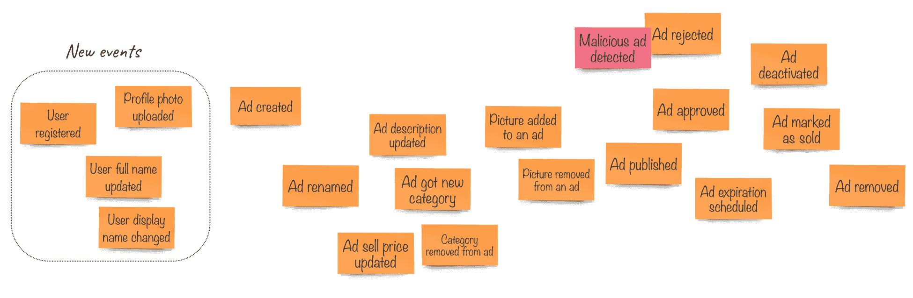
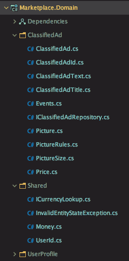
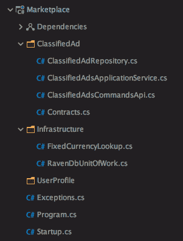
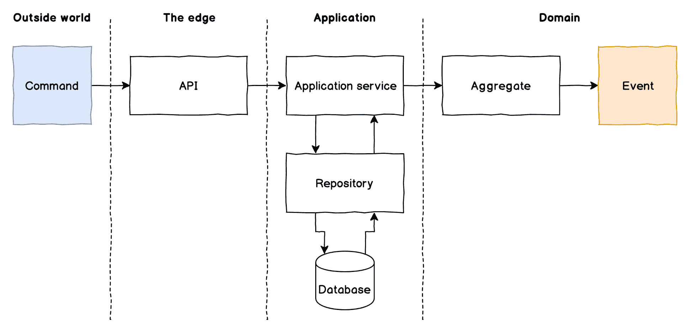
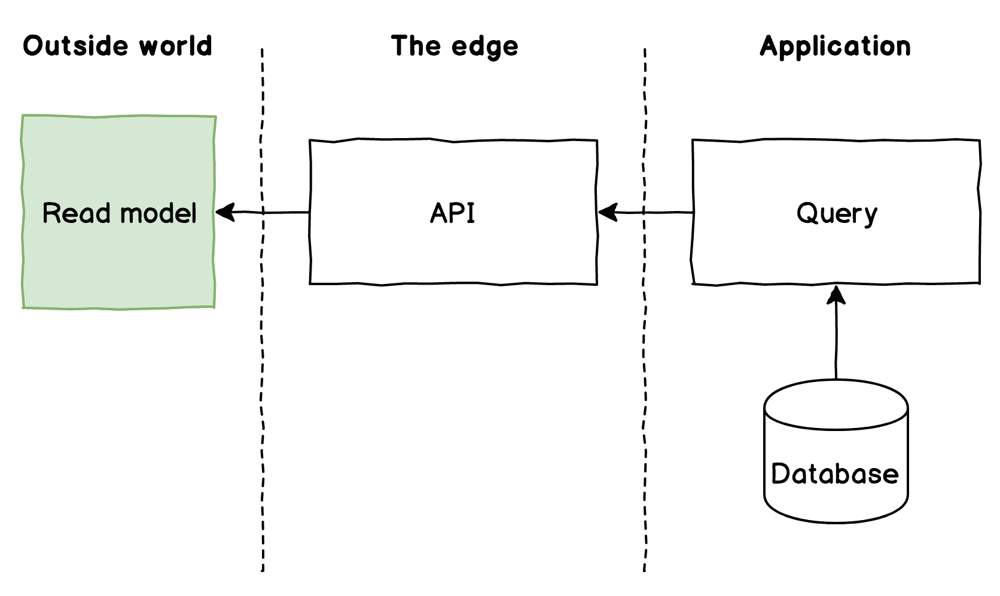

# 第九章：CQRS - 读取侧

在上一章中，我们学习了将聚合持久化到不同类型的数据库。然而，我们还没有探讨从数据库中检索数据的话题，除了使用存储库的`Load`方法来检索单个聚合。

现在是时候掌握我们成功存储在数据库中的数据，并在 API 中添加一些`GET`端点。对于这本书，我本来没有计划向您展示如何构建具有众多`GetByThat`方法的存储库，或者更糟糕的是，一个返回`IQueryable<T>`的通用存储库。这种看似吸引人的方法，却从查询中移除了通用语言，因为开发者开始通过过滤属性来检索聚合。例如，一个查询如`_repository.Query(x => x.State == State.IsActive && x.Price.Amount > 100)`告诉我们很少关于查询消费者的意图。这个过滤器对业务意味着什么？除非我们研究调用此查询的每一行代码，否则我们永远不会知道，而且可能只有在那时我们才能弄清楚它的目的。此外，自由过滤查询打开了潘多拉的盒子，在没有优化的情况下击中数据库服务器。对于关系数据库，我们最终会有许多复杂的连接和未索引的查询。对于文档数据库，如果没有数据库引擎支持的自动索引，我们甚至可能会得到失败。RavenDB 足够聪明，当我们执行服务器尚未构建索引的查询时，会创建自动索引。虽然这在开发期间不是大问题，但它将对生产系统产生严重影响，其中服务器处理大量的文档。

因此，在这本书中，我们将应用 CQRS 原则，并将命令与查询分开。我们的存储库足够好，当我们执行命令时，可以持久化新的聚合并对现有聚合进行更新。这意味着我们的命令侧是好的。现在，我们需要实现查询侧，我们将以不同的方式来实现，而不使用存储库。

在本章中，您将学习以下主题：

+   CQRS 的读取侧

+   什么是读取模型？

+   使用通用语言进行查询

+   使用单个数据库实现 CQRS

# 技术要求

本章的代码可以在 GitHub 上书籍存储库的`Chapter09`文件夹中找到。那里有两个子文件夹，`ravendb`和`ef-core`，包含使用 RavenDB 文档数据库、Entity Framework Core 和 PostgreSQL 实现聚合持久化和查询的最终代码。作为一个起点，我们将使用来自第八章，*聚合持久化*的最终代码。

您需要使用`docker-compose`来运行基础设施。如果您之前没有完成安装，请检查上一章的要求。

# 添加用户资料

在我们开始探索应用程序的读取方面之前，我们最好在领域本身中添加一些更多的关注点。到目前为止，我们一直专注于分类广告的核心领域。当我们创建一个新系统时，我们应该专注于核心领域。在我们的场景中，我们已经实施了一些核心领域的进展，现在团队正在讨论在开始创建原型之前，系统必须添加的绝对**必须具备**的功能。

你可能记得，我们已经在部分解决了广告所有权的关注点。我们在`ClassifiedAd`聚合中已经有了`UserId`类型的`OwnerId`属性，但到目前为止，我们还没有找到`OwnerId`的来源。显然，我们的系统需要用户在创建新广告之前必须注册自己。我们需要知道他们是谁以及如何与他们取得联系。因此，作为最低限度的要求，我们需要有他们的姓名和联系方式，例如电子邮件地址和电话号码。大多数时候，人们不喜欢在分类广告中展示他们的真实姓名，而更喜欢使用昵称，我们称之为**显示名**。我们也必须解决这个问题。

在 EventStorming 板上简短讨论后，团队提出了一个非常基本的方案来支持这些需求。我们不在乎整个商店的用户注册过程；这本身就是一个复杂的话题。它可能涉及社交媒体登录、电子邮件和电话号码确认、密码要求以及双因素认证。在你构建新系统时开始实现这些功能从来都不是一个好主意。很多时候，开发者会陷入**用户注册**的陷阱，花费数周甚至数月来完善注册/登录屏幕体验，而核心领域的工作却没有任何进展。记住，身份验证领域是一个通用的支持子领域，在大多数情况下，考虑使用第三方系统来处理这些关注点是非常有用的。

目前，我们只需要实现一些基本功能，这样我们就可以在显示单个广告或广告列表时，同时显示用户信息。

以下图表显示了团队在快速建模会议后生成的内容：



我们可以很容易地看出用户和分类广告之间几乎没有联系。事实上，我们只需要用户 ID，就可以用它作为所有者 ID。考虑到这一点，我们可以在我们的领域项目中尝试实现`UserProfile`作为一个新的聚合。我强烈建议你不要把这个对象称为`User`，因为它暗示了同一个对象用于身份验证，因此必须包含诸如密码和社交媒体登录信息之类的信息。但我们已经决定将其搁置，稍后解决。

# 用户资料领域关注点

首先，我们目前确定的是，我们有四个不同的事件要实现。我们还知道，我们正在向已经存在的相同领域项目中添加一个新的聚合。由于我们的聚合将有一个状态，我们可能还需要创建新的值对象。

在向项目中添加新对象之前，组织项目以便我们更好地了解其各个部分是一个好主意。

# 领域项目组织

我们首先创建一个新的项目文件夹，命名为 `ClassifiedAd`，并将现有的相关文件移动到那里。之后，我们需要为所有移动的文件修复命名空间。IDE 的自动重构功能使得这个过程相当简单。使用 ReSharper 或 Rider，你只需在类的命名空间名称上按 *Alt* + *Enter*，然后告诉它相应地调整命名空间。然后，我们为 `UserProfile` 对象添加一个新的文件夹。将所有共享领域关注点，例如 `Exception` 类、`Money` 类等，移动到 `Shared` 文件夹也是有意义的。现在，项目结构变为如下：



现在，我们可以开始实现这四个新事件。让我们在 `UserProfile` 文件夹中添加一个新的 `Events` 类，并为这些事件编写一些代码，如下所示：

```cs
using System;

namespace Marketplace.Domain.UserProfile
{
    public static class Events
    {
        public class UserRegistered
        {
            public Guid UserId { get; set; }
            public string FullName { get; set; }
            public string DisplayName { get; set; }
        }

        public class ProfilePhotoUploaded
        {
            public Guid UserId { get; set; }
            public string PhotoUrl { get; set; }
        }

        public class UserFullNameUpdated
        {
            public Guid UserId { get; set; }
            public string FullName { get; set; }
        }

        public class UserDisplayNameUpdated
        {
            public Guid UserId { get; set; }
            public string DisplayName { get; set; }
        }
    }
}
```

我们有意识地将其他东西，如电子邮件地址和电话号码，排除在版本之外，因为我们现在不需要这些信息来满足应用程序的需求，但未来我们添加更多事件和更多细节到领域模型不会有任何阻碍。

# 添加新的值对象

对于下一步，我们添加一个新的小聚合 `UserProfile` 来执行将产生这些事件并执行聚合状态转换的命令。对于聚合状态，为 `DisplayName` 和 `FullName` 状态属性实现值对象是一个好主意，所以我们从这里开始。

`FullName` 类相当简单，大部分代码与 `ClassifiedAdTitle` 类重复，如下所示：

```cs
using System;
using Marketplace.Framework;

namespace Marketplace.Domain.UserProfile
{
    public class FullName : Value<FullName>
    {
        public string Value { get; }

        internal FullName(string fullName) => Value = fullName;

        public static FullName FromString(string fullName)
        {
            if (fullName.IsEmpty())
                throw new ArgumentNullException(nameof(fullName));

            return new FullName(fullName);
        }

        public static implicit operator string(FullName fullName)
            => fullName.Value;

        // Satisfy the serialization requirements
        protected FullName() { }
    }
}
```

我添加了一个小的静态类来持有 `string` 类的扩展方法，目前那里只有一个方法，名为 `IsEmpty`，我用它来代替 `string.IsNullOrWhitespace`，所以你可以在值对象的代码中看到它的使用。

然后，我们可以实现`DisplayName`类。这并不像全名那样直接，因为，与全名不同，显示名将在公共页面上显示。我们肯定可以预期一些恶意用户会写一些我们不希望在网站上显示的内容。虽然我们的广告在发布前会经过审查阶段，但用户资料将不会进行审核。通常，用户资料会在不同的地方显示，例如讨论区、评论系统等。尽管我们还没有开始建模这些功能，但我们知道我们的路线图以及我们需要防止用户在他们的公共资料中放置恶意内容的事实。

我们可以做的事情之一是自动检查显示名是否包含粗俗词汇。有一些公开可用的服务可以帮助我们。实现细节不会成为`Domain`项目的一部分，因为它是一个基础设施关注点。相反，我们将为这样的服务创建一些抽象，这样我们就可以在不与实现耦合的情况下检查文本中的粗俗词汇。我们已经使用了一个类似的技术，即货币查找领域服务。然而，领域服务不一定需要实现为接口。另一种创建单方法领域服务的方式是使用委托。下面的代码显示了粗俗词汇检查领域服务，该服务被声明为一个委托：

```cs
namespace Marketplace.Domain.Shared
{
    public delegate bool CheckTextForProfanity(string text);
}
```

我将代码放在了`Shared/ContentModeration.cs`文件中。现在我们需要实现`DisplayName`值对象并利用新的领域服务，如下面的代码所示：

```cs
using System;
using Marketplace.Domain.Shared;
using Marketplace.Framework;

namespace Marketplace.Domain.UserProfile
{
    public class DisplayName : Value<DisplayName>
    {
        public string Value { get; }

        internal DisplayName(string displayName) => Value = 
        displayName;

        public static DisplayName FromString(
            string displayName,
            CheckTextForProfanity hasProfanity)
        {
            if (displayName.IsEmpty())
                throw new ArgumentNullException(nameof(FullName));

            if (hasProfanity(displayName))
                throw new DomainExceptions.ProfanityFound(displayName);

            return new DisplayName(displayName);
        }

        public static implicit operator string(DisplayName displayName)
            => displayName.Value;

        // Satisfy the serialization requirements
        protected DisplayName() { }
    }
}
```

在这里，你可以看到，如果委托返回`true`，代码将抛出`ProfanityFound`类型的异常，这意味着用户在显示名中使用了不良语言。我已经将所有领域异常移动到`Shared`文件夹中的一个地方。新代码位于`DomainExceptions.cs`文件中，该文件的代码如下所示：

```cs
using System;

namespace Marketplace.Domain.Shared
{
    public static class DomainExceptions
    {
        public class InvalidEntityState : Exception
        {
            public InvalidEntityState(object entity, string message)
                : base($"Entity {entity.GetType().Name} state change 
                rejected, {message}")
            { }
        }

        public class ProfanityFound : Exception
        {
            public ProfanityFound(string text)
                : base($"Profanity found in text: {text}")
            { }
        }
    }
}
```

当需要时，我们将向此文件添加更多异常。

# 用户配置文件聚合根

现在是时候编写`UserProfile`聚合的代码了。我们之前已经创建了一个聚合，所以创建一个新的聚合不会是一个大问题，尤其是考虑到用户资料是一个相对简单的对象。以下是新`UserProfile.cs`文件的代码：

```cs
using System;
using Marketplace.Framework;

namespace Marketplace.Domain.UserProfile
{
    public class UserProfile : AggregateRoot<UserId>
    {
        // Properties to handle the persistence
        private string DbId
        {
            get => $"UserProfile/{Id.Value}";
            set {}
        }

        // Aggregate state properties
        public FullName FullName { get; private set; }
        public DisplayName DisplayName { get; private set; }
        public string PhotoUrl { get; private set; }

        public UserProfile(UserId id, FullName fullName, DisplayName 
        displayName)
            => Apply(new Events.UserRegistered
            {
                UserId = id,
                FullName = fullName,
                DisplayName = displayName
            });

        public void UpdateFullName(FullName fullName)
            => Apply(new Events.UserFullNameUpdated
            {
                UserId = Id,
                FullName = fullName
            });

        public void UpdateDisplayName(DisplayName displayName)
            => Apply(new Events.UserDisplayNameUpdated
            {
                UserId = Id,
                DisplayName = displayName
            });

        public void UpdateProfilePhoto(Uri photoUrl)
            => Apply(new Events.ProfilePhotoUploaded
            {
                UserId = Id,
                PhotoUrl = photoUrl.ToString()
            });

        protected override void When(object @event)
        {
            switch (@event)
            {
                case Events.UserRegistered e:
                    Id = new UserId(e.UserId);
                    FullName = new FullName(e.FullName);
                    DisplayName = new DisplayName(e.DisplayName);
                    break;
                case Events.UserFullNameUpdated e:
                    FullName = new FullName(e.FullName);
                    break;
                case Events.UserDisplayNameUpdated e:
                    DisplayName = new DisplayName(e.DisplayName);
                    break;
                case Events.ProfilePhotoUploaded e:
                    PhotoUrl = e.PhotoUrl;
                    break;
            }
        }

        protected override void EnsureValidState()
        {
        }
    }
}
```

与`ClassifiedAd`聚合根类的代码相比，前面的代码没有做任何新的工作。我们也使用了相同的解决方案来满足对身份属性的数据库要求。由于我们从 RavenDB 实现开始，我们需要一个字符串属性来保存文档的身份。

如你所见，我使用了`UserId`值对象作为聚合根 ID。这是因为，本质上，配置文件身份必须是对应用户的 ID。这要求我通过从值对象的基础类`Value<UserId>`继承来更改`UserId`类的实现。

最后，我们需要一个存储库接口，以便我们的应用程序服务知道如何检索和持久化新实体。该接口与我们为 `ClassifiedAd` 实体创建的接口相同，正如以下代码所示：

```cs
using System.Threading.Tasks;
using Marketplace.Domain.Shared;

namespace Marketplace.Domain.UserProfile
{
    public interface IUserProfileRepository
    {
        Task<UserProfile> Load(UserId id);

        Task Add(UserProfile entity);

        Task<bool> Exists(UserProfile id);
    }
}
```

现在我们已经完成了域项目中更改。让我们继续添加用户资料应用程序服务和命令 API。

# 用户资料的应用程序端

是时候查看我们的应用程序项目并检查我们需要做什么来支持用户资料功能了。在我们开始添加新类之前，让我们执行类似的项目重构，使不同的核心功能在 **解决方案资源管理器** 中具有不同的视觉表现。我不想让应用程序项目根据基础设施关注点进行组织，但当前的项目组织方式暗示了这一点，因为我们使用了 `Api`、`Contracts` 和 `Infrastructure` 文件夹。为此，我已经将 `ClassifiedAd` 关注点移动到 `Marketplace` 项目中的一个单独文件夹，并创建了一个名为 `UserProfile` 的新文件夹。

项目现在在解决方案资源管理器中看起来不同，如下面的截图所示：



现在我们有一个地方可以添加所有支持新域功能所需的内容。我们首先向新的 `UserProfile/Contracts.cs` 文件中添加命令。我们可以通过查看事件来了解需要哪些命令，因为所有这些事件都是用户驱动的。看看以下代码：

```cs
using System;

namespace Marketplace.UserProfile
{
    public class Contracts
    {
        public static class V1
        {
            public class RegisterUser
            {
                public Guid UserId { get; set; }
                public string FullName { get; set; }
                public string DisplayName { get; set; }
            }

            public class UpdateUserFullName
            {
                public Guid UserId { get; set; }
                public string FullName { get; set; }
            }

            public class UpdateUserDisplayName
            {
                public Guid UserId { get; set; }
                public string DisplayName { get; set; }

            }

            public class UpdateUserProfilePhoto
            {
                public Guid UserId { get; set; }
                public string PhotoUrl { get; set; }
            }
        }
    }
}
```

到现在为止，你可能已经注意到 `ProfilePhotoUploaded` 事件名称与我们的 `UpdateUserProfilePhoto` 命令之间存在不匹配。我们必须保持语义清晰，因为我们的应用程序服务不会自己处理上传。相反，它将接收一个指向已上传文件的 URL。这通常发生在我们有一个复杂的用户界面，能够在浏览器中执行文件上传以及额外的操作，如调整大小和裁剪的情况下。或者，我们可以让 Web API 控制器处理上传。因此，实际上，我们的命令需要表示域中将要发生的事情——它将更新照片 URL 而不是上传照片本身。然而，如果你决定你的用户资料应用程序服务也需要处理上传，命令名称（以及相应的事件名称）需要更改以反映动作的性质。

让我们开始编写新的应用程序服务。如果我们以 `ClassifiedAdApplicationService` 类为例，这项工作相当简单。我最终得到了以下代码：

```cs
using System;
using System.Threading.Tasks;
using Marketplace.Domain.Shared;
using Marketplace.Domain.UserProfile;
using Marketplace.Framework;

namespace Marketplace.UserProfile
{
    public class UserProfileApplicationService : IApplicationService
    {
        private readonly IUserProfileRepository _repository;
        private readonly IUnitOfWork _unitOfWork;
        private readonly CheckTextForProfanity _checkText;

        public UserProfileApplicationService(
            IUserProfileRepository repository, IUnitOfWork unitOfWork,
            CheckTextForProfanity checkText)
        {
            _repository = repository;
            _unitOfWork = unitOfWork;
            _checkText = checkText;
        }

        public async Task Handle(object command)
        {
            switch (command)
            {
                case Contracts.V1.RegisterUser cmd:
                    if (await 
                    _repository.Exists(cmd.UserId.ToString()))
                        throw new InvalidOperationException($"Entity 
                        with id {cmd.UserId} already exists");

                    var userProfile = new 
                    Domain.UserProfile.UserProfile(
                        new UserId(cmd.UserId),
                        FullName.FromString(cmd.FullName), 
                        DisplayName.FromString(cmd.DisplayName, 
                        _checkText));

                    await _repository.Add(userProfile);
                    await _unitOfWork.Commit();
                    break;

                case Contracts.V1.UpdateUserFullName cmd:
                    await HandleUpdate(cmd.UserId,
                        profile => 
            profile.UpdateFullName(FullName.FromString(cmd.FullName)));
                    break;

                case Contracts.V1.UpdateUserDisplayName cmd:
                    await HandleUpdate(cmd.UserId,
                        profile => profile.UpdateDisplayName(
                            DisplayName.FromString(cmd.DisplayName, 
                            _checkText)));
                    break;

                case Contracts.V1.UpdateUserProfilePhoto cmd:
                    await HandleUpdate(cmd.UserId,
                        profile => profile.UpdateProfilePhoto(new 
                        Uri(cmd.PhotoUrl)));
                    break;

                default:
                    throw new InvalidOperationException(
                        $"Command type {command.GetType().FullName} is 
                        unknown");
            }
        }

        private async Task HandleUpdate(Guid userProfileId, 
        Action<Domain.UserProfile.UserProfile> operation)
        {
            var classifiedAd = await 
            _repository.Load(userProfileId.ToString());
            if (classifiedAd == null)
                throw new InvalidOperationException($"Entity with id 
                {userProfileId} cannot be found");

            operation(classifiedAd);

            await _unitOfWork.Commit();
        }
    }
}
```

在这个类中，我有一个依赖项——`IUserProfileRepository`。你可能已经猜到，`UserProfile` 实体的存储库实现几乎与 `ClassifiedAd` 相同，只是它将使用另一个类类型。你可能认为你可以使用一个通用存储库。但是，我们已经触及了这个话题，你可以重新审视它，或者阅读一些互联网上的文章，这些文章肯定会劝阻你使用通用存储库；然而，我们仍然可以使用通用类型作为我们特定存储库的依赖项，或者我们可以从一个通用存储库继承特定的存储库。让我们尝试后者，看看它是什么样子。我将为应用程序项目在 `Infrastructure` 文件夹中添加一个新的类，名为 `RavenDbRepository`，如下面的代码所示：

```cs
using System;
using System.Threading.Tasks;
using Marketplace.Framework;
using Raven.Client.Documents.Session;

namespace Marketplace.Infrastructure
{
    public class RavenDbRepository<T, TId>
        where T : AggregateRoot<TId>
        where TId : Value<TId>
    {
        private readonly IAsyncDocumentSession _session;
        private readonly Func<TId, string> _entityId;

        public RavenDbRepository(
            IAsyncDocumentSession session,
            Func<TId, string> entityId)
        {
            _session = session;
            _entityId = entityId;
        }

        public Task Add(T entity)
            => _session.StoreAsync(entity, _entityId(entity.Id));

        public Task<bool> Exists(TId id)
            => _session.Advanced.ExistsAsync(_entityId(id));

        public Task<T> Load(TId id)
            => _session.LoadAsync<T>(_entityId(id));
    }
}
```

我们仍然想使用特定的存储库接口和类，但现在我们可以使用以下代码实现 `UserProfileRepository`（需要添加到 `Marketplace` 项目的 `UserProfile` 文件夹中的文件）：

```cs
using Marketplace.Domain.Shared;
using Marketplace.Domain.UserProfile;
using Marketplace.Infrastructure;
using Raven.Client.Documents.Session;

namespace Marketplace.UserProfile
{
    public class UserProfileRepository
        : RavenDbRepository<Domain.UserProfile.UserProfile, UserId>, 
        IUserProfileRepository
    {
        public UserProfileRepository(IAsyncDocumentSession session) 
            : base(session, id => $"UserProfile/{id.Value.ToString()}") { }
    }
}
```

同样，可以用来实现 `ClassifiedAdRepository`，尽管未更改的版本将像以前一样工作。本章的最终代码包括简化后的代码。

现在是时候实现 API 控制器类了。如果你看看 `ClassifiedAdsCommandApi` 类，你可以看到一个名为 `HandleRequest` 的私有方法，它通过一行代码调用应用程序服务来帮助我们简化请求处理。新控制器的代码几乎相同，因此我们可以通过在 `Infrastructure` 文件夹中创建一个新的静态类 `RequestHandler` 来重用请求处理器，如下面的简单代码所示：

```cs
using System;
using System.Threading.Tasks;
using Microsoft.AspNetCore.Mvc;
using Serilog;

namespace Marketplace.Infrastructure
{
    public static class RequestHandler
    {
        public static async Task<IActionResult> HandleRequest<T>(
            T request, Func<T, Task> handler, ILogger log)
        {
            try
            {
                log.Debug("Handling HTTP request of type {type}", 
                typeof(T).Name);
                await handler(request);
                return new OkResult();
            }
            catch (Exception e)
            {
                log.Error(e, "Error handling the request");
                return new BadRequestObjectResult(new {error = 
                e.Message, stackTrace = e.StackTrace});
            }
        }
    }
}
```

这个通用方法现在可以在两个控制器中使用。让我们看看新的控制器会是什么样子。我在应用程序项目的 `UserProfile` 文件夹中创建了一个新的 `UserProfileCommandApi` 类，如下面的代码所示：

```cs
using System.Threading.Tasks;
using Marketplace.Infrastructure;
using Microsoft.AspNetCore.Mvc;
using Serilog;

namespace Marketplace.UserProfile
{
    [Route("/profile")]
    public class UserProfileCommandsApi : Controller
    {
        private readonly UserProfileApplicationService 
        _applicationService;
        private static readonly ILogger Log = 
        Serilog.Log.ForContext<UserProfileCommandsApi>();

        public UserProfileCommandsApi(UserProfileApplicationService 
        applicationService) 
            => _applicationService = applicationService;

        [HttpPost]
        public Task<IActionResult> Post(Contracts.V1.RegisterUser 
        request)
            => RequestHandler.HandleRequest(request, 
            _applicationService.Handle, Log);

        [Route("fullname")]
        [HttpPut]
        public Task<IActionResult> Put(Contracts.V1.UpdateUserFullName 
        request)
            => RequestHandler.HandleRequest(request, 
            _applicationService.Handle, Log);

        [Route("displayname")]
        [HttpPut]
        public Task<IActionResult> 
        Put(Contracts.V1.UpdateUserDisplayName request)
            => RequestHandler.HandleRequest(request, 
            _applicationService.Handle, Log);

        [Route("photo")]
        [HttpPut]
        public Task<IActionResult> 
        Put(Contracts.V1.UpdateUserProfilePhoto request)
            => RequestHandler.HandleRequest(request, 
            _applicationService.Handle, Log);
    }
}
```

广告控制器可以用类似的方式使用 `RequestHandler`；新的实现可以在章节代码中找到。

我们几乎完成了所有的更改，但还有一件事仍然缺失，那就是对粗俗检查函数的实现。我将使用 PurgoMalum，一个免费的在线服务来过滤内容并移除粗俗、下流和其他我们不希望在我们公共网站上看到的内容。

实现非常简单，因为我需要做的只是调用一个带有单个参数的 HTTP 端点。为此，我在 `Infrastructure` 文件夹中添加了一个名为 `PurgomalumClient` 的类，如下面的代码所示：

```cs
using System.Net.Http;
using System.Threading.Tasks;
using Microsoft.AspNetCore.WebUtilities;

namespace Marketplace.Infrastructure
{
    /// <summary>
    /// PurgoMalum is a simple, free, RESTful web service for filtering 
    // and removing content of profanity, obscenity and other unwanted 
    // text.
    /// Check http://www.purgomalum.com
    /// </summary>
    public class PurgomalumClient
    {
        private readonly HttpClient _httpClient;

        public PurgomalumClient() : this(new HttpClient()) { }

        public PurgomalumClient(HttpClient httpClient) => _httpClient = 
        httpClient;

        public async Task<bool> CheckForProfanity(string text)
        {
            var result = await _httpClient.GetAsync(
                QueryHelpers.AddQueryString(
                    "https://www.purgomalum.com/service
                     /containsprofanity", "text", text));

            var value = await result.Content.ReadAsStringAsync();
            return bool.Parse(value);
        }
    }
}
```

对于最后一步，我们需要在 `Startup` 类代码中进行配置。我们需要更改的唯一方法是 `ConfigureServices` 方法。以下是新的代码：

```cs
public void ConfigureServices(IServiceCollection services)
{
    var store = new DocumentStore
        {
            Urls = new[] {"http://localhost:8080"},
            Database = "Marketplace_Chapter9",
            Conventions =
            {
                FindIdentityProperty = x => x.Name == "DbId"
            }
        };
    store.Initialize();

    var purgomalumClient = new PurgomalumClient();

    services.AddSingleton<ICurrencyLookup, FixedCurrencyLookup>();
    services.AddScoped(c => store.OpenAsyncSession());
    services.AddScoped<IUnitOfWork, RavenDbUnitOfWork>();
    services.AddScoped<IClassifiedAdRepository, ClassifiedAdRepository>
    ();
    services.AddScoped<IUserProfileRepository, UserProfileRepository>
    ();
    services.AddScoped<ClassifiedAdsApplicationService>();
    services.AddScoped(c => 
        new UserProfileApplicationService(
            c.GetService<IUserProfileRepository>(),
            c.GetService<IUnitOfWork>(),
            text => purgomalumClient.CheckForProfanity(text).
            GetAwaiter().GetResult()));

    services.AddMvc();
    services.AddSwaggerGen(c =>
    {
        c.SwaggerDoc("v1",
            new Info
            {
                Title = "ClassifiedAds",
                Version = "v1"
            });
    });
}
```

`UserProfileApplicationService` 的注册比 `ClassifiedAdApplicationService` 要复杂一些，因为我们使用的是函数而不是接口。一般来说，使用代表一个方法的委托而不是接口会更简单、更干净，但在连接东西时你可能需要处理更多的代码。

最后，你可以运行应用程序并尝试创建一个新的用户资料，然后更改用户的完整名称或显示名称。尝试使用一些不雅的词作为显示名称，以查看 `ProfanityFound` 异常的实际效果。记住，在启动应用程序之前，请从章节代码存储库的 `Chapter09/ravendb` 文件夹中调用 `docker-compose up`；否则，你将无法访问 RavenDB。

现在所有这些新事物都已经到位，我们系统中有了两个很好的聚合体，而不是只有一个，我们可以看看查询方面的事情。

# 查询方面

到目前为止，我们一直关注系统中表示为事件的州转换。当我们的领域模型发出一个新事件时，根据定义，这意味着我们已经将系统置于一个新的状态。状态转换是由命令触发的——这就是为什么我们有两个故意命名为 `ClassifiedAdCommandApi` 和 `UserProfileCommandApi` 的 API。这并不令人惊讶，因为我在这本书中已经多次提到了 CQS 和 CQRS。命令触发聚合的方法，根据 CQS 原则，这些方法中没有任何一个返回任何内容，而是改变系统状态。但没有任何系统只能有命令。我们的用户希望在屏幕上看到一些东西，而不仅仅是静态文本和图片。对于我们这个市场，应用程序的主要目的并不是让人们可以在其中发布分类广告；恰恰相反：我们期望人们浏览这些广告，选择他们喜欢的，并达成交易。这意味着我们的系统需要将其拥有的信息传递给外部世界，以便可以在屏幕上显示。就在这个时候，我们只能通过查看数据库本身来看到存储在数据库中的分类广告和用户资料。从逻辑上讲，我们现在需要通过一些 API 使这些信息可用。

# CQRS 和读-写不匹配

如果你已经研究过其他关于 **领域驱动设计**（**DDD**）的书籍，并且使用过 DDD 战术模式进行了一些工作，包括聚合和仓储，你可能想知道为什么我没有在 `ClassifiedAdRepository` 中简单地包含几个查询方法，然后就此结束。当然，我可以那样做，但如果没有其他东西可以讨论，我就不会开始写这本书。

仓库的核心在于它们始终在处理聚合状态。正如你可能从第八章中埃里克·埃文斯的引言中记得的，“聚合持久性”，仓库的作用是以内存中对象集合的方式表示系统中存在的聚合，因此我们迄今为止的两个仓库的名称——`ClassifiedAdRepository`和`UserProfileRepository`。这意味着我们能从仓库中获取的唯一细节就是我们添加到其中的内容。由于一个仓库处理一个聚合的状态——例如`ClassifiedAd`——我们只能从仓库中查询和检索分类广告的详细信息，而无法获取其他信息。这里的问题是，在有限上下文中只有一个聚合（更多关于这一点在第十二章，“有限上下文”）是一种罕见的情况，而我们已经在处理两个了。

我们需要展示的信息目前还没有在 EventStorming 模型中表示出来。同样，这是因为我们的整体模型更关注系统的行为，而我们展示在屏幕上的内容并不被视为行为。然而，正如我刚才提到的，这仍然是我们的核心业务，我们可以考虑一些非常明显的事情。如果我们上线并且有人发布广告，他们需要看到广告对其他用户看起来如何。当另一个用户寻找要购买的东西并想查看所有详细信息——广告标题、描述以及所有可用的图片，以及卖家的信息时，也需要相同的屏幕。即使我们还没有考虑购买过程，这也是我们绝对需要的最基本的东西。此外，人们希望看到所有发布的广告。当系统拥有更多用户并且有更多广告被发布时，我们可能会考虑按类别展示广告。但在初始阶段，展示所有广告并提供一些搜索功能可能就足够了。

我所描述的所有屏幕都是读取模型。这些模型可能代表单个聚合的状态，但在许多情况下，或者大多数情况下，多个聚合的信息可能会在一个屏幕上组合。例如，单个广告的屏幕需要包含系统中当前拥有的两种聚合类型的信息。显示已发布广告列表的屏幕需要显示多个聚合的简短版本，尽管只是单一类型。虽然后一种情况可以通过向`IClassifiedAdRepository`接口添加查询方法来解决，但第一种情况则需要其他方法。很多时候，当我们有查询作为存储库的一部分时，我们通常需要在客户端进行一些聚合。然而，当我们只需要从每个聚合中显示几个属性时，返回大量对象图（存储库应该做的事情）往往远非最佳解决方案。更糟糕的是，我们可能会发现自己处于对象图太大而开始使用那些在测试中可能表现良好的尴尬的 ORM 延迟加载特性，但在无状态的 Web 世界中却失败，这仅仅是因为我们想要访问以延迟加载更多数据的会话在尝试请求更多数据时已经不存在了。

所有这些问题都有效地通过 CQRS 得到了解决。该模式假设几乎不存在读写数量相等的系统。大多数面向用户的面板系统读操作的数量要多于写操作。想想在 Craigslist 上创建的分类广告数量与请求在某人屏幕上检索和显示这些广告的数量相比。它们之间的差异可能是两个数量级。即便如此，今天大多数系统之所以会面临扩展问题，仅仅是因为它们忽略了这个简单的事实。没有数据库可以预先优化以同时处理读和写——你需要选择一个。最初，我们只处理写操作并试图仅针对它们进行优化。关系数据库管理系统（RDBMS）的第三级规范化正是针对这一点——它显示了需要写入的最少信息量，以节省空间并避免数据重复。然而，当涉及到读操作时，第三级规范化并不那么有效。我们不断地添加连接，一个接一个，以将我们在写入时故意分开的信息再次组合在一起。很快，读操作的数量就超过了写操作的数量。不久之后，我们看到读操作的数量比写操作多出十倍甚至百倍，这就是麻烦开始的地方。当然，还有其他类型的系统，比如物联网（**IoT**）的世界、高频交易以及其他商业领域。在这些情况下，写入数据库的信息量远远大于需要向任何人展示的信息量。开发者开始优化写操作，减少事务时间。这通常是以移除索引和使数据扁平化为代价的。当涉及到读操作时，我们开始看到响应时间变慢，仅仅是因为这个原因。

从本质上讲，我试图说明的是，当开发者试图解决写或读的担忧，以使它们在命令端更加高效时，查询端开始受到影响。反过来也是一样。这就是为什么 CQRS 应运而生。在本章中，我们将只关注使用单个数据库时的查询端。鉴于你刚刚读到的内容，这可能会听起来有些矛盾，因为，再次强调，数据库很少能同时优化。但我们需要从某个地方开始，既然优化是所有邪恶的根源，我们就慢慢来。当我们到达第十一章，特别是“投影和查询”这一特定部分时，我们将探讨将读和写分离到不同类型的存储中。但现在，让我们看看我们如何能够从现有的存储中执行更有效的读操作，而完全不使用仓库。

# 查询和读模型

当我们在构建领域模型时，我们需要小心地处理依赖关系，以确保领域模型保持纯净，不受任何基础设施问题的干扰。我们的目标是提供一定程度的自由度，以便从业务的角度出发，使用通用语言来实现领域逻辑。我们还定义了存储库接口作为领域模型的一部分，以便应用层能够实现这些接口，从而实现聚合持久化。然后，我们定义命令为我们的应用服务可以接受的合约，以便对领域对象执行操作并可能执行状态转换。总体而言，命令处理序列不同部分之间的隔离和关注点分离是根据以下图表实现的：



典型的命令流程

当我们需要使用存储库查询我们放置领域模型状态的数据库时，我们的目标发生了变化。查询中不需要任何业务规则；查询不会改变领域模型的状态。但我们确实需要知道我们的应用实现的存储库实现如何在数据库中表示我们的聚合状态。这使得查询成为纯粹的应用侧关注点。当我们添加一个 API 从我们的系统中获取某些内容时，我们需要 API 只处理持久化。API `GET` 端点返回的模型成为我们对外界的合约。我们不需要任何其他模型，例如数据模型，来获取数据；我们可以直接将我们从数据库中得到的结果作为响应返回。

查询的流程变得更为简单，我们可以将其可视化如下所示：



典型的查询流程

我们通过 API 看到的返回结果是读取模型。我们需要以这种方式进行查询，以便可以从数据库中检索读取模型，而无需在不同模型之间进行任何转换——我们直接返回它。这使我们能够简化获取数据并将其返回给那些需要在屏幕上显示或用于任何其他可想象目的的人的方式。这就是 CQRS 读取侧背后的整个想法。现在，是时候编写一些代码并展示它是如何工作的了。

# 实现查询

在实现读取侧时，我们不需要触及领域模型中的任何内容。我们将集中精力在应用程序侧。然而，这并不意味着我们需要忘记通用语言。最终，读取模型是整个模型的一部分；我们在 EventStorming 会话中看到了它们，作为绿色的便利贴。读取模型帮助人们和其他系统根据他们通过执行我们的查询接收到的数据做出决策。正如命令表明外部各方意图在我们的领域上运行某些操作一样，读取模型和查询表达了他们获取某些东西的意图。

例如，对于我们的 `Marketplace` 应用程序，我们期望购物者浏览已发布的广告。广告所有者需要查看他们广告的列表。每个人都应该能够打开单个广告并查看其中所有公开的内容，以及所有者的公开详细信息，例如他们的照片和显示名称。这些都是显而易见的查询和读取模型，我们可以开始实施。我们已经有所有数据，以多个聚合的状态形式存在，我们只需要从数据库中以可用的形式获取这些数据。

# 查询 API

我们可以通过指定读取模型和 API 来开始实施查询。在我们的 `Marketplace` 项目中，我们已经为不同的应用程序功能创建了文件夹。在那里添加查询似乎合乎逻辑，直到我们想起一些读取模型会结合来自不同聚合的数据，例如分类广告的详细信息以及所有者的个人资料信息。这种类型的模型和查询应该放在哪里呢？好吧，有一些选择，但我倾向于专注于所需信息的本质。如果我们需要查看单个广告，那就是我们主要想看的内容。尽管我们可能也会提供一些所有者详情，但所有者详情并不是我们想要展示的主要内容。最终，我们通过广告 ID 查询单个广告，用户的个人资料信息是从广告详情中派生出来的，例如所有者 ID，因此我们仍然可以相当清楚地确定放置这些查询的位置。

由于我们已经发现了一些我们想要通过 API 返回的东西，而且所有这些都与广告相关，所以我们把它们放在那里。现在我们需要向 `Marketplace` 项目的 `ClassifiedAd` 文件夹中添加两个文件——一个是 `ReadModels.cs`，另一个是 `ClassifiedAdsQueryApi.cs`。

根据查询要求，让我们首先使用以下代码定义读取模型：

```cs
using System;

namespace Marketplace.ClassifiedAd
{
    public static class ReadModels
    {
        public class ClassifiedAdDetails
        {
            public Guid ClassifiedAdId { get; set; }
            public string Title { get; set; }
            public decimal Price { get; set; }
            public string CurrencyCode { get; set; }
            public string Description { get; set; }
            public string SellersDisplayName { get; set; }
            public string[] PhotoUrls { get; set; }
        }

        public class ClassifiedAdListItem
        {
            public Guid ClassifiedAdId { get; set; }
            public string Title { get; set; }
            public decimal Price { get; set; }
            public string CurrencyCode { get; set; }
            public string PhotoUrl { get; set; }
        }
    }
}
```

实施查询的一种方式是创建一个查询服务接口，该接口将被 API 使用。然后，在启动时将其连接到特定于数据库的实现。就我们的目的而言，它可能看起来像这样：

```cs
public interface IClassifiedAdQueryService
{
    Task<IEnumerable<ClassifiedAdListItem>> GetPublishedAds(
        int page, int pageSize);
    Task<ClassifiedAdDetails> GetPublicClassifiedAd(
        Guid classifiedAdId);
    Task<IEnumerable<ClassifiedAdListItem>> 
    GetClassifiedAdsOwnedBy(Guid userId, int page, int pageSize);
}
```

这种方法有一个缺点——所有参数都是分开的，当我们实现 API 时，我们需要将这些参数全部添加到 API 方法中。如果你决定为你的边缘使用其他东西，比如 ServiceStack 或消息框架，你将不得不使用类型化请求，然后扩展请求属性到查询服务方法参数。如果你需要出于某种原因更改参数，你将需要更改多个地方中的代码。这也可能影响 UI。例如，如果你使用一个**单页应用**（SPA）并且 API 是从前端 JavaScript 代码中调用的，你可能需要在某种服务中抽象 API 调用，该服务需要更改以添加新的参数到调用中。

ServiceStack 框架之所以提倡为 HTTP API 使用消息驱动的方法，是有原因的。它使请求类型化，并消除了 API 方法和所有与 API 通信的层的长参数列表的需求。因此，在代码的后续部分，我们也将使用类型化请求，因此也将使用类型化查询。如果我们想使用类型化请求来实现查询服务，它将看起来像这样：

```cs
public interface IClassifiedAdQueryService
{
    Task<IEnumerable<ClassifiedAdListItem>> 
    Query(GetPublishedClassifiedAds query);
    Task<ClassifiedAdDetails> Query(GetPublicClassifiedAd query);
    Task<IEnumerable<ClassifiedAdListItem>> 
    Query(GetOwnersClassifiedAds query);
}
```

在这里，我们有几个`Query`方法的重载，它们都接受类型化的查询请求。查询请求的类型定义了我们期望得到的内容。我们也可以为 API 使用相同的类型。现在，让我们在不使用查询服务的情况下实现这些查询合约和`ClassifiedAdQueryApi`类，如下面的代码所示：

```cs
using System;

namespace Marketplace.ClassifiedAd
{
    public static class QueryModels
    {
        public class GetPublishedClassifiedAds
        {
            public int Page { get; set; }
            public int PageSize { get; set; }
        }

        public class GetOwnersClassifiedAd
        {
            public Guid OwnerId { get; set; }
            public int Page { get; set; }
            public int PageSize { get; set; }
        }

        public class GetPublicClassifiedAd
        {
            public Guid ClassifiedAdId { get; set; }
        }
    }
}
```

接下来是 API：

```cs
using System.Collections.Generic;
using System.Net;
using System.Threading.Tasks;
using Microsoft.AspNetCore.Mvc;

namespace Marketplace.ClassifiedAd
{
    [Route("/ad")]
    public class ClassifiedAdsQueryApi : Controller
    {
        [HttpGet]
        [Route("list")]
        public Task<IActionResult> 
        Get(QueryModels.GetPublishedClassifiedAds request)
        {
        }

        [HttpGet]
        [Route("myads")]
        public Task<IActionResult> 
        Get(QueryModels.GetOwnersClassifiedAd request)
        {
        }

        [HttpGet]
        [ProducesResponseType((int) HttpStatusCode.OK)]
        [ProducesResponseType((int) HttpStatusCode.NotFound)]
        public Task<IActionResult> 
        Get(QueryModels.GetPublicClassifiedAd request)
        {
        }
    }
}
```

这看起来相当整洁。我们使用了两种类型的请求和类型化响应。当我们通过 ID 获取一个广告时，我们可以返回`200 OK`或`404 Not Found`响应。

现在，让我们回到查询服务。你可能会有一个很大的疑问：*如果我只有一个实现，为什么我还需要一个接口？*这个问题是完全合理的。接口并不是为了仅仅为了测试而使用，以使依赖项可以被模拟。基本上，如果你只使用接口进行测试，你可能需要重新考虑是否真的需要这个接口。在这个上下文中，查询尤其相关，因为使用模拟查询来测试 API 几乎没有什么意义。

如果你想要测试你的查询，并且你知道它们属于基础设施和应用，那么在不使用基础设施的情况下测试它们有什么意义呢？你最终只会测试序列化，虽然这可能不是一个坏主意，但查询的主要功能将不会被测试。查询测试确实需要使用它们所交谈的数据库。

在澄清了这个重要问题之后，我们可以考虑在接近数据库级别 API 的地方实现查询。实现这一目标的一种方法是通过使用扩展方法。在接下来的两个部分中，我们将使用这种方法来实现 RavenDB 和 Entity Framework 的查询，并相应地完成 API。

# 使用 RavenDB 的查询

如我们所知，RavenDB 客户端库允许我们使用文档会话接口将文档存储在数据库中。文档会话接口代表与数据库的单个、短暂连接。通常，它是按请求范围，因为单个请求是我们工作单元的范围。它不仅适用于命令；我们还可以在查询端点使用在应用程序的`Startup`类中注册的文档会话。

在以下代码中，我尝试使用`IAsyncDocumentSession`接口的扩展方法实现一个数据库查询，该接口我们在 API 的服务容器中进行了注册：

```cs
using System.Collections.Generic;
using System.Linq;
using System.Reflection.Metadata.Ecma335;
using System.Threading.Tasks;
using Raven.Client.Documents;
using Raven.Client.Documents.Linq;
using Raven.Client.Documents.Session;
using static Marketplace.ClassifiedAd.ReadModels;
using static Marketplace.Domain.ClassifiedAd.ClassifiedAd;
namespace Marketplace.ClassifiedAd
{
    public static class Queries
    {
        public static Task<List<PublicClassifiedAdListItem>> 
        Query(
            this IAsyncDocumentSession session,
            QueryModels.GetPublishedClassifiedAds query) =>
            session.Query<Domain.ClassifiedAd.ClassifiedAd>()
                .Where(x => x.State == ClassifiedAdState.Active)
                .Select(x => new PublicClassifiedAdListItem
                {
                    ClassifiedAdId = x.Id.Value,
                    Price = x.Price.Amount,
                    Title = x.Title.Value,
                    CurrencyCode = x.Price.Currency.CurrencyCode
                })
                .Skip(query.Page * query.PageSize)
                .Take(query.PageSize)
                .ToListAsync();
    }
}
```

最新版本的 RavenDB 支持内联投影，所以我们在这里需要做的就是运行一个带有`Where`的正常查询，然后将复杂的`ClassifiedAd`聚合状态文档投影到读取模型对象上。然后，我们需要应用分页并调用`ToListAsync`，以便在服务器上执行查询。

准备好这个查询后，我们可以从 API 中调用它。我将注释掉当前没有查询可用的 API 方法。因此，API 类将有一个方法，如下面的代码所示：

```cs
using System;
using System.Threading.Tasks;
using Microsoft.AspNetCore.Mvc;
using Raven.Client.Documents.Session;
using Serilog;

namespace Marketplace.ClassifiedAd
{
    [Route("/ad")]
    public class ClassifiedAdsQueryApi : Controller
    {
        private readonly IAsyncDocumentSession _session;

        public ClassifiedAdsQueryApi(IAsyncDocumentSession session)
            => _session = session;

        [HttpGet]
        [Route("list")]
        public async Task<IActionResult> 
        Get(QueryModels.GetPublishedClassifiedAds request)
        {
            try
            {
                var ads = await _session.Query(request);
                return Ok(ads);
            }
            catch (Exception e)
            {
                Log.Error(e, "Error handling the query");
                throw;
            }
        }
    }
}
```

由于我在数据库中已经有了一些数据（一个广告），我现在可以使用 Swagger 执行它。我将页面数设置为`0`，将页面大小设置为`10`，但查询没有返回任何结果。这是因为我的分类广告尚未发布，所以查询条件将其过滤掉了。我需要发送广告进行审查，然后使用新的`Guid`为`ApproverId`进行批准。完成此操作后，我可以看到 API 返回的读取模型。您也可以通过访问`http://localhost:5000/ad/list?Page=0&PageSize=10`直接在浏览器中调用 API。浏览器应显示以下 JSON：

```cs
[
    {
        classifiedAdId: "d338696a-342e-45cf-a02e-178dcb8e95f8",
        title: "Red sofa",
        price: 100,
        currencyCode: "EUR",
        photoUrl: null
    }
]
```

我们现在想添加其他查询，但这意味着我们需要将所有查询包装在这个`try/catch`块中。让我们看看我们是否可以遵循**DRY**（即**不要重复自己**）原则，并创建一个有用的函数来处理所有查询。我们已经在使用静态`RequestHandler`类的命令中这样做过了。我将在下面添加一个新的函数来处理查询，如下面的代码所示：

```cs
public static async Task<IActionResult> HandleQuery<TModel>(
    Func<Task<TModel>> query, ILogger log)
{
    try
    {
        return new OkObjectResult(await query());
    }
    catch (Exception e)
    {
        log.Error(e, "Error handling the query");
        return new BadRequestObjectResult(new
        {
            error = e.Message, stackTrace = e.StackTrace
        });
    }
}
```

添加下一个查询以获取所有按所有者 ID 分类的广告相当简单；我们只需更改条件并保持从文档到读取模型的读取模型投影。为了使方法更短，我添加了`PagedList`扩展方法，因此整个类现在看起来如下所示：

```cs
using System.Collections.Generic;
using System.Threading.Tasks;
using Raven.Client.Documents;
using Raven.Client.Documents.Linq;
using Raven.Client.Documents.Queries;
using Raven.Client.Documents.Session;
using static Marketplace.ClassifiedAd.ReadModels;
using static Marketplace.Domain.ClassifiedAd.ClassifiedAd;

namespace Marketplace.ClassifiedAd
{
    public static class Queries
    {
        public static Task<List<PublicClassifiedAdListItem>> Query(
            this IAsyncDocumentSession session,
            QueryModels.GetPublishedClassifiedAds query
        ) =>
            session.Query<Domain.ClassifiedAd.ClassifiedAd>()
                .Where(x => x.State == ClassifiedAdState.Active)
                .Select(
                    x =>
                        new PublicClassifiedAdListItem
                        {
                            ClassifiedAdId = x.Id.Value,
                            Price = x.Price.Amount,
                            Title = x.Title.Value,
                            CurrencyCode = 
                            x.Price.Currency.CurrencyCode
                        }
                )
                .PagedList(query.Page, query.PageSize);

        public static Task<List<PublicClassifiedAdListItem>> Query(
            this IAsyncDocumentSession session,
            QueryModels.GetOwnersClassifiedAd query
        )
            =>
                session.Query<Domain.ClassifiedAd.ClassifiedAd>()
                    .Where(x => x.OwnerId.Value == query.OwnerId)
                    .Select(
                        x =>
                            new PublicClassifiedAdListItem
                            {
                                ClassifiedAdId = x.Id.Value,
                                Price = x.Price.Amount,
                                Title = x.Title.Value,
                                CurrencyCode = 
                                x.Price.Currency.CurrencyCode
                            }
                    )
                    .PagedList(query.Page, query.PageSize);

        public static Task<ClassifiedAdDetails> Query(
            this IAsyncDocumentSession session,
            QueryModels.GetPublicClassifiedAd query
        )
            => (from ad in session.Query<Domain.ClassifiedAd.
            ClassifiedAd>()
                where ad.Id.Value == query.ClassifiedAdId
                let user = RavenQuery
                    .Load<Domain.UserProfile.UserProfile>(
                        "UserProfile/" + ad.OwnerId.Value
                    )
                select new ClassifiedAdDetails
                {
                    ClassifiedAdId = ad.Id.Value,
                    Title = ad.Title.Value,
                    Description = ad.Text.Value,
                    Price = ad.Price.Amount,
                    CurrencyCode = ad.Price.Currency.CurrencyCode,
                    SellersDisplayName = user.DisplayName.Value
                }).SingleAsync();

        private static Task<List<T>> PagedList<T>(
            this IRavenQueryable<T> query, int page, int pageSize
        ) =>
            query
                .Skip(page * pageSize)
                .Take(pageSize)
                .ToListAsync();
    }
}
```

如果我们想使用 LINQ-to-objects，我们也可以将投影移动到单独的函数中。然而，这里的查询是发送到服务器的，服务器对我们的客户端代码一无所知。因此，我们需要在每个方法中重复投影代码。

现在，我可以添加 API 调用并使用新的`HandleQuery`函数。以下是整个`ClassifiedAdQueryApi`类的代码，它使用了两个查询：

```cs
using System.Threading.Tasks;
using Marketplace.Infrastructure;
using Microsoft.AspNetCore.Mvc;
using Raven.Client.Documents.Session;
using Serilog;

namespace Marketplace.ClassifiedAd
{
    [Route("/ad")]
    public class ClassifiedAdsQueryApi : Controller
    {
        private static ILogger _log = 
        Log.ForContext<ClassifiedAdsQueryApi>();

        private readonly IAsyncDocumentSession _session;

        public ClassifiedAdsQueryApi(IAsyncDocumentSession session)
            => _session = session;

        [HttpGet]
        [Route("list")]
        public Task<IActionResult> 
        Get(QueryModels.GetPublishedClassifiedAds request) 
            => RequestHandler.HandleQuery(() => 
                _session.Query(request), _log);

        [HttpGet]
        [Route("myads")]
        public Task<IActionResult> 
        Get(QueryModels.GetOwnersClassifiedAd request)
            => RequestHandler.HandleQuery(() => 
                _session.Query(request), _log);
    }
}
```

你可以看到，API 端点的处理方法变得和命令 API 方法一样简洁，所有的查询逻辑都被移动到了扩展方法中。

最后，我们到达了需要创建一个查询以结合一个读取模型中两个不同文档的数据的点。为了处理这种情况，RavenDB 提供了一个使用已加载文档的投影功能。使用这个功能，我们可以使用来自我们查询的文档（`ClassifiedAd`）的 ID 加载另一个文档（`UserProfile`）。

查询看起来稍微复杂一些，但并不太多。下面是（我只列出了以下代码中的新功能）：

```cs
public static Task<ReadModels.ClassifiedAdDetails> Query(
    this IAsyncDocumentSession session,
    QueryModels.GetPublicClassifiedAd query)
    => (from ad in session.Query<Domain.ClassifiedAd.ClassifiedAd>()
        where ad.Id.Value == query.ClassifiedAdId
        let user = RavenQuery
            .Load<Domain.UserProfile.UserProfile>("UserProfile/" + 
            ad.OwnerId.Value)
        select new ReadModels.ClassifiedAdDetails
        {
            ClassifiedAdId = ad.Id.Value,
            Title = ad.Title.Value,
            Description = ad.Text.Value,
            Price = ad.Price.Amount,
            CurrencyCode = ad.Price.Currency.CurrencyCode,
            SellersDisplayName = user.DisplayName.Value
        }).SingleAsync();
```

现在，我们可以通过添加一个方法来完成查询 API，这个方法与前面两个一样简短，如下所示：

```cs
[HttpGet]
public Task<IActionResult> Get(QueryModels.GetPublicClassifiedAd request)
    => RequestHandler.HandleQuery(() => _session.Query(request), _log);
```

这里的不同之处在于我们没有路由，因为我们想从`ad`路由本身通过 ID 获取资源。现在，我可以启动应用程序并访问`http://localhost:5000/ad?ClassifiedAdId=d338696a-342e-45cf-a02e-178dcb8e95f8`来查看以下结果：

```cs
{
    classifiedAdId: "d338696a-342e-45cf-a02e-178dcb8e95f8",
    title: "Red sofa",
    price: 100,
    currencyCode: "EUR",
    description: "Really good",
    sellersDisplayName: "prejudice",
    photoUrls: null
}
```

请注意，这个 GUID 是我数据库中的广告 ID；你可能需要检查数据库以找出你自己的使用情况。一些读者可能也不满意 URL 不是完全符合 REST 规范，因为它使用查询参数而不是路由。我相信这是一个简单的修复，但那时你需要移除查询对象，并在 API 方法中使用映射到路由参数的参数。

如你所见，我们成功地实现了所有想要的查询，并将它们与底层持久性保持紧密。这些查询可以直接从 API 调用，我们的领域模型将保持不变。我们还能够在一个读取模型中结合来自两个不同聚合的数据，这是使用存储库无法做到的，因为存储库总是只处理聚合根。

我们的查询直接使用数据库功能，没有在`IAsyncDocumentSession`之上引入任何抽象。使用扩展方法还允许我们消除对接口的需求，并且我们的查询不会因为这一点而变得难以测试。我们可以很容易地编写集成测试，这些测试将直接使用数据库，这样我们就可以检查我们的查询是如何工作的。

我们还使用了查询对象作为我们的 API 合约和查询方法的参数。同样，通过使用读取模型，我们能够使用相同的对象作为查询结果和 API 调用响应，因此我们不需要在不同层之间进行任何无用的模型映射。

# 使用 Entity Framework 的查询

现在我们来看看如何使用 SQL 做同样的事情。你可能想知道我是否真的指的是 Entity Framework 而不是 SQL。实际上，我并不打算使用 Entity Framework 本身的任何功能，因为使用关系数据库实现 CQRS 查询的最佳方式是直接使用 SQL。我们将在稍后讨论使用 Entity Framework 时出现的一个问题。

在上一节中，我们做了很多工作，包括创建查询、读取模型和使用了 RavenDB 的 API 端点。我不会逐一介绍所有相同的步骤。以下是对这两个实现中完全相同的阶段的简要描述；您可以使用这个列表，只需将相关文件从一种实现复制到另一种实现：

+   `UserProfile`聚合和相关的值对象

+   命令 API 和用户资料及分类广告的应用服务

+   `ContentModeration`委托

+   使用功能文件夹重构

+   读取模型

+   查询类

+   两个查询 API

当然，我们还需要在`ClassifiedAd`聚合中复制一个小改动来处理`Publish`命令。

我还需要在 Entity Framework 风格的项目中添加一个`UserProfileRepository`。它需要实现的接口与之前完全相同。仓库实现本身与我们在上一章中制作的`ClassifiedAdRepository`相同。下面是代码：

```cs
using System;
using System.Threading.Tasks;
using Marketplace.Domain.Shared;
using Marketplace.Domain.UserProfile;
using Marketplace.Infrastructure;

namespace Marketplace.UserProfile
{
    public class UserProfileRepository : IUserProfileRepository, 
    IDisposable
    {
        private readonly MarketplaceDbContext _dbContext;

        public UserProfileRepository(MarketplaceDbContext dbContext) 
            => _dbContext = dbContext;

        public Task Add(Domain.UserProfile.UserProfile entity) 
            => _dbContext.UserProfiles.AddAsync(entity);

        public async Task<bool> Exists(UserId id) 
            => await _dbContext.UserProfiles.FindAsync(id.Value) 
                != null;

        public Task<Domain.UserProfile.UserProfile> Load(UserId id)
            => _dbContext.UserProfiles.FindAsync(id.Value);

        public void Dispose() => _dbContext.Dispose();
    }
}
```

看起来我们唯一需要做的是将现有的`ClassifiedAdDbContext`重命名为`MarketPlaceDbContext`，为值对象添加所有必要的配置，然后进行连接。这也是我的第一个想法。我添加了一个新的实体类型配置，如下面的代码所示：

```cs
public class UserProfileEntityTypeConfiguration 
    : IEntityTypeConfiguration<Domain.UserProfile.UserProfile>
{
    public void Configure(EntityTypeBuilder<Domain.UserProfile.UserProfile> builder)
    {
        builder.HasKey(x => x.UserProfileId);
        builder.OwnsOne(x => x.Id);
        builder.OwnsOne(x => x.DisplayName);
        builder.OwnsOne(x => x.FullName);
    }
}
```

注意，在这里，我必须使用一个额外的属性来保存 ID 的原始值，就像我们在第八章中为`ClassifiedAd`所做的那样，*聚合持久化*。

然后，我只需再添加一个`DbSet`，如下面的代码所示：

```cs
public DbSet<Domain.UserProfile.UserProfile> UserProfiles { get; set; }
```

完成这些后，我可以更改`OnModelCreating`的重写，如下所示：

```cs
protected override void OnModelCreating(ModelBuilder modelBuilder)
{
    modelBuilder.ApplyConfiguration(new 
    ClassifiedAdEntityTypeConfiguration());
    modelBuilder.ApplyConfiguration(new 
    PictureEntityTypeConfiguration());
    modelBuilder.ApplyConfiguration(new 
    UserProfileEntityTypeConfiguration());
}
```

现在，我们需要利用它来更改连接，如下面的代码所示：

```cs
public void ConfigureServices(IServiceCollection services)
{
    const string connectionString = 
        "Host=localhost;Database=Marketplace_Chapter9;
        Username=ddd;Password=book";
    services.AddEntityFrameworkNpgsql();
    services.AddPostgresDbContext<MarketPlaceDbContext>
    (connectionString);

    var purgomalumClient = new PurgomalumClient();

    services.AddSingleton<ICurrencyLookup, FixedCurrencyLookup>();
    services.AddScoped<IUnitOfWork, EfCoreUnitOfWork>();
    services.AddScoped<IClassifiedAdRepository, ClassifiedAdRepository>
    ();
    services.AddScoped<IUserProfileRepository, UserProfileRepository>
    ();
    services.AddScoped<ClassifiedAdsApplicationService>();
    services.AddScoped(c => 
        new UserProfileApplicationService(
            c.GetService<IUserProfileRepository>(),
            c.GetService<IUnitOfWork>(),
            text => purgomalumClient.CheckForProfanity(text)
                .GetAwaiter().GetResult()));

    services.AddMvc();
    services.AddSwaggerGen(c =>
    {
        c.SwaggerDoc("v1",
            new Info
            {
                Title = "ClassifiedAds",
                Version = "v1"
            });
    });
}
```

前面的代码使用了`AddPostgresDbContext`扩展方法；它只是包装了之前的内容。您可以在章节仓库中找到代码。

到目前为止，我们可以执行应用程序并创建一个新的用户资料，然后使用相同的用户 ID 创建几个分类广告，所有这些操作都使用命令 API。

下一步是开始实现查询。按照计划，我们采用纯 SQL。然而，使用 SQL 将需要我们创建额外的上下文并为每个读取模型创建`DbSet`。这似乎有些过度。因此，我将使用 Dapper，这是一个轻量级的 SQL 到对象辅助库。它为`SqlConnection`类添加了多个有用的扩展，我们还将添加更多扩展，所以这应该没问题。因此，我在`Marketplace`项目中添加了 Dapper 包，并在`Startup.ConfigureServices`方法中通过添加以下代码进行连接：

```cs
using System.Threading.Tasks;
using static Marketplace.ClassifiedAd.ReadModels;
using static Marketplace.Domain.ClassifiedAd.ClassifiedAd;
using static Marketplace.ClassifiedAd.QueryModels;
using Dapper;

namespace Marketplace.ClassifiedAd
{
    public static class Queries
    {
        public static Task<IEnumerable<PublicClassifiedAdListItem>> 
        Query(
            this DbConnection connection,
            GetPublishedClassifiedAds query)
            => connection.QueryAsync<PublicClassifiedAdListItem>(
                "SELECT \"ClassifiedAdId\", \"Price_Amount\", 
                \"Title_Value\" " +
                "FROM \"ClassifiedAds\" WHERE \"State\"=@State LIMIT 
                @PageSize OFFSET @Offset",
                new
                {
                    State = (int)ClassifiedAdState.Active,
                    PageSize = query.PageSize,
                    Offset = Offset(query.Page, query.PageSize)
                });
```

我没有关闭连接的原因是`DbConnection`在容器中注册为作用域，因此它按请求实例化。由于我们只使用一次连接，它将被自动释放并关闭。当然，你也可以显式地关闭它。

然而，如果我们尝试这样做，我们会得到一个空的结果。如果我们检查数据库表以查看活动分类广告存储的数据，我们可以看到活动广告的`State`列的值为`2`。同时，`ClassifiedAdState`枚举在第二个位置有`Active`值。在 Entity Framework 中有一个奇怪的事情，那就是它从`1`开始计数枚举值，而`(int)`类型总是从`0`开始计数。当然，我们可以在查询中使用静态的`2`值，但这在我们需要更改枚举并重新排序值时不会提供任何安全性。重新排序这个枚举对写入端也会很危险，因为 Entity Framework 也不会保持正确的计数器。为了解决这个问题，让我们在枚举中添加显式的`int`值而不是使用以下代码：

```cs
public enum ClassifiedAdState
{
    PendingReview = 1,
    Active = 2,
    Inactive = 3,
    MarkedAsSold = 4
}
```

在进行此更改后，我们得到了正确的结果。我在数据库中有一个活动广告，所以我得到了 JSON 数组中的一个元素，如下所示：

```cs
[
  {
    "classifiedAdId": "556bc798-bacc-4bb8-a55b-50144add4f17",
    "title": "Green sofa",
    "price": 110,
    "currencyCode": null,
    "photoUrl": null
  }
]
```

到目前为止，一切顺利。接下来，我们可以实现`myads`路由，该路由查询特定用户拥有的所有分类广告。查询几乎与上一个相同；我们只需更改以下代码中的`WHERE`条件：

```cs
public static Task<IEnumerable<PublicClassifiedAdListItem>> Query(
    this DbConnection connection,
    GetOwnersClassifiedAd query) =>
    connection.QueryAsync<ReadModels.PublicClassifiedAdListItem>(
        "SELECT \"ClassifiedAdId\", \"Price_Amount\" price, 
        \"Title_Value\" title " +
        "FROM \"ClassifiedAds\" WHERE \"OwnerId_Value\"=@OwnerId LIMIT 
        @PageSize OFFSET @Offset",
            new
            {
                OwnerId = query.OwnerId,
                PageSize = query.PageSize,
                Offset = Offset(query.Page, query.PageSize)
            });
```

如果我使用之前添加到系统中的广告的正确所有者 ID，我会得到与之前完全相同的结果。为了更好地展示这些内容，我为相同的所有者 ID 添加了一个新的分类广告并更改了其标题，但尚未发布。因此，当我执行`list`查询时，我仍然得到单个广告的相同结果。当我执行`myads`查询时，我得到以下两个结果而不是一个：

```cs
[
  {
    "classifiedAdId": "556bc798-bacc-4bb8-a55b-50144add4f17",
    "title": "Green sofa",
    "price": 110,
    "currencyCode": null,
    "photoUrl": null
  },
  {
    "classifiedAdId": "21f750fa-5a24-405b-8aad-20935b5974ed",
    "title": "Not ready yet",
    "price": -1,
    "currencyCode": null,
    "photoUrl": null
  }
]
```

在这里，我们可以看到价格属性值为`-1`，这代表`Price.NoPrice`值，当我们在 UI 中渲染时可以相应地处理。

最后一个查询稍微复杂一些，因为它需要一个连接。但是，由于连接是 SQL 操作中非常常见的操作，因此实现这个查询也不会很难；我们只需使用以下代码：

```cs
public static Task<ClassifiedAdDetails> Query(
    this DbConnection connection,
    GetPublicClassifiedAd query) =>
    connection.QuerySingleOrDefaultAsync<ClassifiedAdDetails>(
        "SELECT \"ClassifiedAdId\", \"Price_Amount\" price, 
        \"Title_Value\" title, " +
        "\"Text_Value\" description, \"DisplayName_Value\" 
        sellersdisplayname " +
        "FROM \"ClassifiedAds\", \"UserProfiles\" " +
        "WHERE \"ClassifiedAdId\" = @Id AND 
        \"OwnerId_Value\"=\"UserProfileId\"",
            new { Id = query.ClassifiedAdId });
```

然后，我可以使用现有的分类广告 ID 调用 API，并得到以下结果：

```cs
{
  "classifiedAdId": "556bc798-bacc-4bb8-a55b-50144add4f17",
  "title": "Green sofa",
  "price": 110,
  "currencyCode": null,
  "description": "Very nice sofa, almost as new",
  "sellersDisplayName": "prejudice",
  "photoUrls": null
}
```

好吧，就是这样！查询似乎比命令更容易实现。通过直接访问数据库引擎本身而不进行太多抽象，我们可以充分利用数据库的全部功能。然而，我们需要意识到一些写入端持久性创建的怪癖，例如枚举问题和值对象的一些奇怪的列标题，但最终，这并不那么糟糕。

很有趣，我们在两个不同的实现之间根本不需要在查询 API 类中做任何更改，除了使用不同类型的数据库连接。

# 摘要

在本章中，我们终于掌握了我们放入数据库中的数据。现在，我们的项目包含几个`GET`端点来检索底层数据库的内容。我们使用 CQRS 创建查询，这些查询与我们的领域中的模型完全分离。当然，我们必须使用聚合类型来查询 RavenDB，因为这些也是文档类型。这可以通过将状态模型从聚合中分离出来来避免，但这是你自己可以探索的事情。

我们拥抱了原生访问数据库引擎的力量，去做那些如果我们仅仅使用存储库就无法或难以完成的事情。这是因为存储库类型代表了一个单一类型的聚合集合，如果我们需要在单个读模型中结合来自不同聚合的数据，我们就会遇到麻烦。

读模型使我们能够创建可以映射到数据库查询结果的对象，并通过 API 直接返回，而无需任何额外的映射。查询对象很好地封装了我们传递给查询本身所需的所有参数。通过使用查询对象，如果需要向两个不同的查询发送相同的参数，也更容易避免签名冲突。

使用扩展方法来构建查询是一个强大的模式。你不需要接口和额外的注册，只需将依赖项传递到控制器。如果你担心测试，请记住，查询应该始终针对实际数据库进行测试。因此，在那里使用接口实际上并没有真正的必要；你可以在测试中使用这些扩展方法，就像我们在控制器中使用它们一样。

通过添加几个有用的通用静态方法，例如`HandleCommand`和`HandleQuery`，我们减少了控制器中的行数，并移除了所有重复的代码。当你看到代码中的重复时，寻找有用的抽象总是一个好主意；这会使你的代码更干净、更短，并且在重复粘贴相同代码时犯错的几率几乎会消失。

这是我们在 CQRS 的写侧使用传统持久化的最后一章。所有随后的章节都将使用事件溯源来持久化聚合，但我们仍然会通过使用投影来采用各种方法来构建读模型。
