# 第十一章：投影和查询

在第九章，*CQRS - 读取侧*中，我们将应用程序改为使用事件作为一致的聚合存储。在处理命令后，我们不再更新状态快照，而是可以向表示单个聚合的事件流中添加新事件。然后，每次再次加载时，我们都可以对这些事件进行*左折叠*以重建聚合状态，在处理另一个命令之前。以下是用两行伪代码表示事件源本质的示例：

```cs
// Loading:
state = foreach(event in history: state = when(state, event))

// Command handling:
event = handle(state, command)
```

在这里，`history`是从聚合流中加载的内容，`when`是`AggregateRoot.When`方法，而`Handle`是应用程序服务中的方法之一。

但是，正如我之前提到的，为了第九章，*CQRS - 读取侧*，我从项目中移除了所有读取模型和与查询相关的代码。这是因为事件源系统中的查询是不同的。在本章中，我们将详细探讨这一点。到本章结束时，我们将拥有已经在第十章，*事件源*中实现的工作解决方案。

在本章中，我们将讨论以下主题：

+   查询事件流的问题

+   投影是什么？

+   将事件投影到文档数据库

+   将事件投影到关系数据库

+   最终一致性

# 事件和查询

当与对事件源技术不太熟悉的开发者讨论事件源时，我多次听到的一个说法是事件源不适合用于报告。让我们首先定义一下什么是报告。通常，我们认为它是在需要时从数据库中检索系统状态的能力，使用过滤和分组，以最小的延迟。关系数据库非常适合这个目的，这也是关系数据库最初被发明的主要原因。如果你年纪足够大，你可能还记得 20 世纪 90 年代中期围绕对象数据库（**ODBMSes**，即**面向对象数据库管理系统**）的短暂炒作。还有什么比将整个对象存储到数据库中更好，而不必担心阻抗不匹配呢？在一个主要由各种**关系数据库管理系统**（**RDBMS**）主导的世界里，很难接受第一个用于**马萨诸塞州总医院多编程系统**（**MUMPS**或**M**）的对象数据库是在 1966 年创建的事实。然而，IBM 的 System R 关系数据库的第一个原型直到 1974 年才开始工作，而第一个通用的 RDBMS 是由 Oracle 创建的，于 1979 年发布。正是在同一年，InterSystems 的 M 数据库问世。然后，在接下来的几十年里，InterSystems 成为对象数据库的主要供应商，并在 20 世纪 90 年代末发布了 Caché，它仍然基于 MUMPS 的许多设计理念。

那么，为什么对象数据库至今没有主导世界呢？对此有许多观点，但我们可以肯定的是，对象数据库并没有针对查询大量数据进行优化。这类数据库中的索引要么是自动的，要么是基于客户端的，无法应对更大的数据集。对象数据库处理写操作非常出色，但并不真正能够执行高效的查询。尽管如此，我必须承认，我并不是对象数据库的专家，这里的观点可能只是推测。当然，另一个明显的理由是，在 20 世纪，磁盘空间确实是一个大问题。关系数据库的第三范式肯定有助于节省宝贵的空间。请注意，文档数据库的复兴，它通过将整个对象图存储为单个文档来承载与对象数据库类似的思想，只有在数据重复不再是问题时，才因为计算能力的提升和存储成本的降低而成为可能。

CQRS 获得动力的主要原因是因为由于读写操作优化技术的严重差异，迫切需要分别处理读和写。对于第三范式的关系数据库，写操作容易而读操作困难。这样的数据库模式几乎无法应对重大的事务负载，同时保持对复杂查询的响应能力。

同样的问题也适用于那些将事件作为真相来源的系统，通过以追加方式存储业务定义的事件。在这样的系统中，正如我们在第十章“事件溯源”中讨论的那样，我们无法直接访问系统状态。为了获取系统中任何对象的状态，我们必须读取表示该特定对象的流中的所有事件，并将该流中的所有事件应用到空对象上，以便事件能够通过状态转换的逻辑流动。基本上，每次我们读取对象时，它就像是在重生。现在，想象一下，如果我们需要查询几千个或几十万个这样的对象。这意味着我们可能需要在询问任何跨越包含多个对象的数据库集的信息之前，将整个系统加载到内存中。这样的系统肯定无法正常工作。

这就是为什么 CQRS 几乎可以在每个事件源系统中找到。当然，有些人称之为事件源的系统，它们在更新系统状态的同时，在另一个数据库（例如关系数据库）中持续更新系统状态，同时生成系统事件。有时，这发生在内存中，或者如果事件存储在系统状态快照相同的数据库中，则在一个事务中。在这样的系统中，你通常会发现在实际上几乎不使用事件。应用程序服务不会从事件中加载对象，而是直接从快照数据库中获取最新的对象状态。在这样一个系统中说事件是真相的来源有点牵强，因为我们不会查看这种场景。同时，你将从本章中学到的技术听起来可能非常相似，我会尽力解释核心差异。

# 从事件构建读取模型

我们已经从第十章中熟悉了读取模型，即*事件溯源*。我们了解到，读取-写入模型对于许多我们构建的系统来说是常见的，有时使用不同的模型来持久化系统状态和检索我们需要在屏幕上显示或通过 API 提供给其他方的数据是有益的。对于事件源系统，我们必须使用不同的模型，因为，如前所述，事件流并没有针对检索系统当前状态并对其应用过滤器进行优化。

因此，我们将在其他地方创建我们的系统读取模型；例如，在支持此类查询的数据存储中。在这里，我们可以自由选择使用什么。我们可以使用文档数据库、关系数据库，甚至文件系统，或者上述所有方法的组合。然而，我们如何构建这样的读取模型呢？好吧，我们已经定义了我们的系统状态是从我们存储的所有事件中派生出来的。这可能会给我们这样的想法，即我们还需要使用事件来构建读取模型。我们将使用投影从我们的系统产生的事件流中推导出读取模型的状态。

# 投影

在关系代数中，投影是一个一元运算，表示为 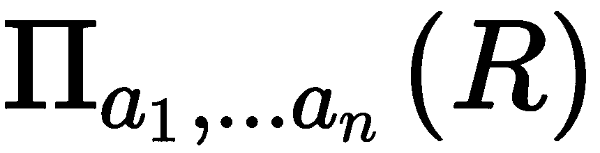，其中  是一个元组，而  是  的属性名。当执行此运算时，它返回一个只包含指定属性的集合，并丢弃所有其他属性。

如果这听起来太复杂，我们可以将投影明确表示为 SQL 查询。考虑一个具有以下结构和数据的`People`表：

| **Id** | **FirstName** | **LastName** | **City** | **Country** |
| --- | --- | --- | --- | --- |
| `1` | `John` | `Smith` | `Bristol` | `United Kingdom` |
| `2` | `Jorrit` | `Bramsma` | `Eindhoven` | `The Netherlands` |
| `3` | `Jan Tore` | `Rosendal` | `Alta` | `Norway` |

如果我们执行`SELECT FirstName, LastName FROM People`查询，我们实际上执行了一个投影。我们指定了要包含在结果集中的两个属性——`FirstName`和`LastName`，因此我们得到以下结果：

| 首名 | 姓氏 |
| --- | --- |
| `John` | `Smith` |
| `Jorrit` | `Bramsma` |
| `Jan Tore` | `Rosendal` |

所有其他属性都被丢弃。请注意，我们在查询中不包括任何过滤。过滤被称为**选择**，确实，在大多数情况下，SQL 查询结合了投影和选择，以生成我们感兴趣的一组简洁数据。您可能已经注意到，我们在第十章“事件溯源”中使用了投影，当我们从整个系统状态的大数据集中检索属性子集以用于查询时。

从事件构建状态片段的过程也被称为**投影**，尽管我们无法说它在一个单集中操作，在那里我们选择要投影的属性数量。然而，我们需要投影整个事件流的一个子集。我们的读取模型也需要尽可能快地更新，但我们只提交事件到存储。这意味着我们需要在事件提交后立即读取所有这些事件并将它们投影。通常，这是通过轮询事件存储或使用存储支持的实时订阅来完成的。

使用订阅和投影从事件构建读取模型的过程可以用以下图表来说明：

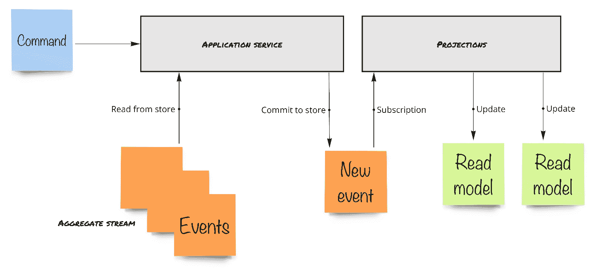

读取模型的命令流

当我们执行一个命令时，应用服务会从聚合流中完全加载我们的聚合。然后，聚合生成一个新的事件（或多个事件），代表聚合的状态转换。这些事件被提交到存储中，因此存储将它们追加到聚合流的末尾。订阅会接收这些事件并更新其读取模型。

这是我们聚合类的代码：

```cs
protected override void When(object @event)
{
    switch (@event)
    {
        case Events.UserRegistered e:
            Id = new UserId(e.UserId);
            FullName = new FullName(e.FullName);
            DisplayName = new DisplayName(e.DisplayName);
            break;
        case Events.UserFullNameUpdated e:
            FullName = new FullName(e.FullName);
            break;
        case Events.UserDisplayNameUpdated e:
            DisplayName = new DisplayName(e.DisplayName);
            break;
        case Events.ProfilePhotoUploaded e:
            PhotoUrl = e.PhotoUrl;
            break;
    }
}
```

在这里，我们通过每个新事件更新我们的`UserProfile`聚合的状态。现在，是时候坦白一下了——这同样也是一个投影。在这段代码中，我们将`When`方法接收的事件投影到更新我们的`UserProfile`对象的属性。关于投影，没有更多要说的，我可以结束这一章了！

开个玩笑，我们还有很多工作要做。首先，我们需要弄清楚我们的读取模型投影将如何接收新事件。

# 订阅

想象一下，我们的用户正在查看一个屏幕，他们可以看到我们市场的用户界面。我们已经知道如何让人们执行操作。当用户做某事时，我们向 API 发送 `POST` 或 `PUT` 请求。然后，API 控制器调用应用程序服务，并执行命令。结果可能是对完成命令的 `200 OK` 响应，或者如果出现问题，则返回错误。然而，与单数据库系统不同，在那里我们查询的数据是我们执行命令的数据，对于事件源应用程序来说，情况并非如此。我们的读取模型很可能位于不同的数据库中。这个事实使得我们所有的查询最终都是一致的。我们将在本书的后续章节中讨论这个主题，当我们探索更多关于事件源的高级主题时。

现在，我们需要理解我们的目标将是最小化事件附加到流和读取模型更新之间的时间间隔。在这两个操作之间，我们向用户展示的数据是过时的。过时并不意味着不一致，它只是不是完全最新的，经过一小段时间的延迟后，查询最终会返回更多实际数据。注意差距！

为了最小化时间间隔，我们需要确保我们的投影能够实时接收新事件。Event Store 可以在这里提供帮助，因为它有一个非常不错的订阅功能。在 Event Store 中有两种类型的订阅——追赶订阅和持久订阅，也称为**竞争消费者**。主要区别是**检查点**的所有权。在这一章中，我还要向你介绍一个新术语！

检查点是在流中的特定位置。当投影处理了一个事件后，它可以存储检查点，所以如果投影被重新启动，它将知道从哪里开始处理，而不是从生命的开始就投影所有事件。检查点的概念在所有处理实时事件处理的系统中都是众所周知的，例如 Kafka 或 Azure Event Hub。

如果你决定使用其他产品来存储你的事件，你需要弄清楚是否可以对该存储进行实时或几乎实时的订阅，以及你可以使用什么作为检查点。例如，你可以使用 SQL Server 表来存储事件，并使用自动增长的唯一主键作为流位置。然后，你可以持续轮询这个表以获取新事件，通过这样做，你将拥有一个工作的订阅。

检查点是读取模型独有的。我引用了前面`UserProfile.When`方法的代码，并提到它也执行投影的工作。虽然这是真的，但对于聚合实例，当我们从存储中读取聚合流并在执行命令之前读取聚合流时，`When`方法会为单个聚合的所有事件执行。再次强调，我们读取单个流中的所有事件，并为从存储中获取的每个事件调用`When`方法。这并不难。然而，投影会持续更新它们的模型。

我们不能允许自己在每次更新时都从整个存储中读取所有事件，因为这会违背拥有读取模型的目的。让我们看看读取模型是如何监听存储中到来新事件的：

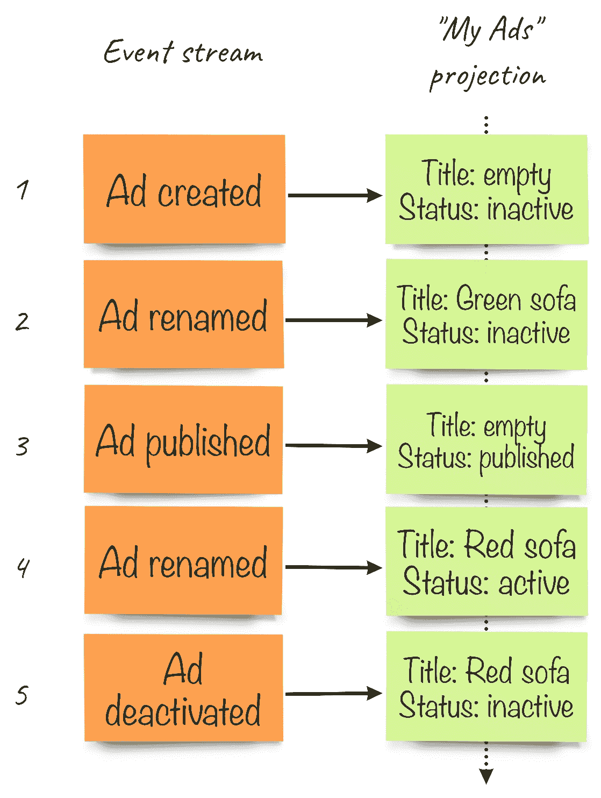

读取模型通过新事件进行更新

例如，如果我们的**“我的广告”****投影**接收到一个`AdRenamed`事件并开始更新其读取模型，会发生一些事情——比如网络故障、数据库故障，或者有人关闭了运行投影的机器的电源。在问题解决后，投影本身需要找出它需要从哪个位置开始读取事件以继续更新其读取模型。对于我刚才描述的情况，我们需要在成功投影`AdPublished`事件后，将数字**3**保存在某个地方。因此，当我们的服务重新启动并且投影启动时，它需要从事件编号**4**开始读取，忽略之前发生的一切。通过存储这个数字，我们正在建立一个检查点。我们的投影负责将其自己的检查点保存在某个地方。只有当新事件成功投影后，检查点才会更新，所以我们保证每个事件至少被投影一次。

存储检查点有两种方式——通过基于客户端的检查点或基于服务器的检查点。我们可以逻辑上得出结论，基于客户端的检查点由客户端（订阅）维护和存储，而在使用基于服务器的变体时，事件存储负责这项工作。

在 Apache Kafka 中，术语*偏移量*用于相同的概念，并且默认情况下，偏移量由服务器维护。

基于服务器的检查点功能使我们能够运行多个事件消费者（在我们的例子中是投影）的实例，每个消费者都将获得事件的一部分。这个概念在消息传递世界中广为人知。所有消息代理都支持类似的模式，这被称为**竞争消费者**。这种模式允许我们轻松扩展处理消息（或事件）的过程，但这里的主要问题是无法保证竞争消费者处理消息的顺序。这很容易解释。消息处理时间无法完全预测，因为网络中总是会发生一些故障，甚至在与其他进程共享计算和磁盘资源的机器上。因此，处理一条消息所需的时间在不同消费者之间可能会有所不同，甚至在相同消费者对相同消息的处理中也是如此。如果我们有多个竞争消息的消费者，我们几乎肯定会遇到一种情况，其中一个消费者已经完成处理事件 E[n]，而另一个消费者仍在忙于处理事件 E[n+1]。然后，空闲的消费者在处理 E[n+1]事件甚至尚未完成之前就开始处理 E[n+2]事件。显然，这里没有顺序保证。对于投影来说，按顺序处理事件至关重要。如果连续执行两次重命名，我们希望第二个更新在第一个更新之后应用于读取模型，没有任何例外。然而，在使用服务器维护的检查点时，没有必要使用竞争消费者。如果您只有一个持久订阅的单一订阅者，它将按顺序接收事件。

当客户端维护自己的检查点时，事情变得既容易又困难。如果我们控制检查点，我们可以轻松地重置或移动它。对于投影，这意味着我们可以通过重置检查点并删除现有数据来轻松重建读取模型。这个过程被称为**重放**，实际上，这是事件源中最强大的功能之一。更困难的部分是我们需要将检查点存储在某个地方，并且每次投影处理新事件时都要更新它。这里的最佳实践是将检查点存储在与读取模型本身相同的地方（即，数据库）。记住关于重放的事情吗？如果我们杀死了存储我们的读取模型的数据库，检查点将立即消失；如果我们再次运行投影，它将从头开始处理事件，最终，读取模型将从零开始重建！

因此，在这本书中，我们将使用由客户端维护的实时订阅和检查点。在事件存储中，这种订阅被称为**追赶订阅**。为什么叫追赶订阅？很容易猜到。还记得重放吗？不，我不是在重复自己。如果我们想要或需要重建读取模型并删除其数据和检查点，投影将订阅事件流，从零位置开始。直到它处理完所有历史事件，它将不会消费任何新事件。只有当投影最终赶上流末尾时，我们才能将其切换到实时处理新事件。事件存储会自动完成这项工作，这就是为什么我们称之为追赶订阅。使用这种类型的订阅，我们可以为已经运行了一段时间并且有很多事件的系统添加新的投影和构建新的读取模型。我们的新投影将赶上所有这些历史事件，切换到实时处理，从那时起，我们的新读取模型将可用。

# 实现投影

现在是时候开始编写一些代码了。我们将使用第九章的最终代码，*CQRS - 读取侧*作为起点。这一章的最终代码位于 GitHub 仓库的`Chapter11`文件夹中。

我们将一步一步来，首先实现一个订阅，以便了解在事件存储中订阅是如何工作的。然后，我们将使用 RavenDB 和 PostgreSQL 创建几个真实的读取模型。

# 追赶订阅

实际上，要开始制作投影，我们不需要任何数据库。我将向您展示一个简单的技巧，它允许您快速进行初始开发，而不必考虑将用于存储读取模型的数据库引擎。我们往往真的不知道现实生活会带来什么，我们最初计划使用的数据库引擎可能甚至不适合我们想要完成的任务。在任何项目的早期阶段，我们处理的事件数量并不大，除非我们想在系统中进行一些合成测试，或者我们正在处理一个高频事件处理系统。在我们的情况下，我们处理的是一个相当简单的分类广告网站，所以我们不期望在开发环境中以及我们希望向产品所有者和 QA 展示的系统中有很多事件。

我们能做些什么来使事情保持非常简单？嗯，如果我们的系统的事实来源在事件存储中，为什么我们需要在某个地方持久化读取模型？将它们保存在内存中并在每次应用程序启动时重建是完全可行的。这正是我们打算做的。

首先，我想使用第九章，*CQRS - 读取侧*的代码作为起点。记住，它没有查询和读取模型。为了引入这些内容，我从第十章，*事件溯源*中复制了一些代码文件，并进行了最小修改以减少工作量。因此，我只从主应用程序项目的`ClassifiedAd`文件夹中提取读取模型和查询。然后，我从`Queries`文件中删除了一些查询，因为我最初只想实现一个。我的新`Queries`类现在看起来如下所示：

```cs
using System.Collections.Generic;
using System.Linq;

namespace Marketplace.ClassifiedAd
{
    public static class Queries
    {
        public static ReadModels.ClassifiedAdDetails Query(
            this IEnumerable<ReadModels.ClassifiedAdDetails> items,
            QueryModels.GetPublicClassifiedAd query) 
                => items.FirstOrDefault(
                    x => x.ClassifiedAdId == query.ClassifiedAdId);
    }
}
```

您可以看到，我这里没有使用任何数据库连接。相反，扩展方法被应用于一个简单的`IEnumerable`，这意味着我将使用内存中的项目集合。

然后，我还需要移除不会使用的 API 端点，只保留其中一个。此外，我需要将数据库连接替换为`IEnumerable`：

```cs
using System.Collections.Generic;
using Marketplace.Infrastructure;
using Microsoft.AspNetCore.Mvc;
using Serilog;

namespace Marketplace.ClassifiedAd
{
    [Route("/ad")]
    public class ClassifiedAdsQueryApi : Controller
    {
        private static ILogger _log = 
        Log.ForContext<ClassifiedAdsQueryApi>();

        private readonly IEnumerable<ReadModels.ClassifiedAdDetails> 
        _items;

        public ClassifiedAdsQueryApi(
            IEnumerable <ReadModels.ClassifiedAdDetails> items) => 
            _items = items;

        [HttpGet]
        public IActionResult Get(
            QueryModels.GetPublicClassifiedAd request) => 
            RequestHandler.HandleQuery(() => _items.Query(request), 
            _log);
    }
}
```

注意到`Get`方法不再`async`了，因为集合上的操作是同步的。当然，当我们引入适当的持久化时，我们需要将`async`重新引入。由于这个变化，我还需要更改`RequestHandler.HandleQuery`方法，使其接受`Action`而不是`Func`，因为我们现在不需要返回`Task`：

```cs
public static IActionResult HandleQuery<TModel>(
    Func<TModel> query, ILogger log)
{
    try
    {
        return new OkObjectResult(query());
    }
    catch (Exception e)
    {
        log.Error(e, "Error handling the query");
        return new BadRequestObjectResult(new
        {
            error = e.Message, stackTrace = e.StackTrace
        });
    }
}
```

从第九章，*CQRS - 读取侧*，我们有`EsAggregateStore`类。它有一些代码帮助我们反序列化来自事件存储的已解析事件。我们还需要在我们的投影中执行相同的操作。因此，我将这段代码提取到一个扩展方法中，用于`ResolvedEvent`类，这样我们就可以在投影中使用相同的代码：

```cs
using System;
using System.Text;
using EventStore.ClientAPI;
using Newtonsoft.Json;

namespace Marketplace.Infrastructure
{
    public static class EventDeserializer
    {
        public static object Deserialzie(this ResolvedEvent 
        resolvedEvent)
        {
            var meta = JsonConvert.DeserializeObject<EventMetadata>(
                Encoding.UTF8.GetString(resolvedEvent.Event.Metadata));
            var dataType = Type.GetType(meta.ClrType);
            var jsonData = Encoding.UTF8.GetString(
                resolvedEvent.Event.Data);
            var data = JsonConvert.DeserializeObject(
                jsonData, dataType);
            return data;
        }
    }
}
```

如您所记，我们在事件元数据中保留事件类的**完全限定类名**（**FQCN**），`EventDeserialzier`使用它来获取我们的领域事件。我还从`EsAggregateStore`中移除了这段代码，以避免重复，因此`Load`方法将如下所示：

```cs
public async Task<T> Load<T, TId>(TId aggregateId)
    where T : AggregateRoot<TId>
{
    if (aggregateId == null)
        throw new ArgumentNullException(nameof(aggregateId));

    var stream = GetStreamName<T, TId>(aggregateId);
    var aggregate = (T) Activator.CreateInstance(typeof(T), true);

    var page = await _connection.ReadStreamEventsForwardAsync(
        stream, 0, 1024, false);

    aggregate.Load(page.Events.Select(resolvedEvent => 
        resolvedEvent.Deserialzie()).ToArray());

    return aggregate;
}
```

现在，让我们进行实际的订阅。它将存在于一个新类中，我将将其放置在`infrastructure`文件夹中。它将处理单个读取模型，因此它不是通用的，实际上也不应该放在那里。然而，这个解决方案不是永久的，我们稍后会对其进行改进。

对于这个类，我需要一个`IEventStoreConnection`的实例，这样我才能创建对其的订阅。我还需要对读取模型集合的引用，这样我就可以在其中放置项目并更改现有项目的属性。该类将有两个简单的方法——`Start`和`Stop`。`Start`方法创建一个新的订阅。事件将立即开始到来，因此我必须先启动连接才能订阅它。以下是`Start`方法的代码：

```cs
public void Start()
{
    var settings = new CatchUpSubscriptionSettings(2000, 500,
        Log.IsEnabled(LogEventLevel.Verbose),
        true, "try-out-subscription");

    _subscription = _connection.SubscribeToAllFrom(Position.Start,
        settings, EventAppeared);
}
```

这里有一些硬编码的值，我们稍后将从应用程序配置中读取。重要的行是我们订阅的地方。我使用的方法是`SubscribeToAllFrom`。这个方法创建了一个订阅，将获取所有保存在事件存储中的事件。第一个参数是订阅的起始位置。由于我们的读取模型没有持久化，并且每次应用程序启动时我们都会从头开始重建它，我们必须从开始读取，因为这就是为什么参数是`Position.Start`。最后一个参数是一个委托，它将为每个我们从订阅中接收的事件被调用；我们稍后会回到它。

`Stop`方法非常简单，它只是停止订阅，如下所示：

```cs
public void Stop() => _subscription.Stop();
```

现在，让我们为`EventAppeared`方法编写一些代码。在那里，我们将构建我们的读取模型，正如我之前提到的，代码将以非常相似的方式处理我们在聚合体的`When`方法中处理的相同领域事件。

在我们能够使用高级模式匹配之前，我们需要从`ResolvedEvent`类实例中获取领域事件，这个实例是`EventAppeared`方法接收的参数。以下是这个方法的开头部分：

```cs
private Task EventAppeared(EventStoreCatchUpSubscription subscription, ResolvedEvent resolvedEvent)
{
    var @event = resolvedEvent.Deserialzie();

    switch (@event)
    {
        case Events.ClassifiedAdCreated e:
            _items.Add(new ReadModels.ClassifiedAdDetails
            {
                ClassifiedAdId = e.Id
            });
            break;
        case Events.ClassifiedAdTitleChanged e:
            UpdateItem(e.Id, ad => ad.Title = e.Title);
            break;
    }

    return Task.CompletedTask;
}
```

第一行将获取领域事件，然后我们使用模式匹配在读取模型中进行必要的更改。第一种情况将为每个新的分类广告创建一个新的读取模型，第二种情况将更新标题。

这段代码是好的，但不会工作，因为我之前提到，当我们使用`SubscribeToAllFrom`进行订阅时，我们将获取所有事件。这些事件来自`$all`流。但事件存储使用事件进行其内部操作，因此我们也会收到很多这种类型的事件。幸运的是，我们可以通过`resolvedEvent.Event.EventType`属性的值轻松识别我们不需要的事件。所有具有`stat`事件类型的技术事件都以美元符号（`$`）开头，因此我们可以过滤掉它们。

对于这个类来说，还有一个需要注意的最后一点，我使用`UpdateItem`方法来简化现有项目的更新。

下面是`EsSubscription`类的完整代码：

```cs
using System;
using System.Collections.Generic;
using System.Linq;
using System.Threading.Tasks;
using EventStore.ClientAPI;
using Marketplace.ClassifiedAd;
using Marketplace.Domain.ClassifiedAd;
using Serilog.Events;
using ILogger = Serilog.ILogger;

namespace Marketplace.Infrastructure
{
    public class EsSubscription
    {
        private static readonly ILogger Log = 
        Serilog.Log.ForContext<EsSubscription>();

        private readonly IEventStoreConnection _connection;
        private readonly IList<ReadModels.ClassifiedAdDetails> _items;
        private EventStoreAllCatchUpSubscription _subscription;

        public EsSubscription(IEventStoreConnection connection, 
            IList<ReadModels.ClassifiedAdDetails> items)
        {
            _connection = connection;
            _items = items;
        }

        public void Start()
        {
            var settings = new CatchUpSubscriptionSettings(2000, 500,
                Log.IsEnabled(LogEventLevel.Verbose),
                true, "try-out-subscription");

            _subscription = _connection.SubscribeToAllFrom(
                Position.Start, settings, EventAppeared);
        }

        private Task EventAppeared(
            EventStoreCatchUpSubscription 
            subscription, ResolvedEvent resolvedEvent)
        {
            if (resolvedEvent.Event.EventType.StartsWith("$")) 
                return Task.CompletedTask;

            var @event = resolvedEvent.Deserialzie();

            Log.Debug("Projecting event {type}", 
                @event.GetType().Name);

            switch (@event)
            {
                case Events.ClassifiedAdCreated e:
                    _items.Add(new ReadModels.ClassifiedAdDetails
                    {
                        ClassifiedAdId = e.Id
                    });
                    break;
                case Events.ClassifiedAdTitleChanged e:
                    UpdateItem(e.Id, ad => ad.Title = e.Title);
                    break;
                case Events.ClassifiedAdTextUpdated e:
                    UpdateItem(e.Id, ad => ad.Description = e.AdText);
                    break;
                case Events.ClassifiedAdPriceUpdated e:
                    UpdateItem(e.Id, ad =>
                    {
                        ad.Price = e.Price;
                        ad.CurrencyCode = e.CurrencyCode;
                    });
                    break;
            }

            return Task.CompletedTask;
        }

        private void UpdateItem(Guid id, 
            Action<ReadModels.ClassifiedAdDetails> update)
        {
            var item = _items.FirstOrDefault(
                x => x.ClassifiedAdId == id);
            if (item == null) return;

            update(item);
        }

        public void Stop() => _subscription.Stop();
    }
}
```

理想情况下，我们需要将反序列化调用包裹在`try`-`catch`块中，因为我们可能会遇到一些我们不知道的事件，这会导致我们的投影不优雅地中断。但同样，我们稍后会在代码中做出很多更改。让我们继续到连接部分，尝试一下。

我们必须确保我们的订阅在事件存储连接确实连接到存储之后开始。目前，这个操作发生在`HostedService`类中。由于它只处理事件存储连接业务，我将它重命名为`EventStoreService`。我还向其构造函数添加了`EsSubscription`实例，这样我们就可以在连接后立即开始订阅。在这里，你可以看到这个类在所有这些更改之后的样子：

```cs
using System.Threading;
using System.Threading.Tasks;
using EventStore.ClientAPI;
using Marketplace.Infrastructure;
using Microsoft.Extensions.Hosting;

namespace Marketplace
{
    public class EventStoreService : IHostedService
    {
        private readonly IEventStoreConnection _esConnection;
        private readonly EsSubscription _subscription;

        public EventStoreService(
            IEventStoreConnection esConnection, 
            EsSubscription subscription)
        {
            _esConnection = esConnection;
            _subscription = subscription;
        }

        public async Task StartAsync(
            CancellationToken cancellationToken)
        {
            await _esConnection.ConnectAsync();
            _subscription.Start();
        }

        public Task StopAsync(CancellationToken cancellationToken)
        {
            _subscription.Stop();
            _esConnection.Close();

            return Task.CompletedTask;
        }
    }
}
```

在`Startup`类中，我需要更改注册并创建我们的模拟存储实例（记住，那只是一个集合）。所以我更改了注册托管服务的代码，并在`Startup.ConfigureServices`方法的那个代码块中添加了几行：

```cs
var items = new List<ReadModels.ClassifiedAdDetails>();
services.AddSingleton<IEnumerable<ReadModels.ClassifiedAdDetails>>(items);

var subscription = new EsSubscription(esConnection, items);
services.AddSingleton<IHostedService>(
    new EventStoreService(esConnection, subscription));
```

我们需要注册项目集合，因为我们的查询 API 控制器需要服务提供者通过构造函数参数将其注入。

在第九章，*CQRS - 读取侧*中，我们还没有做的事情是，尽管我们使用了 Serilog 进行所有日志记录，但在章节代码中它从未被初始化。那时我们实际上没有什么可以记录的，但现在看看我们能记录什么将会很有趣。所以，我在`Program.Main`方法的开始处添加了几行代码：

```cs
Log.Logger = new LoggerConfiguration()
    .MinimumLevel.Debug()
    .WriteTo.Console()
    .CreateLogger();
```

好了，就是这样。现在，如果你从第九章，*CQRS - 读取侧*开始运行相同的`docker-compose`，并且其中有一些数据（如果你按照第九章，*CQRS - 读取侧*的代码进行操作，你应该有这些数据），你可以运行应用程序，它将产生一种调试信息，如下所示：

```cs
Hosting environment: Development
Content root path: /~/Dev/ddd-book/chapter11/Marketplace/bin/Debug/netcoreapp2.1
Now listening on: http://localhost:5000
Application started. Press Ctrl+C to shut down.
[21:00:17 DBG] Projecting event ClassifiedAdCreated
[21:00:17 DBG] Projecting event ClassifiedAdTitleChanged
[21:00:17 DBG] Projecting event ClassifiedAdTextUpdated
[21:00:17 DBG] Projecting event ClassifiedAdPriceUpdated
[21:00:17 DBG] Projecting event ClassidiedAdSentForReview
[21:00:17 DBG] Projecting event ClassifiedAdPublished
[21:00:48 DBG] Projecting event ClassifiedAdCreated
[21:00:48 DBG] Projecting event ClassifiedAdTitleChanged
[21:00:48 DBG] Projecting event ClassifiedAdTextUpdated
[21:00:48 DBG] Projecting event ClassifiedAdPriceUpdated
[21:00:48 DBG] Projecting event ClassidiedAdSentForReview
[21:00:48 DBG] Projecting event ClassifiedAdPublished
[21:00:48 DBG] Projecting event ClassifiedAdCreated
[21:00:48 DBG] Projecting event ClassidiedAdSentForReview
[21:00:48 DBG] Projecting event ClassifiedAdTitleChanged
[21:00:48 DBG] Projecting event ClassifiedAdPublished
[21:00:48 DBG] Projecting event ClassifiedAdPriceUpdated
[21:00:48 DBG] Projecting event ClassifiedAdCreated
[21:00:48 DBG] Projecting event ClassifiedAdTextUpdated
```

如果你曾经与第十章，*事件溯源*相关的代码一起工作了一段时间，并且事件存储已经运行了好多天，你可能会注意到属于不同分类广告的事件之间存在一些延迟。这仅仅是因为所有这些技术事件都是由事件存储持续产生的，我们接收到了所有这些事件。我们忽略这些事件，但我们仍然需要读取它们，到达应用程序，检查名称等等。这需要时间。在先前的调试输出中，你可以看到大约 30 秒的延迟，这意味着我让事件存储在我的机器上 24/7 运行，我在第九章，*CQRS - 读取侧*上花费了一些时间！我们并不真的希望有这种延迟，幸运的是，事件存储为这些技术事件设置了一个小的**生存时间**（**TTL**）值。这意味着理论上，大多数应该被删除。然而，标记为删除的事件，直到我们执行清理操作之前都不会被清理。这是因为实时删除事件会对性能产生重大影响。可以通过访问管理员界面并按屏幕右上角的清理按钮来从事件存储 UI 启动清理。在我清理了我的本地存储之后，延迟减少到了六秒。但不要误会，这只会发生一次，当你启动应用程序时。所有新的事件都将立即投影。

现在，我们可以测试我们的`GET`查询端点，看看投影是否真正起作用。我将使用我在第九章，*CQRS - 读取侧*工作时创建的分类广告。以下是 Swagger 中的查询结果：

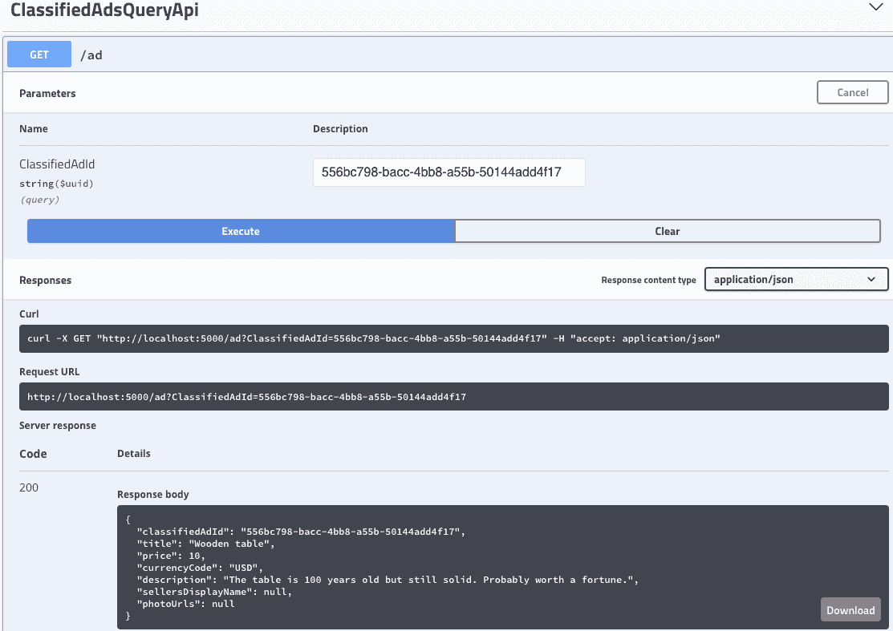

查询从真实模型检索数据

第一个投影成功了！然而，我们可以看到，我们只投影了分类广告事件，因此卖家的显示名称为空。我们将很快修复这个问题。

# 跨聚合投影

当人们开始尝试事件溯源时，经常会犯的一个错误是开发者尽可能快地试图进入他们聚合持久状态的舒适区。因此，许多人将读取模型视为在可查询存储中保持聚合状态可访问的一种方式。我过去也做过同样的事情，所以你可以相信我。为了在某个数据库中保持聚合状态，我使用了事件存储的一个不错特性——内部投影。你可以通过访问事件存储 Web UI 的投影页面来查看可用的内部投影列表。其中之一是`$by-category`，它将所有事件链接到特殊的类别流中。例如，`$ce-ClassifiedAd`将包含`ClassifiedAd`聚合的所有事件。你可以通过访问`http://localhost:2113/web/index.html#/streams/$ce-ClassifiedAd`来自行检查它（你需要确保`$by-category`投影正在运行）。通过为这个流创建一个订阅，例如，你可以构建一个聚合快照。然而，快照不是读取模型，通常不应作为真实模型使用。

读取模型总是服务于某个目的。当我们查看第九章《CQRS - 读取侧》中的 CQRS 时，我们正在设计读取模型来回答特定的查询。通常，我们需要屏幕上的某些信息，因此我们创建一个读取模型，通过一个单一的查询获取所有所需的信息。没有 CQRS，我们可能需要调用几个查询，这些查询会从存储库检索几种不同类型的实体的状态，并在 API 后端将信息组合成一个单一的响应 DTO。当我们使用**后端为前端**（**BFF**）方法时，这是一种常见的策略。然而，有了 CQRS，我们可以自由选择查询哪些信息，只要查询只与单个数据库中的实体一起工作。当我们讨论边界上下文和微服务主题时，我们将探讨系统成为多个自主子系统组合的更复杂场景。

# 从两个聚合中投影事件

现在，让我们考虑创建类似于我们在第十章《事件溯源》中拥有的读取模型。我们已经开始了其中之一，正如你在前面的 Swagger 截图中所看到的，我们得到的响应中的卖家名称为空。这是因为我们处理投影中的唯一事件是`ClassifiedAd`事件。然而，我们的存储包含整个应用程序的所有事件。

由于我们使用`IEventStoreConnection`接口的`SubscribeFromAllFrom`方法，我们的投影将接收所有事件。我们目前过滤我们的系统事件，因此我们应该得到所有其他事件，包括`UserProfile`聚合的事件。在模式匹配开关中添加一个额外的`case`来处理`UserDisplayNameUpdated`事件并正确设置`ReadModels`属性似乎很简单。这似乎是合理的，所以当所有者更新他们的显示名称时，我们的读取模型也会得到更新。

这里有一个问题是我们不能给`UpdateItem`方法任何 ID。当用户更新他们的显示名称时，这个动作与任何分类广告都没有关联。这意味着我们需要运行一个查询并更新所有所有者 ID 是更改名称的用户 ID 的广告。这项任务并不难，因此我们可以添加一个名为`UpdateMultipleItems`的额外方法，并给它一个查询和一个操作，该操作将对查询返回的每个项目执行：

```cs
private void UpdateMultipleItems(
    Func<ReadModels.ClassifiedAdDetails, bool> query,
    Action<ReadModels.ClassifiedAdDetails> update)
{
    foreach (var item in _items.Where(query))
        update(item);
}
```

我们可以轻松指定操作，但查询应该是什么？我们的读取模型不包含所有者 ID！嗯，我们可以通过向读取模型添加一个额外的属性来轻松解决这个问题，称为`SellerId`，我们将从`OwnerId`分配它。在我们的系统中没有更改广告所有者的方法，所以只有在广告创建时进行此分配是安全的。

投影的新代码将如下所示：

```cs
private Task EventAppeared(EventStoreCatchUpSubscription subscription, 
    ResolvedEvent resolvedEvent)
{
    if (resolvedEvent.Event.EventType.StartsWith("$")) 
        return Task.CompletedTask;

    var @event = resolvedEvent.Deserialzie();

    Log.Debug("Projecting event {type}", @event.GetType().Name);

    switch (@event)
    {
        case Events.ClassifiedAdCreated e:
            _items.Add(new ReadModels.ClassifiedAdDetails
            {
                ClassifiedAdId = e.Id,
                SellerId = e.OwnerId
            });
            break;
        case Events.ClassifiedAdTitleChanged e:
            UpdateItem(e.Id, ad => ad.Title = e.Title);
            break;
        case Events.ClassifiedAdTextUpdated e:
            UpdateItem(e.Id, ad => ad.Description = e.AdText);
            break;
        case Events.ClassifiedAdPriceUpdated e:
            UpdateItem(e.Id, ad =>
            {
                ad.Price = e.Price;
                ad.CurrencyCode = e.CurrencyCode;
            });
            break;
        case Domain.UserProfile.Events.UserDisplayNameUpdated e:
            UpdateMultipleItems(x => x.SellerId == e.UserId, 
                x => x.SellersDisplayName = e.DisplayName);
            break;
    }

    return Task.CompletedTask;
}
```

当然，有一件事要记住的是查询在真实存储中的效率。由于我们使用的是简单的内存列表，这不是一个问题。在现实中，一个人不会有数百万个分类广告，所以相同的查询也会起作用，但我们还需要记住，RavenDB 只支持每个会话有限的操作数，所以如果预期通过此查询更新数千个项目，可能需要使用高级技术。

你在那里看到另一个问题吗？当然，用户并不经常更新他们的名字。我实际上不记得自从我出生以来改变过我的名字。我确实更新了我使用的一些在线服务的无数个个人资料，但通常我只做一次，尤其是在更改名字的时候。对于我们的分类广告，所有者在广告创建后和删除前更新名字的可能性几乎为零。那么，我们能做什么呢？

# 每个订阅多个投影

首先，似乎我们需要构建另一个投影来处理`UserProfile`聚合的事件，并从它们构建一个简单的读取模型。我们可以使用相同的存储，并暂时将所有内容保存在内存中。由于我们将有两个投影，因此将事物分开并让我们的订阅处理多个投影是有意义的。

由于我们将有一个可以处理多个投影的订阅，我们可以将我们的`EsSubscription`类重命名为`ProjectionsManager`。它需要接受投影作为参数，并且最好将它们保存在单独的类中，因此我们需要一个简单的接口。我们可以称它为`IProjection`并将文件放置在`Marketplace.Framework`项目中，如下所示：

```cs
using System.Threading.Tasks;

namespace Marketplace.Framework
{
    public interface IProjection
    {
        Task Project(object @event);
    }
}
```

然后，我们需要将模式匹配代码移动到这个接口的新实现中。将投影分组在一起会更好，因此我在`Marketplace`项目中创建了一个名为`Projections`的新文件夹，并在其中添加了一个新的`ClassifiedAdDetailsProjection`类。之后，我将代码从`EsSubscription.EventAppeared`方法移动到这个新类中：

```cs
using System;
using System.Collections.Generic;
using System.Linq;
using System.Threading.Tasks;
using Marketplace.Domain.ClassifiedAd;
using Marketplace.Framework;

namespace Marketplace.Projections
{
    public class ClassifiedAdDetailsProjection : IProjection
    {
        private List<ReadModels.ClassifiedAdDetails> _items;

        public ClassifiedAdDetailsProjection(List<ReadModels.
            ClassifiedAdDetails> items)
        {
            _items = items;
        }

        public Task Project(object @event)
        {
            switch (@event)
            {
                case Events.ClassifiedAdCreated e:
                    _items.Add(new ReadModels.ClassifiedAdDetails
                    {
                        ClassifiedAdId = e.Id,
                        SellerId = e.OwnerId
                    });
                    break;
                case Events.ClassifiedAdTitleChanged e:
                    UpdateItem(e.Id, ad => ad.Title = e.Title);
                    break;
                case Events.ClassifiedAdTextUpdated e:
                    UpdateItem(e.Id, ad => ad.Description = e.AdText);
                    break;
                case Events.ClassifiedAdPriceUpdated e:
                    UpdateItem(e.Id, ad =>
                    {
                        ad.Price = e.Price;
                        ad.CurrencyCode = e.CurrencyCode;
                    });
                    break;
                case Domain.UserProfile.Events.UserDisplayNameUpdated 
                e:

                    UpdateMultipleItems(x => x.SellerId == e.UserId,
                        x => x.SellersDisplayName = e.DisplayName);
                    break;
            }

            return Task.CompletedTask;
        }

        private void UpdateItem(Guid id,
            Action<ReadModels.ClassifiedAdDetails> update)
        {
            var item = _items.FirstOrDefault(
                x => x.ClassifiedAdId == id);
            if (item == null) return;

            update(item);
        }

        private void UpdateMultipleItems(
            Func<ReadModels.ClassifiedAdDetails, bool> query,
            Action<ReadModels.ClassifiedAdDetails> update)
        {
            foreach (var item in _items.Where(query))
                update(item);
        }
    }
}
```

我们还需要一个新的投影来构建用户详情的读取模型，因此我创建了`IProjection`接口的另一个实现，并将其命名为`UserDetailsProjection`。将`ReadModels.cs`文件移动到`Projections`文件夹中也是有意义的，以保持事物的一致性。以下是用户详情投影代码：

```cs
using System;
using System.Collections.Generic;
using System.Linq;
using System.Threading.Tasks;
using Marketplace.Domain.UserProfile;
using Marketplace.Framework;

namespace Marketplace.Projections
{
    public class UserDetailsProjection : IProjection
    {
        List<ReadModels.UserDetails> _items;

        public UserDetailsProjection(
            List<ReadModels.UserDetails> items)
        {
            _items = items;
        }

        public Task Project(object @event)
        {
            switch (@event)
            {
                case Events.UserRegistered e:
                    _items.Add(new ReadModels.UserDetails
                    {
                        UserId = e.UserId,
                        DisplayName = e.DisplayName
                    });
                    break;
                case Events.UserDisplayNameUpdated e:
                    UpdateItem(e.UserId, 
                        x => x.DisplayName = e.DisplayName);
                    break;
            }

            return Task.CompletedTask;
        }

        private void UpdateItem(Guid id, 
            Action<ReadModels.UserDetails> update)
        {
            var item = _items.FirstOrDefault(x => x.UserId == id);
            if (item == null) return;

            update(item);
        }
    }
}
```

当然，我们需要在`ReadModels.cs`文件中添加一个新的读取模型类，如下所示：

```cs
using System;

namespace Marketplace.Projections
{
    public static class ReadModels
    {
        public class ClassifiedAdDetails
        {
            public Guid ClassifiedAdId { get; set; }
            public string Title { get; set; }
            public decimal Price { get; set; }
            public string CurrencyCode { get; set; }
            public string Description { get; set; }
            public Guid SellerId { get; set; }
            public string SellersDisplayName { get; set; }
            public string[] PhotoUrls { get; set; }
        }

        public class UserDetails
        {
            public Guid UserId { get; set; }
            public string DisplayName { get; set; }
        }
    }
}
```

现在，我们需要最终确定投影管理器，以便它可以接受多个投影，并在出现新事件时调用每个投影。我们希望为将来使用真实的持久化存储做好准备，因此我想保持所有方法都是异步的，除了`UpdateItem`和`UpdateItems`，这些我可以稍后更改，因为这些都是单个投影类实现的细节。以下是新的`ProjectionManager`类代码：

```cs
using System.Linq;
using System.Threading.Tasks;
using EventStore.ClientAPI;
using Marketplace.Framework;
using Serilog;
using Serilog.Events;

namespace Marketplace.Infrastructure
{
    public class ProjectionManager
    {
        private readonly IEventStoreConnection _connection;
        private readonly IProjection[] _projections;
        private EventStoreAllCatchUpSubscription _subscription;

        public ProjectionManager(IEventStoreConnection connection, 
            params IProjection[] projections)
        {
            _connection = connection;
            _projections = projections;
        }

        public void Start()
        {
            var settings = new CatchUpSubscriptionSettings(2000, 500,
                Log.IsEnabled(LogEventLevel.Verbose),
                true, "try-out-subscription");
            _subscription = _connection.SubscribeToAllFrom(
                Position.Start, settings, EventAppeared);
        }

        public void Stop() => _subscription.Stop();

        private Task EventAppeared(EventStoreCatchUpSubscription _, 
            ResolvedEvent resolvedEvent)
        {
            if (resolvedEvent.Event.EventType.StartsWith("$")) 
                return Task.CompletedTask;

            var @event = resolvedEvent.Deserialzie();

            Log.Debug("Projecting event {type}", 
                @event.GetType().Name);
            return Task.WhenAll(_projections.Select(
                x => x.Project(@event)));
        }
    }
}
```

我想记录所有我们投影的事件，以了解发生了什么。在`EventAppeared`方法的最后一行，你可以看到我们正在收集为每个投影收集事件的任务，我们希望所有这些任务都完成。

接下来，我们修复`EventStoreService`类中的编译错误，使其使用`ProjectionManager`，而不是已删除（或重命名）的`EsSubscription`类：

```cs
using System.Threading;
using System.Threading.Tasks;
using EventStore.ClientAPI;
using Marketplace.Infrastructure;
using Microsoft.Extensions.Hosting;

namespace Marketplace
{
    public class EventStoreService : IHostedService
    {
        private readonly IEventStoreConnection _esConnection;
        private readonly ProjectionManager _projectionManager;

        public EventStoreService(IEventStoreConnection esConnection, 
            ProjectionManager projectionManager)
        {
            _esConnection = esConnection;
            _projectionManager = projectionManager;
        }

        public async Task StartAsync(
            CancellationToken cancellationToken)
        {
            await _esConnection.ConnectAsync();
            _projectionManager.Start();
        }

        public Task StopAsync(CancellationToken cancellationToken)
        {
            _projectionManager.Stop();
            _esConnection.Close();

            return Task.CompletedTask;
        }
    }
}
```

在我们可以启动应用程序之前，最后一件事是在`Startup`中连接这些组件。我们需要一个额外的集合，这次是`ReadModels.UserDetails`的集合，这样我们就可以在控制器中使用它，并将其作为参数传递给`UserDetailsProjection`构造函数：

```cs
var classifiedAdDetails = new List<ReadModels.ClassifiedAdDetails>();
services.AddSingleton<IEnumerable<ReadModels.ClassifiedAdDetails>>(classifiedAdDetails);
var userDetails = new List<ReadModels.UserDetails>();
services.AddSingleton<IEnumerable<ReadModels.UserDetails>>(userDetails);

var projectionManager = new ProjectionManager(esConnection, 
    new ClassifiedAdDetailsProjection(classifiedAdDetails),
    new UserDetailsProjection(userDetails));
```

这是一项工作，但现在一切都完成了，我最终可以按下*F5*并看看会发生什么。好吧，实际上并没有什么特别之处；我只看到了广告被投影的相同事件，但至少这部分工作如预期一样。我们没有看到任何新内容，因为我作弊了，创建了一个没有用户的广告。现在我需要回去创建这个用户。

# 事件链接和特殊流

假设我们继续从第十章，“事件溯源”，我可以查找事件存储流中我们拥有的唯一广告的所有者 ID。我在那里使用的值是`8dd8c5c6-6edb-4e42-ac9e-a232ea445b76`，因此我可以使用用户配置文件的 Swagger API 创建以下用户：

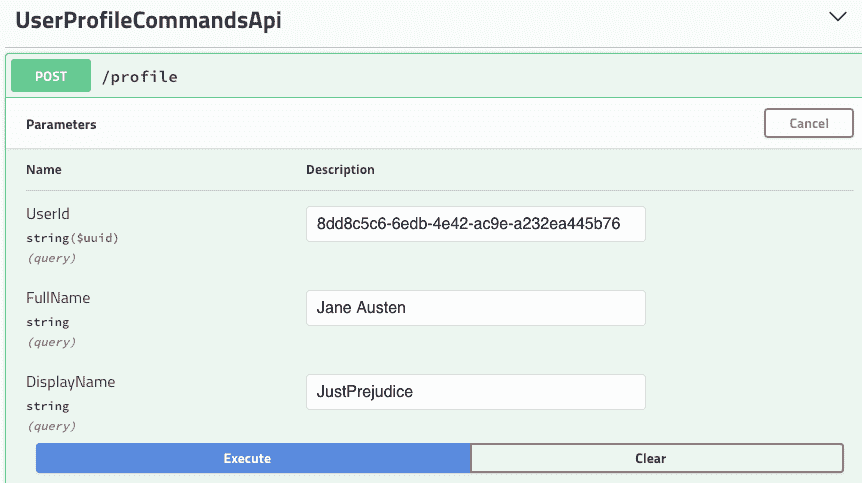

通过 UserProfile API 创建新用户

我得到了一个`200 OK`响应，现在我在日志中看到了更多的行，如下所示：

```cs
[21:58:04 DBG] Projecting event UserRegistered
[21:58:04 DBG] Projecting event UserRegistered
[21:58:04 DBG] Projecting event UserRegistered
[21:58:04 DBG] Projecting event UserRegistered
```

好吧，新的投影是有效的，但为什么这个单一事件被投影了四次呢？通过查看我们用于订阅的`$all`流，这个谜团可以轻易解决：

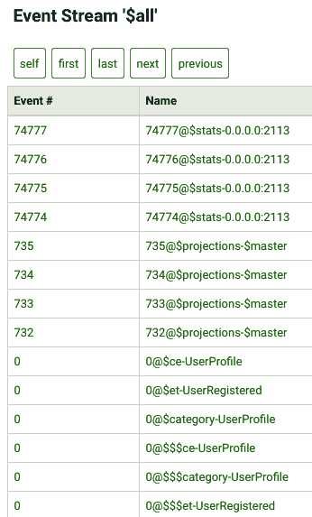

`$all`流的内容

在这里，你可以看到添加了几个事件。如果我们忽略系统事件，那些看起来可疑的`0@$ce-UserProfile`、`0@$et-UserRegistered`等事件是链接事件，这些事件是通过事件存储的内部标准投影放置到不同的特殊流中的。这些内部投影非常有帮助。例如，如果你查看`$ce-UserProfile`流，你会找到为`UserProfile`聚合的所有实例保存的所有事件。这些`$ce`流被称为类别流。另一种流类型是事件类型。例如，`$et-UserRegistered`包含来自存储中所有其他流的所有`UserRegistered`类型的事件。

然而，我们正在订阅`$all`流，我们不需要获取与所有那些特殊流链接的单个事件的副本。当然，我们可以通过访问事件存储 UI 的投影选项卡并点击停止所有按钮来禁用标准投影，但这并不是一个好的方法。有人可能会在以后来到我们的存储并重新启用这些投影。但请记住，这些是链接事件。我们有一个对追赶订阅有帮助的参数，称为`resolveLinkTos`，我们将其设置为`true`。让我们将其更改为`false`并看看会发生什么。以下是`ProjectionManager`类的新代码：

```cs
public void Start()
{
    var settings = new CatchUpSubscriptionSettings(2000, 500,
        Log.IsEnabled(LogEventLevel.Verbose),
        false, "try-out-subscription");
    _subscription = _connection.SubscribeToAllFrom(Position.Start,
        settings, EventAppeared);
}
```

如果我现在运行应用程序，输入就大不相同：

```cs
[22:30:38 DBG] Projecting event ClassifiedAdCreated
[22:30:38 DBG] Projecting event ClassifiedAdTitleChanged
[22:30:38 DBG] Projecting event ClassifiedAdTextUpdated
[22:30:38 DBG] Projecting event ClassifiedAdPriceUpdated
[22:30:38 DBG] Projecting event ClassifiedAdSentForReview
[22:30:38 DBG] Projecting event ClassifiedAdPublished
[22:30:48 DBG] Projecting event UserRegistered
```

看起来，`ClassifiedAd`聚合的事件之前也因为同样的原因被多次投影。现在日志变得更加合理，每个事件都只被投影了一次，正如预期的那样。

# 丰富读取模型

在此刻，我们有一个包含内存中单个`ReadModels.UserDetails`类型对象的集合。这个对象代表一个单一用户，因此如果我们有用户 ID，我们可以找出用户有什么显示名称。这很有帮助，但如何使用它来展示我们分类广告的完整详情呢？考虑到我们处于单个应用程序边界内，并且为所有读取模型使用相同的存储（目前是在内存中），有两种方法可以做到这一点。

当开发者开始处理分散在多个数据源中的数据时，他们脑海中首先想到的最明显的方法是在边缘聚合数据。最受欢迎的技术之一是构建 bff。当前端需要获取一些聚合数据时，它向后端的单个 API 端点发送一个请求，API 本身调用不同的数据源并合并数据。这个过程可以用以下图表来表示：

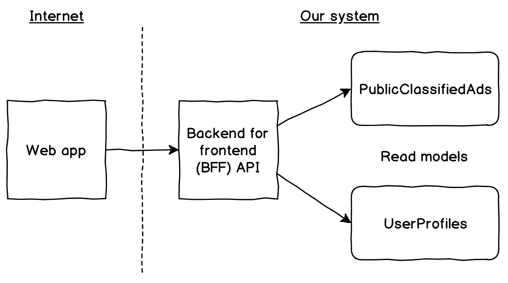

BFF 模式

在最简单的场景中，我们可以通过某种类型的连接进行一个数据库调用，因为我们对我们需要查询的两个数据元素的键有知识。在更复杂的情况下，我们可能会发现自己正在处理对拥有所需数据的微服务的远程调用，并在内存中进行连接。关于这种方法有一些担忧。当我们开始使用远程调用时，我们暴露了我们的 API 端点，使其容易受到它需要调用的任何服务的潜在失败以及可能发生的所有网络问题的影响。另一个重要方面是，我们必须在每次调用 bff API 端点时执行连接。如果这个特定的数据集被频繁使用，我们将陷入需要执行可能昂贵的连接的情况，而不是使用读取模型的力量来检索针对特定用例的预处理的去规范化数据集。

在读取模型中获取比投影接收的事件更多的数据有几种方法。

如果我们拥有读取模型所需的所有必要数据，在同一聚合中，我们可以向事件添加一些不需要传达状态转换的属性。例如，如果我们需要构建一个包含一个用户广告列表的读取模型（`MyClassifiedAds`），我们就需要包括所有投影需要处理的事件的所有者 ID，例如`ClassifiedAdTitleChanged`或`ClassifiedAdTextUpdated`。这种方法有时被称为使用**胖事件**，这与包含解释所发生事情所需的最小数据量的**瘦事件**相反。但是，这种方法对于跨聚合的读取模型不起作用，因此我们现在不需要探索这个选项。

我们将实现另外两种方法，这将使我们能够从其他来源获取数据——从投影查询和事件上溯。

# 从投影查询

目前，我们面临的主要问题是我们无法在投影接收到 `ClassifiedAdCreated` 事件时获取所有者的名称。对于分类广告聚合的所有其他事件，所有者都没有任何影响，因为所有者无法更改。我们已经在投影中处理了 `UserDisplayNameUpdated` 事件，所以如果广告所有者决定进行此类更新，我们将获取更新的名称。为了获取所需的数据，我们将通过使用事件中的 `OwnerId` 来联系 `UserDetails` 读取模型。这个过程看起来如下：

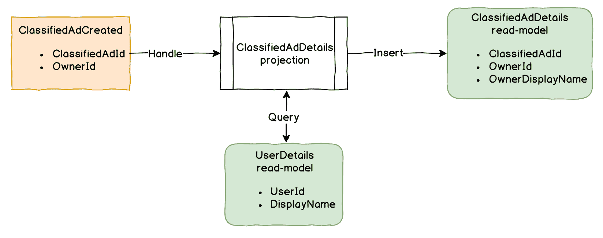

从另一个读取模型增强投影

让我们更改我们的投影代码以执行此查询。首先，我们对 `ClassifiedAdDetailsProjection` 类中的其他读取模型没有任何了解。现在这并不重要，因为无论数据是存储在内存中还是某些数据库中，我们仍然需要获取它。一种简单的方法是给我们的投影一个对 `UserDetails` 存储的引用并直接执行查询。但这种方法，虽然实现起来非常简单，却在读取模型和投影之间创建了耦合。当引入这种耦合时，未来的任何更改都将更加困难，测试也将始终是一个挑战，因为我们始终需要确保所有存储都预先填充了我们所需的所有数据。

一个更加优雅和简洁的方法是给我们的投影提供一个明确的方式来检索给定 `UserId` 的用户的 `DisplayName`。最简单的方法是提供一个委托函数，这样我们就可以将其作为参数添加到投影构造函数中：

```cs
public ClassifiedAdDetailsProjection(
    List<ReadModels.ClassifiedAdDetails> items,
    Func<Guid, string> getUserDisplayName)
{
    _items = items;
    _getUserDisplayName = getUserDisplayName;
}
```

现在，我们可以使用这个函数来获取读取模型所需的额外数据，通过在 `ClassifiedAdDetailsProjection.Project` 方法的第一个 `case` 中添加对这个函数的调用来实现：

```cs
case Events.ClassifiedAdCreated e:
    _items.Add(new ReadModels.ClassifiedAdDetails
    {
        ClassifiedAdId = e.Id,
        SellerId = e.OwnerId,
        SellersDisplayName = _getUserDisplayName(e.OwnerId)
    });
    break;
```

我们需要做的最后一件事是完成布线，因为 `Startup` 类现在无法编译了。我们需要将投影构造函数的调用更改为以下内容：

```cs
var projectionManager = new ProjectionManager(esConnection, 
    new ClassifiedAdDetailsProjection(classifiedAdDetails, 
        userId => userDetails.FirstOrDefault(
            x => x.UserId == userId)?.DisplayName),
```

这就是我们需要的所有操作，现在我可以启动应用程序并查询之前相同的端点以获取增强的结果：

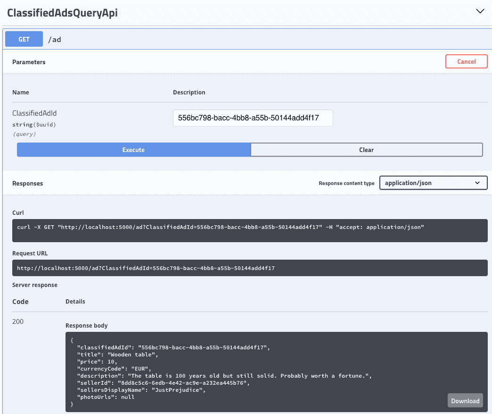

查询结果显示了我们所需的所有数据

你可以看到，响应中的 `sellersDisplayName` 属性被正确地设置为我们要的值。

在投影中使用查询时，需要考虑很多方面，主要是确保可靠性。这项工作的主要目标是确保投影永远不会失败。当你需要查询的数据位于你正在更新的读取模型相同的存储中时，查询的处理速度和可靠性应该在一个可接受的水平。你可能仍然希望在整个投影上应用重试策略来减轻暂时性网络故障等问题。然而，你真的不应该尝试查询外部数据源以获取额外数据。当我们讨论集成方面时，我们将讨论如何解决这种情况。

# 提升事件

将更多数据输入到读取模型的最复杂方式是通过使用**事件提升**。基本上，要实现这一点，我们需要创建一个对事件存储的单独订阅，该订阅接收精简事件，从其他地方获取额外数据，生成一个包含更多数据的新事件，并将其发布到一个特殊的流中。这个流永远不能是聚合流，因为新的事件只需要用来构建读取模型。我们可以为这个流选择一个特殊名称，例如`ClassifiedAd-Upcast`。由于读取模型投影监听`$all`流，它也会接收并处理这些事件。这种方法仅在需要为不同的读取模型提供额外数据时才有用，因此我们可以使用一个富集事件来更新所有这些模型，因此我们只需要查询一次额外数据。

我们没有很多读取模型，但我仍然可以在单个`ClassifiedAdDetails`事件上演示这种方法。假设我们需要在广告发布时立即将所有者照片包含到读取模型中，这样我们就可以丰富`ClassifiedAdPublished`事件。

首先，我需要将`SellersPhotoUrl`添加到读取模型本身；它将只是一个字符串，如下所示：

```cs
public class ClassifiedAdDetails
{
    public Guid ClassifiedAdId { get; set; }
    public string Title { get; set; }
    public decimal Price { get; set; }
    public string CurrencyCode { get; set; }
    public string Description { get; set; }
    public Guid SellerId { get; set; }
    public string SellersDisplayName { get; set; }
    public string SellersPhotoUrl { get; set; }
    public string[] PhotoUrls { get; set; }
}
```

我们还需要将所有者 ID 传递给提升器，否则它不知道需要询问哪个用户的照片。在这里，我们可以使用胖事件方法，并将`OwnerId`属性添加到我们的`ClassifiedAdPublished`事件中。在我添加属性后，我需要更改`ClassifiedAd`聚合的`Publish`方法，使其从聚合状态中填充这个属性：

```cs
public void Publish(UserId userId) =>
    Apply(new Events.ClassifiedAdPublished
    {
        Id = Id, 
        ApprovedBy = userId,
        OwnerId = OwnerId
    });
```

我还需要将提升事件作为一个类，所以我按照以下方式添加它：

```cs
public static class ClassifiedAdUpcastedEvents
{
    public static class V1
    {
        public class ClassifiedAdPublished
        {
            public Guid Id { get; set; }
            public Guid OwnerId { get; set; }
            public string SellersPhotoUrl { get; set; }
            public Guid ApprovedBy { get; set; }
        }
    }
}
```

我们之前将事件保存到事件存储中，代码位于`EsAggregateStore`类中。现在，我们需要这段代码，以便我们可以创建一个有用的`IEventStoreConnection`接口扩展，使保存事件更加方便：

```cs
using System;
using System.Linq;
using System.Text;
using System.Threading.Tasks;
using EventStore.ClientAPI;
using Newtonsoft.Json;

namespace Marketplace.Infrastructure
{
    public static class EventStoreExtensions
    {
        public static Task AppendEvents(
            this IEventStoreConnection connection,
            string streamName, long version,
            params object[] events)
        {
            if (events == null || !events.Any()) return 
                Task.CompletedTask;

            var preparedEvents = events
                .Select(@event =>
                    new EventData(
                        eventId: Guid.NewGuid(),
                        type: @event.GetType().Name,
                        isJson: true,
                        data: Serialize(@event),
                        metadata: Serialize(
                            new EventMetadata {ClrType = 
                                @event.GetType().AssemblyQualifiedName})
                    ))
                .ToArray();
            return connection.AppendToStreamAsync(
                streamName,
                version,
                preparedEvents);
        } 

        private static byte[] Serialize(object data)
            => Encoding.UTF8.GetBytes(
                JsonConvert.SerializeObject(data));
    }

}
```

由于这段代码是从`EsAggregateStore`类复制的，所以在那里使用这个方法也是有意义的，你可以在 GitHub 仓库中看到更改后的代码。

接下来，我需要创建一个新的投影。我可以将其命名为`ClassifiedAdUpcasters`并将其放入主项目的`Projections`文件夹中。这个类需要实现`IProjection`接口，这样我就可以将它们喂给我们的`ProjectionManager`。在`Project`方法中，我需要处理单个事件；但为了未来的使用，我仍然可以使用`switch`语句，尽管它也有一个`case`。在这个`case`中，我需要向提升流发出一个新事件，因此我需要将`IEventStoreConnection`作为依赖项。新类的代码如下所示：

```cs
using System;
using System.Threading.Tasks;
using EventStore.ClientAPI;
using Marketplace.Framework;
using Marketplace.Infrastructure;
using static Marketplace.Domain.ClassifiedAd.Events;
using static Marketplace.Projections.ClassifiedAdUpcastedEvents;

namespace Marketplace.Projections
{
    public class ClassifiedAdUpcasters : IProjection
    {
        private readonly IEventStoreConnection _eventStoreConnection;
        private readonly Func<Guid, string> _getUserPhoto;
        private const string StreamName = "UpcastedClassifiedAdEvents";

        public ClassifiedAdUpcasters(
            IEventStoreConnection eventStoreConnection,
            Func<Guid, string> getUserPhoto)
        {
            _eventStoreConnection = eventStoreConnection;
            _getUserPhoto = getUserPhoto;
        }

        public async Task Project(object @event)
        {
            switch (@event)
            {
                case ClassifiedAdPublished e:
                    var photoUrl = _getUserPhoto(e.OwnerId);
                    var newEvent = new V1.ClassifiedAdPublished
                    {
                        Id = e.Id,
                        OwnerId = e.OwnerId,
                        ApprovedBy = e.ApprovedBy,
                        SellersPhotoUrl = photoUrl
                    };
                    await _eventStoreConnection.AppendEvents(
                        StreamName,
                        ExpectedVersion.Any,
                        newEvent);
                    break;
            }
        }
    }

    public static class ClassifiedAdUpcastedEvents
    {
        public static class V1
        {
            public class ClassifiedAdPublished
            {
                public Guid Id { get; set; }
                public Guid OwnerId { get; set; }
                public string SellersPhotoUrl { get; set; }
                public Guid ApprovedBy { get; set; }
            }
        }
    }
}
```

如代码所示，我需要一个函数，它将允许投影从某处获取用户照片 URL。一旦这个投影接收到`ClassifiedAdPublished`事件，它将查询照片 URL 并向`UpcastedClassifiedAds`流发出一个新的事件。

我们还需要在`ClassifiedAdDetails`投影中投影提升事件，因此我在`Project`方法中添加了一个额外的`case`：

```cs
case V1.ClassifiedAdPublished e:
    UpdateItem(e.Id, ad => ad.SellersPhotoUrl = e.SellersPhotoUrl);
    break;
```

最后是连接，我需要将这个新投影添加到投影管理器中，以便它将在订阅处理中包含它。因此，我需要更改`Startup.cs`文件，如下所示：

```cs
var projectionManager = new ProjectionManager(esConnection, 
    new ClassifiedAdDetailsProjection(classifiedAdDetails, 
        userId => userDetails.FirstOrDefault(
            x => x.UserId == userId)?.DisplayName),
    new UserDetailsProjection(userDetails),
    new ClassifiedAdUpcasters(esConnection,
        userId => userDetails.FirstOrDefault(
            x => x.UserId == userId)?.PhotoUrl));
```

在这里，你可以看到我使用了`esConnection`，它之前已经被实例化用于聚合存储，以及从`UserDetails`读取模型中查询用户照片 URL 的函数。

当一切完成后，我可以再次运行应用程序。在 Swagger 中，我使用用户配置文件命令 API 将照片 URL 添加到用户，然后使用分类广告命令 API 首先请求发布广告，然后发布它。一旦我通过 API 完成这些操作，我就可以回到查询 API 并获取新的详细信息。新的结果包括预期的照片 URL：

```cs
{
  "classifiedAdId": "556bc798-bacc-4bb8-a55b-50144add4f17",
  "title": "Wooden table",
  "price": 10,
  "currencyCode": "EUR",
  "description": "The table is 100 years old but still solid. Probably 
  worth a fortune.",
  "sellerId": "8dd8c5c6-6edb-4e42-ac9e-a232ea445b76",
  "sellersDisplayName": "JustPrejudice",
  "sellersPhotoUrl": "https://www.biography.com/.image/t_share
  /MTE1ODA0OTcxNTQ2ODcxMzA5/jane-austen-9192819-1-402.jpg",
  "photoUrls": null
}
```

我们还可以查看事件存储 UI，通过访问`http://localhost:2113/web/index.html#/streams/UpcastedClassifiedAdEvents`来检查提升事件流的内 容。该流显示一个事件，当我点击它时，我看到以下内容：

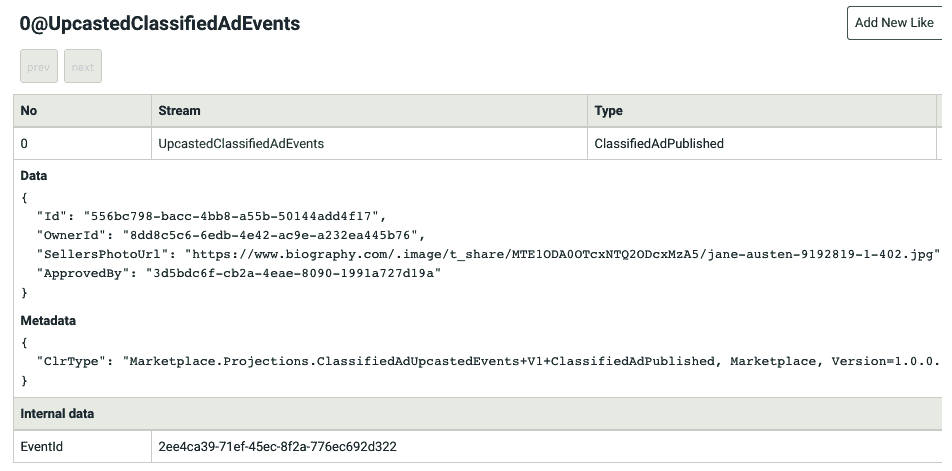

提升事件的同意

注意，由于我们一切都在内存中，并且我们的投影每次应用程序启动时都从`$all`流的最开始处开始，因此提升器将再次处理事件，并且会产生与运行应用程序次数一样多的提升事件。当然，避免这种情况的唯一方法是在我们处理每个事件后存储流位置。当我们停止并启动应用程序时，我们读取存储的位置，然后只开始处理新事件。我们将在下一节中深入探讨这一点。

# 持久化存储

到目前为止，我们已经有了一些投影，它们构建了一些有用的读取模型，我们可能可以用它们来构建应用程序的 UI。然而，这些读取模型不是持久的，当我们停止应用程序时，一切都会消失。当然，当我们再次启动应用程序时，读取模型会迅速重建，尽管这是在开发周期开始时构建读取模型的完美方式，但这在生产系统中是不可行的。此外，如果我们使用上推，每次应用程序启动时都会发出上推事件，因为上推订阅将再次处理所有事件。因此，现在是时候将我们的读取模型持久化到数据库中。

# 检查点

如我们之前所见，当启动我们的应用程序时，它会重新处理所有投影中的所有事件。这是因为我们在创建`ProjectionManager`代码中的订阅时，将`Position.Start`作为初始位置。由于我们希望将我们的读取模型存储在数据库中，我们还需要在处理事件后开始给订阅一个实际的位置。这意味着我们还需要将位置持久化到某个地方。在不同的系统中，这样的位置可能有不同的叫法。在事件日志系统中，如 Kafka 或 Azure Event Hub，使用的是**偏移量**这个术语。Event Store 使用的是**检查点**，这正是本书将要使用的。

理想情况下，我们会将检查点存储在与该订阅的读取模型相同的数据库中。对于某些数据库引擎，甚至可以将所有读取模型更新和检查点更新封装在一个单一的事务中，这可能是有益的。使用这种方法无疑会使投影处理代码更加复杂，因为单个事务需要传递到所有投影和检查点存储。

我们将使用 RavenDB，尽管它支持某种多文档事务，但我们不会这样做以保持代码的简洁性。因此，我需要做的第一件事是定义检查点存储的接口。为此，我在`Marketplace.Framework`项目中添加了一个`ICheckpointStore`文件。代码非常简单；我们只需要几个方法，如下所示：

```cs
using System.Threading.Tasks;
using EventStore.ClientAPI;

namespace Marketplace.Framework
{
    public interface ICheckpointStore
    {
        Task<Position> GetCheckpoint();
        Task StoreCheckpoint(Position checkpoint);
    }
}
```

在这里，`Position`是在 Event Store API 中定义的`struct`，我们可能想要尽量避免在这个项目中放置基础设施依赖，但暂时它是可行的。

我们还需要一个 RavenDB 文档，其中将存储检查点。它需要一个字符串类型的`Id`字段和实际的位置：

```cs
using EventStore.ClientAPI;

namespace Marketplace.Infrastructure
{
    public class Checkpoint
    {
        public string Id { get; set; }
        public Position Position { get; set; }
    }
}
```

接下来，我们需要实现这个接口。由于我计划将所有内容存储在 RavenDB 中，因此将实现命名为`RavenDbCheckpointStore`是合理的。我将这个类添加到`Infrastructure`文件夹中的`Marketplace`项目中：

```cs
using System;
using System.Threading.Tasks;
using EventStore.ClientAPI;
using Marketplace.Framework;
using Raven.Client.Documents.Session;

namespace Marketplace.Infrastructure
{
    public class RavenDbCheckpointStore : ICheckpointStore
    {
        private readonly Func<IAsyncDocumentSession> _getSession;
        private readonly string _checkpointName;

        public RavenDbCheckpointStore(
            Func<IAsyncDocumentSession> getSession,
            string checkpointName)
        {
            _getSession = getSession;
            _checkpointName = checkpointName;
        }

        public async Task<Position> GetCheckpoint()
        {
            using var session = _getSession();
            var checkpoint = await session
                .LoadAsync<Checkpoint>(_checkpointName);
            return checkpoint?.Position ?? Position.Start;
        }

        public async Task StoreCheckpoint(Position position)
        {
            using var session = _getSession();

            var checkpoint = await session
                .LoadAsync<Checkpoint>(_checkpointName);

            if (checkpoint == null)
            {
                checkpoint = new Checkpoint
                {
                    Id = _checkpointName
                };
                await session.StoreAsync(checkpoint);
            }

            checkpoint.Position = position;
            await session.SaveChangesAsync();
        }
    }
}
```

虽然代码有点长，但并不复杂。我们需要给这个类提供一个会话工厂作为参数。我们还需要某种标识符，以防我们有多达多个订阅。这个`checkpointName`字符串将被用作`Checkpoint`文档 ID。

在`GetCheckpoint`方法中，我们尝试加载文档，如果它不存在，则该方法返回`Position.Start`，这样我们就可以订阅到最开始的位置。它复制了没有检查点的情况，如果你需要从头开始重建所有读取模型，你只需要删除这个文档以及所有读取模型的文档。

当我们保存检查点时，我们必须尝试加载一个来看看它是否存在。如果存在，我们使用新的位置更新它，否则，我们存储一个新的文档。

接下来当然是我们的`ProjectionManager`。它需要能够与检查点存储一起工作。我们不需要它了解 RavenDb，因为它只需要用于投影和检查点存储。但是，在订阅时需要调用检查点存储，并在每个事件投影后保存位置。因此，我们需要添加`ICheckpointStore`参数并调用该接口的两个方法，如下所示：

```cs
using System.Linq;
using System.Threading.Tasks;
using EventStore.ClientAPI;
using Marketplace.Framework;
using Serilog;
using Serilog.Events;

namespace Marketplace.Infrastructure
{
    public class ProjectionManager
    {
        private readonly IEventStoreConnection _connection;
        private readonly ICheckpointStore _checkpointStore;
        private readonly IProjection[] _projections;
        private EventStoreAllCatchUpSubscription _subscription;

        public ProjectionManager(
            IEventStoreConnection connection, 
            ICheckpointStore checkpointStore, 
            params IProjection[] projections)
        {
            _connection = connection;
            _checkpointStore = checkpointStore;
            _projections = projections;
        }

        public async Task Start()
        {
            var settings = new CatchUpSubscriptionSettings(2000, 500,
                Log.IsEnabled(LogEventLevel.Verbose),
                false, "try-out-subscription");

            var position = await _checkpointStore.GetCheckpoint();
            _subscription = _connection.SubscribeToAllFrom(position,
                settings, EventAppeared);
        }

        public void Stop() => _subscription.Stop();

        private async Task EventAppeared(
            EventStoreCatchUpSubscription _, 
            ResolvedEvent resolvedEvent)
        {
            if (resolvedEvent.Event.EventType.StartsWith("$")) return;

            var @event = resolvedEvent.Deserialzie();

            Log.Debug("Projecting event {type}", 
                @event.GetType().Name);
            await Task.WhenAll(_projections.Select(
                x => x.Project(@event)));

            await _checkpointStore.StoreCheckpoint(
                resolvedEvent.OriginalPosition.Value);
        }
    }
}
```

# 持久化读取模型

由于我们无论如何都需要 RavenDb，所以我从第十章的代码中使用了部分代码，*事件溯源*，但使其变得更加高级。我将文档存储的初始化移动到了`Startup`类的一个单独的方法中。该方法将使用`appsettings.json`配置部分而不是硬编码的值。如果数据库不存在，它还会创建数据库，因此我们不需要手动创建它。对于本章的内容来说，了解数据库是如何配置的并不重要，你可以查看书籍中的代码片段来了解它是如何实现的。同时也要查看那里的设置文件，以了解配置结构。

在进行这些更改后，我需要更改`Startup.ConfigureServices`方法，使其调用存储初始化方法。我们需要有一个文档会话工厂，并在服务集合中注册`IAsyncDocumentSession`，因为我们将在查询 API 控制器中使用它。以下是注册中的一些更改：

```cs
var documentStore = ConfigureRavenDb(
    Configuration.GetSection("ravenDb"));

Func<IAsyncDocumentSession> getSession = 
    () => documentStore.OpenAsyncSession();

services.AddTransient(c => getSession());
```

为了使单个投影更简单，因为它们现在都将使用 RavenDb，我创建了一个简单的基抽象类，称为`RavenDbProjection`。它接受会话工厂作为其构造函数的参数，并包含一个有用的方法来执行读取模型文档的更新，这就是为什么这个类是一个泛型类，我们将使用读取模型类类型作为泛型参数：

```cs
using System;
using System.Linq.Expressions;
using System.Threading.Tasks;
using Marketplace.Framework;
using Raven.Client.Documents;
using Raven.Client.Documents.Linq;
using Raven.Client.Documents.Session;

namespace Marketplace.Infrastructure
{
    public abstract class RavenDbProjection<T> : IProjection
    {
        protected RavenDbProjection(
            Func<IAsyncDocumentSession> getSession
        )
            => GetSession = getSession;

        protected Func<IAsyncDocumentSession> GetSession { get; }

        public abstract Task Project(object @event);

        protected Task Create(Func<Task<T>> model)
            => UsingSession(
                async session => 
                    await session.StoreAsync(await model())
            );

        protected Task UpdateOne(Guid id, Action<T> update)
            => UsingSession(
                session =>
                    UpdateItem(session, id, update)
            );

        protected Task UpdateWhere(
            Expression<Func<T, bool>> where,
            Action<T> update
        ) => UsingSession(
            session =>
                UpdateMultipleItems(
                    session, where, update
                )
        );

        private static async Task UpdateItem(
            IAsyncDocumentSession session, Guid id,
            Action<T> update
        )
        {
            var item = await session
                .LoadAsync<T>(id.ToString());

            if (item == null) return;

            update(item);
        }

        async Task UpdateMultipleItems(
            IAsyncDocumentSession session,
            Expression<Func<T, bool>> query, Action<T> update
        )
        {
            var items = await session
                .Query<T>()
                .Where(query)
                .ToListAsync();
            foreach (var item in items)
                update(item);
        }

        protected async Task UsingSession(
            Func<IAsyncDocumentSession, Task> operation
        )
        {
            using var session = GetSession();

            await operation(session);
            await session.SaveChangesAsync();
        }
    }
}
```

你已经看到了 `UpdateItem` 和 `UpdateMultipleItems`，这些是在投影类内部实现的。由于代码非常相似，我能够将其隔离在抽象类中。我还将这些方法设为私有，并创建了三个具有更简单签名的三个方法：`Create`、`UpdatedOne` 和 `UpdateWhere`。注意还有 `UsingSession` 方法。

由于我们使用会话工厂，因此在使用后我们将负责释放它。为了避免在投影代码中 `using` 语句的无限噪音，我们将调用 `UsingSession` 方法，它将为我们完成这项工作。它还持久化在会话释放之前由它调用的委托所做的所有更改。

为了将读取模型作为文档保存到 RavenDB，我们必须遵守数据库引擎约定，以使我们的生活更简单。因此，我们必须将所有标识属性更改为具有 `Id` 名称和字符串类型（现在我们有 `Guid`）。在所有类型不匹配的地方，我通过调用 `ToString()` 改变了 `Guid` 字段的用法。

现在，我们已经准备好将最简单的投影转换为使用 RavenDB，这将是我们所说的 `UserDetailsProjection`。我将它更改为从 `RavenDbProjection` 抽象类继承，这样辅助方法就可以消失了。由于基类需要，我们需要一个构造函数，但总体上，代码现在更小了。唯一的真正改变是，我使用了那些新的辅助方法来简化代码。以下是新的代码：

```cs
using System;
using System.Threading.Tasks;
using Marketplace.Domain.UserProfile;
using Marketplace.Infrastructure;
using Raven.Client.Documents.Session;

namespace Marketplace.Projections
{
    public class UserDetailsProjection
        : RavenDbProjection<ReadModels.UserDetails>
    {
        public UserDetailsProjection(
            Func<IAsyncDocumentSession> getSession
        ) : base(getSession) { }

        public override Task Project(object @event) => 
            @event switch
            {
                Events.UserRegistered e =>
                    Create(
                        () => Task.FromResult(
                            new ReadModels.UserDetails
                            {
                                Id = e.UserId.ToString(),
                                DisplayName = e.DisplayName
                            }
                        )
                    ),
                Events.UserDisplayNameUpdated e =>
                    UpdateOne(
                        e.UserId,
                        x => x.DisplayName = e.DisplayName
                    ),
                Events.ProfilePhotoUploaded e =>
                    UpdateOne(
                        e.UserId,
                        x => x.PhotoUrl = e.PhotoUrl
                    ),
                _ => Task.CompletedTask
            };
    }
}
```

我们的第二个投影更为严重，因此我们需要进行更多更改，但差异并不大。我们需要给它会话工厂，因为它是 `RavenDbProjection` 基类所必需的。一个重要的改变是，由于我们可以想象用户显示名查询是异步的，我们需要将委托签名更改为返回 `Task<string>` 而不是字符串。所有其他更改都与通过调用基类的 `Update` 和 `UpdateWhere` 方法实现更新有关。需要注意的是，除了这个之外，还与用户资料的异步查询有关，因此当我们调用查询时，我们需要等待调用。以下是完整的代码：

```cs
using System;
using System.Linq.Expressions;
using System.Threading.Tasks;
using Marketplace.ClassifiedAd;
using Marketplace.Infrastructure;
using Raven.Client.Documents.Session;
using static Marketplace.Domain.ClassifiedAd.Events;
using static Marketplace.Domain.UserProfile.Events;
using static Marketplace.Projections.ClassifiedAdUpcastedEvents;
using static Marketplace.Projections.ReadModels;

namespace Marketplace.Projections
{
    public class ClassifiedAdDetailsProjection
        : RavenDbProjection<ClassifiedAdDetails>
    {
        private readonly Func<Guid, Task<string>>
            _getUserDisplayName;

        public ClassifiedAdDetailsProjection(
            Func<IAsyncDocumentSession> getSession,
            Func<Guid, Task<string>> getUserDisplayName
        )
            : base(getSession)
            => _getUserDisplayName = getUserDisplayName;

        public override Task Project(object @event) =>
            @event switch
            {
                ClassifiedAdCreated e =>
                    Create(async () =>
                        new ClassifiedAdDetails
                        {
                            Id = e.Id.ToString(),
                            SellerId = e.OwnerId,
                            SellersDisplayName =
                                await _getUserDisplayName(
                                    e.OwnerId
                                )
                        }
                    ),
                ClassifiedAdTitleChanged e =>
                    UpdateOne(e.Id, ad => ad.Title = e.Title),
                ClassifiedAdTextUpdated e =>
                    UpdateOne(e.Id, ad => ad.Description = e.AdText),
                ClassifiedAdPriceUpdated e =>
                    UpdateOne(
                        e.Id,
                        ad =>
                        {
                            ad.Price = e.Price;
                            ad.CurrencyCode = e.CurrencyCode;
                        }
                    ),
                UserDisplayNameUpdated e =>
                    UpdateWhere(
                        x => x.SellerId == e.UserId,
                        x => x.SellersDisplayName = e.DisplayName
                    ),
                V1.ClassifiedAdPublished e =>
                    UpdateOne(
                        e.Id,
                        ad => ad.SellersPhotoUrl = e.SellersPhotoUrl
                    ),
                _ => Task.CompletedTask
            };
    }
}

```

最后一个投影是我们的提升器。由于它不使用 RavenDB，因此没有必要从基类继承。我需要做的唯一改变是更改查询委托，使其返回 `Task<string>`，并且查询调用需要等待：

```cs
var photoUrl = await _getUserPhoto(e.OwnerId);
```

我不会在这里放置完整的班级代码，因为更改很小。

需要注意的一件事是，当然是在 `UserDetails` 读取模型中创建这些查询，因为我们不会简单地使用 `List`。为了使代码更简单，我在 `ReadModels.UserDetails` 命名空间中创建了一个名为 `Queries` 的小类，其中有一个方法可以获取单个用户的资料：

```cs
using System;
using System.Threading.Tasks;
using Raven.Client.Documents.Session;
using static Marketplace.Projections.ReadModels;

namespace Marketplace.UserProfile
{
    public static class Queries
    {
        public static Task<UserDetails> GetUserDetails(
            this Func<IAsyncDocumentSession> getSession,
            Guid id
        )
        {
            using var session = getSession();

            return session.LoadAsync<UserDetails>(id.ToString());
        }
    }
}
```

这是一种扩展方法，不是针对会话对象本身，而是针对会话工厂，因为我们必须在调用此查询之后销毁会话。对于控制器来说，情况将不同，因为在那里，服务集合将给我们一个会话作为临时依赖项。

# 总结

我们现在需要做的只是进行一些连接和修改查询 API 控制器的一些小改动。

首先，`EventStoreService`类需要等待对`projectionManager.Start()`的调用，因为这个方法现在是异步的。然后，我们需要通过修改`Queries`扩展类以使用文档会话来修复查询 API 控制器。

```cs
using System.Threading.Tasks;
using Raven.Client.Documents.Session;
using static Marketplace.ClassifiedAd.QueryModels;
using static Marketplace.Projections.ReadModels;

namespace Marketplace.ClassifiedAd
{
    public static class Queries
    {
        public static Task<ClassifiedAdDetails> Query(
            this IAsyncDocumentSession session,
            GetPublicClassifiedAd query
        ) =>
            session.LoadAsync<ClassifiedAdDetails>(
                query.ClassifiedAdId.ToString()
            );
    }
}
```

由于查询现在是异步的，我们需要准备`RequestHandler.HandleQuery`以便它可以等待查询，并且返回`Task<IActionResult>`以便控制器也可以是异步的：

```cs
public static async Task<IActionResult> HandleQuery<TModel>(
    Func<Task<TModel>> query, ILogger log)
{
    try
    {
        return new OkObjectResult(await query());
    }
    catch (Exception e)
    {
        log.Error(e, "Error handling the query");
        return new BadRequestObjectResult(
            new
            {
                error = e.Message, stackTrace = e.StackTrace
            });
    }
}
```

API 的最后更改将是修复控制器本身，以便它可以注入会话作为依赖项并成为异步的：

```cs
using System.Threading.Tasks;
using Marketplace.Infrastructure;
using Microsoft.AspNetCore.Mvc;
using Raven.Client.Documents.Session;
using Serilog;

namespace Marketplace.ClassifiedAd
{
    [Route("/ad")]
    public class ClassifiedAdsQueryApi : Controller
    {
        private readonly IAsyncDocumentSession _session;
        private static ILogger _log = 
        Log.ForContext<ClassifiedAdsQueryApi>();

        public ClassifiedAdsQueryApi(IAsyncDocumentSession session) => 
            _session = session;

        [HttpGet]
        public Task<IActionResult> 
        Get(QueryModels.GetPublicClassifiedAd request)
            => RequestHandler.HandleQuery(() => 
                _session.Query(request), _log);
    }
}
```

最后要修复的是`Startup`类。我已经提到了 RavenDB 的初始化和前面的注册代码。我们只需要对注册我们的投影管理器和所有投影做一些必要的更改。记住，我们已经将查询委托改为异步，所以接下来的代码行中有相当多的更改：

```cs
var projectionManager = new ProjectionManager(esConnection,
    new RavenDbCheckpointStore(getSession, "readmodels"),
    new ClassifiedAdDetailsProjection(getSession,
        async userId => (await 
        getSession.GetUserDetails(userId))?.DisplayName),
    new ClassifiedAdUpcasters(esConnection,
        async userId => (await 
        getSession.GetUserDetails(userId))?.PhotoUrl),
        new UserDetailsProjection(getSession));
```

首先，我们添加了检查点存储参数。然后，我们将会话工厂作为参数添加到两个使用 RavenDB 的投影中。最后，两个查询都变为异步，并使用相同的会话工厂结合我们新的查询扩展。

所有工作都已完成，现在是时候运行应用程序并看看会发生什么。

在我按下*F5*后，我在日志中看到了消息，显示与我们之前看到相同的相同事件正在被投影。这是预期的，因为我们是从头开始的。现在我可以再次调用查询 API，看看结果是否正如我所预期的那样。如果我现在重新启动应用程序，它不会从投影中产生任何日志，因为我们现在已经持久化了检查点并从我们停止的地方开始订阅。所以，除非我们开始执行新的操作，否则我们不会得到新的事件。从现在开始，我们的应用程序将实时处理所有更新。

让我们看看数据库中有什么。当我通过访问`http://localhost:8080`打开 RavenDB Studio UI 时，我看到`Marketplace_Chapter11`数据库存在，因此我可以点击它并检查内容。在数据库中，我找到了不同集合中的三个文档，如下所示：

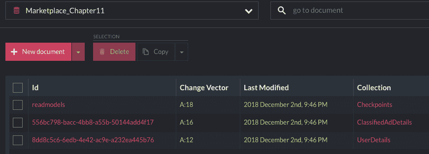

在 RavenDB 中有三个集合

其中两份文档是我们的读取模型，另一份文档是检查点。让我们看看`ClassifiedAdDetails`文档包含什么。正如预期的那样，我们得到了从我们的事件中投影的所有信息：

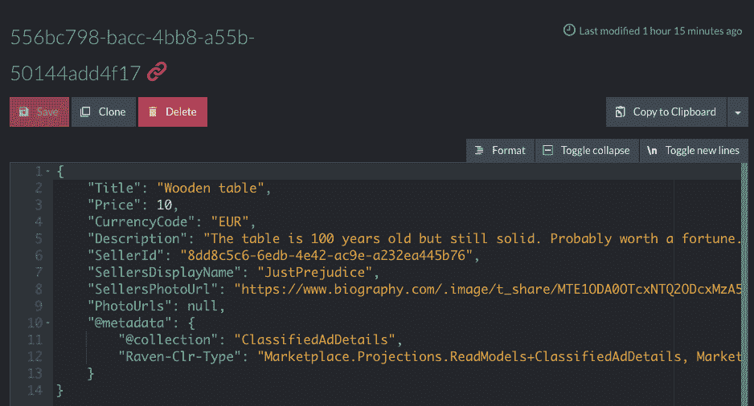

读取模型作为 RavenDB 文档

现在，我们可以检查检查点文档包含的内容。它包含我们的检查点名称的 ID，JSON 内容类似于以下内容（您可能有不同的值）：

```cs
{
    "Position": {
        "CommitPosition": 48771203,
        "PreparePosition": 48771203
    },
    "@metadata": {
        "@collection": "Checkpoints",
        "Raven-Clr-Type": "Marketplace.Infrastructure.Checkpoint, Marketplace"
    }
}
```

到目前为止，我们已将所有读取模型正确存储在数据库中，因此我们可以从中构建更多查询，就像我们在第九章，《CQRS - 读取侧》中所做的那样。

# 摘要

在本章中，我们将 CQRS 提升到了一个新的高度，并学习了如何查询最初存储为事件流的数据库数据。由于事件流难以按需查询，我们需要构建可以展示给用户的数据快照。事件源读取模型的力量在于我们可以构建几乎无限数量的针对特定用例的读取模型，并具有非常精确的数据集。我们可以避免诸如在对象集合或表之间进行连接，或者在远程服务之间进行连接等问题。我们可以一次性移除所有读取模型，并从零开始重建它们，仅使用事件。如果我们以某种方式创建了一个投影，它显示屏幕上的数据错误，那么我们可以快速捕捉到错误，并通过移除和重建读取模型来修复读取模型。

当然，任何事物都有其权衡。有时，我们无法从投影的事件中获取读取模型所需的所有数据。然而，我们已经讨论了多种避免这种限制的技术。

尽管如此，我们应该记住，当系统增长时，事件的数量也会增长，构建一个新的读取模型或重建之前存在错误且需要修复的读取模型，然后再次在数据库中构建所有记录，可能需要非常长的时间。对于拥有数十亿事件的大型系统，这可能需要几天甚至几周的时间。有方法可以提高投影的性能，我将在讨论事件源的高级主题时提到这些方法。然而，请记住，默认情况下，事件是按顺序投影的，顺序非常重要。因此，我们在消息世界中应用的常规技术，如用于水平扩展的竞争消费者，并不直接适用于投影。然而，通过将`$all`流根据给定的属性分割成几个流，可以分区投影。用 JavaScript 编写并直接在服务器上运行的 Event Store 投影可用于此目的。

尽管我们已经讨论了一些相当高级的主题，但最后几章内容非常技术性。在[第十三章](https://www.packtpub.com/sites/default/files/downloads/Splitting_the_System.pdf)，《系统拆分》中，我们回到了**领域驱动设计**（**DDD**）的概念，并将讨论 DDD 最重要的思想——在问题空间中，没有复杂的系统可以作为一个解决方案空间中的单一系统来实现。我们将继续讨论边界上下文和上下文映射。
