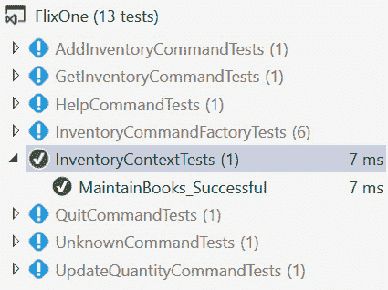
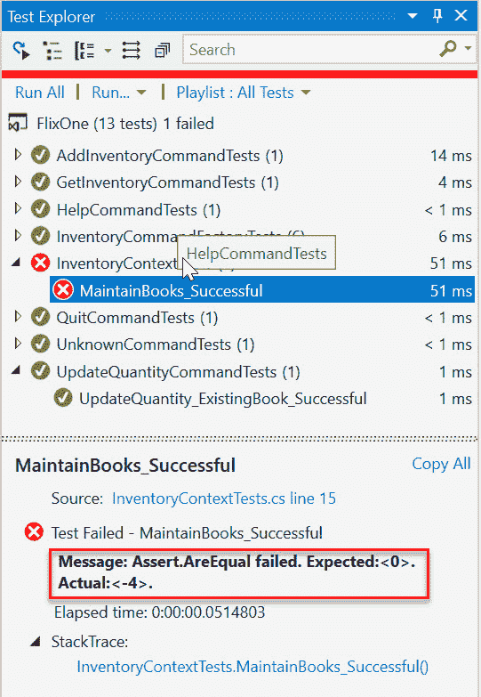
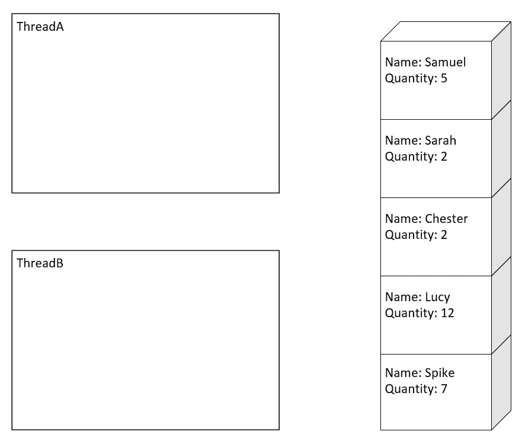
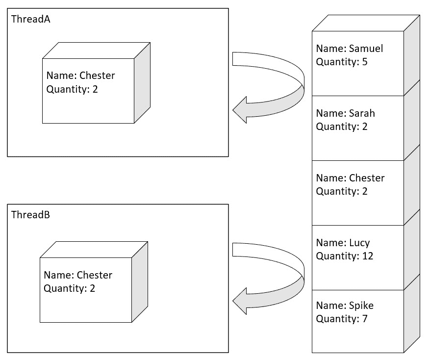
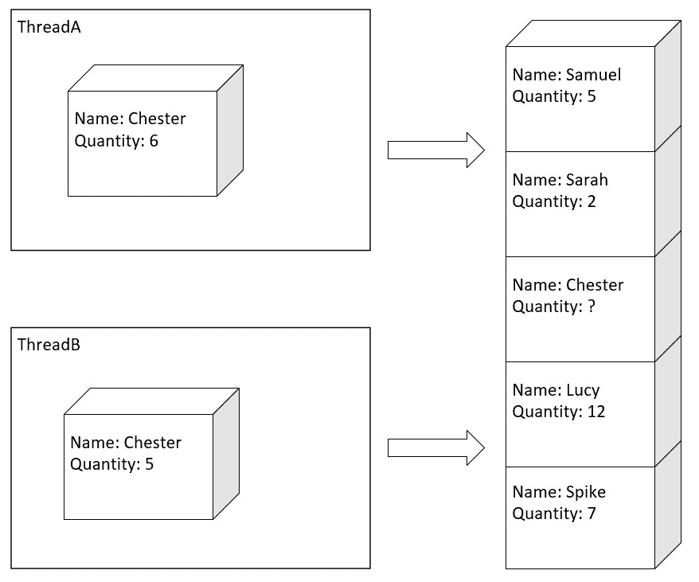
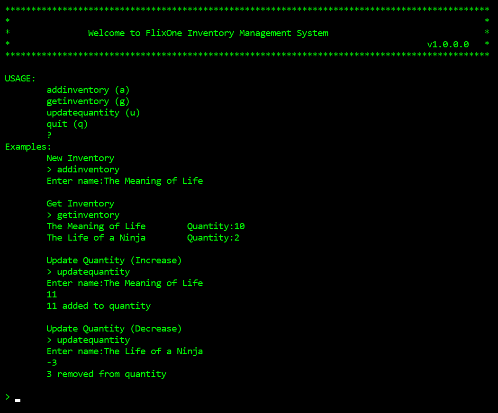
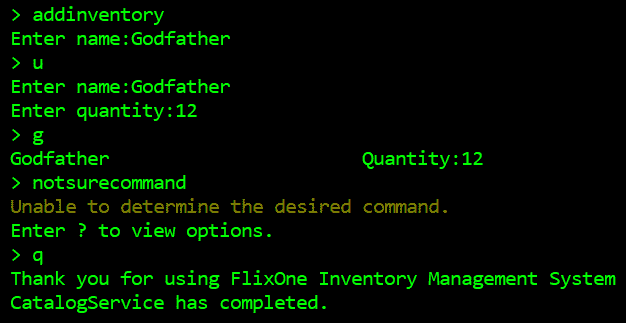

# 第四章：实现设计模式 - 基础部分 2

在上一章中，我们介绍了 FlixOne 以及新库存管理应用程序的初始开发。开发团队使用了多种模式，从旨在限制可交付成果范围的模式，如 **最小可行产品**（**MVP**），到帮助项目开发的模式，如 **测试驱动开发**（**TDD**）。还应用了 **四人帮**（**GoF**）的几个模式，作为利用过去他人解决类似问题的解决方案，以避免重复常见的错误。应用了单一职责原则、开闭原则、里氏替换原则、接口隔离原则和依赖倒置原则（SOLID 原则），以确保我们创建一个稳定的代码库，这将有助于我们应用程序的管理和未来开发。

本章将继续通过结合更多模式来解释 FlixOne 库存管理应用程序的构建。将使用更多 GoF 模式，包括单例和工厂模式。将使用单例模式来展示用于维护 FlixOne 书籍集合的存储库模式。工厂模式将进一步理解 **依赖注入**（**DI**）。最后，我们将使用 .NET Core 框架来简化一个 **控制反转**（**IoC**）容器的使用，该容器将用于完成初始的库存管理控制台应用程序。

本章将涵盖以下主题：

+   单例模式

+   工厂模式

+   .NET Core 的特性

+   控制台应用程序

# 技术要求

本章包含各种代码示例来解释这些概念。代码保持简单，仅用于演示目的。大多数示例涉及使用 C# 编写的 .NET Core 控制台应用程序。

要运行和执行代码，你需要以下内容：

+   Visual Studio 2019（你也可以使用 Visual Studio 2017 版本 3 或更高版本运行应用程序）

+   .NET Core

+   SQL Server（本章使用的是 Express 版本）

# 安装 Visual Studio

要运行这些代码示例，你需要安装 Visual Studio 或更高版本。你可以使用你喜欢的 IDE。为此，请遵循以下说明：

1.  从以下链接下载 Visual Studio：[`docs.microsoft.com/en-us/visualstudio/install/install-visual-studio`](https://docs.microsoft.com/en-us/visualstudio/install/install-visual-studio)。

1.  按照包含的安装说明进行操作。Visual Studio 提供了多种安装版本；在本章中，我们使用的是 Windows 版本的 Visual Studio。

# 设置 .NET Core

如果你尚未安装 .NET Core，你需要遵循以下说明：

1.  从以下链接下载 .NET Core：[`www.microsoft.com/net/download/windows`](https://www.microsoft.com/net/download/windows)。

1.  按照相关库的安装说明进行操作：[`dotnet.microsoft.com/download/dotnet-core/2.2`](https://dotnet.microsoft.com/download/dotnet-core/2.2)。

完整的源代码可在 GitHub 上找到。本章中展示的源代码可能不完整，因此建议您检索源代码以运行示例（[`github.com/PacktPublishing/Hands-On-Design-Patterns-with-C-and-.NET-Core/tree/master/Chapter4`](https://github.com/PacktPublishing/Hands-On-Design-Patterns-with-C-and-.NET-Core/tree/master/Chapter4)）。

# 单例模式

单例模式是 GoF 设计模式之一，用于限制类的实例化只能有一个对象。它在需要协调系统内的操作或需要限制数据访问的情况下使用。例如，如果需要在应用程序中限制对文件的访问，只允许一个写者，那么可以使用单例来防止多个对象同时尝试写入文件。在我们的场景中，我们将使用单例来维护书籍及其库存的集合。

当使用示例说明时，单例模式的值更为明显。本节将从基本类开始，然后继续识别单例模式解决的问题。这些问题将被识别，然后通过单元测试对类进行更新和验证。

单例模式仅在必要时使用，因为它可能会为应用程序引入潜在的瓶颈。有时，该模式被视为反模式，因为它引入了全局状态。随着全局状态的出现，应用程序中的未知依赖项被引入，并且不清楚有多少类型可能依赖于这些信息。此外，许多框架和存储库在需要时已经限制了访问，因此引入额外的机制可能会不必要地限制性能。

.NET Core 对所讨论的许多模式提供支持。在下一章中，我们将利用`ServiceCollection`类的对工厂方法和单例模式的支持。

在我们的场景中，单例模式将用于保持包含书籍集合的内存存储库。单例将防止多个线程同时更新书籍集合。这需要我们将代码的一部分进行锁定，以防止不可预测的更新。

在应用程序中引入单例的复杂性可能很微妙；因此，为了对模式有一个坚实的理解，我们将涵盖以下主题：

+   .Net Framework 对进程和线程的处理

+   存储库模式

+   竞态条件

+   单元测试以识别竞态条件

# 进程和线程

要理解单例模式，我们需要提供一些背景信息。在 .Net 框架中，一个应用程序将由轻量级、受管理的子进程组成，称为应用程序域，这些子进程可以包含一个或多个受管理的线程。为了理解单例模式，让我们将其定义为一个包含一个或多个同时运行的线程的多线程应用程序。技术上，线程实际上并不是同时运行的，但这通过在线程之间分配可用的处理器时间来实现，这样每个线程将执行一小段时间，然后线程将暂停活动，允许另一个线程执行。

回到单例模式，在多线程应用程序中，需要特别注意确保对单例的访问受到限制，以便一次只有一个线程进入特定的逻辑区域。由于这种线程同步，一个线程可能检索一个值并更新它，而在它能够被存储之前，另一个线程也可能更新该值。

多个线程访问同一共享数据并可能产生不可预测结果的潜在情况可以被称为**竞态条件**。

为了避免数据被错误地更新，需要一些限制来防止多个线程同时执行相同的逻辑块。.Net 框架支持几种机制，在单例模式中，使用 `lock` 关键字。在下面的代码中，`lock` 关键字被用来展示一次只有一个线程可以执行高亮显示的代码，而所有其他线程将被阻塞：

```cs
public class Inventory
{
   int _quantity;
    private Object _lock = new Object();

    public void RemoveQuantity(int amount)
    {
        lock (_lock)
        {
            if (_quantity - amount < 0)
 {
 throw new Exception("Cannot remove more than we have!");
 }
 _quantity -= amount;
        }
    }
}
```

锁是一种简单的方式来限制对代码段访问，并且可以应用于对象实例，正如我们之前的例子所示，也可以应用于标记为静态的代码段。

# **存储库模式**

在项目中引入的单例模式应用于一个用于维护库存书籍集合的类。单例将防止多个线程错误地访问，并且，另一个模式，即存储库模式，将被用来创建对正在管理的数据的封装。

存储库模式在应用程序的业务逻辑和底层数据之间提供了一个抽象层。这提供了几个优点。通过清晰的分离，我们可以独立于底层数据维护和单元测试业务逻辑。通常，同一个存储库模式类可以被多个业务对象重用。这可以是一个例子`GetInventoryCommand`、`AddInventoryCommand`和`UpdateInventoryCommand`对象；所有这些对象都使用相同的存储库类。这允许我们独立于存储库测试这些命令中的逻辑。模式的另一个优点是它使得集中实现数据相关策略变得更加容易，例如缓存。

首先，让我们考虑以下接口，它描述了存储库将实现的方法；它包含一个用于检索书籍、添加书籍和更新书籍数量的方法：

```cs
internal interface IInventoryContext
{
    Book[] GetBooks();
    bool AddBook(string name);
    bool UpdateQuantity(string name, int quantity);
}
```

存储库的初始版本如下：

```cs
internal class InventoryContext : IInventoryContext
{ 
    public InventoryContext()
    {
        _books = new Dictionary<string, Book>();
    }

    private readonly IDictionary<string, Book> _books; 

    public Book[] GetBooks()
    {
        return _books.Values.ToArray();
    }

    public bool AddBook(string name)
    {
        _books.Add(name, new Book { Name = name });
        return true;
    }

    public bool UpdateQuantity(string name, int quantity)
    {
        _books[name].Quantity += quantity;
        return true;
    }
}
```

在本章中，书籍集合以内存缓存的形式维护，在后面的章节中，这将被移动到一个提供持久数据的存储库。当然，这种实现并不理想，因为一旦应用程序结束，所有数据都将丢失。然而，它有助于说明单例模式。

# 单元测试

为了说明单例模式解决的问题，让我们从一个简单的单元测试开始，该测试向存储库中添加 30 本书，更新不同书籍的数量，然后验证结果。以下代码显示了整个单元测试，我们将逐个解释每个步骤：

```cs
 [TestClass]
public class InventoryContextTests
{ 
    [TestMethod]
    public void MaintainBooks_Successful()
    { 
        var context = new InventoryContext();

        // add thirty books
        ...

        // let's update the quantity of the books by adding 1, 2, 3, 4, 5 ...
        ...

        // let's update the quantity of the books by subtracting 1, 2, 3, 4, 5 ...
        ...

        // all quantities should be 0
        ...
    } 
}
```

要添加 30 本书，使用`context`实例从`Book_1`到`Book_30`添加书籍：

```cs
        // add thirty books
        foreach(var id in Enumerable.Range(1, 30))
        {
            context.AddBook($"Book_{id}"); 
        }
```

下一个部分通过将数字从`1`到`10`添加到每本书的数量来更新书籍数量：

```cs
        // let's update the quantity of the books by adding 1, 2, 3, 4, 5 ...
        foreach (var quantity in Enumerable.Range(1, 10))
        {
            foreach (var id in Enumerable.Range(1, 30))
            {
                context.UpdateQuantity($"Book_{id}", quantity);
            }
        }
```

然后，在下一节中，我们将从每本书的数量中减去数字从`1`到`10`：

```cs
        foreach (var quantity in Enumerable.Range(1, 10))
        {
            foreach (var id in Enumerable.Range(1, 30))
            {
                context.UpdateQuantity($"Book_{id}", -quantity);
            }
        }
```

由于我们为每本书添加和删除了相同的数量，我们的测试的最后部分将验证最终数量为`0`：

```cs
        // all quantities should be 0
        foreach (var book in context.GetBooks())
        {
            Assert.AreEqual(0, book.Quantity);
        }
```

运行测试后，我们可以看到测试通过了：



因此，当测试在一个单独的进程中运行时，存储库按预期工作。然而，如果更新请求在单独的线程中执行呢？为了测试这一点，单元测试将被重构以在单独的线程中对`InventoryContext`类进行调用。

将书籍的添加移动到执行添加书籍作为任务的方法（即在它自己的线程中）：

```cs
public Task AddBook(string book)
{
    return Task.Run(() =>
    {
        var context = new InventoryContext();
        Assert.IsTrue(context.AddBook(book));
    });
}
```

此外，更新数量步骤被移动到另一个具有相似方法的方法中：

```cs
public Task UpdateQuantity(string book, int quantity)
{
    return Task.Run(() =>
    {
        var context = new InventoryContext();
        Assert.IsTrue(context.UpdateQuantity(book, quantity));
    });
}
```

然后单元测试被更新为调用新方法。值得注意的是，单元测试将在所有书籍添加完毕后再更新数量。

现在的`添加三十本书`部分如下所示：

```cs
    // add thirty books
    foreach (var id in Enumerable.Range(1, 30))
    {
        tasks.Add(AddBook($"Book_{id}"));
    }

    Task.WaitAll(tasks.ToArray());
    tasks.Clear();
```

同样，更新数量被改为在任务中调用`Add`和`subtract`方法：

```cs
    // let's update the quantity of the books by adding 1, 2, 3, 4, 5 ...
    foreach (var quantity in Enumerable.Range(1, 10))
    {
        foreach (var id in Enumerable.Range(1, 30))
        {
            tasks.Add(UpdateQuantity($"Book_{id}", quantity));
        }
    }

    // let's update the quantity of the books by subtractin 1, 2, 3, 4, 5 ...
    foreach (var quantity in Enumerable.Range(1, 10))
    {
        foreach (var id in Enumerable.Range(1, 30))
        {
            tasks.Add(UpdateQuantity($"Book_{id}", -quantity));
        }
    }

    // wait for all adds and subtracts to finish
    Task.WaitAll(tasks.ToArray());
```

在重构之后，单元测试不再成功完成，并且当现在运行单元测试时，会报告一个错误，表明在收藏中没有找到书籍。这将被报告为`"给定的键不在字典中。"`。这是因为每次实例化上下文时，都会创建一个新的书籍收藏。第一步是限制上下文的创建。这是通过更改构造函数的访问权限来完成的，使得类不能再直接实例化。相反，添加了一个新的公共`static`属性，它只支持`get`操作。这个属性将返回`InventoryContext`类的底层`static`实例，如果实例不存在，将创建它：

```cs
internal class InventoryContext : IInventoryContext
{ 
    protected InventoryContext()
    {
        _books = new Dictionary<string, Book>();
    }

    private static InventoryContext _context;
    public static InventoryContext Singleton
    {
        get
        {
            if (_context == null)
            {
                _context = new InventoryContext();
            }

            return _context;
        }
    }
    ...
}    
```

这仍然不足以修复损坏的单元测试，但这是由于不同的原因。为了确定问题，以调试模式运行单元测试，并在`UpdateQuantity`方法中设置断点。第一次运行时，我们可以看到在书收藏中已创建并加载了 28 本书，如下面的截图所示：


在这个单元测试的点，我们预计会有 30 本书；然而，在我们开始调查之前，让我们再次运行单元测试。这次，当我们尝试访问书籍收藏以添加新书时，会得到一个**对象引用未设置为对象实例**的错误，如下面的截图所示：


此外，当单元测试第三次运行时，没有遇到**对象引用未设置为对象实例**的错误，但我们的收藏中只有 27 本书，如下面的截图所示：


这种不可预测的行为是竞态条件的典型特征，表明共享资源，即`InventoryContext`单例，正在由多个线程处理，而没有同步访问。静态对象的构造仍然允许创建多个`InventoryContext`单例的实例：

```cs
public static InventoryContext Singleton
{
    get
    {
        if (_context == null)
        {
            _context = new InventoryContext();
        }

        return _context;
    }
}
```

竞态条件是多个线程将`if`语句评估为真，并且它们都试图构造`_context`对象。所有尝试都会成功，但它们会通过这种方式覆盖之前构造的值。当然，这效率低下，尤其是在构造函数是一个昂贵的操作时，但单元测试中发现的问题实际上是由线程在另一个线程或多个线程更新书籍收藏之后构造的`_context`对象。这就是为什么在运行之间，书籍收藏`_books`的元素数量不同。

为了防止这个问题，模式在构造函数周围使用锁，如下所示：

```cs
private static object _lock = new object();
public static InventoryContext Singleton
{
    get
    { 
        if (_context == null)
        {
 lock (_lock)
            {
                _context = new InventoryContext();
            }
        }

        return _context;
    }
}
```

不幸的是，单元测试仍然失败。这是因为尽管一次只有一个线程可以进入锁，但一旦阻塞的线程完成，所有阻塞的实例仍然会进入锁。该模式通过在锁内进行额外的检查来处理这种情况，以防构造已经完成：

```cs
public static InventoryContext Singleton
{
    get
    { 
        if (_context == null)
        {
            lock (_lock)
            {
 if (_context == null)
                {
                    _context = new InventoryContext();
                }
            }
        }

        return _context;
    }
}
```

前面的锁是必不可少的，因为它防止了静态`InventoryContext`对象被多次实例化。不幸的是，我们的测试仍然没有一致地通过；每次更改，单元测试都更接近通过。一些单元测试运行将无错误完成，但偶尔，测试会以失败的结果完成，如下面的截图所示：



我们对静态仓库的实例化现在是线程安全的，但我们对书籍集合的访问不是。需要注意的是，正在使用的`Dictionary`类不是线程安全的。幸运的是，.Net Framework 中提供了线程安全的集合。这些类确保集合的**添加和删除**操作是为多线程过程编写的。请注意，只有添加和删除是线程安全的，这将在稍后变得很重要。更新的构造函数如下所示：

```cs
protected InventoryContext()
{
    _books = new ConcurrentDictionary<string, Book>();
}
```

微软建议在`System.Collections.Concurrent`中使用线程安全的集合，而不是在`System.Collections`中使用相应的集合，除非应用程序针对的是.Net Framework 1.1 或更早版本。

再次运行单元测试后，引入`ConcurrentDictionary`类仍然不足以防止错误地维护书籍。单元测试仍然失败。并发字典可以防止多个线程不可预测地添加和删除，但它不对集合中的项目本身提供任何保护。这意味着集合中对象的更新不是线程安全的。

让我们更仔细地看看多线程环境中的竞态条件，以了解为什么会出现这种情况。

# 竞态条件示例

下面的几个图示可视化了两线程之间在概念上发生的情况：**ThreadA**和**ThreadB**。第一个图显示两个线程没有任何来自集合的值：



下图显示，两个线程都从名为`Chester`的书籍集合中读取：



下图显示，**ThreadA**通过增加数量`4`来更新书籍，而**ThreadB**通过增加数量`3`来更新书籍：


然后，当更新后的书籍被持久化回集合时，我们得到一个未知量作为结果，如下所示：



为了避免这种竞争条件，我们需要在更新操作进行时阻塞其他线程。在`InventoryContext`中，阻塞其他线程的形式是对图书数量的更新操作进行锁定：

```cs
public bool UpdateQuantity(string name, int quantity)
{
    lock (_lock)
    {
        _books[name].Quantity += quantity;
    }

    return true;
}
```

单元测试现在可以无错误地完成，因为额外的锁防止了不可预测的竞争条件。

`InventoryContext`类仍然不完整，因为它只是足够完整以说明单例和存储库模式。在后面的章节中，`InventoryContext`类将被修改以使用 Entity Framework，一个**对象关系映射**（**ORM**）框架。在此阶段，`InventoryContext`类将被改进以支持额外的功能。

# AddInventoryCommand

由于我们的存储库可用，可以完成三个`InventoryCommand`类。第一个，`AddInventoryCommand`，如下所示：

```cs
internal class AddInventoryCommand : NonTerminatingCommand, IParameterisedCommand
{
    private readonly IInventoryContext _context;

    internal AddInventoryCommand(IUserInterface userInterface, IInventoryContext context) 
                                                            : base(userInterface)
    {
        _context = context;
    }

    public string InventoryName { get; private set; }

    /// <summary>
    /// AddInventoryCommand requires name
    /// </summary>
    /// <returns></returns>
    public bool GetParameters()
    {
        if (string.IsNullOrWhiteSpace(InventoryName))
            InventoryName = GetParameter("name");

        return !string.IsNullOrWhiteSpace(InventoryName);
    }

    protected override bool InternalCommand()
    {
        return _context.AddBook(InventoryName); 
    }
}
```

首先要注意的是，存储库`IInventoryContext`和前一章中描述的`IUserInterface`接口一起在构造函数中注入。命令还需要提供一个参数，`name`*，这将在实现`IParameterisedCommand`接口的`GetParameters`方法中检索，该接口也在前一章中介绍过。然后，命令在`InternalCommand`方法中运行，该方法简单地执行存储库上的`AddBook`方法并返回一个布尔值，指示命令是否成功执行。

# TestInventoryContext

与前一章中使用的`TestUserInterface`类似，`TestInventoryContext`类将通过实现`IInventoryContext`接口来模拟我们的存储库的行为。这个类将支持接口的三个方法，以及支持两个额外的用于在单元测试期间检索添加到集合中的图书和检索在单元测试期间更新的图书的方法。

为了支持`TestInventoryContext`类，将使用两个集合：

```cs
private readonly IDictionary<string, Book> _seedDictionary;
private readonly IDictionary<string, Book> _books;
```

第一个用于存储图书的起始集合，而第二个用于存储图书的最终集合。构造函数如下所示；注意字典是如何相互复制的：

```cs
public TestInventoryContext(IDictionary<string, Book> books)
{
    _seedDictionary = books.ToDictionary(book => book.Key,
                                         book => new Book { Id = book.Value.Id, 
                                                            Name = book.Value.Name, 
                                                            Quantity = book.Value.Quantity });
    _books = books;
}
```

`IInventoryContext`方法被编写为仅更新并返回集合中的一个，如下所示：

```cs
public Book[] GetBooks()
{
    return _books.Values.ToArray();
}

public bool AddBook(string name)
{
    _books.Add(name, new Book() { Name = name });

    return true;
}

public bool UpdateQuantity(string name, int quantity)
{
    _books[name].Quantity += quantity;

    return true;
}
```

在单元测试结束时，可以使用剩下的两个方法来确定起始集合和结束集合之间的差异：

```cs
public Book[] GetAddedBooks()
{
    return _books.Where(book => !_seedDictionary.ContainsKey(book.Key))
                                                    .Select(book => book.Value).ToArray();
}

public Book[] GetUpdatedBooks()
{ 
    return _books.Where(book => _seedDictionary[book.Key].Quantity != book.Value.Quantity)
                                                    .Select(book => book.Value).ToArray();
}
```

在软件行业中，关于 mocks、stubs、fakes 以及其他用于识别和/或分类测试中使用的、不适合生产但对于单元测试是必要的类型或服务的术语之间存在一些混淆。这些依赖项可能具有与其实际对应物不同的、缺失的或相同的功能。

例如，`TestUserInterface` 类可以被看作是一个模拟，因为它为单元测试提供了一些期望（例如断言语句），而 `TestInventoryContext` 类则是一个伪造的类，因为它提供了一个工作实现。在这本书中，我们不会过于严格地遵循这些分类。

# AddInventoryCommandTest

`AddInventoryCommandTest` 已由团队更新，以验证 `AddInventoryCommand` 功能。此测试将验证将单本书添加到现有库存。测试的第一部分是定义对接口的期望，即只接收新书籍名称的单一提示（记住，`TestUserInterface` 类接受三个参数：预期输入、预期信息和预期警告）：

```cs
const string expectedBookName = "AddInventoryUnitTest";
var expectedInterface = new Helpers.TestUserInterface(
    new List<Tuple<string, string>>
    {
        new Tuple<string, string>("Enter name:", expectedBookName)
    },
    new List<string>(),
    new List<string>()
);
```

`TestInventoryContext` 类将初始化为包含单本书，模拟现有的书籍集合：

```cs
var context = new TestInventoryContext(new Dictionary<string, Book>
{
    { "Gremlins", new Book { Id = 1, Name = "Gremlins", Quantity = 7 } }
});
```

以下代码片段展示了 `AddInventoryCommand` 的创建、命令的执行以及用于验证命令成功执行的断言语句：

```cs
// create an instance of the command
var command = new AddInventoryCommand(expectedInterface, context);

// add a new book with parameter "name"
var result = command.RunCommand();

Assert.IsFalse(result.shouldQuit, "AddInventory is not a terminating command.");
Assert.IsTrue(result.wasSuccessful, "AddInventory did not complete Successfully.");

// verify the book was added with the given name with 0 quantity
Assert.AreEqual(1, context.GetAddedBooks().Length, "AddInventory should have added one new book.");

var newBook = context.GetAddedBooks().First();
Assert.AreEqual(expectedBookName, newBook.Name, "AddInventory did not add book successfully."); 
```

命令执行后，验证结果以确认没有错误发生，并且命令不是终止命令。其余的 `Assert` 语句验证了只有一个具有预期名称的书籍被添加的期望。

# UpdateQuantityCommand

`UpdateQuantityCommand` 与 `AddInventoryCommand` 非常相似，其源代码如下：

```cs
internal class UpdateQuantityCommand : NonTerminatingCommand, IParameterisedCommand
{
    private readonly IInventoryContext _context; 

    internal UpdateQuantityCommand(IUserInterface userInterface, IInventoryContext context) 
                                                                            : base(userInterface)
    {
        _context = context;
    }

    internal string InventoryName { get; private set; }

    private int _quantity;
    internal int Quantity { get => _quantity; private set => _quantity = value; }

    ...
}
```

与 `AddInventoryCommand` 类似，`UpdateInventoryCommand` 命令也是一个带有参数的非终止命令。因此，它扩展了 `NonTerminatingCommand` 基类并实现了 `IParameterisedCommand` 接口。同样，`IUserInterface` 和 `IInventoryContext` 的依赖关系在构造函数中注入：

```cs
    /// <summary>
    /// UpdateQuantity requires name and an integer value
    /// </summary>
    /// <returns></returns>
    public bool GetParameters()
    {
        if (string.IsNullOrWhiteSpace(InventoryName))
            InventoryName = GetParameter("name");

        if (Quantity == 0)
            int.TryParse(GetParameter("quantity"), out _quantity);

        return !string.IsNullOrWhiteSpace(InventoryName) && Quantity != 0;
    }   
```

`UpdateQuantityCommand` 类确实有一个额外的参数，*数量*，它是作为 `GetParameters` 方法的一部分确定的。

最后，通过 `InternalCommand` 重写方法中的存储库的 `UpdateQuantity` 方法更新书籍的数量。

```cs
    protected override bool InternalCommand()
    {
        return _context.UpdateQuantity(InventoryName, Quantity);
    }
```

现在，`UpdateQuantityCommand` 类已经定义，下一节将添加单元测试以验证该命令。

# UpdateQuantityCommandTest

`UpdateQuantityCommandTest` 包含一个测试，用于验证在现有集合中更新书籍的场景。以下代码展示了预期接口和现有集合的创建（注意，该测试涉及将 `6` 添加到现有书籍的数量）：

```cs
const string expectedBookName = "UpdateQuantityUnitTest";
var expectedInterface = new Helpers.TestUserInterface(
    new List<Tuple<string, string>>
    {
        new Tuple<string, string>("Enter name:", expectedBookName),
        new Tuple<string, string>("Enter quantity:", "6")
    },
    new List<string>(),
    new List<string>()
);

var context = new TestInventoryContext(new Dictionary<string, Book>
{
    { "Beavers", new Book { Id = 1, Name = "Beavers", Quantity = 3 } },
    { expectedBookName, new Book { Id = 2, Name = expectedBookName, Quantity = 7 } },
    { "Ducks", new Book { Id = 3, Name = "Ducks", Quantity = 12 } }
});
```

以下代码块展示了命令的执行和非终止命令成功执行的初始验证：

```cs
// create an instance of the command
var command = new UpdateQuantityCommand(expectedInterface, context);

var result = command.RunCommand();

Assert.IsFalse(result.shouldQuit, "UpdateQuantity is not a terminating command.");
Assert.IsTrue(result.wasSuccessful, "UpdateQuantity did not complete Successfully.");
```

测试的期望是不会有新书被添加，并且现有书籍的数量 7 将增加 6，结果新的数量为 13：

```cs
Assert.AreEqual(0, context.GetAddedBooks().Length, 
                    "UpdateQuantity should not have added one new book.");

var updatedBooks = context.GetUpdatedBooks();
Assert.AreEqual(1, updatedBooks.Length, 
                    "UpdateQuantity should have updated one new book.");
Assert.AreEqual(expectedBookName, updatedBooks.First().Name, 
                    "UpdateQuantity did not update the correct book.");
Assert.AreEqual(13, updatedBooks.First().Quantity, 
                    "UpdateQuantity did not update book quantity successfully.");
```

在添加了 `UpdateQuantityCommand` 类之后，下一节将添加检索库存的能力。

# GetInventoryCommand

`GetInventoryCommand` 命令与前两个命令不同，因为它不需要任何参数。它确实使用了 `IUserInterface` 依赖项和 `IInventoryContext` 依赖项来写入集合的内容。如下所示：

```cs
internal class GetInventoryCommand : NonTerminatingCommand
{
    private readonly IInventoryContext _context;
    internal GetInventoryCommand(IUserInterface userInterface, IInventoryContext context) 
                                                           : base(userInterface)
    {
        _context = context;
    }

    protected override bool InternalCommand()
    {
        foreach (var book in _context.GetBooks())
        {
            Interface.WriteMessage($"{book.Name,-30}\tQuantity:{book.Quantity}"); 
        }

        return true;
    }
}
```

在实现了 `GetInventoryCommand` 命令之后，下一步是添加一个新的测试。

# GetInventoryCommandTest

`GetInventoryCommandTest` 覆盖了当使用 `GetInventoryCommand` 命令检索书籍集合的场景。测试将定义在测试用户界面时可能发生的预期消息（记住，第一个参数用于参数，第二个参数用于消息，第三个参数用于警告）：

```cs
var expectedInterface = new Helpers.TestUserInterface(
    new List<Tuple<string, string>>(),
    new List<string>
    {
        "Gremlins                      \tQuantity:7",
        "Willowsong                    \tQuantity:3",
    },
    new List<string>()
);
```

这些消息将与模拟仓库对应，如下所示：

```cs
var context = new TestInventoryContext(new Dictionary<string, Book>
{
    { "Gremlins", new Book { Id = 1, Name = "Gremlins", Quantity = 7 } },
    { "Willowsong", new Book { Id = 2, Name = "Willowsong", Quantity = 3 } },
});
```

单元测试运行带有模拟依赖项的命令。它验证命令执行无误，并且命令不是终止命令：

```cs
// create an instance of the command
var command = new GetInventoryCommand(expectedInterface, context); 
var result = command.RunCommand();

Assert.IsFalse(result.shouldQuit, "GetInventory is not a terminating command.");
```

预期消息在 `TestUserInterface` 中进行验证，因此单元测试需要确保没有书籍被命令神秘地添加或更新：

```cs
Assert.AreEqual(0, context.GetAddedBooks().Length, "GetInventory should not have added any books.");
Assert.AreEqual(0, context.GetUpdatedBooks().Length, "GetInventory should not have updated any books.");
```

现在已经为 `GetInventoryCommand` 类添加了合适的单元测试，我们将引入工厂模式来管理特定命令的创建。

# 工厂模式

团队接下来应用的模式是 GoF 工厂模式。该模式引入了一个 **创建者**，其职责是实例化特定类型的实现。其目的是封装构建类型周围的复杂性。工厂模式允许在应用程序变化时提供更多灵活性，通过限制与在调用类中构建相比所需更改的数量来实现。这是因为构建的复杂性位于一个位置，而不是分散在应用程序的多个位置。

在 FlixOne 示例中，`InventoryCommandFactory` 实现了该模式，并屏蔽了构建每个不同的 `InventoryCommand` 实例的细节。在这种情况下，从控制台应用程序接收的输入将用于确定要返回的 `InventoryCommand` 的具体实现。需要注意的是，返回类型是 `InventoryCommand` 抽象类，因此屏蔽了调用类对具体类的细节。

`InventoryCommandFactory` 在下面的代码块中展示。但，目前请关注 `GetCommand` 方法，因为它实现了工厂模式：

```cs
public class InventoryCommandFactory : IInventoryCommandFactory
{
    private readonly IUserInterface _userInterface;
    private readonly IInventoryContext _context = InventoryContext.Instance;

    public InventoryCommandFactory(IUserInterface userInterface)
    {
        _userInterface = userInterface;
    }

    ...
}
```

`GetCommand` 使用给定的字符串来确定要返回的 `InventoryCommand` 的具体实现：

```cs
public InventoryCommand GetCommand(string input)
{
    switch (input)
    {
        case "q":
        case "quit":
            return new QuitCommand(_userInterface);
        case "a":
        case "addinventory":
            return new AddInventoryCommand(_userInterface, _context);
        case "g":
        case "getinventory":
            return new GetInventoryCommand(_userInterface, _context);
        case "u":
        case "updatequantity":
            return new UpdateQuantityCommand(_userInterface, _context);
        case "?":
            return new HelpCommand(_userInterface);
        default:
            return new UnknownCommand(_userInterface);
    }
}
```

所有命令都需要提供 `IUserInterface`，但其中一些还需要访问仓库。这些将通过 `IInventoryContext` 的单例实例来提供。

工厂模式通常与接口作为返回类型一起使用。这里以 `InventoryCommand` 基类为例进行说明。

# 单元测试

乍一看，为这样一个简单的类编写单元测试似乎是在浪费团队的时间。通过构建单元测试，发现了两个可能未被察觉的重要问题。

# 问题一 – UnknownCommand

第一个问题是在收到不匹配任何定义的 `InventoryCommand` 输入的命令时应该做什么。在审查需求后，团队注意到他们遗漏了这个要求，如下面的截图所示：


团队决定引入一个新的 `InventoryCommand` 类，`UnknownCommand`，来处理这种情况。`UnknownCommand` 类应该在控制台（通过 `IUserInterface` 的 `WriteWarning` 方法）打印一条警告信息，不应该导致应用程序结束，并且应该返回 `false` 来指示命令没有成功执行。实现细节如下所示：

```cs
internal class UnknownCommand : NonTerminatingCommand
{ 
    internal UnknownCommand(IUserInterface userInterface) : base(userInterface)
    {
    }

    protected override bool InternalCommand()
    { 
        Interface.WriteWarning("Unable to determine the desired command."); 

        return false;
    }
}
```

为 `UnknownCommand` 创建的单元测试将测试警告信息以及 `InternalCommand` 方法返回的两个布尔值：

```cs
[TestClass]
public class UnknownCommandTests
{
    [TestMethod]
    public void UnknownCommand_Successful()
    {
        var expectedInterface = new Helpers.TestUserInterface(
            new List<Tuple<string, string>>(),
            new List<string>(),
            new List<string>
            {
                "Unable to determine the desired command."
            }
        ); 

        // create an instance of the command
        var command = new UnknownCommand(expectedInterface);

        var result = command.RunCommand();

        Assert.IsFalse(result.shouldQuit, "Unknown is not a terminating command.");
        Assert.IsFalse(result.wasSuccessful, "Unknown should not complete Successfully.");
    }
}
```

`UnknownCommandTests` 覆盖了需要测试的命令。接下来，将实现围绕 `InventoryCommandFactory` 的测试。

# InventoryCommandFactoryTests

`InventoryCommandFactoryTests` 包含与 `InventoryCommandFactory` 相关的单元测试。因为每个测试都将具有构建 `InventoryCommandFactory` 及其 `IUserInterface` 依赖项并运行 `GetCommand` 方法的类似模式，因此创建了一个将在测试初始化时运行的方法：

```cs
[TestInitialize]
public void Initialize()
{
    var expectedInterface = new Helpers.TestUserInterface(
        new List<Tuple<string, string>>(),
        new List<string>(),
        new List<string>()
    ); 

    Factory = new InventoryCommandFactory(expectedInterface);
}
```

`Initialize` 方法构建了一个模拟的 `IUserInterface` 并设置了 `Factory` 属性。然后，各个单元测试以简单的形式验证返回的对象是否为正确的类型。首先，当用户输入 `"q"` 或 `"quit"` 时，应该返回 `QuitCommand` 类的实例，如下所示：

```cs
[TestMethod]
public void QuitCommand_Successful()
{ 
    Assert.IsInstanceOfType(Factory.GetCommand("q"), typeof(QuitCommand), 
                                                            "q should be QuitCommand");
    Assert.IsInstanceOfType(Factory.GetCommand("quit"), typeof(QuitCommand), 
                                                            "quit should be QuitCommand");
}
```

`QuitCommand_Successful` 测试方法验证当运行 `InventoryCommandFactory` 的 `GetCommand` 方法时，返回的对象是 `QuitCommand` 类的特定实例。`HelpCommand` 仅在提交 `"?"` 时可用：

```cs
[TestMethod]
public void HelpCommand_Successful()
{
    Assert.IsInstanceOfType(Factory.GetCommand("?"), typeof(HelpCommand), "h should be HelpCommand"); 
}
```

团队确实为 `UnknownCommand` 添加了一个测试，以验证当给 `InventoryCommand` 提供一个不匹配现有命令的值时，它会如何响应：

```cs
[TestMethod]
public void UnknownCommand_Successful()
{
    Assert.IsInstanceOfType(Factory.GetCommand("add"), typeof(UnknownCommand), 
                                                        "unmatched command should be UnknownCommand");
    Assert.IsInstanceOfType(Factory.GetCommand("addinventry"), typeof(UnknownCommand), 
                                                        "unmatched command should be UnknownCommand");
    Assert.IsInstanceOfType(Factory.GetCommand("h"), typeof(UnknownCommand), 
                                                        "unmatched command should be UnknownCommand");
    Assert.IsInstanceOfType(Factory.GetCommand("help"), typeof(UnknownCommand), 
                                                        "unmatched command should be UnknownCommand");
}
```

在测试方法就绪后，我们现在可以覆盖一个场景，即当给出一个不匹配应用程序中已知命令的命令时。

# 问题二 – 不区分大小写的文本命令

第二个问题是在再次审查需求时发现的，指出命令不应该区分大小写：


在 `UpdateInventoryCommand` 的测试中，`InventoryCommandFactory` 被发现是区分大小写的，如下所示：

```cs
[TestMethod]
public void UpdateQuantityCommand_Successful()
{
    Assert.IsInstanceOfType(Factory.GetCommand("u"), 
                            typeof(UpdateQuantityCommand), 
                            "u should be UpdateQuantityCommand");
    Assert.IsInstanceOfType(Factory.GetCommand("updatequantity"), 
                            typeof(UpdateQuantityCommand), 
                            "updatequantity should be UpdateQuantityCommand");
    Assert.IsInstanceOfType(Factory.GetCommand("UpdaTEQuantity"), 
                            typeof(UpdateQuantityCommand), 
                            "UpdaTEQuantity should be UpdateQuantityCommand");
}
```

幸运的是，通过在确定命令之前将输入应用 `ToLower()` 方法，这个测试很容易解决，如下所示：

```cs
public InventoryCommand GetCommand(string input)
{
    switch (input.ToLower())
    {
        ...
    }
}
```

这种情况突出了 `Factory` 方法的价值以及利用单元测试来帮助验证开发期间的需求的价值，而不是依赖于用户测试。

# .NET Core 中的功能

第三章，*实现设计模式 - 基础部分 1*，以及本章的第一部分展示了在不使用任何框架的情况下如何实现 GoF 模式。有时候，对于特定的模式或特定场景，可能没有可用的框架。此外，了解框架提供的功能也很重要，以便知道何时应该使用模式。本章的其余部分将探讨.NET Core 提供的几个功能，这些功能支持我们迄今为止所讨论的一些模式。

# IServiceCollection

.NET Core 的设计中内置了 **依赖注入（Dependency Injection，DI**）。通常，.NET Core 应用程序的开始包含为应用程序设置 DI，这主要涉及创建服务集合。框架使用这些服务在应用程序需要时提供依赖项。服务提供了强大 **控制反转（Inversion of Control，IoC**）框架的基础，并且可以说是.NET Core 中最酷的功能之一。本节将完成控制台应用程序，并演示.NET Core 如何支持基于 `IServiceCollection` 接口构建复杂的 IoC 框架。

`IServiceCollection` 接口用于定义容器中可用的服务，该容器实现了 `IServiceProvider` 接口。服务本身是类型，当应用程序需要时将在运行时注入。例如，之前定义的 `ConsoleUserInterface` 接口将在运行时注入为一个服务。这如下面的代码所示：

```cs
IServiceCollection services = new ServiceCollection();
services.AddTransient<IUserInterface, ConsoleUserInterface>();
```

在前面的代码中，`ConsoleUserInterface` 接口被添加为一个实现了 `IUserInterface` 接口的服务。如果依赖注入（DI）提供了另一个需要 `IUserInterface` 接口依赖的类型，那么将使用 `ConsoleUserInterface` 接口。例如，`InventoryCommandFactory` 也被添加到服务中，如下面的代码所示：

```cs
services.AddTransient<IInventoryCommandFactory, InventoryCommandFactory>();
```

`InventoryCommandFactory` 有一个构造函数，它需要一个 `IUserInterface` 接口的实现：

```cs
public class InventoryCommandFactory : IInventoryCommandFactory
{
    private readonly IUserInterface _userInterface;

    public InventoryCommandFactory(IUserInterface userInterface)
    {
        _userInterface = userInterface;
    }
    ...
}
```

之后，请求了一个 `InventoryCommandFactory` 的实例，如下所示：

```cs
IServiceProvider serviceProvider = services.BuildServiceProvider();
var service = serviceProvider.GetService<IInventoryCommandFactory>();
service.GetCommand("a");
```

然后，创建了一个 `IUserInterface` 的实例（在这个应用程序中是已注册的 `ConsoleUserInterface`），并将其提供给 `InventoryCommandFactory` 的构造函数。

在注册服务时，可以指定不同类型的服务生命周期。生命周期决定了类型将被如何实例化，包括瞬态（Transient）、作用域（Scoped）和单例（Singleton）。瞬态意味着每次请求时都会创建服务。作用域将在我们查看与网站相关的模式时进行介绍，特别是当服务按每个 Web 请求创建时。单例的行为类似于我们之前讨论的单例模式，也将在本章后面进行介绍。

# CatalogService

`CatalogService`接口代表了团队正在构建的控制台应用程序，并描述为具有单个`Run`方法，如`ICatalogService`接口所示：

```cs
interface ICatalogService
{
    void Run();
}
```

该服务有两个依赖项，`IUserInterface`和`IInventoryCommandFactory`，它们将被注入到构造函数中并作为局部变量存储：

```cs
public class CatalogService : ICatalogService
{
    private readonly IUserInterface _userInterface;
    private readonly IInventoryCommandFactory _commandFactory;

    public CatalogService(IUserInterface userInterface, IInventoryCommandFactory commandFactory)
    {
        _userInterface = userInterface;
        _commandFactory = commandFactory;
    }
    ...
}
```

`Run`方法基于团队在第三章[3a038a92-9207-4232-9acd-d17cb24da6c5.xhtml]《实现设计模式 – 基础部分 1》中之前的设计。它打印一个问候语，然后循环直到用户输入退出库存命令。每个循环将执行命令，如果命令未成功，它将打印一个帮助信息：

```cs
public void Run()
{
    Greeting();

    var response = _commandFactory.GetCommand("?").RunCommand();

    while (!response.shouldQuit)
    {
        // look at this mistake with the ToLower()
        var input = _userInterface.ReadValue("> ").ToLower();
        var command = _commandFactory.GetCommand(input);

        response = command.RunCommand();

        if (!response.wasSuccessful)
        {
            _userInterface.WriteMessage("Enter ? to view options.");
        }
    }
}
```

现在我们已经准备好了`CatalogService`接口，下一步将是将所有内容整合在一起。下一节将使用.NET Core 来完成这项工作。

# IServiceProvider

定义了`CatalogService`之后，团队终于能够在.NET Core 中将所有内容整合在一起。所有应用程序的开始，即 EXE 程序，是`Main`方法，.NET Core 也不例外。程序如下所示：

```cs
class Program
{
    private static void Main(string[] args)
    {
        IServiceCollection services = new ServiceCollection();
        ConfigureServices(services);
        IServiceProvider serviceProvider = services.BuildServiceProvider();

        var service = serviceProvider.GetService<ICatalogService>();
        service.Run();

        Console.WriteLine("CatalogService has completed.");
    }

    private static void ConfigureServices(IServiceCollection services)
    {
        // Add application services.
        services.AddTransient<IUserInterface, ConsoleUserInterface>(); 
        services.AddTransient<ICatalogService, CatalogService>();
        services.AddTransient<IInventoryCommandFactory, InventoryCommandFactory>(); 
    }
}
```

在`ConfigureServices`方法中，将不同类型添加到 IoC 容器中，包括`ConsoleUserInterface`、`CatalogService`和`InventoryCommandFactory`类。`ConsoleUserInterface`和`InventoryCommandFactory`类将按需注入，而`CatalogService`类将显式地从由包含已添加类型的`ServiceCollection`对象构建的`IServiceProvider`接口中检索。程序将一直运行，直到`CatalogService`的`Run`方法完成。

在第五章《实现设计模式 - .NET Core》中，将重新审视单例模式，通过使用.NET Core 内置的`IServiceCollection`和`AddSingleton`方法来控制`InventoryContext`实例，以利用.NET Core 的内置功能。

# 控制台应用程序

控制台应用程序在命令行中运行时很简单，但它是一个遵循第三章[3a038a92-9207-4232-9acd-d17cb24da6c5.xhtml]《实现设计模式 – 基础部分 1》中讨论的 SOLID 原则的良好设计的代码的基础。运行时，应用程序会提供一个简单的问候语并显示帮助信息，包括命令的支持和示例：



应用程序随后会循环遍历命令，直到接收到退出命令。以下截图说明了其功能：



这不是一个最令人印象深刻的控制台应用程序，但它有助于说明许多原理和模式。

# 摘要

与第三章，“实现设计模式 - 基础部分 1”类似，本章继续描述为 FlixOne 构建库存管理控制台应用程序，以展示使用**面向对象编程**（**OOP**）设计模式的实际示例。在本章中，GoF 的单一模式和工厂模式是重点。这两个模式在.NET Core 应用程序中扮演着特别重要的角色，将在接下来的章节中经常使用。本章还介绍了如何使用内置框架提供 IoC 容器。

本章以一个基于第三章，“实现设计模式 - 基础部分 1”中确定的要求的库存管理控制台应用程序结束。这些要求是两章中创建的单元测试的基础，并用于说明测试驱动开发（TDD）。通过拥有一套验证此开发阶段所需功能的测试，团队对应用程序通过**用户验收测试**（**UAT**）有更高的信心。

在下一章中，我们将继续描述构建库存管理应用程序的过程。重点将从基本的 OOP 模式转移到使用.NET Core 框架实现不同的模式。例如，本章中引入的单一模式将被重构以使用`IServiceCollection`的能力来创建单一实例，我们还将更详细地研究其依赖注入（DI）能力。此外，应用程序将扩展以支持使用各种日志提供程序进行日志记录。

# 问题

以下问题将帮助您巩固本章包含的信息：

1.  提供一个示例，说明为什么使用单一模式**不是**限制对共享资源访问的好机制。

1.  以下陈述是否正确？为什么或为什么不正确？`ConcurrentDictionary`防止集合中的项目同时被多个线程更新。

1.  什么是竞态条件，为什么应该避免它？

1.  工厂模式如何帮助简化代码？

1.  .NET Core 应用程序是否需要第三方 IoC 容器？
