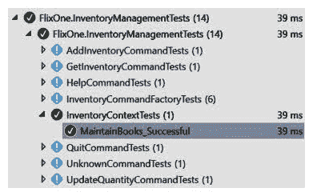
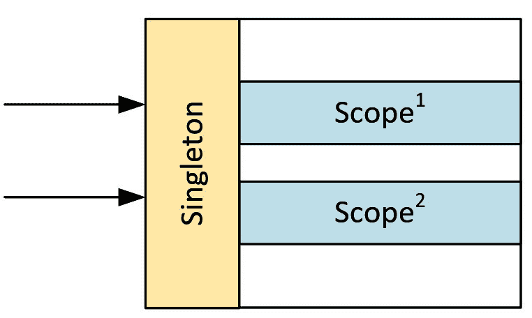
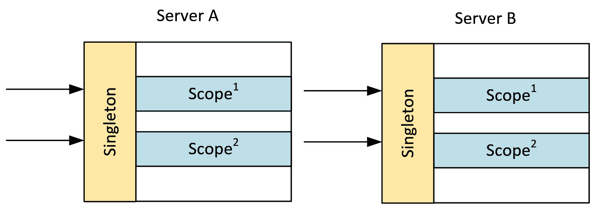

# 第五章：实现设计模式 - .NET Core

上一章通过引入额外的模式继续构建 FlixOne 库存管理应用程序。使用了更多的设计模式，包括 Singleton 和工厂模式。Singleton 模式被用来展示用于维护 FlixOne 书籍集合的 Repository 模式。工厂模式被用来进一步探索**依赖注入（DI**）。使用 .Net Core 框架完成初始的库存管理控制台应用程序，以便方便地使用**控制反转（IoC**）容器。

本章将继续构建库存管理控制台应用程序，同时探索 .Net Core 的功能。Singleton 模式，在上一章中已介绍，将重新审视并创建，使用 .Net Core 框架内置的 Singleton 服务生命周期。使用框架的依赖注入（DI），将展示配置模式，并解释**构造函数注入（CI**），使用不同的示例。

本章将涵盖以下主题：

+   .Net Core 服务生命周期

+   实现工厂

# 技术要求

本章包含各种代码示例，用于解释概念。代码保持简单，仅用于演示目的。大多数示例涉及使用 C# 编写的 .NET Core 控制台应用程序。

要运行和执行代码，你需要以下内容：

+   Visual Studio 2019（你也可以使用 Visual Studio 2017 版本 3 或更高版本来运行应用程序）。

+   设置 .NET Core。

+   SQL 服务器（本章中使用的是 SQL Server Express 版本）。

# 安装 Visual Studio

要运行这些代码示例，你需要安装 Visual Studio 2010 或更高版本。你可以使用你喜欢的 IDE。为此，请按照以下说明操作：

1.  从以下链接下载 Visual Studio：[`docs.microsoft.com/en-us/visualstudio/install/install-visual-studio`](https://docs.microsoft.com/en-us/visualstudio/install/install-visual-studio)。

1.  遵循包含的安装说明。Visual Studio 安装提供了多个版本。在本章中，我们使用 Windows 版本的 Visual Studio。

# 设置 .NET Core

如果你还没有安装 .NET Core，你需要按照以下说明操作：

1.  从以下链接下载 .NET Core：[`www.microsoft.com/net/download/windows`](https://www.microsoft.com/net/download/windows)。

1.  安装说明和相关库可以在以下链接找到：[`dotnet.microsoft.com/download/dotnet-core/2.2`](https://dotnet.microsoft.com/download/dotnet-core/2.2)。

完整的源代码可在 GitHub 仓库中找到。章节中显示的源代码可能不完整，因此建议检索源代码以运行示例。请参阅 [`github.com/PacktPublishing/Hands-On-Design-Patterns-with-C-and-.NET-Core/tree/master/Chapter5`](https://github.com/PacktPublishing/Hands-On-Design-Patterns-with-C-and-.NET-Core/tree/master/Chapter5)。

# .Net Core 服务生命周期

在使用 .Net Core 的 DI 时，理解一个基本概念是服务生命周期。服务生命周期定义了依赖项是如何根据其创建频率进行管理的。为了说明这个过程，可以将 DI 视为管理依赖项容器。依赖项只是一个 DI 知道的类，因为该类已与它 *注册*。对于 .Net Core 的 DI，这是通过 `IServiceCollection` 的以下三种方法完成的：

+   `AddTransient<TService, TImplementation>()`

+   `AddScoped<TService, TImplementation>()`

+   `AddSingleton<TService, TImplementation>()`

`IServiceCollection` 接口是一个已注册服务描述的集合，基本上包含依赖项，以及 DI 应何时提供依赖项。例如，当请求 `TService` 时，提供 `TImplementation`（即注入）。

在本节中，我们将探讨三种服务生命周期，并通过单元测试提供不同生命周期的示例。我们还将探讨如何使用实现工厂创建依赖项的实例。

# 临时

一个 `临时` 依赖意味着每次依赖项被 DI 接收到请求时，都会创建一个新的依赖项实例。在大多数情况下，这是最合理使用的服务生命周期，因为大多数类应该被设计成轻量级、无状态的服务。在需要在不同引用之间持久化状态或创建新实例需要相当大的努力的情况下，则可能需要另一种服务生命周期。

# 作用域

在 .Net Core 中，存在作用域的概念，可以将其视为执行过程的上下文或边界。在某些 .Net Core 实现中，作用域是隐式定义的，因此你可能不会意识到它在被设置。例如，在 ASP.Net Core 中，对于收到的每个网络请求都会创建一个作用域。这意味着，如果依赖项具有作用域生命周期，那么它将仅在每次网络请求中构建一次，因此，如果同一依赖项在同一个网络请求中被多次使用，它将被共享。

在本章的后面部分，我们将显式创建一个作用域，以说明作用域生命周期，并且这个概念在单元测试中与在 ASP.Net Core 应用程序中相同。

# 单例

在.NET Core 中，单例模式实现的方式是依赖项仅被实例化一次，就像前一章中实现的单例模式一样。类似于前一章中的单例模式，`singleton`类需要是线程安全的，并且只有用于创建单例类的工厂方法可以保证由单个线程调用一次。

# 返回 FlixOne

为了说明.NET Core 的 DI，我们需要对 FlixOne 库存管理应用程序进行一些修改。首先要做的事情将是更新之前定义的`InventoryContext`类，以便不再实现单例模式（因为我们将使用.NET Core 的 DI 来完成这项工作）：

```cs
public class InventoryContext : IInventoryContext
{
    public InventoryContext()
    {
       _books = new ConcurrentDictionary<string, Book>();
    }

    private readonly static object _lock = new object(); 

    private readonly IDictionary<string, Book> _books;

    public Book[] GetBooks()
    {
        return _books.Values.ToArray();
    }

    ...
}
```

`AddBook`和`UpdateQuantity`方法的详细信息如下所示：

```cs
public bool AddBook(string name)
{
    _books.Add(name, new Book {Name = name});
    return true;
}

public bool UpdateQuantity(string name, int quantity)
{
    lock (_lock)
    {
        _books[name].Quantity += quantity;
    }

    return true;
}
```

有几点需要注意。构造函数已被从受保护的改为公开的。这将允许类被类外部的对象实例化。此外，请注意，静态`Instance`属性和私有静态`_instance`字段已被移除，而私有`_lock`字段仍然保留。类似于前一章中定义的单例模式，这仅保证了类的实例化方式；它并不能防止方法并行访问。

由于我们的依赖注入（DI）定义在外部项目中，因此`IInventoryContext`接口以及`InventoryContext`和`Book`类都被设置为公开。

随后，用于返回命令的`InventoryCommandFactory`类已被更新，以便在其构造函数中注入`InventoryContext`的实例：

```cs
public class InventoryCommandFactory : IInventoryCommandFactory
{
    private readonly IUserInterface _userInterface;
    private readonly IInventoryContext _context;

    public InventoryCommandFactory(IUserInterface userInterface, IInventoryContext context)
    {
        _userInterface = userInterface;
        _context = context;
    }

    // GetCommand()
    ...
}
```

`GetCommand` 方法使用提供的输入来确定特定的命令：

```cs
public InventoryCommand GetCommand(string input)
{
    switch (input.ToLower())
    {
        case "q":
        case "quit":
            return new QuitCommand(_userInterface);
        case "a":
        case "addinventory":
            return new AddInventoryCommand(_userInterface, _context);
        case "g":
        case "getinventory":
            return new GetInventoryCommand(_userInterface, _context);
        case "u":
        case "updatequantity":
            return new UpdateQuantityCommand(_userInterface, _context);
        case "?":
            return new HelpCommand(_userInterface);
        default:
            return new UnknownCommand(_userInterface);
    }
}
```

如前所述，`IInventoryContext`接口将由客户端项目中定义的 DI 容器提供。控制台应用程序现在有一行额外的代码来创建`InventoryContext`类的单例：

```cs
class Program
{
    private static void Main(string[] args)
    {
        IServiceCollection services = new ServiceCollection();
        ConfigureServices(services);
        IServiceProvider serviceProvider = services.BuildServiceProvider();

        var service = serviceProvider.GetService<ICatalogService>();
        service.Run();

        Console.WriteLine("CatalogService has completed.");
        Console.ReadLine();
    }

    private static void ConfigureServices(IServiceCollection services)
    {
        // Add application services.
        services.AddTransient<IUserInterface, ConsoleUserInterface>(); 
        services.AddTransient<ICatalogService, CatalogService>();
        services.AddTransient<IInventoryCommandFactory, InventoryCommandFactory>();

 services.AddSingleton<IInventoryContext, InventoryContext>();
    }
}
```

控制台应用程序现在可以使用与上一章中执行的手动测试相同的测试运行，但单元测试是理解使用.NET Core 的 DI 所实现的内容的绝佳方式。

本章提供的示例代码展示了完成的项目。接下来的部分将专注于对`InventoryContext`的测试。`InventoryCommandFactory`的测试也被修改了，但由于更改是微不足道的，所以这里不会涉及。

# 单元测试

由于对`InventoryContext`类的更改，我们不再有方便的属性来获取类的唯一实例。这意味着需要替换`InventoryContext.Instance`，作为一个初步尝试，让我们创建一个返回`InventoryContext`新实例的方法，并使用`GetInventoryContext()`代替`InventoryContext.Instance`：

```cs
private IInventoryContext GetInventoryContext()
{
    return new InventoryContext();
}
```

如预期的那样，单元测试失败，并显示错误消息：“给定的键不在字典中”：


正如我们在上一章中看到的，这是因为每次创建`InventoryContext`类时，`InventoryContext`的书籍列表都是空的。这就是为什么我们需要使用单例创建上下文的原因。

让我们更新`GetInventoryContext()`方法，现在使用.NET Core 的 DI 来提供一个`IInventoryContext`接口的实例：

```cs
private IInventoryContext GetInventoryContext()
{
    IServiceCollection services = new ServiceCollection();
    services.AddSingleton<IInventoryContext, InventoryContext>();
    var provider = services.BuildServiceProvider();

    return provider.GetService<IInventoryContext>();
}
```

在更新的方法中，创建了一个`ServiceCollection`类的实例，该实例将用于包含所有已注册的依赖项。`InventoryContext`类被注册为单例（Singleton），以便在请求`IInventoryContext`依赖项时提供。然后生成一个`ServiceProvider`实例，该实例将根据`IServiceCollection`接口中的注册执行实际的依赖注入（DI）。最后一步是在请求`IInventoryContext`接口时提供`InventoryContext`类。

为了能够引用.NET Core 的 DI 组件，需要将`Microsoft.Extensions.DependencyInjection`库添加到`InventoryManagementTests`项目中。

不幸的是，单元测试仍然没有通过，并导致相同的错误：*给定的键不在字典中*。这是因为每次请求`IInventoryContext`时，我们都在创建一个新的 DI 框架实例。这意味着尽管我们的依赖项是单例，但每个`ServiceProvider`实例都将提供`InventoryContext`类的新实例。为了解决这个问题，我们将在测试首次启动时创建`IServiceCollection`，然后在测试期间使用相同的引用：

```cs
ServiceProvider Services { get; set; }

[TestInitialize]
public void Startup()
{
    IServiceCollection services = new ServiceCollection();
    services.AddSingleton<IInventoryContext, InventoryContext>();
    Services = services.BuildServiceProvider();
}
```

使用`TestInitialize`属性是分离`TestClass`类中多个`TestMethod`测试所需功能的好方法。该方法将在每个测试运行之前执行。

现在有了对相同`ServiceProvider`实例的引用，我们可以更新以检索依赖项。以下说明了`AddBook()`方法是如何更新的：

```cs
public Task AddBook(string book)
{
    return Task.Run(() =>
    {
        Assert.IsTrue(Services.GetService<IInventoryContext>().AddBook(book));
    });
}
```

我们的单元测试现在成功通过，因为在测试执行过程中只创建了一个`InventoryContext`类的实例：



使用内置的 DI 实现单例模式相对简单，如本节所示。理解何时使用该模式是一个重要的概念。下一节将更详细地探讨范围的概念，以便进一步了解服务生命周期。

# 范围

在具有多个同时执行进程的应用中，理解服务生命周期对于功能和非功能需求都非常重要。正如前一个单元测试所示，如果没有正确设置服务生命周期，`InventoryContext` 没有按预期工作，并导致了一个无效的状态。同样，服务生命周期的错误使用可能导致扩展性不佳的应用。一般来说，在多进程解决方案中应避免使用锁和共享状态。

为了说明这个概念，想象一下 FlixOne 库存管理应用被提供给多个员工。现在的挑战是如何在多个应用之间执行锁定，以及如何拥有一个单一收集的状态。用我们的术语来说，这将是多个应用共享的单个 `InventoryContext` 类。当然，这就是为什么将我们的解决方案改为使用共享存储库（例如，数据库）或改为 Web 应用程序是有意义的，并且/或者现在详细描述这些内容在 Web 应用程序中的意义。

下面的图示展示了一个 Web 应用接收两个请求：



在服务生命周期的方面，Singleton 服务生命周期将适用于所有请求，而每个请求都会收到它自己的作用域生命周期。需要注意的是，关于垃圾回收。使用 Transient 服务生命周期创建的依赖项被标记为在对象不再被引用时释放，而使用 Scope 服务生命周期创建的依赖项则不会被标记为释放，直到 Web 请求完成。此外，使用 Singleton 服务生命周期创建的依赖项则不会被标记为释放，直到应用程序结束。

此外，正如以下图示所示，重要的是要记住，.Net Core 中的依赖项在 Web 园或 Web 农场中的服务器实例之间不是共享的：



在接下来的章节中，将展示不同的共享状态方法，包括使用共享缓存、数据库和其他形式的存储库。

# 实现工厂

.Net Core DI 支持在注册依赖项时指定 *实现工厂* 的能力。这允许控制由服务提供者提供的依赖项的创建。这是通过使用 `IServiceCollection` 接口的以下扩展来完成的：

```cs
public static IServiceCollection AddSingleton<TService, TImplementation>(this IServiceCollection services,     Func<IServiceProvider, TImplementation> implementationFactory)
                where TService : class
                where TImplementation : class, TService;
```

`AddSingleton`扩展接收要注册的类以及当需要依赖项时提供的类。值得注意的是，.Net Core DI 框架将维护已注册的服务，并在请求时提供实现，或者作为实例化依赖项之一的部分。这种自动实例化被称为**构造函数注入**（**CI**）。我们将在接下来的章节中看到这两个示例。

# IInventoryContext

例如，让我们回顾一下用于管理书籍库存的`InventoryContext`类，通过分离对我们的书籍集合执行的读取和写入操作。`IInventoryContext`被拆分为`IInventoryReadContext`和`IInventoryWriteContext`：

```cs
using FlixOne.InventoryManagement.Models;

namespace FlixOne.InventoryManagement.Repository
{
    public interface IInventoryContext : IInventoryReadContext, IInventoryWriteContext { }

    public interface IInventoryReadContext
    {
        Book[] GetBooks();
    }

    public interface IInventoryWriteContext
    {
        bool AddBook(string name);
        bool UpdateQuantity(string name, int quantity);
    }
}
```

# IInventoryReadContext

`IInventoryReadContext`接口包含读取书籍的操作，而`IInventoryWriteContext`包含修改书籍集合的操作。原始的`IInventoryContext`接口是为了方便当某个类需要这两种依赖类型时创建的。

在后面的章节中，我们将介绍利用分割上下文的优势的模式，包括**命令和查询责任分离**（**CQRS**）模式。

通过这次重构，需要进行一些更改。首先，仅需要读取书籍集合的类，其构造函数被更新为`IInventoryReadContext`接口，如`GetInventoryCommand`类所示：

```cs
internal class GetInventoryCommand : NonTerminatingCommand
{
    private readonly IInventoryReadContext _context;
    internal GetInventoryCommand(IUserInterface userInterface, IInventoryReadContext context) : base(userInterface)
    {
        _context = context;
    }

    protected override bool InternalCommand()
    {
        foreach (var book in _context.GetBooks())
        {
            Interface.WriteMessage($"{book.Name,-30}\tQuantity:{book.Quantity}"); 
        }

        return true;
    }
}
```

# IInventoryWriteContext

同样，需要修改书籍集合的类也被更新为`IInventoryWriteContext`接口，如`AddInventoryCommand`所示：

```cs
internal class AddInventoryCommand : NonTerminatingCommand, IParameterisedCommand
{
    private readonly IInventoryWriteContext _context;

    internal AddInventoryCommand(IUserInterface userInterface, IInventoryWriteContext context) : base(userInterface)
    {
        _context = context;
    }

    public string InventoryName { get; private set; }

    ...
}
```

下面的示例显示了`GetParameters`和`InternalCommand`方法的详细信息：

```cs
/// <summary>
/// AddInventoryCommand requires name
/// </summary>
/// <returns></returns>
public bool GetParameters()
{
    if (string.IsNullOrWhiteSpace(InventoryName))
        InventoryName = GetParameter("name");
    return !string.IsNullOrWhiteSpace(InventoryName);
}

protected override bool InternalCommand()
{
    return _context.AddBook(InventoryName); 
}
```

注意到`InternalCommand`方法，其中通过`InventoryName`参数提供的书籍名称将书籍添加到库存中。

接下来，我们将查看库存命令的工厂。

# InventoryCommandFactory

`InventoryCommandFactory`类是使用.Net 类实现的工厂模式，它需要读取和写入书籍集合：

```cs
public class InventoryCommandFactory : IInventoryCommandFactory
{
    private readonly IUserInterface _userInterface;
    private readonly IInventoryContext _context; 

    public InventoryCommandFactory(IUserInterface userInterface, IInventoryContext context)
    {
        _userInterface = userInterface;
        _context = context; 
    }

    public InventoryCommand GetCommand(string input)
    {
        switch (input.ToLower())
        {
            case "q":
            case "quit":
                return new QuitCommand(_userInterface);
            case "a":
            case "addinventory":
                return new AddInventoryCommand(_userInterface, _context);
            case "g":
            case "getinventory":
                return new GetInventoryCommand(_userInterface, _context);
            case "u":
            case "updatequantity":
                return new UpdateQuantityCommand(_userInterface, _context);
            case "?":
                return new HelpCommand(_userInterface);
            default:
                return new UnknownCommand(_userInterface);
        }
    }
}
```

值得注意的是，该类实际上并不需要从上一章的版本中进行修改，因为多态处理了从`IInventoryContext`到`IInventoryReadContext`和`IInventoryWriteContext`接口的转换。

随着这些更改，我们需要更改与`InventoryContext`相关的依赖项的注册，以便使用实现工厂：

```cs
private static void ConfigureServices(IServiceCollection services)
{
    // Add application services.
    ...            

    var context = new InventoryContext();
 services.AddSingleton<IInventoryReadContext, InventoryContext>(p => context);
 services.AddSingleton<IInventoryWriteContext, InventoryContext>(p => context);
 services.AddSingleton<IInventoryContext, InventoryContext>(p => context);
}
```

对于这三个接口，将使用相同的`InventoryContext`实例，并且这个实例是通过实现工厂扩展一次性实例化的。当请求`IInventoryReadContext`、`IInventoryWriteContext`或`IInventoryContext`依赖项时，会提供这个实例。

# InventoryCommand

`InventoryCommandFactory` 有助于说明如何使用 .Net 实现工厂模式，但现在我们使用 .Net Core 框架，让我们重新审视这个问题。我们的需求是给定一个字符串值；我们希望返回 `InventoryCommand` 的特定实现。这可以通过几种方式实现，在本节中，将给出三个示例：

+   使用函数实现的实现工厂

+   使用服务

+   使用第三方容器

# 使用函数实现的实现工厂

`GetService()` 方法的实现工厂可以用来确定要返回的 `InventoryCommand` 类型的类型。对于这个例子，在 `InventoryCommand` 类中创建了一个新的静态方法：

```cs
public static Func<IServiceProvider, Func<string, InventoryCommand>> GetInventoryCommand => 
                                                                            provider => input =>
{
    switch (input.ToLower())
    {
        case "q":
        case "quit":
            return new QuitCommand(provider.GetService<IUserInterface>());
        case "a":
        case "addinventory":
            return new AddInventoryCommand(provider.GetService<IUserInterface>(), provider.GetService<IInventoryWriteContext>());
        case "g":
        case "getinventory":
            return new GetInventoryCommand(provider.GetService<IUserInterface>(), provider.GetService<IInventoryReadContext>());
        case "u":
        case "updatequantity":
            return new UpdateQuantityCommand(provider.GetService<IUserInterface>(), provider.GetService<IInventoryWriteContext>());
        case "?":
            return new HelpCommand(provider.GetService<IUserInterface>());
        default:
            return new UnknownCommand(provider.GetService<IUserInterface>());
    }
};
```

如果你不熟悉 lambda 表达式体，这可能会有些难以阅读，所以我们将详细解释一下代码。首先，让我们回顾一下 `AddSingleton` 的语法：

```cs
public static IServiceCollection AddSingleton<TService, TImplementation>(this IServiceCollection services, Func<IServiceProvider, TImplementation> implementationFactory)
            where TService : class
            where TImplementation : class, TService;
```

这表明 `AddSingleton` 扩展方法的参数是一个函数：

```cs
Func<IServiceProvider, TImplementation> implementationFactory
```

这意味着以下代码是等价的：

```cs
services.AddSingleton<IInventoryContext, InventoryContext>(provider => new InventoryContext());

services.AddSingleton<IInventoryContext, InventoryContext>(GetInventoryContext);
```

`GetInventoryContext` 方法定义如下：

```cs
static Func<IServiceProvider, InventoryContext> GetInventoryContext => provider =>
{
    return new InventoryContext();
};
```

在我们的特定例子中，特定的 `InventoryCommand` 类型已被标记为 `FlixOne.InventoryManagement` 项目的内部类型，因此 `FlixOne.InventoryManagementClient` 项目无法直接访问它们。这就是为什么在 `FlixOne.InventoryManagement.InventoryCommand` 类中创建了一个新的静态方法，该方法返回以下类型：

```cs
Func<IServiceProvider, Func<string, InventoryCommand>>
```

这意味着，当请求服务时，将提供一个字符串以确定特定类型。由于依赖项已更改，这意味着 `CatalogService` 构造函数需要更新：

```cs
public CatalogService(IUserInterface userInterface, Func<string, InventoryCommand> commandFactory)
{
    _userInterface = userInterface;
    _commandFactory = commandFactory;
}
```

当请求服务时，将提供一个字符串以确定特定类型。由于依赖项已更改，`CatalogueService` 构造函数需要更新：

现在当用户输入的字符串被提供给 `CommandFactory` 依赖项时，将提供正确的命令：

```cs
while (!response.shouldQuit)
{
    // look at this mistake with the ToLower()
    var input = _userInterface.ReadValue("> ").ToLower();
    var command = _commandFactory(input);

    response = command.RunCommand();

    if (!response.wasSuccessful)
    {
        _userInterface.WriteMessage("Enter ? to view options.");
    }
}
```

与命令工厂相关的单元测试也进行了更新。作为比较，从现有的 `InventoryCommandFactoryTests` 类创建了一个新的 `test` 类，并命名为 `InventoryCommandFunctionTests`。初始化步骤如下所示，其中变化被突出显示：

```cs
ServiceProvider Services { get; set; }

[TestInitialize]
public void Startup()
{
    var expectedInterface = new Helpers.TestUserInterface(
        new List<Tuple<string, string>>(),
        new List<string>(),
        new List<string>()
    );

    IServiceCollection services = new ServiceCollection();
    services.AddSingleton<IInventoryContext, InventoryContext>();
 services.AddTransient<Func<string, InventoryCommand>>(InventoryCommand.GetInventoryCommand);

    Services = services.BuildServiceProvider();
}
```

单个测试也被更新，以在获取服务调用中提供字符串，如下面的代码所示，使用 `QuitCommand`：

```cs
[TestMethod]
public void QuitCommand_Successful()
{
    Assert.IsInstanceOfType(Services.GetService<Func<string, InventoryCommand>>().Invoke("q"),             
                            typeof(QuitCommand), 
                            "q should be QuitCommand");

    Assert.IsInstanceOfType(Services.GetService<Func<string, InventoryCommand>>().Invoke("quit"),
                            typeof(QuitCommand), 
                            "quit should be QuitCommand");
}
```

这两个测试验证了当服务提供者被赋予 `"q"` 或 `"quit"` 时，返回的服务是 `QuitCommand` 类型。

# 使用服务

当为同一类型注册了多个依赖项时，`ServiceProvider` 类提供了一个 `Services` 方法，可以用来确定适当的服务。本例将采用不同的方法处理 `InventoryCommands`，由于重构的范围较大，这将通过创建新的类来实现，以展示这种方法。

在单元测试项目中，创建了一个新的文件夹 `ImplementationFactoryTests`，用于包含本节中的类。在文件夹中，为 `InventoryCommand` 创建了一个新的基类：

```cs
public abstract class InventoryCommand
{
    protected abstract string[] CommandStrings { get; }
    public virtual bool IsCommandFor(string input)
    {
        return CommandStrings.Contains(input.ToLower());
    } 
}
```

这个新类背后的概念是子类将定义它们响应的字符串。例如，`QuitCommand` 将响应 `"q"` 和 `"quit"` 字符串：

```cs
public class QuitCommand : InventoryCommand
{
    protected override string[] CommandStrings => new[] { "q", "quit" };
}
```

以下展示了 `GetInventoryCommand`、`AddInventoryCommand`、`UpdateQuantityCommand` 和 `HelpCommand` 类，它们遵循类似的方法：

```cs
public class GetInventoryCommand : InventoryCommand
{
    protected override string[] CommandStrings => new[] { "g", "getinventory" };
}

public class AddInventoryCommand : InventoryCommand
{
    protected override string[] CommandStrings => new[] { "a", "addinventory" };
}

public class UpdateQuantityCommand : InventoryCommand
{
    protected override string[] CommandStrings => new[] { "u", "updatequantity" };
}

public class HelpCommand : InventoryCommand
{
    protected override string[] CommandStrings => new[] { "?" };
}
```

虽然 `UnknownCommand` 类将被用作默认，但它将通过覆盖 `IsCommandFor` 方法始终评估为真：

```cs
public class UnknownCommand : InventoryCommand
{
    protected override string[] CommandStrings => new string[0];

    public override bool IsCommandFor(string input)
    {
        return true;
    }
}
```

由于 `UnknownCommand` 类被当作默认处理，注册顺序很重要，如下所示在单元测试类的初始化中：

```cs
[TestInitialize]
public void Startup()
{
    var expectedInterface = new Helpers.TestUserInterface(
        new List<Tuple<string, string>>(),
        new List<string>(),
        new List<string>()
    );

    IServiceCollection services = new ServiceCollection(); 
    services.AddTransient<InventoryCommand, QuitCommand>();
    services.AddTransient<InventoryCommand, HelpCommand>(); 
    services.AddTransient<InventoryCommand, AddInventoryCommand>();
    services.AddTransient<InventoryCommand, GetInventoryCommand>();
    services.AddTransient<InventoryCommand, UpdateQuantityCommand>();
    // UnknownCommand should be the last registered
 services.AddTransient<InventoryCommand, UnknownCommand>();

    Services = services.BuildServiceProvider();
}
```

为了方便，已创建了一个新方法，以便在给定匹配的输入字符串时返回 `InventoryCommand` 类的实例：

```cs
public InventoryCommand GetCommand(string input)
{
    return Services.GetServices<InventoryCommand>().First(svc => svc.IsCommandFor(input));
}
```

此方法将遍历为 `InventoryCommand` 服务注册的依赖项集合，直到使用 `IsCommandFor()` 方法找到匹配项。

单元测试随后使用 `GetCommand()` 方法来确定依赖关系，以下为 `UpdateQuantityCommand` 的示例：

```cs
[TestMethod]
public void UpdateQuantityCommand_Successful()
{
    Assert.IsInstanceOfType(GetCommand("u"), 
                            typeof(UpdateQuantityCommand), 
                            "u should be UpdateQuantityCommand");

    Assert.IsInstanceOfType(GetCommand("updatequantity"), 
                            typeof(UpdateQuantityCommand), 
                            "updatequantity should be UpdateQuantityCommand");

    Assert.IsInstanceOfType(GetCommand("UpdaTEQuantity"), 
                            typeof(UpdateQuantityCommand), 
                            "UpdaTEQuantity should be UpdateQuantityCommand");
}
```

# 使用第三方容器

.Net Core 框架提供了极大的灵活性和功能性，但某些功能可能不受支持，第三方容器可能是一个更合适的选择。幸运的是，.Net Core 是可扩展的，允许用第三方容器替换内置的服务容器。为了提供一个示例，我们将使用 `Autofac` 作为 .Net Core DI 的 IoC 容器：

`Autofac` 有许多出色的功能，这里作为一个示例；但当然，还有其他 IoC 容器可以使用。例如，Castle Windsor 和 Unit 是很好的替代品，也应予以考虑。

第一步是将所需的 `Autofac` 包添加到项目中。使用包管理器控制台，使用以下命令添加包（仅在测试项目中需要）：

```cs
install-package autofac
```

此示例将再次通过使用 `Autofac` 的命名注册依赖项功能来支持我们的 `InventoryCommand` 工厂。这些命名依赖项将被用于根据提供的输入检索正确的 `InventoryCommand` 实例：

与前面的示例类似，依赖项的注册将在 `TestInitialize` 方法中完成。注册将基于将用于确定命令的命令进行命名。以下展示了创建 `ContainerBuilder` 对象的 `Startup` 方法结构，该对象将构建 `Container` 实例：

```cs
[TestInitialize]
public void Startup()
{
    IServiceCollection services = new ServiceCollection();

    var builder = new ContainerBuilder(); 

    // commands
    ...

    Container = builder.Build(); 
}
```

命令的注册方式如下：

```cs
// commands
builder.RegisterType<QuitCommand>().Named<InventoryCommand>("q");
builder.RegisterType<QuitCommand>().Named<InventoryCommand>("quit");
builder.RegisterType<UpdateQuantityCommand>().Named<InventoryCommand>("u");
builder.RegisterType<UpdateQuantityCommand>().Named<InventoryCommand>("updatequantity");
builder.RegisterType<HelpCommand>().Named<InventoryCommand>("?");
builder.RegisterType<AddInventoryCommand>().Named<InventoryCommand>("a");
builder.RegisterType<AddInventoryCommand>().Named<InventoryCommand>("addinventory");
builder.RegisterType<GetInventoryCommand>().Named<InventoryCommand>("g");
builder.RegisterType<GetInventoryCommand>().Named<InventoryCommand>("getinventory");
builder.RegisterType<UpdateQuantityCommand>().Named<InventoryCommand>("u");
builder.RegisterType<UpdateQuantityCommand>().Named<InventoryCommand>("u");
builder.RegisterType<UnknownCommand>().As<InventoryCommand>();
```

与前面的示例不同，生成的容器是`Autofac.IContainer`的一个实例。这将用于检索每个已注册的依赖项。例如，`QuitCommand`将被命名为`"q"`和`"quit"`，这表示可以使用这两个命令来执行命令。此外，请注意最后一个注册的类型没有命名，属于`UnknownCommand`。如果没有找到按名称的命令，它将作为默认值。

为了确定一个依赖项，将使用一个新的方法通过名称检索依赖项：

```cs
public InventoryCommand GetCommand(string input)
{
    return Container.ResolveOptionalNamed<InventoryCommand>(input.ToLower()) ?? 
           Container.Resolve<InventoryCommand>();
}
```

`Autofac.IContainer`接口有一个名为`ResolveOptionalNamed<*T*>(*string*)`的方法，它将返回具有给定名称的依赖项，如果没有找到匹配的注册项，则返回 null。如果依赖项没有使用给定的名称注册，则返回`UnknownCommand`类的实例。这是通过使用空合并操作`??`和`IContainer.Resolve<*T*>`方法实现的。

`Autofac.IContainer.ResolveNamed<*T*>(*string*)`如果依赖解析失败，将抛出`ComponentNotRegisteredException`异常。

为每个命令编写一个测试方法，以确保命令被正确解析。再次以`QuitCommand`为例，我们可以看到以下内容：

```cs
[TestMethod]
public void QuitCommand_Successful()
{
    Assert.IsInstanceOfType(GetCommand("q"), typeof(QuitCommand), "q should be QuitCommand");
    Assert.IsInstanceOfType(GetCommand("quit"), typeof(QuitCommand), "quit should be QuitCommand");
}
```

请在源代码中查看`InventoryCommandAutofacTests`类以了解其他`InventoryCommand`示例。

# 摘要

本章的目标是更详细地探讨.Net Core 框架，特别是.Net Core DI。支持三种服务生命周期：Transient、Scoped 和 Singleton。Transient 服务将为每个请求创建一个已注册依赖项的新实例。Scoped 服务将根据定义的作用域生成一次，而 Singleton 服务将为 DI 服务集合的整个生命周期执行一次。

由于.Net Core DI 对于自信地构建.Net Core 应用程序至关重要，因此了解其功能和限制非常重要。有效地使用 DI 以及避免重复已提供的功能同样重要。同样关键的是，了解.Net Core DI 框架的局限性以及其他 DI 框架的优势也很明智，因为在某些情况下，用第三方 DI 框架替换基本的.Net Core DI 框架可能对应用程序有益。

下一章将在前几章的基础上构建，并探讨.Net Core ASP.Net web 应用程序中的常见模式。

# 问题

以下问题将帮助您巩固本章包含的信息：

1.  如果您不确定要使用哪种服务生命周期，哪种类型最适合注册一个类？为什么？

1.  在.Net Core ASP.Net 解决方案中，Scope 是按每个 web 请求定义，还是按每个会话定义？

1.  在.Net Core DI 框架中将一个类注册为 Singleton 是否使其线程安全？

1.  .Net Core DI 框架只能用其他 Microsoft 提供的 DI 框架替换，这是真的吗？
