# 第七章：实现网络应用程序的设计模式 - 第二部分

在上一章中，我们在说明不同模式的同时，将 FlixOne 库存管理控制台应用程序扩展为网络应用程序。我们还涵盖了**用户界面**（**UI**）架构模式，如**模型-视图-控制器**（**MVC**）、**模型视图演示者**（**MVP**）等。上一章旨在讨论如 MVC 这样的模式。我们现在需要扩展现有应用程序以包含更多模式。

在本章中，我们将继续使用现有的 FlixOne 网络应用程序，并通过编写代码来扩展应用程序，以查看身份验证和授权的实现。此外，我们还将讨论**测试驱动开发**（**TDD**）。

在本章中，我们将涵盖以下主题：

+   身份验证和授权

+   创建 .NET Core 网络测试项目

# 技术要求

本章包含各种代码示例，用于解释概念。代码保持简单，仅用于演示目的。大多数示例涉及一个用 C# 编写的 .NET Core 控制台应用程序。

要运行和执行代码，Visual Studio 2019 是必备条件（您也可以使用 Visual Studio 2017 来运行应用程序）。

# 安装 Visual Studio

要运行这些代码示例，您需要安装 Visual Studio（首选的**集成开发环境**（**IDE**））。为此，请按照以下说明操作：

1.  从以下下载链接下载 Visual Studio，其中包含安装说明：[`docs.microsoft.com/en-us/visualstudio/install/install-visual-studio`](https://docs.microsoft.com/en-us/visualstudio/install/install-visual-studio).

1.  按照您在那里找到的安装说明操作。Visual Studio 安装有多种版本可供选择。在这里，我们使用的是 Windows 版本的 Visual Studio。

# 设置 .NET Core

如果您尚未安装 .NET Core，您需要按照以下说明操作：

1.  使用 [`www.microsoft.com/net/download/windows`](https://www.microsoft.com/net/download/windows) 下载 Windows 版本的 .NET Core。

1.  要获取多个版本和相关库，请访问 [`dotnet.microsoft.com/download/dotnet-core/2.2`](https://dotnet.microsoft.com/download/dotnet-core/2.2).

# 安装 SQL Server

如果您尚未安装 SQL Server，您需要按照以下说明操作：

1.  从以下链接下载 SQL Server：[`www.microsoft.com/en-in/download/details.aspx?id=1695`](https://www.microsoft.com/en-in/download/details.aspx?id=1695).

1.  您可以在此处找到安装说明：[`docs.microsoft.com/en-us/sql/ssms/download-sql-server-management-studio-ssms?view=sql-server-2017`](https://docs.microsoft.com/en-us/sql/ssms/download-sql-server-management-studio-ssms?view=sql-server-2017).

对于故障排除和更多信息，请参阅以下链接：[`www.blackbaud.com/files/support/infinityinstaller/content/installermaster/tkinstallsqlserver2008r2.htm`](https://www.blackbaud.com/files/support/infinityinstaller/content/installermaster/tkinstallsqlserver2008r2.htm)。

完整的源代码可以从以下链接获取：[`github.com/PacktPublishing/Hands-On-Design-Patterns-with-C-and-.NET-Core/tree/master/Chapter7`](https://github.com/PacktPublishing/Hands-On-Design-Patterns-with-C-and-.NET-Core/tree/master/Chapter7)。

# 扩展 .NET Core 网络应用程序

在本章中，我们将继续我们的 FlixOne 库存应用程序。在本章中，我们将讨论网络应用程序模式，并扩展我们在上一章中开发的应用程序。

本章继续上一章开发的网络应用程序。如果您跳过了上一章，请重新阅读以与本章同步。

在本节中，我们将讨论需求收集的过程，然后讨论我们之前开发的网络应用程序所面临的各种挑战。

# 项目启动

在第六章，“实现网络应用程序的设计模式 – 第一部分”，我们扩展了我们的 FlixOne 库存控制台应用程序并开发了一个网络应用程序。在考虑以下要点后，我们扩展了应用程序：

+   我们的业务需要一个丰富的用户界面。

+   新的机会需要响应式网络应用程序。

# 需求

在与管理层、**业务分析师**（**BAs**）和预销售人员的多次会议和讨论后，管理层决定着手以下高级需求：**商业需求**和**技术需求**。

# 商业需求

业务团队最终提出了以下商业需求：

+   **产品分类**：有几种产品，但如果用户想要搜索特定产品，他们可以通过按类别过滤所有产品来实现。例如，芒果、香蕉等应归入名为“水果”的类别。

+   **产品添加**：应该有一个界面，提供添加新产品的功能。此功能仅对具有“添加产品”权限的用户可用。

+   **产品更新**：应该有一个新的界面，以便进行产品更新。

+   **产品删除**：需要管理员删除产品。

# 技术需求

满足商业需求的实际需求现在已准备好开发。在多次与业务人员进行讨论后，我们得出以下结论：以下是需要满足的需求：

+   **您应该有一个着陆页或主页**：

    +   应该是一个包含各种小部件的仪表板

    +   应显示商店的直观图片

+   **您应该有一个产品页面**：

    +   应该具有添加、更新和删除产品的功能

    +   应该具有添加、更新和删除产品类别的功能

FlixOne 库存管理 Web 应用程序是一个虚构的产品。我们创建这个应用程序是为了讨论在 Web 项目中需要/使用的各种设计模式。

# 挑战

尽管我们已经将现有的控制台应用程序扩展到新的 Web 应用程序，但它对开发者和企业都带来了各种挑战。在本节中，我们将讨论这些挑战，然后我们将找出克服这些挑战的解决方案。

# 开发者面临的挑战

以下是由于应用程序发生重大变化而出现的一些挑战。这些也是将控制台应用程序升级到 Web 应用程序的主要扩展的结果：

+   **不支持 TDD**：目前，解决方案中未包含测试项目。因此，开发者无法遵循 TDD 方法，这可能导致应用程序中出现更多错误。

+   **安全性**：在当前的应用程序中，没有机制来限制或允许用户访问应用程序的特定屏幕或模块。也没有与认证和授权相关的内容。

+   **UI 和用户体验（UX）**：我们的应用程序从基于控制台的应用程序升级，因此 UI 并不丰富。

# 商业挑战

实现最终输出需要时间，这延迟了产品，导致业务损失。当我们采用新的技术堆栈时，会出现以下挑战，并且代码中有很多变化：

+   **客户流失**：在这里，我们仍然处于开发阶段，但对我们业务的需求非常高；然而，开发团队交付产品的速度比预期要慢。

+   **推出生产更新需要更多时间**：目前开发工作耗时较长，这延迟了后续活动，导致生产延迟。

# 寻找解决这些问题/挑战的方案

经过几次会议和头脑风暴会议后，开发团队得出结论，我们必须稳定我们的基于 Web 的解决方案。为了克服这些挑战并提供解决方案，技术团队和业务团队聚集在一起，确定各种解决方案和要点。

以下点是解决方案支持的：

+   实施认证和授权

+   遵循 TDD

+   重新设计 UI 以满足 UX

# 认证和授权

在上一章——我们开始将控制台应用程序升级到 Web 应用程序时——我们添加了**创建、读取、更新和删除**（**CRUD**）操作，这些操作对任何能够执行它们的用户都是公开的。没有任何代码来限制特定用户执行这些操作。这种风险是，那些不应该执行这些操作的用户可以轻易地这样做。其后果如下：

+   未受关注的访问

+   为黑客/攻击者敞开的大门

+   数据泄露问题

现在，如果我们热衷于保护我们的应用程序并仅限制允许的用户执行操作，那么我们必须实施一个设计，只允许这些用户执行操作。可能存在我们可以允许对一些操作开放访问的场景。在我们的案例中，大多数操作仅限于受限访问。简单来说，我们可以尝试告诉我们的应用程序，传入的用户属于我们的应用程序并且可以执行指定的任务。

**认证**是一个简单的过程，其中系统通过凭证（通常是一个用户 ID 和密码）验证或识别传入的请求。如果系统发现提供的凭证错误，那么它会通知用户（通常是通过 GUI 屏幕上的消息），并终止授权过程。

**授权**总是在认证之后。这是一个允许已认证的用户在验证他们有权访问特定资源或数据后访问资源或数据的过程。

在上一段中，我们讨论了一些阻止对应用程序操作无人值守访问的机制。让我们参考以下图表并讨论它展示了什么：

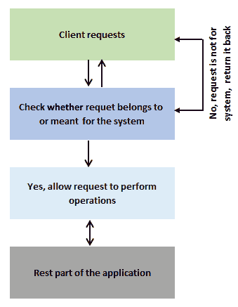

上述图示描述了一个系统不允许无人值守访问的场景。这可以简单地定义为以下内容：接收到一个传入请求，内部系统（一个认证机制）检查该请求是否已认证。如果请求已认证，则允许用户执行他们被授权的操作。这不仅仅是一次检查，对于典型的系统，授权是在认证之后进行的。我们将在接下来的章节中讨论这一点。

为了更好地理解这一点，让我们编写一个简单的登录应用程序。让我们遵循这里给出的步骤：

1.  打开 Visual Studio 2018。

1.  文件 | 打开 | 新建 | 新项目。

1.  在“项目”窗口中，给你的项目命名。

1.  选择 ASP.NET Core 2.2 的 Web 应用程序（模型-视图-控制器）模板：

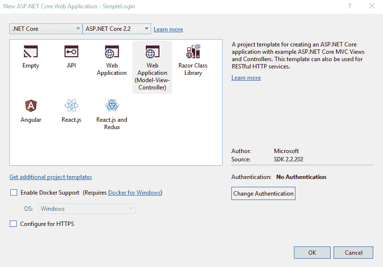

1.  您可以选择作为所选模板一部分的多种认证方式。

1.  默认情况下，模板提供了一个名为“无认证”的选项，如下所示：

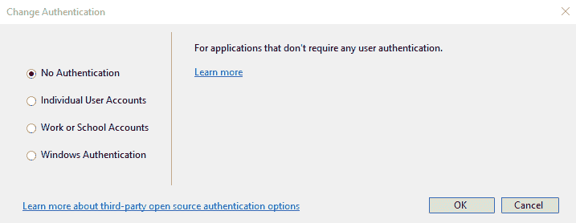

1.  按*F5*运行应用程序。从这里，您将看到默认的主页：

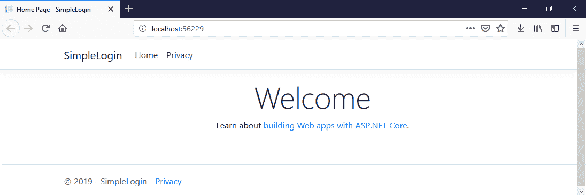

现在，你会发现你可以无限制地浏览每一页。这是显而易见且合理的，因为这些页面是公开访问的。主页和隐私页面是公开访问的，不需要任何认证，这意味着任何人都可以访问/查看这些页面。另一方面，我们可能有一些页面是为了无人值守访问而设计的，例如用户资料和管理员页面。

请参考 GitHub 仓库中的该章节[`github.com/PacktPublishing/Hands-On-Design-Patterns-with-C-and-.NET-Core/tree/master/Chapter6`](https://github.com/PacktPublishing/Hands-On-Design-Patterns-with-C-and-.NET-Core/tree/master/Chapter6)，并浏览我们使用 ASP.NET Core MVC 构建的整个应用程序。

要继续我们的 SimpleLogin 应用程序，让我们添加一个用于受限访问的屏幕：产品屏幕。在本章中，我们不会讨论如何向现有项目添加新的控制器或视图。如果你想知道我们如何将这些添加到我们的项目中，请回顾第六章，*实现 Web 应用程序的设计模式 – 第一部分*。

我们已经向我们的项目添加了新的功能来展示具有 CRUD 操作的产品。现在，按*F5*并检查输出：

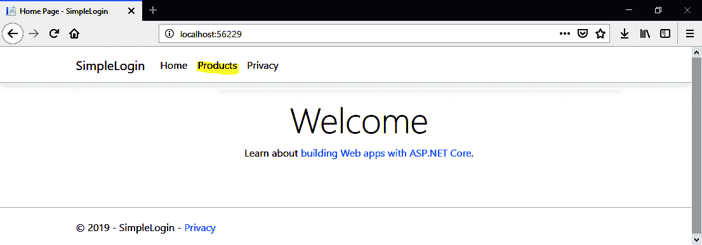

你将看到之前截图中的输出。你可能注意到我们现在有一个名为“产品”的新菜单。

让我们浏览一下新菜单选项。点击“产品”菜单：

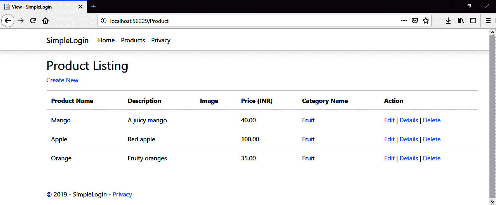

之前的截图显示了我们的产品页面。这个页面对所有用户开放，任何人都可以无限制地查看。你可以查看并观察这个页面具有创建新产品、编辑和删除现有产品的功能。现在，想象一下这样一个场景：一个未知用户进来并删除了一个非常重要且吸引大量销售的产品。你可以想象这个场景以及这对业务有多大的阻碍。甚至可能失去客户。

在我们的场景中，我们可以以两种方式保护我们的产品页面：

+   **预先认证**：在本页面上，并非所有人都可以访问“产品”链接；它仅对经过认证的请求/用户可用。

+   **后认证**：在本页面上，所有人都可访问“产品”链接。然而，一旦有人请求访问页面，系统将执行认证检查。

# 认证行动

在本节中，我们将了解如何实现认证并使我们的网页对未经认证的请求受限。

要实现认证，我们应该采用某种机制，为我们提供一种认证用户的方法。在一般情况下，如果用户已登录，这意味着他们已经经过认证。

在我们的 Web 应用程序中，我们也将遵循相同的方法，确保在访问受限制的页面、视图和操作之前用户已登录：

```cs
public class User
{
    public Guid Id { get; set; }
    public string UserName { get; set; }
    public string EmailId { get; set; }
    public string FirstName { get; set; }
    public string LastName { get; set; }
    public byte[] PasswordHash { get; set; }
    public byte[] PasswordSalt { get; set; }
    public string SecretKey { get; set; }
    public string Mobile { get; set; }
    public string EmailToken { get; set; }
    public DateTime EmailTokenDateTime { get; set; }
    public string OTP { get; set; }
    public DateTime OtpDateTime { get; set; }
    public bool IsMobileVerified { get; set; }
    public bool IsEmailVerified { get; set; }
    public bool IsActive { get; set; }
    public string Image { get; set; }
}
```

之前的类是一个典型的`User`模型/实体，它代表我们的数据库`User`表。此表将持久化有关`User`的所有信息。以下是每个字段的外观：

+   `Id`是**全局唯一标识符**（**GUID**）和表中的主键。

+   `UserName`通常在登录和其他相关操作期间使用。这是一个程序生成的字段。

+   `FirstName`和`LastName`组合了用户的完整姓名。

+   `Emailid`是用户的有效电子邮件 ID。它应该是一个有效的电子邮件，因为我们将在注册过程之后/期间进行验证。

+   `PasswordHash`和`PasswordSalt`是基于**基于哈希的消息认证码，安全哈希算法**（**HMAC**-**SHA**）512 的字节数组。`PasswordHash`属性的值是 64 字节，而`PasswordSalt`是 128 字节。

+   `SecretKey`是 Base64 编码的字符串。

+   `Mobilie`是有效的手机号码，它依赖于系统的有效性检查。

+   `EmailToken`和`OTP`是随机生成的**一次性密码**（**OTPs**），用于验证`emailId`和手机号码。

+   `EmailTokenDateTime`和`OtpDateTime`是`datetime`数据类型的属性；它们代表为用户签发`EmailToken`和`OTP`的日期和时间。

+   `IsMobileVerified`和`IsEmailverified`是布尔值（`true`/`false`），用于告诉系统手机号码和/或电子邮件 ID 是否已验证。

+   `IsActive`是一个布尔值（`true`/`false`），用于告诉系统`User`模型是否处于活动状态。

+   `Image`是图像的 Base64 编码字符串。它代表用户的个人资料图片。

我们需要将我们的新类/实体添加到我们的`Context`类中。让我们添加以下截图中所看到的内容：

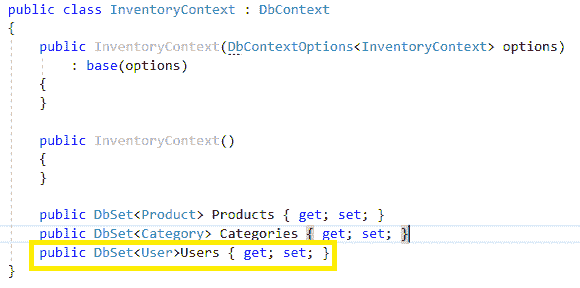

通过在我们的`Context`类中添加上一行，我们可以直接使用**实体框架**（**EF**）功能访问我们的`User`表：

```cs
public class LoginViewModel
{
    [Required]
    public string Username { get; set; }
    [Required]
    [DataType(DataType.Password)]
    public string Password { get; set; }
    [Display(Name = "Remember Me")]
    public bool RememberMe { get; set; }
    public string ReturnUrl { get; set; }
}
```

`LoginViewModel`用于验证用户。此`viewmodel`的值来自登录页面（我们将在下一节中讨论和创建此页面）。它包含以下内容：

+   `UserName`：这是一个用于识别用户的唯一名称。这是一个易于识别的、可读的值。它不像 GUID 值。

+   `Password`：这是任何用户的秘密和敏感值。

+   `RememberMe`：这告诉我们用户是否希望允许当前系统持久化 cookie，这些 cookie 在客户端浏览器中存储值。

要执行 CRUD 操作，让我们向`UserManager`类添加以下代码：

```cs
public class UserManager : IUserManager
{
    private readonly InventoryContext _context;

    public UserManager(InventoryContext context) => _context = context;

    public bool Add(User user, string userPassword)
    {
        var newUser = CreateUser(user, userPassword);
        _context.Users.Add(newUser);
        return _context.SaveChanges() > 0;
    }

    public bool Login(LoginViewModel authRequest) => FindBy(authRequest) != null;

    public User GetBy(string userId) => _context.Users.Find(userId);
```

下面的代码片段来自`UserManager`类的其他方法：

```cs
   public User FindBy(LoginViewModel authRequest)
    {
        var user = Get(authRequest.Username).FirstOrDefault();
        if (user == null) throw new ArgumentException("You are not registered with us.");
        if (VerifyPasswordHash(authRequest.Password, user.PasswordHash, user.PasswordSalt)) return user;
        throw new ArgumentException("Incorrect username or password.");
    }
    public IEnumerable<User> Get(string searchTerm, bool isActive = true)
    {
        return _context.Users.Where(x =>
            x.UserName == searchTerm.ToLower() || x.Mobile == searchTerm ||
            x.EmailId == searchTerm.ToLower() && x.IsActive == isActive);
    }

    ...
}
```

上一段代码是`UserManager`类，它使我们能够使用 EF 与我们的`User`表交互：

以下代码显示了登录屏幕的视图：

```cs
<form asp-action="Login" asp-route-returnurl="@Model.ReturnUrl">
    <div asp-validation-summary="ModelOnly" class="text-danger"></div>

    <div class="form-group">
        <label asp-for="Username" class="control-label"></label>
        <input asp-for="Username" class="form-control" />
        <span asp-validation-for="Username" class="text-danger"></span>
    </div>

    <div class="form-group">
        <label asp-for="Password" class="control-label"></label>
        <input asp-for="Password" class="form-control"/>
        <span asp-validation-for="Password" class="text-danger"></span>
    </div>

    <div class="form-group">
        <label asp-for="RememberMe" ></label>
        <input asp-for="RememberMe" />
        <span asp-validation-for="RememberMe"></span>
    </div>
    <div class="form-group">
        <input type="submit" value="Login" class="btn btn-primary" />
    </div>
</form>
```

之前的代码片段来自我们的`Login.cshtml`页面/视图。此页面提供了一个表单来输入登录详细信息。这些详细信息传送到我们的`Account`控制器，然后进行验证以认证用户：

以下是`Login`操作方法：

```cs
[HttpGet]
public IActionResult Login(string returnUrl = "")
{
    var model = new LoginViewModel { ReturnUrl = returnUrl };
    return View(model);
}
```

上述代码片段是一个`Get /Account/Login`请求，它显示了一个空白的登录页面，如下面的截图所示：

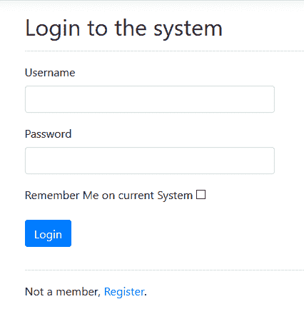

之前的截图在用户点击登录菜单选项时立即出现。这是一个简单的表单，用于输入登录详细信息。

以下代码显示了处理应用程序`Login`功能的`Login`操作方法：

```cs
[HttpPost]
public IActionResult Login(LoginViewModel model)
{
    if (ModelState.IsValid)
    {
        var result = _authManager.Login(model);

        if (result)
        {
           return !string.IsNullOrEmpty(model.ReturnUrl) && Url.IsLocalUrl(model.ReturnUrl)
                ? (IActionResult)Redirect(model.ReturnUrl)
                : RedirectToAction("Index", "Home");
        }
    }
    ModelState.AddModelError("", "Invalid login attempt");
    return View(model);
}
```

上述代码片段是一个来自登录页面的`Post /Account/Login`请求，它发布了整个`LoginViewModel`类：

以下是我们登录视图的截图：

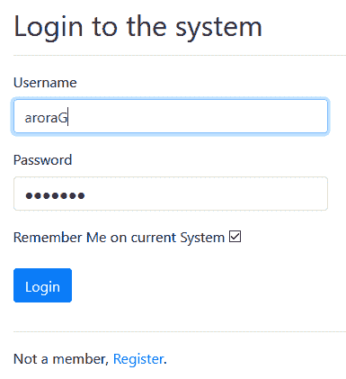

在之前的截图中，我们正在尝试使用我们的默认用户凭据（用户名：`aroraG`和密码：`test123`）进行登录。与此次登录相关的信息将被保存在 cookie 中，但仅当用户勾选了“记住我”复选框时。系统将记住当前计算机上的登录会话，直到用户点击注销按钮。

一旦用户点击登录按钮，系统就会验证他们的登录详细信息，并将他们重定向到主页，如下面的截图所示：

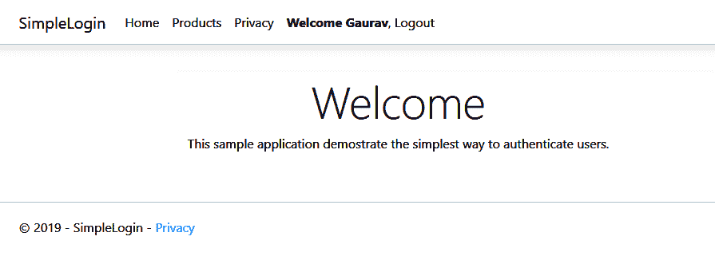

你可能会在菜单中观察到文本，如`Welcome Gaurav`。这个欢迎文本不是自动出现的，但我们通过添加几行代码来指示系统显示此文本，如下所示：

```cs
<li class="nav-item">
    @{
        if (AuthManager.IsAuthenticated)
        {
            <a class="nav-link text-dark" asp-area="" asp-controller="Account" asp-action="Logout"><strong>Welcome @AuthManager.Name</strong>, Logout</a>

        }
        else
        {
            <a class="nav-link text-dark" asp-area="" asp-controller="Account" asp-action="Login">Login</a>
        }
    }
</li>
```

之前的代码片段是从`_Layout.cshtml`视图/页面中提取的。在之前的代码片段中，我们正在检查`IsAuthenticated`是否返回`true`。如果是这样，则显示欢迎信息。这个欢迎信息伴随着注销选项，但当`IsAuthenticated`返回`false`值时，它显示的是`Login`菜单：

```cs
public bool IsAuthenticated
{
    get { return User.Identities.Any(u => u.IsAuthenticated); }
}
```

`IsAuthenticated`是`AuthManager`类的`ReadOnly`属性，用于检查请求是否已认证。在我们继续之前，让我们回顾一下`Login`方法：

```cs
public IActionResult Login(LoginViewModel model)
{
    if (ModelState.IsValid)
    {
        var result = _authManager.Login(model);

        if (result)
        {
           return !string.IsNullOrEmpty(model.ReturnUrl) && Url.IsLocalUrl(model.ReturnUrl)
                ? (IActionResult)Redirect(model.ReturnUrl)
                : RedirectToAction("Index", "Home");
        }
    }
    ModelState.AddModelError("", "Invalid login attempt");
    return View(model);
}
```

之前的`Login`方法只是验证用户。看看这个语句——`var result = _authManager.Login(model);`。这调用来自`AuthManager`的`Login`方法：

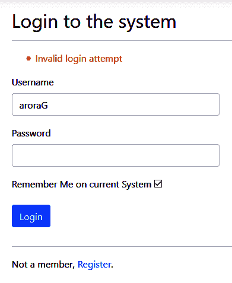

如果`Login`方法返回`true`，则它将当前登录页面重定向到主页。否则，它将停留在相同的登录页面，并抱怨无效的登录尝试。以下是`Login`方法的代码：

```cs
public bool Login(LoginViewModel model)
{
    var user = _userManager.FindBy(model);
    if (user == null) return false;
    SignInCookie(model, user);
    return true;
}
```

`Login`方法是`AuthManager`类的典型方法，它调用`UserManager`的`FindBy(model)`方法并检查其是否存在。如果存在，它将进一步调用`AuthManager`类的`SignInCookie(model,user)`方法，否则，它将简单地返回`false`，这意味着登录失败：

```cs
private void SignInCookie(LoginViewModel model, User user)
{
    var claims = new List<Claim>
    {
        new Claim(ClaimTypes.Name, user.FirstName),
        new Claim(ClaimTypes.Email, user.EmailId),
        new Claim(ClaimTypes.NameIdentifier, user.Id.ToString())
    };

    var identity = new ClaimsIdentity(claims, CookieAuthenticationDefaults.AuthenticationScheme);
    var principal = new ClaimsPrincipal(identity);
    var props = new AuthenticationProperties { IsPersistent = model.RememberMe };
    _httpContext.SignInAsync(CookieAuthenticationDefaults.AuthenticationScheme, principal, props).Wait();
}
```

以下代码片段确保如果用户已认证，则他们的详细信息应持久化在`HttpContext`中，以便系统可以验证来自用户的每个请求。您可能会注意到`_httpContext.SignInAsync(CookieAuthenticationDefaults.AuthenticationScheme, principal, props).Wait();`这个实际上执行了登录并启用了 cookie 认证的语句：

```cs
//Cookie authentication
services.AddAuthentication(CookieAuthenticationDefaults.AuthenticationScheme).AddCookie();
//For claims
services.AddSingleton<IHttpContextAccessor, HttpContextAccessor>();
services.AddTransient<IAuthManager, AuthManager>();
```

之前的语句帮助我们启用对应用程序的 cookie 认证和声明。最后，`app.UseAuthentication();`语句将认证机制能力添加到我们的应用程序中。这些语句应添加到`Startup.cs`类中。

# 这为什么很重要？

我们已经将大量代码添加到我们的 Web 应用程序中，但这真的能帮助我们限制页面/视图的未授权请求吗？**产品**页面/视图仍然开放；因此，我可以从产品页面/视图中执行任何可用的操作：

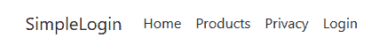

作为用户，无论我是否登录，我都能看到“产品”选项：


以下截图显示了登录前后相同的“产品”菜单选项。

我们可以像这样限制对产品页面的访问：

```cs
<li class="nav-item">
    @{
        if (AuthManager.IsAuthenticated)
        {
            <a class="nav-link text-dark" asp-area="" asp-controller="Product" asp-action="Index">Products</a>
        }
    }
</li>
```

以下是该应用程序的主屏幕：

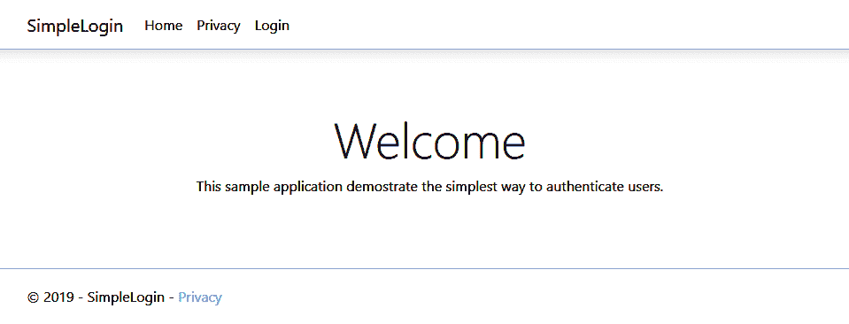

之前的代码帮助系统在用户登录/认证后仅显示产品菜单选项。产品菜单选项不会显示在屏幕上。这样，我们可以限制未授权访问。然而，这种方法有其自身的缺点。最大的缺点是，如果有人知道产品页面的 URL——这将带您到`/Product/Index`——那么他们可以执行受限操作。这些操作是受限的，因为它们不是为未登录的用户设计的。

# 授权操作

在上一节中，我们讨论了如何避免未授权访问特定或受限的屏幕/页面。我们了解到登录实际上验证了用户的身份，并允许他们向系统发出请求。另一方面，认证并不意味着如果用户已认证，那么他们就有权访问特定的部分、页面或屏幕。

以下描述了一个典型的授权和认证过程：

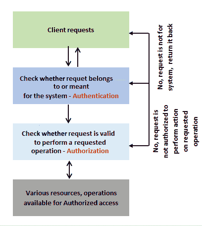

在此过程中，第一个请求/用户被认证（通常是一个登录表单），然后请求被授权执行特定的/请求的操作。可能有许多场景，请求被认证但未授权访问特定的资源或执行特定的操作。

在我们之前创建的应用程序中，我们有一个具有 CRUD 操作的`Products`页面。`Products`页面不是一个公开页面，这意味着此页面不是对所有用户都可用；它是受限制访问的。

我们回到上一节中留下的主要问题：“如果用户已经认证但未授权访问特定的页面/资源怎么办？无论我们是否隐藏页面以防止未经授权的用户访问，因为他们可以很容易地通过输入 URL 来访问或查看它。*"* 为了克服这个挑战/问题，我们可以实施以下步骤：

1.  检查对受限制资源的每次访问的授权，这意味着每当用户尝试访问资源（通过在浏览器中输入直接 URL）时，系统都会检查授权，以便授权访问资源的传入请求。如果用户的传入请求未经授权，那么他们就无法执行指定的操作。

1.  在受限制资源的每次操作上检查授权意味着如果用户已认证，他们可以访问受限制的页面/视图，但此页面/视图的操作只能由授权用户访问。

`Microsoft.AspNetCore.Authorization`命名空间提供了内置函数来授权特定资源。

为了限制访问并避免未授权访问特定资源，我们可以使用`Authorize`属性：

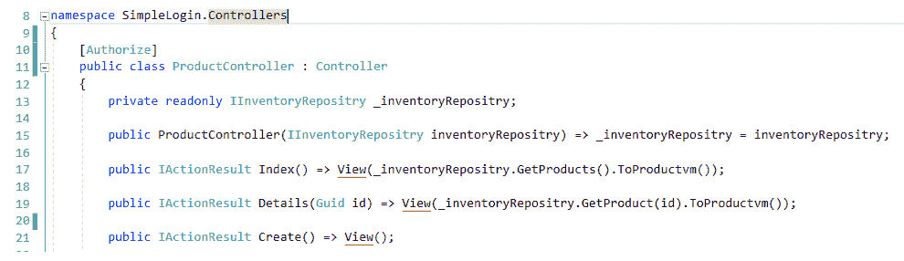

上一张截图显示我们将`Authorize`属性添加到了`ProductController`中。现在，按*F5*键并运行应用程序。

如果用户未登录到系统，他们将无法看到产品页面，因为我们已经添加了条件。如果用户经过验证，则在菜单栏中显示产品。

不要登录到系统，直接在浏览器中输入产品 URL，`http://localhost:56229/Product`。这将使用户重定向到登录屏幕。请查看以下截图并检查 URL；您可能会注意到 URL 中包含一个 ReturnUrl 部分，该部分将指导系统在成功登录尝试后重定向到何处。

看以下截图；请注意，URL 中包含 ReturnUrl 部分。一旦用户登录，系统将重定向应用程序到该 URL：

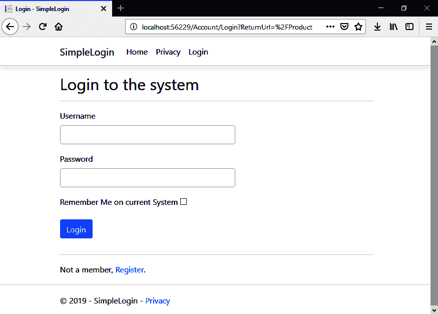

以下截图显示了产品列表：

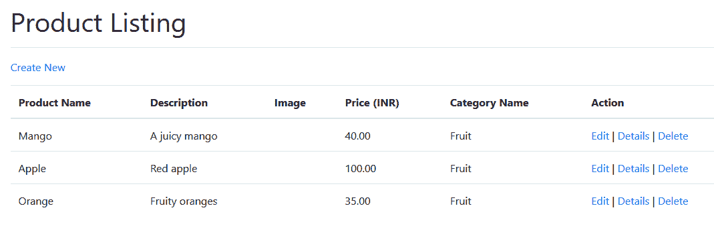

我们的产品列表屏幕提供了创建新项、编辑、删除和详细信息等操作。当前应用程序允许用户执行这些操作。因此，任何访问和认证用户都可以创建、更新和删除产品，这有意义吗？如果我们允许每个用户这样做，后果可能如下：

+   我们可以有许多已经添加到系统中的产品。

+   产品不可避免地需要删除/删除。

+   产品不可避免地需要更新。

我们能否有一种像用户类型这样的东西，将所有`Admin`类型的用户与普通用户区分开来，只允许具有管理员权限的用户——而不是普通用户——执行这些操作？一个更好的想法是为用户添加角色；因此，我们需要创建一个特定类型的用户。

让我们在我们的项目中添加一个新的实体，并将其命名为`Role`：

```cs
public class Role
{
    public Guid Id { get; set; }
    public string Name { get; set; }
    public string ShortName { get; set; }
}
```

之前代码片段中定义用户`Role`类的代码具有以下属性，如下所述：

+   `Id`：这使用`GUID`作为主键。

+   `Name`：`Role`的字符串类型名称。

+   `ShortName`：角色的简短或缩写名称，为字符串类型。

我们需要将我们的新类/实体添加到我们的`Context`类中。让我们按照以下方式添加：

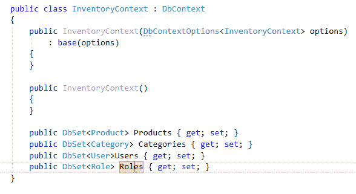

之前的代码提供了使用 EF 执行各种数据库操作的能力：

```cs
public IEnumerable<Role> GetRoles() => _context.Roles.ToList();

public IEnumerable<Role> GetRolesBy(string userId) => _context.Roles.Where(x => x.UserId.ToString().Equals(userId));

public string RoleNamesBy(string userId)
{
    var listofRoleNames = GetRolesBy(userId).Select(x=>x.ShortName).ToList();
    return string.Join(",", listofRoleNames);
}
```

之前代码片段中出现的`UserManager`类的三个方法为我们提供了从数据库中获取`Roles`的能力：

```cs
private void SignInCookie(LoginViewModel model, User user)
{
    var claims = new List<Claim>
    {
        new Claim(ClaimTypes.Name, user.FirstName),
        new Claim(ClaimTypes.Email, user.EmailId),
        new Claim(ClaimTypes.NameIdentifier, user.Id.ToString())
    };

    if (user.Roles != null)
    {
        string[] roles = user.Roles.Split(",");

        claims.AddRange(roles.Select(role => new Claim(ClaimTypes.Role, role)));
    }

    var identity = new ClaimsIdentity(claims, CookieAuthenticationDefaults.AuthenticationScheme);

    var principal = new ClaimsPrincipal(identity);
    var props = new AuthenticationProperties { IsPersistent = model.RememberMe };
    _httpContext.SignInAsync(CookieAuthenticationDefaults.AuthenticationScheme, principal, props).Wait();
}
```

我们通过修改`AuthManager`类的`SigningCookie`方法将`Roles`添加到我们的`Claims`中：

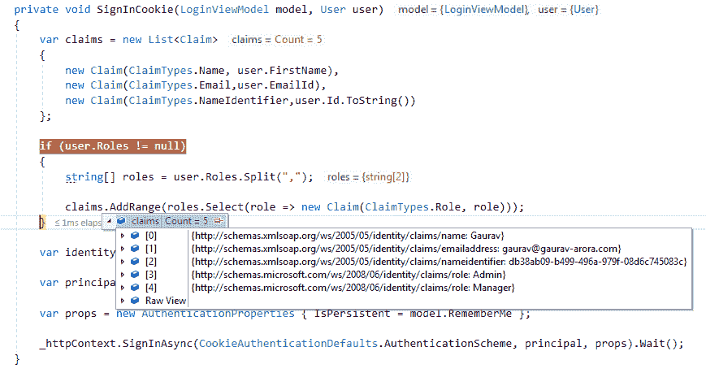

之前的截图显示，名为`Gaurav`的用户有两个角色：`Admin`和`Manager`：

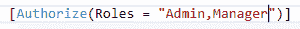

我们仅对具有`Admin`和`Manager`角色的用户限制`ProductController`。现在，尝试使用用户`aroraG`登录，你将看到如下截图所示的`Product Listing`：

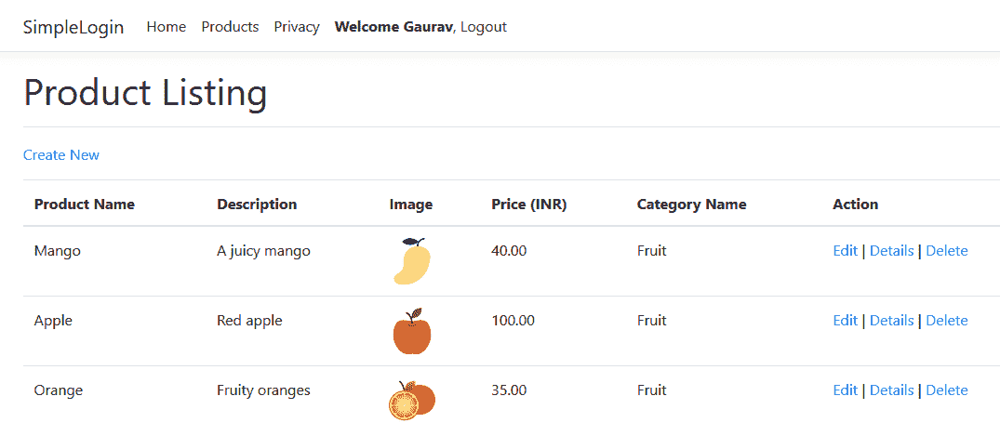

现在，让我们尝试使用第二个用户`aroraG1`登录，该用户具有`Editor`角色。这将抛出`AccessDenied`错误。有关此内容，请参阅以下截图：

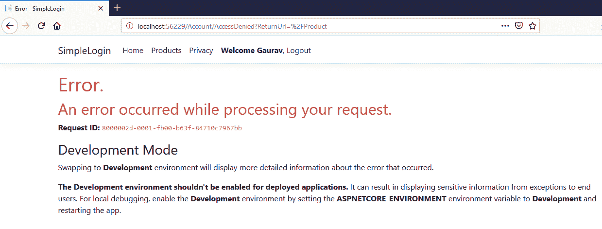

以这种方式，我们可以保护我们的受限资源。有许多方法可以实现这一点。.NET Core MVC 提供了内置功能来实现这一点，你也可以以可定制的方式做到这一点。如果你不想使用这些可用的内置功能，你可以很容易地通过添加到现有代码中来制定所需功能的自定义功能。如果你想这样做，你需要从头开始。此外，如果某些功能可用，那么再次创建类似功能就没有意义了。如果你找不到可用组件的功能，那么你应该定制现有的功能/特性，而不是从头编写整个代码。

**开发者应该实现一个无法被篡改的认证机制**。在本节中，我们讨论了很多与认证和授权、编写代码以及创建我们的 Web 应用程序相关的内容。关于认证，我们应该使用一个好的认证机制，以确保没有人可以篡改或绕过它。你可以从以下两个设计开始：

+   认证过滤器

+   认证单个请求/端点

在实施前几步之后，任何通过任何模式传入的请求都应该在系统响应用户或发起调用的客户端之前进行认证和授权。这个过程主要包括以下内容：

+   **保密性**：安全系统确保任何敏感数据不会被未认证和未经授权的访问请求暴露。

+   **可用性**：系统中的安全措施确保系统对经过系统认证和授权的真正用户可用。

+   **完整性**：在一个安全系统中，数据篡改是不可能的，因此数据是安全的。

# 创建 Web 测试项目

单元测试是检查代码健康状况的一种方法。这意味着如果代码有 bug（不健康），那么这将是应用程序中许多未知和不受欢迎问题的根源。为了克服这种方法，我们可以遵循 TDD 方法。

你可以用 Katas 练习 TDD。你可以参考[`www.codeproject.com/Articles/886492/Learning-Test-Driven-Development-with-TDD-Katas`](https://www.codeproject.com/Articles/886492/Learning-Test-Driven-Development-with-TDD-Katas)了解更多关于 TDD Katas 的信息。如果你想练习这种方法，请使用此存储库：[`github.com/garora/TDD-Katas`](https://github.com/garora/TDD-Katas)。

我们已经在之前的章节中讨论了很多关于 TDD 的内容，所以在这里我们不会详细讨论。相反，让我们创建一个测试项目，如下所示：

1.  打开我们的 Web 应用程序。

1.  在 Visual Studio 的解决方案资源管理器中，右键单击解决方案，然后单击添加 | 新项目...，如图所示：

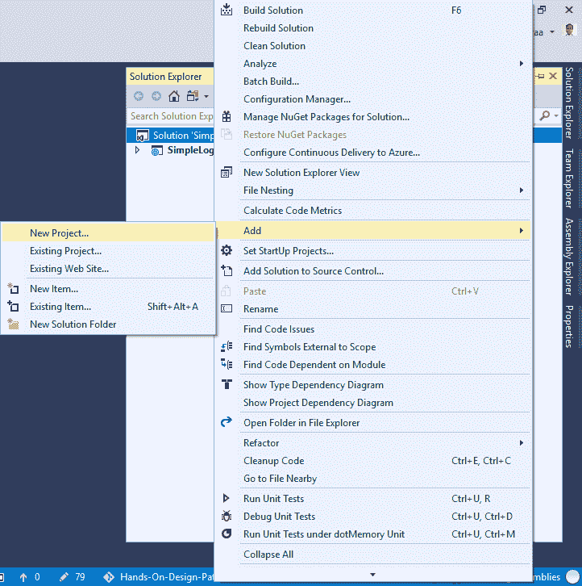

1.  从添加新项目模板中，选择.NET Core 和 xUnit 测试项目(.NET Core)并提供一个有意义的名称：

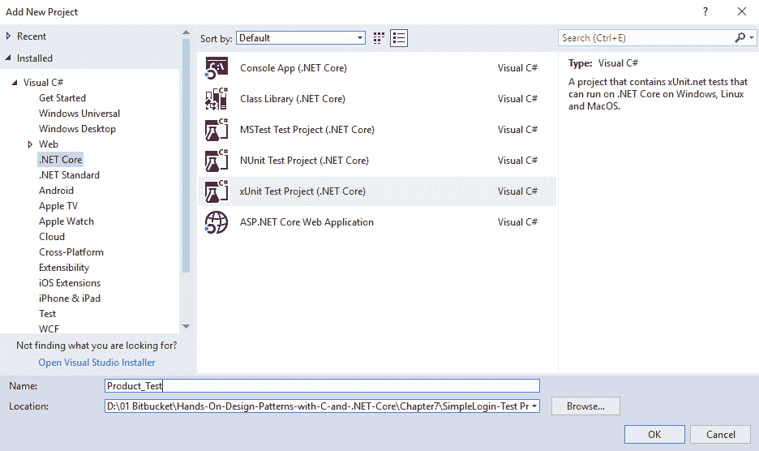

你将获得一个默认的单元`test`类，其中包含空白的测试代码，如下面的代码片段所示：

```cs
namespace Product_Test
{
    public class UnitTest1
    {
        [Fact]
        public void Test1()
        {
        }
    }
}
```

你可以更改这个类的名称，或者如果你想编写自己的`test`类，可以删除这个类：

```cs
public class ProductData
{
    public IEnumerable<ProductViewModel> GetProducts()
    {
        var productVm = new List<ProductViewModel>
        {
            new ProductViewModel
            {
                CategoryId = Guid.NewGuid(),
                CategoryDescription = "Category Description",
                CategoryName = "Category Name",
                ProductDescription = "Product Description",
                ProductId = Guid.NewGuid(),
                ProductImage = "Image full path",
                ProductName = "Product Name",
                ProductPrice = 112M
            },
           ... 
        };

        return productVm;
    }
```

1.  上述代码来自我们新添加的`ProductDate`类。请将其添加到一个名为`Fake`的新文件夹中。这个类仅创建模拟数据，以便我们可以测试我们的 Web 应用程序的产品：

```cs
public class ProductTests
{
    [Fact]
    public void Get_Returns_ActionResults()
    {
        // Arrange
        var mockRepo = new Mock<IProductRepository>();
        mockRepo.Setup(repo => repo.GetAll()).Returns(new ProductData().GetProductList());
        var controller = new ProductController(mockRepo.Object);

        // Act
        var result = controller.GetList();

        // Assert
        var viewResult = Assert.IsType<OkObjectResult>(result);
        var model = Assert.IsAssignableFrom<IEnumerable<ProductViewModel>>(viewResult.Value);
        Assert.NotNull(model);
        Assert.Equal(2, model.Count());
    }
}
```

1.  在`Services`文件夹中添加一个名为`ProductTests`的新文件。请注意，我们在代码中使用`Stubs`和`Mocks`。

我们之前的代码将使用红色波浪线显示错误，如下截图所示：

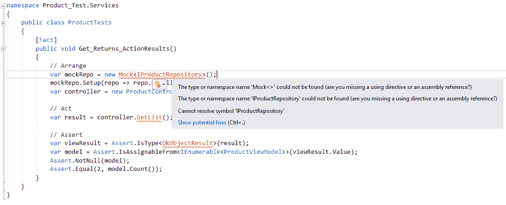

1.  之前的代码有错误，因为我们没有添加执行测试所需的某些包。为了克服这些错误，我们应该在我们的 `test` 项目中安装 `moq` 支持。在包管理控制台中输入以下命令：

```cs
install-package moq 
```

1.  上述命令将在测试项目中安装 `moq` 框架。请注意，在执行上述命令时，您应该选择我们创建的测试项目：

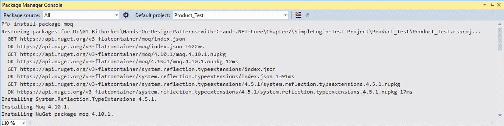

一旦安装了 `moq`，您就可以开始测试了。

在您使用 `xUnit` 测试项目时需要注意的重要点如下：

+   **事实** 是一个属性，用于没有参数的正常测试方法。

+   **理论** 是一个属性，用于参数化测试方法。

1.  一切就绪。现在，点击测试资源管理器并运行您的测试：

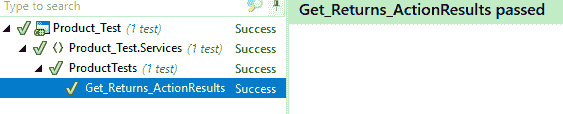

最后，我们的测试通过了！这意味着我们的控制器方法是好的，我们的代码中没有问题或错误，这些错误可能会破坏应用程序/系统的功能。

# 摘要

本章的主要目标是使我们的 Web 应用程序能够保护不受注意的请求。本章详细介绍了使用 Visual Studio 创建 Web 应用程序的步骤，并讨论了认证和授权。我们还讨论了 TDD，并在新的 xUnit Web 测试项目中使用了 `Stubs` 和 `Mocks`。

在下一章中，我们将讨论在 .NET Core 中使用并发编程的最佳实践和模式。

# 问题

以下问题将帮助您巩固本章包含的信息：

1.  认证和授权是什么？

1.  在请求的第一级使用认证然后允许对受限区域的传入请求是否安全？

1.  你如何证明授权总是在认证之后？

1.  TDD 是什么，为什么开发者关心它？

1.  定义 TDD katas。它们如何帮助我们改进 TDD 方法？

# 进一步阅读

恭喜你，你已经完成了这一章！要了解更多关于本章涉及的主题，请参阅以下书籍：

+   由 *Gaurav Aroraa* 和 *Tadit Dash* 撰写，并由 *Packt Publishing* 出版的《*使用 .NET Core 构建 RESTful Web 服务*》：[`www.packtpub.com/application-development/building-restful-web-services-net-core`](https://www.packtpub.com/application-development/building-restful-web-services-net-core)

+   由 *Ayobami Adewole* 撰写，并由 *Packt Publishing* 出版的《*C# 和 .NET Core 测试驱动开发*》：[`www.packtpub.com/in/application-development/c-and-net-core-test-driven-development`](https://www.packtpub.com/in/application-development/c-and-net-core-test-driven-development)
