# 第十章：反应式编程模式和技巧

在上一章（第九章，*函数式编程实践*）中，我们深入探讨了函数式编程，并学习了 **Func**、**Predicate**、**LINQ**、**Lambda**、**匿名函数**、**表达式树**和**递归**。我们还探讨了使用函数式编程实现策略模式。

本章将探讨反应式编程的使用，并通过使用 C# 语言提供反应式编程的动手演示。我们将深入研究反应式编程的原则和模型，并讨论 `IObservable` 和 `IObserver` 提供者。

库存应用程序将通过两种主要方式扩展：通过响应变化，并讨论 **模型-视图-视图模型**（**MVVM**）模式。

本章将涵盖以下主题：

+   反应式编程的原则

+   反应式和 IObservable

+   反应式扩展—.NET Rx 扩展

+   库存应用用例—使用过滤器、分页和排序获取库存

+   模式和实践 – MVVM

# 技术要求

本章包含各种代码示例，以解释反应式编程的概念。代码保持简单，仅用于演示目的。大多数示例涉及使用 C# 编写的 .NET Core 控制台应用程序。

完整的源代码可在以下链接获取：[`github.com/PacktPublishing/Hands-On-Design-Patterns-with-C-and-.NET-Core/tree/master/Chapter10`](https://github.com/PacktPublishing/Hands-On-Design-Patterns-with-C-and-.NET-Core/tree/master/Chapter10)。

运行和执行代码需要以下条件：

+   Visual Studio 2019（您也可以使用 Visual Studio 2017）

+   设置 .NET Core

+   SQL Server（本章使用的是 Express 版本）

# 安装 Visual Studio

要运行代码示例，您需要安装 Visual Studio（首选 IDE）。为此，您可以按照以下说明操作：

1.  从安装说明中提到的下载链接下载 Visual Studio 2017 或更高版本（2019）：[`docs.microsoft.com/en-us/visualstudio/install/install-visual-studio`](https://docs.microsoft.com/en-us/visualstudio/install/install-visual-studio)。

1.  按照安装说明操作。

1.  Visual Studio 安装有多种选择。在这里，我们使用 Windows 版 Visual Studio。

# 设置 .NET Core

如果您未安装 .NET Core，您需要按照以下步骤操作：

1.  下载 Windows 版 .NET Core：[`www.microsoft.com/net/download/windows`](https://www.microsoft.com/net/download/windows)。

1.  对于多个版本和相关库，请访问 [`dotnet.microsoft.com/download/dotnet-core/2.2`](https://dotnet.microsoft.com/download/dotnet-core/2.2)。

# 安装 SQL Server

如果您未安装 SQL Server，可以按照以下说明操作：

1.  从以下链接下载 SQL Server：[`www.microsoft.com/en-in/download/details.aspx?id=1695`](https://www.microsoft.com/en-in/download/details.aspx?id=1695)。

1.  你可以在这里找到安装说明：[`docs.microsoft.com/en-us/sql/ssms/download-sql-server-management-studio-ssms?view=sql-server-2017`](https://docs.microsoft.com/en-us/sql/ssms/download-sql-server-management-studio-ssms?view=sql-server-2017)。

对于故障排除和更多信息，请参阅以下链接：[`www.blackbaud.com/files/support/infinityinstaller/content/installermaster/tkinstallsqlserver2008r2.htm`](https://www.blackbaud.com/files/support/infinityinstaller/content/installermaster/tkinstallsqlserver2008r2.htm)。

# 响应式编程的原则

这些天，每个人都在谈论**异步编程**。各种应用程序都是基于使用异步编程的 RESTful 服务构建的。术语*异步*与响应式编程相关。响应式编程全部关于数据流，响应式编程是一个围绕异步数据流构建的模型结构。响应式编程也被称为*编程传播变化的艺术*。让我们回到我们的例子，第八章，*.NET Core 中的并发编程*，在那里我们讨论了一个大型会议中的售票窗口收集计数器。

除了三个售票窗口外，我们还有一个名为计算窗口的额外窗口。这个第四个窗口专注于计数收集，它统计了从每个窗口分发出的票数。考虑以下图表：

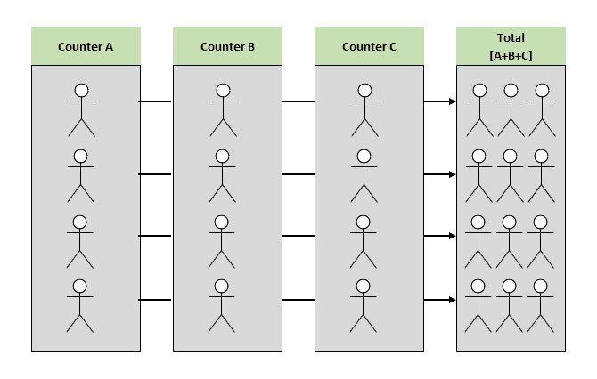

在前面的图表中，A+B+C 的总和是剩余三列的总和；它是 1+1+1 = 3。**总计**列总是显示剩余三列的总和，它永远不会显示实际站在队列中等待轮到他们收集票的人。**总计**列的值取决于剩余列的数量。如果**计数器 A**队列中有两个人，那么**总计**列将显示 2+1+1 = 4 的总和。你也可以将**总计**列称为计算列。此列在其它行/列的计数（队列中等待的人）改变时立即计算总和。如果我们用 C# 编写**总计**列，我们会选择计算属性，它看起来如下：`public int TotalColumn { get { return ColumnA + ColumnB + ColumnC; } }`。

在前面的图表中，数据从一列流向另一列。你可以将其视为数据流。你可以为任何东西创建一个流，例如点击事件和悬停事件。任何东西都可以是一个流变量：用户输入、属性、缓存、数据结构等等。在流的世界里，你可以监听流并根据需要进行反应。

事件序列被称为**流**。一个流可以发出三件事：一个值、一个错误和一个完成信号。

你可以轻松地以这种方式处理流：

+   一个流可以是另一个流的输入。

+   多个流可以是另一个流的输入。

+   流可以合并。

+   数据值可以从一个流映射到另一个流。

+   可以使用所需的数据/事件对流进行过滤。

要更深入地了解流，请参阅以下图表，该图表表示了一个流（事件序列）：


上述图表表示了一个流（事件序列），其中我们有一个到四个事件。这些事件中的任何一个都可以被触发，或者有人可以点击它们中的任何一个。这些事件可以用值来表示，这些值可以是字符串。X 符号表示在流合并或数据映射操作期间发生了错误。最后，|符号表示流（或操作）已完成。

# 使用反应式编程来保持反应性

显然，我们之前讨论的计算属性（discussed in the previous section）不能是反应性的或代表反应式编程。反应式编程有特定的设计和技术。要体验反应式编程或保持反应性，你可以从[`reactivex.io/`](http://reactivex.io/)提供的文档开始，通过阅读反应式宣言([`www.reactivemanifesto.org/`](https://www.reactivemanifesto.org/))来体验它。

简而言之，反应式属性是在事件触发时做出反应的绑定属性。

现在，当我们处理各种大型系统/应用程序时，我们发现它们太大，无法一次性处理。这些大型系统被分割或组合成更小的系统。这些较小的单元/系统依赖于反应式属性。为了遵循反应式编程，反应式系统应用设计原则，以便这些属性可以应用于所有方法。借助这种设计/方法，我们可以创建一个可组合的系统。

根据宣言，反应式编程和反应式系统都是不同的。

在反应式宣言的基础上，我们可以得出结论，反应式系统如下：

+   **响应性**：反应式系统是基于事件的系统设计；这些系统能够快速响应任何请求，并在短时间内做出反应。

+   **可伸缩性**：反应式系统在本质上具有反应性。这些系统可以通过扩展或减少分配的资源来响应可伸缩率的改变。

+   **弹性**：一个弹性的系统是指即使在出现故障/异常的情况下也不会停止的系统。反应式系统被设计成这样，在任何异常或故障发生时，系统永远不会死亡；它仍然在运行。

+   **基于消息的**：任何数据项都代表可以发送到特定目的地的消息。当一个消息或数据项到达给定状态时，事件会发出信号通知订阅者消息已到达。反应式系统依赖于这种消息传递。

以下图表展示了反应式系统的图示：

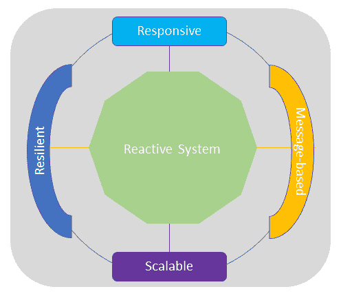

在这个图表中，反应式系统由小型系统组成，这些系统具有弹性、可扩展性、响应性和基于消息的特性。

# 反应式流的实际应用

到目前为止，我们已经讨论了反应式编程是一个数据流的事实。在前面的章节中，我们也讨论了流的工作方式和这些流如何及时地传输。我们看到了事件的一个例子，并讨论了反应程序中的数据流。现在，让我们继续使用相同的例子，看看两个流如何通过不同的操作工作。

在下一个例子中，我们有两个整数数据类型集合的反应式流。请注意，在本节中我们使用伪代码来解释行为以及这些数据流集合的工作方式。

以下图表表示两个可观察的流。第一个流`Observer1`包含数字**1**、**2**和**4**，而第二个流`Observer2`包含数字**3**和**5**：


合并两个流涉及将它们的序列元素组合成一个新的流。以下图表显示了当`Observer1`和`Observer2`合并时产生的新流：


上述图表仅表示流的一种形式，并不是流中元素序列的实际表示。在这个图表中，我们看到元素（数字）的顺序是**1**、**2**、**3**、**4**、**5**，但在现实例子中并不一定如此。序列可能有所不同；它可能是**1**、**2**、**4**、**3**、**5**，或者任何其他顺序。

过滤流就像跳过元素/记录。你可以想象 LINQ 中的`Where`子句，它看起来像这样：`myCollection.Where(num => num <= 3);`。

以下图表展示了我们试图选择满足特定条件的元素的准则图示：


我们正在过滤我们的流，只选择那些**<=3**的元素。这意味着我们跳过了元素**4**和**5**。在这种情况下，我们可以说过滤器是用来跳过元素或匹配特定条件的。

要理解映射流，你可以想象任何数学运算，其中你会计算序列或通过添加一些常数来增加数字。例如，如果我们有一个整数值为 *3*，并且我们的映射流是 *+3*，这意味着我们正在计算一个序列为 *3 + 3 = 6*。你还可以将此与 LINQ 和选择以及投影的输出相关联，如下所示：`return myCollection.Select(num => num+3);`。

下面的图表表示流的映射：


在应用条件 *<= 3* 的过滤器之后，我们的流包含元素 **1**、**2** 和 **3**。此外，我们还对过滤后的流（包含元素 **1**、**2** 和 **3**）应用了 `Map (+3)`，最终我们的流包含元素 **4**、**5**、**6**（1+3、2+3、3+3）。

在现实世界中，这些操作将按顺序或按需发生。我们已经完成了序列的操作，以便我们可以按顺序应用合并、过滤和映射的操作。以下图表表示了我们想象中的示例的流程：


因此，我们尝试通过图表来表示我们的示例，并经历了各种操作，其中两个流相互通信，我们得到了一个新的流，然后过滤并映射了这个流。

为了更好地理解，请参阅 [`rxmarbles.com/`](https://rxmarbles.com/)。

现在，让我们创建一个简单的代码来在现实世界中完成这个示例。首先，我们将研究实现示例的代码，然后我们将讨论流的输出。

将以下代码片段视为 `IObservable` 接口的示例：

`public static IObservable<T> From<T>(this T[] source) => source.ToObservable();`

此代码表示 `T` 类型数组的扩展方法。我们创建了一个泛型方法，并将其命名为 `From`。此方法返回一个 `Observable` 序列。

你可以访问官方文档以了解更多关于扩展方法的信息：[`docs.microsoft.com/en-us/dotnet/csharp/programming-guide/classes-and-structs/extension-methods`](https://docs.microsoft.com/en-us/dotnet/csharp/programming-guide/classes-and-structs/extension-methods)。

在我们的代码中，我们有 `TicketCounter` 类。这个类有两个观察者，实际上是整数数据类型的数组。下面的代码显示了两个可观察对象：

```cs
public IObservable<int> Observable1 => Counter1.From();
public IObservable<int> Observable2 => Counter2.From();
```

在此代码中，我们将 `From()` 扩展方法应用于 `Counter1` 和 `Counter2`。这些计数器实际上代表我们的票务计数器，并回忆起我们来自 第八章，*在 .NET Core 中的并发编程* 的示例。

下面的代码片段表示 `Counter1` 和 `Counter2`：

```cs
internal class TicketCounter
{
    private IObservable<int> _observable;
    public int[] Counter1;
    public int[] Counter2;
    public TicketCounter(int[] counter1, int[] counter2)
    {
        Counter1 = counter1;
        Counter2 = counter2;
    }
...
}
```

在此代码中，我们有两个字段，`Counter1` 和 `Counter2`，它们由构造函数初始化。当 `TicketCounter` 类被初始化时，这些字段从类的构造函数中获取值，如下面的代码所示：

```cs
TicketCounter ticketCounter = new TicketCounter(new int[]{1,3,4}, new int[]{2,5});
```

要理解完整的代码，请转到并执行代码，在 Visual Studio 中按*F5*键。从这里，你将看到以下屏幕：


这是控制台输出，在这个控制台窗口中，用户被要求从`0`到`9`输入一个以逗号分隔的数字。请在这里输入一个以逗号分隔的数字。请注意，在这里，我们试图创建一个代码，以描绘我们之前在本节中讨论的数据流表示图：


根据前面的图示，我们输入了两个不同的以逗号分隔的数字。第一个是`1,2,4`，第二个是`3,5`。现在考虑我们的`Merge`方法：

```cs
public IObservable<int> Merge() => _observable = Observable1.Merge(Observable2);
```

`Merge`方法正在将数据流的两个序列合并到`_observable`中。`Merge`操作使用以下代码启动：

```cs
Console.Write("\n\tEnter comma separated number (0-9): ");
var num1 = Console.ReadLine();
Console.Write("\tEnter comma separated number (0-9): ");
var num2 = Console.ReadLine();
var counter1 = num1.ToInts(',');
var counter2 = num2.ToInts(',');
TicketCounter ticketCounter = new TicketCounter(counter1, counter2);
```

在此代码中，用户被提示输入以逗号分隔的数字，然后程序通过应用`ToInts`方法将这些数字存储到`counter1`和`counter2`中。以下是我们`ToInts`方法的代码：

```cs
public static int[] ToInts(this string commaseparatedStringofInt, char separator) =>
    Array.ConvertAll(commaseparatedStringofInt.Split(separator), int.Parse);
```

此代码是`string`的扩展方法。目标变量是包含以`separator`分隔的整数的`string`类型。在这个方法中，我们使用.NET Core 提供的内置`ConvertAll`方法。它首先分割字符串并检查分割值是否为`integer`类型。然后返回整数的`Array`。此方法产生以下截图所示的结果：


以下是我们`merge`操作的结果：


前面的输出显示我们现在有一个最终合并的观察者流，其元素按顺序排列。现在让我们对这个流应用一个过滤器。以下是我们`Filter`方法的代码：

```cs
public IObservable<int> Filter() => _observable = from num in _observable
    where num <= 3
    select num;
```

我们有对数字`<= 3`的过滤条件，这意味着我们只会选择值小于或等于`3`的元素。此方法将使用以下代码启动：

```cs
ticketCounter.Print(ticketCounter.Filter());
```

当执行前面的代码时，它产生以下输出：


最后，我们有一个过滤后的流，其元素按顺序为 1,3,2。现在我们需要在这个流上应用映射。我们需要一个映射元素`num + 3`，这意味着我们需要通过给这个数字加`3`来输出一个整数。以下是我们`Map`方法的代码：

```cs
public IObservable<int> Map() => _observable = from num in _observable
    select num + 3;
```

前面的方法将使用以下代码初始化：

```cs
Console.Write("\n\tMap (+ 3):");
ticketCounter.Print(ticketCounter.Map());
```

执行前面的方法后，我们将看到以下输出：


在应用了 `Map` 方法之后，我们得到了序列 4,6,5 中元素的流。我们已经讨论了即使在想象中的例子中，响应式是如何工作的。我们创建了一个小的 .NET Core 控制台应用程序来查看 `Merge`、`Filter` 和 `Map` 操作在可观察对象上的力量。以下是我们控制台应用程序的输出：


之前的快照讲述了我们的示例应用程序执行的全过程；`Counter1` 和 `Counter2` 是包含数据序列 1,2,4 和 3,5 的数据流。我们得到了 `Merge` 的前一个输出，结果为 `1,3,2,5,4 Filter (<=3)`，结果为 1,3,2，以及 `Map (+3)` 的数据 4,6,5。

# 响应式和 IObservable

在上一节中，我们讨论了响应式编程并了解了其模型。在本节中，我们将讨论微软对响应式编程的实现。作为对 .NET Core 中响应式编程的响应，我们有各种接口，它们为我们提供了在应用程序中实现响应式编程的方法。

`IObservable<T>` 是在 `System` 命名空间中定义的一个泛型接口，声明为 `public interface IObservable<out T>`。在这里，`T` 代表一个泛型参数类型，它提供通知信息。简单来说，这个接口帮助我们定义通知的提供者，并且这些通知可以用于推送信息。你可以在应用程序中实现 `IObservable<T>` 接口时使用观察者模式。

# 观察者模式 – 使用 IObservable<T> 实现

简而言之，订阅者向提供者注册，以便订阅者可以获取与消息信息相关的通知。这些通知通知提供者消息已发送到订阅者。这些信息也可能与操作的变化或方法或对象本身的任何其他变化有关。这也被称为**状态变化**。

观察者模式定义了两个术语：观察者和可观察对象。可观察对象是一个提供者，也称为**主题**。观察者注册在 `Observable`/`Subject`/`Provider` 类型上，并且每当由于预定义的准则/条件、变化或事件等原因发生任何变化时，观察者将由提供者自动通知。

以下图示是观察者模式的一个简单表示，其中主题正在通知两个不同的观察者：


回到第九章 FlixOne 库存 Web 应用程序，*函数式编程实践*，启动你的 Visual Studio，并打开 `FlixOne.sln` 解决方案。

打开解决方案资源管理器。从这里，你会看到我们的项目看起来与以下快照相似：

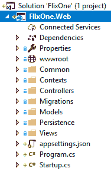

在解决方案资源管理器下展开 Common 文件夹，并添加两个文件：`ProductRecorder.cs` 和 `ProductReporter.cs`。这些文件是实现 `IObservable<T>` 和 `IObserver<T>` 接口的实现。我们还需要添加一个新的 ViewModel，以便我们可以向用户报告实际的消息。为此，展开 `Models` 文件夹并添加 `MessageViewModel.cs` 文件。

以下代码展示了我们的 `MessageViewModel` 类：

```cs
public class MessageViewModel
{
    public string MsgId { get; set; }
    public bool IsSuccess { get; set; }
    public string Message { get; set; }

    public override string ToString() => $"Id:{MsgId}, Success:{IsSuccess}, Message:{Message}";
}
```

`MessageViewModel` 包含以下内容：

+   `MsgId`: 一个唯一标识符

+   `IsSuccess`: 显示操作是否失败或成功

+   `Message`: 一个成功消息或错误消息，这取决于 `IsSuccess` 的值

+   `ToString()`: 一个重写方法，返回连接所有信息的字符串

现在，让我们讨论我们的两个类；以下代码来自 `ProductRecorder` 类：

```cs
public class ProductRecorder : IObservable<Product>
{
    private readonly List<IObserver<Product>> _observers;

    public ProductRecorder() => _observers = new List<IObserver<Product>>();

    public IDisposable Subscribe(IObserver<Product> observer)
    {
        if (!_observers.Contains(observer))
            _observers.Add(observer);
        return new Unsubscriber(_observers, observer);
    }
...
}
```

我们的 `ProductRecorder` 类实现了 `IObservable<Product>` 接口。如果你还记得我们关于观察者模式的讨论，你会知道这个类实际上是一个提供者、主题或可观察对象。`IObservable<T>` 接口有一个 `Subscribe` 方法，我们需要使用它来订阅我们的订阅者或观察者（我们将在本节后面讨论观察者）。

应该有一个标准或条件，以便订阅者可以收到通知。在我们的例子中，我们有一个 `Record` 方法来满足这个目的。考虑以下代码：

```cs
public void Record(Product product)
{
    var discountRate = product.Discount.FirstOrDefault(x => x.ProductId == product.Id)?.DiscountRate;
    foreach (var observer in _observers)
    {
        if (discountRate == 0 || discountRate - 100 <= 1)
            observer.OnError(
                new Exception($"Product:{product.Name} has invalid discount rate {discountRate}"));
        else
            observer.OnNext(product);
    }
}
```

前面是 `Record` 方法。我们创建这个方法来展示模式的力量。这个方法只是简单地检查有效的折扣率。如果 `discount rate` 无效，根据标准/条件，这个方法会抛出一个异常，并将产品名称与无效的 `discount rate` 一起共享。

前一个方法根据标准验证折扣率，并在标准失败时向订阅者发送有关抛出异常的通知。看看迭代块（`foreach` 循环），想象一下我们没有可以迭代的内容，并且所有订阅者都已经收到通知的情况。我们能想象在这种情况下会发生什么吗？类似的情况也可能出现在 `无限循环` 中。为了停止这种情况，我们需要某种可以终止循环的东西。为此，我们有了以下 `EndRecording` 方法：

```cs
public void EndRecording()
{
    foreach (var observer in _observers.ToArray())
        if (_observers.Contains(observer))
            observer.OnCompleted();
    _observers.Clear();
}
```

我们的 `EndRecoding` 方法正在遍历 `_observers` 集合并显式触发 `OnCompleted()` 方法。最后，它清除了 `_observers` 集合。

现在，让我们讨论 `ProductReporter` 类。这个类是 `IObserver<T>` 接口实现的例子。考虑以下代码：

```cs
public void OnCompleted()
{
    PrepReportData(true, $"Report has completed: {Name}");
    Unsubscribe();
}

public void OnError(Exception error) => PrepReportData(false, $"Error ocurred with instance: {Name}");

public void OnNext(Product value)
{
    var msg =
        $"Reporter:{Name}. Product - Name: {value.Name}, Price:{value.Price},Desc: {value.Description}";
    PrepReportData(true, msg);
}
```

`IObserver<T>`接口有`OnComplete`、`OnError`和`OnNext`方法，我们必须在`ProductReporter`类中实现。`OnComplete`方法的目的是在工作完成后通知订阅者，然后清除代码。此外，`OnError`在执行过程中发生错误时被调用，而`OnNext`提供了流中下一个元素的信息。

在以下代码中，`PrepReportData`是一个值添加，它给用户提供了有关所有操作过程的格式化报告：

```cs
private void PrepReportData(bool isSuccess, string message)
{
    var model = new MessageViewModel
    {
        MsgId = Guid.NewGuid().ToString(),
        IsSuccess = isSuccess,
        Message = message
    };

    Reporter.Add(model);
}
```

前面的方法只是向我们的`Reporter`集合中添加内容，这是一个`MessageViewModel`类的集合。请注意，为了简化起见，您也可以使用我们在`MessageViewModel`类中实现的`ToString()`方法。

下面的代码片段显示了`Subscribe`和`Unsubscribe`方法：

```cs
public virtual void Subscribe(IObservable<Product> provider)
{
    if (provider != null)
        _unsubscriber = provider.Subscribe(this);
}

private void Unsubscribe() => _unsubscriber.Dispose();
```

前两种方法告诉系统存在一个提供者。订阅者可以订阅该提供者，或者在操作完成后取消订阅/处理它。

现在是时候展示我们的实现了，看看一些好的结果。要做到这一点，我们需要对我们的现有`Product Listing`页面进行一些更改，并为我们项目添加一个新视图页面。

将以下链接添加到我们的`Index.cshtml`页面，以便我们可以看到查看审计报告的新链接：

```cs
<a asp-action="Report">Audit Report</a>
```

在前面的代码片段中，我们添加了一个新的链接来显示基于我们实现的`Report Action`方法的审计报告，该方法是我们在`ProductConstroller`类中定义的。

添加此代码后，我们的产品列表页面将如下所示：

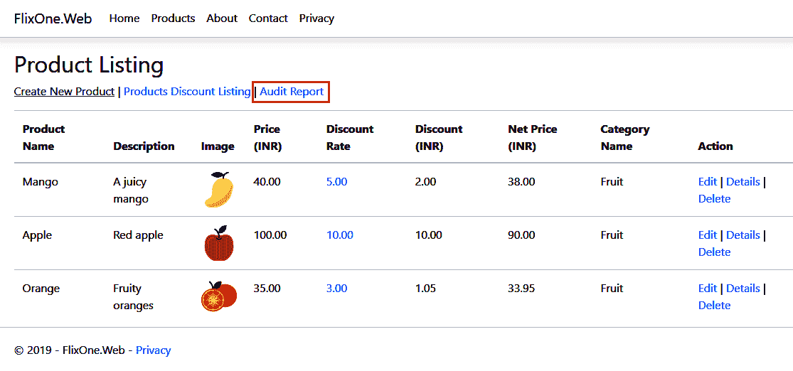

首先，让我们讨论一下`Report action`方法。为此，请考虑以下代码：

```cs
var mango = _repositry.GetProduct(new Guid("09C2599E-652A-4807-A0F8-390A146F459B"));
var apple = _repositry.GetProduct(new Guid("7AF8C5C2-FA98-42A0-B4E0-6D6A22FC3D52"));
var orange = _repositry.GetProduct(new Guid("E2A8D6B3-A1F9-46DD-90BD-7F797E5C3986"));
var model = new List<MessageViewModel>();
//provider
ProductRecorder productProvider = new ProductRecorder();
//observer1
ProductReporter productObserver1 = new ProductReporter(nameof(mango));
//observer2
ProductReporter productObserver2 = new ProductReporter(nameof(apple));
//observer3
ProductReporter productObserver3 = new ProductReporter(nameof(orange));
```

在前面的代码中，我们只是为了演示目的取了前三个产品。请注意，您可以根据自己的实现修改代码。在代码中，我们创建了一个`productProvider`类和三个观察者来订阅我们的`productProvider`类。

下面的图表是展示我们讨论的`IObservable<T>`和`IObserver<T>`接口的所有活动的图形视图：

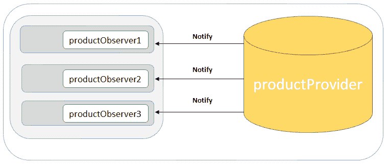

下面的代码用于订阅`productrovider`：

```cs
//subscribe
productObserver1.Subscribe(productProvider);
productObserver2.Subscribe(productProvider);
productObserver3.Subscribe(productProvider);
```

最后，我们需要记录报告然后取消订阅：

```cs
//Report and Unsubscribe
productProvider.Record(mango);
model.AddRange(productObserver1.Reporter);
productObserver1.Unsubscribe();
productProvider.Record(apple);
model.AddRange(productObserver2.Reporter);
productObserver2.Unsubscribe();
productProvider.Record(orange);
model.AddRange(productObserver3.Reporter);
productObserver3.Unsubscribe();
```

让我们回到我们的屏幕上，将`Report.cshtml`文件添加到视图 | 产品。以下代码是报告页面的部分。您可以在`Product`文件夹中找到完整的代码：

```cs
@model IEnumerable<MessageViewModel>

    <thead>
    <tr>
        <th>
            @Html.DisplayNameFor(model => model.IsSuccess)
        </th>
        <th>
            @Html.DisplayNameFor(model => model.Message)
        </th>
    </tr>
    </thead>
```

此代码将为显示审计报告的表格列创建一个标题。

下面的代码将完成表格，并将值添加到`IsSuccess`和`Message`列：

```cs
    <tbody>
    @foreach (var item in Model)
    {
        <tr>
            <td>
                @Html.HiddenFor(modelItem => item.MsgId)
                @Html.DisplayFor(modelItem => item.IsSuccess)
            </td>
            <td>
                @Html.DisplayFor(modelItem => item.Message)
            </td>

        </tr>
    }
    </tbody>
</table>
```

到目前为止，我们已经使用 `IObservable<T>` 和 `IObserver<T>` 接口实现了观察者模式。通过在 Visual Studio 中按 *F5* 运行项目，然后在主页面上点击产品，再点击审计报告链接来运行项目。从这里，您将看到我们选定产品的审计报告，如下面的截图所示：

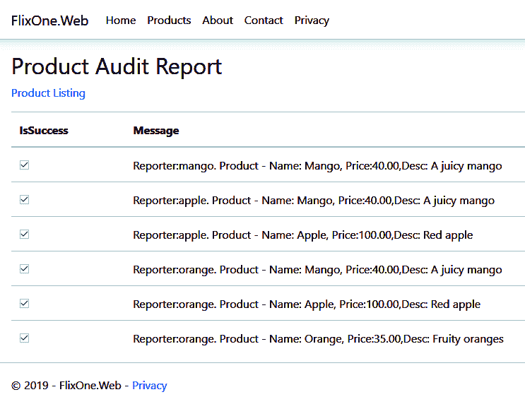

上一张截图显示了一个简单的列表页面，显示了来自 `MessageViewModel` 类的数据。您可以根据自己的需求进行更改和修改。通常，审计报告来自我们在上一屏幕中看到的大量操作活动。您还可以将审计数据保存到数据库中，然后根据不同的目的（如向管理员报告等）相应地提供这些数据。

# 反应式扩展 – .NET Rx 扩展

上一节中的讨论旨在介绍反应式编程以及使用 `IObservable<T>` 和 `IObserver<T>` 接口作为观察者模式实现反应式编程。在本节中，我们将借助 **Rx 扩展** 来扩展我们的学习。如果您想了解更多关于 Rx 扩展的开发信息，请关注官方仓库 [`github.com/dotnet/reactive`](https://github.com/dotnet/reactive)。

请注意，Rx 扩展现在已与 `System` 命名空间合并，您可以在 `System.Reactive` 命名空间中找到所有内容。如果您有使用 Rx 扩展的经验，应该知道这些扩展的命名空间已经更改，如下所示：

+   `Rx.Main` 已更改为 `System.Reactive`。

+   `Rx.Core` 已更改为 `System.Reactive.Core`。

+   `Rx.Interfaces` 已更改为 `System.Reactive.Interfaces`。

+   `Rx.Linq` 已更改为 `System.Reactive.Linq`。

+   `Rx.PlatformServices` 已更改为 `System.Reactive.PlatformServices`。

+   `Rx.Testing` 已更改为 `Microsoft.Reactive.Testing`。

要启动 Visual Studio，请打开 `SimplyReactive` 项目（在上一节中讨论过）并打开 NuGet 包管理器。点击浏览并输入搜索词 `System.Reactive`。从这里，您将看到以下结果：

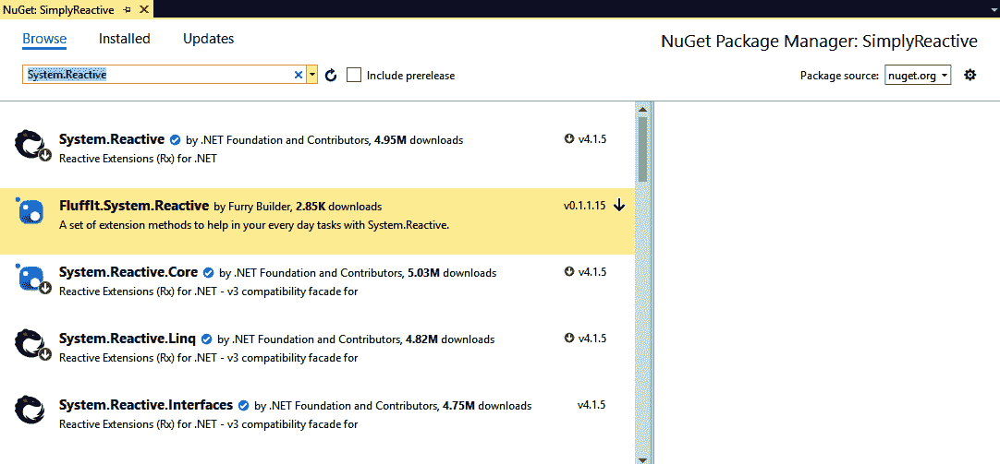

本节的目标是让您了解反应式扩展，但不会深入其内部开发。这些扩展位于 Apache2.0 许可证下，并由 .NET 基金会维护。我们已经在 `SimplyReactive` 应用程序中实现了反应式扩展。

# 库存应用程序用例

在本节中，我们将继续我们的 FlixOne 库存应用程序。在本节中，我们将讨论 Web 应用程序模式并扩展我们在 第四章，*实现设计模式 - 基础部分 2* 中开发的 Web 应用程序。

本章将继续探讨上一章中讨论的网页应用。如果您跳过了上一章（第九章，*函数式编程实践*），请重新阅读以跟上本章的内容。

在本节中，我们将讨论需求收集的过程，然后讨论我们之前开发的网页应用在开发和业务方面所面临的挑战。

# 开始项目

在第七章，*为网页应用实现设计模式 - 第二部分*中，我们在我们的 FlixOne 库存网页应用中添加了功能。在考虑以下要点后，我们扩展了该应用：

+   业务需要丰富的用户界面。

+   新的机会需要响应式网页应用。

# 需求

经过与管理部门、**业务分析师**（**BA**）和预销售人员的多次会议和讨论后，该组织的管理部门决定着手以下高级需求。

# 业务需求

我们的业务团队列出了以下需求：

+   **项目过滤**：目前，用户无法按类别过滤项目。为了扩展列表视图功能，用户应该能够根据其相应的类别过滤产品项目。

+   **项目排序**：目前，项目以它们被添加到数据库中的顺序显示。没有机制允许用户根据项目的名称、价格等对项目进行排序。

FlixOne 库存管理网页应用是一个虚构的产品。我们创建此应用是为了讨论在网页项目中需要/使用的各种设计模式。

# 使用过滤器、分页和排序获取库存

根据我们的业务需求，我们需要在我们的 FlixOne 库存应用中应用过滤器、分页和排序。首先，让我们开始实现排序。为此，我创建了一个项目并将此项目放在`FlixOneWebExtended`文件夹中。启动 Visual Studio 并打开 FlixOne 解决方案。我们将对这些列应用排序：`Category`、`productName`、`Description`和`Price`。请注意，我们不会使用任何外部组件进行排序，但我们将创建自己的登录。

打开解决方案资源管理器，打开`Controllers`文件夹中的`ProductController`。将`[FromQuery]Sort sort`参数添加到`Index`方法中。请注意，`[FromQuery]`属性表示此参数是一个查询参数。我们将使用此参数来维护我们的排序顺序。

以下代码展示了`Sort`类：

```cs
public class Sort
{
    public SortOrder Order { get; set; } = SortOrder.A;
    public string ColName { get; set; }
    public ColumnType ColType { get; set; } = ColumnType.Text;
}
```

`Sort`类包含三个公共属性，具体如下：

+   `Order`：表示排序顺序。`SortOrder`是一个定义为`public enum SortOrder { D, A, N }`的枚举。

+   `ColName`：表示列名。

+   `ColType`：表示列的类型；`ColumnType` 是定义为 `public enum ColumnType { Text, Date, Number }` 的枚举。

打开 `IInventoryRepositry` 接口，并添加 `IEnumerable<Product> GetProducts(Sort sort)` 方法。此方法负责排序结果。请注意，我们将使用 LINQ 查询来应用排序。实现此 `InventoryRepository` 类方法并添加以下代码：

```cs
public IEnumerable<Product> GetProducts(Sort sort)
{
    if(sort.ColName == null)
        sort.ColName = "";
    switch (sort.ColName.ToLower())
    {
        case "categoryname":
        {
            var products = sort.Order == SortOrder.A
                ? ListProducts().OrderBy(x => x.Category.Name)
                : ListProducts().OrderByDescending(x => x.Category.Name);
            return PDiscounts(products);

        }
```

以下代码处理了当 `sort.ColName` 为 `productname` 的情况：

```cs

       case "productname":
        {
            var products = sort.Order == SortOrder.A
                ? ListProducts().OrderBy(x => x.Name)
                : ListProducts().OrderByDescending(x => x.Name);
            return PDiscounts(products);
        }
```

以下代码处理了当 `sort.ColName` 为 `productprice` 的情况：

```cs

        case "productprice":
        {
            var products = sort.Order == SortOrder.A
                ? ListProducts().OrderBy(x => x.Price)
                : ListProducts().OrderByDescending(x => x.Price);
            return PDiscounts(products);
        }
        default:
            return PDiscounts(ListProducts().OrderBy(x => x.Name));
    }
}
```

在前面的代码中，我们如果 `sort` 参数包含空值，则将其值设置为空，然后通过在 `sort.ColName.ToLower()` 中使用 `switch..case` 来处理它。

以下是我们 `ListProducts()` 方法，它给出了 `IIncludeIQuerable<Product,Category>` 类型的结果：

```cs
private IIncludableQueryable<Product, Category> ListProducts() =>
    _inventoryContext.Products.Include(c => c.Category);
```

前面的代码简单地通过包括每个产品的 `Categories` 来给出 `Products`。排序顺序将来自我们的用户，因此我们需要修改我们的 `Index.cshtml` 页面。我们还需要在表格的表头列中添加一个锚点标签。为此，请考虑以下代码：

```cs
 <thead>
        <tr>
            <th>
                @Html.ActionLink(Html.DisplayNameFor(model => model.CategoryName), "Index", new Sort { ColName = "CategoryName", ColType = ColumnType.Text, Order = SortOrder.A })
            </th>
            <th>
                @Html.ActionLink(Html.DisplayNameFor(model => model.ProductName), "Index", new Sort { ColName = "ProductName", ColType = ColumnType.Text, Order = SortOrder.A })

            </th>
            <th>
                @Html.ActionLink(Html.DisplayNameFor(model => model.ProductDescription), "Index", new Sort { ColName = "ProductDescription", ColType = ColumnType.Text, Order = SortOrder.A })
            </th>
        </tr>
    </thead>
```

前面的代码显示了表格的表头列；`new Sort { ColName = "ProductName", ColType = ColumnType.Text, Order = SortOrder.A }` 是我们实现 `SortOrder` 的主要方式。

运行应用程序，您将看到以下带有排序功能的 `Product Listing` 页面的快照：


现在，打开 `Index.cshtml` 页面，并将以下代码添加到页面中：

```cs
@using (Html.BeginForm())
{
    <p>
        Search by: @Html.TextBox("searchTerm")
        <input type="submit" value="Search" class="btn-sm btn-success" />
    </p>
}
```

在前面的代码中，我们在 `Form` 下添加了一个文本框。在这里，用户输入数据/值，当用户点击提交按钮时，这些数据会立即提交到服务器。在服务器端，过滤后的数据将被返回并显示产品列表。在前面代码的实现之后，我们的产品列表页面将看起来像这样：

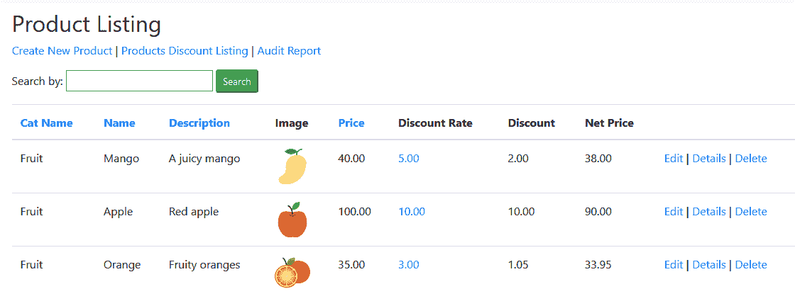

前往 `ProductController` 中的 `Index` 方法并修改参数。现在 `Index` 方法看起来是这样的：

```cs
public IActionResult Index([FromQuery]Sort sort, string searchTerm)
{
    var products = _repositry.GetProducts(sort, searchTerm);
    return View(products.ToProductvm());
}
```

同样，我们还需要更新 `InventoryRepository` 和 `InventoryRepository` 中 `GetProducts()` 方法的参数。以下为 `InventoryRepository` 类的代码：

```cs
private IEnumerable<Product> ListProducts(string searchTerm = "")
{
    var includableQueryable = _inventoryContext.Products.Include(c => c.Category).ToList();
    if (!string.IsNullOrEmpty(searchTerm))
    {
        includableQueryable = includableQueryable.Where(x =>
            x.Name.Contains(searchTerm) || x.Description.Contains(searchTerm) ||
            x.Category.Name.Contains(searchTerm)).ToList();
    }

    return includableQueryable;
}
```

现在，通过从 Visual Studio 按下 *F5* 并导航到产品列表中的筛选/搜索选项来运行项目。为此，请参阅以下快照：


在输入您的搜索词后，点击搜索按钮，这将给出以下快照所示的结果：


在前面的产品列表截图中，我们使用`searchTerm` `mango`筛选产品记录，并产生单个结果，如前一个快照所示。在搜索数据的方法中存在一个问题：添加`fruit`作为搜索词，看看会发生什么。它将产生零个结果。这在前面的快照中得到了演示：


我们没有得到任何结果，这意味着当我们把`searchTerm`放在小写时，我们的搜索不起作用。这意味着我们的搜索是区分大小写的。我们需要更改我们的代码来启动它。

这是我们的修改后的代码：

```cs
var includableQueryable = _inventoryContext.Products.Include(c => c.Category).ToList();
if (!string.IsNullOrEmpty(searchTerm))
{
    includableQueryable = includableQueryable.Where(x =>
        x.Name.Contains(searchTerm, StringComparison.InvariantCultureIgnoreCase) ||
        x.Description.Contains(searchTerm, StringComparison.InvariantCultureIgnoreCase) ||
        x.Category.Name.Contains(searchTerm, StringComparison.InvariantCultureIgnoreCase)).ToList();
}
```

我们忽略了大小写，使我们的搜索不区分大小写。我们使用了`StringComparison.InvariantCultureIgnoreCase`并忽略了大小写。现在我们的搜索将可以处理大写或小写字母。以下是一个使用小写`fruit`产生结果的快照：


在 FlixOne 应用程序扩展的先前的讨论中，我们应用了`排序`和`筛选`；现在我们需要添加`分页`。为了做到这一点，我们添加了一个名为`PagedList`的新类，如下所示：

```cs
public class PagedList<T> : List<T>
{
    public PagedList(List<T> list, int totalRecords, int currentPage, int recordPerPage)
    {
        CurrentPage = currentPage;
        TotalPages = (int) Math.Ceiling(totalRecords / (double) recordPerPage);

        AddRange(list);
    }
}
```

现在，按照以下方式更改`ProductController`的`Index`方法的参数：

```cs
public IActionResult Index([FromQuery] Sort sort, string searchTerm, 
    string currentSearchTerm,
    int? pagenumber,
    int? pagesize)
```

将以下代码添加到`Index.cshtml`页面：

```cs
@{
    var prevDisabled = !Model.HasPreviousPage ? "disabled" : "";
    var nextDisabled = !Model.HasNextPage ? "disabled" : "";
}

<a asp-action="Index"
   asp-route-sortOrder="@ViewData["CurrentSort"]"
   asp-route-pageNumber="@(Model.CurrentPage - 1)"
   asp-route-currentFilter="@ViewData["currentSearchTerm"]"
   class="btn btn-sm btn-success @prevDisabled">
    Previous
</a>
<a asp-action="Index"
   asp-route-sortOrder="@ViewData["CurrentSort"]"
   asp-route-pageNumber="@(Model.CurrentPage + 1)"
   asp-route-currentFilter="@ViewData["currentSearchTerm"]"
   class="btn btn-sm btn-success @nextDisabled">
    Next
</a>
```

上述代码使得我们的屏幕可以移动到下一页或前一页。我们的最终屏幕将看起来像这样：

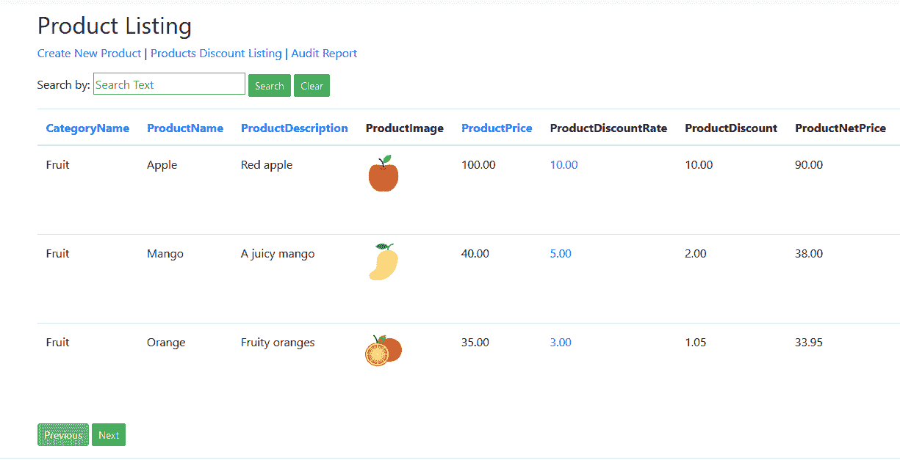

在本节中，我们通过实现`排序`、`分页`和`筛选`功能，讨论并扩展了我们的 FlixOne 应用程序的特性。本节的目标是让您亲身体验一个实际运行的应用程序。我们的应用程序代码编写得可以直接应用于现实世界。通过前面的增强，我们的应用程序现在能够提供可排序、分页和筛选的产品列表。

# 模式和实践 – MVVM

在第六章，*实现 Web 应用程序的设计模式 - 第一部分*中，我们讨论了**MVC**模式并创建了一个基于此的应用程序。

Ken Cooper 和 Ted Peters 是 MVVM 模式发明的背后名字。在发明这个模式的时候，Ken 和 Ted 都是微软公司的架构师。他们创建这个模式是为了简化事件驱动编程的 UI。后来，这个模式在**Windows Presentation Foundation**（**WPF**）和**Silverlight**中得到了实现。

MVVM 模式由 John Gossman 在 2005 年宣布。John 在其关于构建 WPF 应用程序的博客中讨论了此模式。链接为[`blogs.msdn.microsoft.com/johngossman/2005/10/08/introduction-to-modelviewviewmodel-pattern-for-building-wpf-apps/`](https://blogs.msdn.microsoft.com/johngossman/2005/10/08/introduction-to-modelviewviewmodel-pattern-for-building-wpf-apps/)。

MVVM 被认为是 MVC 的变体之一，以满足现代**用户界面**（**UI**）开发方法，其中 UI 开发是设计师/UI 开发者的核心责任，而不是应用开发者。在这种开发方法中，一个图形爱好者设计师可能或可能不会关心应用的开发部分。通常，设计师（UI 人员）使用各种工具使 UI 更具吸引力。UI 可以通过简单的 HTML、CSS 等实现，使用 WPF 或 Silverlight 的丰富控件。

**Microsoft Silverlight** 是一个帮助开发具有丰富 UI 的应用的框架。许多开发者将其视为 Adobe Flash 的替代品。2015 年 7 月，微软宣布将不再支持 Silverlight。微软在其 Build 大会上宣布了对 .NET Core 3.0 中 WPF 的支持（[`developer.microsoft.com/en-us/events/build`](https://developer.microsoft.com/en-us/events/build)）。还可以在这里找到更多关于支持 WPF 计划的博客文章：[`devblogs.microsoft.com/dotnet/net-core-3-and-support-for-windows-desktop-applications/`](https://devblogs.microsoft.com/dotnet/net-core-3-and-support-for-windows-desktop-applications/)。

MVVM 模式可以通过其各种组件进行详细阐述如下：

+   **模型**：存储数据，不关心应用中的任何业务逻辑。我更喜欢将其称为领域对象，因为它持有我们正在工作的应用的实际数据。换句话说，我们可以这样说，模型不负责使数据变得美观。例如，在我们 FlixOne 应用的产品模型中，产品模型持有各种属性的值，并通过名称、描述、类别名称、价格等来描述产品。这些属性包含产品的实际数据，但模型不负责对任何数据进行行为上的更改。例如，我们的产品模型格式化产品描述以在 UI 上看起来完美并不是其责任。另一方面，我们中的许多模型包含验证和其他计算属性。主要挑战是维护一个纯净和清洁的模型，这意味着模型应该类似于现实世界的模型。在我们的案例中，我们的 `product` 模型被称为**清洁模型**。一个清洁模型是类似于真实产品的实际属性的模型。例如，如果 `Product` 模型存储水果的数据，那么它应该显示如水果的颜色等属性。以下代码来自我们想象中的应用的一个模型：

```cs
export class Product {
  name: string;
  cat: string; 
  desc: string;
}
```

注意，前面的代码是用 Angular 编写的。我们将在下一节中详细讨论 Angular 代码，即*实现 MVVM*。

+   **视图**：这是为最终用户通过 UI 访问的数据表示。它简单地显示数据的值，这个值可能已经格式化，也可能没有。例如，我们可以在 UI 上显示折扣率为 18%，而在模型中它会被存储为 18.00。视图还可以负责行为变化。视图接受用户输入；例如，可能会有一个视图提供一个表单/屏幕来添加新产品。此外，视图可以管理用户输入，如按键、检测关键词等。它也可以是主动视图或被动视图。接受用户输入并根据用户输入操作数据模型（属性）的视图是主动视图。被动视图是没有任何操作的视图。换句话说，与模型不关联的视图是被动视图，这种视图由控制器操作。

+   **视图模型**：它作为视图和模型之间的中间人工作。其责任是使展示更佳。在我们之前的例子中，视图显示折扣率为 18%，但模型中的折扣率为 18.00，视图模型的职责是将 18.00 格式化为 18%，以便视图可以显示格式化后的折扣率。

如果我们将所有讨论的点结合起来，我们可以可视化整个 MVVM 模式，如下面的图所示：


上述图是 MVVM 的图形视图，它显示**视图模型**将**视图**和**模型**分开。**视图模型**还维护`状态`和`执行`操作。这有助于**视图**向最终用户展示最终输出。视图是 UI，它获取数据并向最终用户展示。在下一节中，我们将使用 Angular 实现 MVVM 模式。

# MVVM 实现

在上一节中，我们了解了 MVVM 模式是什么以及它是如何工作的。在本节中，我们将使用我们的 FlixOne 应用程序并使用 Angular 构建一个应用程序。为了演示 MVVM 模式，我们将使用基于 ASP.NET Core 2.2 构建的 API。

启动 Visual Studio 并从`FlixOneMVVM`文件夹中打开 FlixOne 解决方案。运行`FlixOne.API`项目，您将看到以下 Swagger 文档页面：

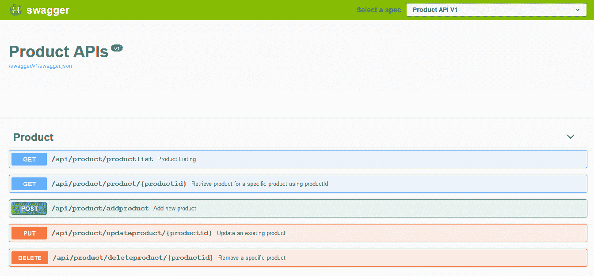

上述截图是我们产品 API 文档的快照，其中我们集成了 Swagger 用于 API 文档。如果您愿意，您可以从这个屏幕测试 API。如果 API 返回结果，那么您的项目已成功设置。如果没有，请检查此项目的先决条件，并检查 Git 仓库中此章节的`README.md`文件。我们拥有构建新 UI 所需的一切；如前所述，我们将创建一个 Angular 应用程序来消费我们的产品 API。要开始，请按照以下步骤操作：

1.  打开“解决方案资源管理器”。

1.  右键单击 FlixOne 解决方案。

1.  点击“添加新项目”。

1.  从“添加新项目”窗口中，选择 ASP.NET Core Web 应用程序。命名为 FlixOne.Web，然后单击“确定”。完成后，参考以下截图：


1.  在下一个窗口中，选择 Angular，确保您已选择 ASP.NET Core 2.2，然后单击“确定”，并参考以下截图：

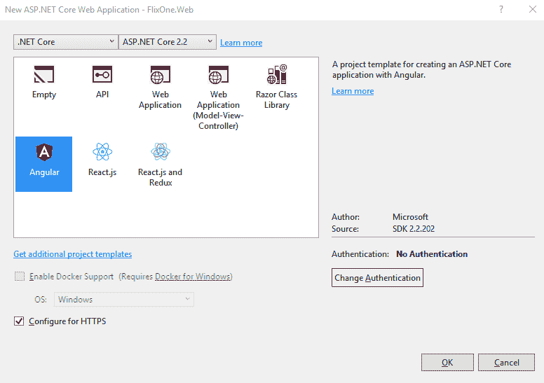

1.  打开解决方案资源管理器，您将找到新的`FlixOne.Web`项目和文件夹结构，它看起来像这样：


1.  从解决方案资源管理器中，右键单击 FlixOne.Web 项目，然后单击“设置为启动项目”，然后参考以下截图：


1.  运行`FlixOne.Web`项目并查看输出，它将类似于以下截图：

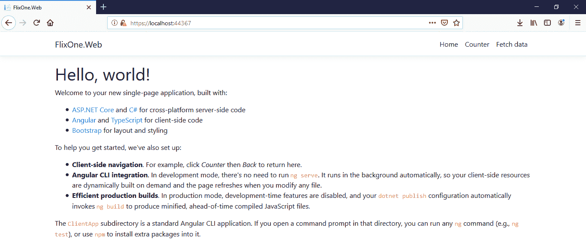

我们已成功设置我们的 Angular 应用程序。返回您的 Visual Studio 并打开输出窗口。参考以下截图：


您将在输出窗口中找到`ng serve "--port" "60672"`；这是一个告诉 Angular 应用程序监听和服务的命令。从解决方案资源管理器打开`package.json`文件；此文件属于`ClientApp`文件夹。您会注意到`"@angular/core": "6.1.10"`，这意味着我们的应用程序是基于`angular6`构建的。

以下是我们`product.component.html`的代码（这是一个视图）：

```cs
<table class='table table-striped' *ngIf="forecasts">
  <thead>
    <tr>
      <th>Name</th>
      <th>Cat. Name (C)</th>
      <th>Price(F)</th>
      <th>Desc</th>
    </tr>
  </thead>
  <tbody>
    <tr *ngFor="let forecast of forecasts">
      <td>{{ forecast.productName }}</td>
      <td>{{ forecast.categoryName }}</td>
      <td>{{ forecast.productPrice }}</td>
      <td>{{ forecast.productDescription }}</td>
    </tr>
  </tbody>
</table>
```

从 Visual Studio 运行应用程序，然后单击“产品”，您将获得一个类似于以下的产品列表屏幕：


在本节中，我们创建了一个小的 Angular 演示应用程序。

# 摘要

本章的目标是通过讨论其原理和响应式编程模型来帮助您理解响应式编程。响应式编程的核心是数据流，我们通过示例进行了讨论。我们扩展了第八章，*在.NET Core 中的并发编程*中的示例，其中我们讨论了在会议中票务收集计数器的用例。

在我们的响应式宣言讨论中，我们探讨了响应式系统。我们通过展示`merge`、`filter`和`map`操作，以及通过示例说明流的工作方式来讨论响应式系统。我们还通过示例讨论了`IObservable`接口和 Rx 扩展。

我们继续使用`FlixOne`库存应用程序，并讨论了实现产品库存数据的分页和排序的用例。最后，我们讨论了 MVVM 模式，并在 MVVM 架构上创建了一个小型应用程序。

在下一章（第十一章，*高级数据库设计和应用技术*）中，将探讨高级数据库和应用技术，包括应用**命令查询责任分离**（**CQRS**）和账本式数据库。

# 问题

以下问题将帮助您巩固本章包含的信息：

1.  什么是流？

1.  什么是响应式属性？

1.  什么是响应式系统？

1.  合并两个响应式流意味着什么？

1.  什么是 MVVM 模式？

# 进一步阅读

要了解更多关于本章涵盖的主题，请参考以下书籍。这本书将为您提供各种深入和实用的响应式编程练习：

+   《.NET 开发者的响应式编程》，作者：*Antonio Esposito* 和 *Michael Ciceri*，Packt Publishing：[`www.packtpub.com/web-development/reactive-programming-net-developers`](https://www.packtpub.com/web-development/reactive-programming-net-developers)
