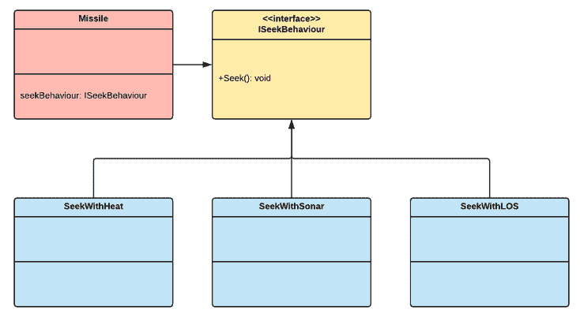

# 第七章：策略

策略是那些其名称并不明确表示其意图的模式之一。这种不确定性可能会使其难以理解和记忆其目的。但策略模式相当简单：它提供了一种在运行时动态选择算法并将它们分配给对象的方法。我们可以想象策略模式就像一个大师棋手，分析棋盘并根据上下文选择最佳策略。

本章将涵盖以下主题：

+   策略模式的基础

+   使用策略模式实现一系列导弹的寻的行为的实现

# 技术要求

本章是一个实践性章节，因此你需要对 Unity 和 C#有一个基本的了解。

我们将使用以下特定的 Unity 引擎和 C#语言概念：

+   组合优于继承

如果不熟悉这个概念，请在开始本章之前复习它们。

本章的代码文件可以在 GitHub 上找到：

[`github.com/PacktPublishing/Hands-On-Game-Development-Patterns-with-Unity-2018`](https://github.com/PacktPublishing/Hands-On-Game-Development-Patterns-with-Unity-2018)

查看以下视频以查看代码的实际运行情况：

[`bit.ly/2UlVjVG`](http://bit.ly/2UlVjVG)

# 策略模式概述

策略模式的根本目标是将选择使用哪种算法的决定推迟到运行时。这种方法使得实现逻辑和行为的代码段更加灵活和可重用。这个想法可能听起来非常复杂，但它是一个简单的机制，这是由于面向对象编程中的*组合*概念所实现的。因此，我们不是通过在可以被其他类继承的父类中实现它们来共享可重用的算法，而是将每个算法封装成独立的*组件*，在运行时将这些组件附加到对象上。

如果这听起来很熟悉，并且与 Unity 的组件系统工作方式相似，那是因为引擎采用了面向对象编程中的*组合优于继承*方法。因此，这使得策略模式与 Unity 的架构相协调。

让我们回顾一下这个模式的简单图示：



正如我们所看到的，这个策略模式的例子实现了一个接口，允许我们将各种寻的行為分配给任何**导弹**类型的对象。但像大多数模式一样，仅通过查看 UML 图很难理解其设计。因此，我们只能通过在代码中实现它，才能真正理解这个模式背后的机制，我们将在下一节中看到。

在本章中，我们经常使用算法、逻辑和行为这些术语作为同义词，因为在策略模式的上下文中，它们可以作为独立的组件进行管理。

# 优点和缺点

策略模式享有良好的声誉，但像大多数复杂的模式一样，其复杂性可能导致一些缺点。

这些是好处：

+   **替代子类化**：因为它侧重于组合而非继承，策略提供了一种避免在父类型每个子类中硬编码行为的方法

+   **减少条件语句管理**：通过将每个行为实现为可以由策略模式管理的单独组件，当处理复杂上下文行为选择时，消除了需要长条件语句的需求

这里是缺点：

+   **客户端必须了解各种策略**：策略模式没有从客户端抽象出来，因此客户端必须了解不同的策略以及如何调用它们

+   **增加代码复杂性**：这种复杂模式的常见缺点是它确实增加了要管理的类和对象的数量

许多程序员犹豫使用复杂模式的主要原因是他们担心团队中的初级成员可能会迷失在它给代码库增加的复杂性中。因此，重要的是要绘制和记录代码的复杂部分，并列出你正在使用的实现系统的模式。

# 用例示例

对于这个用例，让我们假设我们正在开发一个军事模拟游戏，并且我们被分配实现导弹寻家系统的以下行为：

+   **Heat**：导弹通过其热特征来寻找目标

+   **Sonar**：导弹使用声波传播来寻找目标

+   **GPS**：导弹使用 GPS 坐标来定位目标

设计文档还强调，将有三种类型的导弹使用寻家系统。但到目前为止，尚未决定哪种导弹将使用哪种寻家系统：

+   **Tomahawk**：通常从航母发射

+   **SideWinder**：它们是为喷气式战斗机设计的

+   **Torpado**：它们被设计用来摧毁水下目标

因此，我们现在必须做出技术选择：

+   我们是否在每个导弹类型的类中硬编码每种寻求行为？

+   我们是否编写一个包含所有导弹寻求行为的单一寻家系统类？

+   我们是否相反地编写每个导弹寻求行为作为一个单独的组件，我们可以将其动态地附加到任何导弹上？

第三个选项是最好的，因为它消除了任何重复的代码，并以组合的形式提供了灵活性。在下一节中，我们将实现这个用例，并看看策略模式如何为我们提供很多可扩展性。

好的代码是灵活的，永远不会僵化。僵化可能看起来更稳定，但它使更改变得困难和昂贵。

# 代码示例

我们将使这个例子非常简单，这样我们就可以专注于理解策略模式，而不是迷失在冗长的描述中。让我们遵循以下步骤：

1.  让我们首先实现使这个模式工作的重要元素，即用于访问寻求行为的接口：

```cs
public interface ISeekBehaviour
{
    void Seek();
}
```

现在我们为所有的寻求行为提供了一个标准接口，让我们在单个具体类中实现它们。

1.  我们第一个是 `SeekWithGPS` 行为，如下所示：

```cs
using UnityEngine;

public class SeekWithGPS : ISeekBehaviour
{
    public void Seek()
    {
        Debug.Log("Seeking target with GPS coordinates.");
    }
}
```

1.  我们有 `SeekWithHeat` 行为，如下所示：

```cs
using UnityEngine;

public class SeekWithHeat : ISeekBehaviour
{
    public void Seek()
    {
        Debug.Log("Seeking target with heat signature.");
    }
}
```

1.  最后，我们有我们的 `SeekWithSonar` 行为，如下所示：

```cs
using UnityEngine;

public class SeekWithSonar : ISeekBehaviour
{
    public void Seek()
    {
        Debug.Log("Seeking with sonar.");
    }
}
```

因此，现在我们已经将每种寻求行为封装到单独的类中，下一步就是找到一种方法将它们动态地分配给导弹。

1.  让我们编写一个抽象类，它将每种导弹与一个共同的父类分组，并允许我们为它们提供一个共享的接口，如下所示：

```cs
abstract public class Missile
{
    protected ISeekBehaviour seekBehavior;

    public void ApplySeek()
    {
        seekBehavior.Seek();
    }

    public void SetSeekBehavior(ISeekBehaviour seekType)
    {
        this.seekBehavior = seekType;
    }
}
```

有两个关键点需要注意：`ApplySeek()` 和 `SetSeekBehaviour()` 函数将应用指定的行为到任何从 `Missile` 类派生的导弹类型。我们为自己提供了一个访问所有导弹类型的单一入口点，以及动态应用寻求行为的方法。让我们看看这在我们的具体导弹类中是如何表现的。

1.  我们从我们的 `Torpedo` 开始。默认情况下，让我们给它 `SeekWithSonar` 行为，如下所示：

```cs
public class Torpedo : Missile
{
    void Awake()
    {
        this.seekBehavior = new SeekWithSonar();
    }
}
```

1.  接下来是我们的 `SideWinder`。我们应该给它 `SeekWithHeat` 行为，如下所示：

```cs
public class SideWinder : Missile
{
    void Awake()
    {
        this.seekBehavior = new SeekWithHeat();
    }
}
```

1.  我们最后的导弹类型将是 `Tomahawk`。让我们给它 `SeekWithGPS` 行为，因为它是一种远程导弹，如下所示：

```cs
public class Tomahawk : Missile
{
 void Awake()
 {
 this.seekBehavior = new SeekWithGPS();
 }
}
```

我们可以注意到，每个具体的导弹类在 `Awake()` 方法中将寻求行为的实例分配给 `this.seekBehaviour`，这是因为我们想要确保每种导弹类型在初始化时都与一个默认的寻求行为相关联。

1.  我们将在我们的 `Client` 类示例中看到，我们可以在任何时候重新分配一个新的行为给导弹，如下所示：

```cs
using UnityEngine;

public class Client : MonoBehaviour
{
    void Update()
    {
        if (Input.GetKeyDown(KeyCode.D))
        {
            // Applying default seeking behaviour to missiles.
            Missile sideWinder = ScriptableObject.CreateInstance<SideWinder>();
            sideWinder.ApplySeek();

            Missile tomahawk = ScriptableObject.CreateInstance<Tomahawk>();
            tomahawk.ApplySeek();

            Missile torpedo = ScriptableObject.CreateInstance<Torpedo>();
            torpedo.ApplySeek();

            // Applying custom seeking behaviour to a SideWinder.
            Missile sideWinderWithSonar = ScriptableObject.CreateInstance<SideWinder>();
            ISeekBehaviour sonar = new SeekWithSonar();
            sideWinderWithSonar.SetSeekBehavior(sonar);
            sideWinderWithSonar.ApplySeek();
        }
    }
}
```

如我们所见，我们现在能够动态地将寻求行为附加到任何导弹上。这种机制是有益的，因为它意味着我们可以在飞行途中切换导弹的寻求行为；这是一个在游戏中非常酷的功能。

# 摘要

我们刚刚学习了如何通过构建一系列可以在运行时附加到任何导弹上的目标寻求行为来实现策略模式。从这个模式中，我们学到的很重要的一点是将行为隔离到可以动态分配给对象的单独类中的重要性。这种方法已经成为良好架构的支柱，并且在游戏程序员中非常受欢迎。

在下一章中，我们将探讨命令模式，这是一种经常用于管理事件触发的行为模式。

# 实践

在前面的代码示例中，我们只实现了一个简单的导弹目标搜索行为的原型，以保持章节长度合理并专注于学习策略模式背后的核心概念。然而，完成这些目标行为的实现并构建一个可以动态切换导弹制导系统从热、声纳或 GPS 搜索行为的发射系统演示将是一个很好的练习。

# 进一步阅读

+   组合优于继承：

    [组合优于继承](https://en.wikipedia.org/wiki/Composition_over_inheritance)
