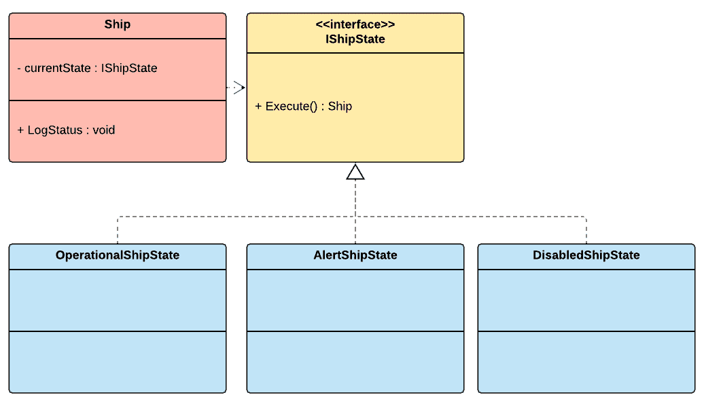

# 第十章：状态

在视频游戏中，对象会根据可能由玩家或游戏机制触发的事件不断从一个状态转换到另一个状态。

因此，游戏程序员的主要职责之一是实现一系列有限状态和行为，这些状态和行为从**非玩家角色**（NPC）到武器不等。这些任务必须以可维护和可配置的方式进行，以便设计团队能够单独调整每个状态行为，直到游戏感觉平衡。

状态模式正是为了通过提供一种简单的方式来封装行为到代表对象特定状态的独立类中，从而精确地设计来达成这一目标。

本章将涵盖以下主题：

+   状态模式的基本原理

+   为涉及太空船的游戏实现有限状态集合

# 技术要求

下一章将涉及实践操作，因此你需要对 Unity 和 C# 有一个基本的了解。

我们将使用以下 Unity 特定引擎和 C# 语言概念：

+   接口

如果你对这个概念不熟悉，请在继续本章之前进行复习。

本章的代码文件可以在 GitHub 上找到：

[`github.com/PacktPublishing/Hands-On-Game-Development-Patterns-with-Unity-2018`](https://github.com/PacktPublishing/Hands-On-Game-Development-Patterns-with-Unity-2018)

观看以下视频以查看代码的实际操作：

[`bit.ly/2UfzpTD`](http://bit.ly/2UfzpTD)

# 状态模式的基本原理

在某种程度上，状态模式与策略模式非常相似，因为它允许我们在运行时将行为应用到特定的对象上。核心区别在于，当我们需要管理对象的内部状态时使用状态模式，而策略模式则侧重于根据运行时上下文选择正确的算法来执行。

在太空船项目类结构中，以下图表显示了状态类（`NormalShipState`、`AlertShipState` 和 `DisabledShipState`）具有标准接口，允许 `Ship` 类调用特定状态的行为：



正如我们将在代码示例中看到的，状态模式背后的概念与其实际实现一样简单，因为它为我们提供了一种封装行为并应用它们的方法，而不必依赖于长条件语句。

# 优点和缺点

确定状态模式的共同缺点可能具有挑战性，因为状态管理是游戏开发的基础，因此我们可以认为这个模式是基本的，不能被忽视。

使用状态模式的以下是一些优点：

+   **封装的行为**：状态模式允许我们将一个实体的行为实现为一个自包含的组件集合，当对象状态改变时，这些组件可以动态地附加到对象上。

+   **条件块减少**：使用状态模式可以减少对大量`if-else`条件或切换情况的需求，因为行为可以根据对象的内部或全局状态变化动态分配。

只有一个缺点：

+   **代码复杂性**：实现模式有时会导致代码库冗长，并且由于封装和高度定义的结构，类数量增加

# 使用案例示例

假设我们正在制作一个游戏，玩家控制一艘飞船。我们的首席设计师仍在头脑风暴关于飞船在游戏中具体能做什么的想法。但他们要求我们实现至少三个核心状态，我们的飞船可以根据与敌舰太空战的战果处于这些状态之一：

+   **正常**：玩家的飞船正常运行

+   **警报**：一艘敌舰正在接近并准备攻击

+   **禁用**：玩家的飞船在战斗中被击败，目前无法移动或反击

在每个状态下，都有特定的一组行为和行动供船员执行：

+   **正常**：船员回到他们的默认位置并执行分配的任务

+   **警报**：船员跑向他们的指定战斗位置

+   **禁用**：船员跑向逃生舱并放弃船只

关于这个列表最重要的一点是它非常通用，这意味着我们可以编写这些状态和行为，以便将它们附加到我们游戏中任何类型的飞船上，包括敌舰。正如我们将在下面的代码示例中看到的，状态模式允许我们将行为与实体解耦，这也是为什么实体可以轻松地在状态之间切换的原因。

# 代码示例

如使用案例示例中所述，我们将为我们的飞船实现一系列有限的状态：

1.  让我们先实现一个接口，用于定义我们的状态：

```cs
public interface IShipState
{
    void Execute(Ship ship);
}
```

如您所见，`Execute`函数接收一个`Ship`类型的实体。这个声明意味着我们将能够将我们的状态附加到任何飞船上并执行，这使得我们的代码非常模块化和可扩展。

1.  现在我们将定义每个状态并添加一些上下文代码到`Execute()`方法中：

```cs
public class NormalShipState : IShipState
{
    public void Execute(Ship ship)
    {
        ship.LogStatus("NORMAL: ship operating as normal.");
    }
}
```

`正常`状态是我们的默认状态，它执行正常运行的飞船的行为。

1.  接下来是`警报`状态。在这种情况下，飞船的船员和系统都会发出警报：

```cs
public class AlertShipState : IShipState
{
    public void Execute(Ship ship)
    {
        ship.LogStatus("ALERT: all hands on deck.");
    }
}
```

1.  最后，是`禁用`状态。这意味着飞船无法移动，船员正在逃离：

```cs
public class DisabledShipState : IShipState
{
    public void Execute(Ship ship)
    {
        ship.LogStatus("DISABLED: crew jumping ship.");
    }
}
```

对于我们的代码示例，我们通过仅实现一些控制台输出以指示当前状态来简化事情，但在实际项目中，我们可以轻松触发每个状态变化的声音提示、粒子效果和动画。

1.  现在我们已经收集了一组可以附加到飞船上的状态。下一步，让我们编写`Ship`类的具体实现：

```cs
using UnityEngine;

public class Ship : MonoBehaviour
{
    private IShipState m_CurrentState;

    void Awake ()
    {
        m_CurrentState = new NormalShipState();
        m_CurrentState.Execute(this);
    }

    public void Normalize()
    {
        m_CurrentState = new NormalShipState();
        m_CurrentState.Execute(this);
    }

    public void TriggerRedAlert()
    {
        m_CurrentState = new AlertShipState();
        m_CurrentState.Execute(this);
    }

    public void DisableShip()
    {
        m_CurrentState = new DisabledShipState();
        m_CurrentState.Execute(this);
    }

    public void LogStatus(string status)
    {
        Debug.Log(status);
    }
}
```

让我们回顾一下我们使用此模式所取得的成果：

+   我们消除了管理飞船状态行为之间转换所需的 switch cases 或`if-elses`。

+   我们将飞船的行为解耦成可以动态附加到任何类型飞船的自包含组件。

这些小的好处给了我们相当大的灵活性，现在我们可以将行为作为单独的组件来编写。这意味着我们可以让一位同事专注于`Alert`状态，而另一位重构`Disabled`状态，而不会相互干扰。

1.  我们代码示例的最后部分是我们的`Client`类，我们将使用它通过用户的输入来触发每个状态以测试它们：

```cs
using UnityEngine;

public class Client : MonoBehaviour
{
    public Ship ship;

    void Update()
    {
        if (Input.GetKeyDown("n"))
        {
            ship.Normalize();
        }

        if (Input.GetKeyDown("a"))
        {
            ship.TriggerRedAlert();
        }

        if (Input.GetKeyDown("d"))
        {
            ship.DisableShip();
        }
    }
}
```

在这个例子中，我们手动触发飞船的有限状态，但我们同样可以轻松地使用事件或健康系统来触发它们。换句话说，通过使用状态模式，我们获得了将多个状态行为附加到任何实体并动态通过任何机制触发的灵活性，而不必编写长而复杂的条件语句。

# 摘要

在这一章中，我们回顾了一个游戏开发的基础模式。我们现在有能力将状态行为封装成可以动态分配给对象的单独组件。我们减少了我们对长条件语句的依赖，并有一个与行为和状态管理相关的代码结构的一致方法。

在下一章中，我们将回顾访问者模式，这是一种独特的模式，它赋予我们解耦算法与对象结构的能力。

# 练习

在视频游戏中，为了使实体在行为上感觉不那么机械，一种常见的技巧是缓和状态之间的过渡。例如：当巡逻的敌人角色检测到玩家的角色时，它们不会立即从被动状态转变为攻击状态，而是在状态之间有一个简短的动画序列，显示敌人进入警戒姿态然后发起攻击。

作为练习，我建议尝试将过渡状态整合到宇宙飞船的每个有限状态之间，并找到一个使它们之间过渡无缝融合的解决方案。

# 进一步阅读

《*设计模式：可复用面向对象软件元素*》，作者 Erich Gamma、John Vlissides、Ralph Johnson 和 Richard Helm

([`www.informit.com/store/design-patterns-elements-of-reusable-object-oriented-9780201633610`](http://www.informit.com/store/design-patterns-elements-of-reusable-object-oriented-9780201633610))
