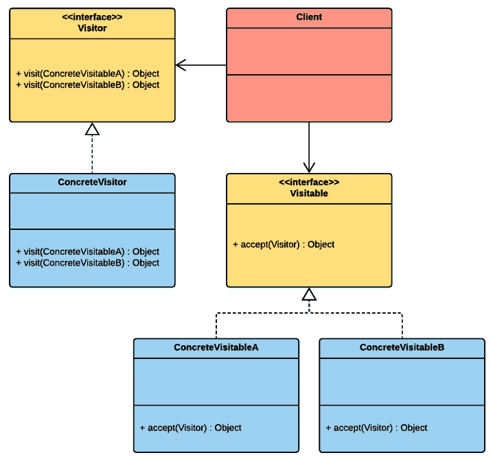

# 第十一章：访问者

我必须承认，我发现访问者模式很令人困惑，也很奇怪。我在理解这个模式背后的概念上挣扎了一段时间，主要是因为我很少使用它，而且我主要从学术来源阅读关于它的内容。但是，当我开始将对象不仅视为存储在堆中的数据块，而且视为可以被另一个对象访问和操作的结构时，我开始欣赏这个模式。这意味着可以在不修改对象结构的情况下对对象结构的元素执行特定操作。这种方法在需要实现需要遍历层次结构并对单个节点执行特定操作的系统时非常有用。

本章将涵盖以下主题：

+   访问者模式背后的基本原理

+   实现一个单臂工厂机器人的模拟

# 技术要求

本章是实践性的。你需要对 Unity 和 C#有基本的了解。

我们将使用以下 Unity 引擎和 C#语言概念：

+   接口

如果你对这个概念不熟悉，请在开始本章之前复习它。

本章的代码文件可以在 GitHub 上找到：

[`github.com/PacktPublishing/Hands-On-Game-Development-Patterns-with-Unity-2018`](https://github.com/PacktPublishing/Hands-On-Game-Development-Patterns-with-Unity-2018)

查看以下视频以查看代码的实际操作：

[`bit.ly/2OsR6d6`](http://bit.ly/2OsR6d6)

# 访问者模式概述

一旦你掌握了它，访问者模式的主要目的就很简单；一个**可访问**对象允许访问者对象对其结构中的特定元素进行操作。这允许被访问的对象从访问者那里接收新的功能。

这种描述一开始可能看起来非常抽象，但如果你想象一个对象是一个数据结构，而不是一个封闭的数据和逻辑容器，那么它就更容易可视化。有了这个想法，你可以看到在操作对象的方式上有更广泛的可能性。

在以下图中，我们可以可视化这些原则：



这个模式中有两个关键参与者：

+   **访问者**是具体访问者的接口

+   **可访问**是接受访问者的对象的接口

# 优点和缺点

访问者模式不像单例模式或依赖注入模式那样流行，因此围绕其优点和缺点的争议较少，如下列所示：

以下是一些优点：

+   **数据与逻辑分离**：访问者模式提供了一种将对象的数据结构与其行为解耦的方法。这种方法通过仅添加更多访问者来扩展对象功能变得更容易。

+   **双重分派**：访问者模式提供了在运行时根据给定参数的类型选择使用哪个方法的能力，从而使代码更加动态。

以下是一些缺点：

+   **代码复杂性**：访问者模式最明显的缺点是它使代码更加晦涩。一个不熟悉访问者模式复杂性的程序员可能会很容易迷失方向。

+   **不灵活性**：访问者模式不是一个容易使用的模式，并且在其实现中需要一致性。一旦集成到代码库中，它也可能很难移除，因此这可能是一个长期承诺。

# 用例示例

我们将使我们的用例简单，这样我们在尝试掌握访问者模式的复杂性时不会迷失在抽象层中。想象一下，我们正在做一个项目，需要设计一个机械臂的交互式机器人模拟。

机器人非常模块化，主要由各种组件组成。因此，我们希望我们的代码能够反映这一点，使我们能够动态地将单个组件附加到我们的骨架机器人对象上。为了实现这一点，我们将使用访问者模式，因为它为我们提供了一种在不直接修改对象结构的情况下动态向对象结构添加元素的方法。

# 代码示例

现在，是时候实现我们的单臂机器人了，通过附加它操作所需的所有组件，而不修改其基本结构：

1.  让我们先实现访问者接口，在其中我们声明我们将要操作的那些机器人部件：

```cs
public interface IRobotPartVisitor
{
    void Visit(Robot robot);
    void Visit(Battery battery);
    void Visit(MechanicalArm mechanicalArm);
    void Visit(ThermalImager thermalImager);
}
```

1.  为了帮助我们理解这个模式，让我们实现两个具体的访问者模式，如下所示；第一个访问所有我们的机器人部件并将它们打开，而另一个则关闭它们：

+   `RobotPartActivateVisitor`：

```cs
using UnityEngine;

public class RobotPartActivateVisitor : IRobotPartVisitor
{
    public void Visit(Robot robot)
    {
        Debug.Log("Robot waking up.");
    }

    public void Visit(Battery battery)
    {
        Debug.Log("Battery is charged up.");
    }

    public void Visit(MechanicalArm mechanicalArm)
    {
        Debug.Log("The mechanical arm is actiaved.");
    }

    public void Visit(ThermalImager thermalImager)
    {
        Debug.Log("The thermal imager is turned on.");
    }
}
```

+   `RobotPartShutdownVisitor`：

```cs
using UnityEngine;

public class RobotPartShutdownVisitor : IRobotPartVisitor
{
    public void Visit(Robot robot)
    {
        Debug.Log("Robot is going back to sleep.");
    }

    public void Visit(Battery battery)
    {
        Debug.Log("Battery is charging down.");
    }

    public void Visit(MechanicalArm mechanicalArm)
    {
        Debug.Log("The mechanical arm is folding back to it's default position.");
    }

    public void Visit(ThermalImager thermalImager)
    {
        Debug.Log("The thermal imager is turned off.");
    }
}
```

如您所见，到目前为止这相当直接；我们为每个机器人部件都有一个`Visit()`函数。这种方法允许我们单独操作它们。

1.  现在我们已经准备好了访问者，是时候实现我们的可访问者了。让我们先编写我们的`Visitable`接口：

```cs
public interface IRobotPart
{
    void Accept(IRobotPartVisitor robotPartVisitor);
}
```

1.  现在让我们实现我们的具体可访问者：

+   `Battery`：

```cs
public class Battery : IRobotPart
{
    public void Accept(IRobotPartVisitor robotPartVisitor)
    {
        robotPartVisitor.Visit(this);
    }
}
```

+   `ThermalImager`：

```cs
public class ThermalImager : IRobotPart
{
    public void Accept(IRobotPartVisitor robotPartVisitor)
    {
        robotPartVisitor.Visit(this);
    }
}
```

+   `MechanicalArm`：

```cs
public class MechanicalArm : IRobotPart
{
    public void Accept(IRobotPartVisitor robotPartVisitor)
    {
        robotPartVisitor.Visit(this);
    }
}
```

注意我们在`Accept()`函数中如何引用访问者接口。这段代码使得我们的访问者能够操作我们的可访问者。

1.  是时候构建我们的`Robot`了，通过在其构造函数中引用它们来附加所有核心部件：

```cs
using UnityEngine;

public class Robot : IRobotPart
{
    private IRobotPart[] robotParts;

    public Robot()
    {
        robotParts = new IRobotPart[] { new MechanicalArm(), new ThermalImager(), new Battery() };
    }

    public void Accept(IRobotPartVisitor robotPartVisitor)
    {
        for (int i = 0; i < robotParts.Length; i++)
        {
            robotParts[i].Accept(robotPartVisitor);
        }
        robotPartVisitor.Visit(this);
    }
}
```

1.  最后，我们有我们的`Client`类，它通过实际触发访问者操作我们的机器人部件来充当一个概念验证：

```cs
using UnityEngine;

public class Client : MonoBehaviour
{
    void Update()
    {
        // Active robot
        if (Input.GetKeyDown(KeyCode.O))
        {
            IRobotPart robot = new Robot();
            robot.Accept(new RobotPartActivateVisitor());
        }

        // Shutdown robot
        if (Input.GetKeyDown(KeyCode.S))
        {
            IRobotPart robot = new Robot();
            robot.Accept(new RobotPartShutdownVisitor());
        }
    }
}
```

因此，我们已经实现了一个简单但灵活的访问者模式用例。需要注意的是，任何实现了`Accept()`函数的访问者都可以操作可访问对象。这种机制允许在不对对象直接修改的情况下对可访问对象执行各种操作。

# 概述

在本章中，我们回顾了访问者模式，这可能是本书中最高级的模式之一，因为它要求我们从不同的角度来处理面向对象编程，并开始将对象视为结构，而不是存在于堆上的抽象实体。现在我们可以运用所学知识，扩展访问者模式以实现需要操作复杂层次数据结构的系统，例如 XML 文件或目录树。

在下一章中，我们将回顾一个实用但简单的模式，这个模式在 Unity 中经常被过度使用，即外观模式（Façade pattern）。

# 实践练习

作为一项实际练习，我建议研究一下访问者模式（Visitor pattern）的高级用法。一个完美的例子是将访问者模式应用于导航和处理**抽象语法树**（Abstract Syntax Tree，**AST**）。这类实现可以展示访问者模式提供的架构可能性。

关于 AST 的信息，请参阅*进一步阅读*部分。

# 进一步阅读

+   *《深入设计模式》，作者：亚历山大·舒韦茨（Alexander Shvets）*

    [`refactoring.guru/design-patterns/book`](https://refactoring.guru/design-patterns/book)

+   *抽象语法树*

    [`en.wikipedia.org/wiki/Abstract_syntax_tree`](https://en.wikipedia.org/wiki/Abstract_syntax_tree)
