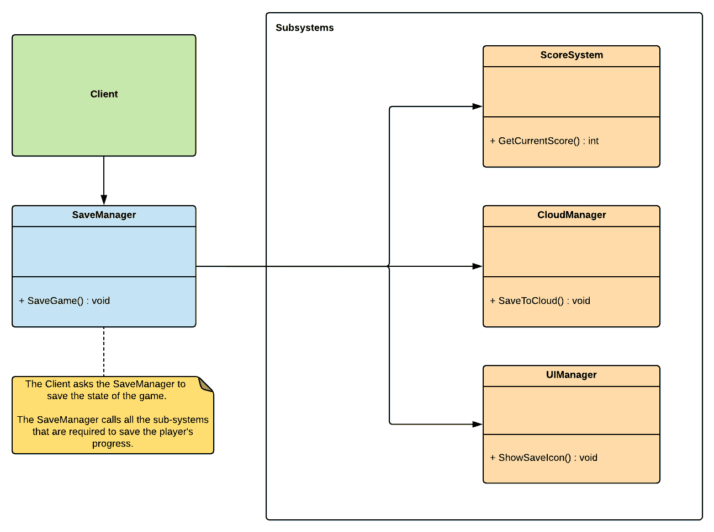

# 第十二章：外观

外观模式被认为是一种结构模式，因此，与这类模式的大多数模式一样，它主要关注识别建立对象之间简单关系的方法。外观模式是一个容易掌握的模式，因为其名称完美地体现了其设计。外观模式的主要意图是提供一个简化的前端接口，抽象出复杂系统的复杂内部工作。这种方法对游戏开发者来说是有益的，因为游戏主要是建立在复杂层次和交互系统之上的。

本章将涵盖以下主题：

+   我们将回顾外观模式的基础知识

+   我们将使用外观模式来实现一个保存系统

# 技术要求

这是一个实践章节，因此你需要对 Unity 和 C#有基本的了解。

我们将使用以下具体的 Unity 引擎和 C#语言概念：

+   单例

+   可序列化

如果你对这些概念不熟悉，请在开始本章之前复习它们。

本章的代码文件可以在 GitHub 上找到：

[`github.com/PacktPublishing/Hands-On-Game-Development-Patterns-with-Unity-2018`](https://github.com/PacktPublishing/Hands-On-Game-Development-Patterns-with-Unity-2018)

查看以下视频，了解代码的实际应用：

[`bit.ly/2I30suS`](http://bit.ly/2I30suS)

# 外观模式概述

外观模式的名字与建筑中的外观类似——正如其名所暗示的，它是一个隐藏复杂结构的表面。但是，与建筑不同，在软件开发中，外观模式的目标不是美化，而是简化。正如我们将在以下图中看到的，外观模式的实现通常仅限于一个充当复杂相互依赖子系统简化接口的单个类：



正如我们所看到的，当客户端调用`SaveManager`的`SaveGame()`函数时，会有一系列调用到各种依赖和子系统（即`ScoreSystem`、`CloudManager`和`UIManager`）。所有这些都在幕后发生；客户端并不知道需要调用多少个子系统来完成其请求。因此，为了保存当前游戏的状态，客户端只需要知道`SaveManager`类中有一个单一的功能，外观模式实现会在幕后完成剩余的工作。

# 优点和缺点

外观模式有一些实质性的优点，但也可能带来一些长期缺点：

**优点**如下：

+   **简化复杂代码体的接口**：一个稳固的外观类将隐藏复杂性和依赖关系，同时提供一个简化的接口

+   **所有依赖调用的本地化**：外观模式允许你将依赖关系本地化并分组到一个单独的类中

+   **简化重构**：将子系统之间的复杂性和依赖性问题隔离在门面类中简化了重构过程，因为您可以在不影响客户端的情况下独立重构它们，因为接口保持一致

以下是一些需要注意的**缺点**：

+   **隐藏混乱变得更容易**：拥有过多的门面类可以使程序员更容易通过使他们的架构看起来简单易用来掩盖糟糕的代码，同时将潜在的长远架构问题掩盖起来。

+   **过多的管理者**：门面类在 Unity 开发者中很受欢迎，他们通常通过结合单例和门面模式来实现它们。这种方法会导致一个成为全局可访问管理者的大量集合的架构。这种类型的设计变得非常难以测试和管理，因为所有管理者类都相互依赖。

门面建立了一个新的接口，而适配器则回收了一个旧的接口。在实现看起来和听起来可能相似的模式时，记住它们的目的不一定相同是很重要的。

# 一个用例示例

我们将使用门面和单例模式的组合来构建一个简单的*存档游戏*功能。我们的系统有几个步骤需要按特定顺序执行以完成保存玩家进度的过程。以下是步骤：

1.  触发**用户界面**（**UI**）反馈以指示游戏正在保存

1.  获取当前玩家的数据（健康、分数、ID）

1.  将玩家的数据保存到磁盘

1.  将存档上传到云

我们必须尊重前面步骤的特定顺序，因为我们不能在获取玩家当前状态之前将数据保存到磁盘。但是，每次我们想要在我们的脚本中实现存档游戏事件时，都必须手动以正确的顺序输入每个步骤，这既耗时又容易出错。因此，我们将使用门面模式为我们的存档游戏系统建立一个简单的可重用接口。

# 代码示例

正如我们将要看到的，门面模式很简单，所以我们将保持以下代码示例简单直接：

1.  首先，我们将为每个子系统的示例编写类：

+   `Player`：这个类代表我们的玩家组件：

```cs
using UnityEngine;

public class Player
{
    public int GetHealth()
    {
        return 10;
    }

    public int GetPlayerID()
    {
        return 007;
    }
}
```

+   `ScoreManager`：这个类负责管理评分系统；它将返回当前玩家的分数：

```cs
using UnityEngine;

public class ScoreManager
{
    public int GetScore(int playerId)
    {
        Debug.Log("Returning player score.");
        return 0;
    }
}
```

+   `CloudManager`：这个类负责管理当前玩家的云账户，包括上传他们的本地存档数据：

```cs
using UnityEngine;

public class CloudManager
{
    public void UploadSaveGame(string playerData)
    {
        Debug.Log("Uploading save data.");
    }
}
```

+   `UIManager`：最后，UI 管理器负责显示 UI 组件：

```cs
using UnityEngine;

public class UIManager
{
    public void DisplaySaveIcon()
    {
        Debug.Log("Displaying the save icon.");
    }
}
```

1.  我们下一个重要的类是一个容器，它将保存我们想要保存的当前玩家的属性。请注意，它是`Serializable`——这是因为当我们将其保存到磁盘时，我们将序列化这个类的实例：

```cs
[System.Serializable]
class PlayerData
{
    public int score;
    public int playerID;
    public float health;
}
```

1.  接下来是我们将作为外观实际使用的类。为了避免有一个长达十页的代码示例，我们将只专注于编写一个基本的`SaveManager`类：

```cs
using System.IO;
using UnityEngine;
using System.Runtime.Serialization.Formatters.Binary;

public class SaveManager : Singleton<SaveManager>
{
    private UIManager m_UIManager;
    private PlayerData m_PlayerData;
    private ScoreManager m_ScoreManager;
    private CloudManager m_CloudManager;

    public void SaveGame(Player player)
    {
        // 1 - Show the save icon on the corner of the screen.
        m_UIManager = new UIManager();
        m_UIManager.DisplaySaveIcon();

        // 2 - Initializing a new Player Data.
        m_PlayerData = new PlayerData();
        m_PlayerData.health = player.GetHealth();
        m_PlayerData.playerID = player.GetPlayerID();

        // 3 - Getting the player's high score.
        m_ScoreManager = new ScoreManager();
        m_PlayerData.score = m_ScoreManager.GetScore(player.GetPlayerID());

        // 4 - Let's serialize the player data.
        SerializePlayerData(m_PlayerData, true);
    }

    private void SerializePlayerData(PlayerData playerData, bool isCloudSave)
    {
        // Serializing the PlayerData instance      
        BinaryFormatter bf = new BinaryFormatter();
        FileStream file = File.Create(Application.persistentDataPath + "/playerInfo.dat");
        bf.Serialize(file, playerData);
        file.Close();

        // Uploading the serialized playerInfo.dat file 
        if (isCloudSave)
        {
            m_CloudManager = new CloudManager();
            m_CloudManager.UploadSaveGame(Application.persistentDataPath + "/playerInfo.dat");
        }
    }
}
```

正如我们所看到的，这个`SaveManager`类的简单示例展示了一个核心问题：保存玩家的进度有许多步骤和依赖。想象一下，如果我们每次想要触发保存游戏时都必须手动编写这些步骤，这将非常难以维护和调试。

1.  我们可以在下面的`Client`类中看到外观模式在实际中的好处：

```cs
using UnityEngine;

public class Client : MonoBehaviour
{
    private Player m_Player;

    void Start()
    {
        m_Player = new Player();
    }

    void Update()
    {
        if (Input.GetKeyDown(KeyCode.S))
        {
            // Save the current player instance.
            SaveManager.Instance.SaveGame(m_Player);
        }
    }
}
```

现在，我们只需一行代码就可以从任何地方保存当前玩家的状态。这种好处之所以可能，是因为我们的`SaveManager`正在充当外观，为更大的代码库提供一个简化的接口。我们还本地化了整个保存游戏过程，这样我们就可以轻松地维护它。

# 摘要

我们现在工具箱中有了外观模式。它完美地适应了管理一个复杂代码库的现实，这个代码库拥有大量不断相互交互且相互依赖的子系统，就像大多数视频游戏一样。如果外观模式被明智地使用，而不是作为一种拐杖或掩盖混乱代码的方式，它可以成为你架构的基石。但最关键的一点是要记住，当你有一个依赖于多个子系统来运行的功能时，将那些依赖项本地化是一个好主意，这样你可以轻松地进行调试、维护和重构。

在下一章中，我们将探讨适配器模式，它是外观模式的一个近亲，但具有非常不同的设计和意图。

# 练习

在本章中，我们编写了`SaveManager`类的第一个草稿。作为一个练习，尝试为你自己的游戏编写一个完整的保存系统。如果你设计的是一个可以用于多个项目的可重用系统，这将是一项有价值的长期投资。从经验来看，我经常看到游戏项目在开发后期遇到困难，因为它们在早期没有建立一个稳固的保存和序列化系统，所以提前准备好一个可以随时使用的系统会非常有帮助。

# 进一步阅读

+   《游戏编程模式》由 Robert Nystrom 所著，可在以下链接找到：[`gameprogrammingpatterns.com`](http://gameprogrammingpatterns.com/)
