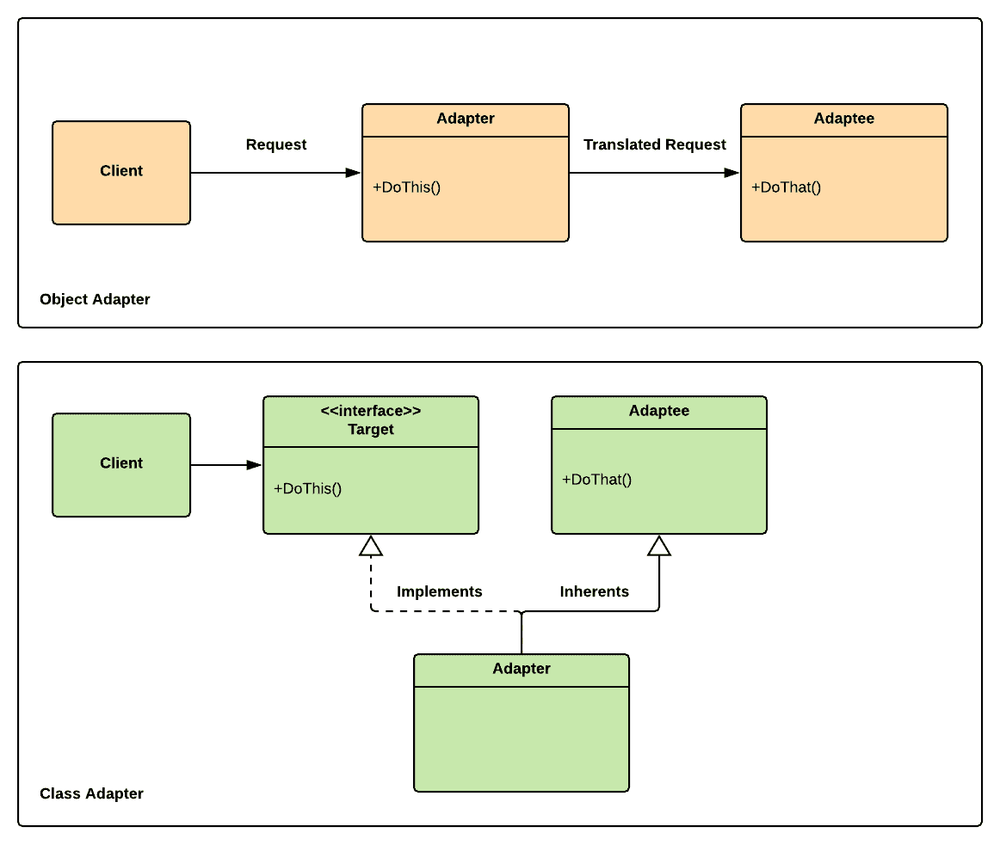

# 第十三章：适配器

在一个充满各种类型电缆和插头的世界里，我们都已经习惯了适配器的概念。适配器模式将是那些你容易掌握的模式之一，因为它与我们与技术的现实世界经验完美相关。适配器模式的名字完美地揭示了其核心目的；它通过在充当适配器的代码之间添加一个接口，为我们提供了一种无缝使用旧代码与新代码的方法。

本章将涵盖以下主题：

+   我们将回顾适配器模式的基础知识。

+   我们将使用适配器模式调整在线用户管理系统，而不修改任何代码。

# 技术要求

本章是一个实践章节；你需要对 Unity 和 C#有一个基本的了解。

我们将使用以下特定的 Unity 引擎和 C#语言概念：

+   封闭类

如果你对这个概念不熟悉，请在开始这一章之前复习一下。

本章的代码文件可以在 GitHub 上找到：

[`github.com/PacktPublishing/Hands-On-Game-Development-Patterns-with-Unity-2018`](https://github.com/PacktPublishing/Hands-On-Game-Development-Patterns-with-Unity-2018)

观看以下视频以查看代码的实际效果：

[`bit.ly/2UieM9v`](http://bit.ly/2UieM9v)

# 适配器模式概述

如其名所示，适配器模式适配两个不兼容的接口；就像插头适配器一样，它不修改它调整的内容，而是将一个接口与另一个接口连接起来。当你处理无法因脆弱性而重构的遗留代码时，这种方法可能是有益的。

它们是实现适配器模式的两种主要方法；以下是一个快速分解：

+   **对象适配器**：一种使用组合的简单方法

+   **类适配器**：一种使用继承的更高级方法

同时尝试学习这两者可能会让人感到困惑，所以在这一章中，我们将通过实现对象适配器并简要回顾类适配器来尝试专注于适配器模式的核心目的。

让我们看看对象适配器和类适配器的并列图；核心差异可能很微妙，但相似之处很明显：



如你所见，在两种情况下，**适配器**类都位于**客户端**和被适配的类（**适配者**）之间。它们只是通过它们与**适配者**的关系而有所不同。

因此，**对象**适配器和**类**适配器之间的核心差异如下：

+   **对象适配器**通常包含一个**适配者**的实例，并将**客户端**的调用翻译成**适配者**；换句话说，它稍微像一个包装器。

+   **类适配器**实现了预期的接口，同时继承了**适配者**；这是一种更高级的适配方法。

从经验来看，我发现适配器模式有时会与外观模式混淆。我们必须理解它们之间的核心区别是，外观模式提供了一个简单的接口来访问一组复杂的、相互依赖的子系统，而适配器模式则是将另一个类的接口适配，使其与客户端的期望保持一致。

因此，如果你试图通过一个单一接口适配多个类，那么你很可能实现的是外观模式而不是适配器模式。

# 好处和缺点

我认为适配器模式不是解决架构问题的长期解决方案；尽管它提供了一些好处，但其长期缺点始终应该被考虑。

以下是一些好处：

+   **无需修改即可适配**：适配器模式的主要好处是它提供了一个在不修改代码的情况下适配代码的标准方法。

+   **可重用性和灵活性**：这个模式允许以最小的更改继续使用遗留代码与新的系统一起使用；这立即带来了投资回报。

以下是一些缺点：

+   **持久化遗留代码**：使用新系统与遗留代码一起使用是成本效益的，但从长远来看，可能会成为一个问题，因为旧代码可能会限制你的升级选项，因为它变得过时且与新版本的 Unity 或第三方库不兼容。

+   **轻微的性能损耗**：因为你在对象之间重定向调用，可能会有轻微的性能损失。

从经验来看，将代码库从一个 Unity 版本迁移到另一个版本可能相当耗时。所以，如果你最终在电脑上安装了多个 Unity 版本，以便维护那些升级成本过高的遗留代码，请不要感到惊讶。

# 用例示例

假设我们正在处理一个典型的现实世界游戏开发场景。我们的主要在线程序员正在休假，并明确指示我们在他缺席期间不要对他的在线玩家管理系统进行任何修改。然而，我们的制作人需要对我们在线组件进行更改，因为他想向一位新投资者展示我们的直播服务。

为了按时完成这项工作，我们需要做出一些改变；因此，我们有两种选择：

+   直接修改在线玩家管理系统，即使我们不是这段代码库的所有者，也不太了解它。

+   找一种方法来扩展当前系统，并使用临时适配器实现所需更改，这将限制对我们同事代码的直接修改。

使用适配器模式，我们可以以结构化和一致的方式实现第二种选择。在下一节中，我们将通过一个简单的示例应用这个用例，这无疑将展示这个模式的有用性。

# 代码示例

正如我们提到的，我们将通过适配`OnlinePlayer`类来实施对我们在线玩家管理系统的一个更改，而不直接修改它。这个例子很简单，但根据经验，最好是通过首先实现最简单的系统来学习一个新的模式。

为了简洁起见，我们将适配以下`OnlinePlayer`类返回特定玩家全名的方式。请记住，我们无法重构或扩展这个类；我们只能适配它。我们将通过使用适配器模式的这两种主要形式来完成这项工作：

+   对象适配器

+   类适配器

# 对象适配器

以下`OnlinePlayer`类可以返回在线玩家的名字和姓氏，以及他们的全名。然而，实现这个类的程序员决定以正式的命名结构返回字符串。我们需要有一个标准序列的全名，即先名字后姓氏。

当然，我们可以单独调用名字和姓氏的`GET`函数，然后在客户端将它们连接起来，但这意味着我们可能需要在需要获取用户全名的地方都这样做。换句话说，我们失去了对全名返回方式的一致性和本地化控制。您可以想象，如果我们需要适配更复杂的东西，比如游戏中的货币交易系统，这可能会变得多么危险：

```cs
public sealed class OnlinePlayer : ScriptableObject
{
    public string GetFirstName(int id)
    {
        // Lookup online database.
        return "John"; // Retun a placeholder name.
    }

    public string GetLastName(int id)
    {
        // Lookup online database.
        return "Doe"; // Return a placeholder last name.
    }

    public string GetFullName(int id)
    {
        // Lookup online database and get full name 
        return "Doe Jonn";
    }
}
```

在`OnlinePlayer`类中还有其他一些重要的事情需要注意；它是`sealed`，这意味着我们不能将其用作基类。因此，我们不能直接扩展它，所以适应它是我们的唯一选择：

1.  让我们构建一个适配器类来修复我们`GetFullName()`函数的问题：

```cs
using UnityEngine;

public class OnlinePlayerObjectAdapter : ScriptableObject
{
    public string GetFullName(OnlinePlayer onlinePlayer, int userId)
    {
        return onlinePlayer.GetFirstName(userId) + " " + onlinePlayer.GetLastName(userId);
    }
}
```

如您所见，`OnlinePlayerObjectAdapter`类接收一个`OnlinePlayer`类的实例，并包装`GetFullName()`方法，因此返回预期的全名格式。因此，我们并没有修改或扩展被适配的类的行为，而只是调整它以满足客户端的期望。

1.  让我们实现一个`Client`类来测试我们的实现：

```cs
using UnityEngine;

public class Client : MonoBehaviour
{
    private OnlinePlayer m_OnlinePlayer;
    private OnlinePlayerObjectAdapter m_OnlinePlayerAdapter;

    void Update()
    {
        if (Input.GetKeyDown(KeyCode.U))
        {
            m_OnlinePlayer = ScriptableObject.CreateInstance<OnlinePlayer>();
            m_OnlinePlayerAdapter = ScriptableObject.CreateInstance<OnlinePlayerObjectAdapter>();

            string FirstName = m_OnlinePlayer.GetFirstName(79);
            string LastName = m_OnlinePlayer.GetLastName(79);

            string FullNameLastFirst = m_OnlinePlayer.GetFullName(79);
            string FullNameFirstLast = m_OnlinePlayerAdapter.GetFullName(m_OnlinePlayer, 79);

            Debug.Log(FirstName);
            Debug.Log(LastName);
            Debug.Log(FullNameLastFirst);
            Debug.Log(FullNameFirstLast);
        }
    }
}
```

现在我们有了适配器，我们可以访问`OnlinePlayer`类中`GetFullName()`函数的原始实现，以及它的一个适配版本。这种方法为我们提供了很多灵活性，风险最小，因为我们没有修改任何东西，而只是进行了适配。

在本节中，我们实现了一个简单的对象适配器示例。在下一节中，我们将通过实现类适配器来回顾一个更复杂的适配器方法。

# 类适配器

在本节中，我们将在我们的`OnlinePlayer`类中修改一个细节；我们将移除密封修饰符，因为我们希望能够继承`OnlinePlayer`类。所以，让我们假装它从一开始就不在那里：

```cs
public class OnlinePlayer : ScriptableObject
{
    public string GetFirstName(int id)
    {
        // Lookup online database.
        return "John"; // Retun a placeholder name.
    }

    public string GetLastName(int id)
    {
        // Lookup online database.
        return "Doe"; // Return a placeholder last name.
    }

    public string GetFullName(int id)
    {
        // Lookup online database and pull the full name in this sequence [Last Name & First Name].
        return "Doe Jonn";
    }
}
```

要实现类适配器方法，让我们遵循以下步骤：

1.  让我们先为我们的客户端实现一个目标接口；我们将称之为`IOnlinePlayer`：

```cs
public interface iOnlinePlayer
{
    string GetFirstName(int userID);
    string GetLastName(int userID);
    string GetFullNameLastFirst(int userID);
    string GetFullNameFirstLast(int userID);
}
```

你应该注意到，我们通过添加一个新的接口来适配`OnlinePlayer`类，这将暴露我们正在改进的类的新的功能。这种方法是灵活的，正如你将在以下步骤中看到的那样。

1.  现在，在我们的适配器类中，我们将实现`IOnliePlayer`接口：

```cs
public class OnlinePlayerClassAdapter : OnlinePlayer, iOnlinePlayer
{
    public string GetFullNameLastFirst(int userId)
    {
        return GetFullName(userId);
    }

    public string GetFullNameFirstLast(int userId)
    {
        return GetFirstName(userId) + " " + GetLastName(userId);
    }
}
```

它看起来很简单，但有很多事情在进行中。让我们尝试解开这个谜团：

+   `OnlinePlayerClassAdapter`正在实现`IOnlinePlayer`接口。

+   `OnlinePlayerClassAdapter`也继承了`OnlinePlayer`类。

+   由于我们继承了`OnlinePlayer`类，`GetFirstName()`和`GetLastName()`默认实现。

+   `OnlinePlayerClassAdapter`只需要显式实现`GetFullNameLastFirst()`和`GetFullNameFirstLast()`。

+   `GetFullNameLastFirst()`将调用重定向到`OnlinePlayer`父类内部实现的`GetFullName()`。

+   `GetFullNameFirstLast()`实际上适配了向客户端返回全名的方式。

1.  让我们看看我们如何利用`Client`类来利用这一点：

```cs
using UnityEngine;

public class Client : MonoBehaviour
{
    private iOnlinePlayer m_OnlinePlayer;

    void Update()
    {
        if (Input.GetKeyDown(KeyCode.U))
        {
            m_OnlinePlayer = ScriptableObject.CreateInstance<OnlinePlayerClassAdapter>();

            string FirstName = m_OnlinePlayer.GetFirstName(79);
            string LastName = m_OnlinePlayer.GetLastName(79);

            string FullNameLastFirst = m_OnlinePlayer.GetFullNameLastFirst(79);
            string FullNameFirstLast= m_OnlinePlayer.GetFullNameFirstLast(79);

            Debug.Log(FirstName);
            Debug.Log(LastName);
            Debug.Log(FullNameLastFirst);
            Debug.Log(FullNameFirstLast);
        }
    }
}
```

我们将客户端与适配类解耦，因为我们只需要在`m_OnlinePlayer`成员变量的赋值过程中将其指向适配器。对于客户端来说，与适配的`OnlinePlayer`类的交互相对透明，并且与之前的实现保持一致。

换句话说，我们能够在不修改`OnlinePlayer`类的同时，保持一致的接口来适配它。这就是适配器模式的核心目的。

# 总结

在本章中，我们将适配器模式添加到我们的工具箱中。这是一种在领域内非常有用的模式，因为对于专业程序员来说，最大的挑战之一就是处理遗留代码，这些代码通常由你不知道的人维护。因此，以一致的方式适配他人的代码而不造成回归和不必要的更改，是长期职业生涯和良好声誉的秘诀。

在下一章中，我们将回顾装饰器，这是一种更复杂和高级的结构模式。

# 练习

在本章中，我们实现了适配器模式的一个简单用例，但其投资回报在于将遗留代码适应到新的环境中。作为一个练习，我建议检查你的 Unity 项目，寻找可以适配到另一个项目中而不需要修改的组件或系统。

# 进一步阅读

+   *《游戏编程模式》* by Robert Nystrom: [`gameprogrammingpatterns.com`](http://gameprogrammingpatterns.com/)
