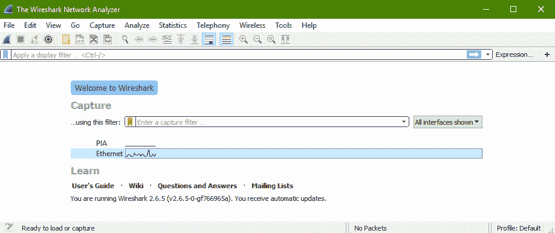
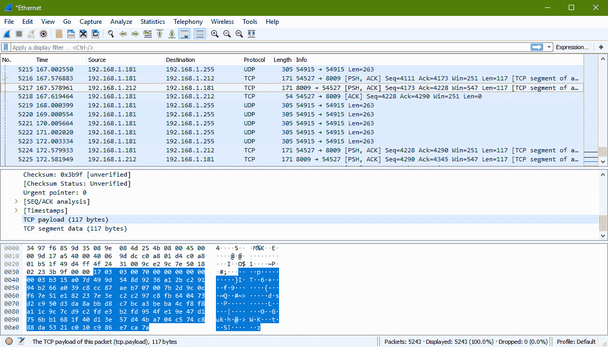
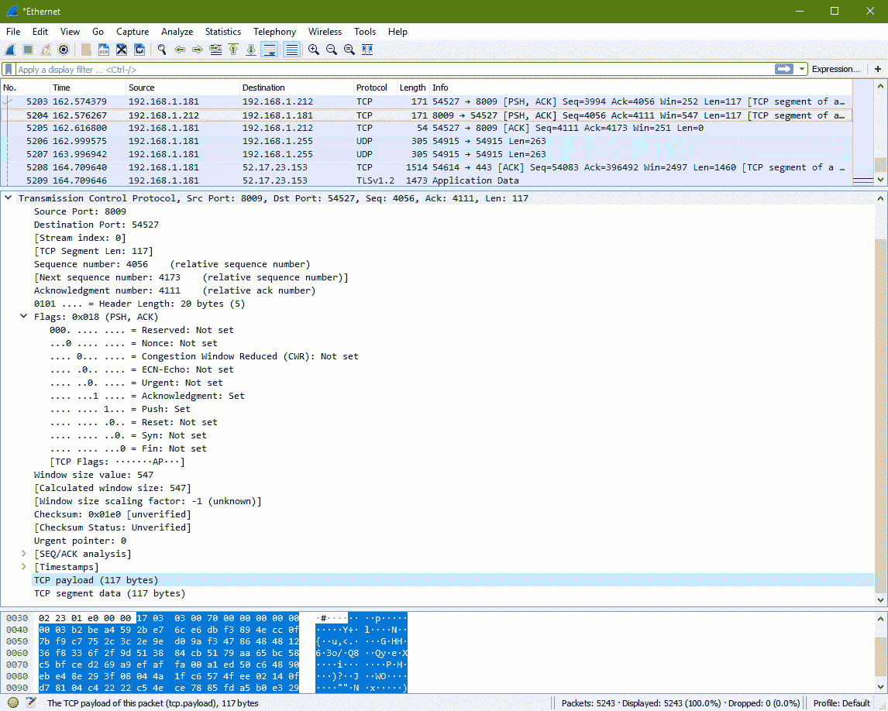

# 第四章：数据包和流

本章将在第三章，*通信协议*，网络架构讨论的基础上，追踪数据在网络中的流动，并分解您将用 C#编写的处理过程中每个步骤的数据的软件。我们将解释将数据封装成最小数据包以进行网络传输，以及这种封装如何有助于确保数据包被正确交付并正确解码。我们将解释数据流作为序列化离散数据包的概念，并演示在 C#中执行序列化的各种方式。最后，我们将演示`System.IO`命名空间提供的各种抽象，用于处理流。

本章将涵盖以下主题：

+   理解数据在网络中的移动方式，以及网络堆栈的各个层在传输过程中的每一步如何展开元数据，以确保正确交付

+   深入探讨通过网络传输的数据包结构

+   理解数据流作为离散数据包集合的概念，以及如何利用它通过 C#的许多`Stream`类来抽象接收和解析数据包的过程

# 技术要求

对于本章，我们将密切观察网络通信。为此，我将使用*Wireshark*数据包嗅探工具来演示我们讨论的一些概念。如果您想跟随并探索您自己机器上的网络流量，Wireshark 是一个免费下载，可在[`www.wireshark.org/`](https://www.wireshark.org/)获取。

无论您是否计划使用它来跟随本章，我都绝对建议您熟悉它作为一个工具。如果您对使用 C#进行任何有意义的网络编程有认真态度，低级流量检查将是您成功的关键，而且您越早学习这个工具，您就会越受益。

# 利用网络 – 为远程资源传输数据包

要具体了解数据包是什么，我们首先应该了解网络限制，这些限制是数据包最初产生的必要条件。为了做到这一点，我们需要了解带宽、延迟和信号强度的限制。这些限制在确定可以在给定网络上传输的原子数据单元的最大大小方面起着关键作用。这些限制要求通过网络传输的数据包含一定数量的属性，以确保任何程度的可靠性。网络中节点之间发送的数据包必须小巧，并包含足够的信息以便正确路由。考虑到这一点，让我们看看网络的物理限制如何为针对它们编写的软件解决方案提供信息和驱动。

# 带宽

任何拥有互联网连接的人可能都相当熟悉**带宽**这个概念。互联网服务的月费通常（至少在美国）是根据提供的最大带宽进行分级的。在专业的编程术语中，带宽这个术语经常被用来，某种程度上比较宽松地，指代一个团队或团队成员可以投入到新任务中的时间或心理容量。我们每个人都应该对这个概念有一个相当直观的理解。简单来说，它是在给定网络连接上的数据传输的最大速率。

虽然那个定义可能看起来很基础，甚至微不足道，但带宽如何驱动数据包大小和结构的标准可能不那么明显。因此，让我们更深入地考虑带宽描述了什么以及它如何影响数据传输。当我们讨论带宽时，有两个因素需要考虑：吞吐量的速度和信道的最大容量。

通过高速公路的类比来概念化这些概念是最容易的。想象一下，你是这条假设高速公路上的收费站操作员。然而，为了这个类比，让我们说，你不仅负责收取通行费，还负责在给定时间段内统计通过你的收费站的总车辆数。你高速公路上的车辆代表单个数据位。每次一辆车通过你的收费站，你都会计数。在任何给定时间内通过你的收费站的总车辆数代表该时间段内你高速公路的带宽。有了这个类比，让我们看看吞吐量和信道容量如何影响带宽。

在这种描述中，吞吐量的速度类似于你高速公路的速度限制。它是信号可以在连接上传输的物理最大速度。有许多因素可能会影响或改变这个速度，但在大多数情况下，电信号或光信号在其相应媒体中的物理特性使得这些变化的影响微乎其微。速度最终将归结为传输介质的物理极限。因此，例如，光纤电缆将比铜线有更高的吞吐量速度。光纤电缆以接近光速的速度传输数据，但铜线会对电流产生阻力，减缓并削弱通过它的任何数据信号。因此，在我们的高速公路类比中，光纤电缆网络的速度限制比铜线要高得多。在一个班次中坐在你的收费站，高速公路上速度限制更高的地方会有更多的车辆经过。鉴于这个事实，通过基本步骤升级你的传输媒体来增加网络的带宽可以变得非常简单。

虽然吞吐量的速度是带宽的一个强决定因素，但我们也应该花一点时间来考虑给定通道的最大**容量**。具体来说，这指的是在任何给定时刻，有多少物理电线可以沿着通道主动携带一个单独的比特。在我们的高速公路类比中，通道容量将描述高速公路上汽车可以行驶的**车道**数量。所以，想象一下，如果我们不是让一辆车沿着高速公路的单车道行驶，而是将其扩展为单向四车道。因此，现在在任何给定时刻，我们可能有四辆车，或者四比特的数据，通过我们的收费站。 

显然，编写网络接口设备固件的系统程序员有责任编写支持正确处理多个同时通道的代码。然而，正如你可以想象的那样，可变的通道容量可能需要针对负责将你的数据分割成原子包的网络实体进行非常具体的优化。

# 延迟

带宽限制只是网络效率的一个考虑因素。工程师必须设计的下一个最常见限制，大多数用户至少是直观熟悉的，是**延迟*****。简单来说，延迟是信号首次发送和响应该信号可以启动之间的时间。它是网络的延迟。

关于延迟，有两种思考方式。简单来说，你可以将其测量为单程或往返。显然，**单程延迟**描述了信号从一个设备发送到目标设备接收的延迟。或者，**往返延迟**描述了信号从一个设备发送到目标设备接收响应的延迟。

然而，需要注意的是，往返延迟实际上排除了接收者在发送响应之前处理初始信号所花费的时间。例如，如果我通过我的软件向外部 API 发送请求，以对一些输入数据进行计算，我合理地期望该软件需要一些非平凡的时间来处理我的请求。所以，首先想象一下，请求在传输中花费了 0.005 秒。然后，一旦收到请求，API 在 0.1 秒内处理请求。最后，响应本身在返回我的软件时又花费了 0.01 秒。从我的软件发送请求到收到响应的总时间是*0.005 + 0.1 + 0.01 = 0.115*秒。然而，由于花费了 0.1 秒来处理，我们在测量往返延迟时将忽略这部分时间，因此往返延迟将被测量为*0.115 - 0.1 = 0.015*秒。

软件平台提供的服务简单地**回声**所接收到的请求，而不对响应应用任何处理，这种情况并不少见。这通常被称为**ping**服务，用于提供两个设备之间网络请求当前往返延迟的有用测量。因此，延迟通常被称为**ping**。在任何特定场景中，影响 ping 请求可靠性的因素有很多，因此此类请求的响应时间通常不被认为是准确的。然而，任何 ping 服务提供的测量通常被认为是给定网络往返的近似值，并且可以用来帮助隔离特定请求管道中的其他延迟问题。

如您所想象的那样，一个如此通用的定义如**网络延迟**可以有许多影响因素，这些因素会影响网络性能。这种延迟可能来自网络事务的任何一点，或者来自原始设备和目标设备之间的任何软件或硬件。在特定的分组交换网络中，可能有数十个中间路由器和网关接收和转发您的数据包以处理任何单个请求。这些设备中的每一个都可能引入一些延迟，当进行性能监控或测试时几乎无法隔离。而且，如果某个网关正在处理数百个并发请求，您可能会因为排在一些与您无关且您可能没有直接了解的请求后面而经历延迟。

# 机械延迟

导致延迟的不同影响因素有时会被稍微不同地分类。例如，机械延迟描述了物理组件实际生成或接收信号所需时间引入到网络中的延迟。所以，例如，如果你的 64 位计算机的时钟速度为 4.0 GHz，这为给定秒内可以处理的总信息量设定了一个物理的、机械的限制。现在，公平地说，这样一个系统处理的信息量会非常多。假设 CPU 每时钟周期处理一个字节，那么每秒处理 4 亿个 64 位指令；这是一个巨大的数字。但是，这个时钟速度构成了一个机械限制，为任何交易引入了一些可测量的延迟。在这样的系统中，一个 64 位指令不能比至少 0.000000128 秒更快地移动到网络传输设备，假设每个时钟周期间隔处理并交付一个比特到传输流。

# 操作系统延迟

上述示例描述的是一个有些不切实际的系统，因为在没有中断的情况下，可以直接将 64 字节的数据发送到传输媒体。现实中，**操作系统**（**OS**）将处理来自应用程序和系统软件的请求，以发送那个假设的数据包，同时它还会处理主机机上运行的数百个其他软件的数千个其他请求。几乎所有现代操作系统都有一个系统，用于交织多个请求的操作，以确保没有进程会因为另一个进程的执行而被不合理地延迟。因此，我们实际上永远不会期望达到由我们的时钟速度定义的最小机械延迟。相反，可能发生的情况是，我们的数据包的第一个字节将被排队等待传输，然后操作系统将切换到处理其程序队列上的另一个操作，执行该操作需要一段时间，然后它可能回来准备我们的数据包的第二字节以进行传输。因此，如果你的软件试图在一个试图执行长时间运行或阻塞软件的操作系统上发送数据包，你可能会遇到完全无法控制的重大延迟。你的软件请求如何被操作系统优先处理和处理的延迟，希望非常明显地被称为**操作系统延迟**。

# 操作延迟

虽然我之前确实说过，延迟通常只描述数据包在传输过程中花费的时间，但作为网络工程师，考虑延迟对最终用户体验的影响通常是很有用的。虽然我们都希望如此，但没有任何工程师可以通过声称原因超出了自己的控制范围来逃避忽视负面用户体验的责任。因此，即使你的软件可能表现最优，并且部署在超快的光纤网络上，如果它依赖于一个处理请求缓慢的上游资源提供商，你的最终用户最终会感受到这种痛苦，无论你的代码多么完美。因此，跟踪处理特定网络请求所需的总实际时间窗口，包括远程主机上的处理时间，通常是有用的。这种测量在考虑网络操作对用户体验的影响时最有意义，这被称为**操作延迟**。因此，尽管一个任务的操作延迟的许多影响因素通常超出了你的控制范围，但了解其影响并尽可能将其优化到最低限度通常非常重要。

最终，这些个别指标应该告诉你的是，在整个网络请求过程中，有数十个点可以引入延迟。每个点都有不同程度的影响，并且它们通常受到不同程度的控制，但只要有可能，你应该始终寻求最小化应用程序中引入外部延迟的点数。为最佳网络延迟进行设计总是比事后尝试构建它要容易。然而，这样做并不总是容易或明显的，并且为最小延迟进行优化可能从请求的任何一方看起来都不同。

为了说明这一点，假设我们正在编写一个应用程序，该应用程序负责收集一个或多个交易 ID，查找这些交易的货币价值，然后返回它们的总和。作为一个具有前瞻性的开发者，你已经将这个交易聚合服务从交易数据库中分离出来，以保持你的服务业务逻辑与数据存储实现解耦。为了便于数据访问，你通过一个简单的 REST API 公开了交易表，该 API 通过 URL 中的单个键来提供单个交易的查找端点，例如`transaction-db/transaction/{id}`。这对你来说是最有意义的，因为每个交易都有一个唯一的键，允许单个交易查找可以让我们最小化数据库服务返回的信息量。通过网络传输的内容越少，意味着延迟越少，因此，从数据生产者的角度来看，我们已经设计得很好。

然而，你的聚合服务却是另一回事。该服务需要多个交易记录来生成有意义的输出。仅通过单个端点一次返回一个记录，聚合服务将向交易服务发送多个同时请求。每个请求都会贡献它们自己的机械、操作系统和操作延迟。虽然现代操作系统允许同时处理多个网络请求的多线程处理，但给定进程中的可用线程数有一个上限。随着交易数量的增加，请求将开始排队，阻止同时处理并增加用户体验到的操作延迟。

在这种情况下，优化这两种情况只是一个简单的问题，即添加一个额外的 REST 端点，并接受请求体中包含多个交易 ID 的`POST` HTTP 请求。我们中大多数人阅读这个时可能已经知道了这一点，但这个例子作为一个说明**最佳性能**可以在同一枚硬币的两面看起来非常不同的例子是有用的。通常，我们不会同时负责服务应用程序和数据库 API，在这些情况下，我们将尽我们所能从单一方面来提高性能。

无论你在请求的哪一方，但网络延迟对应用性能的影响都需要你考虑最小化必须通过网络发送的原子数据包的大小。将大请求分解成更小、更易处理的片段，为通信链中的每个设备提供了更多介入、执行其他操作然后继续处理你的数据包的机会。如果我们的单网络请求在整个 5 MB 文件传输期间阻塞其他网络操作，它可能在你的操作系统维护的网络事务队列中拥有较低的优先级。然而，如果我们的操作系统只需要插入一个小的、64 字节的传输数据包，它可能找到更多机会更频繁地发送该请求，从而降低你的操作系统延迟。

如果我们的应用程序必须发送 5 MB 的数据，那么以 64 字节的数据包发送可以给你的应用程序托管环境提供更多的灵活性，以确定满足该需求的最佳方式。

# 信号强度

我们将要考虑的最后一个网络通信的主要限制是可变的**信号强度**。在任何非平凡的网络中，给定信号的强度可能会受到无线发射器和接收器之间距离的影响，以及通过电线连接的两个网关之间的距离。在现代光纤网络中，这并不是一个很大的问题，因为这些网络依赖于通过玻璃或塑料光纤传输可见光，因此不受许多干扰旧物理网络标准的因素的影响。然而，可靠的信号强度对于无线网络或使用铜线传输电信号的有线网络来说可能是一个主要问题。

如果你熟悉电阻对信号强度的影响（对于那些还记得大学物理或计算机硬件课程的人来说），你会知道，你想要发送信号的电线越长，接收端的信号就越弱。如果你将位定义为当电线上的电压高于给定阈值时为 1，并且你的电线电阻随时间降低信号电压，那么你的数据包中的一些位可能会因为信号干扰而被目标设备判定为不可确定。信号强度弱意味着传输可靠性低。

而仅仅是抵抗并不是唯一可能削弱你的信号强度的事情。大多数电信号都会受到来自任何其他附近电信号的干扰，或者简单地受到自然渗透地球的电磁场。当然，随着时间的推移，电气工程师们已经设计了无数种方法来减轻这些影响；从减少电磁干扰的电线绝缘到信号中继，以放大信号沿其路径的电阻来减少影响。然而，随着你的软件被部署到越来越广泛的网络中，你可以依赖的现代和设计良好的网络基础设施的范围显著减少。数据丢失是不可避免的，这可能会给那些负责确保你的请求可靠传输的人带来一系列问题。

那么，这种间歇性数据丢失如何影响网络传输格式的设计？它强制我们数据包具有一些必要的属性，我们将在稍后更深入地探讨，但在这里我们会简要提及。首先，它要求传输尽可能小的数据包。这仅仅是因为，如果数据损坏的问题存在，它将使整个数据包的有效载荷无效。在一串零和一之间，单个位的值的不确定性可能会在数据包实际意义中产生巨大的差异。由于有效载荷只是整体请求或响应对象的片段，我们无法依赖在给定数据包本身内拥有足够上下文来正确断定一个不确定位的值。因此，如果一个位变坏并且被认为是不可确定的，整个有效载荷就无效了，必须被丢弃。通过将数据包大小减少到可合理达到的最小尺寸，我们最小化了无效位对我们整个请求有效载荷的影响。由于一个位的不确定性而重新请求一个 64 字节的单一数据包，比重新启动整个 5 Mb 的传输要容易接受得多。

聪明的读者可能已经识别出由不可靠的信号强度驱动的数据包的第二种属性。虽然可变的信号强度和外部干扰可能会简单地使单个位不可确定，但它也可能完全翻转位。因此，尽管接收者可能能够确定其接收到的值，但它最终确定的是**错误值**。这是一个更微妙的问题，因为正如我之前提到的，数据包可能包含不足以确定其有效载荷中特定位的适当值的信息。这意味着数据包必须有一些机制，至少是嵌入到标准头部的**错误检测**机制。只要消费设备能够检测到错误，它至少可以知道丢弃错误数据包的内容并请求重新传输。

值得注意的是，将请求分解成越来越小的数据包所带来的好处是有极限的，超过这个极限后，对网络性能的益处就会消失。将这种思维方式推向极端，你会很快发现自己为负载中的每一个比特都分配了一个完整的数据包，包括错误检测等。以我们想象中的 5 Mb 请求负载为例，这意味着同时发送了 4,000,000 个数据包。显然，对于如此小的请求来说，这是一个荒谬的数据包数量。相反，网络工程师已经发现，根据给定的协议，发送的数据包大小有一个可靠的范围，这个范围介于几百字节和几千字节之间。

既然我们已经知道了为什么网络通信使用小而独立的数据包，那么我们应该看看这些数据包是什么。

# 数据包的结构

尽管我在本章中已经提到了一些特性，但在这里我们将更仔细地研究网络数据包必须展示的属性，以便真正作为信息的一部分有用。我们将探讨网络数据包标准的定义以及所有网络数据包将以某种形式包含的最小功能。然后我们将简要地看看不同的传输协议如何实现它们自己的数据包标准，以及如何扩展一些必需的属性以提供更可靠的数据传输或更高的性能。这将为本书后面的内容奠定基础，我们将探讨网络安全、诊断和优化。

# 什么是数据包？

因此，首先，我们应该进行一些细节上的探讨。我在本章中一直使用的术语“数据包”并不是严格意义上描述我所描述内容的最佳术语。到目前为止，我一直使用“数据包”这个词来描述通过网络传输的最基本的数据传输单位。然而，为了准确起见，我应该指出，术语“数据包”特指**开放系统互联**（**OSI**）网络堆栈中网络层传输的最基本的数据单元。在传输层，我们将最关注它（因为那是我们在 C#中直接交互的堆栈中的最低层），数据传输的基本单位实际上被称为**数据报**。然而，我要指出的是，通常更常见的是将传输层的数据单元称为数据包而不是数据报，因此我将在本章以及本书的其余部分继续使用这个术语。不过，我确实想利用这个机会指出这两个术语之间的区别，以防你在不同的上下文中遇到了这两个术语中的任何一个。有了这个前提，那么数据报或数据包究竟是什么呢？

我们已经对包必须具备哪些特性才能变得有用有了相当的了解，所以让我们将其正式化为一个定义。**包**是数据的一个原子单位，它封装了足够的环境信息，以便在任意网络实现中可靠地传输。

所以基本上，它是一个**有效载荷**（数据单位）和一个**头部**（足够的环境信息）。这一点到此时应该不会令人惊讶，但让我们看看这个定义是如何转化为从我们的传输层传递到网络层的实际字节数组的。为了做到这一点，我们将使用 Wireshark 来检查发送到和从我自己的以太网端口的数据包，并查看定义中的每一部分是如何转化为实际的数据报的。

# 设置 Wireshark

作为网络工程师的工具，Wireshark 极其有用，我强烈建议你熟悉其功能，并开始思考你如何在你的开发任务中利用它。现在，尽管如此，我们将使用其最基本的包嗅探功能来检查通过我们开放的互联网连接的每一个包。因此，一旦安装了 Wireshark，只需打开它，并选择你的以太网连接作为包嗅探的目标，如下面的截图所示：

当你在自己的机器上打开它时，花点时间观察一下流量源右侧的图表增长。这实际上提供了在给定源随时间变化的相对活动的一个快速视图。一旦你选择了主要的互联网源，就可以通过点击工具栏左上角的捕获按钮或简单地双击所需源来开始捕获。让工具捕获几分钟的流量，以获取良好的样本数据范围，然后开始自己探索。如果你以前从未使用过 Wireshark 或 Fiddler 这样的工具，你可能会惊讶于即使没有你的直接输入，实际上也在发生多少对话。

在安装并运行工具后，让我们看看我们定义的包的一些特性，并看看它是如何转化为实际应用中的。

# 原子数据

如果你有任何数据库设计的经验，你可能已经对构成**原子数据**的概念有了相当清晰的认识。通常，这意味着记录可以被分解成最小的组成部分，而不会失去其意义。然而，在网络通信的背景下，我们并不真正关心数据包的有效载荷失去意义。它会被接收方重新编译成原始的数据结构，因此，即使通过网络传输的小块数据本身没有意义，这也是可以接受的。相反，当我们谈论网络事务中的原子数据时，我们实际上是在谈论我们可以将数据截断到最小大小的程度，超过这个大小，我们将不再看到将数据缩小成更小块所带来的预期好处。这些块可能会将双精度十进制值分成两部分，一部分在一个数据包中发送，另一部分在完全不同的数据包中发送。因此，在这种情况下，任何一个数据包都没有足够的信息来理解其原始形式的数据。它不会被看作是像数据库中用户记录的`FIRST_NAME`字段那样最原子化的存储方式。但如果这种分解在当前网络中实现了数据包传输的最有效分布，具有最小的延迟和最大的带宽利用率，那么它就是以网络数据包表示的最原子化方式。

例如，只需查看你在 Wireshark 捕获中记录的任何任意数据包。查看我的数据流中的一个数据包，我们有一个这样的**传输控制协议**（**TCP**）数据包（或数据报），如下所示：

正如你在 Wireshark 面板底部原始数据视图所选文本中看到的那样，该特定数据包的有效载荷是 117 字节的无意义垃圾。这可能对你或我来说似乎没有太大用处，但一旦将这个特定的 TCP 请求与该请求中的其他数据包重新组装，最终的数据应该对消费软件（在这种情况下，是我电脑上运行的 Google Chrome 实例）有意义。这就是所谓的**原子数据单元**的含义。幸运的是，这不是我们需要担心的事情，因为这是由传输层的硬件实现直接处理的。因此，尽管我们可以实现直接利用我们选择的传输层协议的软件，但在.NET Core 平台上工作时，分解和重新组合数据包或数据报的实际行为总是超出我们的控制。

# 封装了足够多的上下文

我们定义的这个方面实际上是真正的核心，也是我们最初使用 Wireshark 的原因。用足够的上下文封装一个数据包究竟意味着什么？让我们从数据报必须具备的上下文开始。这指的是源主机和目的主机之间任何设备都需要的信息，以便相应地路由数据包，以及目的主机在接收到数据包后正确读取和处理所需的信息。出于明显的原因，这些信息包含在数据包的最前面（也就是说，它构成了接收设备将首先读取的位），这就是数据包头部的构成。**上下文**是正确转发或处理数据包所需的信息。

那么，什么构成了**足够的上下文**呢？嗯，这实际上取决于数据包构建的具体协议。不同的协议有不同的要求和期望，因此，对正确服务的要求也不同。对某一方面构成足够上下文的内容，可能对另一方面来说就极其不足。

最常用的传输层协议是 TCP 和**用户数据报协议**（**UDP**），它们各自为利用它们的软件应用提供了不同的服务合同。这意味着它们都有非常不同的头部规范。TCP 旨在为在主机之间传输的数据包提供顺序的、可靠的、经过错误检查的传输服务。与此同时，UDP 作为一种无连接的协议（我们将在本书的后面具体讨论这意味着什么），并不明确旨在提供传输的可靠性或数据顺序的保证。相反，它寻求提供轻量级通信，并使用最少的协议定义来强制执行。因此，UDP 的足够上下文实际上比 TCP 数据包的上下文要少得多。

一个 UDP 数据包头部由 8 个字节的数据组成，分为 4 个单独的字段，每个字段长度为 2 个字节；这些字段如下：

+   **源端口**：生成请求的源机器上套接字连接的特定端口。

+   **目的端口**：目的机器上连接的端口。

+   **长度**：数据包的确切长度，包括紧跟 8 个字节头部的有效载荷。

+   **校验和**：用于验证有效载荷数据完整性的简单值。

使用 Wireshark，我们可以看到这个动作。在一个简单的 UDP 数据包中，所有内容都由那些相关字段捕获，正如我在 Wireshark 窗口中间的“数据包详情”视图中所看到的：

然而，由于 TCP 提供可靠交付、保证顺序，并利用 UDP 放弃的手 shake-协议，TCP 数据包头部的规范要长得多。对于 UDP，足够的上下文可以封装在仅仅 8 个字节中，而对于 TCP，足够的上下文需要多达 20 字节的头部。这包括表示更大会话中单个数据包状态的多个标志位，以及一个序列号，以提供协议指定的数据包顺序。在 Wireshark 中简单 TCP 数据包的“数据包详细信息”视图的简要检查应该可以阐明 TCP 数据包头部提供的预期上下文差异，如下所示：

正如你所看到的，尽管 TCP 数据包的实际字节长度比我们之前查看的 UDP 数据包短，但头部提供了比有效 UDP 连接所需的信息多得多的信息。显然存在重叠（源端口和目的端口，以及校验和），但两个头部之间的差距比共同点要大。

因此，希望现在已经很清楚，构成足够上下文的原因是由构建数据包的协议所驱动的。具体什么是足够的可能会变化，但每个协议都会有足够的最小上下文，足以转发或处理。

# 错误检测与纠正

在我们继续之前，我确实想花一点时间来谈谈错误检测和错误纠正之间的区别。你可能想知道为什么我在对数据包的定义中省略了有关错误纠正或错误检测的任何规定。这是因为对于 OSI 堆栈传输层定义的每个协议，并不能保证数据包总是包含足够的信息来检测或纠正传输过程中产生的错误。

然而，我要说的是，在给定的协议规范中至少有一些形式的错误检测是非常常见的。TCP，甚至是不太可靠的 UDP 传输协议，都提供了校验和来进行简单的错误检测，如下面在 Wireshark 中看到的两个数据包所示：

然而，那些协议没有提供任何错误纠正机制*，这实际上要困难得多，并且对于任何非简单纠正功能，都需要将数据包大小大幅增加。例如，虽然校验和可以告诉你有效载荷在传输过程中是否发生了改变，但它无法告诉你具体在哪里，或者改变的程度如何。要做到这一点，需要足够多的附加数据来从头开始重建数据包。由于数据包传输在一般情况下是可靠的（也就是说，即使一次传输失败，重试传输很可能会成功），并且在传输层通常非常快，因此简单地检测错误、丢弃错误数据包并请求重传总是更好的选择。

在这种情况下，我们对在给定协议下定义的每个数据包必须具备的一切以及如何检查或使用网络数据的各个部分都有一个稳固的概念。但我们的软件不会使用这些微小的数据片段。我们的软件期望的是 JSON 对象、XML 有效载荷或 C#对象的序列化字节流。那么，消费网络流量的软件是如何处理这些随机的小数据包流呢？通过将它们作为流*使用。

# 流和序列化 - 理解顺序数据传输

因此，当我们的庞大、笨重的 JSON 请求被拆分成微小的、亚千字节的数据包，并以看似随机、不连贯的数据片段数组的形式发送时，我们怎么可能期望我们的接收者处理这些数据呢？好吧，在 C#中，这就是数据流概念出现的地方。在我们应用程序代码的上下文中，我们可以可靠地假设传输层会为我们重新组合数据包，以便我们一有机会就可以消费它们。所以，一旦我们得到了这个位序列，我们如何消费它呢？作为一个 IO 流！

# Stream 类

如果你曾在旧版.NET Framework 版本的 C#中读取或写入本地文件系统，你将已经熟悉这个概念。在.NET Core 中，我们可以将`System.IO`命名空间导入到我们的应用程序中，通过简单地打开一个新的`StreamReader`对象，并用一个连接到目标套接字的`NetworkStream`实例初始化它，就可以直接开始处理由 TCP/IP 套接字返回的数据。那么，什么是流？你应该如何使用它？

流是处理序列化数据的一个强大概念。它们提供对顺序数据源的单一访问，并允许你显式地处理该数据。执行`Read()`或`ReadAsAsync()`方法，或其他相关方法，将触发这种单向遍历；从开始处开始，按需逐字节读取整个序列，直到达到终止字符。.NET 对这个概念的实施非常灵活，以至于，无论你使用的是`Stream`抽象类的哪个具体实例，`StreamReader`类都将配备接受数据、相应地遍历它，并允许你根据需要构建非序列化的 C#数据结构的功能。

我们将在后面的章节中更详细地研究流，但到目前为止，我想强调在网络通信的背景下，流是由特定端口或套接字接收到的数据包序列组成的，并通过`Stream`类的标准化实现返回到您的应用程序。

这只是.NET Core 提供的抽象功能套件的一个例子。因此，尽管你现在已经具备了处理从传输层返回的单独数据包并从头开始重建网络请求响应的必要理解，但你很幸运地不必这样做。Core 框架为你处理了这个头疼的问题。并且，有了这个底层的额外视角，我希望你感觉更有能力去解决未来网络依赖型应用程序中可能出现的性能问题或微妙的网络错误。

# 摘要

回顾本章，我们涵盖了网络通信的最底层细节。首先，我们学习了物理网络基础设施的三个最常见约束，这些约束要求将网络请求分解成数据包。我们探讨了应用程序托管上下文的各个方面如何对我们的请求贡献一定的延迟，带宽如何改变请求从一个节点移动到另一个节点的方式，以及信号强度如何损害数据包的完整性。

接下来，我们探讨了这些因素如何需要小型、上下文完整、原子性的数据包作为我们的网络请求传输格式。我们分析了某些常见协议如何通过标准化格式在每个数据包中提供完整的上下文。这让我们对如何将较大的网络请求分解并发送到我们的网络管道有了更清晰的认识。

最后，我们探讨了如何将一组在不一致的时间间隔内交付的数据包作为顺序流进行消费。有了这一切，我们基础的最底层已经建立，我们拥有了探索.NET Core 应用程序中 C#如何提供该功能的完整网络基础设施和通信标准的背景。这正是我们将在下一章中探讨的内容，我们将最终在面向用户的应用程序中生成一个网络请求，并完全解析由.NET Core 托管平台实现的该过程的每一步。

# 问题

1.  什么网络的三种约束需要将网络请求分解成数据包？

1.  列出本章讨论的每种类型的延迟。

1.  为什么不可靠的信号强度需要更小的数据包大小？

1.  数据报的定义是什么？

1.  数据报的两个组成部分是什么？

1.  在数据报或数据包方面，什么算是足够的背景信息？

1.  .NET Core 的哪个功能促进了不可靠数据流的处理？

# 进一步阅读

为了更好地理解数据包和数据流如何在分布式系统中操作，请查看以下书籍：*《使用 Wireshark 进行数据包分析》，作者 Anish Nath，Packt Publishing*，详情请见：[`www.packtpub.com/networking-and-servers/packet-analysis-wireshark`](https://www.packtpub.com/networking-and-servers/packet-analysis-wireshark)。

为了更深入地了解实际中的数据流，请考虑以下书籍：*《使用 Microsoft Azure 进行流分析》，作者 Anindita Basak、Krishna Venkataraman、Ryan Murphy 和 Manpreet Singh，Packt Publishing*，详情请见：[`www.packtpub.com/big-data-and-business-intelligence/stream-analytics-microsoft-azure`](https://www.packtpub.com/big-data-and-business-intelligence/stream-analytics-microsoft-azure)。
