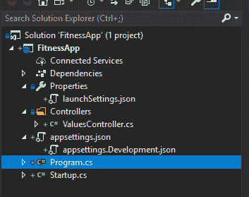
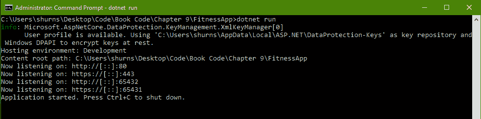
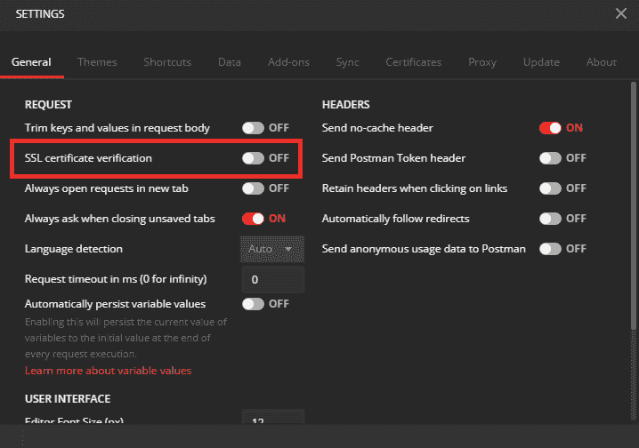

# 第九章：.NET 中的 HTTP

在前面的每一章中，我们探讨了构建网络软件的基本构建块。在本章中，我们将使用这些构建块来构建一个利用最常见网络协议**超文本传输协议**（**HTTP**）的应用程序。我们将重新审视 HTTP 在**开放系统互联**（**OSI**）网络堆栈中的位置，以及为什么它被归类为这样的类别。我们将更深入地考虑 HTTP 请求和响应的约定，并花一些时间探索请求、响应和内容头。我们将演示如何使用标准头指定您希望从外部 HTTP 资源获取的内容，以及如何使用自定义头切换应用程序的特定功能和功能。最后，我们将探索如何通过协议提供内容以服务对应用程序发出的 HTTP 请求。

本章将涵盖以下主题：

+   HTTP 协议的背景，以及其规范的优势和局限性

+   HTTP 请求方法，包括如何生成和直接使用 C#响应这些请求

+   如何构造`HttpRequestMessage`，或使用`HttpClient`发送请求，以及可用于以有效 HTTP 响应响应请求的各种类

+   在 C#中如何实现 HTTPS

+   HTTP/2 支持的新功能以及如何在.NET Core 中利用这些功能

# 技术要求

在本章中，我们将使用 GitHub 上本书的示例应用程序：[`github.com/PacktPublishing/Hands-On-Network-Programming-with-CSharp-and-.NET-Core/tree/master/Chapter%209`](https://github.com/PacktPublishing/Hands-On-Network-Programming-with-CSharp-and-.NET-Core/tree/master/Chapter%209)。

我们还将使用在第八章中使用的每个工具，*套接字和端口*。所以，如果您之前没有花时间安装并开始使用它们，我建议您现在就做。具体来说，我推荐从这里安装 Postman：[`www.getpostman.com/apps`](https://www.getpostman.com/apps)。

或者，您可以使用 Insomnia REST 客户端，您可以在以下链接找到它：[`insomnia.rest/`](https://insomnia.rest/)[.](https://insomnia.rest/)

此外，尽管它不会在本章中重点介绍，因为部署选项将超出本章的范围，但我鼓励您利用这个机会开始使用 Docker。我会指出修改和扩展您的 Dockerfile 以及本地部署更改的机会。

查看以下视频，以查看代码的实际应用：[`bit.ly/2HY5WaA`](http://bit.ly/2HY5WaA)

# 打开 HTTP

在第三章，*通信协议*中，我们有一个部分，*应用层*，我们探讨了为什么某些协议落在这个层次。在了解了网络事务的细节之后，我希望能够更容易地区分传输层和应用层。对于 HTTP，我们有最好的机会来探索这种区别。作为一个协议，它从 C#库中获得了最广泛、最稳健的支持。这种语言资源的深度将为我们提供一个锐利的视角，通过这个视角我们可以观察应用层及其底层传输层之间的区别。因此，在我们学习如何使用 HTTP 之前，让我们先弄清楚它究竟是什么。

# HTTP 的本质

当我们在第八章，*端口和套接字*中处理低级流时，我们看到了当必须直接与字节流工作、序列化和反序列化数据以及手动解析输入头时，开发者所承担的责任。仅仅为了从一个机器到另一个机器获取一个简单的字符串，就需要大量的样板代码。显然，每次需要发出外部资源请求时都编写相同的样板代码是乏味且容易出错的。这就是协议发挥作用的地方。

我们在第三章，*通信协议*中简要讨论了这个话题，我们探讨了网络堆栈中每个层定义的协议。然而，在接下来的章节中，我们已经对如何在不同协议之间跨越 OSI 堆栈有了更好的理解。因此，希望那些在第三章，*通信协议*中可能有些模糊的区别现在会变得更加清晰。

当在.NET 中编写网络软件时，我们将主要在 OSI 堆栈的这两个层级上工作。第一个，也是最明显的，是应用层。HTTP 就生活在这里，FTP 和 SMTP 也在这里，而且你过去可能已经与之交互过的任何 Web 应用程序软件也都会在这里。然而，在.NET 中，通常还会编写传输层。在监听服务器中直接处理 TCP 和 UDP 调用很容易（我们将在后面的章节中看到）使用一些你可能会从.NET Core 中期待的多功能且易于使用的实用类。但程序员从哪个角度来看，这两层之间的区别是什么？当我们编写 HTTP 软件时，我们仍然非常关注我们序列化数据的格式和结构。那么，为什么在编写 HTTP 时与直接处理 TCP 客户端的流相比，这种关注是不同的呢？

# 应用层和传输层

当你试图理解这种区别时，需要内化的最重要的事情是每个层所关心的最小数据块。应用层主要关注**应用对象**。因此，只要你所使用的语言提供了对整个网络堆栈的完全实现的抽象（例如 C#），你就可以编写仅通过业务和应用模型与外部资源通信的代码。你永远不必担心从它们的序列化数据报文组合这些模型，或者担心字符编码，或者整数的字节序。

相反，你将用网络事务的结果来思考和说话——例如，“*我正在请求一个数据库记录，*”而不是“*我正在请求数据库记录的一系列字节。*”如果你发现自己陷入了使你的应用层软件过度通用化和抽象的反模式，你很快就会发现自己没有提供任何有意义的价值。应用层软件应该描述并依赖于至少一些具体的业务模型；否则，它只是介于传输层和实际使用这些业务模型的代码段之间不必要的额外层。

同时，在这一概念硬币的另一面，我们有传输层。正如你可能已经猜到的，在这一层编写的软件不需要业务上下文就能正确实现并提供其预期的价值。事实上，任何非原始`Object`的表示，比如简单的泛型之外的`Serialize<T>()`，都会使你的传输层软件在没有特定业务应用上下文的情况下变得几乎无用。任何围绕具体业务对象构建的传输层软件架构都像是用牙签搭建的房子，用泡泡糖粘合在一起：不稳定且寿命短暂。

我现在强调应用层和传输层软件之间的区别，是为了使本章其余内容的内容更加直观。从现在开始，我们将要使用和思考的一些.NET 中的类，以及我将给你的一些关于这方面的建议，都将依赖于你对这种区别的理解。此外，了解 HTTP 是如何产生，以及它如何演变成今天的样子也是很好的。

# HTTP 的历史

如我在第三章中提到的，*通信协议*，虽然现在 HTTP 是网络软件的事实上的协议，但其原始设计和意图实际上要简单得多，限制也更多。甚至其同名的**超文本**，也已经远远超出了其原始概念。

超文本最早在 1965 年被描述，其定义为一个在计算机或其他电子设备上渲染文本的规范，其中包含对其他超文本文档的引用，这些文档可以通过称为 **超链接** 的引用系统立即访问。在最基本的意义上，这描述的不过是原始的网页。事实上，你无疑已经意识到作为概念的 *超文本* 与用于渲染网页的超文本标记语言（HTML）文件格式之间的联系。这些基本规范成为了现代互联网的先驱。

像我们现代世界的许多事物一样，超文本、HTML 和 HTTP 的起源可以追溯到一部有影响力的科幻作品！1941 年，豪尔赫·路易斯·博尔赫斯（Jorge Luis Borges）所写的短篇小说《分叉的路径花园》（*The Garden of Forking Paths*）通常被认为是超文本第一定义的灵感来源。

数十年后，在 1989 年，欧洲核研究组织（**CERN**）的研究人员开始正式化他们定义全球计算机网络标准的努力，现在被称为 **万维网**（**WWW**）。这项工作包括定义文档表示的标准以及在这些机器之间传输这些文档的协议。1991 年，HTTP 的第一个正式定义被起草，并命名为 **v0.9**。

这个原始定义在范围上极为有限，仅旨在定义从给定服务器请求超文本页面的过程；该规范定义了一种单一的方法，即 `GET`。然而，随着互联网在早期开始触及消费者，更广泛的受众需求迫使网络标准的演变。到了 1996 年，HTTP v1.0 被正式化并在广泛范围内得到认可时，该标准已经扩展到包括消息头、安全性和更广泛的操作。

然而，尽管如此，它几乎仅用于从服务器向客户端传输网页。每个请求都必须与服务器协商自己的连接，一旦该请求得到处理，连接就会关闭。如果你只是请求一个静态网页，这种行为是有意义的，但如果你想要加入用户交互呢？这种连接协商是有代价的。

CERN 的工程师们认识到了这一点，并在 1997 年仅用一年时间发布了更新的 HTTP v1.1（通常写作 HTTP/1.1）规范，该规范提供了一套更丰富的功能集。这包括用于指定响应缓存行为的头信息、持久连接、身份验证和授权、消息语法以及路由或重定向行为。事实上，HTTP/1.1 仍然在很大程度上保持不变，并且至今仍被广泛使用。然而，尽管直到最近 HTTP/2 的出现（2015 年引入），该协议本身基本保持不变，但工程师们 *使用* 该协议的方式却呈指数级增长。

# 网络服务和 HTTP

随着互联网从 20 世纪 90 年代初期的商业和工程专业人士分享资源和信息的利基工具，发展到今天广泛使用的平台，为互联网编写的软件也必须随之增长。HTTP 的简单性和可扩展性提供了一个如此可靠、广泛理解和支持的协议，以至于它迅速超越了其最初声明的意图。工程师开始利用它来处理几乎所有的网络服务和资源访问实例。现在，HTTP 几乎成为互联网上几乎所有开放 API 的首选协议。

早期，微软就认识到了这一点，当它在 2001 年发布.NET 框架的第一个版本时，它完全支持 HTTP 作为通用网络资源访问的事实应用层协议。后来，随着**Windows 通信基础**（**WCF**）和**Windows 表现基础**（**WPF**）的出现，微软继续在应用层网络服务上大量依赖 HTTP。

对于可能不知道的人来说，WCF 是微软为网络特定、面向服务的应用程序开发提供的库和框架套件。同时，WPF 是微软为异步用户界面代码范式提供的框架。它旨在为任何具有 UI 的桌面或 Web 应用程序提供相同丰富的一套功能和控件，以保持一致的外观和感觉。

# SOAP 的出现

WCF 的大部分内容都是专门针对**简单对象访问协议**（**SOAP**）服务的实现而量身定制的。乍一看，SOAP 似乎本身就是一个应用层协议。然而，在实践中，它实际上是一个存在于实际 OSI 网络栈之上的协议层。因此，虽然实现 SOAP 协议的应用程序确保了任何消费者都能获得可靠的行为，但它并不以任何必要的方式实现网络可用资源之间的交互，正如我们在第三章“通信协议”中讨论的那样。相反，它舒适地位于 OSI 栈之上，直接与应用层协议交互，以服务 SOAP 应用程序及其消费者所需的实际网络交互。因此，虽然基于 SOAP 的应用程序通过协议严格定义了它们的交互，但这些交互仍然最常通过 HTTP 网络事务来启动。

然而，这产生了一个有趣的副作用。虽然 SOAP 服务在传输协议方面严重依赖 HTTP，但它给新兴的面向消费者的应用程序和服务网络带来了几个缺点。SOAP 在其请求和响应消息结构中都非常冗长。由于其过度依赖 XML 进行序列化，它具有缓慢的传输和消息解析性能。最后，作为一个协议，其实现高度碎片化，导致在大量表面上基于 SOAP 的服务中，没有可靠的 SOAP 请求模式可供使用。

从 2007 年开始，随着第一台 iPhone 的发布，并持续到下一个十年，智能手机迅速成为面向消费者的专用应用平台的可行选择。尽管宽带互联网连接在全球范围内爆炸式增长，但服务于大多数进入市场的互联网连接设备的蜂窝网络，在性能和可靠性方面仍然落后几年。与此同时，SOAP 的所有缺点导致了工程师编写消费一个或多个基于 SOAP 的 Web 服务的应用程序时的性能低下和更长的开发周期。在整个行业中，工程师们意识到他们需要一个替代方案。数百万美元的利润在那里等着被赚取，但鉴于移动应用市场需要一夜之间进行改变，SOAP 几乎没有时间进行适应，甚至没有时间出现一个替代版本。

# REST 的兴起

那么，市场空间中的工程师和领导者是如何适应的呢？他们回归基础，并寻求更稳健地利用底层协议——减少冗余，减少中间交互，以及减少序列化、解析和协商连接。相反，他们会使用 HTTP 作为交互协议，并利用其特性以实现更动态和稳健的交互，同时最小化编写定制、特定服务的访问协议所花费的时间。为了满足这些目标，全世界的工程师都会利用 REST。

**REST**（代表表示状态转移）被设计为一个架构模式，而不是一个访问协议。它是基于约定的，而不是基于合同的。这意味着任何熟悉这些约定的人都可以通过遵循这些约定来使用任何 RESTful Web 服务。这减少了工程师的开发时间，因为这意味着他们只需学习一次架构模式，然后就可以在 REST 所在的任何地方使用它们。这显然比必须消费和为单个 SOAP 服务开发合同，然后为每个新服务可能需要消费的每个新合同进行相同的操作要优越得多。

通过拒绝在 OSI 堆栈的应用层之上实现自定义协议，REST 减少了消息协商和解析的开销。由于 HTTP 远远超过其他应用层协议，成为 REST 服务的最常用协议，因此这些服务可以自由地以 HTTP 能够提供的任何格式提供其响应。这意味着不再严格依赖于 XML 作为首选的序列化语言。相反，JSON 已成为 RESTful Web 服务的快速序列化和快速解析格式的首选。

纯 HTTP 的改进性能和增加的灵活性意味着任何旨在由移动应用程序消费的 API 或服务几乎都是 REST 服务。因此，实际上，REST 在 HTTP 的基础上崛起，取代了 SOAP，成为现代网络交互的首选 Web 服务范式。

# .NET 核心中的 HTTP Web 服务

随着基于约定的 REST 范式的广泛应用，微软的 WCF 迅速被遗弃。取而代之的是 ASP.NET 的 Web API 模板，现在则是 ASP.NET Core。利用 Gang of Four 在其书《设计模式：可复用面向对象软件元素》中首次正式描述的图案，ASP.NET 发布了**模型-视图-控制器**（**MVC**）应用程序模板和库，以允许直接使用基于约定的干净软件模式。

对于那些不熟悉它的人来说，MVC 设计模式描述了一种将复杂、用户交互软件的逻辑责任隔离到逻辑分组和组织结构中的策略。视图层正是其名称所暗示的：任何将被发送到客户端（通常是用户选择的 Web 浏览器）的 UI 代码或标记。模型层描述了数据模型以及如何从应用程序使用的任何持久化机制中访问它们。它通常包括数据访问代码以及发送到或从应用程序发送的数据模型。最后，控制器层描述了将模型与用户有用的上下文联系在一起的业务应用逻辑，并最终将此上下文作为视图返回给用户。它充当其他两个层之间的中介。

当 ASP.NET 团队想要定义一个更新的、基于 REST 的、具有完整功能的 Web 应用程序模式，以摆脱 SOAP 的冗余时，其成员转向了 MVC。MVC 项目模板将每个可用的公共资源（在早期 MVC 的情况下，这几乎总是网页或网页的一部分）与特定 URI 上的特定 HTTP 动词关联起来。这简化了对资源的访问，因为开发者只需要知道目标地址以及如何对该地址发出通用的 HTTP 请求。它还根据访问该资源所需的 HTTP 动词传达了关于资源性质的大量信息。我们将在本章后面看到更多关于这一点的内容，但将语义结构与操作使用相关联是处理新 Web 服务时的巨大捷径。

# 从 MVC 到 Web API

最初，MVC 是为了设计具有完整功能的 Web 应用程序而设计的，该应用程序提供用户可以与之交互的 UI，以便与后端服务进行交互。然而，项目模板与 REST 范式的紧密匹配程度使其成为没有 UI 的 Web 服务的流行选择。在 2010 年代初，.NET 开发者通常从 MVC 模板开始，然后丢弃任何前端 UI 代码，而是允许他们的控制器组件返回原始 JSON 响应。不用说，微软很快就意识到了这一趋势，并随着 Visual Studio 项目模板库的更新发布了 Web API 项目模板。

使用 Web API 模板，开发者只需在.NET Core CLI 中输入两个简单的命令，就可以快速搭建一个基本的、RESTful 的 Web 服务。控制器端点监听指定的 HTTP 请求方法，并返回任意响应，不对任何对应的 UI 组件做出假设。几乎在.NET 中实现的每个现代 REST API 都是从这个项目模板开始的。为此，我们将在本章的剩余部分从 Web API 项目的角度探讨 HTTP，该项目将监听并响应传入的 HTTP 请求，同时向外部 API 发送出站请求。在现代企业级 Web 开发中，编写中间聚合 API 的模式非常常见，尤其是在微服务和云托管应用程序日益增长的趋势中。考虑到这一点，让我们搭建我们的应用程序，并开始探索.NET 如何使 HTTP 编程变得愉快。

# HTTP 的多种方法

虽然我们早在第三章“通信协议”中花了一些时间来探索这个概念，但在本节中，我们将更深入地研究 HTTP 的操作模式：方法。我们将从我们的 Web API 应用程序的上下文中查看每一个，并讨论它们的预期用例、限制以及那些方法你应该遵循的约定。不过，为了做到这一点，我们需要我们的应用程序运行起来。因此，让我们首先看看.NET CLI 创建的 Web API 项目是如何发生的。

# 创建 Web API 项目

就像我们在第八章“套接字和端口”中为我们的示例应用所做的那样，我们将使用以下命令创建一个 Web API 项目的实例：

```cs
dotnet new webapi -n FitnessApp
```

这个名字可能看起来有些奇怪，所以让我们描述一下我们应用程序的基本预期功能，这样可能就会更加清晰。我们将编写一个 API，允许用户跟踪随时间变化的健身活动，以及一个几乎完全相同的 API，它将作为我们的数据源。这将给我们一个机会看到如何监听我们自己的应用程序发出的不同 HTTP 请求，同时给我们足够的上下文来生成对出站服务的 HTTP 请求。我们的数据存储应用程序的实际形状和功能几乎与面向用户的 API 相同。唯一的区别是，当我们的`FitnessApp`需要持久化数据时，它将通过向我们的`FitnessDataStore`应用程序发出 HTTP 调用来实现。同时，当我们的`FitnessDataStore`应用程序需要存储数据时，它将通过写入磁盘上的文件来实现。

在本章中，我们将只处理`FitnessApp`的代码，因为这将封装我们想要了解的所有交互。不过，本章的示例代码中包含了后端数据服务，所以如果你感兴趣，可以自由地浏览、扩展和修改它。此外，由于我们的重点将放在这个应用程序的 HTTP 交互上，并且它仅用于演示目的，我们将对数据建模、持久化和错误处理做出许多天真假设。相反，我将把这些考虑留给你自己思考，并在你自己的时间里重新评估。

我们的应用程序将允许消费者创建带有标题的新锻炼；锻炼类型和评论；通过标题、锻炼类型或评论内容查找之前的锻炼；检索所有之前的锻炼列表；编辑现有锻炼的评论；最后，它将允许用户从他们的历史记录中删除之前的锻炼。正如我之前所说，这些操作都是专门设计来突出 HTTP 的一些方面，正如.NET Core Web API 所实现的那样，因此这些操作的实现细节将相对简单和直观，甚至可能完全被忽略。这里重要的是要理解预期的 I/O 以及如何将这些操作建模为适当的 HTTP 方法。考虑到这一点，让我们看看我们为自己创建的项目。

# Web 服务器

查看我们的解决方案资源管理器，你会注意到这个项目模板并没有太多内容：



只有两个配置`.json`文件，一个控制器类，然后是初始化和程序文件。在这个时候，对于.NET Core Web 开发的新手来说，可能会想知道为什么我们既有`Program.cs`文件又有`Startup.cs`文件。这是因为，像所有.NET Core 应用程序一样，我们的 Web API 项目实际上是一个在目标机器上运行的`dotnet`宿主应用程序上下文中执行的控制台应用程序。因此，我们的`Program.cs`提供了传统的`Main()`方法作为我们的`dotnet`执行上下文的入口点来启动我们的应用程序。

然而，由于我们正在运行一个活跃的 Web 应用程序，我们希望启动一个监听 Web 服务器，并为其提供应用程序的上下文，以便它能够适当地响应请求。这就是`Startup.cs`文件的作用所在。它提供了所有配置，包括注册我们的具体类型以进行依赖注入，以及定义我们打算利用的活跃功能和服务。一旦我们定义了所有这些，`Startup`类就会被提供给我们的 Web 服务器实例，并用于配置服务器。

# IWebHostBuilder

查看我们的`Program.cs`文件，你可以看到这正是发生的事情：`Main()`方法只构建我们的 Web 宿主，并启动它运行，没有终止条件：

```cs
public class Program
{
    public static void Main(string[] args)
    {
        CreateWebHostBuilder(args).Build().Run();
    }

    public static IWebHostBuilder CreateWebHostBuilder(string[] args) =>
        WebHost.CreateDefaultBuilder(args)
            .UseStartup<Startup>();
}
```

`WebHost`类是`Microsoft.AspNetCore`命名空间的一部分，它的默认实现提供了一个运行的 Kestrel Web 服务器，该服务器通过`Startup.cs`文件与你的应用程序代码交互，该文件被提供给`IWebHostBuilder`实例，该实例返回到你的`Main()`方法以由你的程序运行。

默认情况下，通过调用 `CreateDefaultBuilder()` 创建的 Web 服务器将是一个 **Kestrel** Web 服务器的实例。Kestrel 是一个跨平台的服务器，它将获取指定的端口以便监听针对该端口的传入请求，并将所有接收到的请求传递到您的应用程序代码。它支持 HTTP/HTTPS、WebSockets、Unix 套接字和 HTTP/2，所有这些功能都是开箱即用的。在现代 .NET Core 应用程序中，很少需要使用除默认 Kestrel 服务器之外的其他服务器。它可以作为边缘服务器运行，这意味着它是针对您的应用程序的任何传入请求的第一个接触点（在主机机器的边缘或边界处监听）。同样，它也可以在反向代理后面运行，例如 **Internet Information Services** (**IIS**) 或 Nginx，如第八章 Sockets and Ports 中所述。

在反向代理后面运行 Kestrel 有许多优点。例如，反向代理允许您的 Kestrel 实例监听针对其他监听应用程序已注册的同一端口的请求，而将其作为边缘服务器运行则会阻止其他应用程序使用其注册的端口。这使得您的 Kestrel 实例能够处理针对其注册端口发出的每个传入请求，无论请求头中指定的目标 URI 路径或主机名如何。如果 IP 解析到您的应用程序的主机机器，并且端口是 Kestrel 注册的端口，Kestrel 将提供服务。

如果您的应用程序是唯一部署和运行在发布到云托管平台的 Docker 容器中的软件，那么这种端口阻止行为可能非常合理。然而，如果它部署到托管数十甚至数百个其他 Web 服务的本地服务器上，那么管理端口注册、流量负载和其他资源或配置可能是不明智的，至少是不愉快的。在这种情况下，反向代理将是最可靠的部署解决方案。您需要确定使用反向代理或运行 Kestrel 作为边缘服务器的利弊，但无论您选择哪种方式，您都将拥有使您的决策生效的工具。

因此，当您想要定义应用程序代码的行为时，您在 `Startup.cs` 文件中这样做，而当您想要定义暴露应用程序代码的 Kestrel Web 服务器的行为时，您使用您的 `IWebHostBuilder` 来定义。现在让我们看看如何配置我们的服务器，然后深入到我们的应用程序代码的配置中。

首先，让我们设置我们希望应用程序监听的 URL。出于我们的目的，我们将直接控制我们机器上任何软件的整个托管上下文，因此我们将为了简单起见运行 Kestrel 作为边缘服务器。现在，为了将我们的服务器注册为在特定端口上监听，我们将使用在调用`WebHost.CreateDefaultBuilder(args)`时返回的`IWebHostBuilder`实例上提供的扩展方法。

当你看它时可能并不明显，但`UseStartup<T>()`方法实际上也是那些扩展方法之一。它只是碰巧非常常见，以至于 Web API 项目模板在创建新项目时为你预先配置了它。这是一件好事。`Startup.cs`中的方法为用户提供集中大量样板代码和动态注册其具体类以在运行时进行依赖注入的机会。如果你之前没有使用过依赖注入，你很快就会看到为什么这是一个巨大的生活质量提升，以及为什么这个小代码片段被默认模板包含。

我们将使用的第一个扩展方法是`UseUrls(string[])`方法，用于注册 Kestrel 实例将积极监听请求的 IP 地址和端口。为此，将`CreateWebHostBuilder(string[] args)`方法更改为以下内容：

```cs
public static IWebHostBuilder CreateWebHostBuilder(string[] args) =>
    WebHost.CreateDefaultBuilder(args)
        .UseUrls(new string[] { "http://[::]:80", "https://[::]:443", "http://[::]:65432", "https://[::]:65431" })
        .UseStartup<Startup>();
```

你会注意到我已经将我们的服务器注册为同时监听 HTTP 和 HTTPS 请求的多个端口。我主要做这件事是为了演示目的。通常情况下，你不会希望一个应用程序主动监听多个端口，但这也突出了`UseUrls()`方法将允许你注册并监听任意数量的可用端口。

如果你计划使用模拟的主机名 ping 你的 API，并将条目添加到你的`hosts`文件中，就像我们在第二章中做的那样，*DNS 和资源定位*，这段代码将不会工作。因为任何你创建的主机条目都将被明确映射到 IP 地址`127.0.0.1`，因此你必须明确配置 Kestrel 以监听该精确的 IP 地址。你可以查看`FitnessDataStore`示例代码以获取示例。

# 使用 launchSettings.json

或者，你可以使用`launchSettings.json`文件来定义应用程序的监听 URL。此文件允许你根据应用程序部署的具体环境指定行为。启动配置文件可以根据托管应用程序的 Web 服务器（IIS Express 或 Kestrel，当你首次使用 CLI 创建项目时，它被定义为项目名称下的一个配置文件）进行自定义。

当你使用 `dotnet run` 命令启动应用程序时，.NET 将查找 `launchSettings.json` 文件，然后搜索第一个 `commandName` 参数值为 `"Project"` 的配置文件，该配置文件将使用 Kestrel Web 服务器。在此配置文件内，你可以设置你打算由应用程序利用的环境变量。你定义的任何环境变量都将覆盖宿主系统上存在的环境变量的值。这允许你通过在相应的启动配置文件中设置它们来为不同的情况定义不同的环境变量值。

你也可以在你的启动配置文件中为你的 Web 服务器设置各种配置。如果你查看我们创建 `FitnessApp` 时创建的 `launchSettings.json` 文件，你会看到它有一个名为 `FitnessApp` 的配置文件，其 `commandName` 值为 `Property`，如下所示：

```cs
"FitnessApp": {
    "commandName": "Project",
    "launchBrowser": true,
    "launchUrl": "api/values",
    "applicationUrl": "https://localhost:5001;http://localhost:5000",
    "environmentVariables": {
        "ASPNETCORE_ENVIRONMENT": "Development"
    }
}
```

请特别注意那里的 `applicationUrl` 属性，因为它将在我们第一次运行应用程序时立即出现。

现在，为了简化使用 Postman 的过程，我们将更改我们的服务器设置，使其不使用 HTTPS 重定向来处理 `http://` URL 的入站请求。这仅仅防止我们不得不配置 Postman 来跟随重定向，并且让我们在编写代码和测试时观察到的行为之间有更直接的关联。要禁用此行为，只需导航到你的 `Startup.cs` 文件，并在文件底部附近找到并删除以下读取的行：

```cs
app.UseHttpsRedirection();
```

完成这些后，就是时候运行我们的应用程序了。只需使用命令提示符导航到你创建项目的文件夹，然后执行 `dotnet run`。一旦执行，你应该在你的终端中看到以下内容：



你可能已经注意到，应用程序当前正在监听我们传递给 `UseUrls()` 方法的数组中指定的每个端口，但不在 `launchSettings.json` 配置文件中指定的任何端口上。

为了测试此代码，你首先需要防止 Postman 在你导航到 `https://` URL 时检查它期望的 SSL 证书。为此，只需打开你的设置并禁用 SSL 证书验证，如下所示：



我们将在第十三章 传输层安全性中更详细地探讨 SSL 证书以及这个特定的 Postman 设置意味着什么。不过，现在，简单地禁用这个设置并相应地继续操作就足够了。一旦完成，打开 Postman 并向以下每个 URL 发送 `GET` 请求：

```cs
http://localhost/api/values 
https://localhost/api/values
http://localhost:65432/api/values
https://localhost:65431/api/values
```

你应该会看到所有四个都返回以下 JSON：

```cs
[
    "value1",
    "value2"
]
```

你可能已经注意到，在那个列表中我们没有指定端口 80 或 443。这是因为，如第八章《套接字和端口》中讨论的那样，每个端口分别保留用于 HTTP 和 HTTPS。因此，在`http://`或`https://`请求上不指定端口等同于指定 80 或 443。

同时，如果您尝试导航到`launchSettings.json`文件中配置的任一 URL，您将完全得不到任何响应。这是因为，虽然您在`launchSettings.json`文件中的启动配置文件中配置的设置将始终覆盖任何已定义的系统设置，但您在启动并运行 Kestrel 服务器时在应用程序代码中配置的设置将始终覆盖任何启动配置文件。在您的范围内较低的设置将始终覆盖在您的范围内较高的设置中配置的设置。

由于在应用程序代码中配置您的 Web 服务器将始终覆盖任何其他配置值，因此您应该只为始终希望以单一、特定方式行为的最重要的设置使用它。否则，应使用`ASPNETCORE_*`环境变量和启动配置文件。它们提供了高度的灵活性，同时维护成本较低。

现在我们已经配置了我们的 Web 服务器以监听对我们指定端口的请求，让我们使用我们的`Startup.cs`文件来设置我们的应用程序以发送自己的 HTTP 请求。

# 在`Startup.cs`中注册依赖项

我们将在`Startup.cs`类中使用`ConfigureServices(IServiceCollection services)`方法来注册我们的特定类以进行依赖注入，从我们的`IHttpClientFactory`类实例开始。如果您以前从未使用过它，那么依赖注入是创建软件不同方面之间松散耦合的绝佳工具，这些方面可能会随着时间的推移而发生变化。本质上，每当一个类（`ClassA`）利用另一个类（`ClassB`）的属性或方法来执行其自身功能时，就会创建一个依赖项。我们可以这样说，`ClassA`依赖于`ClassB`。有几种方法可以解决这个依赖项。最简单的方法是在`ClassA`中使用`ClassB`的方法的地方直接创建`ClassB`的实例，如下所示：

```cs
public class ClassA {
    public string CreateStringWithoutClassB() { ... }
    public string CreateStringWithClassB() {
        var bInstance = new ClassB();
        var builder = new StringBuilder();
        builder.Append(CreateStringWithoutClassB());
        builder.Append(bInstance.GetSpecialString());
        return builder.ToString();
    }
}
```

但这会在开发过程中带来一系列问题。如果`ClassB`需要更改，那么我们必须在所有引用它的地方进行更改。我们拥有的显式依赖项越多，我们就需要更改的地方就越多。

相反，我们可以注入依赖项。为此，我们定义一个接口，用于 `ClassB` 为 `ClassA` 提供的有用功能，然后定义 `ClassB` 为该接口的实现者。在我们的例子中，这个 `IClassB` 接口需要定义一个具有签名 `string GetSpecialString();` 的方法，仅此而已。接下来，我们可以说 `ClassA` 需要实现 `IClassB` 接口的东西。为了使这个依赖项清晰，而不要求具体的 `ClassB` 实例，我们定义了一个接受 `IClassB` 实现者的构造函数。这改变了我们原始的方法，变成了以下对 `ClassA` 的定义：

```cs
public class ClassA {
    private IClassB _classB;
    public ClassA(IClassB classBInstance) {
        _classB = classBInstance;
    }
    public string CreateStringWithoutClassB() { ... }
    public string CreateStringWithClassB() {
        var builder = new StringBuilder();
        builder.Append(CreateStringWithoutClassB());
        builder.Append(_classB.GetSpecialString());
        return builder.ToString();
    }
}
```

因此，现在，`ClassA` 类不再依赖于 `ClassB` 类；相反，我们可以说它依赖于 `ClassB` 类偶然提供的一些功能。但它并不关心它是如何获得这些功能的。相反，确定使用最佳具体类的工作落在调用代码上，该代码实例化 `ClassA`。任何使用 `ClassA` 的东西都必须确定 `IClassB` 的最佳具体实例，创建一个实例，然后将它注入到新创建的 `ClassA` 实例中。如果 `IClassB` 实现者将根据上下文或新的项目需求而改变，我们可以在不修改 `ClassA` 的情况下进行这些功能更改。这就是依赖注入的精髓！

当你在专业环境中使用依赖注入时，实际上还有很多内容。关于这个主题已经写了很多本书。而且，就像任何设计模式一样，你会发现关于它的意见和询问意见的工程师一样多，在某些圈子中，它可能是一个激烈辩论的主题。详细探讨依赖注入的许多细微差别远远超出了本章（甚至这本书）的范围。然而，我的希望是，这个解释将足够作为任何从未使用过它的读者的入门，使他们能够理解这个概念，足够理解如何在我们的 `Startup.cs` 文件中注册依赖项。

# `IHttpClientFactory` 类

我们首先想要注册的服务将是我们的`HttpClientFactory`。这个类是一个极其有用的工厂类，它将提供`HttpClient`类的管理实例。在包装类为我们管理`HttpClient`实例之前，实际上在使用手动创建和销毁`HttpClient`实例的常见模式时，会出现一个非常痛苦且难以追踪的 bug。由于`HttpClient`类实现了`IDisposable`接口，许多开发者会在`using(var client = new HttpClient())`语句的上下文中实例化它。虽然这是几乎每个实现`IDisposable`接口的类的推荐模式，但在`HttpClient`的具体情况下，存在一个问题，即客户端实例未能释放其监听线程。这个 bug 导致了在高流量出站 HTTP 请求的应用程序中，线程饥饿的频繁和不一致。这是一个痛苦的问题，我们为此提供的解决方案是`HttpClientFactory`类。

使用这个类，我们可以请求`HttpClient`的实例，并相信它们将在线程池中正确分配资源，并在可能的情况下重用，以减少内存开销和性能问题。鉴于这一点，这似乎是我们开始在`Startup.cs`文件夹中注册依赖项的第一步。

首先，我们需要创建一个依赖于`HttpClientFactory`类的类。在你的项目文件夹根目录下，创建一个名为`Services`的新文件夹，并在该文件夹内创建一个名为`FitnessDataStoreClient.cs`的新类文件。这个类是我们最终用来将数据写回到我们的`FitnessDataStore` API 的类，这意味着这个类需要一个`HttpClient`类来发送这些请求。

一旦创建了文件，添加一个`private readonly`的`IHttpClientFactory`接口实例。然后为你的新类创建一个单构造函数，该构造函数接受一个`IHttpClientFactory`实例作为其唯一参数。最后，将参数实例分配给你的私有成员变量。完成这些操作后，你的文件应该看起来像这样：

```cs
namespace FitnessApp {
  public class FitnessDataStoreClient {
    private readonly IHttpClientFactory _httpFactory;

    public FitnessDataStoreClient(IHttpClientFactory factoryInstance) {
      _httpFactory = factoryInstance;
    }
  }
}
```

你可能想知道为什么你可以对一个标记为`readonly`的变量进行赋值。任何标记为`readonly`的类属性或成员变量只能在类的构造函数中写入，或者当它们被明确声明时。这种语言的小特性在依赖注入的情况下特别有用，因为它给开发者提供了注入可能需要保持不可变性的依赖项的机会。

既然我们已经建立了依赖关系，我们还需要在我们的 `Startup.cs` 文件中注册它的一个具体实例。对于这个特定的类，由于在许多网络应用程序中需要 `HttpClient` 类的需求非常普遍，实际上在 `IServiceCollection` 上有一个扩展方法来注册一个 `IHttpClientFactory` 实例以供注入。要使用其最基本的形式，我们只需在我们的文件中添加一行。在 `ConfigureServices(IServiceCollection services)` 方法中，只需插入以下行：

```cs
services.AddHttpClient();
```

就这样，当你运行你的应用程序时，你的 `FitnessDataStoreClient` 将能够访问一个有效的 `HttpClientFactory` 实例。

然而，这个实现相当基础。根据我们所写的，每次我们从工厂类请求 `HttpClient` 实例时，我们都需要配置它。这意味着定义基本 URL、我们可能想要应用的任何默认头信息以及其他细节。相反，我们可以使用 `AddHttpClient()` 方法的重载版本来创建一个命名的客户端。通过这样做，我们可以将一些客户端配置的样板代码集中到我们的 `Startup.cs` 文件中，然后当我们在应用程序代码中调用命名的客户端时，我们可以直接发送请求。使用命名的客户端还给我们提供了一个简单的方法来管理连接到多个不同数据源的需求。这样做不仅通过消除建立 HTTP 请求连接的一些样板代码使我们的代码更易于编写，而且还可以通过在相同的命名 `HttpClient` 实例的各种引用之间共享连接来提高性能。

为了演示这一点，我实际上将在我的主机文件中为 `FitnessDataStore` API 创建两个不同的别名。所以，尽管在幕后，所有对该 API 的请求都将发送到同一个 IP 地址，但从我们的 `FitnessApp` API 的角度来看，它看起来就像我们正在利用两个不同的 API，具有两个不同的 URL 和两个不同的命名 `HttpClient` 实例。要测试这段代码，请将以下行添加到您的 hosts 文件中，类似于我们在 第二章 中所做的那样，*DNS 和资源定位*：

```cs
127.0.0.1 fitness.write.data.com
127.0.0.1 fitness.read.data.com
```

现在，我们可以为这些主机名中的每一个配置我们的 `HttpClient` 实例。使用命名的 `HttpClientFactory` 实例，我们可以指定我们将用来识别我们想要创建的特定实例的名称，以及为我们要命名客户端定义一些默认行为。现在，我们将我们的不同客户端称为 `WRITER` 和 `READER`。因此，修改我们的 `ConfigureServices(IServiceCollection services)` 方法如下：

```cs
public void ConfigureServices(IServiceCollection services)
{
    services.AddMvc().SetCompatibilityVersion(CompatibilityVersion.Version_2_2);

    services.AddHttpClient("WRITER", c => {
        c.BaseAddress = new Uri("http://fitness.write.data.com:56789");
        c.DefaultRequestHeaders.Add("Accept", "application/json");
    });

    services.AddHttpClient("READER", c => {
        c.BaseAddress = new Uri("http://fitness.read.data.com:56789");
        c.DefaultRequestHeaders.Add("Accept", "application/json");
    });
}
```

虽然`Accept`头通常不是我们最关心的事情，但这应该足以展示你如何配置由命名客户端生成的所有请求的常见属性。如果你有一个常见的授权方案，你可以在`Startup.cs`类中一次性定义这些值，而无需担心更新使用这些密钥进行请求的代码中的身份验证或授权密钥。

由于使用相同名称注册的`HttpClient`实例必须使用该名称创建，因此通常最好将名称保存在一个中央配置文件中，然后在注册命名客户端的`Startup.cs`代码以及请求该客户端的应用程序代码中引用该文件中的值。尽可能避免使用魔法字符串。

现在我们已经注册了命名客户端，让我们设置我们的数据访问客户端以注册到依赖注入框架中，这样我们就可以开始使用我们的控制器类工作了。

# 在`Startup.cs`中注册服务

在示例代码中，你可以找到一个简单的模型，它代表我们健身活动数据库中的记录。我将其放置在`Models`文件夹中，该文件夹位于`project`目录的根目录。这是 MVC/Web API 应用程序中的常见约定，但你可以根据自己的理解组织代码。这个类本身相对简单，代表了我在这节开头设定的项目要求中描述的所有字段：

```cs
namespace FitnessApp {
    public class FitnessRecord {
        public string title { get; set; }
        public string workoutType { get; set; }
        public string comments { get; set; }
        public DateTime workoutDate { get; set; }
    }
}
```

因此，现在，在我们的`FitnessDataStoreClient`类中，我们将想要定义我们期望能够在我们的数据存储上执行的操作。根据我们的规范，我们将想要能够查找所有当前记录，通过其唯一的`title`属性查找单个记录，通过`workoutType`查找记录，修改`comments`字段，以及通过给定的`title`删除记录。目前，让我们定义这些方法以返回模拟响应，或者只是抛出`NotImplementedException()`来满足我们的构建系统。我们将在本章后面查看格式化和生成请求时返回到实现：

```cs
public class FitnessDataStoreClient : IDataStoreClient{
  private readonly IHttpClientFactory _httpFactory;

  public FitnessDataStoreClient(IHttpClientFactory httpFactoryInstance) {
    _httpFactory = httpFactoryInstance;
  }

  public async Task<bool> WriteRecord(FitnessRecord newRecord) {
    return false;
  }

  public async Task<List<FitnessRecord>> GetAllRecords() {
    return new List<FitnessRecord>();
  }

  public async Task<List<FitnessRecord>> GetRecordsByWorkoutType(string workoutType) {
    return new List<FitnessRecord>();
  }

  public async Task<FitnessRecord> GetRecordByTitle(string title) {
    return new FitnessRecord();
  }

  public async Task<bool> UpdateRecord(string title, string newComment) {
    return true;
  }

  public async Task<bool> DeleteRecord(string title) {
    return true;
  }
}
```

虽然我们已经定义了实现，但我们仍然需要定义我们将用于将类注册到控制器中的依赖注入的接口。我们已经声明了`FitnessDataStoreClient`类以实现`IDataStoreClient`，因此我们将创建用于依赖注入的接口名称。因此，无论是在当前文件的顶部还是在同一文件夹中的新文件中，添加以下接口定义：

```cs
public interface IDataStoreClient {
  Task<bool> WriteRecord(FitnessRecord newRecord);
  Task<List<FitnessRecord>> GetAllRecords();
  Task<List<FitnessRecord>> GetRecordsByWorkoutType(string workoutType);
  Task<FitnessRecord> GetRecordByTitle(string title);
  Task<bool> UpdateRecord(string title, string newComment);
  Task<bool> DeleteRecord(string title);
}
```

由于我们的数据存储客户端将完全是无状态的（也就是说，没有可能在类的实例之间变化的实例属性），我们可以在`Startup.cs`文件中安全地将它注册为单例实例。因此，从`ConfigureServices(...)`方法内部，添加以下行：

```cs
services.AddSingleton<IDataStoreClient, FitnessDataStoreClient>();
```

这个特定的辅助方法将允许我们的依赖注入容器在第一次创建类时创建一个具体类的单例实例。依赖注入容器随后将为所有后续请求的实例提供一个对该单例实例的引用。`WebHost`将把对该单例实例的引用注入到请求实现`IDataStoreClient`接口的每个其他类中，用于依赖注入。如果你需要为请求你的 API 处理程序创建多个实例，你可以使用`services.AddScoped<Interface, Implementation>()`这个方法的变体，因为这允许创建具有仅存在于返回给定请求响应所需时间内的状态的新的实例。或者，如果你需要在应用程序的任何地方注入实例时都需要一个新的实例，无论范围如何，你可以使用`services.AddTransient<Interface, Implementation>()`这个变体。这些变体中的每一个都将提供必要的控制反转，以实现依赖注入，而不需要在应用程序的生命周期内保持实现类的单个管理实例，就像`AddSingleton()`那样。

# 处理传入的 HTTP 方法

现在我们已经定义并注册了服务类，用于在`Startup.cs`文件中调用，现在是时候在我们的控制器中利用它并开始响应传入的 HTTP 请求了。不过，首先我们需要修改我们的控制器类，使其对我们的目的更有用。首先，将类名改为`FitnessController`，并移除初始项目模板提供的所有方法占位符。在类定义的顶部，你会看到定义了两个数据属性，如下所示：

```cs
    [Route("api/[controller]")]
    [ApiController]
```

这些为你的`WebServer`提供了关于此类文件性质的上下文。第一个指定你的`WebServer`应该响应所有对 URI 路径`api/[controller]`的请求，通过在这个特定类中查找有效的方 法。现在，这里的`[controller]`是一个特殊的占位符，它将被你的控制器类名（类名前缀为`controller`的部分）替换，所以当我们把我们的类文件名改为`FitnessController`并运行应用程序时，我们应该通过导航到`http://localhost/api/fitness`开始看到有效的响应。

第二个`DataAttribute`，`[ApiController]`方法，如果我们想让我们的控制器按预期行为，实际上非常重要。在类型定义的顶部使用该属性告诉我们的`WebHostBuilder`使用这个特定的类作为控制器，并探索其方法签名以发现服务器应该公开的端点。它还通知我们的`WebServer`执行自动模型绑定验证。这意味着每当有请求针对控制器的一个端点时，端点签名中指定的输入应与请求消息的形状相匹配。通过指定我们的控制器为`ApiController`，`WebServer`将确保在调用我们控制器的任何方法之前，请求消息与我们的预期输入相匹配。

名称更改和删除方法后，我们需要设置我们的控制器以使用注册的`IDataStoreClient`实现实例。因此，让我们创建一个私有成员变量，并使用我们的控制器构造函数注入我们的实例：

```cs
public class FitnessController : ControllerBase {
    private readonly IDataStoreClient _dataStore;

    public FitnessController(IDataStoreClient data) {
        _dataStore = data;
    }
    ...
}
```

现在，以`IDataStoreClient`操作为指导，我们可以开始实现我们的控制器端点。我们的每个端点都将演示不同的 HTTP 方法，因此让我们考虑这些方法的使用方式以及它们如何影响我们端点的实现。

# `GET`方法

我们将首先实现一个监听器的最基本的方法是`GET`方法。此方法用于访问特定端点的资源，并且传统上，`GET`请求不携带内容，因为特定的查找约束通常作为 URL 路径的段或作为 URL 查询参数的一部分发送。如果你选择这样做，这取决于你（或你项目的规范）来强制执行这些规范。值得注意的是，对于大多数工程师来说，以及由 C#实现的`HttpClient`方法，假设这些规范将被活动的 HTTP 服务遵循。

关于`GET`方法的一个其他重要注意事项是，它通常被认为既*安全*又*幂等*。如果一个 HTTP 方法被认为是*安全的*，那么该方法的请求不应影响请求的资源的状态。因此，如果我使用简单的`GET`请求从一个服务器请求一个名字列表，服务器应该仍然将其存储在其数据库中。服务器在服务我的请求之后应该与在服务我的请求之前完全相同。同时，如果一个操作不是安全的，这意味着在处理该不安全方法的请求后，服务器上存储的信息状态将不同。始终被认为是安全的唯一 HTTP 方法是`OPTIONS`、`HEAD`和`GET`。

如果你之前从未见过“幂等”这个词，不要担心；它并不复杂。对于一个方法或操作被认为是幂等的，你应该能够多次执行该操作，而不会从第一次执行它以来得到不同的结果。所以，如果我请求一个带有其 ID 的记录，我不在乎我请求该记录多少次，我应该总是得到与第一次请求时相同的响应。因此，自然地，`GET`被认为是一个幂等的 HTTP 方法。

因此，现在我们了解了应该如何处理`GET`方法（也就是说，安全地，并以使`GET`请求成为幂等的方式），我们如何配置我们的控制器来响应`GET`请求呢？好吧，如果你阅读了我告诉你在删除它之前要删除的源代码，你已经知道答案了。但对于那些不知道的人来说，我们使用`[HttpGet]`方法属性将我们的方法指定为`GET`请求的处理程序。所以，让我们看看所有的`read`操作，并在我们的控制器中使用`IDataStoreClient`实现它们的方法：

```cs
[HttpGet]
public async Task<ActionResult<IEnumerable<FitnessRecord>>> Get() {
  return await _dataStore.GetAllRecords();
}

[HttpGet("{title}")]
public async Task<ActionResult<FitnessRecord>> GetRecord(string title) {
  return await _dataStore.GetRecordByTitle(title);
}

[HttpGet("type/{type}")]
public async Task<ActionResult<IEnumerable<FitnessRecord>>> GetRecordsByType(string type) {
  return await _dataStore.GetRecordsByWorkoutType(type);
}
```

注意，该属性接受一个可选的字符串参数，指定了注解方法打算响应的更具体的 URL 路径。然而，当使用该属性而不带可选参数时，由`[HttpGet]`属性注解的方法将简单地响应针对由父`Controller`类处理的任何 URL 路径发出的任何`[HttpGet]`请求。所以，在这种情况下，我们的`Get()`方法将响应针对`api/fitness`路径的任何`GET`请求。同时，针对`api/fitness/type/{type}`的请求将返回所有`workoutType`字段包含`{type}`参数值的记录。

我还应该在这里指出（正如你可能已经猜到的），在路由规范中的花括号语法被用作动态路径变量的占位符。更重要的是，你总是可以安全地引用在路由内部花括号中使用的任何变量，作为实现方法的参数，并且网络服务器将正确地将请求 URL 路径中使用的任何值映射到你的方法调用。

你可能也注意到，我们每个方法都有一个返回类型为`ActionResult<T>`（忽略异步方法所需的`Task<T>`外部类型）。这是`ControllerBase`应用于我们方法返回值的自定义包装器。它将为我们在方法中返回的任何结果提供适当的 HTTP 状态码和响应头，并且它完全在幕后完成。

# POST 方法

因此，在我们的 `GET` 请求得到处理后，让我们看看 `POST` 请求是什么，以及如何使用我们的应用程序来处理它。`POST` 方法通常用于客户端需要向监听服务器发送内容负载的情况，通常用于存储或作为服务器负责的某些计算或处理的输入。虽然在某些情况下，一些特定的 `POST` 端点可能既安全又幂等（因为，再次强调，这取决于每个开发者是否遵守 HTTP 和 RESTful API 开发的约定），但在一般情况下，`POST` 作为一种方法应该假定既不安全也不幂等。

`POST` 请求与 `GET` 请求的主要区别是 `POST` 请求关联的负载。因此，让我们看看我们如何访问和解析该负载，以便我们的 Web API 进行处理：

```cs
[HttpPost]
public async Task<IActionResult> NewRecord([FromBody] FitnessRecord newRecord) {
    if (await _dataStore.WriteRecord(newRecord)) {
        return Ok("new record successfully written");
    }
    return StatusCode(400);
}
```

在这里，我们正在使用方法唯一的 `[FromBody]` 参数属性，并指定我们期望从请求的内容体中接收 `FitnessRecord` 类的实例。此属性将使用请求的 `Content-Type` 标头来确定如何解析传入消息的内容体，并尝试将消息反序列化为指定的类型。因此，这里它期望消息以 `FitnessRecord` 类型的格式。如果消息体无法反序列化为预期的类型，Web API 将抛出一个适当的 4XX 状态码响应，指示发送了一个不良请求。

我在这里主要使用 `[FromBody]` 属性来演示，作为一种展示 `[From*]` 属性的方法。有趣的是，尽管如此，由于我们在类定义的顶部使用了 `[ApiController]` 属性，我们实际上已经获得了这种输入验证的好处，而无需在只有一个类指定为 `POST` 方法的输入时指定 `[FromBody]` 属性。

你可以应用多个 `[From*]` 属性到传入的消息中，以将你的形式参数变量映射到传入请求的某个部分。以下是一些例子：

+   `[FromBody]`

+   `[FromForm]`

+   `[FromQuery]`

+   `[FromRoute]`

+   `[FromHeader]`

每个这些参数绑定都将尝试从目标位置检索你的形式参数的值，并且如果可能的话，将尝试将特定的消息组件反序列化为你为形式参数声明的简单类型。

此外，还有一个 `[FromServices]` 属性。与其他属性不同，它实际上并不尝试从你的传入消息的任何部分解析指定的参数。相反，这允许你从注册的服务中检索依赖注入的接口的实例，并将其分配给仅限于该单个方法的变量，而不是分配给在构造函数中赋值的类成员变量。

我们使用这种方法引入的另一个有趣的概念是使用`BaseController`类的内置方法发送通用 HTTP 响应。我们两个可能的返回值由`Ok()`和`StatusCode()`方法确定。这些方法中的每一个都会为所需的`StatusCode`格式化一个`HttpResponse`对象，其中`Ok()`显然返回`200`代码，而`StatusCode()`方法返回一个带有你指定的状态码作为参数的响应。

# `PUT`和`PATCH`方法

接下来，让我们看看那些允许我们对服务器上已经存在的记录应用更新的 HTTP 方法。这可以通过`PUT`或`PATCH`方法中的任何一个来完成。既然我已经将它们描述为更新服务器状态，那么很明显，这两种方法都不被认为是安全的。然而，`PUT`方法应该是幂等的（如果正确实现）。我们将稍后看到原因，但`PATCH`通常不被认为是幂等的。两者之间的区别很微妙，并且它们通常以可互换的方式实现，所以让我们学习它们是如何工作的，并考虑哪个最适合我们的更新操作。

当`PUT`方法被实现为 HTTP 标准的一部分时，客户端应提供该最小有效负载的完整实例以及该负载的目标目的地。如果在该目标目的地存在记录，则该负载被视为对该记录的更新，并且整个现有记录将被负载覆盖。同时，如果在该目标目的地没有记录，则负载将被插入，就像`POST`方法一样，在目标 URI 处。因此，现在，希望你能看到为什么这个操作是幂等的。使用单个给定的负载，无论我们执行`PUT`方法的次数多少；它总会将目标位置的记录设置为相同负载的值。第一次操作成功后，后续执行不再产生影响。

一些更敏锐的读者可能已经识别出`PUT`操作固有的风险。具体来说，除非你有你打算更新的记录的最新版本，否则你冒着用`PUT`覆盖你未知的记录最近更改的风险。因此，在应用任何`PUT`更新之前，通常明智的做法是在目标记录上执行`GET`操作，以确保不会意外地撤销最近更新。这引入了性能损失，表现为额外的往返服务器，以及可能的一个资源锁定机制，以确保在`GET`和`PUT`之间没有人更新你的目标记录。

另一方面，`PATCH`方法仅要求将请求负载中描述的*更改集*应用于由请求 URI 标识的实体。这意味着我们的负载可以描述对目标资源上的特定属性进行更改，而无需在每次`PATCH`请求中发送记录的新、完全更新的状态。例如，一个格式正确的`PATCH`请求可以有一个负载，如下所示描述您的更改：

```cs
{ "operation": "update", "property": "comments", "new_value": "new comments to use for record" }
```

因此，当调用操作时，您的 API 将拥有更新您希望更新的相关字段所需的信息。然而，请注意，补丁的定义足够模糊，您可以在每个后续请求中描述一组应用新内容并更改服务器状态的更改。例如，想象以下描述：

```cs
{ "operation": "append", "property": "comments", "suffix": "... and a longer string" }
```

如果此操作将后缀值附加到目标属性上，那么具有相同负载的每个后续`PATCH`操作都会导致`comments`字段越来越长。由于这种由负载描述的可能*更改集*范围很广，因此假设`PATCH`操作不是幂等的。

现在，从技术上讲，由**互联网工程任务组**（**IETF**）制定的描述`PATCH`操作（RFC 5789）的标准规定，`PATCH`请求的负载包含一组指令，说明如何修改当前位于原始服务器上的资源以生成新版本。这似乎表明负载实际上明确描述了要在目标资源上执行的操作序列，而不是仅用要更新的字段表示部分对象状态。根据这种解释，以下`PATCH`负载可能被视为非标准或不正确：

```cs
{ "comments": "New comment to update the record with" }
```

事实上，有许多纯粹主义者坚持认为，使用`PATCH`仅发送部分对象结构是明确错误地使用标准中定义的方法。然而，我会争辩说，包含部分对象结构的负载本身就是对应用资源的一组更改的高度精简描述。我实际上会提出这样的实现并不违反标准的意图或文字。具体来说，RFC 5789 声明的意图是提供`PUT`操作未提供的部分更新功能，而部分对象结构正好做到了这一点。事实上，甚至还有一个新的标准出来指定了确切的负载结构：RFC 7936。

当你决定如何实现`PATCH`时，我鼓励你阅读其他人关于如何编写的意见，以便满足标准，然后自己决定你是否应该采取更纯粹的方法，或者允许部分对象结构。我已经解释了我接受部分对象方法的原因，因此我们将按照这种方式在我们的 API 中实现我们的评论更新方法：

```cs
[HttpPatch("{title}/comments")]
public async Task<IActionResult> UpdateComments(string title, [FromBody] string newComments) {
  if (await _dataStore.UpdateRecord(title, newComments)) {
    return Ok("record successfully updated");
  }
  return StatusCode(400);
}
```

这里，由于我们只允许用户更新他们的评论，我们将使用 REST 范式，通过我们的路径来描述我们想要与之交互的系统中最具体的部分。因此，我们的路径和方法指定了我们想要在给定标题的记录中`PATCH`评论的值。从语义上讲，这传达了我们需要了解的所有关于这个操作的信息，并且我会断言，在 HTTP 操作的标准内，这实现了 RESTful 设计的所有目标。

# DELETE 方法

最后，我们将探讨 HTTP 中描述的最直观的方法之一，即`DELETE`方法。向目标资源发送`DELETE`请求将正好做到这一点：它将从服务器删除资源，并用空值替换它。由于这个方法更新了服务器上的状态，所以这个方法是不安全的。然而，由于你不能删除已经删除的记录，所以这个操作被认为是幂等的。

一个`DELETE`请求可能会收到一个包含被删除对象描述、操作的成功或失败信息的响应，但通常，在成功删除的情况下，只会发送一个 2XX 状态码的消息。这个方法听起来很简单，所以让我们在我们的控制器中实现它：

```cs
[HttpDelete("{title}")]
public async Task<IActionResult> Delete(string title) {
    if (await _dataStore.DeleteRecord(title)) {
        return Ok("record successfully deleted");
    }
    return StatusCode(400);
}
```

正如你所期望的，该方法被定义为`DELETE`请求的有效处理程序，使用`[HttpDelete("{title}")]`属性，并且仅返回`200`或`400`状态码，以及一个成功消息。

就这样，我们已经编写了一个服务，该服务将监听并正确响应所有有效的 HTTP 方法，对于这些方法，你将需要编写自定义软件。因此，现在我们能够处理传入的 HTTP 请求后，让我们来看看如何构建和发送我们自己的出站请求。

# HTTP 请求格式

由于这是大多数现代软件项目的一个如此常见的方面，因此生成 HTTP 请求被.NET Core 标准彻底简化，使用起来绝对轻松。我们将使用`HttpClient`类来发送与我们在控制器类中定义的`FitnessApp` API 完美匹配的出站请求，因此理解预期的路径和输入应该是一项直接的任务。所以，考虑到这一点，让我们打开我们的`FitnessDataStoreClient`类并开始生成请求。

# 创建 HttpClient 实例

我们将从 API 中的简单读取操作开始，但为了做到这一点，我们需要启动`HttpClient`类的实例以便我们使用它来生成我们的请求。为此，我们将想要请求我们为读取操作注册的类的实例。这就像用最初注册`READER`实例时使用的相同密钥调用`CreateClient()`一样简单。因此，在我们的`GetAllRecords()`方法中，只需在方法开始处添加以下行即可：

```cs
var client = _httpFactory.CreateClient("READER");
```

现在，我们的客户端变量包含了一个已经配置了我们在`Startup.cs`文件中设置的`BaseAddress`和`DefaultHeaders`属性的`HttpClient`实例。

如果你需要创建一个没有预先注册的`HttpClient`类（假设你需要它来访问在运行时才知道值的 URL），你可以通过简单地使`CreateClient()`调用的参数为空来实现。然后，你将负责为你的请求设置`BaseAddress`属性以及任何必要的头信息在你的新创建的客户端上，但这与我们在`Startup.cs`文件中所做的方式完全相同。

# 构建请求消息

现在我们有了我们的客户端，创建一个出站`GET`请求就像定义一个`HttpRequestMessage`实例并指定我们打算发送请求的方法和目标路径一样简单。由于`GET`请求传统上没有内容主体，所以最初的`HttpRequestMessage`定义就足够给我们的`HttpClient`进行传输了。如果你需要应用头信息，你可以使用`HttpRequestMessage`类的`Headers`属性来实现，但由于我们不需要，让我们只创建我们的消息，并通过我们的客户端发送它：

```cs
HttpRequestMessage message = new HttpRequestMessage(HttpMethod.Get, "/api/fitness-data");

var response = await client.SendAsync(message);
```

就这样，我们有了来自服务器的响应，可以用来工作。在我们继续解析响应消息之前，我们想要确保我们的操作已经成功完成。一个常见的模式是将任何错误处理代码（为了简洁起见，我们在这里不会实现）包裹在一个条件语句中，该语句检查请求的成功。一旦我们确认了这种行为，我们就可以安全地尝试解析我们的`response`对象：

```cs
if (!response.IsSuccessStatusCode) {
  return new List<FitnessRecord>();
}

var json = await response.Content.ReadAsStringAsync();
var result = JsonConvert.DeserializeObject<List<FitnessRecord>>(json);
return result;
```

我们得到的`response`对象代表了来自服务器的整个 HTTP 响应，包括服务器发送的任何头信息、状态码，甚至是原始请求消息的内容。通常情况下，你只会关心`StatusCode`属性和`Content`属性。`StatusCode`属性实际上是一个枚举类型，它列出了所有有效的 HTTP 响应状态码，并且用于确定派生的`IsSuccessStatusCode`属性的结果。同时，`Content`属性是`HttpContent`类的一个实例，它包含了一个特定于内容的头信息数组，以及一些用于读取和解析内容主体的实用方法。

由于我们知道我们的请求输出将是健身记录列表的 JSON 表示，我们可以使用 `JsonConvert` 静态类来反序列化和返回响应内容。有了这个简单的模式，我们可以继续定义我们其余的 `GET` 操作。首先，我们有 `GetAllRecords()` 方法，它将简单地返回存储在我们数据源中的任何记录列表：

```cs
public async Task<List<FitnessRecord>> GetAllRecords() {
    var client = _httpFactory.CreateClient("READER");

    HttpRequestMessage message = new HttpRequestMessage(HttpMethod.Get, "/api/fitness-data");

    var response = await client.SendAsync(message);

    if (!response.IsSuccessStatusCode) {
        return new List<FitnessRecord>();
    }

    var json = await response.Content.ReadAsStringAsync();
    var result = JsonConvert.DeserializeObject<List<FitnessRecord>>(json);
    return result;
}
```

接下来，我们拥有我们的 `GetRecordsByWorkoutType()` 方法，它允许用户根据健身记录的 `workoutType` 字段进行筛选：

```cs
public async Task<List<FitnessRecord>> GetRecordsByWorkoutType(string workoutType) {
    var client = _httpFactory.CreateClient("READER");

    HttpRequestMessage message = new HttpRequestMessage(HttpMethod.Get, $"/api/fitness-data/type/{workoutType}");

    var response = await client.SendAsync(message);

    if (!response.IsSuccessStatusCode) {
        return new List<FitnessRecord>();
    }

    var json = await response.Content.ReadAsStringAsync();
    var result = JsonConvert.DeserializeObject<List<FitnessRecord>>(json);
    return result;
}
```

最后，我们将实现我们的 `GetRecordByTitle()` 方法，它允许我们通过（假设是）唯一的 `title` 搜索我们的健身记录：

```cs
public async Task<FitnessRecord> GetRecordByTitle(string title) {
    var client = _httpFactory.CreateClient("READER");

    HttpRequestMessage message = new HttpRequestMessage(HttpMethod.Get, $"/api/fitness-data/{title}");

    var response = await client.SendAsync(message);

    if (!response.IsSuccessStatusCode) {
        return new FitnessRecord();
    }

    var json = await response.Content.ReadAsStringAsync();
    var result = JsonConvert.DeserializeObject<FitnessRecord>(json);
    return result;
}
```

使用这些方法中的每一个，你会发现我们实际上并没有在我们的数据服务类内部实现任何额外的过滤逻辑。相反，我们依赖于服务器来完成这项工作。我们引入的抽象是关于直接与服务器交互，而不是关于过滤记录的逻辑。因此，现在我们已经设置了 `GET` 操作，我们可以看看为了 `POST` 数据我们需要采取哪些额外步骤。

# 发布请求内容

由于 `GET` 请求和 `POST` 请求之间的主要区别是附加到 `POST` 请求的内容，让我们看看如何将我们的内容应用到我们的请求消息中。首先，我们将更改创建 `HttpRequestMessage` 实例时指定的方法：

```cs
 public async Task<bool> WriteRecord(FitnessRecord newRecord) {
  var client = _httpFactory.CreateClient("WRITER");

  HttpRequestMessage message = new HttpRequestMessage(HttpMethod.Post, "/api/fitness-data");
```

然后，我们需要创建我们的 `Content`。`HttpContent` 类是一个抽象类，由各种子类实例化，每个子类实现了不同的有效 `POST` 内容格式。你可以定义 `FormContent` 用于 `x-www-form-urlencoded` 请求；`MultiPartFormContent` 用于大型消息、文件传输或以几个离散块传输的二进制数据；`StreamContent` 用于表示一个打开和活动的流连接；还有更多。然而，对于我们的目的，由于我们将序列化和反序列化 JSON，我们只需将有效载荷定义为 `StringContent` 的一个实例。

当你使用 `StringContent` 时，有几个覆盖实现允许你指定消息的特定字符编码和媒体类型。这被 `HttpClient` 类用来应用适当的 `content-type` 标头到请求中，这意味着在大多数情况下，你无需担心这个特定值。由于我们的字符串将是格式良好的 JSON，`HttpClient` 类将能够仅从字符串中推断出我们的媒体类型，因此应用 `POST` 主体是一个相当直接的任务：

```cs
var requestJson = JsonConvert.SerializeObject(newRecord);
message.Content = new StringContent(requestJson);
```

在我们的消息体就绪后，我们的代码其余部分与我们的 `GET` 请求完全相同，最终实现如下：

```cs
public async Task<bool> WriteRecord(FitnessRecord newRecord) {
    var client = _httpFactory.CreateClient("WRITER");

    HttpRequestMessage message = new HttpRequestMessage(HttpMethod.Post, "/api/fitness-data");
    var requestJson = JsonConvert.SerializeObject(newRecord);
    message.Content = new StringContent(requestJson, Encoding.UTF8, "application/json");

    var response = await client.SendAsync(message);
    return response.IsSuccessStatusCode;
}
```

因此，有了这种模式，我们可以通过添加更新和删除记录的代码来完成我们的实现：

```cs
public async Task<bool> UpdateRecord(string title, string newComment) {
    var client = _httpFactory.CreateClient("WRITER");

    HttpRequestMessage message = new HttpRequestMessage(HttpMethod.Patch, $"/api/fitness-data/{title}/comments");
    message.Content = new StringContent($"\"{newComment}\"", Encoding.UTF8, "application/json");

    var response = await client.SendAsync(message);
    return response.IsSuccessStatusCode;
}

public async Task<bool> DeleteRecord(string title) {
    var client = _httpFactory.CreateClient("WRITER");

    HttpRequestMessage message = new HttpRequestMessage(HttpMethod.Delete, $"/api/fitness-data/{title}");

    var response = await client.SendAsync(message);
    return response.IsSuccessStatusCode;
}
```

将此应用程序与`FitnessDataStore`应用程序并排运行，你应该会看到我们初始项目描述中描述的所有预期行为。启动它们，打开你选择的 REST 客户端，并开始对每个端点进行操作。在你的代码中设置断点，并查看每一步发生的情况。就这样，我们已经涵盖了.NET Core 中 HTTP 的基本知识。

# HTTPS – 在 HTTP 之上的安全

虽然第十三章中我们会更详细地讨论，但我们应该花点时间考虑如何在应用层建立安全连接。在 HTTP 协议中，安全是通过**超文本传输协议安全**（**HTTPS**）实现的。这提供了一种机制来验证远程资源（如网页或 API 响应）的来源。HTTPS 还提供了保护在客户端和服务器之间每个请求/响应交互中传输的数据。这是通过利用底层的**安全套接字层**（**SSL**）或更近期的**传输层安全**（**TLS**）来实现的。

# 建立出站 HTTPS 连接

对于出站连接，使用 HTTPS 就像在请求 URL 中定义方案为`https://...`一样简单。虽然这可能看起来微不足道，但 HTTPS 连接的价值在于一个受信任并经过验证的服务器证书，通常由第三方签署，这给消费者带来了信心，即他们试图访问的网站确实是他们想要访问的网站。

在许多情况下，你可能会想在开发服务器上使用生产就绪的配置来测试你的应用程序。通常，在这些场景中，你不会从请求的**证书颁发机构**（**CA**）那里获得一个受信任的、已签署的 SSL 证书用于该开发服务器。当这种情况发生时，你的调用代码将抛出一个错误，警告用户 HTTPS 连接无法通过受信任的 CA 签发的 SSL 证书进行验证。这是因为，在`HttpClient`类的幕后，有一个`HttpClientHandler`函数在检查由受信任的 CA 签发的 SSL 证书之前，会验证任何出站的 HTTPS 连接。这意味着，在你通过 HTTPS 连接到受信任和认证的资源的情况下，你不需要做任何额外的工作来确保安全性。与`HttpClient`的成功连接确保了安全性。

有一种方法可以通过自定义服务器证书验证器来覆盖这种行为，我们将在后续的章节中探讨，这些章节将重点介绍安全性。不过，一般来说，如果你从任何你直接不控制的远程资源收到那个错误，*要重视它*。这是.NET Core 免费提供给你的一个出色的警告系统，而且明智的做法是利用它。

# 在服务器上支持 HTTPS

这点对你们中的任何人都应该不会感到意外，但我们已经看到了如何支持我们的应用程序对传入的 HTTP 请求使用 HTTPS。就是那条我们不断移除的棘手的小代码行：

```cs
app.UseHttpsRedirection();
```

假设我们有这条代码行，并且我们的 Web 服务器配置为至少监听一个 HTTPS URL，我们的应用程序将支持 HTTPS。设置此值后，Web 服务器将对所有传入的 HTTP 连接尝试响应一个`302`状态码，这表示客户端的请求应该被重定向到 HTTPS URI 进行处理。

我为什么一直在移除这块特定的代码，并在我们所有的示例中使用 HTTP，是因为我在上一节中提到的内容，标题为*建立出站 HTTPS 连接*。尝试通过 HTTPS 连接到服务器将导致我们的软件（以及大多数如 Postman 或 Insomnia 之类的 REST 客户端）尝试验证 SSL 证书。然而，在我们开发过程中，我们的本地机器通常不会有用于 HTTPS 响应的签名证书。因此，通过移除`UseHttpsRedirection()`方法，我们只是在开发过程中从等式中移除了这个变量。然而，一旦你准备好将代码部署到生产环境，你将希望尽可能强制执行 HTTPS，我甚至会建议你配置服务器以仅监听 HTTPS URL。

# HTTP/2

在 2015 年，**互联网工程任务组**（**IETF**）推出了自 1997 年 HTTP 1.1 被编码以来 HTTP 标准的第一次重大修订。这个新协议，现在命名为 HTTP/2，在现有的 HTTP 1.1 协议定义之上引入了多项扩展功能，同时几乎完全保留了先前标准的预期行为。

# HTTP/2 的新特性

最初由谷歌在**SPDY**（即“快速”）的代号下开发，HTTP/2 旨在在 HTTP 1.1 之上提供重大的速度提升。其目标是减少延迟以改善浏览器加载内容时的性能。这种延迟减少是通过以下方式实现的：

+   **头部压缩**：默认情况下，所有传输头部都使用 gzip 或 DEFLATE 压缩机制进行压缩。基本协议/请求协商的减少的包大小和体积对高延迟网络连接（如蜂窝网络）有显著影响，从而提高了移动设备（如谷歌的 Android 手机）上的页面加载性能。

+   **请求多路复用**：通过单个活动连接发送多个队列中的出站请求。这可以防止在内容丰富的页面上的 Web 资源出站请求瓶颈，以及当队列中的第一个请求挂起时发生的头阻塞，这阻止了后续的、可能更小、更快的请求的处理，从而解决问题。

+   **服务器推送：** 这允许服务器通过之前建立的连接直接向客户端发送内容。例如，如果你知道每个网页请求很快就会被网页中引用的额外资源请求所跟随，那么这非常有用。而不是强迫客户端为这些额外资源发起额外的 HTTP 请求周期，服务器可以简单地直接推送数据，如果配置得当，客户端可以处理传入的数据，而无需处理完整的 HTTP 消息结构。

+   **请求优先级：** 这使开发者能够确定哪些请求最有可能需要首先解决，并提供优先级以确保它们得到解决。类似于多路复用，它旨在减少首字节阻塞的影响，但无需完全支持多路复用传输机制。

# .NET core 中的 HTTP/2

配置你的应用程序开始利用这些功能是在你的 `WebHostBuilder` 中进行的，因为 Web 服务器协商所有传入的 HTTP 请求并确定对各种协议的支持。然而，一旦完成，你的客户端将开始看到协议扩展的好处，而无需对你的代码进行任何额外的更改以支持它。

不幸的是，在撰写本文时，Kestrel 不支持一些功能，例如服务器推送和流优先级。因此，尽管客户端可以在其请求中发送优先级标签，但 Kestrel 将不会对此请求采取行动。另一个关于 HTTP/2 支持的注意事项是，你的托管环境的本地加密库必须支持**应用层协议协商**（**ALPN**）以建立 HTTP/2 所需的加密连接。这意味着 HTTP2 仅支持部署到 Windows 环境或具有 OpenSSL 1.0.2 或更高版本的 Linux 主机的.NET Core 应用程序。幸运的是，如果你的环境不支持 HTTP/2，Kestrel 将默默地回退到使用标准的 HTTP 1.1 请求处理。这意味着你可以配置协议并将其部署到任何环境，而无需担心特定环境的 Kestrel 配置。

如果你想要支持 HTTP/2，只需在你的 `WebHostBuilder` 上使用 `ConfigureKestrel()` 方法，如下所示：

```cs
WebHost.CreateDefaultBuilder(args)
  .ConfigureKestrel(options => {
    options.Listen(IPAddress.Any, 8080, listenOptions => {
      listenOptions.Protocols = HttpProtocols.Http1AndHttp2;
      listenOptions.UseHttps("testcert.pfx", "testPassword")
    });
  })
  .UseStartup<Startup>();
```

就这样，你就可以获得多路复用、头部压缩和请求流的支持，无需对应用程序代码进行任何更改。我还将指出，Kestrel 对 HTTP/2 的支持正在路上，随着协议的成熟（在撰写本文时，它只是一个标准大约三年），预计将看到更广泛的应用，以及随之而来的性能提升。

# 摘要

本章我们涵盖了大量的内容，这是有充分理由的。HTTP 正如我在本章标题中所建议的，对于软件能够在网络上运行是至关重要的。我们更清晰地了解了应用层协议和传输层协议之间的区别。我们探讨了 HTTP 的历史，并看到了其设计如何使其用途远远超出其原始预期目的。

在有了这个背景知识之后，我们研究了 Web API 项目模板，并学习了.NET Core 如何利用跨平台的 Kestrel 网络服务器来暴露对传入请求的网络感知应用程序。我们研究了如何使用`WebHostBuilder`扩展类来配置我们的网络服务器。我们学习了如何使用`Startup.cs`类来配置我们的应用程序代码，以便在给定的托管环境中使用我们的网络服务器。然后我们花时间设置我们的应用程序，以便利用 ASP.NET Core 的依赖注入框架来为我们的服务类和实用工具类提供支持。

在我们的应用程序连接好并准备就绪后，我们探讨了如何将控制器端点暴露出来，以便在特定路由上监听每个特定的 HTTP 方法，以及我们响应这些请求的各种方式。然后我们研究了如何格式化我们自己的出站 HTTP 消息，包括构建内容主体、格式化和应用请求头，最后使用`HttpClient`发送我们的请求。最后，我们花了一些时间考虑如何允许使用 HTTPS 进行安全连接，以及 HTTP/2 规范的未来前景。有了这个视角，我们很好地定位了在下一章中探索其他应用层协议如何针对其特定用例进行调整，我们将深入探讨**文件传输协议**（**FTP**）和**简单邮件传输协议**（**SMTP**）。

# 问题

1.  HTTP 的定义是什么？

1.  SOAP 是什么意思？REST 是什么意思？

1.  SOAP 服务和 REST 服务之间有哪些主要区别？

1.  MVC 代表什么，它如何应用于 Web API 项目模板？

1.  Kestrel 是什么？它在 ASP.NET Core 中是如何使用的？

1.  HTTP 有哪些不同的方法？哪些是安全的？为什么它们是安全的？

1.  HTTPS 代表什么？它是如何提供安全性的？

1.  HTTP/2 支持哪些新功能？要利用它必须满足哪些要求？

# 进一步阅读

关于.NET Core 中的 HTTP 或使用 ASP.NET Core 的更多信息，您有丰富的资源可供选择。特别是，我推荐 Tamir Dresher、Amir Zuker 和 Shay Friedman 合著的《Hands-On Full-Stack Web Development with ASP.NET Core》，通过 Packt Publishing 提供：[`www.packtpub.com/web-development/hands-full-stack-web-development-aspnet-core`](https://www.packtpub.com/web-development/hands-full-stack-web-development-aspnet-core)。

如果你想要深入了解启发 ASP.NET Core 开发者的模式和原则，我推荐阅读 Onur Gumus 和 Mugilan T S Ragupathi 所著的 *ASP.NET Core 2 Fundamentals*。这本书也可以在 Packt 购买，你可以在这里找到它：[`www.packtpub.com/web-development/aspnet-core-2-fundamentals`](https://www.packtpub.com/web-development/aspnet-core-2-fundamentals)。

如果你更感兴趣于 MVC 设计模式的基础，以及 ASP.NET Core 如何利用它为网络应用提供干净的架构模板，请查看 Engin Polat 和 Stephane Belkheraz 所著的 *ASP.NET Core MVC 2.0 Cookbook*。这本书可以通过 Packt 出版公司找到：[`www.packtpub.com/application-development/aspnet-core-mvc-20-cookbook`](https://www.packtpub.com/application-development/aspnet-core-mvc-20-cookbook)。
