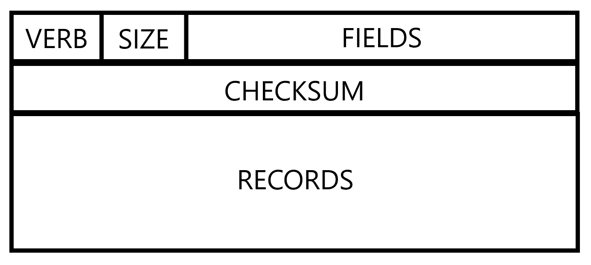

# 第十七章：.NET Core 中的可插拔协议

在前面的章节中，我们涵盖了与一般网络编程概念、挑战和模式相关的大量主题。在本章中，我们将看到如何利用这些知识在.NET Core 中定义自己的应用层协议。我们将了解**可插拔协议**的概念。我们将看到.NET Core 如何让您扩展`WebRequest`类以定义自己的网络交互标准和期望。我们将探讨如何注册您的新协议以便由`WebRequest`工厂方法使用。最后，我们将讨论这样做的好处，以及何时应该考虑使用它。

本章将涵盖以下主题：

+   理解可插拔协议

+   如何实现`System.Net`命名空间中`WebRequest`类的子类

+   支持基础设施，允许在.NET Core 中使用自定义通信协议

# 技术要求

要跟随本章中的代码示例，或者打开它们并根据自己的目的进行修改，你需要一个集成开发环境（IDE）或代码编辑器（当然，Visual Studio 或 Visual Studio Code），以及源代码，可以在以下位置找到：[`github.com/PacktPublishing/Hands-On-Network-Programming-with-C-and-.NET-Core/tree/master/Chapter%2017`](https://github.com/PacktPublishing/Hands-On-Network-Programming-with-C-and-.NET-Core/tree/master/Chapter%2017).

此外，我们还将继续利用我们偏好的 REST 客户端，所以请准备好 PostMan ([`www.getpostman.com/downloads/`](https://www.getpostman.com/downloads/)) 或 Insomnia REST 客户端 [(](https://www.getpostman.com/downloads/)[`insomnia.rest/`](https://insomnia.rest/)[)](https://www.getpostman.com/downloads/)[.](https://insomnia.rest/)

# 理解可插拔协议

要了解如何最好地利用可插拔协议，以及它们在您的软件中可能何时有价值，我们首先必须了解它们是什么。我们需要知道它们旨在解决什么问题以及它们是如何寻求解决这些问题的。因此，我们将从对可插拔协议的简单定义开始，然后探讨为什么我们可能想要使用它们。

# 什么是可插拔协议？

**可插拔协议**是一种自定义的应用层通信协议的实现，旨在与.NET Core 的`WebRequest`模型集成以处理网络交互。或者，更简单地说，这是.NET Core 如何支持非标准通信协议。就是这样。

在第五章*生成 C#网络请求*中，我们看到了简单的请求/响应模式在促进我们应用中与源无关的网络通信方面的强大功能。此外，我们还看到了.NET Core 框架如何通过支持开箱即用的`WebRequest`子类来减少这些类型交互的复杂性，这些子类支持我们源代码中最常见的应用层协议。然而，尽管框架本身为我们提供了常见协议的开箱即用实现，但可插拔协议实现模式为我们提供了一个入口点，通过它可以扩展该系统以支持较少见或定制的协议。它赋予我们定义自己的实现并将其配置为与框架类一样容易和可靠地使用的功能。

# 为什么使用可插拔协议？

让我们假设一下，你想要简化你软件生态系统中的两个关键资源之间的通信。为了实现这一点，你已经设计了一个高度优化的数据包结构和交互机制。头部的大小仅恰好足够以传达关于专有应用数据包的详细信息。让我们再假设这个协议使用一个简短的协商阶段，这个阶段发生在主机之间以促进数据传输。

由于这是专有的，你可以在每个应用中手动实现两个主机之间的交互。然而，这种方法并不完全随着你协议用户潜在增长而扩展。如果另一个团队决定他们也想利用你的优化协议，你将负责与他们沟通你程序交互的具体细节，这会给知识转移过程中的任何人都带来时间和生产力的成本。

另一方面，这种做法在你自己的团队人员流动方面有多大的持久性？如果你失去了对协议设计和使用有深入了解的原始团队成员，你需要让新团队成员加入以填补空缺。在两个网络主机之间编写专有交互机制需要增加新成员的入职时间。

如果，你不需要为你的协议的任何消费者使用定制的交互机制，而是可以将其封装在一个新用户已经熟悉的模式后面，会怎么样？使用可插拔协议，你就可以做到这一点。利用`WebRequest`和`WebResponse`类的约定和简单性的唯一先决条件是，你的协议的交互在最基本的概念层面上可以简化为人们已经理解的请求/响应模式。

通过将我们自定义协议的操作封装在`WebRequest`和`WebResponse`类的约定之下，我们可以减轻由专有协议引入的所有挑战。新的团队不再需要担心您头部结构的复杂性，或者找出启动数据传输所需的手势。您只需在您的自定义`WebRequest`子类中实现这些组件，并在成功获取响应后暴露生成的数据流。此外，引入新的团队成员不需要学习您协议复杂性的额外开销。

# 定义一个可插拔协议

尽管封装自定义通信协议可能带来的好处可能很明显，但在`WebRequest`和`WebResponse`类背后，您可能会惊讶地发现实现这个目标其实相当简单。您将面临的最大挑战是简单地学习在创建子类时需要覆盖或实现的方法和属性。但从高层次来看，创建一个可插拔协议相当直接。让我们看看您需要遵循的步骤，然后我们将在下一节中按照这些步骤实现我们自己的可插拔协议。

# 定义您的模式

如我之前在本节中提到的，可插拔协议代表了一种针对 Web 交互的自定义应用层协议。通过此协议在两个应用程序之间发送的请求需要以独特的方式进行处理。为了将您自定义协议中传输的请求与其他更常见的协议区分开来，您需要为其定义模式。

如您可能从第二章“DNS 和资源定位”中记得的，URL 的模式组件是路由器和 Web 主机确定如何尝试解析请求数据包的头部的方式。使用`http`或`https`模式表示接收主机，消息细节可以通过解析传入的字节流，根据 HTTP 头部的分区和界定标准来推导。因此，接收带有在请求 URI 中指定为`http://`的模式请求的主机将期望传入流的前几个字节指定 HTTP 动词、特定的资源路径和版本，之后是一个行终止字符，如下所示：

```cs
GET /some/resource HTTP/1.1
```

然而，假设您的协议旨在去除那些 HTTP 特定的消息细节。比如说，您正在设计一个接受任意数量的记录，记录字段具有单个固定长度的消息队列。现在，假设您的协议的请求消息以一个由管道分隔的值组成的头部进行格式化，这些值说明了数据包结构的各种细节，例如 0 索引的数据包长度、在头部中指定的可选细节的数量以及消息记录中每个字段的字节大小，这样您的消息头部看起来就像这样：

```cs
512|1|32
```

如果你使用`http://`方案发送消息，并且其接收到的第一行字节包含这些详细信息，消费应用会简单地响应一个`401 - Bad Request`状态。它无法解析头部的信息，因为它没有进行解析的正确上下文。这就是方案为远程主机提供的内容：解析其消息的初始上下文。因此，定义一个与其他自定义协议或方案（当然也与任何标准化协议，如 HTTP 或 FTP）不同的唯一方案非常重要。你的方案需要具有唯一可识别性，以确保在任何使用它的主机上都不会出现解析消息失败的情况。

# 实现你的协议交互

正如我在本节中至少提到过几次的那样，将你的协议作为可插拔协议实现的第一项任务是将其交互封装到最基本的请求/响应模式中。你需要在定义自身为`WebRequest`基类子类的类内部完成这项工作。在这个子类中，你的首要任务是覆盖`GetResponse()`和`GetResponseAsync()`方法。

这些方法是你定义任何自定义`WebRequest`特定交互的地方，包括定义消息发送的传输层，以及客户端接收到响应流之前应该发生的任何协议头部解析。当你打算创建`WebRequest`对象的子类时，编写这些类的自己的实现是你需要采取的最小步骤，以便编写传统的可插拔协议。

如果你的协议规范有任何额外的功能或方面需要考虑，例如认证机制或响应缓存，你还需要覆盖`WebRequest`类的这些方面。此外，任何不属于`WebRequest`类公共接口、特定于你的协议的内容，都需要通过一些特定于你的协议的方法或属性来暴露。

# 注册你的方案

现在你已经了解了如何区分来自我们协议的消息与其他应用层协议的消息，你需要通知应用程序上下文这样做。一旦你定义了你的方案，你就可以通过`WebRequest`类注册一个处理程序。

你可能还记得在第五章*，在 C#中生成网络请求*中，在*WebRequest 的子类*部分，我提到`WebRequest`的创建方法将为基于其指定方案的请求提供默认的子类实现。所以，如果你调用`WebRequest.Create("http://somedomain.com")`，返回给你的`WebRequest`实例将是`HttpWebRequest`类型的实例（尽管，正如我们在该节中以及在整个第九章，*在.NET 中的 HTTP*中已经看到的，到这一点上，`HttpWebRequest`类应该被认为是过时的）。

通过注册我们自定义的`WebRequest`类子类，并指定它应该使用的方案，我们可以获得相同的行为。用户不需要创建我们类的特定实例来使用它；他们可以直接调用`WebRequest.Create(<url>)`并传入一个 URL，其方案部分标识我们的协议。到那时，`WebRequest`类只是简单地返回一个我们指定的、用于处理该方案的类的实例。

现在我们已经知道了在.NET Core 应用中实现和集成可插拔协议所需的内容，是时候看到它实际应用了。

# 构建我们的自定义子类

我们首先想要做的是定义我们自定义协议的交互机制。这些交互将是我们区分我们的协议与其他应用层协议的方式。你可能还记得我在第十章中提到的*FTP 和 SMTP*，每个应用层协议都是设计来优化特定业务层应用任务的。这个原则也适用于你实现的任何自定义协议。为此，我们将定义我们的协议以满足一个非常具体的业务需求。当然，由于这完全是出于演示目的，我们不会关心它是否是我们业务需求的最优设计，但只关心它在交互中是否定义良好。一旦我们有了这个基础，我们就可以在我们的`WebRequest`子类中实现这个规范。

# 定义我们的协议

在本章的演示中，我们将使用一个针对向数据库服务器发送记录列表进行优化的新协议。因为我们可以随意命名我们的协议，而且我觉得这样做很有趣，所以我们将它称为**DwayneTheRockJohnson**协议，或者简称为**Rock**协议，它将在请求 URI 中使用`dtrj://`作为其方案指定。

在我们的协议中，请求消息将针对数据库中的特定表发送，其正文将包含对那个表进行任意数量更新的更新。我们将为我们的协议中的请求定义三个动词：DELETE，INSERT 和 UPDATE。带有任何给定动词的请求消息只能对表执行指定的更新，正文中的记录将是一个以管道符分隔的字段数组。为了我们的目的，我们的消息头部将包含以下格式的管道符分隔字段：

+   **VERB**：一个 2 位动词指示器：`00 = DELETE`，`01 = INSERT`，`10 = UPDATE`。

+   **SIZE**：一个 30 位字段，表示包括所有头部值在内的消息总大小，以字节为单位（提供最大 134 MB 的消息大小）。

+   **FIELDS**：一个 28 字节的字段，表示每条记录中有多少字段，允许的最大字段数大于任何现有数据库系统可能达到的。我们之所以选择这个，是为了使我们的头部与典型的 16 位字长保持一致的对齐。

+   **CHECKSUM**：消息正文的 32 字节安全哈希，以防止篡改。

在这个 64 字节的头部之后，其余的正文假定是一系列以管道符分隔的记录，我们的目标主机将能够根据头部中的**FIELDS**值和管道符分隔的约定来解析这些记录。综合来看，我们的 Rock 消息的结构将如下所示：



当服务器成功接收到一条消息时，其响应（假设一切处理得当），将包括以下头部：

+   **STATUS**：一个 2 位消息，表示对数据源更新尝试的成功情况：`00 = SUCCESS`，`01 = PARTIAL SUCCESS`，和`10 = FAILURE`

+   **TIMESTAMP**：一个 14 位时间戳，表示更新成功提交到数据库的时间

+   **SIZE**：一个 16 位字段，表示包含在消息中的大小，包括所有头部值，以字节为单位（提供最大 134 MB 的消息大小）。

这个 32 位头部将跟随任何包含在头部中的状态消息，以及头部中提供的状态代码，这可能包括有关哪些记录成功更新或为什么某些或所有记录未能更新的信息。有了这个，我们的响应将如下所示：


显然，在定义一个通信协议时，需要考虑的不仅仅是这里所提出的，但这对我们在.NET Core 项目中实现它们已经足够了。因此，既然我们已经知道了我们的模式定义将是什么样子，以及我们的协议应该如何组成和解析，那么我们就开始定义我们的`WebRequest`子类。

# 实现我们的协议

我们的首要任务是创建一个具有接受 `URI` 实例或简单 URI 字符串作为输入的构造函数的 `WebRequest` 子类。这是 `WebRequest.Create()` 方法在给定具有我们方案的 URI 时用来实例化我们的特定类的。我们将在一个简单的控制台应用程序中实现这个类，所以首先创建你的应用程序：

```cs
dotnet new console -n CustomProtocolDemo
```

接下来，创建一个用于我们的 `WebRequest` 子类的类，并定义其构造函数。在这个例子中，我将创建一个 `RockWebRequest` 类，其构造函数用于设置用于向目标主机发送请求时使用的 `URI` 实例：

```cs
public class RockWebRequest : WebRequest {
    public override Uri RequestUri { get; }
    ...

    public RockWebRequest(Uri uri) {
        RequestUri = uri;
    }
```

在这里，重要的是要注意，`WebRequest` 实例（或其任何子类的实例）旨在仅使用一次。后续请求需要额外的类实例。这就是为什么 `RequestUri` 字段（它从父类派生，但必须由我们的子类实现才能使用）是只读的，并且仅在初始化新实例时写入。它不会，也不应该，在请求创建后改变。

下一步，我们需要为我们的 `WebRequest` 类的用户提供一个机制，使他们能够定义要发送的记录以及那些记录上要使用的信息动词。这将使用户有机会在请求响应之前相应地配置他们的消息。为此，我们将为我们的报头和请求体定义几个属性。我们可以使用从 `WebRequest` 类派生的 `Method` 属性来定义我们的信息动词，但我更愿意在我们的组件中强制执行得更严格一些。我们将创建一个新的属性，其类型将是一个 `enum`，用于定义我们的三个可能的动词。使用 `enum` 也将给我们带来将用户提供的值映射到其底层 2 位表示的优点：

```cs
public enum RockVerb {
    Delete = 0b00000000000000000000000000000000,
    Insert = 0b01000000000000000000000000000000,
    Update = 0b10000000000000000000000000000000
}
```

在这里，我们用 32 位整数的最高有效位来表示我们的 2 位代码，以便特别容易与我们的 `size` 报头值执行位运算 `OR`。

接下来，我们将在我们的 `RockWebRequest` 上定义相应的属性。此外，我们还将定义一个 `IEnumerable` 用于任何给定请求中要发送的记录，以及一个 `int` 用于存储每条记录中的字段数。由于我们希望我们的协议能够处理任意的记录定义，但又不想花费太多时间编写足够的序列化代码和泛型对象解析器，因此我们将定义我们的记录为字符串，并让消费者为他们的记录列表生成一个管道分隔的格式：

```cs
public RockVerb Verb { get; set; } = RockVerb.Update;
public IEnumerable<string> Records { get; set; }
public long Fields { get;set; }
```

在这里，我们将默认我们的`Verb`为`Insert`。为了演示的目的，我们将说`Update`操作只有在没有与要插入的记录具有相同键的现有记录时才会工作。有了这个规则，`Insert`是唯一安全执行的操作，因为它永远不会意外地覆盖现有数据。鉴于这一点，它非常适合我们的默认`Verb`值。然而，一旦这个值就位，我们就准备好实现我们的`GetResponse()`和`GetResponseAsync()`方法。我们的头部的其他属性可以在不使用用户输入的情况下推导出来，因此我们将在这两个方法中这样做。

# 实现请求管道

实现我们的可插拔协议的下一步，也是最后一步，是为我们的消息定义请求和响应行为。我们将首先重写同步的`GetResponse()`方法。此方法将负责构建具有适当值的字节流，以符合我们的头规范，并通过我们选择的传输协议提交。对于这个演示，我们将使用 TCP，因为我们已经在第十一章，“传输层 – TCP、UDP 和多播”中看到了如何这样做。

在决定使用哪种传输层协议来支持您可能编写的任何自定义应用层协议时，请尽可能多地考虑和思考。任何传输层协议的性能和特定用例都可能对您自定义协议的性能产生与设计中的任何其他方面一样大的影响。始终尝试使用适合手头工作的正确工具。

与我们所有的演示一样，我们将假设我们的软件的消费者始终适当地使用它，因此我们将放弃任何请求前的验证。我们只假设我们为消息体配置了一些记录，并且我们的动词已经适当地定义。

在这一点上，根据我们的协议检查构建和发送消息的高级工作流程对我们来说将大有裨益。由于我们假设在尝试发送请求之前我们有记录可用（并且我们的服务器将承担验证我们数据的责任），我们将通过连接每个记录（我们的用户已经方便地将每个记录的所有字段序列化为以管道分隔的字符串）来构建我们的消息体，并且用管道分隔每个记录。接下来，我们将连接的字符串转换为字节数组。从那里，我们将构建我们的校验和哈希，以及定义我们的消息大小。然后，我们将构建包含我们的头和消息体的完整字节数组，并将它们写入针对指定主机 URI 的`TcpClient`流。

将其付诸实践，我们首先生成我们的消息字节数组：

```cs
public override WebResponse GetResponse() {
    var messageString = ConcatenateRecords();
    var message = Encoding.ASCII.GetBytes(messageString);
```

在以下代码中，实际的连接操作发生在单独的私有方法中，以帮助提高我们代码的可读性：

```cs
private string ConcatenateRecords() {
    StringBuilder messageBuilder = new StringBuilder();
    foreach (var record in Records) {
        if (messageBuilder.ToString().Length > 0) {
            messageBuilder.Append(Environment.NewLine);
        }
        messageBuilder.Append(record);
    }
    return messageBuilder.ToString();
}
```

如你所见，我们使用与我们在记录中分隔字段相同的管道分隔符来分隔记录。我们有这样的自由，因为我们的`fields`报头通知服务器每条记录应解析多少个单独的字段。使用与字段相同的分隔符来记录可以节省服务器寻找记录结束的异常情况。它只需查找分隔符字符的下一个实例，并据此进行操作，当上一个记录的字段计数达到时，开始新的记录。

接下来，我们将根据我们的请求体内容计算校验和。如果你真正定义了自己的协议用于商业目的，你可能会允许客户端从他们有实现的哈希算法中选择。然而，对于我们来说，我们只需说它总是使用 SHA-256 进行计算。一旦我们计算出了哈希值，我们就可以根据客户端提供的值设置我们的`VERB`位。接下来，我们将确定我们的数据包大小（64 字节头加上我们的消息字节数组的长度），并将所有字节写入二进制流。在我们的`GetResponse()`方法中，这简单地如下所示：

```cs
var byteList = new List<byte>();

var checksum = SHA256.Create().ComputeHash(message);

byteList.AddRange(GetHeaderBytes(message.Length));
byteList.AddRange(checksum);
byteList.AddRange(message);
```

`GetHeaderBytes(message.Length)`方法用于将我们的`Verb`的二元值、给定消息的大小和`Fields`属性转换为 32 字节头，该头位于 32 字节校验和之前。该方法相对简单，只是对适当的值应用了一些位操作，如下所示：

```cs
private IEnumerable<byte> GetHeaderBytes(int messageSize) {
    var headerBytes = new List<byte>();
    int verbAndSize = (int)Verb | (messageSize >> 2);
    headerBytes.AddRange(BitConverter.GetBytes(verbAndSize));

    //Add empty byte padding in the FIELDS header
    for (var i = 0; i < 20; i++) {
        headerBytes.Add(0b00000000);
    }

    headerBytes.AddRange(BitConverter.GetBytes(Fields));
    return headerBytes;
}
```

一旦计算出了该报头值，我们就可以将其应用于输出字节流，随后是校验和，然后是我们的请求消息的字节数组。最后，由于我们已经声明我们的协议将使用 TCP 作为其底层传输机制，我们将创建我们的`TcpClient`实例，连接到由`RequestUri`字段指定的主机和端口。再次强调，我们将对能够连接到指定的 URI 做出很多假设。在现实情况下，你将实现你的`TcpClient`连接，并具有更健壮的错误处理和连接验证，正如我们在第十一章中所述，*传输层 - TCP 和 UDP*。然而，现在，我们只需假设我们的连接成功，将我们的字节写入我们的`NetworkStream`实例，然后将它传递给我们的`RockWebResponse`实例，并从我们的方法中返回它：

```cs
    TcpClient client = new TcpClient(RequestUri.Host, RequestUri.Port);
    var stream = client.GetStream();
    stream.Write(byteList.ToArray(), 0, byteList.Count);
    return new RockWebResponse(stream);
}
```

这完成了我们对`GetResponse()`方法的实现。显然，在实践上实现`GetResponseAsync()`方法将看起来非常相似，但我们将使用我们在第六章中建立的异步编程模式，*流、线程和异步数据传输*。我将把它留给你作为练习，在我们的`RockWebRequest`类中实现这个特定的方法。

# 从`WebResponse`类派生

如您可能已经注意到的，我们的 `RockWebRequest` 的 `GetResponse()` 方法返回一个 `RockWebResponse` 类的实例。这是编写可插拔协议的实现硬币的另一面。您必须定义一个处理程序，可以从响应流中剥离和验证任何特定于协议的元数据或头信息，并将它们存储在您自定义的 `WebResponse` 类的只读属性中，然后再将响应流返回给调用它的方法。用户期望从您的可插拔协议中获得的一个关键好处是，它们将抽象出从响应字节流中解析和操作特定于协议信息的所有细节。

我们为此演示的实施方案将非常简单。我们只是试图说明如果你未来承担这个任务时需要采取的概念性步骤。然而，由于可插拔协议的高度特定性，任何超出这一高级概念性方法的内容最终都将证明是徒劳的。鉴于这一点，我们的完整 `RockWebResponse` 类如下所示：

```cs
public class RockWebResponse : WebResponse {
    private Stream _responseStream { get; set; }
    public DateTime TimeStamp { get; set; }
    public RockStatus Status { get; set; }
    public int Size { get; set; }

    public RockWebResponse(Stream responseStream) {
        _responseStream = responseStream;

        byte[] header = new byte[4];
        _responseStream.Read(header, 0, 4);
        var isValid = ValidateHeaders(header);
    }

    public Stream GetResponseStream() {
        return _responseStream;
    }

    private bool ValidateHeaders(byte[] header) {
        //validate headers
        return true;
    }
}
```

我们首先定义了用户可能关心的每个相关头值的公共属性。在这里，我们定义了一个简单的 `RockStatus` 枚举来捕获我们三种可能的状态，并将时间戳头值表示为 `DateTime`。

类定义的核心在于其构造函数。在这里，我们的 `RockWebResponse` 实例负责从响应流中解析头值，并用它们对应的值填充其实例属性。请注意，我们从流中读取了前 4 个字节，这对应于我们的 32 位头定义。一旦完成，我们就将字节数组传递给我们的头验证函数，并返回我们的新实例（当然，在生产代码中，您会在验证失败时抛出错误，而不是返回一个新实例）。由于我们在将实例返回给消费者之前已经从响应流中读取了头信息，因此对 `GetResponseStream()` 的调用将返回只包含响应体的流。

通过定义这个特定于协议的响应处理程序，我们（在概念上）完成了可插拔协议的实现。如果您真正想要创建一个有效的 `WebRequest` 子类，您还必须重写许多其他方法，并且微软文档中有大量关于具体需要什么的信息。然而，按照我们在这里建立的模式，当需要这样做时，您应该处于正确的思维状态来处理这些任务。到目前为止，我们唯一剩下的事情就是通过 `WebRequest` 工厂方法将其暴露给其他工程师，我们将在下一节中探讨这一点。

# 利用自定义协议

定义我们的可插拔协议实际上是在`WebRequest`和`WebResponse`范式下定义我们自定义协议的特定交互。现在我们已经做到了这一点，但我们必须通知`WebRequest`类我们已经满足了任何寻求使用我们方案的消费者使用的要求。这意味着我们需要定义一个工厂类来创建我们派生类的实例。

# 实现`IWebRequestCreate`接口

我们希望将我们的类与`WebRequest`类注册，以便当使用适当的方案调用`WebRequest.Create(<uri>)`方法时，返回`RockWebRequest`的实例。然而，为了做到这一点，我们需要向`WebRequest`提供一个工厂类，该类可以按需构建我们`RockWebRequest`类的良好格式实例。这种行为由`IWebRequestCreate`接口定义，这就是我们需要在我们的工厂类中实现以注册其与`WebRequest`一起使用的接口。

这个接口的足迹，幸运的是，极其简单。实际上，它只有一个方法。我们整个实现不到一打行代码：

```cs
public class RockWebRequestCreator : IWebRequestCreate {
    public WebRequest Create(Uri uri) {
        return new RockWebRequest(uri);
    }
}
```

通过这种方式，我们可以将我们的自定义协议类注册为在`WebRequest.Create(<uri>)`方法中给出的 URI 中出现我们的方案时使用。只需在应用程序启动时调用`RegisterPrefix()`方法即可：

```cs
WebRequest.RegisterPrefix("dtrj", new RockWebRequestCreator());
```

现在，你的自定义`WebRequest`类将可以自由地响应具有指定方案的 URI。

# 超越`WebRequest`

在撰写本书时，Microsoft 对`WebRequest`类的文档明确建议不要使用`WebRequest`或其任何子类。建议开发人员编写新软件时使用`HttpClient`或类似类。那么，这对可插拔协议的价值或用途意味着什么呢？

简而言之，这意味着你的工作还没有完全完成。正如我在第五章中提到的，*在 C#中生成网络请求*，`WebRequest`和`WebResponse`类仍然以某种形式在`HttpClient`类的底层运行。通过这些类定义你的协议交互仍然是实现.NET Core 中自定义协议的一个基本部分。从这些类派生出来为你提供了直接解析和处理你选择的任何传输协议的`NetworkStream`中的应用头部的灵活性。实际上，甚至指定你的传输协议这样的功能也无法使用`HttpClient`类来实现。这种对你原始协议请求的控制只能通过像`WebRequest`或`WebResponse`这样的工具来实现。

然而，随着新开发者持续地远离`WebRequest`和`WebResponse`的约定，你需要定义更多现代的抽象来保持你的协议库的相关性。为此，如果你发现自己需要定义自定义协议交互，考虑定义一个标准化的客户端实现。你的客户端可以（也许*应该*）继续利用从`WebRequest`和`WebResponse`类派生的可插拔协议。

然而，通过为处理这些请求和响应定义一个干净的抽象，你为你的库用户提供了一个更容易使用、更容易理解的工具。如果你发现自己正在编写任何自定义通信协议，如果你想看到它在.NET 社区中得到更广泛的采用，请记住这一点。

有了这些，我们可以结束对可插拔协议的讨论。在下一章中，我们将继续探讨高级、低级主题。在那里，我们将探讨网络分析和数据包嗅探策略，以更深入地了解你的网络软件存在的更广泛环境。

# 摘要

本章深入探讨了.NET Core 中可插拔协议的非常狭窄的主题。我们了解到，可插拔协议实际上只是任何你想要定义的自定义应用层通信协议在框架中的表示。在我们建立这种理解的基础上，我们考虑了为什么我们应该花时间在我们的代码中将新的通信协议实现为可插拔协议。我们看到了另一种选择——在我们的整个应用程序中使用自定义、特定协议的代码——引入了时间和生产力成本，这可以通过简单地实现`WebRequest`和`WebResponse`类的自定义子类来几乎完全消除。

在我们确立了使用可插拔协议的理由之后，我们研究了在我们的项目中如何实现这一点。我们了解了实现可插拔协议必须遵循的三个核心步骤。在我们这样做的时候，我们了解到每个步骤都服务于创建我们自定义协议的干净、基于约定的抽象。最后，我们研究了如何在我们的软件中实现不同的协议。我们设计了自己的测试协议，然后采取了必要的步骤来实现处理该测试协议交互的`WebRequest`和`WebResponse`子类。

最后，我们研究了如何将我们的新类直接集成到`WebRequest`和`WebResponse`框架中，以便为新开发者提供一个无缝的过渡，他们可能想利用我们的工作。在我们结束的时候，我们了解了我们应该采取的下一步，以保持与更现代的抽象模式的一致性，即在特定协议的`Client`类后面抽象交互。在下一章中，我们将探讨如何分析我们宿主机的网络接口和网络流量状态，以及这种能力为我们打开了哪些类型的应用程序。

# 问题

1.  什么是可插拔协议？

1.  将协议实现为可插拔协议有哪些优势？

1.  在.NET Core 中构建可插拔协议需要哪些步骤？

1.  为什么精确的架构定义对于监听服务器处理请求很重要？

1.  你需要覆盖`WebRequest`方法的最低占用空间是多少来实现可插拔协议？

1.  你必须提供哪些额外的接口来注册你的可插拔协议，以便由`WebRequest.Create()`方法使用？

1.  你应该采取哪些额外步骤来使你的可插拔协议的采用更加容易且与现代惯例保持一致？

# 进一步阅读

由于这是一个在广泛框架中相对小众的主题，关于可插拔协议本身的特定主题，没有太多推荐的阅读材料。然而，如果你对可能促使需要自定义协议实现的环境和架构感兴趣，我建议查看*Heartin Kanikathottu*的《Serverless Programming Cookbook》。它从云平台托管源代码的各种网络交互讨论中，描绘了一个令人信服的新、优化的通信范例图景。你可以在 Packt 找到它：[`www.packtpub.com/application-development/serverless-programming-cookbook`](https://www.packtpub.com/application-development/serverless-programming-cookbook)[.](https://www.packtpub.com/application-development/serverless-programming-cookbook)
