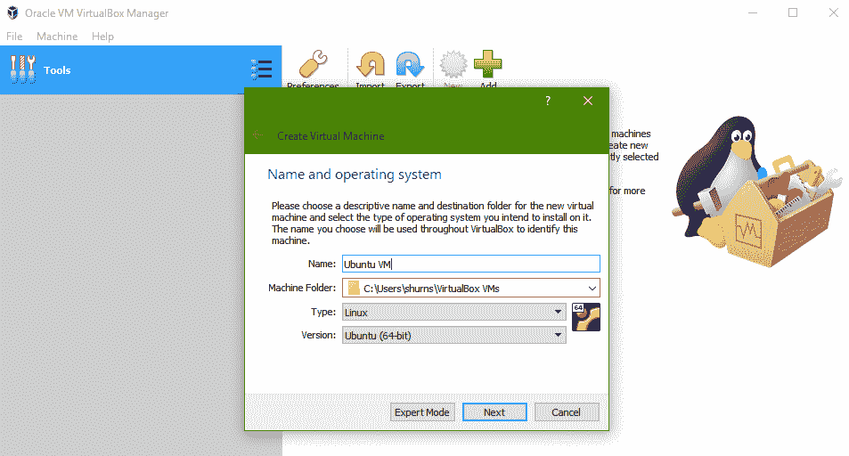
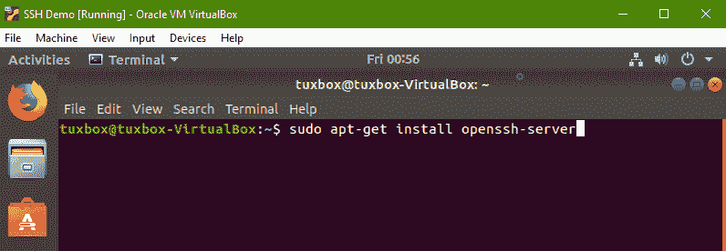
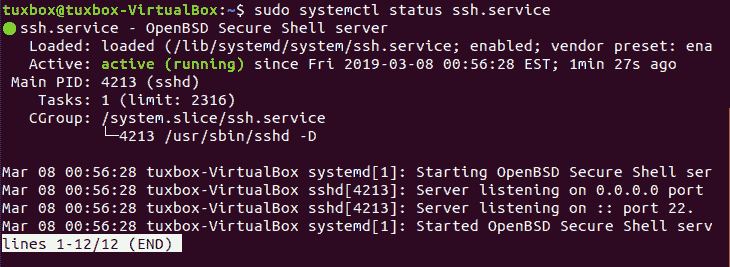
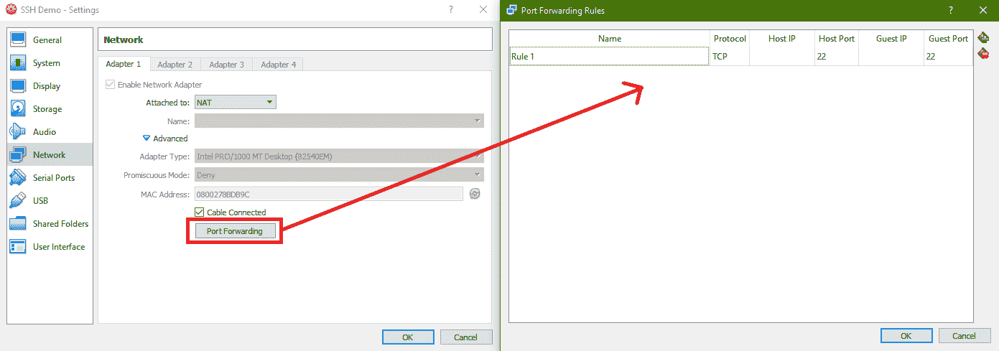
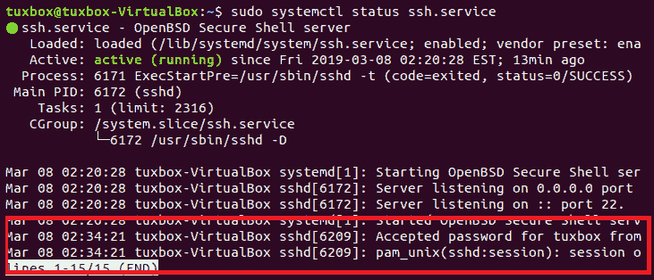
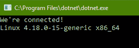
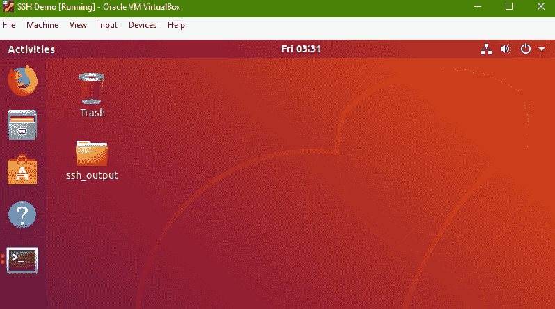

# 第十九章：远程登录和 SSH

在本章的最后一章中，我们将探讨如何在.NET Core 中实现远程主机访问和控制。在这里，我们将创建一个用于远程访问网络中计算资源的**安全壳**（**SSH**）客户端。我们将探讨 SSH.NET 库如何支持调用已知的外部资源，并探索 SSH.NET 库的底层源代码，以了解它如何在.NET Core 中支持 SSH。最后，我们将探讨如何利用它通过网络在远程机器上执行各种操作。

本章将涵盖以下主题：

+   用于远程设备访问和进程执行的 Secure Shell 协议

+   使用.NET Core 建立 SSH 连接

+   通过 SSH 连接在远程机器上执行远程命令

# 技术要求

在本章的最后一章中，我们将使用我们信任的源代码编辑器，无论是 Visual Studio 还是 Visual Studio Code，我们将开发并讨论本书 GitHub 仓库中找到的源代码，这里：[`github.com/PacktPublishing/Hands-On-Network-Programming-with-C-and-.NET-Core/tree/master/Chapter%2019`](https://github.com/PacktPublishing/Hands-On-Network-Programming-with-C-and-.NET-Core/tree/master/Chapter%2019)。

我们还将使用免费的（免费的意思是免费）虚拟机主机 VirtualBox 来为我们设置一个虚假的远程主机，以便我们通过 SSH 软件与之交互。如果您想跟随本章中的演示，可以使用您自己机器上已有的任何虚拟化软件。但重要的是，您需要有一个虚拟主机来与之交互。VirtualBox 的安装程序可以在以下位置找到：[`www.virtualbox.org/wiki/Downloads`](https://www.virtualbox.org/wiki/Downloads)。

最后，我们将使用 Ubuntu 操作系统的安装版加载到我们的虚拟机中。Ubuntu 是免费和开源的，该操作系统的磁盘镜像可以在以下位置找到：[`www.ubuntu.com/download/desktop`](https://www.ubuntu.com/download/desktop)。

查看以下视频以查看代码的实际操作：[`bit.ly/2HYQMSu`](http://bit.ly/2HYQMSu)

# 什么是 SSH？

从一开始，理解我们如何在软件中利用 SSH 的第一步是了解 SSH 是什么，以及它是如何工作的。简单来说，SSH 是一种用于安全登录远程主机的网络协议。一旦建立了远程登录，该协议支持在未加密的网络上执行和操作远程资源。与本书中探索的所有协议一样，其设计有意地通用化，以便在各种环境中使用。那么，它是如何开始的，具体又是如何工作的呢？

# SSH 的起源

SSH 是由芬兰研究人员 Tatu Ylönen 在 1995 年最初创建的，旨在提供一个安全的通道，通过该通道可以建立远程终端访问。Ylönen 是由当时他在赫尔辛基科技大学网络中遭遇的最近的一次密码嗅探攻击所激发的。他认识到更常见的（或者至少在当时更常见的）基于文本的远程终端协议（如 Telnet、rlogin 和 FTP）固有的不安全性，他的主要目标是创建足够强大的身份验证和加密，以确保网络通信的隐私。通过他的工作，用户可以远程登录到机器，并通过自己的 SSH 接口访问和操作远程机器的终端。

原始版本以及随后的 1 版本的后续小版本是由 SSH Communications Security 开发的，这是一家由 Ylönen 创立的私营网络安全公司。然而，从 2.0 版本开始，一个名为 **Secsh** 的 IETF 工作组负责定义和改进该协议。Secsh 团队的工作在 2006 年被正式化和接受为标准，被称为 **SSH-2**。

随着 SSH-2 的发布，团队通过使用改进的密钥交换算法来建立通信的对称密钥，从而提高了 SSH-1 的安全性和功能集。新版本还引入了安全散列消息认证码（HMAC 代码，不要与我们在第十八章网络分析和数据包检查中讨论的 MAC 地址混淆）来安全地散列消息。SSH-2 引入的特性之一是支持通过单个 SSH 连接进行多个并行终端会话。

尽管 SSH 最初是基于免费软件构建并作为免费软件发布的，但该协议已经分裂，存在于各种开放和专有实现和版本中。然而，全球的开发者继续需要该协议的开源实现。为了解决这个问题，开发了新的开源实现，并建立了坚实的基础。这包括由 OpenBSD 后台开发社区开发的 OpenSSH 实现，该实现首次于 1999 年发布。今天，OpenSSH 是该协议套件中最广泛使用的实现，并且是现代 Windows 机器唯一使用的实现。

如果你曾经使用过 GitHub 或 BitBucket 作为远程 Git 仓库，你很可能已经使用了 OpenSSH，甚至可能都没有意识到。许多 Git 客户端，包括 Atlassian 的源树，甚至是默认客户端，都利用 SSH 在您的机器和远程代码仓库之间建立和维护访问凭证。由 SourceTree 支持的单一登录机制完全建立在 OpenSSH 之上。实际上，每次您启动 SourceTree 时，启动过程也会启动一个 PuTTY SSH 客户端的实例，SourceTree 使用它来与您的远程仓库建立自己的连接。但现在您已经知道了 SSH 是什么，我们应该花一点时间来看看它是如何工作的。

# SSH 协议设计

SSH 协议利用客户端-服务器架构，这与我们在整本书中检查的应用层协议（如 FTP 和 HTTP）并不完全不同。基本交互机制实际上看起来非常类似于 TLS 握手过程中发生的握手和安全协商。基本交互如下：

+   客户端与服务器建立连接，通知服务器希望通过 SSH 进行通信

+   服务器确认请求，并响应以公共加密密钥信息，客户端可以使用这些信息来保护其后续的响应，直到可以建立对称加密方案

+   服务器和客户端协商连接的安全结构，传输任何必要的密钥，并在 SSH 会话的生命周期内建立用于安全通信的对称加密机制

+   客户端可以自由安全地登录到远程主机，传输和执行其凭证有权限的命令

SSH 与 TLS 等东西之间的主要区别在于，SSH 被明确设计为通用和连接无关。

这种交互方案由一个由 IETF（4251-4256，如果您感兴趣）定义的一系列 RFC 支持的架构支持，它是一个具有明确责任的三层组件系统。每一层都在客户端和服务器之间建立和维护 SSH 会话的过程中支持特定的任务，并且它们都由各自的标准进行了很好的记录。

# 传输层

这些层级中的第一个是传输层协议，或**SSH-TRANS**，它提供了与 TLS 中期望的所有功能的安全消息传递。由于 SSH 完全是关于安全通信的，因此传输层提供强大的身份验证和加密机制非常重要。这应该包括服务器身份验证（通常通过 X.509 或类似的证书验证机制）、公钥加密和消息验证。

虽然 RFC 4251 指出，在大多数情况下，传输层很可能会在 TCP/IP 上实现，但它为新的或替代协议留出了空间。对于 SSH 而言，传输层协议必须具备的仅是传输的可靠性。这排除了 UDP 和其他无连接协议作为可行的传输机制，因为无连接数据报传输被认为是固有不可靠的。

# 用户认证层级

下一个，也许是最关键的，SSH-2 架构层级是**认证协议层**，或**SSH-USERAUTH**。这是负责为任何试图连接到 SSH 服务器的客户端建立和维护验证身份的层级。根据 RFC 4252，服务器负责建立客户端可能使用的有效认证方法集。从该认证方法集中，客户端可以自由选择任何可用方法，并且可以自由尝试任何顺序。根据 RFC，服务器可能列出三种有效的认证方法供客户端尝试认证。

# 公钥认证模式

根据标准，这些方案中的第一个，也是 SSH-2 服务器实际上必须支持的，是`publickey`认证方案。然而，尽管所有服务器都必须支持使用公钥认证的能力，但并没有要求所有客户端都必须拥有公钥。公钥方案的行为与我们第十三章中看到的非常相似，即*传输层安全*。当指定`publickey`方法时，SSH 客户端将发送一个由私钥生成的签名到服务器。一旦收到，服务器将验证该签名是否由用户的私钥生成，并在验证成功后，客户端的认证成功。

客户端软件通常将注册的私钥以加密值的形式存储在本地系统上，并限制外部进程对其的访问。SSH 客户端通常也会在生成用于传输到服务器的公钥签名之前，使用某种形式的密码认证，尽管这并非总是必需的。

# 密码认证模式

服务器可能为客户端指定的下一个有效认证机制是**密码认证方案**。虽然标准并未明确要求支持密码方案，但强烈建议实现应支持密码认证*.* 在此认证机制中，正如其名所示，连接的客户端在一系列数据包协商过程中向服务器提供明文密码。

由于 SSH-2 架构的用户认证层建立在传输层之上，因此密码以明文形式传输的事实应该通过底层传输协议的安全加密来缓解。然而，RFC 4252 确实规定，在发送明文密码之前，服务器和客户端都有责任确认传输层加密机制的机密性。如果客户端或服务器确定传输协议没有使用加密，或者加密不足，则客户端和服务器应禁用密码认证模式。

服务器在实现密码认证方案时，应提供一种机制，允许用户在认证过程中更改或更新他们的密码，以防用户的密码已过期。这使用户能够在远程终端上通过 SSH 连接建立机制输入和更新他们的密码。然而，与客户端和服务器应在允许密码认证模式之前验证传输层提供足够的安全性一样，他们还必须在支持密码更新机制之前确定是否存在足够的数据完整性支持。这是因为，如果数据在传输过程中被变异或修改，没有某种形式的完整性检查，服务器和客户端都不会知道这种差异。

因此，服务器将为用户的未来认证尝试分配新的、变异的密码，但客户端将不知道这种变异，并且将随后无法使用原始的、未修改的密码进行认证。因此，如果没有 MAC 或 HMAC 作为传输层发送的数据包的一部分提供数据完整性保证，则服务器必须禁用任何密码更新功能。

# 基于主机的认证模式

最终的认证模式是`基于主机`模式。这是唯一在标准中被明确指出为可选的模式，它允许用户根据他们连接的主机进行认证（因此得名）。此模式依赖于一个指定的主机机拥有为特定主机机配置的私钥。然后主机从该私钥生成一个签名，该签名可以使用主机的公钥由服务器进行验证。然后，该签名与公钥和特定主机名进行验证。只要带有签名的提供的主机名与请求的来源以及服务器有效主机注册表相匹配，认证就成功。

# 连接层

SSH-2 架构的连接层旨在在传输层和用户认证层之上运行，定义了支持通过 SSH 连接可用的各种操作和交互的系统。在 RFC 4254 中定义，堆栈的连接层被描述为提供执行 SSH 功能的**连接**通道。这包括任何客户端可以执行远程命令的远程终端会话，以及允许客户端直接访问远程主机上的网络连接端口的端口转发会话，以及任何用于在远程主机内部导航和与之交互的远程登录会话。

根据 RFC，单个 SSH 连接应在会话期间实现支持多路复用多个通道。这些通道在连接的两端都是唯一标识的，尽管标识符可能从服务器到客户端不同。一旦通道打开，数据就可以在所谓的**窗口**中在主机之间流动。窗口简单地是一个指定字节数的最大值，一个主机在进一步的数据被阻塞之前可以传输给另一个主机。一旦达到窗口大小，发送主机必须等待接收主机调整窗口。通过这种方式，窗口被用来控制给定 SSH 连接通道上的流量。

在给定 SSH 连接上配置的一系列通道建立了一个所谓的**交互会话**。根据标准，交互会话仅仅是客户端在服务器上远程执行程序的行为。这可以包括端口或认证转发、会话数据传输，或任何数量的其他工作、任务和活动。

# SSH 的通用性

由于 SSH 主要关注在非安全网络上建立安全连接，因此它的应用范围相当广泛。当然，它可以提供远程终端交互机制，这是它旨在取代的协议的一部分。当客户端和服务器之间使用公钥/私钥建立时，它可以作为一个无密码认证机制使用，就像 GitHub 和 BitBucket 中的 OpenSSH 那样。

# 与 FTP 一起使用

虽然 FTP 可以提供一种可靠的服务器-客户端交互机制，用于在主机之间传输文件，但它通常不会以安全的方式进行。因此，当需要在主机之间安全地复制或传输文件时，会大量使用 SSH。事实上，FTP 的安全协议规范依赖于 SSH，并明确称为**SSH 文件传输协议**，或**SFTP**。SSH 提供的 shell 甚至可以允许**安全复制**（**scp**）Linux 程序通过远程连接执行。

如您从第十章，“FTP 和 SMTP”中可能记得，FTP 利用两个独立且不同的连接进行其文件传输交互：控制连接和数据传输连接。有趣的是，由于 FTP 利用这两个独立的连接，您可以选择性地将 SSH 应用到这两个连接中的任何一个，而不管您是否也在另一个连接上使用了 SSH。这种精确的交互机制被 **快速安全协议**（**FASP**）所使用。

# 作为网络隧道使用

当远程 SSH 服务器被正确配置时，它可以为客户端与更广泛的互联网的交互提供一系列网络安全特性和功能，包括端口转发的能力，即客户端建立一个监听网络端口，并将其直接连接到远程主机上的监听网络端口的输入流。在这个机制中，发送到远程主机端口的任何流量都将被客户端主机的监听端口接收和处理。这可能会允许位于防火墙或受限网关后面的客户端设备与位于限制边界之外的远程设备建立 SSH 连接，并开始监听不受限制的网络访问。

将这个想法进一步扩展，**OpenSSH** 甚至提供了客户端和服务器之间完全加密的 VPN 服务支持。这通过绕过两个主机之间的任何网关、交换机或桥接器，为两个主机之间提供了完全加密的交互，从而创建了一个具有安全交互和受限访问的逻辑“本地”网络。

虽然将 SSH 的可能应用描述为无穷无尽可能有些夸张，但它们确实非常广泛。因此，它们值得您的兴趣和探索。考虑到这一点，让我们看看我们如何在软件中开始利用 SSH。

# 建立 SSH 连接

虽然 .NET Core 在其自身库中缺乏建立 SSH 会话的原生支持，但存在许多第三方库和 NuGet 包可以填补这一空白。我们将探讨其中最受欢迎的包之一，SSH.NET，并看看我们如何使用它来连接到远程机器并通过虚拟终端与之交互。

# 设置远程主机

为了演示目的，我们需要设置一个远程主机以便我们进行 SSH 连接。为此，我们将使用配置在我们的系统上的 Ubuntu 虚拟机，使用**VirtualBox**进行配置。我们将在机器内部安装和操作 Ubuntu 镜像。为了设置它，你需要在 VirtualBox 中创建一个新的虚拟机，点击新建按钮并按照向导操作。在向导中，你将有机会给你的机器命名，并选择操作系统类型（Windows、Linux、macOS X 等）和具体版本。为此，我们将选择 Linux 作为类型，Ubuntu 64 位作为版本，如下所示：



在设置虚拟机时，请确保至少提供足够的资源以满足 Ubuntu 的最小安装要求，包括 8GB 的虚拟磁盘空间和 2GB 的内存。一旦我们设置了机器，我们还需要在机器上安装 Ubuntu。使用我在技术要求中提到的镜像，在你的新配置的虚拟机上安装 Ubuntu。在安装操作系统时，确保在提示创建用户账户时，要求输入密码登录。这将允许我们演示 SSH 远程登录的使用。

一旦你在配置的虚拟机上安装了 Ubuntu，你需要在机器上启用 SSH。为此，打开机器的终端并运行以下命令：



一旦运行该程序，你应该会看到一系列的安装脚本，之后你的 SSH 服务器就已经安装完成了。你可以通过运行以下命令来检查 SSH 服务器的状态：



完成这些后，我想就我们的设置说明几点。首先，请注意虚拟机与我自己的机器完全独立，拥有唯一的用户和主机名。其次，请注意端口正在监听端口`22`。这是 SSH 服务器默认监听的端口，我们将在 C#项目中与远程机器建立连接时使用这个细节。

最后，我们需要知道如何从我们的机器与我们的虚拟主机交互。为此，我们将在虚拟机上设置端口转发，以便将针对我们主机上指定端口的请求转发到我们的虚拟机上的指定主机。这将使我们建立连接时更加方便。为此，你需要在运行实例的网络设置中打开高级选项，然后打开端口转发对话框。从那里，我们将转发所有的 SSH 连接尝试，这些尝试始终会连接到端口`22`，到我们的虚拟主机（虚拟机）上的监听 SSH 端口：



一旦我们配置好，我们只需向我们的本地主机 IP 地址`127.0.0.1`发送请求，由于这是一个针对端口`22`的 SSH 请求，请求将被转发。因此，现在是时候连接 SSH.NET 并建立连接了。

# 使用 SSH.NET 连接到 SSH 服务器

就像我们所有的项目一样，我们的首要任务是使用命令行界面（CLI）来创建它。为此演示，我们将使用另一个控制台应用程序，所以请导航到您的目标目录，并在您的命令提示符中运行以下命令：

```cs
dotnet new console -n SshDemo
```

由于 SSH.NET 不是随.NET Core 一起提供的库，我们需要添加这个包。您可以通过 Visual Studio 中的 NuGet 包管理器或使用.NET Core CLI 从项目文件目录文件夹中安装所需的包来完成此操作。后一种方法的 CLI 命令如下：

```cs
dotnet add package SSH.NET --version 2016.1.0
```

现在，当您打开您的`Program.cs`文件时，您可以通过添加以下`using`指令来包含引用：

```cs
using Renci.SshNet;
```

然后，我们就准备好建立连接了。SSH.NET 库提供了丰富的抽象，用于根据标准与 SSH 服务器交互。这包括封装认证模式、连接信息和，当然，我们可以像使用`TcpClient`和`HttpClient`类一样简单地使用的`SshClient`类。

对于这个初始演示，我们只想使用远程机器的登录凭证建立 SSH 连接。目的是向您展示您如何使用该主机的凭证建立对主机的远程访问。我们将使用密码认证模式，并传递我们在安装 Ubuntu 实例时在 VirtualBox 中创建的用户名和密码。然后，我们将创建一个新的`SshClient`实例并尝试连接。相应的代码如下：

```cs
public static async Task Main(string[] args) {
    AuthenticationMethod method = new PasswordAuthenticationMethod("tuxbox", "xobxut");
    ConnectionInfo connection = new ConnectionInfo("127.0.0.1", "tuxbox", method);
    var client = new SshClient(connection);
    client.Connect();
    if (!client.IsConnected) {
        Console.WriteLine("There was an error establishing the connection!");
    } else {
    Console.WriteLine("We've connected!");
    Thread.Sleep(10000);
}
```

在我们的第一行中，您可以看到我们正在创建一个`PasswordAuthenticationMethod`类的实例，提供了我们的用户名和密码。对于我们所讨论的每种认证模式，都有相应的类，包括一个我们没有提到的，即`KeyboardInteractiveAuthenticationMode`类。这个类简单地提供了一个用户通过开放的连接终端直接进行认证的方法，而不是在客户端和服务器之间来回传递凭证。

一旦我们创建了`AuthenticationMethod`类，我们就将其传递给`ConnectionInfo`类的实例。这个类简单地封装了主机、用户名、认证方法和可选的端口号（默认为`22`）的指定，用于建立 SSH 连接。最后，将连接信息传递给我们的`SshClient`。`SshClient`实例仅初始化为连接信息的实例属性，因此我们仍然需要显式连接到我们的远程服务器。

如果您已经按照我向您展示的方式配置了您的虚拟机，并运行了应用程序，您应该在应用程序的输出中看到“我们已连接！”的消息。但是，问题是，我们如何验证我们实际上已经连接上了？通过查看我们 Linux 虚拟机中监听 SSH 服务器状态，我们应该看到认证凭据已被接受：



就这样，我们通过 SSH 连接远程登录到主机。所以，现在我们知道我们可以建立连接，一旦登录，我们实际上能做什么呢？

# 使用 SSH 进行远程执行

SSH.NET 库暴露了其`SshClient`类的操作，以执行从简单的命令到打开与远程主机连接的 shell 终端的所有操作。然而，SSH 的一个核心方面是它仅打算作为与远程主机的通信隧道。因此，您可以执行的连接和可以利用的资源将始终受限于您与之交互的远程主机。在我们的例子中，我们正在与一个 Ubuntu Linux 主机合作，因此我们受限于在 Ubuntu 上托管的`OpenSSH`服务器支持的命令和功能。考虑到这一点，让我们看看我们如何可以使用 SSH.NET 执行可用的操作。

# 在 SSH.NET 中创建命令

现在我们已经使用`SshClient`类成功连接到远程主机，我们可以使用该客户端在该主机上执行命令。SSH.NET 定义的这个模式是创建一个命令，调用其执行，然后观察其结果。或者，如果您正在执行非常简单的命令（就像我们在这次演示中将要做的），您可以在一个步骤中创建和调用您的命令。调用命令的结果将始终是命令的实例，它将包含对客户端返回的任何输出流的句柄，以及当命令执行时获得的结果。为了在代码中查看这看起来是什么样子，我们将使用 Linux 的`uname`命令，该命令简单地返回有关当前主机的硬件和操作系统内核的信息。我选择这个命令是因为 Windows 中没有`uname`命令，所以通过查看我们的结果，我们可以确信我们正在对远程主机执行调用：

```cs
var command = client.RunCommand("uname -mrs");
Console.WriteLine(command.Result);
```

这相对简单，但它演示了执行命令的模式，然后使用返回的`Command`类实例来查看结果。通过将那些代码行应用到我们的程序中并运行它，我们应该在我们的虚拟机中看到以下结果返回：



就像我们的结果中列出的操作系统一样明显，我们肯定是在连接到我们的 Ubuntu 虚拟机。

# 修改我们的远程主机

为了验证我们登录管理员账户时应期望拥有的完整权限，让我们添加一个额外的命令来修改我们的虚拟机上的目录。然后，我们可以通过确认我们的新目录存在于我们的 Ubuntu 实例中来确认我们的完整用户访问权限。为此，我们将添加以下代码行到我们的项目中：

```cs
var writeCommand = client.RunCommand("mkdir \"/home/tuxbox/Desktop/ssh_output\"");
```

如果你不太熟悉 Linux 文件系统标准，那么 `/home/tuxbox` 根目录在 Windows 系统中相当于导航到 `C:\Users\tuxbox\` 目录。你可以看到，通过这一行代码，我的意图是在我的远程机器上直接在桌面上创建一个名为 `ssh_output` 的新目录。运行后，我可以在我的虚拟机中直接打开我的桌面，并看到以下结果：



就这样，我们已经从我们的软件到指定的远程主机建立了一个安全的通信通道。

如果你花点时间探索文档，或者甚至只是 SSH.NET 库的 IntelliSense 代码建议，你会很快看到它提供了比我们在这里看到的多得多的功能。你可以快速轻松地指定一个要转发到远程主机监听端口的端口，或者在一行代码内创建一个完整的 shell。它的全部功能范围当然超出了本书的范围，但我强烈建议你在继续学习和成长于网络编程领域时尝试这些功能。我真心无法过分强调对任何已配置提供此类访问权限的远程资源的简单、安全访问的价值。

然而，就我们的目的而言，我确信你对 SSH 基础、其设计原则和其实施标准的全新理解将为你提供继续学习的所有工具。最终，我希望在整个书中我所做的一切都是如此。我的目标是涵盖网络编程的基础概念，并以一种易于接近和吸引人的方式呈现，通过 C# 开发和使用 .NET Core 框架的视角。我真诚地希望我成功了。

# 摘要

在我们的最后一章中，我们深入研究了另一个极其专注的主题。我们几乎了解了有关 SSH 及其应用的所有知识。我们花了不少时间学习该协议的起源和发展历史，以及它允许的一些特性和应用。接下来，我们游览了定义 SSH 架构的各个 RFC。

我们学习了协议架构的三个层级，从传输层开始，以及标准对安全性和数据完整性的要求。之后，我们看到了用户认证是如何完成的，考察了标准认证模式是如何定义和通常实现的。最后，我们了解了连接层，以及 SSH 标准如何描述两个通过 SSH 连接的主机之间可以同时发生的多个、不同的交互。

在有了这个视角之后，我们能够探索如何在我们的 C#项目中利用和交互 SSH。我们发现了 SSH.NET 库，并尝试了与我们的远程主机交互。我们看到了这个库如何为我们之前在本章中讨论的每个架构概念提供干净且直观的定义抽象。最后，我们探讨了如何代表我们的用户通过 SSH 在远程主机上执行命令。

有了这些，我们就完成了对网络编程世界的全面概述，这是通过 C#和.NET Core 框架的视角来看的。我真诚地希望，它对您阅读的启发和信息量，就像对我进行研究写作一样。

# 问题

1.  SSH 最初是如何被创建的？它试图解决哪些问题？

1.  SSH 有哪些更广泛使用的应用？

1.  SSH 应用程序架构的三个层级是什么？

1.  SSH 支持哪三种标准认证模式？

1.  在 SSH 的上下文中，什么是连接通道？

1.  什么是窗口？它是如何被使用的？

1.  什么是交互式会话？

# 进一步阅读

在我们结束这本书的时候，希望您已经采纳了我提出的许多进一步阅读的建议。这一章再次关注了一个高级且极其狭窄的主题，关于这个主题的资源并不多。然而，如果您仍然对安全网络隧道主题感兴趣，我推荐 Joseph Steinberg 和 Tim Speed 合著的《Understanding SSL VPN》一书。这本书全面地探讨了安全 VPN 的工作原理以及它们的行政管理。这确实是在您将新知识应用于实践并深入网络编程时可能会感兴趣的内容。这本书由 Packt Publishing Ltd.出版，您可以通过以下链接找到副本：[`www.packtpub.com/networking-and-servers/ssl-vpn-understanding-evaluating-and-planning-secure-web-based-remote-access`](https://www.packtpub.com/networking-and-servers/ssl-vpn-understanding-evaluating-and-planning-secure-web-based-remote-access)。
