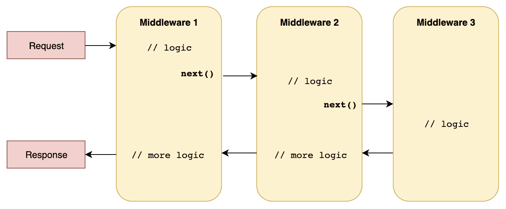

# 第三章：与中间件管道一起工作

上一章提供了 ASP.NET Core 项目的概述。我们了解了如何创建 ASP.NET Core 项目以及如何处理相关的文件和结构。我们还学习了 MVC 堆栈和 ASP.NET Core 背后的某些基本概念。现在，让我们深入探讨中间件的概念。中间件是 ASP.NET Core 平台的重要组成部分：它帮助我们处理进入的请求和发出的响应。最重要的是，这些类型的组件可以用来监控性能和实现横切功能。本章从中间件概念的介绍开始。接着展示如何实现自定义中间件，并以 ASP.NET Core 内置中间件的概述结束。

本章涵盖了以下主题：

+   介绍中间件及其不同方面

+   ASP.NET Core 项目中中间件的具体用例

+   ASP.NET Core 内置中间件的概述

+   实现自定义中间件

# 介绍中间件

如其名所示，中间件是放置在我们应用程序和进入请求之间的组件。进入请求在到达我们应用程序中实现的有效逻辑之前会击中中间件的管道。因此，中间件被认为是 ASP.NET Core 的基本概念之一，因为它是我们应用程序前面的第一层，通常与*日志记录*、*错误处理*、*身份验证*和*验证*等横切概念相关联。它还可以根据请求执行诸如*条件服务初始化*等高级任务。

通常，中间件可以：

+   处理、处理和修改进入的*HTTP 请求*

+   处理、处理和更改发出的*HTTP 响应*

+   通过返回*早期响应*来中断中间件管道

此外，整个 ASP.NET Core 堆栈由中间件组成。中间件也符合一些*清洁代码*的基本概念：

+   每个中间件专注于单一目的：接收一个请求并增强它。建议为每个目标实现新的中间件，以符合*单一职责原则*。

+   中间件还使用了*链式*的概念。它接收一个进入的请求，并将其传递给下一个中间件。因此，每个中间件都会增强请求，并决定是否中断或继续中间件管道。

如前所述，中间件可以*短路*管道，这意味着它可以阻止我们的请求并跳过管道的其余部分。这个*短路*概念不应被低估，因为它是我们服务*提高性能*的绝佳方式。此外，如果出现问题或用户没有权限继续操作，请求将不会击中我们的控制器。此外，中间件管道通常与如下所示的架构相关联：



单个中间件可以在**请求**上执行操作并执行逻辑，也可以在**响应**上执行。此外，理解中间件顺序的重要性至关重要——实际上，当我们将其绑定到管道时，我们声明了顺序。

# 实际中的中间件管道

我们已经探讨了中间件管道背后的理论以及它在短路和单一责任原则方面的有用性。现在让我们在 ASP.NET Core 中具体化这一点。在前一章中，我们研究了.NET Core 提供的默认 Web API 模板。让我们通过用以下代码片段替换`Startup`类的内容来继续：

```cs
    public class Startup
    {
        public Startup(IConfiguration configuration)
        {
            Configuration = configuration;
        }

        public IConfiguration Configuration { get; }

        public void ConfigureServices(IServiceCollection services)
        {
        }
        public void Configure(IApplicationBuilder app, IWebHostEnvironment 
        env)
        {
            app.Run(async context =>
 {
 await context.Response.WriteAsync("Hello, World!");
 });
        }
    }
```

我们可以通过在`SampleAPI`文件夹中执行以下 CLI 命令来运行此项目：

```cs
dotnet run
```

上述命令使用`http://localhost:5000`地址启动我们的应用程序。我们可以使用浏览器调用它：


正如你所见，使用中间件策略运行“Hello, World!”很简单。它需要实现`Configure`方法，这是中间件通常被定义的方法。`app.Run`执行一个委托方法，这是我们的中间件的表示。在我们的例子中，它接受请求的`HttpContext`并在上下文的响应中写入内容。

理解 ASP.NET Core 框架如何实现`Run`方法至关重要。让我们通过检查`Microsoft.AspNetCore.Builder`命名空间中的代码来更仔细地看看`Run`方法的实现：

```cs
using System;
using Microsoft.AspNetCore.Http;

namespace Microsoft.AspNetCore.Builder
{
    /// <summary>
    /// Extension methods for adding terminal middleware.
    /// </summary>
    public static class RunExtensions
    {
        /// <summary>
        /// Adds a terminal middleware delegate to the application's 
            request pipeline.
        /// </summary>
        /// <param name="app">The <see cref="IApplicationBuilder"/> 
            instance.</param>
        /// <param name="handler">A delegate that handles the 
            request.</param>
        public static void Run(this IApplicationBuilder app, 
        RequestDelegate handler)
        {
            if (app == null)
            {
                throw new ArgumentNullException(nameof(app));
            }

            if (handler == null)
            {
                throw new ArgumentNullException(nameof(handler));
            }

            app.Use(_ => handler);
        }
    }
}
```

上述代码提供了我们正在执行操作的更多细节。我们注意到`RequestDelegate`处理器不能为`null`，如果我们深入到调用栈中，我们可以看到我们的委托将通过`app.Use`扩展方法被添加到**管道的末尾**。

理解中间件顺序的重要性。中间件管道的顺序在`Startup`类的`Configure`方法中隐式定义。此外，**MVC 中间件**通常是被请求击中的最后一个；另一方面，**授权中间件**通常被放置在其他中间件之前，以确保正确的安全级别（将授权**中间件**放在**MVC 中间件**之后可能会损害我们的服务并使其不安全）*.*

# ASP.NET Core 中的 HttpContext

在上一个示例中，我们看到了如何使用 `app.Run` 扩展方法创建中间件。该实现中涉及的一个关键概念是 `HttpContext` 类型，它是获取所有 HTTP 属性信息的唯一入口点；它通常与传入的请求相关。`HttpContext` 属性公开了从请求中获取信息和在响应中更新信息的方法和属性。响应和请求信息由以下属性表示：`HttpContext.Response` 和 `HttpContext.Request`。例如，在上一个案例中，我们使用了 `WriteAsync` 方法，该方法将 `Hello World!` 字符串写入到当前的 `HttpContext` 响应中。

依赖注入是 ASP.NET Core 的核心部分。`HttpContext` 包含了当前请求中实例化的所有服务的引用。具体来说，它提供了一个 `RequestServices` 属性，该属性指向服务容器。我们将在下一章中更详细地探讨依赖注入。使用 `app.Run` 方法声明一段 *内联* 中间件不是定义新中间件的唯一方式。此外，在下面的子节中，我们将看到如何使用 *基于类的* 方法构建中间件逻辑。

# 基于类的中间件

中间件也可以通过使用 *基于类的* 方法来实现。这种方法增加了中间件的 *可重用性*、*可测试性* 和 *可维护性*。基于类的方法涉及定义一个新的类型，例如。让我们看看基于类的中间件：

```cs
using System.Threading.Tasks;
using Microsoft.AspNetCore.Http;

namespace Demo.WebAPI
{
    public class SampleMiddleware
    {
        private readonly RequestDelegate _next;

        public RequestCultureMiddleware(RequestDelegate next)
        {
            _next = next;
        }

        public async Task InvokeAsync(HttpContext context)
        {
            //DO STUFF

            // Call the next delegate/middleware in the pipeline
            await _next(context);
        }
    }
}

```

让我们考察这个类的一些关键点：

+   `RequestDelegate` 代表对管道中下一个元素的引用。这可能是委托或其他基于类的中间件。

+   `InvokeAsync` 是我们中间件的核心部分。这包含了中间件的实现并调用管道中的 `_next` 元素。在这个点上，我们的实现必须在继续管道或仅向客户端返回结果之间做出选择。例如，在 *未授权* 消息的情况下，中间件将中断管道。

在定义我们的中间件类之后，我们需要将其添加到我们的管道中。一种很好的方法是创建一个新的扩展方法，如下所示：

```cs
public static class SampleMiddlewareExtensions
{
    public static IApplicationBuilder UseSampleMiddleware(
        this IApplicationBuilder builder)
    {
        return builder.UseMiddleware<SampleMiddleware>();
    }
}
```

在此之后，我们可以在 `Startup` 类中通过执行之前定义的扩展方法将我们的中间件添加到管道中：

```cs

    public class Startup
    {

        //  ...

        public void Configure(IApplicationBuilder app, 
        IHostingEnvironment env)
        {
            app.UseSampleMiddleware();

            app.Run(async context =>
            {
                await context.Response.WriteAsync("Hello, World!");
            });
        } 
     }
```

上述实现提供了一种将中间件的逻辑封装在`SampleMiddleware`类中的方法。出于各种原因，这种方法是首选的。首先，中间件类和逻辑可以通过单元测试进行验证和测试。其次，在企业环境中，创建包含由 Web 服务使用的常见中间件的专用库项目，并通过公司的 NuGet 仓库进行分发可能很有用。最后，基于类的方法提供了使用构造函数注入突出显示中间件依赖关系的一种清晰方式。我们将在第四章，*依赖注入*中更深入地探讨这个主题。现在我们已经看到了如何在 ASP.NET Core 管道中声明和添加中间件，有必要更深入地讨论中间件的条件初始化。

# 条件管道

ASP.NET Core 提供了一些有用的操作符，允许我们将条件初始化逻辑放入中间件管道中。这些类型的操作符可能有助于为我们的服务和应用程序提供额外的性能优势。让我们看看这些操作符的一些例子。

`IApplicationBuilder Map (this IApplicationBuilder app, PathString pathMatch, Action<IApplicationBuilder> configuration)`扩展方法帮助我们通过映射 URI 路径来初始化我们的中间件；例如：

```cs
public static class SampleMiddlewareExtensions
{
    public static IApplicationBuilder UseSampleMiddleware(
        this IApplicationBuilder builder)
    {
       return builder.Map("/test/path", _ => 
       _.UseMiddleware<SampleMiddleware>());
    }
}
```

在这种情况下，只有当`SampleMiddleware`作为一个具有指定路径的 URI 被调用时，它才会被添加到我们的管道中。请注意，`Map`操作符也可以嵌套在其他操作符内部：这种方法提供了一种更高级的初始化条件的方法。

另一个有用的操作符是`MapWhen`，它只有在*谓词*函数返回`true`时才会初始化提供的中间件；例如：

```cs
public static class SampleMiddlewareExtensions
{
    public static IApplicationBuilder UseSampleMiddleware(
        this IApplicationBuilder builder)
    {
      return  builder.MapWhen(context => context.Request.IsHttps, 
      _ => _.UseMiddleware<SampleMiddleware>());
    }
}
```

在这种情况下，如果请求是 HTTPS，我们将初始化`SampleMiddleware`类。当需要针对特定类型的请求采取行动时，条件中间件初始化可能非常有用。通常，当需要在 HTTP 请求类型上强制执行某些逻辑时，例如请求中存在特定头或使用特定协议时，这通常成为必要。

总之，*基于类的*中间件在需要在中间件管道中实现自定义逻辑时非常有用，条件初始化提供了一种更干净的方式来初始化我们的中间件集合。在 ASP.NET Core 中，中间件是框架基本逻辑的一等公民；因此，下一节将涵盖一些用例和一些与 ASP.NET Core 一起提供的中间件。

# 理解内置中间件

那么，中间件有哪些用例呢？如前所述，它们通常与跨切面关注点相关，例如*日志记录*、*身份验证*和*异常处理*。ASP.NET Core 本身提供了一些*内置中间件*，它们代表了解决问题的标准方式：*

+   `UseStaticFiles()`: 提供了一种处理应用程序内部静态文件和资源的方法。当客户端请求静态资源时，此中间件会过滤请求并返回请求的文件，而无需触及管道的其余部分。

+   `AddResponseCaching()`: 帮助开发者配置应用程序的缓存系统。此中间件还添加了所有与缓存相关的 HTTP 兼容信息。

+   `UseHttpsRedirection()`: 这个新的内置 ASP.NET Core 2.1 中间件提供了一种强制 HTTPS 重定向的方法。

+   `UseDeveloperExceptionPage()`: 在发生异常的情况下，此功能会显示详细的错误页面（新的 YSOD）。这通常根据环境条件进行初始化。

这些是 ASP.NET Core 提供的内置中间件的一部分。正如你所见，所有中间件都为你的应用程序提供了跨切面功能。这里重要的是中间件初始化的顺序反映了我们的管道顺序；例如：

```cs
     public void Configure(IApplicationBuilder app, IHostingEnvironment env)
        {
            // ...
            app.UseHttpsRedirection();
            app.UseStaticFiles();
        }
```

在这种情况下，`UseStaticFiles`中间件将不会收到静态文件的请求，因为 MVC 中间件首先处理它们。一个一般规则是将`UseHttpsRedirection()`作为管道中的最后一个中间件；否则，其他中间件将不会拦截请求。

# 摘要

中间件是处理跨切面问题的开发者有用的工具。这是因为它拦截并增强每个*进入请求*和*输出响应*，并且可以通过早期返回请求来提高性能。从日志记录到身份验证的概念都应通过使用中间件来处理。本章涵盖的主题为你理解 ASP.NET Core 框架采用的中间件优先方法提供了必要的知识。此外，本章还概述了 ASP.NET Core 的内置中间件，并描述了如何创建自定义中间件。

在下一章中，我们将探讨另一个核心主题，即提高我们代码的可维护性和可测试性：*依赖注入*。ASP.NET Core 提供了开箱即用的依赖注入，我们还将探讨如何解决依赖关系以及如何处理不同生命周期类型。
