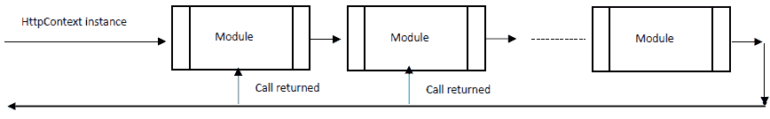
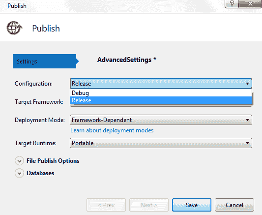
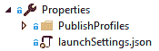
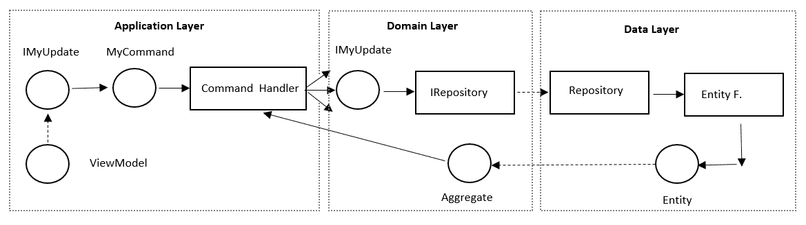
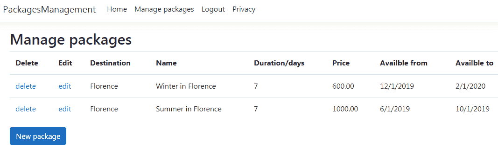

# 第十三章：展示 ASP.NET Core MVC

在本章中，你将学习如何实现应用程序的表现层。更具体地说，你将学习如何基于 ASP.NET Core MVC 实现一个网络应用程序。

ASP.NET Core 是一个用于实现网络应用程序的 .NET 框架。ASP.NET Core 在前面的章节中已有部分描述，因此本章主要关注 ASP.NET Core MVC。更具体地说，本章的贡献如下：

+   理解网络应用程序的表现层

+   理解 ASP.NET Core MVC 结构

+   .NET Core 3.0 为 ASP.NET Core 带来了哪些新特性？

+   理解 ASP.NET Core MVC 与设计原则之间的联系

+   用例 - 在 ASP.NET Core MVC 中实现网络应用程序

我们将回顾并进一步详细说明 ASP.NET Core 框架的结构，这部分内容已在第十二章，*使用 .NET Core 应用服务导向架构*和第四章，*决定最佳基于云的解决方案*中讨论过。在这里，主要关注的是如何基于所谓的 **模型-视图-控制器**（**MVC**）架构模式实现基于网络的表示层。

我们还将分析在最新的 ASP.NET Core 3.0 版本中可用的所有新功能，以及包含在 ASP.NET Core MVC 框架中或用于典型 ASP.NET Core MVC 项目的架构模式。其中一些模式已在第九章，*设计模式和 .NET Core 实现*和第十章，*理解软件解决方案中的不同领域*中讨论过，而其他一些模式，如 MVC 模式本身，则是新的。

你将学习如何实现一个 ASP.NET Core MVC 应用程序，以及如何使用本章末尾的实用示例来组织整个 Visual Studio 解决方案。这个示例描述了一个完整的 ASP.NET Core MVC 应用程序，用于编辑 WWTravelClub 书籍用例的包。

# 技术要求

本章需要 Visual Studio 2017 或 2019 免费社区版或更高版本，并安装所有数据库工具。

所有概念都通过基于 WWTravelClub 书籍用例的实用示例进行了阐明。本章的代码可在[`github.com/PacktPublishing/Hands-On-Software-Architecture-with-CSharp-8`](https://github.com/PacktPublishing/Hands-On-Software-Architecture-with-CSharp-8)找到。

# 理解网络应用程序的表现层

本章讨论了基于 ASP.NET Core 框架实现网络应用程序表现层的架构。网络应用程序的表现层基于三种技术：

+   通过 REST 或 SOAP 服务与服务器交换数据的移动或桌面原生应用程序：我们尚未讨论它们，因为它们严格绑定到客户端设备和其操作系统，因此，分析它们（这需要专门的书籍）完全超出了本书的范围。

+   **单页应用程序**（**SPA**）：这些是基于 HTML 的应用程序，其动态 HTML 在客户端由 JavaScript 或借助 WebAssembly（一种跨浏览器的汇编，可以用作 JavaScript 的高性能替代品）创建。与原生应用程序类似，SPAs 通过 REST 或 SOAP 服务与服务器交换数据，但它们的优势在于独立于设备和其操作系统，因为它们在浏览器中运行。SPA 框架是复杂的话题，需要专门的书籍来讨论，因此本书中无法对其进行描述。一些相关的链接列在*进一步阅读*部分。

+   由服务器创建的 HTML 页面，其内容取决于要展示给用户的数据：本章将要讨论的 ASP.NET Core MVC 框架是一个用于创建此类动态 HTML 页面的框架。

本章的其余部分将重点介绍如何在服务器端创建 HTML 页面，以及更具体地，介绍下一节中将要介绍的 ASP.NET Core MVC。

# 理解 ASP.NET Core MVC 结构

ASP.NET Core 基于在第五章的*使用通用主机*子节中解释的通用主机概念，*将微服务架构应用于企业应用程序*。ASP.NET Core 的基本架构在第十二章的*ASP.NET Core 简介*子节中进行了概述，*使用.NET Core 应用服务导向架构*。

值得提醒读者的是，通过调用`IWebHostBuilder`接口的`.UseStartup<Startup>()`方法，主机配置被委托给在`Startup.cs`文件中定义的`Startup`类。`Startup`类的`ConfigureServices(IServiceCollection services)`方法定义了所有可以通过依赖注入（DI）注入对象构造函数的服务。依赖注入在第五章的*使用通用主机*子节中进行了详细描述，*将微服务架构应用于企业应用程序*。

相反，`Configure(IApplicationBuilder app, IHostingEnvironment env)`启动方法定义了所谓的 ASP.NET Core 管道，这在第十二章的*使用.NET Core 应用服务导向架构*子节中的*ASP.NET Core 简介*子节中简要描述过，将在下一子节中详细介绍。

# ASP.NET Core 管道的工作原理

ASP.NET Core 提供了一组可配置的模块，您可以根据需要组装这些模块。每个模块负责您可能需要或不需要的功能。功能示例包括授权、身份验证、静态文件处理、协议协商、CORS 处理等。

您可以通过将它们插入一个称为 **ASP.NET Core 管道** 的通用处理框架来组合您需要的所有模块。

更具体地说，ASP.NET Core 请求通过将上下文对象推入 ASP.NET Core 模块的管道进行处理，如下面的图所示：



插入管道的对象是一个包含传入请求全部数据的 `HttpContext` 实例。更具体地说，`HttpContext` 的 `Request` 属性包含一个 `HttpRequest` 对象，其属性以结构化的方式表示传入请求。有用于头部、cookies、请求路径、参数、表单字段和请求体的属性。

不同的模块可以通过向 `HttpContext` 实例的 `Response` 属性中包含的 `HttpResponse` 对象写入来共同贡献最终响应的构建。`HttpResponse` 类与 `HttpRequest` 类类似，但其属性指的是正在构建的响应。

一些模块可以构建一个中间数据结构，然后由管道中的其他模块使用。通常，这种中间数据可以存储在 `HttpContext` 对象的 `Items` 属性中包含的 `IDictionary<object, object>` 的自定义条目中。然而，有一个预定义的属性 `User`，它包含有关当前登录用户的信息。登录用户不是自动计算的，而必须由身份验证模块计算。第十二章 的 *Applying Service-Oriented Architectures with .NET Core* 部分的 *ASP.NET Core 服务授权* 子部分解释了如何将基于 JWT 令牌的身份验证的标准模块添加到 ASP.NET Core 管道中。

`HttpContext` 还有一个 `Connection` 属性，它包含与客户端建立的基础连接的信息，以及一个 `WebSockets` 属性，它包含与客户端建立的可能基于 WebSocket 的连接的信息。

`HttpContext` 还有一个 `Features` 属性，它包含 `IDictionary<Type, object>`，该属性指定了托管 Web 应用程序的 Web 服务器以及管道模块所支持的功能。功能可以通过 `.Set<Type>(Type o)` 方法设置，并通过 `.Get<Type>()` 方法检索。

当所有其他功能由管道模块在处理 `HttpContext` 时添加时，框架会自动添加 Web 服务器功能。功能不是针对传入请求的特定功能，而仅取决于应用程序托管环境和添加到 ASP.NET Core 管道的模块。

`HttpContext` 通过其 `RequestServices` 属性也提供了对依赖注入引擎的访问。你可以通过调用 `.RequestService.GetService(Type t)` 方法来获取由依赖引擎管理的类型的一个实例。

为处理网络请求而创建的 `HttpContext` 实例不仅对模块可用，而且通过依赖注入对应用程序代码也可用。只需在自动依赖注入的类（如控制器）的构造函数中插入一个 `IHttpContextAccessor` 参数，然后访问其 `HttpContext` 属性即可。

模块是任何具有以下结构的类：

```cs
public class CoreMiddleware
{
    private readonly RequestDelegate _next;
    public CoreMiddleware(RequestDelegate next, ILoggerFactory 
    loggerFactory)
    {
        ...
        _next = next;
        ...
    }

    public async Task Invoke(HttpContext context)
    {
        /*
            Insert here the module specific code that processes the 
            HttpContext instance

        */

        await _next.Invoke(context);
        /*
            Insert here other module specific code that processes the 
            HttpContext instance
        */
    }
}
```

通常，每个模块处理由管道中前一个模块传递的 `HttpContext` 实例，然后调用 `await _next.Invoke(context)` 来调用管道中剩余的模块。当所有其他模块完成处理并且客户端的响应已经准备就绪时，每个模块都可以在 `_next.Invoke(context)` 调用之后的代码中执行进一步的响应后处理。

通过在 `Startup.cs` 文件的 `Configure` 方法中调用 `UseMiddleware<T>` 方法，将模块注册到 ASP.NET Core 管道中，如下所示：

```cs
public void Configure(IApplicationBuilder app, IHostingEnvironment env, 
IServiceProvider serviceProvider)
{
    ...
    app.UseMiddleware<MyCustomModule>
    ...
}
```

当调用 `UseMiddleware` 时，模块按相同的顺序插入到管道中。由于添加到应用程序中的每个功能可能需要几个模块，并且可能需要除添加模块之外的操作，因此你通常定义一个 `IApplicationBuilder` 扩展，如 `UseMyFunctionality`，如下面的代码所示：

```cs
public static class MyMiddlewareExtensions
{
    public static IApplicationBuilder UseMyFunctionality(this 
    IApplicationBuilder builder,...)
    {
        //other code            
        ...
        builder.UseMiddleware<MyModule1>();
        builder.UseMiddleware<MyModule2>();
        ...
        //Other code
        ...
        return builder;
    }
}
```

之后，可以通过调用 `app.UseMyFunctionality(...)` 将整个功能添加到应用程序中。例如，通过调用 `app.UseEndpoints(....)` 将 ASP.NET Core MVC 功能添加到 ASP.NET Core 管道中。

通常，通过每个 `app.Use...` 添加的功能需要将一些 .NET 类型添加到应用程序依赖注入引擎中。在这些情况下，我们还会定义一个名为 `AddMyFunctionality` 的 `IServiceCollection` 扩展方法，该方法必须在 `Startup.cs` 文件的 `ConfigureServices(IServiceCollection services)` 方法中调用。例如，ASP.NET Core MVC 需要调用如下所示的方法：

```cs
services.AddControllersWithViews(o =>
{
    //set here MVC options by modifying the o option parameter
} 
```

如果你不需要更改默认的 MVC 选项，你可以简单地调用 `services.AddControllersWithViews()`。

下一个子节描述了 ASP.NET Core 框架的另一个重要功能，即如何处理应用程序配置数据。

# 加载配置数据并使用选项框架

当 ASP.NET Core 应用程序启动时，它会从 `appsettings.json` 和 `appsettings.[EnvironmentName].json` 文件中读取配置信息（如数据库连接字符串），其中 `EnvironmentName` 是一个字符串值，取决于应用程序部署的位置。`EnvironmentName` 的典型值如下：

+   `Production` 用于生产部署。

+   `Development` 用于开发。

+   当应用程序在预发布环境中进行测试时，使用 `Staging`。

从 `appsettings.json` 和 `appsettings.[EnvironmentName].json` 文件中提取的两个 JSON 树合并成一个唯一的树，其中 `[EnvironmentName].json` 中包含的值会覆盖 `appsettings.json` 中相应路径的值。这样，应用程序可以在不同的部署环境中运行不同的配置。特别是，你可以使用不同的数据库连接字符串，因此，每个不同的环境都可以有不同的数据库实例。

`[EnvironmentName]` 字符串是从操作系统的 `ASPNETCORE_ENVIRONMENT` 环境变量中获取的。反过来，`ASPNETCORE_ENVIRONMENT` 可以通过两种方式在 Visual Studio 中自动设置应用程序的部署：

+   在 Visual Studio 部署期间，Visual Studio 发布向导创建一个 XML 发布配置文件。如果发布向导允许你从下拉列表中选择 `ASPNETCORE_ENVIRONMENT`，则已完成：



否则，你可以按照以下步骤操作：

1.  1.  一旦在向导中填写了信息，请保存发布配置文件而不进行发布。

1.  然后，使用文本编辑器编辑配置文件，并添加一个 XML 属性，例如，`<EnvironmentName>Staging</EnvironmentName>`。由于在应用程序发布期间可以选择所有已定义的发布配置文件，因此你可以为每个环境定义不同的发布配置文件，然后在每次发布时选择所需的配置文件。

+   在部署期间设置 `ASPNETCORE_ENVIRONMENT` 的值也可以通过在应用程序的 Visual Studio ASP.NET Core 项目文件（`.csproj`）中添加以下代码来指定：

```cs
<PropertyGroup> 
    <EnvironmentName>Staging</EnvironmentName>
</PropertyGroup>
```

在 Visual Studio 中进行开发时，当应用程序运行时，`ASPNETCORE_ENVIRONMENT` 的值可以在 ASP.NET Core 项目的 `Properties\launchSettings.json` 文件中指定。`launchSettings.json` 文件包含几个命名的设置组。这些设置配置了从 Visual Studio 运行时如何启动 Web 应用程序。你可以通过选择位于 Visual Studio 运行按钮旁边的下拉列表中的组名来选择应用一个组的所有设置：


在此下拉列表中的选择将显示在运行按钮中，默认选择为 IIS Express。

以下代码显示了一个典型的 `launchSettings.json` 文件，其中你可以添加一个新的设置组或更改现有默认组的设置：

```cs
{
  "iisSettings": {
    "windowsAuthentication": false, 
    "anonymousAuthentication": true, 
    "iisExpress": {
      "applicationUrl": "http://localhost:2575",
      "sslPort": 44393
    }
  },
  "profiles": {
    "IIS Express": {
      "commandName": "IISExpress",
      "launchBrowser": true,
      "environmentVariables": {
        "ASPNETCORE_ENVIRONMENT": "Development"
      }
    },
    ...
    ...
    }
  }
}
```

设置的命名组位于 `profiles` 属性下。在那里，你可以选择应用程序托管的位置（`IISExpress`）、启动浏览器以及一些环境变量的值。

在 ASP.NET Core 管道定义期间，可以通过 `IHostingEnvironment` 接口测试从 `ASPNETCORE_ENVIRONMENT` 操作系统环境变量加载的当前环境，因为 `IHostingEnvironment` 实例被作为参数传递给 `Startup.cs` 文件的 `Configure` 方法。`IHostingEnvironment` 也通过 DI 可用于用户代码的其余部分。

`IHostingEnvironment.IsEnvironment(string environmentName)` 检查当前 `ASPNETCORE_ENVIRONMENT` 的值是否为 `environmentName`。同时，也有针对测试开发（`.IsDevelopment()`）、生产（`.IsProduction()`）和预发布（`.IsStaging()`）的特定快捷方式。`IHostingEnvironment` 还包含 ASP.NET Core 应用程序的当前根目录（`.WebRootPath`）和由 Web 服务器直接提供的服务静态文件目录（`.ContentRootPath`）（CSS、JavaScript、图片等）。

`launchSettings.json` 和所有发布配置文件都可以在 Visual Studio 探索器中作为属性节点下的子节点访问，如下面的截图所示：



一旦加载了 `appsettings.json` 和 `appsettings.[EnvironmentName].json`，合并后的配置树可以映射到 .NET 对象的属性。例如，假设我们有一个 `appsettings` 文件的 `Email` 部分，其中包含连接到电子邮件服务器所需的所有信息，如下所示：

```cs
{
    "ConnectionStrings": {
        "DefaultConnection": "...."
    },
    "Logging": {
        "LogLevel": {
            "Default": "Warning"
        }
    },
    "Email": {
        "FromName": "MyName",
        "FromAddress": "info@MyDomain.com",
        "LocalDomain": "smtps.MyDomain.com",
        "MailServerAddress": "smtps.MyDomain.com",
        "MailServerPort": "465",
        "UserId": "info@MyDomain.com",
        "UserPassword": "mypassword"
```

然后，整个 `Email` 部分 可以映射到以下类的实例：

```cs
    public class EmailConfig
    {
        public String FromName { get; set; }
        public String FromAddress { get; set; }
        public String LocalDomain { get; set; }

        public String MailServerAddress { get; set; }
        public String MailServerPort { get; set; }

        public String UserId { get; set; }
        public String UserPassword { get; set; }
    }
```

执行映射的代码必须插入到 `Startup.cs` 文件中的 `ConfigureServices` 方法，因为 `EmailConfig` 实例将通过 DI 获取。所需的代码如下所示：

```cs
public Startup(IConfiguration configuration)
{
    Configuration = configuration;
}
....
public void ConfigureServices(IServiceCollection services)
{
    ...
    services.Configure<EmailConfig>(Configuration.GetSection("Email"));
    ..
```

在前面的设置之后，需要 `EmailConfig` 数据的类必须声明一个由 DI 引擎提供的 `IOptions<EmailConfig> options` 参数。`EmailConfig` 实例包含在 `options.Value` 中。

下一个子节描述了 ASP.NET Core MVC 应用程序所需的基本 ASP.NET Core 管道模块。

# 定义 ASP.NET Core MVC 管道

如果你使用 Visual Studio 创建一个新的 ASP.NET Core MVC 项目，`Startup.cs` 文件的 `Configure` 方法将创建一个标准管道。在那里，如果需要，你可以添加更多模块或更改现有模块的配置。

`Configure` 方法的初始代码处理错误并执行基本的 HTTPS 配置：

```cs
 if (env.IsDevelopment())
{
    app.UseDeveloperExceptionPage();
    app.UseDatabaseErrorPage();
}
else
{
    app.UseExceptionHandler("/Home/Error");
    app.UseHsts();
}
app.UseHttpsRedirection();
```

如果有错误，如果应用程序处于开发环境，`UseDeveloperExceptionPage` 安装的模块会在响应中添加详细的错误报告，而 `UseDatabaseErrorPage` 安装的模块会处理并添加任何实体框架数据库错误的详细信息到响应中。这些模块是宝贵的调试工具。

如果应用程序不在开发模式下发生错误，`UseExceptionHandler` 会从它接收的参数路径恢复请求处理，即从`/Home/Error`。换句话说，它模拟了一个带有`/Home/Error`路径的新请求。这个请求被推入标准的 MVC 处理流程，直到它达到与`/Home/Error`路径关联的端点，在那里开发者预计会放置处理错误的自定义代码。

当应用程序不在开发模式下时，`UseHsts` 将`Strict-Transport-Security`头添加到响应中，告知浏览器应用程序必须仅通过 HTTPS 访问。在此声明之后，符合规定的浏览器应自动将任何对应用程序的 HTTP 请求转换为 HTTPS 请求，时间为`Strict-Transport-Security`头中指定的时间。默认情况下，`UseHsts`将 30 天指定为头中的时间，但您可以通过在`Startup.cs`的`ConfigureServices`方法中添加一个`options`对象来指定不同的时间和其他头参数：

```cs
services.AddHsts(options =>     {         
    ...
    options.MaxAge = TimeSpan.FromDays(60); 
    ...   
});
```

`UseHttpsRedirection` 在接收到 HTTP URL 时导致自动重定向到 HTTPS URL，以强制建立安全连接。一旦建立了第一个 HTTPS 安全连接，`Strict-Transport-Security`头会阻止可能用于执行中间人攻击的后续重定向。

以下代码显示了默认管道的其余部分：

```cs
app.UseStaticFiles();
app.UseCookiePolicy();

app.UseRouting();

app.UseAuthentication();
app.UseAuthorization();

...
```

`UseStaticFiles` 使得项目`wwwroot`文件夹中的所有文件（通常是 CSS、JavaScript、图片和字体文件）可以通过它们的实际路径从网络上访问。

`UseCookiePolicy` 确保只有在用户同意使用 cookie 的情况下，ASP.NET Core 管道才会处理 cookie。对 cookie 使用的同意是通过一个同意 cookie 给出的，也就是说，只有在请求 cookie 中找到这个同意 cookie 时，才会启用 cookie 处理。这个 cookie 必须由 JavaScript 在用户点击同意按钮时创建。包含同意 cookie 名称及其内容的整个字符串可以从`HttpContext.Features`中检索到，如下面的代码片段所示：

```cs
var consentFeature = context.Features.Get<ITrackingConsentFeature>();
var showBanner = !consentFeature?.CanTrack ?? false;
var cookieString = consentFeature?.CreateConsentCookie();
```

只有在需要同意且尚未给出时，`CanTrack` 才为`true`。当检测到同意 cookie 时，`CanTrack` 被设置为`false`。这样，只有当需要同意且尚未给出时，`showBanner` 才为`true`。因此，它告诉我们是否需要向用户请求同意。

同意模块的选项包含在一个`CookiePolicyOptions`实例中，必须使用选项框架手动配置。以下代码片段显示了 Visual Studio 生成的默认配置代码框架，它配置了代码中的`CookiePolicyOptions`而不是使用配置文件：

```cs
services.Configure<CookiePolicyOptions>(options =>
{
    options.CheckConsentNeeded = context => true;
});
```

`UseAuthentication` 启用认证方案。默认情况下，它仅启用基于 cookie 的认证，即认证令牌放置在 cookie 中的认证方案。认证 cookie 在用户登录期间创建。

通过在 `ConfigureServices` 方法中配置一个选项对象，可以启用 cookie 授权选项（如 cookie 名称）和其他认证方案，如下所示：

```cs
services.AddAuthentication(o =>
{
    o.DefaultScheme = 
    CookieAuthenticationDefaults.AuthenticationScheme;
})
.AddCookie(o =>
{
    o.Cookie.Name = "my_cookie";
})
.AddJwtBearer(o =>
{
    ...
});
```

上述代码指定了一个自定义的认证 cookie 名称，并为应用程序中包含的 REST 服务添加了基于 JWT 的认证。`AddCookie` 和 `AddJwtBearer` 都有重载，可以在定义认证方案选项的动作之前接受认证方案名称。由于认证方案名称是引用特定认证方案所必需的，因此当它未指定时，将使用默认名称：

+   `CookieAuthenticationDefaults.AuthenticationScheme` 中包含的标准名称用于 cookie 认证

+   `JwtBearerDefaults.AuthenticationScheme` 中包含的标准名称用于 JWT 认证

在 `o.DefaultScheme` 中传入的名称选择用于填充 `HttpContext` 的 `User` 属性的认证方案。

关于 JWT 认证的更多信息，请参阅第十二章 *使用 .NET Core 应用服务架构* 的 *ASP.NET Core 服务授权* 子节，链接。

`UseAuthorization` 通过 `Authorize` 属性启用基于授权的授权。可以通过在 `ConfigureServices` 方法中放置一个 `AddAuthorization` 方法来配置选项。这些选项允许定义基于声明的授权策略。

关于授权的更多信息，请参阅第十二章 *使用 .NET Core 应用服务架构* 的 *ASP.NET Core 服务授权* 子节，链接。

`UseRouting` 和 `UseEndpoints` 处理所谓的 ASP.NET Core 端点。端点是服务特定类 URL 的处理程序的抽象。通过使用模式将 URL 转换为 `Endpoint` 实例。当模式与 URL 匹配时，会创建一个 `Endpoint` 实例，并填充模式名称以及从 URL 中提取的数据，这些数据是匹配 URL 部分与模式命名字段的结果，如下面的代码片段所示：

```cs
Request path: /UnitedStates/NewYork 
Pattern: Name="location", match="/{Country}/{Town}"

Endpoint: DisplayName="Location", Country="UnitedStates", Town="NewYork"
```

`UseRouting` 添加了一个模块，该模块处理请求路径以获取请求 `Endpoint` 实例，并将其添加到 `HttpContext.Features` 字典中的 `IEndpointFeature` 类型下。实际的 `Endpoint` 实例包含在 `IEndpointFeature` 的 `Endpoint` 属性中。

每个模式都包含一个处理程序，该处理程序应处理所有与模式匹配的请求。当创建 `Endpoint` 时，此处理程序会被传递给 `Endpoint`。

`UseEndpoints` 则添加了调用请求端点相关处理程序的中间件。它放置在管道末尾，因为预期处理程序的执行将生成最终的响应。

如以下代码片段所示，模式在 `UseRouting` 中间件中处理，但它们是在 `UseEndpoints` 方法中指定的。这种拆分不是必需的，但为了与之前包含没有类似 `UseRouting` 方法，而是在管道末尾进行唯一调用的 ASP.NET Core 版本保持一致。在新版本中，模式仍然在 `UseEndpoints` 中定义，它位于管道末尾，但 `UseEndpoints` 只在应用程序启动时创建一个包含所有模式的数据库结构。然后，这个数据结构由 `UseRouting` 中间件处理，如下面的代码所示：

```cs
app.UseRouting();

app.UseAuthentication();
app.UseAuthorization();

app.UseEndpoints(endpoints =>
{
    endpoints.MapControllerRoute(
        name: "default",
        pattern: "{controller=Home}/{action=Index}/{id?}");

});
```

`MapControllerRoute` 定义了与 MVC 引擎关联的模式，这些模式将在下一小节中描述。还有其他方法定义了其他类型的模式。例如，`.MapHub<MyHub>("/chat")` 将路径映射到处理 WebSocket 的中心节点，而 `.MapHealthChecks("/health")` 将路径映射到返回应用程序健康数据的 ASP.NET Core 组件。您还可以使用 `.MapGet` 直接将模式映射到自定义处理程序，它拦截 GET 请求，以及 `.MapPost`，它拦截 POST 请求。以下是一个 `MapGet` 的示例：

```cs
MapGet("hello/{country}", context => 
    context.Response.WriteAsync(
    $"Selected country is {context.GetRouteValue("country")}"));
```

模式按照它们定义的顺序进行处理，直到找到匹配的模式。由于身份验证/授权中间件放置在路由中间件之后，它可以处理 `Endpoint` 请求以验证当前用户是否具有执行 `Endpoint` 处理程序所需的授权。否则，将立即返回 401（未授权）或 403（禁止）响应。只有通过身份验证和授权的请求才会由 `UseEndpoints` 中间件执行其处理程序。

在 第十二章 中描述的 ASP.NET Core RESTful API，*使用 .NET Core 应用服务架构*，ASP.NET Core MVC 也使用放置在控制器或控制器方法上的属性来指定授权规则。然而，可以将 `AuthorizeAttribute` 的实例添加到模式中，以将其授权约束应用于匹配该模式的所有 URL，如下面的示例所示：

```cs
endpoints
 .MapHealthChecks("/healthz")
 .RequireAuthorization(new AuthorizeAttribute(){ Roles = "admin", });
```

上述代码使健康检查路径仅对管理员用户可用。

# 定义控制器和 ViewModels

在`UseEndpoints`中的各种`.MapControllerRoute`调用将 URL 模式关联到控制器和这些控制器的方法，其中控制器是继承自`Microsoft.AspNetCore.Mvc.Controller`类的类。控制器是通过检查应用程序的所有`.dll`文件来发现的，并添加到 DI 引擎中。这项工作是通过在`startup.cs`文件的`ConfigureServices`方法中的调用`AddControllersWithViews`来完成的。

`UseEndpoints`添加的管道模块从`controller`模式变量中获取控制器名称，并从`action`模式变量中获取要调用的控制器方法名称。由于按照惯例，所有控制器名称都预期以`Controller`后缀结尾，因此实际的控制器类型名称是通过在`controller`变量中找到的名称添加此后缀来获得的。例如，如果`controller`变量中找到的名称是`"Home"`，那么`UseEndpoints`模块会尝试从 DI 引擎中获取`HomeController`类型的实例。所有控制器公开的方法都可以通过路由规则进行选择。可以通过使用`[NonAction]`属性来防止使用控制器公开方法。所有可供路由规则使用的控制器方法都称为操作方法。

MVC 控制器的工作方式与我们在第十二章的*Applying Service-Oriented Architectures with .NET Core*小节中描述的*Implementing REST services with ASP.NET Core*中的 API 控制器类似。唯一的区别是 API 控制器预期生成 JSON 或 XML，而 MVC 控制器预期生成 HTML。因此，虽然 API 控制器从`ControllerBase`类继承，MVC 控制器则从`Controller`类继承，而`Controller`类反过来又从`ControllerBase`类继承并添加了用于 HTML 生成的有用方法，例如调用视图（将在下一小节中描述）和创建重定向响应。

MVC 控制器也可以使用类似于 API 控制器的一种路由技术，即基于控制器和控制器方法属性的路由。这种行为是通过在`UseEndpoints`中调用`.MapDefaultControllerRoute()`方法来启用的。如果这个调用放在所有`MapControllerRoute`调用之前，那么控制器路由在`MapControllerRoute`模式上具有优先级；否则，情况相反。

我们所看到的所有用于 API 控制器的属性也可以用于 MVC 控制器和操作方法（`HttpGet`、`HttpPost`、`...Authorize`等）。开发者可以通过从`ActionFilter`类或其他派生类继承来编写自己的自定义属性。我现在不会详细介绍这一点，但这些详细信息可以在*进一步阅读*部分中提到的官方文档中找到。

当 `UseEndpoints` 模块调用控制器时，由于控制器实例本身由依赖注入（DI）引擎返回，并且由于依赖注入（DI）以递归方式自动填充构造函数参数，因此所有构造函数参数都由依赖注入（DI）引擎填充。

相反，操作方法参数来自以下来源：

+   请求头

+   当前请求匹配的模式中的变量

+   查询字符串参数

+   表单参数（在 POST 请求的情况下）

+   **依赖注入**（**DI**）

当使用依赖注入（DI）填充的参数按类型匹配时，所有其他参数都按名称匹配，忽略字母大小写。也就是说，操作方法参数名称必须与标题、查询字符串、表单或模式变量匹配。当参数是复杂类型时，会为每个属性搜索匹配，使用属性名称进行匹配。在嵌套复杂类型的情况下，会为每个路径搜索匹配，并通过将路径中的所有属性名称链接起来并使用点分隔来获取与路径关联的名称。例如，由 `Property1`、`Property2`、......、`Propertyn` 组成的路径关联的名称是 `Property1.Property2.Property3...Propertyn`。通过这种方式获得的名称必须与标题名称、模式变量名称、查询字符串参数名称等匹配。

默认情况下，简单类型参数与模式变量和查询字符串变量进行匹配，而复杂类型参数与表单参数进行匹配。但是，可以通过在此处详细说明的属性前缀更改前面的默认设置：

+   `[FromForm]` 强制与表单参数进行匹配。

+   `[FromHeader]` 强制与请求头进行匹配。

+   `[FromRoute]` 强制与模式变量进行匹配。

+   `[FromQuery]` 强制与查询字符串变量进行匹配。

+   `[FromServices]` 强制使用依赖注入（DI）。

在匹配过程中，从所选来源提取的字符串使用当前线程的文化类型转换为操作方法参数。如果转换失败或找不到非可空操作方法参数的匹配项，则整个操作方法调用过程失败，并自动返回 404 响应。例如，在以下示例中，由于 `id` 参数是简单类型，因此它与查询字符串参数或模式变量进行匹配，而 `myclass` 属性和嵌套属性由于 `MyClass` 是复杂类型，因此与表单参数进行匹配。最后，由于 `myservice` 前缀为 `[FromServices]` 属性，因此从依赖注入（DI）中获取：

```cs
    public class HomeController : Controller
    {
        public IActionResult MyMethod(
            int id, 
            MyClass myclass, 
            [FromServices] MyService myservice)
        {
            ...
```

如果找不到 `id` 参数的匹配项，由于整数不可为空，将自动返回 404 响应。相反，如果在依赖注入（DI）容器中找不到 `MyService` 实例，则抛出异常，因为在这种情况下，失败不取决于错误的请求，而是设计错误。

如果 MVC 控制器被声明为 `async`，则返回 `IActionResult` 接口或 `Task<IActionResult>` 结果。`IActionResult` 有一个独特的 `ExecuteResultAsync(ActionContext)` 方法，当框架调用它时，会产生实际的响应。

对于每种不同的 `IActionResult`，MVC 控制器都有返回它们的方法。最常用的 `IActionResult` 是 `ViewResult`，它由 `View` 方法返回：

```cs
public IActionResult MyMethod(...)
{
   ...
   return View("myviewName", MyViewModel)
}
```

`ViewResult` 是控制器创建 HTML 响应的一种非常常见的方式。更具体地说，控制器与业务/数据层交互，以生成将在 HTML 页面上显示的数据的抽象。这个抽象是一个称为 **ViewModel** 的对象。ViewModel 作为 `View` 方法的第二个参数传递，而第一个参数是名为 View 的 HTML 模板的名称，该模板使用 ViewModel 中包含的数据进行实例化。

总结来说，MVC 控制器的处理顺序如下：

1.  控制器执行一些处理以创建 ViewModel，它是要在 HTML 页面上显示的数据的抽象。

1.  然后，控制器通过将视图名称和 ViewModel 传递给 `View` 方法来创建 `ViewResult`。

1.  MVC 框架调用 `ViewResult` 并使 View 中包含的模板与 ViewModel 中的数据实例化。

1.  模板实例化的结果写入响应中，并带有适当的头信息。

这样，控制器通过构建 ViewModel 执行 HTML 生成的概念性工作，而视图，即模板，则负责所有图形细节。

在下一小节中更详细地描述了视图，而在本章的 *ASP.NET Core MVC 与设计原则之间的联系* 部分更详细地讨论了模型（ViewModel）视图控制器模式。最后，在本章的 *用例 - ASP.NET Core MVC 中的 Web 应用* 部分给出了一个实际示例。

另一个常见的 `IActionResult` 是 `RedirectResult`，它创建一个重定向响应，从而强制浏览器移动到特定的 URL。重定向通常在用户成功提交完成先前操作的表单后使用。在这种情况下，通常会将用户重定向到可以选择另一个操作的页面。

返回 `RedirectResult` 的最简单方法是通过绕过 `Redirect` 方法的 URL。这是建议用于将 URL 重定向到 web 应用程序外部的 URL 的方法。当 URL 在 web 应用程序内部时，相反，建议使用 `RedirectToAction` 方法，该方法接受控制器名称、操作方法名称和目标操作方法所需参数。框架使用这些数据来计算导致所需操作方法使用提供的参数调用的 URL。这样，如果在应用程序开发或维护期间更改了路由规则，框架会自动更新新 URL，无需修改代码中所有旧 URL 的出现。以下代码显示了如何调用 `RedirectToAction`：

```cs
return RedirectToAction("MyActionName", "MyControllerName",
         new {par1Name=par1VAlue,..parNName=parNValue});
```

另一个有用的 `IActionResult` 是 `ContentResult`，可以通过调用 `Content` 方法来创建。`ContentResult` 允许您将任何字符串写入响应，并指定其 MIME 类型，如下例所示：

```cs
return Content("this is plain text", "text/plain");
```

最后，`File` 方法返回 `FileResult`，它在响应中写入二进制数据。此方法有几个重载，允许指定字节数组、流或文件的路径，以及二进制数据的 MIME 类型。

现在，让我们来描述在 Views 中实际生成的 HTML。

# 理解 Razor 视图

ASP.NET Core MVC 使用名为 Razor 的语言来定义 Views 中包含的 HTML 模板。Razor 视图是文件，它们在首次使用时、在构建应用程序时或在应用程序发布时编译成 .NET 类。默认情况下，每次构建和发布时的预编译都是启用的，但可以通过向 web 应用程序项目文件中添加以下代码来更改此行为：

```cs
<PropertyGroup>
  <TargetFramework>netcoreapp3.0</TargetFramework>
  <!-- add code below -->
  <RazorCompileOnBuild>false</RazorCompileOnBuild>
  <RazorCompileOnPublish>false</RazorCompileOnPublish>
  <!-- end of code to add -->
    ...
</PropertyGroup>
```

通过在选择 ASP.NET Core 项目后出现的窗口中选择一个 Razor 视图库项目，视图也可以预先编译成视图库。

此外，编译后，视图仍然与其路径相关联，这些路径成为它们的完整名称。每个控制器在 Views 文件夹下都有一个与其同名的关联文件夹，预计将包含该控制器使用的所有视图。以下截图显示了与 `HomeController` 和其视图关联的文件夹：


前面的截图还显示了共享文件夹，它预计将包含由多个控制器使用的所有视图。控制器通过它们的路径（不带 `.cshtml` 扩展名）在 `View` 方法中引用视图。如果路径以 `/` 开头，则路径被视为相对于应用程序根的相对路径。否则，作为第一次尝试，路径被视为相对于与控制器关联的文件夹的相对路径，如果在那里找不到视图，则视图将在共享文件夹中搜索。

因此，例如，前面截图中的 `Privacy.cshtml` 视图文件可以在 `HomeController` 中引用，作为 `View("Privacy", MyViewModel)`。如果视图的名称与动作方法的名称相同，我们可以简单地写成 `View(MyViewModel)`。

Razor 视图是 HTML 代码与 C# 代码以及一些 Razor 特定语句的混合。它们都以一个包含视图预期接收的 ViewModel 类型的标题开始：

```cs
@model MyViewModel 
```

每个视图也可以包含一些 `using` 语句，其效果与标准代码文件中的 `using` 语句相同：

```cs
@model MyViewModel 
@using MyApplication.Models
```

在特殊文件 `_ViewImports.cshtml` 中声明的 `@using` 语句，即位于 Views 文件夹的根目录，将自动应用于所有视图。

每个视图也可以在其标题中使用语法要求，要求来自 DI 引擎的类型实例：

```cs
@model MyViewModel 
@using MyApplication.Models
@inject IViewLocalizer Localizer
```

前面的代码需要一个 `IViewLocalizer` 接口的实例，并将其放置在 `Localizer` 变量中。视图的其余部分是 C# 代码、HTML 和 Razor 控制流语句的混合。视图的每个区域可以是 HTML 模式或 C# 模式。在 HTML 模式下的视图区域中的代码被解释为 HTML，而在 C# 模式下的视图区域中的代码被解释为 C#。

下一个主题解释 Razor 控制流语句。

# 学习 Razor 控制流语句

如果您想在 HTML 区域中编写一些 C# 代码，可以使用 `@{..}` 控制流 Razor 语句创建一个 C# 区域，如下所示：

```cs
@{
    //place C# code here
    var myVar = 5;
    ...
    <div>
        <!-- here you are in HTML mode again -->
        ...
    </div>
    //after the HTML block you are still in C# mode
    var x = "my string";
}
```

前面的示例表明，只需编写一个 HTML 标签就足以在 C# 区域内创建一个 HTML 区域，依此类推。一旦 HTML 标签关闭，您就又回到了 C# 模式。

C# 代码不会产生 HTML，而 HTML 代码会按照出现的顺序添加到响应中。在 HTML 模式下，您可以通过在 C# 表达式前加上 `@` 来添加使用 C# 代码计算出的文本。如果表达式复杂，由属性链和方法调用组成，则必须用括号括起来。以下代码显示了几个示例：

```cs
<span>Current date is: </span>
<span>@DateTime.Today.ToString("d")</span>
...
<p>
  User name is: @(myName+ " "+mySurname)
</p>
...
<input type="submit" value="@myUserMessage" />
```

类型使用当前的区域设置转换为字符串（有关如何设置每个请求的文化的详细信息，请参阅 *ASP.NET Core MVC 与设计原则之间的联系* 部分）。此外，字符串会自动进行 HTML 编码，以避免可能干扰视图 HTML 的 `<` 和 `>` 符号。可以使用 `@HTML.Raw` 函数防止 HTML 编码，如下所示：

```cs
@HTML.Raw(myDynamicHtml)
```

在 HTML 区域中，可以使用 `@if` Razor 语句选择替代的 HTML：

```cs
@if(myUser.IsRegistered)
{
    //this is a C# code area
    var x=5;
    ...
    <p>
     <!-- This is an HTML area -->
    </p>
    //this is a C# code area again
}
else if(callType == CallType.WebApi)
{
    ...
}
else
{
 ..
}
```

HTML 模板可以使用 `for`、`foreach` 和 `while` Razor 语句实例化多次，如下面的示例所示：

```cs
@for(int i=0; i< 10; i++)
{

}

@foreach(var x in myIEnumerable)
{

}

@while(true)
{

}
```

请不要将前面描述的语句与通常的 C# `if`、`for`、`foreach` 和 `while` 语句混淆，因为它们是 Razor 特定的语句，其语法与它们的标准 C# 对应项类似。

Razor 视图可以包含不会生成任何代码的注释。任何包含在`@*...*@`内的文本都被视为注释，并在页面编译时被移除。下一个主题将描述所有视图中都可用到的属性。

# 理解 Razor 视图属性

每个视图中都预定义了一些标准变量。最重要的变量是`Model`，它包含传递给视图的 ViewModel。例如，如果我们向视图传递一个`Person`模型，那么`<span>@Model.Name</span>`将显示传递给视图的`Person`的名称。

`ViewData`变量包含`IDictionary<string, object>`，它与调用视图的控制器共享。也就是说，所有控制器也都有一个包含`IDictionary<string, object>`的`ViewData`属性，并且控制器中设置的每个条目在调用的视图的`ViewData`变量中也是可用的。`ViewData`是控制器向其调用的视图传递信息的 ViewModel 的替代方案。

`User`变量包含当前登录的用户，即当前请求的`Http.Context.User`属性中包含的相同实例。`Url`变量包含一个`IUrlHelper`接口的实例，其方法用于计算应用程序页面的 URL。例如，`Url.Action("action", "controller", new {par1=valueOfPar1,...})`计算导致控制器中名为*controller*的动作方法*action*被调用，并且使用匿名对象作为其参数中指定的所有参数的 URL。

`Context`变量包含整个请求的`HttpContext`。`ViewContext`变量包含关于视图调用上下文的数据，包括调用视图的动作方法的相关元数据。

下一个主题将描述 Razor 如何增强 HTML 标签语法。

# 使用 Razor 标签助手

在 ASP.NET Core MVC 中，开发者可以定义所谓的标签助手，这些标签助手可以增强现有的 HTML 标签以添加新的标签属性或定义新的标签。当 Razor 视图被编译时，任何标签都会与现有的标签助手进行匹配。当找到匹配时，源标签会被标签助手创建的 HTML 替换。可以为同一标签定义多个标签助手。它们都按照可以配置的优先级属性关联的顺序执行。

为同一标签定义的所有标签助手可以在处理每个标签实例时进行合作，因为它们被传递为一个共享的数据结构，其中每个标签助手都可以应用贡献。通常，最后被调用的标签助手处理这个共享数据结构以生成输出 HTML。

标签助手是继承自`TagHelper`类的类。本主题不讨论如何创建新的标签助手，而是介绍随 ASP.NET Core MVC 一起提供的预定义主要标签助手。有关如何定义标签助手的完整指南可在官方文档中找到，该文档在*进一步阅读*部分有引用。

要使用标签辅助器，你必须使用如下声明来声明包含它的 `.dll` 文件：

```cs
@addTagHelper *, Dll.Complete.Name
```

如果你只想使用 `.dll` 文件中定义的一个标签辅助器，你必须将 `*` 替换为标签名称。

前面的声明可以放置在每个使用库中定义的标签辅助器的视图中，或者一次性放置在 Views 文件夹根目录下的 `_ViewImports.cshtml` 文件中。默认情况下，`_ViewImports.cshtml` 会添加所有预定义的 ASP.NET Core MVC 标签辅助器，如下所示：

```cs
@addTagHelper *, Microsoft.AspNetCore.Mvc.TagHelpers
```

锚点标签通过自动计算 URL 并使用给定参数调用特定动作方法得到增强，如下所示：

```cs
<a asp-controller="{controller name}"
asp-action="{action method name}" 
asp-route-{action method parameter1}="value1"
...
asp-route-{action method parametern}="valuen"> 
    put anchor text here
</a>
```

类似的语法被添加到 `form` 标签中：

```cs
<form asp-controller="{controller name}"
asp-action="{action method name}" 
asp-route-{action method parameter1}="value1"
...
asp-route-{action method parametern}="valuen"
...
> 
    ...
```

`script` 标签通过允许在下载失败时回退到不同源得到增强。典型用法是从某些云服务下载脚本以优化浏览器缓存，并在失败时回退到脚本的本地副本。以下代码使用回退技术下载 `bootstrap` JavaScript 文件：

```cs
<script src="img/bootstrap.bundle.min.js"
asp-fallback-src="img/>bootstrap.bundle.min.js"
asp-fallback-test="window.jQuery && window.jQuery.fn && window.jQuery.fn.modal" crossorigin="anonymous"
integrity="sha384-xrRywqdh3PHs8keKZN+8zzc5TX0GRTLCcmivcbNJWm2rs5C8PRhcEn3czEjhAO9o">
</script>
```

`asp-fallback-test` 包含一个 JavaScript 测试，用于验证下载是否成功。在上面的示例中，测试验证是否已创建 JavaScript 对象。

`environment` 标签可用于选择不同环境（开发、测试和生成）的不同 HTML。它的典型用法是在开发期间选择 JavaScript 文件的调试版本，如下例所示：

```cs
<environment include="Development">
        @*development version of JavaScript files*@
</environment>
<environment exclude="Development">
        @*development version of JavaScript files *@
</environment>
```

还有一个 `cache` 标签，它将内容缓存在内存中以优化渲染速度：

```cs
<cache>
    @* heavy to compute content to casche *@
</cache>

```

默认情况下，内容会被缓存 20 分钟，但标签具有定义缓存何时过期的属性，例如 `expires-on="{datetime}"`、`expires-after="{timespan}"` 和 `expires-sliding="{timespan}"`。在这里，`expires-sliding` 和 `expires-after` 之间的区别在于，在第二个属性中，每次请求内容时都会重置过期时间的计数。`vary-by` 属性会导致为传递给 `vary-by` 的每个不同值创建不同的缓存条目。还有如 `vary-by-header` 等属性——为属性中指定的请求头中假设的每个不同值创建不同的条目，`vary-by-cookie` 等。

所有 `input` 标签，即 `textarea`、`input` 和 `select`，都有一个 `asp-for` 属性，它接受以视图 ViewModel 为根的属性路径作为其值。例如，如果视图有一个 `Person` ViewModel，我们可能会有如下所示的内容：

```cs
<input type="text" asp-for"Address.Town"/>
```

上述代码的第一个效果是将嵌套属性 `Town` 的值分配给 `input` 标签的 `value` 属性。一般来说，如果值不是字符串，它将使用当前请求文化将其转换为字符串。

然而，它也设置了输入字段的名称为 `Address.Town` 并将输入字段的 ID 设置为 `Address_Town`，因为点在标签 ID 中是不允许的。

可以通过在 `ViewData.TemplateInfo.HtmlFieldPrefix` 中指定前缀来向这些标准名称添加前缀。例如，如果前面的属性设置为 `MyPerson`，则名称变为 `MyPerson.``Address.Town`。

如果表单提交到具有与其中一个参数相同的 `Person` 类的动作方法，则分配给 `input` 字段的 `Address.Town` 名称将导致此参数的 `Town` 属性被 `input` 字段填充。一般来说，`input` 字段中包含的字符串将转换为它们匹配的属性的类型，使用当前请求文化。总结来说，`input` 字段的名称是以这种方式创建的，当 HTML 页面提交时，可以在动作方法中恢复完整的 `Person` 模型。

同样的 `asp-for` 属性可以在 `label` 标签中使用，使标签引用具有相同 `asp-for` 值的输入字段。

以下代码是一个 `input`/`label` 对的示例：

```cs
<label asp-for"Address.Town"></label
<input type="text" asp-for"Address.Town"/>
```

当标签中没有插入文本时，标签中显示的文本来自装饰属性的 `Display` 属性（如果有），例如示例中的 `Town` 属性；否则，使用属性的名称。

如果 `span` 或 `div` 包含 `data-valmsg-for="Address.Town"` 错误属性，则有关 `Address.Town` 输入的验证消息将自动插入该标签内。验证框架在 *ASP.NET Core MVC 与设计原则之间的联系* 部分中描述。

还可以通过将以下属性添加到 `div` 或 `span` 中来自动创建验证错误摘要：

```cs
asp-validation-summary="ValidationSummary.{All, ModelOnly}"
```

如果属性设置为 `ValidationSummary.ModelOnly`，则仅在摘要中显示与特定 `input` 字段不相关的消息，如果值为 `ValidationSummary.All`，则显示所有错误消息。

`asp-items` 属性允许通过 `IEnumerable<SelectListItem>` 指定 `select` 的选项，其中每个 `SelectListItem` 包含每个选项的文本和值。`SelectListItem` 还包含一个可选的 `Group` 属性，您可以使用它将 `select` 中显示的选项组织成组。

下一个主题将展示如何重用视图代码。

# 重用视图代码

ASP.NET Core MVC 包含了多种用于重用视图代码的技术。其中最重要的是布局页面。

在每个网络应用程序中，多个页面共享相同的结构，例如，相同的主菜单或相同的左侧或右侧栏。在 ASP.NET Core 中，这种公共结构被提取到称为布局页面/视图的视图中。

每个视图都可以使用以下代码指定其布局页面：

```cs
@{
    Layout = "_MyLayout";
}
```

如果没有指定布局页面，则使用位于 `Views` 文件夹中的 `_ViewStart.cshtml` 文件中定义的默认布局页面。`_ViewStart.cshtml` 的默认内容如下：

```cs
@{
    Layout = "_Layout";
}
```

因此，由 Visual Studio 生成的文件中的默认布局页面是 `_Layout.cshtml`，它位于 `Shared` 文件夹中。

布局页面包含与其所有子页面共享的 HTML、HTML 页面标题以及指向 CSS 和 JavaScript 文件的页面引用。每个视图生成的 HTML 都放置在其布局页面的内部，布局页面在这里调用 `@RenderBody()` 方法，如下例所示：

```cs
...
<main role="main" class="pb-3">
    ...
    @RenderBody()
    ...
</main>
...
```

每个 `View` 的 `ViewState` 都会被复制到其布局页面的 `ViewState` 中，因此 `ViewState` 可以用来将信息传递到视图布局页面。通常，它用于将视图标题传递到使用它来组成页面标题头的布局页面，如下所示：

```cs
@*In the view *@

@{
    ViewData["Title"] = "Home Page";  
}

@*In the layout view*@
<head>
    <meta charset="utf-8" />
    ...
    <title>@ViewData["Title"] - My web application</title>
    ...

```

尽管每个视图生成的主要内容都放置在其布局页面的单个区域中，但每个布局页面也可以定义几个放置在不同区域中的部分，每个视图可以在这些部分中放置进一步的次要内容。

例如，假设布局页面定义了一个 `Scripts` 部分，如下所示：

```cs
...
<script src="img/site.js" asp-append-version="true"></script>

@RenderSection("Scripts", required: false)
...
```

然后，视图可以使用之前定义的部分来传递一些特定的 JavaScript 引用，如下所示：

```cs
.....
@section scripts{
    <script src="img/pageSpecificJavaScript.min.js"></script>
}
.....
```

如果期望操作方法返回 HTML 以响应对 Ajax 的调用，它必须生成一个 HTML 片段而不是整个 HTML 页面。因此，在这种情况下，必须使用 `PartialView` 方法而不是控制器操作方法中的 `View` 方法。`PartialView` 和 `View` 具有完全相同的重载和参数。

重新使用视图代码的另一种方式是将几个视图共有的视图片段提取到另一个由所有先前视图调用的视图中。视图可以使用 `partial` 标签调用另一个视图，如下所示：

```cs
<partial name="_viewname" for="ModelProperty.NestedProperty"/>
```

上述代码调用 `_viewname` 并将其传递给 `Model.ModelProperty.NestedProperty` 中包含的对象作为其 `ViewModel`。当一个视图通过 `partial` 标签被调用时，不使用布局页面，因为期望被调用的视图返回一个 HTML 片段。

被调用视图的 `ViewData.TemplateInfo.HtmlFieldPrefix` 属性被设置为 `"ModelProperty.NestedProperty"` 字符串。这样，在 `_viewname.cshtml` 中渲染的可能输入字段将具有与它们直接由调用视图渲染时相同的名称。

除了通过调用视图的属性（ViewModel）来指定 `_viewname` 的 ViewModel 之外，您还可以通过将 `for` 替换为 `model`，直接传递包含在变量中或由 C# 表达式返回的对象，如下例所示：

```cs
<partial name="_viewname" model="new MyModel{...})" />
```

在这种情况下，被调用视图的 `ViewData.TemplateInfo.HtmlFieldPrefix` 保持其默认值，即空字符串。

视图还可以调用比另一个视图更复杂的东西，即另一个控制器方法，该方法反过来又渲染一个视图。设计为被视图调用的控制器称为 **视图组件**。以下代码是组件调用的示例：

```cs
<vc:[view-component-name] par1="par1 value" par2="parameter2 value">
</vc:[view-component-name]>
```

参数名称必须与视图组件方法中使用的名称匹配。然而，组件名称和参数名称都必须转换为 kebab case，即所有字符都必须转换为小写，原始名称中所有大写字符都必须转换为小写，并且每个单词必须由一个`-`分隔。例如，`MyParam`必须转换为`my-param.`。

实际上，视图组件是继承自`ViewComponent`类的类。当组件被调用时，框架会寻找一个`Invoke`方法或`InvokeAsync`方法，并将其传递给组件调用中定义的参数。如果方法被定义为`async`，则必须使用`InvokeAsync`；否则，我们必须使用`Invoke`。

以下代码是一个视图组件定义的示例：

```cs
public class MyTestViewComponent : ViewComponent
    {

        public async Task<IViewComponentResult> InvokeAsync(
        int par1, bool par2)
        {
            var model= ....
            return View("ViewName", model);
        }

    }
```

之前定义的组件必须使用如下所示的调用进行调用：

```cs
<vc:my-test par1="10" par2="true"></my-test>
```

如果组件被名为`MyController`的控制器视图调用，`ViewName`将在以下路径中进行搜索：

+   `/Views/MyController/Components/MyTest/ViewName`

+   `/Views/Shared/Components/MyTest/ViewName`

现在，让我们看看随着.NET Core 3.0 一起出现的新特性。

# .NET Core 3.0 对于 ASP.NET Core 的新特性是什么？

ASP.NET 3.0 引入的主要创新是将路由引擎从 MVC 引擎中分离出来，现在它可用于其他处理器。在之前的版本中，路由和路由是使用`app.UseMvc(....)`添加到 MVC 处理器的部分；现在已被`app.UseRouting()`加上`UseEndpoints(...)`所取代，这不仅可以将请求路由到控制器，还可以路由到其他处理器。

端点和它们关联的处理器现在在`UseEndpoints`中定义，如下所示：

```cs
 app.UseEndpoints(endpoints =>
    {
        ...
        endpoints.MapControllerRoute("default", "
        {controller=Home}/{action=Index}/{id?}");
        ...
    });
```

`MapControllerRoute`将模式与控制器关联，但我们也可以使用类似`endpoints.MapHub<ChatHub>("/chat")`的东西，它将模式与处理 WebSocket 连接的 hub 关联。在上一节中，我们已经看到模式也可以通过`MapPost`和`MapGet`与自定义处理器关联。

独立的路由器还允许我们不仅向控制器添加授权，还可以向任何处理器添加授权，如下所示：

```cs
MapGet("hello/{country}", context => 
    context.Response.WriteAsync(
    $"Selected country is {context.GetRouteValue("country")}"))
    .RequireAuthorization(new AuthorizeAttribute(){ Roles = "admin" });
```

在 3.0 版本中，ASP.NET Core 有一个独立的 JSON 格式化程序，不再依赖于第三方 Newtonsoft JSON 序列化程序。然而，如果您有更复杂的需求，您仍然可以选择通过安装`Microsoft.AspNetCore.Mvc.NewtonsoftJson` NuGet 包并配置控制器来用 Newtonsoft JSON 序列化程序替换最小化的 ASP.NET Core JSON 格式化程序，如下所示：

```cs
services.AddControllersWithViews()
    .AddNewtonsoftJson();
```

在这里，`AddNewtonsoftJson`还有一个接受 Newtonsoft JSON 序列化程序配置选项的重载：

```cs
.AddNewtonsoftJson(options =>
           options.SerializerSettings.ContractResolver =
              new CamelCasePropertyNamesContractResolver());
```

在之前的版本中，您被迫向 DI 引擎添加控制器和视图。在版本 3 中，我们仍然可以使用 `services.AddControllersWithViews` 注入控制器和视图，但如果您只打算实现 REST 端点，您也可以使用 `AddControllers` 添加控制器。

在之前的版本中，ASP.NET Core 有一个自定义的 `IWebHostBuilder` 实现，它与 `HostBuilder` 完全独立，而 `HostBuilder` 是用于配置通用主机的标准 `IHostBuilder` 实现。以下代码显示了在版本 3.0 之前如何配置 ASP.NET Core 主机：

```cs
public class Program
{
    public static void Main(string[] args)
    {
        CreateWebHostBuilder(args).Build().Run();
    }

    public static IWebHostBuilder CreateWebHostBuilder(string[] args) =>
        WebHost.CreateDefaultBuilder(args)
            .UseStartup<Startup>();
}
```

相反，ASP.NET Core 3.0 使用一个继承自 `HostBuilder` 的类型，并添加了 `IWebHostBuilder` 的方法，如下所示：

```cs
public class Program
{
    public static void Main(string[] args)
    {
        CreateHostBuilder(args).Build().Run();
    }

    public static IHostBuilder CreateHostBuilder(string[] args) =>
        Host.CreateDefaultBuilder(args)
            .ConfigureWebHostDefaults(webBuilder =>
            {
                webBuilder.UseStartup<Startup>();
            });
}
```

作为第一步，`Host.CreateDefaultBuilder` 创建了一个标准的 `HostBuilder`，`ConfigureWebHostDefaults` 将 `HostBuilder` 中包含的数据复制到一个派生类中，该类也实现了 `IWebHostBuilder`，并允许开发者在接收到的动作中配置这个 `IWebHostBuilder`。一旦配置完成，`IWebHostBuilder` 就作为 `IHostBuilder` 返回，这样所有特定于 Web 的事情都保持隐藏。

这样，`HostBuilder` 和 `WebHostBuilder` 的发展路径已经合并，`IHostBuilder` 的新增强和扩展方法也自动对 ASP.NET Core 主机可用。

# 理解 ASP.NET Core MVC 和设计原则之间的联系

整个 ASP.NET Core 框架都是建立在我们在 第五章，*将微服务架构应用于您的企业应用程序*，第六章，*在 C# 中与数据交互 - Entity Framework Core*，第九章，*设计模式和 .NET Core 实现*，第十章，*理解软件解决方案中的不同领域*，以及 第十一章，*在 C# 8 中实现代码重用* 中分析的设计原则和模式之上。

所有功能都通过 DI 提供，以便每个功能都可以替换，而不会影响代码的其他部分。然而，ASP.NET Core 管道模块所需的提供者被分组到选项对象中，而不是单独添加到 DI 引擎中，以符合 SOLID 单一责任原则。

此外，配置数据，而不是从配置文件创建的唯一字典中可用，是通过我们在本章第一部分中描述的选项框架组织到选项对象中的。这是 SOLID 接口隔离原则的应用。

然而，ASP.NET Core 还应用了其他特定于一般关注点分离原则的通用模式，这是单一责任原则的泛化。它们如下所示：

+   中间件模块架构（ASP.NET Core 管道）

+   从应用程序代码中分解验证和全球化

+   MVC 模式本身

我们将在接下来的各个子节中分析所有这些内容。

# ASP.NET Core 管道优势

ASP.NET Core 管道架构有两个重要优势：

+   根据单一职责原则，所有在初始请求上执行的不同操作都被分解到不同的模块中。

+   执行这些不同操作的模块不需要相互调用，因为每个模块都由 ASP.NET Core 框架一次性调用。这样，每个模块的代码就不需要执行与分配给其他模块的责任相关的任何操作。

这确保了功能的最大独立性以及代码的简化。例如，一旦授权和身份验证模块启动，其他模块就无需再担心授权问题。每个控制器代码可以专注于特定于应用程序的业务内容。

# 服务器端和客户端验证

验证逻辑已经完全从应用程序代码中分解出来，并被限制在验证属性的定义中。开发者只需通过在属性上装饰适当的验证属性来指定应用于每个模型属性的验证规则。

当动作方法参数实例化时，验证规则会自动进行检查。随后，错误和模型中的路径（它们发生的位置）将被记录在 `ModelState` 控制器属性中包含的字典中。开发者有责任通过检查 `ModelState.IsValid` 来验证是否存在错误，在这种情况下，开发者必须返回相同的 ViewModel 到相同的视图，以便用户可以纠正所有错误。

错误消息会自动在视图中显示，无需开发者采取任何行动。开发者只需执行以下操作：

+   在每个将被自动填充可能错误输入字段的旁边添加带有 `data-valmsg-for` 属性的 `span` 或 `div`。

+   添加带有 `asp-validation-summary` 属性的 `div`，它将被自动填充验证错误摘要。有关更多详细信息，请参阅 *标签助手* 主题。

只需通过调用带有 `partial` 标签的 `_ValidationScriptsPartial.cshtml` 视图来添加一些 JavaScript 引用，就可以在客户端启用相同的验证规则，这样在表单提交到服务器之前，错误就会显示给用户。`System.ComponentModel.DataAnnotations` 和 `Microsoft.AspNetCore.Mvc` 命名空间中包含一些预定义的验证属性，包括以下属性：

+   `Required`属性要求用户为其装饰的属性指定一个值。对于所有非空属性（如所有浮点数、整数和小数）自动应用隐式的`Required`属性，因为它们不能有`null`值。

+   `Range`属性限制了数字数量在某个范围内。

+   它们还包括限制字符串长度的属性。

可以直接在属性中插入自定义错误消息，或者属性可以引用包含它们的资源类型属性。

开发者可以通过提供 C#和 JavaScript 中的验证代码来定义其自定义属性，以进行客户端验证。

可以用其他验证提供者替换基于属性的验证，例如使用流畅接口为每个类型定义验证规则的流畅验证。只需更改包含在可以通过传递给`services.AddControllersWithViews`方法的操作配置的 MVC 选项对象中的提供者即可。MVC 选项的配置如下所示：

```cs
services.AddControllersWithViews(o => {
    ...
    // code that modifies o properties
});
```

验证框架会自动检查数字和日期输入是否根据所选文化格式良好。

# ASP.NET Core 全球化

在多文化应用中，页面必须根据每个用户的语言和文化偏好进行服务。通常，多文化应用可以在几种语言中提供其内容，并且可以处理多种语言的日期和数字格式。实际上，尽管所有支持的语言内容都必须手动生成，但.NET Core 具有在所有文化中格式化和解析日期和数字的本地能力。

例如，一个 Web 应用程序可能支持所有基于英语的文化（en）的独特内容，但对于所有已知的基于英语的数字和日期格式（en-US、en-GB、en-CA 等）的内容。

在.NET 线程中用于数字和日期的文化包含在`Thread.CurrentThread.CurrentCulture`属性中。因此，通过将此属性设置为`new CultureInfo("en-CA")`，数字和日期将根据加拿大文化进行格式化/解析。相反，`Thread.CurrentThread.CurrentUICulture`决定资源文件的文化，即它选择每个资源文件或视图的文化特定版本。因此，多文化应用程序需要设置与请求线程相关的两个文化，并将多语言内容组织到语言相关的资源文件和/或视图中。

根据关注点分离原则，用于根据用户偏好设置请求文化的整个逻辑被分解为 ASP.NET Core 管道的特定模块。作为第一步，我们设置支持的日期/数字文化，如下例所示：

```cs
var supportedCultures = new[]
{

   new CultureInfo("en-AU"),
   new CultureInfo("en-GB"),
   new CultureInfo("en"),
   new CultureInfo("es-MX"),
   new CultureInfo("es"),
   new CultureInfo("fr-CA"),
   new CultureInfo("fr"),
   new CultureInfo("it-CH"),
   new CultureInfo("it")
};
```

然后，我们设置支持的内容语言。通常，选择不针对任何国家的语言版本以保持翻译数量足够小，如下所示：

```cs
var supportedUICultures = new[]
{
    new CultureInfo("en"),
    new CultureInfo("es"),
    new CultureInfo("fr"),
    new CultureInfo("it")
};
```

然后，我们将文化中间件添加到管道中，如下所示：

```cs
app.UseRequestLocalization(new RequestLocalizationOptions
{
     DefaultRequestCulture = new RequestCulture("en", "en"),

     // Formatting numbers, dates, etc.
     SupportedCultures = supportedCultures,
     // UI strings that we have localized.
     SupportedUICultures = supportedUICultures,
     FallBackToParentCultures = true,
     FallBackToParentUICultures = true
});
```

如果用户请求的文化在`supportedCultures`或`supportedUICultures`中明确列出，则使用它而不做修改。否则，由于`FallBackToParentCultures`和`FallBackToParentUICultures`为`true`，将尝试父文化，即例如，如果所需的`fr-FR`文化在列出的那些中找不到，那么框架将搜索其通用版本，`fr`。如果这次尝试也失败了，框架将使用在`DefaultRequestCulture`中指定的文化。

默认情况下，`culture`中间件通过以下顺序尝试三个提供者来搜索为当前用户选择的文化：

1.  中间件会查找`culture`和`ui-culture`查询字符串参数。

1.  如果前一个步骤失败，中间件会查找名为`.AspNetCore.Culture`的 cookie，其值预期如下示例：`c=en-US|uic=en`。

1.  如果前两个步骤都失败了，中间件会查找浏览器发送的`Accept-Language`请求头，这个可以在浏览器设置中更改，并且最初设置为操作系统的文化。

使用前面的策略，当用户第一次请求应用程序页面时，浏览器文化被采用（在*步骤 3*中列出的提供者）。然后，如果用户点击带有正确查询字符串参数的语言更改链接，提供者 1 将选择一个新的文化。通常，在点击语言链接后，服务器也会生成一个语言 cookie，通过提供者 2 记住用户的选择。

提供内容本地化的最简单方法是为每种语言提供不同的视图。因此，如果我们想为不同的语言本地化`Home.cshtml`视图，我们必须提供名为`Home.en.cshtml`、`Home.es.cshtml`等视图。如果没有找到特定于`ui-culture`线程的视图，将选择未本地化的`Home.cshtml`视图版本。

通过调用`AddViewLocalization`方法启用视图本地化，如下所示：

```cs
services.AddControllersWithViews()
    .AddViewLocalization(LanguageViewLocationExpanderFormat.Suffix)
```

另一个选项是将简单的字符串或 HTML 片段存储在针对所有支持的语言特定的资源文件中。必须在配置服务部分调用`AddLocalization`方法来启用资源文件的使用，如下所示：

```cs
services.AddLocalization(options => 
    options.ResourcesPath = "Resources");
```

`ResourcesPath`是所有资源文件将被放置的根文件夹。如果没有指定，则假定是空字符串，资源文件将放置在 Web 应用程序的根目录中。特定视图的资源文件，例如`/Views/Home/Index.cshtml`视图，必须具有如下路径：

```cs
<ResourcesPath >/Views/Home/Index.<culture name>.resx
```

因此，如果 `ResourcesPath` 为空，资源必须具有 `/Views/Home/Index.<culture name>.resx` 路径，即它们必须放置在与视图相同的文件夹中。

一旦添加了与视图关联的所有资源文件的键值对，就可以按照以下方式将本地化 HTML 片段添加到视图中：

+   使用 `@inject IViewLocalizer Localizer` 在视图中注入 `IViewLocalizer`。

+   在需要的地方，将视图中的文本替换为对 `Localizer` 字典的访问，例如 `Localizer["myKey"]`，其中 `"myKey"` 是资源文件中使用的键。

以下代码显示了 `IViewLocalizer` 字典的示例：

```cs
@{
    ViewData["Title"] = Localizer["HomePageTitle"];
}
<h2>@ViewData["MyTitle"]</h2>
```

如果本地化失败，因为资源文件中没有找到键，则返回键本身。如果启用了数据注释本地化，则用于数据注释中的字符串（如验证属性）用作资源文件中的键，如下所示：

```cs
 services.AddControllersWithViews()
    .AddViewLocalization(LanguageViewLocationExpanderFormat.Suffix)
    .AddDataAnnotationsLocalization();
```

应用于具有全名 `MyWebApplication.ViewModels.Account.RegisterViewModel` 的类的数据注释资源文件必须具有以下路径：

```cs
<ResourcesPath >/ViewModels/Account/RegisterViewModel.<culture name>.resx
```

值得指出的是，与 `.dll` 应用程序名称对应的命名空间的第一部分被替换为 `ResourcePath`。如果 `ResourcesPath` 为空，并且您使用 Visual Studio 创建的默认命名空间，那么资源文件必须放置在与它们关联的类相同的文件夹中。

可以通过将每个资源文件组与一个类型关联（例如 `MyType`），然后注入 `IHtmlLocalizer<MyType>` 用于 HTML 片段或 `IStringLocalizer<MyType>` 用于需要 HTML 编码的字符串，在控制器或可以注入依赖项的地方本地化字符串和 HTML 片段。

它们的用法与 `IViewLocalizer` 的用法相同。与数据注释的情况一样，计算与 `MyType` 关联的资源文件的路径。如果您希望为整个应用程序使用一组唯一的资源文件，一个常见的做法是将 `Startup` 类用作参考类型（`IStringLocalizer<Startup>` 和 `IHtmlLocalizer<Startup>`）。另一个常见的做法是创建各种空类，用作各种资源文件组的参考类型。

在学习了如何在 ASP.NET Core 项目中管理全球化之后，在下一个子节中，我们可以转向描述 ASP.NET Core MVC 用来强制执行 *关注点分离* 的更重要的模式，即 MVC 模式本身。

# MVC 模式

MVC 是一种用于实现 Web 应用程序表示层的模式。其基本思想是在表示层的逻辑和其图形之间应用 *关注点分离*。逻辑由控制器处理，而图形则分解到视图中。控制器和视图通过模型进行通信，该模型通常被称为 ViewModel，以区别于业务和数据层的模型。

然而，表示层的逻辑是什么？在第一章《理解软件架构的重要性》中，我们了解到软件需求可以通过描述用户与系统之间交互的用例来记录。大致来说，表示层的逻辑包括用例的管理，因此，大致来说，用例映射到控制器，每个用例的每个操作都映射到这些控制器的操作方法。因此，控制器负责管理与用户的交互协议，并在每个操作中涉及的业务处理方面依赖于业务层。

每个操作方法都从用户那里接收数据，执行一些业务处理，并根据处理结果决定向用户展示什么，并将其编码在 ViewModel 中。视图接收 ViewModel，描述要向用户展示的内容，并决定使用哪种图形，即使用哪种 HTML。

将逻辑和图形分离成两个不同组件的优势是什么？主要优势如下：

+   图形的变化不会影响代码的其他部分，因此您可以在不危及代码其他部分可靠性的情况下尝试各种图形选项来优化与用户的交互。

+   应用程序可以通过实例化控制器并传递参数进行测试，无需使用在浏览器页面上操作的测试工具。这样，测试更容易实现。此外，它们不依赖于图形的实现方式，因此不需要在图形更改时更新。

+   在实现控制器的开发人员和实现视图的图形设计师之间分配工作更容易。通常，图形设计师在 Razor 中会遇到困难，所以他们可能只提供一个示例 HTML 页面，开发人员将其转换为在真实数据上操作的 Razor 视图。

现在，让我们看看如何在 ASP.NET Core MVC 中创建 Web 应用。

# 用例 - 在 ASP.NET Core MVC 中实现 Web 应用

在本节中，我们将以 ASP.NET Core 应用程序的示例，实现 `WWTravelClub` 书籍用例的行政面板，用于管理目的地和包裹。该应用程序将使用第十章理解软件解决方案中的不同领域中描述的**领域驱动设计**（**DDD**）方法来实现，因此，对该章节的良好理解是阅读本节的基本先决条件。接下来的小节将描述整体应用程序规范和组织，然后是应用程序的各个部分。

# 定义应用程序规范

目的地和包已在第六章中描述，*在 C#中与数据交互 - Entity Framework Core*。在这里，我们将使用完全相同的数据模型，并对其进行必要的修改以适应 DDD 方法。行政面板必须允许包、目的地列表以及对其的 CRUD 操作。为了简化应用程序，这两个列表将非常简单：应用程序将按名称排序显示所有目的地，并按高端有效日期排序显示所有包。

此外，我们假设以下事项：

+   向用户展示目的地和包的应用程序与行政面板使用的相同数据库。由于只有行政面板应用程序需要修改数据，因此将只有一个写数据库副本和几个只读副本。

+   价格修改和包删除会立即用于更新用户的购物车。因此，管理应用程序必须发送有关价格变化和包移除的异步通信。我们不会实现整个通信逻辑，但我们会将所有此类事件添加到事件表中，该表应作为发送这些事件到所有相关微服务的并行线程的输入使用。

在这里，我们将提供包管理的完整代码，而大部分目的地管理的代码将留给读者作为练习。完整代码可在与本书相关的 GitHub 存储库的`chapter 13`文件夹中找到。在本节的剩余部分，我们将描述应用程序的整体组织，并讨论一些相关的代码示例。

# 定义应用程序架构

应用程序的组织遵循第十章中描述的指南，*理解软件解决方案中的不同领域*，考虑到 DDD 方法和使用 SOLID 原则来映射您的领域部分。也就是说，应用程序在三个层内组织，每个层都作为不同的项目实现：

+   存在一个数据层，其中包含存储库实现和描述数据库实体的类。它是一个.NET Core 库项目。然而，由于它需要一些 HTTP 堆栈接口和类，我们必须不仅添加对.NET Core SDK 的引用，还要添加对 ASP.NET Core SDK 的引用。可以按以下方式完成：

    1.  在解决方案资源管理器中右键单击项目图标，然后选择编辑项目文件。

    1.  在编辑窗口中，将 `<Project Sdk="Microsoft.NET.Sdk">` 替换为 `<Project Sdk="Microsoft.NET.Sdk.web">` 并保存。

    1.  由于在此修改后，Visual Studio 会自动将此库项目转换为应用程序项目，请再次右键单击项目并选择属性。在项目属性窗口中，在“输出类型”下拉列表中将“控制台应用程序”替换为“类库”。

+   领域层还包含仓储规范，即描述仓储实现和 DDD 聚合的接口。在我们的实现中，我们决定通过隐藏根数据实体的禁止操作/属性来隐藏聚合的实现。因此，例如，`Package` 数据层类，它是一个聚合根，在领域层有一个相应的 `IPackage` 接口，隐藏了 `Package` 实体的所有属性设置器。领域层还包含所有领域事件的定义，而相应的事件处理器在应用层定义。

+   最后，是应用层，即 ASP.NET Core MVC 应用程序，在这里我们定义 DDD 查询、命令、命令处理器和事件处理器。控制器填充查询对象并执行它们以获取可以传递给视图的 ViewModels。它们通过填充命令对象并执行相关的命令处理器来更新存储。反过来，命令处理器使用来自领域层的 `IRepository` 接口和 `IUnitOfWork` 来管理和协调事务。

应用程序使用查询命令分离模式；因此，它使用命令对象来修改存储，并使用查询对象来查询它。

查询的使用和实现都很简单：控制器填充它们的参数，然后调用它们的执行方法。反过来，查询对象有直接的 LINQ 实现，它们使用 `Select` LINQ 方法直接在控制器视图使用的 ViewModels 上投影结果。你也可以决定将 LINQ 实现隐藏在用于存储更新操作的相同仓储类后面。

然而，由于仓储不知道 ViewModels 的任何信息，这是表示层的内容，在这种情况下，你被迫使用领域层中定义的中间对象（DTOs），然后必须将它们复制到 ViewModels 中。这会使定义新的查询和修改现有查询变得耗时，因为你被迫修改多个类。无论如何，将查询对象隐藏在接口后面是一种良好的实践，这样在测试控制器时可以替换它们的实现。

命令执行过程中涉及的对象和调用链更为复杂，因为它需要构建和修改聚合，并定义多个聚合之间以及聚合与其他应用程序之间的交互。

以下图是存储更新操作执行过程的草图：



1.  控制器的操作方法接收一个或多个 ViewModels 并执行验证。

1.  一个或多个包含要应用更改的 ViewModels 被隐藏在领域层定义的接口后面。它们用于填充命令对象的属性。

1.  在控制器操作方法中通过依赖注入检索与之前命令匹配的命令处理器（通过我们描述的 `[FromServices]` 参数属性）。然后执行处理器。

1.  在创建 *步骤 3* 中讨论的命令处理器时，ASP.NET Core DI 引擎自动注入其构造函数中声明的所有参数。特别是，它注入了执行所有命令处理器事务所需的全部 `IRepostory` 实现所需的所有参数。命令处理器通过调用其构造函数中接收到的这些 `IRepository` 实现的方法来构建聚合并修改已构建的聚合来完成其工作。聚合要么代表已存在的实体，要么代表新创建的实体。处理器使用包含在每个 `IRepository` 中的 `IUnitOfWork` 接口和数据层返回的并发异常来组织它们的操作作为事务。值得注意的是，每个聚合都有自己的 `IRepository`，并且更新每个聚合的整个逻辑都定义在聚合本身中，而不是在其关联的 `IRepository` 中，以保持代码更模块化。

1.  在幕后，在数据层中，`IRepository` 实现使用 Entity Framework 来执行其任务。聚合通过领域层中定义的接口背后的根数据实体来实现，而处理事务并将更改传递到数据库的 `IUnitOfWork` 方法则使用 `DBContext` 方法实现。换句话说，`IUnitOfWork` 是通过应用程序的 `DBContext` 实现的。

1.  在每个聚合处理过程中生成领域事件，并通过调用它们的 `AddDomainEvent` 方法将它们添加到聚合本身。然而，它们不会立即触发。通常，它们在所有聚合处理结束后、更改传递到数据库之前触发；但这并不是一个普遍的规则。

1.  应用程序通过抛出异常来处理错误。一个更有效的方法是在依赖注入引擎中定义一个请求作用域对象，每个应用程序子部分都可以将其错误添加为领域事件。然而，虽然这种方法更有效，但它增加了代码和应用程序开发复杂度。

Visual Studio 解决方案由三个项目组成：

+   有一个包含领域层的项目名为 `PackagesManagementDomain`，这是一个标准的 2.0 库。

+   有一个包含整个数据层的项目名为 `PackagesManagementDB`，这是一个 .NET Core 3.0 库。

+   最后，有一个名为 `PackagesManagement` 的 ASP.NET Core MVC 3.0 项目，该项目包含应用程序和表示层。当你定义此项目时，请选择不启用身份验证，否则用户数据库将直接添加到 ASP.NET Core MVC 项目中，而不是添加到数据库层。我们将在数据层中手动添加用户数据库。

让我们先创建`PackagesManagement` ASP.NET Core MVC 项目，以便整个解决方案的名称与 ASP.NET Core MVC 项目的名称相同。然后，让我们将其他两个库项目添加到同一个解决方案中。

最后，让 ASP.NET Core MVC 项目引用这两个项目，而`PackagesManagementDB`引用`PackagesManagementDomain`。我们建议您定义自己的项目，然后在阅读本节的过程中将本书 GitHub 仓库中的代码复制到它们中。

下一个子节描述了`PackagesManagementDomain`数据层项目的代码。

# 定义领域层

一旦将`PackagesManagementDomain`标准 2.0 库项目添加到解决方案中，让我们在项目根目录中添加一个`Tools`文件夹。然后，将代码中与`第十章`相关的所有`DomainLayer`工具放置在那里。由于该文件夹中的代码使用数据注释并定义 DI 扩展方法，我们还必须添加对`System.ComponentModel.Annotations`和`Microsoft.Extensions.DependencyInjection` NuGet 包的引用。

然后，我们需要一个包含所有聚合定义的`Aggregates`文件夹（记住，我们将聚合体实现为接口），即`IDestination`、`IPackage`和`IPackageEvent`。在这里，`IPackageEvent`是与我们将放置要传播到其他应用程序的事件的表相关联的聚合体。

例如，让我们分析`IPackage`：

```cs
public interface IPackage : IEntity<int>
{
    void FullUpdate(IPackageFullEditDTO o);
    string Name { get; set; }

    string Description { get;}
    decimal Price { get; set; }
    int DuratioInDays { get; }
    DateTime? StartValidityDate { get;}
    DateTime? EndValidityDate { get; }
    int DestinationId { get; }

} 
```

它包含与我们在第六章中看到的`Package`实体的相同属性，*在 C#中与数据交互 - Entity Framework Core*。唯一的区别如下：

+   它继承自`IEntity<int>`，这为聚合体提供了所有基本功能。

+   它没有`Id`属性，因为它继承自`IEntity<int>`。

+   所有属性都是只读的，并且它有一个`Update`方法，因为所有聚合体只能通过用户域中定义的更新操作（在我们的情况下，是`Update`方法）进行修改。

现在，让我们也添加一个`DTOs`文件夹。在这里，我们放置所有用于将更新传递给聚合体的接口。这些接口由用于定义此类更新的应用层 ViewModel 实现。在我们的案例中，它包含`IPackageFullEditDTO`，我们可以用它来更新现有包。如果您想添加管理目的地的逻辑，您必须为`IDestination`聚合体定义一个类似的接口。

一个`IRepository`文件夹包含所有存储库规范，即`IDestinationRepository`、`IPackageRepository`和`IPackageEventRepository`。在这里，`IPackageEventRepository`是与`IPackageEvent`聚合体相关联的存储库。例如，让我们看看`IPackageRepository`存储库：

```cs
public interface IPackageRepository: 
        IRepository<IPackage>
{
    Task<IPackage> Get(int id);
    IPackage New();
    Task<IPackage> Delete(int id);
}
```

仓库总是只包含几个方法，因为所有业务逻辑都应该表示为聚合方法，在我们的案例中，就是创建新包、检索现有包和删除现有包的方法。修改现有包的逻辑包含在 `IPackage` 的 `Update` 方法中。

最后，与所有领域层项目一样，`PackagesManagementDomain` 包含一个事件文件夹，其中包含所有领域事件定义。在我们的案例中，文件夹名为 `Events`，包含包删除事件和价格变更事件：

```cs
public class PackageDeleteEvent: IEventNotification
{
    public PackageDeleteEvent(int id, long oldVersion)
    {
        PackageId = id;
        OldVersion = oldVersion;
    }
    public int PackageId { get; private set; }
    public long OldVersion { get; private set; }

}
{
    public class PackagePriceChangedEvent: IEventNotification
    {
        public PackagePriceChangedEvent(int id, decimal price, 
        long oldVersion, long newVersion)
        {
            PackageId = id;
            NewPrice = price;
            OldVersion = oldVersion;
            NewVersion = newVersion;
        }
        public int PackageId { get; private set; }
        public decimal NewPrice { get; private set; }
        public long OldVersion { get; private set; }
        public long NewVersion { get; private set; }
    }
}
```

当一个聚合将所有更改发送到另一个应用程序时，它必须有一个版本属性。接收更改的应用程序使用此版本属性来按正确顺序应用所有更改。显式版本号是必要的，因为更改是异步发送的，所以它们接收的顺序可能与发送的顺序不同。为此目的，用于在应用程序外部发布更改的事件具有 `OldVersion`（更改前的版本）和 `NewVersion`（更改后的版本）属性。与删除事件相关的事件没有 `NewVersion`，因为实体在被删除后无法存储任何版本。

下一个子节将解释在领域层中定义的所有接口如何在数据层中实现。

# 定义数据层

数据层项目包含对 `Microsoft.AspNetCore.Identity.EntityFrameworkCore` 和 `Microsoft.EntityFrameworkCore.SqlServer` NuGet 包的引用，因为我们使用的是与 SQL 服务器结合的 Entity Framework Core。它引用 `Microsoft.EntityFrameworkCore.Tools` 和 `Microsoft.EntityFrameworkCore.Design`，这是在第六章中 *在 C#中使用 Entity Framework Core 与数据交互* 的 *Entity Framework Core 迁移* 部分中生成数据库迁移所必需的。

我们有一个 `Models` 文件夹，其中包含所有数据库实体。它们与第六章中所述的类似，即 *在 C#中使用 Entity Framework Core 与数据交互*。唯一的区别如下：

+   它们继承自 `Entity<T>`，该类包含所有聚合的基本特征。请注意，从 `Entity<T>` 继承仅适用于聚合根；所有其他实体必须按照第六章中所述进行定义，即 *在 C#中使用 Entity Framework Core 与数据交互*。在我们的示例中，所有实体都是聚合根。

+   它们没有 `Id`，因为它是从 `Entity<T>` 继承的。

+   其中一些具有 `EntityVersion` 属性，该属性被 `[ConcurrencyCheck]` 属性装饰。它包含发送所有实体属性更改到其他应用程序所需的实体版本。`ConcurrencyCheck` 属性用于在更新实体版本时防止并发错误，同时避免事务带来的性能惩罚。

更具体地说，当保存实体更改时，如果带有 `ConcurrencyCheck` 属性的字段值与实体在内存中加载时读取的值不同，则会抛出一个并发异常，通知调用方法，有人在读取实体之后但在我们尝试保存其更改之前修改了此值。这样，调用方法可以重复整个操作，希望这次在执行过程中没有人会在数据库中写入相同的实体。

值得分析 `Package` 实体：

```cs
public class Package: Entity<int>, IPackage
{
    public void FullUpdate(IPackageFullEditDTO o)
    {
        if (IsTransient())
        {
            Id = o.Id;
            DestinationId = o.DestinationId;
        }
        else
        {
            if (o.Price != this.Price)
                this.AddDomainEvent(new PackagePriceChangedEvent(
                        Id, o.Price, EntityVersion, EntityVersion+1));
        }
        Name = o.Name;
        Description = o.Description;
        Price = o.Price;
        DuratioInDays = o.DuratioInDays;
        StartValidityDate = o.StartValidityDate;
        EndValidityDate = o.EndValidityDate;
    }
    [MaxLength(128), Required]
    public string Name { get; set; }
    [MaxLength(128)]
    public string Description { get; set; }
    public decimal Price { get; set; }
    public int DuratioInDays { get; set; }
    public DateTime? StartValidityDate { get; set; }
    public DateTime? EndValidityDate { get; set; }
    public Destination MyDestination { get; set; }
    [ConcurrencyCheck]
    public long EntityVersion{ get; set; }

    public int DestinationId { get; set; }
}
```

当价格更改时，`FullUpdate` 方法是更新 `IPackage` 聚合的唯一方式，此时将 `PackagePriceChangedEvent` 添加到事件实体列表中。

`MainDBContext.cs` 文件包含数据层数据库上下文定义。它不继承自 `DBContext`，而是继承自以下预定义的上下文类：

```cs
IdentityDbContext<IdentityUser<int>, IdentityRole<int>, int>
```

此上下文定义了用于身份验证的用户表。在我们的案例中，我们选择了 `IdentityUser<T>` 标准和 `IdentityRole<S>` 分别用于用户和角色，并且对于 `T` 和 `S` 实体键都使用了整数。然而，我们也可以使用从 `IdentityUser` 和 `IdentityRole` 继承的类并添加更多属性。

在 `OnModelCreating` 方法中，我们必须调用 `base.OnModelCreating(builder)` 以应用在 `IdentityDbContext` 中定义的配置。

`MainDBContext` 实现了 `IUnitOfWork` 接口。以下代码展示了所有开始、回滚和提交事务的方法实现：

```cs
public async Task StartAsync()
{
    await Database.BeginTransactionAsync();
}

public async Task CommitAsync()
{
    Database.CommitTransaction();
}

public async Task RollbackAsync()
{
    Database.RollbackTransaction();
}
```

然而，在分布式环境中，命令类很少使用它们，因为直到没有返回并发异常为止重试相同的操作通常比事务确保更好的性能。

值得分析将所有应用于 `DBContext` 的更改传递到数据库的方法实现：

```cs
public async Task<bool> SaveEntitiesAsync()
{ 
    try
    {
        return await SaveChangesAsync() > 0;
    }
    catch (DbUpdateConcurrencyException ex)
    {
        foreach (var entry in ex.Entries)
        {

            entry.State = EntityState.Detached; 

        }
        throw ex;
    }          
}
```

上述实现只是调用了 `SaveChangesAsync DBContext` 上下文方法将所有更改保存到数据库，但随后它会拦截所有并发异常，并将所有涉及并发错误的实体从上下文中分离出来。这样，下次命令重试整个失败操作时，它们的更新版本将重新从数据库中加载。

`Repositories` 文件夹包含所有仓储实现。值得分析 `IPackageRepository.Delete` 方法的实现：

```cs
public async Task<IPackage> Delete(int id)
{
    var model = await Get(id);
    if (model == null) return null;
    context.Packages.Remove(model as Package);
    model.AddDomainEvent(
        new PackageDeleteEvent(
            model.Id, (model as Package).EntityVersion));
    return model;
}
```

它从数据库中读取实体，并正式将其从 `Packages` 数据集中删除。这将强制实体在更改保存到数据库时在数据库中被删除。此外，它将 `PackageDeleteEvent` 添加到聚合事件列表中。

`Extensions` 文件夹包含 `DBExtensions` 静态类，它反过来定义了要添加到应用程序 DI 引擎和 ASP.NET Core 管道中的两个扩展方法。一旦添加到管道中，这两个方法将连接数据库层到应用程序层。

`AddDbLayer` 的 `IServiceCollection` 扩展接受（作为其输入参数）数据库连接字符串和包含所有迁移的 `.dll` 文件名。然后，它执行以下操作：

```cs
services.AddDbContext<MainDBContext>(options =>
                options.UseSqlServer(connectionString, 
                b => b.MigrationsAssembly(migrationAssembly)));
```

也就是说，它将数据库上下文添加到依赖注入引擎中，并定义其选项，即它使用 SQL Server、数据库连接字符串以及包含所有迁移的 `.dll` 文件名。

然后，它执行以下操作：

```cs
services.AddIdentity<IdentityUser<int>, IdentityRole<int>>()
                .AddEntityFrameworkStores<MainDBContext>()
                .AddDefaultTokenProviders();
```

也就是说，它添加并配置了处理基于数据库的身份验证所需的所有类型。特别是，它添加了 `UserManager` 和 `RoleManager` 类型，应用程序层可以使用这些类型来管理用户和角色。`AddDefaultTokenProviders` 添加了在用户登录时使用数据库中包含的数据创建身份验证令牌的提供者。

最后，它通过调用定义在添加到领域层项目的 DDD 工具中的 `AddAllRepositories` 方法，发现并添加所有仓库实现到依赖注入引擎中。

`UseDBLayer` 扩展方法通过调用 `context.Database.Migrate()` 确保迁移应用到数据库，然后使用一些初始对象填充数据库。在我们的例子中，它使用 `RoleManager` 和 `UserManager` 创建一个管理角色和一个初始管理员。然后，它创建一些示例目的地和包。

要创建迁移，我们必须将上述扩展方法添加到 ASP.NET Core MVC 的 `Startup.cs` 文件中，如下所示：

```cs
public void ConfigureServices(IServiceCollection services)
{
    ...
    services.AddRazorPages();
    services.AddDbLayer(
        Configuration.GetConnectionString("DefaultConnection"),
        "PackagesManagementDB");

___________________________

public void Configure(IApplicationBuilder app, 
    IWebHostEnvironment env, IServiceProvider serviceProvider)
    ...
    app.UseAuthentication();
    app.UseAuthorization();
    ...
    app.UseDBLayer(serviceProvider);
}
```

请确保已将授权和身份验证模块添加到 ASP.NET Core 管道中，否则身份验证/授权引擎将无法工作。

然后，我们必须将连接字符串添加到 `appsettings.json` 文件中，如下所示：

```cs
{
   "ConnectionStrings": {
        "DefaultConnection": "Server=(localdb)\\mssqllocaldb;Database=package-                                 management;Trusted_Connection=True;MultipleActiveResultSets=true"

    },
    ...
}
```

最后，让我们将 `Microsoft.EntityFrameworkCore.Design` 添加到 ASP.NET Core 项目中。

我们被迫在启动项目中配置所有数据库相关内容，因为迁移工具使用启动项目的依赖注入引擎来创建和应用迁移。

到目前为止，让我们打开 Visual Studio 包管理器控制台，将 `PackageManagementDB` 作为默认项目，然后运行以下命令：

```cs
Add-Migration Initial -Project PackagesManagementDB
```

前一个命令将构建第一个迁移。我们可以使用 `Update-Database` 命令将其应用到数据库中。请注意，如果您从 GitHub 复制项目，由于迁移已经创建，因此不需要构建迁移，但只需更新数据库即可。

下一个子节描述了应用程序层。

# 定义应用程序层

作为第一步，为了简化，让我们通过将以下代码添加到 ASP.NET Core 管道中来冻结应用程序文化为 `en-US`：

```cs
app.UseAuthorization();

// Code to add: configure the Localization middleware            
var ci = new CultureInfo("en-US"); 
app.UseRequestLocalization(new RequestLocalizationOptions
{
    DefaultRequestCulture = new RequestCulture(ci),
    SupportedCultures = new List<CultureInfo>
    {
        ci,
    },
     = new List<CultureInfo>
    {
        ci,
    }
});
```

然后，让我们创建一个`Tools`文件夹，并将`ApplicationLayer`代码放在那里，你可以在与本书相关的 GitHub 仓库的`第十章`代码中找到它。有了这些工具，我们可以添加代码，自动发现并添加所有查询、命令处理程序和事件处理程序到 DI 引擎中，如下所示：

```cs
public void ConfigureServices(IServiceCollection services)
{
    ...
    ...
    services.AddAllQueries(this.GetType().Assembly);
    services.AddAllCommandHandlers(this.GetType().Assembly);
    services.AddAllEventHandlers(this.GetType().Assembly);
}
```

然后，我们必须添加一个`Queries`文件夹来放置所有查询及其相关接口。例如，让我们看看列出所有包的查询：

```cs
public class PackagesListQuery:IPackagesListQuery
{
    MainDBContext ctx;
    public PackagesListQuery(MainDBContext ctx)
    {
        this.ctx = ctx;
    }
    public async Task<IEnumerable<PackageInfosViewModel>> GetAllPackages()
    {
        return await ctx.Packages.Select(m => new PackageInfosViewModel
        {
            StartValidityDate = m.StartValidityDate,
            EndValidityDate = m.EndValidityDate,
            Name = m.Name,
            DuratioInDays = m.DuratioInDays,
            Id = m.Id,
            Price = m.Price,
            DestinationName = m.MyDestination.Name,
            DestinationId = m.DestinationId
        })
            .OrderByDescending(m=> m.EndValidityDate)
            .ToListAsync();
    }
}
```

查询对象会自动注入到应用程序数据库上下文中。`GetAllPackages`方法使用 LINQ 将所有所需信息投影到`PackageInfosViewModel`中，并按`EndValidityDate`属性降序排序所有结果。

`PackageInfosViewModel`放在`Models`文件夹中，与其他所有 ViewModel 一起。将 ViewModel 组织到文件夹中是一种好习惯，为每个控制器定义不同的文件夹。分析用于编辑包的 ViewModel 是值得的：

```cs
public class PackageFullEditViewModel: IPackageFullEditDTO
    {
        public PackageFullEditViewModel() { }
        public PackageFullEditViewModel(IPackage o)
        {
            Id = o.Id;
            DestinationId = o.DestinationId;
            Name = o.Name;
            Description = o.Description;
            Price = o.Price;
            DuratioInDays = o.DuratioInDays;
            StartValidityDate = o.StartValidityDate;
            EndValidityDate = o.EndValidityDate;
        }
        ...
        ...
```

它的构造函数接受一个`IPackage`聚合。这样，包数据就会被复制到用于填充编辑视图的 ViewModel 中。它实现了在领域层定义的`IPackageFullEditDTO` DTO 接口。这样，它可以直接用于将`IPackage`更新发送到领域层。

所有属性都包含验证属性，这些属性会被客户端和服务器端验证引擎自动使用。每个属性都包含一个`Display`属性，它定义了用于编辑属性的输入字段的标签。将字段标签放在 ViewModel 中比直接放在视图中更好，因为这样，相同的名称会自动在所有使用相同 ViewModel 的视图中使用。以下代码块列出了所有属性：

```cs
public int Id { get; set; }
[StringLength(128, MinimumLength = 5), Required]
[Display(Name = "name")]
public string Name { get; set; }
[Display(Name = "package infos")]
[StringLength(128, MinimumLength = 10), Required]
public string Description { get; set; }
[Display(Name = "price")]
[Range(0, 100000)]
public decimal Price { get; set; }
[Display(Name = "duration in days")]
[Range(1, 90)]
public int DuratioInDays { get; set; }
[Display(Name = "available from"), Required]
public DateTime? StartValidityDate { get; set; }
[Display(Name = "available to"), Required]
public DateTime? EndValidityDate { get; set; }
[Display(Name = "destination")]
public int DestinationId { get; set; }
```

`Commands`文件夹包含所有命令。例如，让我们看看用于修改包的命令：

```cs
public class UpdatePackageCommand: ICommand
{
    public UpdatePackageCommand(IPackageFullEditDTO updates)
    {
        Updates = updates;
    }
    public IPackageFullEditDTO Updates { get; private set; }
}
```

其构造函数必须使用`IPackageFullEditDTO` DTO 接口的实现来调用，在我们的情况下，是之前描述的编辑 ViewModel。命令处理程序放在`Handlers`文件夹中。分析更新包的命令是值得的：

```cs
IPackageRepository repo;
IEventMediator mediator;
public UpdatePackageCommandHandler(IPackageRepository repo, IEventMediator mediator)
{
    this.repo = repo;
    this.mediator = mediator;
}
```

其构造函数自动注入了`IPackageRepository`存储库和一个用于触发事件处理程序的`IEventMediator`实例。以下代码还显示了标准`HandleAsync`命令处理程序方法的实现：

```cs
public async Task HandleAsync(UpdatePackageCommand command)
{
    bool done = false;
    IPackage model = null;
    while (!done)
    {
        try
        {
            model = await repo.Get(command.Updates.Id);
            if (model == null) return;
            model.FullUpdate(command.Updates);
            await mediator.TriggerEvents(model.DomainEvents);
            await repo.UnitOfWork.SaveEntitiesAsync();
            done = true;
        }
        catch (DbUpdateConcurrencyException)
        {

        }
    }
}
```

命令操作会重复执行，直到没有并发异常返回。`HandleAsync` 使用仓储来获取要修改的实体实例。如果实体未找到（已被删除），则命令停止其执行。否则，所有更改都会传递给检索到的聚合。更新后，立即触发聚合中包含的所有事件。特别是，如果价格已更改，则执行与价格更改相关的事件处理器。并发检查确保包版本正确更新（通过将其前一个版本号增加 1）并且价格更改事件传递了正确的版本号。

此外，事件处理器放置在 `Handlers` 文件夹中。作为一个例子，让我们看看价格更改事件处理器：

```cs
public class PackagePriceChangedEventHandler :
    IEventHandler<PackagePriceChangedEvent>
{
    IPackageEventRepository repo;
    public PackagePriceChangedEventHandler(IPackageEventRepository repo)
    {
        this.repo = repo;
    }
    public async Task HandleAsync(PackagePriceChangedEvent ev)
    {
        repo.New(PackageEventType.CostChanged, ev.PackageId, 
            ev.OldVersion, ev.NewVersion, ev.NewPrice);
    }
}
```

构造函数自动注入了处理所有要发送到其他应用的数据库事件的 `IPackageEventRepository` 仓储。`HandleAsync` 的实现简单地调用向此表添加新记录的仓储方法。

由 `IPackageEventRepository` 处理的表中的所有记录，可以通过在 DI 引擎中定义的并行任务（例如使用 `services.AddHostedService<MyHostedService>();`）检索并发送到所有感兴趣的微服务。如第五章的“使用通用宿主”小节中详细说明，第五章，“将微服务架构应用于您的企业应用”。然而，这个并行任务并未在与此章节相关的 GitHub 代码中实现。

下一个小节将描述控制器和视图是如何设计的。

# 控制器和视图

我们需要向 Visual Studio 自动生成的控制器中添加两个额外的控制器，即 `AccountController`，它负责用户登录/注销和注册，以及 `ManagePackageController` 来处理所有与包相关的操作。只需在 `Controllers` 文件夹上右键单击，然后选择添加 | 控制器。然后，选择控制器名称，并选择空 MVC 控制器以避免 Visual Studio 可能生成您不需要的代码。

为了简单起见，`AccountController` 只包含登录和注销方法，因此您只需使用初始管理员用户即可登录。然而，您可以添加进一步的动作方法，这些方法使用 `UserManager` 类来定义、更新和删除用户。`UserManager` 类可以通过 DI 提供，如下所示：

```cs
private readonly UserManager<IdentityUser<int>> _userManager;
private readonly SignInManager<IdentityUser<int>> _signInManager;

public AccountController(
    UserManager<IdentityUser<int>> userManager,
    SignInManager<IdentityUser<int>> signInManager)
{
    _userManager = userManager;
    _signInManager = signInManager;
}
```

`SignInManager` 负责登录/注销操作。`Logout` 动作方法相当简单，如下所示：

```cs
[HttpPost]
public async Task<IActionResult> Logout()
{
    await _signInManager.SignOutAsync();
    return RedirectToAction(nameof(HomeController.Index), "Home");
}
```

它只是调用 `signInManager.SignOutAsync` 方法，然后将浏览器重定向到主页。为了避免通过点击链接调用它，它被装饰为 `HttpPost`，因此只能通过表单提交来调用。

登录则需要两个动作方法。第一个是通过 `Get` 调用的，显示登录表单，用户必须在此处输入用户名和密码。如下所示：

```cs
[HttpGet]
public async Task<IActionResult> Login(string returnUrl = null)
{
    ViewData["ReturnUrl"] = returnUrl;
    return View();
}
```

当授权模块自动将浏览器重定向到登录页面时，它将`returnUrl`作为其参数接收。这发生在未登录的用户尝试访问受保护页面时。`returnUrl`存储在传递给登录视图的`ViewState`字典中。登录视图中的表单将其连同用户名和密码一起提交回控制器，如下所示：

```cs
<form asp-route-returnurl="@ViewData["ReturnUrl"]" method="post">
...
</form>
```

表单提交被具有相同`Login`名称但带有`[HttpPost]`属性的同一动作方法拦截，如下所示：

```cs
[ValidateAntiForgeryToken]        public async Task<IActionResult> Login(
            LoginViewModel model,
           string returnUrl = null)
        {
            ...
```

前面的方法接收登录视图使用的`Login`模型以及`returnUrl`查询字符串参数。`ValidateAntiForgeryToken`属性验证一个令牌（称为反伪造令牌），MVC 表单自动将其添加到隐藏字段中，以防止跨站攻击。

作为第一步，动作方法如果用户已经登录，则将其注销：

```cs
if (User.Identity.IsAuthenticated)
{
      await _signInManager.SignOutAsync();
      return View(model);
}
```

否则，它验证是否存在验证错误，在这种情况下，它显示相同的视图，并用 ViewModel 的数据填充，以便用户纠正错误：

```cs
if (ModelState.IsValid)            
{
     ...
}
else
 // If we got this far, something failed, redisplay form
 return View(model);
```

如果模型有效，使用`_signInManager`登录用户：

```cs
var result = await _signInManager.PasswordSignInAsync(
    model.UserName, 
    model.Password, model.RememberMe, 
    lockoutOnFailure: false);
```

如果操作返回的结果是成功的，动作方法会将浏览器重定向到`returnUrl`，如果该值不为空，否则重定向到主页：

```cs
if (result.Succeeded)
{
    if (!string.IsNullOrEmpty(returnUrl))
        return LocalRedirect(returnUrl);
    else
        return RedirectToAction(nameof(HomeController.Index), "Home");
}
else
{
    ModelState.AddModelError(string.Empty, 
        "wrong username or password");
    return View(model);
}
```

如果登录失败，它将错误添加到`ModelState`中，并显示相同的表单让用户再次尝试。

`ManagePackagesController`包含一个`Index`方法，以表格格式显示所有包：

```cs
[HttpGet]
public async Task<IActionResult> Index(
    [FromServices]IPackagesListQuery query)
{
 var results = await query.GetAllPackages();
 var vm = new PackagesListViewModel { Items = results };
 return View(vm);
}
```

此动作方法通过依赖注入（DI）注入到适当的查询对象中，调用它，并将结果`IEnumerable`插入到`PackagesListViewModel`实例的`Items`属性中。在 ViewModel 中包含`IEnumerable`是一个好的实践，因此如果需要，可以添加其他属性而无需修改现有的视图代码。结果在 Bootstrap 4 表格中显示，因为 Bootstrap 4 CSS 是由 Visual Studio 自动生成的。

结果如下所示：



新包链接（它看起来像 Bootstrap 4 按钮，但实际上是一个链接）调用控制器`Create`动作方法，而每行中的删除和编辑链接调用`Delete`和`Edit`动作方法，并将该行显示的包 ID 传递给它们。以下是两个链接的实现：

```cs
@foreach(var package in Model.Items)
{
<tr>
    <td>
        <a asp-controller="ManagePackages"
            asp-action="@nameof(ManagePackagesController.Delete)"
            asp-route-id="@package.Id">
            delete
        </a>
    </td>
    <td>
        <a asp-controller="ManagePackages"
            asp-action="@nameof(ManagePackagesController.Edit)"
            asp-route-id="@package.Id">
            edit
        </a>
    </td>
    ...
    ...
```

值得描述的是`HttpGet`和`HttpPost`的`Edit`动作方法的代码：

```cs
[HttpGet]
public async Task<IActionResult> Edit(
    int id,
    [FromServices] IPackageRepository repo)
{
    if (id == 0) return RedirectToAction(
        nameof(ManagePackagesController.Index));
    var aggregate = await repo.Get(id);
    if (aggregate == null) return RedirectToAction(
        nameof(ManagePackagesController.Index));
    var vm = new PackageFullEditViewModel(aggregate);
    return View(vm);
}
```

`HttpGet`的`Edit`方法使用`IPackageRepository`检索现有包。如果找不到包，这意味着它已被其他用户删除，浏览器再次重定向到列表页面以显示更新后的包列表。否则，聚合传递给由`Edit`视图渲染的`PackageFullEditViewModel` ViewModel。

用于渲染包的视图必须渲染包含所有可能的包目标位置的`select`，因此它需要一个实现以辅助目标选择 HTML 逻辑的`IDestinationListQuery`查询实例。由于视图的责任是决定如何使用户能够选择目标，因此该查询直接注入到视图中。下面展示了注入查询并使用它的代码：

```cs
@inject PackagesManagement.Queries.IDestinationListQuery destinationsQuery
@{
    ViewData["Title"] = "Edit/Create package";
    var allDestinations = 
        await destinationsQuery.AllDestinations();
}
```

处理视图表单后文的动作方法如下所示：

```cs
[HttpPost]
public async Task<IActionResult> Edit(
    PackageFullEditViewModel vm,
    [FromServices] ICommandHandler<UpdatePackageCommand> command)
{
    if (ModelState.IsValid)
    {
        await command.HandleAsync(new UpdatePackageCommand(vm));
        return RedirectToAction(
            nameof(ManagePackagesController.Index));
    }
    else
        return View(vm);
}
```

如果`ModelState`有效，则创建`UpdatePackageCommand`及其相关处理程序被调用；否则，视图将再次显示给用户，以便他们能够纠正所有错误。

必须将指向包列表页面和登录页面的新链接添加到主菜单中，该菜单位于`_Layout`视图中，如下所示：

```cs
<li class="nav-item">
    <a class="nav-link text-dark" 
        asp-controller="ManagePackages" 
            asp-action="Index">Manage packages</a>
</li>
@if (User.Identity.IsAuthenticated)
{
    <li class="nav-item">
        <a class="nav-link text-dark"
            href="javascript:document.getElementById('logoutForm').submit()">
            Logout
        </a>
    </li>
}
else
{
    <li class="nav-item">
        <a class="nav-link text-dark" 
            asp-controller="Account" asp-action="Login">Login</a>
    </li>
}
```

`logoutForm`是一个空表单，其唯一目的是向`Logout`动作方法发送一个 post 请求。它已添加到正文末尾，如下所示：

```cs
@if (User.Identity.IsAuthenticated)
{
    <form asp-area="" asp-controller="Account" 
            asp-action="Logout" method="post" 
            id="logoutForm" ></form>
}
```

现在，应用程序已准备就绪！您可以运行它，登录，并开始管理包。

# 摘要

在本章中，我们详细分析了 ASP.NET Core 管道以及组成 ASP.NET Core MVC 应用程序的各种模块，例如身份验证/授权、选项框架和路由。然后，我们描述了控制器和视图如何将请求映射到响应 HTML。我们还分析了 3.0 版本中引入的所有改进。

最后，我们分析了在 ASP.NET Core MVC 框架中实现的所有设计模式，特别是关注点分离原则的重要性以及 ASP.NET Core MVC 如何通过 ASP.NET Core 管道及其验证和全球化模块来实现它。最后，我们更详细地关注了表示层逻辑和图形之间的关注点分离的重要性，以及 MVC 模式如何确保这一点。

下一章将讨论有助于您编写安全、简单且可维护软件的最佳实践。

# 问题

1.  您能否列出 Visual Studio 在 ASP.NET Core 项目中生成的所有中间件模块？

1.  ASP.NET Core 管道模块是否需要继承自基类或实现某些接口？

1.  是否正确，一个标签必须只定义一个标签助手，否则会抛出异常？

1.  您还记得如何在控制器中测试是否发生了验证错误吗？

1.  在布局视图中，包含主视图输出的指令被称为什么？

1.  在布局视图中，如何调用主视图的次要部分？

1.  控制器如何调用视图？

1.  默认情况下，全球化模块中安装了多少个提供程序？

1.  ViewModels 是否是控制器与其调用的视图通信的唯一方式？

# 进一步阅读

更多关于 ASP.NET MVC 框架的详细信息可以在其官方文档中找到，请访问 [`docs.microsoft.com/en-US/aspnet/core/`](https://docs.microsoft.com/en-US/aspnet/core/)。更多关于 Razor 语法的信息可以在 [`docs.microsoft.com/en-us/aspnet/core/razor-pages/?view=aspnetcore-3.0&tabs=visual-studio`](https://docs.microsoft.com/en-us/aspnet/core/razor-pages/?view=aspnetcore-3.0&tabs=visual-studio) 查找。

关于本章未讨论的创建自定义标签辅助器的文档可以在 [`docs.microsoft.com/en-US/aspnet/core/mvc/views/tag-helpers/authoring`](https://docs.microsoft.com/en-US/aspnet/core/mvc/views/tag-helpers/authoring) 找到。关于创建自定义控制器属性的文档可以在 [`docs.microsoft.com/en-US/aspnet/core/mvc/controllers/filters.`](https://docs.microsoft.com/en-US/aspnet/core/mvc/controllers/filters) 找到。

自定义验证属性的定义在本篇文章中讨论：[`blogs.msdn.microsoft.com/mvpawardprogram/2017/01/03/asp-net-core-mvc/`](https://blogs.msdn.microsoft.com/mvpawardprogram/2017/01/03/asp-net-core-mvc/)。

关于构建 Web 应用程序表示层的替代方法，Blazor 的官方文档位于 [`dotnet.microsoft.com/apps/aspnet/web-apps/client`](https://dotnet.microsoft.com/apps/aspnet/web-apps/client)。本书介绍了实现基于现代 JavaScript 的单页应用程序所需的所有技术和工具，是一本很好的入门书籍：[`www.packtpub.com/application-development/hands-typescript-c-and-net-core-developers`](https://www.packtpub.com/application-development/hands-typescript-c-and-net-core-developers)，其中描述了 TypeScript、高级 JavaScript 功能、Webpack 以及 Angular SPA 框架。
