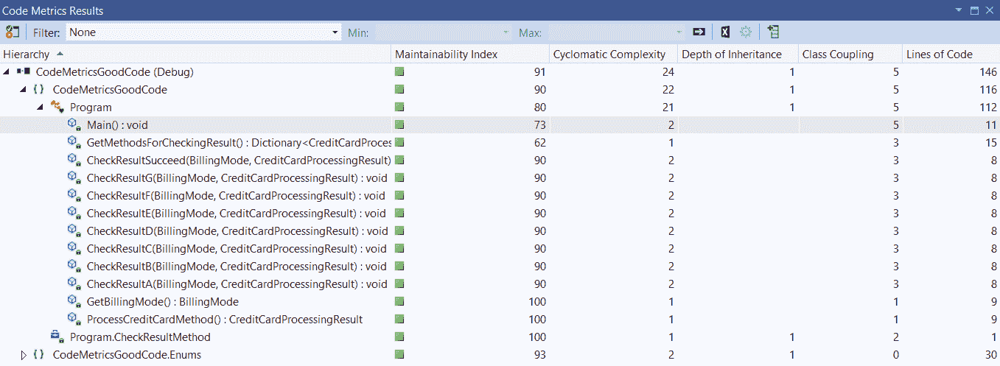
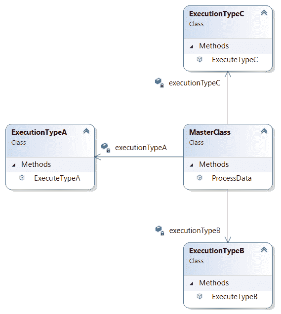
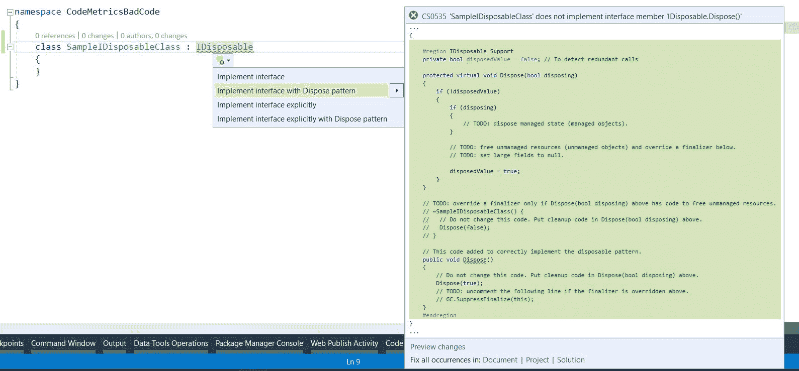

# 第十四章：C# 8 编码的最佳实践

当你在项目中担任软件架构师时，你有责任定义和/或维护一个编码标准，这将指导团队根据公司的期望进行编程。本章涵盖了帮助你编写安全、简单和可维护软件的一些最佳编码实践。它还包括 C#编码的技巧和窍门。

本章将涵盖以下主题：

+   你的代码复杂度如何影响性能

+   使用版本控制系统的必要性

+   在 C#中编写安全代码

+   .NET core 编码技巧和窍门

+   书籍使用案例 - 编写代码时的注意事项与禁忌

# 技术要求

本章需要 Visual Studio 2019 免费社区版或更高版本，并安装所有数据库工具。

你可以在这里找到本章的示例代码：[`github.com/PacktPublishing/Hands-On-Software-Architecture-with-CSharp-8/tree/master/ch14`](https://github.com/PacktPublishing/Hands-On-Software-Architecture-with-CSharp-8/tree/master/ch14).

# 你的代码越复杂，你的编程能力就越差

对于许多人来说，一个好的程序员是编写复杂代码的人。然而，软件开发成熟度的演变意味着对此有不同的思考方式。复杂性并不意味着工作做得好，它意味着代码质量差。一些令人难以置信的科学家和研究人员证实了这一理论，并强调专业代码需要关注时间、高质量，并在预算内完成。

因此，如果你想编写好的代码，你需要关注如何编写它，考虑到你不是唯一一个将来会阅读它的人。这是一个改变你编写代码方式的良好建议。这就是我们将如何讨论本章的每个要点。

如果你对编写良好代码重要性的理解与编写时的简洁性和清晰性理念相一致，你应该看看 Visual Studio 工具代码度量：


代码度量工具将提供度量值，这些度量值将为你提供关于你交付的软件质量的洞察。该工具提供的度量值列在这里，并可在以下链接中找到 [`docs.microsoft.com/en-us/visualstudio/code-quality/code-metrics-values?view=vs-2019`](https://docs.microsoft.com/en-us/visualstudio/code-quality/code-metrics-values?view=vs-2019):

+   可维护性指数

+   圈复杂度

+   继承深度

+   类耦合

+   代码行数

下一个子节将专注于描述它们在现实生活场景中的有用性。

# 可维护性指数

这个指数表明了维护代码的难易程度——代码越容易维护，指数就越高（限于 100）。易于维护是保持软件健康的关键点之一。显然，任何软件在未来都需要进行更改，因为变化是不可避免的。因此，如果你有低维护性，考虑重构你的代码。编写专门负责单一职责的类和方法，避免重复代码，并限制每个方法的代码行数，这些都是你可以提高维护性指数的例子。

# 循环复杂度

《循环复杂度度量》一书的作者是托马斯·J·麦卡贝。他根据可用的代码路径数（图节点）来定义软件函数的复杂度。路径越多，函数越复杂。麦卡贝认为每个函数的复杂度得分必须小于 10。这意味着，如果代码中有更复杂的方法，你必须重构它，将这些代码的部分转换为独立的方法。有一些真实场景中，这种行为很容易被检测到：

+   循环嵌套循环

+   连续的多个`if`-`else`

+   在同一方法内部对每个`case`进行代码处理的`switch`

例如，看看这个方法处理信用卡交易不同响应的第一版本。正如你可以检查的，循环复杂度大于麦卡贝作为基础的数字。这种情况发生的原因是每个主`switch`案例中的`if`-`else`的数量：

```cs
static void Main()
{
    var billingMode = GetBillingMode();
    var messageResponse = ProcessCreditCardMethod();
    switch (messageResponse)
    {
        case "A":
            if (billingMode == "M1")
                Console.WriteLine($"Billing Mode {billingMode} for Message 
                Response {messageResponse}");
            else
                Console.WriteLine($"Billing Mode {billingMode} for Message 
                Response {messageResponse}");
            break;
        case "B":
            if (billingMode == "M2")
                Console.WriteLine($"Billing Mode {billingMode} for Message 
                Response {messageResponse}");
            else
                Console.WriteLine($"Billing Mode {billingMode} for Message 
                Response {messageResponse}");
            break;
        case "C":
            if (billingMode == "M3")
                Console.WriteLine($"Billing Mode {billingMode} for Message 
                Response {messageResponse}");
            else
                Console.WriteLine($"Billing Mode {billingMode} for Message 
                Response {messageResponse}");
            break;
        case "D":
            if (billingMode == "M4")
                Console.WriteLine($"Billing Mode {billingMode} for Message 
                Response {messageResponse}");
            else
                Console.WriteLine($"Billing Mode {billingMode} for Message 
                Response {messageResponse}");
            break;
        case "E":
            if (billingMode == "M5")
                Console.WriteLine($"Billing Mode {billingMode} for Message 
                Response {messageResponse}");
            else
                Console.WriteLine($"Billing Mode {billingMode} for Message 
                Response {messageResponse}");
            break;
        case "F":
            if (billingMode == "M6")
                Console.WriteLine($"Billing Mode {billingMode} for Message 
                Response {messageResponse}");
            else
                Console.WriteLine($"Billing Mode {billingMode} for Message 
                Response {messageResponse}");
            break;
        case "G":
            if (billingMode == "M7")
                Console.WriteLine($"Billing Mode {billingMode} for Message 
                Response {messageResponse}");
            else
                Console.WriteLine($"Billing Mode {billingMode} for Message 
                Response {messageResponse}");
            break;
        case "S":
            if (billingMode == "M8")
                Console.WriteLine($"Billing Mode {billingMode} for Message 
                Response {messageResponse}");
            else
                Console.WriteLine($"Billing Mode {billingMode} for Message 
                Response {messageResponse}");
            break;
        default:
            Console.WriteLine("The result of processing is unknown");
            break;
    }
}
```

如果你计算这段代码的代码度量，你会发现当涉及到循环复杂度时，结果非常糟糕，就像你在下面的截图中所看到的那样：


代码本身没有意义，但这里的关键是展示你可以做出多少改进来编写更好的代码：

+   `switch`-`case`选项可以用`Enum`来编写。

+   每个情况的处理都可以在一个特定的方法中完成。

+   `switch`-`case`可以用`Dictionary<Enum, Method>`来替换。

通过使用上述技术重构这段代码，结果是一段更容易理解的代码，就像你在下面的代码片段中看到的主方法一样：

```cs
static void Main()
{
    var billingMode = GetBillingMode();
    var messageResponse = ProcessCreditCardMethod();
    Dictionary<CreditCardProcessingResult, CheckResultMethod> 
    methodsForCheckingResult =
    GetMethodsForCheckingResult();
    if (methodsForCheckingResult.ContainsKey(messageResponse))
        methodsForCheckingResultmessageResponse;
    else
        Console.WriteLine("The result of processing is unknown");
}
```

完整的代码可以在本章的 GitHub 上找到，展示了如何实现低复杂度的代码。下面的截图显示了根据代码度量得出的这些结果：



正如你在前面的截图中所看到的，重构后复杂度有相当大的降低。这里的关键点是，应用了这些技术后，代码的理解性提高了，复杂度降低了，这证明了循环复杂度的重要性。

# 继承深度

此指标表示连接到正在分析的那个类的类的数量。你继承的类越多，你的代码就越糟糕。这与类耦合类似，表明改变你的代码有多困难。

例如，以下截图有四个继承的类：


你可以在下面的截图看到，深度更大的类由于有三个其他类可以改变其行为，其指标更差：


继承是面向对象分析的基本原则之一。然而，有时它可能对你的代码不利，因为它可能引起依赖。因此，如果你这样做有意义，考虑使用聚合而不是继承。

# 类耦合

当你在单个类中连接太多的类时，显然你会得到耦合，这可能导致你的代码维护不良。例如，参见下面的截图。它显示了一个进行了大量聚合的设计。代码本身没有意义：



一旦你计算了前面设计的代码指标，你就会看到调用`ExecuteTypeA()`、`ExecuteTypeB()`和`ExecuteTypeC()`的`ProcessData()`方法的类耦合实例数等于三个（`3`）：


一些论文指出，类耦合实例的最大数量应该是九（`9`）。由于聚合比继承是一个更好的实践，使用接口将解决类耦合问题。例如，以下设计相同的代码将给出更好的结果：


注意，在设计中使用界面将允许你在不增加解决方案的类耦合的情况下增加执行类型：


作为一名软件架构师，你必须考虑设计你的解决方案，使其具有比耦合更高的内聚性。文献指出，好的软件具有低耦合和高内聚。这是一个基本的原则，可以指导你到一个更好的架构模型。

# 代码行数

此指标有助于你理解你正在处理的代码的大小。由于行数并不能表明复杂性，因此无法将代码行数与复杂性联系起来。另一方面，代码行数显示了软件的大小和软件设计。例如，如果你在一个类中有太多的代码行（超过 1,000 行代码—1 KLOC），这表明这是一个糟糕的设计。

# 使用版本控制系统

你可能会觉得这本书中关于这个话题的内容有点明显，但许多人和公司仍然没有将版本控制系统视为软件开发的基本工具！写这个话题的目的是强迫你理解它。如果你不使用版本控制系统，没有任何架构模型或最佳实践可以拯救软件开发。

在过去几年里，我们一直在享受在线版本控制系统（如 GitHub、BitBucket 和 Azure DevOps）带来的优势。事实上，在你的软件开发生命周期中必须有一个这样的工具，而且没有理由不再使用它，因为大多数提供商都为小型团队提供免费版本。即使是你自己开发，这些工具也有助于跟踪你的更改、管理你的软件版本，并保证你的代码的一致性和完整性。

# 在团队中处理版本控制系统

当你一个人使用版本控制系统工具时，这很显然。你希望保持你的代码安全。但这类系统肯定是为了解决编写代码时的团队问题而开发的。因此，引入了一些功能，如分支和合并，以保持代码完整性，即使在开发者数量相当大的情况下也是如此。

作为一名软件架构师，你将不得不决定在你的团队中采用哪种分支策略。Azure DevOps 和 GitHub 建议不同的方法来实现这一点，并且在某些场景下它们都是很有用的。

关于 Azure DevOps 团队如何处理这个问题的信息可以在这里找到：[`devblogs.microsoft.com/devops/release-flow-how-we-do-branching-on-the-vsts-team/`](https://devblogs.microsoft.com/devops/release-flow-how-we-do-branching-on-the-vsts-team/)。GitHub 在这里描述了其流程：[`guides.github.com/introduction/flow/`](https://guides.github.com/introduction/flow/)。我们不知道哪一个最适合你的需求，但我们确实想让你明白，你需要有一个控制代码的策略。

# 在 C#中编写安全代码

C#可以被认为是一种设计上安全的编程语言。除非你强制使用，否则不需要指针，并且大多数情况下，内存释放由垃圾回收器管理。即便如此，你也应该注意一些事项，以便从你的代码中获得更好的安全结果。让我们来看看它们。

# try-catch

编程中的异常如此频繁，以至于你可能会找到一种方法来管理它们，无论何时发生。`try`-`catch`语句就是为了管理这些异常而构建的，它们对于保持代码安全至关重要。有很多情况下应用程序崩溃，原因就是没有使用`try`-`catch`。以下代码展示了缺少使用`try`-`catch`语句的例子：

```cs
private static int CodeWithNoTryCatch(string textToConvert)
{
    return Convert.ToInt32(textToConvert);
}
```

另一方面，错误的`try`-`catch`使用也可能对你的代码造成损害，特别是因为你将看不到该代码的正确行为，并可能误解提供的结果。以下代码展示了空`try`-`catch`语句的示例：

```cs
private static int CodeWithEmptyTryCatch(string textToConvert)
{
    try
    {
        return Convert.ToInt32(textToConvert);
    }
    catch
    {
        return 0;
    }
}
```

`try`-`catch`语句必须始终与日志解决方案相关联，这样你就可以得到系统的响应，指示正确的行为，同时不会导致应用程序崩溃。以下代码展示了带有日志管理的理想`try`-`catch`语句：

```cs
private static int CodeWithCorrectTryCatch(string textToConvert)
{
    try
    {
        return Convert.ToInt32(textToConvert);
    }
    catch (Exception err)
    {
        Logger.GenerateLog(err);
        return 0;
    }
}
```

作为一名软件架构师，你应该进行代码审查以修复代码中发现的这类行为。系统的不稳定通常与代码中缺少 try-catch 语句有关。

# try-finally 和 using

内存泄漏可以被认为是软件最糟糕的行为之一。它们导致系统不稳定，计算机资源使用不当，以及不希望的应用程序崩溃。C#试图通过垃圾回收器解决这个问题，垃圾回收器会在意识到对象可以被释放时自动释放对象。

与 I/O 交互的对象通常不是由垃圾回收器管理的：文件系统、套接字等。以下代码是`FileStream`对象使用错误的示例，因为它认为垃圾回收器会释放使用的内存，但实际上不会：

```cs
private static void CodeWithIncorrectFileStreamManagement()
{
    FileStream file = new FileStream("C:\\file.txt", FileMode.CreateNew);
    byte[] data = GetFileData();
    file.Write(data, 0, data.Length);
}
```

此外，垃圾回收器与需要释放的对象交互需要一段时间，有时你可能想自己来做这件事。在这两种情况下，使用`try`-`finally`或`using`语句是最佳实践：

```cs
private static void CodeWithCorrectFileStreamManagementFirstOption()
{
    using (FileStream file = new FileStream("C:\\file.txt", 
    FileMode.CreateNew))
    {
        byte[] data = GetFileData();
        file.Write(data, 0, data.Length);
    }
}

private static void CodeWithCorrectFileStreamManagementSecondOption()
{
    FileStream file = new FileStream("C:\\file.txt", FileMode.CreateNew);
    try
    {
        byte[] data = GetFileData();
        file.Write(data, 0, data.Length);
    }
    finally
    {
        file.Dispose();
    }
}
```

上述代码展示了如何处理不由垃圾回收器管理的对象。你既有`try`-`finally`也有`using`的实现。作为一名软件架构师，你需要注意这类代码。缺少`try`-`finally`或`using`语句可能导致软件在运行时出现严重问题。

# `IDisposable`接口

同样，如果你不使用 try-finally/using 语句管理在方法内部创建的对象，那么在未正确实现`IDisposable`接口的类中创建的对象可能会导致你的应用程序出现内存泄漏。因此，当你有一个处理和创建对象的类时，你应该实现可处置模式，以确保释放它创建的所有资源：



好消息是，Visual Studio 通过在代码中指示并右键单击“快速操作和重构”选项来实现此接口的代码片段，就像你在前面的截图中所看到的那样。一旦你插入了代码，你需要遵循 TODO 指令，以确保正确实现了模式。

# .NET Core 编码技巧和窍门

.NET Core 实现了一些有助于我们编写更好代码的良好功能。其中最有用的是**依赖注入**（**DI**），这在第九章，*设计模式和.NET Core 实现*中已经讨论过。考虑这一点有几个很好的理由。第一个是因为你不需要担心注入对象的释放，因为你不是它们的创建者。

此外，DI 使你能够注入`ILogger`，这是一个非常有用的调试异常的工具，这些异常将需要在你的代码中通过 try-catch 语句来管理。此外，使用.NET Core 进行 C#编程必须遵循任何编程语言的通用良好实践。以下列表显示了其中的一些：

+   **类、方法和变量应该有可理解的名称**：名称应该解释读者需要知道的一切。不应该需要解释性注释。

+   **方法不能有高复杂度**：应该检查方法的圈复杂度，以确保方法不要有太多的代码行。

+   **应避免重复代码**：在像 C#这样的高级编程语言中，没有必要存在重复代码。

+   **在使用对象之前应进行检查**：由于可能存在 null 对象，代码必须进行 null 类型检查。

+   **应使用常量和枚举器**：避免代码中的魔法数字和文本的好方法是将这些信息转换为常量和枚举器，这通常更容易理解。

+   **应避免不安全代码**：除非没有其他实现代码的方法，否则应避免使用不安全代码。

+   **try-catch 语句不能为空**：在没有处理`catch`区域的`try-catch`语句中没有理由。

+   **try-finally/using 语句应该始终使用**：即使对于垃圾回收器将负责处理的对象，也应考虑处理你负责创建的对象。

+   **至少公共方法应该有注释**：考虑到公共方法是用于你库外部的那些方法，它们必须被解释以正确使用。

+   **switch-case 语句必须有默认处理**：由于`switch-case`语句可能接收到在某些情况下未知的人口变量，默认处理将保证在这种情况下代码不会中断。

作为软件架构师，一个好的做法是为你的开发者提供一个所有程序员都会使用的代码模式，以此来保持代码风格的一致性。你可以将代码模式用作编码检查的清单，这将丰富软件代码的质量。

# WWTravelClub – 编写代码的注意事项和禁忌

作为一名软件架构师，你必须定义一个符合你所服务公司需求的代码标准。

在本书的示例项目中（关于 WWTravelClub 项目的更多信息，请参阅第一章，*理解软件架构的重要性*），情况并无不同。我们决定展示该标准的做法是描述我们在编写示例时遵循的一系列“做”和“不做”的清单。值得一提的是，这个清单是一个很好的开始标准，作为软件架构师，你应该与团队中的开发者讨论这个清单，以便以实际和良好的方式对其进行改进：

+   **务必**用英语编写你的代码。

+   **务必**遵循 C#编码标准，使用驼峰命名法。

+   **务必**使用易于理解的名称编写类、方法和变量。

+   **务必**对公共类、方法和属性进行注释。

+   **务必**尽可能使用`using`语句。

+   **务必**尽可能使用`async`实现。

+   **务必**在实现非托管代码之前请求授权。

+   **务必**在实现线程之前请求授权。

+   **不要**编写空的`try`*-*`catch`语句。

+   **不要**编写超过 10 个循环复杂度的方法。

+   **不要**在`for`/`while`/`do`*-*`while`/`foreach`语句中使用`break`和`continue`。

+   **不要**使用`goto`语句。

这些“做”和“不做”的规则很容易遵循，而且，更重要的是，它们将为你的团队产生的代码带来巨大的成果。在第十六章，*使用工具编写更好的代码*中，我们将讨论帮助你实施这些规则的工具。

# **摘要**

在本章中，我们讨论了一些编写安全代码的重要提示。本章介绍了一个分析代码指标的工具，这样你可以管理你正在开发的软件的复杂性和可维护性。最后，我们提出了一些保证你的软件不会因为内存泄漏和异常而崩溃的好建议。在现实生活中，软件架构师总会被要求解决这类问题。

在下一章中，我们将学习一些单元测试技术、单元测试的原则以及一个专注于 C#测试项目的软件过程模型。

# **问题**

1.  为什么我们需要关注可维护性？

1.  循环复杂度是什么？

1.  列出使用版本控制系统的优点。

1.  `try`-`catch`、`try`-`finally`和`try`-`catch`-`finally`之间的区别是什么？

1.  垃圾收集器是什么？

1.  实现`IDisposable`接口的重要性是什么？

1.  当涉及到编码时，我们从.NET Core 中获得了哪些优势？

# **进一步阅读**

这些是一些书籍和网站，你可以在其中找到更多关于本章主题的信息：

+   《嵌入式系统设计艺术》by Jack G. Ganssle. Elsevier, 1999。

+   《重构：改善既有代码的设计》by Martin Fowler. Addison Wesley, 1999。

+   *托马斯·J·麦卡贝的复杂度度量*。IEEE 软件工程杂志，第 2 卷第 4 期，1976 年，第 308-320 页 ([`dblp.uni-trier.de/db/journals/tse/tse2.html`](https://dblp.uni-trier.de/db/journals/tse/tse2.html)).

+   [`blogs.msdn.microsoft.com/zainnab/2011/05/25/code-metrics-class-coupling/`](https://blogs.msdn.microsoft.com/zainnab/2011/05/25/code-metrics-class-coupling/)

+   [`docs.microsoft.com/en-us/visualstudio/code-quality/code-metrics-values?view=vs-2019`](https://docs.microsoft.com/en-us/visualstudio/code-quality/code-metrics-values?view=vs-2019)

+   [`github.com/`](https://github.com/)

+   [`bitbucket.org/`](https://bitbucket.org/)

+   [`azure.microsoft.com/en-us/services/devops/`](https://azure.microsoft.com/en-us/services/devops/)

+   [`guides.github.com/introduction/flow/`](https://guides.github.com/introduction/flow/)

+   [`blogs.msdn.microsoft.com/devops/2018/04/19/release-flow-how-we-do-branching-on-the-vsts-team/`](https://blogs.msdn.microsoft.com/devops/2018/04/19/release-flow-how-we-do-branching-on-the-vsts-team/)

+   [`docs.microsoft.com/aspnet/core/fundamentals/logging/`](https://docs.microsoft.com/aspnet/core/fundamentals/logging/)
