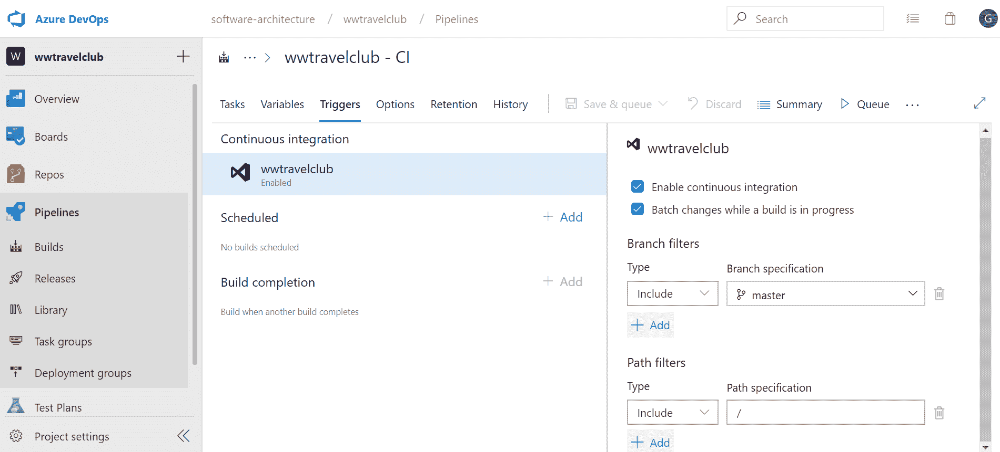
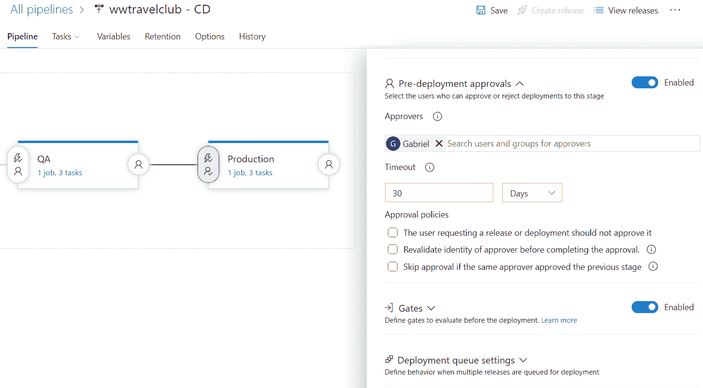
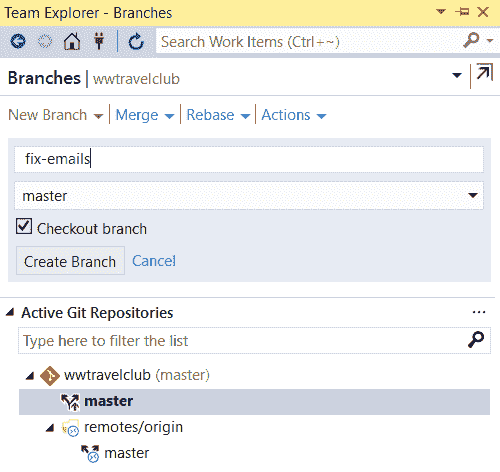
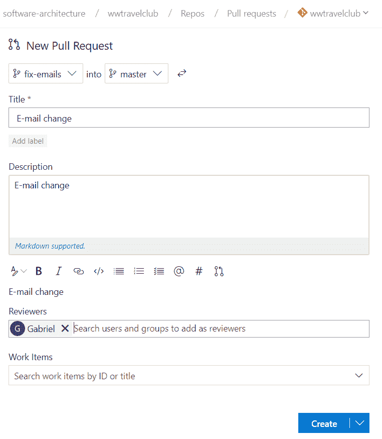
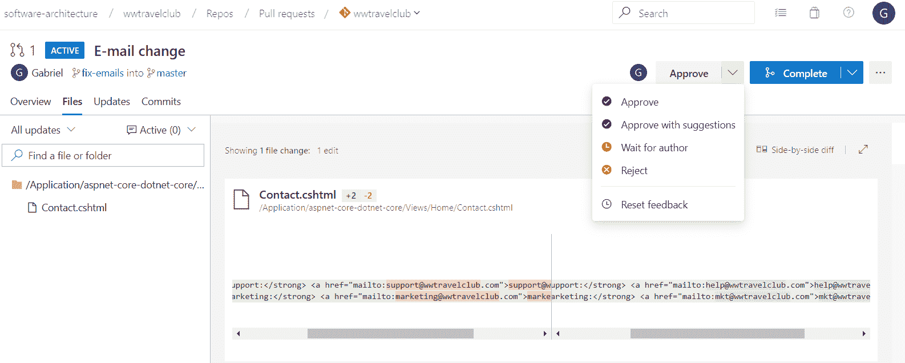
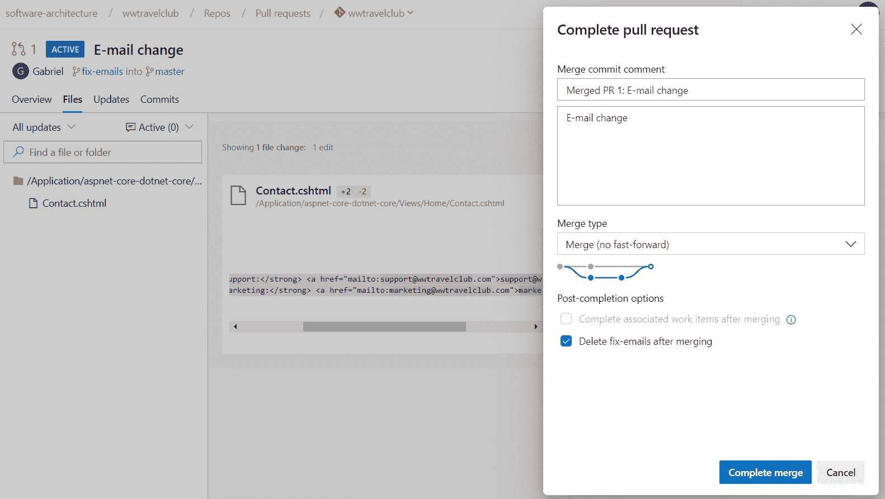
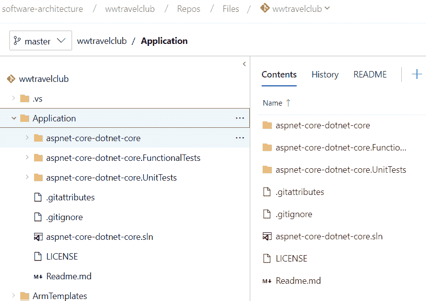
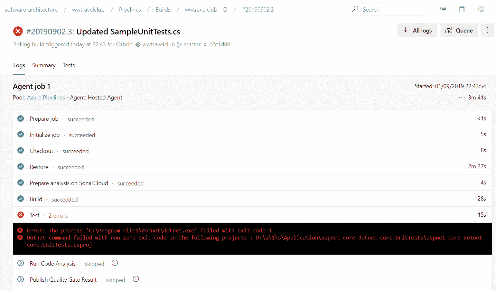
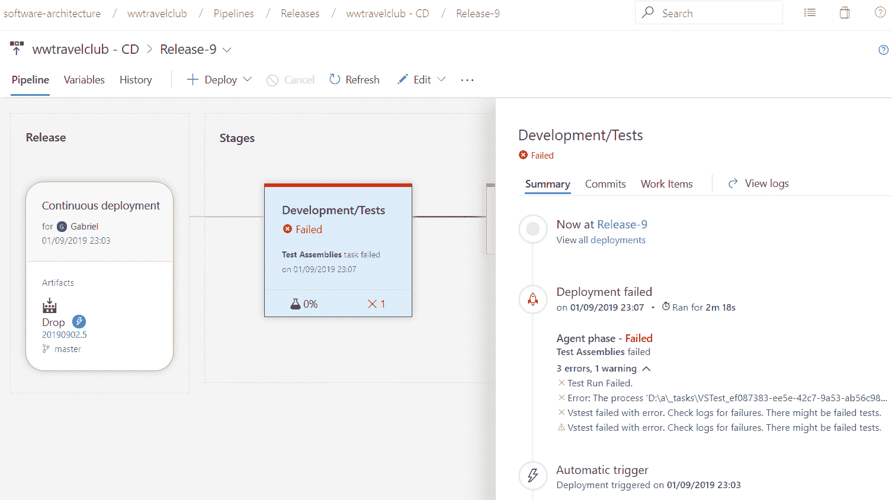
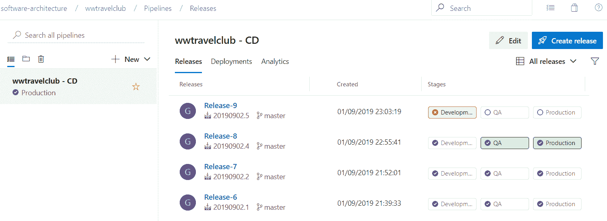

# 第十九章：在 DevOps 中应用 CI 场景的挑战

**持续集成（CI）**(**CI**) 是 DevOps 的一步。在前一章中，我们讨论了持续集成（CI）的基础以及 DevOps 如何依赖于它。其实现也在第十八章，*理解 DevOps 原则*中介绍，但与其他实践章节不同，本章的目的是讨论如何在真实场景中启用持续集成（CI），考虑到你作为软件架构师需要应对的挑战。

本章涵盖的主题如下：

+   理解持续集成（CI）

+   理解使用持续集成（CI）时的风险和挑战

+   理解本章的 WWTravelClub 项目方法

正如前一章所述，在解释本章内容时，将展示 WWTravelClub 的示例，因为所有用于说明持续集成（CI）的屏幕截图都来自它。此外，我们将在本章末尾提供一个结论，以便你能够轻松理解持续集成（CI）的原则。

到本章结束时，你将能够决定是否在你的项目环境中使用持续集成（CI）。此外，你将能够定义成功使用此方法所需的工具。

# 技术要求

本章需要 Visual Studio 2019 Community Edition 或更高版本。你可能还需要一个 Azure DevOps 账户，如第三章使用 Azure DevOps 记录需求中所述。

# 理解持续集成（CI）

一旦你开始使用 Azure DevOps 等平台，启用持续集成（CI）在点击相应的选项时将变得非常容易，正如我们在第十八章，*理解 DevOps 原则*中看到的。因此，技术并不是实施此过程的阿基里斯之踵。

以下截图展示了使用 Azure DevOps 启用持续集成（CI）是多么容易。通过点击构建管道并编辑它，你将能够设置一个触发器，在几次点击后启用持续集成（CI）：

事实上，持续集成（CI）将帮助你解决一些问题。例如，它将迫使你测试你的代码，因为你需要更快地提交更改，以便其他开发者可以使用你正在编写的代码。

另一方面，你仅仅通过点击前面的截图并不能启用持续集成（CI）。当然，一旦你完成提交并且代码已经完成，你将能够启动构建的可能性，但这远不能说明你在解决方案中已经有了持续集成（CI）。

作为软件架构师，你需要更加关注它的原因与对 DevOps 的真正理解有关。正如在第十八章理解 DevOps 原则中讨论的，向最终用户提供价值始终是决定和绘制开发生命周期的良好方式。因此，即使开启 CI 很容易，这个功能对最终用户的影响是什么？一旦你有了对这个问题的所有答案，并且你知道如何降低其实施的风险，那么你就可以说你已经实施了一个 CI 流程。

值得注意的是，CI 是一个可以使 DevOps 工作得更好、更快的原则，正如在第十八章理解 DevOps 原则中讨论的。然而，一旦你不确定你的流程是否足够成熟以实现代码的持续交付，DevOps 完全可以没有它。更重要的是，如果你在一个处理其复杂性还不够成熟的团队中开启 CI，你可能会对 DevOps 产生误解，因为你将在部署解决方案时开始承担一些风险。

这就是为什么我们专门用额外的一章来介绍 CI。你需要了解一旦开启 CI，作为软件架构师你将面临的风险和挑战。

# 使用 CI 时的风险和挑战理解

现在，你可能正在考虑风险和挑战作为避免使用 CI 的一种方式。但为什么我们要避免使用它，如果它可以帮助你更好地进行 DevOps 流程呢？这不是本章的目的。本节的想法是帮助你，作为软件架构师，通过良好的流程和技术来减轻风险，找到更好的方法来克服挑战。

本章将讨论的风险和挑战列表如下：

+   持续生产部署

+   生产中的不完整功能

+   测试中的不稳定解决方案

一旦你有了处理它们的技巧和流程，就没有不使用 CI 的理由。值得一提的是，DevOps 并不依赖于 CI。然而，它确实使 DevOps 工作更加顺畅。现在，让我们来看看它们。

# 禁用持续生产部署

持续生产部署是一个过程，在提交新代码片段和一些管道步骤之后，你将在生产环境中拥有这段代码。这并非不可能，但确实很难且成本高昂。此外，你需要一个真正成熟的团队。问题是，你将在互联网上找到的大多数演示和示例都会展示 CI 的快速部署路径。CI/CD 的演示看起来非常简单和容易操作！这种*简单性*可能会让你尽快开始实施。然而，如果你稍微思考一下，直接在生产环境中部署可能会很危险！在一个需要每天 24 小时、每周 7 天都可用解决方案中，这是不切实际的。因此，你需要担心这一点，并考虑不同的解决方案。

第一个方法是使用多阶段场景，如第十八章中所述的*理解 DevOps 原则*。多阶段场景可以为构建的部署生态系统带来更多安全性。此外，你将获得更多选项来避免错误的生产部署，例如预部署批准：

值得注意的是，你可以构建一个部署管道，其中所有代码和软件结构都将由这个工具更新。然而，如果你有超出这个场景的内容，比如数据库脚本和环境配置，错误的生产发布可能会对最终用户造成损害。此外，何时更新生产环境的决定需要计划，在许多场景中，所有平台用户都需要。在这些情况下，使用*变更管理*程序需要决定。

因此，将代码部署到生产环境所带来的挑战会让你考虑制定一个部署的时间表。无论是按月、按日，甚至是每次提交后，这都无关紧要。关键点在于你需要创建一个流程和管道，确保只有良好且经过批准的软件处于生产阶段。

# 不完整的特性

当你的团队中的开发者正在创建新功能或修复错误时，你可能会考虑生成一个分支，以避免使用为持续交付设计的分支。分支可以被视为代码仓库中的一项功能，它允许创建一个独立的开发线，因为它隔离了代码。正如你可以在下面的屏幕截图中所见，使用 Visual Studio 创建分支相当简单：

这似乎是一个好方法，但让我们假设开发者已经认为实现已经准备好部署，并且刚刚将代码合并到主分支。如果因为这个要求被遗漏，这个功能还没有准备好，会发生什么？如果错误导致了不正确的行为，结果可能是一个带有不完整功能或错误修复的发布。

避免在主分支中引入损坏的功能甚至错误的修复措施的好做法是使用拉取请求。拉取请求将让其他团队成员知道你开发的代码已准备好合并。以下截图显示了如何使用 Azure DevOps 创建一个针对你所做的更改的新拉取请求：

一旦创建了拉取请求并定义了审查者，每个审查者都将能够分析代码并决定这些代码是否足够健康，可以放入主分支。以下截图显示了如何通过使用比较工具来分析更改来检查它：

一旦所有审批都完成，你将能够安全地将代码合并到主分支，如下面的截图所示。要合并代码，你需要点击“完成合并”。如果 CI 触发器已启用，如本章前面所示，Azure DevOps 将启动构建管道：

没有办法争论，如果没有这样的流程，主分支将遭受许多糟糕的代码部署，这可能会与 CD 一起造成损害。值得一提的是，代码审查在 CI/CD 场景中是一种优秀的实践，并且被认为是在任何软件中创建良好质量的绝佳实践。

你需要关注这里的挑战是确保只有完整的功能会出现在最终用户面前。你可以使用功能标志原则来解决它，这是一种确保只有准备好的功能呈现给最终用户的技巧。再次强调，我们不是在谈论 CI 作为一个工具，而是在谈论一个需要在每次需要向生产交付代码时定义和使用的流程。

# 测试的不稳定解决方案

考虑到你已经缓解了本主题中提到的其他两个风险，你可能会发现，在 CI 之后编写出糟糕的代码相当困难。确实，考虑到你正在处理多阶段场景并在推送至第一阶段之前提交拉取请求，之前提出的担忧肯定会降低。

但是，有没有一种方法可以加速发布版本的评估，确保这个新版本已经准备好供利益相关者进行测试？是的，有！从技术上讲，你可以这样做的方式在第十五章的用例中描述，*使用单元测试用例和 TDD 测试你的代码*，以及第二十章的*软件测试自动化*中。

正如这两章所讨论的，考虑到实现自动化所需的努力，自动化软件的每一个部分都是不切实际的。此外，在用户界面或业务规则变化很大的场景中，自动化的维护可能更加昂贵。

为了举例说明，让我们看一下以下截图，它显示了当 WWTravelClub 项目启动时 Azure DevOps 创建的单元测试和功能测试：

在第九章“设计模式和.NET Core 实现”中介绍了某些架构模式，如 SOLID，以及一些质量保证方法，如同行评审，这些方法将比软件测试提供更好的结果。

然而，这些方法并没有使自动化实践失效。事实是，所有这些方法在获得稳定解决方案时都将是有用的，尤其是在你运行 CI 场景时。在这种情况下，你能做的最好的事情就是尽可能快地检测错误和不良行为。正如前面所展示的，单元测试和功能测试都将帮助你做到这一点。

单元测试在部署前发现业务逻辑错误时将非常有帮助，尤其是在构建管道期间。例如，在以下截图中，你将找到一个模拟的错误，由于单元测试未通过，该错误取消了构建：

获取这种错误的方法相当简单。你需要编写一些代码，这些代码不会根据单元测试所检查的内容做出响应。一旦你提交了它，考虑到你开启了持续部署的触发器，你的代码将在管道中构建。我们创建的 Azure DevOps 项目向导提供的最后一步是执行单元测试。因此，在代码构建之后，单元测试将会运行。如果代码不再匹配测试，你将得到错误。

同时，以下截图显示了在开发/测试阶段功能测试期间出现的错误。此时，开发/测试环境存在一个被功能测试快速检测到的错误：

但这并不是在 CI/CD 过程中应用功能测试的唯一好处，一旦你用这种方法保护了其他部署阶段。例如，让我们看一下以下来自 Azure DevOps 发布管道界面的截图。如果你查看 Release-9，你会意识到自从这个错误在开发/测试环境发布后发生，多阶段环境将保护部署的其他阶段：

持续集成（CI）过程成功的关键是将它视为加速软件交付的有用工具，并不要忘记团队始终需要向最终用户提供价值。采用这种方法，前面介绍的技术将提供实现团队目标结果的惊人方式。

# 理解 WWTravelClub 项目的方法

在本章中，WWTravelClub 项目的截图展示了在启用持续集成（CI）的同时获得更安全方法的过程。即使将 WWTravelClub 视为一个假设场景，在构建它时也考虑了一些担忧：

+   持续集成（CI）已启用，但多阶段场景也已启用。

+   即使是多阶段场景，拉取请求也是一种保证在第一阶段只展示高质量代码的方式。

+   要做好拉取请求的工作，需要进行同行评审。

+   例如，同行评审检查在创建新功能时是否存在功能标志。

+   同行评审检查在创建新功能期间开发的单元测试和功能测试。

之前提到的步骤不仅适用于 WWTravelClub。作为软件架构师，您需要定义保证安全持续集成（CI）场景的方法。您可以将此作为起点。

# 摘要

本章介绍了在软件开发生命周期中何时启用持续集成（CI）的重要性，并考虑了您一旦决定在解决方案中实施它，作为软件架构师将面临的潜在风险和挑战。

此外，本章还介绍了一些可以使此过程更容易的解决方案和概念，例如多阶段环境、拉取请求评审、功能标志、同行评审和自动化测试。理解这些技术和流程将使您能够引导项目在 DevOps 场景中的持续集成（CI）方面表现出更安全的行为。

在下一章中，我们将看到软件测试自动化的工作原理。

# 问题

1.  什么是持续集成（CI）？

1.  您可以在没有持续集成（CI）的情况下进行 DevOps 吗？

1.  在一个不成熟的团队中启用持续集成（CI）有哪些风险？

1.  多阶段环境如何帮助持续集成（CI）？

1.  自动化测试如何帮助持续集成（CI）？

1.  拉取请求如何帮助持续集成（CI）？

1.  拉取请求是否仅与持续集成（CI）一起工作？

# 进一步阅读

这些是一些网站，您可以在这些网站上找到关于本章涵盖主题的更多信息：

+   [`azure.microsoft.com/en-us/solutions/architecture/azure-devops-continuous-integration-and-continuous-deployment-for-azure-web-apps/`](https://azure.microsoft.com/en-us/solutions/architecture/azure-devops-continuous-integration-and-continuous-deployment-for-azure-web-apps/)

+   [`docs.microsoft.com/en-us/azure/devops-project/azure-devops-project-github`](https://docs.microsoft.com/en-us/azure/devops-project/azure-devops-project-github)

+   [`docs.microsoft.com/en-us/aspnet/core/azure/devops/cicd`](https://docs.microsoft.com/en-us/aspnet/core/azure/devops/cicd)

+   [《专业 Microsoft Azure DevOps 工程》](https://www.packtpub.com/virtualization-and-cloud/professional-microsoft-azure-devops-engineering)

+   [《动手实践 DevOps Azure 视频教程》](https://www.packtpub.com/virtualization-and-cloud/hands-devops-azure-video)

+   [《在 Microsoft Azure 中实施 DevOps》](https://www.packtpub.com/networking-and-servers/implementing-devops-microsoft-azure)

+   [《Microsoft Azure DevOps 中的 Git 拉取请求》](https://docs.microsoft.com/en-us/azure/devops/repos/git/pullrequest)

+   [《Azure Pipelines 的最新动态》](https://devblogs.microsoft.com/devops/whats-new-with-azure-pipelines/)

+   [《特性切换》](https://martinfowler.com/bliki/FeatureToggle.html)
