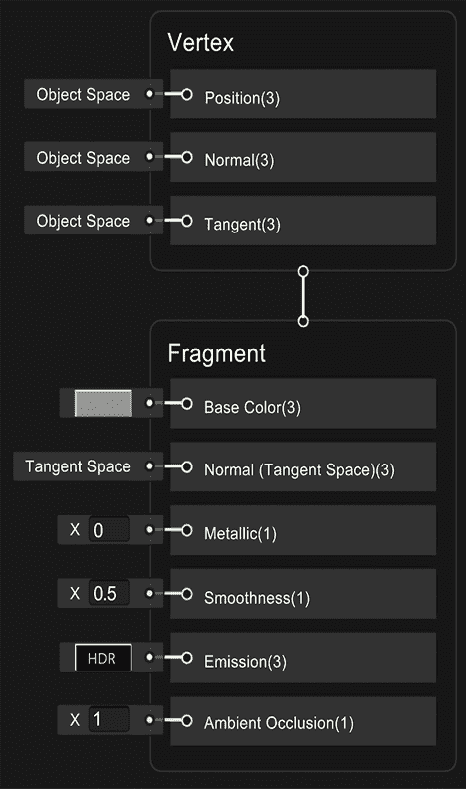

# 第十章：使用 URP 和 Shader Graph 创建材料和效果

欢迎来到**第三部分**的第一章。在这里，我们将深入探讨 Unity 的不同图形和音频系统，以显著提升游戏的外观和感觉。我们将从讨论什么是着色器以及如何创建自己的着色器以实现一些默认 Unity 着色器无法实现的自定义效果开始。我们将使用 Shader Graph 创建一个简单的水面动画效果，Shader Graph 是包含在通用渲染管线（URP）中的可视化着色器编辑器。也称为 URP，这是 Unity 中可用的不同渲染管线之一，它提供面向性能的渲染功能。在本章中，我们将讨论其一些功能。

在本章中，我们将探讨以下着色器概念：

+   介绍着色器和 URP

+   使用 Shader Graph 创建着色器

# 介绍着色器和 URP

我们在书的**第一部分**中创建了**材料**，但我们从未讨论过它们内部是如何工作的，以及为什么它们的**着色器**属性很重要。在本章的第一部分，我们将探讨着色器的概念，作为编程显卡以实现自定义视觉效果的一种方式。我们还将讨论 URP 如何与这些着色器一起工作，以及它提供的默认着色器。

在本节中，我们将涵盖与着色器相关的以下概念：

+   着色器管线

+   渲染管线和 URP

+   URP 内置着色器

让我们先讨论一下着色器是如何修改着色器管线以实现效果的。

## 着色器管线

每当显卡渲染一个 3D 模型时，它需要不同的信息来处理，例如**网格**、**纹理**、对象的变换（位置、旋转和缩放）以及影响该对象的光线。有了这些数据，显卡必须将对象的像素输出到**后缓冲区**，这是一个显卡将在其中绘制我们的对象的图像，但用户还看不到这个图像。这样做是为了防止用户看到未完成的结果，因为我们在显示器刷新时仍然可以绘制。当 Unity 完成渲染所有对象（和一些效果）并显示最终场景时，这个图像将会显示出来，将**后缓冲区**与用户实际看到的**前缓冲区**交换。你可以想象这就像有一页带有图像的页面，在向用户展示图像的同时，你正在绘制新的图像，当你完成新的绘制后，你只需交换页面，然后在用户看不到的页面上再次开始绘制，每帧重复这个过程。

这通常是渲染对象的方式，但数据输入和像素输出之间可以以无数种不同的方式和技巧来处理，这取决于你想要你的对象看起来如何；也许你希望它看起来很逼真或像全息图，也许对象需要分解效果或卡通效果——可能性无穷无尽。指定我们的显卡如何处理对象渲染的方式是通过着色器。

**着色器**是一种用特定显卡语言编写的程序，例如：

+   **HLSL**：DirectX 着色语言，DirectX 是一个图形库。

+   **GLSL**：OpenGL 着色语言，OpenGL 也是一个图形库。

+   **CG**：一种可以根据我们在游戏中使用的图形库输出 HLSL 或 GLSL 的语言。

+   **着色器图**：一种将根据我们的需求自动转换为之前提到的一种语言的视觉语言。这是我们将会使用的一种，因为它简单（后面会详细说明）。

这些语言中的任何一种都可以用来配置渲染给定对象所需的不同渲染过程阶段，有时不仅配置它们，还可以用完全定制的代码来替换它们，以实现我们想要的确切效果。渲染对象的各个阶段构成了我们所说的着色器管线，这是一系列应用于输入数据的修改，直到将其转换为像素。

管线中的每个阶段都负责不同的修改，并且根据显卡的着色器模型，这个管线可能会有很大的变化。在下一个图中，你可以找到一个简化的渲染管线，跳过了现在不重要的高级/可选阶段：

图 10.1：常见的着色器管线

让我们讨论每个阶段：

+   **输入汇编器**：在这里，所有网格数据，如顶点位置、UV 和法线，被组装起来以准备下一阶段。

+   **顶点着色器**：这个阶段过去通常限于应用对象的变换、摄像机的位置和视角以及简单的光照计算。在现代 GPU 中，你可以做任何你想做的事情。这个阶段接收渲染对象的所有顶点，并输出一个修改后的顶点。你有机会在这里修改对象的几何形状。这里的常用代码是应用对象的变换，但你也可以应用多种效果，例如沿着法线膨胀对象以应用旧的卡通效果技术，或者添加随机偏移量来扭曲每个顶点以重新创建全息图。还有机会计算下一阶段所需的数据。

+   **剔除**：你将要渲染的大多数模型具有一个特性，那就是你永远不会看到模型面的背面。在一个立方体中，没有办法看到它的内部侧面。鉴于这一点，渲染立方体每个面的两侧是没有意义的，这一阶段就负责处理这个问题。剔除将根据面的方向确定是否需要渲染该面，从而节省大量遮挡面的像素计算。你可以更改这一设置，以便在特定情况下有不同的行为；例如，我们可以创建一个需要透明以看到盒子所有侧面的玻璃盒子。

+   **光栅化器**：现在我们已经计算出了模型修改后的可见几何形状，是时候将其转换为像素了。光栅化器为我们的网格中的三角形创建所有像素。这里发生了很多事情，但我们对此的控制非常有限；通常的光栅化方式只是创建网格三角形内部的像素。我们还有其他模式，仅渲染边上的像素以看到线框效果，但这通常用于调试目的：

图 10.2：图像光栅化的示例

+   **片段着色器**：这是所有阶段中最可定制的之一。它的目的是简单的：只是确定光栅化器生成的每个片段（像素）的颜色。在这里，可以发生很多事情，从简单地输出纯色或采样纹理到应用复杂的照明计算，如法线贴图和 PBR。此外，你可以使用这个阶段创建特殊效果，如水动画、全息图、扭曲、分解以及任何需要修改像素外观的特殊效果。我们将在本章的下一节中探讨如何使用这个阶段。

+   **深度测试**：在屏幕上显示像素之前，我们需要检查它是否可见。这一阶段会检查像素的深度是否在之前在同一位置渲染的像素之后或之前，确保无论对象的渲染顺序如何，离相机最近的像素总是被绘制在其他像素之上。再次强调，通常这一阶段会保留其默认状态，优先考虑离相机更近的像素，但某些效果需要不同的行为。现在我们还有**早期 Z 测试**，它在这个阶段之前进行相同的测试，但为了简单起见，我们先不深入讨论。例如，在下一张截图，你可以看到一个效果，它允许你看到位于其他物体后面的物体，就像在*帝国时代*中，一个单位在建筑物后面时的情况：

图 10.3：渲染角色的遮挡部分

+   **混合**：一旦确定了像素的颜色并且我们确定该像素没有被之前的像素遮挡，最后的步骤就是将其放入后缓冲区（你正在绘制的帧或图像）。通常，我们只是覆盖掉那个位置上原本的像素（因为我们的像素更靠近相机），但是如果你考虑透明物体，我们需要将我们的像素与之前的像素结合以产生透明效果。除了混合之外，透明度还有其他需要考虑的因素，但主要思想是混合精确控制像素如何与后缓冲区中先前渲染的像素结合。

着色器管线是一个需要整本书来讨论的主题，但就本书的范围而言，前面的描述将给你一个很好的关于着色器做什么以及它能实现的可能效果的概念。现在我们已经讨论了着色器如何渲染单个对象，值得讨论的是 Unity 如何使用渲染管线渲染所有对象。

## 渲染管线和 URP

我们已经介绍了视频卡如何渲染一个对象，但 Unity 负责请求视频卡为每个对象执行其着色器管线。为此，Unity 需要进行大量的准备和计算来确定每个着色器确切地何时以及如何执行。执行这项任务的正是 Unity 所说的渲染管线。

渲染管线是一种绘制场景中对象的方式。一开始，这听起来应该只有一个简单的方法来做这件事，例如，遍历场景中的所有对象并使用每个对象材质中指定的着色器执行着色器管线，但它可能比这更复杂。

通常，一个渲染管线与另一个渲染管线之间的主要区别在于光照和一些高级效果的计算方式，但它们在其他方面也可能有所不同。

在之前的 Unity 版本中，只有一个单一的渲染管线，现在被称为**内置渲染管线**（也称为**BIRP**）。这是一个包含了你可能需要用于所有类型项目的所有可能功能的管线，从移动 2D 图形和简单的 3D 到像在游戏机或高端 PC 上找到的尖端 3D。这听起来很理想，但实际上并非如此。拥有一个需要高度可定制以适应所有可能场景的单一大渲染器会产生大量的开销和限制，这比创建自定义渲染管线要头疼得多。幸运的是，Unity 的最新版本引入了**可脚本化渲染管线**（**SRP**），这是一种为你的项目创建适配的渲染管线的方式。

幸运的是，Unity 不希望你为每个项目创建自己的渲染管线（这是一个复杂的工作），因此它为你创建了两个可用的自定义管线：**URP**（以前称为 LWRP），代表**通用渲染管线**，以及**HDRP**，代表**高清渲染管线**。想法是，你必须根据项目需求选择其中一个（除非你真的需要创建自己的）。

URP，我们在创建游戏项目时选择的一个渲染管线，适用于大多数不需要大量高级图形特性的游戏，如移动游戏或简单的 PC 游戏，而 HDRP 则包含许多用于高质量游戏的高级渲染特性。后者需要高端硬件才能运行，而 URP 几乎可以在所有相关目标设备上运行。值得一提的是，你可以随时在内置渲染器、HDRP 和 URP 之间切换，包括在创建项目之后（但不推荐这样做）：

图 10.4：项目向导显示 HDRP 和 URP 模板

我们可以讨论每个着色器的实现方式和它们之间的差异，但同样，这可能会填满整个章节；目前，本节的想法是让你知道为什么我们选择 URP 来创建我们的项目，因为它有一些我们在本书中会遇到并需要考虑的限制，所以了解我们接受这些限制的原因（为了在所有相关硬件上运行我们的游戏）是很好的。

此外，我们需要知道我们选择 URP 是因为它支持 Shader Graph，这是我们将在本章中使用 Unity 工具来创建自定义效果的工具。之前的 Unity 内置管线没有提供这样的工具（除了第三方插件）。最后，引入 URP 概念的另一个原因是它附带了许多内置着色器，在创建我们自己的着色器之前，我们需要了解它们，以避免重复造轮子。这将使我们熟悉这些着色器，因为如果你来自 Unity 的早期版本，你已知的着色器在这里将不起作用；实际上，这正是我们将在本章下一节中讨论的内容：不同 URP 内置着色器之间的区别。

## URP 内置着色器

现在我们已经了解了 URP 与其他管线之间的区别，让我们讨论哪些着色器集成到了 URP 中。让我们简要描述这个管线中三个最重要的着色器：

+   **Lit**: 这是旧标准着色器的替代品。这个着色器适用于创建各种逼真的物理材料，如木材、橡胶、金属、皮肤以及它们的组合（如皮肤和金属盔甲的角色）。它支持诸如法线贴图、遮挡、金属和镜面等不同的光照工作流程，以及透明度。

+   **Simple Lit**：这是旧版 Mobile/Diffuse Shader 的替代品。正如其名所示，这个着色器是 Lit 的一个简化版本，意味着它的光照计算是对光照工作原理的简单近似，比其对应版本功能更少。基本上，当你有简单的图形而没有真实的光照效果时，这是最佳选择。

+   **Unlit**：这是旧版 Unlit/Texture Shader 的替代品。有时，你需要完全没有光照的对象，在这种情况下，这个着色器就是为你准备的。没有光照并不意味着没有光或完全黑暗；实际上，这意味着对象完全没有阴影，并且在没有阴影的情况下完全可见。一些简单的图形可以使用这个着色器，依靠纹理中烘焙的阴影，这意味着纹理自带阴影。

这在性能上非常出色，特别是对于低端设备，如手机。还有其他情况，比如光管或屏幕，这些不能接收阴影的对象因为它们会发光，所以即使在完全黑暗中，它们也会以全色显示。在下面的屏幕截图中，你可以看到一个使用 Unlit Shader 的 3D 模型。它看起来像是有光照，但实际上只是模型纹理在不同部分应用了浅色和深色，使其看起来像是有光照：

图 10.5：使用未光照效果模拟廉价光照的 Pod

让我们使用 Simple Lit Shader 做一个有趣的分解效果来展示其功能。你必须做以下几步：

1.  从任何搜索引擎下载并导入**云噪声**纹理：

图 10.6：噪声纹理

1.  在**项目**面板中选择最近导入的纹理。

1.  在检查器中，将**Alpha Source**属性设置为**从灰度**。这将使纹理的 alpha 通道根据图像的灰度进行计算：

图 10.7：从灰度生成 Alpha 纹理设置

颜色的 Alpha 通道通常与透明度相关联，但你会注意到我们的对象不会是透明的。Alpha 通道是额外的颜色数据，在创建效果时可以用于多种目的。在这种情况下，我们将使用它来确定哪些像素首先被分解。

1.  在项目视图中点击**+**图标，并选择**材质**：

图 10.8：材质创建按钮

1.  通过访问**GameObject | 3D Object | Cube**创建一个立方体：

图 10.9：立方体原形创建

1.  将材质从项目窗口拖动到场景窗口中的立方体上。

1.  在检查器中**Shader**属性右侧的下拉菜单中点击，查找**Universal Render Pipeline | Simple Lit**选项。我们也可以使用默认的着色器（**Lit**），但**Simple Lit**在性能上会更简单，我们也不会使用 Lit 的高级功能：

图 10.10：简单光照着色器选择

1.  选择**材质**并将下载的云纹理拖到**基础贴图**左侧的矩形中。

1.  打开**Alpha 裁剪**复选框并将**阈值**滑块设置为`0.5`：

图 10.11：Alpha 裁剪阈值材质滑块

1.  当你移动**阈值**滑块时，物体将开始分解。**Alpha 裁剪**会丢弃 Alpha 强度低于**阈值**值的像素：

图 10.12：带有 Alpha 裁剪的分解效果

1.  最后，将**渲染面**设置为**两个面**以查看立方体面的两侧：

图 10.13：双面渲染面

1.  请注意，创建纹理的艺术家可以手动配置 Alpha 通道，而不是从灰度值计算它，以便精确控制分解效果的外观，无论纹理的颜色分布如何：

图 10.14：双面 Alpha 裁剪

本节的目的不是提供所有 URP 着色器属性的全面指南，而是给你一个概念，即当着色器配置得当以及何时使用每个集成着色器时，着色器可以做什么。有时，你只需使用现有的着色器就能达到所需的效果，在简单游戏中，这可能是 99%的情况，所以尽可能坚持使用它们。但如果你真的需要创建一个自定义着色器来创建一个非常特定的效果，下一节将教你如何使用 URP 工具 Shader Graph。

# 使用 Shader Graph 创建着色器

现在我们已经了解了着色器的工作原理和 URP 中现有的着色器，我们对何时需要创建自定义着色器以及何时不需要有了基本的概念。如果你真的需要创建一个，本节将涵盖使用 Shader Graph 创建效果的基础知识，Shader Graph 是一个使用可视化节点编辑器创建效果的工具。当你不习惯编码时，这是一个易于使用的工具。

在本节中，我们将讨论 Shader Graph 的以下概念：

+   创建我们的第一个 Shader Graph

+   使用纹理

+   合并纹理

+   应用透明度

+   创建顶点效果

让我们先看看我们如何创建和使用 Shader Graph。

## 创建我们的第一个 Shader Graph

Shader Graph 是一个允许我们使用基于节点的系统创建自定义效果的工具。Shader Graph 中的效果可以像以下截图所示：

图 10.15：带有创建自定义效果的节点的 Shader Graph

我们将在稍后讨论这些节点的作用，并将逐步创建一个示例效果，但在截图上，你可以看到作者如何创建和连接几个节点——相互连接的盒子——每个节点执行特定的过程以实现效果。使用 Shader 图创建效果的想法是学习你需要哪些特定的节点以及如何正确地连接它们。这与我们编写游戏玩法代码的方式类似，但这个 Shader 图是为了效果目的而调整和简化的。

要创建和编辑我们的第一个 Shader 图，请执行以下操作：

1.  在项目窗口中，点击 **+** 图标，找到 **Shader Graph | URP | Lit Shader Graph** 选项。这将使用 PBR 模式创建一个 Shader 图，这意味着这个着色器将支持光照效果（与未光照图不同）：

图 10.16：PBR Shader 图创建

1.  命名为 `Water`。如果你想有机会重命名资产，请记住你可以选择资产，右键单击并选择 **重命名**：

图 10.17：Shader 图资产

1.  创建一个新的材质，命名为 `WaterMaterial`，并将 **Shader** 设置为 **Shader Graphs/Water**。如果由于某种原因 Unity 不允许你这样做，尝试在 **Water Graph** 上右键单击并点击 **Reimport**。正如你所见，创建的 Shader 图现在在材质中显示为着色器：

图 10.18：设置 Shader 图为材质着色器

1.  使用 **GameObject | 3D Object | Plane** 选项创建一个平面。

1.  将 **Material** 拖到 **Plane** 上以应用它。

现在，你已经创建了你第一个自定义着色器并将其应用于材质。到目前为止，它看起来一点也不有趣——它只是一个灰色效果——但现在是你编辑图以解锁其全部潜力的时候了。正如图名所暗示的，在本章中我们将创建一个水效果来展示 Shader 图工具集的几个节点以及如何连接它们，所以让我们先从讨论主节点开始。

当你通过双击着色器资产打开图时，你会看到以下内容：

图 10.19：包含计算对象外观所需所有属性的 Master 节点

所有节点都将有输入引脚，工作所需的数据，以及输出引脚，其处理的结果。以加法运算为例，我们将有两个输入数字和一个输出数字，即加法的结果。在这种情况下，你可以看到主节点只包含输入，这是因为所有进入主节点的数据都将被 Unity 用于计算对象的渲染和光照，例如所需的对象颜色或纹理（**基础颜色**输入引脚）、平滑度（**平滑度**输入引脚）或金属含量（**金属**输入引脚），这些属性将影响光照如何应用于对象。

您可以看到主节点被分为**顶点**部分和**片段**部分。前者能够改变我们正在修改的对象的网格，以变形它、动画化它等，而后者将改变它的外观，使用的纹理，光照方式等。让我们通过以下步骤开始探索如何在**片段**部分更改这些数据：

1.  双击项目视图中的**Shader 图**资产以打开其编辑器。

1.  在**基础颜色**输入插针左侧的灰色矩形中点击：

图 10.20：基础颜色节点输入插针

1.  在颜色选择器中，选择一种浅蓝色，如水。选择圆圈的蓝色部分，然后在中间矩形中选择该颜色的一个色调：

图 10.21：颜色选择器

1.  将**平滑度**设置为`0.9`，这将使对象几乎完全光滑（90%的总平滑度）。这将使我们的水几乎完全反射天空：

图 10.22：平滑度 PBR 主节点输入插针

1.  点击窗口左上角的**保存资产**按钮：

图 10.23：Shader 图保存选项

1.  返回场景视图并检查平面是否是浅蓝色，并且太阳反射在其上：

图 10.24：初始 Shader 图结果

如您所见，着色器的行为根据您在**主**节点中设置的属性而变化，但到目前为止，这样做与创建一个未光照着色器并设置其属性没有区别；Shader 图真正的力量在于您使用节点作为主节点的输入进行特定计算时。我们将开始查看纹理节点，这些节点允许我们将纹理应用于我们的模型。

# 使用纹理

使用纹理的想法是将图像应用于模型，以便我们可以用不同的颜色绘制模型的各个部分。请记住，模型有一个 UV 贴图，这使得 Unity 能够知道纹理的哪一部分将被应用于模型的哪一部分：

图 10.25：左侧是一个面纹理；右侧是将相同的纹理应用于面网格

我们有几个节点来完成这个任务，其中之一是 Sample Texture 2D，这是一个有两个主要输入的节点。首先，它要求我们提供要采样或应用于模型的纹理，然后是 UV。您可以在以下屏幕截图中看到它：

图 10.26：样本纹理 2D 节点

如您所见，**纹理**输入节点的默认值是**None**，因此默认情况下没有纹理，我们需要手动指定。对于**UV**，默认值是`UV0`，这意味着默认情况下，节点将使用模型的主要 UV 通道，而且是的，一个模型可以设置多个 UV。现在，我们将坚持使用主要的一个。如果您不确定这意味着什么，UV0 是最佳选择。让我们尝试这个节点，按照以下步骤操作：

1.  从互联网下载并导入一个**可重复纹理的水纹理**：

图 10.27：可平铺的水纹理

1.  选择纹理，并确保纹理的**Wrap Mode**属性设置为**Repeat**，这将允许我们像在地形中做的那样重复纹理，因为我们想使用这个着色器覆盖大面积的水域：

图 10.28：纹理重复模式

1.  在**Water Shader Graph**中，在**Shader Graph**的空白区域右键单击，然后选择**Create Node**：

图 10.29：Shader Graph 创建节点选项

1.  在**搜索**框中输入`Sample texture`，所有采样节点将显示出来。如果由于某些原因无法双击选项，请先右键单击它，然后再次尝试。这个工具存在一个已知问题，这是解决方案：

图 10.30：样本纹理节点搜索

1.  点击**Sample Texture 2D**节点**Texture**输入引脚左侧的圆圈。这将允许我们选择要采样的纹理——只需选择水纹理。您可以看到纹理可以在节点的底部部分预览：

图 10.31：样本纹理节点，其输入引脚中有纹理

1.  将**Sample Texture 2D**节点的输出引脚**RGBA**拖到主节点的**Base Color**输入引脚：

图 10.32：将纹理采样的结果与主节点的 Base Color 引脚连接

1.  在 Shader Graph 编辑器的左上角点击**Save Asset**按钮，然后在场景视图中查看更改：

图 10.33：在 Shader Graph 中应用纹理的结果

如您所见，纹理已正确应用于模型，但如果考虑到默认平面的尺寸为 10x10 米，水的波纹似乎太大。因此，让我们将纹理平铺！

要做到这一点，我们需要更改模型的 UV，使它们更大。您可能会想象更大的 UV 意味着纹理也应该更大，但请记住，我们并没有使对象变大；我们只是在修改 UV。

在同一个对象区域，我们将显示更多的纹理区域，这意味着在更大的纹理采样区域（通过更大的 UV 实现），纹理可能会出现重复。为此，请按照以下步骤操作：

1.  在任何空白区域右键单击，然后点击**New Node**以搜索 UV 节点：

图 10.34：搜索 UV 节点

1.  使用相同的方法，创建一个**Multiply**节点。

1.  将 UV 节点的**Out**引脚拖到**Multiply**节点的**A**引脚上以连接它们。

1.  将**Multiply**的**B**引脚输入值设置为`4`,`4`,`4`,`4`：

图 10.35：将 UV 乘以 4

1.  将**Multiply**节点的**Out**引脚拖到**Sample Texture 2D**节点的**UV**上以连接它们：

图 10.36：使用乘法 UV 坐标来采样纹理

1.  如果您保存图表并返回场景视图，您会看到现在波纹更小，因为我们已经对模型的 UV 坐标进行了平铺。您也可以在**2D 纹理采样器**节点的预览中看到这一点：

图 10.37：模型 UV 乘法的结果

我们现在可以实现的另一个有趣的效果是对纹理应用偏移以移动它。想法是，即使平面实际上没有移动，我们也会模拟水流通过它，只是移动纹理。记住，确定将纹理的哪一部分应用到模型的每一部分的职责属于 UV，因此如果我们向 UV 坐标添加值，我们就会移动它们，从而生成纹理滑动效果。为了做到这一点，让我们做以下操作：

1.  在**UV**节点右侧创建一个**添加**节点。

1.  将**UV**的**输出**引脚连接到**添加**节点的**A**引脚：

图 10.38：向 UV 坐标添加值

1.  在**添加**节点左侧创建一个**时间**节点。

1.  将**时间**节点连接到**添加**节点的**B**引脚：

图 10.39：将时间添加到 UV 坐标

1.  将**添加**节点的**输出**引脚连接到**乘法**节点的**A**输入引脚：

1.  保存并查看场景视图中水的移动。如果您看不到移动，请点击场景顶部栏中的图层图标并检查**始终刷新**：

如果你觉得水流动得太快，尝试使用乘法节点将时间值设得更小。我建议你在查看下一张截图（其中包含答案）之前亲自尝试一下：

图 10.41：启用“始终刷新”以预览效果

1.  

图 10.42：乘以时间以减慢纹理移动速度

1.  如果你觉得图表太大，尝试通过点击鼠标悬停时出现在预览上的**向上**（**^**）箭头，隐藏一些节点预览：

图 10.43：隐藏图表节点预览

1.  此外，您还可以通过选择节点并点击其右上角的箭头来隐藏未使用的引脚：

图 10.44：隐藏图表节点中的未使用引脚

因此，总结一下，我们首先将时间添加到 UV 坐标以移动它，然后将移动后的 UV 坐标的结果进行乘法操作以使其更大，从而平铺纹理。值得一提的是，有一个**平铺和偏移**节点可以为我们完成所有这些过程，但我想要展示的是，一个简单的乘法操作可以缩放 UV，一个加法操作可以移动它，从而产生一个很好的效果；您无法想象您可以用其他简单的数学节点实现多少种可能的效果！实际上，让我们在下一节中探索数学节点结合纹理的其他用法。

# 纹理组合

尽管我们使用了节点，但我们并没有创建出任何不能通过常规着色器创建的东西，但这一点即将改变。到目前为止，我们可以看到水在移动，但它仍然看起来很静止，这是因为波纹始终是相同的。我们有几种生成波纹的技术，最简单的一种是将两个在不同方向上移动的水纹理组合起来，以混合它们的波纹，实际上，我们可以简单地使用相同的纹理，只需将其翻转以节省一些内存。为了组合纹理，我们将它们相加，然后除以 2，所以基本上，我们是在计算纹理的平均值！让我们通过以下步骤来实现：

1.  选择**Time**和**Sampler 2D**之间的所有节点（包括它们），通过在图中任何空白区域点击，按住并拖动点击，然后在所有目标节点都被覆盖时释放来创建一个选择矩形：

图 10.45：选择多个节点

1.  右键单击并选择**复制**，然后再次右键单击并选择**粘贴**，或者使用经典的*Ctrl* + *C*，*Ctrl* + *V*命令（在 Mac 上为*Command* + *C*，*Command* + *V*）。

1.  将复制的节点移动到原始节点下方：

图 10.46：节点的复制

1.  对于复制的节点，将连接到**Sample Texture 2D**的**Multiply**节点的**B**引脚设置为`-4`,`-4`,`-4`,`-4`。你可以看到这翻转了纹理。

1.  同时，将连接到**Time**节点的**Multiply**节点的**B**引脚设置为`-0.1`：

图 10.47：值的乘法

1.  在两个**Sampler Texture 2D**节点的右侧创建一个**Add**节点，并将这些节点的输出连接到**Add**节点的**A**和**B**输入引脚：

图 10.48：添加两个纹理

1.  你可以看到，由于我们同时计算了两种纹理的强度，所以得到的结果太亮了。因此，我们可以通过将**Add**节点的**Out**乘以`0.5,0.5,0.5,0.5`来解决这个问题，这将把每个结果颜色通道除以 2，实现颜色的平均。如果你愿意，也可以尝试设置每个通道的不同值来观察会发生什么，但就我们的目的而言，`0.5`是每个通道的正确值：

图 10.49：将两个纹理的和除以得到平均值

1.  将**Multiply**节点的**Out**引脚连接到**Master**节点的**Base Color**引脚，以将所有这些计算应用于物体的颜色。

1.  保存**Asset**并在场景视图中查看结果：

图 10.50：纹理混合的结果

您可以继续添加节点以使效果更加多样化，例如使用**正弦**节点（这将执行三角函数正弦操作）来应用非线性运动等，但我会让您通过自己实验来学习这一点。现在，我们将在这里停止。像往常一样，这个主题值得一本完整的书，而本章的目的是给您这个强大的 Unity 工具的一个小尝鲜。我建议您在网上寻找其他 Shader Graph 示例，以学习相同节点的其他用法，当然，还有新节点。在这里要考虑的一点是我们刚刚所做的一切基本上都应用于我们之前讨论的 Shader Pipeline 的片段着色器阶段。现在，让我们使用混合着色器阶段来给水应用一些透明度。

# 应用透明度

在宣布我们的效果完成之前，我们可以做的一个小补充是使水稍微透明一些。请记住，Shader Pipeline 有一个混合阶段，该阶段负责将我们的模型中的每个像素混合到当前帧正在渲染的图像中。我们的想法是让我们的 Shader Graph 修改这个阶段以应用**Alpha 混合**，这是一种基于我们模型 Alpha 值的混合模式。

要达到这种效果，请执行以下步骤：

1.  寻找漂浮的**图形检查器**窗口。如果您看不到它，请点击 Shader Graph 编辑器右上角的**图形检查器**按钮。

1.  点击**图形设置**选项卡。

1.  将**表面类型**属性设置为**透明**。

1.  如果**混合模式**属性尚未设置为该值，请将其设置为**Alpha**：

图 10.51：图形检查器透明度设置

1.  将**主**的**Alpha**输入引脚设置为`0.5`。

图 10.52：设置主节点的 Alpha

1.  保存 Shader Graph，并在场景视图中查看应用的透明度。如果您看不到效果，只需将一个立方体放入水中，使效果更加明显：

图 10.53：水产生的阴影应用到立方体上

1.  您可以看到水对我们的立方体投射的阴影，因为 Unity 不知道该对象是透明的，因此会投射阴影。点击水面，在检查器中查找 Mesh Renderer 组件。如果您看不到阴影，请点击场景视图顶部的灯泡图标。

图 10.54：在场景视图中启用灯光

1.  在**照明**部分，将**投射阴影**设置为**关闭**；这将禁用从水面投射到水下立方体部分的阴影：

图 10.55：禁用阴影投射

添加透明度是一个简单的过程，但它有一些注意事项，比如阴影问题，在更复杂的情况下，它可能还有其他问题，比如过度绘制，这意味着同一个像素需要绘制多次（属于透明对象的像素，以及背后的一个对象）。我建议除非必要，否则避免使用透明度。实际上，我们的水可以不使用透明度，尤其是在我们将这种水应用到基础周围的河盆地时，因为我们不需要看到水下部分，但目的是让你知道所有选项。在下一张截图中，你可以看到我们如何在基础下方放置了一个带有这种效果的大平面，足够大，可以覆盖整个盆地：

图 10.56：在主场景中使用我们的水

现在我们已经修改了通过**片段节点**部分对象的外观，让我们讨论如何使用顶点部分来对我们的水应用网格动画。

# 创建顶点效果

到目前为止，我们已经将水纹理应用到我们的水上，但它仍然是一个平面。我们可以更进一步，不仅通过纹理，还通过动画网格来制作涟漪。为此，我们将在着色器中应用我们在本章开头使用的噪声纹理，但不是将其用作添加到着色器**基础颜色**的另一种颜色，而是用它来偏移我们平面的顶点的**Y**位置。

由于噪声纹理的混沌性质，我们的想法是对模型的不同部分应用垂直偏移，这样我们就可以模拟涟漪：

图 10.57：默认平面网格细分为 10x10 的网格，无偏移

要实现类似的效果，你可以修改你的着色器的**顶点**部分，使其看起来如下：

图 10.58：涟漪顶点效果

在图中，你可以看到我们是如何创建一个**向量**的，其**y**轴取决于我们在本章开头下载的噪声纹理。背后的想法是创建一个指向上方的**向量**，其长度与纹理的灰度因子成正比；纹理的像素越白，偏移量越长。这种纹理具有不规则但平滑的图案，可以模拟潮汐的行为。

请注意，这里我们使用了**Sample Texture 2D LOD**而不是**Sample Texture 2D**；后者在**顶点**部分不起作用，所以请记住这一点。

然后我们将结果乘以*0.3*以减少要添加的偏移量的高度，然后将结果添加到**位置**节点。注意**位置**节点的**空间**属性设置为**对象**模式。我们需要这种模式来与着色器图（我们在*第二章*，*编辑场景和游戏对象*中讨论了世界和本地空间，但你也可以在网上搜索`对象 vs 世界空间`以获取更多关于此的信息）。最后，结果连接到**顶点**部分的**位置**节点。

如果你保存，你会看到以下类似图像：

图 10.59：应用了涟漪顶点效果

当然，在这种情况下，涟漪是静态的，因为我们没有像之前那样给 UV 添加任何时间偏移。在下面的屏幕截图中，你可以看到如何添加它，但在查看它之前，我建议你先自己尝试解决它，作为一个个人挑战：

图 10.60：动画涟漪顶点效果图

如你所见，我们再次使用原始 UV，并添加任何因子的乘以时间，这样它会慢慢移动，就像我们之前在水面纹理中所做的那样。你可以继续尝试不同的纹理，改变其外观，乘以偏移量以增加或减少涟漪的高度，应用如正弦等有趣的数学函数，等等，但就目前而言，让我们完成这个。

# 摘要

在本章中，我们讨论了着色器在 GPU 中的工作方式以及如何创建我们的第一个简单着色器以实现良好的水面效果。与着色器一起工作是一项复杂而有趣的工作，在一个团队中，通常有一到多个人负责创建所有这些效果，这个职位被称为技术艺术家；所以，正如你所见，这个主题可以扩展到整个职业生涯。记住，这本书的目的是给你一个行业所有可能角色的微小品尝，所以如果你真的喜欢这个角色，我建议你开始阅读专门关于着色器的书籍。你面前有一条漫长但超级有趣的道路。

现在已经足够了着色器了！在下一章中，我们将探讨如何通过粒子系统来改进我们的图形并创建视觉效果！
