# 第十一章：使用粒子系统和视觉效果图进行视觉效果

在本章中，我们将继续学习我们游戏中的视觉效果。我们将讨论粒子系统，这是一种模拟火焰、瀑布、烟雾和各种流体的方法。此外，我们还将看到两个 Unity **粒子系统**来创建这些效果，**Shuriken**和**视觉效果图**，后者比前者更强大，但需要更多的硬件。

在本章中，我们将涵盖以下粒子系统主题：

+   Shuriken 粒子系统简介

+   创建流体模拟

+   使用视觉效果图创建复杂模拟

# Shuriken 粒子系统简介

我们迄今为止创建的所有图形和效果都使用静态网格——不能以任何方式倾斜、弯曲或变形的 3D 模型。**流体**如火焰和烟雾显然不能使用这种网格表示，但实际上，我们可以通过静态网格的组合来模拟这些效果，这就是粒子系统发挥作用的地方。

**粒子系统**是发射和动画化大量**粒子**或**标牌**的对象，这些是面向摄像机的简单四边形网格。每个粒子是一个静态网格，但渲染、动画和组合大量粒子可以产生流体的幻觉。

在*图 11.1*中，你可以看到左侧使用粒子系统创建的烟雾效果，右侧是相同粒子的**线框**视图。在那里，你可以看到创建烟雾幻觉的四边形，这是通过将烟雾纹理应用到每个粒子并对其动画化来实现的，使它们从底部产生并向上随机移动：

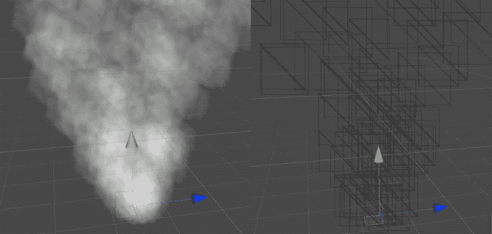

图 11.1：左侧，烟雾粒子系统；右侧，相同系统的线框

在本节中，我们将涵盖与粒子相关的以下主题：

+   使用 Shuriken 创建基本粒子系统

+   使用高级模块

让我们先讨论如何使用 Shuriken 创建我们第一个粒子系统。

## 使用 Shuriken 创建基本粒子系统

为了说明粒子系统的创建，让我们创建一个爆炸效果。想法是同时产生大量粒子并将它们向所有方向扩散。让我们从创建 Shuriken 粒子系统并配置它提供的基本设置开始，以改变其默认行为。为此，请按照以下步骤操作：

1.  选择**GameObject | Effects | Particle System**选项：

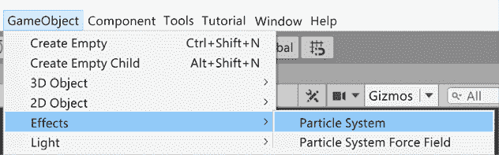

图 11.2：粒子系统按钮

1.  你应该在下面的屏幕截图中看到效果。默认行为是一列粒子向上移动，就像之前显示的烟雾效果。让我们改变一下：

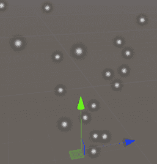

图 11.3：默认粒子系统外观

1.  在场景中单击创建的对象并查看检查器。

1.  通过点击标题打开**形状**部分。在这里，你可以指定粒子发射器的形状，粒子将从该形状中产生。

1.  将**形状**属性更改为**球体**。现在粒子应该向所有可能的方向移动，而不是遵循默认的圆锥：

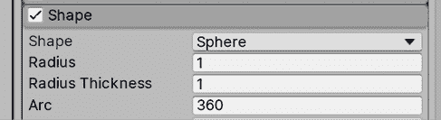

图 11.4：形状属性

1.  在粒子系统**模块**（通常称为**主模块**）中将**起始速度**设置为`10`。这将使粒子移动得更快。

1.  在相同的模块中，将**起始寿命**设置为`0.5`。这指定了粒子将存活多长时间。在这种情况下，我们给了一个半秒的寿命。与速度（每秒 10 米）结合，这使得粒子在移动 5 米后消失：

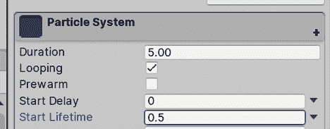

图 11.5：主粒子系统模块

1.  打开**发射**模块并将**随时间变化率**设置为`0`。此属性指定每秒将发射多少粒子，但对于爆炸，我们实际上需要一个粒子爆发，所以在这种情况下我们不会随时间持续发射粒子。

1.  在**爆发**列表中，点击底部的**+**按钮，然后在列表中创建的项目中，将计数列设置为`100`：

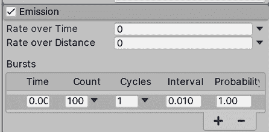

图 11.6：发射模块

1.  在**主模块**（标题为**粒子系统**）中将**持续时间**设置为`1`并取消勾选**循环**。在我们的情况下，爆炸不会持续重复；我们只需要一次爆炸：

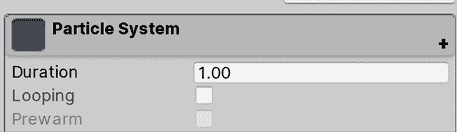

图 11.7：循环复选框

1.  现在粒子不再循环，你需要手动点击场景视图右下角的**粒子效果**窗口中显示的**播放**按钮来查看系统。如果你看不到那个窗口，请记住首先在层次结构中选择带有粒子系统的 GameObject。

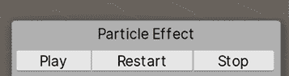

图 11.8：粒子系统播放控制

1.  将**停止动作**设置为**销毁**。当**持续时间**时间过去时，这将销毁对象。这仅在运行游戏时才会起作用，因此你可以在编辑场景时安全地使用此配置：

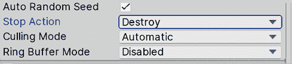

图 11.9：停止动作设置为销毁

1.  将**主模块**的**起始大小**设置为`3`。这将使粒子更大，看起来更密集：

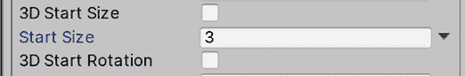

图 11.10：粒子系统起始大小

1.  点击**主模块**中**起始旋转**属性右侧的向下箭头并选择**在两个常量之间随机**。

1.  在步骤 14 之后出现的两个输入值中将**起始旋转**设置为`0`和`360`。这允许我们在粒子生成时给它们一个随机旋转，使它们看起来略有不同：

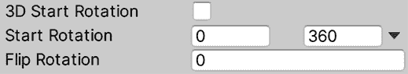

图 11.11：随机起始旋转

1.  现在粒子表现如预期，但看起来并不如预期。让我们改变一下。通过在项目视图中点击**+**图标并选择**材质**来创建一个新的材质。命名为`Explosion`。

1.  将其着色器设置为**Universal Render Pipeline/Particles/Unlit**。这是一个特殊的着色器，用于将纹理应用到 Shuriken 粒子系统：

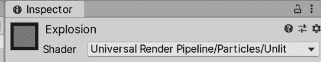

图 11.12：粒子系统材质着色器

1.  从互联网或**资源商店**下载烟雾粒子纹理。在这种情况下，下载一个黑色背景的纹理很重要；忽略其他纹理：

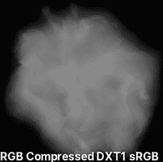

图 11.13：烟雾粒子纹理

1.  将此纹理设置为材料的**基础图**。

1.  将**表面类型**设置为**透明**，并将**混合模式**设置为**添加**。这样做会使粒子相互融合，而不是相互绘制，以模拟大量烟雾而不是单个烟雾团。我们使用**添加**模式，因为我们的纹理有黑色背景，并且我们想要创建一个光照效果（爆炸会使场景变亮）：

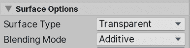

图 11.14：粒子的表面选项

1.  将您的材质拖动到**渲染器模块**的**材质**属性：

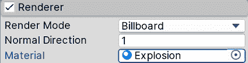

图 11.15：粒子材质设置

1.  现在您的系统应该看起来像以下图所示：

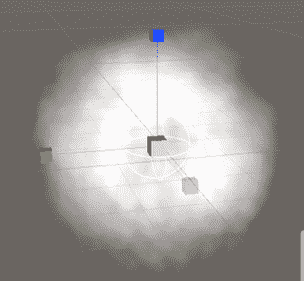

图 11.16：前述设置的输出结果

通过这些步骤，我们已经改变了粒子或广告牌的生成方式（使用**发射**模块），它们将向哪个方向移动（使用**形状**模块），它们的移动速度，它们的持续时间，它们的大小（使用**主**模块），以及它们的形状（使用**渲染器**模块）。创建粒子系统是正确配置它们不同设置的一个简单案例。当然，正确地做到这一点本身就是一门艺术；它需要创造力和了解如何使用它们提供的所有设置和配置。因此，为了提高我们的技能集，让我们讨论一些高级模块。

## 使用高级模块

我们的系统看起来不错，但我们还可以大幅改进它，所以让我们启用一些新模块来提高其质量：

1.  在**颜色随寿命**的左侧复选框中勾选以启用它：

图 11.17：启用颜色随寿命模块

1.  通过点击标题打开模块，然后点击**颜色**属性右侧的白色条。这将打开渐变编辑器。

1.  在条形图左上角的白色标记略微向右点击以创建一个新的标记。同样，在条形图右上角的白色标记略微向左点击以创建第四个标记。这些标记将允许我们指定粒子在其生命周期中的透明度：

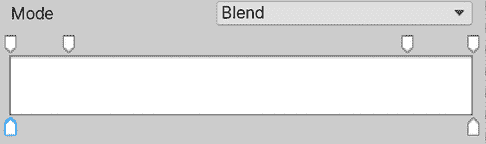

图 11.18：颜色随寿命渐变编辑器

1.  如果创建了不需要的标记，只需将它们拖出窗口即可删除。

1.  点击左上角的标记（不是我们创建的那个，而是已经存在的那个）并将底部的**Alpha**滑块设置为`0`。按照以下截图所示，对右上角的标记也进行同样的操作。现在你应该会看到粒子在爆炸结束时逐渐消失，而不是突然消失：

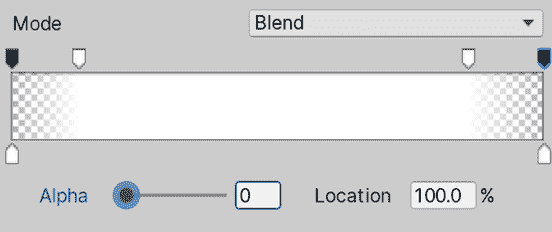

图 11.19：淡入和淡出渐变

1.  通过点击复选框启用**寿命内限制速度**模块。

1.  将**阻尼**设置调整为`0.1`。这将使粒子缓慢停止而不是继续移动：

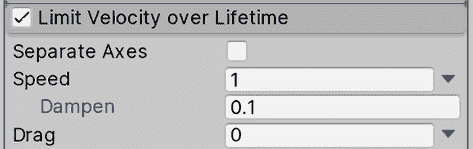

图 11.20：阻尼速度以使粒子停止

1.  启用**寿命内的旋转**并设置**角速度**在`-90`和`90`之间。请记住，您应该通过点击属性右侧的向下箭头在**在两个常量之间随机**中设置值。现在粒子应该在它们的寿命期间旋转以模拟更多运动：

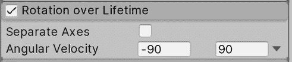

图 11.21：随机旋转速度

在我们创建粒子时，在**主模块**中设置的**寿命**很短，因此这些效果将非常微妙。您可以随意增加**寿命**值以更详细地查看这些效果，但请注意，如果您频繁地生成粒子，这可能会导致粒子数量过多，从而降低性能。只是要注意调整这些值时它们对性能的影响。

如您所见，有许多额外的模块可以启用和禁用，以在现有模块之上添加行为层，因此再次，要创造性地使用它们来创建各种效果。请记住，您可以为这些系统创建 Prefab 以在场景中复制它们。我还建议在 Asset Store 中搜索并下载粒子效果，以了解其他人如何使用相同的系统创建惊人的效果。看到各种不同的系统是学习如何创建它们的最佳方式，这就是我们在下一节将要做的：创建更多系统！

# 创建流体模拟

正如我们所说的，学习如何创建粒子系统的最佳方式是继续寻找已经创建的粒子系统，并探索人们如何使用各种系统设置来创建完全不同的模拟。

在本节中，我们将学习如何使用粒子系统创建以下效果：

+   瀑布效果

+   篝火效果

让我们从最简单的一个开始，瀑布效果。

## 创建瀑布效果

为了做到这一点，请按照以下步骤操作：

1.  创建一个新的粒子系统（**GameObject** | **Effects** | **Particle System**）。

1.  在**形状模块**中将**形状**设置为**边缘**，并将其**半径**设置为`5`。这将使粒子沿着发射线生成：

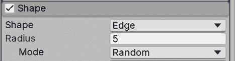

图 11.22：边缘形状

1.  将**发射模块**的**寿命内速率**设置为`50`。

1.  将**主模块**的**起始大小**设置为`3`，将**起始寿命**设置为`3`：

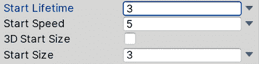

图 11.23：主模块设置

1.  将主模块的**重力修改器**设置为`0.5`。这将使粒子下落：

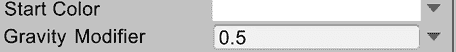

图 11.24：主模块中的重力修改器

1.  使用我们之前创建的相同的`Explosion`材质为这个系统：

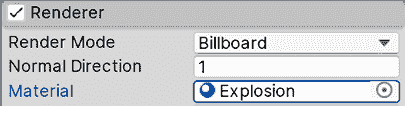

图 11.25：爆炸粒子材质

1.  启用**生命周期内颜色**并打开**渐变**编辑器。

1.  点击右下角的标记，这次你应该看到一个颜色选择器而不是 alpha 滑块。顶部的标记允许你随时间改变透明度，而底部的标记随时间改变粒子的颜色。在这个标记中设置浅蓝色：

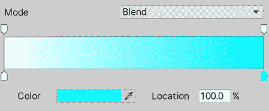

图 11.26：从白色到浅蓝色的渐变

作为挑战，我建议你添加一个小粒子系统，在这个粒子系统结束的地方创建一些水花，模拟水与底部湖泊的碰撞。现在我们可以将这个粒子系统添加到场景中的一个山丘上以装饰它，就像以下截图所示。我已经稍微调整了系统，使其在这个场景中看起来更好。我挑战你自己调整它，使其看起来像这样：

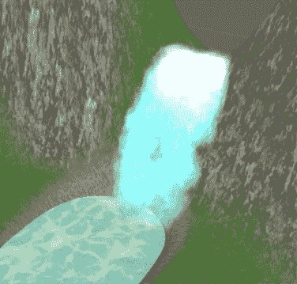

图 11.27：瀑布粒子系统应用于当前场景

现在，让我们创建另一个效果：篝火。

## 创建篝火效果

为了创建篝火，请执行以下操作：

1.  创建一个粒子系统，就像我们在*使用 Shuriken 创建基本粒子系统*部分所做的那样，在**GameObject | Effects | Particle System**中。

1.  在互联网或资源商店上寻找一个**火焰粒子纹理图**。这种纹理应该看起来像不同火焰纹理的网格。想法是将火焰动画应用到我们的粒子中，交换所有这些小纹理：

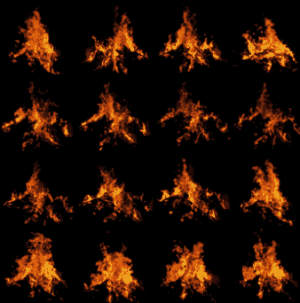

图 11.28：粒子纹理精灵图

1.  创建一个使用**Universal Render Pipeline/Particles/Unlit**着色器的粒子**材质**。

1.  将火焰精灵图纹理设置为**基础图**。

1.  将**基础图**右侧的颜色设置为白色。

1.  将此材质设置为粒子材质。请记住将**表面类型**设置为**透明**，并将**混合模式**设置为**叠加**：

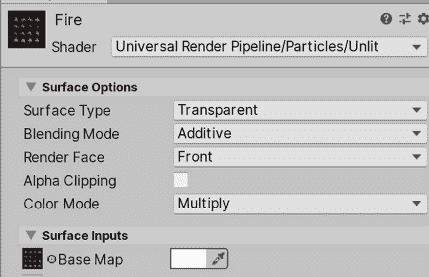

图 11.29：带有粒子精灵图的材质

1.  启用**纹理图动画**模块，并根据您的火焰图设置**瓷砖**属性。在我的情况下，我有一个 4x4 精灵的网格，所以我将`4`放在**X**上，将`4`放在**Y**上。之后，你应该会看到粒子在交换纹理：

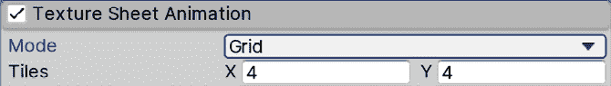

图 11.30：启用纹理图动画

1.  在主模块中将**起始速度**设置为`0`，将**起始大小**设置为`1.5`。

1.  在**形状**中设置**半径**为`0.5`。

1.  创建第二个粒子系统并将其设置为火焰系统的子系统：

图 11.31：父子粒子系统

1.  应用爆炸示例中的**爆炸**材质。

1.  在**形状**模块中将**角度**设置为`0`，将**半径**设置为`0.5`。

系统应该看起来像这样：

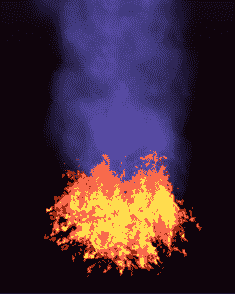

图 11.32：结合火焰和烟雾粒子系统的结果

如你所见，你可以组合几个粒子系统来创建一个单一的效果。在做这件事时要小心，因为很容易发射过多的粒子并影响游戏性能。粒子并不便宜，如果你对它们不够谨慎，可能会降低游戏的**FPS（每秒帧数）**。

到目前为止，我们已经探索了你可以用来创建这类效果的一种 Unity 系统，虽然这个系统对于大多数情况来说已经足够，但 Unity 最近发布了一个可以生成更复杂效果的新系统，称为**视觉效果图**。让我们看看如何使用它，以及它与 Shuriken 有何不同。

# 使用视觉效果图创建复杂模拟

我们迄今为止使用的粒子系统被称为 Shuriken，它处理所有在 CPU 上的计算。这既有优点也有缺点。优点是它可以在 Unity 支持的所有可能的设备上运行，无论它们的性能如何（它们都有 CPU），但缺点是如果我们对发射的粒子数量不够谨慎，我们很容易超过 CPU 的能力。现代游戏需要更复杂的粒子系统来生成可信的效果，而这种基于 CPU 的粒子系统解决方案已经开始达到其极限。这就是视觉效果图发挥作用的地方：

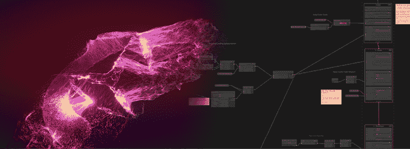

图 11.33：左侧是一个大规模粒子系统，右侧是视觉效果图的示例

**视觉效果图**是一个基于 GPU 的粒子系统解决方案，这意味着系统是在显卡上而不是 CPU 上执行的。这是因为显卡在执行大量小模拟方面要高效得多，比如系统中的每个粒子都需要，所以我们可以在 GPU 上达到比 CPU 更高的粒子数量级别。这里的缺点是我们需要一个具有**计算着色器**功能的相当现代的 GPU 来支持这个系统，因此我们将排除使用这个系统的一些目标平台（忘记大多数手机），所以如果你的目标平台支持它（中高端 PC、游戏机和一些高端手机），请使用它。

在本节中，我们将讨论以下关于视觉效果图的主题：

+   安装视觉效果图

+   创建和分析视觉效果图

+   创建雨效果

让我们先看看我们如何在项目中添加对视觉效果图的支持。

## 安装视觉效果图

到目前为止，我们已经使用了大量已经安装在我们项目中的 Unity 功能，但 Unity 可以通过大量插件进行扩展，包括官方和第三方插件。视觉效果图就是那些需要独立安装的功能之一，如果你使用的是**通用渲染管线** **(URP)**。我们可以使用包管理器来完成这项工作，这是一个专门用于管理官方 Unity 插件的 Unity 窗口。

在安装这些包时需要考虑的是，每个包或插件都有自己的版本，与 Unity 版本无关。这意味着您可以安装 Unity 2022.1，但也可以安装 Visual Effect Graph 13.1.8 或您想要的任何版本，并且实际上可以更新包到新版本而不必升级 Unity。这很重要，因为某些版本的这些包需要 Unity 的最低版本——例如，Visual Effect Graph 13.1.8 需要 Unity 2022.1 作为最低版本。此外，一些包依赖于其他包和这些包的特定版本，因此我们需要确保我们拥有每个包的正确版本以确保兼容性。明确来说，包的依赖项会自动安装，但有时我们可以单独安装它们，因此在这种情况下，我们需要检查所需版本。听起来很复杂，但实际上比听起来简单。

在撰写本书时，为了使视觉效果图正常工作，我们需要版本 13.1.8，并且还需要相同版本的**Universal RP**。是的，Universal RP 是您可以使用包管理器安装的另一个功能，但因为我们使用 Universal RP 模板创建了项目，所以它已经为我们安装了正确的版本。考虑到这一点，让我们按照以下步骤安装视觉效果图：

1.  在 Unity 的顶部菜单中，转到**窗口 | 包管理器**：

图 11.34：包管理器位置

1.  请确保**包**下拉菜单处于**Unity 注册表**模式，以查看 Unity 官方包列表：

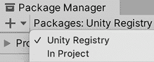

图 11.35：包管理器 Unity 注册表模式

1.  在左侧列中，找到**Universal RP**并检查右侧是否显示 13.1.8 或更高版本。如果是这样，跳转到*步骤 6*。不过，请记住，更高版本可能看起来不同，或者使用步骤与本章中显示的不同。

1.  如果您没有 13.1.8 或更高版本，点击左侧的指向右的箭头以显示所有可能的安装版本。找到 13.1.8 并点击它。在我的情况下，它显示为**当前已安装**，因为我已经在项目中安装了该版本，并且没有其他版本可用于 Unity 2022：

图 11.36：包版本选择器

1.  在窗口的右下角点击**更新到 13.1.8**按钮，等待包更新。

1.  在窗口的左侧查找**视觉效果图**包。就像您使用 Universal RP 一样，确保您选择版本 11.0.0 或更高版本：

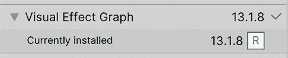

图 11.37：视觉效果图包

1.  点击窗口右下角的**安装**按钮，等待包安装。有时在安装包后重启 Unity 是推荐的，所以保存您的更改并重启 Unity。

现在我们已经安装了视觉效果图，让我们使用它创建第一个粒子系统。

## 创建和分析视觉效果图

使用视觉效果图创建粒子系统的方法与常规粒子系统类似。我们将链式配置模块作为粒子行为的一部分，每个模块添加一些特定的行为，但我们的操作方式与 Shuriken 非常不同。首先，我们需要创建一个**视觉效果图**，这是一个将包含所有模块和配置的资产，然后创建一个将执行图资产以生成粒子的 GameObject。让我们按照以下步骤进行：

1.  在项目窗口中，点击**+**按钮，查找**视觉效果 | 视觉效果图**：

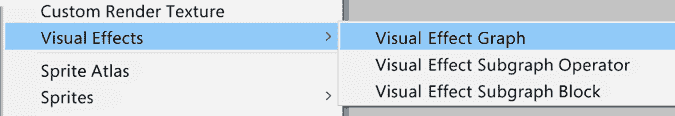

图 11.38：视觉效果图

1.  使用**GameObject** | **创建空对象**选项创建一个**空对象**：

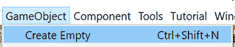

图 11.39：创建空 GameObject

1.  选择创建的物体，并查看**检查器**。

1.  使用**添加组件**搜索栏，查找**视觉效果**组件，并点击它以将其添加到对象：

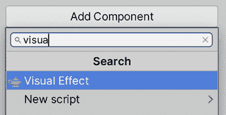

图 11.40：向视觉效果图添加组件

1.  将我们创建的**视觉效果**资产拖动到我们的 GameObject 中**视觉效果**组件的**资产模板**属性：

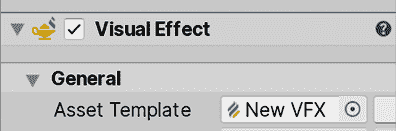

图 11.41：使用先前创建的视觉效果资产进行视觉效果

1.  你应该看到从我们的物体中发射出时钟粒子，这是新视觉效果资产中包含的默认行为，意味着它正在正确执行：

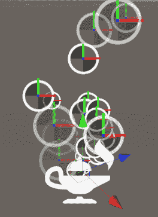

图 11.42：默认视觉效果资产结果

现在我们有一个基础效果，让我们创建一些需要大量粒子的东西，比如密集的雨。在这样做之前，我们将探索视觉效果图的一些核心概念。如果您双击视觉效果资产，您将看到以下编辑器：

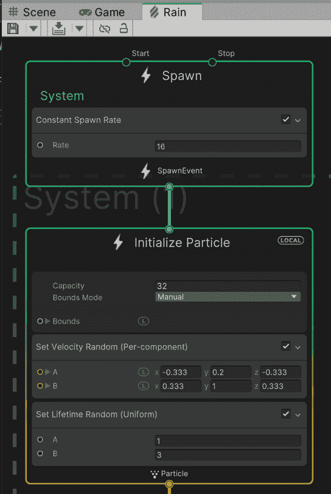

图 11.43：视觉效果图编辑器窗口

此窗口由几个相互连接的节点组成，生成要执行的动作流。与着色器图一样，您可以通过按住*Alt*键（Mac 上的*Option*）并使用鼠标拖动图中的空白区域来导航此窗口。起初，它看起来与着色器图相似，但它的工作方式略有不同，所以让我们研究默认图的每个部分。

首个要探索的区域是包含三个节点的虚线区域。这是 Unity 所说的**系统**。系统是一组节点，定义了粒子将如何表现，你可以拥有任意多个，这相当于拥有多个粒子系统对象。每个系统由**上下文**组成，即虚线区域内的节点，在这种情况下，我们有**初始化粒子**、**更新粒子**和**输出粒子四边形**。每个上下文代表粒子系统逻辑流程的不同阶段，因此让我们定义我们图中的每个上下文的作用：

+   **初始化粒子**：这定义了每个发射粒子的初始数据，例如位置、颜色、速度和大小。它类似于我们在本章开头看到的粒子系统主模块中的**启动**属性。此节点中的逻辑仅在发射新粒子时执行。

+   **更新粒子**：在这里，我们可以对活粒子的数据进行修改。我们可以更改粒子数据，如所有帧的当前速度或粒子大小。这类似于 Shuriken 粒子系统的**随时间**节点。

+   **输出粒子四边形**：当粒子需要渲染时，将执行此上下文。它将读取粒子数据以确定渲染位置、渲染方式、使用的纹理和颜色以及不同的视觉设置。这类似于先前粒子系统的渲染器模块。

在每个上下文中，除了一些基本配置外，我们还可以添加**块**。每个块都是在上下文中执行的操作。我们有可以在任何上下文中执行的动作，以及一些特定上下文动作。例如，我们可以在**初始化粒子**上下文中使用**添加位置块**来移动初始粒子位置，但如果我们在**更新粒子**上下文中使用相同的块，它将使粒子持续移动。所以基本上，上下文是粒子生命周期中发生的情况，而块是在这些情况下执行的动作：

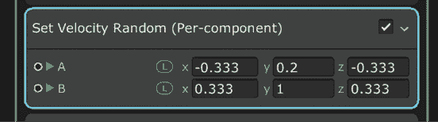

图 11.44：初始化粒子上下文中的一个设置速度随机块。这设置了粒子的初始速度

此外，我们还可以有**独立上下文**，即系统之外的上下文，例如**生成**。此上下文负责告诉系统需要创建新的粒子。我们可以添加块来指定上下文何时告诉系统创建粒子，例如以固定速率随时间进行、爆发等。其理念是，生成将根据其块创建粒子，而系统则负责根据我们在每个上下文中设置的块初始化、更新和渲染每个粒子。

因此，我们可以看到与 Shuriken 有很多相似之处，但在这里创建系统的方式相当不同。让我们通过创建一个雨效果来加强这一点，这将需要大量的粒子——这是 Visual Effect Graph 的一个很好的用例。

## 创建雨效果

为了创建此效果，请执行以下操作：

1.  将**初始化粒子**上下文的**容量**属性设置为`10000`：

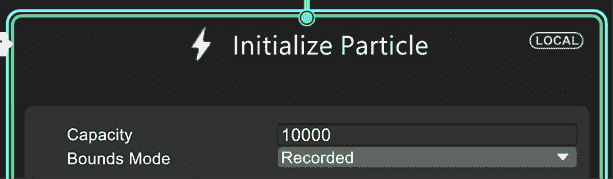

图 11.45：初始化粒子上下文

1.  将**Spawn**上下文的**恒定生成速率**的**速率**设置为`10000`：

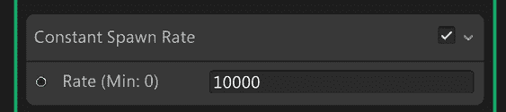

图 11.46：恒定生成速率块

1.  在**初始化粒子**上下文中的**设置速度随机**块中，将**A**和**B**属性分别设置为`0`，`-50`和`0`，以及`0`，`-75`和`0`。这将为我们设置一个指向下方的随机速度：

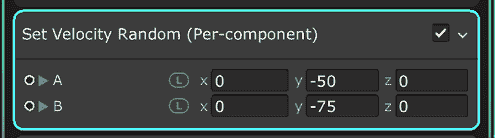

图 11.47：设置速度随机块

1.  右键单击**初始化粒子**标题，并选择**创建块**。

1.  搜索**设置位置随机**块并点击它：

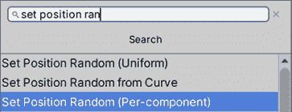

图 11.48：添加块

1.  将**设置位置随机**块的**A**和**B**属性分别设置为`-50`，`0`和`-50`，`50`，`0`和`50`。这将定义一个初始区域，在该区域内随机生成粒子。

1.  点击**初始化粒子**块中**边界**属性的左侧箭头以显示其属性，并将**中心**和**大小**分别设置为`0`，`-12.5`和`0`，以及`100`，`25`和`100`。这将定义粒子应可见的区域。粒子实际上可以移动到这个区域之外，但只渲染我们感兴趣它们可见的区域是很重要的。

在互联网上搜索`视锥剔除`以获取有关边界的更多信息。

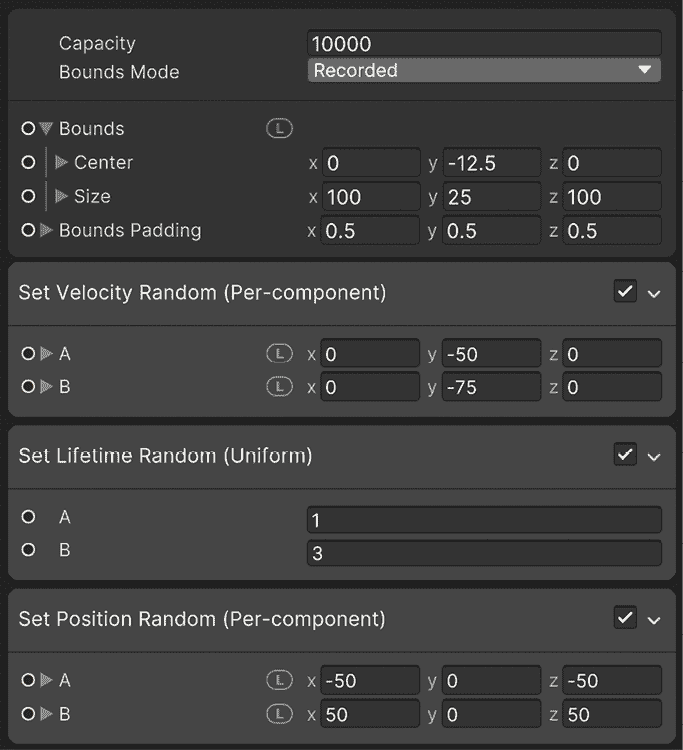

图 11.49：配置块

1.  选择执行系统的 GameObject，在场景视图的右下角窗口中检查**显示边界**复选框以查看之前定义的边界：

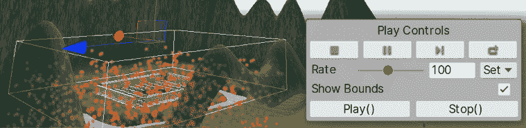

图 11.50：视觉效果播放控制

1.  如果看不到右下角的窗口，请点击屏幕左上角的**VE**（视觉效果）按钮以显示它。此按钮仅在您在**层次结构**中选择了**雨**视觉效果 GameObject 时才会显示：

图 11.51：另一种显示视觉效果播放控制的方式

1.  如果看不到应用的变化，请点击窗口左上角的**编译**按钮，它看起来像箭头下方的纸篓。此外，您可以使用*Ctrl* + *S*（在 Mac 上为*Command* + *S*）保存您的更改：

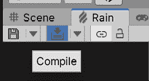

图 11.52：VFX 资产保存控制

1.  将对象位置设置为覆盖整个底部区域。在我的例子中，位置是 `100`、`37` 和 `100`。记住，你需要更改**变换**组件的**位置**来完成这个操作：

图 11.53：设置变换位置

1.  将**初始化粒子**中**设置寿命随机**块的**A**和**B**属性设置为 `0.5`。这将使粒子寿命更短，确保它们始终在边界内：

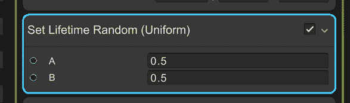

图 11.54：设置寿命随机块

1.  将**输出粒子四边形**上下文的**主纹理**属性更改为另一个纹理。在这种情况下，之前下载的烟雾纹理可以在这里使用，即使它不是水，因为我们将在稍后修改其外观。你也可以尝试下载一个水滴纹理，如果你想的话：

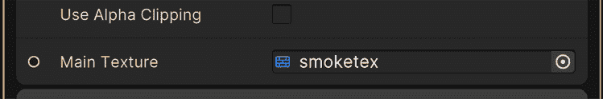

图 11.55：VFX 图主纹理

1.  将**输出粒子四边形**上下文的**混合模式**设置为**添加**：

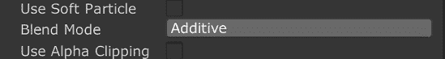

图 11.56：VFX 图的添加模式

1.  我们需要稍微拉伸我们的粒子，使其看起来像真正的雨滴而不是下落的球体。在完成这个操作之前，首先我们需要改变我们粒子的方向，这样它们就不会总是指向摄像机。为了做到这一点，在**输出粒子四边形**上下文中的**定向块**上右键单击并选择**删除**（或在 PC 上按 *Delete* 或在 Mac 上按 *Command* + *Backspace*）：

图 11.57：删除一个块

1.  我们希望根据粒子的速度方向拉伸粒子。在实际上进行这一操作之前，另一个准备步骤是选择**输出粒子四边形**上下文的标题并按空格键以查找要添加的块。在这种情况下，我们需要搜索并添加**沿速度定向**块。

1.  将一个**设置比例**块添加到**初始化粒子**上下文，并将**比例**属性设置为 `0.25`、`1.5` 和 `0.25`。这将使粒子拉伸，看起来像下落的雨滴：

图 11.58：设置比例块

1.  再次单击左上角的**编译**按钮以查看更改。你的系统应该看起来像这样：

图 11.59：雨效果

我们刚刚修改了视觉效果图的许多不同属性，但如果你想要两个相同视觉效果图的实例，但略有不同，我建议你查看黑板功能，这将允许你在检查器中公开属性。例如，你可以在另一个场景中制作密度较低的雨，降低生成率，或者更改粒子颜色以制作酸雨，所有这些都可以使用相同的图，但现在让我们保持简单。

黑板功能也存在于着色器图中。

从这里，您可以按照自己的意愿添加和删除上下文中的块，并且再次，我建议您查找已经创建的视觉效果图来获取其他系统的灵感。实际上，您可以通过查看 Shuriken 中制作的效果和使用类似块来获得视觉效果图的灵感。此外，我建议您在网上或以下链接中搜索视觉效果图文档：[`docs.unity3d.com/Packages/com.unity.visualeffectgraph@13.1/manual/index.html`](https://docs.unity3d.com/Packages/com.unity.visualeffectgraph@13.1/manual/index.html)，以了解更多关于这个系统。您还可以在包管理器中选择包时，通过点击**查看文档**按钮访问任何 Unity 包的文档。

图 11.60：包管理器文档链接

现在我们已经学会了如何创建不同的视觉效果，让我们看看如何通过脚本使用它们来实现对游戏中发生的事情做出反应的效果。

# 脚本化视觉效果

视觉反馈是使用不同的 VFX（如粒子和一个 VFX 图）来加强正在发生的事情的概念。例如，假设我们现在正在射击我们的武器，我们知道这是在发生，因为我们可以看到子弹。然而，这并不像真正的射击效果，因为一个合适的射击效果应该在枪口处有一个枪口效果。另一个例子是敌人死亡——它只是没有动画地消失！这并不像它本可以那样令人满意。我们可以添加一个小爆炸（考虑到它们是机器人）。

让我们通过以下步骤开始让敌人死亡时产生爆炸：

1.  创建一个爆炸效果或从资产商店下载一个。它不应该循环，并且在爆炸结束后需要自动销毁（确保**循环**未勾选，并且在主模块中将**停止动作**设置为`销毁`）。

1.  资产商店中的一些爆炸可能使用与 URP 不兼容的着色器。您可以通过使用**窗口 | 渲染 | 渲染管线转换器**来修复它们，正如我们在第四章中看到的，*导入和集成资产*。

1.  手动升级那些没有自动升级的材料。

1.  向`Enemy`Prefab 添加一个名为`ExplosionOnDeath`的脚本。这将负责在敌人死亡时生成粒子 Prefab。

1.  添加一个名为`particlePrefab`的`GameObject`类型字段，并将爆炸 Prefab 拖放到它上面。

您可能期望将爆炸生成添加到`Life`组件中。在这种情况下，您假设与生命相关的一切在死亡时都会产生粒子，但考虑一下这样的场景：角色在死亡时带有下落动画，或者可能是一个没有任何效果就消失的对象。如果某些行为在大多数场景中都没有使用，那么最好在单独的可选脚本中编码它，这样我们可以混合和匹配不同的组件，以获得我们想要的确切行为。

1.  让脚本访问`Life`组件并订阅其`onDeath`事件。

1.  在`listener`函数中，在相同的位置生成粒子系统：

图 11.61：爆炸生成器脚本

Visual Scripting 版本看起来是这样的：

图 11.62：爆炸生成器视觉脚本

如您所见，我们只是在之前章节中学到的相同概念的基础上，以新的方式组合它们。这就是编程的全部内容。

让我们继续讨论枪口效果，它也将是一个粒子系统，但这次我们将采取另一种方法：

1.  如果你还没有，请从 Asset Store 下载一个武器模型。我们书中使用的包中的角色已经自带了一个，所以我们将使用那个。

1.  如果你的角色中还没有，请实例化武器，使其成为玩家手的父级。记住，我们的角色是绑定的，有一个手骨，所以你应该把武器放在那里。

1.  在本书中下载的角色所带的武器是一个特殊场景，其中武器有一个**SkinnedMeshRenderer**。这个组件使用我们在第十七章“使用 Animator、Cinemachine 和 Timeline 创建动画”中将要学习的*Skinning Animation*系统。在这种情况下，武器的移动将受到我们将在那一章中使用的动画的影响，所以现在让我们保持武器现在的位置，即使它看起来有点奇怪。

1.  创建或获取一个枪口粒子系统。在这种情况下，我的枪口粒子系统被创建为一个短粒子系统，它爆发出一群粒子然后自动停止。尽量获取一个具有这种行为的东西，因为还有其他一些会循环，处理这种情况的脚本将不同。

1.  在编辑器中创建粒子系统预制件的实例，并将其放置在武器内部，位于武器前方，与枪管对齐。确保粒子系统主模块的**Play On Awake**属性未勾选；我们不希望在按下射击键之前发射枪口：

图 11.63：与武器关联的枪口效果

1.  在`PlayerShooting`中创建一个名为`muzzleEffect`的`ParticleSystem`类型的字段。

1.  将枪口效果的 GameObject 拖到检查器中，它已经在枪上作为父级。现在，我们有了对枪口`ParticleSystem`组件的引用，可以管理它。

1.  在检查我们是否在射击的`if`语句中，执行`muzzleEffect.Play();`来播放粒子系统。它将自动停止，并且足够短，可以在按键之间完成：

图 11.64：与武器关联的枪口效果

Visual Scripting 版本的附加节点和变量如下：

图 11.65：开火脚本的视觉脚本

最后，我们需要在射击时通过以下方式在 AI 上也播放开火效果：

1.  就像我们对 `PlayerShooting` 做的那样，在 `EnemyFSM` 中创建一个名为 `muzzleEffect` 的 `ParticleSystem` 类型的字段。

1.  在 `Shoot` 方法内部，在方法末尾添加 `muzzleEffect.Play();` 行以播放粒子系统：

图 11.66：开火脚本的 C# 脚本

Visual Scripting 版本为 `Attack State` 和 `Attack Base` 添加的附加节点如下：

图 11.67：攻击状态的开火脚本

记得将这些节点添加到攻击状态中，并将 `muzzleEffect` 变量添加到 AI 变量组件中。

# 摘要

在本章中，我们讨论了创建粒子系统的两种不同方法：使用 Shuriken 和 VFX Graph。我们使用它们来模拟不同的流体现象，如火焰、瀑布、烟雾和雨。想法是将粒子系统与网格结合以生成场景所需的全部可能道具。此外，正如你可以想象的那样，创建这类效果需要专业水平，这要求你深入了解。如果你想致力于此（技术艺术家工作的另一部分），你需要学习如何创建自己的粒子纹理以获得你想要的确切外观和感觉，编写控制系统某些方面的脚本，以及粒子创建的几个其他方面。然而，这些都超出了本书的范围。

现在我们场景中有了一些雨，我们可以看到天空和场景中的光照并不真正反映雨天，所以让我们在下一章中修复这个问题！
