# 第十四章：声音与音乐整合

我们现在已经达到了足够的图形质量，但我们缺少游戏美学的一个重要部分：声音。声音通常被置于游戏开发的最后一步，它是那些即使存在，你也不会注意到其存在，但如果没有它，你会觉得缺少了什么的东西之一。它将帮助你强化你在游戏中想要营造的氛围，并且必须与图形设置相匹配。

在本章中，我们将探讨以下声音概念：

+   导入音频

+   音频整合与混音

我们将在我们的游戏中应用这些概念，导入音频以在不同的场景中播放——例如当玩家射击时——以及音乐。在后面的编程章节中，我们将播放声音，但现在，让我们专注于如何将它们导入到我们的项目中。

# 导入音频

与图形资产一样，为你的音频资产正确设置导入设置非常重要，因为如果设置不当，导入可能会非常消耗资源。

在本节中，我们将探讨以下音频导入概念：

+   音频类型

+   配置导入设置

让我们从讨论我们可以使用的不同类型的音频开始。

## 音频类型

在视频游戏中存在不同类型的音频，以下是一些：

+   **音乐**：根据情况增强玩家体验所使用的音乐。

+   **音效（SFX）**：作为玩家或 NPC 动作的反应而发生的声音，例如点击按钮、行走、开门、开枪等等。

+   **环境声音**：仅对事件做出反应的游戏会感觉空洞。如果你正在在城市中间重建一个公寓，即使玩家只是在房间中间无所事事，也应该听到很多声音，其中大多数声音的来源将位于房间外，例如一架飞越头顶的飞机、两个街区外的建筑工地、街道上的汽车等等。创建不会看到的对象是浪费资源。相反，我们可以在场景的各个地方放置单个声音来重现所需的环境，但这将是资源密集型的，需要大量的 CPU 和 RAM 来实现可信的结果。考虑到这些声音通常占据用户注意力的第二平面，我们可以将它们全部组合成一个循环轨道，只播放一个音频文件，这就是环境声音。如果你想创建一个咖啡馆场景，你只需简单地去一个真实的咖啡馆，录制几分钟的音频，并将其用作你的环境声音。

对于几乎所有的游戏，我们至少需要一条音乐轨道、一条环境轨道和几个 SFX 来开始音频制作。像往常一样，我们有不同的音频资产来源，但我们将使用资产商店。它有三个音频类别来搜索我们需要的资产：

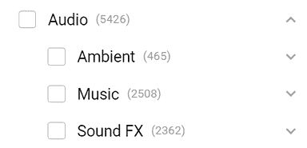

图 14.1：资产商店中的音频类别

在我的情况下，我也使用了搜索栏来进一步筛选分类，搜索`weather`以找到雨声效果。有时，你无法单独找到确切的音频；在这种情况下，你需要深入**包**和**库**，所以在这里要有耐心。在我的情况下，我选择了*图 14.2*中可以看到的三个包，但只导入了其中一些声音，因为所有这些声音在项目中的大小都会很大。对于环境音效，我选择了这个包中的一个名为`Ambience_Rain_Moderate_01_LOOP`的雨声文件，但如果你下载了另一个包，我们寻找的雨声文件名称可能不同。然后，我选择了**音乐 – 悲伤的希望**作为音乐，对于音效，我选择了一个枪声音效包，用于我们未来玩家的英雄角色。当然，你可以选择其他包以更好地满足你的游戏需求：

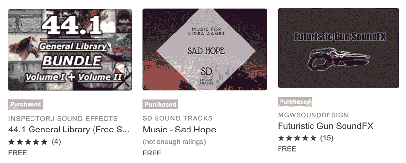

图 14.2：我们游戏的包

现在我们有了必要的音频包，让我们讨论如何导入它们。

## 配置导入设置

我们有多个可以调整的导入设置，但问题是我们需要考虑音频的使用情况来正确设置它，所以让我们看看每种情况下的理想设置。为了查看导入设置，像往常一样，你可以选择资产并在检查器面板中查看，如下面的图所示：

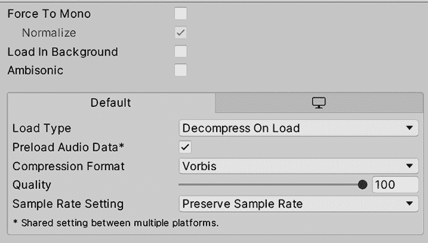

图 14.3：音频导入设置

让我们讨论最重要的几个，从**强制单声道**开始。一些音频可能包含立体声通道，这意味着我们左耳有一个声音播放，右耳有另一个声音。这意味着一段音频实际上可以包含两个不同的音频轨道。立体声音在音乐中用于不同的效果和乐器空间化，所以我们希望在那些情况下使用它，但还有其他情况下立体声并不适用。考虑 3D 音效，如枪声或一些行走步伐。在这些情况下，我们需要声音在源的方向上被听到——如果枪声在我左边响起，我需要听到它从左边传来。在这些情况下，我们可以通过在音频导入设置中勾选**强制单声道**复选框将立体声音频转换为单声道音频。这将使 Unity 将两个通道合并为一个，通常将音频大小减少到几乎一半（有时更多，有时更少，取决于各种因素）。

你可以在音频资产检查器的底部验证该设置和其他设置的影响，在那里你可以看到导入的音频大小：

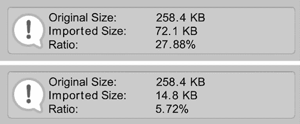

图 14.4：左：未使用“强制单声道”导入的音频。右：使用“强制单声道”的相同音频

接下来要讨论的设置，并且是一个重要的设置，是**加载类型**。为了播放一些音频，Unity 需要从磁盘读取音频，解压缩它，然后播放。加载类型改变了这三个处理过程的方式。这里有以下三个选项：

+   **加载时解压缩**：最占用内存的选项。此模式将在场景加载时使 Unity 加载未压缩的音频到内存中。这意味着音频将在 RAM 中占用大量空间，因为我们已经加载了未压缩的版本。使用此模式的优势在于播放音频更容易，因为我们有原始音频数据准备在 RAM 中播放。

+   **流式传输**：与**加载时解压缩**正好相反。此模式永远不会将音频加载到 RAM 中。相反，当音频播放时，Unity 会从磁盘读取音频资产的一部分，解压缩它，播放它，并重复此过程，为**流式传输**中播放的每一部分音频运行一次。这意味着此模式将非常占用 CPU 资源，但将消耗几乎零字节的 RAM。

+   **压缩在内存中**：中间方案。此模式在场景加载时将从磁盘加载音频，但将其保持在内存中压缩状态。当 Unity 需要播放音频时，它只需从 RAM 中取出一部分，解压缩，然后播放。记住，从 RAM 中读取音频资产片段的速度远快于从磁盘读取。

也许如果你是一个经验丰富的开发者，你可以轻松地确定哪种模式更适合哪种类型的音频，但如果你是第一次接触视频游戏，这可能会听起来很困惑。所以，让我们讨论不同情况下的最佳模式：

+   **频繁的短音频**：这可能包括枪声或脚步声，这些声音持续不到一秒，但可以同时发生多个实例。在这种情况下，我们可以使用**加载时解压缩**。未压缩的短音频与压缩版本的大小差异不大。此外，由于这是性能最好的 CPU 选项，有多个实例不会对性能产生巨大影响。

+   **不频繁的大音频**：这包括音乐、环境声音和对话。这类音频通常只有一个实例播放，而且通常很大。这些情况更适合**流式传输**模式，因为它们在 RAM 中压缩或解压缩可能会对低端设备（如移动设备）的 RAM 消耗产生巨大影响（在 PC 上，我们有时可以使用**压缩在内存中**）。CPU 可以处理在流式传输模式下播放两个或三个音频片段，但尽量不要超过这个数量。

+   **频繁的中等音频**：这包括多人游戏中的预制语音聊天对话、角色表情、长爆炸声或任何大于 500 KB（这不是一个严格的规定——这个数字很大程度上取决于目标设备）的音频。在 RAM 中解压缩这类音频可能会对性能产生明显影响，但由于这种音频使用频率较高，我们可以将其压缩在内存中。它们相对较小的尺寸意味着它们通常不会对我们游戏的整体大小产生巨大影响，并且我们将避免浪费 CPU 资源在从磁盘读取上。

还有其他需要考虑的情况，但这些都是基于前面的情况外推的。记住，前面的分析是在考虑标准游戏需求的情况下进行的，但根据您的游戏和目标设备，这可能会有很大的变化。也许您正在制作一个不会消耗大量 RAM 但 CPU 资源相当密集的游戏，在这种情况下，您可以将所有内容都设置为**加载时解压缩**。考虑您游戏的各个方面并相应地平衡资源是很重要的。

最后，还需要考虑的一个因素是压缩格式，这将改变 Unity 在发布游戏中编码音频的方式。不同的压缩格式会以降低原始音频的保真度或增加解压缩时间为代价，提供不同的压缩比率，所有这些都会根据音频模式和长度有很大的变化。我们有三种压缩格式：

+   **PCM**：未压缩的格式将为您提供最高的音频质量，没有噪声伪影，但会导致更大的资产文件大小。

+   **ADPCM**：以这种方式压缩音频可以减小文件大小并产生快速的无压缩过程，但可能会引入在特定类型音频中可能被注意到的噪声伪影。

+   **Vorbis**：一种高质量的压缩格式，几乎不会产生伪影，但解压缩需要更长的时间，因此播放 Vorbis 音频将比其他格式稍微密集一些。它还提供了一个质量滑块来选择确切的压缩强度。

应该使用哪一个？再次，这取决于您音频的特性。短而平滑的音频可以使用 PCM，而长而嘈杂的音频可以使用 ADPCM；这种格式引入的伪影会被音频本身所隐藏。也许在压缩伪影明显的长而平滑的音频中，使用 Vorbis 会有所裨益。有时，这只是一个尝试和错误的问题。也许默认使用 Vorbis，当性能降低时，尝试切换到 ADPCM，如果那样导致故障，就切换到 PCM。当然，这里的问题是确保音频处理确实是性能问题的原因——也许将所有音频切换到 ADPCM 并检查是否有所改变是一个很好的检测方法，但更好的方法将是使用 Profiler，这是一种性能测量工具，我们将在本书的后面看到。

我们还有其他设置，例如**采样率设置**，同样，通过一点尝试和错误，您可以用来检测最佳设置。

我已经设置了从资产商店下载的音频，如图*图 14.5*和*图 14.6*所示。第一个显示了我是如何设置音乐和环绕音频文件的（大文件）：

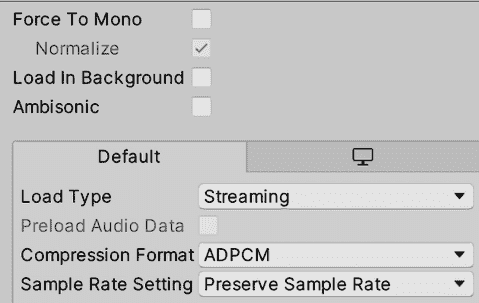

图 14.5：音乐和环绕设置

音乐应配置为立体声（不勾选**Force To Mono**），使用**Streaming Load Type**，因为它们很大，并且将只有一个实例播放，以及**ADPCM****Compression Format**，因为**Vorbis**没有导致巨大的尺寸差异。

第二个截图显示了我是如何设置 SFX 文件（小文件）的：

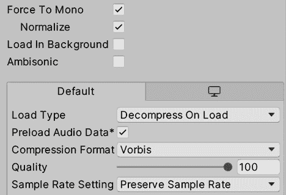

图 14.6：射击 SFX 设置

我们下载的声音将是 3D 的，所以应该勾选**Force To Mono**。它们也将很短，所以**Load Type**中的**Decompress On Load**效果更好。最后，选择**Vorbis Compression Format**将**ADPCM**大小减少了超过一半，这就是我们选择它的原因。

现在我们已经正确配置了音频片段，我们可以在场景中使用它们了。

# 集成和混音音频

我们可以直接将音频片段拖入场景中开始使用，但我们可以进一步挖掘，探索将它们配置到每个可能场景的最佳方式。

在本节中，我们将检查以下音频集成概念：

+   使用 2D 和 3D**AudioSource**

+   使用音频混频器

让我们开始探索**AudioSource**，这些对象负责音频播放。

## 使用 2D 和 3D**AudioSource**

**AudioSource**是可以附加到 GameObject 上的组件。它们负责根据**AudioClips**（我们之前下载的音频资产）在我们的游戏中发出声音。

区分**AudioClip**和**AudioSource**很重要；我们可以有一个单一的爆炸**AudioClip**，但可以有多个**AudioSource**播放它，模拟多个爆炸。可以将**AudioSource**视为 CD 播放器，它可以播放**AudioClip**（在这个类比中是我们的 CD），只是我们可以在同一时间有多个 CD 播放器或**AudioSource**播放同一张 CD（例如，两个爆炸声同时播放）。

创建**AudioSource**的最简单方法是从**AudioClip**（音频资产）中选择一个，并将其拖到**Hierarchy**窗口中。尽量避免将音频拖入现有对象中；相反，在对象之间拖动它，这样 Unity 将创建一个新的带有**AudioSource**的对象，而不是将其添加到现有对象中（有时，你可能希望现有对象具有**AudioSource**，但现在让我们保持简单）：

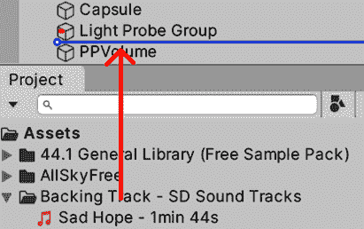

图 14.7：将**AudioClip**拖到对象之间的**Hierarchy**窗口

以下截图显示了通过将音乐资产拖到场景中生成的**AudioSource**。您可以看到**AudioClip**字段有一个对拖动音频的引用：

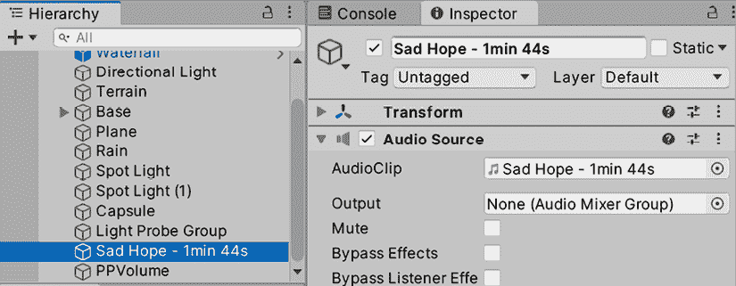

图 14.8：配置为播放我们的音乐资产的**AudioSource**

如您所见，**AudioSource**有多个设置，所以让我们在以下列表中回顾一下常见的设置：

+   **唤醒时播放**：确定音频是否在游戏开始时自动播放。我们可以取消选中它，并通过脚本播放音频，例如当玩家射击或跳跃时（关于这一点，请参阅本书的*第三部分*）。

+   **循环**：当音频播放完毕后，将自动重复播放。记得始终检查音乐和氛围音频剪辑上的此设置。由于这些轨道很长，我们在测试中可能永远无法到达它们的结尾，所以很容易忘记这一点。

+   **音量**：控制音频强度。

+   **音调**：控制音频速度。这对于模拟慢动作或发动机转速增加等效果非常有用。

+   **空间混合**：控制我们的音频是 2D 还是 3D。在 2D 模式下，音频将在所有距离上以相同的音量被听到，而 3D 模式将使音频音量随着与相机距离的增加而减小。

在我们的音乐轨道的情况下，我已经按照以下截图所示进行了配置。你可以将氛围雨声拖动到场景中，并使用相同的设置，因为我们希望所有场景中都有相同的氛围效果。然而，在复杂场景中，你可以在场景的各个地方分散放置不同的 3D 氛围声音，以根据当前环境改变声音：

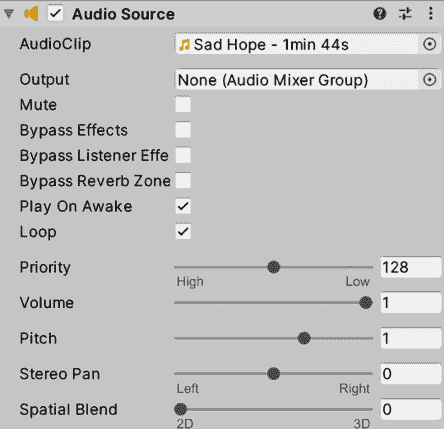

图 14.9：音乐和氛围设置。这将循环播放，设置为唤醒时播放，并且是 2D 的

现在，你可以拖动射击效果，并按照*图 14.10*所示进行配置。正如你所看到的，在这种情况下，音频不会循环，因为我们希望射击效果每次发射子弹时只播放一次。记住，对于我们的游戏，子弹将是一个 Prefab，每次我们按下射击键时都会生成，因此每个子弹都将有自己的**AudioSource**，当子弹被创建时将播放。此外，子弹被设置为 3D**空间混合**，这意味着效果将根据**AudioSource**相对于相机位置的不同而通过不同的扬声器传输：

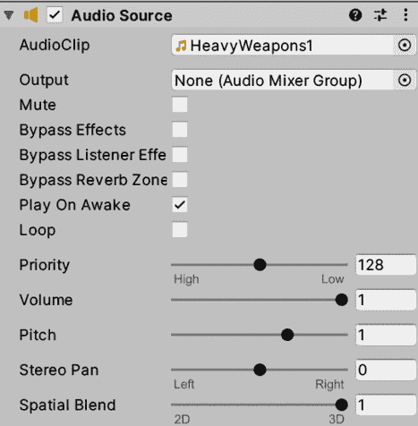

图 14.10：声音效果设置。这不会循环，并且是 3D 声音

在 3D 声音的情况下，需要考虑的是**音量衰减**设置，它位于 3D 声音设置部分中。此设置控制音量如何随着与相机距离的增加而衰减。默认情况下，你可以看到此设置设置为**对数衰减**，这是现实生活中声音工作的方式，但有时你不想有现实生活中的声音衰减，因为现实生活中即使声音来源非常远，声音通常也能被听到。

一个选项是切换到**线性衰减**，并使用**最大距离**设置配置确切的最高距离：

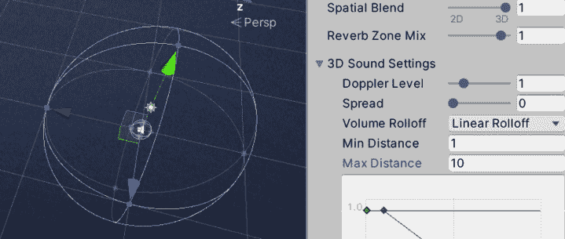

图 14.11：使用线性衰减的最大距离为 10 米的 3D 声音

考虑到我们刚刚讨论了 3D 声音，值得提一下**AudioListener**组件，这是在**MainCamera**中默认创建的，99%的情况下，这个组件将被放置在**MainCamera**中。它作为识别哪个对象代表世界中玩家的耳朵的一种方式，我们可以用它来计算音频方向性。由于相机代表用户的眼睛，因此将眼睛和耳朵放在不同的地方会令人困惑。在**AudioListener**组件中没有可配置的属性，但重要的是要提到，为了音频能够工作，我们需要一个，而且不能多于一个；我们只有一对耳朵：

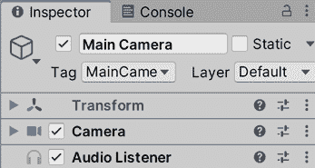

图 14.12：主相机中的音频监听器组件

现在我们已经可以配置单个音频片段了，让我们看看如何使用**音频混音器**应用音频实例组的效果。

## 使用音频混音器

我们将在整个游戏中播放多个音频实例：角色的脚步声、射击、篝火、爆炸、雨等等。根据上下文精确控制哪些声音应该更响或更轻，以及应用效果来强化某些情况，例如由于附近的爆炸而受到惊吓，这被称为音频混音——以统一和受控的方式将多个声音混合在一起的过程。

在 Unity 中，我们可以创建一个音频混音器，这是一个资产，我们可以用它来定义声音组。对任何组的所有更改都会通过提升或降低音量，或许，或者通过应用效果来影响组内的所有声音。你可以有音效和音乐组来分别控制声音——例如，你可以在**暂停**菜单中降低音效音量，但不要降低音乐音量。此外，组以层次结构组织，其中组也可以包含其他组，因此对组的更改也会应用到其子组。实际上，你创建的每个组都将始终是主组的子组，即控制游戏中每个声音（使用该混音器）的组。

让我们创建一个带有音效和音乐组的混音器：

1.  在项目窗口中，使用**+**按钮，选择**音频混音器**选项。根据你的意愿命名资产；在我的情况下，我选择了`Main Mixer`。

1.  双击创建的资产以打开**音频混音器**窗口：

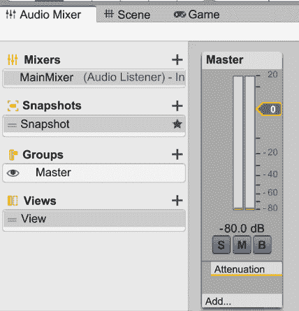

图 14.13：音频混音器窗口

1.  点击**+**按钮，在**组**标签的右侧创建主节点的子组。命名为`SFX`：

图 14.14：创建组

1.  点击**主**分组，然后再次点击**+**按钮以创建另一个名为`Music`的主节点子分组。记住在点击**+**按钮之前选择**主**分组，因为如果选择了另一个分组，新分组将成为该分组的子分组。无论如何，你可以通过在**音频混音器**窗口的**分组**面板中拖动分组来重新排列分组子父关系：

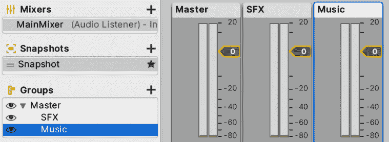

图 14.15：主、SFX 和音乐分组

1.  在**层次结构**窗口中，选择我们场景中的**音乐**GameObject，并在**检查器**窗口中查找**音频源**组件。

1.  点击**输出**属性右侧的圆圈以打开**音频混音器分组**选择窗口，并选择**音乐**分组。这将使受该混音器分组设置的**音频源**受到影响：

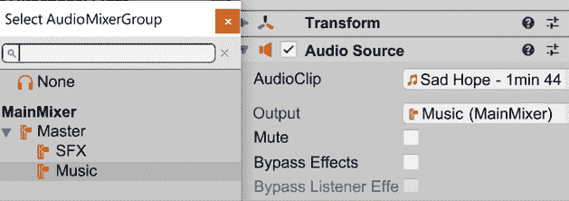

1.  如果你现在玩游戏，你可以看到在**音频混音器**窗口中的音量表开始移动，这表明音乐正在通过**音乐**分组。你也会看到**主**分组音量表也在移动，这表明通过**音乐**分组的音也在通过**主**分组（**音乐**分组的父分组）前往你的电脑的声卡：

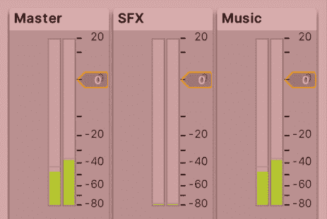

图 14.17：分组音量级别

1.  重复**步骤 5**和**步骤 6**，将环境音和射击音设置为属于**SFX**分组。

现在我们已经将声音分成了组，我们可以开始调整分组的设置。但是，在这样做之前，我们需要考虑到我们不会一直想要相同的设置，就像之前提到的暂停菜单案例中，SFX 音量应该更低。为了处理这些场景，我们可以创建快照，这些是我们的混音器的预设，可以在游戏运行期间通过脚本激活。我们将在本书的**第三部分**中处理脚本步骤，但我们可以为游戏设置创建一个正常快照，为暂停菜单设置创建一个暂停快照。

如果你检查**快照**列表，你会看到已经创建了一个快照——这可以是我们的正常快照。所以，让我们创建一个暂停快照，方法如下：

1.  点击**快照**标签右侧的**+**按钮，并将快照命名为“暂停”。记住在编辑混音器时停止游戏，或者点击**在播放模式下编辑**选项以允许 Unity 在播放时更改混音器。如果你这样做，记住当你停止游戏时，这些更改将保持不变，与 GameObject 的更改不同。实际上，如果你在**播放**模式下更改其他资产，这些更改也将保持不变——只有 GameObject 的更改会被撤销。

    有一些其他情况，比如材料和动画，由于它们是资产，暂停后这些更改不会被撤销，但我们现在不会讨论它们：

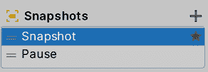

图 14.18：快照创建

1.  选择**暂停**快照并降低**SFX**组的音量滑块：

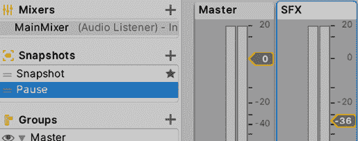

图 14.19：降低暂停快照的音量

1.  播放游戏并听一下声音是否仍然处于正常音量。这是因为原始快照是默认的——你可以通过检查其右侧的星号来确认。你可以右键单击任何快照，并使用**设置为起始快照**选项将其设置为默认快照。

1.  点击**在****游戏模式**下**编辑**以在运行时启用**音频混音器**的修改。

1.  点击**暂停**快照以启用它并听一下**射击**和**环境**声音音量是如何降低的。

如你所见，混音器的主要用途之一是控制组音量，尤其是在你看到某个组的音量强度高于 0 标记时，这表明该组声音太大。无论如何，混音器还有其他用途，比如应用效果。如果你玩过任何战争游戏，你会注意到每当附近有炸弹爆炸时，你会在一段时间内听到不同的声音，就像声音位于另一个房间一样。这可以通过一个名为**低通**的效果来实现，它阻止高频声音，这正是我们在那些场景中耳朵所经历的情况：爆炸产生的高音量声音的压力会刺激我们的耳朵，使它们对高频的敏感性降低一段时间。

我们可以向任何通道添加效果，并根据当前快照进行配置，就像我们为音量所做的那样，方法如下：

1.  在**主**组底部点击**添加…**按钮并选择**低通简单**：

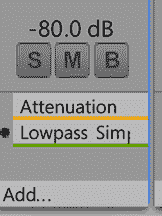

图 14.20：通道的效果列表

1.  选择正常快照（称为`快照`）以进行修改。

1.  选择**主**组并查看**检查器**面板，在那里你会看到组及其效果的设置。

1.  将**低通简单**设置的**截止频率**属性设置为最高值（`22000`），这将禁用该效果。

1.  对于**暂停**快照，重复*步骤 3*和*步骤 4*；我们不想在那个快照中应用这个效果。

1.  创建一个名为**炸弹击晕**的新快照并选择它进行编辑。

1.  将**截止频率**设置为`1000`：

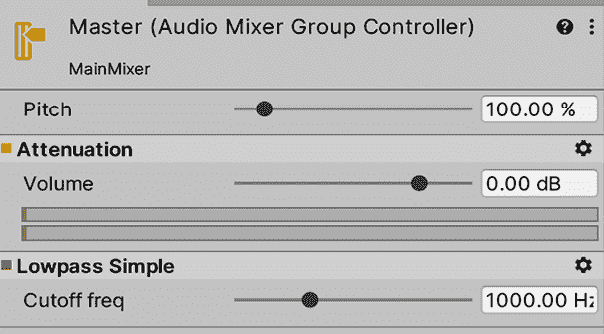

图 14.21：设置低通简单效果的截止频率

1.  播放游戏并在快照之间切换以检查差异。

除了低通滤波器之外，您还可以应用其他几个过滤器，例如**Echo**，以创建几乎梦幻般的效果，或者**Send**、**Receive**和**Duck**的组合，以根据另一个组的强度降低一个组的音量（例如，当发生对话时，您可能希望降低 SFX 音量）。我邀请您尝试这些和其他效果，并检查结果以通过阅读以下文档来识别潜在用途：[`docs.unity3d.com/Manual/class-AudioEffectMixer.html`](https://docs.unity3d.com/Manual/class-AudioEffectMixer.html)。

现在我们已经集成了音频，让我们看看我们如何可以编写我们的音频脚本。

# 脚本化音频反馈

就像 VFX 一样，音频也需要对游戏中的事件做出反应，以提供更好的沉浸感。让我们开始添加当敌人死亡时产生的爆炸效果的声音，这本身可能不需要脚本，但它是由于最初生成爆炸的脚本而产生的：

1.  从互联网或资产商店下载爆炸声音效果。

1.  选择当敌人死亡时我们生成的**Explosion**预制体，并为其添加**Audio Source**。

1.  将下载的爆炸音频剪辑设置为音频源的**AudioClip**属性。

1.  确保在**Audio Source**下**Play On Awake**被选中，**Loop**未被选中：

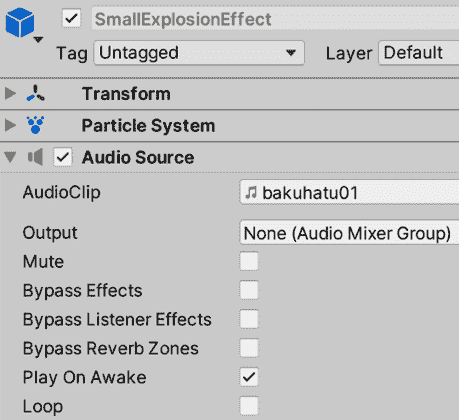

图 14.22：将声音添加到我们的爆炸效果中

如您所见，我们在这里没有使用任何脚本。当声音被添加到预制体中时，它将在预制体实例化的那一刻自动播放。现在，让我们通过以下步骤整合射击声音：

1.  下载一个射击声音，并通过音频源将其添加到玩家的武器枪口效果（而不是武器）中，这次取消选中**Play On Awake**复选框。

1.  在`PlayerShooting`脚本中，创建一个名为`shootSound`的`AudioSource`类型的字段。

1.  在**Hierarchy**中选择**Player**，并将武器枪口效果 GameObject 拖到**Inspector**中的**Shoot Sound**属性，以将脚本与武器枪口效果的`AudioSource`变量连接起来。

1.  在检查我们是否可以射击的`if`语句中，添加`shootSound.Play();`行以在射击时执行声音：

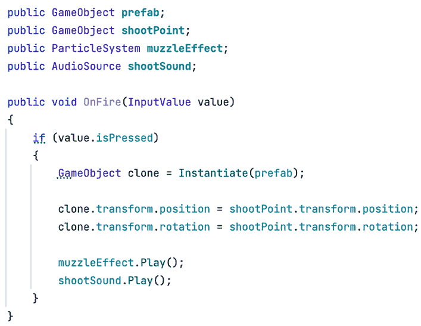

图 14.23：射击时添加声音

视觉脚本附加节点将看起来像这样：

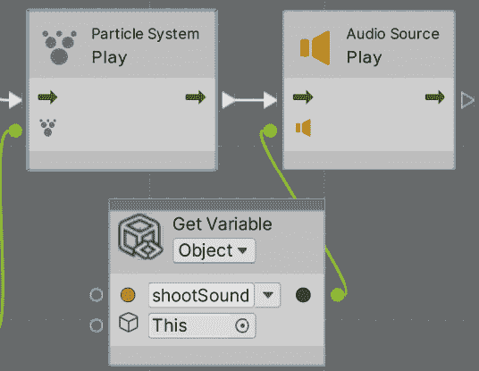

图 14.24：在视觉脚本中射击时添加声音

就像我们对枪口效果所做的那样，我们添加了一个名为`shootSound`的 GameObject 变量来引用包含`AudioSource`的武器 GameObject，然后我们调用了`shootSound`变量的**Play**方法。

我挑战你尝试在 C#和 Visual Scripting 版本的脚本中为敌方 AI 添加射击声音。以我们在第十一章中做的为例，*使用粒子系统和视觉效果图进行视觉效果*，对于枪口效果，无论如何，你都可以查看本书的 Git 仓库（可在*前言*中找到链接）以获取解决方案。

对于这一点，我们可以采取与我们在处理爆炸时相同的方法；只需将射击声音添加到子弹上，但如果子弹撞到墙壁，声音很快就会停止。或者，如果我们未来想要自动武器的声音，它需要实现为一个循环播放的声音，当我们按下相关键时开始，当我们释放它时停止。这样，我们就可以防止在射击过多子弹时出现太多声音实例重叠。在选择编写反馈脚本的方法时，考虑到这些类型的场景。

# 摘要

在本章中，我们讨论了如何导入和集成声音，考虑到它们对内存使用的影响，并考虑了如何应用效果来生成不同的场景。声音是实现期望游戏体验的重要组成部分，因此请花适当的时间来确保其正确性。

现在我们已经涵盖了游戏几乎所有重要的美学方面，让我们再创造一种视觉沟通形式，即用户界面或 UI。我们将在下一章创建必要的 UI 来显示玩家的当前得分、子弹、生命值以及更多信息。
