# 第二十章：Unity 中的增强现实

现在，新技术扩展了 Unity 的应用领域，从游戏到各种软件，如模拟、培训、应用程序等。在 Unity 的最新版本中，我们在增强现实领域看到了许多改进，这使得我们可以在现实之上添加一层虚拟性，从而增强我们设备所能感知的内容，以创建依赖于现实世界数据的游戏，例如摄像机的图像、我们的现实世界位置和当前的天气。这也可以应用于工作环境，例如查看建筑图或检查墙内的电线管道。欢迎来到本书的额外部分，我们将讨论如何使用 Unity 的 AR Foundation 包创建增强现实（**AR**）应用程序。

在本章中，我们将检查以下 AR Foundation 概念：

+   使用 AR Foundation

+   为移动设备构建

+   创建一个简单的 AR 游戏

到本章结束时，你将能够使用 AR Foundation 创建 AR 应用程序，并将拥有一个使用其框架的完整功能游戏，以便你可以测试框架的功能。

让我们先探索 AR Foundation 框架。

# 使用 AR Foundation

当谈到 AR 时，Unity 有两个主要的工具来创建应用程序：**Vuforia** 和 **AR Foundation**。Vuforia 是一个可以在几乎所有移动设备上工作的 AR 框架，它包含了基本 AR 应用所需的所有功能，但通过付费订阅，我们可以获得更多高级功能。另一方面，完全免费的 AR Foundation 框架支持我们设备上最新的 AR 原生功能，但仅支持较新的设备。选择其中一个还是另一个很大程度上取决于你将要构建的项目类型和目标受众。然而，由于本书旨在讨论最新的 Unity 功能，我们将探讨如何使用 AR Foundation 创建我们的第一个 AR 应用，用于检测现实世界中图像和表面的位置。因此，我们将从探索其 API 开始。

在本节中，我们将检查以下 AR Foundation 概念：

+   创建 AR 基础项目

+   使用跟踪功能

让我们先讨论如何准备我们的项目，以便它能够运行 AR Foundation 应用程序。

## 创建 AR 基础项目

在创建 AR 项目时需要考虑的是，我们不仅会改变我们编写游戏代码的方式，还会改变游戏设计方面。AR 应用程序有差异，尤其是在用户交互方式上，以及一些限制，例如用户始终控制着摄像头。我们不能简单地移植现有的游戏到 AR 而不改变游戏的核心体验。这就是为什么在本章中，我们将着手一个全新的项目；改变我们迄今为止创建的游戏以使其在 AR 中运行将非常困难。

在我们的案例中，我们将创建一个游戏，用户控制一个移动“标记”的玩家，这个“标记”是一个可以打印的物理图像，它将允许我们的应用程序识别玩家在现实世界中的位置。我们可以在移动该图像的同时移动玩家，这个虚拟玩家将自动射击最近的敌人。这些敌人将从用户需要在家庭不同部分放置的特定生成点出现。例如，我们可以在墙上放置两个生成点，并将我们的玩家标记放在房间中间的桌子上，这样敌人就会朝它们走去。在下面的图像中，你可以看到游戏的预览：

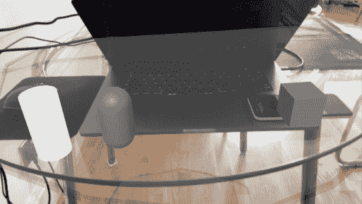

图 20.1：完成的游戏。圆柱体是敌人生成器，胶囊是敌人，立方体是玩家。这些在手机显示的标记图像中定位

我们将以创建第一个游戏相同的方式开始创建一个新的基于 URP 的项目。需要考虑的是，AR Foundation 与其他管道一起工作，包括内置的，以防你希望在现有项目中使用它。如果你不记得如何创建项目，请参阅*第一章*，*创建 Unity 项目*。

一旦你进入你的新空白项目，就像我们之前安装其他包一样，从包管理器安装 AR Foundation 包——即，从**窗口** | **包管理器**。记得设置包管理器，使其显示所有包，而不仅仅是项目中的包（窗口左上角的**包**按钮需要设置为**Unity 注册表**）以及预览版本（点击轮形图标，然后**项目设置**，在出现的窗口上检查**启用预发布包**）。

在撰写本书时，最新的稳定版本是 4.2.3，但我们将探索 5.0.0 预览版 13。记得通过点击左侧的三角形按钮打开包版本列表，以查看预览版本。如果你发现比我更新的版本，你可以尝试使用那个版本，但像往常一样，如果某些东西的工作方式与我们想要的不同，请安装 5.0.0-pre.13。像往常一样，如果出现提示你启用新输入系统的警告，请点击**是**：

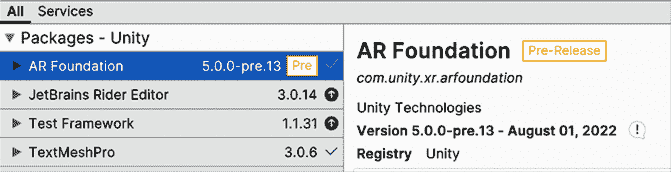

图 20.2：安装 AR Foundation

在我们安装任何其他需要的包之前，现在是讨论 AR Foundation 框架核心思想的好时机。这个包本身并不做任何事情；它定义了一系列移动设备提供的 AR 功能，例如图像跟踪、云点和对象跟踪，但实际如何实现这些功能的代码包含在 **Provider** 包中，例如 **Apple ARKit XR 插件** 和 **Google ARCore XR 插件** 包。这样设计是因为，根据您想要与之合作的目标设备，实现这些功能的方式会有所不同。例如，在 iOS 中，Unity 使用 AR Kit 实现这些功能，而在 Android 中，它使用 AR Core；它们是平台特定的框架。请记住，安装与 AR Foundation 相同版本的这些平台包（在本例中为 5.0.0 预览版 13）。

在这里需要考虑的是，并非所有 iOS 或 Android 设备都支持 AR Foundation 应用。您在网上搜索支持 AR Core 和 AR Kit 的设备时，可能会找到一个更新的支持设备列表。在撰写本文时，以下链接提供了支持设备列表：

+   **iOS**: [`www.apple.com/lae/augmented-reality`](https://www.apple.com/lae/augmented-reality)（页面底部）

+   **Android**: [`developers.google.com/ar/devices`](https://developers.google.com/ar/devices)

此外，目前还没有 PC Provider 包，因此迄今为止测试 AR Foundation 应用程序的唯一方法是直接在设备上测试，但测试工具很快就会发布。在我的情况下，我将为 iOS 创建一个应用程序，因此除了 **AR Foundation** 包之外，我还需要安装 **ARKit XR** 插件。

然而，如果您想为 Android 开发，请安装 **ARCore XR** 插件（或者如果您针对两个平台，则两者都安装）。此外，我将使用这些包的 4.1.7 版本。通常，**AR Foundation** 和 **Provider** 包的版本是一致的，但应用相同的逻辑，就像您选择 **AR Foundation** 版本时一样。在下面的屏幕截图中，您可以在 **包管理器** 中看到 **ARKit** 包：

现在我们有了所需的插件，我们需要为 AR 准备一个场景，如下所示：

1.  在 **文件 | 新建场景** 中创建一个新的场景，并选择 **基本 (URP)** 模板。

1.  删除 **主摄像头**；我们将使用另一个摄像头。

1.  在 **GameObject | XR** 菜单中，创建一个 **AR Session** GameObject。

1.  在相同的菜单中，创建一个包含 **Camera** 的 **XR Origin (Mobile AR)** 对象。

1.  在 **XR Origin** 中选择 **主摄像头**。

1.  将 **AR 摄像机管理器** 组件的 **渲染模式** 属性设置为 **在不透明物体之后**。这是针对当前版本中另一种模式下无法正确渲染摄像头的错误的一个解决方案。

1.  您的层次结构应该如下所示：

    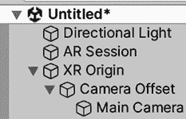

图 20.3：入门 AR 场景

**AR Session**对象将负责初始化 AR 框架，并处理 AR 系统的所有更新逻辑。**XR Origin**对象将允许框架定位跟踪对象，如图像和点云，相对于场景的相对位置。设备会告知跟踪对象相对于设备认为的“原点”的位置。这通常是当应用程序开始检测对象时你指向的第一个区域，因此**XR Origin**对象将代表你物理空间中的那个点。最后，你可以检查原点内的相机，它包含一些额外的组件，其中最重要的是**Tracked Pose Driver**，它将使你的**Camera**对象随着设备移动。由于设备的位置相对于会话原点对象的点，相机需要位于原点对象内。

如果你正在处理一个 URP 项目（我们的情况），则需要额外的一步，即设置渲染管线，使其支持在应用程序中渲染相机图像。为此，前往我们创建项目时生成的`Settings`文件夹，查找`URP-HighFidelity-Renderer`文件，并选择它。在**Renderer Features**列表中，点击**Add Renderer Feature**按钮，并选择**AR Background Renderer Feature**。在下面的屏幕截图中，你可以看到 Forward Renderer 资产应该看起来是什么样子：

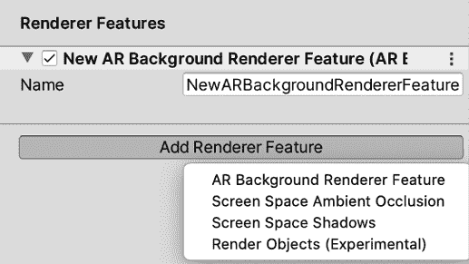

图 20.4：为 URP 添加支持

就这样！我们准备好开始探索 AR Foundation 组件，以便我们可以实现跟踪功能。

## 使用跟踪功能

对于我们的项目，我们需要 AR 中最常见的两个跟踪功能（但不是唯一的功能）：图像识别和平面检测。第一个功能包括检测特定图像在现实世界中的位置，以便我们可以在其上方放置数字对象，例如玩家。第二个功能，平面检测，包括识别现实生活中的表面，如地板、桌子和墙壁，以便我们有放置对象（如敌人的出生点）的参考。只有水平和垂直表面被识别（某些设备上仅识别垂直表面）。

我们需要做的第一件事是告诉我们的应用程序它需要检测哪些图片，如下所示：

1.  将图片添加到项目中，使其可以打印或显示在移动设备上。在现实世界中展示图片的方式对于测试这是必要的。在这种情况下，我将使用以下图片：

图 20.5：要跟踪的图片

尽量获取包含尽可能多特征的图片。这意味着一个有很多小细节的图片，比如对比度、尖锐的角落等。这些都是我们的 AR 系统用来检测它的；细节越多，识别越好。如果你的设备在检测我们当前的图片时遇到困难，请尝试其他图片（经典的 QR 码可能有所帮助）。

1.  考虑到某些设备可能对某些图像存在困难，例如本书中建议的图像。如果在测试时产生问题，请尝试使用另一个图像。你将在本章接下来的部分中在自己的设备上测试此图像，所以请记住这一点。

1.  通过在**项目面板**中点击**+**按钮并选择**XR | 参考图像库**来创建一个**参考图像库**，这是一个包含我们希望应用程序识别的所有图像的资产。

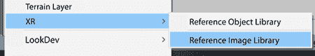

图 20.6：创建参考图像库

1.  选择我们创建的**参考图像库**资产，并点击**添加图像**按钮以将新图像添加到库中。

1.  将纹理拖动到纹理槽（标有**None**的那个槽）中。

1.  打开**指定大小**，并将**物理大小**设置为图像在现实生活中的打印尺寸，单位为米。在这里尽量准确；在某些设备上，如果没有设置正确的值，可能会导致图像无法被跟踪：

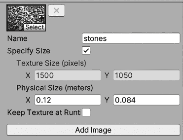

图 20.7：添加要识别的图像

现在我们已经指定了要检测的图像，让我们通过在现实生活中的图像上方放置一个立方体来测试这一点：

1.  创建一个立方体的 Prefab，并向其添加**AR 跟踪图像**组件。

1.  请记住，由于默认的立方体将是 1 米乘 1 米，这在 AR 中会非常大，所以请在每个轴上设置一个小比例，例如 0.1。

1.  将**AR 跟踪图像管理器**组件添加到**XR 原点**对象中。这将负责检测图像并在其位置创建对象。

1.  将之前步骤中创建的**图像库**资产拖动到组件的**序列化库**属性中，以指定要识别的图像。

1.  将**立方体**Prefab 拖动到组件的**跟踪图像 Prefab**属性中：

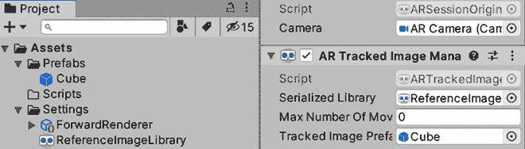

图 20.8：设置跟踪图像管理器

以下是所有内容！在本章的“为移动设备构建”部分中，当我们创建 iOS 或 Android 构建时，我们将看到立方体在图像在现实世界中的相同位置生成。请记住，你需要在这个设备上测试这一点，我们将在下一节中这样做，所以现在，让我们继续编写我们的测试应用程序代码：

图 20.9：位于手机显示图像顶部的立方体

让我们也准备我们的应用程序，以便它可以检测并显示相机识别出的平面表面。这很简单，只需将**AR 平面管理器**组件添加到**XR 原点**对象中。

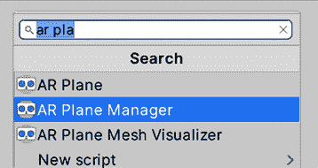

图 20.10：添加 AR 平面管理器组件

此组件会在我们移动相机时检测我们房子上的表面平面。检测它们可能需要一段时间，因此可视化检测区域以获取有关此操作的反馈非常重要，以确保其正常工作。我们可以从 AR Plane Manager 的组件引用手动获取有关平面的信息，但幸运的是，Unity 允许我们轻松地可视化平面。让我们看看：

1.  首先通过在**GameObject | 3D Object | Plane**中创建一个平面的预制体。

1.  向其添加一个**Line Renderer**。这将使我们能够在检测区域的边缘绘制线条。

1.  将**Line Renderer**的**Width**属性设置为较小的值，例如`0.01`，将**Color**渐变属性设置为黑色，并取消选中**Use World Space**：

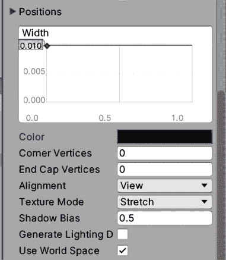

图 20.11：设置线渲染器

1.  记得创建一个具有适当着色器（**Universal Render Pipeline/Unlit**）的材质，并将其设置为**Materials**列表属性下**Line Renderer**组件的材质：

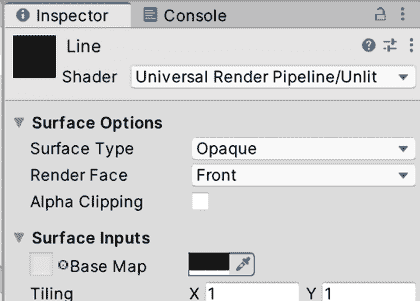

图 20.12：创建线渲染器材质

1.  此外，创建一个透明材质，并将其用于**MeshRenderer**平面。我们希望透过它，这样我们就可以轻松地看到下面的真实表面：

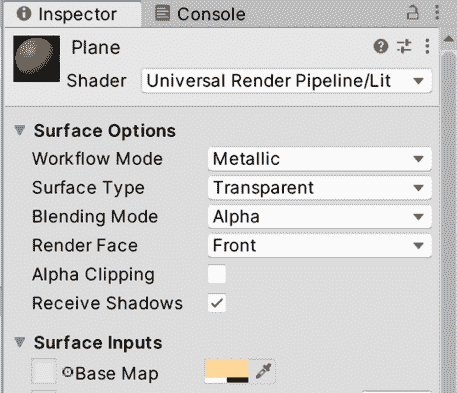

图 20.13：检测到的平面的材质

1.  将**AR Plane**和**AR Plane Mesh Visualizer**组件添加到**Plane**预制体中。

1.  将预制体拖动到**XR Origin**对象的**AR Plane Manager**组件的**Plane Prefab**属性中：

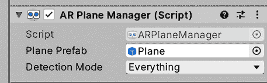

图 20.14：设置平面可视化预制体

现在，我们有了查看平面的方法，但看到它们并不是我们能做的唯一事情（有时，我们甚至不希望它们可见）。平面的真正力量在于在现实生活中的表面上放置虚拟对象，点击特定的平面区域，并获取其实际位置。我们可以通过**AR Plane Manager**或访问我们的可视化平面的**AR Plane**组件来访问平面数据，但更简单的方法是使用**AR Raycast Manager**组件。

**AR Raycast Manager**组件为我们提供了与 Unity 物理系统中的`Physics.Raycast`函数等效的功能，你可能还记得，这个函数用于创建从某个位置开始并指向指定方向的虚拟射线，以便它们击中表面并检测确切的击中点。**AR Raycast Manager**提供的版本，而不是与物理碰撞体碰撞，而是与跟踪对象碰撞，主要是点云（我们未使用它们）和我们要跟踪的“平面”。我们可以通过以下步骤测试这个功能：

1.  将**AR Raycast Manager**组件添加到**XR Origin**对象中。

1.  在**XR Origin**对象中创建一个名为`SpawnerPlacer`的自定义脚本。

1.  在**Awake**缓存中添加对`ARRaycastManager`的引用。你需要将`using UnityEngine.XR.ARFoundation;`行添加到脚本顶部，以便在这个类中可以使用我们的脚本。

1.  创建一个`List<ARRaycastHit>`类型的私有字段并实例化它；Raycast 函数将检测我们的射线击中的每个平面，而不仅仅是第一个：

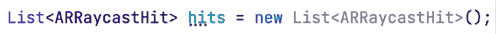

1.  在**Update**下检查触摸屏是否被按下（`Touchscreen.current.primaryTouch.press.isPressed`）。你需要在文件顶部使用`using UnityEngine.InputSystem;`来使用新的输入系统。

1.  在上一步的`if`语句内部，为调用**AR Raycast Manager**的`Raycast`函数添加另一个条件，将触摸位置作为第一个参数，将碰撞列表作为第二个参数传递（`Touchscreen.current.primaryTouch.position.ReadValue()`）。

1.  这将向玩家触摸屏幕的方向发射射线，并将碰撞存储在我们提供的列表中。如果击中某个物体，则返回`true`，如果没有击中，则返回`false`。

1.  添加一个公共字段来指定在触摸位置实例化的 Prefab。你可以创建一个球体 Prefab 并将其分配给此字段进行测试；这里不需要为 Prefab 添加任何特殊组件。请记住设置一个小的缩放。

1.  在列表中存储的第一个碰撞的**Pose**属性的**Position**和**Rotation**字段中实例化 Prefab。由于碰撞按距离排序，所以第一个碰撞是最接近的。你的最终脚本应该如下所示：

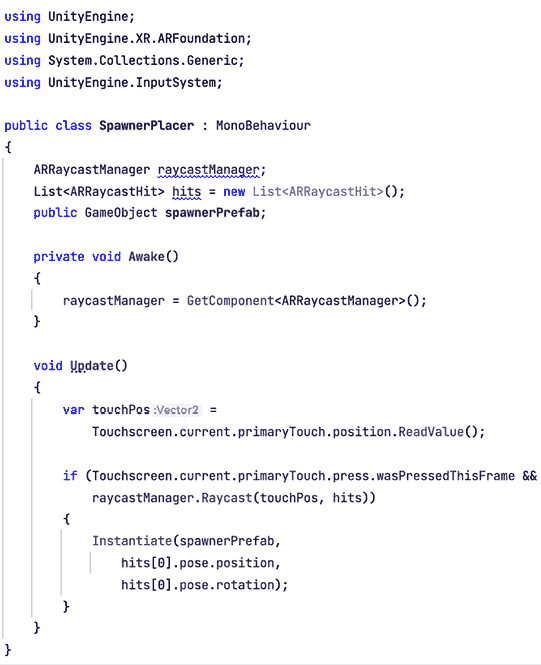

图 20.16：射线投射组件

在本节中，我们学习了如何使用 AR Foundation 创建新的 AR 项目。我们讨论了如何安装和设置框架，以及如何检测现实生活中的图像位置和表面，然后是如何在它们上方放置对象。

如你所注意到的，我们从未点击**Play**来测试这个，遗憾的是，在撰写本书时，我们无法在编辑器中测试这个。相反，我们需要直接在设备上测试这个。因此，在下一节中，我们将学习如何为 Android 和 iOS 等移动设备进行构建。

# 为移动设备构建

Unity 是一个非常强大的工具，它能够轻松解决游戏开发中最常见的问题，其中之一就是为多个目标平台构建游戏。现在，为这些设备构建我们的项目部分在 Unity 中很容易完成，但每个设备在安装开发版本时都有其与 Unity 无关的细微差别。为了测试我们的 AR 应用程序，我们需要直接在设备上测试它。因此，让我们探讨如何使我们的应用程序在 Android 和 iOS（最常见的移动平台）上运行。

在深入探讨这个主题之前，值得提到的是，以下程序会随着时间的推移而大量变化，因此您需要在互联网上找到最新的说明。Unity Learn 门户网站（[`learn.unity.com/tutorial/how-to-publish-to-android-2`](https://learn.unity.com/tutorial/how-to-publish-to-android-2)）可能是本书记载的说明失败时的一个良好替代方案，但请先尝试这里的步骤。

在本节中，我们将探讨以下移动构建概念：

+   Android 构建

+   iOS 构建

让我们先讨论如何构建我们的应用程序，使其在 Android 手机上运行。

## Android 构建

与其他平台相比，创建 Android 构建相对容易，因此我们将从 Android 开始。请记住，您需要一个能够运行 AR Foundation 应用程序的 Android 设备，因此请参阅本章*使用 AR Foundation*部分中提到的关于支持 Android 的设备的链接。我们需要做的第一件事是检查我们是否已安装 Unity 的 Android 支持，并配置我们的项目以使用该平台。为此，请按照以下步骤操作：

1.  关闭 Unity 并打开**Unity Hub**。

1.  前往**安装**部分，找到您正在工作的 Unity 版本。

1.  在您使用的 Unity 版本右上角点击轮形图标按钮，然后点击**添加模块**：

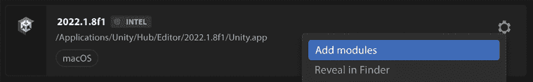

图 20.17：向 Unity 版本添加模块

1.  确保已勾选**Android 构建支持**以及点击其左侧箭头时显示的子选项。如果没有，请勾选它们，然后点击窗口右下角的**继续**按钮来安装它们：

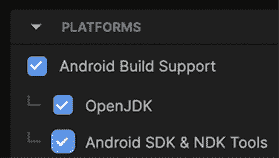

图 20.18：将 Android 支持添加到 Unity

1.  通过勾选**接受条款**复选框并点击**继续**按钮，接受所有条款和条件提示。

1.  打开本章中创建的 AR 项目。

1.  前往**构建设置**（**文件 | 构建设置**）。

1.  从列表中选择**Android**平台，然后点击窗口右下角的**切换平台**按钮：

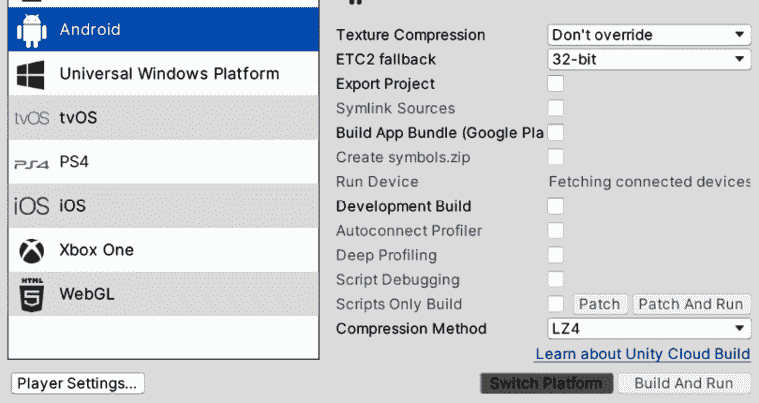

图 20.19：切换到 Android 构建

要在 Android 上构建应用程序，我们需要满足一些要求，例如安装 Java SDK（不是常规的 Java 运行时）和 Android SDK，但幸运的是，Unity 的新版本会处理这些。为了确保我们已安装所需的依赖项，请按照以下步骤操作：

1.  前往 **Unity 预设** （在 Windows 上为 **编辑 | 预设**，在 Mac 上为 **Unity | 预设**）。

1.  点击 **外部工具**。

1.  确认 Android 部分所有标有 **…随 Unity 安装** 的选项都已勾选。这意味着我们将使用 Unity 安装的全部依赖项：

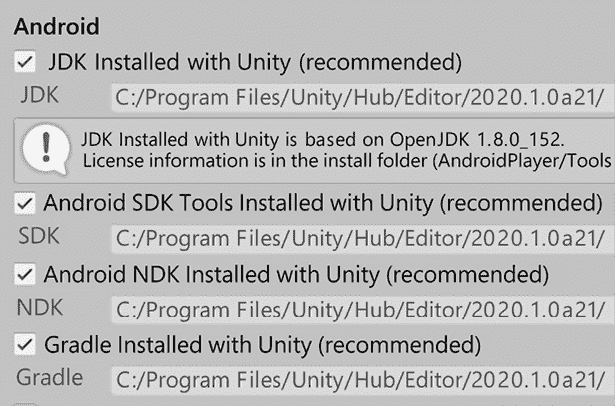

图 20.20：使用已安装的依赖项

在 [`developers.google.com/ar/develop/unity-arf/quickstart-android`](https://developers.google.com/ar/develop/unity-arf/quickstart-android) 可以找到一些额外的 Android ARCore 特定相关设置，您可以通过以下步骤应用它们：

1.  前往 **玩家设置** （**编辑 | 项目设置 | 玩家**）。

1.  从 **其他设置** 部分取消选择 **多线程渲染** 和 **自动图形 API**。

1.  如果存在，从 **图形 API** 列表中移除 **Vulkan**。

1.  将 **最小 API 级别** 设置为 **Android 7.0**：

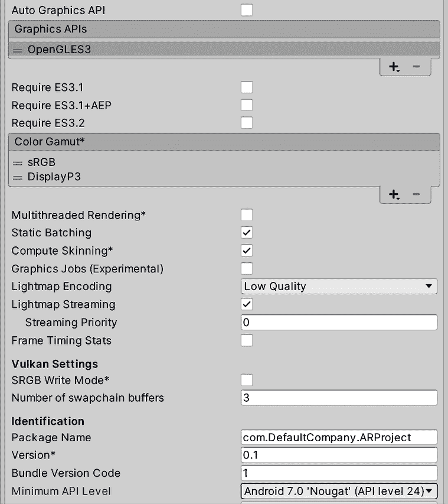

图 20.21：AR Core 设置

1.  将脚本后端设置为 **IL2CPP**。

1.  选择 **ARM64** 复选框以支持 Android 64 位设备。

1.  选择 **覆盖默认包标识符** 并设置一些自定义的，例如 `com.MyCompany.MyARApp`。

1.  前往 **编辑 | 项目设置** 并选择 **XR 插件管理** 选项。

1.  在 **插件提供者** 下选择 **Google ARCore** 以确保它将在我们的构建中启用；如果不这样做，我们不会看到任何内容：

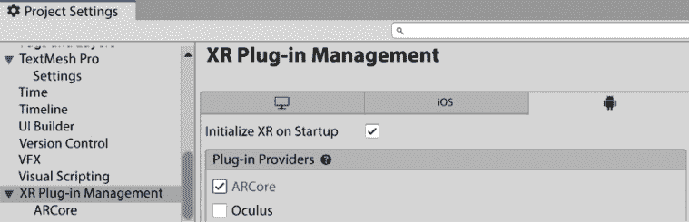

图 20.22：ARCore 插件已启用

现在，您可以从 **文件 | 构建设置**（通过使用 **构建** 按钮）像往常一样构建应用程序。这次，输出将是一个单独的 APK 文件，您可以通过将文件复制到您的设备并打开它来安装。请记住，为了安装未从 Play 商店下载的 APK，您需要将设备设置为允许 **安装未知应用**。该选项的位置因 Android 版本和您所使用的设备而异，但该选项通常位于 **安全** 设置中。一些 Android 版本在安装 APK 时会提示您查看这些设置。

现在，每次我们想要创建构建时，我们都可以复制并安装生成的 APK 构建文件。然而，我们可以让 Unity 为我们完成这项工作，使用**构建和运行**按钮。构建应用程序后，此选项将查找通过 USB 连接到您的电脑的第一个 Android 设备，并自动安装应用程序。为了使此功能正常工作，我们需要准备我们的设备和电脑，如下所示：

1.  在您的设备上，在**设置**部分找到构建号，其位置，再次提醒，可能会根据设备而变化。在我的设备上，它位于**关于手机 | 软件信息**部分：

![img/B18585_20_23.png]

图 20.23：定位构建号

1.  轻轻点击几次，直到设备告诉您您现在是一名程序员。此过程启用了设备中的隐藏开发者选项，您现在可以在设置中找到它。

1.  打开开发者选项并开启**USB 调试**，这允许您的电脑在您的设备上拥有特殊权限。在这种情况下，它允许您安装应用程序。

1.  如果使用 Windows，请从您的手机制造商的网站上安装 USB 驱动程序。例如，如果您有一部三星设备，请搜索`Samsung USB Driver`。另外，如果您找不到它，您可以查找`Android USB Driver`以获取通用驱动程序，但如果您的设备制造商有自己的驱动程序，这可能不起作用。在 Mac 上，此步骤通常不是必需的。

1.  将您的设备（如果尚未连接，请重新连接）。您的电脑将出现**允许 USB 调试**的选项。请选择**始终允许**并点击**确定**：

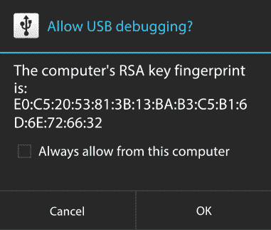

图 20.24：允许 USB 调试

1.  接受出现的**允许数据**提示。

1.  如果这些选项没有出现，请检查您的设备**USB 模式**是否设置为**调试**，而不是其他任何模式。

1.  在 Unity 中，使用**构建和运行**按钮进行构建，并将`apk`文件保存到文件夹中。请耐心等待，因为第一次可能需要一些时间。

请记住，如果您在检测我们实例化玩家（以我的情况为例，是 Unity 标志）所在的位置时遇到问题，请尝试另一个镜像。这可能会根据您的设备功能有很大的不同。

就这样！现在您的应用程序已经在设备上运行，让我们学习如何为 iOS 平台做同样的事情。

## 为 iOS 构建

在 iOS 上开发时，您可能需要花费一些钱。您需要运行 XCode，这是一款只能在 macOS X 上运行的软件。因此，您需要一个可以运行它的设备，例如 MacBook、Mac mini 等。可能有在 PC 上运行 macOS X 的方法，但您需要自己找出并尝试。除了在 Mac 和 iOS 设备（iPhone、iPad、iPod 等）上花费之外，您还需要为 Apple 开发者账户付费，每年 99 美元，但仅当您计划发布游戏时；用于测试目的，您可以继续使用。

要创建 AR Foundation iOS 构建，您应该执行以下操作：

1.  获取一台 Mac 电脑和一款 iOS 设备。

1.  创建一个苹果开发者账户（在撰写本书时，您可以在 [`developer.apple.com/`](https://developer.apple.com/) 创建一个）。

1.  从 App Store 将最新版本的 XCode 安装到您的 Mac 上。

1.  检查您在 Unity Hub 上的 Unity 安装中是否有 iOS 构建支持。有关此步骤的更多信息，请参阅 *为 Android 构建* 部分。

1.  在 **构建设置** 下切换到 iOS 平台，通过选择 iOS 并点击 **切换平台** 按钮：

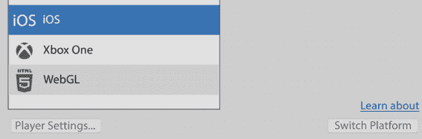

图 20.25：切换到 iOS 构建

1.  前往 **编辑 | 项目设置** 并选择 **播放器** 选项。

1.  在 **其他设置** 中，如果尚未设置，请设置 **相机使用描述** 属性。这将是一个显示给用户的消息，告诉他们我们为什么需要访问他们的相机：

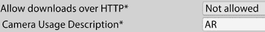

图 20.26：关于相机使用的消息

1.  前往 **编辑 | 项目设置** 并选择 **XR 插件管理** 选项。

1.  在 **插件提供者** 下检查 **Apple ARKit** 以确保它在我们的构建中启用；如果没有，我们将看不到任何内容：

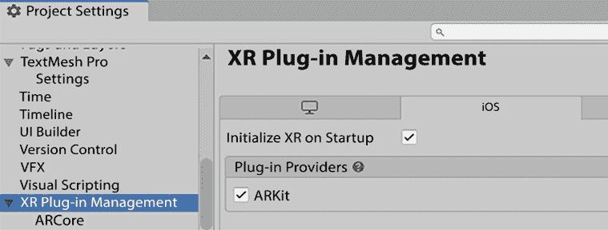

图 20.27：ARKit 插件已启用

1.  在 **构建设置** 窗口中点击 **构建** 按钮，创建一个构建文件夹，并等待构建完成。完成后，应打开一个包含生成文件的文件夹。

您会注意到构建过程的结果将是一个包含 XCode 项目的文件夹。Unity 无法直接创建构建，因此它生成一个您可以使用我们之前提到的 XCode 软件打开的项目。您需要遵循以下步骤使用本书中使用的 XCode 版本（13.4.1）创建构建：

1.  双击生成文件夹内的 `.xcodeproj` 文件：

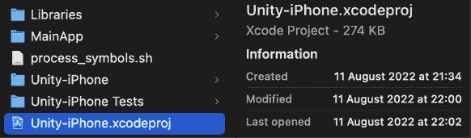

图 20.28：XCode 项目文件

1.  前往 **XCode | 首选项**。

1.  在 **账户** 选项卡中，点击窗口左下角的 **+** 按钮，并使用您注册为苹果开发者的苹果账户登录：

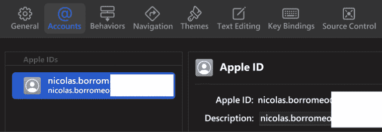

图 20.29：账户设置

1.  连接您的设备，并从窗口的左上角选择它，现在应该显示为 **任何 iOS 设备**。您可能需要首先解除设备的锁定，点击 **信任** 按钮，并等待 XCode 完成设置您的设备，以便在列表中看到您的设备：

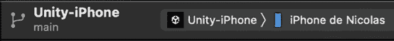

图 20.30：选择设备

1.  XCode 可能会要求您安装某些更新以支持您的设备；如果需要，请安装它们。

1.  在左侧面板中，点击文件夹图标，然后点击 **Unity-iPhone** 设置以显示项目设置。

1.  从**目标**列表中选择**Unity-iPhone**，然后点击**签名与能力**选项卡。

1.  选中**自动管理签名**，并在提示中点击**启用自动**按钮。

1.  在**团队**设置中，选择显示为**个人团队**的选项。

1.  如果您看到“**无法注册包标识符**”错误，只需更改**包标识符**设置为其它的一个，始终遵守格式（`com.XXXX.XXXX`），然后点击**重试**直到问题解决。

一旦找到一个可以工作的，将其设置在 Unity 中（在**玩家设置**下的**包标识符**）以避免在每次构建时都需要更改它：

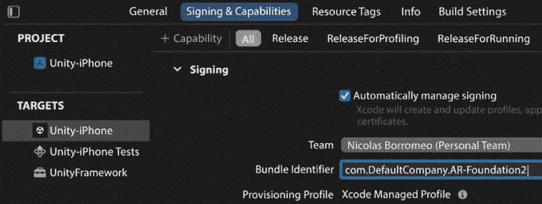

图 20.31：设置您的 iOS 项目

1.  点击窗口左上角的**播放**按钮，等待构建完成。在这个过程中，您可能需要输入密码几次，所以请这样做。

1.  当构建完成时，请记住解锁设备。会出现一个提示要求您这样做。请注意，除非您解锁手机，否则进程不会继续。如果失败，请点击**取消运行**并再次尝试，这次确保设备已解锁；请记住再次在列表中选择您的设备。此外，尝试使用最新的 XCode 以支持设备上安装的最新 iOS 版本。

1.  如果您看到一个**获取调试符号**提示，它永远不会结束，请重新启动您的设备。

1.  完成后，您可能会看到一个错误，表示应用无法启动，但它已经被安装。如果您尝试打开它，它将告诉您需要信任该应用的开发者，您可以通过访问设备的设置来完成此操作。

1.  从那里，转到**通用 | VPN 与设备管理**并选择列表中的第一个开发者。

1.  点击蓝色**信任…**按钮，然后**信任**。

1.  尝试再次打开应用。

1.  如果您在检测我们实例化播放器（我的情况是鹅卵石图像）的图像时遇到困难，请记得尝试另一张图像。这可能会因您的设备功能而大不相同。

在本节中，我们讨论了如何构建一个可以在 iOS 和 Android 上运行的 Unity 项目，从而允许我们创建移动应用——具体来说是 AR 移动应用。像任何构建一样，我们可以遵循一些方法来分析和调试，就像我们在查看 PC 构建时看到的那样，但在这里我们不会讨论这一点。现在我们已经创建了第一个测试项目，我们将通过添加一些机制来将其转换为真正的游戏。

# 创建一个简单的 AR 游戏

如我们之前讨论的，想法是创建一个简单的游戏，我们可以移动我们的玩家，同时移动一个现实生活中的图像，并且只需轻触我们想要它们出现的位置，例如墙壁、地板、桌子等，就可以放入一些敌人生成器。我们的玩家将自动射击最近的敌人，而敌人将直接射击玩家，因此我们唯一的任务就是移动玩家以避免子弹。我们将使用与本书主要项目中使用的脚本非常相似的脚本来实现这些游戏机制。

在本节中，我们将开发以下 AR 游戏功能：

+   生成玩家和敌人

+   编写玩家和敌人行为代码

首先，我们将讨论如何让我们的玩家和敌人出现在应用中，具体是在现实世界的位置，然后我们将让它们移动并互相射击以创建特定的游戏机制。让我们从**生成**开始。

## 生成玩家和敌人

为了实现我们的游戏玩法，我们首先需要生成可以与之交互的对象。让我们从玩家开始，因为那是最容易处理的一个：我们将创建一个 Prefab，其中包含我们想要玩家拥有的图形（在我的情况下，只是一个立方体），一个带有**是运动学**复选框的 `Rigidbody`（玩家将会移动），以及一个**AR 跟踪图像**脚本。我们将该 Prefab 设置为**XR 原点**对象中**AR 跟踪图像管理器**组件的**跟踪图像 Prefab**。这将使玩家出现在跟踪图像上。请记住，根据现实生活中的尺寸设置玩家的尺寸。在我的情况下，我将玩家缩放到 `0.05`、`0.05`、`0.05`。由于原始立方体的尺寸是 1 米，这意味着我的玩家将是 *5x5x5* 厘米。

你的**玩家**Prefab 应该看起来如下：

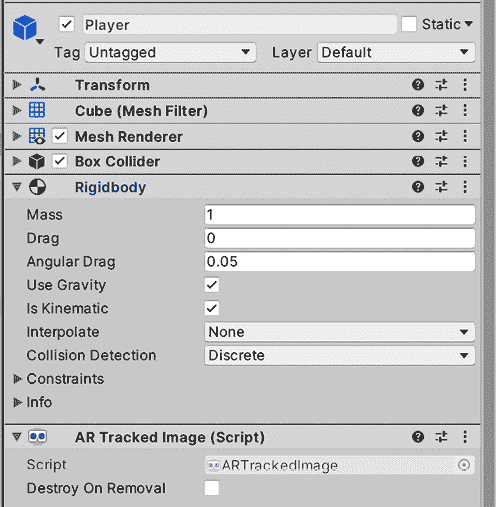

图 20.32：起始的“玩家”Prefab

敌人需要做更多的工作，如下所示：

1.  创建一个名为 `Spawner` 的 Prefab，其中包含你想要你的生成器拥有的图形（在我的情况下是一个圆柱体）及其现实生活尺寸（小尺寸）。

1.  添加一个每几秒生成一个 Prefab 的自定义脚本，例如以下截图所示。

1.  你会注意到使用 `Physics.IgnoreCollision` 来防止 `Spawner` GameObject 与生成的 GameObject 发生碰撞，获取两个物体的碰撞器，并将它们传递给函数。你也可以使用**层碰撞矩阵**来防止碰撞，就像我们在本书的主要项目中做的那样，如果你愿意的话：

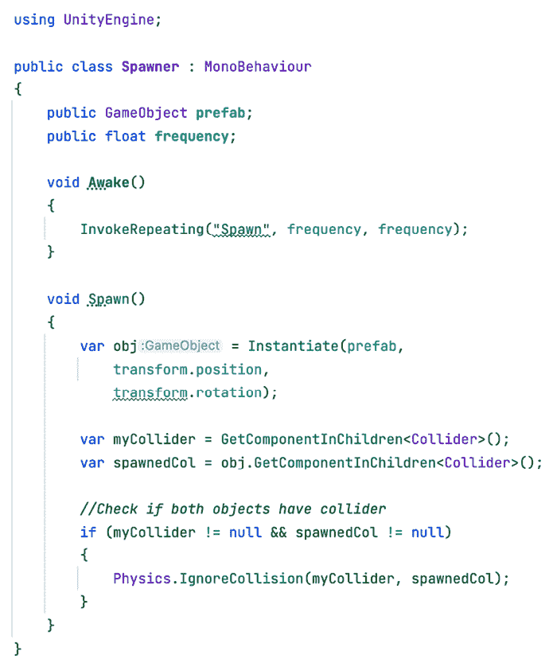

图 20.33：生成器脚本

1.  创建一个带有所需图形（在我的情况下是一个胶囊）和带有**是运动学**复选框的 `Rigidbody` 组件的**敌人**Prefab。这样，敌人将会移动，但不会使用物理。请记住考虑敌人的现实生活尺寸。

1.  设置 Spawner 的**Prefab**属性，以便它在期望的时间频率下生成我们的敌人：

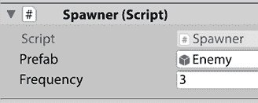

图 20.34：配置 Spawner

1.  在 XR Origin 对象中设置`SpawnerPlacer`的 Prefab，以便它生成我们之前创建的**Spawner**Prefab。

到此，第一部分就完成了。如果你现在测试游戏，你将能够点击应用中检测到的平面，并看到 Spawner 开始创建敌人。你还可以查看目标图像，并看到我们的立方体玩家出现。

现在我们已经在场景中有对象了，让我们让它们做一些更有趣的事情，从敌人开始。

## 编写玩家和敌人行为

为了射击玩家，敌人必须朝玩家移动，因此它需要访问玩家的位置。由于敌人是实例化的，我们无法将玩家引用拖动到 Prefab 中。然而，玩家也已经实例化了，因此我们可以向玩家添加一个使用`Singleton`模式（如我们在第八章*赢和输的条件*中所述）的`PlayerManager`脚本。

要做到这一点，请按照以下步骤操作：

1.  创建一个类似于以下截图中的`PlayerManager`脚本并将其添加到玩家中：

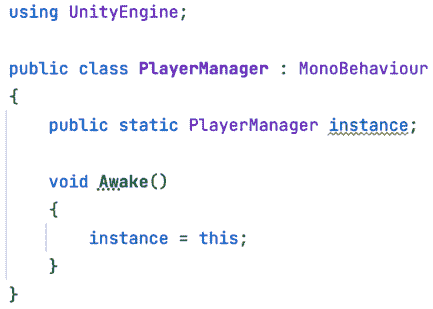

图 20.35：创建 PlayerManager 脚本

1.  现在敌人有了玩家的引用，让我们通过添加一个`LookAtPlayer`脚本，如图所示，让它们看向玩家：

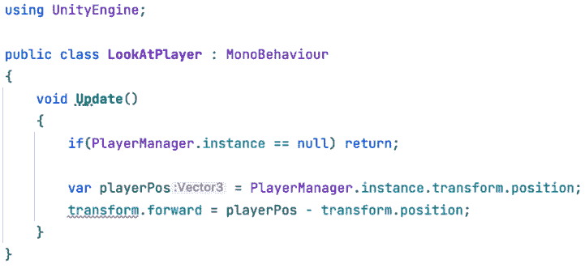

图 20.36：创建 LookAtPlayer 脚本

1.  此外，添加一个类似于以下截图中的简单`MoveForward`脚本，使**敌人**不仅看向玩家，而且朝他们移动。由于`LookAtPlayer`脚本使敌人面向玩家，因此沿着*Z*轴移动的脚本就足够了：

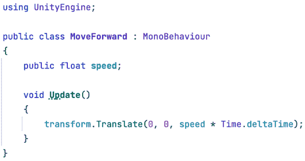

图 20.37：创建 MoveForward 脚本

现在，我们将处理玩家移动。记住，我们的玩家是通过移动图像来控制的，因此在这里，我们实际上是在指旋转，因为玩家需要自动朝向最近的敌人看和射击。为此，请按照以下步骤操作：

1.  创建一个`Enemy`脚本并将其添加到**Enemy**Prefab 中。

1.  创建一个类似于以下截图中的`EnemyManager`脚本并将其添加到场景中的空`EnemyManager`对象中：

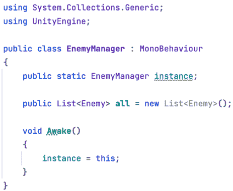

图 20.38：创建 EnemyManager 脚本

1.  在`Enemy`脚本中，确保将对象注册到`EnemyManager`的**all**列表中，就像我们在本书的主要项目中使用`WavesManager`时那样：

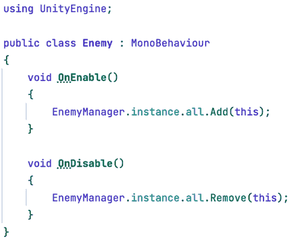

图 20.39：创建 Enemy 脚本

1.  创建一个类似于以下截图中的`LookAtNearestEnemy`脚本并将其添加到**Player**Prefab 中，使它看向最近的敌人：

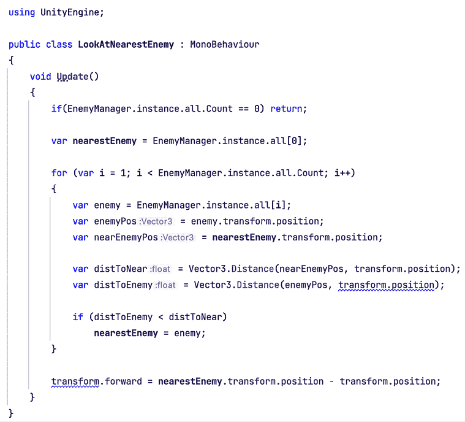

图 20.40：看向最近的敌人

现在我们物体按预期旋转和移动，唯一缺少的是射击和造成伤害：

1.  创建一个类似于以下截图所示的 `Life` 脚本，并将其添加到 **Player** 和 **Enemy** 组件中。请记住设置生命值字段的数量。你将看到这个版本的 `Life`，而不是需要每帧检查生命值是否达到零。我们创建了一个 `Damage` 函数来检查是否造成了伤害（`Damage` 函数被执行），但本书项目的另一个版本也有效：

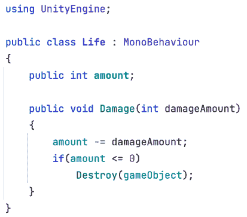

图 20.41：创建生命组件

1.  创建一个具有所需图形的 `Bullet` 预制件，将碰撞器的 **Is Trigger** 复选框勾选，添加一个带有 **Is Kinematic** 勾选的 `Rigidbody` 组件（一个运动学触发碰撞器），以及适当的真实尺寸。

1.  将 `MoveForward` 脚本添加到 **Bullet** 预制件中，使其能够移动。请记住设置速度。

1.  将 `Spawner` 脚本添加到 **Player** 和 **Enemy** 组件中，并将 **Bullet** 预制件设置为要实例化的预制件，以及所需的生成频率。

1.  将类似于以下截图所示的 `Damager` 脚本添加到 **Bullet** 预制件中，使子弹对其接触的物体造成伤害。请记住设置伤害值：

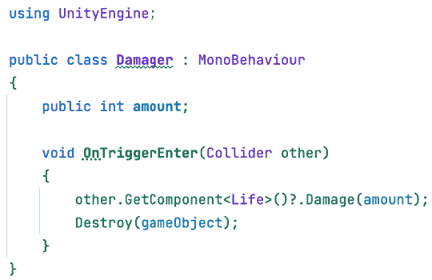

图 20.42：创建伤害脚本 – 第一部分

1.  将类似于以下截图所示的 `AutoDestroy` 脚本添加到 **Bullet** 预制件中，使其在一段时间后消失。请记住设置销毁时间：

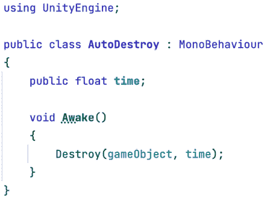

图 20.43：创建伤害脚本 – 第二部分

和此同时！正如你所见，我们基本上使用与主游戏几乎相同的脚本创建了一个新游戏，主要是因为我们设计它们时要通用（而且游戏类型几乎相同）。当然，这个项目可以有很多改进，但我们有一个很好的基础项目来创建令人惊叹的 AR 应用。

# 摘要

在本章中，我们介绍了 AR Foundation Unity 框架，探讨了如何设置它，以及如何实现几个跟踪功能，以便我们可以在真实生活物体上定位虚拟物体。我们还讨论了如何构建我们的项目，使其能够在 iOS 和 Android 平台上运行，这是我们在撰写本文时测试 AR 应用的唯一方式。最后，我们基于主项目中创建的游戏创建了一个简单的 AR 游戏，但对其进行了修改，使其适合在 AR 场景中使用。

通过这些新知识，你将能够开始你的 AR 应用开发者之路，通过检测真实物体的位置，创建将虚拟物体添加到真实物体上的应用。这可以应用于游戏、培训应用和模拟。你甚至可能找到新的应用领域，所以利用这项新技术及其新可能性吧！

好的，这就是通过 Unity 2022 的旅程的终点了。我真的很高兴你在书中达到了这个阶段。我希望这些知识能帮助你利用市场上最灵活和强大的工具之一：Unity，来提升或开始你的游戏开发生涯。我希望有一天能看到你的作品！路上见！
