# 第四章：无缝集成：导入和集成资源

在上一章中，我们创建了我们级别的原型。现在，让我们假设我们已经编写了游戏并进行了测试，确认游戏想法很有趣。有了这个，现在是时候用真正的完成的艺术来替换原型艺术了。我们将在下一章，*第五章*，*释放 C#和视觉脚本的力量*中实际编写游戏，但为了学习目的，让我们现在先跳过这部分。为了使用最终资源，我们需要学习如何获取它们（图像、3D 模型等），如何将它们导入 Unity，以及如何将它们集成到我们的场景中。

在本章中，我们将探讨以下主题：

+   导入资源

+   集成资源

+   配置资源

让我们先学习如何在 Unity 中获取资源，例如 3D 模型和纹理。

# 导入资源

我们可以在项目中使用不同来源的资源。我们可以简单地从我们的艺术家那里接收文件，从不同的免费和付费资源网站上下载，或者使用**资源商店**，这是 Unity 的官方资源虚拟商店，在那里我们可以获取免费和付费的资源，这些资源可以直接用于 Unity。我们将使用从互联网和资源商店下载资源的混合方式，以便使用所有可能资源。

在本节中，我们将介绍与导入资源相关的以下概念：

+   从互联网导入资源

+   从资源商店导入资源

+   从 Unity 包中导入资源

让我们先探索第一个资源来源，互联网。

## 从互联网导入资源

在获取项目中的艺术资源方面，让我们从我们的地形纹理开始。记住，我们的地形被涂上了网格图案，所以想法是用草地、泥、岩石和其他类型的纹理来替换它。为了做到这一点，我们需要图像。在这种情况下，这类图像通常是不同地形图案的俯视图，并且它们有“可拼接”的要求，这意味着你可以重复它们，而不会在它们的连接处出现明显的图案。你可以在以下图像中看到这个例子：

图 4.1：左 - 草地；右 - 分割后的同一草地，以突出纹理拼接

左边的草地看起来像是一张单独的大图像，但如果你仔细观察，你应该能够看到一些图案在重复。在这种情况下，这种草地只是单个图像在网格中重复了四次，就像右边的那样。这样，你可以通过重复单个小图像来覆盖大面积，从而在用户的计算机上节省大量的 RAM。

策略是获取这些类型的图像来绘制我们的地形。你可以从几个地方获取它们，但最简单的方法是使用*Google 图片*或任何图像搜索引擎。在使用这些来源的任何内容之前，请始终检查版权许可。在搜索纹理时使用关键词“PATTERN 无缝平铺纹理”，用你正在寻找的地形类型替换“PATTERN”，例如“草地无缝平铺纹理”或“泥土无缝平铺纹理”。在这种情况下，我输入了“草地无缝平铺纹理”。一旦你下载了图像，你可以通过几种方式将其添加到你的项目中。最简单的一种方法是执行以下操作：

1.  使用文件资源管理器（Mac 上的 Finder）定位你的图像。

1.  在 Unity 的**项目**窗口中定位或创建`纹理`文件夹。

1.  将文件资源管理器和 Unity 项目窗口并排放置。

1.  将文件从文件资源管理器拖到 Unity 项目窗口中的`纹理`文件夹：

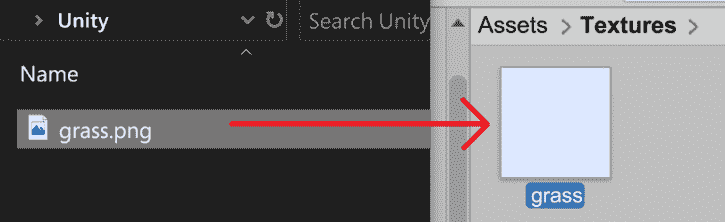

图 4.2：从 Windows 文件资源管理器拖动纹理到 Unity 的项目视图

对于像前图中的简单纹理，任何搜索引擎都可以有所帮助，但如果你想要用详细的墙壁和门替换玩家的基础几何形状，或者在场景中放置敌人，你需要获取 3D 模型。如果你在搜索引擎中使用诸如“免费僵尸 3D 模型”等关键词搜索，你会找到无数免费和付费的 3D 模型网站，如 TurboSquid 和 Mixamo，但那些网站可能会有问题，因为那些网格通常没有为在 Unity 中使用或甚至用于游戏而准备。你会发现具有非常高的多边形计数、不正确的尺寸或方向、未优化的纹理等问题的模型。为了避免这些问题，我们希望使用更好的来源，在这种情况下，我们将使用 Unity 的资产商店，让我们来探索它。

## 从资产商店导入资产

资产商店是 Unity 的官方资产市场，在这里你可以找到大量的模型、纹理、声音，甚至完整的 Unity 插件来扩展引擎的功能。在这种情况下，我们将限制自己下载 3D 模型以替换玩家的基础原型。你将想要获取具有模块化设计的 3D 模型，这意味着你将得到几块部件，例如墙壁、地板、角落等。你可以将它们连接起来创建任何类型的场景。

为了做到这一点，你必须遵循以下步骤：

1.  在 Unity 中点击**窗口 | 资产商店**，这将打开你的网络浏览器到网站[`assetstore.unity.com`](https://assetstore.unity.com)。在 Unity 的早期版本中，你可以在编辑器内直接看到资产商店，但现在，必须在一个常规网络浏览器中打开它，所以点击**在线搜索**按钮，这将在你首选的浏览器中打开网站[`assetstore.unity.com/`](https://assetstore.unity.com/)。此外，你可以检查**从菜单始终在浏览器中打开**，以便在点击**窗口 | 资产商店**时直接打开页面：

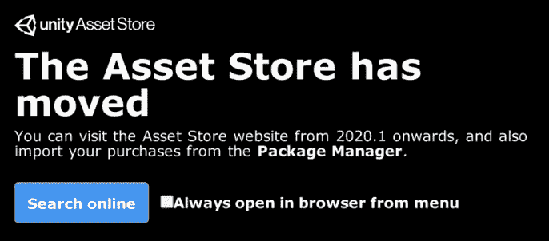

图 4.3：资产商店移动消息

1.  在顶部菜单中，点击**3D**类别来浏览 3D 资产：

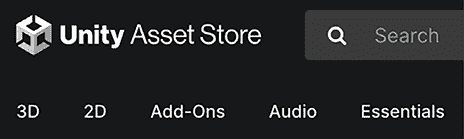

图 4.4：3D 资产菜单

1.  在最近打开的页面上，点击右侧**所有类别**面板中**3D**类别右侧的箭头，然后打开**环境**并勾选**科幻**框，因为我们将会制作一个未来主题的游戏：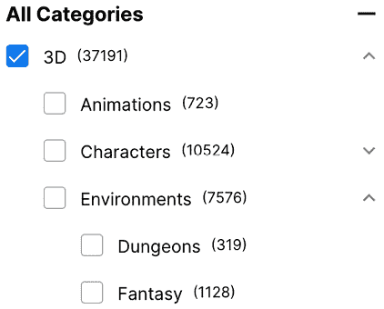

    图 4.5：3D 资产菜单

    如你所见，有几个类别用于查找不同类型的资产，如果你想的话，可以挑选另一个。在**环境**类别中，你可以找到可用于为你的游戏生成场景的 3D 模型。

1.  如果需要，你可以为资产付费，但现在让我们先隐藏付费的资产。你可以通过在右侧的**定价**下拉菜单中勾选**免费资产**复选框来实现：

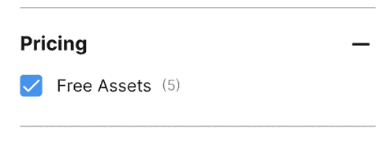

图 4.6：免费资产选项

1.  在搜索区域，找到任何看起来具有你想要的审美的资产并点击它。记得要留意户外资产，因为大多数环境包通常只包含室内场景。在我的例子中，我选择了一个名为**科幻风格模块化包**的资产，它既包含室内也包含室外。请注意，当你阅读这篇文档时，这个包可能已经不存在了，所以你可能需要选择另一个。如果你找不到合适的包，你可以从 GitHub 仓库[`github.com/PacktPublishing/Hands-On-Unity-2023-Game-Development-Fourth-Edition`](https://github.com/PacktPublishing/Hands-On-Unity-2023-Game-Development-Fourth-Edition)下载并选择我们使用的资产文件。

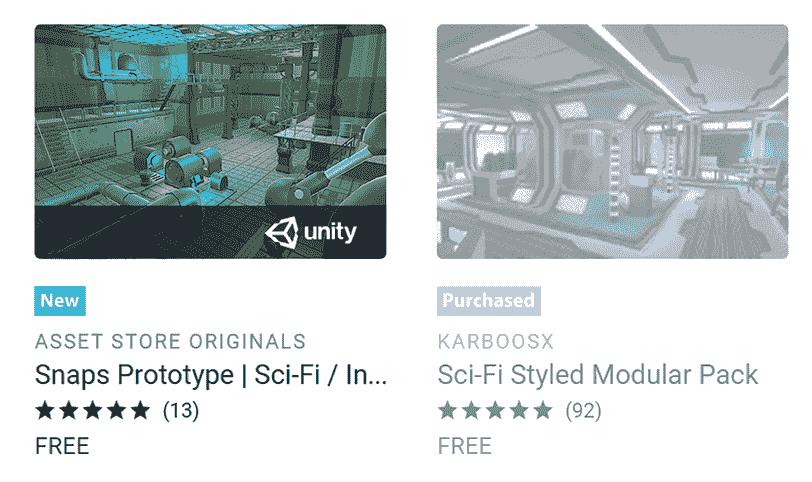

图 4.7：资产商店搜索包的预览

1.  现在，你将在**资产商店**窗口中看到包的详细信息。在这里，你可以找到有关包的描述、视频/图片、包的内容，以及最重要的部分——评论，你可以看到这个包是否值得购买：

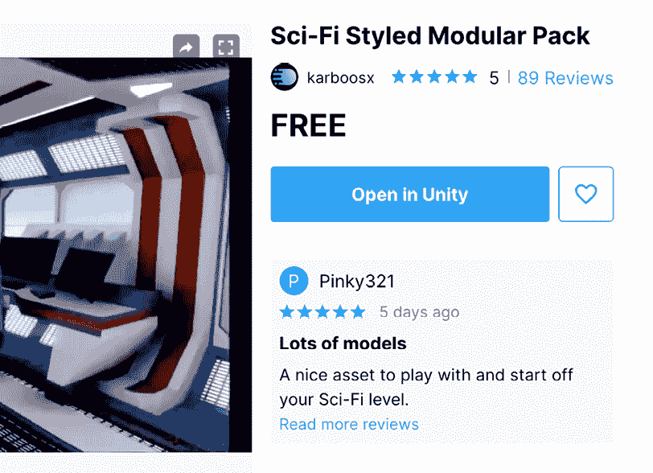

图 4.8：资产商店包详细信息

1.  如果您对这个包没有异议，请点击**添加到我的资产**按钮，如果需要，请登录 Unity，然后点击**在 Unity 中打开**按钮。您可能会被提示接受浏览器打开 Unity；如果是这样，只需接受即可：

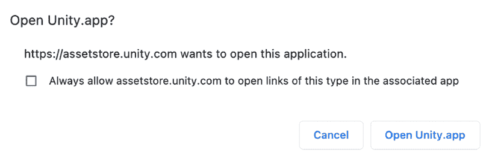

图 4.9：切换应用

1.  这将再次打开**包管理器**，但这次是在**我的资产**模式下，您应该能看到您从资产商店下载的所有资产的列表，以及您刚刚在列表中选择的资产：

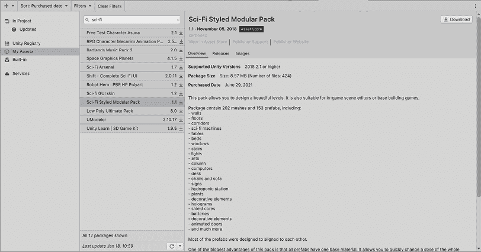

图 4.10：包管理器显示资源

1.  点击窗口右下角的**下载**，等待其完成。然后点击**导入**。

1.  一段时间后，包内容窗口将显示出来，允许您选择项目中需要哪些包资源。现在，保持原样并点击**导入**：

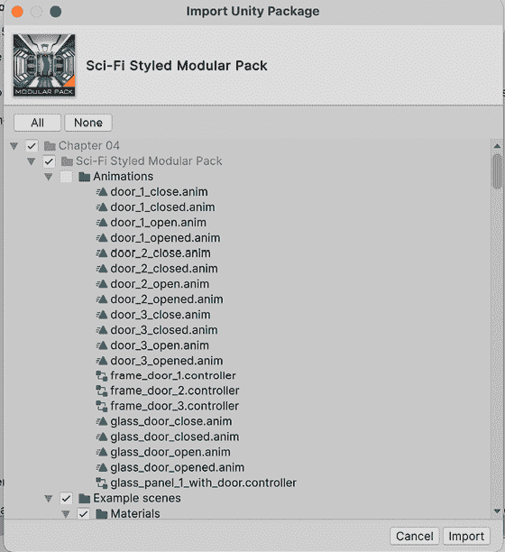

图 4.11：导入资源选择

在导入一段时间后，您将在**项目**窗口中看到所有包文件。

拥有像资产商店这样的工具确实非常有帮助。当我在其他引擎或不太知名的游戏开发框架上工作时，获取游戏内容是一个挑战。有大量的页面可以获取 3D 模型和纹理，但它们并不总是针对视频游戏进行优化，甚至可能不与 Unity 兼容。当然，如果资产商店没有您需要的资源，知道如何处理也是一个很好的技能，所以我建议您也探索其他可能的资产来源，并看看您将面临哪些挑战。

请注意，导入大量完整包会增加您项目的大小，并且之后您可能希望删除未使用的资产。此外，如果您导入的资产生成了阻止您播放场景的错误，只需删除包中附带的所有`.cs`文件。它们通常在名为`Scripts`的文件夹中。这些是可能与您的 Unity 版本不兼容的代码文件：

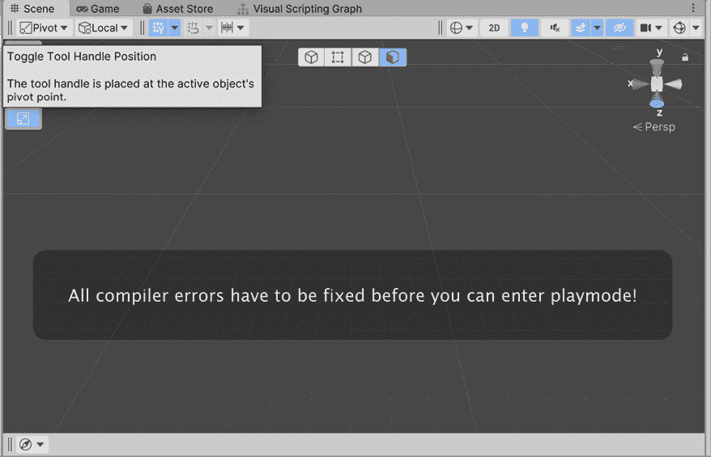

图 4.12：播放时出现的代码错误警告

在继续本章之前，尝试使用资产商店下载一个角色 3D 模型，按照之前的步骤操作。为了做到这一点，您必须完成与我们之前使用的关卡环境包相同的步骤，但在资产商店的**3D | 角色 | 人形**类别中查找。在我的情况下，我选择了**机器人英雄：PBR HP Polyart**包：

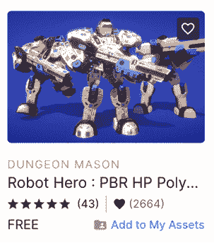

图 4.13：我们游戏中使用的角色包

现在，让我们探索 Unity 资产的另一个来源：**Unity 包**。

## 从 Unity 包中导入资产

资产商店并非资产包的唯一来源；您可以从互联网上获取`.unitypackage`文件，或者可能从想要与您共享资产的同事那里获取。

如果你想创建自己的资产包以便与其他开发者共享资产，请查看[`docs.unity3d.com/Manual/AssetPackagesCreate.html`](https://docs.unity3d.com/Manual/AssetPackagesCreate.html)上的文档。

为了导入`.unitypackage`文件，您需要执行以下操作：

1.  前往**资产 | 导入包 | 自定义包...**选项：

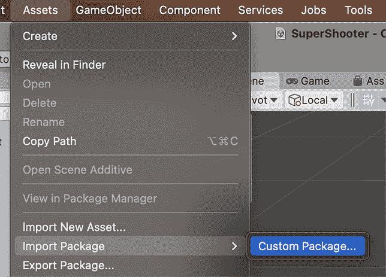

图 4.14：导入自定义包

1.  在显示的对话框中搜索`.unitypackage`文件。

1.  在出现的**导入** **Unity 包**窗口中点击**导入**选项——我们在*从资产商店导入资产*部分看到的那个。

现在我们已经导入了很多艺术资产，让我们学习如何在场景中使用它们。

# 集成资产

我们刚刚导入了很多可以以多种方式使用的文件，所以本节的想法是看看 Unity 如何将这些资产与需要它们的 GameObject 和组件集成。

在本节中，我们将介绍与导入资产相关的以下概念：

+   集成地形纹理

+   集成网格

+   集成材质

让我们先使用可平铺的纹理来覆盖地形。

## 集成地形纹理

为了将纹理应用到我们的地形上，请执行以下操作：

1.  选择**地形**对象。

1.  在**检查器**中，点击**地形**组件的画笔图标（第二个按钮）。

1.  从下拉菜单中选择**绘制纹理**：

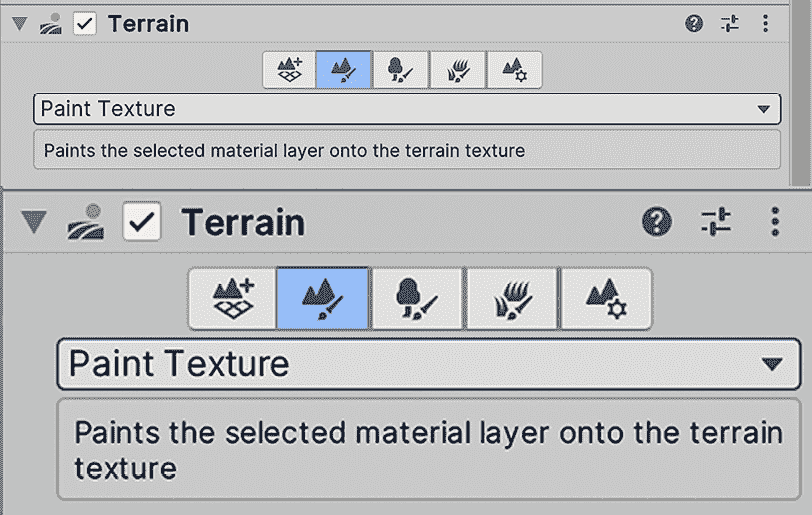

图 4.15：地形绘制纹理选项

1.  点击**编辑地形层…** | **创建层**选项。

1.  在出现的纹理选择器窗口中找到并双击之前下载的地形纹理：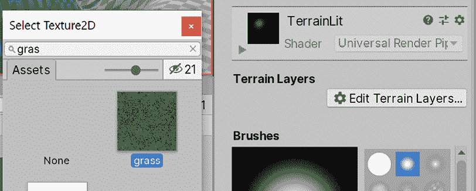

    图 4.16：纹理选择器窗口

    您将看到纹理将立即应用到整个地形的上。

1.  重复*步骤 4*和*步骤 5*以添加其他纹理。这次，您将看到该纹理不会立即应用。

1.  在**地形层**部分，选择您创建的新纹理以开始使用它进行绘制。我使用的是泥地纹理。

1.  就像编辑地形时一样，在**画笔**部分，您可以选择并配置一个画笔来绘制地形。

1.  在**场景**视图中，绘制你想应用该纹理的区域。

1.  如果你的纹理图案过于明显，请打开**新层 N**部分，位于**笔刷**部分的顶部，其中*N*是一个取决于你创建的层的数字。每次你将纹理添加到地形中，你都会在**项目**视图中看到创建了一个名为**新层 N**的新资产。它包含有关你创建的地形层的数据，如果你需要，可以在其他地形中使用它。你还可以重命名该资产以赋予它一个有意义的名称，或者为了组织目的将这些资产重新组织到它们自己的文件夹中。

1.  使用左侧的三角形打开该部分，并在**平铺设置**部分中增加**大小**属性，直到找到一个图案不明显合适的尺寸：

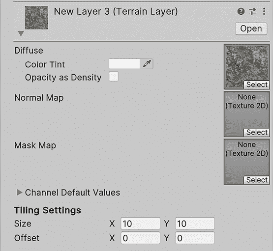

图 4.17：绘制纹理选项

1.  重复步骤**4**到**11**，直到你将想要添加到地形中的所有纹理都应用完毕。在我的例子中，我已经将泥地纹理应用到河盆地，并为山丘使用了岩石纹理。对于岩石纹理，我降低了笔刷的不透明度属性，以便更好地与山脉中的草地混合。你可以尝试在顶部添加一层雪，只为增添乐趣：

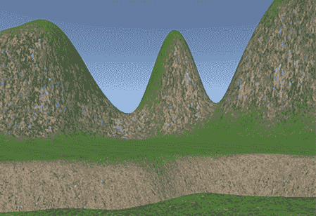

图 4.18：使用三种不同纹理绘制地形的结果

当然，我们可以使用系统的几个高级工具显著提高这一点，但现在让我们保持简单。接下来，让我们看看我们如何将 3D 模型集成到我们的游戏中。

## 集成网格

如果你选择我们之前下载的 3D 资产之一并点击其右侧的箭头，**项目**窗口中会出现一个或多个子资产。这意味着我们从资产商店（FBX 文件）下载的 3D 模型文件是包含定义 3D 模型的资产的容器：

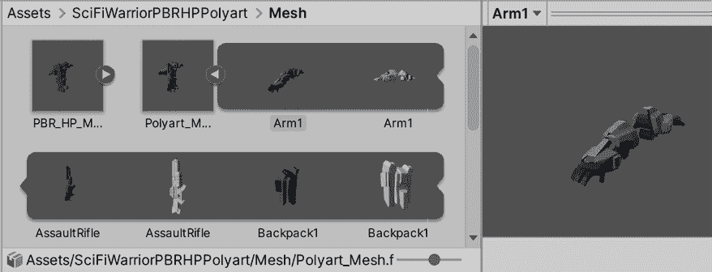

图 4.19：网格选择器

其中一些子资产是网格，它们是一系列定义你的模型几何形状的三角形。你可以在文件中至少找到一个这样的网格子资产，但你也可以找到几个，这可能会发生如果你的模型由很多部分组成。例如，一辆车可以是一个单一的刚性网格，但这不会让你旋转它的车轮或打开它的车门；它将只是一个静态的车，如果车只是场景中的一个道具，这可能就足够了，但如果玩家将能够控制它，你可能需要对其进行修改。想法是，你的汽车的所有部分都是不同的 GameObject，彼此作为父对象，这样如果你移动一个，所有这些都会移动，但你仍然可以独立旋转它的部分。

当你将 3D 模型文件拖到场景中（不是子资产）时，Unity 将自动为每一部分及其适当的父级创建所有对象。你可以在层次结构中选择对象并探索其所有子对象以查看这一点：

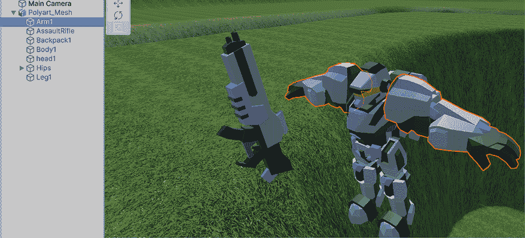

图 4.20：子对象选择

此外，你会发现每个对象可能都有自己的`Mesh Filter`和`Mesh Renderer`组件，每个组件仅渲染模型的那一部分。记住，`Mesh Filter`是一个具有对要渲染的网格资产的引用的组件，因此`Mesh Filter`是使用我们之前讨论过的那些网格子资产的那个组件。在动画角色的案例中，你会找到`Skinned Mesh Renderer`组件，但我们将稍后在*第三部分*，*提升视觉效果、效果和音频*中讨论该组件。

现在，当你将 3D 模型文件拖入场景时，你会得到一个类似于模型是预制件并且你在实例化的结果，但 3D 模型文件比预制件更有限，因为你不能对模型应用更改。如果你已经将对象拖到场景中并编辑它以具有你想要的行为，我建议你创建一个预制件以获得我们在*第二章*，*构建场景和游戏元素*中讨论的所有好处，例如将更改应用于预制件的全部实例等等。永远不要从模型文件创建大量模型的实例——始终从基于该文件创建的预制件创建它们，以便你可以向其添加额外的行为。

这是 3D 网格的基本用法。现在，让我们探索纹理集成过程，这将使我们的 3D 模型更加详细。

## 集成纹理

可能你的模型已经应用了纹理，但整个模型都应用了洋红色。如果是这种情况，这意味着资产没有准备好与你在创建项目时选择的**通用渲染管线**（**URP**）模板一起工作。

资产商店中的一些资产是由第三方编辑器创建的，可能旨在用于 Unity 的旧版本：

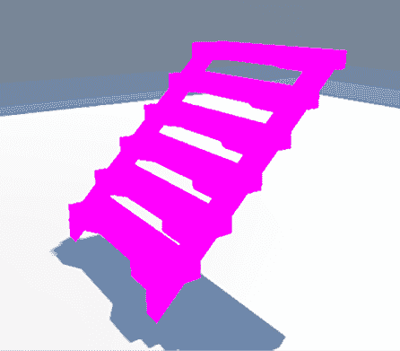

图 4.21：使用错误材质或根本没有材质渲染的网格

修复洋红色资产的一个选项是使用**渲染管线转换器**，这是一个工具，它将找到它们并将它们（如果可能）重新配置以与 URP 一起工作。为此，每次导入看起来像洋红色的资产时，都要执行以下步骤：

1.  前往**窗口 | 渲染 | 渲染管线转换器**。

1.  从下拉菜单中选择**内置到 URP**选项：

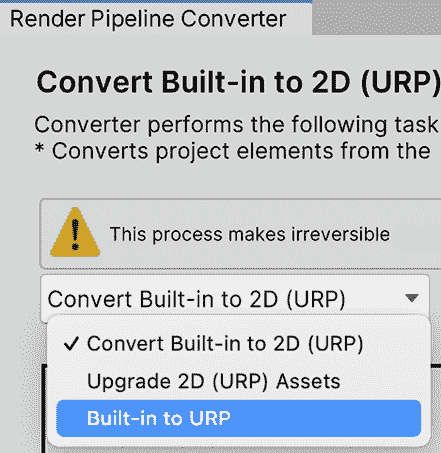

图 4.22：将旧资产升级到 URP

1.  滚动直到你看到**材质升级**复选框并勾选它。

1.  在左下角点击**初始化转换器**按钮。这将显示所有需要升级的材料列表。我们稍后会更多地讨论材料：

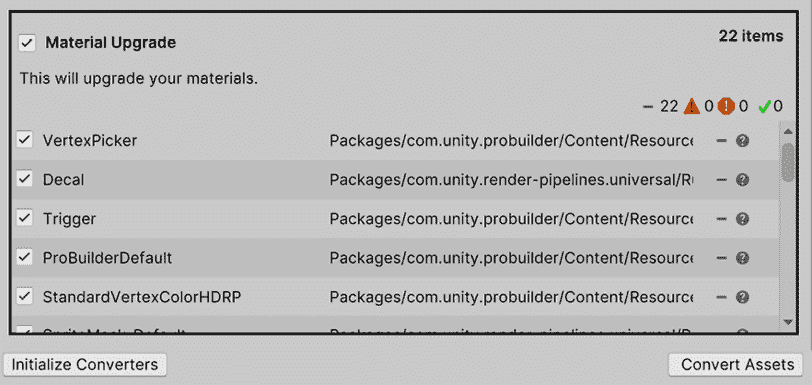

图 4.23：修复材料以与 URP 一起工作

1.  点击**转换资产**按钮，查看模型是否已修复。

您需要关闭窗口以便检测之前打开时未存在的新的洋红色资产。这种方法的一个缺点是，有时它不会正确升级材料。幸运的是，我们可以通过手动重新应用物体的纹理来修复这个问题。即使您的资产工作得很好，我也建议您无论如何都重新应用您的纹理，这样您可以更多地了解材料的概念。

纹理不是直接应用到物体上的。这是因为纹理只是控制模型外观的所有配置中的一个。为了改变模型的外观，您必须创建一个**材料**。材料是一个独立的资产，其中包含大量关于 Unity 如何渲染您的对象的设置。您可以将该资产应用到具有相同图形设置的多个对象上，如果您更改材料的设置，它将影响所有使用它的对象。它就像一个图形配置文件。

为了创建一个应用物体纹理的材料，您需要遵循以下步骤：

1.  在**项目**窗口中，点击窗口左上角的加号（**+**）按钮。

1.  在该菜单中点击**材料**选项。

1.  为您的材料命名。这通常是我们要应用材料的资产名称（例如，`Car`、`Ship`、`Character`等等）。

1.  将创建的材料拖动到场景中的模型实例上。如果您在拖动资产的同时移动鼠标，您将能够看到该材料应用后的预览，对于新材料来说将是白色。我们将在以下步骤中更改这一点。

1.  通过释放鼠标来应用材料。

1.  如果您的物体有多个部分，您需要将材料拖动到每个部分。拖动材料将改变您拖动的物体的`MeshRenderer`组件的材料属性。

1.  选择材料并点击**基础图**属性左侧的圆圈（见*图 4.23*）。

1.  在**纹理选择器**中，点击您模型的纹理。仅通过观察可能很难找到纹理。通常，纹理的名称将与模型名称匹配。如果不匹配，您需要尝试不同的纹理，直到找到适合您物体的纹理。此外，您可能会发现几个与您的模型名称相同的纹理。只需选择看起来颜色合适的纹理，而不是那些看起来是黑白或浅蓝色的纹理；我们稍后会使用那些：

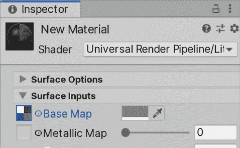

图 4.24：URP 材质的基础图属性

通过这种方式，您已经成功通过材质将纹理应用到对象上。对于使用相同纹理的每个对象，只需拖动相同的材质即可。

材质有一个类似于预制件变体的概念，称为材质变体。它包含创建一个基础材质，然后通过对其进行微小修改来创建其替代版本的想法。有关更多信息，请参阅以下文档：[`docs.unity3d.com/2022.2/Documentation/Manual/materialvariant-landingpage.html`](https://docs.unity3d.com/2022.2/Documentation/Manual/materialvariant-landingpage.html)，以及以下博客文章：[`blog.unity.com/engine-platform/material-variants-the-solution-for-managing-complex-material-libraries`](https://blog.unity.com/engine-platform/material-variants-the-solution-for-managing-complex-material-libraries)。

现在我们已经对如何应用模型纹理有了基本的了解，让我们学习如何在将模型散布到场景之前正确配置导入设置。

# 配置资产

如我们之前提到的，艺术家习惯于在 Unity 之外创建艺术资产，这可能会导致从该工具看到的资产与 Unity 导入的资产之间存在差异。例如，3D Studio Max 可以在厘米、英寸等长度单位下工作，而 Unity 使用米作为单位。我们刚刚下载并使用了大量资产，但跳过了配置步骤以解决这些差异，现在让我们来看看这个问题。

在本节中，我们将介绍与导入资产相关的以下概念：

+   配置网格

+   配置纹理

让我们先讨论如何配置 3D 网格。

## 配置网格

为了更改模型的导入设置，您需要定位您下载的模型文件。包含 3D 模型的文件扩展名有多种，其中最常见的是`.fbx`文件，但您可能会遇到其他格式，如`.obj`、`.3ds`、`.blender`、`.mb`等。您可以通过文件的扩展名来识别文件是否为 3D 网格：

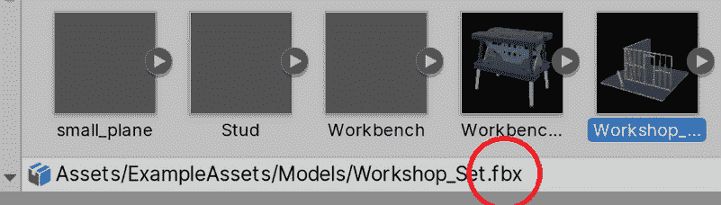

图 4.25：所选资产路径扩展

此外，您还可以单击资产，并在**检查器**中查看以下截图所示的选项卡：

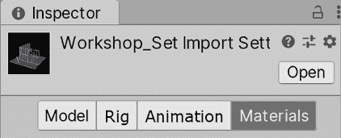

图 4.26：网格材质设置

现在你已经找到了 3D 网格文件，你可以正确地配置它们。目前，我们唯一需要考虑的是模型的适当比例。艺术家们习惯于使用不同软件和不同设置进行工作；也许一位艺术家使用米作为其度量单位创建了模型，而其他艺术家则使用了英寸、英尺等等。当导入使用不同单位创建的资产时，它们可能会不成比例，这意味着我们可能会得到人类比建筑物更大的结果等等。

最佳解决方案是直接要求艺术家进行修复。如果所有资产都是你公司创作的，或者如果你使用了外部资产，你可以要求艺术家按照你公司的标准进行修复，但你现在可能是一个自学 Unity 的单个开发者。幸运的是，Unity 有一个设置允许你在 Unity 中使用之前重新调整原始资产的比例。为了改变对象的**缩放因子**，你必须执行以下操作：

1.  在你的项目窗口中定位 3D 网格。

1.  将其拖动到场景中。你会看到你的场景中会出现一个对象。

1.  使用**GameObject | 3D Object | Capsule 选项**创建一个胶囊。

1.  将胶囊放在你拖入编辑器的模型旁边。看看这个比例是否合理。想法是胶囊代表一个人类（2 米高），这样你就有了一个比例的参考：

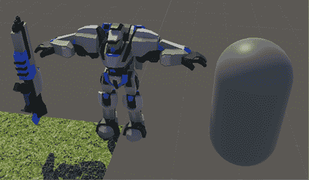

图 4.27：使用胶囊作为参考来调整比例

1.  如果模型比预期的大或小，请在**项目**窗口中再次选择网格（而不是你拖到编辑器中的 GameObject 实例）并你将在**检查器**中看到一些导入设置。在图片中，我们可以看到模型有一个良好的相对尺寸，但仅为了学习目的，我建议继续进行下一步。

1.  查找**缩放因子**属性并修改它，如果你的模型比预期的小，则增加它；如果相反，则减少它：

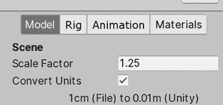

图 4.28：模型网格选项

1.  点击**检查器**底部的**应用**按钮。

1.  重复*步骤 6*和*步骤 7*，直到你得到期望的结果。

有许多其他选项可以配置，但现在我们先到此为止。接下来，让我们讨论如何正确配置我们模型的纹理。

## 配置纹理

再次，这里有许多设置可以配置，但让我们现在先关注**纹理大小**。想法是使用最适合该纹理大小的尺寸，这取决于许多因素。

需要考虑的第一个因素是对象与相机之间的距离。如果你正在创建第一人称游戏，你可能会遇到很多近距离的对象——足够多，可以证明使用大纹理的合理性。然而，如果你有几个远距离的对象，比如建筑物顶部的广告牌，你永远不会足够近以看到细节，你可以为这些对象使用较小的纹理。

另一个需要考虑的因素是对象的重要性。如果你正在创建赛车游戏，你可能会有很多 3D 模型将在屏幕上显示几秒钟，玩家永远不会关注它们；他们会关注道路和其他车辆。在这种情况下，例如，街道上的垃圾桶可能只有很少的纹理和低多边形模型，用户永远不会注意到（除非他们停下来欣赏风景），但这是可以接受的。

最后，你可以玩一个俯视视角的游戏，它永远不会放大场景，所以在这里，与第一人称游戏中具有大纹理的相同对象将具有更少的纹理细节。在以下图像中，你可以看到较小的飞船可以使用较小的纹理：

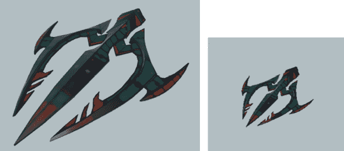

图 4.29：从不同距离看到的相同模型

纹理的理想尺寸是相对的。确定正确尺寸的常用方法是改变尺寸，直到你找到在游戏中从最近的位置看到对象时，可以展示良好质量的可能最小尺寸。这是一个试错方法，你可以做以下操作：

1.  定位 3D 模型并将其放入场景中。

1.  将**场景视图**相机放置在可以显示对象在游戏中可能最大尺寸的位置。例如，在一个**第一人称射击**（**FPS**）游戏中，相机可以几乎紧挨着对象，而在俯视游戏中，它会在对象上方几米处。再次强调，这取决于你的游戏。记住，我们的游戏是第三人称射击游戏。

1.  在与包一起导入的文件夹中或从你之前创建的材料中找到并选择对象使用的纹理。它们通常具有`.png`、`.jpg`或`.tif`扩展名。

1.  在检查器中查看**最大尺寸**属性并减小它，尝试下一个更小的值。例如，如果纹理是**2048**，尝试**1024**。

1.  点击**应用**并检查**场景视图**，看看质量是否大幅下降，或者变化是否不明显。你会感到惊讶。

1.  重复*步骤 4*到*步骤 5*，直到你得到一个质量较差的结果。一旦你做到了，只需提高之前的分辨率以获得可接受的质量。当然，如果你针对的是 PC 游戏，你可以期望比移动游戏更高的分辨率。

现在你已经导入、集成和配置了你的对象，让我们使用这些资产创建玩家的基地。

## 组装场景

让我们开始使用我们下载的环境包替换我们的原型基础。为此，您必须执行以下操作：

1.  在我们之前导入的**环境**包中，找到包含场景中不同部件所有模型的文件夹，并尝试找到一个角落。您可以在**项目**窗口中的搜索栏中搜索`角落`关键词：

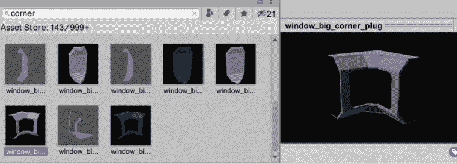

图 4.30：网格选择器

1.  在我的具体情况下，角落的外侧和内侧是分开的模型，所以我需要将它们组合在一起。

1.  将其放置在原型基础任何角落相同的位置：

图 4.31：在占位符上定位网格以替换

1.  找到与该角落连接以创建墙壁的正确模型。同样，您可以在**项目**窗口中尝试搜索`墙壁`关键词。

1.  实例化它，并将其定位以便与角落连接。如果它没有完美地匹配，不要担心；您将在必要时返回场景。

    您可以选择一个对象并按*V*键选择所选对象的顶点。然后您可以拖动它，点击变换工具中部的矩形，并将其指向另一个对象的顶点。这被称为**顶点吸附**。它允许您将场景中的两个部件精确地连接起来。

    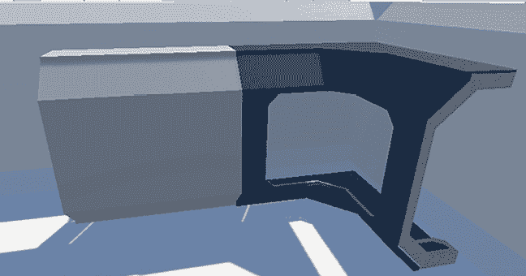

    图 4.32：连接两个模块

1.  重复墙壁，直到到达玩家基地的另一端，并放置另一个角落。您可能会得到比原始原型略大或略小的墙壁，但这没关系：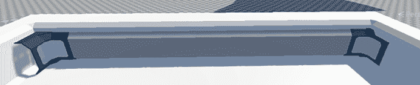

    图 4.33：连接的模块链

    您可以在按*Ctrl*键（在 Mac 上为*Command*）的同时移动对象，以便将对象的定位吸附到顶点，以便可以轻松地找到墙壁的克隆体。另一个选项是在**检查器**中手动设置**变换**组件的**位置**属性。

1.  完成剩余的墙壁，并销毁在 ProBuilder 中制作的原型立方体。请记住，这个过程很慢，您需要耐心。

1.  通过寻找地板砖并在整个表面上重复它们来添加地板：

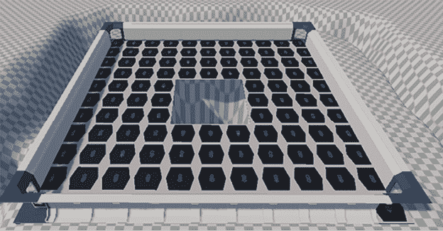

图 4.34：带有坑洞的地板模块

1.  使用包中的其他模块化部件添加您想要添加的任何细节。

1.  将所有这些部件放入一个名为`Base`的容器对象中。请记住创建一个空对象并将基础部件拖入其中：

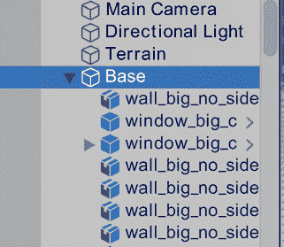

图 4.35：网格子资产

通过这种方式，我们学会了如何通过模块化方法轻松创建场景，利用 Unity 的吸附功能组装不同的部件。经过大量实践，你将逐渐积累关于模块化场景设计的常见陷阱和良好实践的宝贵经验。所有包都考虑到了不同的模块化设计，因此你需要适应它们。

# 摘要

在本章中，我们学习了如何导入模型和纹理并将它们集成到我们的场景中。我们讨论了如何将纹理应用到地形上，如何用模块化模型替换我们的原型网格，如何将这些纹理应用到模型上，以及如何根据对象的用途适当配置资产，同时考虑到多个标准。

通过这种方式，我们已经完成了本书的*第一部分*，*Unity 入门*，并讨论了我们在整本书中将会使用的几个基本 Unity 概念。在*第二部分*，*精通编程和游戏玩法机制*中，我们将开始编写游戏的游戏玩法，如玩家的移动和健康系统。我们将开始学习如何创建自己的组件来为我们的对象添加行为，以及脚本的基本结构。 

# 在 Discord 上了解更多信息

与其他用户、Unity 游戏开发专家以及作者本人一起阅读这本书。提出问题，为其他读者提供解决方案，通过 Ask Me Anything（问我任何问题）环节与作者聊天，等等。扫描二维码或访问链接加入社区：

[`packt.link/unitydev`](https://packt.link/unitydev)

