# 第四章：创建项目和模板

Visual Studio 中的模板是一组文件、引用、项目属性和编译选项，用于与特定技术一起工作。模板为我们提供了基本代码以供工作，并作为我们可以遵循并完成的指南，通过包括我们的业务逻辑和需求来完成。根据在 Visual Studio 安装过程中选择的负载，安装了不同的模板，尽管有一些模板会默认安装，例如类库。根据我们想要使用的项目或技术，我们将找到不同的模板选项可供选择。选择适合您需求的正确模板是您可以采取的最佳行动，以避免技术债务和未来在架构中的问题。

在本章中，我们将分析 Visual Studio 2022 提供的主要 Web 开发模板以及可用的自定义模板选项。此外，在本章中，我们将了解如何根据项目的范围、需求和团队的专业知识选择最佳的模板。

本章我们将回顾以下主题：

+   选择和搜索模板

+   .NET Core 模板

+   **应用程序编程接口**（API）模板

+   .NET Framework 模板

+   **单页应用**（SPA）项目的模板

让我们看看这些模板是什么以及如何使用它们。

# 技术要求

要跟随本章内容，你必须已经安装了带有 Web 开发工作负载的 Visual Studio 2022，如*第一章*中所示，“Visual Studio 2022 入门”。

您可以通过以下链接查看对项目的更改：[`github.com/PacktPublishing/Hands-On-Visual-Studio-2022/tree/main/Chapter04`](https://github.com/PacktPublishing/Hands-On-Visual-Studio-2022/tree/main/Chapter04)

# 选择和搜索模板

如本章引言所述，Visual Studio 提供了许多模板，我们可以使用.NET 和其他技术，具体取决于你正在处理的项目类型。

要在 Visual Studio 2022 中探索模板，只需打开 Visual Studio 并选择**创建新项目**选项：

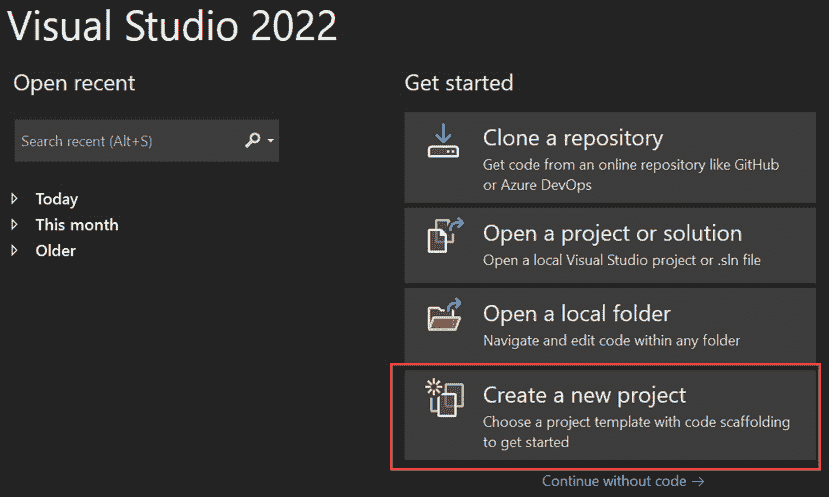

图 4.1 – Visual Studio 创建新项目选项

选择此选项后，我们将看到一系列可供选择以创建新项目的模板，如图*图 4.2*所示。同样，在左侧，我们将能够看到我们最近选择的模板，有固定或取消固定每个模板的选项，这样我们可以快速选择我们最常用的模板：

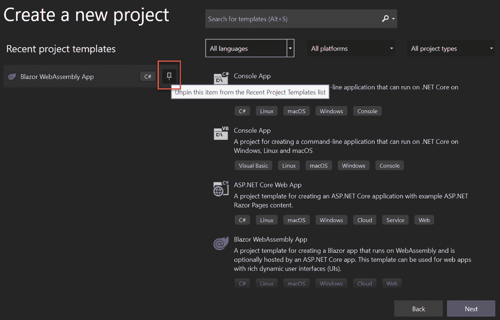

图 4.2 – 在最近的项目模板部分中固定或取消固定模板的选项

在*图 4.2*中，我们还可以看到顶部有一个搜索栏，用于过滤不同的模板。如果您知道将要使用的名称或技术，您可以输入相关的术语并开始搜索模板。搜索引擎将显示包含您输入的术语的所有模板。

在搜索栏下方，我们还可以看到三个下拉控件，这些控件也作为过滤器，用于搜索与我们要创建的编程语言、平台或项目类型相关的模板。在这些过滤器最重要的选项中，我们可以找到以下内容：

+   **所有语言**：

    +   **C#**

    +   **JavaScript**

    +   **Python**

    +   **TypeScript**

    +   **Visual Basic**

+   **所有平台**：

    +   **Android**

    +   **Azure**

    +   **iOS**

    +   **Linux**

    +   **Windows**

+   **所有项目类型**：

    +   **云**

    +   **桌面**

    +   **游戏**

    +   **机器学习**

    +   **移动**

    +   **测试**

    +   **Web**

此外，您还可以将过滤器与搜索栏结合使用。例如，您可以在语言下拉菜单中选择**C#**选项，输入`.NET Core`以获取所有与.NET Core 和 C#相关的项目，如图所示：

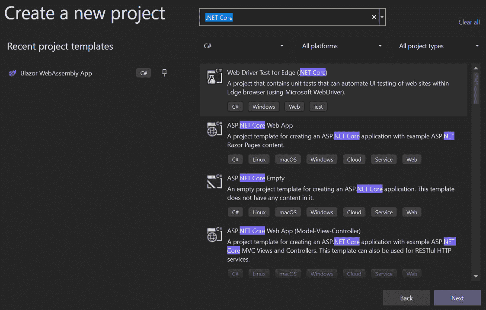

图 4.3 – C#的.NET Core 模板

在*图 4.3*中，我们可以看到 Visual Studio 根据安装过程中选择的过滤器和工作负载找到的许多与.NET Core 相关的项目。

在结果底部，如果您找不到所需的选项，您将有一个安装其他模板的选项：

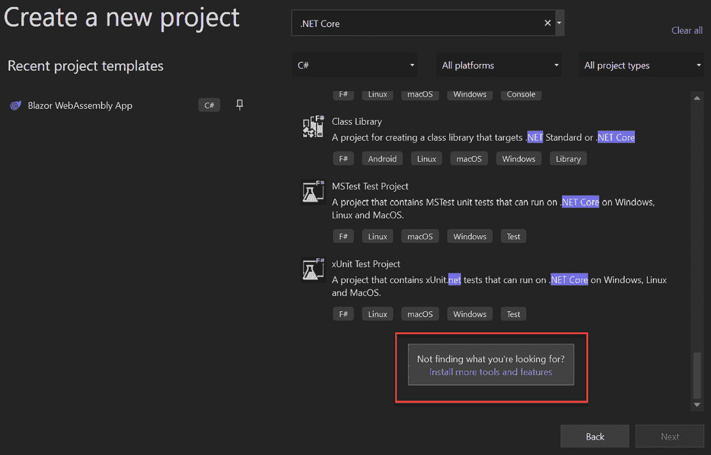

图 4.4 – 在 Visual Studio 中安装更多工具和功能的选项

重要的是要注意，每个模板都有一个描述，包括与模板相关的详细信息，这样我们就可以轻松地识别模板是否包含我们需要的结构和模式。

最后，当模板的描述包含**空**关键字时，这意味着模板默认不包含元素或模块，并包含演示或示例，例如指南，供开发者使用。这种类型的模板仅包含项目和基础组件，以便编译和运行。

现在我们已经了解了如何使用模板选择窗口，让我们来看看 Web 开发中最重要的模板。

# .NET Core 模板

让我们首先了解.NET Core 和 ASP.NET Core 之间的区别：

+   .NET Core（现在称为.NET）是一个跨平台、免费且开源的框架，用于创建 Web、桌面、移动和其他类型的应用程序，使用标准库和 C#、Visual Basic 或 F#作为编程语言。

+   另一方面，ASP.NET Core 是一种多平台网络技术，用于使用 .NET 创建现代应用程序。这就是尽管 .NET Core 框架已被 .NET 6 替换，但您仍然会在模板中找到与 .NET Core 相关的术语。

如果我们想创建一个新的 ASP.NET Core 类型的干净项目，我们可以搜索并选择`AspCoreEmpty`。

此外，我们必须指定保存项目的位置。您可以选择保留默认路径，或选择自定义路径，例如`C:\demos\AspCoreEmpty`。

最后，设置解决方案的名称。默认情况下，它将与项目相同，但您可以将其更改为另一个名称。在*图 4.5*中，我们保留了相同的名称：

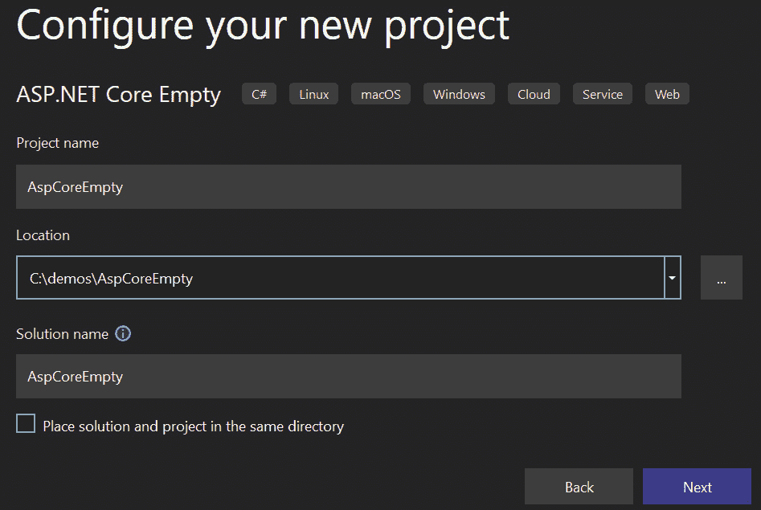

图 4.5 – 配置新的 ASP.NET Core Empty 项目

点击**下一步**按钮后，将显示一个新窗口，如下所示：

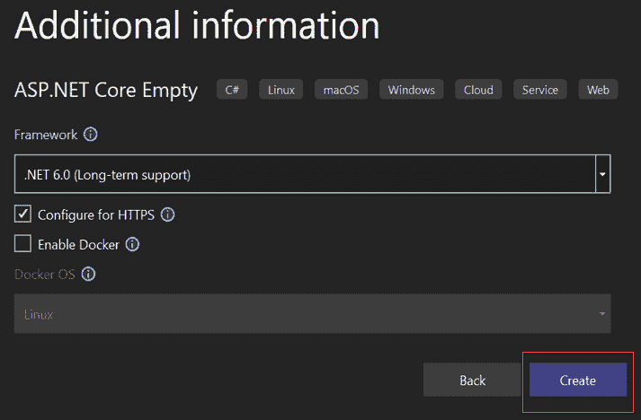

图 4.6 – 创建 ASP.NET Core Empty 项目

如*图 4.6*所示，您可以配置以下选项：

+   **框架**：此下拉菜单将显示与所选技术一起可用的框架集。尽管可以选择较旧的框架，但始终建议使用可用的最新框架版本创建新项目。

+   **配置 HTTPS**：此复选框允许您配置项目使用自签名 SSL 证书。如果您第一次在项目中工作，则在运行应用程序时将要求您信任证书，以确保一切正常工作。尽管可以使用 HTTP 协议进行工作，但在现实生活中始终建议使用 HTTPS。

+   **启用 Docker**：此选项允许您在项目中启用 Docker 支持。这意味着将生成 Docker 文件，然后您可以将其发布，例如到 Microsoft Azure。

在我们的示例(*图 4.6*)中，我们选择**.NET 6**作为目标框架。**配置 HTTPS**选项默认选中，对于此演示是可选的。最后，您可以点击**创建**以完成向导并创建项目。

创建项目后，我们可以分析创建的项目结构，如图*图 4.7*所示，它很简单：

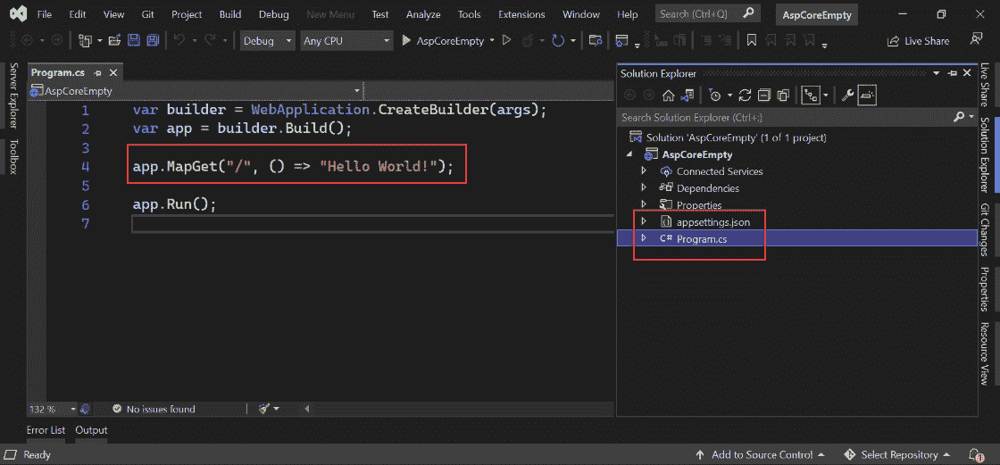

图 4.7 – Visual Studio 中的 ASP.NET Core Empty 项目

在名为**解决方案资源管理器**的面板中，我们可以看到与为项目创建的模板相关的所有文件。

与项目结构相关的只有两个文件，如下所示：

+   `appsettings.json`: 这是一个包含默认设置的 JSON 文件，用于 ASP.NET Core 项目。

+   `Program.cs`: 这是包含配置和启动应用程序命令的应用程序入口点。

在我们选择的模板中，使用了 .NET 6 中引入的新概念，称为最小 API，这是一种使用`Program.cs`中的辅助函数来创建简单端点所需的最少代码的方式。

默认情况下，当应用程序执行时，它将显示一个`GET`方法并将其映射到基本 URL – 例如，`http://myapiurl/`。

重要提示

最小 API 是 .NET 6 中包含的新模板，对于创建简单的 API（如演示、小型服务、无服务器函数和微服务）非常有用。

现在，让我们使用`ASPNET`创建一个新的项目并选择**ASP.NET Core Web 应用程序**模板：

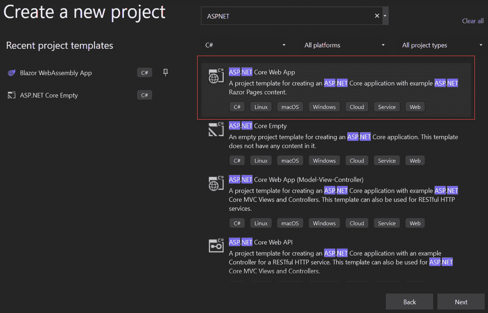

图 4.8 – 使用 ASPNET 搜索并选择 ASP.NET Core Web 应用程序模板

然后，点击**下一步**并填写创建新项目所需的信息，如*图 4.9*所示：

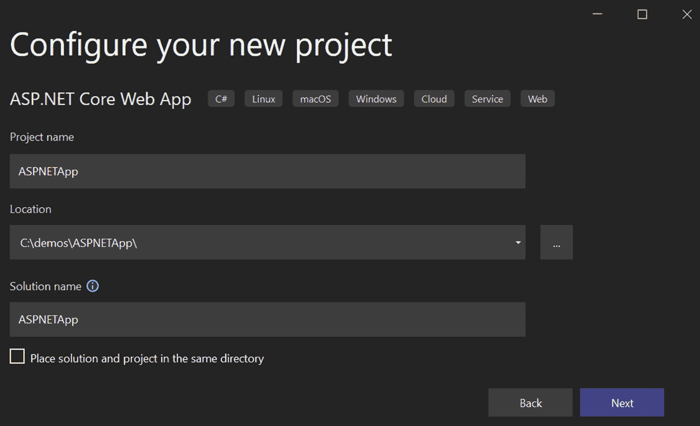

图 4.9 – 配置新的 ASP.NET Core Web 应用程序项目

在填写完项目的附加信息后，如*图 4.10*所示，您可以点击**创建**按钮，使用 ASP.NET Core Web 应用程序模板生成项目：

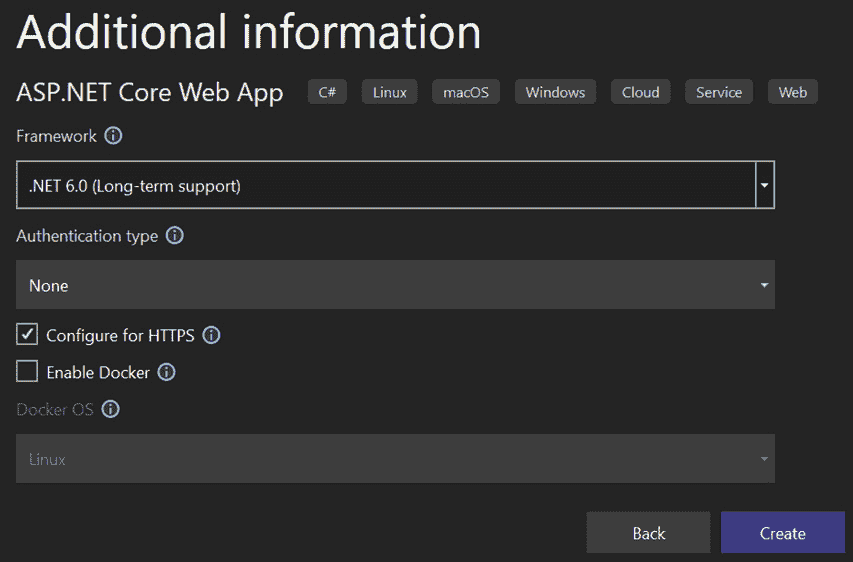

图 4.10 – 新的 ASP.NET Core Web 应用程序模板的附加选项

如果您想使用 .NET 和 C# 在服务器上创建 Web 应用程序，则此模板非常合适。此外，它使用 razor 页面（在`cshtml`扩展文件中将 C# 与 HTML 结合的语法）将 Web 应用程序构建成小型且可重用的组件。

现代应用程序通常在浏览器中运行，因为它们运行速度更快，并且有更好的**搜索引擎优化**（**SEO**），这可以提高您网站的流量。然而，服务器端应用程序对于仪表板、内部项目、管理面板以及许多其他类型的 Web 应用程序仍然非常有用。

ASP.NET Core Web 项目包含一个`wwwroot`文件夹，您可以在*图 4.11*中看到：

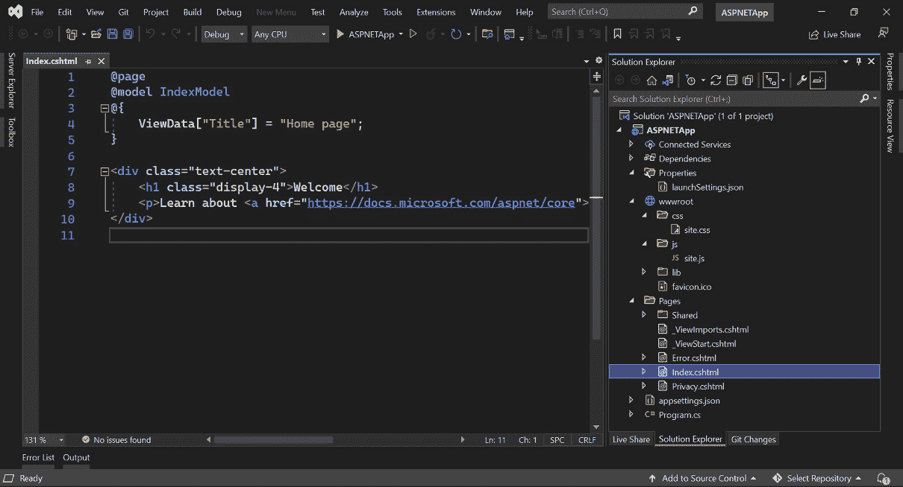

图 4.11 – ASP.NET Web 项目的结构

`wwwroot`文件夹与静态文件相关联，例如 CSS、图片和 JavaScript 文件。还有一个名为`Pages`的文件夹，其中包含所有 UI 组件。

`Index.cshtml`是一个示例，您可以在其中看到 C# 代码与 HTML 代码的混合。`@`字符允许您在文件中使用 C# 代码。例如，`@model`将模型类型设置为映射页面上的值。

其他类型的 .NET Core 项目模板包括以下内容：

+   **控制台应用程序**：此模板创建一个简单的控制台应用程序。通常，我们在开始学习和起步时使用此类应用程序。

+   **类库**：这允许您创建可在不同项目中共享的组件和类。

+   **API 模板**

+   **SPA 模板**

这些是推荐的模板，因为它们是最新的，并且与.NET 的最新版本保持一致。

# API 模板

今天，应用程序使用基于 API 的端点是几乎成为一条规则。这是因为它们通过不依赖于特定技术或操作系统提供了高级别的安全性和互操作性，并且可以根据现有需求进行扩展。此外，我们可以实现高级架构，例如使用 API 的微服务，其中所有业务逻辑都分布在小型隔离的独立服务中。

由于能够基于 API 开发解决方案的重要性，Visual Studio 2022 集成了一个特殊的模板，使我们能够创建基于.NET 6 的 API，我们可以通过过滤`api`术语来搜索它们，如*图 4.12*所示：

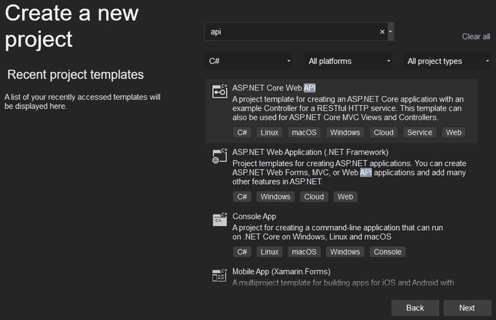

图 4.12 – 通过 API 过滤并选择 ASP.NET Core Web API

一旦我们选择了模板，我们必须根据我们的需求填写补充信息，如图*图 4.13*所示：

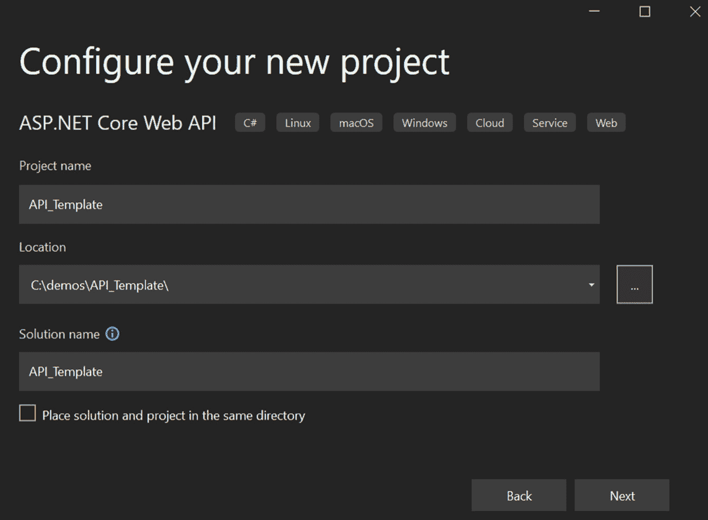

图 4.13 – 配置 ASP.NET Core Web API 项目

在下一个窗口中，我们将被要求选择框架版本以及是否需要某种类型的身份验证，以及其他我们在*.NET Core 模板*部分中已经看到的数据。然而，我们有一些额外的选项，在正常的 ASP.NET Core 项目中看不到，如下所示：

+   **用户控制器**：如果选择此选项，将启用从配置中使用的控制器文件。如果不选择，将使用名为最小 API 的功能，这将创建实现功能 API 所需的最少代码。

+   **启用 OpenAPI 支持**：Swagger 是一组基于 OpenAPI 规范的开放源代码工具，它将允许我们以简单、易于和结构良好的方式描述我们创建的 API，为 API 用户提供良好的文档。

对于我们的示例，我们将保留两个选项都选中，如图*图 4.14*所示，以便您可以看到生成的结构：

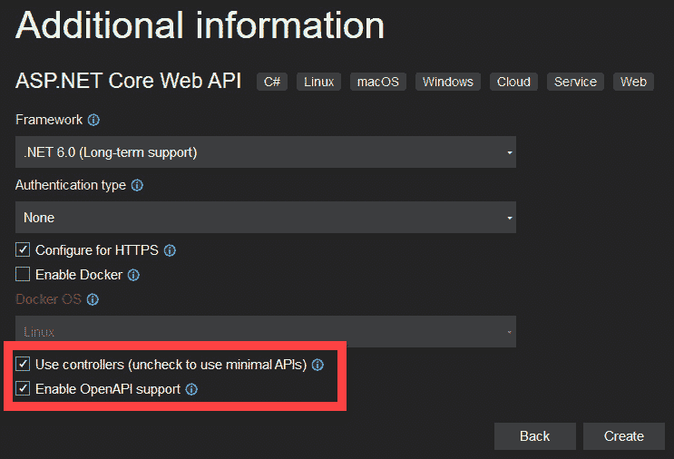

图 4.14 – 选择 ASP.NET Core Web API 项目附加信息中的选项

一旦创建项目，我们可以看到已创建一个名为`Controllers`的文件夹作为项目的一部分：

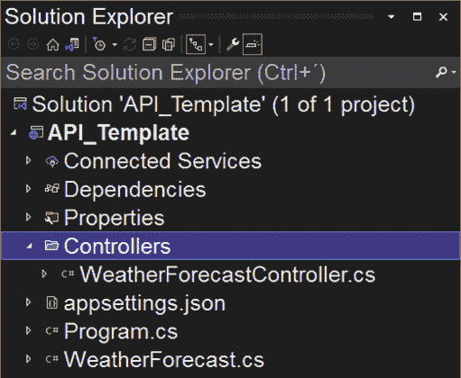

图 4.15 – ASP.NET Core API 项目的结构

在 `Controllers` 文件夹中，我们将找到作为 API 部分创建的控制器。请记住，我们可以看到这个文件夹中的控制器，是因为我们在 *图 4.14* 中选择了 **Use controllers** 选项。

要运行或执行应用程序，我们需要使用标准工具栏中的绿色箭头或播放图标：

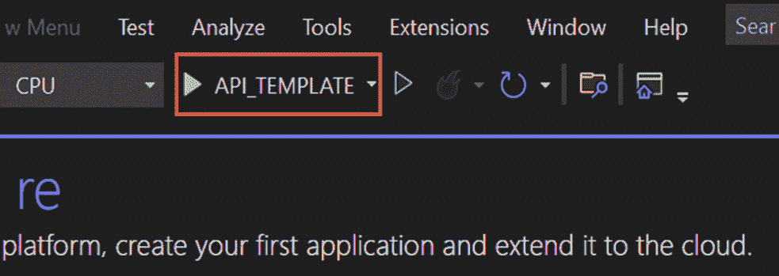

图 4.16 – 在 Visual Studio 中启动项目的播放按钮

我们可以开启或关闭调试来启动项目。在这种情况下，任何一种选择都可以。我们只是想看看项目的外观。

重要提示

有一些有用的快捷键可以启动项目。您可以使用键盘上的 *F5* 以调试模式运行项目，或者使用 *Ctrl* + *F5* 来启动不带调试的项目。

如果我们继续运行应用程序，它将立即带我们到一个 URL 以 `/swagger/index.html` 结尾的窗口：

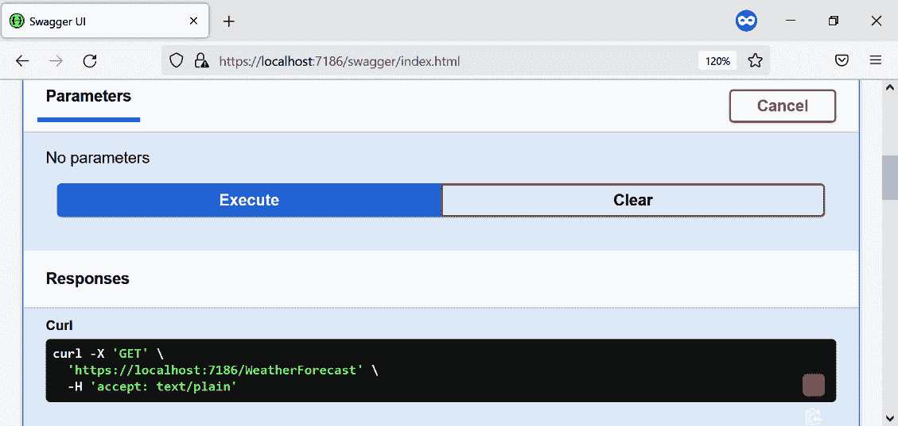

图 4.17 – ASP.NET Web API 项目的 Swagger 页面

在这里，我们将能够找到通过 Swagger 文档的所有 API 功能 – 这意味着我们项目中的控制器创建的所有端点。Swagger 是一个使用 OpenAPI 标准来显示所有端点的库，包括所需的参数和返回值的类型。

从这个页面，我们将能够测试每个端点，以验证它们，并在某些端点不符合预期时进行必要的调试。如您所欣赏，这个工具在开发目的和为用户提供创建的 API 文档方面都非常有帮助。

这个模板为我们提供了从头开始创建我们自己的现代 API 所需要的一切。现在，让我们看看可用于与 .NET Framework 一起工作的模板。

# .NET Framework 模板

.NET Framework 是 .NET 的原始实现，由微软于 2002 年发布。长期目标是使这个框架成为一个多平台框架。不幸的是，由于 API 限制，它始终在 Windows 设备上官方运行。为了解决这个问题，创建了特定版本的框架来支持不同的平台，这导致了平台的碎片化。通过从这些随着时间的推移推出的项目中积累的经验，微软团队最终成功地统一了 .NET 平台。

由于多年来 .NET Framework 平台一直是开发 .NET 应用程序的主要框架，因此世界上许多公司使用基于 .NET Framework 的 ASP.NET Web Forms、MVC 或 Web API 应用程序。这就是为什么 .NET Framework 模板仍然包含在 Visual Studio 中的原因。但这并不意味着建议使用这些模板创建应用程序。您应该始终选择使用具有当前和持续支持的现代技术。

虽然有几个带有 .NET 框架的模板，但有一个真正吸引我们的用于 Web 开发。这被称为 `net framework` 术语，如 *图 4.18* 所示：

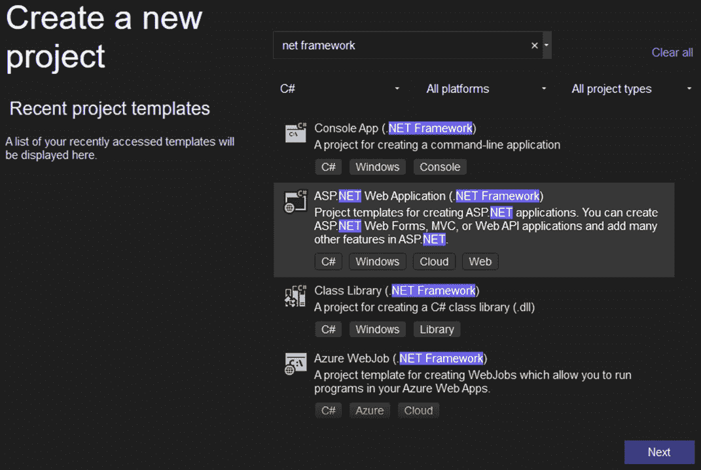

图 4.18 – 使用 .NET 框架进行搜索

选择模板后，在下一个窗口中，您将看到许多需要填写字段，这些字段对您来说应该是熟悉的，例如项目名称和位置，以及其他数据。重要的是要注意，我们有一个下拉菜单，显示我们可以工作的 .NET 框架的多个版本。在这个例子中，我们将选择最后一个版本，如 *图 4.19* 所示：

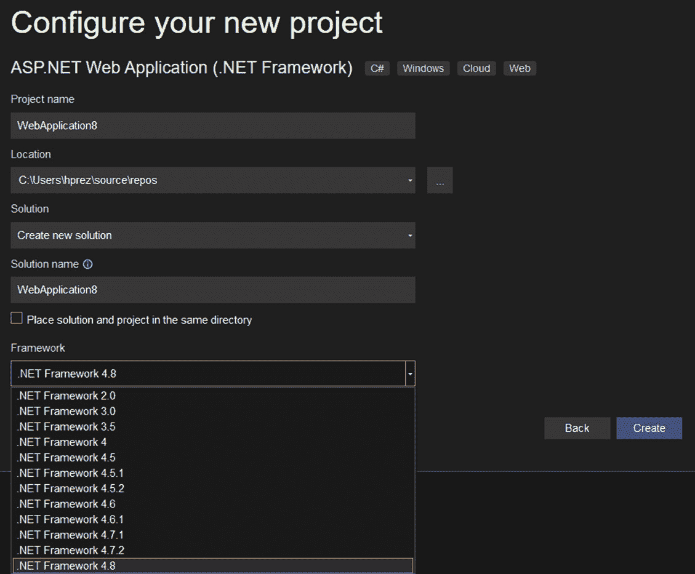

图 4.19 – 配置 ASP.NET Web 应用程序 (.NET 框架)

一旦我们选择了框架，我们就可以选择我们想要创建的应用程序类型 – 选项包括一个干净的项目、Web 表单模板、基于 MVC 的项目、Web API 和单页应用程序，如 *图 4.20* 所示：

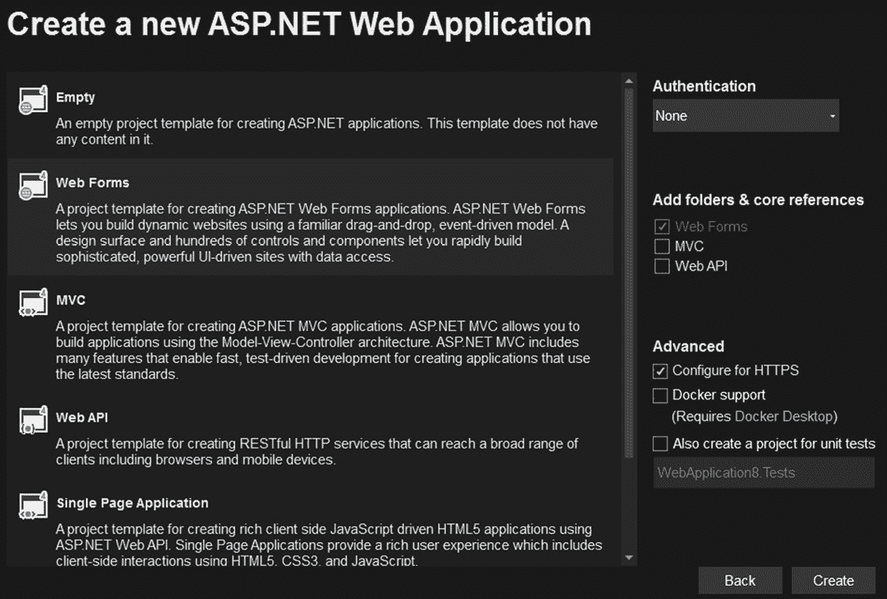

图 4.20 – Visual Studio 中 .NET Framework 的 Web 应用程序类型

这些模板的选择将取决于应用程序的需求，尽管，如本节开头所述，建议选择面向 .NET 的模板。

让我们继续审查 SPA 模板的类别，该类别旨在创建用户将与之交互的应用程序。

# 单页应用模板

单页应用（SPA）是 Web 项目的绝佳架构，其中所有元素都使用单个 **超文本标记语言**（**HTML**）文件进行渲染。有许多库和框架使用这个概念 – 例如，Angular、React.js 和 Blazor WebAssembly。

使用这些模板创建的任何项目都将包含创建单体应用程序所需的所有组件，后端使用 ASP.NET，前端使用单页应用库或框架。

让我们使用 Visual Studio 创建我们的第一个 SPA 项目。您可以通过搜索 `ASP.NET Core with` 来找到单页应用的模板：

图 4.21 – 使用 ASP.NET Core 进行搜索

在 *图 4.21* 中，您可以看到使用 `ASP.NET Core with` 进行搜索的结果。我们可以选择三个模板来处理 SPA：

+   **ASP.NET Core with Angular**

+   **ASP.NET Core with React.js**

+   **ASP.NET Core with React.js and Redux**

我们将使用 React.js 创建一个项目，因此让我们选择 **ASP.NET Core with React.js**，然后点击 **下一步** 继续操作：

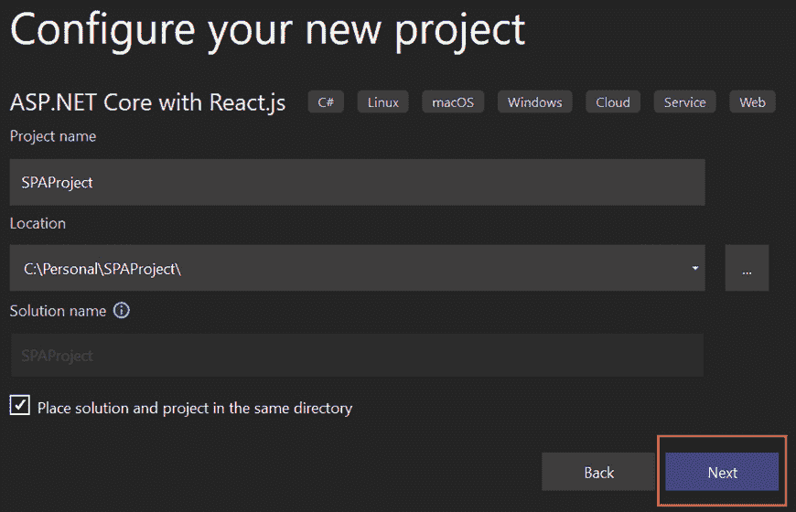

图 4.22 – 配置 ASP.NET Core 与 React.js 项目

重要提示

你将要创建的项目将用于本书接下来的练习，因此将此代码保存在你偏好的永久文件夹中非常重要。

然后，你应该选择**.NET 6（长期支持）**作为**框架**目标，并在**身份验证类型**中选择**无**，最后点击**创建**，如图*图 4.23*所示：

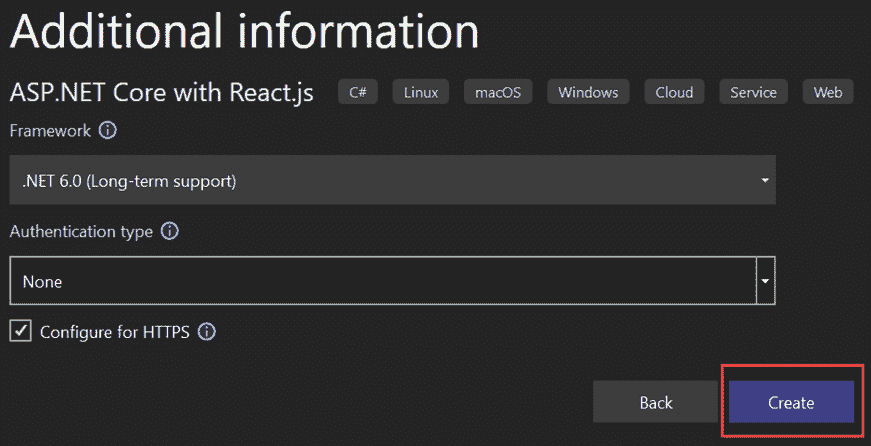

图 4.23 – 填写附加信息部分

点击**创建**后，你可以看到使用 SPA 模板创建的项目，并分析其架构：

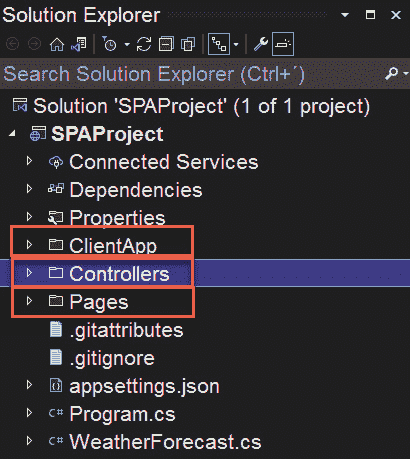

图 4.24 – 在 Visual Studio 中创建的包含 React.js 项目的 ASP.NET Core 项目

在这个模板中，有三个重要的文件夹需要突出：

+   **ClientApp**: 包含客户端应用程序 – 在这种情况下，一个 React.js 应用程序

+   **Controllers**: 包含与服务器上业务逻辑相关的所有控制器

+   **Pages**: 包含 razor 页面，这意味着在服务器上渲染的 UI 组件

该模板包含一个`WeatherForecastController.cs`文件的演示。这是一个简单的演示，返回一些随机数据。

让我们通过点击播放按钮来运行项目，如图*图 4.25*所示，以查看应用的外观：

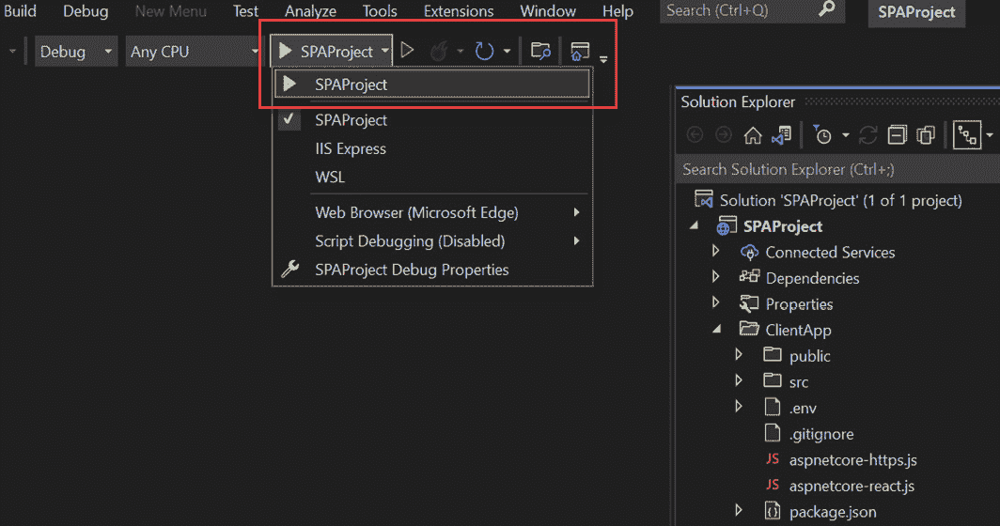

图 4.25 – 在 Visual Studio 中运行项目的选项（绿色箭头或播放图标）

当项目运行时，你可以看到一个简单的 HTML 页面，解释了模板的工作原理，包括两个演示，**计数器**和**获取数据**：

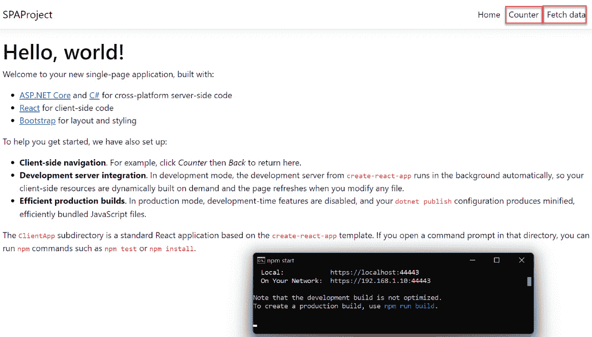

图 4.26 – ASP.NET Core 与 React.js 项目运行状态

该模板简单但包含了我们使用单体架构创建新 Web 应用所需的所有内容，并在后端和前端方面遵循最佳实践。如果你需要一个高性能安全的 Web 应用，这个模板是一个不错的选择。React.js 使用 JavaScript 作为语法，因此对于这个模板，你需要更多关于这种语言以及 C#（后端）的知识。在我们分析的*.NET Core 模板*部分中，C#对于编写我们的 UI 和业务逻辑比 JavaScript 更重要。

我们将对这个项目进行一些修改，并默认使用文件和演示来分析 Visual Studio 中的工具，并学习如何利用这些惊人的功能。

# 摘要

Visual Studio 在创建项目方面有不同的选项，根据安装过程中添加的工作负载使用模板。我们有四个过滤器来快速搜索模板。虽然我们可以按语言、平台和项目类型进行筛选，但我们也有可能使用搜索栏通过术语或特定单词来查找我们的模板。

选择要使用的模板后，我们必须始终输入项目名称以及项目将要创建的文件夹。然后，我们必须选择目标框架和一些可选信息。在屏幕上选择**创建**后，Visual Studio 将打开项目，因此我们可以立即开始工作。

使用**解决方案资源管理器**，我们可以查看项目的结构，包括应用中使用的文件夹。通常，使用模板创建的项目包含一个演示，帮助我们验证应用程序是否运行良好。

在*第五章*“调试和编译您的项目”中，我们将调试我们创建的 SPA 项目。我们将了解为什么这个工具很重要，并检查在执行之前编译项目的选项。
