# 第五章：调试和编译你的项目

作为软件开发人员，应该尽早学习的一项技能是程序调试。这适用于 .NET 项目，也适用于任何其他软件开发技术。

如果你想要充分利用 Visual Studio 2022，你必须熟悉其不同的窗口，这些窗口可以帮助你观察信息以修复错误，并了解如何使用它提供的调试工具，包括**断点**。断点提供了停止应用程序执行的功能，让你能够查看每个对象的状态并证实其行为。

因此，在本章中，我们将讨论 Visual Studio 2022 的调试，可用的不同断点，状态检查工具，以及每个工具的最佳使用场景。

本章我们将讨论以下主题：

+   在 Visual Studio 中调试项目

+   探索 Visual Studio 中的断点

+   调试的检查工具

让我们学习如何在 Visual Studio 2022 中进行调试，以检测程序中的可能错误。

# 技术要求

要跟随本章中展示的示例，必须安装带有 Web 开发工作负载的 Visual Studio 2022，如*第一章*中所示，*开始使用 Visual Studio 2022*。

同样，代码实现将在*第四章*中创建的项目上执行，*创建项目和模板*，特别是`Program.cs`文件，以便于测试。

你可以在以下链接中找到本章中修改过的`Program.cs`文件：[`github.com/PacktPublishing/Hands-On-Visual-Studio-2022/blob/main/Chapter05/Program.cs`](https://github.com/PacktPublishing/Hands-On-Visual-Studio-2022/blob/main/Chapter05/Program.cs)。

# 在 Visual Studio 中调试项目

在深入讨论 *Exploring breakpoints in Visual Studio 2022* 部分的断点主题之前，了解调试世界中以及 Visual Studio 中使用的某些技术方面很重要。

## 理解调试的技术方面

了解调试器和调试之间的区别很重要，这样你才能在我提到这些术语时理解我的意思，无论是本章还是整本书中。

首先，调试这个术语指的是查找代码中的错误的行为。这并不一定包括使用像 IDE 这样的工具。例如，你可以在一张纸上查找代码中的错误，而你仍然在进行调试。

这通常不可行，因此通常会使用一个名为调试器的工具。这个工具会附加到你将要运行的应用程序进程上，允许你在应用程序运行时分析你的代码。

## 区分调试模式和运行模式

在 Visual Studio 中区分调试模式和运行模式非常重要，因为这对第一次接触 IDE 的人来说可能会造成混淆。

让我们首先分析调试模式。此选项通过选择 **调试** 配置（默认情况下已预选）并点击位于项目名称相同空间中的绿色按钮来激活，如图 *图 5.1* 所示：


图 5.1 – Visual Studio 的调试模式选项

当按下此选项时，调试器将附加到应用程序的执行，这将允许我们使用诸如在应用程序中的特定断点处停止等函数。

另一方面，我们还可以在下拉列表中选择第二个配置，如图 *图 5.2* 所示，称为 **发布**：

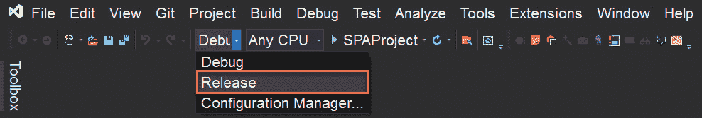

图 5.2 – Visual Studio 的发布模式选项

当选择此选项并继续启动应用程序的执行时，调试器将不会附加，这将让您更好地了解应用程序如何对最终用户表现。这意味着您将无法执行代码调试或查看异常发生的位置，但您将获得性能提升。

## 项目调试初始化选项

作为应用程序的调试和执行选项的一部分，我们必须知道我们有一组选项可用于执行我们的测试。

如果您下拉带有您项目名称的绿色按钮旁边的选项，如图 *图 5.3* 所示，您将能够看到一组用于应用程序部署的配置：

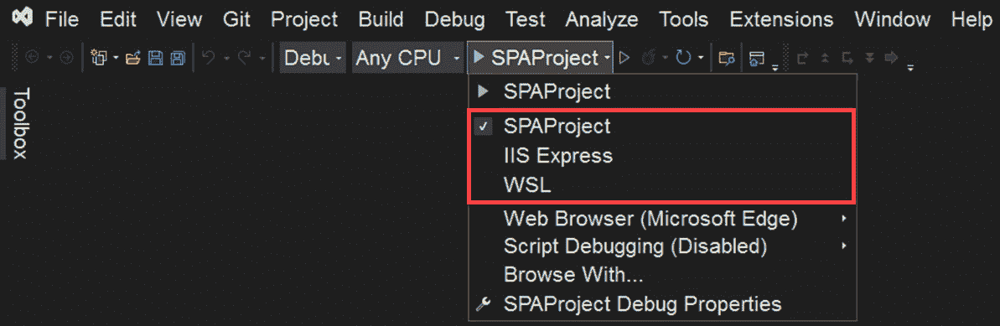

图 5.3 – 调试的服务器配置选项

例如，前三个选项用于选择您想要用于测试的服务器。默认情况下，使用名为 **Kestrel** 的服务器。但也可以使用 **IIS Express**，或者如果您的应用程序更倾向于基于 Linux 的环境，甚至可以使用 **WSL**。

在 *图 5.4* 中，我们可以观察到以下选项来更改浏览器、启用脚本调试以及查看项目的调试属性：

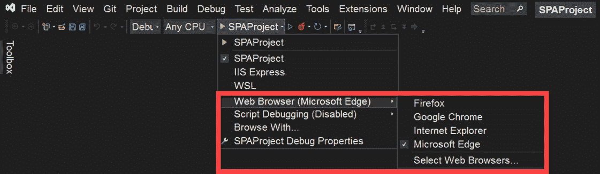

图 5.4 – 调试的附加选项

如果您，例如，想要使用特定的浏览器来使用其自己的工具，这些选项非常有用。

如果应用程序已配置为调试模式，您将在 IDE 的上半部分看到允许您控制应用程序执行的按钮，如图 *图 5.5* 所示。从左到右，这些按钮用于执行以下操作：

+   暂停应用程序

+   停止应用程序

+   重新启动应用程序


图 5.5 – 控制应用程序流程的按钮

现在我们已经了解了 Visual Studio 中的现有调试概念，让我们来分析断点。

# 探索 Visual Studio 中的断点

断点是软件开发的基本组成部分。它们允许你在任何想要检查对象状态的地方停止应用程序的流程。

要在 Visual Studio 中设置断点，我们只需将光标定位在行号旁边即可。这将开始显示一个灰色圆圈，当我们将光标移过行号时，它会出现和消失，如图所示：

![图 5.6 – 在 Visual Studio 中放置断点的位置

![图 5.06 – 设置断点的选项

图 5.6 – 在 Visual Studio 中放置断点的位置

一旦我们找到想要调试的行，我们只需单击一次左键，这将导致圆圈变成红色，如图 *图 5.7* 所示。一旦你这样做，如果你将光标移出圆圈，你将能够看到它保持原样，如图所示：

![图 5.7 – 设置断点

![图 5.07 – 设置断点的选项

图 5.7 – 设置断点

如果我们继续执行带有断点的应用程序，我们将看到应用程序流程在启动应用程序后立即停止，如图 *图 5.8* 所示：

![图 5.8 – 调试断点

![图 5.08 – 设置断点的选项

图 5.8 – 调试断点

一旦应用程序在断点处停止，我们将有不同工具可用，我们可以使用它们来查看应用程序的状态 – 例如，如果我们定位在调试行之前的变量上，我们将能够看到其当前状态。如果是原始数据，你将立即看到其值，而如果是对象，你将能够进入其属性以检查每一个，如图 *图 5.9* 所示：

![图 5.9 – 检查对象属性

![图 5.09 – 设置断点的选项

图 5.9 – 检查对象属性

有更多选项可以设置断点 – 例如，如果你将自己放在一个灰色圆圈上，并用鼠标右键点击它，将会出现一系列断点，我们将在 *条件断点*、*临时断点* 和 *依赖断点* 部分进行分析，以便你可以插入它们：

![图 5.10 – 设置断点的选项

![图 5.10 – 设置断点的选项

图 5.10 – 设置断点的选项

同样，如果你在已放置的任何断点上右键单击，你将看到添加功能到它们的选项：

![图 5.11 – 修改断点的菜单

![图 5.11 – 修改断点的菜单

图 5.11 – 修改断点的菜单

这是向你的项目添加断点最简单的方法。然而，你经常会需要某些特定情况下才会激活的特殊断点，因此我们将在下一节中继续回顾它们。

重要提示

Visual Studio 为我们即将执行的大多数操作创建了键盘快捷键。因此，随着我们继续本章的阅读，我将为您提及它们作为*笔记*。

可以通过将光标放在想要调试的行上并按 *F9* 键来快速插入断点。

## 在断点之间导航

一旦我们知道了如何在源代码中放置断点，我们就可以通过菜单上方的按钮以不同的方式继续应用程序的执行：

![Figure 5.12 – 应用程序执行的调试选项

![img/Figure_5.12_B17873.jpg]

图 5.12 – 应用程序执行的调试选项

它们将按照以下方式执行代码：

+   **进入**：这允许我们逐行执行所有源代码。如果我们作为流程的一部分调用我们通过源代码可以访问的方法，我们将自动跟随逐行调试导航到它。

+   **跳过**：这允许我们仅遍历当前方法中的代码行，而不进入当前方法调用的任何方法。

+   **跳出**：此按钮用于我们处于方法内部时。它将允许我们跳出方法的执行，仅返回到方法调用的下一行。

    重要提示

    每个选项都分配了一个快捷键：

    进入：*F11* 键

    跳过：*F10* 键

    跳出：*Shift* + *F11* 键

如果我们希望检查项目中所有的断点，可以通过激活断点窗口来完成。这可以通过**调试** | **窗口** | **断点**菜单来完成，如图*图 5.13*所示：

![Figure 5.13 – 显示断点窗口的选项

![img/Figure_5.13_B17873.jpg]

图 5.13 – 显示断点窗口的选项

这将显示一个新窗口，显示我们在项目中放置的所有断点的列表。

## 条件断点

有时候，你需要断点在满足某些条件时停止。在这种情况下，使用条件断点是最佳选择。要插入此类断点，只需在侧边栏上右键单击，这将显示可用的不同类型的断点，如*在断点之间导航*部分所示。选择**条件断点**类型，这将打开一个带有预选选项的窗口，如图*图 5.14*所示：

![Figure 5.14 – 条件断点的选项

![img/Figure_5.14_B17873.jpg]

图 5.14 – 条件断点的选项

在条件断点中，我们可以配置**条件表达式**条件、**命中次数**条件或**过滤器**条件，这些内容我们将在下一节中讨论。

重要提示

要插入条件表达式，可以使用 *Alt* + *F9* 键，然后按 *C* 键。

### 条件表达式

如 *图 5.15* 所示的 **条件表达式** 选项，将允许我们在满足我们之前指定的真条件或对象值发生变化时停止应用程序：

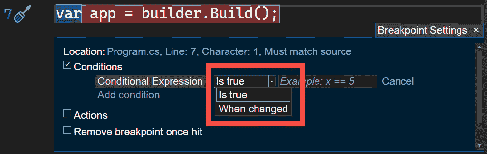

图 5.15 – 可以使用条件表达式评估的表达式类型

在第一种情况下，我们可以指定一个布尔表达式，范围从一对值的比较到复杂对象的比较。

在 *图 5.17* 中，创建了一个 `for` 循环，打印从 `1` 到 `10` 的数字，以便更好地理解示例。此外，我在 `i` 变量上放置了一个图钉，您可以通过在应用程序运行时简单地悬停在任何变量上并点击图钉符号来放置它，如图所示：

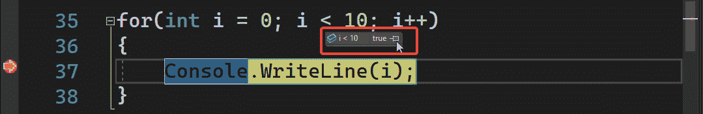


图 5.16 – 可以使用条件表达式评估的表达式类型

作为条件，我们已指定我们只想在 `i` 的值大于数字 `5` 时停止应用程序。启动应用程序后，断点停止，就在 `i` 的值为 `6` 时：

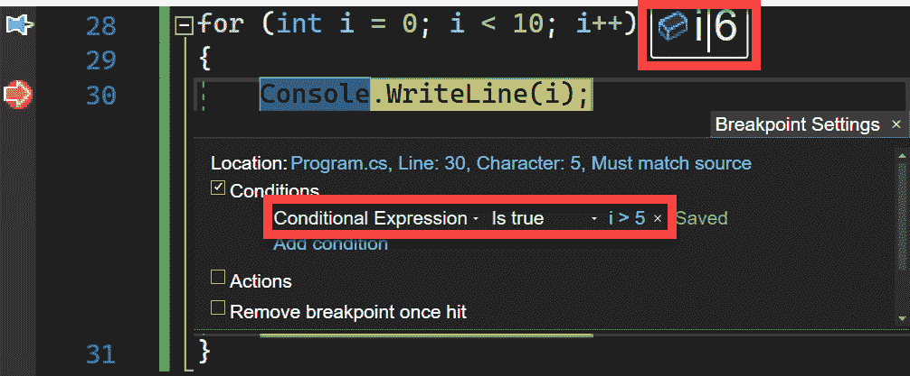


图 5.17 – 调试条件表达式

在第二种情况下，我们可以监视一个对象、属性或字段，以便断点仅在它发生变化时停止。这可以在 *图 5.18* 中以实际的方式看到，其中 `i` 变量：

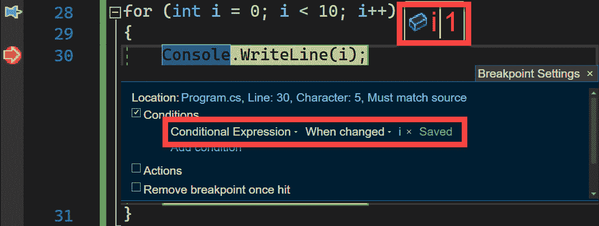


图 5.18 – 使用 When changed 参数评估条件表达式

因此，当断点第一次执行时，`i` 的值等于 `1`。

### 命中计数

如 *图 5.19* 所见，`25`：

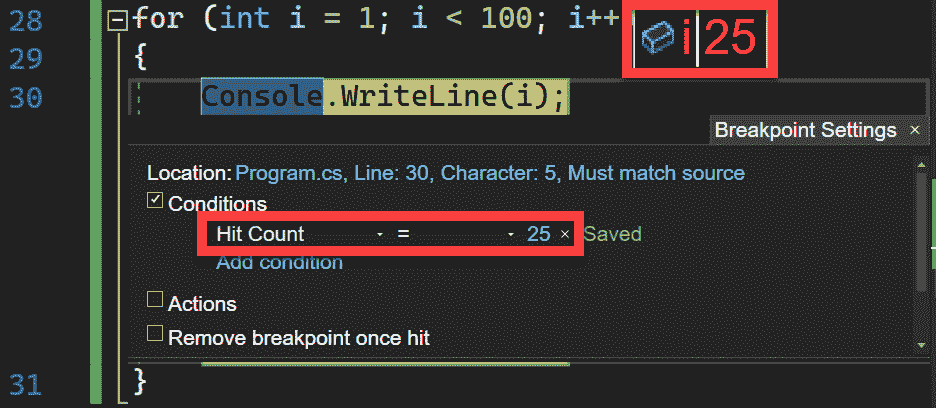


图 5.19 – 评估命中计数表达式

这将导致应用程序在 `i` 的值为 `25` 时停止。

### 过滤

最后一种条件断点是 **过滤** 条件。这将允许我们根据一系列预定义的表达式触发断点。这些表达式可以在 *图 5.20* 中找到的 **过滤** 框中找到，范围从机器名，通过进程，到线程属性：

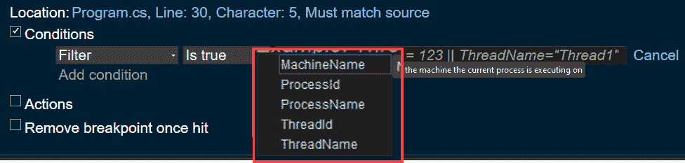


图 5.20 – 过滤条件选项

这些是条件断点的类型，对于执行值比较非常有用。现在，让我们看看函数断点。

## 函数断点

**函数断点**类型，正如其名称所示，将允许我们在方法执行时进行调试，即使我们没有像在“条件断点”部分那样设置断点。如果你有成百上千行的代码并且知道你想要调试的函数名称，这将非常有用。

与我们在“条件断点”部分看到的断点不同，这个断点是以不同的方式放置的。首先，如*图 5.21*所示，你可以转到**调试** | **新建断点** | **函数断点**菜单，并在窗口中插入我们想要设置断点的函数名称，而不是在代码中放置红色圆点：

![Figure 5.21 – 从调试菜单添加函数断点

![img/Figure_5.21_B17873.jpg]

图 5.21 – 从调试菜单添加函数断点

下一种方式是从**断点**窗口添加断点函数，如*图 5.22*所示：

![Figure 5.22 – 从调试菜单添加函数断点

![img/Figure_5.22_B17873.jpg]

图 5.22 – 从调试菜单添加函数断点

一旦我们点击了具有以下格式的`Program.cs`文件：

```cs
void StopHere()
```

```cs
{
```

```cs
    Console.WriteLine("Hi!");
```

```cs
}
```

如果我们知道要评估的函数名称，我们可以在**函数名称**框中输入它。我们可以通过几种方式来做这件事：

+   输入函数名称

+   使用特定的重载指定函数名称

+   如果我们有源代码，指定`dll`名称

在我们的例子中，我们将只放置`StopHere`函数的名称：

![Figure 5.23 – 填写我们感兴趣调试的函数名称

![img/Figure_5.23_B17873.jpg]

图 5.23 – 填写我们感兴趣调试的函数名称

在建立了数据后，我们将执行应用程序，在此之前已经调用了这个新方法。这将导致应用程序在方法开始处停止（如*图 5.23*中指定），如图 5.24*所示：

![Figure 5.24 – 通过函数断点执行断点的演示

![img/Figure_5.24_B17873.jpg]

图 5.24 – 通过函数断点执行断点的演示

重要提示

可以通过按下*Ctrl* + *K*键，然后按*B*键来添加函数断点。

毫无疑问，当我们想要快速调试方法时，这种类型的断点会使我们的生活变得更轻松。如果你想要根据对象的数据来触发断点，你可以使用数据断点，我们将在下一节中看到。

## 数据断点

如果你想要能够在对象属性更改时放置断点，那么数据断点是你最好的选择。如果你尝试从**断点**窗口添加这样的断点，你会看到该选项被禁用。

这是因为我们首先需要在想要开始监控属性之前放置一个断点。一旦完成，启动应用程序直到断点被激活，在名为 `EnvironmentName` 属性的 `app` 对象的一个窗口中：

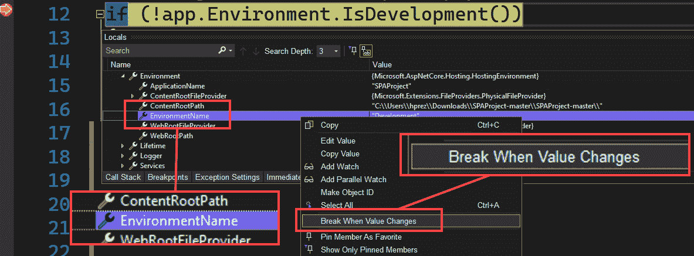

图 5.25 – 当 EnvironmentName 属性更改时添加数据断点

一旦我们选择该选项，我们将看到如何自动创建一个新的断点，该断点将检测我们指定的属性何时发生变化，如图 5.26 所示：

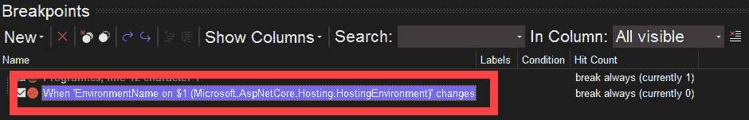

图 5.26 – 在断点窗口中创建的数据断点

假设，随后我们继续修改属性数据 – 例如，通过以下代码：

```cs
app.Environment.EnvironmentName = "Testing Data Breakpoints";
```

现在，当我们运行应用程序时，我们将看到之前放置的断点是如何被达到的，如图所示：

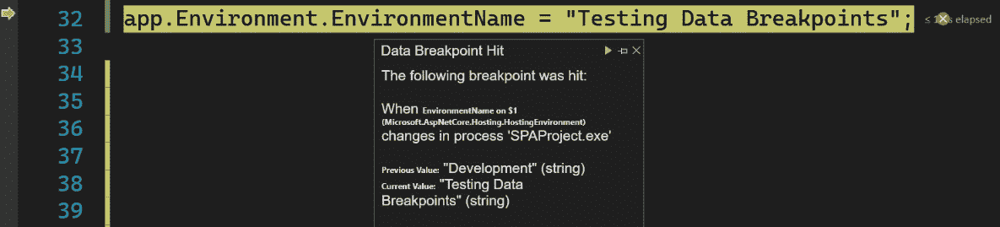

图 5.27 – 属性更改时断点的演示

最后，你会发现当你重新启动应用程序或停止它时，断点将从窗口中消失。这是因为对象引用已丢失。

## 依赖断点

这种类型的断点是一种特殊断点，它只有在另一个断点首先被达到时才会执行。也许在简单场景中，它不是非常有用，但在复杂场景中，当数百个功能发挥作用时，它可以非常有帮助。

例如，想象一下你有一个在应用程序的几个地方被调用的方法，你正在测试一个调用它的新功能。如果你要在该方法上放置一个普通断点，它会在每次被调用时停止。使用依赖断点，你可以指定只有当你的新功能断点被达到时才停止执行。

为了演示此功能，我在 `Program.cs` 文件中添加了几个方法，如下所示：

```cs
void NewMethod()
```

```cs
{
```

```cs
    Console.WriteLine("New Method");
```

```cs
}
```

```cs
void CommonMethod(string message)
```

```cs
{
```

```cs
    Console.WriteLine(message);
```

```cs
}
```

`CommonMethod` 函数的思路是我们可以看到作为参数传递的字符串的内容，并知道断点在哪个点停止。考虑到这一点，让我们添加一些额外的行，我们将首先调用 `CommonMethod`，然后调用 `NewMethod`，最后再次调用 `CommonMethod`：

```cs
CommonMethod("Before invocation of NewMethod()");
```

```cs
NewMethod();
```

```cs
CommonMethod("After invocation of NewMethod()");
```

要放置一个依赖断点，我们首先将在我们想要依赖的代码行上放置一个普通断点 – 即，必须首先执行以使依赖断点执行的断点。在我们的例子中，我们将它放在 `NewMethod` 功能中，因为它是我们想要测试的方法，如图 5.28 所示：

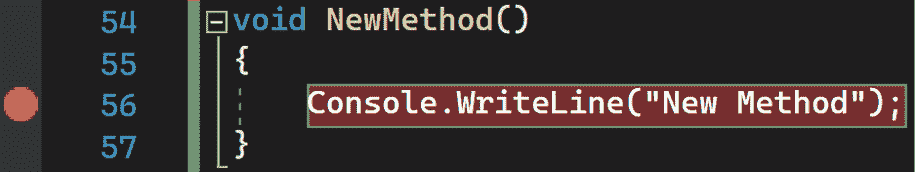

图 5.28 – 依赖断点所依赖的断点放置

然后，您必须在想要创建依赖断点的行上右键单击，如图 *图 5.29* 所示：

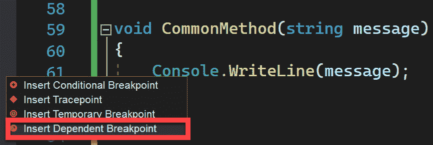

图 5.29 – 插入依赖断点

此选项将显示 **“断点设置”** 窗口，您将被告知要依赖哪个断点来启动依赖断点。在我们的示例中，我们将选择我们项目中唯一的断点，如图所示：

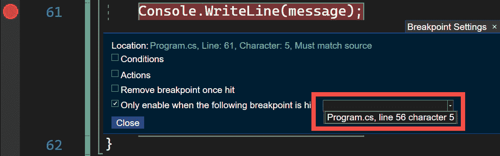

图 5.30 – 我们可以依赖以执行依赖断点的断点列表

一旦此窗口关闭，您将看到如何创建一个特殊的断点，如果您将其悬停，它将告诉您它依赖于哪个其他断点，如图所示：

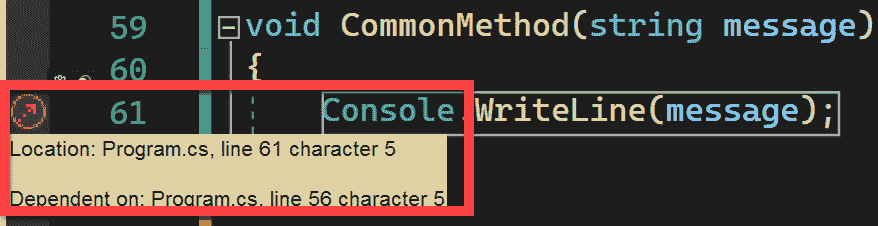

图 5.31 – 依赖断点的视图

最后，当运行应用程序时，您将看到它首先在 `NewMethod` 调用处停止，而不是在首先调用的 `CommonMethod` 处。如果您继续执行，依赖断点将停止，并显示 **“NewMethod() 调用之后”** 消息，如图 *图 5.32* 所示：

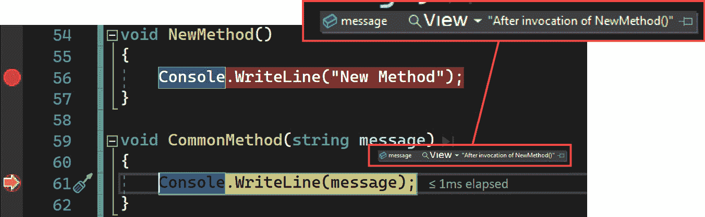

图 5.32 – 依赖断点的执行

如您所见，这种类型的断点可以非常有帮助，以避免不断的方法调用。

## 临时断点

如其名称所示，临时断点是一旦执行就会自动删除的断点。要放置其中一个，您必须在断点行上右键单击并选择 **“插入临时断点”** 选项，如图 *图 5.33* 所示：

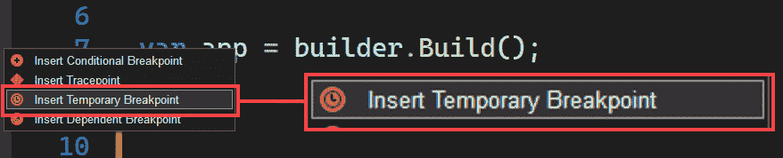

图 5.33 – 插入临时断点的菜单

如果您运行应用程序，您将看到一旦应用程序在断点处停止，它将自动删除。这种类型的断点可以在我们想要评估循环的第一个迭代时使用。

重要提示

要快速插入临时断点，请使用 *F9* + *Shift* + *Alt* 键，然后按 *T* 键。

现在我们已经检查了 Visual Studio 中可用的不同类型的断点，让我们看看我们如何利用它们使用不同的检查工具，这些工具将在下一节中介绍。

# 调试检查工具

在使用断点时，了解我们想要可视化的信息在哪里以及它是否正确非常重要。为此，在 Visual Studio 中，我们有一系列窗口，将允许我们可视化不同类型的信息。因此，让我们来看看它们。

## 观察窗口

**观察**窗口将允许我们在逐步执行代码时跟踪变量或属性值。当我们有多次重复的代码片段，如循环或常用方法时，这尤其有用。要访问此窗口，我们必须首先在代码中设置一个断点并执行应用程序。

一旦应用程序在断点处停止，我们就可以部署**调试** | **窗口**菜单。这将显示一组新的调试窗口，我们只能在应用程序运行时访问它们。让我们选择**观察**选项来选择一个窗口，如图*图 5.34*所示：

![Figure 5.34 – 达到观察窗口的菜单

![img/Figure_5.34_B17873.jpg]

图 5.34 – 达到观察窗口的菜单

一旦窗口已打开，我们可以添加我们想要监控的不同变量和属性的名称。只要我们为当前作用域输入了有效的变量名，我们将在**值**列中看到其对应的值，如图*图 5.35*所示：

![Figure 5.35 – 通过观察窗口监控变量值和属性

![img/Figure_5.35_B17873.jpg]

图 5.35 – 通过观察窗口监控变量值和属性

另一种非常简单的方法是将变量添加到**观察**窗口中，是在应用程序运行时右键单击要监控的变量，并选择**添加观察**选项。

重要提示

要快速访问任何**观察**窗口，你可以使用*Ctrl* + *Alt* + *W*快捷键，然后输入窗口编号（从*1*到*4*）。

## 快速观察

如此可见的`for`循环（在*击中计数*部分中看到）：

![Figure 5.36 – 从调试菜单中选择快速观察选项

![img/Figure_5.36_B17873.jpg]

图 5.36 – 从调试菜单中选择快速观察选项

此选项将激活一个模态窗口，这意味着我们无法继续运行应用程序，直到我们关闭它。在这个窗口中，我们将能够看到诸如表达式名称、值和数据类型等数据。

在此窗口中，非常有用的一点是我们将能够修改表达式。这意味着我们将能够评估其他变量，甚至可以执行一些我们想要测试的操作。在*图 5.37*中，我们看到这是如何实现的，我们输入了一个新的表达式来评估其结果是否为`true`或`false`：

![Figure 5.37 – 在快速观察窗口中修改表达式

![img/Figure_5.37_B17873.jpg]

图 5.37 – 在快速观察窗口中修改表达式

如我们所见，这提供了巨大的优势，因为我们可以在实时中快速测试变量和属性。

重要提示

你可以使用*Shift* + *F9*快捷键快速访问**快速观察**窗口。

## 自动和局部窗口

**自动**和**局部**窗口允许我们查看变量和属性信息，而无需像**观察**窗口那样将它们添加到某个地方。

然而，这些窗口具有特定的作用域。当 **Autos** 窗口显示我们放置断点周围的变量值时，**局部变量** 窗口将只显示当前作用域的值 – 也就是说，通常是断点所在的函数或方法。

关于这些窗口的另一个重要点是，它们只有在运行应用程序并放置断点后才会显示。

为了演示这对窗口，我在我们的 `Program.cs` 文件中添加了一个新方法并放置了一个断点，如图 *5.38* 所示：

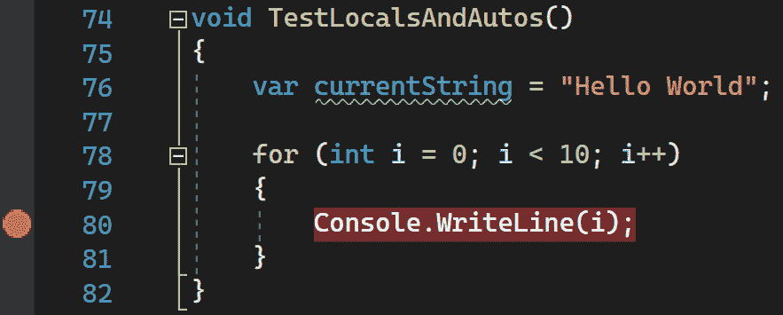

图 5.38 – 测试 TestLocalsAndAutos 方法，放置断点以演示局部变量和 Autos 窗口

一旦我们调用该方法，并且只有当应用程序正在运行时，我们才能通过 **调试** | **窗口** | **Autos** 菜单和 **调试** | **窗口** | **局部变量** 菜单来显示窗口：

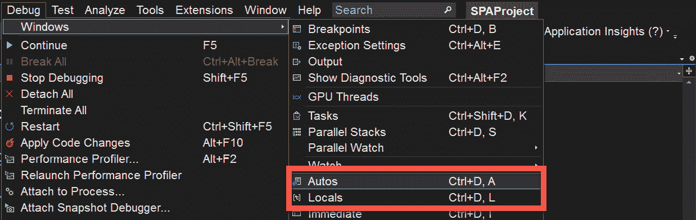

图 5.39 – 从调试菜单访问 Autos 和局部变量窗口

让我们先检查 `i` 和 `currentString` 变量，它们属于 `TestLocalsAndAutos` 方法：

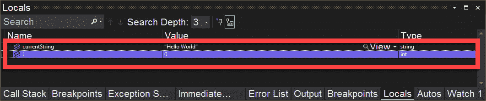

图 5.40 – 局部变量窗口

另一方面，如果我们查看 `i` 变量，因为它是在断点作用域内的信息，这意味着 `for` 循环：

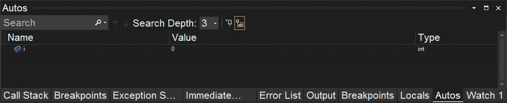

图 5.41 – Autos 窗口

这对窗口非常有用，可以一眼看到我们变量的所有可用信息。

重要提示

可以通过以下快捷键显示这些窗口：

**Autos**: *Ctrl* + *D*，然后按 *A* 键

**局部变量**: *Ctrl* + *D*，然后按 *L* 键

## 调用栈

虽然我们在 *监视窗口*、*快速监视* 和 *Autos 和局部变量窗口* 部分看到的窗口使用方法是错误纠正中最常用的方法，但我们还有一些其他方法来跟踪方法之间的调用流程。

其中一个这样的窗口称为 **调用栈**，当我们放置断点时，将显示到达相同点的调用堆栈。要显示窗口，我们必须从 **调试** | **窗口** | **调用栈** 中选择选项。此菜单项仅在应用程序运行时可用，但如果你希望窗口在每次调试会话中显示，可以使用图钉图标将其停靠。

在 *图 5.42* 中，我们执行了与 *自动和局部变量窗口* 部分相同的代码，并在相同的断点处停止。如图所示，**调用栈** 窗口显示了应用程序由于断点而停止时所在的代码行，以及为达到断点而调用的方法之间的调用集合：

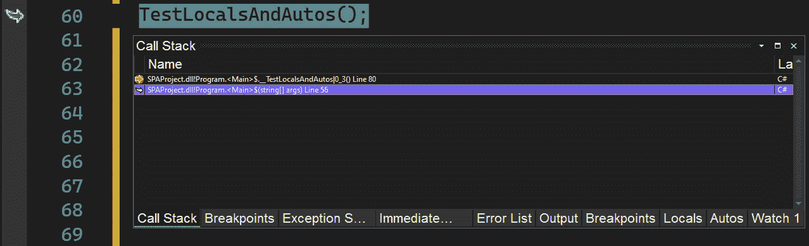

图 5.42 – 调用栈窗口

在 *图 5.42* 中，如果我们双击任何一个调用，我们还可以看到每个调用中应用程序的状态。这将使我们能够看到在应用程序流程中的某个特定点的属性和变量的值。

这将带我们到调用方法的代码部分，并且将以不同的颜色突出显示，以便我们不会与断点的颜色混淆。

重要提示

要显示 **调用栈** 窗口，您也可以按下 *Ctrl* + *Alt* + *C* 键。

## 立即窗口

另一个非常有兴趣的窗口是 **立即** 窗口。这个窗口，我们可以从 **调试** | **窗口** | **立即** 菜单中打开，将允许我们评估表达式、执行语句，并打印变量和属性的值。

当您打开这个窗口时，您一定会对里面什么都没有感到惊讶。这是因为这个窗口将允许您在上面写入，输入变量或属性的名称，甚至调用方法（如果它们在作用域内），加上您在编写表达式时将拥有所有潜在的 IntelliSense 功能。IntelliSense 是 Visual Studio 的自动完成帮助，它通过人工智能得到增强，我们将在 *第七章*，*使用 AI 和代码视图高效编码* 中更多地讨论它。

在 *图 5.43* 中，`TestLocalsAndAutos` 方法的调用再次执行，我们获得了主 `currentString` 字符串的子串：

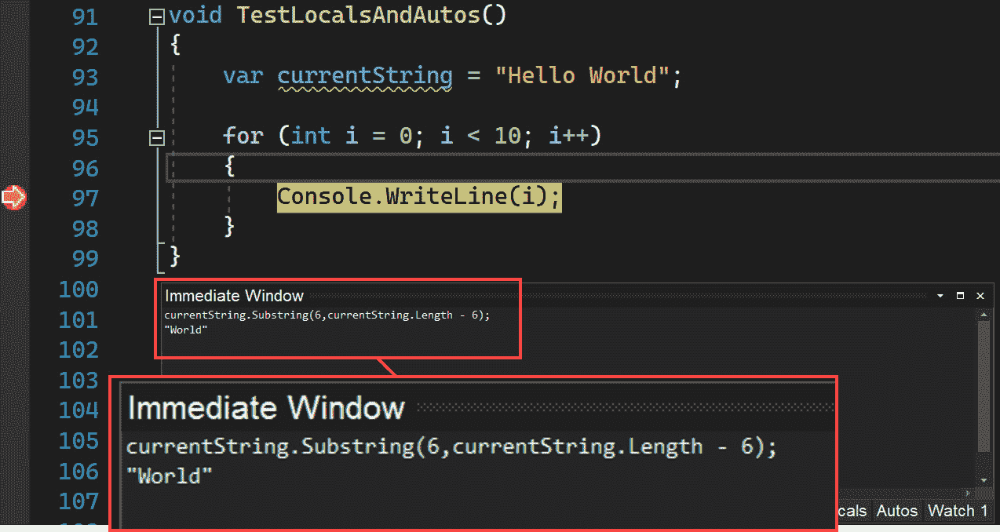

图 5.43 – 立即窗口

这个窗口的一个很大的优点是，我们可以执行尽可能多的表达式，保留我们获得的所有结果列表以及输入的表达式。

重要提示

如果您按下 *Ctrl* + *Alt* + *I* 键，可以显示 **立即** 窗口。

# 摘要

Visual Studio 为调试源代码提供了许多选项。在本章中，我们学习了什么是断点，不同类型的断点，以及我们可以激活以跟踪变量和属性数据的关联窗口。这些信息至关重要，因为它将帮助您在遇到问题时解决代码中的问题。

在下一章，*第六章**，添加代码片段*中，你将了解代码片段的概念，它允许你在不同的项目中重用常见的代码片段，并快速调整以满足你的需求。
