# 第九章：样式和清理工具

不论你是前端开发者还是后端开发者，拥有帮助你维护干净代码的工具对于以高效的方式推进项目至关重要。

同样，拥有允许你更快地编辑 CSS 文件的工具可以使开发团队在项目上更快地移动。幸运的是，Visual Studio 有几个你可以在处理 CSS 文件时使用的工具，这将允许你以用户友好的方式快速编写和完成你的样式。

如果你是一名后端程序员并且使用 C#或 Visual Basic，你也应该知道，有代码分析工具，既可以维护良好的质量，也可以遵循你可以定义的命名约定。

这是本章我们将涵盖的主要主题：

+   使用 CSS 样式工具

+   使用代码分析工具清理代码

# 技术要求

为了执行本章中探索的测试，你必须已经安装了*第一章*中显示的工作负载，“Visual Studio 2022 入门”。

此外，为了跟随“使用图像”部分，你必须安装一个名为**图像和 3D 模型编辑器**的附加组件，如图所示：

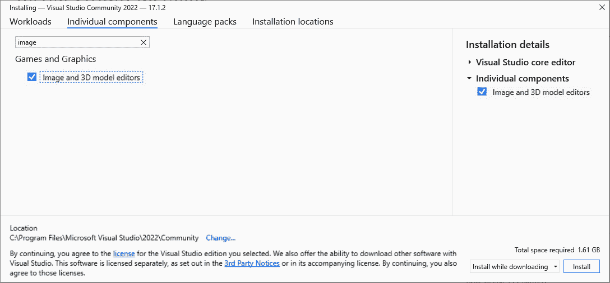

图 9.1 – 图像和 3D 模型编辑器单个组件选择

你可以在以下存储库中找到已添加到项目中的代码片段：

[`github.com/PacktPublishing/Hands-On-Visual-Studio-2022/tree/main/Chapter09`](https://github.com/PacktPublishing/Hands-On-Visual-Studio-2022/tree/main/Chapter09)

# 使用 CSS 样式工具

对于前端 Web 开发者来说，拥有编辑 CSS 文件的工具是一个优势，因为它允许他们快速轻松地编辑这些文件。这就是为什么 Visual Studio 包含几个在创建和编辑这些文件时非常有帮助的工具。

让我们从检查 CSS3 代码片段开始。

## CSS3 代码片段

即使在今天，样式显示仍然存在跨浏览器兼容性问题。肯定发生过这样的情况，当你实现一个 CSS 属性时，它在每个浏览器上看起来都不同。

正是因为这个原因，Visual Studio 实现了 CSS3 代码片段完成系统，它允许跨浏览器兼容性，而无需为每个浏览器编写代码。

为了以实际的方式看到这一点，我们可以打开`SPAProject` | `ClientApp` | `src` | `components` | `NavMenu.css`文件，并定位到`.box-shadow`样式。在这个样式内，我们可以开始输入术语`border-radius`，这将显示 IntelliSense 推荐列表，如图 9.2 所示：


图 9.2 – border-radius 术语的推荐

您可以看到这个列表中有两种类型的图标，一些是蓝色的几何形状，而另一些是白色的正方形。在这些图标中，我们感兴趣的是白色图标，因为它们是 CSS3 片段。我们可以使用键盘上的键滚动列表，一旦我们选择了感兴趣的片段，只需按两次 *tab* 键，这将导致实现跨浏览器的 CSS3 片段，如下所示：

```cs
.box-shadow {
```

```cs
    box-shadow: 0 .25rem .75rem rgba(0, 0, 0, .05);
```

```cs
    -moz-border-radius: inherit;
```

```cs
    -webkit-border-radius: inherit;
```

```cs
    border-radius: inherit;
```

```cs
}
```

在最常见的多浏览器 CSS3 样式中，我们可以找到以下内容：

+   对齐样式

+   动画样式

+   背景样式

+   边框样式

+   盒子样式

+   列样式

+   弹性样式

+   网格样式

+   遮罩样式

+   文本样式

+   过渡样式

如您所见，这些片段可以通过有效攻击跨浏览器兼容性来帮助您创建样式。现在让我们看看 Visual Studio 如何通过缩进来帮助我们更快地理解 CSS 样式。

## 分层 CSS 缩进

样式缩进是一种视觉辅助工具，通过在行的开头显示空格来显示样式的内容，以及属于父样式的子样式，可以显著提高生产力。

Visual Studio 允许您在样式文件中创建快速缩进。例如，如果您想创建一个名为 `.main` 的样式以及影响 `.main` 样式内所有 `div` 元素的子样式，如下所示：

```cs
.main {
```

```cs
    padding: 0px 12px;
```

```cs
    margin: 12px 8px 8px 8px;
```

```cs
    min-height: 420px;
```

```cs
}
```

```cs
.main div {
```

```cs
    border: 25px;
```

```cs
}
```

在原则上，如果您在相同的缩进级别编写了样式，您可以通过转到 **编辑** | **高级** | **格式文档** 菜单来应用缩进，从而对整个文档进行分层缩进，如下面的代码块所示：

```cs
.main {
```

```cs
    padding: 0px 12px;
```

```cs
    margin: 12px 8px 8px 8px;
```

```cs
    min-height: 420px;
```

```cs
}
```

```cs
    .main div {
```

```cs
        border: 25px;
```

```cs
    }
```

如果您只想对特定选择的样式集应用缩进，可以选择 **编辑** | **高级** | **格式选择** 选项。

注意

可以通过 **工具** | **选项** | **文本编辑器** | **CSS** | **制表符** 选项来自定义缩进值。

现在，让我们看看 Visual Studio 中的颜色选择器功能。

## 颜色选择器

在处理样式时，选择元素颜色的功能非常有用。幸运的是，Visual Studio 有一个内置的颜色选择器，虽然看起来非常简单，但它的工作做得很好。

为了测试它，让我们编辑在 *分层 CSS 缩进* 部分中创建的 `.main` 样式。输入 `background-color:` 属性，这将显示一个带有指定名称的预定义颜色列表的垂直显示，您可以选择。忽略此列表，而是输入 `#` 符号。立即，您将看到一个新的预定义颜色水平列表，如图 *9.3* 所示：

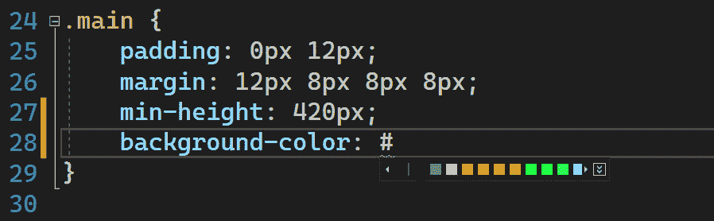

图 9.3 – 预定义颜色的水平列表

如果您想设置自定义颜色，可以点击颜色列表末尾的按钮，这将显示颜色选择器，如下所示：

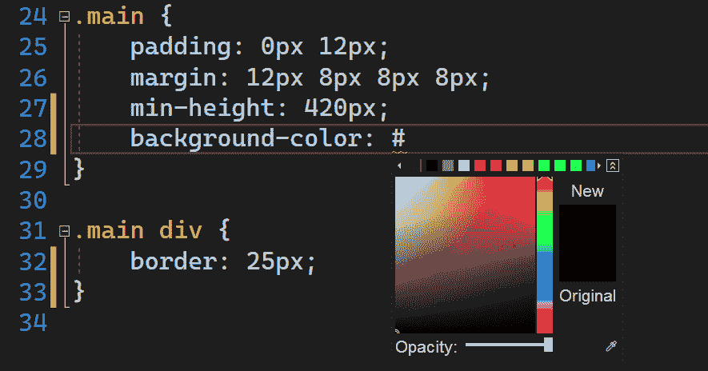

图 9.4 – CSS 颜色选择器

这样，就可以从颜色选择器中选择一个颜色，改变颜色的色调，为所选颜色添加不透明度或透明度，甚至可以使用吸管工具从外部源，如图片中选取颜色。对于这个演示，我已经选择了 *图 9.5* 中看到的 `#1b0b8599` 代码的颜色：

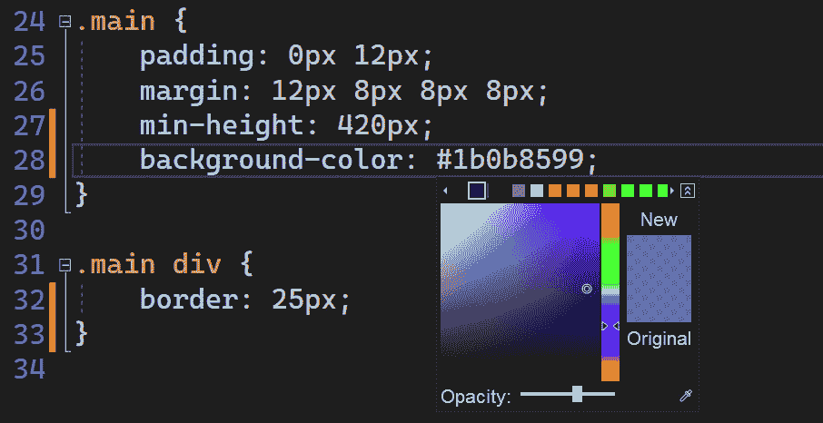

图 9.5 – 从颜色选择器中选择自定义颜色

这个工具的一个巨大优势是它会将自定义选择的颜色内部存储，因此你可以在整个 CSS 文件中反复使用它们。例如，如果我们去 `.main div` 样式并想要将自定义颜色分配给 `color` 属性，我们会看到在水平颜色列表中，我们在 *图 9.5* 中使用的自定义颜色被列出，如下所示：

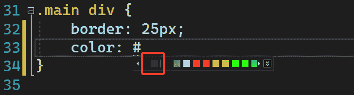

图 9.6 – 存储的先前使用的自定义颜色列表

毫无疑问，颜色选择器是我们需要分配自定义颜色时非常有帮助的工具。现在，让我们来看看 IntelliSense 如何帮助我们更快地在 CSS 文件中编写代码。

## 样式文件中的 IntelliSense

就像 IntelliSense 在创建源代码时可以提供非凡的帮助一样，它在创建样式文件时也非常有用。

让我们看看 IntelliSense 的实际使用示例。让我们转到 `ClientApp` | `src` | `components` | `NavMenu.css` 文件。在这个文件内部，让我们继续创建一个名为 `.intellisense` 的新样式，正如我们在这里可以看到的那样：

```cs
.intellisense{    
```

```cs
}
```

如果我们定位在样式内部并按下 *Ctrl* + *空格键* 组合键，将显示可以添加到新创建样式的所有属性的列表。如果我们开始输入属性名，它将开始过滤与我们所输入的匹配项的列表，正如 *图 9.7* 中所示：


图 9.7 – IntelliSense 显示推荐

此外，还可以从列表中选择一个项目，并通过按下 *Tab* 键来完成项目名称。

对于这个演示，让我们假设我们需要使用 `background` 属性，但我们不知道可以分配给它的可能值。IntelliSense 可以通过以可视化的方式向我们展示每个属性的用法来帮助我们，正如我们可以在以下图中看到的那样：

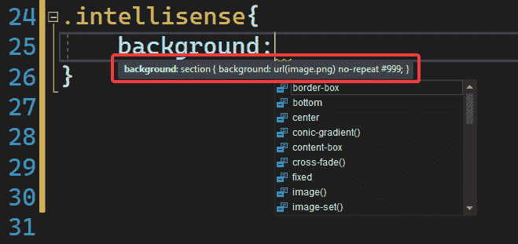

图 9.8 – IntelliSense 显示背景属性的可能的用法

不仅如此，IntelliSense 还会根据所选属性的上下文调整结果。例如，假设我们需要将一组字体分配给样式的`font-family`属性。如果我们输入`font-family`属性，Visual Studio 将提供与`font-family`属性相对应的值列表，如图*图 9.9*所示：


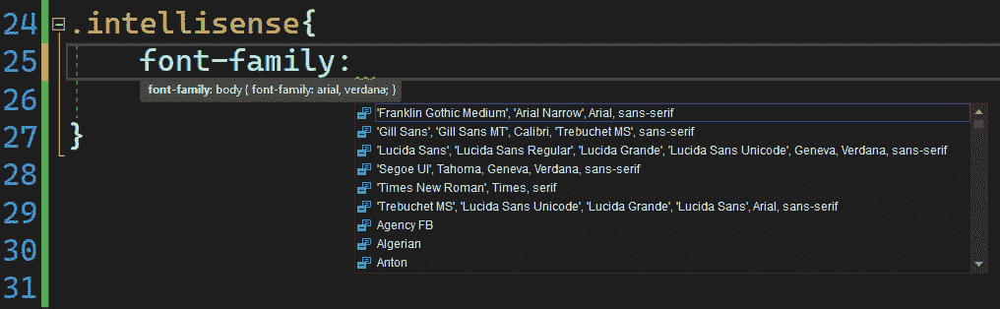

图 9.9 – IntelliSense 推荐的 font-family 属性值

如果我们想要为`font-weight`属性分配一个值，我们将根据此属性看到结果，如图*图 9.10*所示：

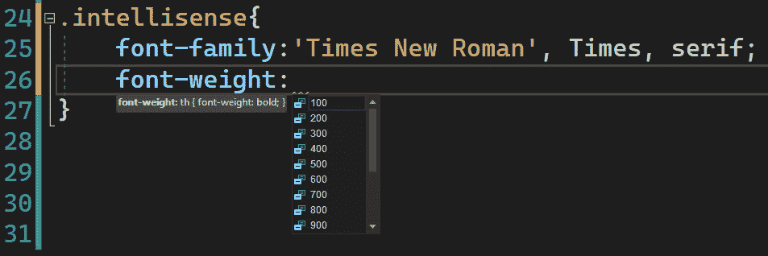


图 9.10 – IntelliSense 推荐的 font-weight 属性值

毫无疑问，IntelliSense 是创建样式的优秀辅助工具。现在，让我们继续分析图像编辑器。

## 处理图片

在 Visual Studio 中不太为人所知的工具是图片编辑器。此工具必须按照*技术要求*部分所述进行安装，毫无疑问，它可以帮助我们对项目中的图片进行基本编辑。

这里有一些图像编辑器有用的场景：

+   当我们需要调整图片大小比例时

+   当我们需要将某个部分的颜色更改为另一种颜色时

+   当我们需要旋转图片时

+   当我们需要在图片上添加文本时

+   当我们需要对图片应用过滤器时

在*技术要求*部分提到的仓库中，我已经添加了一个位于`SPAProject` | `ClientApp` | `public` | `visualstudiologo.png`的图片，用于使用图片编辑器进行不同的测试。

一旦我们打开图片（在这种情况下，`visualstudiologo.png`），我们将看到两个工具栏 – 一个位于左侧，称为*图像编辑器*工具栏，另一个位于顶部，称为图像编辑器模式工具栏，如图以下所示：

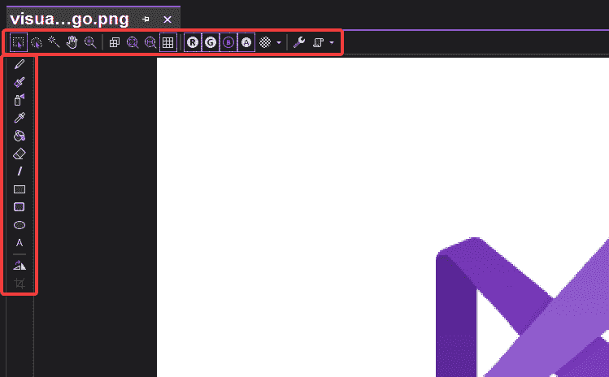


图 9.11 – Visual Studio 图像编辑器

首先，让我们分析图像编辑器工具栏。这是一个出现在编辑器左侧的栏，其中包含允许你在图片上执行某些操作的工具，例如添加几何形状或旋转图片。

在顶部，我们有图像编辑器模式工具栏。此工具栏包含执行高级命令的按钮，例如不规则选择、魔杖选择、平移、缩放和图像属性。

让我们看看一个实际例子。假设我们需要在图片上执行以下任务：

+   将图片转换为灰度。

+   水平翻转图片。

+   在图片上写上文本`Visual Studio Logo`。

要执行这些任务，我们必须按照以下步骤依次进行：

1.  在图像编辑器模式工具栏中，选择**高级** | **过滤器** | **黑白**选项，如图以下所示：

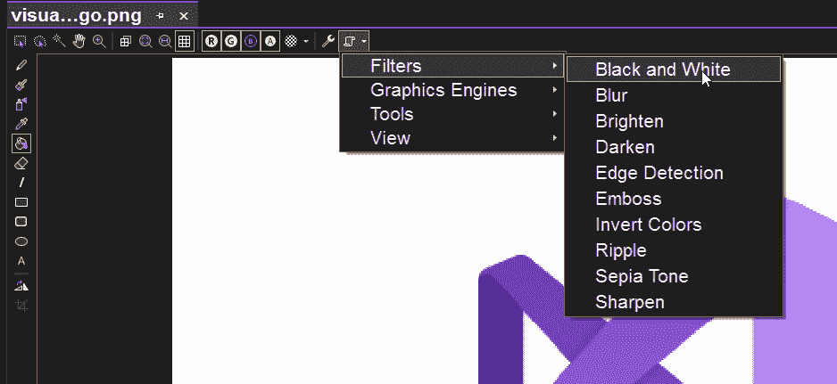

图 9.12 – 将图像转换为灰度

1.  在图像编辑工具栏中，双击旋转图像按钮，如图所示：

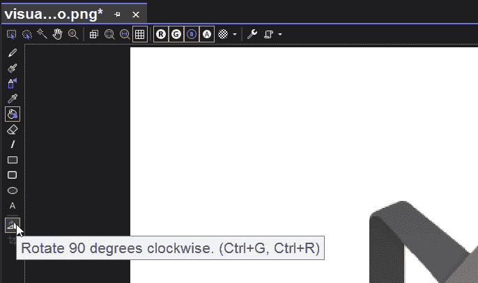

图 9.13 – 旋转图像

1.  选择文本工具，如图 9.14 所示：

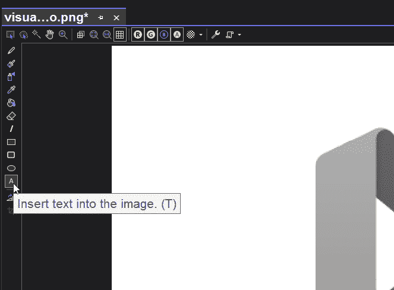

图 9.14 – 选择文本工具

1.  在**属性**窗口中添加文本 `Visual Studio Logo`，如图 9.15 所示：

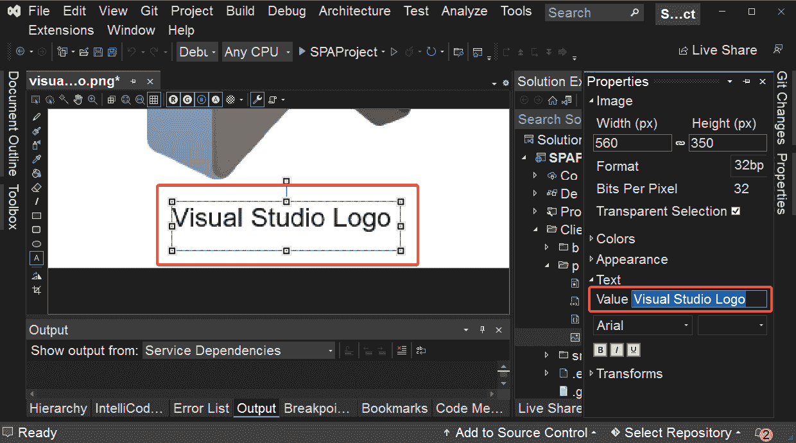

图 9.15 – 在属性窗口中更改文本值

应用这些编辑后，我们将得到如图 9.16 所示的结果：

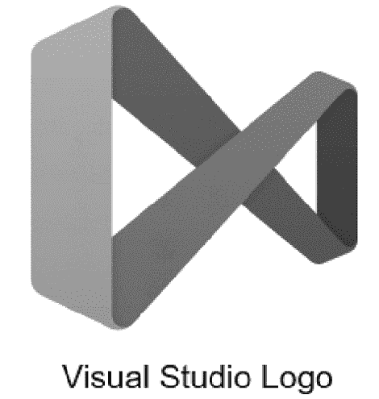

图 9.16 – 应用更改后的结果

最后一步是将图像保存，以便永久应用更改。通过这个例子，我们能够看到图像编辑器在需要编辑我们的图像时可以非常有用。

在下一部分，让我们了解代码分析如何帮助 .NET 开发者拥有干净和高质量的代码。

# 使用代码分析工具清理代码

Visual Studio 2022 包含一系列 C# 或 Visual Basic 代码分析器，允许我们在源代码中维护良好的代码质量和一致的风格。要默认使用此功能，项目必须在 .NET 5 或更高版本的框架版本上配置。为了区分编译错误，分析违规将显示为代码质量分析违规时的 **CA** 前缀，以及样式分析违规时的 **IDE**。

代码分析工具对应于代码质量分析和代码风格分析，因此我们将了解它们是什么，它们如何帮助我们，以及如何设置和运行带有代码清理配置文件。让我们首先看看如何利用代码质量分析。

## 代码质量分析

代码质量包括拥有安全、性能最佳和设计良好的源代码，以及其他特性。幸运的是，Visual Studio 可以通过默认启用的规则帮助我们维护高质量的代码。

为了以实际的方式可视化这些违规之一，让我们转到 `Program.cs` 文件，并在文件末尾添加以下行：

```cs
int value1 = 1;
```

```cs
int value2 = 1;
```

```cs
Console.WriteLine(Object.ReferenceEquals(value1, value2));
```

现在，要编译项目，右键单击项目名称，然后单击以下图示中的**构建**选项：

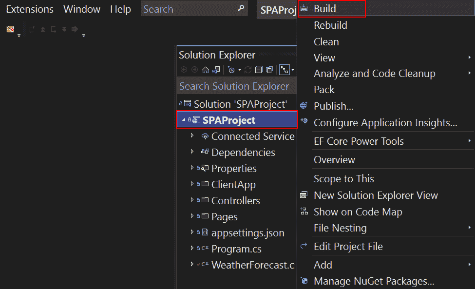

图 9.17 – 编译项目

在执行编译时，我们不会立即看到错误；然而，如果你导航到 `int` 到 `ReferenceEquals` 方法，因为它会因为值类型的 *装箱* 操作（从 *值* 类型转换为 *引用* 类型）而始终返回一个 *false* 值：

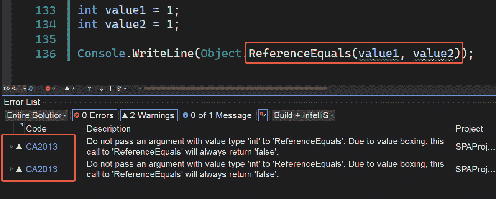

图 9.18 – 代码质量警告

重要提示

有时，Visual Studio 可能会通过错误上的灯泡图标建议代码修复来修复代码中的警告。您还可以在以下 URL 看到完整的代码质量规则列表：[`github.com/dotnet/roslyn-analyzers/blob/main/src/NetAnalyzers/Core/AnalyzerReleases.Shipped.md`](https://github.com/dotnet/roslyn-analyzers/blob/main/src/NetAnalyzers/Core/AnalyzerReleases.Shipped.md)。

让我们现在看看应用于代码样式的规则。

## 与代码样式一起工作

代码样式是配置，对于 C#和 Visual Basic 开发者来说非常有用，可以帮助他们保持项目命名的一致性，尤其是当项目由团队的多位成员使用时。

可以为特定项目或安装在机器上的 Visual Studio 实例创建代码样式。

使用代码样式的办法是打开**工具** | **选项** | **文本编辑器** | **C# 或 Visual Basic** | **代码样式** | **常规**部分：

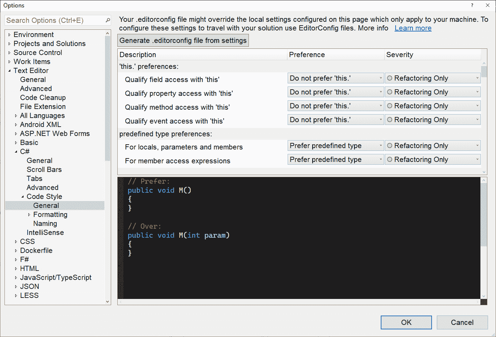

图 9.19 – 代码样式配置窗口

一旦我们在这个窗口中，我们将能够看到当前机器的代码样式配置。我们可以更改这些选项中的任何一个以适应我们需要的代码命名约定。

如果我们需要指定一个配置文件作为解决方案的一部分来应用，即使它在另一台机器上打开，我们也可以修改配置值。一旦我们有了想要在整个解决方案中遵循的设置，我们应该点击**从设置生成 .editorconfig 文件**按钮，如图所示：

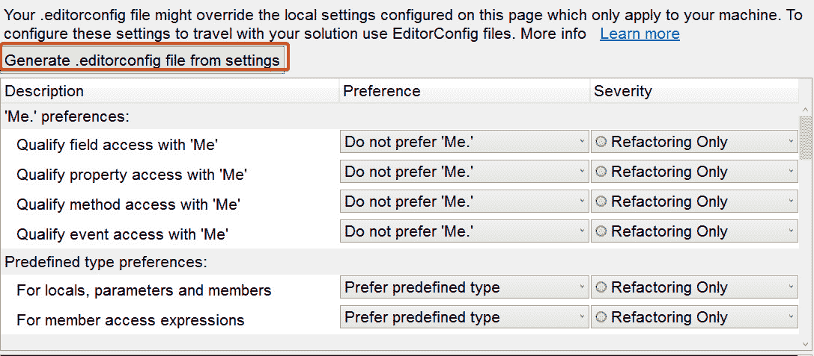

图 9.20 – 生成配置文件的按钮

这将打开一个对话框，询问配置文件的名称和保存路径。在这个例子中，它已经被保存为`config.editorconfig`，如图所示：

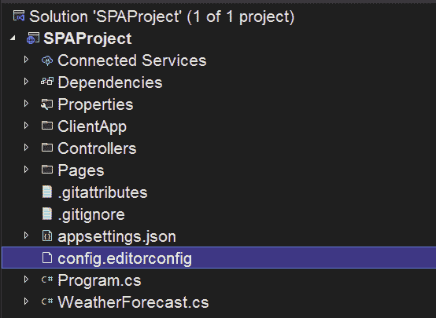

图 9.21 – 创建的配置文件

如果我们打开我们创建的文件，文本编辑器将打开。在这里，我们将能够以文本格式看到应用的配置，并能够快速更改预选参数。这些更改将伴随解决方案，以确保所有属于项目且具有相同代码命名的源文件。

现在，让我们谈谈代码清理配置文件，它将控制代码清理时应应用哪些方面。

## 配置代码清理配置文件

代码清理配置文件是一种配置，您可以通过它来指定想要应用到项目中的代码清理类型。有多种方法可以访问配置文件窗口，但一般方法是前往**工具** | **选项** | **文本编辑器** | **代码清理** | **配置代码清理**菜单。这将显示以下图示：


图 9.22 – 配置代码清理窗口

正如您所看到的，可以配置两个清理配置文件，其中**配置文件 1**是默认执行的。同样，在窗口中我们有两个部分：

+   **包含的修复程序**列表包含我们希望在项目中应用的具体活动操作。

+   **可用修复程序**列表包含当前已禁用的操作，但我们可以随时将它们添加到活动操作中。

可以轻松启用或禁用修复程序，如*图 9.22*中标记的箭头按钮所示。

## 执行代码清理

一旦我们创建了代码清理文件并确定了将应用于清理的修复程序，让我们看看如何应用此清理。

要这样做，我们将光标移至编辑器的底部，然后按下带有扫帚图标的按钮，如图*图 9.23*所示：

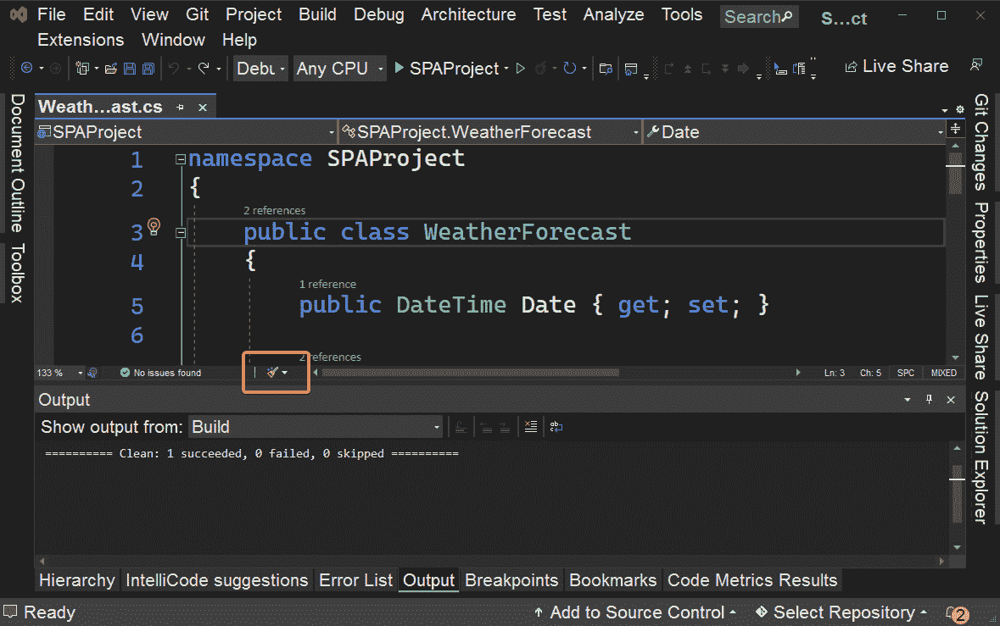

图 9.23 – 执行代码清理的按钮

如*配置代码清理配置文件*子节所述，这将仅应用活动清理配置文件中配置的规则。例如，假设我们在默认配置配置文件中有以下配置：

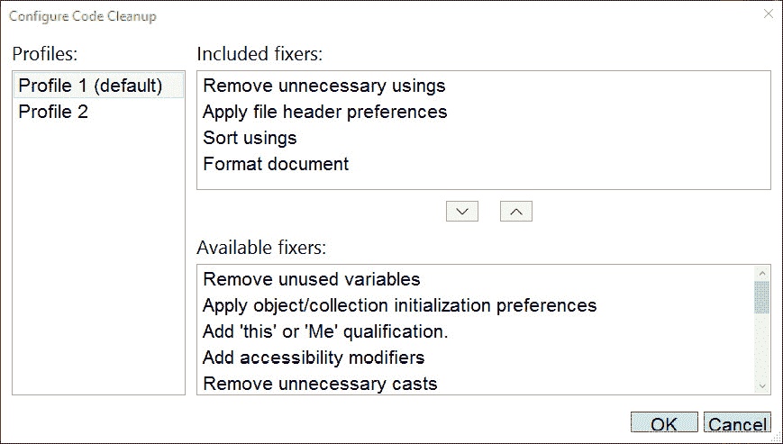

图 9.24 – 一组选定的测试修复程序

然后，我们决定修改`WeatherForecast.cs`文件，使用以下无缩进的代码，并且包含一个未使用的`using System.Data.Common`命名空间：

```cs
using System.Data.Common;
```

```cs
namespace SPAProject
```

```cs
{
```

```cs
public class WeatherForecast
```

```cs
{
```

```cs
 public DateTime Date { get; set; }
```

```cs
 public int TemperatureC { get; set; }
```

```cs
 public int TemperatureF => 32 + (int)(TemperatureC / 
```

```cs
     0.5556);
```

```cs
 public string? Summary { get; set; }
```

```cs
}
```

```cs
}
```

现在，当我们应用代码清理时，将得到干净的代码，如图所示：

```cs
namespace SPAProject
```

```cs
{
```

```cs
     public class WeatherForecast
```

```cs
     {
```

```cs
          public DateTime Date { get; set; }
```

```cs
          public int TemperatureC { get; set; }
```

```cs
          public int TemperatureF => 32 + (int)
```

```cs
              (TemperatureC / 0.5556);
```

```cs
          public string? Summary { get; set; }
```

```cs
     }
```

```cs
}
```

毫无疑问，这个工具可以帮助我们保持一致和干净的样式，无论我们是单独工作还是与开发团队一起工作。

注意

可以通过**工具** | **配置** | **文本编辑器** | **代码清理**中的**在保存时运行代码清理配置文件**选项配置 Visual Studio，在每次保存文件时执行代码清理。

# 摘要

在本章中，我们学习了 Visual Studio 为前端和后端开发者提供的不同工具。

我们学习了 CSS3 代码片段如何帮助我们快速创建跨浏览器兼容的样式。同样，层次化的 CSS 缩进有助于保持样式可读。此外，颜色选择器可以帮助我们快速选择颜色，我们还看到了当需要编辑 CSS 文件时 IntelliSense 的存在，最后，图像编辑器提供了有用的工具，如果我们需要对我们图像进行基本编辑的话。

在代码分析的情况下，我们已经了解到代码质量分析如何帮助我们拥有安全可靠的代码，而代码样式分析则帮助我们维护命名约定，无论我们是单独工作还是与开发团队一起工作。

在*第十章*，*发布项目*，你将学习在各个平台上发布 Web 项目的最常见方法。
