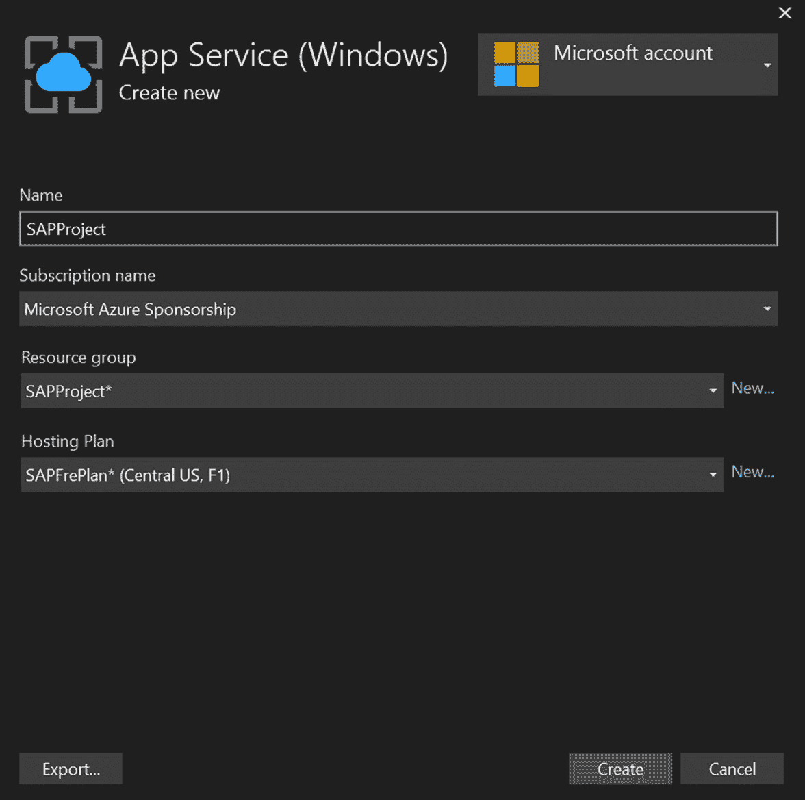

# 第十章：发布项目

在完成一个 **概念验证**（**POC**）或 **最小可行产品**（**MVP**）（这意味着一个具有主要功能实现的演示或试点项目，如 *第八章*，*Web 工具和热重载* 中所述）后，我们需要将我们的更改部署到实际场景中，以查看项目的工作情况，并与我们的客户分享已发布的项目。Visual Studio 提供了一套部署我们项目的工具。我们可以选择在本地环境中部署项目的选项，但也可以使用云中的服务。

在本章中，您将学习如何通过几步点击即可使用 Visual Studio 2022 部署您的项目。这些工具将帮助您在需要部署时节省时间并降低复杂性。

我们将讨论和回顾以下主题，即使用 Visual Studio 2022 发布项目的选项：

+   发布项目的选项

+   在文件夹中发布

+   在 **互联网信息服务**（**IIS**）中发布

+   在 Microsoft Azure 中发布

让我们深入探讨，了解所有关于发布项目的内容。

# 技术要求

要按照本章提供的步骤发布项目，您必须之前已安装带有 Web 开发工作负载的 Visual Studio 2022，如 *第一章*，*使用 Visual Studio 2022 入门* 所示。拥有您在 *第四章*，*创建项目和模板* 中创建的 SPA 基础项目非常重要。

对于 *在 Microsoft Azure 中发布* 部分，您需要一个带有积分的 Azure 账户来完成部署。

您可以在以下链接中查看对项目所做的更改：[`github.com/PacktPublishing/Hands-On-Visual-Studio-2022/tree/main/Chapter10`](https://github.com/PacktPublishing/Hands-On-Visual-Studio-2022/tree/main/Chapter10)。

# 发布项目的选项

Visual Studio 有两种方式来访问 **发布**选项，然后显示用于部署项目的集成可能性。

在菜单中，我们可以通过导航到 **构建** | **发布 [项目名称]** 来访问此选项。默认情况下，当前解决方案中的主项目被选中，如下所示：

Figure 10.1 – 构建菜单中的发布 SPAProject 选项

另一种可能性是在 **解决方案资源管理器**选项卡中右键单击我们想要发布的项目（参见 *Figure 10.2*）：

Figure 10.2 – 右键单击菜单后的发布…选项

无论选择哪个选项，Visual Studio 都会显示一个模态窗口，显示解决方案中主项目或所选项目的支持部署类型，如下截图所示：

图 10.3 – 在 Visual Studio 中发布项目的选项

让我们逐一回顾这些选项：

+   **Azure**: 项目将使用服务在 Azure 中部署，具体取决于所使用的技术。

+   **Docker 容器注册表**: 此选项帮助我们发布包含网站的 Docker 容器。

+   **文件夹**: 此选项将项目发布到文件系统中选择的文件夹。

+   **FTP/FTPS 服务器**: 使用此选项，出版物的文件将被传输到 FTP 服务器。

+   **Web 服务器 (IIS)**: 在 IIS 中部署项目，Windows 的默认服务器。

+   **导入配置文件**: 允许我们导入另一个配置来发布已创建的项目。

在接下来的几节中，我们将回顾一些这些选项。我们将使用 **Azure**、**文件夹** 和 **Web 服务器 (IIS**) 选项来转换项目，因为 **Docker 容器注册表** 设置起来稍微复杂一些，并且对于 FTP/FTPS 服务器，我们需要有一个运行的 FTP 服务器，这在现代解决方案中并不常见。

到目前为止，您已经知道如何访问 Visual Studio 中的 **发布** 选项来部署 Web 应用程序。现在，让我们探索一些发布项目在 Visual Studio 中的首选选项。

# 在文件夹中发布

发布项目最常见的选择之一是使用我们的文件系统并将网站保存在文件夹中，包括所有用于在本地服务器（如 IIS、Apache 或 NGINX）中使用的资源。Visual Studio 有一个选项，可以轻松地使用这种方法发布我们的项目。

您可以使用任何选项导航到我们之前在 *发布项目的选项* 部分中回顾的发布功能，然后选择 **文件夹**，接着点击 **下一步**：

图 10.4 – 发布项目的文件夹选项

在下一个窗口中，我们可以使用 **浏览…** 选项指定我们想要保存已发布项目的文件夹。我们可以使用绝对路径和相对路径。然后，我们可以通过点击 **完成** 来完成配置：

图 10.5 – 发布项目的文件夹位置

重要提示

选定的文件夹必须是空的。如果您选择一个包含文件的文件夹，这可能会在文件中创建冲突。Visual Studio 将尝试使用发布过程中生成的文件替换同名文件。

完成发布配置后，Visual Studio 将生成一个以 `.pubxml` 扩展名结尾的文件，该文件包含我们之前选择的选项，并以 XML 格式存储。现在，我们可以使用 **发布** 按钮将项目发布到所选文件夹：

图 10.6 – 使用配置创建的 .pubxml 文件

点击**发布**后，Visual Studio 将显示**发布到文件夹…**消息和一个控制台日志，您可以在其中检查在此过程中执行的所有步骤。在*图 10.7*中，您可以在**输出**面板中看到日志：

图 10.7 – 点击发布后的发布进度

最后，等待几秒钟后，我们将看到**发布成功**确认消息，这意味着过程没有问题完成（见*图 10.8*）：

图 10.8 – 发布成功消息和发布文件夹

在*图 10.8*中，我们可以看到右侧的文件夹包含与我们项目发布相关的所有文件。

我们有一些可以使用铅笔图标更改的附加设置：

图 10.9 – 在目标位置删除现有文件的选项

点击**删除现有文件**选项后，我们将看到一些我们可以根据需要更改的附加设置（见*图 10.10*）：

图 10.10 – 发布项目时的附加设置

让我们回顾一下*图 10.10*中的所有选项：

+   **配置**：我们可以选择**调试**和**发布**。后者针对生产进行了优化。

+   **目标框架**：通常，它与项目中使用的版本相同，但我们可以选择一个特定的版本来运行我们的项目。

+   **部署模式**：我们可以选择**框架依赖**，这意味着框架应该安装在服务器上，或者**自包含**，这意味着发布将包括框架以及运行项目所需的所有依赖项。

+   **目标运行时**：这是应用程序将发布的系统架构和操作系统。

+   **在发布前删除所有现有文件**：这允许 Visual Studio 删除为发布项目所选文件夹中的所有现有文件。

    重要提示

    最好勾选**在发布前删除所有现有文件**选项，以避免在发布过程中与现有文件发生冲突。

您现在知道如何在 Visual Studio 中发布到文件夹。您只需选择您希望部署应用程序的文件夹，然后使用发布选项。

# 在 IIS 中发布

IIS 是 Windows 生态系统中最受欢迎的服务器。它默认包含在所有 Windows Server 版本中，并且可以在 Windows 上安装它。

要在 Windows 8、10、11 或更高版本中安装 IIS，您可以在 Microsoft 文档的*步骤 1 – 安装 IIS 和 ASP.NET*部分中遵循此指南：

[`docs.microsoft.com/windows/msix/app-installer/web-install-iis`](https://docs.microsoft.com/windows/msix/app-installer/web-install-iis)

您可以使用 Visual Studio 轻松地在 IIS 中部署 Web 应用程序。首先，您需要打开我们在*发布项目选项*部分审查的**发布**选项，并选择**Web 服务器（IIS）**（见*图 10.11*）：

图 10.11 – 发布项目的 Web 服务器（IIS）选项

重要提示

如果发布配置文件夹中已经存在`.pubxml`文件，您需要删除它以创建一个新的配置。

在选择**Web 服务器（IIS）**后，您可以点击**下一步**并继续该过程。您将看到两个选项可供选择（见*图 10.12*）：

图 10.12 – 在 IIS 中部署的选项 – Web Deploy 和 Web Deploy 包

在 IIS 中部署我们有两种选项：

+   **Web Deploy**：在 IIS 中部署文件夹，包括所有文件。

+   `.zip`文件，包括发布文件夹内的所有文件。

在这种情况下，我们将选择**Web Deploy**并点击**下一步**。

您需要填写**服务器**、**网站名称**和**目标 URL**字段（见*图 10.13*）：

图 10.13 – 在 IIS 中发布到默认网站的配置

我们将使用在 IIS 中创建的默认网站。如果您已经使用此网站与其他应用程序一起使用，您可以在 IIS 中设置另一个网站名称。

使用**验证连接**按钮，您可以检查 Visual Studio 是否可以使用提供的设置创建网站并完成发布。您可以使用**完成**按钮来完成设置。

重要提示

您需要以管理员身份执行 Visual Studio 以授予对 IIS 的访问权限；否则，您将收到错误。

完成所有步骤后，您将收到**准备发布**的消息和一些编辑配置的选项。我们现在可以使用**发布**按钮：

图 10.14 – 使用 IIS 准备发布的项目

自动地，Visual Studio 将在浏览器的新窗口中打开，显示我们在配置中设置的网站的 URL（见*图 10.13*）在`http://localhost`：

图 10.15 – 发布后在 IIS 中运行的项目

您刚刚学习了如何使用 Visual Studio 在 IIS 中部署 Web 应用程序。Visual Studio 简化了完成设置的步骤，并将所有文件设置在 IIS 内部的一个文件夹中。现在，让我们回顾另一种使用 Azure 部署应用程序的方法。

# 在 Microsoft Azure 中发布

**Azure** 是由微软创建的云服务提供商，它是初创公司和 .NET 开发者中最受欢迎的之一。由于 Azure 和 Visual Studio 由同一家公司和社区支持，因此这些技术之间有很好的集成。

要在 Azure 中部署我们的 SPAProject，我们需要使用我们在“发布项目的选项”部分中审查的方法选择发布选项，选择 **Azure**，然后在下一屏幕上选择 **Azure App Service (Windows)**：

图 10.16 – 在 Azure 中发布的可能性

记得删除项目中的任何 `.pubxml` 文件以创建新的配置。

重要提示

要完成本节中的步骤并在 Azure 中发布 SPAProject，您需要一个带有积分的 Azure 账户。

Visual Studio 提供了一些在 Azure 中部署的选项。让我们来回顾一下：

+   **Azure App Service (Windows)**：使用 Windows 作为操作系统在 **平台即服务**（**PaaS**）容器中发布项目。

+   **Azure App Service (Linux)**：使用 Linux 作为操作系统在 PaaS 容器中发布项目。

+   **Azure App Service 容器**：在 Azure App 中使用 Azure App Service 容器运行容器。

+   **Azure 容器注册库**：将应用程序作为 Docker 镜像发布。

+   **Azure 虚拟机**：在虚拟机中发布文件夹，然后手动使用 IIS 运行应用程序。

点击 **下一步** 后，您将获得一个新窗口以在 Azure 中进行身份验证并连接到您的账户中的服务和资源：

图 10.17 – Azure 账户登录

在 *图 10.17* 中，我们看到一个新窗口，我们需要使用 **登录…** 按钮通过 Azure 进行身份验证以继续设置并将 Visual Studio 与 Azure 账户中的资源集成。身份验证完成后，我们可以选择订阅并使用绿色十字按钮创建一个新的 Web 应用实例（见 *图 10.18*）：

图 10.18 – 选择订阅并创建新的应用服务的选项

我们需要为我们的 SPAProject 选择托管计划：

图 10.19 – 新应用服务的托管计划

在这种情况下，我们可以使用 Azure 中的免费计划（有限时间运行我们的 Web 应用）来运行我们的 Web 应用。这对于进行演示和尝试此发布功能非常完美。

重要提示

要分析和比较 Azure 中的其他计划，您可以导航到以下链接：[`azure.microsoft.com/pricing/details/app-service/windows/`](https://azure.microsoft.com/pricing/details/app-service/windows/)。

在创建托管计划后，我们可以通过为我们的项目选择一个名称和资源组来完成配置（见 *图 10.20*）：

图 10.20 – SAPProject 的应用服务配置

在 *图 10.21* 中，我们可以看到创建的项目预览，并可以使用 **完成** 按钮完成操作：

图 10.21 – 创建的 SPAProject 的 Web 应用

最后，在最后一步，我们有两种选择来完成与 Azure 的集成（见 *图 10.22*）：

图 10.22 – Azure 中的部署选项

让我们回顾这些选项以进行选择：

+   `.pubxml` 文件包含配置。我们需要使用 **发布** 按钮手动发布项目。

+   `.yml` 文件包含 **持续集成**（**CI**）和 **持续部署**（**CD**）配置，以便在代码更改后部署项目。

对于这个示例，我们将选择 **发布（生成 pubxml 文件**）并点击 **完成** 以完成设置。

与 *图 10.14* 类似，我们将看到创建的 `.pubxml` 文件和 **发布** 按钮。点击 **发布** 以在 Azure 中发布我们的项目。项目发布后，Visual Studio 将使用 Azure 的 URL 打开网站：

图 10.23 – 在 Azure 中使用应用服务运行的 SPAProject

在 *图 10.23* 中，我们可以看到 Visual Studio 打开的新标签页，显示了 Azure 中项目的 URL。这个 URL 包含项目的名称，后面跟着 `azurewebsites.net` 域名。

您现在知道如何仅使用 Visual Studio 的 UI 和一些点击来发布项目。要了解更多关于 Visual Studio 和 Azure 之间集成细节的信息，请查看此链接：[`docs.microsoft.com/aspnet/core/tutorials/publish-to-azure-webapp-using-vs`](https://docs.microsoft.com/aspnet/core/tutorials/publish-to-azure-webapp-using-vs)。

在回顾了使用 Visual Studio 部署应用程序的主要选项后，我们本章到此结束。

# 摘要

在阅读完本章后，您将知道如何在 Visual Studio 中导航以访问 `.pubxml` 文件。

在 *第十一章* 中，*实现 Git 集成*，我们将回顾 Visual Studio 中包含的所有用于连接 Git 仓库和 GitHub 的工具。您将学习如何使用可视化界面查看更改的状态，并轻松地将项目发布到公共或私有仓库。
