# 第十二章：使用 Live Share 共享代码

协作工具是远程工作的一种新方式，它使一个团队更容易实现一个共同目标。看到我们如何能够与其他用户实时编辑相同的文档、记录或共享资源，真是令人惊叹。如果我们想在编码或进行**结对编程**（一种两名程序员共同编写同一代码的技术）时进行协作，我们需要在同一地点、同一台机器上工作，或者使用一个工具通过视频通话来执行这些活动。

**Visual Studio**（**VS**）Live Share 或简称为 Live Share，是 VS 默认包含的新工具，它帮助我们与其他使用 VS 和 VS Code 的程序员共享代码。

本章我们将审查以下主题：

+   理解 VS Live Share

+   使用 Live Share

+   进行实时编辑

+   与其他协作者共享终端

首先，我们需要了解 Live Share 的基本知识，并知道如何找到它。

# 技术要求

要在 VS 2022 中使用 VS Live Share，您必须之前已安装带有 Web 开发工作负载的 VS 2022，如*第一章*中所示，*Visual Studio 2022 入门*。同样重要的是，您需要在*第四章*中创建 SPA 基础项目，*创建项目和模板*。

您可以通过以下链接检查本章中项目所做的更改：[`github.com/PacktPublishing/Hands-On-Visual-Studio-2022/tree/main/Chapter12`](https://github.com/PacktPublishing/Hands-On-Visual-Studio-2022/tree/main/Chapter12)。

# 理解 VS Live Share

VS Live Share 是为使用 VS 和 VS Code 的程序员提供的实时协作工具。Live Share 作为 VS 2017 的扩展发布，当时提供了一些试用功能。在 VS 2022 中，它默认包含并包含所有功能。

Live Share 完全免费，并且也可以通过安装一个扩展在 VS Code 中使用，您可以在以下链接中找到该扩展：[`marketplace.visualstudio.com/items?itemName=MS-vsliveshare.vsliveshare`](https://marketplace.visualstudio.com/items?itemName=MS-vsliveshare.vsliveshare)。

Live Share 提供了编辑、调试、共享终端和为远程开发者执行项目的工具。我们不需要克隆存储库或安装额外的扩展来查看代码并与之交互。

为了补充本章提供的信息以及您将在下一节中审查的功能，您可以阅读以下 URL 的文档：[`docs.microsoft.com/visualstudio/liveshare/`](https://docs.microsoft.com/visualstudio/liveshare/)。

这类协作工具并不新鲜。其他 IDE 也提供了扩展和组件来共享代码和实时工作。您可以尝试以下工具，并将它们与 Live Share 进行比较：

+   **Teletype for Atom**（[`teletype.atom.io/`](https://teletype.atom.io/)）：一个创建开发者之间共享工作区的协作工具

+   **Duckly** ([`duckly.com/`](https://duckly.com/))：一个具有视频通话和其他功能，与许多 IDE 兼容的实时协作工具

+   **CodeTogether** ([`www.codetogether.com/`](https://www.codetogether.com/))：一个支持 VS Code、IntelliJ IDEA 和 Eclipse 的共享编码会话工具

    重要提示

    对于 VS，没有其他免费协作工具。Live Share 由微软和社区支持。

在本节中，我们简要介绍了 VS Live Share 的概述、其历史以及执行类似任务的替代工具。现在，让我们开始使用 Live Share。

# 使用 Live Share

要开始使用 Live Share，我们可以转到 VS 主窗口右上角的图标，如图 *图 12.1* 所示：

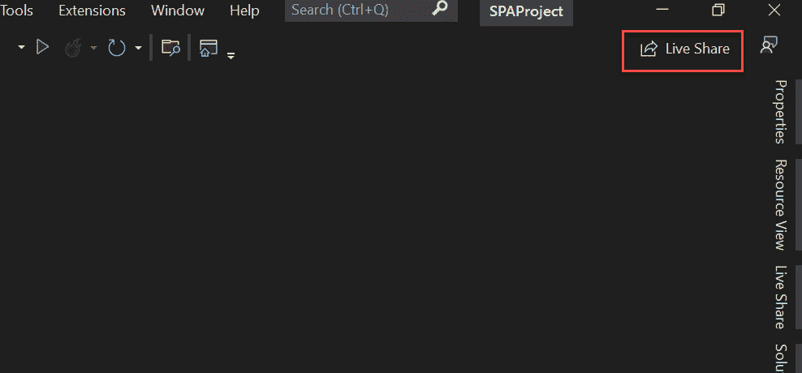

图 12.1 – 主窗口中的 Live Share 按钮

点击此图标后，您将看到一个新窗口，其中您可以选择用于创建新实时共享会话的账户。此账户是必需的，并且默认选择 VS 中使用的账户。我们还可以看到位于 **Live Share** 按钮位置的 **共享中…** 消息（见图 *图 12.2*）：

图 12.2 – Live share 账户窗口

您可以选择要使用的账户，然后点击 **选择**。然后，您将收到确认消息，共享会话的链接将自动添加到剪贴板。实时共享按钮显示 **共享中…**，这确认了会话是活跃的（见图 *图 12.3*）：

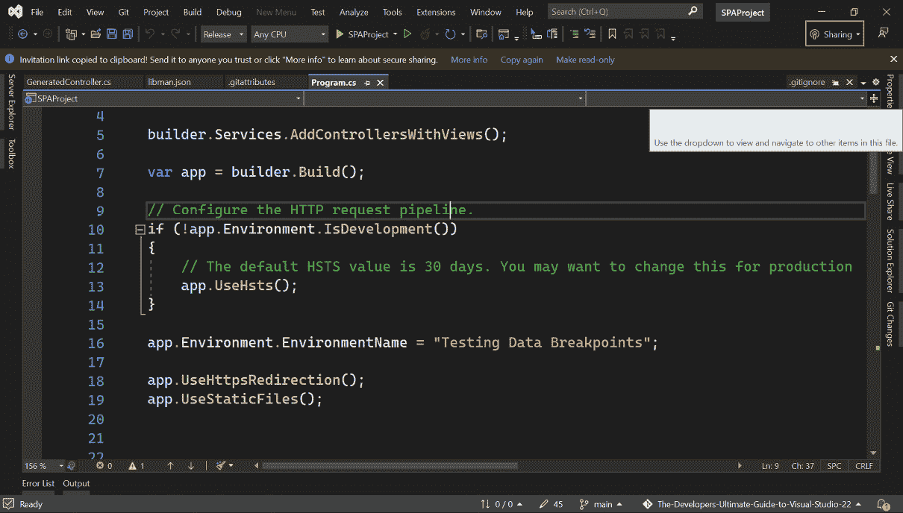

图 12.3 – VS Live Share 中的实时会话

您可以将邀请链接与其他开发者、同事或朋友分享，以尝试此工具。这是 VS Live Share 生成的链接示例：[`prod.liveshare.vsengsaas.visualstudio.com/join?7E72234CE1703CF92015D01564C560706AE1`](https://prod.liveshare.vsengsaas.visualstudio.com/join?7E72234CE1703CF92015D01564C560706AE1)。

当有人在浏览器中打开链接时，他们将看到 **Visual Code for the web**。这是一个作为网页运行的 VS Code 编辑器版本，不依赖于操作系统或额外要求。要获取更多信息，请访问此链接：[`code.visualstudio.com/docs/editor/vscode-web`](https://code.visualstudio.com/docs/editor/vscode-web)。在 VS Code for the web 中，您可以选择匿名继续或使用 GitHub 账户登录：

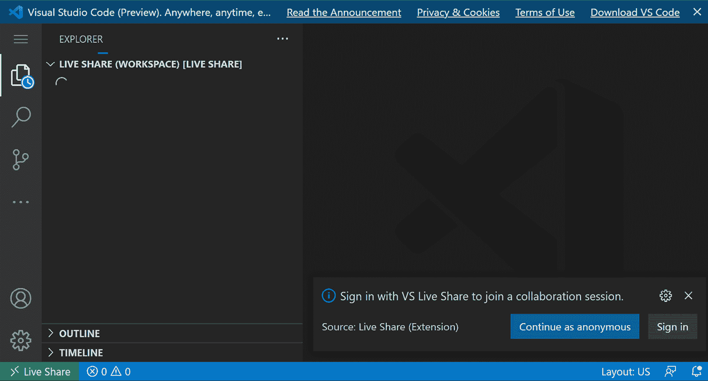

图 12.4 – 在浏览器中打开的会话

我们可以使用 **匿名继续** 来继续并加入会话。将显示三个选项，我们可以选择在代码中编辑和导航（见图 *图 12.5*）：

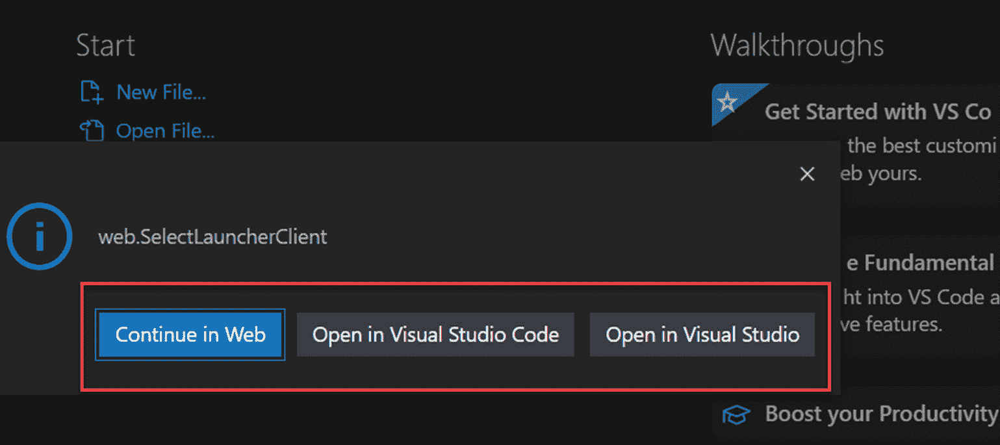

图 12.5 – 使用链接打开会话的选项

让我们进一步回顾这三个选项：

+   **在 Web 中继续**：选择此选项，您将继续在浏览器中使用 VS Code。

+   **在 Visual Studio Code 中打开**：此选项将在您的计算机上打开 VS Code，您可以在那里编辑代码。

+   **在 Visual Studio 中打开**：此选项将在您的本地机器上执行 VS，您可以在那里编辑代码。

您可以使用**在 Web 中继续**使用浏览器加入会话。创建会话的用户将看到一个新通知消息，其中您可以查看尝试加入会话的协作者。您可以选择新协作者并继续会话（见*图 12.6*）：

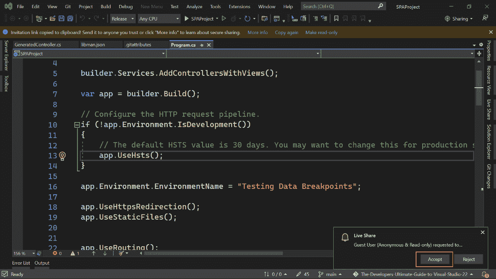

图 12.6 – Live Share 发送的接受新协作者的通知

接受访客用户后，Live Share 将共享代码并实时显示更改。在这种情况下，访客用户可以看到由创建会话的*Miguel Teheran*执行的代码中的操作。在*图 12.7*中，黄色部分显示了**跟随 Miguel Teheran**的消息，同时也显示了在 VS Code 和 VS 中打开会话的选项：

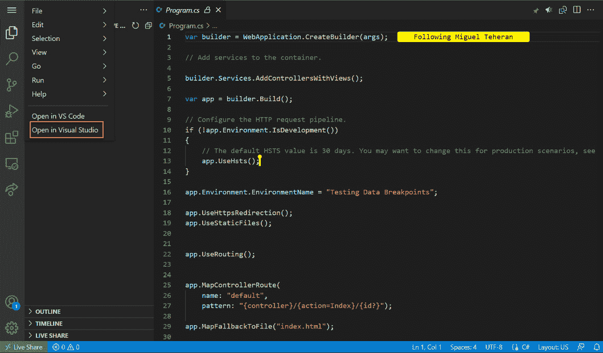

图 12.7 – 在 VS 中打开会话的选项

在 VS 中，有一个菜单，我们在会话期间可以使用不同的选项：

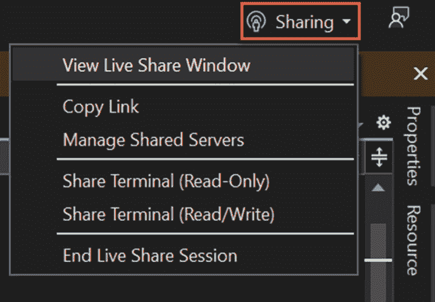

图 12.8 – 实时会话期间的 Live Share 菜单

让我们进一步回顾这些选项和功能：

+   **查看实时共享窗口**：查看会话状态，包括会话详情和会话中的协作者。

+   **复制链接**：复制剪贴板中的链接与他人分享。

+   **管理共享服务器**：打开一个新窗口，我们可以在此窗口中将我们的本地服务器与其他会话中的用户共享。

+   **共享终端（只读）**：以只读模式共享终端，以与他人共享控制台日志和结果。协作者不能在终端中执行任何命令。

+   **共享终端（读/写）**：与会话中的其他用户共享终端，并具有远程执行命令的可能性。

+   **结束实时共享会话**：结束所有连接用户的会话。

让我们点击**查看实时共享窗口**来查看会话状态。它将在右侧面板中显示一个新窗口，正如我们在*图 12.9*中看到的那样：

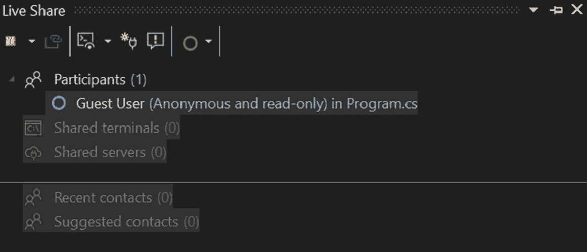

图 12.9 – 会话期间的 Live Share 窗口

在`Program.cs`文件中。我们还可以看到共享的终端和服务器。使用红色方块，我们可以在任何时间结束所有参与者的会话。

重要提示

访客用户以只读模式加入会话，这意味着他们不能修改或更新代码。这是一个安全要求。要了解更多关于 Live Share 中的安全信息，请访问[`docs.microsoft.com/en-us/visualstudio/liveshare/reference/security`](https://docs.microsoft.com/en-us/visualstudio/liveshare/reference/security)。

使用 Live Share 创建和共享会话非常简单。我们可以看到协作者随时连接和结束会话。让我们看看如何实时编辑或更新代码。

# 进行实时编辑

我们可以将 Live Share 会话与其他人共享，但那些用户只能以编辑或只读模式加入。默认情况下，所有访客用户都是只读模式，因此让我们使用登录用户通过 VS 加入会话。

选择**在 Visual Studio 中打开**后，如*图 12.5*所示，VS 将加载项目并显示加载消息，最终显示带有活动会话的代码。我们将有一个菜单，其中包含用于管理会话的实时共享按钮，作为协作者（见*图 12.10*）：

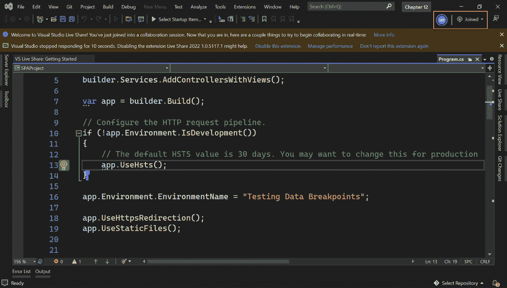

图 12.10 – 协作者加入会话时的 VS

在前面的图中，我们还可以看到左侧的一些图标，代表会话中的活动协作者。我们可以点击**已加入**来查看作为活动会话中的协作者所拥有的选项（见*图 12.11*）：

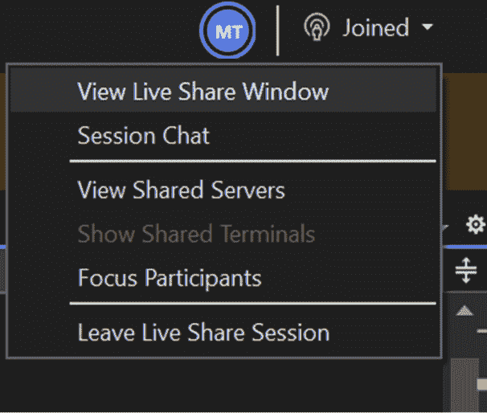

图 12.11 – 协作者使用的 Live Share 菜单

让我们逐一查看此菜单中的每个选项：

+   **查看 Live Share 窗口**：此选项允许您查看会话状态，包括会话详情和会话中的协作者。

+   **会话聊天**：此选项打开一个新窗口，您可以在其中键入并与其他协作者共享消息。

+   **查看共享服务器**：使用此选项，您可以在当前会话中可视化共享服务器。

+   **显示共享终端**：此选项打开一个新窗口，您可以在其中查看当前共享的终端。

+   **关注参与者**：使用此选项，您将保持关注其他协作者正在做什么或正在编辑的内容。

+   **离开 Live Share 会话**：使用此选项，您将离开当前会话，而其他协作者可以继续会话。

    重要提示

    主持人是唯一可以结束会话的参与者。当会话结束时，会话中的所有协作者都将收到通知。有关更多信息，请访问[`docs.microsoft.com/visualstudio/liveshare/use/share-project-join-session-visual-studio`](https://docs.microsoft.com/visualstudio/liveshare/use/share-project-join-session-visual-studio)。

现在，您可以编辑代码的任何部分，并查看 Live Share 是如何工作的。例如，在`Program.cs`文件的第七行，我们可以为`build`方法添加注释（见*图 12.12*）：

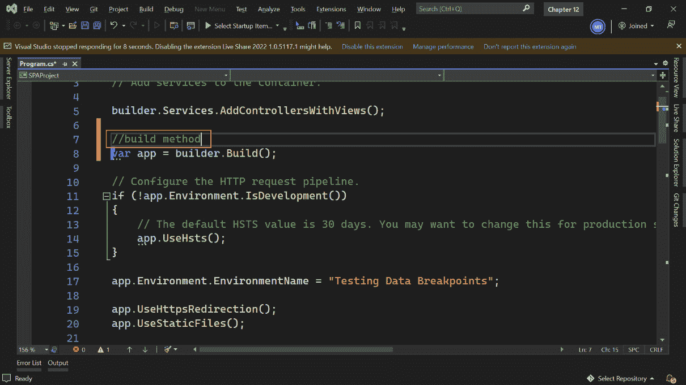

图 12.12 – 在 Live Share 会话期间添加注释

一旦协作者开始输入，会话中的主机和其他用户可以实时看到文件中的更改。协作者的名字将在特定行显示，并用随机颜色突出显示（见 *图 12.13*）：

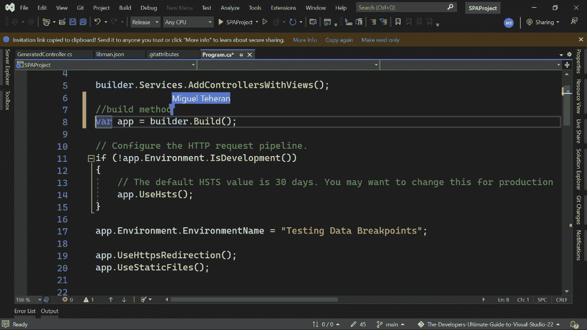

图 12.13 – 主机实时查看协作者所做的更改

重要提示

Live Share 将随机为每个新的协作者分配一种颜色，以便在会话期间轻松识别每个用户。

您可以编辑文件以执行建议，但您也可以使用 **文件** | **保存所选项** 菜单或 *Ctrl* + *S* 快捷键来保存文件。

现在我们已经了解了 Live Share 的工作原理以及我们可以在共享会话期间使用的某些功能，我们准备审查在会话期间与其他协作者共享终端的选项。

# 与其他协作者共享终端

在 Live Share 中，我们还可以与其他开发者共享终端。通过共享终端，我们允许其他开发者通过命令行查看项目的更多详细信息。在创建新会话后，我们可以使用 **共享终端** 选项允许其他人使用我们的终端（见 *图 12.14*）：

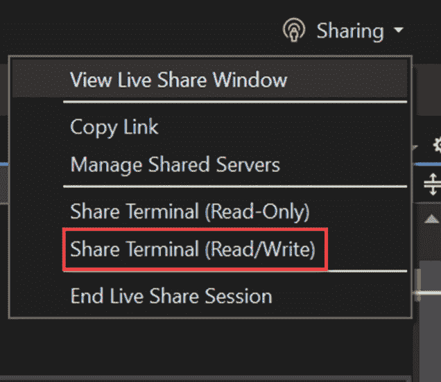

图 12.14 – Live Share 菜单中的共享终端选项

在点击 **共享终端（读/写）** 后，我们将看到一个带有标记的新终端窗口，该标记表示终端已共享。在 *图 12.15* 中，我们可以看到在 VS 底部面板中添加的新终端：

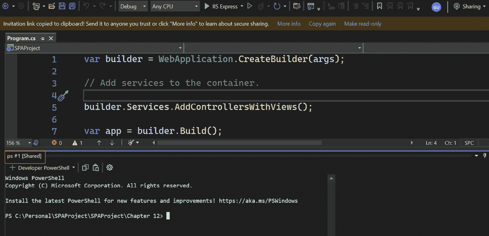

图 12.15 – Live Share 会话期间共享的终端

其他协作者在加入会话时将自动看到这个共享终端（见 *图 12.16*）：

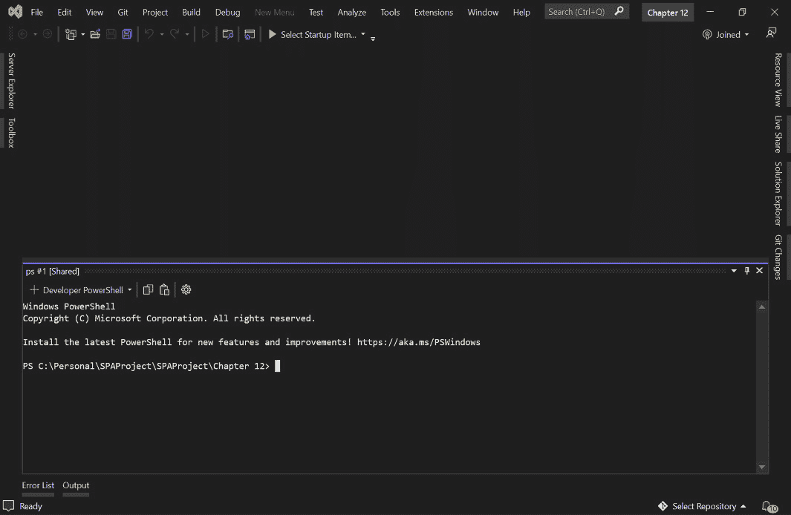

图 12.16 – Live Share 会话期间共享的终端

会话中的协作者可以执行项目中的任何命令以获取更多详细信息或使用窗口命令添加信息。在这种情况下，我们可以使用 .NET `dotnet build` 命令。要了解更多关于 .NET CLI 的信息，您可以查看以下链接中的文档：[`docs.microsoft.com/dotnet/core/tools/`](https://docs.microsoft.com/dotnet/core/tools/).

在终端中，我们将在编译过程中看到警告和错误（见 *图 12.17*）：

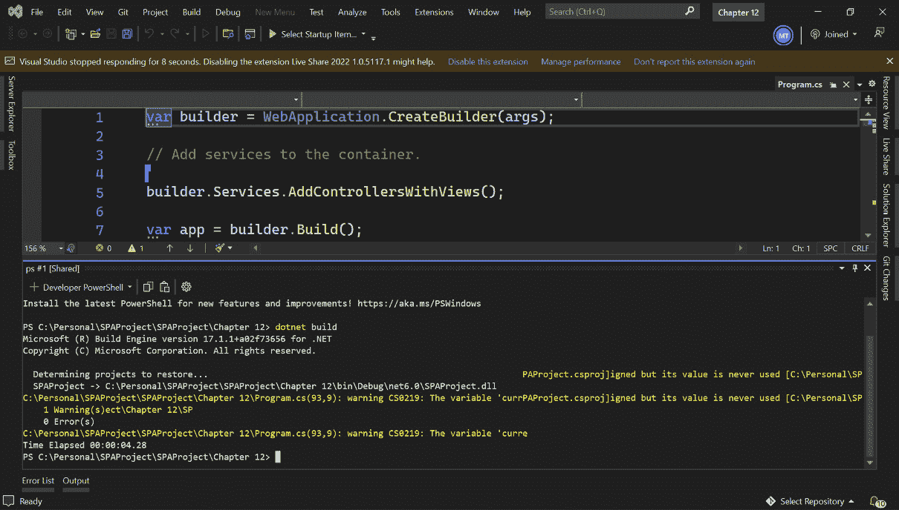

图 12.17 – 协作者在共享终端中执行 dotnet build 命令

会话中的主机和其他协作者可以看到在终端中执行的所有命令及其结果。命令是在主机环境中执行的，这意味着创建会话的用户（见 *图 12.18*）：

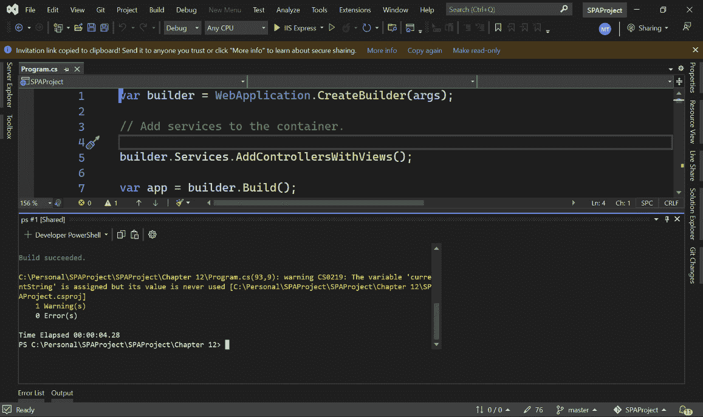

图 12.18 – 会话的主机正在查看 dotnet build 命令的结果

如果终端默认未显示或您想查看会话中共享的其他终端，您可以转到 **Live Share** 窗口并查看当前会话的状态，包括共享终端及其权限（见 *图 12.19*）：

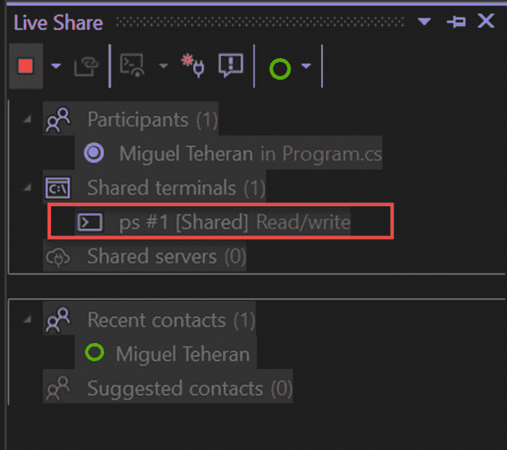

图 12.19 – 共享终端的 Live Share 窗口

现在您已经知道如何在 VS 2022 中作为主机和协作者使用 Live Share，您可以邀请其他人协作您的项目，并在需要时共享终端。

# 摘要

Live Share 是一个实时与他人协作的神奇工具。随着全球化的发展，这个工具现在比以往任何时候都更加重要，考虑到全球开发团队可能包括世界各地、不同时区和不同工具工作的开发者。

您已经学会了如何使用 Live Share 来作为团队工作，并与其他开发者在同一项目上进行协作。您知道如何在 VS 中加载 Live Share 会话，查看会话中的参与者，共享终端，并在需要时结束会话。此外，您还回顾了一些与其他 IDE 和编辑器一起使用的 Live Share 的替代方案。

在 *第十三章* 中，*在 Visual Studio 中使用扩展*，您将学习如何使用扩展来增加 VS 默认包含的工具和功能。您将学习如何在 VS 中搜索、安装和设置扩展，以及如何利用它们来提高您的生产力。
