# 第十三章：在 Visual Studio 中使用扩展

我们不能否认，Visual Studio 的原生功能在执行任务方面，如我们迄今为止所看到的，是惊人的。然而，可能有时您想通过简单的功能扩展 IDE 的功能，例如使用自定义颜色应用新主题，或者通过代码重构工具等复杂功能。

在这种情况下，Visual Studio 扩展非常有帮助，这也是为什么我们将专门用一整章来分析它们的使用。

我们将要看到的主要主题如下：

+   使用扩展工具

+   搜索和安装扩展

+   检查 Visual Studio 市场 place

+   设置扩展

+   创建新的主题作为扩展

让我们从扩展的视角开始游览 Visual Studio，感谢扩展。

# 技术要求

要跟随本章，您必须已安装带有 Web 开发工作负载的 Visual Studio，如 *第一章*，*开始使用 Visual Studio 2022* 中所示。

此外，要创建一个作为扩展的主题，如 *创建新的主题作为扩展* 部分所示，你必须安装 **Visual Studio 扩展开发** 工作负载，如图 *图 13.1* 所示：

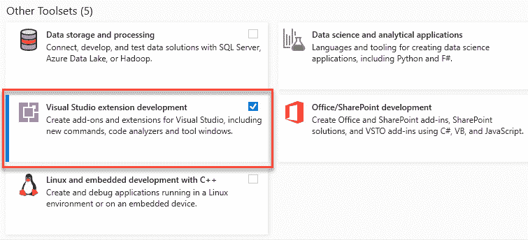

图 13.1 – 安装 Visual Studio 扩展开发工作负载

您可以在开始阅读 *创建新的主题作为扩展* 部分之前或创建扩展时安装它，如图中所示。

由于本章侧重于展示在 Visual Studio 中使用扩展，因此不需要代码库。

让我们看看如何从 Visual Studio 使用扩展工具。

# 使用扩展工具

Visual Studio 中扩展的主要目的是，您可以使用可能对特定任务具有某种特定性的功能来提高您日常的生产力，例如提供代码最佳实践的建议、执行代码清理、在输出窗口中突出显示消息、在代码文件中添加视觉功能或与 SQLite 数据库交互。允许开发者为 Visual Studio 创建新功能并与全世界分享是微软团队的一项优秀举措。

重要提示

在本节中，我将向您展示一些简单的扩展，以便您熟悉扩展的概念。在 *第十四章*，*使用流行扩展* 中，您将了解开发者最广泛使用和首选的扩展，以及如何使用它们。

但我们如何访问这些扩展呢？最直接的答案是通过扩展工具，您可以通过 **扩展** | **管理扩展** 菜单找到它，如图 *图 13.2* 所示：

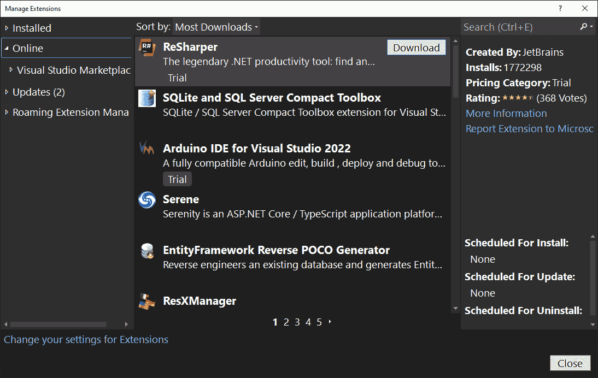

图 13.2 – 扩展工具

在左侧，我们可以找到以下类别，这些类别允许我们过滤扩展：

+   **已安装**：这些是我们之前在 Visual Studio 实例中安装的扩展。

+   **在线**：在这个类别中，你可以找到可以添加到 Visual Studio 的扩展。在上部，我们有一个带有**按**排序图例的过滤器，它允许我们以不同的方式过滤扩展。

+   **更新**：这个类别显示了有挂起更新的扩展，无论是错误修复还是扩展改进。

+   **漫游扩展管理器**：这个类别允许你查看与 Microsoft 账户关联的、之前在 Visual Studio 实例中安装的扩展，因此它们可以在当前的 Visual Studio 实例中安装。这意味着如果你在另一台计算机上登录并安装了一个扩展，你将能够在这个列表中看到它，因此你不需要记住扩展的名称，可以轻松安装。

现在，让我们看看如何利用这个工具来搜索和安装扩展。

# 搜索和安装扩展

如*图 13.3*所示，扩展工具具有位于右上角的搜索框，我们可以在此输入搜索词以查找与某些技术或工具相关的扩展。需要注意的是，搜索将在我们讨论的*使用扩展工具*部分中提到的所选类别内进行。

如果你想要在所有扩展中进行搜索，最好的做法是转到`javascript`:

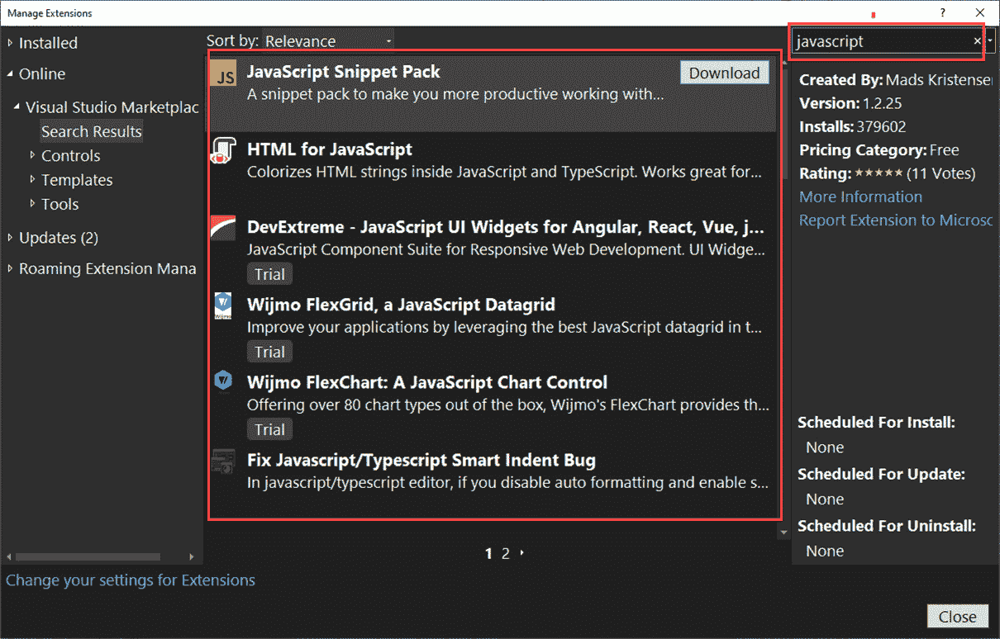

图 13.3 – 扩展工具中的结果列表

扩展列表的顺序将根据顶部下拉项的设置出现，默认情况下显示为按**相关性**排序，但我们也可以选择其他选项，例如按**下载量最多**、**最新**、**趋势**或**评分最高**显示。

让我们再进行一次测试，这次是安装一个扩展。让我们查找与`css`相关的扩展，在列表中，你会看到一个名为**颜色预览**的扩展。要安装扩展，只需点击**下载**按钮，这将开始下载过程：

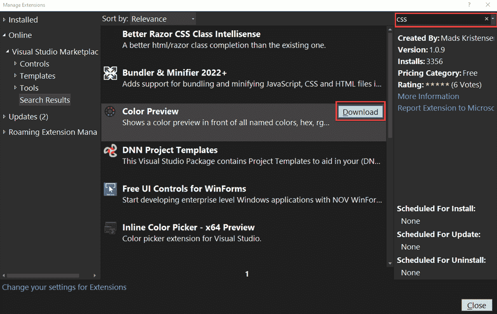

图 13.4 – 搜索和安装扩展

扩展下载完成后，窗口底部将出现一条消息，说明**您的更改将被安排。所有 Microsoft Visual Studio 窗口关闭后，将开始修改**。这条消息非常详细，因此我们将重新启动 Visual Studio 以执行安装。

一旦我们关闭 Visual Studio，安装过程将开始，它将显示将在 Visual Studio 实例上安装的扩展，以及额外的信息，例如 **数字签名** 和 **许可证** 类型：

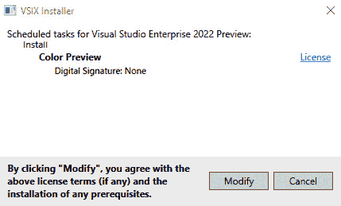

图 13.5 – 扩展安装窗口

如果我们同意显示的信息，如 *图 13.5* 所示，我们必须点击 **修改** 按钮，这将启动 IDE 中的安装过程。

安装过程完成后，您必须重新打开一个 Visual Studio 实例。尽管乍一看似乎没有任何变化，但此扩展已添加了将所选颜色应用于 `css` 文件属性并在 IDE 中显示的功能，如 *图 13.6* 所示：

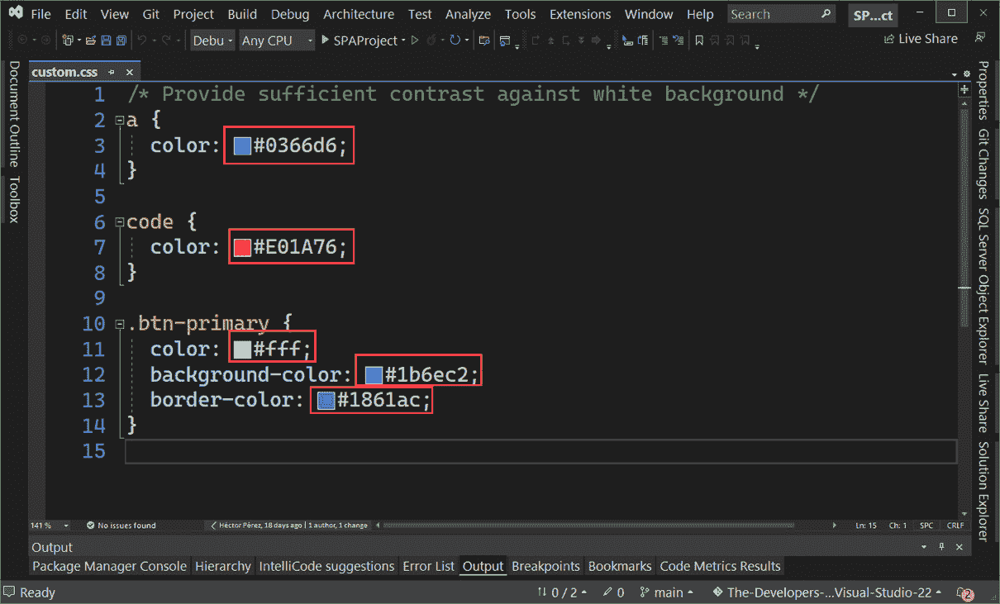

图 13.6 – Color Preview 扩展添加的功能

您可以将前面的屏幕截图与 *第九章* 中 *“使用 CSS 样式工具”* 部分所示的截图进行比较。

如果您想卸载一个扩展，只需再次打开扩展工具，在 **已安装** 部分查找该扩展。然后，点击 **卸载** 按钮，如 *图 13.7* 所示：

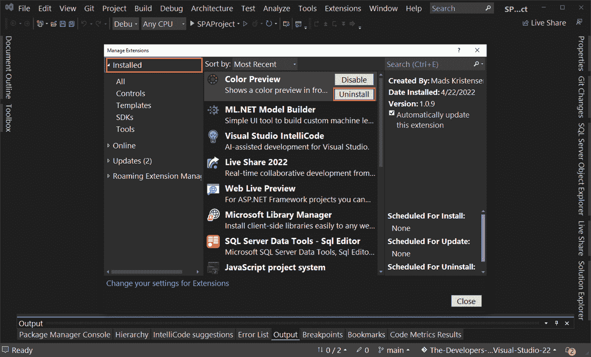

图 13.7 – 卸载扩展

在前面的屏幕截图中，您可以看到一个名为 **禁用** 的第二个按钮，它允许您暂时禁用扩展，直到您决定重新激活它。

现在我们已经看到了如何从扩展工具安装扩展，让我们看看 Visual Studio Marketplace。

# 检查 Visual Studio Marketplace

Visual Studio Marketplace 是寻找和安装 Visual Studio 2022 扩展的在线场所。在此市场中，您还可以找到 Visual Studio 家族其他产品的扩展，例如 Visual Studio Code 和 Azure DevOps。您可以通过网站：[`marketplace.visualstudio.com/vs`](https://marketplace.visualstudio.com/vs) 访问市场。

一旦您进入门户，您将有一个与扩展工具非常不同的用户界面，但核心操作是相同的。在主门户中，您将能够看到按 **特色**、**趋势**、**最受欢迎** 和 **评分最高** 排序的不同扩展。

为了测试市场，让我们搜索 `icons` 术语并查看结果列表。尽管当前列表产生了 49 个结果，但并非所有扩展都与 Visual Studio 的最新版本兼容。因此，建议应用 **Visual Studio 2022** 过滤器，如 *图 13.8* 所示：

图 13.8 – 在市场 place 中过滤 Visual Studio 版本

一旦应用了过滤器，找到 **Visual Studio Iconizer** 扩展并点击它以转到扩展页面：

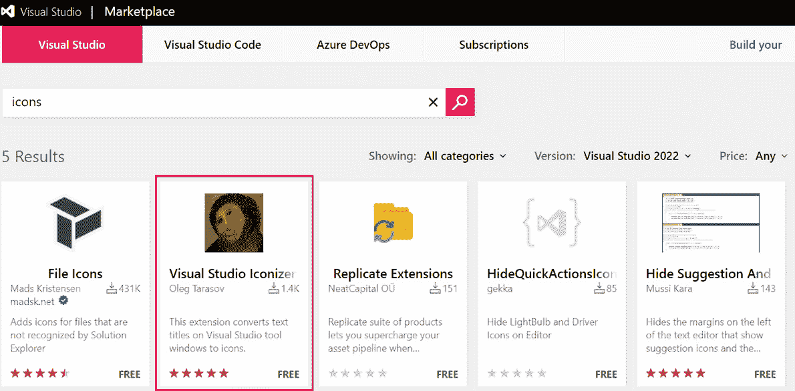

图 13.9 – 在市场 place 中搜索扩展

在扩展页面上，你将能够找到提供关于扩展的一般信息，例如安装次数、评论次数、评分、变更日志和项目页面等数据。如果扩展的描述表明它可以帮助你解决问题，你可以点击下面的绿色 **下载** 按钮： 

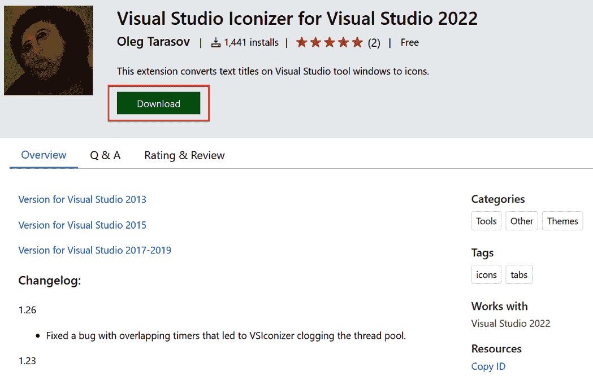

图 13.10 – 下载扩展的按钮

这将启动下载一个 `vsix` 扩展名的文件的过程 – 在这个特定的情况下，文件名为 `VSIconizer.vsix`。要在 Visual Studio 中安装扩展，你必须首先确保你已经关闭了所有 IDE 的实例，然后运行下载的文件，这将启动我们在 *搜索和安装扩展* 部分看到的相同的安装过程。

一旦安装过程完成并且 Visual Studio 2022 的一个实例被打开，我们可以看到 IDE 标签的外观如何改变，如图 *图 13.11* 所示，文本已被图标替代：

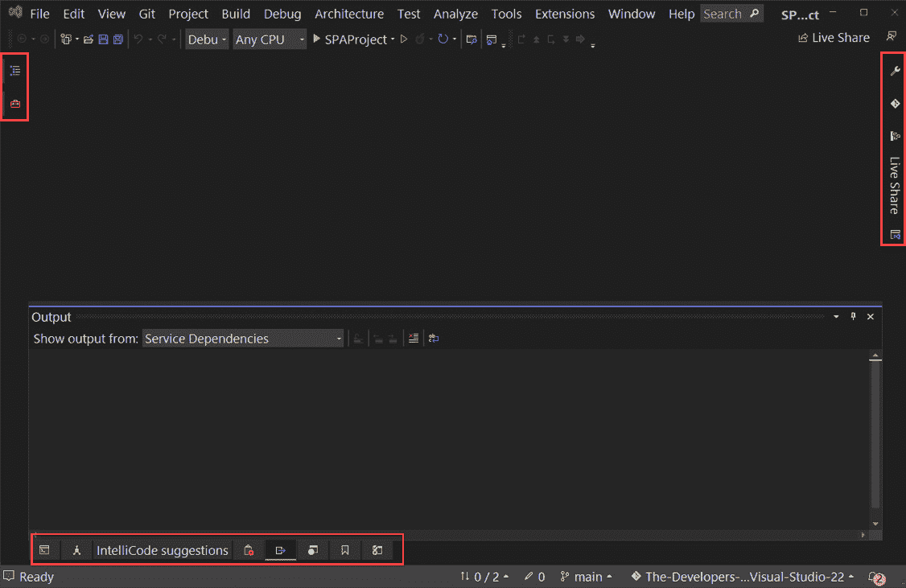

图 13.11 – Iconizer 扩展修改后的 IDE 标签外观

无论你选择使用扩展工具安装还是从市场 place 下载扩展，安装过程都非常简单。

现在，让我们看看如何配置我们安装的扩展。

# 设置扩展

不幸的是，没有标准化的方式来配置 Visual Studio 扩展，因为每个扩展都是独特的，服务于特定的目的。确实的是，大多数扩展都会为扩展添加配置选项，无论是通过一个特殊的窗口，还是从配置选项。

了解这些配置选项的最佳方式是通过扩展页面本身。例如，对于我们在 *查看 Visual Studio 市场 place* 部分安装的 **Visual Studio Iconizer** 扩展，其初始行为是在标签上仅显示图标。扩展页面告诉我们，这种行为可以被更改，以显示扩展添加的图标旁边的标签文本。这可以通过通过 **工具** | **选项** | **环境** | **Iconizer** 菜单添加的选项来完成，如图 *图 13.12* 所示：

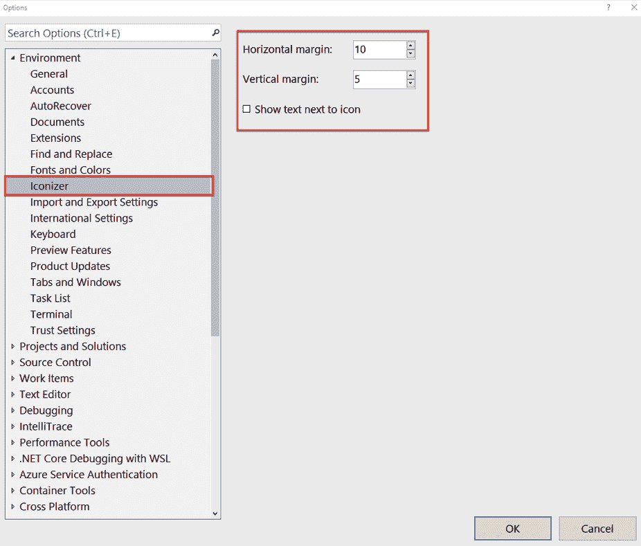

图 13.12 – Iconizer 扩展选项

大多数扩展程序会创建一个部分，如图中所示，而更复杂的扩展程序甚至为工具提供了一个特殊的新菜单，我们将在 *第十四章*，*使用流行扩展* 中讨论。

现在，让我们看看如何为 Visual Studio 创建一个新主题并将其导出为扩展，以便更多用户可以在他们的 Visual Studio 实例中应用它。

# 将新主题作为扩展创建

如果您想对 IDE 进行更定制的颜色配置，可以通过名为 **Visual Studio Color Theme Designer** 的扩展程序来实现。您可以在 Visual Studio 市场中搜索并下载此扩展程序，正如我们在 *查看 Visual Studio 市场部分* 中所看到的。

安装扩展后，您需要启动 Visual Studio 并选择如图所示的 **创建新项目** 选项：

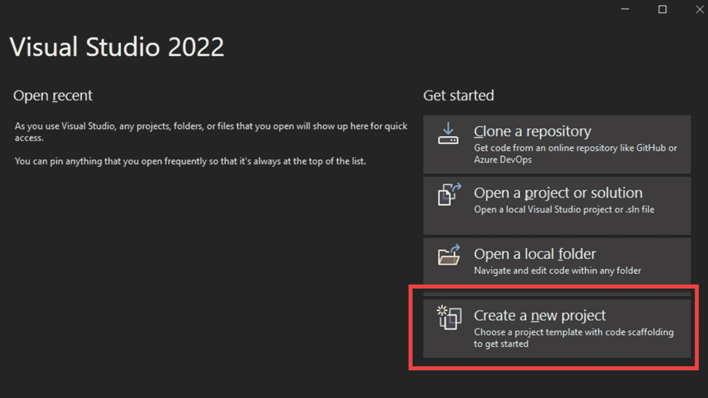

图 13.13 – 创建新项目

在打开的窗口中，您必须从名为 **VSTheme 项目** 的列表中选择项目，该列表已通过之前添加的扩展程序安装。如果您一开始没有找到，可以在如图 *图 13.14* 所示的搜索框中进行搜索：

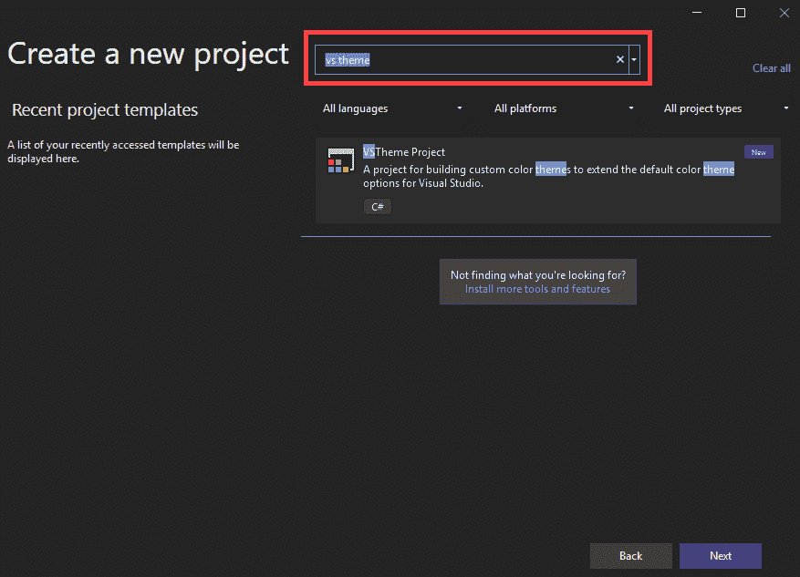

图 13.14 – 搜索 VSTheme 项目

在新的项目配置窗口中，如图 *图 13.15* 所示，您可以输入一个项目名称，该名称与您正在创建的主题相关。对于此示例，我将将其命名为 `CustomTheme`。您可以将其他参数保留为默认值。通过点击 **创建** 按钮来创建新项目：

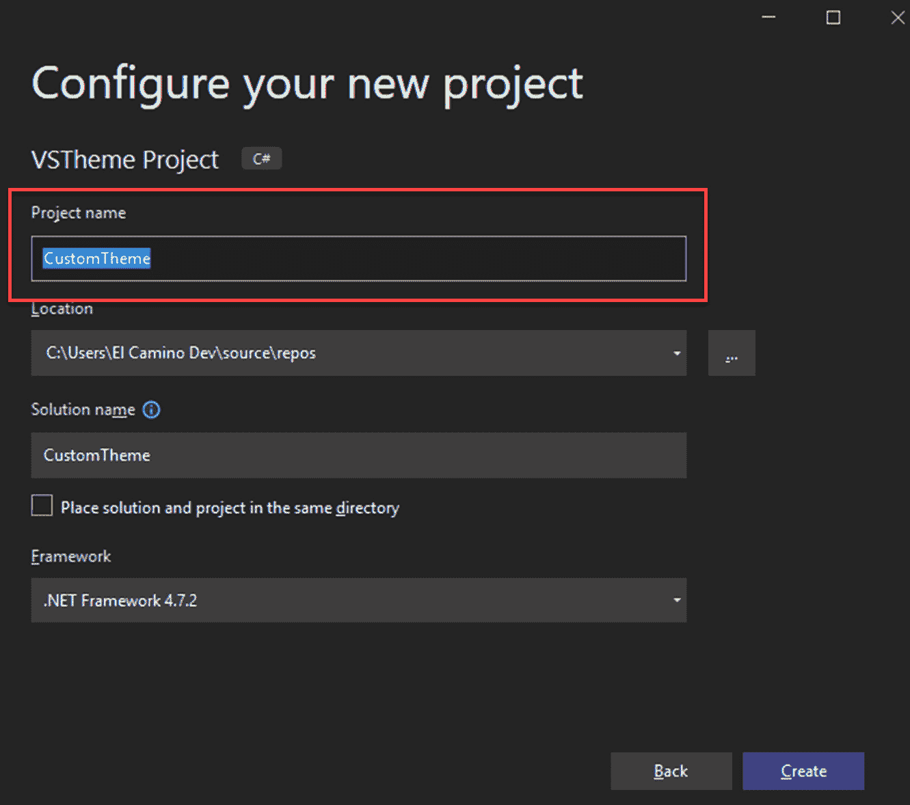

图 13.15 – 项目配置

如果显示一个窗口指示您必须安装 **Visual Studio 扩展开发** 工作负载，请点击 **安装**：

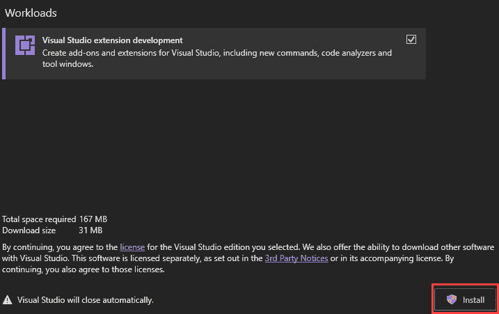

图 13.16 – 安装 Visual Studio 扩展开发工作负载

这将使环境能够为 IDE 开发扩展。

重要提示

如果在安装如图 *图 13.16* 所示的工作负载后，您得到一个没有文件的解决方案，您必须重新创建项目，这将解决问题。

一旦 IDE 安装了扩展，新项目将以不同的元素创建。要配置您的新主题，在 **解决方案资源管理器** 窗口中双击具有 `vstheme` 扩展名的文件，如图所示：

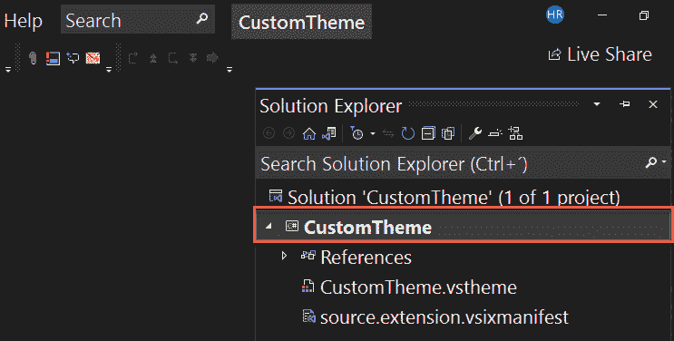

图 13.17 – 打开主题配置文件

这将启动一个向导，它将允许你快速创建新的主题。你将从一个名为 **快速开始** 的选项卡开始，在那里你可以从已安装的主题中选择一个基础主题，以便对新主题进行修改：

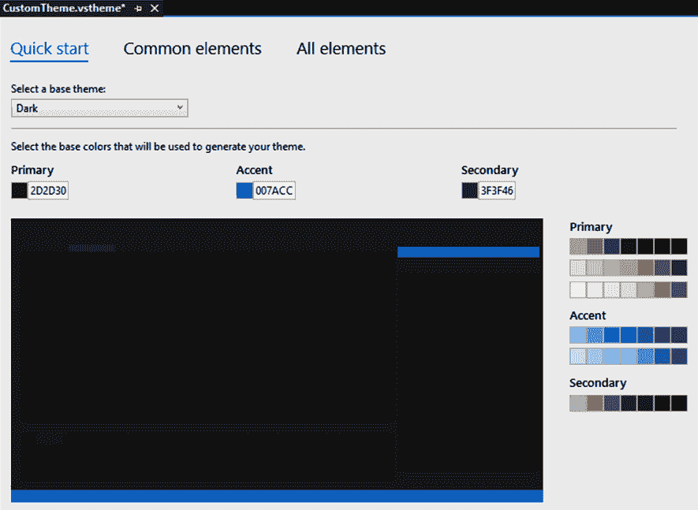

图 13.18 – 设置新主题

在 *图 13.18* 中，已选择 **深色** 主题进行演示。从这里，你可以点击任何三个主要颜色之一，标记为 **主色**、**强调色** 和 **次色**，以选择不同的颜色，并通过点击图 13.19 中用红色突出显示的 **确定** 按钮来应用它：

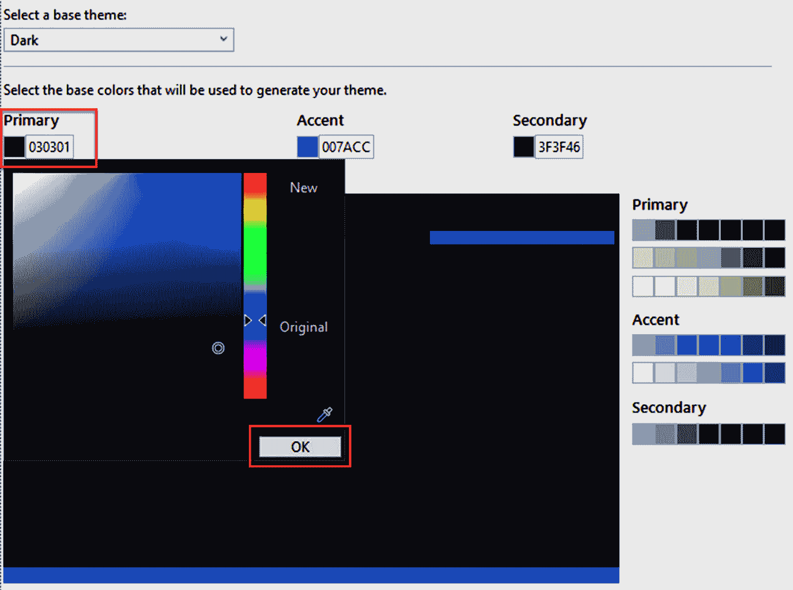

图 13.19 – 更改颜色

如果你想要更详细的定制，你可以通过相同的步骤在 **公共元素** 和 **所有元素** 选项卡中完成，如图 13.18 所示。

最后，为了使用主题，你可以在窗口底部找到 **预览** 按钮来预览新配置下的更改效果，以及一个带有图例 **应用** 的按钮来将更改应用到 IDE：

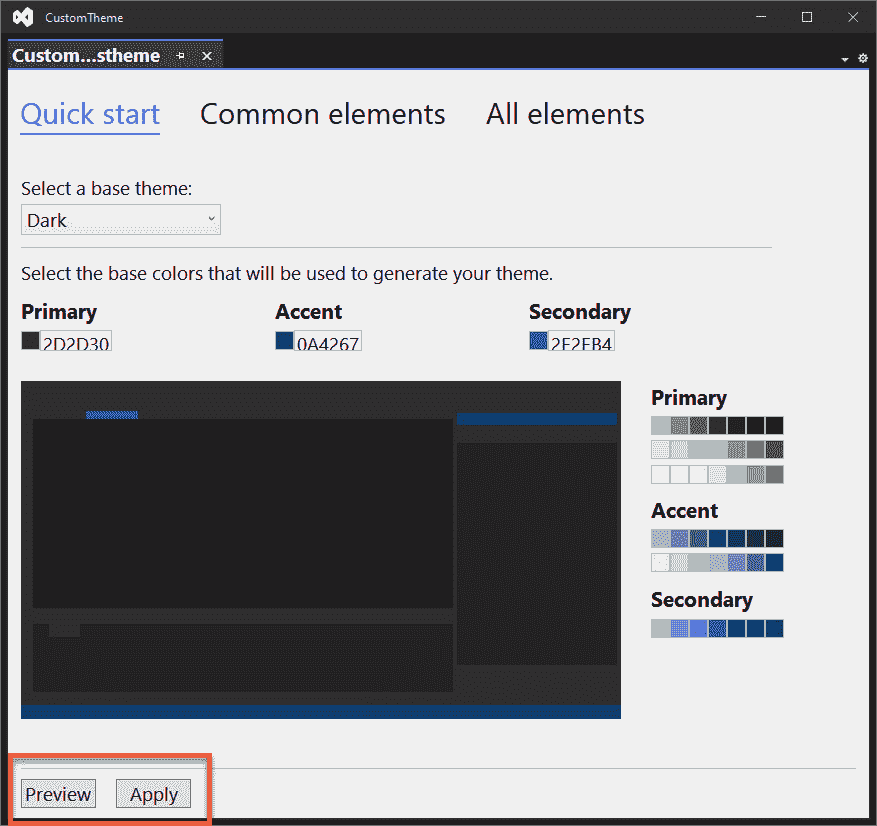

图 13.20 – 预览和应用主题更改的按钮

要获取可安装的扩展文件，你必须编译项目。在 *图 13.21* 中显示的编译项目的方法之一：

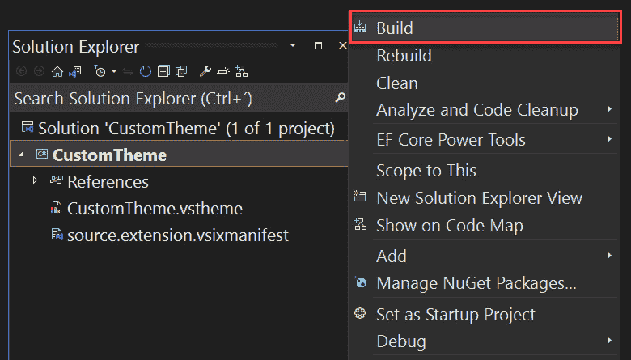

图 13.21 – 构建项目

一旦项目成功编译，我们必须通过右键单击项目并选择 **在文件资源管理器中打开文件夹** 选项来进入编译目录：

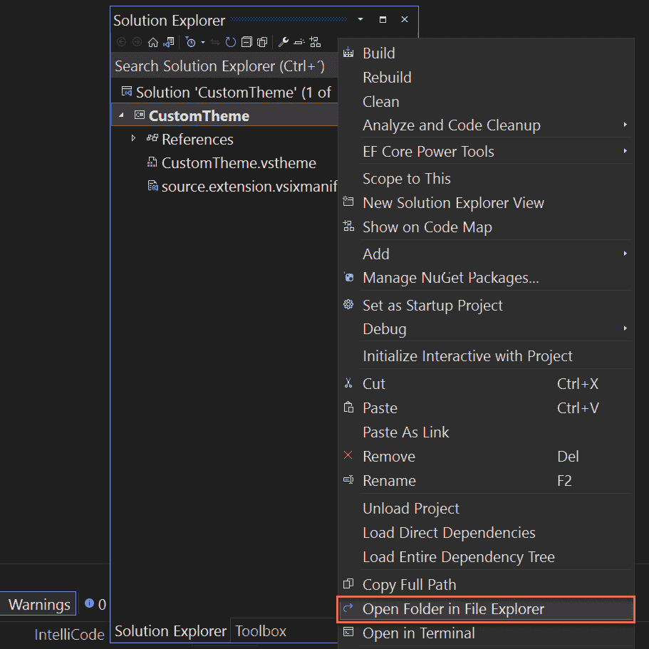

图 13.22 – 在 Windows 资源管理器中打开项目文件夹的选项

这将打开项目位置的 Windows 文件资源管理器。在这个路径中，我们将继续查找位于 `bin` | `Debug` | `CustomTheme.vsix` 路径中的文件。文件名将来自项目的名称。在我们的示例中，项目的名称是 `CustomTheme`，如图 13.15 所示，因此如果你在创建项目时使用了另一个名称，你将找到具有该名称的文件。这是你可以分发以共享主题的文件，或者你可以将其上传到 Visual Studio 市场 place。

重要提示

你还可以将输出模式设置为 **发布**，如第 *5 章* 中所述，*调试和编译你的项目*。这将生成一个更小的文件，运行速度更快。

正如我们所见，利用 Visual Studio 扩展创建新主题非常简单。

# 摘要

在本章中，我们了解到扩展是我们扩展 Visual Studio 功能的一种方式，始终以改善我们的用户体验和优化开发时间为目标。我们测试了一些完全改变了 IDE 的一些功能的扩展，例如在 `css` 文件中预览颜色、将标签页改为图标以及创建用于分发的主题。

此外，我们还回顾了如何从扩展工具和 Visual Studio Marketplace 中搜索和安装扩展。我们分析了扩展是如何定期配置的，最后，我们创建了一个新的自定义主题，可以通过扩展与他人共享。

在*第十四章*，*使用流行扩展*中，我们将更深入地探讨扩展的主题，分析哪些扩展因其对 Web 开发的有用性而最受欢迎。
