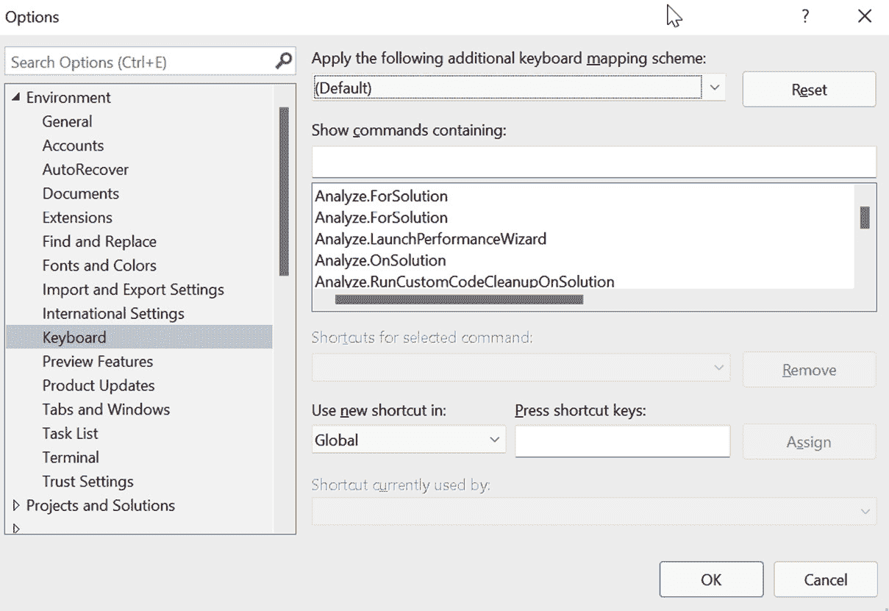
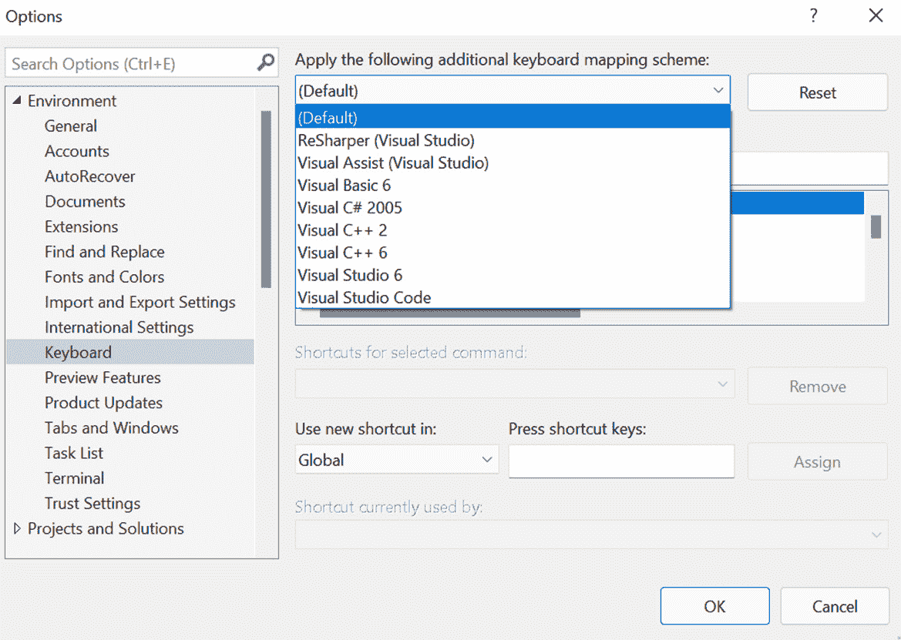

# 第十五章：学习键盘快捷键

在这本书中，我们分析了一些帮助我们提高生产力的快捷键，通过组合一些键来执行 IDE 和源代码中的常见操作。Visual Studio 默认包含一些有用的快捷键，但我们也有可能根据我们的需求或我们每天需要执行的常见操作创建自己的快捷键。

在本章中，我们将提供 Visual Studio 2022 默认包含的最重要快捷键的总结，以及一个展示如何创建我们自己的快捷键的部分。

在本章中，我们将回顾以下主题：

+   在源代码中使用最频繁的快捷键

+   在 IDE 中使用的最常见快捷键

+   创建自定义快捷键

当使用 Visual Studio 时，了解键盘快捷键非常重要，这样我们才能快速执行操作。这将防止你在格式化整个源代码文件或重命名类成员等重复性任务上浪费时间。

重要的是你要将这些键盘快捷键付诸实践，并开始逐渐使用它们，即使开始时执行得慢一些。你会发现随着时间的推移，你会自动执行它们，而无需任何视觉辅助。

让我们学习如何通过快捷键提高我们的生产力。

# 技术要求

要使用此项目的快捷键，你必须已经安装了包含已安装的 Web 开发工作负载的 Visual Studio 2022，如*第一章*中所示，“Visual Studio 入门”。在*第四章*中创建的 SPA 基础项目也同样重要，“项目和模板”。

重要的是要注意，存在不同的键盘映射方案，可以完全修改快捷键。此外，如 ReSharper 这样的扩展也可以修改键盘快捷键。为了正确执行本章中显示的所有快捷键，你必须有一个**默认**键盘映射方案，可以从**工具 | 选项 | 环境 | 键盘**菜单中选择。

让我们进入快捷键的世界，这无疑会使你成为一个更高效、更有生产力的程序员。

# 在源代码中使用的快捷键

与源代码一起工作涉及处理数千行代码，即使是经验最丰富的开发者也可能感到头疼。这就是为什么 Visual Studio 中包含的强大搜索工具是搜索和导航代码行的绝佳方式。

同样，代码编辑和重构任务在项目中是持续进行的，更不用说在大项目中进行的调试和测试了。

这就是为什么在作为开发者的职业生涯中，使用提供即时访问这些工具的快捷键应该是一个优先事项。让我们看看这些键盘快捷键是什么。

## 用于搜索和导航源代码的快捷键

当在一个单类项目中工作时，快速查找类的成员可能看起来像是一项简单的任务，但如果您与包含数百个类或甚至在同一解决方案中包含几个项目的项目一起工作，您可能就不会这样认为。在这些时刻，以下键盘快捷键将非常有帮助。

让我们看看将帮助我们快速搜索和导航 Visual Studio 的快捷键：

+   *Ctrl* + *Q*: 显示 **Visual Studio 搜索**

+   *Ctrl* + *T*: 显示 **转到所有** 工具

+   *Ctrl* + *-*: 在当前会话中导航到打开的文档之间

+   *Ctrl* + *Shift* + *-*: 在当前会话中导航到打开的文档之间

+   *F12*: 导航到类定义

+   *Alt* + *F12*: 允许您在弹出窗口中查看和编辑您正在编写的代码文件的类代码

+   *Ctrl* + *F12*: 当错误列表窗口打开且列出多个错误时，导航到下一个错误行

+   *Ctrl* + *Shift* + *F12*: 当错误列表窗口打开且列出多个错误时，导航到下一个错误行

+   *F8*: 在当前窗口的结果列表中向前导航

+   *Shift* + *F8*: 在当前窗口的结果列表中向后导航

这里讨论的快捷键允许您在不离开键盘的情况下快速在文件、成员、结果和实现之间导航。现在，让我们看看编辑和重构中最常见的快捷键。

重要提示

您可以在以下链接中查看 Visual Studio 中所有最常用的快捷键：[`docs.microsoft.com/visualstudio/ide/default-keyboard-shortcuts-in-visual-studio?view=vs-2022`](https://docs.microsoft.com/visualstudio/ide/default-keyboard-shortcuts-in-visual-studio?view=vs-2022)。我们鼓励您下载该文件，打印出来，并将其放在您附近，以便快速参考这些快捷键。

## 编辑和重构的快捷键

我们将在本小节中看到的命令对应于允许您直接对源代码应用更改的命令。其中最常见的操作包括重命名成员、注释代码行以及上下移动行。让我们看看将使编写代码更加容易的快捷键列表：

+   *Alt* + *Enter*: 显示快速操作

+   *Ctrl* + *K*, *Ctrl* + *I*: 获取有关类成员的信息

+   *Ctrl* + *K*, *Ctrl* + *C*: 取消注释源代码中选中的多行

+   *Ctrl* + *K*, *Ctrl* + *U*: 取消注释源代码中选中的多行

+   *Ctrl* + *Shift* + *L*: 删除选中的行

+   *Ctrl* + *Shift* + *V*: 显示并允许从缓冲区中粘贴内容（它指的是之前已复制的元素的历史记录）

+   *Ctrl* + *F*: 在代码中查找特定文本

+   *Ctrl* + *A*: 选择当前文件中的所有行

+   *Ctrl* + *S*: 保存当前文件中的待处理更改

+   *Ctrl* + *Shift* + *S*: 保存所有打开文件中的待处理更改

+   *Ctrl* + *Shift* + *.*: 放大当前文件

+   *Ctrl* + *Shift* + *,*: 从当前文件缩放出去

+   *Ctrl* + *Up*: 在代码文件中向上移动选定的行

+   *Ctrl* + *Down*: 在代码文件中向下移动选定的行

+   *Ctrl* + *K*, *Ctrl* + *D*: 将样式规则应用于整个文档

+   *Ctrl* + *K*, *Ctrl* + *F*: 仅在文档中选定的行上应用样式规则

+   *Ctrl* + *K*, *Ctrl* + *S*: 用于将代码封装在常见的子句之间，例如循环（`while`、`for`等）、控制语句（`if`、`switch`等）或代码区域（`#region`）。

+   *Ctrl* + *R*, *Ctrl* + *R*: 重命名成员

+   *Ctrl* + *R*, *Ctrl* + *E*: 为类的字段创建属性

+   *Ctrl* + *R*, *Ctrl* + *G*: 在类中删除未使用的`using`语句并按字母顺序排序

+   *Ctrl* + *R*, *Ctrl* + *M*: 从选定的代码创建方法

现在我们已经了解了编辑和重构代码的主要快捷键，让我们来看看那些将帮助我们优化调试和测试任务的快捷键。

## 调试和测试的快捷键

调试和代码执行是我们使用 Visual Studio 期间将执行的最常见任务之一。因此，了解可以帮助我们快速执行这些任务的键盘快捷键非常重要。因此，在本小节中，我们将提到最关键的快捷键，这些快捷键专注于这些任务：

+   *F5*: 以调试模式启动应用程序

+   *Ctrl* + *F5*: 不带调试模式启动应用程序

+   *Shift* + *5*: 当应用程序正在运行时停止应用程序

+   *Ctrl* + *Shift* + *F5*: 停止应用程序执行，重新构建项目，并创建一个新的调试会话

+   *F9*: 设置或删除断点

+   *F10*: 在调试时跳过代码执行

+   *F11*: 逐行调试源代码

+   *Shift* + *F11*: 从方法执行中退出

+   *Ctrl* + *R*, *Ctrl* + *A*: 在调试模式下启动单元测试执行

+   *Ctrl* + *R*, *A*: 不带调试模式启动单元测试执行

这就完成了可以帮助我们提高使用源代码时时间的快捷键列表。现在，让我们回顾一下可以帮助我们在 IDE 环境中执行快速操作的快捷键。

# 在 IDE 中使用的最常见快捷键

知道如何在 Visual Studio IDE 中通过快捷键导航是一个避免浪费时间在菜单中搜索以激活特定面板的重要部分。例如，错误地关闭**解决方案资源管理器**或**属性**窗口，并且不知道哪个菜单包含打开它们的选项是很常见的。这就是为什么在本节中，我们将检查将加快这些任务性能的快捷键：

+   *Ctrl* + *[* + *S*: 如果我们有一个文件打开，此快捷键允许我们在**解决方案资源管理器**窗口中快速选择它。

+   *Ctrl* + *Alt* + *L*: 打开**解决方案资源管理器**窗口。

+   *Ctrl* + *Alt* + *O*: 打开**输出**窗口。

+   *Ctrl* + *\*, *E*: 打开**错误列表**窗口。

+   *Ctrl* + *\*, *Ctrl* + *M*: 打开**团队资源管理器**窗口。

+   *Ctrl* + *Alt* + *B*: 打开 **断点** 窗口。

+   *F4*: 打开 **属性** 窗口。

+   *Alt* + *F6*: 允许您在打开的面板上的窗口之间向后滚动。

+   *Shift* + *Alt* + *F6*: 允许您在打开的面板上的窗口之间向前滚动。

+   *Shift* + *Esc*: 允许您关闭当前的工具窗口。

+   *Ctrl* + *Alt* + *Pg Up*: 允许在打开的文档之间向上滚动，即使它们不是同一个会话。

+   *Ctrl* + *Alt* + *Pg Dn*: 允许在打开的文档之间向下滚动，即使它们不是同一个会话。

+   *Ctrl* + *Tab*: 显示一个包含打开文档的特殊窗口，并选择最近的一个。

+   *Ctrl* + *Shift* + *Tab*: 显示一个包含打开文档的特殊窗口，并选择最不最近的一个。

+   *Shift* + *Alt* + *Enter*: 允许您将 Visual Studio 环境置于全屏，以便您专注于当前文档。使用相同的快捷键退出全屏模式。

+   *Ctrl* + *K* + *K*: 在我们定位的行中创建一个书签。如果该行上已经有一个书签，它将被删除。

    重要提示

    书签是 Visual Studio 的一个功能，允许您标记代码中的行，以便快速返回。您可以在以下链接中找到更多关于它们的信息：[`docs.microsoft.com/en-us/visualstudio/ide/setting-bookmarks-in-code?view=vs-2022`](https://docs.microsoft.com/en-us/visualstudio/ide/setting-bookmarks-in-code?view=vs-2022)。

+   *Ctrl* + *K* + *N*: 允许您在项目的一部分中向前滚动不同的书签。

+   *Ctrl* + *K* + *P*: 允许您在项目的一部分中向后滚动不同的书签。

到目前为止，您已经学习了 Visual Studio 中最常见和最有用的快捷键，但有一种方法可以创建我们自己的快捷键来适应 Visual Studio 的需求。让我们一步一步分析如何创建自定义快捷键。

# 创建自定义快捷键

我们可以在 Visual Studio 中为特定的动作创建自己的快捷键，并且有多个选项可用于自定义当前快捷键。

您可以导航到 **工具** | **选项** | **环境** | **键盘** 来查看 Visual Studio 中所有当前快捷键（如图 15.1 所示）：

图 15.1 – 定制快捷键的键盘选项

您可以在 Visual Studio 中找到所有当前的功能快捷键和快捷键方案，您可以根据上下文设置它们。默认情况下，Visual Studio 包含不同的键盘方案，具有不同的快捷键配置。（见 *图 15.2*）：

图 15.2 – 快捷键映射方案

要创建一个新的快捷键，在 **Apply the following additional keyboard mapping scheme** 选项中选择（**默认**），然后选择 **Analyze.RunDefaultCodeCleanUpOnSolution** 命令。此命令执行一个过程来清理代码，以改善格式并删除不必要的代码。最后，你可以在 **Press shortcut keys** 选项中添加 *Ctrl* + *Alt* + *Y* 组合来为该命令分配快捷键（见 *图 15.3*）：

![Figure 15.3 – Assigning the Ctrl + Alt + Y shortcut to a command

![img/Figure_15.03_B17873.jpg]

图 15.3 – Assigning the Ctrl + Alt + Y shortcut to a command

现在，点击 **Assign**，然后点击 **OK** 以确认并添加此新快捷键到 Visual Studio，并在解决方案中快速执行默认的清理过程（见 *图 15.4*）：

![Figure 15.4 – The shortcut is assigned to the command

![img/Figure_15.04_B17873.jpg]

图 15.4 – 快捷键已分配给命令

在为选定的命令分配快捷键后，你可以在 Visual Studio 中尝试使用它。在这种情况下，**Analyze.RunDefaultCodeCleanUpOnSolution** 命令可以全局使用，因此你只需打开 SPAProject，然后按下 *Ctrl* + *Alt* + *Y*，Visual Studio 将对解决方案执行清理操作。

重要提示

你可以覆盖 Visual Studio 中默认包含的快捷键。然而，这不是最佳实践，因为你正在改变 Visual Studio 的正常行为，在其他环境中工作可能会变得困难。

# 摘要

在本章中，我们学习了 Visual Studio 中的快捷键，并回顾了我们可以在编码或使用工具或功能执行操作时使用的所有有用快捷键。

在了解了如何在日常工作中使用快捷键的知识后，你将越来越少地依赖键盘在 Visual Studio 中执行操作，这将使你成为一个高效的开发者。

我们还学习了如何创建自己的快捷键，并使用键组合在我们的项目中自动化常见任务。

从我们开始的地方——分析 Visual Studio 是什么（*第一章*，*开始使用 Visual Studio 2022*），可用的版本有哪些，以及如何在本地环境中安装它——到当前章节，我们学习了快捷键。

到目前为止，我们必须祝贺你完成了本书的阅读。我们希望你喜欢阅读它，就像我们喜欢写作它一样。下一步是开始工作，并将你在作为开发者日常工作中获得的知识付诸实践。编码愉快。
