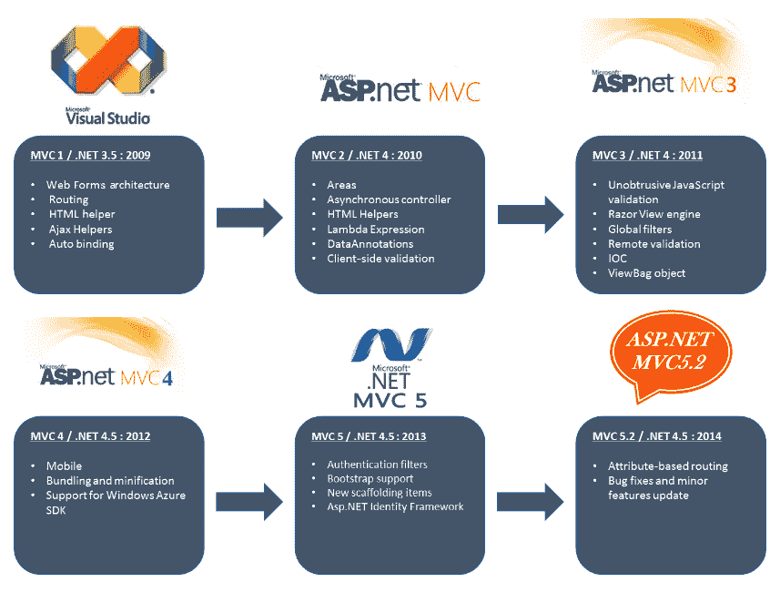

# 零、前言

每天，软件开发人员、应用架构师和 IT 项目经理都在尽可能快地构建应用，以成为各自市场的领导者：**上市时间**（**TTM**）至关重要。不幸的是，这些应用的质量和性能往往不如预期，因为它们没有经过充分的测试、优化和保护。

在过去几年中，ASP.NET 已发展成为市场上用于 web 应用开发的最一致、最稳定、功能最丰富的框架之一。它提供了所有您可以想到的有关性能、稳定性和安全性的现成特性。

一段时间以来，IT 市场一直在变化。现在需要遵守不同的标准，客户期望实现工业化、高性能和可扩展的应用，而开发人员则要求使用能够提高生产率和可扩展性的框架来适应特定的业务需求。因此，这导致微软彻底反思其网络技术。

因此，Microsoft 构建了 ASP.NET Core，使开发人员能够执行以下操作：

*   创建应用并在特定环境中编译它们，然后在任何环境（如 Linux、Windows 或 macOS）中运行它们。
*   使用具有附加功能的第三方库。
*   使用各种工具、框架和库。
*   为前端开发采用最新的最佳实践。
*   开发灵活、响应迅速的 web 应用。

ASP.NET Core 3 与 Microsoft Visual Studio 2019 一起提供了一些功能，使您作为 web 开发人员的生活更轻松、更高效。例如，VisualStudio 提供了可用于开发 web 应用的项目模板。Visual Studio 还支持多种开发模式，包括使用 Microsoft**Internet Information Services**（**IIS**）在开发期间直接测试 web 应用，以及使用内置 web 服务器通过 FTP 开发 web 应用。

使用 VisualStudio 中的调试器，您可以运行应用并逐步查找代码的关键区域以发现问题。使用 VisualStudio 编辑器，您可以有效地开发自己的自定义用户界面。

当您准备部署应用时，VisualStudio 可以轻松创建部署包，以便在 Azure、Amazon Web Services 和 Docker 或任何其他平台（包括 Linux 和 macOS）上部署。这些只是 ASP.NET Core 框架与 Visual Studio 结合时内置的一些功能。

这本书提供了最新的最佳实践和 ASP.NET Core 指导，让您快速了解最新情况。本书的每一部分都以易于阅读的格式提供了特定的 ASP.NET Core 3 功能，并附有详细的示例。循序渐进的说明会立即产生工作结果。ASP.NET Core 的大部分关键功能都使用简洁、易于理解和可重用的示例进行了说明。这些例子是深入的，以便在不傲慢的情况下说明特征。

除了通过示例展示 ASP.NET Core 功能外，本书还包含每个功能的实际应用，以便您可以在现实世界中应用这些技术。阅读本书并应用这些练习后，您将在构建高效的 web 应用方面有一个良好的开端，这些应用包括现代功能，如 MVC 体系结构、web API、自定义视图组件和标记帮助器。

我们希望这本书能帮助你作为一名开发人员的日常工作，阅读这本书会给你带来和写作一样的快乐。

# 曾几何时——NGWS 和.NET 框架

下面是一段历史来解释.NETFramework 是如何在过去几年中发展的，以及为什么您今天必须考虑.NET Core 框架：



微软在 20 世纪 90 年代末开始开发我们现在所知的.NET Framework，并在 2001 年底发布了.NET Framework 1.0 的第一个测试版。

最初，该框架被命名为**下一代 Windows 服务**（内部代码为 Lightning/Project 42）的**NGWS**。起初，开发人员只能使用 VB.NET 作为编程语言。在 10 多个框架版本之后，已经取得了很多成果。今天，您可以在大量语言、框架和技术之间进行选择。

起初，InterDev 是开发 ASP 页面的主要开发环境，您必须使用命令行 VBC 编译器工具来编译代码。

我们钟爱的 Visual Studio 开发环境的第一个版本于 2002 年 2 月发布，为 Windows 客户端和 Windows 服务器系列（NT 4、Windows 98、Windows ME、Windows XP，然后是 Windows 2000）提供了一个通用的运行时环境。

大约在同一时间，微软提供了一个名为 Compact framework 的轻量级框架，用于在 Windows Mobile 上执行 Windows CE。最后一个版本在 2008 年 1 月发布为 3.5 版 RTM，之后被更新的移动技术取代。

第一个.NET SDK 于 2003 年 4 月作为.NET Framework 1.1 发布，并包含在 Visual Studio 2003 中。它是 Windows Server 操作系统中包含的第一个版本，与 Windows 2003 一起提供。

.NET Framework 2.0 于 2006 年 1 月在 Windows 98 和 Windows Me 时代发布。它对**公共语言运行库**（**CLR**进行了重大升级。它是第一个完全支持 64 位计算并与 Microsoft SQL Server 完全集成的版本。它还引入了一个新的 Web 页面框架，提供了皮肤、模板、母版页和样式表等功能。

.NET Framework 3（WinFX）于 2006 年 11 月发布。它包括一组新的托管代码 API。这个版本增加了一些新的技术来构建新的应用，如 Po.T0\. Windows 演示基金会 To1 T1（Po.T2，WPF PosiT3），AutoT4\. Windows 通信基金会 Ty5 T5（AutoT66WCF OutT7T），AutoT8\. Windows 工作流基金会 Ty9 T9（Windows CardSpace，TW10，WWF），T11A.（后来集成到 Windows Identity Foundation 中）。

一年后的 2007 年，.NET Framework 3.5 扩展了 WinFX 功能。此版本包括关键功能，如 LINQ、ADO.NET、ADO.NET 实体框架和 ADO.NET 数据服务。此外，它还附带了两个新的程序集，这些程序集后来成为 MVC 框架的基础：

.NET Framework 4.0 于 2009 年 5 月发布；它对 CLR 进行了一些重大升级，并添加了一个并行扩展，以改进对并行计算、动态调度、命名参数和可选参数以及代码契约和`BigIntegerComplex`数字格式的支持。

在.NET Framework 4.0 发布后，Microsoft 发布了一系列改进，以 Windows Server AppFabric 框架的形式构建微服务。本质上，它提供了内存中的分布式缓存和应用服务器场。

.NET Framework 4.5 于 2012 年 8 月发布；它添加了所谓的 Metro 风格的应用（后来演变为通用 Windows 平台应用）、核心功能和**Microsoft 扩展框架**（**MEF**）。

关于 ASP.NET，该版本更兼容 HTML5 和 jQuery，并提供了捆绑和缩小功能以提高网页性能。它也是第一个支持 WebSocket 和异步 HTTP 请求和响应的。

.NET Framework 4.6.1 于 2015 年 11 月发布；它需要 Windows7SP1 或更高版本，是一个重要的版本。包括的一些新功能和 API 支持 AlwaysOn 的 SQL 连接、始终加密，以及在使用 Azure SQL 数据库时改进的连接弹性。它还使用更新的`System.Transactions`API 为分布式事务添加了 Azure SQL 数据库支持，并在 RyuJIT、GC 和 WPF 中提供了许多其他与性能、稳定性和可靠性相关的修复。

.NET Framework 4.6.2 于 2016 年 3 月发布；它增加了对超过 260 个字符的路径、X.509 证书中的 FIPS 186-3 DSA 以及数据注释本地化的支持，并且资源文件被移动到了`App_LocalResources`文件夹中。此外，ASP.NET 会话提供程序和本地缓存管理器与异步框架兼容。

.NET Framework 4.7 于 2017 年 4 月发布；它包含在 Windows 10 Creators 更新中。一些新功能包括增强的椭圆曲线加密和改进的**传输层安全性**（**TLS**支持，尤其是 1.2 版。它还引入了对象缓存存储，通过实现`ICacheStoreProvider`接口，开发人员可以轻松地提供定制的提供者。

应用和内存监视器以及著名的内存限制反应之间也有更好的集成，这使开发人员能够在 CLR 截断内存中缓存的对象并重写默认行为时观察 CLR。

然后，微软开发了一个全新的.NET 框架，从一开始就考虑了开源多平台。它被命名为 ASP.NET 5，后来更名为 ASP.NET Core 框架。

Richard Lander（MSFT）于 2016 年 6 月发布了第一个版本 1.0；ASP.NET MVC 和 web API 框架被合并到一个框架包中，您可以通过 NuGet 轻松地将其添加到项目中。

第二个版本，.NET Core 框架 1.1 于 2017 年 11 月发布；它运行在更多的 Linux 发行版上，性能得到了提高，与 Kestrel 一起发布，在 Azure 上的部署得到了简化，生产效率也得到了提高。实体框架核心开始支持 SQL Server 2016。

在撰写本书时，.NET Core 框架的最新版本是 3，于 2019 年 9 月发布。2018 年末发布了第一个预览版，自年初（2019 年）以来，随后发布了多个预览版。

微软已经大大改进了.NET Core 框架。这些改进和扩展是.NET Core 3 愿景的结果；它使您能够在更多的地方使用更多的代码。

值得注意的是，GitHub 上提供了大多数常规库。任何想要扩展或改变任何标准行为的人都可以分叉和重建它们。

# 这本书是给谁的

本书面向希望使用 ASP.NETCore3 构建现代 web 应用的开发人员。不需要具备 ASP.NET 或.NET Core 的先验知识。然而，基本的编程知识是假定的。此外，以前的 VisualStudio 经验会有所帮助，但不是必需的，因为详细的说明将指导您阅读本书的示例。本书还可以帮助从事基础设施工程和操作的人员在 ASP.NET Core 3 web 应用运行期间监控和诊断问题。

# 这本书涵盖的内容

本书分为多个章节，以简单易懂的格式，通过实际示例解释 ASP.NET Core 3 的功能。ASP.NET Core 3 的大多数关键功能都使用简洁、高效的示例和分步说明进行了说明，以产生即时的工作结果。

你不必为了发现这本书有用而阅读章节。除第一章外，每章都有自己的内容。第一章详细介绍了 ASP.NET Core 的基本原理。如果您从未尝试过桌面应用开发，您可能希望先阅读这一章。

以下主题将贯穿全书。

[第一章](01.html)、*什么是 ASP.NET Core 3？*介绍了 ASP.NET Core 3 的特性和功能，以及技术限制，让您了解在哪些情况下它可以很好地满足您自己的需求，以及您的期望。

[第 2 章](02.html)*设置环境*详细说明了如何设置您的开发环境以及如何创建您的第一个 ASP.NET Core 3 应用。您将学习如何使用 Visual Studio 2019 或 Visual Studio 代码，如何安装运行时，以及如何使用 NuGet 检索所有必要的 ASP.NET Core 3 依赖项。

[第 3 章](03.html)*Azure DevOps*中的持续集成管道，演示了如何建立完整的 Azure DevOps 持续集成管道。您将学习如何在云中使用 Azure DevOps 完全自动化应用的构建、测试和部署。

[第 4 章](04.html)、*通过自定义应用实现 ASP.NET Core 3 的基本概念：第 1 部分*解释了 ASP.NET Core 3 应用的基本结构和概念。它展示了一切在内部是如何工作的，以及可以使用哪些类和方法来覆盖基本行为。它还为所有其他章节提供了理论背景。

[第 5 章](05.html)、*通过自定义应用实现 ASP.NET Core 3 的基本概念：第 2 部分*，继[第 4 章](04.html)中所述的概念之后，*通过自定义应用实现 ASP.NET Core 3 的基本概念：第 1 部分*深入探讨了 ASP.NET Core 3 的基本概念。您将了解 ASP.NET Core 为构建响应性 web 应用提供的组件和功能。

[第 6 章](06.html)*介绍了 Razor 组件和 SignalR*，介绍了 Blazor，这是微软推出的一款新产品，旨在满足使用 C#作为语言进行前端开发的需要。它为您准备了使用服务器端 Blazor 所需的基本知识。

[第 7 章](07.html)*创建 ASP.NET Core MVC 应用*提供了创建第一个 ASP.NET Core 3 MVC 应用所需的所有概念和一切。您将学习 MVC 应用的细节以及如何高效地实现它们。此外，您将看到单元测试和集成测试将如何帮助您以更少的 bug 构建更好的应用，从而降低维护成本。

[第 8 章](08.html)*创建 Web API 应用*涵盖了 Web API 框架，并提供了创建第一个 ASP.NET Core 3 Web API 所需的一切。您将看到不同的 web API 样式，如 RPC、REST 和 HATEOAS，并了解何时使用它们以及如何以有效的方式实现它们。

[第 9 章](09.html)*使用实体框架核心 3*访问数据，展示了如何使用实体框架核心 3 访问数据库，同时使用其提供的所有高级功能（代码优先、流畅 API、数据迁移、内存数据库等）。

[第 10 章](10.html)*保护 ASP.NET Core 3 应用*说明了如何使用内置的 ASP.NET Core 3 功能进行用户身份验证，以及如何通过添加外部提供者来扩展这些功能。如果您需要保护您的应用，那么本章就是您想要去的地方。

[第 11 章](11.html)、*保护 ASP.NET 应用-漏洞*为我们提供了构建应用时需要注意的事项，包括可利用的领域，因此需要更多关注。

[第 12 章](12.html)*托管 ASP.NET Core 3 应用*是关于在本地和云中托管和部署 ASP.NET Core 3 web 应用的各种选项。您将学习如何为给定的用例选择合适的解决方案，这将允许您为自己的应用做出更好的决策。

[第 13 章](13.html)*管理 ASP.NET Core 3 应用*最后一章将介绍如何在部署后管理和监督生产就绪的应用。它将极大地帮助您在运行时诊断 ASP.NET Core 3 web 应用的问题，并减少理解和修复错误的时间。

# 充分利用这本书

您需要 Visual Studio 2019 Community Edition 或 Visual Studio 代码（出于测试和学习目的都是免费的），以便能够遵循本书中的代码示例。您也可以使用您选择的任何其他文本编辑器，然后使用`dotnet`命令行工具，但建议使用前面提到的开发环境之一，以提高生产率。

在本书的后面，我们将使用数据库，因此您还需要一个版本的 SQL Server（任何版本中的任何版本都可以使用）。我们建议使用 SQL Server 2019 Express Edition，出于测试目的，该版本也是免费的。

在接下来的章节中可能会介绍其他工具或框架。我们将解释如何在使用它们时检索它们。

如果您需要为 Linux 开发，那么 Visual Studio 代码和 SQL Server 2016 或 2019 是您的主要选择，因为它们是唯一在 Linux 上运行的。

此外，对于书中所示的一些示例，您将需要 Azure 订阅和 Amazon Web 服务订阅。有多个章节专门介绍如何利用云。

# 下载示例代码文件

您可以从您的账户[www.packt.com](http://www.packt.com)下载本书的示例代码文件。如果您在其他地方购买了本书，您可以访问[www.packt.com/support](http://www.packt.com/support)并注册，将文件通过电子邮件直接发送给您。

您可以通过以下步骤下载代码文件：

1.  登录或注册[www.packt.com](http://www.packt.com)。
2.  选择“支持”选项卡。
3.  点击代码下载。
4.  在搜索框中输入图书名称，然后按照屏幕上的说明进行操作。

下载文件后，请确保使用以下最新版本解压或解压缩文件夹：

*   WinRAR/7-Zip for Windows
*   适用于 macOS 的 Zipeg/iZip/UnRarX
*   适用于 Linux 的 7-Zip/PeaZip

该书的代码包也托管在 GitHub 上的以下存储库中：[https://github.com/PacktPublishing/Learn-ASP.NET-Core-3-Second-Edition](https://github.com/PacktPublishing/Learn-ASP.NET-Core-3-Second-Edition) 。

我们的丰富书籍和视频目录中还有其他代码包，请访问[https://github.com/PacktPublishing/](https://github.com/PacktPublishing/) 。看看他们！

# 下载彩色图像

我们还提供了一个 PDF 文件，其中包含本书中使用的屏幕截图/图表的彩色图像。您可以在这里下载：[https://static.packt-cdn.com/downloads/9781789610130_ColorImages.pdf](https://static.packt-cdn.com/downloads/9781789610130_ColorImages.pdf) 。

# 行动中的代码

请访问以下链接查看行动视频中的代码：[http://bit.ly/39ecHAf](http://bit.ly/39ecHAf) 。

# 使用的惯例

本书中使用了许多文本约定。。

`CodeInText`：表示文本中的码字、数据库表名、文件夹名、文件名、文件扩展名、路径名、虚拟 URL、用户输入和 Twitter 句柄。“启动 Visual Studio 2019，打开您创建的 Tic Tac Toe ASP.NET Core 3 项目，创建三个名为`Controllers`、`Services`和`Views`的新文件夹，然后在`Views`文件夹中创建一个名为`Shared`的子文件夹。”

代码块设置如下：

```cs
    [HttpGet] 
    public IActionResult EmailConfirmation (string email) 
    { 
      ViewBag.Email = email; 
      return View(); 
    } 
```

当我们希望提请您注意代码块的特定部分时，相关行或项目以粗体显示：

```cs
public class Student
{
    public long Id { get; set; }
    public string Name { get; set; }
    public StudentDetails StudentDetails { get; set; }
    public ICollection<StudentSubject> StudentSubjects { get; set; }
        // Added after constructed table
}
```

任何命令行输入或输出的编写方式如下：

```cs
sudo apt-get install code
```

**粗体**：表示一个新术语、一个重要单词或您在屏幕上看到的单词。例如，菜单或对话框中的单词出现在文本中，如下所示。下面是一个示例：“打开 VisualStudio2019，转到团队资源管理器选项卡，然后单击分支按钮。”

Warnings or important notes appear like this. Tips and tricks appear like this.

# 联系

我们欢迎读者的反馈。

**一般反馈**：如果您对本书的任何方面有疑问，请在邮件主题中注明书名，并发送电子邮件至`customercare@packtpub.com`。

**勘误表**：尽管我们已尽一切努力确保内容的准确性，但还是会出现错误。如果您在本书中发现错误，如果您能向我们报告，我们将不胜感激。请访问[www.packt.com/submit-errata](http://www.packt.com/submit-errata)，选择您的书籍，点击 errata 提交表单链接，并输入详细信息。

**盗版**：如果您在互联网上发现我们作品的任何形式的非法复制品，请您提供我们的位置地址或网站名称，我们将不胜感激。请通过`copyright@packt.com`与我们联系，并提供该材料的链接。

**如果您有兴趣成为一名作家**：如果您对某个主题有专业知识，并且您有兴趣撰写或贡献一本书，请访问[authors.packtpub.com](http://authors.packtpub.com/)。

# 评论

请留下评论。一旦你阅读并使用了这本书，为什么不在你购买它的网站上留下评论呢？然后，潜在读者可以看到并使用您的无偏见意见做出购买决定，我们 Packt 可以了解您对我们产品的看法，我们的作者可以看到您对他们书籍的反馈。非常感谢。

有关 Packt 的更多信息，请访问[Packt.com](http://www.packt.com/)。