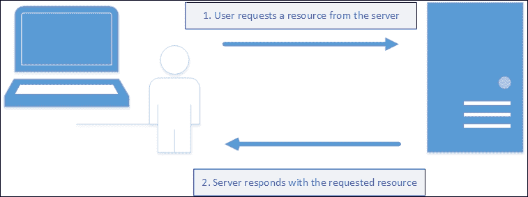
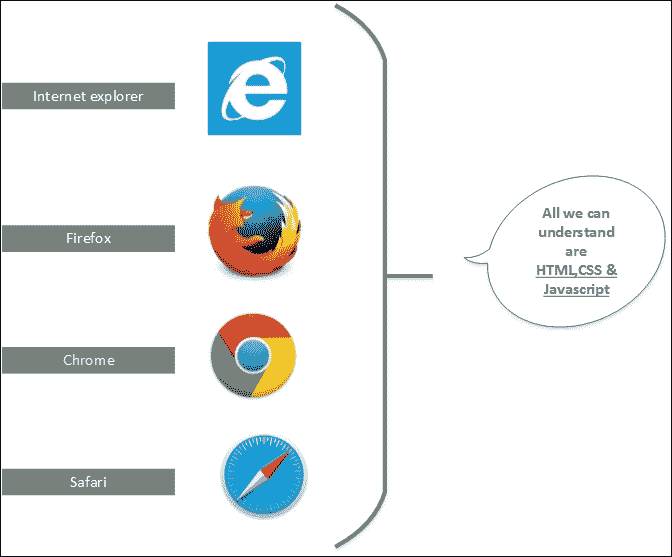
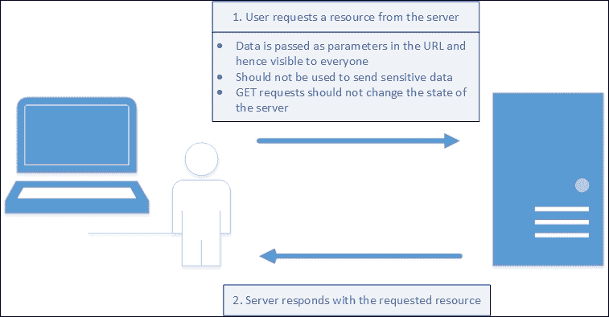
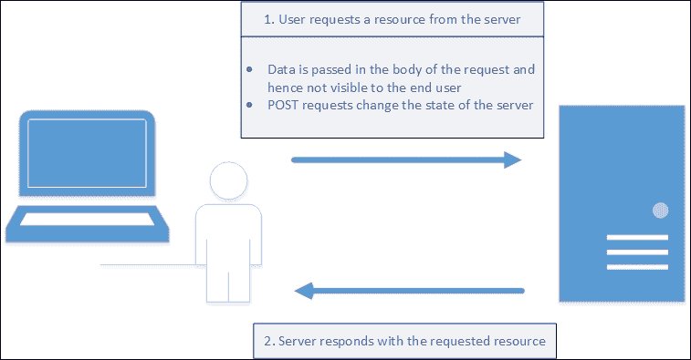
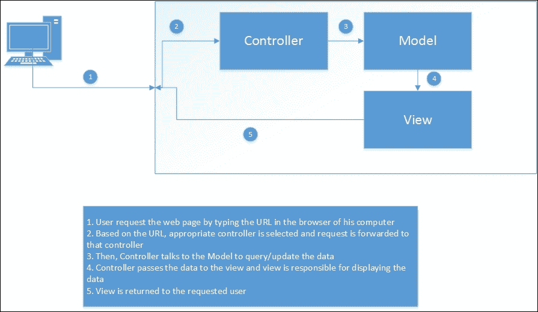

# 一、ASP.NET Core 简介

ASP.NET Core 的最新版本。 来自微软的 asp.net MVC，是一个服务器端 web 应用开发框架，它可以帮助你有效地构建 web 应用。 它运行在 ASP.NET 5 平台，它使你的应用可以运行在各种各样的平台上，包括 Linux 和 Mac OS x。这打开了大量的机会，在这个时代成为。NET 开发人员是令人兴奋的。

在本章中，您将学习以下主题:

*   关于 web 应用的基本概念——http、客户端和服务器端
*   ASP.NET-ASP 的三种编程模型。 asp.net Web 窗体.NET 网页和 asp.net 网页.NET MVC
*   哲学的 ASP.NET MVC
*   ASP 的特点。 asp.net Core 和 asp.net。 网 5

在讨论 ASP.NET Core 及其特性，让我们了解 web 应用开发的基本原理。 我坚信这样一个原则:如果你想成为某方面的专家，你就必须非常擅长基础知识。 这将有助于调试和修复问题。

话虽如此，我们还是要讨论以下几个关键的基本问题:

*   web 应用是如何工作的，以及一些关于 HTTP 的内容
*   客户端和服务器端
*   HTTP 方法

只有三个关键概念。 没什么大不了的!

# web 应用如何工作

所有的 web 应用，不管它们是否是用 ASP 构建的.NET MVC、Ruby on Rails 或任何其他新技术都是在 HTTP 协议上工作的。 有些应用使用 HTTPS (HTTP 的安全版本)，其中数据在通过网络之前进行了加密。 但是 HTTPS 仍然使用 HTTP。

## 那么什么是 HTTP 协议呢?

**HTTP**代表**超文本传输协议**，是为分布式超媒体系统设计的应用协议。 超文本传输协议中的“超文本”是指使用超链接在文档之间进行遍历的结构化文本。 HTTP 的标准由**Internet Engineering Task Force**(**IETF**)和**World Wide Web Consortium**(**W3C**)开发。 HTTP 目前的版本是 HTTP/2，并在 2015 年标准化。 支持的浏览器有:Internet Explorer、Chrome、Firefox 等。

HTTP 协议(协议不过是一组管理通信的规则)是一种无状态协议，遵循请求-响应模式。

### 请求-响应模式

在讨论请求-响应模式之前，让我们先讨论几个术语:客户机和服务器。 服务器是一种计算资源，它接收来自客户机的请求并为其提供服务。 通常，服务器是一种具有处理许多请求的巨大内存的高性能机器。 客户机是发送请求和接收响应的计算资源。 通常，客户端可以是 web 服务器或发送请求的任何应用。

回到请求-响应模式，当您从服务器请求资源时，服务器将使用所请求的资源响应您。 资源可以是任何东西——网页、文本文件、图像或其他数据格式。



你发出一个请求。 服务器响应资源。 这称为**请求-响应模式**。

### HTTP 的无状态特性

当您再次请求相同的资源时，服务器将再次使用所请求的资源响应您，而不知道之前请求和服务的内容是相同的。 HTTP 协议本质上不知道以前接收和服务的任何请求的状态信息。 有几种可用的机制可以维护状态，但 HTTP 协议本身并不维护状态。 稍后我们将解释维护状态的机制。

让我用一个简单的实际示例向您解释无状态和请求-响应模式:

1.  输入以下 URL:[https://en.wikipedia.org/wiki/ASP.NET_MVC](https://en.wikipedia.org/wiki/ASP.NET_MVC)。 这是一个关于 ASP 的维基百科网页。 净 MVC。
2.  从前面的 URL，浏览器触发一个对 Wikipedia 服务器的请求。
3.  维基百科的网络服务器为你提供 ASP.NET MVC 网页。
4.  你的浏览器接收这个网页并呈现它。
5.  您可以通过再次输入相同的 URL([https://en.wikipedia.org/wiki/ASP.NET_MVC](https://en.wikipedia.org/wiki/ASP.NET_MVC))再次请求相同的页面，然后按*Enter*。
6.  浏览器再次触发对 Wikipedia 服务器的请求。
7.  维基百科为您提供相同的 ASP.NET MVC 网页，而没有意识到这一事实，相同的资源之前被请求从相同的资源。

### 注意事项

如前所述，有几种机制来维护状态。 让我们暂时假设，这里没有执行这种机制。 我知道我在这里过于简单化了，但这解释了这一点。

# 客户端和服务器端

有必要了解 web 应用的客户端和服务器端，以及双方可以做什么。 对于 web 应用，客户端是浏览器，服务器可以是 web 服务器/应用服务器。

浏览器端是浏览器中发生的任何事情。 它是 JavaScript 代码运行和 HTML 元素驻留的地方。

服务器端是在计算机的另一端的服务器上发生的任何事情。 从浏览器发出的请求必须通过线路(可能是通过网络)来执行一些服务器端代码并返回适当的响应。 您的浏览器不关心服务器端技术或服务器端代码所使用的语言。 服务器端也是 c#代码所在的地方。

让我们来讨论一些事实，使事情更清楚:

*   **事实 1**:所有的浏览器只能理解 HTML, CSS 和 JavaScript，与浏览器厂商无关。
    *   You might be using Internet Explorer, Firefox, Chrome, or any other browser. Still, the fact that your browser can understand only HTML, CSS, and JavaScript holds true. It cannot understand C#. It cannot understand Java. Nor Ruby. Only HTML, CSS, and JavaScript. This is the reason why you can access the web applications, built using any technology could be accessed by the same browser.

        

*   **事实 2**:任何 web 开发框架的目的都是将服务器端代码转换为 HTML、CSS 和 JavaScript。
    *   这与前一点有关。 由于浏览器只能理解 HTML、CSS 和 JavaScript，所以所有的 web 开发技术都应该将服务器端代码转换为 HTML、CSS 和 JavaScript，以便浏览器能够理解。 这是任何 web 开发框架的主要目的。 这对于您是否使用 ASP 构建 web 应用是正确的。 净 MVC, ASP.NET Web 表单，Ruby on Rails，或者 J2EE。 对于如何生成 HTML、CSS 和 JavaScript，每个 web 开发框架可能都有一个独特的概念/实现，并且可能会以不同的方式处理安全性能等特性。 但是，每个框架都必须生成 HTML，因为这是您的浏览器所能理解的。

# HTTP 方法

尽管 HTTP 协议的所有请求都遵循请求-响应模式，但发送请求的方式可能因时而异。 HTTP 方法定义如何将请求发送到服务器。

HTTP 中可用的方法有`GET`、`HEAD`、`POST`、`PUT`、`DELETE`、`TRACE`、`OPTIONS`、`CONNECT`和`PATCH`。 在大多数 web 应用中，`GET`和`POST`方法被广泛使用。 在本节中，我们将讨论这些方法。 稍后，我们将在需要知道的基础上讨论其他 HTTP 方法。

## GET 方法

`GET`是 HTTP 协议的一种方法，用于从服务器获取资源。 使用`GET`方法的请求应该只检索数据，不应该有任何副作用。 这意味着，如果您一次又一次地触发相同的`GET`请求，您应该获得相同的数据，并且服务器的状态不应该因为这个 get 请求而发生任何变化。

在`GET`方法中，参数作为请求 URL 的一部分发送，因此对最终用户可见。 这种方法的优点是，用户可以将 URL 标记为书签，并随时再次访问页面。 例如:[www.yourwebsite.com?tech=mvc6&db=sql](http://www.yourwebsite.com?tech=mvc6&db=sql)。

我们在前面的`GET`请求中传递了两个参数。 `tech`是第一个值为`mvc6`的参数，`db`是第二个值为`sql`的参数。 假设您的网站使用前面的参数值，并在数据库中进行搜索，在将这些博客文章呈现给用户之前检索讨论`mvc6`和`sql`的博客文章。



`GET`方法的缺点是，数据以明文形式作为参数在 URL 中传递，不能用于发送敏感信息。

而且，大多数浏览器对 URL 中的字符数量都有限制，所以在使用`GET`请求时，我们不能发送大量的数据。

## POST 方法

请求通常用于更新或创建服务器上的资源。

数据在请求体中传递。 这有以下含义:

*   您可以向服务器发送敏感信息，因为数据嵌入在请求体中，并且在 URL 中对最终用户不可见。
*   As the data is not sent through the request URL, it does not take up space in the URL and therefore it has no issues with the URL length limitations.

    

既然我们已经介绍了基本原理，现在我们可以继续讨论 ASP.NET。

# 什么是 ASP.NET?

ASP.NET 是一个服务器端 web 应用开发框架，允许开发人员构建 web 应用、网站和 web 服务。 它最早是在 2002 年初由微软推出的，在这 14 年里，它经历了很多变化。

基本上,ASP.NET 有三种编程模型:

*   ASP。 净 Web 表单
*   ASP。 网网页
*   ASP.NET MVC

尽管上述所有编程模型的最终结果都是有效地生成动态网页，但它们遵循的方法各不相同。 让我们讨论每一个编程模型，以理解它们的原理。

## 净 Web 表单

从历史上看,当 ASP.NET 首先被引入，ASP.NET Web Forms 是程序员在 ASP.NET 中开发 Web 应用的唯一编程模型。

ASP.NET Web Forms 模型抽象了 Web，因此即使 Web 本身是无状态的，它也可以维护状态。

它还支持服务器端的事件驱动编程模型。 这帮助桌面应用开发人员平稳地过渡到 web 应用开发。

像 PHP 和其他一些 web 应用框架一样，ASP.NET Web Forms 是一个基于文件的框架，用户通过访问服务器上的文件来访问 Web 页面。 服务器将处理您的请求，将该文件中的所有服务器端组件转换为 HTML，并将其发送回请求客户机。

每个网页在 ASP.NET Web 表单由两个文件表示:`.aspx`和`.aspx.cs`或`.aspx.vb`。 这个`.aspx`文件包含你的前端组件——所有的 ASP 控件和 HTML 元素。 `.aspx.cs`(如果你使用 c#作为代码后置语言)或`.aspx.vb`(如果你使用 Visual Basic 作为代码后置编程语言)包含在网页上发生的事件的代码。

在 ASP 到来之前，这是主要的编程模型.NET MVC，并且这个编程模型仍然被用于维护使用这个模型编写的生产应用。

## 网网页

ASP.NET Web Pages 主要针对那些数据处理逻辑直接写在 Web 页面上的小型 Web 应用。

## NET MVC

ASP.NET MVC 是 ASP.NET 中 MVC 模式的实现。 ASP 的缺点.NET Web 表单，例如对 HTML 生成的有限控制都在 ASP 中解决。 净 MVC。 大多数的现代应用控制的客户端 JavaScript 库/框架,如**jQuery** , **KnockoutJS,**和**AngularJS**,有完全控制生成的 HTML 是至关重要的。

让我们来谈谈模型-视图-控制器模式，以及它对 web 应用开发的好处。

**模型-视图-控制器(MVC)模式**:这是一种软件架构模式，它帮助定义每个组件的职责，以及它们如何结合在一起以实现总体目标。 该模式主要用于构建用户界面，并适用于许多领域，包括开发桌面应用和 web 应用。 但我将从 web 开发的背景来解释 MVC 模式。

首先，MVC 模式有三个组件:

*   **模型**:该组件表示您的领域数据。 请注意，这不是您的数据库。 这个模型组件可以与您的数据库对话，但是模型只代表您的领域数据。 例如，如果您正在构建一个电子商务 web 应用，模型组件可能包含诸如 Product、Supplier 和 Inventory 等类。
*   **视图**:该组件负责向用户呈现什么内容。 通常，该组件将包含您的 HTML 和 CSS 文件。 这可能还包括控制 web 应用对最终用户的外观的布局信息。
*   **Controller** : As the name implies, the controller is responsible for interacting with different components. It receives the request (through the routing module), talks to the model, and sends the appropriate view to the user.

    

这种职责的分离为 web 应用开发带来了很大的灵活性，允许对每个区域进行单独和独立的管理。

# ASP. net 的特点 NET MVC

ASP.NET MVC 是一种固执己见的应用开发框架，它倾向于以某种独特的方式处理某些功能。 让我们来讨论一下 ASP 的每个特性.NET MVC，以及它们带来的好处。

## 约定优于配置

这是一种设计方法，在开发应用时大大减少了决策的数量，从而使其变得更简单。

如果您已经使用任何技术构建了任何应用，那么您可能会使用某种 XML 文件，其中必须配置其中的所有内容。 即使是最简单的东西，我们可能也要对那里的东西进行配置。

ASP.NET MVC 完全接受了*约定而不是*配置。 这是一种哲学，你可以在不配置相同的情况下确定它将如何工作。

让我给你举个简单的例子。 所有控制器代码都位于`Controller`文件夹中，视图为每个控制器都有一个单独的文件夹。 每当请求到来时，ASP.NET MVC 知道在哪里找到控制器和它关联的视图，而不需要任何配置。 这种方法导致更少的配置和更少的调试时间。

## 关注点分离

如前所述，ASP.NET MVC 有三个主要组件:模型、控制器和视图。 这清楚地分离了职责，以便 UI 设计人员或 UI 开发人员可以在 View 上工作，而后端开发人员可以在 Model 上工作，为应用构建数据域或与数据库对话。 由于每个组成部分的职责是明确定义和分开的，工作可以并行进行。

## 控制生成的 HTML

如果你有任何构建 ASP 的经验.NET Web 窗体应用，您可能已经使用了诸如`asp:textbox`之类的 ASP 控件。 尽管这些控制有很多好处，但它们也有缺点。 当使用这些控件时，开发人员不能完全控制生成的 HTML。 当然，您可以在 ASP 控件中设置一些属性，而 ASP 控件又可以在生成的 HTML 中设置一些属性。 但完全控制是不可能的。 ASP。 asp.net MVC HTML 助手和标签助手.NET Core 提供了对生成的 HTML 的更好的控制。

## 更好的支持单元测试

由于每个组件被分离和划分，创建单元测试用例变得更容易实现:

*   **ASP 中统一的 MVC 和 Web API 控制器 NET Core**:在早期版本的 asp.net.NET MVC, MVC(`System.Web.MVC.Controller`)和 Web API(`System.Web.Http.ApiController`)使用不同的控制器。 在 ASP.NET Core，只有一个基本控制器支持创建 MVC 控制器和 Web API 控制器。 关于路由，所有控制器使用相同的路由。 当然，您可以根据需要使用基于约定的路由或基于属性的路由。
*   **关于 Web API 的注意事项**:Web API 是微软通过 HTTP 协议构建 Web 服务的技术。 HTTP 不仅仅局限于服务网页。 Web API 可以用于构建 API 服务和数据。 这种方法的优点是，使用 Web API 构建的服务可以被广泛的客户机使用，比如浏览器、移动应用和桌面应用。

ASP 的早期版本的代码。 asp.net MVC(直到 asp.net.NET MVC 5)如下:

```
publicclassValuesController : ApiController
{ 
  // GET api/values 
  publicIEnumerable<string>Get()
  { 
    returnnewstring[] { "value1","value2"}; 
  } 
} 
Code for ASP.NET Core: 
publicclassValuesController:Controller
{ 
  //GET api/values 
  [HttpGet] 
  publicIEnumerable<string>Get()
  { 
    returnnewstring[] { "value1","value2"}; 
  } 
} 

```

# 网 5

ASP.NET 5 是微软用于使用。NET 构建现代云应用的最新框架。 这是一个跨平台的框架，你可以运行你的应用建立在 ASP.NET 5 可以在任何平台上运行，比如 Linux 或 Mac OS X，当然也可以在 Microsoft Windows 上运行。 ASP.NET 5 是开源的，完整的源代码可以在 GitHub 上的[https://github.com/aspnet/home](https://github.com/aspnet/home)上找到。

ASP 的最新版本。 净 MVC, ASP.NET core 运行在 asp.net。 净 5 平台。

## ASP. net 的特点 网 5

*   **跨平台支持**:应用是建立在 ASP 之上的.NET 5 可以在任何平台上运行。 已安装 net5。 这意味着您在 ASP 上构建的应用.NET 5 可以在苹果 OS X 和 Linux 机器上运行。 部署 ASP.NET 内核在 Linux 机器上将在后面的章节中解释。
*   **更好的支持客户端开发**: NET 5 被设计为与一系列客户端框架无缝工作，如**AngularJs**、**Knockout**、**Bootstrap**和**React.js**。

# 总结

在本章中，我们学习了 web 开发的基础知识，包括服务器端和客户端是由什么组成的。 我们甚至讨论了 ASP 的特性。 asp.net Core 和 asp.net。 净 5。