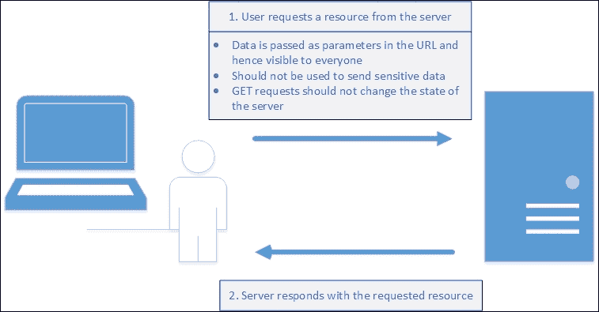
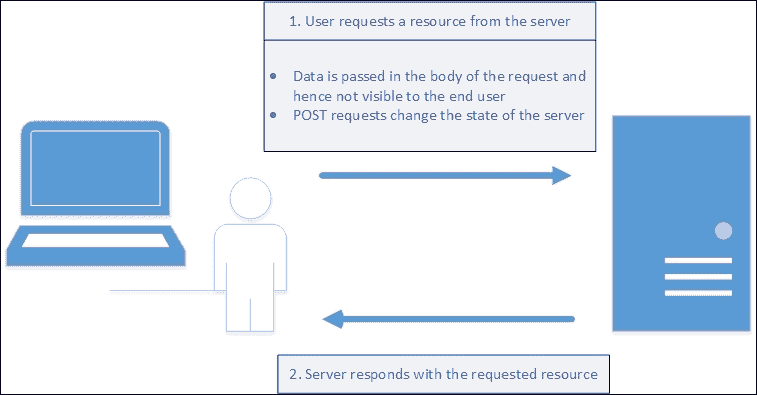
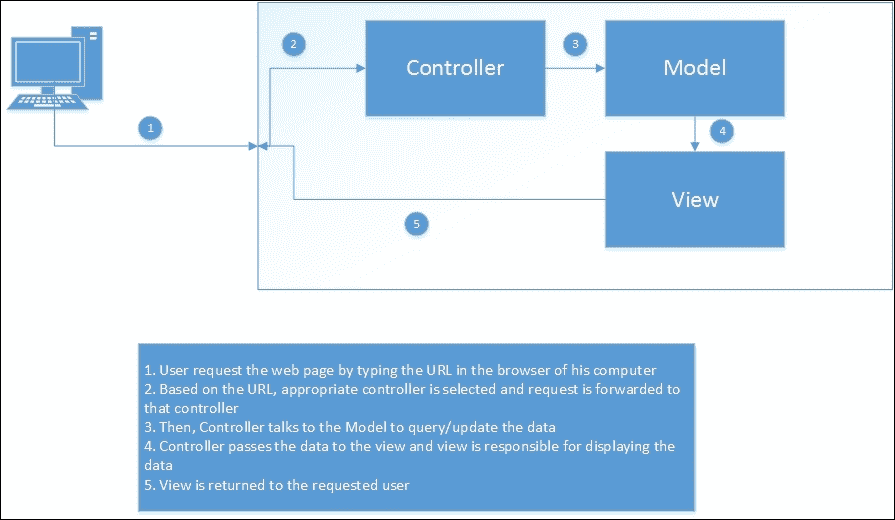

# 第一章。ASP.NET Core 简介

ASP.NET Core，微软推出的 ASP.NET MVC 的最新版本，是一个服务器端 Web 应用程序开发框架，它可以帮助你有效地构建 Web 应用程序。这个框架运行在 ASP.NET 5 平台之上，使得你的应用程序能够在包括 Linux 和 Mac OS X 在内的多种平台上运行。这为开发者提供了大量的机会，在这个时代成为一名.NET 开发者是非常令人兴奋的。

在本章中，你将学习以下主题：

+   关于 Web 应用程序的基本概念——HTTP、客户端和服务器端

+   ASP.NET 的三个编程模型——ASP.NET Web Forms、ASP.NET Web Pages 和 ASP.NET MVC

+   ASP.NET MVC 的哲学

+   ASP.NET Core 和 ASP.NET 5 的功能

在讨论 ASP.NET Core 及其功能之前，让我们先了解 Web 应用程序开发的基础知识。我坚信这样一个原则：如果你想在某个领域成为专家，你需要非常精通基础知识。这将有助于调试问题和解决问题。

话虽如此，我们将讨论以下关键基础知识：

+   关于 Web 应用程序的工作原理以及一些关于 HTTP 的知识

+   客户端和服务器端

+   HTTP 方法

只需三个关键概念。没什么大不了的！

# Web 应用程序是如何工作的

所有 Web 应用程序，无论它们是使用 ASP.NET MVC、Ruby on Rails 还是任何其他新技术构建的，都基于 HTTP 协议。一些应用程序使用 HTTPS（HTTP 的安全版本），在数据通过线路传输之前进行加密。但 HTTPS 仍然使用 HTTP。

## 那么什么是 HTTP 协议呢？

**HTTP**代表**超文本传输协议**，是一种为分布式超媒体系统设计的应用协议。"超文本"在超文本传输协议中指的是使用超链接在文档之间进行导航的结构化文本。HTTP 标准由**互联网工程任务组**（**IETF**）和**万维网联盟**（**W3C**）制定。当前版本的 HTTP 是 HTTP/2，于 2015 年标准化。它被大多数网络浏览器支持，如 Internet Explorer、Chrome 和 Firefox。

HTTP 协议（协议不过是一套规则，用于规范通信）是一种无状态的协议，遵循请求-响应模式。

### 请求-响应模式

在讨论请求-响应模式之前，让我们讨论几个术语：客户端和服务器。服务器是一种计算资源，它接收来自客户端的请求并为其提供服务。通常，服务器是一台具有巨大内存的高性能机器，可以处理大量请求。客户端是一种计算资源，它发送请求并接收响应。通常，客户端可以是 Web 服务器或任何发送请求的应用程序。

回到请求-响应模式，当你从服务器请求一个资源时，服务器会响应你，提供所请求的资源。资源可以是任何东西——一个网页、文本文件、一张图片，或者另一种数据格式。


你发起一个请求。服务器响应提供资源。这被称为**请求-响应模式**。

### HTTP 的无状态特性

当你再次请求相同的资源时，服务器会再次响应你，提供所请求的资源，而无需知道之前已经请求并提供了相同的资源。HTTP 协议本身并不了解之前接收和提供过的任何请求的状态知识。有几种机制可以维护状态，但 HTTP 协议本身并不维护状态。我们将在稍后解释维护状态的机制。

让我用一个简单的实际例子来向你解释无状态和请求-响应模式：

1.  你输入以下 URL：[`en.wikipedia.org/wiki/ASP.NET_MVC`](https://en.wikipedia.org/wiki/ASP.NET_MVC)。这是一个关于 ASP.NET MVC 的维基百科网页。

1.  从前面的 URL，浏览器向维基百科服务器发起请求。

1.  维基百科的 Web 服务器为你提供了 ASP.NET MVC 网页。

1.  浏览器接收该网页并将其呈现出来。

1.  你再次通过输入相同的 URL（[`en.wikipedia.org/wiki/ASP.NET_MVC`](https://en.wikipedia.org/wiki/ASP.NET_MVC)）并按*Enter*键来请求相同的页面。

1.  浏览器再次向维基百科服务器发起请求。

1.  维基百科为你提供了相同的 ASP.NET MVC 网页，而它并不知道之前已经从同一资源请求过相同的资源。

### 注意

如前所述，有几种机制可以维护状态。让我们暂时假设这里没有实现这样的机制。我知道我在这里过于简单化，但这解释了这一点。

# 客户端和服务器端

理解 Web 应用的客户端和服务器端以及各自可以做什么是必要的。就 Web 应用而言，你的客户端是浏览器，你的服务器可以是 Web 服务器/应用服务器。

浏览器端是你在浏览器中看到的所有事情。这是你的 JavaScript 代码运行和 HTML 元素所在的地方。

服务器端是在你电脑另一端的服务器上发生的事情。你从浏览器发起的请求必须通过线路（可能跨越网络）执行一些服务器端代码，并返回适当的响应。你的浏览器对服务器端技术或服务器端代码所使用的语言一无所知。服务器端也是你的 C#代码所在的地方。

让我们讨论一些事实来澄清问题：

+   **事实 1**：所有浏览器只能理解 HTML、CSS 和 JavaScript，无论浏览器供应商如何。

    +   你可能在使用 Internet Explorer、Firefox、Chrome 或任何其他浏览器。然而，你的浏览器只能理解 HTML、CSS 和 JavaScript 的这一事实是正确的。它不能理解 C#。它也不能理解 Java。更不用说 Ruby。只有 HTML、CSS 和 JavaScript。这就是为什么你可以访问使用任何技术构建的网络应用，并且这些应用可以通过相同的浏览器访问。客户端和服务器端

+   **事实 2**：任何网络开发框架的目的是将你的服务器端代码转换为 HTML、CSS 和 JavaScript。

    +   这与前面的观点相关。由于浏览器只能理解 HTML、CSS 和 JavaScript，所有网络开发技术都应该将你的服务器端代码转换为 HTML、CSS 和 JavaScript，以便你的浏览器可以理解。这是任何网络开发框架的主要目的。无论你使用 ASP.NET MVC、ASP.NET Web Forms、Ruby on Rails 还是 J2EE 来构建你的网络应用，这都是正确的。每个网络开发框架可能都有独特的概念/实现，关于如何生成 HTML、CSS 和 JavaScript，并且可能以不同的方式处理功能，如安全性和性能。但每个框架都必须生成 HTML，因为这是你的浏览器所能理解的。

# HTTP 方法

尽管所有 HTTP 协议的请求都遵循请求-响应模式，但请求的发送方式可能因请求而异。HTTP 方法定义了请求是如何发送到服务器的。

HTTP 中可用的方法有 `GET`、`HEAD`、`POST`、`PUT`、`DELETE`、`TRACE`、`OPTIONS`、`CONNECT` 和 `PATCH`。在大多数网络应用中，`GET` 和 `POST` 方法被广泛使用。在本节中，我们将讨论这些方法。稍后，我们将根据需要讨论其他 HTTP 方法。

## GET 方法

`GET` 是 HTTP 协议中的一种方法，用于从服务器获取资源。使用 `GET` 方法的请求应仅检索数据，不应有任何副作用。这意味着如果你反复发送相同的 `GET` 请求，你应该得到相同的数据，并且服务器状态不应因这个 `GET` 请求而发生变化。

在 `GET` 方法中，参数作为请求 URL 的一部分发送，因此对最终用户是可见的。这种方法的优点是用户可以保存 URL 书签，并在需要时再次访问页面。例如，[www.yourwebsite.com?tech=mvc6&db=sql](http://www.yourwebsite.com?tech=mvc6&db=sql) 。

在前面的`GET`请求中，我们传递了几个参数。`tech`是第一个参数，其值为`mvc6`，而`db`是第二个参数，其值为`sql`。假设您的网站接受这些参数及其值，并在向用户展示这些博客文章之前，在数据库中搜索关于`mvc6`和`sql`的博客文章。



`GET`方法的缺点是，由于数据作为参数以明文形式在 URL 中传递，因此不能用于发送敏感信息。

此外，大多数浏览器对 URL 中的字符数有限制，因此，当使用`GET`请求时，我们不能发送大量数据。

## POST 方法

`POST`请求通常用于在服务器上更新或创建资源。

数据在请求体中传递。这有以下影响：

+   您可以将敏感信息发送到服务器，因为数据嵌入在请求体中，并且它不会在 URL 中向最终用户可见。

+   由于数据不是通过请求 URL 发送的，因此它不会占用 URL 空间，因此它没有 URL 长度限制的问题。

既然我们已经涵盖了基础知识，我们现在可以继续讨论 ASP.NET。

# 什么是 ASP.NET？

ASP.NET 是一个服务器端 Web 应用程序开发框架，允许开发者构建 Web 应用程序、网站和 Web 服务。它最初由微软在 2002 年初推出，在这 14 年中，它经历了许多变化。

基本上，ASP.NET 有三个编程模型：

+   ASP.NET Web Forms

+   ASP.NET Web Pages

+   ASP.NET MVC

尽管所有上述编程模型最终的结果都是有效地生成动态 Web 页面，但它们遵循的方法各不相同。让我们讨论这些编程模型中的每一个，以了解它们的原则。

## ASP.NET Web Forms

从历史上看，当 ASP.NET 首次推出时，ASP.NET Web Forms 是程序员在 ASP.NET 中开发 Web 应用程序的唯一编程模型。

ASP.NET Web Forms 模型抽象了 Web，即使 Web 本质上是无状态的，也能保持状态。

它还支持服务器端的事件驱动编程模型。这有助于桌面应用程序开发者平滑过渡到 Web 应用程序开发。

与 PHP 和其他几个 Web 应用程序框架一样，ASP.NET Web Forms 是一个基于文件的框架，用户通过访问服务器上的文件来访问网页。服务器将处理您的请求，将文件中的所有服务器端组件转换为 HTML，并将其发送回请求客户端。

在 ASP.NET Web Forms 中，每个 Web 页面都由两个文件表示：`.aspx`和`.aspx.cs`（如果您使用 C#作为后端代码语言）或`.aspx.vb`（如果您使用 Visual Basic 作为后端编程语言）。`.aspx`文件包含您的前端组件——所有的 ASP 控件和您的 HTML 元素。`.aspx.cs`（如果您使用 C#作为后端代码语言）或`.aspx.vb`（如果您使用 Visual Basic 作为后端编程语言）包含在网页上发生的事件的代码。

这是在 ASP.NET MVC 出现之前的主要编程模型，并且此编程模型仍在被用于维护使用此模型编写的生产应用程序。

## ASP.NET Web Pages

ASP.NET Web Pages 主要针对小型 Web 应用程序，其中数据处理逻辑直接写在网页上。

## ASP.NET MVC

ASP.NET MVC 是 ASP.NET 中对 MVC 模式的实现。ASP.NET Web Forms 的缺点，如对 HTML 生成的有限控制，在 ASP.NET MVC 中得到解决。由于大多数现代应用程序都由客户端 JavaScript 库/框架（如**jQuery**、**KnockoutJS**和**AngularJS**）控制，因此对生成的 HTML 拥有完全控制至关重要。

让我们简要谈谈模型-视图-控制器（Model-View-Controller）模式及其如何有利于 Web 应用程序开发。

**模型-视图-控制器（MVC）模式**：这是一种软件架构模式，有助于定义每个组件的责任以及它们如何协同工作以实现整体目标。此模式主要用于构建用户界面，并适用于许多领域，包括开发桌面应用程序和 Web 应用程序。但我将从 Web 开发的角度来解释 MVC 模式。

首先，MVC 模式有三个主要组件：

+   **模型**：此组件代表您的领域数据。请注意，这并不是您的数据库。此模型组件可以与您的数据库通信，但模型仅代表您的领域数据。例如，如果您正在构建电子商务 Web 应用程序，模型组件可能包含如 Product（产品）、Supplier（供应商）和 Inventory（库存）等类。

+   **视图**：此组件负责向用户展示什么内容。通常，此组件会包含您的 HTML 和 CSS 文件。这还可能包括控制您的 Web 应用程序外观的布局信息。

+   **控制器**：正如其名所示，控制器负责与不同组件交互。它接收请求（通过路由模块），与模型通信，并向用户发送适当的视图。

这种责任分离为 Web 应用程序开发带来了极大的灵活性，允许每个区域独立管理。

# ASP.NET MVC 的特点

ASP.NET MVC 是一个有观点的应用程序开发框架，它倾向于以某种独特的方式处理某些功能。让我们讨论 ASP.NET MVC 的每个功能，以及它们带来的好处。

## **约定优于配置**：在 ASP.NET MVC 中，完全采用了“约定优于配置”的原则。这是一种哲学，你可以在不进行任何配置的情况下确定它的工作方式。

这是一个设计方法，在开发应用程序时显著减少了决策的数量，从而使其更加简单。

如果你使用过任何技术构建过任何应用程序，你可能使用过某种类型的 XML 文件，其中你必须配置其中的所有内容。即使是更简单直接的事情，我们也可能需要在那里进行配置。

ASP.NET MVC 完全采用了“约定优于配置”。这是一种哲学，你可以在不进行任何配置的情况下确定它的工作方式。

让我给你一个简单的例子。所有控制器代码都位于 `Controller` 文件夹中，而视图为每个控制器都有一个单独的文件夹。每当有请求到来时，ASP.NET MVC 就知道在哪里找到控制器及其关联的视图，而无需任何配置。这种方法减少了配置并缩短了调试时间。

## 关注点分离

如前所述，ASP.NET MVC 有三个主要组件——模型、控制器和视图。这清楚地分离了责任，以便 UI 设计师或 UI 开发者可以工作在视图上，而后端开发者可以工作在模型上，为应用程序构建数据域或与数据库通信。由于每个组件的职责都明确且分离，工作可以并行进行。

## 对生成的 HTML 的控制

如果你有过构建 ASP.NET Web Forms 应用程序的经验，你可能使用过 ASP 控件，例如 `asp:textbox`。尽管这些控件有很多好处，但它们也有自己的缺点。当使用这些控件时，开发者无法完全控制生成的 HTML。当然，你可以在 ASP 控件中设置一些属性，这些属性反过来会设置你生成的 HTML 中的某些属性。但无法实现完全控制。ASP.NET MVC HTML 辅助工具和 ASP.NET Core 中的标签辅助工具提供了对生成的 HTML 的更好控制。

## 更好的单元测试支持

由于每个组件都是分离和分区的，因此创建单元测试用例变得更容易实现：

+   **ASP.NET Core 中统一的 MVC 和 Web API 控制器**：在 ASP.NET MVC 的早期版本中，不同的控制器用于 MVC (`System.Web.MVC.Controller`) 和 Web API (`System.Web.Http.ApiController`)。在 ASP.NET Core 中，只有一个基控制器支持创建 MVC 控制器和 Web API 控制器。在路由方面，所有控制器使用相同的路由。当然，你可以根据需要使用基于约定的路由或基于属性的路由。

+   **关于 Web API 的说明**：Web API 是微软用于通过 HTTP 协议构建 Web 服务的 Microsoft 技术。HTTP 不仅限于服务网页。Web API 可以用于构建 API 服务和数据。这种方法的优点是，使用 Web API 构建的服务可以被各种客户端消费，例如浏览器、移动应用程序和桌面应用程序。

以下为 ASP.NET MVC 早期版本（直到 ASP.NET MVC 5）的代码：

```cs
publicclassValuesController : ApiController
{ 
  // GET api/values 
  publicIEnumerable<string>Get()
  { 
    returnnewstring[] { "value1","value2"}; 
  } 
} 
Code for ASP.NET Core: 
publicclassValuesController:Controller
{ 
  //GET api/values 
  [HttpGet] 
  publicIEnumerable<string>Get()
  { 
    returnnewstring[] { "value1","value2"}; 
  } 
} 

```

# ASP.NET 5

ASP.NET 5 是微软最新推出的框架，用于使用 .NET 构建现代基于云的应用程序。它是一个跨平台框架，这意味着您可以在任何平台上运行基于 ASP.NET 5 构建的应用程序，例如 Linux 或 Mac OS X，当然也包括 Microsoft Windows。ASP.NET 5 是开源的，完整的源代码可在 GitHub 上找到，网址为 [`github.com/aspnet/home`](https://github.com/aspnet/home)。

ASP.NET MVC 的最新版本，即 ASP.NET Core，运行在 ASP.NET 5 平台上。

## ASP.NET 5 的特性

+   **跨平台支持**：在 ASP.NET 5 上构建的应用程序可以在安装了 ASP.NET 5 的任何平台上运行。这意味着您在 ASP.NET 5 上构建的应用程序可以在 Apple OS X 和 Linux 机器上运行。在后续章节中，我们将解释如何在 Linux 机器上部署 ASP.NET Core。

+   **更好的客户端开发支持**：ASP.NET 5 设计得可以无缝地与一系列客户端框架协同工作，例如 **AngularJs**、**Knockout**、**Bootstrap** 和 **React.js**。

# 概述

在本章中，我们学习了网络开发的基础知识，包括服务器端和客户端的构成。我们还讨论了 ASP.NET Core 和 ASP.NET 5 的特性。
