# 第四章：视图

视图是应用程序的实际输出，它被发送给用户。这是用户从屏幕访问你的应用程序时实际看到的内容。所有组件，无论是菜单、输入元素、对话框还是用户看到的一切，都只来自你的视图。如果你在访问应用程序时没有提供良好的用户体验，用户将不会关心你的应用程序有多好。因此，在构建 ASP.NET MVC 应用程序时，视图发挥着至关重要的作用。

在本章中，我们将涵盖以下主题：

+   视图引擎和 Razor 视图引擎的目的

+   在 Razor 视图引擎中编程和不同的编程结构

+   ASP.NET Core 中的布局及其功能

+   HTML 辅助器

+   部分视图

+   标签辅助器

# 视图引擎和 Razor 视图引擎

如 第一章 中所述，*ASP.NET Core 简介*，浏览器只能理解 HTML、CSS 和 JavaScript。视图引擎的目的是从你的视图中生成 HTML 代码并将其发送到浏览器，以便它能够理解内容。主要有两种不同的视图引擎——Razor 视图引擎和 Webform 视图引擎。尽管这两个视图引擎随 ASP.NET MVC 一起提供，但你也可以使用任何自定义视图引擎。

## Razor 视图引擎

Razor 视图引擎是 ASP.NET Core 中的默认和推荐视图引擎，并且从现在开始，这可能是当你安装 ASP.NET MVC 时随附的唯一视图引擎。

你可以在你的 Razor 视图中混合 C# 代码和 HTML 代码，Razor 视图引擎足够智能，可以区分这两者并生成预期的输出。在某些情况下，我们可能需要向 Razor 视图提供额外的信息以生成适当的结果。Razor 代码块以 `@` 符号开始，不需要关闭的 `@` 符号。

### 在 Razor 视图引擎中编程

在 Razor 视图引擎中编程就像你在 C# 中编程一样。区别在于，在 Razor 视图引擎中，你的 C# 代码将与 HTML 混合以生成所需的 HTML 输出。

### Razor 视图中的变量

你可以在 razor 块内声明一个变量，并使用 `@` 符号使用该变量。

### 注意

对于本章中的所有示例，我们只将展示视图的代码样本。

让我们通过一个例子来讨论这个问题。

1.  创建一个名为 `Controllers` 的文件夹和一个名为 `HomeController` 的控制器。

1.  通过右键单击上下文菜单并选择 **添加** | **新建项**，然后从列表中选择 **MVC Razor 视图**，创建一个名为 `Views` 的文件夹、一个名为 `Home` 的子文件夹和一个名为 `Index.cshtml` 的视图文件。

`HomeController.cs` 文件将包含以下代码：

```cs
public class HomeController : Controller
{
  // GET: /<controller>/
  public IActionResult Index()
  {
    return View();
  }
}
```

接下来是更新的 Razor 视图，我们将声明一个变量并使用它。前五行和最后两行是简单的 HTML 元素。

我们将专注于粗体的行。然后，我们将使用`@` { … } 创建一个 Razor 代码块，并在其中声明一个变量。Razor 代码块以闭合的大括号结束。`Value:`片段被视为简单的 HTML 文本。由于我们希望使用 Razor 变量的值，我们将使用`@i`来指示 Razor 视图引擎，`i`不是一个普通的 HTML 文本；它是一个 Razor 构造，应相应地处理。完整的 HTML 代码如下：

```cs
<html>
  <head>
    <title> Views demo</title>
  </head>
  <body>

 @{

 int i = 5; 

 } 

     Value: @i 
  </body>
</html>
```

当你运行应用程序时，你会看到以下输出：

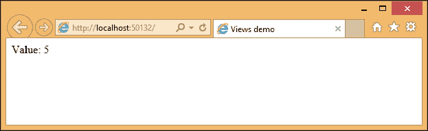

请注意，当你访问 Razor 变量时，你需要使用`@`符号。如果没有这个符号，Razor 视图引擎会将`i`视为文本而不是表达式。

以下截图是当你不使用`@`符号访问变量时将得到的结果：

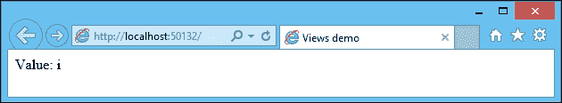

#### for 循环

你可以在 Razor 视图中使用大多数 C#中可用的编程结构。以下代码片段是`for`循环结构，其中我们循环五次并打印变量名：

```cs
@{
   for (int i = 0; i < 5; i++)
   {
     <li>@(i+1)</li>
   }
 }
```

以下是一些需要注意的点：

+   由于 for 循环是 Razor 代码，我们应该用`@`符号包围循环，以指示随后的代码是 Razor 代码而不是普通 HTML。

+   无论何时我们使用 HTML 元素或标签，Razor 视图引擎都会回退到 HTML 模式。如果你想在 HTML 标签内使用任何 Razor 表达式，你将需要再次包含`@`符号，以告诉 Razor 视图引擎随后的内容是 Razor 代码而不是 HTML 元素。这就是为什么我们在前面的表达式中再次使用`@`符号，即使在父级根级 Razor 代码内部。

视图的完整代码如下：

```cs
<html>
  <head>
    <title> Views demo</title>
  </head>
  <body>
    <ul>
    @{
       for (int i = 0; i < 5; i++)
       {
         <li>@(i+1)</li>
       }
     }
    </ul>
  </body>
</html>
```

#### while 循环

以下代码片段是相同循环的`while`循环实现。请注意，加粗的表达式增加了变量 i 的值。我们不会使用@符号，因为它不在 HTML 元素内：

```cs
@{
   int i = 0;
   while(i<5)
   {
     <li>@(i + 1)</li>

 i++; 

   }
 }
```

#### foreach 循环

Razor 视图中的`foreach`循环与 C#中的`foreach`循环相同。在以下代码中，我们将初始化一个整数列表，遍历列表并将其作为列表项打印出来：

```cs
<ul>
  @{
     List<int> integers = new List<int>
     {
       1,2,3,4,5
     };
     foreach (int i in integers)
     {
       <li>@i</li>
     }
   }
</ul>
```

#### if 条件

在以下代码中，我们将检查变量的值是否小于 10。如果小于 10，我们将打印`i is less than 10`，否则，我们将说`i is greater than 10`。你可能想知道为什么我们必须包含`text`标签，它的目的是什么。由于我们处于 Razor 视图代码块内部，文本`i is less than 10`将被视为 Razor 表达式，但它不是。

这个`text`标签是为了指示 Razor 视图引擎，`text`标签之后的内容应被视为文本，而不是 Razor 表达式：

```cs
@{
   int i = 5;
   if (i < 10)
   {
     <text>i is less than 10</text>
   }
   else
   {
     <text>i is greater than 10</text>
   }
 }
```

# 布局

在我们之前讨论的所有示例中，我们都在单个文件中完成了完整的视图编码。这将导致缺乏灵活性和可重用性降低。

考虑以下网页结构，其中 **顶部部分** 包含公司标志或横幅，而 **侧边部分** 包含到网站各个部分的链接。**内容部分**会因页面而异。

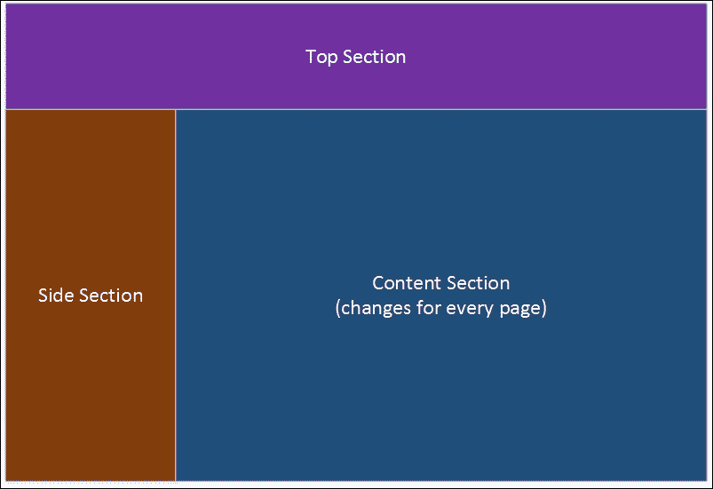

如果我们在单个视图中编写完整的内容，我们可能需要在每个页面上重复 **顶部部分** 和 **侧边部分**。如果我们想更改 **侧边部分** 中的任何内容，我们可能需要更改所有文件。这清楚地表明，单个视图文件并不是最佳解决方案。

在这种情况下，布局就派上用场了。布局定义了可以在所有网页中重用的网站结构。布局甚至不需要像顶部部分或侧边部分这样的内容；它可以包含一个简单的 HTML 结构，其中可以包含常见内容，而主体内容将由单个视图渲染。

让我们构建我们的第一个布局。为了使用布局，你需要以下三个东西：

1.  通知布局文件的名称——这个信息应该在 `_ViewStart.cshtml` 中提供。按照惯例，所有共享文件的名称都将以一个下划线开头，并且此文件位于 `Views` 文件夹的底部。

1.  创建布局文件——按照惯例，文件名为 `_Layout.cshtml`，它将位于 `Shared` 文件夹中。所有共享内容，例如部分视图，也将在此处可用。部分视图将在本章后面讨论。

1.  创建内容视图文件——这个视图文件几乎与之前创建的视图文件相同，只有一个区别；只有页面特定的内容将在此文件中可用，这意味着你将不会在此处有任何 `html`、`head` 或 `title` 标签。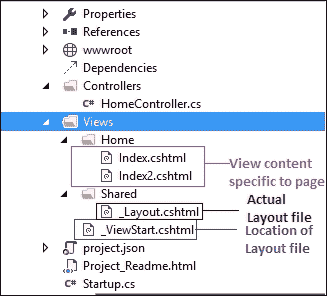

在创建 `_ViewStart.cshtml`、`_Layout.cshtml` 和页面特定的视图文件后，文件夹结构将如前所述。

## 创建 _ViewStart.cshtml

右键单击 **Views** 文件夹，从 **上下文** 菜单中选择 **添加新项**。然后，从 **添加新项** 对话框中选择 **MVC 视图起始页**，如图所示：

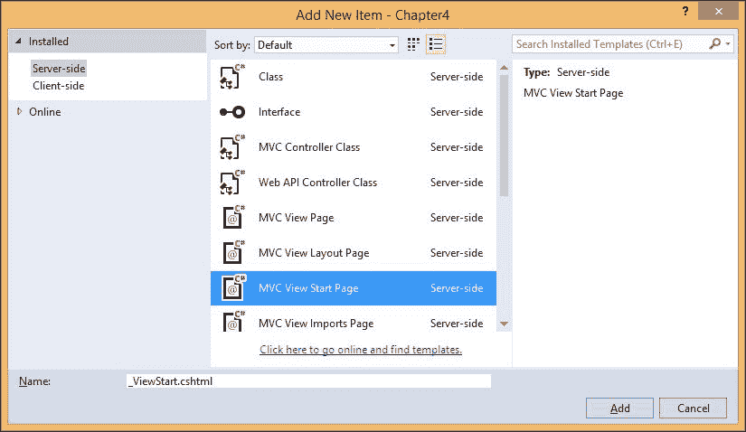

当你点击 **添加** 按钮时，它将创建一个包含以下内容的文件：

```cs
@{
   Layout = "_Layout";
 }
```

## 创建 _Layout.cshtml

在 `Views` 文件夹中创建一个名为 **Shared** 的文件夹。然后，右键单击 **Shared** 文件夹，从 **上下文** 菜单中选择 **添加新项**，如图所示：

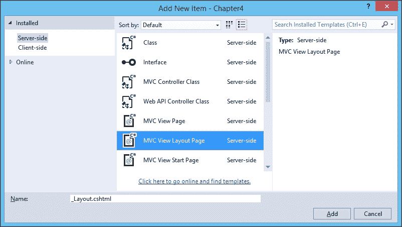

当你点击 **添加** 按钮时，它将创建包含以下内容的 **_Layout.cshtml**：

```cs
<!DOCTYPE html>
<html>
<head>
<meta name="viewport" content="width=device-width" />
<title>@ViewBag.Title</title>
</head>
<body>
<div>

@RenderBody() 

</div>
</body>
</html>
```

上述布局文件是一个简单的 HTML 内容，包含几个 Razor 表达式。`@ViewBag` 用于显示从控制器传递过来的标题信息，而 `@RenderBody` 是一个 Razor 表达式，它调用页面特定的视图并将内容合并到那里。

## 添加页面特定的视图

在添加视图之前，我们需要在我们的 `HomeController` 文件中添加一个操作方法，我们将从这个方法调用页面特定的视图。

让我们添加一个名为 `Index2` 的操作方法，如下所示：

```cs
public IActionResult Index2()
{
  ViewBag.Title = "This is Index2";
  return View();
}
```

`ViewBag` 用于将信息从控制器传递到视图。在这里，我们将 `Title` 信息从操作方法传递到视图。

现在，右键单击 `Views` 文件夹，选择 **添加** | **新建项**，选择 **MVC 视图页面**，并将文件保存为 `Index2.cshtml`。

在生成的视图中，我添加了简单的 `Hello` 文本。此文本将在布局页面的主体中渲染。视图文件的完整代码如下：

```cs
@*
For more information on enabling MVC for empty projects, visit http://go.microsoft.com/fwlink/?LinkID=397860
*@
@{
 …
 }
 Hello. This text will be rendered in body of the layout page 

```

现在一切都已经设置好了。运行应用程序，并在浏览器中输入 URL `http://localhost:50132/Home/Index2`。请注意，当您从您的电脑运行应用程序时，本地主机后面的端口号可能会变化。

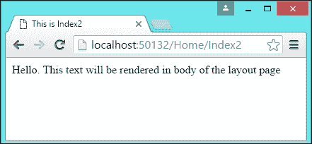

如预期的那样，您将看到前面图片中看到的文本。然而，我们的重点不是文本。它是关于生成的 HTML 内容的结构。

通过按 *Ctrl* + *U*（在 Windows 的 Chrome 浏览器中）查看源代码。您将看到以下 HTML 内容：

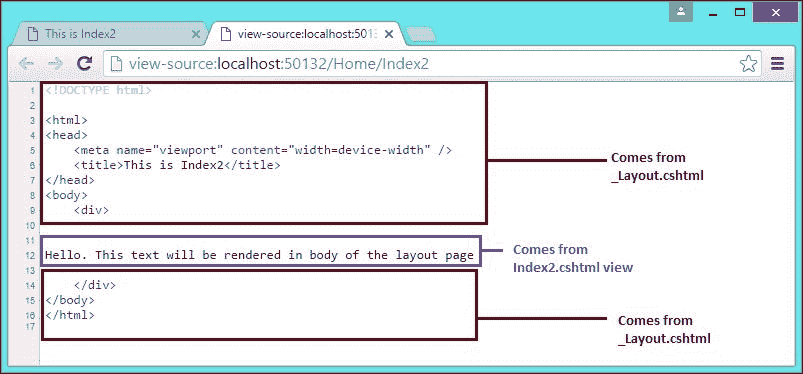

顶部内容（`html`、`head`、`body` 和 `div` 开放标签）和底部内容（`html`、`head`、`body` 和 `div` 关闭标签）来自布局文件，文本来自特定于页面的视图。

# 生成 HTML

如 第一章 中所述，*ASP.NET Core 简介*，浏览器只能理解 HTML、CSS 和 JavaScript，无论您使用什么技术构建 Web 应用程序。在 ASP.NET MVC 中构建应用程序时也是如此。

大多数应用程序获取用户输入，处理输入，然后将所需信息存储在数据库中以供以后检索。在 Web 应用程序的情况下，表单 HTML 元素用于获取用户输入。

以下是在 ASP.NET Core 中生成 HTML 元素的一些方法：

+   HTML 辅助器

+   标签辅助器

HTML 辅助器是服务器端方法，有助于生成浏览器可以理解的 HTML 元素。HTML 辅助器是生成 HTML 元素的主要方法，直到 ASP.NET MVC 5。

ASP.NET Core 中引入的标签辅助器也会生成 HTML 元素。我们将在本章的后续部分讨论标签辅助器，它们将看起来像 HTML 元素，其中您添加属性来识别它们为标签辅助器。使用标签辅助器而不是 HTML 辅助器的优点是用户界面设计师/工程师不需要担心 Razor 代码。他们只需使用 HTML 元素和额外的属性进行编码。

在讨论 HTML 辅助器和标签辅助器之前，让我们退一步，谈谈为什么我们最初需要它们。

让我们考虑一个简单的表单，如下面的图片所示，我们希望获取用户的姓名和年龄。如果用户输入了她的年龄，我们将显示 `您有资格投票！` 。如果没有，我们将显示 `您现在没有资格投票` ：

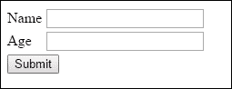

以下是将显示前面简单表单的 HTML 代码：

```cs
<form>
  <table>
    <tr>
      <td>
        <label for="txtName">Name</label>
      </td>
      <td>
        <input type="text" id="txtName" />
      </td>
    </tr>
   <tr>
     <td>
       <label for="txtAge">Age</label>
     </td>
     <td>
      <input type="text" id="txtAge" />
     </td>
   </tr>
   <tr>
     <td colspan="2">
       <input type="submit"  />
     </td>
   </tr>
  </table>
</form>
```

直接编码 HTML 元素的方法既耗时又容易出错。例如，在上面的表单中，标签和输入 HTML 元素引用了同一个元素（第一组中的 `txtName` 和第二组中的 `txtAge`）。如果我们手动编码 HTML 元素，在构建 HTML 元素时可能会出现拼写错误。

## HTML 助手

HTML 助手是服务器端方法，为您生成 HTML。我们可以使用 HTML 助手生成相同的表单，如下所示（`HTML.BeginForm`、`@Html.Label` 和 `@Html.TextBox` 分别生成 HTML `form` 元素、标签和文本框元素）：

```cs
@using (Html.BeginForm())
 {
   <table>        
     <tr> 
       <td>@Html.Label("Name")</td>
       <td>@Html.TextBox("txtName")</td>
     </tr>
     <tr>
       <td>@Html.Label("Age")</td>
       <td>@Html.TextBox("txtAge")</td>
     </tr>
     <tr>
       <td colspan="2"><input type="submit" value="Submit" /></td>
     </tr> 
   </table>
}
```

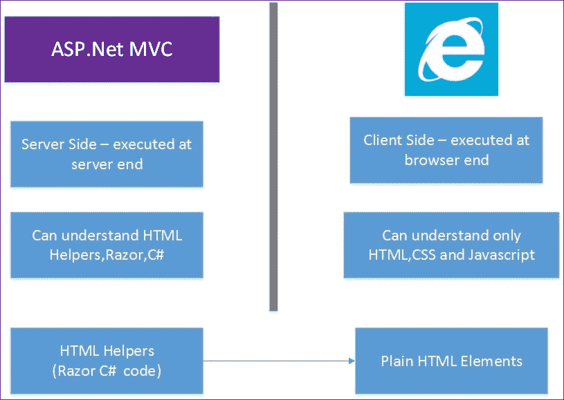

你可能会想知道为什么我们需要使用 HTML 助手，因为我们可以手动编写 HTML 代码。当我们将模型从控制器传递到视图时，事情会变得更加复杂。使用 HTML 助手，我们可以直接从 `Models` 文件构建 `form` 元素，这样它们将选择你正在使用的 `Models` 中的名称。

例如，让我们创建一个名为 `Models` 的文件夹和一个名为 `Person` 的类。此类将充当模型，如下面的截图所示：

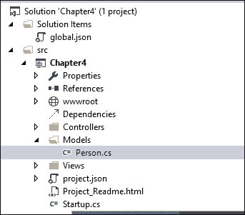

`Person` 类只是一个 POCO（Plain Old C# Object）类，将充当模型。此类的完整代码如下：

```cs
public class Person
{
  public int PersonId { get; set; }
  public string Name { get; set; }
  public int Age { get; set; }
}
```

让我们创建一个名为 `ValidateAge` 的新操作方法。在这个方法中，我们将创建一个空的 `Person` 类并将模型传递给视图。我们还在 `ViewBag` 中创建了一个名为 `Title` 的动态属性，以便我们可以在视图中显示此值：

```cs
[HttpGet]
public IActionResult ValidateAge()
{
  ViewBag.Title = "Validate Age for voting";
  Person person1 = new Person();
  return View(person1);
}
```

在视图中，使用以下 HTML 助手创建 `form`：

```cs
@model Chapter4.Models.Person
@using (Html.BeginForm("ValidateAge", "Home", FormMethod.Post))
 {
   <table>
     <tr>
       <td>@Html.LabelFor(Model => Model.Name) </td>
       <td>@Html.TextBoxFor(Model => Model.Name) </td>
     </tr>
     <tr>
       <td>@Html.LabelFor(Model => Model.Age)</td>
       <td>@Html.TextBoxFor(Model => Model.Age)</td>
     </tr>
     <tr>
       <td colspan="2"><input type="submit" value="Submit" /></td>
     </tr>
   </table>
}
```

在第一行，我们告诉视图我们正在传递 `Person` 类型的模型。这使您能够使用模型的强类型，即当您键入 Model 并加一个点时，**IntelliSense** 会为您提供 `Person` 类的所有属性

在第二行，我们使用的是重载的 `BeginForm` HTML 助手，它接受三个参数——动作方法名称、控制器名称和 `Form` 方法。

简单来说，当用户提交表单时，信息应该传递到提到的控制器动作。

在 `LabelFor` 和 `TextBox` For HTML 助手中，我们只是传递模型属性（姓名和年龄）；它将自动查询并获取模型属性并构建相应的 HTML 元素。这是使用 HTML 助手的优点之一。不使用 HTML 助手，这个过程可能会变得复杂。

现在，让我们以相同的方式编写相应的`POST`操作方法。在以下`POST`操作方法中，根据表单中输入的年龄，我们将动态属性设置为`Message`。

```cs
[HttpPost]
public IActionResult ValidateAge(Person person1)
{
  if(person1.Age>=18)
  {
    ViewBag.Message = "You are eligible to Vote!";
  }
  else
  {
    ViewBag.Message = "Sorry.You are not old enough to vote!";
  }
  return View();
}
```

需要注意的是，`GET`和`POST`操作方法都指向同一个视图——`ValidateAge.cshtml`。在表单元素上方添加以下内容到视图中：

```cs
@if(ViewBag.Message!=null)
 {
   <b>@ViewBag.Message</b>
 }
```

一旦用户提交表单，`POST`操作方法会在`ViewBag`中设置动态的`Message`属性。然而，当视图作为`GET`请求的一部分渲染时，此属性的值将为 null。如果值不为 null，则在页面顶部插入消息。

当您运行应用程序时，您将得到以下输出：

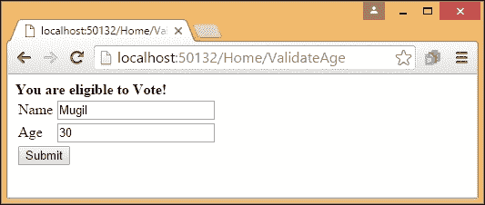

# 部分视图

部分视图只是可以在应用程序中重用的视图。可以将部分视图视为可插入的可重用块，您可以从任何地方调用它，并显示部分视图的内容。

考虑以下网页的结构——这是我们之前使用的相同布局页面，但有一些变化。**最新新闻**块被添加到**侧边栏**，而**登录**块被添加到**顶部区域**。这些块不受**顶部区域**或**侧边栏**的限制，可以在应用程序的任何地方使用，包括以下图中的**内容区域**。

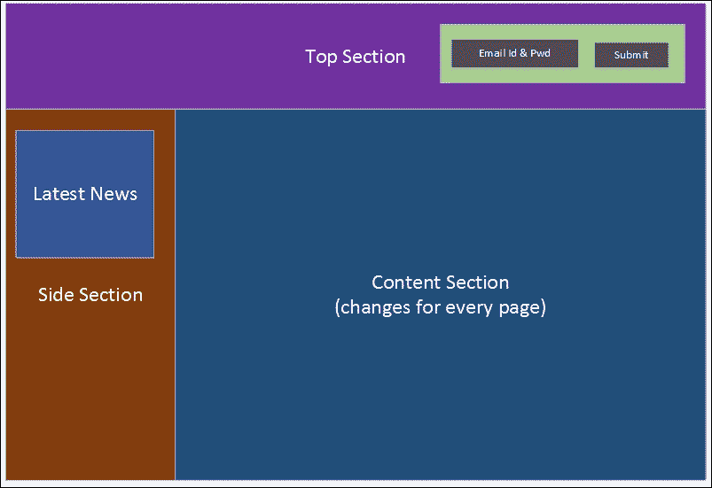

这些部分视图不仅限于静态内容，还可以包含`form`元素。在前面的截图中，**最新新闻**部分视图包含文本内容，而登录部分视图包含用于获取电子邮件 ID 和密码的`form`元素。

部分视图的位置——框架不限制部分视图的位置。然而，按照惯例，如果你的部分视图只由你的控制器使用，你可以在控制器特定的视图文件夹中创建该部分视图。例如，如果你的部分视图只会在`HomeController`文件中使用，你可以在`Views\Home`文件夹中创建该部分视图。

让我们看看如何创建部分视图并使用它。

如前所述，部分视图就像一个普通视图。因此，我们将以创建普通视图相同的方式创建部分视图。

右键单击`Shared`文件夹，然后选择**添加** | **新建项**。按照惯例，就像所有共享内容一样，部分视图的名称也将以"`_`"（下划线）开头，如下面的截图所示：

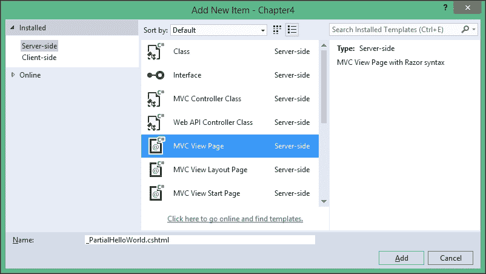

### 小贴士

我们创建这个部分视图是基于它可以从应用程序的任何地方使用的假设。

在生成的部分视图中，我添加了以下简单的静态内容——一段文本和一个简单的表格：

```cs
<b>This content and below table is coming from partial view</b>
<table border="1"> 
  <tr>
    <th>Employee No</th>
    <th>Employee Name</th>
  </tr>
  <tr> 
    <td>10012</td>
    <td>Jon Skeet</td>
  </tr>
  <tr>
    <td>10013</td>
    <td>Scott Guthrie</td>
  </tr>
</table>
```

## 调用部分视图

可以使用`@Html.Partial` HTML 助手调用部分视图。

在我们的案例中，我们将从`Index2.cshtml`文件中调用部分视图。你传递的参数将是部分文件的名称。它将根据该名称搜索部分视图，并将该完整内容作为`Index2.cshtml`文件的一部分进行渲染。

`Index2.html`文件的现在内容如下：

```cs
Hello. This text will be rendered in body of the layout page<br/> <br/> <br/>

@Html.Partial("_PartialHelloWorld")
```

现在，运行应用程序并访问 URL `http://localhost:50132/Home/Index2`。你将看到以下输出：

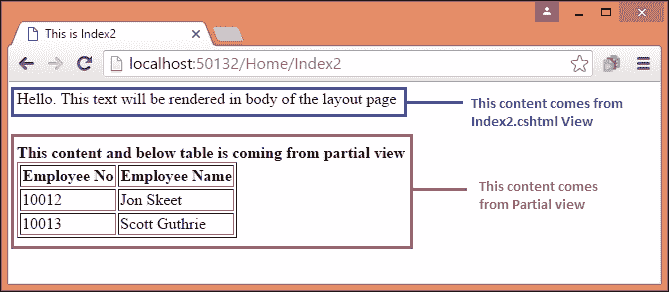

# 视图组件

视图组件是 ASP.NET Core 中引入的新功能，它们几乎与部分视图相似，但功能更强大。当你使用部分视图时，你对 Controller 有依赖。然而，当你使用`ViewComponent`属性时，你不需要依赖 Controller，因此我们将建立关注点的分离，并具有更好的可测试性。尽管现有的部分视图 HTML 辅助器仍然受支持，但在使用.NET Core 时，你想要显示可重用信息时，更倾向于使用视图组件。

## 创建视图组件

你可以使用以下任何一种方式创建`ViewComponent`：

+   通过从`ViewComponent`属性派生创建一个类

+   使用`[ViewComponent]`属性装饰一个类，或者从具有`[ViewComponent]`属性的类派生

+   你可以通过创建一个以`ViewComponent`属性后缀结尾的类来使用约定。

无论你选择哪种选项，这个`ViewComponent`都应该是一个公共的、非嵌套的、非抽象的类。

与 Controller 一样，你可以在`ViewComponent`属性中使用依赖注入（通过构造函数）。由于`ViewComponent`属性与 Controller 的生命周期是分开的，你可能无法在`ViewComponents`中使用操作过滤器。

有一个名为`Invoke`（或`InvokeAync`，`Invoke`的异步等效方法），它将返回`IComponentViewResult`接口。这个方法类似于将返回视图的 Controller 的动作方法。

让我们亲自动手创建一个`ViewComponent`属性。

在你的项目中创建一个名为`ViewComponents`的新文件夹和一个名为`SimpleViewComponent`的新类，如下面的截图所示：

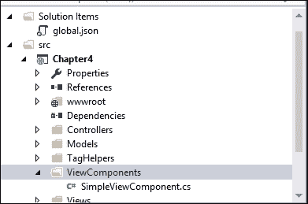

我们创建的`SimpleViewComponent`文件看起来如下：

```cs
using System;
using System.Collections.Generic;
using System.Linq;
using System.Threading.Tasks;
using Microsoft.AspNet.Mvc;

namespace Chapter4.ViewComponents
{
  public class SimpleViewComponent :ViewComponent
  {
    public IViewComponentResult Invoke()
    {
      var data = GetSampleData();
      return View(data);
    }
    /// <summary>
    /// This is a simple private method to return some dummy data
    /// </summary>
    /// <returns></returns>

    private List<string> GetSampleData()
    {
      List<string> data = new List<string>();
      data.Add("One");
      data.Add("Two");
      data.Add("Three");
      return data;
    }
  }
}
```

我们只有几个方法，一个用于填充数据，另一个是`Invoke`方法，我们将在这个方法中渲染视图。

一旦你创建了`ViewComponent`属性，你需要在`Views_ViewImports.cshtml`文件中包含`ViewComponent`命名空间，以便`ViewComponents`属性对所有视图可用。以下突出显示的代码片段被添加到视图中：

```cs
@using Chapter4
@using Chapter4.Models

@using Chapter4.ViewComponents 

@addTagHelper "*, Microsoft.AspNet.Mvc.TagHelpers"
```

我们已经创建了`ViewComponent`并将其提供给所有视图。`HomeController`文件中的一个简单的动作方法只是返回视图：

```cs
public ActionResult Sample()
{
return View();
}
```

在关联的视图中，我们可以像以下代码片段所示那样调用组件：

```cs
<p>
  This is a sample web page <br/>
  <div>
    @Component.Invoke("Simple")
  </div> 
</p>
```

当您调用组件时，它将在以下两个文件夹中搜索：

+   `Views\<controller_name>\Components\<view component name>\<view name>`文件夹

+   `Views\Shared\Components\<view_component_name>/<view_name>`文件夹

视图组件的默认视图名称是`Default`，这使得视图的文件名为`Default.cshtml`。因此，我们需要在`Views\Shared\Simple\Default.cshtml`文件夹中创建`Default.cshtml`文件，如图所示：

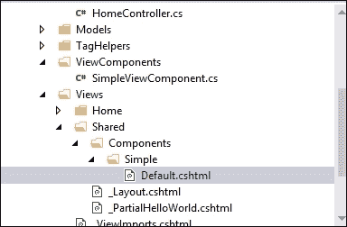

在`ViewComponent`文件的视图（`Default.cshtml`文件）中，我们只是在迭代模型中的项并将它们显示为无序列表项，如下面的代码所示：

```cs
@model IEnumerable<string>

<h3> Sample list</h3>
<ul>
  @foreach(var item in Model)
  {
    <li>@item</li>
  }
</ul>
```

当您运行应用程序并访问 URL（`http://localhost:50132/Home/Sample`）时，您应该看到以下输出：

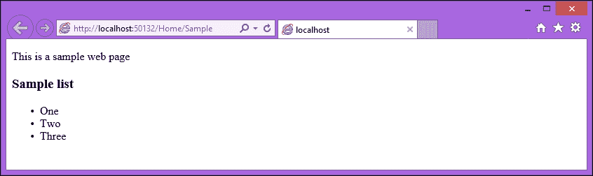

第一行**这是一个示例网页**来自父视图文件（`sample.cshtml`），而随后的列表来自`ViewComponent`属性。

通常在视图中引用`ViewComponent`属性。但是，如果您想直接从控制器中调用`ViewComponent`，您也可以这样做。

我已经调用了`Sample`操作方法来直接调用简单的`ViewComponent`，而不是通过其他视图调用它，如下所示：

```cs
public ActionResult Sample()
{
  return ViewComponent("Simple");
  //return View();
}
```

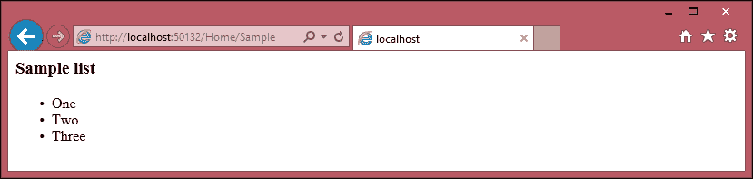

因此，与旧的 HTML 部分视图相比，这些`ViewComponents`具有更多的灵活性和功能，例如依赖注入。这确保了`ViewComponents`可以单独测试。

# 标签助手

标签助手是 ASP.NET Core 中的新功能；它们帮助生成 HTML 元素。在 HTML 助手中，我们将编写 C#/Razor 代码来生成 HTML。与此方法相关的不利之处在于，许多前端工程师可能不知道 C#/Razor 代码。他们使用纯 HTML、CSS 和 JavaScript。标签助手看起来就像 HTML 代码，但具有所有服务器端渲染的功能。您甚至可以根据需要构建自己的自定义标签助手。

让我们看看如何使用标签助手。为了使用标签助手，您需要安装`Microsoft.AspNet.Mvc.TagHelpers` NuGet 包。

通过选择**视图** | **其他窗口** | **包管理控制台**来打开**包管理控制台**窗口，如图所示：

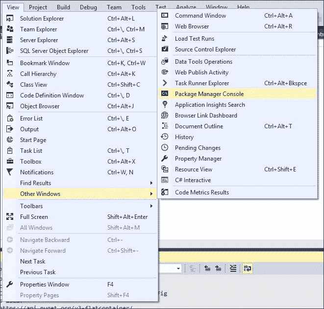

您可以通过在**包管理控制台**窗口中输入以下命令来安装`TagHelpers`方法，以下命令：

```cs

Install-Package Microsoft.AspNet.Mvc.TagHelpers -Pre

```

当您输入以下命令时，将出现以下响应：

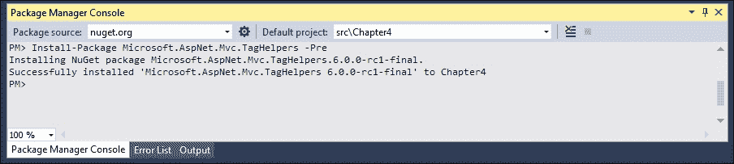

一旦安装了`TagHelpers`包，我们需要调用`ViewImports`文件，在那里我们将添加`TagHelpers`指令，以便标签助手可以供我们的视图使用。

右键单击`Views`文件夹，从**上下文**菜单中选择**添加新项**选项；你会看到以下屏幕：

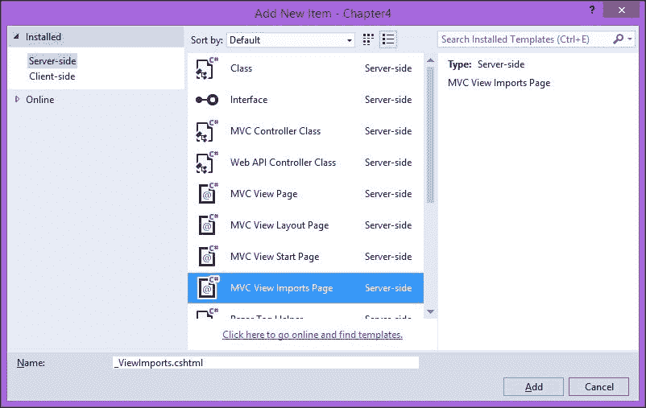

将以下内容添加到`_ViewImports.cs`文件中。前几行告诉 ASP.NET MVC 包含必要的命名空间。最后一行告诉 ASP.NET MVC 包含`Microsoft.AspNet.Mvc.TagHelpers`中所有可用的`TagHelpers`。第一个参数表示 TagHelper 的名称。我们使用了*，这意味着我们可能想要使用所有的 Tag Helper。第二个参数表示`TagHelpers`可用的程序集：

```cs
@using Chapter4
@using Chapter4.Models
@addTagHelper "*, Microsoft.AspNet.Mvc.TagHelpers"
```

正如以下屏幕截图所示，我们直接在`Views`文件夹下创建`_ViewImports.cshtml`文件，因此 Tag Helper 将对所有视图可用。

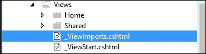

如果我们在`Home`文件夹下包含了`_ViewImports.cshtml`文件，那么 Tag Helper 将只对`Home`文件夹下的视图可用。

让我们在`HomeController`文件中添加一个简单的操作方法`Index3`，并在相关的视图中使用 Tag Helper，如下所示：

```cs
public IActionResult Index3()
{
  ViewBag.Title = "This is Index3";
  Person person = new Person();
  return View(person);
}
```

使用以下代码添加`Index3`操作方法的对应视图（`Index3.cshtml`文件）：

```cs
@model Chapter4.Models.Person
<form asp-controller="Home" asp-action="Index3"> 
  <table>
    <tr> 
      <td><
labelasp-for

="Name"></
label

></td>
      <td><input asp-for="Name" /></td> 
    </tr>
    <tr>
      <td><
labelasp-for

="Age"></
label

></td>
      <td><
inputasp-for

="Age" /></td>
    </tr>
    <tr>
      <td colspan="2"><input type="submit" value="Submit" /></td>
    </tr> 
  </table>
</
form

>
```

在前面的代码中，以下是一些需要注意的事项，以便使用 Tag Helper：

+   所有表单元素看起来就像标准的 HTML 元素一样，只是在属性上做了一些小的改动。这使得前端开发者可以独立工作，无需学习 HTML/Razor 代码，从而更容易实现关注点的分离。

+   前面的视图的第一行指示从控制器传递到视图的模型数据类型。

+   表单元素有两个属性名为`asp-controller`和`asp-action`，分别代表控制器名称和操作方法名称。

+   标签和输入标签辅助器就像 HTML 元素一样，只是多了一个`asp-for`属性。这些属性的值代表模型属性。在输入这些属性的值时，你可以利用 IntelliSense。

## 创建自定义 Tag Helper

ASP.NET Core 提供了许多内置的 Tag Helper 来帮助你在多种场景下创建必要的 HTML 元素。然而，这个过程并不全面和详尽。有时，你可能想要对生成的 HTML 元素进行一些修改，或者你可能想要创建具有新属性或全新的 HTML 元素。你不仅限于在 ASP.NET Core 应用程序中使用现有的 Tag Helper。如果你现有的 Tag Helper 不能满足你的需求，你可以创建自己的 Tag Helper。让我们创建一个简单的 Tag Helper 来创建一个电子邮件链接：

```cs
<a href="mailto:mugil@dotnetodyssey.com"> 

```

有几种方法可以创建实现 `ITagHelper` 接口或继承 `TagHelper` 类的 Tag Helper。`TagHelper` 类有一个可以重写的 `Process` 方法，你可以用它来编写自定义 Tag Helper。`TagHelper` 类还有一个 `TagHelperOutput` 参数，你可以用它来编写和生成所需的输出 HTML。因此，通过从 `TagHelper` 类继承来创建 Tag Helper 是更可取的。

我们的目的是编写一个自定义电子邮件 Tag Helper，以便当有人使用该 Tag Helper，即 `<email mailTo="mugil@greatestretailstore.com"></email>` 时，它应转换为以下代码行：

```cs
<a href="mailto:mugil@greatestretailstore.com">Drop us a mail</a> 

```

创建 ASP.NET Core 应用程序中的自定义 Tag Helper 需要执行以下步骤。

创建一个名为 `TagHelper` 的文件夹，并添加一个名为 `EmailTagHelper.cs` 的新项。按照惯例，所有 Tag Helper 类都应该以 `TagHelper` 结尾，即使我们可以覆盖这个惯例。

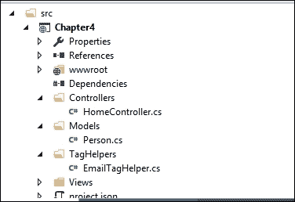

创建文件后，你需要重写 `Process` 方法以生成所需的 HTML 输出：

```cs
using System;
using System.Collections.Generic;
using System.Linq;
using System.Threading.Tasks;
using Microsoft.AspNet.Razor.TagHelpers;

namespace Chapter4.TagHelpers
{
  public class EmailTagHelper : TagHelper
  {
    public override void Process(TagHelperContext context, TagHelperOutput output)
    {
      string emailTo= context.AllAttributes["mailTo"].Value.ToString();
      output.TagName = "a";
      output.Attributes["href"] = "mailto:" + emailTo;
      output.Content.SetContent("Drop us a mail");
    }
  }
}
```

前面代码中使用的参数解释如下：

+   `context` 参数将提供你在 Tag Helper 中提供的所有信息。例如，在 `<email mailTo="mugil@greatestretailstore.com"></email>` Tag Helper 中，你可以从 `context` 参数中获取 `mailTo` 属性及其相关值。在前面 `Process` 方法的第一行中，我们将获取 `mailTo` 属性值并使用该值在生成的 HTML（锚点标签）中创建一个属性。

+   `output` 参数是 `TagHelperOutput` 类型，用于生成所需的 HTML 输出。

+   `output.Content.SetContent` 参数将设置要显示在锚点标签中的文本。

我们已经创建了电子邮件 Tag Helper。现在，我们必须使其可用于我们的视图，以便我们可以在视图中使用该 Tag Helper。编辑 `Views_ViewImports.cshtml` 以包含 `TagHelpers` 的命名空间并添加相关的 `TagHelpers`。在以下 `_ViewImports.cshtml` 文件中，我们已添加了加粗的内容：

```cs
@using Chapter4
@using Chapter4.Models

@using Chapter4.TagHelpers 

@addTagHelper "*, Microsoft.AspNet.Mvc.TagHelpers" 

@addTagHelper "*, Chapter4"

```

下面的行中的 "`*`" 符号告诉视图引擎包含 `Chapter4` 命名空间中的所有 TagHelpers：

```cs

@addTagHelper "*, Chapter4"

```

你只能指定 `TagHelpers`，例如，以下行将仅包含 `EmailTagHelper`，因此它可用于我们的视图：

```cs

@addTagHelper "Chapter4.TagHelpers.EmailTagHelper, Chapter4" 

```

让我们在 Home 控制器中创建一个简单的操作方法。在相关操作方法的视图中，我们将使用电子邮件 Tag Helper：

```cs
public IActionResult AboutUs()
{
  return View();
}
```

下面的代码是前面 `AboutUs` 操作方法的视图：

```cs
<h3>About Us</h3>
We are one of the biggest electronics retail store serving millions of people across the nation. blah.blah. blah <br/>

If you want to hear great offers from us 
<email mailTo="mugil@greatestretailstore.com"></email>
```

当你运行应用程序并访问 `http://localhost:50132/Home/AboutUs` URL 时，你将看到以下输出：

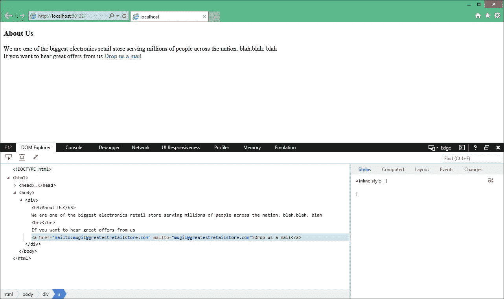

在这里，我们创建了一个带有 `mailto` 属性的锚点标签，并将电子邮件值作为 `href` 属性值。

我已经打开了**开发者工具**窗口（按*F12*键进行此操作并选择**DOM 资源管理器**标签页）来查看生成的 HTML。

# 摘要

在本章中，你学习了什么是视图引擎以及如何使用 Razor 视图引擎构建视图。我们还讨论了在 Razor 中可以使用的不同编程结构，以生成所需的 HTML 输出。然后，你了解了布局以及如何在你的 ASP.NET MVC 应用程序的所有页面中提供一致的网站结构。稍后，我们通过一个示例讨论了如何使用部分视图来提高可重用性。最后，你学习了如何使用标签助手生成干净的 HTML。

# 读累了记得休息一会哦~

**公众号：古德猫宁李**

+   电子书搜索下载

+   书单分享

+   书友学习交流

**网站：**[沉金书屋 https://www.chenjin5.com](https://www.chenjin5.com)

+   电子书搜索下载

+   电子书打包资源分享

+   学习资源分享
