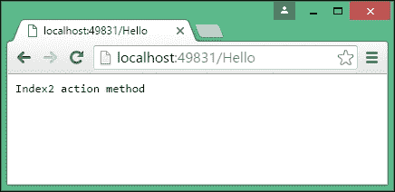
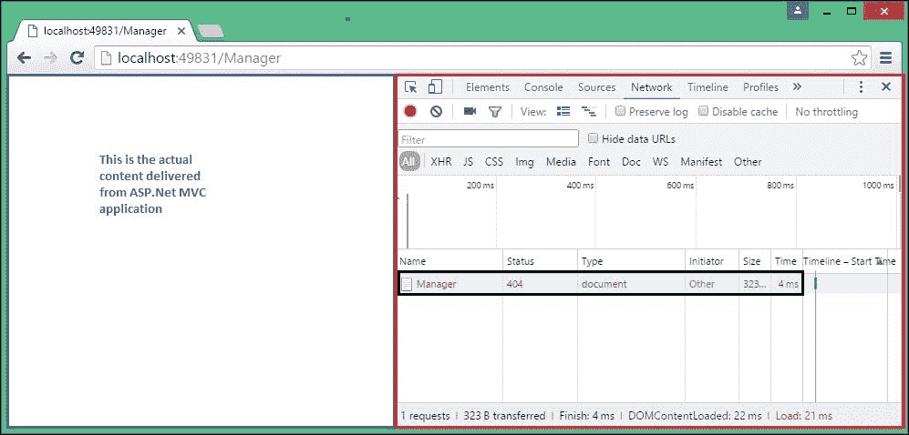

# 第七章。路由

路由是 ASP.NET MVC 应用程序中的重要概念之一，它负责处理传入的请求并将它们映射到适当的控制器操作。

在本章中，我们将学习以下主题：

+   使用 `MapRoute` 方法配置路由

+   带有示例的不同类型的路由——约定和基于属性的

+   在基于属性的路由中使用 HTTP 动词

我们在第三章 *控制器* 中简要讨论了路由。在本章中，我们将讨论路由以及 ASP.NET Core 中可用的自定义选项。

# 基于约定的路由

路由引擎负责将传入的请求映射到控制器中适当的操作方法。

在 `Startup` 类的 `Configure` 方法中，我们已映射以下路由：

```cs
app.UseMvc(routes => 
    { 
        routes.MapRoute(name: "default", 
        template: "{controller=Employee}/{action=Index}/{id?}"); 
    }); 

```

`MapRoute` 方法有两个参数：

+   `name`：这表示路由的名称，因为我们可以为同一应用程序配置多个路由。

+   `template`：这表示路由的实际配置。此配置值有三个部分。由于我们提供了默认参数，如果未传递值，它将采用默认参数值。

+   `{controller=Employee}`：第一个值作为控制器的名称，当 URL 中不可用控制器值时，我们使用 `Employee` 控制器作为默认控制器。

+   `{action=Index}`：`Index` 操作方法将作为默认操作方法，URL 的第二个参数将被用作操作方法名称。

+   `{id?}`：通过在 `id` 参数后指定 "`?"`，我们表示 `id` 是可选参数。如果作为第三个参数传递值，则将采用 `id` 值。否则，它将不被考虑。

另有一个具有相同功能的方法。`app.UseMvcWithDefaultRoute()` 方法配置了路由 `"{controller=Employee}/{action=Index}/{id?}"`。但我们使用了前面的方法来表明我们可以按需自定义路由。

让我们看看几个示例，并观察我们的路由引擎是如何工作的。我们假设以下路由用于前面的示例：

```cs
"{controller=Employee}/{action=Index}/{id?}" 

```

## 示例 1

URL-`http://localhost:49831/`

在此 URL 中，我们没有为 `controller`、`action` 或 `id` 传递值。由于我们没有传递任何内容，它将采用控制器和操作的默认值。因此，路由引擎将此 URL 转换为以下 URL：

`http://localhost:49831/Employee/Index`

## 示例 2

URL-`http://localhost:49831/Employee/`

在此 URL 中，我们已传递 `controller`（第一个参数）的值，即 `Employee`，而对于 `action` 方法（第二个参数）或 `id`（第三个参数），我们没有传递任何内容。因此，将采用 `action` 方法的默认值来将 URL 转换为以下 URL：

`http://localhost:49831/Employee/Index`

## 示例 3

URL-`http://localhost:49831/Manager/List`

路由引擎将第一个参数`Manager`视为`controller`方法名称，第二个参数`List`视为`action`方法名称。

## 示例 4

URL-`http://localhost:49831/Manager/Details/2`

我们已经在这个 URL 中传递了所有三个参数。因此，第一个参数值`Manager`将被视为`controller`方法名称，第二个参数值将被视为`action`方法名称，第三个参数值将被视为`id`方法名称。

在定义映射路由时，我们使用了带有几个参数的`MapRoute`方法。第一个参数`name`代表路由的名称，第二个参数`template`代表要匹配的 URL 模式以及默认值：

```cs
routes.MapRoute(name: "default",
               template: "{controller=Employee}/{action=Index}/{id?}");
```

这个`MapRoute`方法还有其他重载变体。以下是一个常见的重载`MapRoute`方法，其中传入的 URL 模式和默认值被传递给不同的参数。路由的名称是`FirstRoute`，这个路由将应用于所有以`Home`开头的 URL。控制器和动作的默认值分别是`Home`和`Index2`：

```cs
routes.MapRoute(name:"FirstRoute",
               template:"Home",
               defaults:new {controller ="Home", action="Index2"});
```

你可以为你的 ASP.NET MVC 应用程序定义任意数量的路由映射。对路由映射没有限制或限制。让我们向我们的应用程序添加另一个路由映射。我们向应用程序添加了另一个名为`FirstRoute`的路由映射（加粗显示）：

```cs
public void Configure(IApplicationBuilder app) 
    { 
        app.UseIISPlatformHandler(); 
        app.UseMvc(routes => 
        { 

routes.MapRoute(name:"FirstRoute",
            template:"Home", defaults:new {controller ="Home", action="Index2"}); 

            routes.MapRoute(name: "default",
            template: "{controller=Employee}/{action=Index}/{id?}");
        }); 
    } 

```

我们还添加了另一个名为`HomeController`的`controller`方法，其中包含几个简单的返回不同字符串的`action`方法：

```cs
public class HomeController : Controller 
    { 
        // GET: /<controller>/ 
        public IActionResult Index() 
        { 
            return Content("Index action method"); 
        } 

        public IActionResult Index2() 
        { 
            return Content("Index2 action method"); 
        } 
    } 

```

当你尝试通过 URL `http://localhost:49831/Hello` 访问应用程序时，`FirstRoute`和`default`两个路由映射都与 URL 模式匹配。

你认为在这种情况下，哪个映射路由会被应用？

路由引擎根据以下因素映射传入的 URL：

1.  匹配模式。

1.  根据路由引擎定义的顺序。

第一个因素是显而易见的。为了被路由引擎选中，传入 URL 的模式应该与路由映射中定义的模板匹配。

第二个因素微妙但很重要。如果多个路由映射与传入的 URL 匹配，路由引擎将选择配置中定义的第一个 URL。例如，如果传入的 URL 同时与`FirstRoute`和`default`映射匹配，路由引擎将选择`FirstRoute`映射，因为它在配置中首先定义。



如果路由引擎无法将传入的 URL 映射到任何映射路由，我们将得到一个`HTTP 404 错误`，这意味着找不到任何资源。你可以通过查看开发工具中的**网络**选项卡来查看状态（200 表示*OK*，404 表示*未找到资源*），如下面的截图所示：



# 基于属性的路由

到目前为止，我们一直在使用基于约定的路由。在基于约定的路由中，我们在集中位置定义路由模板（这些只是参数化字符串），这些模板适用于所有可用的控制器。基于约定路由的问题在于，如果我们想为不同的控制器定义不同的 URL 模式，我们需要定义一个对所有控制器都通用的自定义 URL 模式。这使得事情变得复杂。

配置路由引擎的另一种选项是基于属性的路由。在基于属性的路由中，不是在集中位置配置所有路由，而是在`controller`级别进行配置。

让我们看看基于属性的路由的一个例子。

首先，让我们从`startup.cs`类文件中的`Configure`方法中删除我们之前创建的基于约定的路由：

```cs
public void Configure(IApplicationBuilder app) 
    { 
        app.UseIISPlatformHandler(); 
        app.UseMvc(); 
        //app.UseMvc(routes => 
        //{ 
        //    routes.MapRoute(name: "FirstRoute",
        //                    template: "Hello", 
        //                    defaults: new { controller = "Home",  
        //                    action = "Index2" }); 

        //    routes.MapRoute(name: "default",
        //                 template:"
        //                {controller=Employee}/{action=Index}/{id?}"); 
        //}); 
    } 

```

然后，我们可以在控制器本身配置路由。在下面的代码中，我们为之前创建的`home`控制器添加了路由配置：

```cs
namespace Validation.Controllers 
{ 
    public class HomeController : Controller 
    { 
        // GET: /<controller>/ 
        [Route("Home")] 
        public IActionResult Index() 
        { 
            return Content("Index action method"); 
        } 
        [Route("Home/Index3")] 
        public IActionResult Index2() 
        { 
            return Content("Index2 action method"); 
        } 
    } 
} 

```

我们在控制器的`action`方法中使用了`Route`属性。传递给`Route`属性的值将作为 URL 模式。例如，当我们访问 URL `http://localhost:49831/Home/` 时，`HomeController`的`Index`方法将被调用。当我们访问 URL `http://localhost:49831/Home/Index3` 时，`HomeController`的`Index2`方法将被调用。请注意，URL 模式和`action`方法名称不需要匹配。在先前的示例中，我们调用的是`Index2`动作方法，但 URL 模式使用的是`Index3`，`http://localhost:49831/Home/Index3`。

当你同时使用基于属性的路由和基于约定的路由时，基于属性的路由将具有优先级。

# 在控制器级别配置路由属性

你会注意到，对于`action`方法的 URL 模式，`Index`和`Index2`，我们在两个 URL 模式中重复了控制器名称`Home`，即`Home`和`Home/Index3`。我们可以在`controller`级别定义它，而不是在`action`方法级别重复`controller`方法名称（或 URL 中的任何公共部分）。

在下面的代码中，URL 的公共部分（`Home`）在`controller`级别定义，而唯一部分在`action`方法级别定义。当 URL 模式映射到控制器的`action`方法时，两个路由部分（在`controller`级别和`action`方法级别）将被合并并匹配。因此，之前定义的路由和后续的路由之间将没有区别。

如果你想在基于属性的路由中使用两个参数，你可以在大括号内传递它们。在下面的示例中，我们对`SayHello`动作方法做了这样的事情。

例如，URL 模式`http://localhost:49831/Home/Index3`，仍然会被映射到`Homecontroller`的`Index2`方法：

```cs
namespace Validation.Controllers 
{     
    [Route("Home")] 
    public class HomeController : Controller 
    { 
        // GET: /<controller>/ 
        [Route("")] 
        public IActionResult Index() 
        { 
            return Content("Index action method"); 
        } 

        [Route("Index3")] 
        public IActionResult Index2() 
        { 
            return Content("Index2 action method"); 
        } 

 [Route("SayHello/{id}")] 
        public IActionResult SayHello(int id) 
        { 
            return Content("Say Hello action method"+id); 
        } 
    } 
} 

```

# 在控制器中通过 HTTP 动作动词传递路由值

我们甚至可以将路由值作为`Route`属性传递，而不是将路由值传递到 HTTP 操作动词，如`HTTPGet`和`HTTPPost`。

在以下代码中，我们使用了`HTTPGet`属性来传递路由值。对于`Index`方法，我们没有传递任何值，因此不会将任何路由值附加到在`controller`方法级别定义的路由值上。对于`Index2`方法，我们传递了值`Index3`，`Index3`将被附加到在`controller`级别定义的路由值上。请注意，只有使用`GET`方法的 URL 才会映射到`action`方法。如果你使用`POST`方法访问相同的 URL 模式，这些路由将不会匹配，因此这些`action`方法将不会被调用。

```cs
namespace Validation.Controllers 
{     
    [Route("Home")] 
    public class HomeController : Controller 
    { 
        // GET: /<controller>/ 
        [HttpGet()] 
        public IActionResult Index() 
        { 
            return Content("Index action method"); 
        } 

        [HttpGet("Index3")] 
        public IActionResult Index2() 
        { 
            return Content("Index2 action method"); 
        } 
    } 
} 

```

# 路由约束

路由约束允许你限制传递给控制器操作的值的类型。例如，如果你想将值限制为`int`类型，你可以这样做。以下是一个这样的例子：

```cs
[HttpGet("details/{id:int?}")] 
    public IActionResult Details(int id) 
    { 
      return View(); 
    } 

```

ASP.NET 5 (ASP.NET Core)甚至支持默认参数值，这样你就可以传递默认参数：

```cs
[HttpGet("details/{id:int = 123}")] 
    public IActionResult Details(int id) 
    { 
      return View(); 
    } 

```

# 摘要

在本章中，我们学习了路由及其工作原理。我们了解了不同类型的路由，并使用不同的示例讨论了基于约定的路由和基于属性的路由。我们还讨论了路由约束和可以传递的默认参数值。

在下一章中，我们将看到如何使应用程序看起来更美观。
