# 第十一章. 提高 ASP.NET Core 应用程序的性能

当你考虑经常访问的应用程序（我们每天使用的那些），例如 Google、YouTube 和 Facebook 时，正是这些应用程序的性能使它们与类似的应用程序区分开来。思考一下。如果 Google 在提供搜索结果时需要超过 10 秒，大多数人会转而使用 Bing 或其他搜索引擎。因此，性能是应用程序成功的一个主要因素。

在本章中，我们将学习以下内容：

+   分析应用程序性能问题的方法

+   如何利用浏览器开发者工具分析应用程序的性能

+   用户界面层性能改进

+   网络应用层性能改进

+   数据库层性能改进

通常，当人们谈论应用程序的性能时，他们会想到应用程序的速度。虽然速度对应用程序的性能有重大贡献，但我们还需要考虑应用程序的可维护性、可扩展性和可重用性。

一份维护良好的代码将更加清晰，并且技术债务较少，这反过来又会提高开发者的生产力。当我们基于面向服务的架构或微服务编写代码时，我们的代码将更容易被他人使用。这也会使我们的代码更具可扩展性。

通常，当应用程序的开发几乎完成，试点用户对应用程序的速度表示不满时，人们才会考虑应用程序的性能。讨论性能的正确时机是在应用程序开发之前；我们需要与产品所有者、业务分析师和实际用户合作，以确定应用程序可接受性能水平的标准。然后我们以这个预期的性能水平为目标进行设计和编码。

这也取决于应用程序的领域。例如，一个关键任务型医疗保健应用程序会要求极高的性能（他们可能期望在不到一秒内得到响应），而后台应用程序的性能可能不需要那么高。因此，了解我们正在工作的领域至关重要。

如果你被要求调整现有应用的性能，了解应用的现有架构也同样重要。使用 ASP.NET Core，你可以构建一个简单的 CRUD 应用，也可以构建一个服务于全球数百万用户的任务关键型应用。大型应用可能还有许多其他组件，例如负载均衡器、独立的缓存服务器、**内容分发网络**（**CDN**）、一组从属 DB 服务器等等。因此，在分析应用性能时，首先你需要研究架构，分析涉及的每个单独组件，测量每个组件的性能，并在应用不符合你可接受的性能时尝试优化它们。主要的事情不是在没有研究和分析应用架构的情况下直接跳到性能改进技术。如果你正在创建一个新应用，你可以在应用创建的初期就考虑性能问题。

我们将检查一个典型的 Web 应用设置，如下面的截图所示。然后我们将分析它并考虑如何改进：

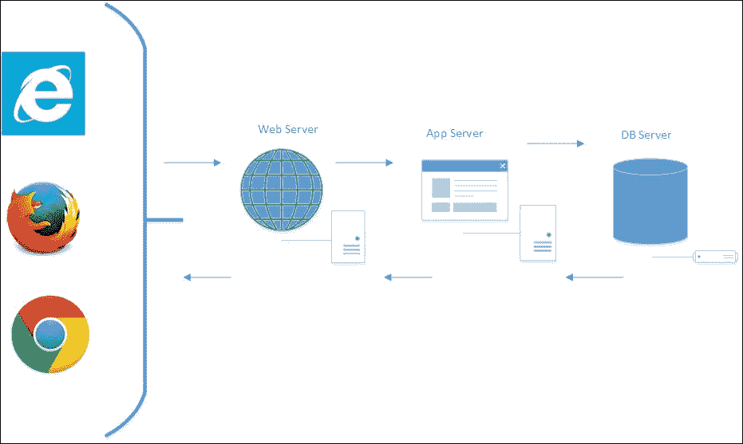

以下步骤展示了使用 Web 应用的过程：

1.  用户通过浏览器（如 Internet Explorer、Firefox 或 Chrome）访问 ASP.NET Core 网络应用。当用户在浏览器中输入 URL 并按下 *Enter* 键时，浏览器会创建一个会话并触发 HTTP 请求。这并不特定于 ASP.NET Core 应用。这种行为对所有基于不同技术构建的 Web 应用都是相同的。

1.  请求到达 Web 服务器。如果这是一个简单请求，Web 服务器本身将处理该请求。提供静态 HTML 文件是这种类型的典型例子。如果请求稍微复杂一些，例如基于业务逻辑返回一些数据，请求将被转发到应用服务器。

1.  应用服务器将查询数据库以获取数据。然后它可能在将数据返回给 Web 服务器之前对收到的数据进行一些业务处理。有时，Web 服务器可能作为较小 Web 应用的应用服务器。

1.  然后，Web 服务器将返回响应，通常是 HTML 格式，给请求的客户。

因此，我们可以将这些组件分为三个层次——UI 层、Web/应用层和 DB 层。为了提高 ASP.NET Core 应用的整体性能，我们需要彻底了解如何提高每一层的性能。

在实施任何性能改进技术之前，我们首先需要分析应用中每一层的性能。只有在此基础上，我们才能提出提高应用整体性能的方法。

# UI 层

UI 层代表浏览器和服务器之间发生的所有事件（以及相关内容）。有许多事件，包括但不限于以下内容：

+   发送 HTTP 请求

+   获取响应

+   下载资源

+   在浏览器中渲染它们

+   任何 JavaScript 代码执行

# 减少 HTTP 请求的数量

一个典型的网页可能不仅仅包含 HTML 内容。它可能包含对 CSS 文件、JS 文件、图片或其他资源的引用。因此，当你尝试访问一个网页时，客户端将为每个这些引用发送 HTTP 请求，并将这些引用从服务器下载到客户端。

当你想分析客户端发出的 HTTP 请求时，浏览器开发者工具非常有用。大多数浏览器都有你可以使用的开发者工具。

当你在 Internet Explorer 中按下*F12*键时，**开发者工具**窗口将在 Internet Explorer 窗口的底部打开，如下面的截图所示：

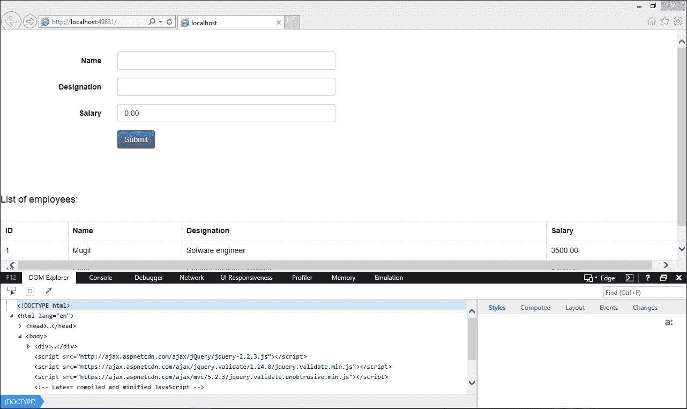

点击**网络**标签页。在浏览器中输入 URL 之前，点击*开始*按钮（绿色播放按钮），或者点击绿色播放按钮并刷新页面：

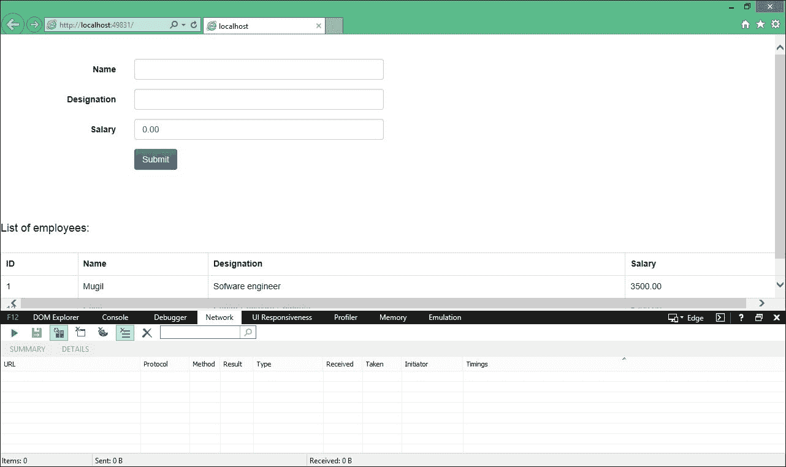

一旦按下**网络**标签页的启动按钮，Internet Explorer 的**网络**标签页将监听来自当前标签页的所有请求。每个请求将包含信息，例如 URL、协议、方法、结果（HTTP 状态码）以及其他信息。

我再次运行了应用程序，并开启了（**跟踪网络请求**选项），可以看到请求被跟踪，如下面的截图所示：

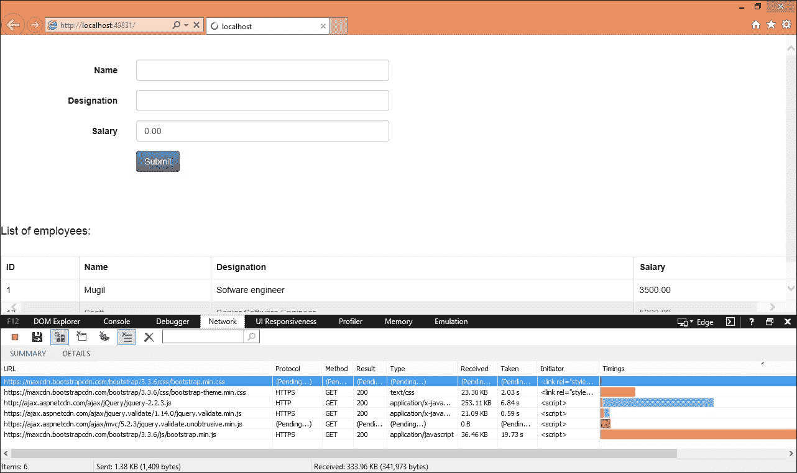

网络标签页中有很多有用的数据。首先，URL 列显示了正在访问的资源。正如其名称所暗示的，协议列显示了用于访问资源的协议。

首先，URL 列显示了正在访问的资源。正如其名称所暗示的，协议列显示了用于访问资源的协议。方法列显示了请求的类型，而在结果列中，我们可以看到请求的 HTTP 状态码（HTTP 200 响应表示成功的 GET 请求）。

类型列显示了正在访问的资源类型，而耗时列显示了从服务器接收文件所需的时间。接收列显示了作为请求一部分下载的文件大小。

## 使用 GZip 压缩

当你提供服务时，你可以使用 GZip 压缩内容，这样就可以通过网络发送更少的数据。你需要添加适当的 HTTP 头信息，以便浏览器可以理解正在发送的内容模式。在 IIS 中，默认情况下为静态资源启用此选项。你可以通过访问路径`C:\Windows\System32\inetsrv\config`下的`applicationHost.config`文件来验证这一点：

```cs
<httpCompression directory="%SystemDrive%\inetpub\temp\IIS Temporary Compressed Files">
  <scheme name="gzip" dll="%Windir%\system32\inetsrv\gzip.dll" />
  <staticTypes>
    <add mimeType="text/*" enabled="true" />
    <add mimeType="message/*" enabled="true" />
    <add mimeType="application/x-javascript" enabled="true" />
    <add mimeType="application/atom+xml" enabled="true" />
    <add mimeType="application/xaml+xml" enabled="true" />
    <add mimeType="*/*" enabled="false" />
  </staticTypes>
</httpCompression>
```

如果在你的`applicationHost.config`文件中不可用，你必须进行必要的更改。

## 使用内容分发网络（CDN）

内容分发网络（Content Delivery Network，CDN）是一个分布在全球各地的服务器系统，根据内容访问的地理位置来提供服务。亚马逊的**CloudFront**是 CDN 的一个例子。亚马逊在全球各地都有边缘位置（服务器所在的位置），以便从最近的位置向用户提供服务。

在以下行中，我们是从官方 jQuery 网站提供的 CDN 中访问 jQuery：

```cs
<script src="img/jquery-3.1.1.min.js" ></script>
```

## 尽可能使用 JavaScript

如果你可以使用 JavaScript 来实现一个功能，那么就去做。例如，在服务器上验证表单数据之前，总是先尝试进行客户端验证。这种方法有几个优点——网站将会非常快，因为所有的事情都是在客户端完成的，服务器将处理更多的请求，因为一些请求是在客户端处理的。

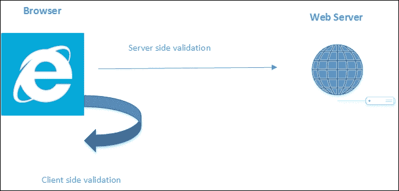

## 使用 CSS 样式表

由于浏览器是逐步渲染网页的（浏览器会在收到内容后立即显示它），因此将样式表放在顶部而不是网页的末尾会更好。如果我们把样式表放在底部，它会阻止渐进式渲染，因为浏览器需要用样式重新绘制内容。

大多数浏览器在下载 JavaScript 文件时都会阻止并行下载，因此最好将脚本放在底部。这意味着在浏览器下载脚本的同时，用户可以看到你的内容。以下是在 ASP.NET Core 应用程序中创建的示例布局文件，其中 CSS 文件在顶部引用，JavaScript 文件在底部引用：

```cs
<!DOCTYPE html>
<html lang="en">
  <head>
    <meta name="viewport" content="width=device-width" />
    <title>@ViewBag.Title</title>

    <!-- Latest compiled and minified CSS -->

    <link rel="stylesheet"  href="https://maxcdn.bootstrapcdn.com/bootstrap/3.3.6/css/bootstrap.min.css" integrity="sha384-1q8mTJOASx8j1Au+a5WDVnPi2lkFfwwEAa8hDDdjZlpLegxhjVME1fgjWPGmkzs7" crossorigin="anonymous">

    <!-- Optional theme -->

    <link rel="stylesheet" href="https://maxcdn.bootstrapcdn.com/bootstrap/3.3.6/css/bootstrap-theme.min.css" integrity="sha384-fLW2N01lMqjakBkx3l/M9EahuwpSfeNvV63J5ezn3uZzapT0u7EYsXMjQV+0En5r" crossorigin="anonymous">

  </head>
  <body>
    <div>
      @RenderBody()
    </div>
    <script src="img/jquery-2.2.3.js"></script>

    <script src="img/jquery.validate.min.js"></script>

    <script src="img/jquery.validate.unobtrusive.min.js"></script>

    <!-- Latest compiled and minified JavaScript -->
    <script src="img/bootstrap.min.js" integrity="sha384-0mSbJDEHialfmuBBQP6A4Qrprq5OVfW37PRR3j5ELqxss1yVqOtnepnHVP9aJ7xS" crossorigin="anonymous"></script>

  </body>
</html>
```

# JavaScript 和 CSS 文件的压缩及其合并

下载网页相关资源所需的时间与下载的文件大小成正比。如果我们在不改变实际内容的情况下减小文件大小，这将大大提高性能。压缩是改变文件内容以减小文件大小的过程。移除多余的空白和将变量名更改为更短的名字都是在压缩过程中常用的技术。

如 jQuery 和前端框架等流行的 JavaScript 库默认提供压缩文件。你可以直接使用它们。在下面的屏幕截图中，我已下载了 jQuery 的压缩版本。你可以压缩你为应用程序编写的自定义 JavaScript 和 CSS 文件：

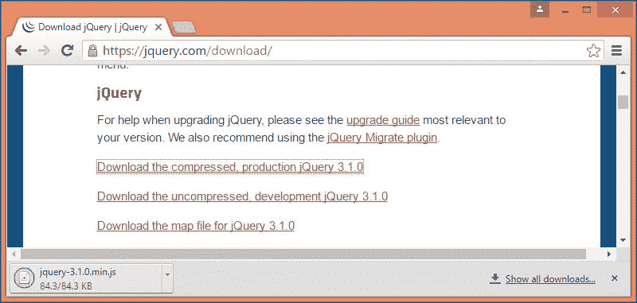

**捆绑**是将两个或多个文件合并为一个的过程。当捆绑和压缩一起使用时，将减少负载的大小，从而提高应用程序的性能。

你可以从以下 URL 安装**Bundler & Minifier** Visual Studio 扩展：

[`visualstudiogallery.msdn.microsoft.com/9ec27da7-e24b-4d56-8064-fd7e88ac1c40`](https://visualstudiogallery.msdn.microsoft.com/9ec27da7-e24b-4d56-8064-fd7e88ac1c40)

一旦安装了这个 Visual Studio 扩展，你可以通过选择文件并从右键点击弹出的**上下文**菜单中选择**Bundler & Minifier**选项来选择你想要捆绑和压缩的文件。如下面的屏幕截图所示：

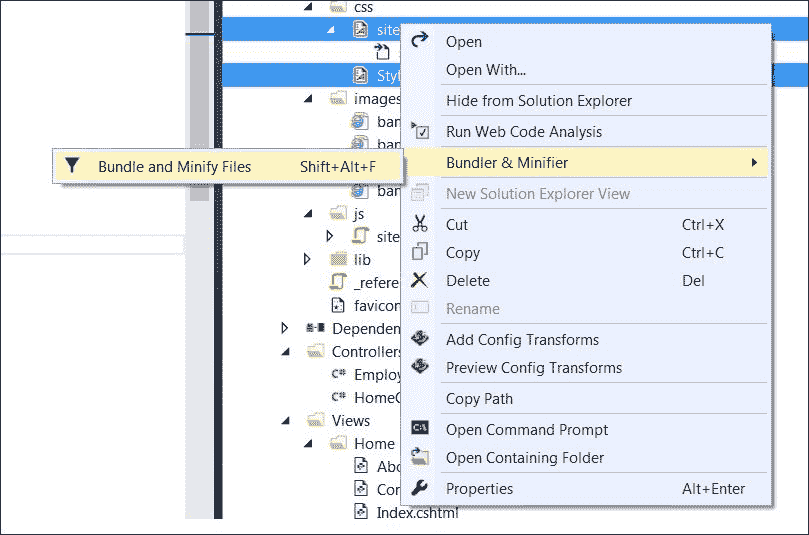

一旦选择**捆绑和压缩文件**选项，它将要求你保存捆绑文件，如下面的屏幕截图所示：

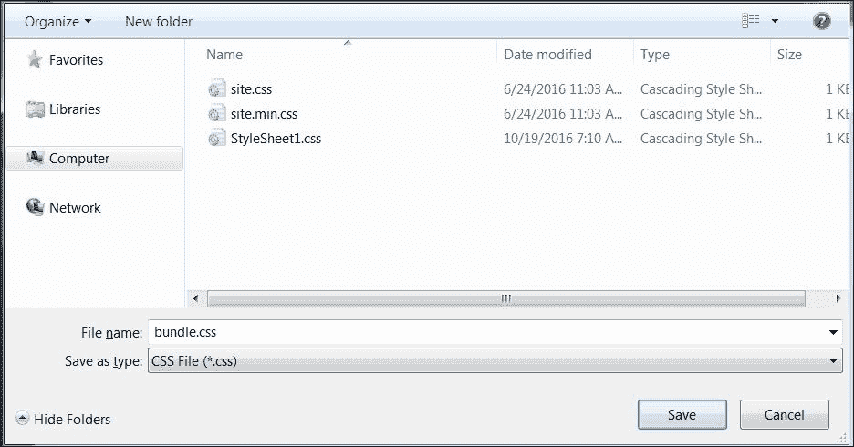

你可以命名你想要的文件并保存文件。一旦保存文件，你的解决方案中就会创建另一个文件——在我们的例子中，它是`bundleconfig.json`文件：

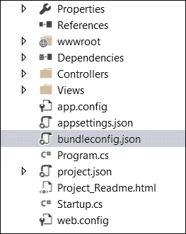

此文件将包含输入文件和捆绑输出文件的信息。以下是一个示例：

```cs
[
  {
    "outputFileName": "wwwroot/css/site.min.css",
    "inputFiles": [
    "wwwroot/css/site.css"
    ]
  },

{
  "outputFileName": "wwwroot/js/site.min.js",
  "inputFiles": [
  "wwwroot/js/site.js"
  ],
  "minify": {
  "enabled": true,
  "renameLocals": true
  }
},

{
  "outputFileName": "wwwroot/css/bundle.css",
  "inputFiles": [
  "wwwroot/css/site.css",
  "wwwroot/css/StyleSheet1.css"
    ]
  }
]
```

你可以在应用程序中使用这个捆绑文件，从而提高性能。

# 缓存过程

缓存是将数据复制到内存中，而不是再次通过外部资源（如网络、文件或数据库）获取数据的过程。缓存中使用的数据是短暂的，可以随时删除。因为我们直接访问数据，所以缓存可以大大提高应用程序的性能。

缓存可以在任何层进行——在浏览器端的客户端，在代理服务器（或某些中间件）上，或者在 Web/应用程序服务器上。对于数据库层缓存，我们可能不需要进行任何自定义编码。根据使用的数据库服务器类型，可能需要做一些配置更改。然而，如今的大多数数据库都有足够强大的功能，可以在需要时缓存数据。

## 客户端缓存

如果我们添加适当的 HTTP 响应头，我们可以在客户端进行缓存。例如，如果我们想缓存所有静态资源，如 CSS、图像和 JavaScript 文件，我们可以在**Cache-Control**头中添加**max-age**响应头：

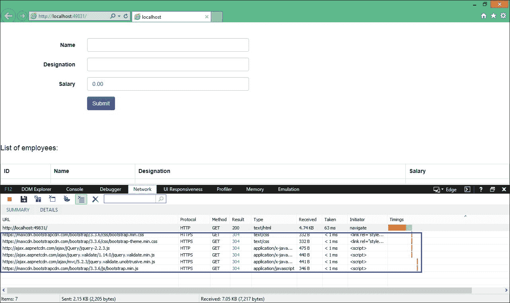

在上一张**开发者工具**窗口的**网络**选项卡截图，当再次发起请求时，我们得到*HTTP* *304 响应*（未修改）。这意味着相同的文件不会在网络上两次传输，因为它们已经在浏览器中可用。

实现静态文件的浏览器缓存相当简单，只需要几个步骤——添加依赖项和配置应用程序。

将以下`NuGet`包添加到`project.json`文件中的依赖项列表中：

```cs
"Microsoft.AspNet.StaticFiles": "1.0.0-rc1-final" 

```

将以下命名空间添加到`Startup.cs`文件中，并配置应用程序使用这些静态文件：

```cs
using Microsoft.AspNet.StaticFiles;
using Microsoft.Net.Http.Headers;

public void Configure(IApplicationBuilder app)
{
  app.UseIISPlatformHandler();
  app.UseMvc();
  app.UseMvc(routes =>
  {
    routes.MapRoute(name:"default", template:"{controller=Employee}/{action=Index}/{id?}");});

 app.UseStaticFiles(new StaticFileOptions

() 

 { 

      OnPrepareResponse = (context) => 

 { 

 var headers = context.Context.Response.GetTypedHeaders(); 

 headers.CacheControl = new CacheControlHeaderValue() 

 { 

 MaxAge = TimeSpan.FromSeconds(60), 

 }; 

} 

 }); 

}
```

## 响应缓存

在响应缓存中，当 MVC 动作返回时，会在 HTTP 响应中添加与缓存相关的 HTTP 头。`Cache-Control`头是添加到响应的主要 HTTP 头。

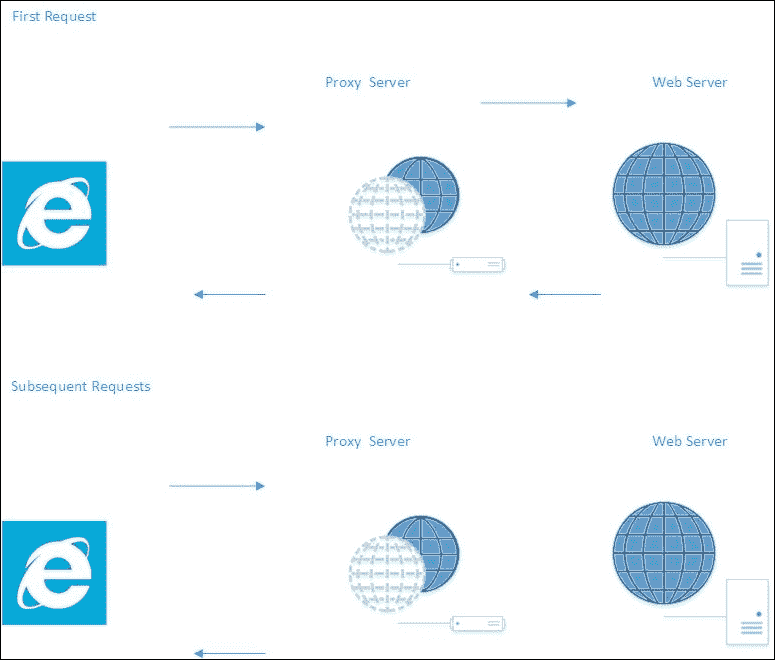

上一张图展示了响应缓存的工作原理。在第一次请求中，我们调用控制器（Controller）的动作方法；请求来自客户端，并通过代理服务器，实际上击中（访问）了 web 服务器。由于我们添加了响应缓存，任何后续的请求将不会转发到 web 服务器，响应将由代理服务器本身返回。这将减少对 web 服务器的请求次数，从而减少对 web 服务器的负载。

缓存控制器动作方法的响应相当简单。只需添加带有持续时间参数的`ResponseCache`属性。在以下动作方法中，我们添加了持续时间为 60 秒的响应缓存，因此，在接下来的 60 秒内，如果再次有请求，响应将直接从代理服务器返回，而不是发送到 web 服务器：

```cs
[ResponseCache(Duration = 60)]
public IActionResult Index()
{
  EmployeeAddViewModel employeeAddViewModel = new   EmployeeAddViewModel();
  using (var db = new EmployeeDbContext())
  {
    employeeAddViewModel.EmployeesList = db.Employees.ToList();
  }
  return View(employeeAddViewModel);
}
```

# 网络应用层

网络应用层由从接收客户端请求到发送响应（或查询数据库层以获取所需数据）之间发生的一切组成。网络应用层的大部分内容将使用服务器端语言，如 C#，因此当您尝试优化网络应用层时，需要结合 ASP.NET MVC 和 C#的最佳实践。

## 视图中没有业务逻辑

视图是渲染到浏览器的内容，它可以包含表示逻辑。表示逻辑表示数据要显示的位置和方式。视图模型（实际上是针对视图的特定模型）是包含特定视图数据的模型。

视图（Views）和视图模型（ViewModels）都不应包含任何业务逻辑，因为这违反了关注点分离原则。

看看下面的 Razor 视图代码。我们只是在模型中的列表上进行循环，并以表格格式展示数据——没有其他内容：

```cs
<h4> List of employees:</h4> <br />
  <table class="table table-bordered">
  <tr>
    <th> ID </th>
    <th> Name </th>
    <th> Designation </th>
    <th> Salary </th>
  </tr>
  @foreach (var employee in Model.EmployeesList)
  {
  <tr>
    <td>@employee.EmployeeId</td>
    <td>@employee.Name</td>
    <td>@employee.Designation</td>
    <td>@employee.Salary</td>
  </tr>
  }
  </table>
```

在某些代码中，视图模型中可能会有一个仓库层（repository layer），这绝不应该发生。请特别小心查看 View/ViewModel 代码中的内容。

## 使用异步日志记录

尽可能地使用异步日志记录来提高性能。大多数日志框架，如 **Log4Net**，提供了异步日志记录的选项。就 ASP.NET Core 而言，你可以通过依赖注入来实现日志记录。

以下是在 MVC 控制器中实现日志框架的典型示例：

```cs
public class EmployeeController : Controller
{
  private readonly IEmployeeRepository _employeeRepo;
  private readonly ILogger<EmployeeController> _logger;
  public EmployeeController(IEmployeeRepository employeeRepository,
  ILogger<EmployeeController> logger)
  {
    _employeeRepo = employeeRepository;
    _logger = logger;
  }
  [HttpGet]
  public IEnumerable<Employee> GetAll()
  {
    _logger.LogInformation(LoggingEvents.LIST_ITEMS, "Listing all employees");
    return _employeeRepo.GetAll();
  }
}
```

## 数据库层

虽然数据库层与 ASP.NET Core 应用程序没有直接关系，但开发者有责任完全掌控应用程序的性能，这包括关注数据库的性能。现在我们将探讨在提高 ASP.NET Core 应用程序性能时需要考虑的数据库层的一些区域。

### 理解 ORM 生成的查询

在当今的大多数应用程序中，我们使用 **对象关系映射** ( **ORM** )，例如 Entity Framework 或 **NHibernate**。正如你可能知道的，ORM 的主要目标是让你能够使用基于域的类和对象来编写数据访问层，而不是直接编写查询。但这并不意味着你永远不需要理解生成的 SQL 查询的基本知识，或者这些查询的优化。有时，Entity Framework 生成的查询可能没有优化，因此更好的做法是运行分析器，分析生成的查询，并根据你的需求进行调整。你可以使用 Entity Framework 中的拦截器来记录 SQL 查询。

### 如果你真的想使用经典 ADO.NET

ASP.NET Core 只是一个 Web 开发框架，它与任何数据访问框架或技术都没有绑定。如果你在应用程序中使用的 ORM 无法提供你期望的性能，你可以使用经典的 ADO.NET 并手动编写查询/存储过程。

### 只返回所需数据

总是只返回你需要的数据，不多也不少。这种方法减少了我们在网络中发送的数据量（从数据库服务器到 Web/应用程序服务器）。

例如，我们不会使用以下：

```cs
Select * from employees
```

相反，我们会使用这个：

```cs
Select FirstName,LastName from employees
```

后者查询只会从表中获取所需的字段，因此，只有所需的数据被传递给调用客户端。

### 紧凑调整索引

初学者倾向于在遇到数据库问题时添加索引。在表的每一列上添加索引是坏习惯，会降低性能。正确的方法是列出最常执行的查询。一旦你有了这个列表，尝试调整它们——移除不必要的连接，避免相关子查询等。只有在你尝试并耗尽所有查询调整选项后，你才开始添加索引。这里要注意的重要一点是，你应该只在所需的列数上添加索引。

### 为你的数据库列使用正确的列类型和大小

当你想要将 int 用作列的数据类型时，使用整数。不要使用 double。如果你表中有大量行，这将节省很多空间。

### 避免使用相关子查询

相关子查询使用其父查询的值，这反过来又使得它逐行运行。这会显著影响查询性能。

以下是一个相关子查询的示例：

```cs
SELECT e.Name, 
e.City, 
(SELECT DepartmentName FROM EmployeeDepartment WHERE ID = e.DepartmentId) 
AS DepartmentName 
FROM Employee e
```

# 通用性能改进技巧

这里有一些提高 ASP.NET Core Web 应用程序整体性能的技巧。

## 避免使用 Response.Redirect 方法

当我们想要进行客户端重定向时，开发者可以通过传递 URL 作为参数调用`Response.Redirect`方法。但这种方法存在一个小问题。如果我们使用`Response.Redirect`，浏览器将再次向服务器发送请求，这需要再次往返服务器。因此，如果可能的话，最好避免使用`Response.Redirect`方法，如果可能的话，可以使用`RedirectToAction`方法。

## 使用字符串构建器

如果你的应用程序涉及大量的字符串操作，最好使用字符串构建器而不是常规的字符串连接。字符串连接会在每次操作时创建一个新的字符串对象，而字符串构建器则直接在单个对象上操作。当我们在大规模字符串操作中使用字符串构建器时，可以显著提高性能。

# 摘要

在本章中，我们学习了如何分析 Web 应用程序的性能以及提高性能时应该针对哪些层。然后我们讨论了如何在每个层中提高性能——UI 层、Web/应用程序层和数据库层。
