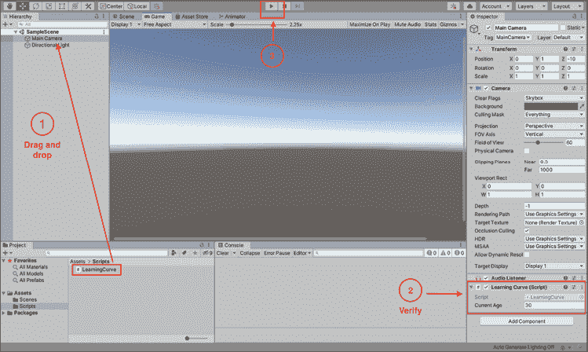
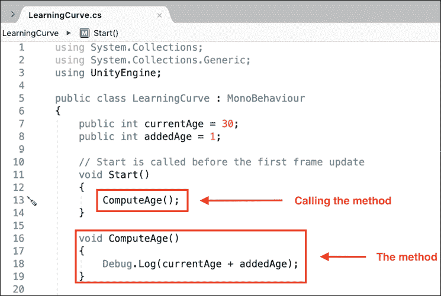
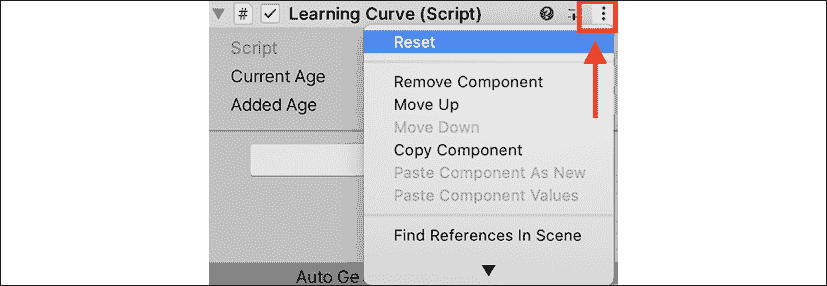

# 第二章：编程的构建块

对于不熟悉的人来说，任何编程语言一开始看起来都像古希腊文，C#也不例外。好消息是，在最初的神秘感之下，所有编程语言都由相同的本质构建块组成。变量、方法和类（或对象）构成了传统编程的 DNA；理解这些简单概念可以打开一个充满多样性和复杂应用的世界。毕竟，地球上每个人的 DNA 中只有四种不同的核苷酸；然而，我们每个人都是独特的生物体。

如果你刚开始接触编程，那么在这一章中会有大量的信息向你涌来，这可能是你写的第一行代码。重点是不要让你的大脑被事实和数据压垮；而是通过日常生活的例子，给你一个对编程构建块的全面了解。

本章主要介绍构成程序的各种组件的高层次视图。在直接编写代码之前，了解事物的工作原理不仅可以帮助新程序员站稳脚跟，而且还可以通过易于记忆的参考来巩固这些主题。抛开闲话不谈，我们将在本章中关注以下主题：

+   定义变量

+   理解方法

+   介绍类

+   使用注释

+   将构建块组合起来

# 定义变量

让我们从一个问题开始：什么是变量？根据你的观点，有几种不同的方式来回答这个问题：

+   **概念上**，变量是编程中最基本的单元，就像原子对物理世界一样（除了弦理论）。一切从变量开始，没有变量程序就无法存在。

+   **技术上**，变量是计算机内存中一个包含分配值的微小部分。每个变量都跟踪其信息存储的位置（这被称为内存地址），其值和其类型（例如，数字、单词或列表）。

+   **实际上**，变量是一个容器。你可以随意创建新的变量，填充内容，移动它们，改变它们所持有的内容，并在需要时引用它们。即使它们是空的，也可以是有用的。

你可以在微软 C#文档中找到对变量的深入解释，链接为[`docs.microsoft.com/en-us/dotnet/csharp/language-reference/language-specification/variables`](https://docs.microsoft.com/en-us/dotnet/csharp/language-reference/language-specification/variables)。

变量的一个实际生活例子是邮箱——你还记得吗？


图 2.1：一排五彩缤纷的邮箱快照

它们可以存放字母、纸币、你阿姨 Mabel 的一张照片——任何东西。关键是邮箱里的内容可以变化：它们可以有名字，存放信息（实体邮件），如果你有适当的权限，其内容甚至可以更改。同样，变量可以存储不同类型的信息。C# 中的变量可以存储字符串（文本）、整数（数字），甚至布尔值（代表真或假的二进制值）。

## 名称很重要

参考图 2.1，如果我问你过去打开邮箱，你可能会问的第一个问题是：哪一个？如果我说 Smith 家族的邮箱，或者向日葵邮箱，或者甚至是远处的低垂邮箱，那么你就有足够的上下文来打开我提到的邮箱。同样，当你创建变量时，你必须给它们起一个独特的名字，以便以后可以引用。我们将在第三章*深入变量、类型和方法*中详细介绍适当的格式化和描述性命名。

## 变量充当占位符

当你创建并命名一个变量时，你正在创建一个用于存储你想要存储的值的占位符。以下是一个简单的数学方程式作为例子：

```cs
2 + 9 = 11 
```

好的，这里没有秘密，但如果我们想让数字 `9` 成为它的变量呢？考虑以下代码块：

```cs
MyVariable = 9 
```

现在，我们可以使用变量名 `MyVariable` 代替 `9` 在任何需要的地方：

```cs
2 + MyVariable = 11 
```

如果你想知道变量是否有其他规则或规定，它们确实有。我们将在下一章中介绍这些内容，所以请耐心等待。

尽管这个例子不是真正的 C# 代码，但它说明了变量的力量以及它们作为占位符引用的使用。在下一节中，你将开始创建自己的变量，所以继续前进吧！

好吧，理论就到这里——让我们在我们在第一章*了解你的环境*中创建的 `LearningCurve` 脚本中创建一个真正的变量：

1.  双击 Unity 项目窗口中的 `LearningCurve.cs` 以在 Visual Studio 中打开它。

1.  在第 6 行和第 7 行之间添加一个空格，并添加以下代码行来声明一个新变量：

    ```cs
    public int CurrentAge = 30; 
    ```

1.  在 `Start` 方法内部，添加两个调试日志来打印出以下计算结果：

    ```cs
     Debug.Log(30 + 1);
        Debug.Log(CurrentAge + 1); 
    ```

让我们分解我们刚刚添加的代码。首先，我们创建了一个名为 `CurrentAge` 的新变量，并将其赋值为 `30`。然后，我们添加了两个调试日志来打印出 `30 + 1` 和 `CurrentAge + 1` 的结果，以展示变量作为值的存储方式。它们可以像值本身一样使用。

还需要注意的是，`public` 变量会出现在 Unity 检查器中，而 `private` 变量则不会。现在不必担心语法，只需确保你的脚本与以下截图所示的脚本相同：


图 2.2：在 Visual Studio 中打开 LearningCurve 脚本

最后，使用 **编辑器** | **文件** | **保存** 来保存文件。

为了在 Unity 中运行脚本，它们必须附加到场景中的 *游戏对象* 上。*英雄降生* 中的示例场景默认包含一个摄像机和一个方向光，这为场景提供了照明，所以让我们将 `LearningCurve` 附加到摄像机上以保持事情简单：

1.  将 `LearningCurve.cs` 拖放到 **主摄像机** 上。

1.  选择 **主摄像机**，使其出现在 **检查器** 面板中，并验证 `LearningCurve.cs`（脚本）组件是否正确附加。

1.  点击播放并注意 **控制台** 面板中的输出：

    图 2.3：Unity 编辑器窗口，带有拖放脚本的提示

`Debug.Log()` 语句打印出了我们放在括号之间的简单数学方程式的结果。正如你在下面的 **控制台** 截图中可以看到，使用了我们的变量 `CurrentAge` 的方程式与使用真实数字时的效果相同：


图 2.4：Unity 控制台，带有附加脚本的调试输出

我们将在本章的末尾讨论 Unity 如何将 C# 脚本转换为组件，但首先，让我们来改变我们变量中的一个的值。

由于 `CurrentAge` 如 *图 2.2* 所示在第七行被声明为一个变量，因此它可以存储的值可以被改变。更新后的值将随后传播到代码中任何使用该变量的地方；让我们看看这个动作：

1.  如果场景仍在运行，请点击 **暂停** 按钮停止游戏

1.  在 **检查器** 面板中将 **当前年龄** 改为 `18`，然后再次播放场景，查看 **控制台** 面板中的新输出：

    图 2.5：Unity 控制台，带有调试日志和附加到主摄像机的 LearningCurve 脚本

第一行输出仍然是 `31`，因为我们没有在脚本中做任何改变，但第二行输出现在是 `19`，因为我们改变了 `CurrentAge` 在检查器中的值。

这里的目标不是介绍变量语法，而是展示变量作为容器的作用，可以创建一次并在其他地方引用。我们将在 *第三章*，*深入变量、类型和方法* 中进行更详细的介绍。

现在我们已经知道了如何在 C# 中创建变量并为其赋值，我们就可以深入探讨下一个重要的编程构建块：方法了！

# 理解方法

单独的变量除了跟踪其分配的值之外，不能做更多的事情。虽然这是至关重要的，但它们本身在创建有意义的应用程序方面并不太有用。那么，我们如何在我们的代码中创建动作并驱动行为呢？简短的答案是，通过使用方法。

在我们讨论方法是什么以及如何使用它们之前，我们应该澄清一个小小的术语问题。在编程的世界里，你经常会看到术语 *方法* 和 *函数* 被互换使用，尤其是在 Unity 中。

由于 C# 是一种面向对象的语言（这一点我们将在 *第五章* *使用类、结构和面向对象编程* 中进行讲解），因此本书余下部分我们将使用“方法”这个术语，以符合标准的 C# 指南。

当你在脚本参考或任何其他文档中遇到“函数”这个词时，请将其视为“方法”。

## 方法驱动动作

类似于变量，定义编程方法可以是冗长乏味的，或者危险地简短；这里有一个三方面的方法可以考虑：

+   **从概念上讲**，方法是在应用程序中完成工作的方式。

+   **技术上**，方法是一块包含可执行语句的代码块，当通过名称调用该方法时运行。方法可以接受参数（也称为参数），这些参数可以在方法的作用域内使用。

+   **实际上**，方法是一组指令的容器，每次执行时都会运行。这些容器也可以接受变量作为输入，这些变量只能在方法内部引用。

总的来说，方法是一切程序的骨架——它们连接一切，几乎所有东西都是基于它们的结构构建的。

你可以在 Microsoft C# 文档中找到关于方法的深入指南，链接为 [`docs.microsoft.com/en-us/dotnet/csharp/programming-guide/classes-and-structs/methods`](https://docs.microsoft.com/en-us/dotnet/csharp/programming-guide/classes-and-structs/methods)。

## 方法也是占位符

让我们用一个过于简化的例子来说明如何将两个数字相加，以加深这个概念。当你编写脚本时，你实际上是在为计算机执行按顺序排列的代码行。第一次需要将两个数字相加时，你可以在以下代码块中直接将它们相加：

```cs
SomeNumber + AnotherNumber 
```

但然后你得出结论，这些数字需要在其他地方相加。

而不是复制粘贴相同的代码行，这会导致混乱的或“意大利面”式的代码，应该尽量避免，你可以创建一个命名的方法来处理这个动作：

```cs
AddNumbers() 
{
    SomeNumber + AnotherNumber
} 
```

现在 `AddNumbers` 在内存中占有一个位置，就像一个变量一样；然而，它持有的不是值，而是一块指令。在脚本中的任何地方使用方法的名称（或调用它）都会将存储的指令放在你的指尖上，而不需要重复任何代码。

如果你发现自己一遍又一遍地编写相同的代码行，你很可能会错过将重复的动作简化或压缩成通用方法的机会。

这会产生程序员戏称为“意大利面代码”的东西，因为它可能会变得混乱。你也会听到程序员提到一个名为“不要重复自己”(**DRY**)原则的解决方案，这是一个你应该牢记的箴言。

如前所述，一旦我们在伪代码中看到了一个新概念，最好是亲自实现它，这正是我们将在下一节中做的，以便加深理解。

让我们再次打开`LearningCurve`，看看 C#中方法是如何工作的。就像变量示例一样，你希望将代码复制到你的脚本中，就像以下截图中显示的那样。我已经删除了之前的示例代码以使事情更整洁，但你当然可以在你的脚本中保留它以供参考：

1.  在 Visual Studio 中打开`LearningCurve`。

1.  在第 8 行添加一个新变量：

    ```cs
    public int AddedAge = 1; 
    ```

1.  在第 16 行添加一个新方法，该方法将`CurrentAge`和`AddedAge`相加并打印出结果：

    ```cs
    void ComputeAge() 
    {
        Debug.Log(CurrentAge + AddedAge);
    } 
    ```

1.  使用以下行在`Start`中调用新方法：

    ```cs
     ComputeAge(); 
    ```

    在 Unity 中运行脚本之前，请确保你的代码看起来像以下截图：

    

    图 2.6：使用新的 ComputeAge 方法的学习曲线

1.  保存文件，然后返回 Unity 并播放以查看新的**控制台**输出。

你在第 16 到 19 行定义了第一个方法，并在第 13 行调用了它。现在，无论在哪里调用`ComputeAge()`，两个变量都会相加并打印到控制台，即使它们的值发生变化。记住，你在 Unity 检查器中将`CurrentAge`设置为`18`，检查器的值将始终覆盖 C#脚本中的值：


图 2.7：在检查器中更改变量值时的控制台输出

前往**检查器**面板尝试不同的变量值，看看这个功能是如何工作的！关于你刚才编写的实际代码语法的更多细节将在下一章中介绍。

在掌握了方法的全景之后，我们准备好应对编程领域最大的主题——类！

# 介绍类

我们已经看到了变量如何存储信息以及方法如何执行操作，但我们的编程工具箱仍然有些有限。我们需要一种创建一种超级容器的方法，该容器包含可以在容器内部引用的变量和方法。这就是类的出现：

+   **从概念上讲**，一个类在单个容器中持有相关的信息、操作和行为。它们甚至可以相互通信。

+   **技术上**，类是数据结构。它们可以包含变量、方法和其他程序性信息，当创建类的对象时，所有这些都可以被引用。

+   **实际上**，一个类是一个蓝图。它为使用该蓝图创建的任何对象（称为实例）设定了规则和条例。

你可能已经意识到，类不仅存在于 Unity 中，也存在于现实世界中。接下来，我们将查看最常用的 Unity 类以及类在现实世界中的功能。

你可以在 Microsoft C#文档中找到关于类的深入指南，链接为[`docs.microsoft.com/en-us/dotnet/csharp/fundamentals/types/classes`](https://docs.microsoft.com/en-us/dotnet/csharp/fundamentals/types/classes)。

## 一个常见的 Unity 类

在你好奇 C#中的类看起来像什么之前，你应该知道，你整个章节都在使用类。默认情况下，在 Unity 中创建的每个脚本都是一个类，你可以从第 5 行的`class`关键字中看到：

```cs
public class LearningCurve: MonoBehaviour 
```

`MonoBehaviour`只是意味着这个类可以被附加到 Unity 场景中的 GameObject 上。

类可以独立存在，我们将在第五章中看到这一点，即*使用类、结构体和面向对象编程*。

在 Unity 资源中，脚本和类有时可以互换使用。为了保持一致性，如果 C#文件附加到 GameObject 上，我将将其称为脚本；如果它们是独立的，则称为类。

## 类是蓝图

对于我们的最后一个例子，让我们思考一下当地邮局。它是一个独立、自包含的环境，具有诸如物理地址（一个变量）等属性，以及执行动作的能力，例如发送你的邮件（方法）。

这使邮局成为一个很好的例子，我们可以用以下伪代码块来概述潜在的类：

```cs
public class PostOffice
{
    // Variables
    public string address = "1234 Letter Opener Dr."
    // Methods
    DeliverMail() {}
    SendMail() {}
} 
```

这里的主要启示是，当信息和行为遵循预定义的蓝图时，复杂的行为和类间通信成为可能。例如，如果我们有另一个类想要通过我们的`PostOffice`类发送信件，它就不必想知道在哪里执行这个动作。它可以直接调用`PostOffice`类的`SendMail`函数，如下所示：

```cs
PostOffice().SendMail() 
```

或者，你可以用它来查找邮局的地址，这样你就知道在哪里投递你的信件：

```cs
PostOffice().address 
```

如果你想知道单词之间点（称为点符号）的使用，我们将在下一节中深入探讨——请耐心等待。

## 类之间的通信

到目前为止，我们描述了类以及由此扩展的 Unity 组件作为独立的实体；实际上，它们是紧密相连的。你很难创建任何类型的有意义的应用软件而不需要调用某种类之间的交互或通信。

如果你还记得之前提到的邮局例子，示例代码使用了点（或点）来引用类、变量和方法。如果你把类看作是信息目录，那么点符号就是索引工具：

```cs
PostOffice().Address 
```

类内部的所有变量、方法或其他数据类型都可以使用点符号访问。这也适用于嵌套的或子类信息，但我们将所有这些主题留到第五章，即*使用类、结构体和面向对象编程*时再讨论。

点符号也是驱动类之间通信的因素。每当一个类需要了解另一个类的信息或想要执行其方法时，就会使用点符号：

```cs
PostOffice().DeliverMail() 
```

点符号有时也被称为`.`运算符，所以如果你在文档中看到这种方式提到它，不要感到困惑。

如果你还没有完全理解点符号，不要担心，你会的。它是整个编程身体的血液，携带信息和上下文到需要的地方。

现在你对类有了更多的了解，让我们来谈谈你在编程生涯中最常用的工具——注释！

# 与注释一起工作

你可能已经注意到`LearningCurve`中有一行奇怪的文本（*图 2.6 中的*第 10 行*）以两个斜杠开头，这些是在脚本中默认创建的。

这些是代码注释！在 C#中，你可以使用几种方法来创建注释，而 Visual Studio（和其他代码编辑应用程序）通常会通过内置快捷方式使其更加容易。

有些专业人士不会把注释称为编程的必要构建块，但我必须表示尊重地不同意。用有意义的信息正确注释代码是新手程序员可以培养的最基本的习惯之一。

## 单行注释

以下单行注释就像我们在`LearningCurve`中包含的那样：

```cs
// This is a single-line comment 
```

Visual Studio 不会编译以两个斜杠开头（没有空格）的行作为代码，因此你可以根据需要尽可能多地使用它们来向他人或未来的自己解释代码。

## 多行注释

由于它在名称中，所以你正确地假设单行注释仅适用于一行代码。如果你想使用多行注释，你需要在注释文本周围使用一个斜杠和一个星号（分别作为打开和关闭字符的`/*`和`*/`）：

```cs
/* this is a 
      multi-line comment */ 
```

你也可以通过突出显示代码块并使用 macOS 上的`Cmd` + `/`快捷键和 Windows 上的`Ctrl` + `K` + `C`快捷键来注释和取消注释代码块。

Visual Studio 还提供了一个方便的自动生成注释功能；在代码（变量、方法、类等）之前的行中输入三个斜杠，就会显示一个摘要注释块。

看看示例注释是好的，但把它们放入你的代码中总是更好的。开始注释永远不会太早！

## 添加注释

打开`LearningCurve`并在`ComputeAge()`方法上方添加三个反斜杠：


图 2.8：为方法自动生成的三行注释

你应该会看到一个由 Visual Studio 从方法名称生成的三行注释，其中包含对方法的描述，夹在两个`<summary>`标签之间。当然，你可以更改文本，或者通过按`Enter`键添加新行，就像在文本文档中做的那样；只是确保不要触摸`<summary>`标签，否则 Visual Studio 无法正确识别注释。

当你想了解你编写的方法的某些内容时，这些详细注释的有用之处就变得很清晰。如果你使用了三斜杠注释，你只需要在任何地方将鼠标悬停在方法名称上（在类或脚本中调用时），Visual Studio 就会弹出你的摘要：


图 2.9：Visual Studio 弹出信息框中的注释摘要

你的基本编程工具包现在已经完整（至少理论上是如此）。然而，我们仍然需要了解我们在这个章节中学到的所有内容如何在 Unity 游戏引擎中应用，这是我们将在下一节中关注的重点！

# 将构建块组合在一起

在构建块整理完毕后，是时候在结束这一章之前做一些 Unity 特定的家务了。具体来说，我们需要更多地了解 Unity 如何处理附加到游戏对象的 C#脚本。

在这个例子中，我们将继续使用我们的`LearningCurve`脚本和主摄像机 GameObject。

## 脚本变成组件

所有 GameObject 组件都是脚本，无论是你自己编写的还是 Unity 团队编写的。唯一的区别是 Unity 特定的组件，如`Transform`及其相应的脚本，用户不应该对其进行编辑。

当你创建的脚本被拖放到 GameObject 上时，它成为该对象的一个新组件，这就是为什么它出现在**检查器**面板中的原因。对于 Unity 来说，它就像任何其他组件一样行走、说话和行动，包括组件下可以随时更改的公共变量。尽管我们不应该编辑 Unity 提供的组件，但我们仍然可以访问它们的属性和方法，使它们成为强大的开发工具。

当脚本成为组件时，Unity 也会进行一些自动的可读性调整。你可能已经注意到在*图 2.3*和*2.5*中，当我们把`LearningCurve`添加到主摄像机时，Unity 将其显示为`Learning Curve`，`CurrentAge`变为`Current Age`。

我们探讨了如何在**检查器**面板的*变量作为占位符*部分更新一个变量，但重要的是要详细说明其工作原理。你可以修改属性值的情况有以下三种：

+   在 Unity 编辑器窗口的**播放模式**中

+   在 Unity 编辑器窗口的**开发模式**中

+   在 Visual Studio 代码编辑器中

在播放模式中做出的更改会实时生效，这对于测试和微调游戏玩法非常棒。然而，需要注意的是，在播放模式中做出的任何更改，当你停止游戏并返回到开发模式时将会丢失。

当你在开发模式时，你对变量所做的任何更改都将由 Unity 保存。这意味着如果你退出 Unity 然后重新启动它，更改将被保留。

在播放模式中，你在**检查器**面板中对值所做的更改不会修改你的脚本，但它们将覆盖你在开发模式时在脚本中分配的任何值。

在播放模式中做出的任何更改，在停止播放模式时都会自动重置。如果你需要撤销在 **检查器** 面板中做出的更改，你可以将脚本重置为其默认值（有时也称为初始值）。点击任何组件右侧的三个垂直点图标，然后选择 **重置**，如图下截图所示：



图 2.10：检查器中的脚本重置选项

这应该能让你感到安心——如果你的变量失控了，总有硬重置的方法。

## 来自 MonoBehaviour 的援助之手

由于 C# 脚本是类，Unity 如何知道将某些脚本作为组件而不是其他脚本？简短的答案是 `LearningCurve`（以及任何在 Unity 中创建的脚本）从 `MonoBehaviour`（Unity 提供的默认类）继承。这告诉 Unity，C# 类可以被转换成组件。

类继承的话题对于你目前的编程旅程来说有点高级；把它想象成 `MonoBehaviour` 类向 `LearningCurve` 借用了一些变量和方法。*第五章*，*与类、结构体和面向对象编程一起工作*，将详细讲解类继承。

我们使用的 `Start()` 和 `Update()` 方法属于 `MonoBehaviour`，Unity 会自动在任何附加到 GameObject 的脚本上运行。`Start()` 方法在场景开始播放时运行一次，而 `Update()` 方法每帧运行一次（取决于你机器的帧率）。

现在你对 Unity 文档的熟悉度已经有所提高，我为你准备了一个简短的挑战，供你尝试！

### 英雄的考验 – MonoBehaviour 在脚本 API 中

现在是时候让你自己熟悉使用 Unity 文档了，还有什么比查找一些常见的 `MonoBehaviour` 方法更好的方式呢：

+   尝试在脚本 API 中搜索 `Start()` 和 `Update()` 方法，以更好地理解它们在 Unity 中的功能以及何时执行

+   如果你感到勇敢，可以再进一步，查看手册中的 `MonoBehaviour` 类以获得更详细的解释

# 摘要

在短短几页中我们已经走得很远了，但理解诸如变量、方法和类等基本概念的整体理论将为你打下坚实的基础。请记住，这些构建块在现实世界中都有非常真实的对应物。变量存储的值就像邮箱存储的信件一样；方法存储的指令就像食谱，需要遵循以获得预定义的结果；而类就像真正的蓝图。如果你希望房子能稳固地站立，那么没有经过深思熟虑的设计方案，你就不能建造房子。

本书剩余部分将带你从零开始深入了解 C# 语法，下一章将更详细地介绍如何创建变量、管理值类型以及与简单和复杂方法一起工作。

# 突击测验 – C# 基础知识

1.  变量的主要用途是什么？

1.  方法在脚本中扮演什么角色？

1.  脚本是如何变成组件的？

1.  点符号的作用是什么？

# 在 Discord 上加入我们！

与其他用户、Unity/C# 专家以及哈里森·费罗内一起阅读这本书。提问，为其他读者提供解决方案，通过“问我任何问题”的环节与作者聊天，以及更多。

立即加入！

[`packt.link/csharpunity2021`](https://packt.link/csharpunity2021)


