# 第四章：控制流和集合类型

计算机的一项基本职责是控制当预定的条件满足时会发生什么。当你点击一个文件夹时，你期望它打开；当你敲击键盘时，你期望文本反映你的按键。为应用程序或游戏编写代码并无不同——它们都需要在一种状态下以某种方式表现，在另一种状态下当条件改变时也是如此。在编程术语中，这被称为控制流，这是恰当的，因为它控制了在不同场景中代码执行的流程。

除了处理控制语句外，我们还将亲手研究集合数据类型。集合是一类允许在单个变量中存储多个值和值组的类型。我们将把本章分解为以下主题：

+   选择语句

+   使用数组、字典和列表集合进行操作

+   使用`for`、`foreach`和`while`循环的迭代语句

+   解决无限循环

# 选择语句

最复杂的编程问题通常可以归结为游戏或程序评估并采取的简单选择集。由于 Visual Studio 和 Unity 不能自己做出这些选择，编写这些决策取决于我们。

`if-else`和`switch`选择语句允许你根据一个或多个条件指定分支路径，以及在每个情况下你想要采取的操作。传统上，这些条件包括以下内容：

+   检测用户输入

+   评估表达式和布尔逻辑

+   比较变量或文字值

在接下来的部分中，你将开始使用这些条件语句中最简单的一种，`if-else`。

## `if-else`语句

`if-else`语句是代码中做出决策最常见的方式。当去掉所有的语法后，基本想法是，“如果我的条件满足，执行这个代码块；如果不满足，执行另一个代码块”。将这些语句想象成门，或者说是门，条件是它们的钥匙。要通行，钥匙必须是有效的。否则，将拒绝进入，代码将被发送到下一个可能的门。让我们看看声明这些门之一的语法。

一个有效的`if-else`语句需要以下内容：

+   行首的`if`关键字

+   一对括号来持有条件

+   花括号内的语句体

它看起来是这样的：

```cs
if(condition is true)
{
    Execute code of code 
} 
```

可选地，可以添加`else`语句来存储当`if`语句条件失败时要采取的操作。对于`else`语句，同样适用：

```cs
else 
    Execute single line of code
// OR
else 
{
    Execute multiple lines
    of code
} 
```

在蓝图形式中，语法几乎就像一个句子，这就是为什么这是推荐的方法：

```cs
if(condition is true)
{
    Execute this code
    block
}
else 
{
    Execute this code 
    block
} 
```

由于这些是逻辑思维的优秀介绍，至少在编程中，我们将更详细地分解三种不同的`if-else`变体：

1.  在不需要关心条件不满足时会发生什么的情况下，单个`if`语句可以独立存在。在以下示例中，如果`hasDungeonKey`设置为`true`，则将打印调试日志；如果设置为`false`，则不会执行任何代码：

    ```cs
    public class LearningCurve: MonoBehaviour 
    {
        public bool hasDungeonKey = true;
        Void Start() 
        {
            if(hasDungeonKey) 
            {
                Debug.Log("You possess the sacred key – enter.");
            }
        }
    } 
    ```

    当提到一个条件被满足时，我的意思是它评估为真，这通常被称为通过条件。

1.  在需要无论条件是否为真都要采取行动的情况下，添加一个没有条件的`else`语句。如果`hasDungeonKey`为`false`，则`if`语句将失败，代码执行将跳转到`else`语句：

    ```cs
    public class LearningCurve: MonoBehaviour 
    {
        public bool hasDungeonKey = true;
        void Start() 
        {
            if(hasDungeonKey) 
            {
                Debug.Log("You possess the sacred key – enter.");
            } 
            else 
            {
                Debug.Log("You have not proved yourself yet.");
            }
        }
    } 
    ```

1.  对于需要超过两种可能结果的情况，添加一个带有其括号、条件和花括号的`else-if`语句。这最好通过展示而不是解释来说明，我们将在下面这样做。

请记住，`if`语句可以单独使用，但其他语句不能单独存在。您还可以使用基本的数学运算创建更复杂的条件，例如`>`（大于）、`<`（小于）、`>=`（大于或等于）、`<=`（小于或等于）和`==`（等于）。例如，条件（2 > 3）将返回`false`并失败，而条件（2 < 3）将返回`true`并通过。

目前不必太担心这个范围之外的事情；你很快就会接触到这些内容。

让我们编写一个`if-else`语句来检查角色口袋里的金额，为三种不同的情况返回不同的调试日志——大于`50`、小于`15`和任何其他情况：

1.  打开`LearningCurve`并添加一个新的公共`int`变量，命名为`CurrentGold`。将其值设置为 1 到 100 之间：

    ```cs
    public int CurrentGold = 32; 
    ```

1.  创建一个没有返回值的`public`方法，命名为`Thievery`，并在`Start`内部调用它。

1.  在新函数内部，添加一个`if`语句来检查`CurrentGold`是否大于`50`，如果这个条件为真，则在控制台打印一条消息：

    ```cs
    if(CurrentGold > 50)
    {
        Debug.Log("You're rolling in it!");
    } 
    ```

1.  添加一个`else-if`语句来检查`CurrentGold`是否小于`15`，并使用不同的调试日志。

    ```cs
    else if (CurrentGold < 15)
    {
        Debug.Log("Not much there to steal...");
    } 
    ```

1.  添加一个没有条件且为最终默认日志的`else`语句。

    ```cs
    else
    {
        Debug.Log("Looks like your purse is in the sweet spot.");
    } 
    ```

1.  保存文件，确保你的方法与下面的代码匹配，然后点击播放：

    ```cs
    public void Thievery()
    {
        if(CurrentGold > 50)
        {
            Debug.Log("You're rolling in it!");
        } else if (CurrentGold < 15)
        {
            Debug.Log("Not much there to steal...");
        } else
        {
            Debug.Log("Looks like your purse is in the sweet spot.");
        }
    } 
    ```

在我的例子中，将`CurrentGold`设置为`32`，我们可以将代码序列分解如下：

1.  由于`CurrentGold`不是大于`50`，因此跳过了`if`语句和调试日志。

1.  由于`CurrentGold`不是小于`15`，因此跳过了`else-if`语句和调试日志。

1.  由于 32 既不小于 15 也不大于 50，因此之前的条件都没有满足。执行`else`语句并显示第三个调试日志：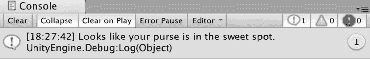

    图 4.1：显示调试输出的控制台截图

在自己尝试了`CurrentGold`的其他值之后，让我们讨论如果我们想测试一个失败的条件会发生什么。

### 使用 NOT 运算符

并非所有用例都需要检查正的或`true`条件，这就是`NOT`运算符发挥作用的地方。用单个感叹号表示的`NOT`运算符允许`if`或`else-if`语句满足负的或`false`条件。这意味着以下条件是相同的：

```cs
if(variable == false)
// AND
if(!variable) 
```

如你所知，你可以在`if`条件中检查布尔值、字面值或表达式。因此，`NOT`运算符必须具有适应性。

看看以下示例，其中在`if`语句中使用了两个不同的负值，`hasDungeonKey`和`weaponType`：

```cs
public class LearningCurve : MonoBehaviour
{
    public bool hasDungeonKey = false;
    public string weaponType = "Arcane Staff";
    void Start()
    {
        if(!hasDungeonKey)
        {
            Debug.Log("You may not enter without the sacred key.");
        }
        if(weaponType != "Longsword")
{
            Debug.Log("You don't appear to have the right type of weapon...");
}
    }
} 
```

我们可以这样评估每个语句：

+   第一个语句可以翻译为：“如果`hasDungeonKey`为`false`，则`if`语句评估为真并执行其代码块。”

    如果你自己在想一个假值如何评估为真，可以这样想：`if`语句不是检查值是否为真，而是检查表达式本身是否为真。`hasDungeonKey`可能被设置为`false`，但这是我们正在检查的，所以在`if`条件的上下文中它是真的。

+   第二个语句可以翻译为：“如果`weaponType`的字符串值不等于`Longsword`，则执行此代码块。”

你可以在下面的屏幕截图中查看调试结果：

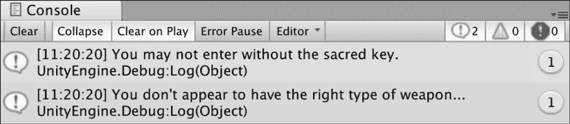

图 4.2：显示`NOT`运算符输出的控制台屏幕截图

然而，如果你仍然感到困惑，请将本节中我们查看的代码复制到`LearningCurve`中，并尝试调整变量值，直到它变得有意义。

到目前为止，我们的分支条件相当简单，但 C#也允许在更复杂的情况下将条件语句嵌套在彼此内部。

### 嵌套语句

`if-else`语句最有价值的函数之一是它们可以嵌套在彼此内部，通过你的代码创建复杂的逻辑路径。在编程中，我们称之为决策树。就像现实中的走廊一样，门后面可能有门，从而创造出一个可能性迷宫：

```cs
public class LearningCurve : MonoBehaviour 
{
    public bool weaponEquipped = true;
    public string weaponType = "Longsword";
    void Start()
    {
        if(weaponEquipped)
        {
            if(weaponType == "Longsword")
            {
                Debug.Log("For the Queen!");
            }
        }
        else 
        {
            Debug.Log("Fists aren't going to work against armor...");
        }
    }
} 
```

让我们分析前面的示例：

+   首先，一个`if`语句检查我们是否有`weaponEquipped`。在这个时候，代码只关心它是否为`true`，而不是它是什么类型的武器。

+   第二个`if`语句检查`weaponType`并打印出相关的调试日志。

+   如果第一个`if`语句评估为`false`，代码将跳转到`else`语句及其调试日志。如果第二个`if`语句评估为`false`，则不会打印任何内容，因为没有`else`语句。

处理逻辑结果的责任完全在程序员身上。取决于你确定代码可能采取的可能分支或结果。

你到目前为止学到的知识将帮助你处理没有问题的简单用例。然而，你很快就会发现自己需要更复杂的语句，这就是评估多个条件发挥作用的地方。

### 评估多个条件

除了嵌套语句外，还可以使用 `AND` 和 `OR` 逻辑运算符将多个条件检查组合成一个单独的 `if` 或 `else-if` 语句：

+   `AND` 使用两个和号字符 `&&` 表示。任何使用 `AND` 运算符的条件都意味着所有条件都需要评估为真，`if` 语句才能执行。

+   `OR` 使用两个管道字符 `||` 表示。使用 `OR` 运算符的 `if` 语句将在其中一个或多个条件为真时执行。

+   条件总是从左到右进行评估。

在以下示例中，`if` 语句已被更新，以检查 `weaponEquipped` 和 `weaponType`，这两个条件都必须为真，代码块才能执行：

```cs
if(weaponEquipped && weaponType == "Longsword")
{
    Debug.Log("For the Queen!");
} 
```

`AND` 和 `OR` 运算符可以组合起来以任意顺序检查多个条件。你还可以组合任意数量的运算符。但请注意，在使用它们时，不要创建永远不会执行的逻辑条件。

现在是时候测试我们到目前为止关于 `if` 语句所学的所有内容了。所以，如果你需要的话，回顾这一节，然后继续下一节。

让我们通过一个小宝箱实验来巩固这个主题：

1.  在 `LearningCurve` 的顶部声明三个变量：`PureOfHeart` 是一个 `bool`，应该是 `true`，`HasSecretIncantation` 也是一个 `bool`，应该是 `false`，而 `RareItem` 是一个字符串，其值由你决定：

    ```cs
    public bool PureOfHeart = true;
    public bool HasSecretIncantation = false;
    public string RareItem = "Relic Stone"; 
    ```

1.  创建一个没有返回值的 `public` 方法，命名为 `OpenTreasureChamber`，并在 `Start()` 内部调用它。

1.  在 `OpenTreasureChamber` 内部声明一个 `if-else` 语句，检查 `PureOfHeart` 是否为 `true` 并且 `RareItem` 是否与分配给它的字符串值匹配：

    ```cs
    if(PureOfHeart && RareItem == "Relic Stone")
    {
    } 
    ```

1.  在第一个 `if-else` 语句内部创建一个嵌套的 `if-else` 语句，检查 `HasSecretIncantation` 是否为 `false`：

    ```cs
    if(!HasSecretIncantation)
    {
        Debug.Log("You have the spirit, but not the knowledge.");
    } 
    ```

1.  为每个 `if-else` 情况添加调试日志。

1.  保存，检查你的代码是否与下面的代码匹配，然后点击播放：

    ```cs
    public class LearningCurve : MonoBehaviour
    {
        public bool PureOfHeart = true;
        public bool HasSecretIncantation  = false;
        public string RareItem = "Relic Stone";
        // Use this for initialization
        void Start()
        {
            OpenTreasureChamber();
        }
        public void OpenTreasureChamber()
        {
            if(PureOfHeart && RareItem == "Relic Stone")
            {
                if(!HasSecretIncantation)
                {
                    Debug.Log("You have the spirit, but not the knowledge.");
                }
                else
                {
                    Debug.Log("The treasure is yours, worthy hero!");
                }
            }
            else
            {
                Debug.Log("Come back when you have what it takes.");
            }
        }
    } 
    ```

如果你将变量值与前面的截图匹配，嵌套的 `if` 语句调试日志将被打印出来。这意味着我们的代码通过了检查两个条件的第一个 `if` 语句，但未能通过第三个：

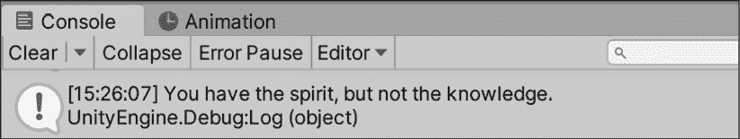

图 4.3：控制台首次输出截图

现在，你可以在所有条件需求上使用更大的 `if-else` 语句，但这从长远来看效率不高。好的编程是关于使用正确的工具来做正确的事情，这就是 `switch` 语句的作用所在。

## `switch` 语句

`if-else` 语句是编写决策逻辑的好方法。然而，当你有超过三个或四个分支操作时，它们就不再可行了。很快，你的代码可能会变得像一团乱麻，难以跟踪，更新起来也头疼。

`switch` 语句接受表达式，并允许我们为每个可能的输出编写操作，但格式比 `if-else` 更简洁。

`switch` 语句需要以下元素：

+   `switch` 关键字后跟一对括号，括号内包含其条件

+   一对大括号

+   为每个可能的以冒号结尾的路径创建一个 `case` 语句：单独的代码行或方法，后面跟着 `break` 关键字和分号

+   以冒号结尾的默认 `case` 语句：单独的代码行或方法，后面跟着 `break` 关键字和分号

在蓝图形式中，它看起来像这样：

```cs
switch(matchExpression)
{
    **case** matchValue1:
        Executing code block
        **break****;**
    **case** matchValue2:
        Executing code block
        **break****;**
    **default****:**
        Executing code block
        **break****;**
} 
```

在前面的蓝图中突出显示的关键字是重要的部分。当定义 `case` 语句时，其冒号和 `break` 关键字之间的任何内容都像 `if-else` 语句的代码块。`break` 关键字只是告诉程序在选定的 `case` 执行后完全退出 `switch` 语句。现在，让我们讨论语句如何确定要执行哪个 `case`，这被称为模式匹配。

### 模式匹配

在 `switch` 语句中，模式匹配指的是如何将匹配表达式与多个 `case` 语句进行验证。匹配表达式可以是任何非空或无类型的类型；所有 `case` 语句的值都需要与匹配表达式的类型匹配。

例如，如果我们有一个评估整数变量的 `switch` 语句，每个 `case` 语句都需要指定一个整数值来检查。

与表达式匹配的 `case` 语句是执行的那个。如果没有 `case` 匹配，则触发默认 `case`。让我们亲自试试看！

这有很多新的语法和信息，但看到它在实际中的应用会很有帮助。让我们创建一个简单的 `switch` 语句，用于不同角色可能采取的操作：

1.  创建一个新的字符串变量（成员或局部变量），命名为 `CharacterAction`，并将其设置为 `Attack:`

    ```cs
    string CharacterAction = "Attack"; 
    ```

1.  创建一个没有返回值的 `public` 方法，命名为 `PrintCharacterAction`，并在 `Start` 中调用它。

1.  声明一个 `switch` 语句，并使用 `CharacterAction` 作为匹配表达式：

    ```cs
    switch(CharacterAction)
    {
    } 
    ```

1.  为 `Heal` 和 `Attack` 创建两个 `case` 语句，并包含不同的调试日志。别忘了在每个语句的末尾包含 `break` 关键字：

    ```cs
    case "Heal":
        Debug.Log("Potion sent.");
        break;
    case "Attack":
        Debug.Log("To arms!");
        break; 
    ```

1.  添加一个带有调试日志和 `break:` 的默认情况

    ```cs
    default:
        Debug.Log("Shields up.");
        break; 
    ```

1.  保存文件，确保您的代码与下面的截图匹配，然后点击播放：

    ```cs
    string CharacterAction = "Attack";
    // Start is called before the first frame update
    void Start()
    {
        PrintCharacterAction();
    }
    public void PrintCharacterAction()
    {
        switch(CharacterAction)
        {
            case "Heal":
                Debug.Log("Potion sent.");
                break;
            case "Attack":
                Debug.Log("To arms!");
                break;
            default:
                Debug.Log("Shields up.");
                break;
        }
    } 
    ```

由于 `CharacterAction` 被设置为 `Attack`，`switch` 语句执行第二个 `case` 并打印出其调试日志：

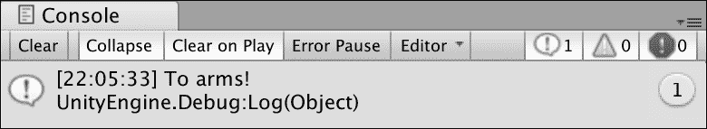

图 4.4：控制台中的 `switch` 语句输出截图

将 `CharacterAction` 更改为 `Heal` 或未定义的操作，以查看第一个和默认情况的实际操作。

有时会需要几个，但不是所有的 `switch` 情况来执行相同的操作。这些被称为穿透情况，是我们下一节的主题。

### 穿透情况

`switch` 语句可以为多个情况执行相同的操作，类似于我们在单个 `if` 语句中指定多个条件的方式。这种情况下称为跳过（fall-through）或有时称为跳过情况。跳过情况允许你为多个情况定义一组单独的操作。如果一个情况块被留空或者包含没有 `break` 关键字的代码，它将跳转到直接位于其下的情况。这有助于保持你的 switch 代码干净且高效，避免重复的情况块。

情况可以按任何顺序编写，因此创建跳过情况大大增加了代码的可读性和效率。

让我们通过 `switch` 语句和跳过情况模拟一个桌面游戏场景，掷骰子的结果将决定特定动作的结果：

1.  创建一个名为 `DiceRoll` 的 `int` 变量，并给它赋值为 `7`：

    ```cs
    int DiceRoll = 7; 
    ```

1.  创建一个没有返回值的 `public` 方法，命名为 `RollDice`，并在 `Start` 中调用它。

1.  添加一个以 `DiceRoll` 作为匹配表达式的 `switch` 语句：

    ```cs
    switch(DiceRoll)
    {
    } 
    ```

1.  为可能的骰子点数 `7`、`15` 和 `20` 添加三个情况，并在最后添加一个默认 `case` 语句。

1.  情况 `15` 和 `20` 应该有自己的调试日志和 `break` 语句，而情况 `7` 应该跳转到情况 `15`：

    ```cs
    case 7:
    case 15:
        Debug.Log("Mediocre damage, not bad.");
        break;
    case 20:
        Debug.Log("Critical hit, the creature goes down!");
        break;
    default:
        Debug.Log("You completely missed and fell on your face.");
        break; 
    ```

1.  保存文件并在 Unity 中运行它。

    如果你想看到跳过情况的实际应用，尝试在情况 7 中添加一个调试日志，但不要使用 `break` 关键字。

当 `DiceRoll` 设置为 `7` 时，`switch` 语句将与第一个 `case` 匹配，然后跳过并执行 `case 15`，因为它没有代码块和 `break` 语句。如果你将 `DiceRoll` 改为 `15` 或 `20`，控制台将显示它们各自的消息，任何其他值将触发语句末尾的默认情况：

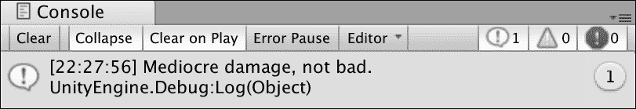

图 4.5：跳过 switch 语句代码的截图

`switch` 语句非常强大，甚至可以简化最复杂的决策逻辑。如果你想深入了解 switch 模式匹配，请参阅 [`docs.microsoft.com/en-us/dotnet/csharp/language-reference/keywords/switch`](https://docs.microsoft.com/en-us/dotnet/csharp/language-reference/keywords/switch)。

目前我们只需要了解这些关于条件逻辑的知识。所以，如果你需要，请复习这一节，然后在继续学习集合之前，先在下面的测验中测试一下自己！

## 突击测验 1 – 如果，和，或但是

用以下问题测试你的知识：

1.  用来评估 `if` 语句的值是什么？

1.  哪个运算符可以将真条件转换为假或假条件转换为真？

1.  如果需要两个条件都为真才能执行 `if` 语句的代码，你会使用哪个逻辑运算符来连接条件？

1.  如果只需要两个条件中的一个为真来执行 `if` 语句的代码，你会使用哪个逻辑运算符来连接这两个条件？

完成这些后，你就可以进入集合数据类型的世界了。这些类型将为你的游戏和 C#程序打开全新的编程功能子集！

# 一眼就能看到收藏夹

到目前为止，我们只需要变量来存储单个值，但有许多情况下需要一组值。C#中的集合类型包括数组、字典和列表——每个都有其优势和劣势，我们将在接下来的章节中讨论。

## 数组

**数组**是 C#提供的最基本的数据集合。把它们想象成一组值的容器，在编程术语中称为*元素*，每个元素都可以单独访问或修改：

+   数组可以存储任何类型的值；所有元素都需要是同一类型。

+   数组的长度，或数组可以拥有的元素数量，在创建时设置，之后不能修改。

+   如果在创建时没有分配初始值，每个元素都将被赋予一个默认值。存储数字类型的数组默认为零，而任何其他类型都被设置为 null 或无。

数组是 C#中最不灵活的数据集合类型。这主要是因为一旦创建元素后，就不能再添加或删除。然而，当存储不太可能改变的信息时，它们特别有用。这种缺乏灵活性使它们比其他数据集合类型更快。

声明数组与其他我们使用过的变量类型类似，但有一些修改：

+   数组变量需要一个指定的元素类型、一对方括号和一个唯一名称。

+   使用`new`关键字在内存中创建数组，后面跟着值类型和另一对方括号。保留的内存区域正好是你打算存储在新数组中的数据大小。

+   数组将要存储的元素数量放在第二对方括号内。

在蓝图形式上，它看起来是这样的：

```cs
elementType[] name = new elementType[numberOfElements]; 
```

让我们举一个例子，我们需要在我们的游戏中存储前三名高分：

```cs
int[] topPlayerScores = new int[3]; 
```

简而言之，`topPlayerScores`是一个整数数组，将存储三个整数元素。由于我们没有添加任何初始值，`topPlayerScores`中的三个值都是`0`。然而，如果你更改数组大小，原始数组的内容就会丢失，所以请小心。

当创建数组时，可以直接在变量声明末尾的一对方括号内添加值来赋值给数组。C#有长格式和短格式的方式来完成这个操作，但两者都是有效的：

```cs
// Longhand initializer
int[] topPlayerScores = new int[] {713, 549, 984};
// Shortcut initializer
int[] topPlayerScores = { 713, 549, 984 }; 
```

使用简写语法初始化数组非常常见，所以本书的其余部分我将使用它。然而，如果你想提醒自己细节，请随时使用明确的措辞。

现在声明语法不再是谜，让我们谈谈数组元素是如何存储和访问的。

### 索引和下标

每个数组元素都是按照其分配的顺序存储的，这被称为其索引。数组是零索引的，这意味着元素顺序从零开始而不是一。将元素的索引视为其引用或位置。

在`topPlayerScores`中，第一个整数`452`位于索引`0`，`713`位于索引`1`，`984`位于索引`2`：


图 4.6：数组索引映射到其值

使用下标运算符可以通过索引定位单个值，它是一对包含元素索引的方括号。例如，要检索并存储`topPlayerScores`中的第二个数组元素，我们会使用数组名称后跟下标括号和索引`1`：

```cs
// The value of score is set to 713
int score = topPlayerScores[1]; 
```

下标运算符也可以用来直接修改数组值，就像任何其他变量一样，或者甚至可以作为一个表达式本身传递：

```cs
topPlayerScores[1] = 1001; 
```

`topPlayerScores`中的值将是`452`、`1001`和`984`。

### 范围异常

当创建数组时，元素的数目是固定的，不可更改，这意味着我们无法访问不存在的元素。在`topPlayerScores`的例子中，数组长度是 3，因此有效索引的范围是从`0`到`2`。任何大于`3`的索引都超出了数组的范围，将在控制台中生成一个名为`IndexOutOfRangeException`的错误：

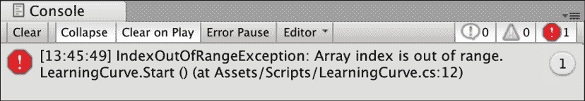

图 4.7：索引越界异常的截图

良好的编程习惯要求我们通过检查我们想要的值是否在数组索引范围内来避免范围异常，我们将在*迭代语句*部分进行介绍。

你可以使用`Length`属性始终检查数组的长度，即它包含多少项：

```cs
topPlayerScores.Length; 
```

在我们的例子中，`topPlayerScores`的长度是 4。

数组并不是 C#所能提供的唯一集合类型。在下一节中，我们将处理列表，它们更加灵活，在编程领域中更为常见。

## 列表

**列表**与数组密切相关，在单个变量中收集相同类型的多个值。在添加、删除和更新元素时，它们处理起来更容易，但它们的元素不是按顺序存储的。它们也是可变的，这意味着你可以更改存储的长度或项目数量，而无需覆盖整个变量。这有时可能会导致比数组更高的性能成本。

性能成本指的是给定操作占用计算机时间和能量的多少。如今，计算机速度很快，但它们仍然可能因为大型游戏或应用程序而超载。

列表类型的变量需要满足以下要求：

+   `List`关键字，其元素类型在左右箭头字符之间，以及一个独特的名称

+   使用`new`关键字、`List`关键字和元素类型在箭头字符之间初始化列表

+   一对括号，以分号结尾

以蓝图形式，它读作如下：

```cs
List<elementType> name = new List<elementType>(); 
```

列表长度总是可以修改的，因此创建时不需要指定它最终将包含多少元素。

与数组一样，列表可以在变量声明时通过在花括号内添加元素值来初始化：

```cs
List<elementType> name = new List<elementType>() { value1, value2 }; 
```

元素按添加的顺序存储（而不是值的顺序），是零索引的，并且可以使用下标操作符访问。

让我们开始设置自己的列表以测试这个类提供的基本功能。

让我们通过创建一个虚构角色扮演游戏中的角色列表来进行一次热身练习：

1.  在 `Start` 中创建一个新的 `string` 类型的 `List`，名为 `QuestPartyMembers`，并用三个角色的名字初始化它：

    ```cs
    List<string> QuestPartyMembers = new List<string>()
        {
            "Grim the Barbarian",
            "Merlin the Wise",
            "Sterling the Knight"
        }; 
    ```

1.  添加一个调试日志，使用 `Count` 方法打印出列表中的人数：

    ```cs
    Debug.LogFormat("Party Members: {0}", QuestPartyMembers.Count); 
    ```

1.  保存文件并在 Unity 中播放。

我们初始化了一个新的列表，名为 `QuestPartyMembers`，现在它包含三个字符串值，并使用 `List` 类的 `Count` 方法打印出元素的数量。请注意，对于列表，您使用 `Count`，但对于数组，您使用 `Length`。

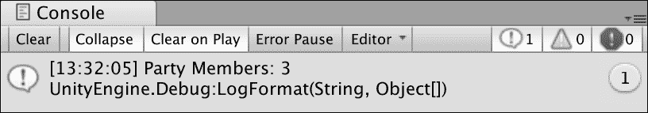

图 4.8：控制台中的列表项输出截图

知道列表中有多少元素非常有用；然而，在大多数情况下，这些信息并不足够。我们希望能够根据需要修改我们的列表，我们将在下一节讨论。

### 访问和修改列表

列表元素可以通过下标操作符和索引像数组一样访问和修改，只要索引在 `List` 类的范围内。然而，`List` 类有许多扩展其功能的方法，例如添加、插入和删除元素。

让我们继续使用 `QuestPartyMembers` 列表，向团队添加一个新成员：

```cs
 QuestPartyMembers.Add("Craven the Necromancer"); 
```

`Add()` 方法将新元素追加到列表的末尾，这使得 `QuestPartyMembers` 的计数达到四个，元素顺序如下：

```cs
{ "Grim the Barbarian", "Merlin the Wise", "Sterling the Knight",
    "Craven the Necromancer"}; 
```

要在列表的特定位置添加一个元素，我们可以传递索引和要添加的值给 `Insert()` 方法：

```cs
 QuestPartyMembers.Insert(1, "Tanis the Thief"); 
```

当元素插入到之前已占用的索引时，列表中的所有元素的索引都会增加 `1`。在我们的例子中，`"Tanis the Thief"` 现在位于索引 `1`，这意味着 `"Merlin the Wise"` 现在位于索引 `2` 而不是 `1`，依此类推：

```cs
{ "Grim the Barbarian", "Tanis the Thief", "Merlin the Wise", "Sterling
    the Knight", "Craven the Necromancer"}; 
```

删除元素同样简单；我们只需要索引或要删除的值，`List` 类就会完成工作：

```cs
// Both of these methods would remove the required element
QuestPartyMembers.RemoveAt(0); 
QuestPartyMembers.Remove("Grim the Barbarian"); 
```

在我们的编辑结束时，`QuestPartyMembers` 现在包含以下元素，索引从 `0` 到 `3`：

```cs
{ "Tanis the Thief", "Merlin the Wise", "Sterling the Knight", "Craven
    the Necromancer"}; 
```

`List` 类有许多其他方法，允许进行值检查、查找和排序元素，以及与范围一起工作。完整的方 法列表和描述可以在此处找到：[`docs.microsoft.com/en-us/dotnet/api/system.collections.generic.list-1?view=netframework-4.7.2`](https://docs.microsoft.com/en-us/dotnet/api/system.collections.generic.list-1?view=netframework-4.7.2)。

当列表非常适合单个值元素时，有些情况下你需要存储包含多个值的信息或数据。这就是字典发挥作用的地方。

## 字典

**Dictionary**类型通过在每个元素中存储值对，而不是单个值，与数组和列表不同。这些元素被称为键值对：键作为其对应值的索引或查找值。与数组和列表不同，字典是无序的。然而，在创建后，它们可以根据各种配置进行排序和排序。

声明字典几乎与声明列表相同，但有一个额外的细节——键和值类型都需要在箭头符号内指定：

```cs
Dictionary<keyType, valueType> name = new Dictionary<keyType,
  valueType>(); 
```

要使用键值对初始化字典，请执行以下操作：

+   在声明末尾使用一对花括号。

+   在其成对的圆括号内添加每个元素，键和值之间用逗号分隔。

+   用逗号分隔元素，除了最后一个元素，那里的逗号是可选的。

它看起来是这样的：

```cs
Dictionary<keyType, valueType> name = new Dictionary<keyType,
  valueType>()
{
    {key1, value1},
    {key2, value2}
}; 
```

在选择键值时，一个重要的注意事项是每个键必须是唯一的，并且不能更改。如果你需要更新一个键，那么你需要更改变量声明中的其值，或者删除整个键值对并在代码中添加另一个，我们将在下一部分讨论。

就像数组和列表一样，字典可以在单行中初始化，而不会从 Visual Studio 中产生任何问题。然而，像前面示例中那样，将每个键值对写在单独的一行上，是一个好习惯——既有利于可读性，也有利于你的精神健康。

让我们创建一个字典来存储一个角色可能携带的物品：

1.  在`Start`方法中声明一个名为`ItemInventory`的`Dictionary`，其`key`类型为`string`，`value`类型为`int`。

1.  初始化它为`new Dictionary<string, int>()`，并添加三个你选择的键值对。确保每个元素都在其成对的花括号内：

    ```cs
    Dictionary<string, int> `I`temInventory = new Dictionary<string, int>()
        {
            { "Potion", 5 },
            { "Antidote", 7 },
            { "Aspirin", 1 }
        }; 
    ```

1.  添加一个调试日志来打印出`ItemInventory.Count`属性，这样我们就可以看到物品是如何存储的：

    ```cs
    Debug.LogFormat("Items: {0}", `I`temInventory.Count); 
    ```

1.  保存文件并播放。

在这里，创建了一个名为`ItemInventory`的新字典，并初始化了三个键值对。我们指定键为字符串，相应的值为整数，并打印出`ItemInventory`当前包含的元素数量：

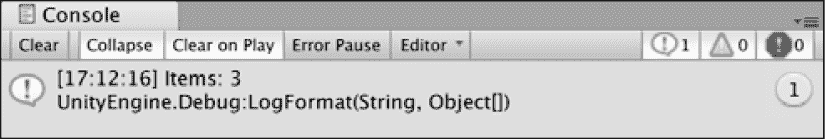

图 4.9：控制台中的字典计数截图

就像列表一样，我们需要能够做更多的事情，而不仅仅是打印出给定字典中键值对的数量。在下一节中，我们将探讨添加、删除和更新这些值。

### 处理字典对

可以使用索引操作符和类方法从字典中添加、删除和访问键值对。要检索元素的值，请使用元素的键作为索引操作符——在以下示例中，`numberOfPotions`将被分配一个值为`5`：

```cs
int numberOfPotions = `I`temInventory["Potion"]; 
```

一个元素的值可以使用相同的方法进行更新——与 `"Potion"` 关联的值现在将是 `10`：

```cs
`I`temInventory["Potion"] = 10; 
```

可以通过两种方式向字典中添加元素：使用 `Add` 方法和使用下标运算符。`Add` 方法接受一个键和一个值，并创建一个新的键值元素，只要它们的类型与字典声明相匹配：

```cs
`I`temInventory.Add("Throwing Knife", 3); 
```

如果使用下标运算符将值分配给字典中不存在的键，编译器将自动将其添加为新键值对。例如，如果我们想为 `"Bandage"` 添加一个新元素，我们可以使用以下代码：

```cs
`I`temInventory["Bandage"] = 5; 
```

这提出了关于引用键值对的一个关键点：在尝试访问它之前，最好确定元素是否存在，以避免错误地添加新的键值对。将 `ContainsKey` 方法与 `if` 语句配对是简单解决方案，因为 `ContainsKey` 根据键是否存在返回一个布尔值。在以下示例中，我们使用 `if` 语句确保 `"Aspirin"` 键存在，然后再修改其值：

```cs
if(`I`temInventory.ContainsKey("Aspirin"))
{
    `I`temInventory["Aspirin"] = 3;
} 
```

最后，可以使用 `Remove()` 方法从字典中删除键值对，该方法接受一个键参数：

```cs
`I`temInventory.Remove("Antidote"); 
```

与列表一样，字典提供了各种方法和功能来简化开发，但我们不能在这里涵盖所有内容。如果你好奇，官方文档可以在 [`docs.microsoft.com/en-us/dotnet/api/system.collections.generic.dictionary-2?view=netframework-4.7.2`](https://docs.microsoft.com/en-us/dotnet/api/system.collections.generic.dictionary-2?view=netframework-4.7.2) 找到。

集合已经安全地进入我们的工具箱，所以现在是时候进行另一个测验，以确保你准备好进入下一个重要主题：迭代语句。

## 突击测验 2 – 全部关于集合

+   数组或列表中的元素是什么？

+   数组或列表中第一个元素的索引号是多少？

+   单个数组或列表能否存储不同类型的数据？

+   你如何向数组中添加更多元素以腾出更多空间？

由于集合是项的组或列表，它们需要以高效的方式访问。幸运的是，C# 有几个迭代语句，我们将在下一节中讨论。

# 迭代语句

我们已经通过下标运算符访问了单个集合元素，以及集合类型方法，但当我们需要逐个遍历整个集合元素时，我们该怎么办？在编程中，这被称为迭代，C# 提供了多种语句类型，允许我们遍历（或者如果你想更技术性地表达，就是迭代）集合元素。迭代语句就像方法一样，因为它们存储要执行的代码块；与方法不同的是，只要条件满足，它们可以重复执行它们的代码块。

## for 循环

当需要执行一定次数的代码块后程序继续时，`for` 循环是最常用的。该语句本身接受三个表达式，每个表达式在循环执行前都有特定的功能。由于 `for` 循环跟踪当前迭代，因此它们最适合数组列表。

看看以下循环语句蓝图：

```cs
for (initializer; condition; iterator)
{
    code block;
} 
```

让我们分解一下：

1.  `for` 关键字开始语句，后面跟着一对括号。

1.  在括号内是守门人：`initializer`、`condition` 和 `iterator` 表达式。

1.  循环从 `initializer` 表达式开始，这是一个局部变量，用于跟踪循环已执行了多少次——这通常设置为 0，因为集合类型是零索引的。

1.  接下来，检查 `condition` 表达式，如果为真，则继续到 `iterator`。

1.  `iterator` 表达式用于增加或减少（递增或递减）初始化器，这意味着下一次循环评估其条件时，初始化器将不同。

通过 1 增加或减少一个值称为递增和递减，分别（`--` 会减少一个值 1，而 `++` 会增加它 1）。

这听起来好像很多，那么让我们看看一个使用我们之前创建的 `QuestPartyMembers` 列表的实际例子：

```cs
List<string> QuestPartyMembers = new List<string>()
{ "Grim the Barbarian", "Merlin the Wise", "Sterling the Knight"}; 
for (int i = 0; i < QuestPartyMembers.Count; i++)
{
    Debug.LogFormat("Index: {0} - {1}", i, QuestPartyMembers[i]);
} 
```

让我们再次遍历循环，看看它是如何工作的：

1.  首先，`for` 循环中的 `initializer` 被设置为名为 `i` 的局部 `int` 变量，起始值为 `0`。

1.  为了确保我们永远不会得到越界异常，`for` 循环确保只有在 `i` 小于 `QuestPartyMembers` 中元素的数量时才会再次运行循环：

    +   对于数组，我们使用 `Length` 属性来确定它有多少项。

    +   对于列表，我们使用 `Count` 属性

1.  最后，每次循环运行时，`i` 都会通过 `++` 运算符增加 1。

1.  在 `for` 循环内部，我们刚刚使用 `i` 打印出了索引和该索引处的列表元素。

1.  注意，`i` 与集合元素的索引保持一致，因为它们都是从 0 开始的：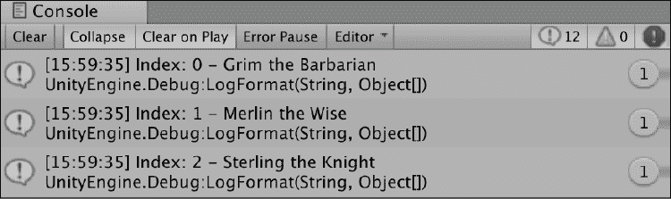

图 4.10：使用 `for` 循环打印出的列表值的截图

传统上，字母 `i` 通常用作初始化变量名。如果你恰好有嵌套的 `for` 循环，所使用的变量名应该是字母 j、k、l 等等。

让我们在我们现有的集合之一上尝试我们的新迭代语句。

当我们遍历 `QuestPartyMembers` 时，让我们看看我们是否可以识别出某个元素被迭代的情况，并为这种情况添加一个特殊的调试日志：

1.  将 `QuestPartyMembers` 列表和 `for` 循环移动到名为 `FindPartyMember` 的公共函数中，并在 `Start` 中调用它。

1.  在 `for` 循环中在调试日志下方添加一个 `if` 语句，以检查当前的 `questPartyMember` 列表是否匹配 `"Merlin the Wise"`：

    ```cs
    if(QuestPartyMembers[i] == "Merlin the Wise")
    {
        Debug.Log("Glad you're here Merlin!");
    } 
    ```

1.  如果是这样，添加一个你选择的调试日志，检查你的代码是否与下面的截图匹配，然后点击播放：

    ```cs
    // Start is called before the first frame update
    void Start()
    {
        FindPartyMember();
    }
    public void FindPartyMember()
    {
        List<string> QuestPartyMembers = new List<string>()
        {
            "Grim the Barbarian",
            "Merlin the Wise",
            "Sterling the Knight"
        };
        Debug.LogFormat("Party Members: {0}", QuestPartyMembers.Count);
        for(int i = 0; i < QuestPartyMembers.Count; i++)
        {
            Debug.LogFormat("Index: {0} - {1}", i, QuestPartyMembers[i]);
            if(QuestPartyMembers[i] == "Merlin the Wise")
            {
                Debug.Log("Glad you're here Merlin!");
            }
        }
    } 
    ```

控制台输出应该看起来几乎一样，但现在有一个额外的调试日志——当轮到梅林进入循环时只打印了一次。更具体地说，当第二次循环中的 `i` 等于 `1` 时，`if` 语句被触发，打印了两个日志而不是一个：

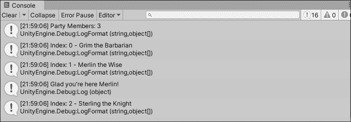

图 4.11：for 循环打印列表值和匹配 if 语句的截图

在正确的情况下，使用标准的 `for` 循环非常有用，但在编程中，事情往往没有唯一的方法，这就是 `foreach` 语句发挥作用的地方。

## foreach 循环

`foreach` 循环将集合中的每个元素取出来，并将每个元素存储在一个局部变量中，使其在语句内部可访问。局部变量类型必须与集合元素类型匹配才能正常工作。`foreach` 循环可以与数组列表一起使用，但它们在字典中特别有用，因为字典是键值对而不是数字索引。

在蓝图形式中，`foreach` 循环看起来是这样的：

```cs
foreach(elementType localName in collectionVariable)
{
    code block;
} 
```

让我们继续使用 `Q``uestPartyMembers` 列表示例，并对它的每个元素进行点名：

```cs
List<string> QuestPartyMembers = new List<string>()
{ "Grim the Barbarian", "Merlin the Wise", "Sterling the Knight"};

foreach(string partyMember in QuestPartyMembers)
{
    Debug.LogFormat("{0} - Here!", partyMember);
} 
```

我们可以这样分解：

+   元素类型被声明为 `string`，这与 `QuestPartyMembers` 中的值相匹配。

+   创建一个名为 `partyMember` 的局部变量来保存每次循环重复时的每个元素。

+   `in` 关键字，后面跟着我们要遍历的集合，在这个例子中是 `QuestPartyMembers`，完成了操作！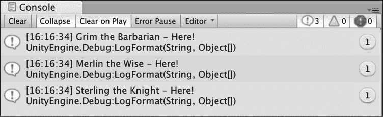


这比 `for` 循环简单得多。然而，当处理字典时，有一些重要的区别我们需要提及——即如何作为局部变量处理键值对。

### 遍历键值对

要在局部变量中捕获键值对，我们需要使用名为 `KeyValuePair` 的类型，将键和值类型分配为与字典的对应类型相匹配。由于 `KeyValuePair` 是其类型，它就像任何其他元素类型一样，作为一个局部变量。

例如，让我们遍历在 *Dictionaries* 部分中创建的 `ItemInventory` 字典，并像商店商品描述一样调试每个键值对：

```cs
Dictionary<string, int> `I`temInventory = new Dictionary<string, int>()
{
    { "Potion", 5},
    { "Antidote", 7},
    { "Aspirin", 1}
};

foreach(KeyValuePair<string, int> kvp in `I`temInventory)
{
     Debug.LogFormat("Item: {0} - {1}g", kvp.Key, kvp.Value);
} 
```

我们指定了一个名为 `kvp` 的局部变量，这是编程中的一种常见命名约定，就像将 `for` 循环初始化器命名为 `i`，并将 `key` 和 `value` 类型设置为 `string` 和 `int` 以匹配 `ItemInventory`。

要访问局部变量 `kvp` 的键和值，我们分别使用 `KeyValuePair` 的 `Key` 和 `Value` 属性。

在这个例子中，键是 `string` 类型，值是整数，我们可以将其打印出来作为项目名称和项目价格：

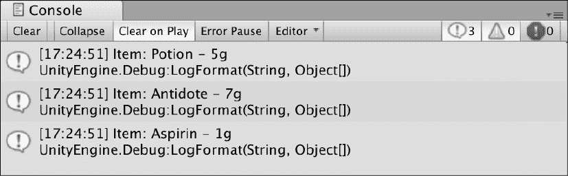

图 4.13：打印字典键值对的 `foreach` 循环截图

如果您特别有冒险精神，请尝试以下可选挑战，以巩固您刚刚学到的知识。

#### 英雄的考验 – 寻找负担得起的物品

使用前面的脚本，创建一个变量来存储您虚构角色拥有的金币数量，并尝试在 `foreach` 循环中添加一个 `if` 语句来检查您能否负担得起这些物品。

提示：使用 `kvp.Value` 来比较价格与您钱包中的金额。

## `while` 循环

`while` 循环与 `if` 语句类似，只要单个表达式或条件为真就会运行。

值比较和布尔变量可以用作 `while` 条件，并且可以使用 `NOT` 运算符进行修改。

`while` 循环的语法表示为：“当我的条件为真时，无限期地运行我的代码块”：

```cs
Initializer
while (condition)
{
    code block;
    iterator;
} 
```

在 `while` 循环中，通常像 `for` 循环一样声明一个初始化变量，并在循环代码块的末尾手动增加或减少它。我们这样做是为了避免无限循环，我们将在本章末尾讨论这个问题。根据您的具体情况，初始化器通常是循环条件的一部分。

`while` 循环在 C# 编程中非常有用，但在 Unity 中并不被认为是良好的实践，因为它们可能会对性能产生负面影响，并且通常需要手动管理。

让我们考虑一个常见的用例，其中我们需要在玩家存活时执行代码，然后在该情况不再成立时进行调试：

1.  创建一个名为 `PlayerLives` 的初始化变量，其类型为 `int`，并将其设置为 `3`：

    ```cs
    int PlayerLives = 3; 
    ```

1.  创建一个新的公共函数 `HealthStatus` 并在 `Start` 中调用它。

1.  声明一个 `while` 循环，其条件检查 `PlayerLives` 是否大于 `0`（即玩家仍然存活）：

    ```cs
    while(PlayerLives > 0)
    {
    } 
    ```

1.  在 `while` 循环内部，进行一些调试以让我们知道角色仍然在战斗，然后使用 `--` 运算符将 `PlayerLives` 减少一：

    ```cs
    Debug.Log("Still alive!");
    PlayerLives--; 
    ```

1.  在 `while` 循环的大括号后添加一个调试日志，以便在生命耗尽时打印一些内容：

    ```cs
    Debug.Log("Player KO'd..."); 
    ```

    您的代码应如下所示：

    ```cs
    int PlayerLives = 3;
    // Start is called before the first frame update
    void Start()
    {
        HealthStatus();
    }
    public void HealthStatus()
    {
        while(PlayerLives > 0)
        {
            Debug.Log("Still alive!");
            PlayerLives--;
        }
        Debug.Log("Player KO'd...");
    } 
    ```

由于 `PlayerLives` 的初始值为 `3`，`while` 循环将执行三次。在每次循环中，调试日志 `"Still alive!"` 被触发，并从 `PlayerLives` 中减去一条生命。当 `while` 循环尝试第四次运行时，由于 `PlayerLives` 为 `0`，条件失败，因此代码块被跳过，并打印出最后的调试日志：

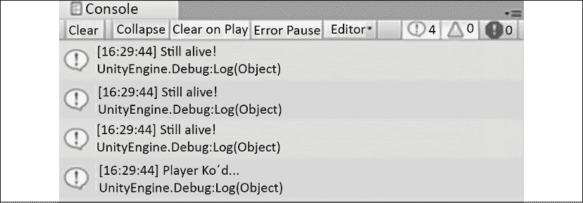

图 4.14：控制台中的 `while` 循环输出截图

如果您没有看到多个 "仍存活！" 调试日志，请确保 **Console** 工具栏中的 **Collapse** 按钮没有被选中。

现在的问题是，如果循环永远不会停止执行会发生什么？我们将在下一节讨论这个问题。

## 到无限远方

在结束本章之前，我们需要理解迭代语句中的一个极其重要的概念：*无限循环*。它们正是其名称所暗示的那样：当循环的条件使得循环无法停止运行并继续程序中的其他部分时。无限循环通常发生在`for`和`while`循环中，当迭代器没有被增加或减少时；如果`while`循环示例中遗漏了`PlayerLives`代码行，Unity 会冻结和/或崩溃，意识到`PlayerLives`始终为 3，并无限期地执行循环。

迭代器并不是唯一需要警惕的罪魁祸首；在`for`循环中设置永远不会失败或评估为假的条件，也可能导致无限循环。在“通过键值对循环”部分提到的党员例子中，如果我们把`for`循环的条件设置为`i < 0`而不是`i < QuestPartyMembers.Count`，`i`将始终小于`0`，循环直到 Unity 崩溃。

# 摘要

随着本章的结束，我们应该反思我们已经取得了多少成就，以及我们可以用这些新知识构建什么。我们知道如何使用简单的`if-else`检查和更复杂的`switch`语句，允许在代码中进行决策。我们可以使用数组、列表或字典来创建存储值集合的变量，或者存储键值对。这允许复杂和分组的数据被有效地存储。我们甚至可以为每种集合类型选择正确的循环语句，同时小心避免无限循环崩溃。

如果你感到压力过大，那完全没问题——逻辑性和顺序性思维都是锻炼编程大脑的一部分。

下一章将通过对类、结构和**面向对象编程**（**OOP**）的探讨来完成 C#编程的基础。我们将把迄今为止学到的所有知识应用到这些主题中，为理解并控制 Unity 引擎中的对象做好第一次真正的准备。

# 加入我们的 Discord！

与其他用户、Unity/C#专家和哈里森·费罗恩一起阅读这本书。提问、为其他读者提供解决方案、通过“问我任何问题”的环节与作者聊天，以及更多。

立即加入！

[`packt.link/csharpunity2021`](https://packt.link/csharpunity2021)


